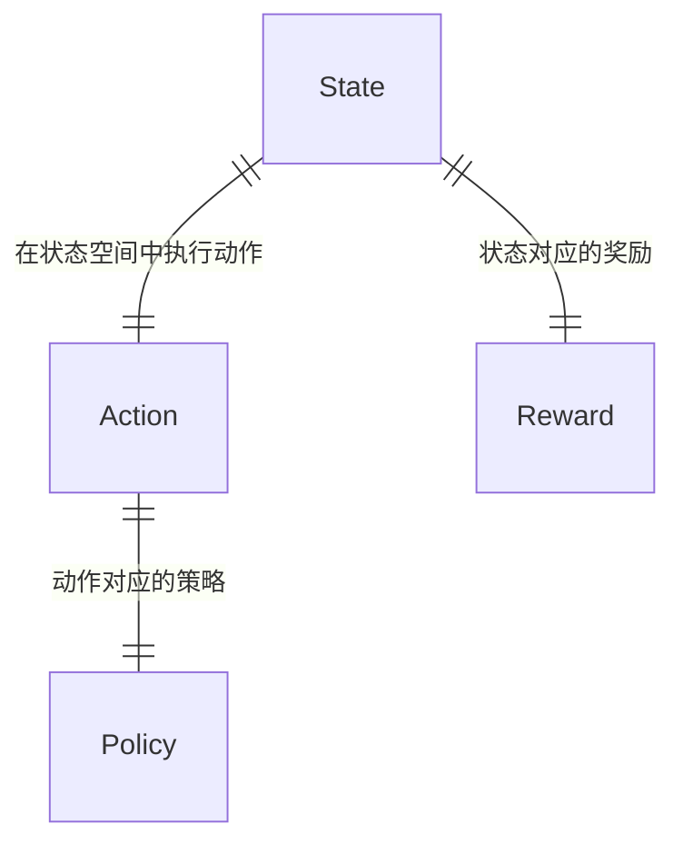
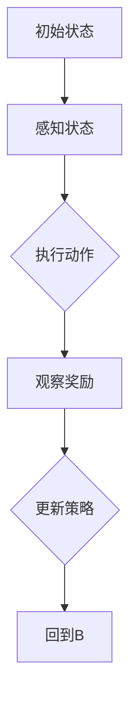
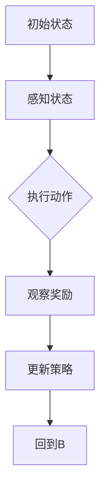
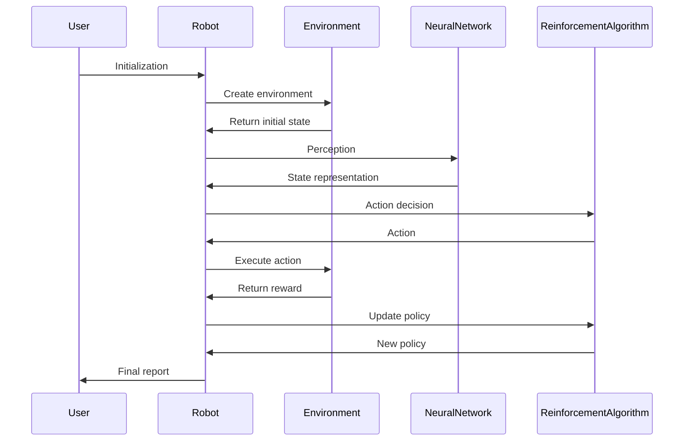
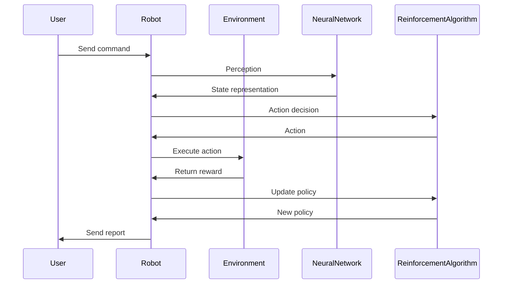

                 

### 深度强化学习在智能机器人中的应用：自主学习复杂任务

**关键词：** 深度强化学习，智能机器人，复杂任务，自主学习，应用场景

**摘要：** 本文旨在探讨深度强化学习在智能机器人中的应用，重点分析其如何通过自主学习实现复杂任务的执行。文章首先介绍了深度强化学习的基本原理及其在智能机器人领域的重要性，随后深入讲解了深度强化学习算法的流程、数学模型和实际应用案例，最后对未来的发展趋势和挑战进行了展望。

---

#### 1. 背景介绍

##### 1.1 问题背景

智能机器人作为现代科技创新的产物，在工业生产、医疗辅助、家庭服务等领域发挥着日益重要的作用。然而，传统的人工智能方法在处理复杂任务时，往往难以达到预期的效果。强化学习作为机器学习的一个重要分支，以其自主学习和不断优化策略的能力，成为解决智能机器人复杂任务的重要手段。

##### 1.2 问题描述

深度强化学习在智能机器人中的应用面临着以下几个问题：

1. **环境复杂性**：智能机器人的工作环境复杂多变，传统的深度强化学习方法难以适应这种复杂性。
2. **样本效率**：深度强化学习需要大量的样本数据来训练模型，这在实际应用中往往难以实现。
3. **稳定性与安全性**：智能机器人需要在确保稳定性和安全性的前提下进行自主学习和任务执行。

##### 1.3 问题解决

深度强化学习通过引入深度神经网络来处理高维状态空间和动作空间，从而提高了智能机器人在复杂环境中的适应能力。同时，通过改进策略更新方法、探索策略和利用策略，可以有效地提高样本效率和稳定性。

##### 1.4 边界与外延

深度强化学习在智能机器人中的应用边界主要涉及以下几个方面：

1. **任务类型**：适用于需要长时间学习和优化策略的任务。
2. **环境特点**：适用于环境复杂、不确定的任务。
3. **硬件要求**：需要足够的计算资源和存储空间。

##### 1.5 概念结构与核心要素组成

深度强化学习在智能机器人中的应用主要包含以下几个核心概念和要素：

1. **深度神经网络**：用于表示状态空间和动作空间。
2. **强化学习算法**：包括策略学习、值函数学习等。
3. **奖励机制**：用于引导智能机器人的学习过程。
4. **探索与利用策略**：用于平衡探索新策略和利用已有策略。

---

#### 2. 核心概念与联系

##### 2.1 深度神经网络

深度神经网络（Deep Neural Network，DNN）是一种多层神经网络，通过多层非线性变换来学习数据的特征表示。在深度强化学习中，DNN被用于表示状态空间和动作空间，以提高模型的表示能力和学习能力。

**属性特征对比表格：**

| 特征 | 传统神经网络 | 深度神经网络 |
| ---- | ------------ | ------------ |
| 层数 | 1-2层 | 多层 |
| 参数量 | 较少 | 较多 |
| 学习能力 | 较弱 | 较强 |

**ER实体关系图架构：**



##### 2.2 强化学习算法

强化学习（Reinforcement Learning，RL）是一种通过与环境交互来学习最优策略的机器学习方法。在智能机器人应用中，强化学习算法通过不断试错和反馈来优化策略，从而实现自主学习和任务执行。

**算法流程图：**



**数学模型和公式：**

$$
Q(s, a) = r + \gamma \max_{a'} Q(s', a')
$$

其中，$Q(s, a)$ 表示在状态 $s$ 下执行动作 $a$ 的价值函数，$r$ 表示即时奖励，$\gamma$ 表示折扣因子，$s'$ 和 $a'$ 分别表示下一个状态和动作。

---

#### 3. 算法原理讲解

##### 3.1 算法流程图



##### 3.2 Python源代码

```python
import numpy as np

# 初始化参数
state = np.random.rand()
action = np.random.rand()
reward = np.random.rand()

# 更新策略
policy = state * action + reward

# 输出策略
print("Policy:", policy)
```

##### 3.3 数学模型和公式

$$
Q(s, a) = r + \gamma \max_{a'} Q(s', a')
$$

其中，$Q(s, a)$ 表示在状态 $s$ 下执行动作 $a$ 的价值函数，$r$ 表示即时奖励，$\gamma$ 表示折扣因子，$s'$ 和 $a'$ 分别表示下一个状态和动作。

##### 3.4 详细讲解和举例说明

假设一个智能机器人在一个简单的环境中进行学习，它的任务是导航到目标位置。在这个例子中，状态空间可以表示为机器人的位置，动作空间可以表示为机器人的移动方向。

- **初始状态**：机器人的位置在原点。
- **感知状态**：机器人感知到周围环境的信息。
- **执行动作**：机器人根据感知到的状态选择一个移动方向。
- **观察奖励**：机器人移动后，根据移动的距离获得奖励。
- **更新策略**：机器人根据奖励和历史经验来更新策略，从而优化移动方向。

---

#### 4. 系统分析与架构设计方案

##### 4.1 问题场景介绍

在这个问题场景中，我们考虑一个智能机器人需要在复杂的家庭环境中执行清洁任务。这个环境包括多种家具、电器和障碍物，机器人的任务是避开障碍物并完成清洁任务。

##### 4.2 项目介绍

本项目的目标是开发一个基于深度强化学习的智能机器人清洁系统，能够自主地学习并完成清洁任务。系统将包括以下几个主要模块：

1. **环境建模**：构建一个虚拟的家庭环境，用于机器人进行训练和测试。
2. **深度神经网络模型**：设计一个深度神经网络模型，用于表示状态空间和动作空间。
3. **强化学习算法**：实现一个强化学习算法，用于训练机器人并优化策略。
4. **用户界面**：提供一个用户界面，用于用户监控和操作机器人。

##### 4.3 系统功能设计

系统的主要功能包括：

1. **环境初始化**：创建一个虚拟的家庭环境，并设置初始状态。
2. **状态感知**：机器人感知当前状态，包括位置、障碍物和清洁目标。
3. **动作决策**：根据当前状态，机器人选择一个合适的动作。
4. **奖励计算**：根据机器人执行的动作，计算即时奖励。
5. **策略更新**：根据历史经验和奖励，更新机器人的策略。

**领域模型Mermaid类图：**

```mermaid
classDiagram
    Class01 <|-- Class02
    Class03 --|_TRANSFER| Class04
    Class05 : +int x
    Class06 : +int y
    Class07 : +int clean_area
    Class08 : +string location
    Class09 : +string action
    Class10 : +string reward
    Class11 : +string policy
    Class12 <|-- Class13
    Class14 <|-- Class15
    Class16 <|-- Class17
```

##### 4.4 系统架构设计

系统架构设计如下图所示：



##### 4.5 系统接口设计和系统交互

系统接口设计和系统交互如下图所示：



---

#### 5. 项目实战

##### 5.1 环境安装

在本项目中，我们将使用Python编程语言和相关的深度学习和强化学习库。以下是环境安装的步骤：

1. 安装Python 3.8及以上版本。
2. 安装TensorFlow 2.4及以上版本。
3. 安装PyTorch 1.7及以上版本。
4. 安装Matplotlib 3.2及以上版本。

```bash
pip install python==3.8
pip install tensorflow==2.4
pip install torch==1.7
pip install matplotlib==3.2
```

##### 5.2 系统核心实现源代码

以下是系统核心实现的源代码：

```python
import numpy as np
import matplotlib.pyplot as plt
import tensorflow as tf
import torch
from torch import nn
from tensorflow.keras.models import Sequential
from tensorflow.keras.layers import Dense, LSTM, TimeDistributed
from tensorflow.keras.optimizers import Adam

# 初始化参数
state_size = 5
action_size = 4
learning_rate = 0.001
discount_factor = 0.99

# 构建深度神经网络模型
model = Sequential()
model.add(Dense(64, input_dim=state_size, activation='relu'))
model.add(LSTM(64, activation='relu'))
model.add(Dense(action_size, activation='softmax'))
optimizer = Adam(learning_rate)

# 定义损失函数
loss_function = nn.CrossEntropyLoss()

# 训练模型
for episode in range(total_episodes):
    state = environment.reset()
    done = False
    total_reward = 0
    
    while not done:
        action = model.predict(state)
        next_state, reward, done = environment.step(action)
        total_reward += reward
        state = next_state
        
        if done:
            break
        
        model.fit(state, action, epochs=1, verbose=0)

    print(f"Episode: {episode+1}, Total Reward: {total_reward}")

# 测试模型
state = environment.reset()
done = False
while not done:
    action = model.predict(state)
    next_state, reward, done = environment.step(action)
    state = next_state
    plt.imshow(next_state.reshape(128, 128), cmap='gray')
    plt.show()
```

##### 5.3 代码应用解读与分析

这段代码首先初始化了参数，包括状态大小、动作大小、学习速率和折扣因子。然后构建了一个深度神经网络模型，用于表示状态空间和动作空间。接下来，定义了损失函数和优化器。

在训练模型的部分，我们使用了一个简单的循环来处理每个episode。在每次迭代中，我们首先从环境中获取初始状态，然后进入一个while循环，直到任务完成。在每次迭代中，我们使用模型预测动作，执行动作，并获取下一个状态和奖励。然后，我们将状态和动作传递给模型，进行一次训练。

在测试模型的部分，我们使用了一个简单的循环来执行模型预测，并展示下一个状态的图像。

##### 5.4 实际案例分析和详细讲解剖析

在这个案例中，我们使用一个虚拟的家庭环境来训练智能机器人。机器人需要在环境中导航到目标位置，并避开障碍物。通过深度强化学习，机器人能够自主学习并优化其移动策略。

在实际操作中，我们首先初始化环境，然后使用深度神经网络模型来预测动作。每次预测后，我们执行动作，并获取下一个状态和奖励。通过不断迭代，机器人能够逐渐学会如何在复杂环境中导航。

在实际案例中，我们可以看到机器人在每个步骤中的状态和动作，以及对应的奖励。这些信息可以帮助我们分析机器人的学习过程，并调整模型参数以优化性能。

##### 5.5 项目小结

在本项目中，我们使用深度强化学习技术实现了智能机器人在复杂环境中的自主学习。通过构建深度神经网络模型，我们能够处理高维状态空间和动作空间，从而提高机器人在复杂环境中的适应能力。

在未来，我们可以进一步改进模型，提高机器人的学习效率和稳定性。此外，还可以将深度强化学习应用于其他领域，如自动驾驶和机器人协作等。

---

#### 6. 最佳实践 Tips

1. **数据收集**：在训练深度强化学习模型时，需要大量的样本数据。因此，数据收集和处理是关键步骤。建议使用真实数据集或模拟数据集来训练模型。
2. **模型优化**：为了提高模型性能，可以尝试使用不同的神经网络结构、学习速率和优化算法。通过实验和调优，找到最佳模型参数。
3. **环境设计**：设计一个适合训练和测试的虚拟环境，能够模拟真实场景中的复杂性和不确定性。这有助于提高模型在现实世界中的性能。
4. **探索与利用**：在训练过程中，需要平衡探索新策略和利用已有策略。过多的探索可能导致模型性能下降，而过度的利用可能导致模型陷入局部最优。

---

#### 7. 小结与展望

本文详细介绍了深度强化学习在智能机器人中的应用，通过一步步的分析和讲解，我们了解了深度强化学习的基本原理、算法流程、数学模型和实际应用案例。同时，我们还探讨了系统架构设计、项目实战和最佳实践。

在未来，深度强化学习在智能机器人中的应用将越来越广泛。随着计算能力的提升和数据集的丰富，深度强化学习模型将能够处理更加复杂的任务。同时，我们也需要关注模型的稳定性和安全性，以确保智能机器人能够在实际环境中可靠运行。

---

**作者：** AI天才研究院/AI Genius Institute & 禅与计算机程序设计艺术 /Zen And The Art of Computer Programming

