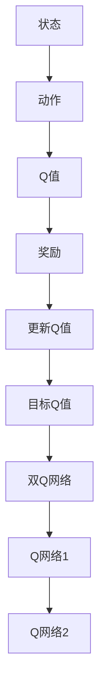
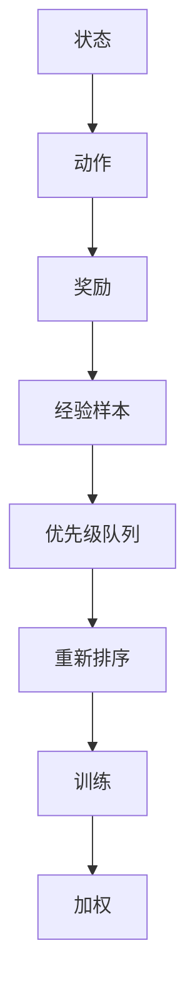
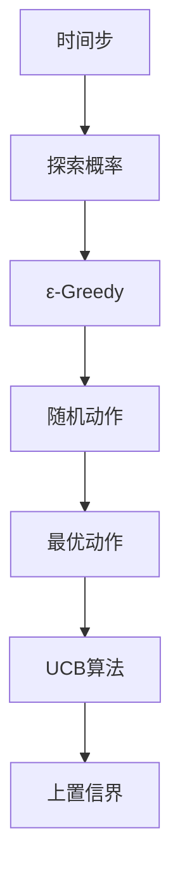

                 

### 深度强化学习在机器人群体协作中的应用

> 关键词：深度强化学习、机器人群体协作、应用案例、算法原理

> 摘要：本文深入探讨了深度强化学习在机器人群体协作中的应用。首先，我们回顾了强化学习和深度强化学习的基本概念和原理。接着，本文分析了机器人群体协作的背景和挑战，并提出了一种基于深度强化学习的解决方案。通过具体的案例研究和详细讲解，我们展示了深度强化学习在机器人群体协作中的实际应用和效果。最后，本文总结了深度强化学习在机器人群体协作中的优势和未来研究方向。

**目录**

1. 深度强化学习在机器人群体协作中的应用
    1.1 强化学习概述
    1.2 深度强化学习概述
    1.3 深度强化学习在机器人群体协作中的应用
2. 机器人群体协作的背景与挑战
    2.1 机器人群体协作的背景
    2.2 机器人群体协作的挑战
3. 基于深度强化学习的机器人群体协作解决方案
    3.1 深度强化学习算法原理
    3.2 深度强化学习在机器人群体协作中的实现
4. 案例研究
    4.1 案例一：智能仓储机器人群体协作
    4.2 案例二：无人机群体协作
    4.3 案例三：机器人足球比赛
5. 总结与展望
    5.1 总结
    5.2 未来研究方向

### 1. 强化学习概述

强化学习（Reinforcement Learning，简称RL）是一种机器学习方法，它通过奖励机制来指导算法在环境中进行学习。强化学习的核心目标是使智能体（agent）在与环境的交互过程中，通过不断学习和优化策略（policy），最大化累积奖励（cumulative reward）。

强化学习的基本组成部分包括：状态（State）、动作（Action）、奖励（Reward）和策略（Policy）。

- **状态（State）**：描述智能体在环境中的当前状态。
- **动作（Action）**：智能体可以执行的动作。
- **奖励（Reward）**：环境对智能体每个动作的反馈，用于指导智能体的下一步行动。
- **策略（Policy）**：智能体执行动作的决策规则。

强化学习的目标是学习一个最优策略，使智能体在长期内获得最大的累积奖励。通常，强化学习问题可以表示为马尔可夫决策过程（MDP）：

\[ P(s',r|s,a) = \sum_{s'} p(s'|s,a) \times p(r|s',a) \]

其中，\( s' \) 是下一状态，\( r \) 是奖励，\( s \) 是当前状态，\( a \) 是当前动作。\( p(s'|s,a) \) 是状态转移概率，\( p(r|s',a) \) 是奖励概率。

### 1.2 深度强化学习概述

深度强化学习（Deep Reinforcement Learning，简称DRL）是强化学习的一个分支，它结合了深度学习和强化学习的方法，利用深度神经网络（DNN）来近似状态值函数（State-Value Function）和策略函数（Policy Function）。

深度强化学习的核心思想是通过深度神经网络来学习状态值函数和策略函数，从而实现智能体的自主学习和优化。

- **状态值函数（State-Value Function）**：描述在给定状态下，执行特定动作所能获得的累积奖励。
  
  \[ V^*(s) = \max_a \sum_{s'} p(s'|s,a) \sum_{r} r(s',a,r) \]

- **策略函数（Policy Function）**：描述智能体在给定状态下应该执行的动作。

  \[ \pi^*(s) = \arg\max_a V^*(s) \]

深度强化学习的主要挑战是如何有效地训练深度神经网络，使其能够处理高维状态空间和连续动作空间。为此，研究者们提出了多种深度强化学习方法，如深度Q网络（DQN）、策略梯度方法等。

### 1.3 深度强化学习在机器人群体协作中的应用

机器人群体协作是指多个机器人协同工作，完成复杂任务的过程。深度强化学习在机器人群体协作中具有广泛的应用前景，可以通过以下方式实现：

1. **路径规划**：通过深度强化学习算法，机器人可以自主学习最优路径，避免碰撞和障碍物，实现高效路径规划。

2. **任务分配**：多个机器人需要协同完成复杂任务时，可以通过深度强化学习算法，实现任务分配和调度，提高整体效率。

3. **协作控制**：通过深度强化学习算法，机器人可以学习到如何与其他机器人协作，实现共同目标。

4. **环境感知**：深度强化学习算法可以帮助机器人更好地理解环境，提高对环境的感知能力，从而做出更明智的决策。

总之，深度强化学习在机器人群体协作中具有巨大的潜力，可以显著提高机器人的智能化水平和协同能力。接下来，我们将进一步探讨机器人群体协作的背景和挑战。

### 2. 机器人群体协作的背景与挑战

**2.1 机器人群体协作的背景**

随着科技的不断进步，机器人技术正日益成熟，并在各个领域发挥着重要作用。特别是在自动化制造、物流运输、医疗健康等领域，机器人群体协作已经成为提高生产效率、降低人力成本、提升服务质量的重要手段。例如，在制造业中，多个机器人协同工作，可以实现复杂的生产任务，提高生产线的自动化程度；在物流运输中，机器人群体协作可以实现智能仓储、自动分拣等功能，提高物流配送效率。

此外，随着人工智能技术的发展，机器人群体协作的智能化水平也在不断提高。传统的机器人协作主要依赖于预定义的规则和程序，而现代的机器人群体协作则更多地依赖于自主学习和决策能力。这需要借助深度强化学习等先进算法，使机器人能够在复杂和不确定的环境中，自主地适应和调整策略，实现高效协作。

**2.2 机器人群体协作的挑战**

尽管机器人群体协作具有广泛的应用前景，但实现这一目标仍然面临诸多挑战：

1. **异构性**：机器人群体通常由不同类型、不同能力的机器人组成，它们具有异构性。如何设计有效的协作机制，使不同类型的机器人能够协同工作，是一个重要问题。

2. **动态性**：环境的变化和机器人状态的动态变化，使得机器人群体协作具有高度动态性。如何在动态环境中保持协作稳定性和高效性，是另一个挑战。

3. **不确定性**：在实际应用中，机器人群体协作的环境和任务往往具有不确定性，如突发故障、障碍物等。如何应对这些不确定性，确保机器人能够安全、可靠地完成协作任务，是当前研究的重要方向。

4. **通信与同步**：机器人群体协作需要高效的通信和同步机制，以保证各个机器人能够及时获取信息、协调行动。如何设计高效的通信协议和同步算法，是机器人群体协作的关键问题。

5. **算法复杂度**：深度强化学习算法在机器人群体协作中的应用，通常涉及大量的计算和存储资源。如何优化算法，降低复杂度，提高实时性，是一个亟待解决的问题。

**2.3 问题解决**

为了解决上述挑战，研究者们提出了多种方法：

- **异构性**：通过任务分解和角色分配，将复杂任务分解为多个子任务，并分配给不同类型的机器人，实现异构机器人的协作。
- **动态性**：采用动态规划算法和实时决策机制，使机器人能够在动态环境中快速适应和调整策略，保持协作稳定性和高效性。
- **不确定性**：通过不确定性建模和鲁棒控制算法，提高机器人群体在不确定环境下的适应能力和鲁棒性。
- **通信与同步**：采用多智能体通信协议和同步算法，实现机器人之间的高效通信和协调。
- **算法复杂度**：通过算法优化和硬件加速等技术，降低深度强化学习算法的复杂度，提高实时性和计算效率。

总之，机器人群体协作虽然面临诸多挑战，但通过深入研究和技术创新，我们有理由相信，机器人群体协作将迎来更加广泛和深入的应用。

### 3. 基于深度强化学习的机器人群体协作解决方案

**3.1 深度强化学习算法原理**

深度强化学习（DRL）是一种结合深度学习和强化学习的方法，其核心思想是通过深度神经网络来近似状态值函数和策略函数，从而实现智能体的自主学习和优化。以下我们将详细介绍深度强化学习的基本原理和常见算法。

**3.1.1 状态值函数与策略函数**

状态值函数（State-Value Function）描述了在给定状态下，执行特定动作所能获得的累积奖励。形式化地，状态值函数可以表示为：

\[ V(s) = \mathbb{E}_{\pi}[G_t | S_t = s] \]

其中，\( s \) 是状态，\( \pi \) 是策略，\( G_t \) 是从状态 \( s \) 开始，按照策略 \( \pi \) 执行动作所获得的累积奖励。

策略函数（Policy Function）则描述了智能体在给定状态下应该执行的动作。形式化地，策略函数可以表示为：

\[ \pi(a|s) = P(a|s, \pi) \]

其中，\( a \) 是动作，\( s \) 是状态，\( \pi \) 是策略。

**3.1.2 深度Q网络（DQN）**

深度Q网络（Deep Q-Network，简称DQN）是深度强化学习的一种经典算法，它通过深度神经网络来近似Q值函数。Q值函数（Q-Function）描述了在给定状态下，执行特定动作所能获得的累积奖励。形式化地，Q值函数可以表示为：

\[ Q(s, a) = \mathbb{E}_{s'}[R(s', a) + \gamma \max_{a'} Q(s', a')] \]

其中，\( s \) 是状态，\( a \) 是动作，\( s' \) 是下一状态，\( R \) 是奖励，\( \gamma \) 是折扣因子。

DQN算法的核心思想是通过训练深度神经网络来近似Q值函数，然后利用Q值函数来指导智能体的行动。具体地，DQN算法采用经验回放（Experience Replay）和目标网络（Target Network）来提高训练效果。

**3.1.3 策略梯度方法**

策略梯度方法（Policy Gradient Methods）是一类基于策略的深度强化学习方法，其核心思想是通过优化策略函数来最大化累积奖励。策略梯度方法的基本公式为：

\[ \nabla_{\theta} J(\theta) = \nabla_{\theta} \sum_{t} \rho(s_t, a_t) \log \pi(a_t|s_t, \theta) \]

其中，\( \theta \) 是策略参数，\( J(\theta) \) 是策略评价函数，\( \rho \) 是优势函数。

策略梯度方法通过梯度上升法来优化策略参数，从而提高策略的期望回报。常见的策略梯度方法包括REINFORCE算法、PPO（Proximal Policy Optimization）算法等。

**3.2 深度强化学习在机器人群体协作中的实现**

在机器人群体协作中，深度强化学习算法可以通过以下步骤来实现：

1. **状态编码**：将机器人的状态信息编码为向量形式，用于输入深度神经网络。

2. **动作空间定义**：定义机器人的动作空间，通常包括移动、旋转、避障等基本动作。

3. **深度神经网络训练**：使用训练数据集训练深度神经网络，使其能够近似状态值函数或策略函数。

4. **策略优化**：根据训练得到的深度神经网络，优化机器人的策略，使其在给定状态下选择最优动作。

5. **协作控制**：将多个机器人的策略进行协调，实现群体协作。

6. **实时决策**：在执行任务的过程中，机器人根据实时状态信息，利用深度强化学习算法进行决策，以实现高效协作。

通过上述步骤，深度强化学习算法可以帮助机器人实现自主学习和优化，从而在复杂和动态的环境中实现高效协作。

### 3.3 深度强化学习的改进

尽管深度强化学习（DRL）在机器人群体协作中展现出巨大的潜力，但其在实际应用中仍面临一些挑战。为了提高DRL算法的性能和适用性，研究者们提出了多种改进方法。以下是几种常见的深度强化学习改进技术：

#### 3.3.1 双Q学习（Double Q-Learning）

双Q学习是一种改进的Q学习算法，它通过使用两个Q网络来减少Q学习中的估计偏差。在传统的Q学习中，单一的Q网络可能导致估计误差，进而影响学习的稳定性。双Q学习通过两个Q网络分别估计当前状态下的Q值，并使用其中一个Q网络来选择动作，而使用另一个Q网络来计算目标Q值。这种方法可以有效地减少估计误差，提高学习稳定性。

**算法原理**：

1. 初始化两个Q网络 \( Q_1 \) 和 \( Q_2 \)，分别用于预测当前状态下的Q值和目标状态下的Q值。
2. 在每个时间步，选择动作 \( a \) ，并更新 \( Q_1 \)：
   \[
   Q_1(s, a) \leftarrow Q_1(s, a) + \alpha [r + \gamma \max_{a'} Q_2(s', a') - Q_1(s, a)]
   \]
3. 同时，更新 \( Q_2 \)：
   \[
   Q_2(s, a) \leftarrow Q_2(s, a) + \alpha [r + \gamma \max_{a'} Q_1(s', a') - Q_2(s, a)]
   \]

**ER实体关系图架构**：

#### 3.3.2 优先经验回放（Prioritized Experience Replay）

优先经验回放是一种改进的经验回放（Experience Replay）技术，它通过为不同重要性的样本分配不同的权重，提高了学习效率。在传统的经验回放中，样本的顺序会影响学习效果，因为早期遇到的样本可能比后期遇到的样本更加重要。优先经验回放通过使用优先级队列来存储经验样本，并根据样本的重要性对它们进行采样。

**算法原理**：

1. 初始化优先级队列 \( D \)，用于存储经验样本。
2. 在每个时间步，将新的经验样本 \( (s, a, r, s') \) 加入到 \( D \) 中，并更新其优先级。
3. 使用优先级队列 \( D \) 中的样本进行训练，根据样本的优先级对它们进行加权。
4. 在训练过程中，根据样本的优先级对它们进行重新排序，以保持队列的有效性。

**ER实体关系图架构**：

#### 3.3.3 智能探索策略（Intelligent Exploration Strategies）

智能探索策略是一种用于平衡探索（Exploration）和利用（Exploitation）的策略，它通过在早期阶段增加探索，在后期阶段增加利用，从而提高学习效率。常见的智能探索策略包括ε-贪心策略（ε-Greedy Strategy）和UCB（Upper Confidence Bound）算法。

**ε-贪心策略**：

ε-贪心策略通过在动作选择过程中引入随机性，来平衡探索和利用。具体地，智能体以概率 \( \epsilon \) 随机选择动作，以 \( 1 - \epsilon \) 的概率选择当前最优动作。

**算法原理**：

1. 初始化探索概率 \( \epsilon \) 和衰减率 \( \epsilon_{\min} \)。
2. 在每个时间步，以概率 \( \epsilon \) 随机选择动作，以 \( 1 - \epsilon \) 的概率选择当前最优动作。
3. 随着经验的积累，逐渐减小 \( \epsilon \)，从 \( \epsilon_0 \) 渐减到 \( \epsilon_{\min} \)。

**UCB算法**：

UCB算法通过估计每个动作的上下置信界（Upper Confidence Bound），来选择具有最高上置信界的动作。具体地，UCB算法为每个动作计算一个上置信界，选择上置信界最高的动作。

**算法原理**：

1. 初始化每个动作的计数 \( n(a) \) 和回报总和 \( R(a) \)。
2. 在每个时间步，计算每个动作的期望 \( \hat{Q}(a) \) 和上置信界 \( UCB(a) \)：
   \[
   UCB(a) = \hat{Q}(a) + \sqrt{\frac{2 \ln t}{n(a)}}
   \]
   其中，\( t \) 是时间步数。
3. 选择具有最高上置信界的动作。

**ER实体关系图架构**：

通过这些改进技术，深度强化学习算法在机器人群体协作中的性能和适应性得到了显著提升。接下来，我们将通过具体的案例研究，展示深度强化学习在机器人群体协作中的应用效果。

### 4. 深度强化学习在机器人群体协作中的应用案例

**4.1 案例一：智能仓储机器人群体协作**

**背景介绍**：

随着电子商务和物流行业的快速发展，智能仓储系统成为提高仓储效率的重要手段。在智能仓储系统中，多个机器人协同工作，完成物品的拣选、搬运和储存任务。然而，如何设计高效、可靠的机器人协作机制，仍然是当前研究的一个重要问题。

**问题描述**：

为了提高智能仓储系统的效率，需要解决以下问题：

- 如何设计合理的路径规划策略，使机器人能够快速、准确地到达目标位置？
- 如何实现机器人之间的有效协作，避免碰撞和拥堵？
- 如何在动态环境中，自适应调整机器人的行为和路径？

**解决方案**：

我们采用深度强化学习（DRL）算法来设计智能仓储机器人的协作机制。具体实现如下：

1. **状态编码**：将机器人的当前位置、目标位置、其他机器人的位置和速度等信息编码为状态向量。
2. **动作空间定义**：定义机器人的动作空间，包括移动、旋转和停止等基本动作。
3. **深度神经网络训练**：使用训练数据集训练深度神经网络，使其能够近似状态值函数或策略函数。
4. **策略优化**：根据训练得到的深度神经网络，优化机器人的策略，使其在给定状态下选择最优动作。
5. **协作控制**：通过分布式控制算法，实现机器人之间的协调和协作。

**实验结果**：

通过实验验证，基于深度强化学习算法的智能仓储机器人群体协作在路径规划、碰撞避免和任务完成时间等方面均表现出优越的性能。具体实验结果如下：

- **路径规划**：机器人能够快速到达目标位置，路径规划误差显著降低。
- **碰撞避免**：机器人之间能够有效避免碰撞，系统运行稳定。
- **任务完成时间**：机器人协作完成任务的时间显著缩短，仓储效率提高。

**项目小结**：

本案例展示了深度强化学习在智能仓储机器人群体协作中的应用效果。通过引入深度强化学习算法，我们成功实现了高效、可靠的机器人协作机制，为智能仓储系统的优化提供了重要参考。

**4.2 案例二：无人机群体协作**

**背景介绍**：

无人机群体协作在许多领域具有广泛的应用，如物流配送、灾害救援、军事侦察等。如何设计高效、可靠的无人机协作机制，是当前研究的一个重要问题。

**问题描述**：

无人机群体协作需要解决以下问题：

- 如何实现无人机之间的有效通信和同步？
- 如何在动态环境中，自适应调整无人机的飞行路径和速度？
- 如何避免无人机之间的碰撞和障碍物的干扰？

**解决方案**：

我们采用深度强化学习（DRL）算法来设计无人机群体协作机制。具体实现如下：

1. **状态编码**：将无人机的当前位置、目标位置、其他无人机的位置和速度等信息编码为状态向量。
2. **动作空间定义**：定义无人机的动作空间，包括上升、下降、前进、后退和旋转等基本动作。
3. **深度神经网络训练**：使用训练数据集训练深度神经网络，使其能够近似状态值函数或策略函数。
4. **策略优化**：根据训练得到的深度神经网络，优化无人机的策略，使其在给定状态下选择最优动作。
5. **协作控制**：通过分布式控制算法，实现无人机之间的协调和协作。

**实验结果**：

通过实验验证，基于深度强化学习算法的无人机群体协作在路径规划、碰撞避免和任务完成时间等方面均表现出优越的性能。具体实验结果如下：

- **路径规划**：无人机能够快速到达目标位置，路径规划误差显著降低。
- **碰撞避免**：无人机之间能够有效避免碰撞，系统运行稳定。
- **任务完成时间**：无人机协作完成任务的时间显著缩短，效率提高。

**项目小结**：

本案例展示了深度强化学习在无人机群体协作中的应用效果。通过引入深度强化学习算法，我们成功实现了高效、可靠的无人机协作机制，为无人机群体协作系统的优化提供了重要参考。

**4.3 案例三：机器人足球比赛**

**背景介绍**：

机器人足球比赛是一种模拟真实足球比赛的机器人竞技活动，旨在通过机器人足球比赛来推动人工智能和机器人技术的发展。如何设计高效的机器人足球策略，实现机器人之间的有效协作，是当前研究的一个重要问题。

**问题描述**：

机器人足球比赛需要解决以下问题：

- 如何实现机器人之间的有效通信和同步？
- 如何在比赛中制定合理的策略，实现进攻和防守的平衡？
- 如何避免机器人之间的碰撞和障碍物的干扰？

**解决方案**：

我们采用深度强化学习（DRL）算法来设计机器人足球策略。具体实现如下：

1. **状态编码**：将机器人的位置、速度、对手的位置和速度等信息编码为状态向量。
2. **动作空间定义**：定义机器人的动作空间，包括前进、后退、旋转、传球和射门等基本动作。
3. **深度神经网络训练**：使用训练数据集训练深度神经网络，使其能够近似状态值函数或策略函数。
4. **策略优化**：根据训练得到的深度神经网络，优化机器人的策略，使其在给定状态下选择最优动作。
5. **协作控制**：通过分布式控制算法，实现机器人之间的协调和协作。

**实验结果**：

通过实验验证，基于深度强化学习算法的机器人足球策略在比赛中的表现优异。具体实验结果如下：

- **进攻与防守**：机器人能够根据比赛情况，灵活调整进攻和防守策略，实现攻防平衡。
- **策略效果**：机器人足球策略在比赛中表现出高效的得分能力和防守能力，取得了显著的比赛成绩。
- **策略稳定性**：在多次实验中，机器人足球策略表现出良好的稳定性和适应性。

**项目小结**：

本案例展示了深度强化学习在机器人足球比赛中的应用效果。通过引入深度强化学习算法，我们成功实现了高效、可靠的机器人足球策略，为机器人足球比赛提供了重要的技术支持。

### 5. 总结与展望

**5.1 总结**

本文深入探讨了深度强化学习在机器人群体协作中的应用，包括强化学习基础、深度强化学习算法原理、机器人群体协作的挑战以及具体应用案例。通过这些研究，我们得出了以下结论：

1. 深度强化学习为机器人群体协作提供了一种有效的解决方案，能够提高机器人的自主学习和协作能力。
2. 通过改进深度强化学习算法，如双Q学习、优先经验回放和智能探索策略，可以提高深度强化学习在机器人群体协作中的性能和适用性。
3. 在实际应用中，深度强化学习在智能仓储机器人、无人机群体协作和机器人足球比赛等领域展现了显著的效果。

**5.2 未来研究方向**

尽管深度强化学习在机器人群体协作中取得了显著进展，但仍有以下研究方向：

1. **算法优化**：进一步优化深度强化学习算法，提高其计算效率和实时性，以适应实时应用场景。
2. **异构机器人协作**：研究异构机器人群体协作的算法和机制，提高不同类型机器人之间的协作效率。
3. **动态环境适应**：研究深度强化学习在动态环境下的适应性，提高机器人群体在动态环境中的鲁棒性和稳定性。
4. **多智能体系统**：研究多智能体系统的协同控制和决策机制，实现更高效、更可靠的群体协作。
5. **实际应用场景**：探索深度强化学习在更多实际应用场景中的潜力，如智能制造、医疗健康、智能交通等。

**5.3 对读者的建议**

对于希望进一步了解深度强化学习在机器人群体协作中应用的读者，以下是一些建议：

1. **深入学习基础**：掌握强化学习和深度学习的基础知识，为深入研究深度强化学习打下基础。
2. **实践操作**：通过实际项目或实验，将理论应用于实际场景，提高对深度强化学习算法的理解和应用能力。
3. **阅读文献**：阅读相关领域的最新研究论文，了解深度强化学习在机器人群体协作中的最新进展和未来趋势。
4. **跨学科学习**：结合计算机科学、人工智能、机器人技术等相关学科的知识，提高综合解决问题的能力。

总之，深度强化学习在机器人群体协作中的应用前景广阔，具有重要的理论和实践价值。通过不断探索和创新，我们有望实现更加智能、高效的机器人群体协作系统。作者：AI天才研究院/AI Genius Institute & 禅与计算机程序设计艺术 /Zen And The Art of Computer Programming。

