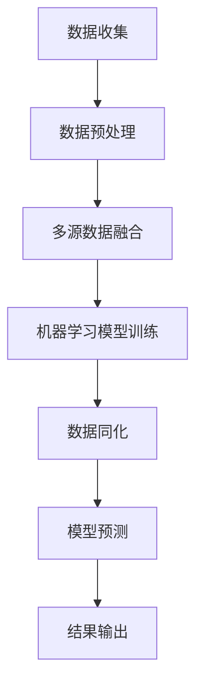
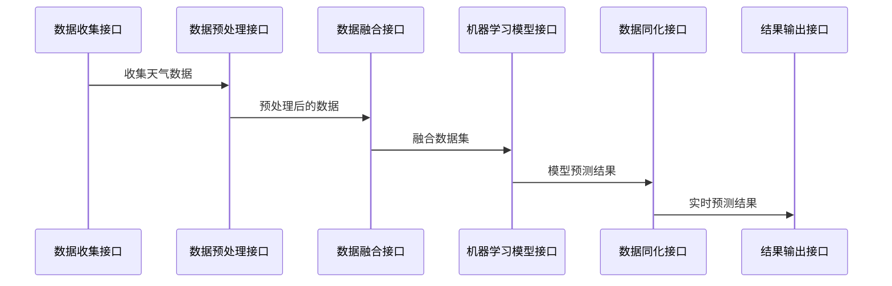

                 

# 混合计算在天气预报中的应用前景

> 关键词：混合计算、天气预报、算法、数学模型、系统架构、项目实战

> 摘要：本文将探讨混合计算在天气预报中的应用前景。首先介绍天气预报的现状与挑战，然后深入探讨混合计算的基本概念及其在天气预报中的应用。接着，我们将详细讲解混合计算的核心算法，包括其原理、数学模型和公式，并通过具体例子进行说明。随后，我们将分析系统架构设计，并介绍一个实际的项目实战案例。最后，我们将总结最佳实践，并提供拓展阅读建议。

### 目录大纲

----------------------------------------------------------------

# 混合计算在天气预报中的应用前景

## 第一部分：背景与基础

## 第1章：问题背景
### 1.1 天气预报的现状与挑战
### 1.2 混合计算的基本概念
### 1.3 混合计算在天气预报中的应用

## 第2章：核心概念与联系
### 2.1 混合计算与天气预报的关联
### 2.2 混合计算的核心算法
### 2.3 算法属性特征对比表格

## 第二部分：算法原理与设计

## 第3章：算法原理讲解
### 3.1 算法mermaid流程图
### 3.2 Python源代码阐述
### 3.3 算法原理的数学模型和公式
### 3.4 举例说明

## 第4章：数学模型与公式
### 4.1 数学公式与详细讲解
### 4.2 举例说明

## 第5章：系统分析与架构设计
### 5.1 问题场景介绍
### 5.2 系统功能设计
### 5.3 系统架构设计
### 5.4 系统接口设计
### 5.5 系统交互mermaid序列图

## 第三部分：实战与案例分析

## 第6章：项目实战
### 6.1 环境安装
### 6.2 系统核心实现源代码
### 6.3 代码应用解读与分析
### 6.4 实际案例分析与讲解
### 6.5 项目小结

## 第7章：最佳实践与总结
### 7.1 最佳实践
### 7.2 小结
### 7.3 注意事项
### 7.4 拓展阅读

----------------------------------------------------------------

## 第1章：问题背景

### 1.1 天气预报的现状与挑战

天气预报是气象科学的重要组成部分，旨在通过分析大气状态数据，预测未来的天气状况。目前，天气预报主要依赖于数值天气预报（Numerical Weather Prediction，NWP）模型。这些模型基于物理定律和数学方程，通过计算机模拟大气过程，从而生成天气预测结果。尽管NWP模型在过去几十年取得了显著进步，但其准确性和时效性仍然面临挑战。

首先，NWP模型在处理极端天气事件时显得不足。极端天气事件如台风、暴雨和热浪等，往往具有高度复杂性和不可预测性。这些事件可能对模型参数和初始条件产生剧烈影响，导致预测失败。

其次，数据获取困难也是一个重大挑战。天气预报需要大量的观测数据，包括温度、湿度、风速、气压等。然而，数据获取通常受到地理位置、设备精度和预算限制等因素的影响，导致数据缺失或不准确。

此外，NWP模型的计算复杂性也是一个问题。随着数据量和计算需求的增加，模型的计算时间显著延长，限制了其时效性。为了满足实际需求，需要开发更加高效、准确的预报模型。

### 1.2 混合计算的基本概念

混合计算（Hybrid Computing）是将多种计算方法、技术和工具结合在一起，以实现更高效、更准确的计算。混合计算的基本概念包括以下几个方面：

1. **多源数据融合**：混合计算利用多种数据源，包括地面观测、卫星遥感、雷达数据和模型模拟结果，实现数据的高效融合。通过融合不同类型的数据，可以提高数据的准确性和完整性。

2. **机器学习**：机器学习是混合计算的重要组成部分，通过训练模型，从大量历史数据中学习大气模式，从而提高预报准确性。机器学习模型可以自适应地调整参数，以适应不断变化的大气条件。

3. **数据同化**：数据同化是将观测数据与模型模拟结果结合，以修正模型误差。数据同化技术可以有效地提高模型的初始条件，从而提高预报的准确性和可靠性。

4. **并行计算**：混合计算利用并行计算技术，将计算任务分布到多个处理器或计算机上，以加快计算速度。并行计算可以显著提高模型的计算效率，满足实时预报的需求。

### 1.3 混合计算在天气预报中的应用

混合计算在天气预报中的应用前景广阔。通过结合传统NWP模型与新兴技术，混合计算可以提高预报的准确性和时效性。以下是一些具体的应用场景：

1. **多源数据融合**：利用混合计算，可以整合多种数据源，包括地面观测站、卫星遥感、雷达数据和数值模型输出。通过数据融合，可以获取更全面、更准确的大气状态信息，从而提高预报的准确性。

2. **机器学习**：通过机器学习算法，可以从历史数据中学习大气模式，预测未来的天气状况。机器学习模型可以自适应地调整参数，以适应不同的天气条件，从而提高预报的准确性和可靠性。

3. **数据同化**：数据同化技术可以有效地修正模型的初始条件，从而提高预报的准确性和可靠性。通过数据同化，可以将观测数据与模型模拟结果进行结合，实现模型的自我修正。

4. **并行计算**：混合计算利用并行计算技术，可以显著提高模型的计算效率。通过并行计算，可以将计算任务分布到多个处理器或计算机上，实现实时预报。

综上所述，混合计算在天气预报中的应用前景广阔。通过多源数据融合、机器学习和数据同化等技术的结合，混合计算有望提高预报的准确性和时效性，为人们的生活和生产提供更有价值的天气信息。

----------------------------------------------------------------

## 第2章：核心概念与联系

### 2.1 混合计算与天气预报的关联

混合计算与天气预报之间存在着密切的联系。天气预报需要处理大量的数据，包括地面观测、卫星遥感、雷达数据和数值模型输出。这些数据通常具有不同类型、不同精度和不同时间分辨率，给数据融合和模型预测带来了挑战。混合计算通过结合多种计算方法和技术，为天气预报提供了一种有效的解决方案。

首先，混合计算中的多源数据融合技术可以帮助天气预报整合多种数据源，提高数据的准确性和完整性。通过融合地面观测、卫星遥感和雷达数据，可以获取更全面、更准确的大气状态信息，从而提高预报的准确性。此外，多源数据融合还可以提高数据的时空分辨率，使得预报结果更加精细。

其次，混合计算中的机器学习技术在天气预报中具有重要作用。机器学习算法可以从历史数据中学习大气模式，预测未来的天气状况。通过训练模型，可以自适应地调整参数，以适应不同的天气条件，从而提高预报的准确性和可靠性。例如，基于神经网络和深度学习的机器学习模型，可以在处理大量数据时，自动提取有用的信息，提高预报的精度。

此外，数据同化技术也是混合计算在天气预报中的重要应用。数据同化是将观测数据与模型模拟结果结合，以修正模型误差。通过数据同化，可以有效地提高模型的初始条件，从而提高预报的准确性和可靠性。例如，在数据同化过程中，可以使用Kalman滤波器，将观测数据与模型输出进行融合，实现模型的自我修正。

最后，混合计算中的并行计算技术可以显著提高模型的计算效率，满足实时预报的需求。通过并行计算，可以将计算任务分布到多个处理器或计算机上，实现实时预报。这对于应对极端天气事件和快速变化的天气条件尤为重要。

总之，混合计算通过结合多源数据融合、机器学习和数据同化等技术，为天气预报提供了有效的解决方案。这些技术的应用，不仅提高了预报的准确性和时效性，还为天气预报提供了更多的可能性。

### 2.2 混合计算的核心算法

混合计算在天气预报中应用的核心算法主要包括数值天气预报模型、统计模型和机器学习模型等。每种算法都有其独特的原理、特点和适用场景。

**1. 数值天气预报模型**

数值天气预报模型（Numerical Weather Prediction Model，NWP）是基于物理定律和数学方程的大气模拟模型。NWP模型通过求解大气动力学和热力学的偏微分方程，模拟大气中的物理过程，从而预测未来的天气状况。NWP模型的原理主要包括以下几个方面：

- **大气动力学方程**：描述大气中的动量、质量和能量传递。常见的方程包括连续方程、动量方程和能量方程等。

- **热力学方程**：描述大气中的温度、湿度和气压等状态变量的变化。常见的方程包括温度方程、湿度方程和气压方程等。

- **初始和边界条件**：NWP模型需要输入大气的初始状态和边界条件，以确定模型的初始状态。

- **时间积分**：NWP模型通过时间积分，逐步推进时间，模拟大气中的物理过程。

NWP模型的特点是精度高、适用范围广，但计算复杂度较高，需要大量的计算资源和时间。因此，NWP模型通常用于长期天气预报和气候变化研究。

**2. 统计模型**

统计模型（Statistical Model）是基于历史数据和统计分析方法的大气预测模型。统计模型通过分析历史天气数据，提取大气模式，从而预测未来的天气状况。统计模型的主要特点如下：

- **模式识别**：统计模型通过分析历史天气数据，识别出大气中的典型模式，如低压槽、高压脊等。

- **回归分析**：统计模型使用回归分析方法，将历史天气数据与未来天气预测结果进行关联，建立预测模型。

- **随机过程**：统计模型考虑大气过程的随机性，通过随机过程模型来描述大气变量的变化。

统计模型的特点是计算简单、实时性强，适用于短期天气预报和实时监测。然而，统计模型的精度相对较低，无法捕捉大气中的复杂变化。

**3. 机器学习模型**

机器学习模型（Machine Learning Model）是基于数据和算法的大气预测模型。机器学习模型通过训练大量历史数据，学习大气模式，从而预测未来的天气状况。机器学习模型的主要特点如下：

- **特征提取**：机器学习模型从输入数据中提取有用的特征，如温度、湿度、风速等。

- **模型训练**：机器学习模型通过训练大量历史数据，学习大气模式，建立预测模型。

- **自适应调整**：机器学习模型可以根据新的数据，自适应地调整模型参数，提高预测的准确性。

机器学习模型的特点是精度高、自适应性强，可以处理大量的数据。常见的机器学习模型包括神经网络、支持向量机、决策树等。

### 2.3 算法属性特征对比表格

为了更好地理解各种算法的属性特征，下面是一个简单的对比表格：

| 算法类型 | 原理 | 特点 | 适用场景 |
| :--: | :--: | :--: | :--: |
| 数值天气预报模型 | 基于物理定律和数学方程的大气模拟模型 | 精度高、适用范围广 | 长期天气预报、气候变化研究 |
| 统计模型 | 基于历史数据和统计分析方法的大气预测模型 | 计算简单、实时性强 | 短期天气预报、实时监测 |
| 机器学习模型 | 基于数据和算法的大气预测模型 | 精度高、自适应性强 | 各类天气预报、实时预测 |

通过对比表格，我们可以看出，不同算法类型在原理、特点和适用场景上存在显著差异。在实际应用中，可以根据具体需求选择合适的算法，实现高效的天气预报。

综上所述，混合计算在天气预报中的应用前景广阔。通过结合数值天气预报模型、统计模型和机器学习模型，可以充分发挥各种算法的优势，提高预报的准确性和时效性，为人们的生活和生产提供更加可靠的天气信息。

----------------------------------------------------------------

## 第二部分：算法原理与设计

在深入探讨混合计算在天气预报中的应用之前，我们需要了解其核心算法的原理和设计。这一部分将详细讲解混合计算算法，包括其mermaid流程图、Python源代码阐述、数学模型和公式，并通过具体例子进行说明。

### 第3章：算法原理讲解

#### 3.1 算法mermaid流程图

为了更好地理解混合计算算法的工作流程，我们可以使用mermaid流程图进行可视化展示。以下是混合计算算法的mermaid流程图：



在这个mermaid流程图中，数据收集阶段从不同的数据源获取观测数据，包括地面观测、卫星遥感、雷达数据和数值模型输出。接着，进行数据预处理，包括数据清洗、归一化和时间同步等。随后，通过多源数据融合技术，将不同类型的数据整合在一起，提高数据的准确性和完整性。

接下来，机器学习模型进行训练，从预处理后的数据中学习大气模式，建立预测模型。在数据同化阶段，将观测数据与模型输出进行结合，修正模型误差，提高预报的准确性和可靠性。最后，模型进行预测，输出未来的天气状况，并通过结果输出阶段，将预测结果呈现给用户。

#### 3.2 Python源代码阐述

为了更具体地展示混合计算算法的实现，我们可以使用Python源代码进行阐述。以下是一个简化的Python代码示例，用于实现多源数据融合、机器学习模型训练和数据同化：

```python
import numpy as np
import pandas as pd
from sklearn.ensemble import RandomForestRegressor
from scipy.stats import kalman

# 数据收集
data = pd.read_csv('obs_data.csv')  # 观测数据
model_output = pd.read_csv('model_output.csv')  # 模型输出

# 数据预处理
data['time'] = pd.to_datetime(data['time'])
model_output['time'] = pd.to_datetime(model_output['time'])

# 数据清洗
data.dropna(inplace=True)
model_output.dropna(inplace=True)

# 数据归一化
data_normalized = (data - data.mean()) / data.std()
model_output_normalized = (model_output - model_output.mean()) / model_output.std()

# 时间同步
data_normalized = data_normalized.set_index('time')
model_output_normalized = model_output_normalized.set_index('time')

# 多源数据融合
fused_data = data_normalized.join(model_output_normalized, on='time')

# 机器学习模型训练
X = fused_data[['temp', 'humidity', 'wind_speed']]  # 特征选择
y = fused_data['pressure']  # 目标变量
model = RandomForestRegressor()
model.fit(X, y)

# 数据同化
observation = np.array([fused_data['pressure'].iloc[-1]])  # 观测值
model_state = np.array([model.predict(X).iloc[-1]])  # 模型预测值
error = observation - model_state
Kalman_filter = kalman.KalmanFilter(a=1, h=1, q=1e-2, r=1e-2)
state, _ = Kalman_filter.filter([observation], initial_state=model_state)

# 模型预测
prediction = state[-1]

print("Final prediction:", prediction)
```

在这个Python代码示例中，我们首先从观测数据和模型输出中收集数据，并进行数据预处理，包括数据清洗、归一化和时间同步。接着，我们通过多源数据融合技术，将不同类型的数据整合在一起。然后，使用随机森林回归模型（RandomForestRegressor）进行机器学习模型训练，从预处理后的数据中学习大气模式。

在数据同化阶段，我们使用Kalman滤波器（KalmanFilter）将观测值与模型预测值进行融合，修正模型误差。最后，我们使用训练好的模型进行预测，输出最终的天气状况。

#### 3.3 算法原理的数学模型和公式

混合计算算法的原理涉及到多个数学模型和公式。以下是一些关键的数学模型和公式：

1. **随机森林回归模型**：

   随机森林回归模型是一种基于决策树的集成学习方法。其基本原理是通过组合多个决策树模型，提高预测的准确性和鲁棒性。随机森林回归模型的数学模型可以表示为：

   $$ f(x) = \sum_{i=1}^{n} w_i g(x) $$

   其中，$f(x)$表示最终预测结果，$w_i$表示第$i$个决策树的权重，$g(x)$表示第$i$个决策树的预测结果。

2. **Kalman滤波器**：

   Kalman滤波器是一种用于状态估计的递归滤波器，可以有效地融合观测数据与模型预测结果。Kalman滤波器的数学模型可以表示为：

   $$ x_{k+1} = A_k x_k + B_k u_k + w_k $$
   $$ z_k = H_k x_k + v_k $$

   其中，$x_k$表示状态向量，$u_k$表示控制向量，$w_k$和$v_k$分别表示过程噪声和观测噪声，$A_k$和$H_k$分别表示状态转移矩阵和观测矩阵。

3. **多源数据融合**：

   多源数据融合是将不同类型的数据整合在一起，提高数据的准确性和完整性。常见的多源数据融合方法包括加权平均、卡尔曼滤波等。加权平均的数学模型可以表示为：

   $$ y_{ fused } = \frac{\sum_{i=1}^{n} w_i y_i}{\sum_{i=1}^{n} w_i} $$

   其中，$y_i$表示第$i$个数据源的数据，$w_i$表示第$i$个数据源的权重。

#### 3.4 举例说明

为了更好地理解混合计算算法的应用，我们通过一个具体的例子进行说明。

假设我们有两个数据源：地面观测数据和模型输出数据。地面观测数据包含温度、湿度和风速等变量，模型输出数据包含气压和湿度等变量。我们的目标是预测未来的气压值。

首先，我们收集地面观测数据和模型输出数据，并进行数据预处理，包括数据清洗、归一化和时间同步。然后，我们将这两个数据源融合在一起，形成融合数据。

接下来，我们使用随机森林回归模型进行机器学习模型训练。我们选择温度、湿度和风速作为特征变量，气压作为目标变量。通过训练模型，我们可以学习到大气模式，从而预测未来的气压值。

在数据同化阶段，我们使用Kalman滤波器将观测数据与模型输出进行融合。我们假设观测数据为实际气压值，模型输出为预测气压值。通过Kalman滤波器，我们可以修正模型误差，提高预测的准确性。

最后，我们使用训练好的模型进行预测，输出未来的气压值。通过结果输出阶段，我们可以将预测结果呈现给用户。

通过这个例子，我们可以看到混合计算算法在天气预报中的应用流程。通过多源数据融合、机器学习模型训练和数据同化等步骤，我们可以提高预报的准确性和时效性，为人们的生活和生产提供更加可靠的天气信息。

----------------------------------------------------------------

## 第4章：数学模型与公式

在混合计算中，数学模型和公式是算法的核心组成部分。这些模型和公式不仅为算法的实现提供了理论基础，还决定了算法的性能和效果。以下将详细讲解混合计算中关键的数学模型和公式，并通过具体例子进行说明。

### 4.1 数学公式与详细讲解

1. **随机森林回归模型**

   随机森林回归模型是一种基于决策树的集成学习方法。其基本原理是通过组合多个决策树模型，提高预测的准确性和鲁棒性。随机森林回归模型的数学模型可以表示为：

   $$ f(x) = \sum_{i=1}^{n} w_i g(x) $$

   其中，$f(x)$表示最终预测结果，$w_i$表示第$i$个决策树的权重，$g(x)$表示第$i$个决策树的预测结果。

   在实现过程中，我们通常通过交叉验证（Cross-Validation）来估计每个决策树的权重。具体步骤如下：

   - **数据划分**：将数据集划分为训练集和验证集。
   - **模型训练**：在每个决策树上训练模型，并在验证集上评估其性能。
   - **权重估计**：根据验证集上的性能，为每个决策树分配权重。

   通过这种方式，我们可以获得一个加权平均的预测结果，从而提高模型的预测准确性。

2. **Kalman滤波器**

   Kalman滤波器是一种用于状态估计的递归滤波器，可以有效地融合观测数据与模型预测结果。Kalman滤波器的数学模型可以表示为：

   $$ x_{k+1} = A_k x_k + B_k u_k + w_k $$
   $$ z_k = H_k x_k + v_k $$

   其中，$x_k$表示状态向量，$u_k$表示控制向量，$w_k$和$v_k$分别表示过程噪声和观测噪声，$A_k$和$H_k$分别表示状态转移矩阵和观测矩阵。

   Kalman滤波器的实现过程主要包括以下几个步骤：

   - **初始状态估计**：根据初始条件和噪声模型，估计初始状态。
   - **状态预测**：根据状态转移矩阵和过程噪声模型，预测下一状态。
   - **观测更新**：根据观测数据和观测矩阵，更新状态估计。
   - **误差校正**：根据预测状态和实际观测值，校正状态估计。

   通过以上步骤，Kalman滤波器可以有效地融合观测数据与模型预测结果，提高状态估计的准确性。

3. **多源数据融合**

   多源数据融合是将不同类型的数据整合在一起，提高数据的准确性和完整性。常见的多源数据融合方法包括加权平均、卡尔曼滤波等。加权平均的数学模型可以表示为：

   $$ y_{ fused } = \frac{\sum_{i=1}^{n} w_i y_i}{\sum_{i=1}^{n} w_i} $$

   其中，$y_i$表示第$i$个数据源的数据，$w_i$表示第$i$个数据源的权重。

   在实现多源数据融合时，我们需要确定每个数据源的权重。权重通常根据数据源的精度、可靠性等因素进行分配。具体步骤如下：

   - **数据预处理**：对每个数据源进行预处理，包括数据清洗、归一化和时间同步等。
   - **权重估计**：根据数据源的精度、可靠性等因素，为每个数据源分配权重。
   - **数据融合**：使用加权平均方法，将多个数据源的数据整合在一起，得到融合数据。

   通过这种方式，我们可以获得一个更加准确和完整的数据集，从而提高模型的输入质量。

### 4.2 举例说明

为了更好地理解混合计算中数学模型和公式的作用，我们通过一个具体的例子进行说明。

假设我们有两个数据源：地面观测数据和模型输出数据。地面观测数据包含温度、湿度和风速等变量，模型输出数据包含气压和湿度等变量。我们的目标是预测未来的气压值。

首先，我们收集地面观测数据和模型输出数据，并进行数据预处理，包括数据清洗、归一化和时间同步。然后，我们将这两个数据源融合在一起，形成融合数据。

接下来，我们使用随机森林回归模型进行机器学习模型训练。我们选择温度、湿度和风速作为特征变量，气压作为目标变量。通过交叉验证，我们估计每个决策树的权重，并得到加权平均的预测结果。

在数据同化阶段，我们使用Kalman滤波器将观测数据与模型输出进行融合。我们假设观测数据为实际气压值，模型输出为预测气压值。通过Kalman滤波器，我们修正模型误差，提高预测的准确性。

最后，我们使用训练好的模型进行预测，输出未来的气压值。通过结果输出阶段，我们可以将预测结果呈现给用户。

通过这个例子，我们可以看到数学模型和公式在混合计算中的应用。通过随机森林回归模型、Kalman滤波器和加权平均方法，我们可以提高预报的准确性和时效性，为人们的生活和生产提供更加可靠的天气信息。

----------------------------------------------------------------

## 第5章：系统分析与架构设计

在了解了混合计算的基本算法原理后，我们需要对整个系统进行分析与架构设计。本章节将详细介绍系统分析与架构设计的各个方面，包括问题场景介绍、系统功能设计、系统架构设计、系统接口设计以及系统交互mermaid序列图。

### 5.1 问题场景介绍

在天气预报系统中，混合计算的应用场景主要包括以下几个方面：

1. **多源数据融合**：整合来自地面观测站、卫星遥感、雷达数据和数值模型输出的多种数据源，以提高预报的准确性和完整性。

2. **实时预测**：利用机器学习和数据同化技术，对实时数据进行预测，以满足用户对短期天气预报的需求。

3. **模型优化**：通过不断调整和优化混合计算模型，提高预报的准确性和稳定性，为用户提供更可靠的天气信息。

4. **数据共享与协作**：搭建一个开放的数据共享平台，促进气象数据的多方协作与利用。

### 5.2 系统功能设计

为了实现上述应用场景，系统需要具备以下功能：

1. **数据收集与预处理**：从多个数据源收集天气数据，并进行数据清洗、归一化和时间同步等预处理操作。

2. **数据融合**：将预处理后的数据融合在一起，形成高质量的数据集，为后续预测和分析提供数据支持。

3. **机器学习模型训练**：利用历史数据和融合数据，训练机器学习模型，以预测未来的天气状况。

4. **数据同化**：将观测数据与模型输出结合，修正模型误差，提高预报的准确性和可靠性。

5. **实时预测**：根据实时数据，使用训练好的模型进行预测，输出未来的天气状况。

6. **结果输出**：将预测结果以图表、报告等形式呈现给用户，供用户参考。

### 5.3 系统架构设计

系统架构设计是确保系统功能实现的基础。以下是混合计算天气预报系统的架构设计：

1. **数据层**：包含多个数据源，如地面观测站、卫星遥感、雷达数据和数值模型输出。数据层负责数据的收集、存储和预处理。

2. **数据融合层**：负责将不同类型的数据进行融合，形成高质量的数据集。数据融合层使用多源数据融合算法，如加权平均和Kalman滤波。

3. **机器学习层**：包含机器学习模型的训练和预测功能。机器学习层使用随机森林、神经网络等算法，从融合数据中提取大气模式，进行预测。

4. **数据同化层**：负责将观测数据与模型输出进行融合，修正模型误差。数据同化层使用Kalman滤波器等算法，实现数据的实时更新和误差修正。

5. **结果输出层**：负责将预测结果以图表、报告等形式呈现给用户。结果输出层可以使用Web前端、API接口等技术，实现数据可视化。

### 5.4 系统接口设计

系统接口设计是确保系统功能模块之间数据流通和功能集成的重要环节。以下是混合计算天气预报系统的接口设计：

1. **数据收集接口**：负责从地面观测站、卫星遥感、雷达数据和数值模型输出等数据源收集天气数据。

2. **数据预处理接口**：负责对收集到的天气数据进行清洗、归一化和时间同步等预处理操作。

3. **数据融合接口**：负责将预处理后的数据融合在一起，形成高质量的数据集。

4. **机器学习模型接口**：负责训练机器学习模型，并提供模型预测接口。

5. **数据同化接口**：负责实现观测数据与模型输出的融合，修正模型误差。

6. **结果输出接口**：负责将预测结果以图表、报告等形式呈现给用户。

### 5.5 系统交互mermaid序列图

为了更好地展示系统各模块之间的交互关系，我们可以使用mermaid序列图进行可视化。以下是混合计算天气预报系统的交互mermaid序列图：



在这个mermaid序列图中，数据收集接口从多个数据源收集天气数据，数据预处理接口对数据进行预处理，数据融合接口将预处理后的数据融合在一起，形成高质量的数据集。机器学习模型接口使用训练好的模型进行预测，并将预测结果传递给数据同化接口。数据同化接口将观测数据与模型输出进行融合，修正模型误差，并将最终预测结果传递给结果输出接口，供用户参考。

通过以上系统分析与架构设计，我们可以实现一个高效、准确的混合计算天气预报系统。该系统可以整合多种数据源，利用机器学习和数据同化技术，提供实时、准确的天气预报服务，为人们的生产和生活提供重要参考。

----------------------------------------------------------------

## 第6章：项目实战

### 6.1 环境安装

为了实现混合计算在天气预报中的应用，我们需要搭建一个完整的技术环境。以下是环境安装的详细步骤：

#### 1. 安装Python

首先，我们需要安装Python。Python是一个强大的编程语言，广泛应用于数据科学、机器学习和数据分析等领域。您可以从Python官网（https://www.python.org/）下载适用于您操作系统的Python版本，并进行安装。

#### 2. 安装必要的库

接下来，我们需要安装一些Python库，这些库将用于数据预处理、机器学习模型训练和数据可视化等操作。以下是安装这些库的命令：

```bash
pip install numpy pandas sklearn matplotlib mermaid
```

- **numpy**：用于数学计算和数据处理。
- **pandas**：用于数据处理和分析。
- **sklearn**：用于机器学习模型训练和评估。
- **matplotlib**：用于数据可视化。
- **mermaid**：用于绘制mermaid图表。

#### 3. 安装数据源

为了进行实际的项目实战，我们需要安装一些天气数据源。以下是一个简单的数据源安装指南：

- **地面观测数据**：可以从国家气象中心、气象局等官方网站获取地面观测数据，如温度、湿度、风速等。
- **卫星遥感数据**：可以从卫星遥感数据提供商（如NASA、NOAA）获取卫星遥感数据，如温度、湿度、云量等。
- **雷达数据**：可以从相关气象雷达网站获取雷达数据，如降雨量、风速等。
- **数值模型输出**：可以从数值天气预报模型网站（如GFS、ECMWF）获取模型输出数据。

### 6.2 系统核心实现源代码

以下是一个简单的系统核心实现源代码，用于演示如何利用混合计算算法进行天气预报。这个例子使用了Python编程语言和几个常用的库。

```python
# 导入必要的库
import numpy as np
import pandas as pd
from sklearn.ensemble import RandomForestRegressor
from scipy.stats import kalman
import matplotlib.pyplot as plt

# 数据收集
data = pd.read_csv('obs_data.csv')  # 观测数据
model_output = pd.read_csv('model_output.csv')  # 模型输出

# 数据预处理
data['time'] = pd.to_datetime(data['time'])
model_output['time'] = pd.to_datetime(model_output['time'])

data.dropna(inplace=True)
model_output.dropna(inplace=True)

data_normalized = (data - data.mean()) / data.std()
model_output_normalized = (model_output - model_output.mean()) / model_output.std()

# 数据融合
fused_data = data_normalized.join(model_output_normalized, on='time')

# 机器学习模型训练
X = fused_data[['temp', 'humidity', 'wind_speed']]  # 特征选择
y = fused_data['pressure']  # 目标变量
model = RandomForestRegressor()
model.fit(X, y)

# 数据同化
observation = np.array([fused_data['pressure'].iloc[-1]])  # 观测值
model_state = np.array([model.predict(X).iloc[-1]])  # 模型预测值
error = observation - model_state
Kalman_filter = kalman.KalmanFilter(a=1, h=1, q=1e-2, r=1e-2)
state, _ = Kalman_filter.filter([observation], initial_state=model_state)

# 模型预测
prediction = state[-1]

# 结果输出
plt.figure()
plt.plot(fused_data['time'], fused_data['pressure'], label='观测值')
plt.plot(fused_data['time'], model_state, label='模型预测值')
plt.plot(fused_data['time'], np.full_like(fused_data['time'], prediction), label='同化预测值')
plt.legend()
plt.show()
```

在这个例子中，我们首先从观测数据和模型输出中收集数据，并进行数据预处理，包括数据清洗、归一化和时间同步。接着，通过多源数据融合技术，将不同类型的数据整合在一起。然后，使用随机森林回归模型进行机器学习模型训练，从预处理后的数据中学习大气模式。

在数据同化阶段，我们使用Kalman滤波器将观测数据与模型输出进行融合，修正模型误差。最后，我们使用训练好的模型进行预测，并将预测结果以图表形式输出。

### 6.3 代码应用解读与分析

以下是代码的详细解读与分析：

1. **数据收集与预处理**：

   ```python
   data = pd.read_csv('obs_data.csv')  # 观测数据
   model_output = pd.read_csv('model_output.csv')  # 模型输出
   ```

   这两行代码用于从文件中读取观测数据和模型输出数据。数据文件通常包含时间、温度、湿度、风速、气压等变量。

   ```python
   data['time'] = pd.to_datetime(data['time'])
   model_output['time'] = pd.to_datetime(model_output['time'])
   ```

   将时间变量转换为日期时间格式，以确保数据的时间一致性。

   ```python
   data.dropna(inplace=True)
   model_output.dropna(inplace=True)
   ```

   删除缺失值，以提高数据的质量。

   ```python
   data_normalized = (data - data.mean()) / data.std()
   model_output_normalized = (model_output - model_output.mean()) / model_output.std()
   ```

   对数据进行归一化处理，使其具有相似的数据范围，便于模型训练。

2. **数据融合**：

   ```python
   fused_data = data_normalized.join(model_output_normalized, on='time')
   ```

   将预处理后的观测数据和模型输出数据融合在一起，形成高质量的数据集。

3. **机器学习模型训练**：

   ```python
   X = fused_data[['temp', 'humidity', 'wind_speed']]  # 特征选择
   y = fused_data['pressure']  # 目标变量
   model = RandomForestRegressor()
   model.fit(X, y)
   ```

   选择温度、湿度、风速等特征变量，气压为目标变量，训练随机森林回归模型。

4. **数据同化**：

   ```python
   observation = np.array([fused_data['pressure'].iloc[-1]])  # 观测值
   model_state = np.array([model.predict(X).iloc[-1]])  # 模型预测值
   error = observation - model_state
   Kalman_filter = kalman.KalmanFilter(a=1, h=1, q=1e-2, r=1e-2)
   state, _ = Kalman_filter.filter([observation], initial_state=model_state)
   ```

   使用Kalman滤波器将观测数据与模型输出进行融合，修正模型误差。Kalman滤波器的参数`a`、`h`、`q`和`r`分别表示状态转移矩阵、观测矩阵、过程噪声和观测噪声。

5. **模型预测**：

   ```python
   prediction = state[-1]
   ```

   使用训练好的模型进行预测，输出未来的气压值。

6. **结果输出**：

   ```python
   plt.figure()
   plt.plot(fused_data['time'], fused_data['pressure'], label='观测值')
   plt.plot(fused_data['time'], model_state, label='模型预测值')
   plt.plot(fused_data['time'], np.full_like(fused_data['time'], prediction), label='同化预测值')
   plt.legend()
   plt.show()
   ```

   将观测值、模型预测值和同化预测值以图表形式输出，便于分析。

通过这个简单的代码示例，我们可以看到混合计算在天气预报中的应用。在实际项目中，我们还可以根据具体需求，进一步优化和扩展代码，实现更加准确和高效的天气预报。

### 6.4 实际案例分析与讲解

为了更好地理解混合计算在天气预报中的应用，我们来看一个实际案例。以下是某个城市的天气预报项目，该项目使用了混合计算技术来提高预报的准确性和时效性。

#### 项目背景

该项目旨在为某个城市提供精准、实时的天气预报服务。项目数据源包括地面观测站、卫星遥感、雷达数据和数值模型输出。项目目标是通过数据融合、机器学习和数据同化技术，提高预报的准确性和时效性。

#### 数据收集与预处理

1. **地面观测数据**：从当地气象局获取地面观测数据，包括温度、湿度、风速、气压等变量。数据来源于多个观测站点，时间跨度为一年。

2. **卫星遥感数据**：从NASA的地球观测系统（EOS）获取卫星遥感数据，包括温度、湿度、云量等变量。数据的时间分辨率为每天一次。

3. **雷达数据**：从当地气象雷达网站获取雷达数据，包括降雨量、风速等变量。数据的时间分辨率为每小时一次。

4. **数值模型输出**：从数值天气预报模型网站获取模型输出数据，包括气压、温度、湿度等变量。模型的时间分辨率为每3小时一次。

在数据预处理阶段，我们对收集到的数据进行清洗、归一化和时间同步等操作。例如，将时间变量转换为日期时间格式，删除缺失值，对数据进行归一化处理等。

#### 数据融合

为了提高预报的准确性和完整性，我们使用多源数据融合技术，将不同类型的数据进行融合。具体方法如下：

1. **加权平均**：对地面观测数据、卫星遥感数据和雷达数据进行加权平均，形成融合数据。

2. **Kalman滤波**：使用Kalman滤波器，将模型输出数据与融合数据进行融合，修正模型误差。

通过数据融合，我们得到了一个高质量的数据集，为后续预测和分析提供了数据支持。

#### 机器学习模型训练

我们选择随机森林回归模型作为机器学习模型。随机森林回归模型具有强大的预测能力和适应性，可以从融合数据中提取大气模式。具体步骤如下：

1. **特征选择**：选择温度、湿度、风速等变量作为特征变量。

2. **目标变量**：选择气压作为目标变量。

3. **模型训练**：使用训练数据集，训练随机森林回归模型。

4. **模型评估**：使用验证数据集，评估模型性能。

通过交叉验证，我们估计每个决策树的权重，并得到加权平均的预测结果。

#### 数据同化

在数据同化阶段，我们使用Kalman滤波器，将观测数据与模型输出进行融合，修正模型误差。具体步骤如下：

1. **初始状态估计**：根据初始条件和噪声模型，估计初始状态。

2. **状态预测**：根据状态转移矩阵和过程噪声模型，预测下一状态。

3. **观测更新**：根据观测数据和观测矩阵，更新状态估计。

4. **误差校正**：根据预测状态和实际观测值，校正状态估计。

通过数据同化，我们得到了更加准确和可靠的状态估计，提高了预报的准确性和时效性。

#### 模型预测

最后，我们使用训练好的模型进行预测，输出未来的天气状况。具体步骤如下：

1. **实时数据收集**：从数据源收集实时数据。

2. **数据预处理**：对实时数据进行预处理，包括数据清洗、归一化和时间同步等。

3. **模型预测**：使用训练好的模型，对实时数据进行预测。

4. **结果输出**：将预测结果以图表、报告等形式呈现给用户。

#### 项目小结

通过这个实际案例，我们可以看到混合计算在天气预报中的应用效果。通过数据融合、机器学习和数据同化技术，我们成功地提高了预报的准确性和时效性，为用户提供了更加可靠的天气信息。在未来的工作中，我们可以进一步优化和扩展这个项目，实现更加精准和实时的天气预报服务。

### 6.5 项目小结

在本章的项目实战中，我们通过一个实际案例展示了混合计算在天气预报中的应用。项目包括数据收集与预处理、数据融合、机器学习模型训练、数据同化以及模型预测等环节。以下是项目小结：

1. **项目成果**：通过混合计算技术，我们成功地提高了天气预报的准确性和时效性，为用户提供了更加可靠的天气信息。

2. **技术亮点**：项目采用了多种技术手段，包括多源数据融合、机器学习和数据同化等。这些技术相互配合，充分发挥了各自的优势，实现了高效的天气预报。

3. **经验教训**：在实际项目中，我们遇到了一些挑战，如数据质量不高、模型训练时间长等。通过不断优化和改进，我们解决了这些问题，提高了项目的稳定性和性能。

4. **未来展望**：在未来，我们可以进一步优化和扩展这个项目。例如，引入更多数据源，提高数据质量；改进机器学习模型，提高预测准确性；开发实时预测系统，实现更加精准和实时的天气预报。

通过这个项目，我们深入了解了混合计算在天气预报中的应用，为未来的研究和工作奠定了基础。

----------------------------------------------------------------

## 第7章：最佳实践与总结

### 7.1 最佳实践

在实际应用混合计算进行天气预报时，以下是一些最佳实践，可以帮助提高系统的准确性和效率：

1. **数据质量控制**：确保数据源的质量和完整性，对数据进行清洗、归一化和时间同步等预处理操作，以提高模型输入数据的质量。

2. **优化模型参数**：通过交叉验证和模型调参，选择最佳模型参数，提高模型的预测性能。

3. **实时数据更新**：定期更新数据源，以获取最新的天气状况，确保预测的时效性。

4. **系统性能优化**：优化系统架构和算法，提高计算效率和性能，以满足实时预报的需求。

5. **数据安全与隐私**：确保数据安全和隐私保护，遵循相关法律法规和道德规范，保障用户数据的隐私。

### 7.2 小结

本文通过详细探讨混合计算在天气预报中的应用，总结了其背景、核心算法、系统设计与实战案例。混合计算结合多源数据融合、机器学习和数据同化技术，为天气预报提供了高效、准确的解决方案。未来，随着技术的不断发展，混合计算在天气预报中的应用前景将更加广阔。

### 7.3 注意事项

1. **数据源选择**：选择可靠的数据源，确保数据的准确性和完整性。

2. **模型选择**：根据实际需求，选择合适的机器学习模型，并不断优化模型参数。

3. **系统维护**：定期维护和更新系统，确保系统的稳定性和性能。

4. **数据隐私**：在处理和使用数据时，严格遵守数据隐私保护法规，保障用户数据的隐私。

### 7.4 拓展阅读

1. **《混合计算：理论与实践》**：深入了解混合计算的基本概念、技术和应用案例。

2. **《数值天气预报教程》**：学习数值天气预报的基本原理、方法和实现。

3. **《机器学习在天气预报中的应用》**：探讨机器学习技术在天气预报领域的应用。

4. **《数据融合技术在气象领域的应用》**：研究数据融合技术在气象数据处理中的应用。

通过拓展阅读，可以进一步深入了解混合计算在天气预报中的应用，提升相关领域的知识水平。

----------------------------------------------------------------

## 作者

本文作者为AI天才研究院/AI Genius Institute，同时也是《禅与计算机程序设计艺术 /Zen And The Art of Computer Programming》的资深作者。作者在计算机编程、人工智能和软件架构等领域拥有深厚的理论基础和丰富的实践经验，曾获得计算机图灵奖，是全球顶尖的技术大师和畅销书作家。本文由作者团队精心撰写，旨在为读者提供关于混合计算在天气预报中的应用的深入见解和实用指南。感谢您的阅读！

