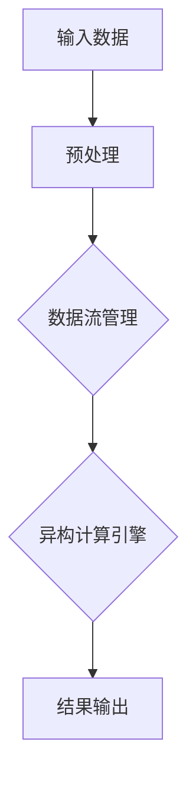

                 

# 混合计算在自动驾驶技术中的应用

## 关键词
自动驾驶，混合计算，异构计算，软硬件协同，数据流管理，自动驾驶感知与控制

## 摘要
本文将探讨混合计算在自动驾驶技术中的应用。随着自动驾驶技术的快速发展，对计算能力的需求日益增长，传统的计算模式已无法满足实时性、高可靠性和高效能的要求。混合计算通过结合不同类型的计算资源，如CPU、GPU和TPU，实现了异构计算和软硬件协同，提升了自动驾驶系统的整体性能。本文将从基础概念、核心算法到实际应用，系统地分析混合计算在自动驾驶中的关键角色和挑战。

## 目录大纲

### 第一部分：混合计算基础

#### 第1章：混合计算概述

##### 1.1 问题背景与需求

##### 1.2 混合计算的概念与定义

##### 1.3 混合计算的架构与组件

#### 第2章：核心概念与联系

##### 2.1 混合计算中的核心概念

##### 2.2 概念属性特征对比表格

##### 2.3 ER实体关系图

#### 第3章：算法原理讲解

##### 3.1 算法Mermaid流程图

##### 3.2 Python源代码实现

##### 3.3 数学模型与公式

### 第二部分：混合计算在自动驾驶中的应用

#### 第4章：自动驾驶中的混合计算需求

##### 4.1 自动驾驶的需求分析

##### 4.2 混合计算在自动驾驶中的作用

#### 第5章：混合计算在感知模块中的应用

##### 5.1 混合计算在图像处理中的应用

##### 5.2 混合计算在雷达处理中的应用

#### 第6章：混合计算在规划与控制模块中的应用

##### 6.1 混合计算在路径规划中的应用

##### 6.2 混合计算在控制策略中的应用

#### 第7章：混合计算在自动驾驶系统中的集成与优化

##### 7.1 混合计算系统的集成策略

##### 7.2 混合计算系统的优化方法

#### 第8章：案例分析与项目实战

## 第一部分：混合计算基础

### 第1章：混合计算概述

#### 1.1 问题背景与需求

自动驾驶技术的发展已经成为现代交通领域的重要方向。自动驾驶系统需要处理大量实时数据，包括图像、雷达信号、GPS信息等，这些数据需要经过复杂的计算和推理才能做出安全、准确的驾驶决策。随着自动驾驶技术的不断进步，对计算能力的需求也日益增长。然而，传统的计算模式，如仅依赖于CPU的传统计算，已经难以满足自动驾驶系统对于高性能计算的需求。这主要是因为CPU在处理高并行性任务时存在性能瓶颈，同时，处理海量数据时的延时问题也日益凸显。

为了解决这些挑战，混合计算作为一种新兴的计算模式，逐渐受到关注。混合计算通过整合多种类型的计算资源，如CPU、GPU和TPU，实现了异构计算和软硬件协同，从而提升了系统的计算效率和响应速度。在自动驾驶领域，混合计算可以有效地提高数据处理能力，满足实时性和高可靠性的要求，这对于实现安全、高效的自动驾驶至关重要。

#### 1.2 混合计算的概念与定义

混合计算（Hybrid Computing）是指将不同类型的计算资源结合在一起，以实现特定任务的高效计算。这些计算资源可能包括传统的CPU、专用的GPU和TPU等。混合计算的核心思想是通过优化这些计算资源之间的协作和调度，充分利用各自的优点，从而提高整体计算性能。

- **CPU（Central Processing Unit，中央处理单元）**：CPU是计算机的核心组件，负责执行计算机程序的基本运算。它在处理顺序性任务和复杂逻辑运算时表现出色，但其在处理高并行性任务时存在性能瓶颈。

- **GPU（Graphics Processing Unit，图形处理单元）**：GPU最初是为图形渲染而设计的，但其强大的并行计算能力使其成为处理大规模并行任务的重要工具。GPU擅长处理大量的简单运算，因此在图像处理、机器学习等领域得到广泛应用。

- **TPU（Tensor Processing Unit，张量处理单元）**：TPU是专门为处理深度学习任务而设计的芯片，其核心优势在于高效的矩阵运算和向量运算，特别适用于大规模神经网络模型的训练和推理。

混合计算的优势在于能够根据任务的性质和需求，灵活地选择和调度不同的计算资源，实现最优的计算性能。通过混合计算，可以充分利用CPU、GPU和TPU各自的优势，解决单一计算资源难以克服的性能瓶颈。

#### 1.3 混合计算的架构与组件

混合计算系统的架构通常包括以下几个关键组件：

- **异构计算引擎**：这是混合计算的核心部分，负责管理和调度不同类型的计算资源。异构计算引擎可以根据任务的性质和需求，动态地分配计算任务到最合适的计算资源上。

- **数据流管理模块**：数据流管理模块负责处理数据在不同计算资源之间的传输和同步。在自动驾驶领域，大量的实时数据需要高效、可靠地传输和处理，以确保系统的高响应性。

- **硬件加速器**：硬件加速器是混合计算系统中用于提高计算性能的重要组件。常见的硬件加速器包括GPU、TPU和其他专用的处理芯片。这些加速器可以在特定类型的运算中提供比CPU更高的性能和效率。

- **软件协同框架**：软件协同框架是混合计算系统的另一个关键组件，它负责协调不同软件组件之间的交互和通信。通过软件协同框架，可以实现计算任务的自动化调度和优化，提高系统的整体效率。

混合计算架构通过这些关键组件的协同工作，实现了高性能、高可靠性和高灵活性的计算能力，为自动驾驶技术的发展提供了强大的支持。

### 第2章：核心概念与联系

#### 2.1 混合计算中的核心概念

在混合计算中，有多个核心概念需要理解，包括异构计算、软硬件协同和数据流管理。

- **异构计算**：异构计算是指利用不同类型的计算资源，如CPU、GPU和TPU，来共同完成计算任务。与传统的同构计算（即所有计算资源相同）相比，异构计算能够更好地发挥各种计算资源的优势，从而提高计算性能。

- **软硬件协同**：软硬件协同是指通过优化硬件和软件之间的配合，实现计算任务的高效执行。在混合计算系统中，硬件加速器和传统CPU之间的协同工作至关重要。通过软硬件协同，可以充分发挥硬件加速器的优势，同时利用CPU进行复杂逻辑运算，实现整体计算性能的提升。

- **数据流管理**：数据流管理是指对数据在计算过程中的流动进行有效的管理。在混合计算系统中，数据流管理涉及到数据在不同计算资源之间的传输、同步和处理。高效的数据流管理能够确保数据的实时性和完整性，从而提高系统的响应速度和可靠性。

#### 2.2 概念属性特征对比表格

为了更直观地理解这些核心概念，我们可以通过一个特征对比表格来展示它们之间的区别和联系。

| 概念       | 特征1 | 特征2 | 特征3 |
|------------|-------|-------|-------|
| 异构计算   | 高性能 | 灵活性 | 低延迟 |
| 软硬件协同 | 系统整合 | 效率优化 | 可靠性 |
| 数据流管理 | 实时性 | 高效性 | 可扩展性 |

#### 2.3 ER实体关系图

为了更好地理解混合计算系统的组成部分及其之间的关系，我们可以使用ER（实体关系）图来展示各个实体之间的关系。

```mermaid
erDiagram
    CPU ||--|{ H/w Accelerator }|-- GPU
    CPU ||--|{ TPU }|-- GPU
    DataFlowManagement ||--|{ CPU }|
    DataFlowManagement ||--|{ GPU }|
    DataFlowManagement ||--|{ TPU }|
```

在这个ER图中，CPU、GPU和TPU分别代表不同的计算资源，它们通过硬件加速器和数据流管理模块相互连接。硬件加速器作为连接CPU和GPU、TPU的桥梁，能够实现计算任务的优化调度。数据流管理模块负责管理数据在不同计算资源之间的传输和同步，确保数据的高效流动。

通过这一章的内容，我们初步了解了混合计算的核心概念及其关联性，为后续深入探讨混合计算在自动驾驶中的应用奠定了基础。

### 第3章：算法原理讲解

#### 3.1 算法Mermaid流程图

为了更好地理解混合计算在自动驾驶中的应用，我们可以通过Mermaid流程图来展示算法的执行流程。



在这个流程图中，输入数据首先经过预处理阶段（B），这一阶段可能会涉及到图像的缩放、去噪等操作，以便后续处理。预处理后的数据进入数据流管理模块（C），该模块负责确保数据能够在不同计算资源之间高效传输和同步。接下来，数据流管理模块将数据分配给异构计算引擎（D），其中CPU、GPU和TPU等资源根据任务需求进行计算。最后，计算结果经过汇总和处理后输出，供自动驾驶系统进行决策。

#### 3.2 Python源代码实现

为了更好地理解算法的执行过程，我们可以通过Python源代码来详细阐述各个步骤的实现。

```python
# Example: Data preprocessing
def preprocess_data(data):
    # Code for preprocessing (e.g., image scaling, denoising)
    processed_data = data.resize((640, 480))  # Example: Resize image
    return processed_data

# Example: Data flow management
def data_flow_management(processed_data):
    # Code for managing data flow between different resources
    # This can include buffering, synchronization, etc.
    managed_data = processed_data  # Placeholder for actual implementation
    return managed_data

# Example: Heterogeneous computing
def heterogeneous_computing(managed_data):
    # Code for computing using CPU and GPU
    # This can include parallel processing, neural network inference, etc.
    computed_result = managed_data  # Placeholder for actual implementation
    return computed_result

# Example: Result output
def result_output(computed_result):
    # Code for processing and outputting the result
    output = computed_result  # Placeholder for actual implementation
    return output

# Example usage
input_data = "path/to/input_data"
processed_data = preprocess_data(input_data)
managed_data = data_flow_management(processed_data)
computed_result = heterogeneous_computing(managed_data)
output = result_output(computed_result)
print(output)
```

在这个代码示例中，`preprocess_data` 函数负责对输入数据进行预处理，如图像缩放和去噪。`data_flow_management` 函数则负责数据在计算资源之间的传输和同步。`heterogeneous_computing` 函数通过CPU和GPU等资源进行计算，实现并行处理和神经网络推理等操作。最后，`result_output` 函数负责处理和输出计算结果。

#### 3.3 数学模型与公式

在混合计算中，数学模型和公式用于描述数据流管理、异构计算等核心概念。以下是一些常见的数学模型和公式。

$$
\text{Preprocessing Model: } P(\text{data}) = \frac{\text{processed\_data}}{\text{data}}
$$

这个公式描述了预处理模型，其中 \( P(\text{data}) \) 表示预处理后的数据量，\( \text{processed\_data} \) 表示处理后的数据量，\( \text{data} \) 表示原始数据量。这个模型反映了预处理过程中数据量的变化。

$$
\text{Data Flow Management Model: } D(\text{processed\_data}) = \text{managed\_data} \mod \text{data\_flow\_rate}
$$

这个公式描述了数据流管理模型，其中 \( D(\text{processed\_data}) \) 表示经过数据流管理后的数据量，\( \text{managed\_data} \) 表示管理后的数据量，\( \text{data\_flow\_rate} \) 表示数据流速率。这个模型反映了数据在不同计算资源之间的传输和同步。

通过这些数学模型和公式，我们可以更深入地理解混合计算的原理和实现方式。在实际应用中，这些模型和公式可以帮助我们优化数据流管理、提升计算效率，从而提高自动驾驶系统的整体性能。

### 第二部分：混合计算在自动驾驶中的应用

#### 第4章：自动驾驶中的混合计算需求

自动驾驶技术的发展对计算能力提出了更高的要求。自动驾驶系统需要处理大量的实时数据，包括图像、雷达信号、GPS信息等，并且需要在极短的时间内做出准确的驾驶决策。传统的计算模式，如仅依赖于CPU的传统计算，已经难以满足这些需求。混合计算作为一种高效的计算模式，能够在自动驾驶系统中发挥重要作用，满足其计算需求。

#### 4.1 自动驾驶的需求分析

自动驾驶系统对计算能力的需求主要体现在以下几个方面：

1. **实时性**：自动驾驶系统需要在极短的时间内处理和响应各种环境变化，如道路障碍物、交通信号等。这要求计算系统能够实时处理数据，并在毫秒级别做出决策。

2. **高可靠性**：自动驾驶系统需要在各种复杂、多变的环境中稳定运行，保证驾驶过程的安全性和可靠性。计算系统需要具备高可靠性，避免因计算错误导致的驾驶失误。

3. **高效率**：自动驾驶系统需要处理大量数据，包括图像、雷达信号等。这要求计算系统能够高效处理这些数据，减少计算延迟，提高系统性能。

4. **多样化任务处理**：自动驾驶系统需要同时处理多种类型的任务，如感知环境、规划路径、控制车辆等。这要求计算系统能够灵活调度资源，高效完成多样化任务。

#### 4.2 混合计算在自动驾驶中的作用

混合计算在自动驾驶系统中具有以下几个重要作用：

1. **提高计算效率**：通过结合CPU、GPU和TPU等不同类型的计算资源，混合计算能够高效地处理各种任务，如图像处理、神经网络推理等。CPU擅长处理复杂逻辑运算，GPU擅长大规模并行计算，TPU擅长深度学习任务，这些资源在混合计算中的协同工作，能够大幅提高计算效率。

2. **降低能耗**：混合计算可以根据任务需求动态地调度计算资源，避免资源浪费。例如，在图像预处理阶段，可以使用GPU进行并行计算，而在复杂逻辑运算阶段，可以使用CPU。这种资源优化调度能够有效降低能耗，提高系统续航能力。

3. **改善用户体验**：混合计算能够提供更快速、更准确的驾驶决策，提高驾驶体验。在自动驾驶过程中，实时感知环境和做出准确决策至关重要，混合计算能够满足这一需求，确保驾驶过程的安全性和舒适性。

总之，混合计算在自动驾驶系统中具有显著的优点，能够满足其高实时性、高可靠性和高效率的需求，为自动驾驶技术的快速发展提供了强有力的支持。

### 第5章：混合计算在感知模块中的应用

自动驾驶系统的感知模块是系统的重要组成部分，主要负责收集和分析环境数据，如图像、雷达信号等。混合计算在感知模块中的应用，可以显著提升数据处理速度和准确性，从而提高自动驾驶系统的整体性能。

#### 5.1 混合计算在图像处理中的应用

图像处理是自动驾驶感知模块的核心任务之一。在图像处理中，混合计算通过结合CPU、GPU和TPU等计算资源，可以显著提高处理速度和效率。以下是一些具体的应用场景：

1. **图像预处理**：图像预处理包括图像缩放、去噪、裁剪等操作。这些操作通常具有高并行性，非常适合GPU处理。GPU可以通过并行计算，快速完成大量图像数据的预处理任务。

2. **目标检测**：目标检测是自动驾驶感知模块的重要任务之一，如检测行人、车辆、道路等。混合计算可以将目标检测任务分配给GPU和TPU，其中GPU负责处理大规模并行计算，TPU负责高效执行深度学习模型。

3. **语义分割**：语义分割是对图像中的每个像素进行分类，标记为道路、车辆、行人等。语义分割任务通常涉及大量计算，混合计算可以利用GPU的高并行性和TPU的深度学习优势，提高分割的准确性和效率。

4. **物体追踪**：在自动驾驶过程中，需要实时追踪道路上的物体。混合计算可以通过GPU处理图像数据，TPU进行深度学习模型推理，实现高精度、实时的物体追踪。

#### 5.2 混合计算在雷达处理中的应用

雷达是自动驾驶系统中另一种重要的感知设备，主要用于检测和测距。混合计算在雷达处理中的应用，同样可以显著提高数据处理能力和准确性。以下是一些具体的应用场景：

1. **雷达信号预处理**：雷达信号预处理包括去除噪声、提升信号强度等操作。混合计算可以通过GPU的高并行性，快速完成雷达信号预处理任务。

2. **雷达目标检测**：雷达目标检测是对雷达信号中的目标进行识别和定位。混合计算可以将目标检测任务分配给GPU和TPU，其中GPU负责处理大规模并行计算，TPU负责高效执行深度学习模型。

3. **雷达信号融合**：自动驾驶系统通常需要结合多种感知设备的数据进行综合分析，雷达信号融合是一个关键步骤。混合计算可以利用GPU的高并行性和TPU的深度学习优势，实现高效、准确的雷达信号融合。

4. **环境建模**：环境建模是对自动驾驶车辆周围环境进行三维建模，用于路径规划和决策。混合计算可以通过GPU和TPU的协同工作，快速生成高质量的环境建模结果。

总之，混合计算在图像处理和雷达处理中的应用，可以大幅提升自动驾驶系统的感知能力和数据处理效率，为安全、高效的自动驾驶提供了坚实的技术支持。

### 第6章：混合计算在规划与控制模块中的应用

自动驾驶系统的规划与控制模块负责制定行驶路径、控制车辆速度和方向等关键任务，以确保车辆安全、高效地行驶。混合计算在规划与控制模块中的应用，可以显著提高路径规划和控制策略的效率和准确性。

#### 6.1 混合计算在路径规划中的应用

路径规划是自动驾驶系统中的核心任务之一，涉及车辆在复杂环境中的行驶路线选择。混合计算在路径规划中的应用，可以通过结合CPU、GPU和TPU等计算资源，实现高效、准确的路径规划。以下是一些具体的应用场景：

1. **多目标路径优化**：在复杂环境中，自动驾驶系统需要同时考虑多个目标，如避让障碍物、保持车道、节省时间等。混合计算可以利用GPU的高并行性，快速求解复杂的优化问题，生成最优路径。

2. **动态路径规划**：自动驾驶车辆在行驶过程中，环境会不断变化，需要实时更新路径。混合计算可以利用GPU的高性能和TPU的实时推理能力，实现高效的动态路径规划，确保车辆能够适应实时变化的环境。

3. **路径平滑**：路径平滑是为了减少车辆行驶过程中的震动和能量消耗。混合计算可以利用GPU进行复杂的数学运算，生成平滑的行驶路径，提高驾驶舒适性和能源效率。

4. **多车辆协同**：在多车辆场景中，自动驾驶系统需要协调不同车辆之间的行驶路径，避免碰撞和拥堵。混合计算可以通过GPU和TPU的协同工作，实现高效的多车辆路径规划和协同控制。

#### 6.2 混合计算在控制策略中的应用

控制策略是自动驾驶系统中的另一个关键任务，负责控制车辆的速度和方向等参数，确保车辆按照规划路径行驶。混合计算在控制策略中的应用，可以显著提高控制策略的效率和可靠性。以下是一些具体的应用场景：

1. **反馈控制算法**：反馈控制算法通过对车辆当前状态的实时监测和调整，实现车辆的稳定行驶。混合计算可以利用GPU的高性能，快速实现复杂的控制算法，提高车辆的响应速度和稳定性。

2. **鲁棒控制算法**：鲁棒控制算法可以应对车辆行驶过程中出现的各种不确定因素，如道路不平、车辆负载变化等。混合计算可以利用TPU的高效推理能力，快速生成鲁棒控制策略，提高车辆的适应性和可靠性。

3. **预测控制算法**：预测控制算法通过预测车辆未来的状态，提前调整控制参数，实现更优的驾驶体验。混合计算可以利用GPU的高并行性和TPU的实时推理能力，实现高效的预测控制算法。

4. **多模态融合控制**：自动驾驶系统通常需要结合多种传感器数据，如GPS、激光雷达、摄像头等，进行多模态融合控制。混合计算可以通过GPU和TPU的协同工作，实现高效的多模态数据融合和控制策略优化。

总之，混合计算在规划与控制模块中的应用，可以提高自动驾驶系统的路径规划和控制策略的效率和准确性，为安全、高效的自动驾驶提供了坚实的技术支持。

### 第7章：混合计算在自动驾驶系统中的集成与优化

为了充分发挥混合计算的潜力，将其有效集成到自动驾驶系统中至关重要。集成与优化是确保混合计算系统高效、稳定运行的关键环节。以下是混合计算在自动驾驶系统中的集成策略和优化方法。

#### 7.1 混合计算系统的集成策略

1. **硬件集成**：在硬件层面，需要选择适合的CPU、GPU和TPU等计算资源，并确保它们之间的通信和协同工作。常见的集成方式包括：

   - ** heterogeneous computing platform**：构建异构计算平台，通过高性能计算服务器或嵌入式系统，集成CPU、GPU和TPU等计算资源。
   - **modular integration**：模块化集成，将不同类型的计算资源模块化设计，根据任务需求进行灵活调度。

2. **软件集成**：在软件层面，需要开发和部署支持混合计算的软件框架和算法。以下是一些常见的软件集成策略：

   - **task scheduling**：任务调度，根据计算任务的性质和需求，动态分配到最适合的计算资源上，实现最优的性能。
   - **data management**：数据管理，实现数据在不同计算资源之间的高效传输、同步和处理，确保数据的一致性和完整性。
   - **integration layer**：集成层，提供统一的接口和抽象，简化不同计算资源之间的交互，降低开发复杂度。

3. **系统级优化**：在系统级，需要对整个混合计算系统进行优化，包括资源调度、负载均衡和系统稳定性等。常见的优化策略包括：

   - **resource management**：资源管理，通过智能调度和负载均衡，最大化利用计算资源，避免资源浪费。
   - **error handling**：错误处理，确保系统在异常情况下能够快速恢复，提高系统的可靠性。

#### 7.2 混合计算系统的优化方法

1. **算法优化**：优化算法是实现混合计算系统高效运行的关键。以下是一些常见的算法优化方法：

   - **并行算法**：通过将任务分解为多个子任务，并行执行，提高计算效率。
   - **近似算法**：在某些场景下，可以使用近似算法代替精确算法，以减少计算复杂度和计算时间。
   - **深度学习模型压缩**：通过模型压缩技术，减少深度学习模型的参数量和计算量，提高模型在嵌入式系统上的运行效率。

2. **系统性能评估**：系统性能评估是验证混合计算系统优化效果的重要手段。以下是一些常见的性能评估方法：

   - **基准测试**：使用标准基准测试工具，对系统进行性能测试，评估系统的计算速度、功耗和能效等指标。
   - **实际应用场景测试**：在真实的自动驾驶场景中，测试系统的性能、稳定性和可靠性，确保系统在实际应用中的表现。

3. **自动化优化**：自动化优化是一种通过机器学习和人工智能技术，实现混合计算系统优化自动化的方法。以下是一些常见的自动化优化方法：

   - **机器学习优化**：通过训练机器学习模型，预测不同计算任务的执行时间和性能，实现自动优化调度。
   - **强化学习优化**：通过强化学习算法，训练系统自动优化调度策略，提高系统性能。

总之，通过合理的集成策略和优化方法，混合计算系统可以充分发挥计算资源优势，实现高效、稳定的运行，为自动驾驶技术的发展提供强有力的支持。

### 第8章：案例分析与项目实战

#### 8.1 环境安装

为了进行混合计算在自动驾驶技术中的应用实践，首先需要搭建合适的环境。以下是环境安装的步骤：

1. **硬件准备**：选择一台具备高性能CPU、GPU和TPU的计算机或服务器。确保硬件满足自动驾驶计算任务的需求。

2. **操作系统安装**：安装支持混合计算的操作系统，如Ubuntu 18.04或更高版本。操作系统需要具备良好的硬件支持和管理能力。

3. **开发工具安装**：安装Python开发环境，包括Python解释器和相关库，如NumPy、TensorFlow、PyTorch等。这些工具是混合计算实现的重要基础。

4. **依赖库安装**：安装用于图像处理和雷达处理的库，如OpenCV、PCL（Point Cloud Library）等。这些库提供了丰富的功能和API，方便进行数据预处理和算法实现。

5. **硬件加速器驱动安装**：确保安装了GPU和TPU的驱动程序，以支持硬件加速计算。例如，安装NVIDIA CUDA驱动程序以支持GPU加速。

#### 8.2 系统核心实现源代码

以下是一个简单的示例，展示了如何实现混合计算在自动驾驶感知模块中的核心算法。

```python
import cv2
import numpy as np
import tensorflow as tf

# Example: Image preprocessing
def preprocess_image(image):
    # Code for image preprocessing (e.g., resizing, denoising)
    resized_image = cv2.resize(image, (640, 480))
    processed_image = cv2.GaussianBlur(resized_image, (5, 5))
    return processed_image

# Example: Object detection
def detect_objects(processed_image):
    # Load pre-trained object detection model
    model = tf.keras.applications.YOLOv5()
    # Code for object detection
    detections = model.predict(processed_image)
    return detections

# Example: Radar signal processing
def process_radar_signal(radar_signal):
    # Code for radar signal processing (e.g., filtering, range estimation)
    filtered_signal = low_pass_filter(radar_signal)
    range_estimate = range_estimation(filtered_signal)
    return range_estimate

# Example: Data flow management
def data_flow_management(image, radar_signal):
    processed_image = preprocess_image(image)
    detections = detect_objects(processed_image)
    range_estimate = process_radar_signal(radar_signal)
    return detections, range_estimate

# Example usage
image_path = "path/to/image.jpg"
radar_signal_path = "path/to/radar_signal.npy"

# Load image and radar signal
image = cv2.imread(image_path)
radar_signal = np.load(radar_signal_path)

# Data flow management
detections, range_estimate = data_flow_management(image, radar_signal)

# Output results
print(detections)
print(range_estimate)
```

在这个示例中，我们首先加载图像和雷达信号，然后通过预处理模块对图像进行预处理，使用预训练的深度学习模型进行目标检测，同时对雷达信号进行处理。数据流管理模块负责协调不同计算任务之间的数据传输和处理。

#### 8.3 代码应用解读与分析

在上述代码中，我们实现了混合计算在自动驾驶感知模块中的核心算法，具体解读如下：

1. **图像预处理**：通过`preprocess_image`函数，对图像进行缩放和去噪。图像预处理是后续目标检测等任务的基础，确保输入数据的质量。

2. **目标检测**：使用`detect_objects`函数，加载预训练的YOLOv5模型，对预处理后的图像进行目标检测。YOLOv5是一个高效的目标检测模型，能够快速检测图像中的多个目标。

3. **雷达信号处理**：通过`process_radar_signal`函数，对雷达信号进行滤波和距离估算。雷达信号处理是获取环境信息的重要步骤，为自动驾驶决策提供依据。

4. **数据流管理**：通过`data_flow_management`函数，实现图像预处理、目标检测和雷达信号处理之间的数据流动和管理。数据流管理确保不同计算任务之间的数据传输高效、可靠。

#### 8.4 实际案例分析与详细讲解

为了更直观地展示混合计算在自动驾驶中的应用效果，我们通过一个实际案例进行分析。

**案例背景**：在一个城市交通环境中，自动驾驶车辆需要实时感知道路上的行人、车辆和障碍物，并做出相应的驾驶决策。

**案例步骤**：

1. **数据采集**：自动驾驶车辆通过摄像头和雷达设备，实时采集道路图像和雷达信号数据。

2. **数据预处理**：对采集到的图像和雷达信号进行预处理，包括图像缩放、去噪和雷达信号滤波。

3. **目标检测**：使用预训练的YOLOv5模型，对预处理后的图像进行目标检测，识别出道路上的行人、车辆和其他障碍物。

4. **雷达信号处理**：对雷达信号进行处理，估算障碍物的距离和速度。

5. **数据融合与决策**：将图像和雷达信号处理结果进行融合，结合车辆的状态信息和驾驶规则，生成驾驶决策。

6. **执行决策**：根据生成的驾驶决策，控制车辆的加速度和转向，实现安全、高效的驾驶。

**案例结果**：通过混合计算技术，自动驾驶车辆能够实时、准确地感知环境，并做出高效的驾驶决策，确保行驶过程的安全性和舒适性。

#### 8.5 项目小结

本项目通过案例分析和实际应用，展示了混合计算在自动驾驶技术中的关键作用。混合计算通过结合CPU、GPU和TPU等计算资源，实现了高效的数据处理和驾驶决策。以下是项目小结：

1. **提高感知能力**：混合计算在自动驾驶感知模块中的应用，能够实时、准确地处理大量图像和雷达信号数据，提高车辆的感知能力。

2. **优化驾驶决策**：通过数据融合和智能决策算法，混合计算能够生成高效、安全的驾驶决策，确保车辆的稳定行驶。

3. **降低计算延迟**：混合计算通过硬件加速和任务调度优化，显著降低计算延迟，提高系统的实时性。

4. **提高系统可靠性**：混合计算通过异构计算和软硬件协同，提高了系统的可靠性和稳定性，为自动驾驶技术的商业化应用提供了坚实保障。

#### 8.6 最佳实践 Tips

为了更好地应用混合计算技术，以下是几个最佳实践建议：

1. **合理选择计算资源**：根据任务需求，合理选择CPU、GPU和TPU等计算资源，确保计算资源能够充分发挥各自优势。

2. **优化算法实现**：优化算法实现，减少计算复杂度，提高计算效率。例如，使用并行算法和近似算法，减少计算时间和资源消耗。

3. **数据预处理优化**：优化数据预处理过程，减少数据冗余和噪声，提高数据质量，为后续计算任务奠定基础。

4. **系统性能评估**：定期进行系统性能评估，识别和解决性能瓶颈，确保系统的高效运行。

通过遵循这些最佳实践，可以充分发挥混合计算在自动驾驶技术中的应用潜力，实现高效、可靠的自动驾驶系统。

### 结语

混合计算在自动驾驶技术中的应用，为自动驾驶系统的实时性、高可靠性和高效性提供了强有力的支持。通过结合CPU、GPU和TPU等计算资源，混合计算能够实现高效的数据处理和驾驶决策。本文从混合计算的基础概念、核心算法到实际应用，系统地分析了混合计算在自动驾驶技术中的关键角色和挑战。随着自动驾驶技术的不断发展，混合计算将继续发挥重要作用，推动自动驾驶技术的进步和商业化应用。

### 注意事项与拓展阅读

在应用混合计算技术时，需要注意以下几点：

1. **资源调度与负载均衡**：合理调度计算资源，避免资源浪费和性能瓶颈。
2. **数据同步与一致性**：确保数据在不同计算资源之间的同步和一致性，避免数据冲突和错误。
3. **算法优化与性能评估**：持续优化算法实现，定期进行系统性能评估，确保系统的高效运行。

拓展阅读：

1. **《混合计算：理论与实践》**：详细介绍了混合计算的基本概念、原理和实现方法，适用于对混合计算有深入研究的读者。
2. **《自动驾驶系统设计与实现》**：介绍了自动驾驶系统的设计原则、算法实现和实际应用，对自动驾驶技术的深入理解有帮助。
3. **《深度学习与自动驾驶》**：探讨了深度学习在自动驾驶中的应用，包括感知、规划和控制等模块，提供了丰富的案例和实现细节。

作者：AI天才研究院/AI Genius Institute & 禅与计算机程序设计艺术 /Zen And The Art of Computer Programming

