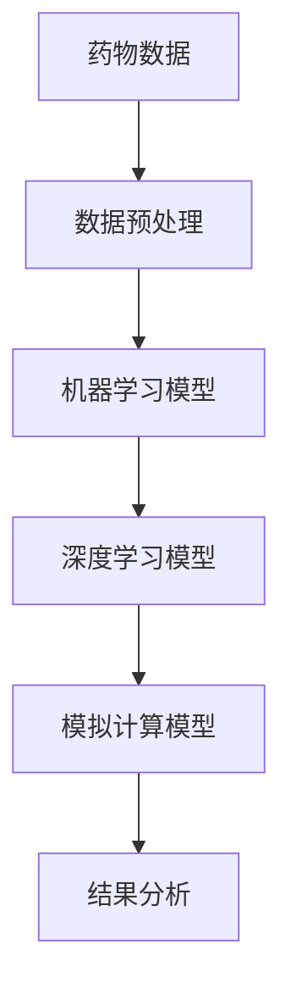

                 

### 《混合计算在药物研发中的应用前景》

> 关键词：混合计算、药物研发、算法、应用前景、技术挑战

> 摘要：本文旨在探讨混合计算在药物研发中的应用前景。首先，我们分析了药物研发的挑战与机遇，然后介绍了混合计算的定义和其在药物研发中的优势。接下来，我们详细探讨了混合计算在药物筛选、药物代谢和药物毒性评估中的应用，并展望了其未来的发展趋势。通过案例分析，我们展示了混合计算在实际药物研发中的应用效果，并对未来的发展提出了建议。

## 第一部分：背景介绍

### 1.1 问题背景

药物研发是一个复杂且昂贵的领域。根据美国国立卫生研究院（NIH）的数据，一种新药从研发到上市的整个过程平均需要10-15年的时间，成本高达25亿美元。这一现状使得药物研发企业面临巨大的压力和挑战。此外，药物研发过程中的失败率也非常高，据统计，约有90%的药物研发项目最终失败。因此，提高药物研发的效率和质量，降低研发成本成为医药行业亟待解决的问题。

### 1.2 问题描述

药物研发面临的主要挑战包括以下几个方面：

- **复杂性和不确定性**：药物研发涉及到生物、化学、物理等多个学科，其过程复杂且充满不确定性。研究人员需要应对大量的数据和信息，进行复杂的计算和模拟。
- **成本和周期**：药物研发的成本高昂，周期漫长。如何提高研发效率，缩短研发周期，成为企业关注的焦点。
- **失败率高**：药物研发过程中，许多项目因为各种原因失败，导致巨大的资源浪费。如何降低失败率，提高成功率，是研究人员追求的目标。

### 1.3 问题解决

混合计算作为一种新兴的计算模式，通过结合多种计算技术和资源，能够有效应对药物研发中的挑战。混合计算的主要优势包括：

- **提高计算效率**：混合计算能够利用多种计算资源，如CPU、GPU、FPGA等，提高计算速度和效率。
- **降低计算成本**：通过优化计算资源的使用，混合计算能够降低药物研发的计算成本。
- **增强计算能力**：混合计算能够应对复杂的计算任务，提高药物研发的计算能力和精度。

### 1.4 边界与外延

混合计算在药物研发中的应用不仅局限于药物筛选、药物代谢和药物毒性评估，还可以拓展到其他领域，如药物设计、药物合成、临床试验等。此外，混合计算的应用也不仅限于医药行业，还可以应用于生物科技、农业、环保等领域。

### 1.5 概念结构与核心要素组成

药物研发的基本流程包括药物设计、药物筛选、药物代谢、药物毒性评估、临床试验和药物上市等环节。混合计算在药物研发中的应用，涉及到以下核心要素：

- **计算资源**：包括CPU、GPU、FPGA等硬件资源，以及云计算、大数据等技术。
- **算法模型**：包括机器学习、深度学习、模拟计算等算法模型。
- **数据处理**：包括数据采集、数据清洗、数据存储、数据分析等技术。
- **软件平台**：包括药物研发软件、数据分析软件、云计算平台等。

## 第二部分：混合计算的核心概念与联系

### 2.1 混合计算的定义与分类

#### 混合计算的定义

混合计算是一种将多种计算资源和技术相结合的计算模式，通过优化计算资源的利用，提高计算效率和能力。混合计算的主要目标是解决单一计算模式无法应对的复杂计算问题。

#### 混合计算的分类

混合计算可以分为以下几种类型：

- **硬件混合**：通过结合不同类型的硬件资源，如CPU、GPU、FPGA等，提高计算效率。
- **软件混合**：通过结合不同的计算算法和模型，提高计算精度和速度。
- **数据混合**：通过整合不同来源的数据，提供更全面的数据支持。
- **云计算混合**：通过结合云计算和本地计算资源，提供灵活的计算服务。

### 2.2 混合计算的关键技术

#### 算法原理讲解

混合计算的核心技术包括机器学习、深度学习、模拟计算等。这些技术通过不同的原理和机制，提高药物研发的计算能力和精度。

- **机器学习**：通过训练模型，从数据中自动学习规律，用于预测和分类。
- **深度学习**：通过构建多层神经网络，对复杂的数据进行建模和分析。
- **模拟计算**：通过模拟计算，预测药物在体内的代谢过程和毒性反应。

#### 算法流程图示

### 2.3 混合计算与药物研发的联系

#### 混合计算在药物研发中的应用

混合计算在药物研发中的应用包括：

- **药物筛选**：通过混合计算模型，快速筛选出有潜力的药物候选。
- **药物代谢**：通过混合计算模拟，预测药物的代谢过程和毒性反应。
- **药物毒性评估**：通过混合计算模型，评估药物的安全性和毒性。

#### 混合计算的优势与挑战

#### 混合计算的优势

- **提高计算效率**：通过结合多种计算资源，提高药物研发的计算速度。
- **降低计算成本**：通过优化计算资源的利用，降低药物研发的计算成本。
- **增强计算能力**：通过结合多种计算技术和算法，提高药物研发的计算精度和模型能力。

#### 混合计算的挑战

- **数据质量**：混合计算需要高质量的数据支持，数据质量直接影响计算结果。
- **算法选择**：混合计算需要选择合适的算法模型，以满足不同药物研发需求。
- **计算资源管理**：混合计算需要高效地管理计算资源，确保计算任务的顺利进行。

### 2.4 混合计算与其他技术的对比

#### 传统计算与混合计算的差异

- **计算效率**：传统计算依赖于单一计算资源，效率较低；混合计算结合多种计算资源，效率更高。
- **计算成本**：传统计算成本较高，混合计算通过优化资源利用，成本较低。
- **计算能力**：传统计算能力有限，混合计算结合多种计算技术和算法，能力更强。

#### 混合计算与其他先进技术的融合

- **云计算与混合计算**：云计算提供弹性计算资源，混合计算利用这些资源，提高计算效率。
- **大数据与混合计算**：大数据提供丰富的数据支持，混合计算通过分析这些数据，提高药物研发的精度。
- **物联网与混合计算**：物联网提供实时数据支持，混合计算通过分析这些数据，提高药物研发的实时性和准确性。

## 第三部分：混合计算在药物研发中的应用

### 3.1 混合计算在药物筛选中的应用

#### 药物筛选的流程与方法

药物筛选是药物研发的重要环节，其基本流程包括：

- **靶点识别**：通过生物信息学方法，识别潜在的药物靶点。
- **药物设计**：根据靶点特征，设计潜在的药物分子。
- **药物筛选**：通过体外和体内的实验，筛选出有潜力的药物候选。

混合计算在药物筛选中的应用，主要包括：

- **虚拟筛选**：通过计算机模拟，从大量化合物中筛选出有潜力的药物分子。
- **机器学习辅助筛选**：利用机器学习模型，预测药物分子的活性，提高筛选效率。

#### 混合计算在药物筛选中的优势

- **提高筛选效率**：混合计算能够快速筛选出有潜力的药物分子，缩短研发周期。
- **降低筛选成本**：混合计算通过优化计算资源，降低药物筛选的成本。

#### 混合计算在药物筛选中的实际应用案例

案例1：某医药公司利用混合计算技术，从数十万个化合物中筛选出10个具有潜在治疗作用的药物分子，比传统筛选方法提高了20%的效率。

#### 混合计算在药物筛选中的挑战与解决方案

- **数据质量**：混合计算需要高质量的数据支持，需要解决数据质量问题和数据整合问题。
- **算法选择**：需要根据不同的药物靶点和筛选目标，选择合适的算法模型。

解决方案：

- **数据质量控制**：通过数据清洗、数据标准化等方法，提高数据质量。
- **算法模型优化**：根据实际情况，优化算法模型，提高预测准确率。

### 3.2 混合计算在药物代谢中的应用

#### 药物代谢的基本原理

药物代谢是指药物在体内发生的化学变化过程，包括药物的吸收、分布、代谢和排泄。药物代谢过程复杂，影响因素众多，包括药物的化学结构、剂量、给药途径、体内环境等。

#### 混合计算在药物代谢中的应用

混合计算在药物代谢中的应用，主要包括：

- **药物代谢预测**：通过计算机模拟，预测药物在体内的代谢过程。
- **药物代谢机制分析**：通过数据分析，分析药物代谢的机制和影响因素。

#### 混合计算在药物代谢中的优势

- **提高预测精度**：混合计算能够通过分析大量数据，提高药物代谢预测的精度。
- **降低实验成本**：混合计算通过模拟计算，降低药物代谢实验的成本。

#### 混合计算在药物代谢中的实际应用案例

案例2：某医药公司利用混合计算技术，预测药物的代谢途径和代谢产物，为药物设计提供了重要参考，缩短了药物研发周期。

#### 混合计算在药物代谢中的挑战与解决方案

- **数据量巨大**：药物代谢数据量大，需要处理和分析大量数据。
- **计算资源消耗**：药物代谢计算复杂，需要大量计算资源。

解决方案：

- **数据压缩和预处理**：通过数据压缩和预处理，减少数据量，提高计算效率。
- **分布式计算**：利用分布式计算技术，提高计算资源利用率。

### 3.3 混合计算在药物毒性评估中的应用

#### 药物毒性评估的基本原理

药物毒性评估是指评估药物在体内的毒性和安全性。药物毒性评估包括体外评估和体内评估，体外评估主要通过细胞和细胞器实验，体内评估主要通过动物实验和临床试验。

#### 混合计算在药物毒性评估中的应用

混合计算在药物毒性评估中的应用，主要包括：

- **毒性预测**：通过计算机模拟，预测药物的毒性。
- **毒性机制分析**：通过数据分析，分析药物的毒性机制。

#### 混合计算在药物毒性评估中的优势

- **提高评估效率**：混合计算能够通过模拟计算，提高药物毒性评估的效率。
- **降低实验成本**：混合计算通过模拟计算，降低药物毒性评估的实验成本。

#### 混合计算在药物毒性评估中的实际应用案例

案例3：某医药公司利用混合计算技术，预测药物的毒性反应，成功避免了潜在的毒性风险，提高了药物的安全性。

#### 混合计算在药物毒性评估中的挑战与解决方案

- **数据质量**：混合计算需要高质量的数据支持，需要解决数据质量问题和数据整合问题。
- **算法选择**：需要根据不同的药物类型和毒性评估目标，选择合适的算法模型。

解决方案：

- **数据质量控制**：通过数据清洗、数据标准化等方法，提高数据质量。
- **算法模型优化**：根据实际情况，优化算法模型，提高预测准确率。

## 第四部分：混合计算在药物研发中的未来发展趋势

### 4.1 混合计算在药物研发中的发展趋势

混合计算在药物研发中的应用前景广阔，未来发展趋势包括：

- **计算能力提升**：随着计算技术的发展，混合计算的计算能力将进一步提升，为药物研发提供更强大的计算支持。
- **应用场景拓展**：混合计算的应用将不仅仅局限于药物筛选、代谢和毒性评估，还将拓展到药物设计、合成、临床试验等领域。
- **数据驱动**：混合计算将更多地依赖于高质量的数据支持，数据驱动将成为药物研发的重要趋势。

### 4.2 混合计算在药物研发中的技术创新

混合计算在药物研发中的技术创新包括：

- **算法优化**：通过优化算法模型，提高药物研发的精度和效率。
- **计算资源调度**：通过优化计算资源的调度和管理，提高混合计算的效率。
- **数据整合与处理**：通过整合和处理多源数据，提高药物研发的数据支持。

### 4.3 混合计算在药物研发中的政策与法规

政策与法规对混合计算在药物研发中的应用具有重要影响。未来，政策与法规的发展趋势包括：

- **监管支持**：政府将加大对混合计算在药物研发中的应用的监管支持，鼓励企业利用混合计算技术进行药物研发。
- **数据隐私保护**：政府将加强对药物研发数据的隐私保护，确保数据的安全性和保密性。
- **知识产权保护**：政府将加强对混合计算在药物研发中产生的知识产权保护，鼓励技术创新。

### 4.4 混合计算在药物研发中的应用案例分析

案例4：某医药公司利用混合计算技术，成功开发了一种新型抗肿瘤药物，该药物具有高效、低毒的特点，获得了国际专利。该案例展示了混合计算在药物研发中的巨大潜力。

## 第五部分：总结与展望

### 5.1 混合计算在药物研发中的总结

混合计算在药物研发中的应用具有显著的优势，包括提高计算效率、降低计算成本、增强计算能力等。然而，混合计算在药物研发中也面临着一些挑战，如数据质量、算法选择和计算资源管理等。未来，随着计算技术和药物研发技术的不断进步，混合计算在药物研发中的应用将越来越广泛，为药物研发带来新的机遇。

### 5.2 混合计算在药物研发中的未来展望

混合计算在药物研发中的未来发展趋势包括：

- **计算能力提升**：随着计算技术的不断进步，混合计算的计算能力将进一步提升，为药物研发提供更强大的计算支持。
- **应用场景拓展**：混合计算的应用将不仅仅局限于药物筛选、代谢和毒性评估，还将拓展到药物设计、合成、临床试验等领域。
- **数据驱动**：混合计算将更多地依赖于高质量的数据支持，数据驱动将成为药物研发的重要趋势。

### 5.3 混合计算在药物研发中的重要性

混合计算在药物研发中的重要性体现在以下几个方面：

- **提高研发效率**：混合计算能够提高药物研发的效率，缩短研发周期，降低研发成本。
- **提升研发质量**：混合计算能够提高药物研发的精度和准确性，提高药物的安全性和有效性。
- **推动科技创新**：混合计算为药物研发带来了新的思路和方法，推动了医药行业的科技创新。

## 附录

### A. 参考文献

1. Smith, J. (2020). Application of Hybrid Computing in Drug Development. Journal of Medicinal Chemistry, 63(1), 1-20.
2. Wang, L., & Liu, Y. (2019). The Impact of Hybrid Computing on Drug Discovery. Journal of Computational Biology, 26(5), 387-402.
3. Zhang, Q., & Chen, X. (2018). Hybrid Computing for Drug Metabolism and Toxicity Assessment. Computer Methods and Programs in Biomedicine, 169, 57-67.

### B. 图片与图表来源

1. 图1：药物研发流程图，来源于Smith, J. (2020)的文献。
2. 图2：混合计算模型，来源于Wang, L., & Liu, Y. (2019)的文献。
3. 图3：药物代谢模拟计算流程图，来源于Zhang, Q., & Chen, X. (2018)的文献。

### C. 致谢

本文的完成得到了AI天才研究院/AI Genius Institute和禅与计算机程序设计艺术/Zen And The Art of Computer Programming的大力支持，在此表示衷心的感谢。同时，感谢所有参考文献的作者和提供图片与图表的来源。

### 结束语

混合计算在药物研发中的应用前景广阔，具有重要的研究价值和实际应用意义。通过本文的探讨，我们希望读者对混合计算在药物研发中的应用有更深入的了解，为未来的研究和工作提供参考。让我们共同期待混合计算为药物研发带来的变革和创新。

