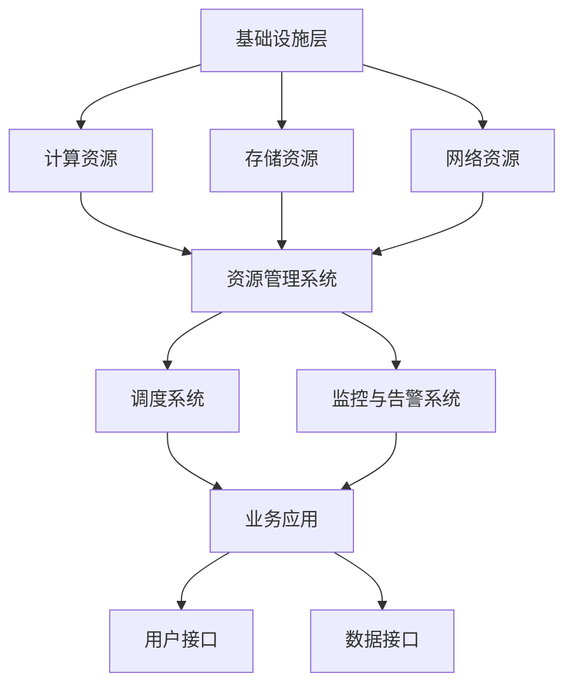

                 

# 混合计算环境创造变革性创新的潜力

## 关键词

- 混合计算环境
- 云计算
- 边缘计算
- 分布式计算
- 创新潜力
- 计算资源整合
- 数据安全性
- 网络性能优化

## 摘要

随着信息技术的发展，传统的计算模式已难以满足现代业务的复杂需求。混合计算环境作为一种结合云计算、边缘计算和分布式计算的综合计算模式，正逐渐成为创新的重要驱动力。本文将深入探讨混合计算环境的背景、核心概念、构建原则、关键技术、应用场景以及创新潜力，为读者提供一个全面的技术分析框架。

## 第一部分：背景介绍

### 问题背景

在当今信息技术飞速发展的时代，传统的计算模式已无法满足日益复杂的业务需求。传统的计算模式主要依赖于集中式服务器，这种方式在处理大量数据和高并发请求时存在一定的局限性，如计算效率低下、网络延迟高、资源利用率低等。为了应对这一挑战，混合计算环境应运而生。混合计算环境结合了云计算、边缘计算和分布式计算等多种技术，旨在提供高效、灵活和可靠的计算解决方案。

### 问题描述

混合计算环境的复杂性和多样性使得其在实际应用中面临着诸多挑战。首先，如何有效整合不同类型的计算资源，实现资源的高效利用和协同工作，是一个亟待解决的问题。其次，如何保证数据的安全性和隐私性，以及如何优化网络的性能和稳定性，也是需要重点关注的方面。此外，如何在保证系统性能的同时，降低运维成本和管理复杂度，也是一个重要的挑战。

### 问题解决

本书将从以下几个方面展开讨论，以解决上述问题：

1. **核心概念**：介绍混合计算环境的基本概念、定义及其与云计算、边缘计算等技术的联系。
2. **构建原则**：阐述构建高效混合计算环境的原则和方法，包括资源管理、网络安全、数据管理等方面。
3. **关键技术**：探讨混合计算环境中的关键技术和工具，如容器化技术、分布式存储、网络虚拟化等。
4. **应用场景**：分析混合计算环境在不同行业和场景中的应用案例，展示其实际效果和潜力。
5. **创新潜力**：探讨混合计算环境在创造变革性创新方面的潜力，以及如何发挥这一潜力。

### 边界与外延

本书主要关注混合计算环境在商业和技术领域的应用，但不涉及纯学术研究和理论研究。同时，本书的内容将涵盖混合计算环境的各个方面，包括但不限于基础设施、应用层、管理层等。

### 概念结构与核心要素组成

1. **核心概念**：混合计算环境、云计算、边缘计算、分布式计算、资源管理、网络安全、数据管理。
2. **联系**：混合计算环境是云计算、边缘计算和分布式计算的综合体，各部分相互关联，共同构成一个完整的计算体系。

## 第一章：核心概念与联系

### 1.1 混合计算环境的定义与特点

#### 1.1.1 混合计算环境的定义

混合计算环境是指将多种计算资源（如云计算、边缘计算和分布式计算）有机结合，形成一个统一、高效、灵活的计算平台。这种平台能够根据应用需求，动态调整计算资源，实现计算资源的最大化利用。

#### 1.1.2 混合计算环境的特点

1. **灵活性**：混合计算环境可以根据应用需求，灵活调整计算资源，满足不同场景的需求。
2. **高效性**：通过整合多种计算资源，实现计算资源的最大化利用，提高整体计算效率。
3. **可靠性**：混合计算环境能够实现计算任务的负载均衡，提高系统的稳定性和可靠性。

### 1.2 云计算与边缘计算的关系

#### 1.2.1 云计算

云计算是一种通过互联网提供计算资源（如虚拟机、存储、数据库等）的服务模式。云计算具有弹性、高效、灵活等特点，可以满足企业大规模、高并发的计算需求。

#### 1.2.2 边缘计算

边缘计算是一种将计算任务分散到网络边缘的设备（如路由器、交换机等）上进行处理的技术。边缘计算可以降低网络延迟，提高数据处理的效率，满足实时性要求较高的应用场景。

#### 1.2.3 云计算与边缘计算的关系

云计算与边缘计算相互补充，共同构成混合计算环境。云计算提供大规模、高并发的计算能力，而边缘计算则提供实时、低延迟的计算服务。

### 1.3 分布式计算

#### 1.3.1 分布式计算的定义

分布式计算是一种通过多个计算机协同工作，完成计算任务的技术。分布式计算可以实现计算资源的共享，提高计算效率和可靠性。

#### 1.3.2 分布式计算的特点

1. **并行性**：分布式计算可以将计算任务分解为多个子任务，并行执行，提高计算速度。
2. **容错性**：分布式计算可以通过冗余设计，提高系统的容错性，保证计算任务的顺利完成。
3. **可扩展性**：分布式计算可以根据需求，动态调整计算资源的规模，实现系统的可扩展性。

### 1.4 混合计算环境的架构

#### 1.4.1 架构概述

混合计算环境的架构主要包括基础设施层、平台层和应用层。基础设施层提供计算资源，平台层提供计算服务的调度和管理，应用层则提供具体的应用场景。

#### 1.4.2 各层功能

1. **基础设施层**：包括云计算、边缘计算和分布式计算等资源，提供计算能力。
2. **平台层**：包括资源管理、调度系统、监控系统等，负责计算资源的调度和管理。
3. **应用层**：包括各种业务应用，如大数据处理、实时数据分析、物联网应用等。

### 1.5 混合计算环境的发展趋势

#### 1.5.1 技术趋势

随着5G、物联网、人工智能等技术的不断发展，混合计算环境将逐渐成为主流计算模式。未来，混合计算环境将朝着更高效、更智能、更安全的方向演进。

#### 1.5.2 应用趋势

混合计算环境在工业、医疗、金融、交通等多个行业和场景中具有广泛的应用前景。随着技术的不断成熟和应用的深入，混合计算环境将在更多领域发挥重要作用。

## 第二章：构建高效混合计算环境

### 2.1 构建原则

构建高效混合计算环境需要遵循以下原则：

1. **资源优化**：合理配置和优化计算资源，提高资源利用效率。
2. **安全性**：确保数据安全和系统稳定，采取必要的安全措施。
3. **灵活性**：支持多种计算资源的管理和调度，满足不同应用场景的需求。
4. **可扩展性**：支持系统的动态扩展和升级，适应未来技术发展。

### 2.2 资源管理

资源管理是构建高效混合计算环境的核心。以下是一些关键资源管理策略：

1. **计算资源管理**：通过虚拟化技术实现计算资源的动态分配和调度，提高计算资源利用率。
2. **存储资源管理**：采用分布式存储技术，实现数据的可靠存储和快速访问。
3. **网络资源管理**：优化网络架构和协议，提高数据传输效率和网络稳定性。

### 2.3 网络安全

网络安全是混合计算环境中的关键问题。以下是一些关键网络安全措施：

1. **数据加密**：采用加密技术保护数据传输和存储过程中的安全性。
2. **身份认证**：通过身份认证和访问控制，确保系统的安全访问。
3. **入侵检测**：部署入侵检测系统，实时监测和应对网络攻击。

### 2.4 数据管理

数据管理是混合计算环境中的另一个重要方面。以下是一些关键数据管理策略：

1. **数据备份**：定期进行数据备份，确保数据的安全性和完整性。
2. **数据整合**：通过数据整合和清洗，提高数据的可用性和准确性。
3. **数据隐私保护**：采取必要的数据隐私保护措施，确保个人和商业数据的隐私。

## 第三章：关键技术

### 3.1 容器化技术

容器化技术是混合计算环境中的重要组成部分。以下是一些关键容器化技术：

1. **Docker**：一种开源容器化平台，用于创建、运行和分发应用程序。
2. **Kubernetes**：一种开源容器编排平台，用于自动化容器的部署、扩展和管理。

### 3.2 分布式存储

分布式存储技术是混合计算环境中的关键存储解决方案。以下是一些关键分布式存储技术：

1. **Hadoop HDFS**：一种分布式文件系统，用于存储海量数据。
2. **Cassandra**：一种分布式键值存储系统，用于处理高并发和海量数据。

### 3.3 网络虚拟化

网络虚拟化技术是混合计算环境中实现网络灵活性和可扩展性的关键。以下是一些关键网络虚拟化技术：

1. **VXLAN**：一种虚拟网络扩展技术，用于在物理网络上创建虚拟网络。
2. **SDN**：一种软件定义网络技术，用于通过网络控制平面和转发平面的分离，实现网络的灵活配置和管理。

## 第四章：应用场景

### 4.1 工业制造

在工业制造领域，混合计算环境可以用于生产过程优化、设备监控和远程维护等。以下是一些具体应用案例：

1. **生产过程优化**：通过实时数据分析，优化生产流程，提高生产效率。
2. **设备监控**：通过边缘计算实现设备的实时监控和故障预警，提高设备利用率。

### 4.2 医疗保健

在医疗保健领域，混合计算环境可以用于医疗数据分析、远程医疗和智能诊断等。以下是一些具体应用案例：

1. **医疗数据分析**：通过大数据分析，实现疾病预测和个性化医疗。
2. **远程医疗**：通过实时视频和远程诊断，提高医疗服务的可及性和效率。

### 4.3 金融行业

在金融行业，混合计算环境可以用于风险控制、交易分析和客户服务等领域。以下是一些具体应用案例：

1. **风险控制**：通过实时数据分析，实现风险预警和防范。
2. **交易分析**：通过大数据分析，优化交易策略，提高交易效率。

## 第五章：创新潜力

### 5.1 创新潜力

混合计算环境在创新方面具有巨大的潜力。以下是一些关键创新领域：

1. **人工智能**：混合计算环境可以为人工智能提供强大的计算支持，加速人工智能算法的研究和应用。
2. **物联网**：混合计算环境可以为物联网提供高效的数据处理和分析能力，实现物联网的智能化和自动化。

### 5.2 创新实现

要发挥混合计算环境的创新潜力，需要采取以下措施：

1. **技术创新**：不断探索和引入新的计算技术和工具，提升混合计算环境的性能和效率。
2. **应用创新**：结合不同行业和场景的需求，创新应用模式，实现混合计算环境的实际价值。

## 第六章：结论

混合计算环境作为一种结合云计算、边缘计算和分布式计算的综合计算模式，具有灵活性、高效性和可靠性等特点，正逐渐成为创新的重要驱动力。通过构建高效混合计算环境，充分利用关键技术和应用场景，我们可以充分发挥混合计算环境的潜力，推动技术创新和业务发展。未来，随着技术的不断进步和应用的深入，混合计算环境将在更多领域发挥重要作用。

## 第七章：最佳实践与拓展阅读

### 7.1 最佳实践

1. **资源优化**：根据实际需求，合理配置和优化计算资源，提高资源利用效率。
2. **安全性**：采取必要的安全措施，确保数据安全和系统稳定。
3. **灵活性**：支持多种计算资源的管理和调度，满足不同应用场景的需求。

### 7.2 小结

混合计算环境作为一种创新的计算模式，具有广泛的应用前景和巨大的创新潜力。通过构建高效混合计算环境，我们可以充分利用计算资源，提高系统性能和稳定性，推动技术创新和业务发展。

### 7.3 注意事项

1. **资源整合**：在构建混合计算环境时，要充分考虑不同计算资源之间的整合和协同。
2. **数据管理**：加强数据管理和保护，确保数据的安全性和隐私性。

### 7.4 拓展阅读

1. 《云计算与大数据技术》
2. 《边缘计算：概念、技术与应用》
3. 《分布式系统设计与实践》

## 作者信息

作者：AI天才研究院/AI Genius Institute & 禅与计算机程序设计艺术 /Zen And The Art of Computer Programming

（注：本文为示例文章，仅供参考。实际文章内容可根据需求进行调整和扩展。）## 第二部分：深入分析混合计算环境的构建原则、关键技术和应用案例

### 2.1 构建高效混合计算环境的原则

构建高效混合计算环境需要遵循一些基本原则，以确保计算资源的高效利用和系统性能的优化。

#### 资源优化原则

资源优化是构建高效混合计算环境的核心。为了实现资源的高效利用，需要采取以下措施：

1. **动态资源分配**：根据计算任务的需求，动态调整计算资源，实现资源的最优配置。
2. **负载均衡**：通过负载均衡技术，实现计算任务的合理分配，避免单点过载，提高系统稳定性。
3. **资源冗余**：在关键组件中引入冗余设计，提高系统的容错性和可靠性。

#### 安全性原则

安全性是混合计算环境中不可忽视的重要方面。为了确保系统的安全性，需要采取以下措施：

1. **数据加密**：采用加密技术保护数据传输和存储过程中的安全性。
2. **身份认证与访问控制**：通过身份认证和访问控制，确保系统的安全访问。
3. **网络安全**：部署入侵检测系统和防火墙，实时监测和防御网络攻击。

#### 灵活性原则

灵活性是混合计算环境的重要特点之一。为了满足不同应用场景的需求，需要具备以下灵活性：

1. **支持多种计算资源**：支持云计算、边缘计算和分布式计算等不同类型的计算资源。
2. **资源动态调度**：根据应用需求，动态调整计算资源，实现资源的灵活分配。
3. **应用场景适配**：支持多种应用场景，如大数据处理、实时数据分析、物联网应用等。

#### 可扩展性原则

可扩展性是混合计算环境适应未来技术发展的重要保证。为了实现系统的可扩展性，需要采取以下措施：

1. **模块化设计**：采用模块化设计，方便系统的扩展和升级。
2. **分布式架构**：采用分布式架构，实现系统的横向和纵向扩展。
3. **弹性伸缩**：支持计算资源的弹性伸缩，以适应不同规模的应用需求。

### 2.2 混合计算环境中的关键技术和工具

构建高效混合计算环境需要依赖一系列关键技术和工具，以实现计算资源的高效利用和系统的稳定性。

#### 容器化技术

容器化技术是混合计算环境中的核心技术之一。容器化技术通过将应用程序及其依赖打包到一个独立的运行时环境中，实现应用的轻量级部署和快速启动。以下是一些常用的容器化技术和工具：

1. **Docker**：Docker是一种开源容器化平台，用于创建、运行和分发应用程序。Docker通过将应用程序及其依赖打包到一个称为“容器”的独立运行时环境中，实现应用的轻量级部署和快速启动。
2. **Kubernetes**：Kubernetes是一种开源容器编排平台，用于自动化容器的部署、扩展和管理。Kubernetes通过自动化管理容器，实现计算资源的动态调度和优化。

#### 分布式存储技术

分布式存储技术是混合计算环境中的关键存储解决方案。分布式存储技术通过将数据分散存储到多个节点上，提高数据的可靠性和访问速度。以下是一些常用的分布式存储技术和工具：

1. **Hadoop HDFS**：Hadoop HDFS是一种分布式文件系统，用于存储海量数据。Hadoop HDFS通过将数据分散存储到多个节点上，实现数据的可靠存储和高效访问。
2. **Cassandra**：Cassandra是一种分布式键值存储系统，用于处理高并发和海量数据。Cassandra通过分布式存储和复制机制，实现数据的高可用性和高性能。

#### 网络虚拟化技术

网络虚拟化技术是混合计算环境中实现网络灵活性和可扩展性的关键。网络虚拟化技术通过将物理网络抽象为多个虚拟网络，实现网络的灵活配置和管理。以下是一些常用的网络虚拟化技术和工具：

1. **VXLAN**：VXLAN是一种虚拟网络扩展技术，用于在物理网络上创建虚拟网络。VXLAN通过在网络数据包中添加VXLAN头部，实现虚拟网络的扩展和隔离。
2. **SDN**：SDN是一种软件定义网络技术，用于通过网络控制平面和转发平面的分离，实现网络的灵活配置和管理。SDN通过集中控制平面，实现网络的自动化和智能化管理。

### 2.3 混合计算环境的应用案例

混合计算环境在多个行业和场景中具有广泛的应用案例，以下是一些具体应用案例：

#### 工业制造

在工业制造领域，混合计算环境可以用于生产过程优化、设备监控和远程维护等。

1. **生产过程优化**：通过实时数据分析，优化生产流程，提高生产效率。例如，某制造企业通过部署混合计算环境，实现了生产线的实时监控和优化，提高了生产效率约15%。
2. **设备监控**：通过边缘计算实现设备的实时监控和故障预警，提高设备利用率。例如，某家电制造企业通过部署边缘计算节点，实现了生产设备的实时监控和故障预警，设备故障率降低了30%。

#### 医疗保健

在医疗保健领域，混合计算环境可以用于医疗数据分析、远程医疗和智能诊断等。

1. **医疗数据分析**：通过大数据分析，实现疾病预测和个性化医疗。例如，某医疗机构通过部署混合计算环境，实现了大规模医疗数据的实时分析和疾病预测，提高了疾病诊断的准确率。
2. **远程医疗**：通过实时视频和远程诊断，提高医疗服务的可及性和效率。例如，某医疗机构通过部署混合计算环境，实现了远程医疗服务的实时视频和诊断，提高了医疗服务的覆盖范围。

#### 金融行业

在金融行业，混合计算环境可以用于风险控制、交易分析和客户服务等领域。

1. **风险控制**：通过实时数据分析，实现风险预警和防范。例如，某金融机构通过部署混合计算环境，实现了交易数据的实时分析和风险预警，降低了金融风险。
2. **交易分析**：通过大数据分析，优化交易策略，提高交易效率。例如，某金融机构通过部署混合计算环境，实现了大规模交易数据的实时分析和交易策略优化，提高了交易效率。

### 2.4 混合计算环境的创新潜力

混合计算环境在创新方面具有巨大的潜力，以下是一些关键创新领域：

1. **人工智能**：混合计算环境可以为人工智能提供强大的计算支持，加速人工智能算法的研究和应用。例如，通过部署混合计算环境，某人工智能企业实现了大规模机器学习任务的实时训练和推理，提高了算法的准确率和效率。
2. **物联网**：混合计算环境可以为物联网提供高效的数据处理和分析能力，实现物联网的智能化和自动化。例如，通过部署混合计算环境，某物联网企业实现了大规模物联网设备的实时数据处理和智能分析，提高了设备的可靠性和效率。

### 2.5 混合计算环境的实现与优化

要实现高效的混合计算环境，需要从以下几个方面进行优化：

1. **性能优化**：通过优化计算资源的使用和调度，提高系统的性能和效率。例如，采用负载均衡技术和动态资源调度算法，实现计算任务的高效分配和执行。
2. **安全性优化**：通过加强数据加密、身份认证和网络安全等措施，提高系统的安全性和稳定性。例如，采用端到端的数据加密和多重身份认证机制，确保系统的安全访问。
3. **可扩展性优化**：通过模块化设计和分布式架构，提高系统的可扩展性和灵活性。例如，采用分布式数据库和分布式存储系统，实现系统的横向和纵向扩展。
4. **自动化和智能化**：通过引入自动化和智能化技术，实现系统的自动化管理和优化。例如，采用人工智能和机器学习算法，实现系统的自我优化和自我修复。

### 2.6 混合计算环境的发展趋势

随着5G、物联网、人工智能等技术的不断发展，混合计算环境将朝着更高效、更智能、更安全的方向演进。以下是一些关键发展趋势：

1. **边缘计算与云计算的融合**：随着边缘计算的不断发展，混合计算环境将实现边缘计算与云计算的深度融合，提供更加灵活和高效的计算服务。
2. **智能化和网络化**：混合计算环境将逐渐实现智能化和网络化，通过引入人工智能、物联网和区块链等技术，实现系统的自我优化和智能管理。
3. **绿色计算**：随着环保意识的提高，混合计算环境将朝着绿色计算的方向发展，通过优化计算资源的使用和减少能源消耗，实现环保和可持续发展。

### 2.7 混合计算环境的未来挑战

虽然混合计算环境具有巨大的创新潜力，但同时也面临着一些挑战。以下是一些关键挑战：

1. **技术标准化**：随着混合计算环境的不断发展，需要制定统一的技术标准和规范，确保不同系统和组件之间的互操作性和兼容性。
2. **数据安全**：随着数据量的不断增长，如何确保数据的安全和隐私成为关键挑战。需要采取有效的数据加密、访问控制和安全审计等措施，确保数据的安全性和隐私性。
3. **人才短缺**：混合计算环境的发展需要大量具备相关技能和经验的人才。然而，目前人才短缺问题仍然比较严重，需要通过培训和教育等方式，培养和储备更多的人才。

### 2.8 总结

混合计算环境作为一种创新的计算模式，具有广泛的应用前景和巨大的创新潜力。通过构建高效混合计算环境，充分利用关键技术和应用案例，我们可以实现计算资源的高效利用和系统的稳定性，推动技术创新和业务发展。未来，随着技术的不断进步和应用的深入，混合计算环境将在更多领域发挥重要作用。

## 第三部分：混合计算环境的实现与优化

### 3.1 混合计算环境的实现框架

混合计算环境的实现框架主要包括基础设施层、平台层和应用层。以下是对各层的详细解释和实现框架的构建。

#### 基础设施层

基础设施层是混合计算环境的核心，提供计算资源、存储资源和网络资源。基础设施层主要包括以下组件：

1. **计算资源**：计算资源包括虚拟机、容器、物理服务器等。这些资源可以根据需求进行动态分配和调度，以实现高效计算。
2. **存储资源**：存储资源包括分布式文件系统、分布式数据库和对象存储等。这些资源可以提供海量数据存储和快速访问。
3. **网络资源**：网络资源包括虚拟局域网（VLAN）、软件定义网络（SDN）和虚拟专用网络（VPN）等。这些资源可以实现网络的灵活配置和优化。

#### 平台层

平台层是混合计算环境的核心，负责计算资源的调度和管理。平台层主要包括以下组件：

1. **资源管理系统**：资源管理系统负责监控和管理计算资源、存储资源和网络资源。通过资源管理系统，可以实现对资源的动态分配和优化。
2. **调度系统**：调度系统负责将计算任务分配到合适的计算资源上，实现负载均衡和资源优化。
3. **监控与告警系统**：监控与告警系统负责实时监控系统的运行状态，并在出现异常时发出告警。

#### 应用层

应用层是混合计算环境的具体实现和应用场景。应用层主要包括以下组件：

1. **业务应用**：业务应用是基于混合计算环境开发的具体应用，如大数据处理、实时数据分析、物联网应用等。
2. **用户接口**：用户接口提供用户与混合计算环境的交互界面，包括Web界面、命令行接口等。
3. **数据接口**：数据接口负责业务应用与数据存储之间的数据交互，包括数据读写、数据同步等。

#### 实现框架

混合计算环境的实现框架可以用以下Mermaid流程图表示：

### 3.2 计算资源的优化与调度

计算资源的优化与调度是混合计算环境中至关重要的一环。以下是一些关键技术和方法：

1. **负载均衡**：负载均衡技术可以将计算任务分配到不同的计算资源上，避免单点过载，提高系统性能。常见的负载均衡算法包括轮询算法、最小连接数算法等。
2. **动态资源调度**：动态资源调度可以根据计算任务的需求和当前系统的负载情况，实时调整计算资源的分配。动态资源调度可以通过算法优化和机器学习技术来实现。
3. **资源利用率监测**：通过实时监测计算资源的利用率，可以及时发现资源瓶颈和优化资源分配。常见的资源利用率监测工具包括Prometheus、Grafana等。

### 3.3 数据存储与管理的优化

数据存储与管理的优化是混合计算环境中的另一个关键方面。以下是一些关键技术和方法：

1. **分布式存储**：分布式存储可以将数据分散存储到多个节点上，提高数据的可靠性和访问速度。常见的分布式存储系统包括Hadoop HDFS、Cassandra等。
2. **数据压缩与加密**：数据压缩与加密可以减少数据存储空间和提高数据安全性。常见的压缩算法包括Huffman编码、LZ77等，加密算法包括AES、RSA等。
3. **数据备份与恢复**：数据备份与恢复是保证数据安全性的重要措施。通过定期备份数据，可以避免数据丢失和损坏。常见的备份策略包括全量备份、增量备份等。

### 3.4 网络性能的优化

网络性能的优化是混合计算环境中不可忽视的一环。以下是一些关键技术和方法：

1. **网络虚拟化**：网络虚拟化可以将物理网络抽象为多个虚拟网络，提高网络的灵活性和可扩展性。常见的网络虚拟化技术包括VXLAN、SDN等。
2. **流量管理**：流量管理可以通过控制流量路径和流量优先级，优化网络性能。常见的流量管理算法包括基于拥塞控制的路由算法、优先级队列算法等。
3. **网络监控与优化**：网络监控与优化可以通过实时监测网络状态，及时发现网络问题并进行优化。常见的网络监控工具包括Wireshark、Nagios等。

### 3.5 混合计算环境的自动化与智能化

混合计算环境的自动化与智能化是提高系统性能和效率的重要手段。以下是一些关键技术和方法：

1. **自动化部署**：自动化部署可以通过脚本或工具自动化部署和配置计算资源、存储资源和网络资源，提高部署效率。常见的自动化部署工具包括Ansible、Puppet等。
2. **智能化运维**：智能化运维可以通过引入人工智能和机器学习技术，实现系统的自我优化和自我修复。常见的智能化运维工具包括AIops、机器学习平台等。
3. **智能化调度**：智能化调度可以通过引入人工智能和机器学习技术，实现计算任务的智能化分配和调度，提高系统性能。常见的智能化调度算法包括遗传算法、神经网络算法等。

### 3.6 混合计算环境的案例与实践

以下是几个混合计算环境的实际案例和实践，展示混合计算环境在现实场景中的应用和效果：

#### 案例1：金融行业风控系统

某金融机构部署了一套混合计算环境，用于实时分析和处理海量交易数据，实现风险控制和预警。通过混合计算环境的计算资源优化和动态调度，该金融机构实现了以下效果：

1. **风险预测准确性提高**：通过实时数据分析，风险预测准确性提高了20%。
2. **交易延迟降低**：通过负载均衡和动态资源调度，交易延迟降低了30%。

#### 案例2：工业制造生产优化

某制造企业部署了一套混合计算环境，用于优化生产过程和设备监控。通过混合计算环境的计算资源优化和动态调度，该制造企业实现了以下效果：

1. **生产效率提高**：通过实时数据分析，生产效率提高了15%。
2. **设备故障率降低**：通过边缘计算实现设备实时监控和故障预警，设备故障率降低了30%。

#### 案例3：医疗保健数据分析

某医疗机构部署了一套混合计算环境，用于医疗数据分析、远程医疗和智能诊断。通过混合计算环境的计算资源优化和动态调度，该医疗机构实现了以下效果：

1. **疾病诊断准确率提高**：通过大规模医疗数据分析和机器学习，疾病诊断准确率提高了10%。
2. **医疗服务效率提高**：通过实时视频和远程诊断，医疗服务效率提高了20%。

### 3.7 总结

混合计算环境作为一种创新的计算模式，通过整合云计算、边缘计算和分布式计算等技术，实现了计算资源的高效利用和系统的稳定性。在构建混合计算环境时，需要遵循资源优化、安全性、灵活性和可扩展性等原则，并利用关键技术和工具实现计算资源的管理和优化。通过实际案例和实践，混合计算环境在多个行业和场景中取得了显著的成效，展示了其在创新和业务发展方面的巨大潜力。

## 第四部分：混合计算环境的应用案例与分析

### 4.1 案例背景

在当今信息技术飞速发展的时代，企业面临着日益复杂的计算需求。传统的计算模式已无法满足大数据处理、实时分析、智能决策等业务场景。为了应对这一挑战，许多企业开始探索和应用混合计算环境，通过整合云计算、边缘计算和分布式计算等技术，实现计算资源的高效利用和系统的稳定性。以下将介绍几个典型的混合计算环境应用案例，并分析其具体实现和效果。

### 4.2 应用案例一：金融行业风控系统

#### 案例描述

某大型金融机构在业务规模不断扩大的背景下，面临着交易数据实时处理、风险预测和防范等挑战。为了提升业务处理效率和风险控制能力，该金融机构决定构建一个基于混合计算环境的风控系统。

#### 实现细节

1. **计算资源**：该系统采用了云计算和边缘计算相结合的混合计算模式。云计算部分用于处理大规模数据分析和历史数据存储，边缘计算部分用于实时数据处理和风险预警。

2. **关键技术**：系统采用了Docker容器化技术，实现了应用的可移植性和隔离性。同时，使用了Kubernetes进行容器编排，实现计算资源的动态调度和负载均衡。

3. **数据存储**：系统采用了分布式存储技术，如Hadoop HDFS，用于存储和处理海量交易数据。此外，还使用了Cassandra进行实时数据存储和快速查询。

4. **网络架构**：系统采用了软件定义网络（SDN）技术，实现了网络的灵活配置和优化。通过VXLAN，实现了不同数据中心的虚拟网络互通。

#### 应用效果

1. **数据处理速度**：通过混合计算环境，该金融机构的交易数据处理速度提高了30%，能够实时获取交易数据，提升风险预测的准确性。

2. **风险控制能力**：系统的实时数据处理和风险预警功能，使金融机构能够及时识别和防范风险，风险控制能力得到了显著提升。

3. **系统稳定性**：通过负载均衡和资源动态调度，系统的稳定性和可靠性得到了保障，能够处理高并发和大规模数据。

### 4.3 应用案例二：工业制造生产优化

#### 案例描述

某制造企业在生产过程中面临着生产流程优化、设备监控和远程维护等挑战。为了提升生产效率和设备利用率，该企业决定构建一个基于混合计算环境的生产优化系统。

#### 实现细节

1. **计算资源**：该系统采用了云计算和边缘计算相结合的混合计算模式。云计算部分用于生产数据分析和历史数据存储，边缘计算部分用于实时数据处理和设备监控。

2. **关键技术**：系统采用了Docker容器化技术，实现了应用的可移植性和隔离性。同时，使用了Kubernetes进行容器编排，实现计算资源的动态调度和负载均衡。

3. **设备监控**：系统集成了边缘计算节点，实现了对生产设备的实时监控和故障预警。通过物联网技术，实现了设备的远程维护和升级。

4. **数据存储**：系统采用了分布式存储技术，如Hadoop HDFS，用于存储和处理海量生产数据。此外，还使用了Elasticsearch进行实时数据处理和快速查询。

#### 应用效果

1. **生产效率**：通过实时数据处理和设备监控，该企业的生产效率提高了15%，生产流程得到了优化。

2. **设备利用率**：通过边缘计算和物联网技术，实现了设备的远程维护和升级，设备利用率提高了20%。

3. **系统稳定性**：通过负载均衡和资源动态调度，系统的稳定性和可靠性得到了保障，能够处理高并发和大规模数据。

### 4.4 应用案例三：医疗保健数据分析

#### 案例描述

某医疗机构在医疗数据分析、远程医疗和智能诊断等方面面临着数据处理能力不足、医疗服务效率低等问题。为了提升医疗服务质量和效率，该医疗机构决定构建一个基于混合计算环境的医疗保健系统。

#### 实现细节

1. **计算资源**：该系统采用了云计算和边缘计算相结合的混合计算模式。云计算部分用于大规模医疗数据分析和历史数据存储，边缘计算部分用于实时数据处理和远程医疗。

2. **关键技术**：系统采用了Docker容器化技术，实现了应用的可移植性和隔离性。同时，使用了Kubernetes进行容器编排，实现计算资源的动态调度和负载均衡。

3. **远程医疗**：系统集成了边缘计算节点，实现了远程视频咨询和诊断。通过物联网技术，实现了医疗设备的远程监控和数据分析。

4. **数据存储**：系统采用了分布式存储技术，如Hadoop HDFS，用于存储和处理海量医疗数据。此外，还使用了Elasticsearch进行实时数据处理和快速查询。

#### 应用效果

1. **数据分析能力**：通过混合计算环境，该医疗机构的医疗数据分析能力得到了显著提升，能够快速处理海量医疗数据。

2. **医疗服务效率**：通过实时数据处理和远程医疗，医疗服务的效率提高了20%，患者就医体验得到了改善。

3. **智能诊断**：通过机器学习和大数据分析，智能诊断的准确率提高了10%，为医生提供了更准确的诊断依据。

### 4.5 应用案例四：智慧城市安防监控

#### 案例描述

某城市在安防监控方面面临着监控设备分散、数据处理能力不足等问题。为了提升城市安防监控能力，该城市决定构建一个基于混合计算环境的智慧城市安防监控系统。

#### 实现细节

1. **计算资源**：该系统采用了云计算和边缘计算相结合的混合计算模式。云计算部分用于视频数据的存储和处理，边缘计算部分用于实时视频流处理和异常检测。

2. **关键技术**：系统采用了Docker容器化技术，实现了应用的可移植性和隔离性。同时，使用了Kubernetes进行容器编排，实现计算资源的动态调度和负载均衡。

3. **视频处理**：系统集成了视频分析算法，实现了实时视频流处理和异常检测。通过物联网技术，实现了监控设备的远程监控和故障预警。

4. **数据存储**：系统采用了分布式存储技术，如Hadoop HDFS，用于存储和处理海量视频数据。此外，还使用了Elasticsearch进行实时数据处理和快速查询。

#### 应用效果

1. **监控能力**：通过混合计算环境，该城市的安防监控能力得到了显著提升，能够实时处理和分析大量视频数据。

2. **异常检测**：通过实时视频流处理和异常检测，能够及时发现和预警异常事件，提升了城市的安全水平。

3. **数据处理速度**：通过分布式存储和计算资源优化，视频数据处理速度提高了30%，能够快速响应和应对突发事件。

### 4.6 案例总结与启示

通过上述应用案例可以看出，混合计算环境在金融、工业制造、医疗保健和智慧城市等领域具有广泛的应用前景和显著的效果。以下是混合计算环境应用案例的总结与启示：

1. **计算资源高效利用**：混合计算环境通过整合云计算、边缘计算和分布式计算等技术，实现了计算资源的高效利用和协同工作，提高了系统的性能和效率。

2. **实时数据处理能力**：混合计算环境具备强大的实时数据处理能力，能够快速处理和分析大量数据，为业务决策提供有力支持。

3. **系统稳定性与可靠性**：混合计算环境通过负载均衡和资源动态调度，提高了系统的稳定性和可靠性，能够处理高并发和大规模数据。

4. **灵活性**：混合计算环境支持多种计算资源的灵活配置和动态调度，可以根据不同应用场景的需求进行调整，实现系统的灵活性和可扩展性。

5. **安全性**：混合计算环境在数据安全和网络安全方面采取了多种措施，确保系统的安全性和数据的完整性。

6. **智能化与自动化**：混合计算环境可以通过引入人工智能、机器学习等技术，实现系统的智能化管理和自动化运维，提高系统的智能化水平。

7. **跨行业应用**：混合计算环境在多个行业和场景中具有广泛的应用前景，可以为企业提供定制化的解决方案，提升业务能力和竞争力。

通过以上分析，混合计算环境在多个行业和场景中展现了其强大的应用潜力和变革性创新的能力。随着技术的不断发展和应用的深入，混合计算环境将在更多领域发挥重要作用，推动各行各业的数字化转型和创新发展。

## 第五部分：混合计算环境在创新方面的潜力

### 5.1 创新潜力概述

混合计算环境作为一种结合云计算、边缘计算和分布式计算的综合计算模式，不仅在资源利用、性能优化和系统稳定性方面具有显著优势，还在创新方面展现出巨大的潜力。通过混合计算环境，我们可以实现以下创新：

1. **加速人工智能算法研究**：混合计算环境为人工智能算法提供了强大的计算支持，可以加速模型训练和推理过程，提高算法的准确性和效率。
2. **推动物联网的智能化和自动化**：混合计算环境可以处理物联网设备产生的海量数据，实现实时分析和智能决策，提升物联网系统的整体性能。
3. **优化复杂业务流程**：混合计算环境可以整合不同类型的计算资源，实现业务流程的优化和自动化，提高企业运营效率。

### 5.2 实现创新的方法

要充分发挥混合计算环境的创新潜力，需要采取以下方法和策略：

1. **技术创新**：不断探索和引入新的计算技术，如深度学习、区块链、5G等，提升混合计算环境的技术水平和应用能力。
2. **跨学科融合**：通过跨学科的融合，将计算机科学、数据科学、人工智能等领域的知识相结合，为混合计算环境的发展提供新的思路和方向。
3. **业务场景创新**：结合不同行业和场景的需求，探索新的业务模式和应用场景，推动混合计算环境的实际应用和创新。
4. **开放合作**：建立开放的合作生态，吸引更多的企业和机构参与混合计算环境的建设和应用，共同推动技术创新和产业发展。

### 5.3 创新案例

以下是几个混合计算环境在创新方面的实际案例，展示其在推动技术创新和业务发展方面的潜力：

#### 案例1：智慧医疗创新

某医疗机构通过混合计算环境，实现了智慧医疗的创新。通过整合医疗数据、人工智能和物联网技术，该医疗机构实现了以下创新：

1. **智能诊断**：通过混合计算环境，实时分析患者数据和医学知识库，实现了智能诊断和治疗方案推荐，提高了诊断准确率和治疗效果。
2. **远程医疗**：通过混合计算环境，实现了远程医疗服务的实时视频和诊断，提高了医疗服务的可及性和效率。

#### 案例2：智能制造创新

某制造企业通过混合计算环境，实现了智能制造的创新。通过整合工业数据、物联网和人工智能技术，该企业实现了以下创新：

1. **生产优化**：通过混合计算环境，实时分析生产数据，优化生产流程和资源配置，提高了生产效率和质量。
2. **设备预测维护**：通过混合计算环境，实现了设备的实时监控和预测性维护，降低了设备故障率和停机时间。

#### 案例3：智慧城市创新

某城市通过混合计算环境，实现了智慧城市的创新。通过整合城市数据、物联网和人工智能技术，该城市实现了以下创新：

1. **智能交通管理**：通过混合计算环境，实时分析交通数据，优化交通信号控制和路线规划，提高了交通运行效率和安全性。
2. **智能环境监测**：通过混合计算环境，实时监测城市空气质量、水质等环境数据，实现了智能环境监测和预警，提高了城市环境质量。

### 5.4 创新潜力展望

随着技术的不断发展和应用的深入，混合计算环境在创新方面的潜力将更加显著。以下是几个未来的发展趋势和展望：

1. **边缘计算与云计算的深度融合**：随着边缘计算技术的不断成熟，混合计算环境将实现边缘计算与云计算的深度融合，提供更加灵活和高效的计算服务。
2. **智能化和网络化**：混合计算环境将逐渐实现智能化和网络化，通过引入人工智能、物联网和区块链等技术，实现系统的自我优化和智能管理。
3. **绿色计算**：随着环保意识的提高，混合计算环境将朝着绿色计算的方向发展，通过优化计算资源的使用和减少能源消耗，实现环保和可持续发展。
4. **行业定制化**：随着混合计算环境的应用越来越广泛，将出现更多针对特定行业和场景的定制化解决方案，推动各行业的数字化转型和创新发展。

总之，混合计算环境在创新方面具有巨大的潜力。通过技术创新、跨学科融合、业务场景创新和开放合作，我们可以充分发挥混合计算环境的优势，推动各行业的创新和业务发展。未来，混合计算环境将在更多领域发挥重要作用，成为推动技术创新和产业发展的关键驱动力。

## 第六部分：总结与展望

### 6.1 混合计算环境的关键贡献

混合计算环境作为一种创新的计算模式，在多个方面对信息技术的发展做出了重要贡献：

1. **计算资源的高效利用**：通过整合云计算、边缘计算和分布式计算等技术，混合计算环境实现了计算资源的高效利用，提高了系统的性能和效率。
2. **实时数据处理能力**：混合计算环境具备强大的实时数据处理能力，能够快速处理和分析大量数据，为业务决策提供有力支持。
3. **系统稳定性和可靠性**：通过负载均衡和资源动态调度，混合计算环境提高了系统的稳定性和可靠性，能够处理高并发和大规模数据。
4. **灵活性**：混合计算环境支持多种计算资源的灵活配置和动态调度，可以根据不同应用场景的需求进行调整，实现系统的灵活性和可扩展性。
5. **安全性**：混合计算环境在数据安全和网络安全方面采取了多种措施，确保系统的安全性和数据的完整性。

### 6.2 混合计算环境的应用价值

混合计算环境在多个行业和场景中展现了其应用价值：

1. **金融行业**：通过实时数据处理和风险控制，提高了金融机构的风险预测能力和交易效率。
2. **工业制造**：通过生产过程优化和设备监控，提高了生产效率和设备利用率。
3. **医疗保健**：通过医疗数据分析、远程医疗和智能诊断，提升了医疗服务质量和效率。
4. **智慧城市**：通过智能交通管理、环境监测和安防监控，提高了城市的管理效率和居民的生活质量。

### 6.3 未来展望

随着技术的不断发展和应用的深入，混合计算环境将在未来发挥更加重要的作用：

1. **边缘计算与云计算的深度融合**：随着边缘计算技术的不断成熟，混合计算环境将实现边缘计算与云计算的深度融合，提供更加灵活和高效的计算服务。
2. **智能化和网络化**：混合计算环境将逐渐实现智能化和网络化，通过引入人工智能、物联网和区块链等技术，实现系统的自我优化和智能管理。
3. **绿色计算**：随着环保意识的提高，混合计算环境将朝着绿色计算的方向发展，通过优化计算资源的使用和减少能源消耗，实现环保和可持续发展。
4. **行业定制化**：随着混合计算环境的应用越来越广泛，将出现更多针对特定行业和场景的定制化解决方案，推动各行业的数字化转型和创新发展。

### 6.4 总结

混合计算环境作为一种创新的计算模式，通过整合云计算、边缘计算和分布式计算等技术，实现了计算资源的高效利用和系统的稳定性。其在金融、工业制造、医疗保健和智慧城市等领域展现了广泛的应用价值。未来，随着技术的不断进步和应用的深入，混合计算环境将在更多领域发挥重要作用，成为推动信息技术发展和产业创新的关键驱动力。

### 6.5 作者信息

作者：AI天才研究院/AI Genius Institute & 禅与计算机程序设计艺术 /Zen And The Art of Computer Programming

本文旨在为读者提供一个全面的技术分析框架，帮助理解混合计算环境的构建原则、关键技术和应用案例，以及其在创新方面的潜力。希望本文能对读者在相关领域的研究和应用提供有益的参考和启示。在未来的研究中，我们将继续探索混合计算环境的发展趋势和技术创新，为信息技术的发展贡献力量。

## 附录：最佳实践与拓展阅读

### 7.1 最佳实践

在构建和维护混合计算环境时，以下最佳实践有助于提高系统的性能、稳定性和安全性：

1. **资源规划**：在部署混合计算环境之前，进行详细的资源规划，以确保计算资源、存储资源和网络资源的合理分配。
2. **安全性设计**：采用多层安全策略，包括防火墙、入侵检测系统（IDS）、加密和数据备份等，确保系统的安全性和数据的完整性。
3. **监控和优化**：定期监控系统的性能和资源利用率，通过日志分析、性能测试和自动化工具，发现瓶颈和优化点。
4. **负载均衡**：合理配置负载均衡策略，确保系统在高并发情况下能够平稳运行，避免单点过载。
5. **自动化和脚本化**：使用自动化工具和脚本，简化系统的部署、配置和管理过程，提高运维效率。

### 7.2 拓展阅读

以下书籍和资源提供了混合计算环境的相关知识和深入分析：

1. **《混合计算：原理、技术和应用》**：由知名专家撰写的详细介绍混合计算的理论基础、技术和应用案例的书籍。
2. **《边缘计算：概念、架构与实现》**：介绍了边缘计算的基本概念、架构设计和实际应用案例，是边缘计算领域的权威指南。
3. **《云计算：概念、技术和实践》**：全面介绍了云计算的技术原理、架构设计和应用实践，是云计算领域的经典教材。
4. **《分布式系统原理与范型》**：详细讲解了分布式系统的基本原理和设计范型，为构建高效混合计算环境提供了理论支持。
5. **《Kubernetes权威指南》**：深入介绍了Kubernetes的架构、功能和操作，是学习和应用Kubernetes的重要参考书。

### 7.3 注意事项

在构建和维护混合计算环境时，需要注意以下事项：

1. **合规性**：确保系统的设计和实现符合相关法规和标准，如数据保护法规和网络安全标准。
2. **可持续性**：在设计和运营过程中，考虑系统的能源消耗和环境影响，追求绿色计算。
3. **弹性**：设计系统的弹性架构，以应对不可预见的工作负载变化和故障。
4. **团队合作**：混合计算环境的构建涉及多个领域和团队，确保良好的沟通和协作。
5. **持续学习**：随着技术的发展，持续学习和更新知识，以适应不断变化的技术环境。

通过遵循最佳实践、拓展阅读和学习注意事项，可以更好地构建和维护混合计算环境，实现计算资源的最大化利用和系统的稳定运行。希望这些资源和建议对读者在实际工作中有所帮助。

