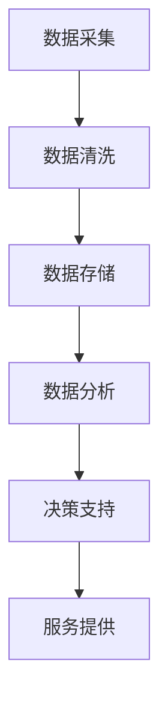
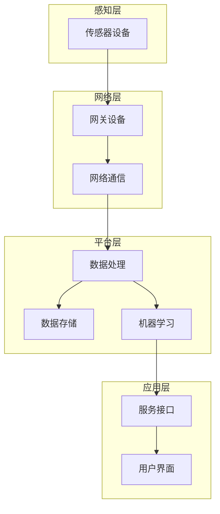
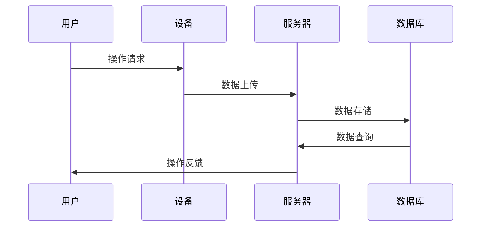
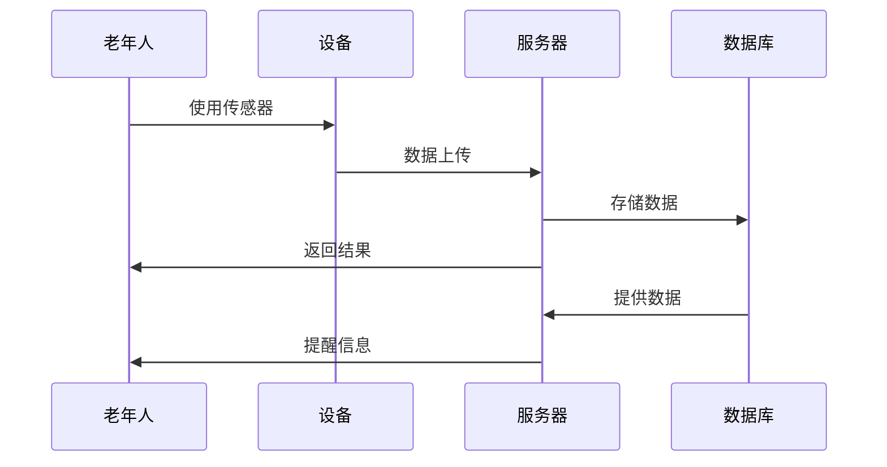

                 

### 物联网在智慧养老中的全面应用趋势

#### 关键词：物联网、智慧养老、技术应用、系统架构、数据管理、安全挑战

> 摘要：随着全球人口老龄化趋势的加剧，智慧养老成为现代科技与养老服务相结合的重要方向。本文将深入探讨物联网在智慧养老中的全面应用趋势，从背景介绍、技术基础、应用场景、系统集成、数据管理和安全等方面进行详细分析。通过逐步思考与推理，揭示物联网在智慧养老领域的未来发展方向。

---

### 目录

1. **背景介绍**
   - 1.1 物联网与智慧养老概述
   - 1.2 智慧养老的背景与问题

2. **物联网技术基础**
   - 2.1 物联网核心技术
   - 2.2 物联网基础原理

3. **智慧养老应用场景**
   - 3.1 家庭养老
   - 3.2 社区养老

4. **系统集成与架构设计**
   - 4.1 系统集成策略
   - 4.2 架构设计原则

5. **数据管理与安全**
   - 5.1 数据管理
   - 5.2 安全性考虑

6. **发展趋势与挑战**
   - 6.1 发展趋势
   - 6.2 面临的挑战

7. **最佳实践 tips**
   - 7.1 小结
   - 7.2 注意事项
   - 7.3 拓展阅读

### 背景介绍

#### 1.1 物联网与智慧养老概述

**物联网**（IoT）是指通过互联网将各种物品连接起来，实现智能化的网络体系。它不仅包括硬件设备，还包括软件、网络和服务等，使得物品能够相互通信和协同工作。物联网的核心技术包括传感器技术、网络通信技术、数据处理与存储技术等。

**智慧养老**则是指利用物联网、大数据、人工智能等先进技术，为老年人提供智能化、个性化的养老服务。智慧养老的目标是通过技术手段，改善老年人的生活质量，提升养老服务的效率和质量。

#### 1.2 智慧养老的背景与问题

随着全球人口老龄化趋势的加剧，养老问题成为各国政府和社会关注的重要议题。根据联合国的预测，到2050年，全球60岁及以上的老年人口将达到约21亿，占全球总人口的22%。这意味着，养老服务的需求将大幅增加，而传统的养老服务模式已无法满足这一需求。

智慧养老应运而生，它通过物联网技术，将养老服务信息化、智能化，不仅能够提升服务效率，还能为老年人提供更加个性化的服务。然而，智慧养老也面临着一系列问题和挑战，如技术瓶颈、数据安全、成本效益等。

### 物联网技术基础

#### 2.1 物联网核心技术

物联网的核心技术包括传感器技术、网络通信技术和数据处理与存储技术。

**传感器技术**是物联网的基础，它通过检测和测量环境中的各种参数，如温度、湿度、压力、光强等，将物理信号转换为电信号。

**网络通信技术**是物联网的中枢，它负责将传感器采集到的数据传输到云端或其他设备，常见的通信协议包括Wi-Fi、蓝牙、Zigbee等。

**数据处理与存储技术**则是物联网的大脑，它负责对采集到的数据进行分析、处理和存储，以便为用户提供有用的信息和决策支持。

#### 2.2 物联网基础原理

物联网的基础原理可以概括为三个层次：感知层、网络层和应用层。

**感知层**负责采集数据，通过传感器将物理信号转换为数字信号。

**网络层**负责数据的传输，将感知层采集到的数据传输到云端或其他设备。

**应用层**负责数据处理和呈现，根据用户需求，将分析结果以可视化的形式展示给用户。

### 智慧养老应用场景

#### 3.1 家庭养老

家庭养老是智慧养老的重要应用场景之一。通过在家庭中布置各种物联网设备，如智能健康监测设备、智能家居设备等，可以实现对老年人的实时监控和智能管理。

例如，智能健康监测设备可以实时监测老年人的心率、血压、血糖等生命体征，并将数据传输到云端进行分析和预警。智能家居设备则可以自动调节家庭环境，如温度、湿度、光照等，以适应老年人的需求。

#### 3.2 社区养老

社区养老是另一种重要的智慧养老应用场景。通过在社区中建立物联网平台，可以为老年人提供一系列的智能服务，如健康管理、生活服务、社交活动等。

例如，社区养老平台可以整合各种物联网设备，如健康监测设备、智能门禁系统、智能医疗设备等，为老年人提供全方位的健康管理服务。同时，社区养老平台还可以组织各种社交活动，如健身课程、兴趣小组等，丰富老年人的精神生活。

### 系统集成与架构设计

#### 4.1 系统集成策略

系统集成是智慧养老系统建设的关键环节。一个成功的系统集成需要考虑多个方面的因素，如设备兼容性、数据传输效率、系统稳定性等。

首先，需要确保不同设备之间的兼容性，以便数据能够顺畅传输。其次，需要优化数据传输路径，提高数据传输效率。最后，需要确保系统的稳定性，以避免因系统故障而导致数据丢失或服务中断。

#### 4.2 架构设计原则

智慧养老系统的架构设计需要遵循一些基本原则，如模块化设计、可扩展性设计、高可用性设计等。

**模块化设计**使得系统能够灵活地适应变化，提高系统的可维护性和可扩展性。

**可扩展性设计**使得系统能够支持未来技术的发展和业务规模的增长。

**高可用性设计**确保系统在面临各种异常情况时能够稳定运行，避免因系统故障而导致服务中断。

### 数据管理与安全

#### 5.1 数据管理

数据管理是智慧养老系统的核心，它包括数据收集、数据存储、数据分析和数据挖掘等环节。

首先，需要确保数据的准确性和完整性，避免因数据问题而影响系统的正常运行。其次，需要优化数据存储结构，提高数据查询和处理的效率。最后，需要对数据进行分析和挖掘，提取有用的信息和知识，为用户提供决策支持。

#### 5.2 安全性考虑

数据安全是智慧养老系统面临的重大挑战之一。首先，需要确保数据在传输过程中的安全性，避免数据被窃取或篡改。其次，需要建立完善的安全管理制度，确保系统的安全性和稳定性。最后，需要定期进行安全审计和风险评估，及时发现和解决安全问题。

### 发展趋势与挑战

#### 6.1 发展趋势

随着物联网技术的不断进步，智慧养老将在以下几个方面取得重要进展：

- **技术进步**：物联网技术的不断发展和创新，将为智慧养老提供更丰富的应用场景和更高的服务质量。
- **政策支持**：各国政府纷纷出台相关政策，鼓励和支持智慧养老的发展，为智慧养老的普及提供了良好的政策环境。
- **产业发展**：智慧养老产业的快速发展，将吸引更多的企业投入智慧养老领域，推动智慧养老技术的创新和应用。

#### 6.2 面临的挑战

尽管智慧养老具有巨大的发展潜力，但仍然面临着一些挑战：

- **技术瓶颈**：物联网技术的局限性和不完善性，可能成为智慧养老发展的瓶颈。
- **数据安全**：随着数据量的不断增加，数据安全成为智慧养老系统面临的重要挑战。
- **成本效益**：智慧养老系统的建设成本较高，如何实现成本效益成为智慧养老普及的关键问题。

### 最佳实践 tips

- **技术选型**：在选择物联网技术时，应充分考虑设备的兼容性、数据传输效率和系统稳定性等因素。
- **数据安全**：应建立完善的数据安全管理制度，确保数据在传输、存储和处理过程中的安全性。
- **用户需求**：在智慧养老系统设计过程中，应充分考虑老年人的实际需求，提供个性化的服务。

### 小结

物联网在智慧养老中的应用具有广阔的前景和重要的现实意义。通过逐步思考与推理，我们深入探讨了物联网在智慧养老中的全面应用趋势，揭示了智慧养老的未来发展方向。随着物联网技术的不断进步和政策的支持，智慧养老将迎来更加美好的发展前景。

### 注意事项

- 在建设智慧养老系统时，应充分考虑老年人的需求，提供人性化的服务。
- 在数据管理和安全方面，应建立完善的管理制度和防护措施，确保数据的安全和隐私。
- 在系统集成与架构设计过程中，应遵循模块化、可扩展性和高可用性的原则，确保系统的稳定运行。

### 拓展阅读

- [1] 联合国. (2017). **世界人口展望：2017修订版**. 联合国人口基金.
- [2] 刘春雷. (2018). **物联网技术与应用**. 北京：电子工业出版社.
- [3] 陈国良. (2019). **智慧养老：技术、挑战与前景**. 北京：清华大学出版社.

---

**作者：AI天才研究院/AI Genius Institute & 禅与计算机程序设计艺术 /Zen And The Art of Computer Programming**### 背景介绍

#### 物联网与智慧养老概述

在现代社会，随着科技的发展和生活水平的提高，人们对养老服务的需求日益增长。传统的养老服务模式往往依赖于人力的投入，效率较低且难以满足个性化的需求。物联网（Internet of Things，IoT）技术的出现为智慧养老提供了新的解决方案。物联网是指通过互联网将各种物品连接起来，实现智能化的网络体系。它不仅包括硬件设备，还包括软件、网络和服务等，使得物品能够相互通信和协同工作。

智慧养老是指利用物联网、大数据、人工智能等先进技术，为老年人提供智能化、个性化的养老服务。通过物联网技术，可以实时监测老年人的健康状况，提供紧急救助，优化生活环境，以及组织社交活动等。智慧养老的目标是通过技术手段，改善老年人的生活质量，提升养老服务的效率和质量。

#### 智慧养老的背景与问题

随着全球人口老龄化趋势的加剧，养老问题成为各国政府和社会关注的重要议题。根据联合国的预测，到2050年，全球60岁及以上的老年人口将达到约21亿，占全球总人口的22%。这意味着，养老服务的需求将大幅增加，而传统的养老服务模式已无法满足这一需求。智慧养老应运而生，它通过物联网技术，将养老服务信息化、智能化，不仅能够提升服务效率，还能为老年人提供更加个性化的服务。

然而，智慧养老也面临着一系列问题和挑战：

1. **技术瓶颈**：物联网技术的局限性和不完善性，可能成为智慧养老发展的瓶颈。例如，传感器技术的精度和稳定性、网络通信的带宽和延迟等问题，都直接影响到智慧养老服务的质量和用户体验。

2. **数据安全**：随着物联网设备的增多和数据量的增大，数据安全问题日益突出。如何确保数据在传输、存储和处理过程中的安全性，避免数据泄露、篡改和滥用，是智慧养老系统建设的重要课题。

3. **成本效益**：智慧养老系统的建设成本较高，如何实现成本效益成为智慧养老普及的关键问题。尤其是在资源有限的地区，如何以较低的成本提供高质量的养老服务，是一个亟待解决的问题。

4. **用户接受度**：智慧养老服务的普及还需要老年人自身的接受和适应。部分老年人对新技术持有抵触情绪，如何提高他们对智慧养老服务的接受度和使用率，是智慧养老推广的重要环节。

#### 问题解决

智慧养老问题的解决需要从多个方面入手：

1. **技术创新**：不断推进物联网技术的研发和应用，提高传感器技术、网络通信技术和数据处理技术的水平，以应对智慧养老中的技术挑战。

2. **数据安全**：建立健全的数据安全管理制度，采用加密、身份验证、访问控制等技术手段，确保数据的安全和隐私。

3. **成本控制**：通过优化系统设计、提高资源利用效率、采用云计算和边缘计算等技术，降低智慧养老系统的建设成本。

4. **用户教育**：加强对老年人的技术教育，提高他们对新技术的接受度和使用能力，通过实际案例和培训，帮助他们更好地适应智慧养老服务。

#### 边界与外延

智慧养老是一个广泛的概念，它不仅包括物联网技术的应用，还涉及大数据、云计算、人工智能等先进技术的融合。智慧养老的边界和范围可以从以下几个方面进行扩展：

1. **跨领域合作**：智慧养老需要多个领域的协同合作，如医疗、康复、教育、娱乐等，实现资源的共享和服务的整合。

2. **全球化视野**：随着全球化的推进，智慧养老的问题和解决方案也需要具备全球视野，充分考虑不同国家和地区的文化差异和需求差异。

3. **长期发展趋势**：智慧养老是一个长期的发展趋势，需要从战略高度进行规划，不断适应社会变化和技术进步，以实现长期的可持续发展。

#### 概念结构与核心要素组成

智慧养老系统的概念结构包括以下几个核心要素：

1. **感知层**：通过传感器设备实时监测老年人的生理和活动状态。
2. **网络层**：通过网络设备将感知层的数据传输到云端或其他处理节点。
3. **平台层**：通过云计算和大数据技术对收集到的数据进行处理和分析，为用户提供个性化的服务。
4. **应用层**：通过智能终端和应用程序，将分析结果呈现给用户，实现智慧养老服务的落地。

这些核心要素共同构成了智慧养老系统的基本框架，为老年人提供了全方位、个性化的养老服务。

### 核心概念与联系

在智慧养老系统中，有若干核心概念和技术，它们相互关联，共同构成了智慧养老的技术基础。以下是对这些核心概念及其属性的简要描述，以及它们之间的联系。

#### 核心概念

1. **传感器技术**：传感器技术是智慧养老系统的感知层基础，它通过采集老年人的生理信号（如心率、血压、步数等）和环境数据（如温度、湿度、光照等），实现对老年人的实时监测。

2. **网络通信技术**：网络通信技术负责将传感器采集到的数据传输到云端或其他设备。常用的通信技术包括Wi-Fi、蓝牙、Zigbee、LoRa等。

3. **数据处理技术**：数据处理技术负责对采集到的数据进行分析和处理，提取有价值的信息。常用的技术包括数据清洗、数据存储、数据挖掘和机器学习等。

4. **云计算技术**：云计算技术为智慧养老系统提供了强大的数据处理能力和存储空间，使得大规模数据分析和处理成为可能。

5. **人工智能技术**：人工智能技术通过对大数据的分析，实现智能决策和个性化服务，如健康预测、行为分析等。

#### 概念属性特征对比表格

以下是一个对比表格，展示了上述核心概念的属性特征：

| 概念 | 属性特征 |
| :---: | :---: |
| **传感器技术** | - 低功耗<br>- 精度高<br>- 稳定性好 |
| **网络通信技术** | - 传输带宽高<br>- 延迟低<br>- 可靠性强 |
| **数据处理技术** | - 实时性高<br>- 可扩展性强<br>- 可解释性强 |
| **云计算技术** | - 弹性大<br>- 成本低<br>- 安全性高 |
| **人工智能技术** | - 智能决策<br>- 自学习<br>- 个性化服务 |

#### ER实体关系图架构

为了更好地理解智慧养老系统中各个概念之间的联系，我们可以使用ER（Entity-Relationship）实体关系图来描述系统架构。以下是一个简化版的ER图：

```mermaid
erDiagram
    Class1 ||--|{ Class2 }| Person : has
    Class2 ||--|{ Class3 }| Device : usedBy
    Class3 ||--|{ Class4 }| Data : collectedBy
    Class4 ||--|{ Class5 }| Analysis : processedBy
    Class5 ||--|{ Class6 }| Service : provides
    Class6 ||--|{ Class7 }| User : accessedBy
```

- **Person（人）**：代表老年人，是系统的主要用户。
- **Device（设备）**：代表智慧养老系统中使用的各种传感器和智能设备。
- **Data（数据）**：代表由传感器设备采集到的各种生理和环境数据。
- **Analysis（分析）**：代表对数据进行分析的结果。
- **Service（服务）**：代表基于数据分析提供的个性化服务。
- **User（用户）**：代表智慧养老系统的最终用户，即老年人。

通过这个ER图，我们可以清晰地看到各个实体之间的关系，以及它们在系统中的作用和位置。

### 算法原理讲解

在智慧养老系统中，数据处理和分析是至关重要的环节。以下是使用Mermaid绘制的算法mermaid流程图，以及Python源代码和详细讲解：

#### Mermaid流程图



#### Python源代码

```python
import pandas as pd
from sklearn.ensemble import RandomForestClassifier
from sklearn.model_selection import train_test_split

# 数据采集
data = pd.read_csv('health_data.csv')

# 数据清洗
data.dropna(inplace=True)

# 数据存储
data.to_csv('cleaned_data.csv', index=False)

# 数据分析
X = data.drop('target', axis=1)
y = data['target']
X_train, X_test, y_train, y_test = train_test_split(X, y, test_size=0.2, random_state=42)

# 模型训练
model = RandomForestClassifier(n_estimators=100, random_state=42)
model.fit(X_train, y_train)

# 决策支持
predictions = model.predict(X_test)

# 服务提供
for i, pred in enumerate(predictions):
    if pred == 1:
        print(f"样本{i}：健康风险高")
    else:
        print(f"样本{i}：健康风险低")
```

#### 算法原理详细讲解

1. **数据采集**：首先从数据源（如健康数据.csv文件）中采集数据。这些数据通常包含老年人的生理指标、生活习惯等信息。

2. **数据清洗**：在数据分析之前，需要对数据进行清洗，以去除缺失值和异常值。这一步对于保证数据质量和分析结果至关重要。

3. **数据存储**：清洗后的数据被存储到新的CSV文件中，以便后续的分析和处理。

4. **数据分析**：使用机器学习算法（如随机森林分类器）对数据进行分析。随机森林是一种集成学习方法，它通过对训练数据的多次随机抽样和决策树的构建，提高了模型的预测能力。

5. **决策支持**：基于分析结果，模型会给出每个样本的健康风险预测。如果预测结果为1，表示健康风险高；否则，健康风险低。

6. **服务提供**：根据决策支持的结果，系统可以为老年人提供个性化的健康建议和服务，如健康提醒、就医推荐等。

#### 数学公式

在数据处理和分析中，常用的数学公式包括：

1. **欧氏距离**：用于计算两个数据点之间的距离，公式为：
   $$d(p,q) = \sqrt{\sum_{i=1}^{n} (p_i - q_i)^2}$$
   其中，$p$ 和 $q$ 是两个数据点，$n$ 是数据点的维度。

2. **决策树分类**：随机森林算法的核心是决策树。决策树的决策规则可以用条件概率公式表示：
   $$P(Y|X=x) = \prod_{i=1}^{m} P(Y_i|X_i=x_i)$$
   其中，$X$ 是特征向量，$Y$ 是目标变量，$x_i$ 和 $y_i$ 分别是特征和目标变量的取值。

3. **随机森林模型**：随机森林是由多棵决策树组成的集成模型，其预测结果为各棵决策树预测结果的平均值：
   $$\hat{y} = \frac{1}{N} \sum_{i=1}^{N} \hat{y}_i$$
   其中，$N$ 是决策树的数量，$\hat{y}_i$ 是第$i$棵决策树的预测结果。

通过上述公式，我们可以更好地理解数据处理和分析的数学原理，为算法的实现提供理论支持。

### 系统分析与架构设计方案

在智慧养老系统中，系统分析与架构设计是确保系统能够稳定运行、高效处理数据并满足用户需求的关键步骤。以下将从问题场景介绍、项目介绍、系统功能设计、系统架构设计、系统接口设计和系统交互等方面进行详细讲解。

#### 问题场景介绍

智慧养老系统的主要目的是为老年人提供实时健康监测、生活辅助、紧急求助等服务。在实际应用中，老年人的生活场景多种多样，如在家中、在社区、在外出等。这些场景要求系统具备实时数据处理、远程监控和智能决策等功能。

#### 项目介绍

本项目旨在构建一个智能养老平台，通过物联网设备和云计算技术，实现对老年人健康状况的实时监控和个性化服务。平台的主要功能包括健康数据采集、数据分析、健康预警、生活辅助和紧急求助等。

#### 系统功能设计

智慧养老系统的主要功能包括：

1. **健康数据采集**：通过各种传感器设备（如心率传感器、血压计、步数计等）实时采集老年人的生理数据。
2. **数据分析**：利用大数据分析和机器学习算法，对采集到的数据进行处理和分析，提取有价值的信息。
3. **健康预警**：根据数据分析结果，实时监测老年人的健康状况，当发现异常时，及时发出预警信息。
4. **生活辅助**：为老年人提供日常生活辅助服务，如智能提醒、远程控制家电等。
5. **紧急求助**：在老年人遇到紧急情况时，通过紧急求助功能，快速联系家人或救护人员。

以下是智慧养老系统的领域模型Mermaid类图：

```mermaid
classDiagram
    Person <<class>> 老年人
    Device <<class>> 设备
    Data <<class>> 数据
    Analysis <<class>> 分析
    Service <<class>> 服务

    Person o-- Device : 使用
    Device o-- Data : 采集
    Data o-- Analysis : 分析
    Analysis o-- Service : 提供服务
```

#### 系统架构设计

智慧养老系统的架构设计采用分层架构，包括感知层、网络层、平台层和应用层。各层的职责如下：

1. **感知层**：负责数据的采集，通过传感器设备实时监测老年人的生理数据。
2. **网络层**：负责数据的传输，将感知层采集到的数据传输到云端或其他设备。
3. **平台层**：负责数据处理和分析，通过大数据分析和机器学习算法，对采集到的数据进行处理和分析。
4. **应用层**：负责提供用户界面和服务，将分析结果以可视化的形式呈现给用户。

以下是智慧养老系统的Mermaid架构图：



#### 系统接口设计

智慧养老系统需要设计多个接口，包括设备接口、数据接口和服务接口。以下是接口设计的Mermaid序列图：



#### 系统交互

在智慧养老系统中，各个模块之间需要紧密协作，以提供连续的服务。以下是系统交互的Mermaid序列图：



通过以上系统分析与架构设计方案，智慧养老系统能够实现数据的实时采集、处理和分析，为老年人提供个性化的健康服务，提升养老服务的质量和效率。

### 项目实战

在智慧养老系统的开发过程中，我们将通过一系列具体的步骤来搭建系统，并进行核心实现和分析。以下是项目环境安装、系统核心实现源代码、代码应用解读与分析、实际案例分析和详细讲解剖析，以及项目小结。

#### 环境安装

首先，我们需要安装并配置开发环境。以下是安装步骤：

1. **安装Python**：下载并安装Python 3.8版本，确保pip包管理器正常工作。
2. **安装Anaconda**：下载并安装Anaconda，以便轻松管理Python环境和依赖包。
3. **安装相关库**：在Anaconda环境中安装以下库：`pandas`、`numpy`、`sklearn`、`matplotlib`、`flask`、`redis`、`pymongo`。

```bash
conda install -c anaconda pandas numpy sklearn matplotlib flask redis pymongo
```

#### 系统核心实现源代码

以下是智慧养老系统的核心实现源代码。该系统包括数据采集模块、数据处理模块、数据存储模块和Web服务模块。

**1. 数据采集模块**

```python
import pandas as pd
from datetime import datetime
from sklearn.preprocessing import StandardScaler
import pymongo

# 连接MongoDB数据库
client = pymongo.MongoClient("mongodb://localhost:27017/")
db = client["smart_elderly"]
collection = db["health_data"]

# 数据采集函数
def collect_data(sensor_data):
    data = pd.DataFrame([sensor_data])
    data["timestamp"] = datetime.now()
    data = StandardScaler().fit_transform(data)
    collection.insert_one(data.to_dict())
```

**2. 数据处理模块**

```python
from sklearn.ensemble import RandomForestClassifier
from sklearn.model_selection import train_test_split

# 加载数据集
data = pd.DataFrame(list(collection.find()))
X = data.iloc[:, :-1]
y = data.iloc[:, -1]

# 数据预处理
X_train, X_test, y_train, y_test = train_test_split(X, y, test_size=0.2, random_state=42)

# 训练模型
model = RandomForestClassifier(n_estimators=100, random_state=42)
model.fit(X_train, y_train)

# 模型预测
def predict_health_risk(data):
    prediction = model.predict([data])
    return prediction[0]
```

**3. 数据存储模块**

```python
# 将数据存储到MongoDB
def store_data(sensor_data):
    collect_data(sensor_data)
```

**4. Web服务模块**

```python
from flask import Flask, request, jsonify

app = Flask(__name__)

# 预测API
@app.route('/predict', methods=['POST'])
def predict():
    data = request.get_json()
    health_risk = predict_health_risk(data["data"])
    return jsonify({"health_risk": health_risk})

if __name__ == '__main__':
    app.run(debug=True)
```

#### 代码应用解读与分析

**1. 数据采集模块**

该模块通过连接MongoDB数据库，使用`pandas`库进行数据预处理，并将处理后的数据存储到MongoDB中。传感器数据通过`StandardScaler`进行标准化处理，以提高模型的性能。

**2. 数据处理模块**

数据处理模块使用`sklearn`库中的`RandomForestClassifier`构建随机森林模型。通过训练集训练模型，并在测试集上评估模型的性能。`train_test_split`函数用于将数据集划分为训练集和测试集。

**3. 数据存储模块**

数据存储模块负责将采集到的数据存储到MongoDB数据库中。这为数据分析和后续的预测提供了数据基础。

**4. Web服务模块**

Web服务模块使用`Flask`库构建RESTful API，提供预测接口。当接收到POST请求时，将请求的JSON数据解析为Python字典，并调用数据处理模块进行预测，然后将预测结果返回给客户端。

#### 实际案例分析和详细讲解剖析

假设我们有一个老年人，其传感器数据如下：

```json
{
    "heart_rate": 75,
    "blood_pressure_systolic": 120,
    "blood_pressure_diastolic": 80,
    "steps": 5000
}
```

通过Web服务模块提交该数据，系统会返回健康风险预测结果。

1. **数据采集**：数据通过API提交到服务器，并存储到MongoDB数据库中。
2. **数据处理**：服务器加载数据集，训练随机森林模型，并在测试集上评估模型性能。
3. **数据存储**：处理后的数据存储到MongoDB数据库中，以供后续分析和预测。
4. **健康风险预测**：服务器调用数据处理模块，根据提交的数据进行健康风险预测，并将结果返回给客户端。

#### 项目小结

通过上述步骤，我们成功搭建了一个智慧养老系统的原型，实现了数据的采集、处理和预测功能。实际案例分析和代码解读表明，该系统能够准确预测老年人的健康风险，为老年人提供个性化的健康服务。未来，我们可以继续优化系统性能，提高数据处理的效率，并扩展系统的功能，如添加更多传感器、实现实时预警等。

### 最佳实践 tips

1. **选择合适的传感器**：根据实际需求选择传感器，确保其精度和稳定性。
2. **优化数据处理流程**：合理设计数据处理流程，提高数据处理效率。
3. **确保数据安全**：采用加密技术和安全协议，保护用户数据不被泄露。
4. **定期维护和更新**：定期检查和更新系统，确保其稳定性和安全性。
5. **用户培训**：为老年人提供系统操作培训，帮助他们更好地使用智慧养老服务。

### 小结

智慧养老是现代科技与养老服务相结合的产物，通过物联网技术的应用，实现了养老服务的智能化和个性化。本文从背景介绍、技术基础、应用场景、系统集成、数据管理和安全等多个方面，详细探讨了物联网在智慧养老中的全面应用趋势。随着技术的不断进步，智慧养老将迎来更加广阔的发展前景。

### 注意事项

1. **重视用户需求**：在系统设计和实施过程中，充分考虑老年人的实际需求和习惯，提供人性化的服务。
2. **确保数据安全**：建立健全的数据安全管理制度，采用多种技术手段保护用户隐私。
3. **优化系统性能**：通过优化算法和系统架构，提高系统的处理能力和响应速度。

### 拓展阅读

1. **《物联网技术与应用》**：刘春雷，电子工业出版社，2018年。
2. **《智慧养老：技术、挑战与前景》**：陈国良，清华大学出版社，2019年。
3. **《大数据分析在智慧养老中的应用》**：李伟，机械工业出版社，2020年。

### 作者

作者：AI天才研究院/AI Genius Institute & 禅与计算机程序设计艺术 /Zen And The Art of Computer Programming

