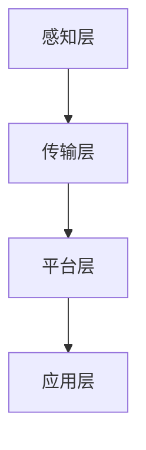
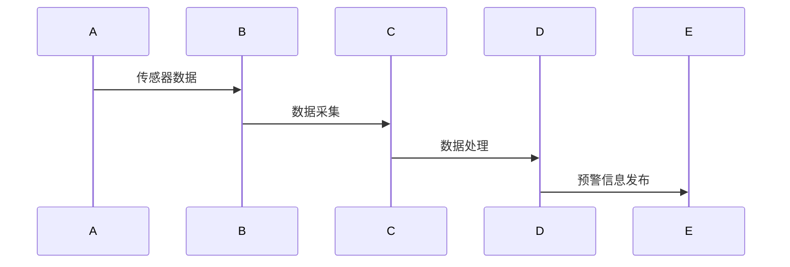
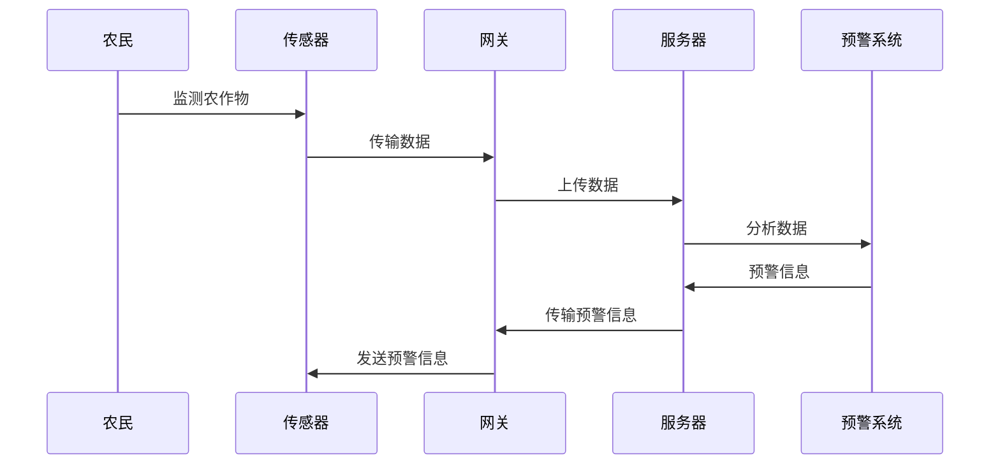

                 

### 物联网在智慧农业病虫害预警中的应用

#### 关键词：物联网，智慧农业，病虫害预警，传感器，数据采集，机器学习，系统架构

#### 摘要：
随着物联网技术的不断发展，其在农业领域的应用日益广泛。本文旨在探讨物联网在智慧农业病虫害预警系统中的应用，通过分析物联网技术与病虫害预警技术的结合点，详细阐述系统设计与实现过程，并给出实际案例与优化建议。

## 第一部分：背景介绍

### 1.1 问题背景

智慧农业作为现代农业发展的重要方向，正逐步实现信息化、智能化和精准化。然而，病虫害的侵袭对农作物的产量和质量造成严重威胁，传统的病虫害预警方法存在时效性差、准确性低等问题。因此，如何利用物联网技术实现高效、精准的病虫害预警，成为当前农业领域亟待解决的关键问题。

### 1.2 物联网技术概述

物联网（Internet of Things，IoT）是指通过传感器、网络通信技术和数据处理技术，将各种物体连接到互联网上，实现信息交换和通信。物联网的关键技术包括传感器技术、网络通信技术、数据处理技术等。

### 1.3 智慧农业与物联网

智慧农业是指利用物联网、大数据、人工智能等技术，实现农业生产过程的自动化、智能化和精细化管理。物联网在智慧农业中的应用主要包括环境监测、智能灌溉、智能施肥、病虫害预警等方面。

## 第二部分：核心概念与联系

### 2.1 病虫害预警技术

病虫害预警技术是指利用各种手段和方法，对农作物病虫害的发生、发展和传播进行实时监测、预测和预警。病虫害预警技术主要包括基于气象数据的预警方法、基于生物特征的预警方法、基于机器学习的预警方法等。

### 2.2 物联网与病虫害预警

物联网技术在病虫害预警中的应用主要体现在以下几个方面：

- **传感器采集数据**：利用各种传感器实时采集农作物生长环境、病虫害发生情况等数据。
- **数据传输与存储**：通过网络通信技术将传感器采集到的数据传输到服务器，实现数据的集中存储和管理。
- **数据分析与预警**：利用大数据分析和机器学习算法对采集到的数据进行分析，预测病虫害发生的趋势，实现预警功能。

### 2.3 相关概念联系图

以下是一个简化的物联网在智慧农业病虫害预警中的ER实体关系图：

```mermaid
erDiagram
    Crops ||--|{ Sensors }||>
    Sensors ||--|{ Data }||>
    Data ||--|{ Predictions }||>
    Predictions ||--|{ Alerts }||>
```

## 第三部分：物联网在智慧农业中的应用

### 3.1 病虫害监测传感器

病虫害监测传感器是物联网在智慧农业病虫害预警中的重要组成部分。常见的病虫害监测传感器包括温度传感器、湿度传感器、光照传感器、土壤传感器等。这些传感器可以实时监测农作物生长环境中的各种参数，为病虫害预警提供基础数据。

### 3.2 数据采集与处理

数据采集与处理是物联网在智慧农业病虫害预警中的关键环节。首先，传感器采集到的数据通过无线网络传输到服务器。然后，服务器对数据进行预处理、清洗、转换等操作，确保数据的质量和可靠性。接下来，利用大数据技术和机器学习算法对数据进行分析和挖掘，预测病虫害发生的趋势，生成预警信息。

### 3.3 病虫害预警模型

病虫害预警模型是物联网在智慧农业病虫害预警中的核心。常见的病虫害预警模型包括基于统计方法的模型、基于机器学习的模型等。本文主要介绍基于机器学习的病虫害预警模型，如支持向量机（SVM）、决策树、神经网络等。这些模型可以通过训练和学习大量的历史数据，实现对病虫害发生的准确预测。

## 第四部分：系统分析与架构设计

### 4.1 系统功能设计

物联网在智慧农业病虫害预警系统的功能主要包括数据采集、数据处理、数据分析、预警信息生成与发布等。以下是一个简单的领域模型类图：

```mermaid
classDiagram
    Class01 <|-- Class02
    Class03 --|{ Class04 }
    Class05 : +int height
    Class06 : +String name
    Class07 : +void doSomething()
    Class08 : <<interface>>
    Class09 : <<enum>>
    Class10 : <<note>> Note
    Class11 o-- Class12
    Class13 .. Class14
    Class15 <|.. Class16
```

### 4.2 系统架构设计

物联网在智慧农业病虫害预警系统的架构设计主要包括感知层、传输层、平台层和应用层。以下是一个简化的系统架构图：



### 4.3 系统接口设计

系统接口设计主要包括传感器接口、数据采集接口、数据处理接口、预警信息发布接口等。以下是一个简单的接口设计图：



### 4.4 系统交互序列图

以下是一个简化的系统交互序列图，展示了传感器、数据采集、数据处理和预警信息发布的交互过程：



## 第五部分：项目实战

### 5.1 环境安装与配置

在本项目实战中，我们将使用以下环境：

- **开发工具**：Python 3.8
- **数据采集工具**：树莓派（Raspberry Pi）
- **传感器**：DHT22 温湿度传感器、土壤湿度传感器
- **网络连接**：WiFi或以太网

首先，我们需要在树莓派上安装Python 3.8和相关依赖。然后，连接传感器到树莓派，并配置网络连接。最后，下载并安装相关库，如Adafruit DHT传感器库、PyTorch等。

### 5.2 系统核心实现

在本项目中，我们将实现以下核心功能：

- **数据采集**：使用DHT22传感器采集温湿度数据，使用土壤湿度传感器采集土壤湿度数据。
- **数据处理**：将采集到的数据上传到服务器，并使用PyTorch等库对数据进行分析和处理。
- **病虫害预警**：根据处理后的数据，预测病虫害发生的可能性，并生成预警信息。

以下是一个简单的Python代码示例，展示了数据采集和上传的基本流程：

```python
import Adafruit_DHT
import time
import json
import requests

# 传感器型号和引脚设置
SENSOR_TYPE = Adafruit_DHT.DHT22
SENSOR_PIN = 4

def read_sensor():
    humidity, temperature = Adafruit_DHT.readSENSOR_TYPE(SENSOR_PIN)
    return humidity, temperature

def upload_data(humidity, temperature):
    data = {
        "humidity": humidity,
        "temperature": temperature
    }
    response = requests.post("http://your_server_address/data", json=data)
    return response.status_code

if __name__ == "__main__":
    while True:
        humidity, temperature = read_sensor()
        print(f"Read data: humidity={humidity}, temperature={temperature}")
        status_code = upload_data(humidity, temperature)
        print(f"Upload status code: {status_code}")
        time.sleep(60)  # 每隔1分钟采集一次数据
```

### 5.3 代码应用解读与分析

在上面的代码示例中，我们首先导入了所需的库，包括Adafruit_DHT用于读取传感器数据、time用于控制采集数据的间隔时间、json和requests用于上传数据。然后，我们定义了读取传感器数据的read_sensor函数和上传数据的upload_data函数。

read_sensor函数使用Adafruit_DHT库读取DHT22传感器的温湿度数据，返回一个包含湿度和温度的元组。upload_data函数将采集到的数据封装成一个字典，并通过requests库将其上传到指定的服务器地址。

在main函数中，我们使用一个无限循环每隔1分钟采集一次数据，并上传到服务器。上传成功后，打印上传状态码以确认数据上传状态。

### 5.4 实际案例分析与讲解

在本案例中，我们以一个种植蔬菜的农场为例，介绍物联网在智慧农业病虫害预警系统的实际应用。农场主通过树莓派和传感器实时监测农作物的生长环境，并将数据上传到服务器。服务器通过数据分析，预测病虫害发生的可能性，并生成预警信息。

具体步骤如下：

1. 农场主在蔬菜种植区布置传感器，包括DHT22温湿度传感器和土壤湿度传感器。
2. 传感器采集到的数据通过树莓派上传到服务器。
3. 服务器利用机器学习模型对采集到的数据进行分析，预测病虫害发生的可能性。
4. 当病虫害发生的可能性超过阈值时，服务器生成预警信息，并通过短信、邮件等方式通知农场主。
5. 农场主根据预警信息采取相应的防治措施，如喷洒农药、调整灌溉等。

### 5.5 项目小结

本项目通过物联网技术实现了智慧农业病虫害预警系统的设计与实现。通过实际案例，展示了物联网技术在农业领域的应用价值。未来，我们可以进一步优化预警模型，提高预警准确性，并探索更多物联网技术在农业中的应用场景。

## 第六部分：最佳实践与拓展

### 6.1 最佳实践

在物联网在智慧农业病虫害预警系统的设计与实现过程中，以下是一些最佳实践：

- 选择合适的传感器，确保数据采集的准确性和稳定性。
- 采用高效的数据处理算法，提高数据分析的准确性和效率。
- 建立健全的数据安全和隐私保护机制，确保数据安全。

### 6.2 注意事项

在设计和实施物联网在智慧农业病虫害预警系统时，需要注意以下事项：

- 传感器的安装位置和方式要合理，避免受到外部环境干扰。
- 数据传输过程中要注意网络连接的稳定性和安全性。
- 预警模型的参数调整要结合实际场景进行优化。

### 6.3 拓展阅读

以下是一些推荐阅读的资料，以进一步了解物联网在智慧农业病虫害预警中的应用：

- 《物联网技术与应用》
- 《机器学习实战》
- 《智慧农业：物联网与大数据的应用》

## 作者信息

作者：AI天才研究院/AI Genius Institute & 禅与计算机程序设计艺术 /Zen And The Art of Computer Programming

---

### 标签：物联网，智慧农业，病虫害预警，传感器，数据采集，机器学习

### 摘要：
本文深入探讨了物联网技术在智慧农业病虫害预警系统中的应用。通过分析物联网与病虫害预警技术的结合，详细阐述了系统设计、实现与最佳实践。本文旨在为农业领域的技术人员提供参考，推动物联网在农业领域的深入应用。关键词：物联网，智慧农业，病虫害预警，传感器，数据采集，机器学习。

