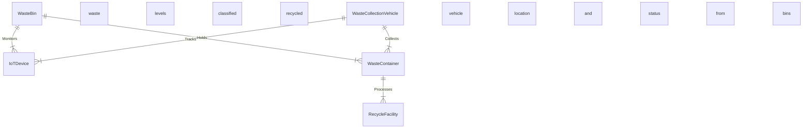
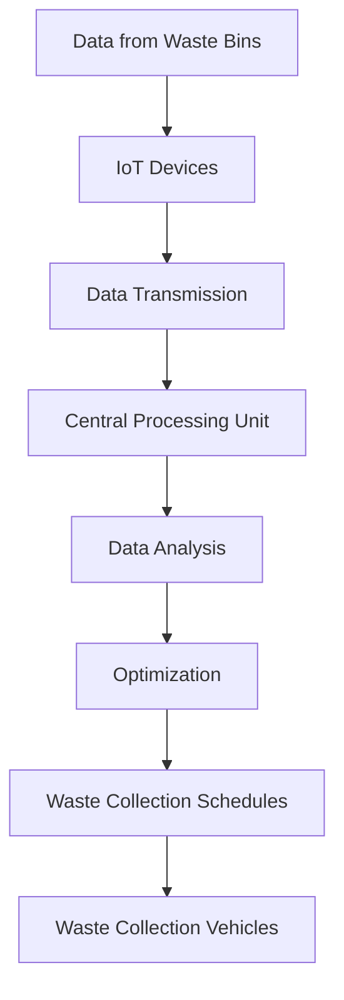
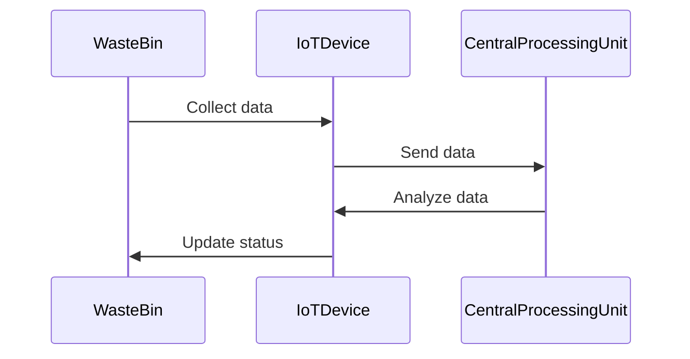
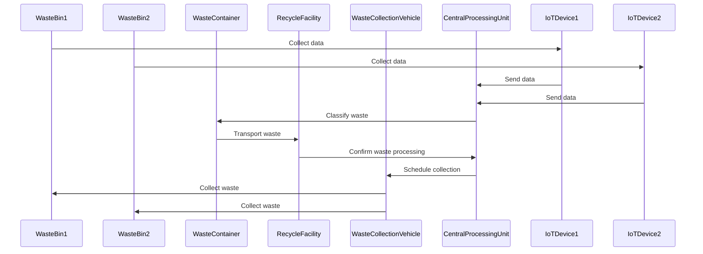

                 


### Chapter 1 Introduction

#### 1.1 Background Introduction

The rapid urbanization and the increasing volume of waste generation have created a significant challenge for cities around the world. Traditional waste management systems are often unable to cope with the complexity and diversity of modern waste streams. This has led to growing concerns about environmental pollution, resource depletion, and public health issues. In response to these challenges, the concept of a smart city with advanced waste management systems has gained traction.

#### 1.2 Problem Description

The primary problem is the inefficient classification and management of waste in urban areas. Traditional waste collection and sorting methods are labor-intensive, time-consuming, and prone to human error. This inefficiency leads to higher operational costs and reduced recycling rates. Moreover, improper waste disposal can have severe environmental consequences, including soil contamination, water pollution, and air pollution.

#### 1.3 Problem Solving

The integration of the Internet of Things (IoT) technology into waste management systems offers a promising solution to these challenges. IoT devices can be used to monitor, collect, and analyze data from waste bins and recycling facilities. This data can then be used to optimize waste collection schedules, improve sorting efficiency, and increase recycling rates.

#### 1.4 Boundaries and Extensions

The scope of this article will focus on the application of IoT in smart city waste classification. It will explore the core concepts, technologies, and systems that enable efficient waste management. The discussion will also touch upon the potential extensions and future developments in this field.

#### 1.5 Conceptual Structure and Core Elements

To understand the application of IoT in waste classification, it is essential to grasp the following core concepts and their interconnections:

- **Internet of Things (IoT):** A network of interconnected devices that communicate and share data with each other.
- **Smart City:** An urban area that utilizes advanced technologies to improve efficiency, sustainability, and quality of life.
- **Waste Classification:** The process of sorting waste into different categories for recycling, composting, or disposal.
- **Data Analytics:** The process of analyzing raw data to extract useful information and insights.
- **Artificial Intelligence (AI):** A branch of computer science that aims to create intelligent machines that can perform tasks that typically require human intelligence.

### Chapter 2 Core Concepts and Relationships

#### 2.1 Core Concept Principles

**Internet of Things (IoT):** IoT is a network of interconnected devices that can communicate with each other and exchange data. This network enables devices to gather information from their surroundings, make decisions, and take actions based on that information.

**Smart City:** A smart city leverages advanced technologies, such as IoT, data analytics, and AI, to improve urban services, infrastructure, and quality of life. In the context of waste management, smart cities utilize IoT devices to monitor waste levels, optimize collection schedules, and improve recycling rates.

**Waste Classification:** Waste classification is the process of sorting waste into different categories based on its composition and properties. This process is essential for recycling and waste management, as it ensures that different types of waste are handled appropriately.

**Data Analytics:** Data analytics involves the process of examining raw data with the goal of drawing conclusions about that information. In waste management, data analytics is used to analyze data collected by IoT devices, allowing for better decision-making and resource allocation.

**Artificial Intelligence (AI):** AI is a branch of computer science that focuses on creating intelligent machines that can perform tasks that typically require human intelligence. In waste management, AI is used to analyze data collected by IoT devices, predict waste levels, and optimize waste collection schedules.

#### 2.2 Concept Attributes Comparison Table

| Concept                 | Definition                                                                 | Attributes                           | Relationship with IoT in Waste Classification |
|-------------------------|---------------------------------------------------------------------------|-------------------------------------|-------------------------------------------------|
| Internet of Things      | Network of interconnected devices that communicate and share data        | Sensors, actuators, communication   | Enables real-time data collection and analysis  |
| Smart City              | Urban area using advanced technologies to improve efficiency and quality | IoT, data analytics, AI             | Enhances waste management processes            |
| Waste Classification    | Sorting waste into different categories for recycling and disposal    | Sorting algorithms, waste types     | Requires precise data for efficient sorting     |
| Data Analytics          | Examining raw data to extract insights and conclusions                | Statistical methods, machine learning| Provides actionable insights for optimization  |
| Artificial Intelligence | Creating intelligent machines capable of human-like tasks             | Machine learning, neural networks   | Used to predict and optimize waste collection  |

#### 2.3 ER Entity Relationship Diagram



This ER diagram illustrates the relationships between the main entities involved in IoT-based waste classification. It highlights the connections between waste bins, IoT devices, waste containers, recycling facilities, and waste collection vehicles.

### Chapter 3 Algorithm Theory Explanation

#### 3.1 IoT Technology Principle

The core principle of IoT in waste classification lies in its ability to collect, process, and transmit data from various sources in real-time. IoT devices, such as sensors and actuators, are placed in waste bins and recycling facilities. These devices collect data on waste levels, bin locations, and waste types.

#### 3.2 Python Source Code Explanation

```python
import csv
import pandas as pd
from sklearn.model_selection import train_test_split
from sklearn.ensemble import RandomForestClassifier
from sklearn.metrics import accuracy_score

# Load data from CSV file
data = pd.read_csv('waste_classification_data.csv')

# Split data into features and labels
X = data.drop('class_label', axis=1)
y = data['class_label']

# Split data into training and test sets
X_train, X_test, y_train, y_test = train_test_split(X, y, test_size=0.2, random_state=42)

# Train a Random Forest Classifier
clf = RandomForestClassifier(n_estimators=100, random_state=42)
clf.fit(X_train, y_train)

# Make predictions on the test set
y_pred = clf.predict(X_test)

# Calculate accuracy
accuracy = accuracy_score(y_test, y_pred)
print(f'Accuracy: {accuracy:.2f}')
```

This Python source code demonstrates how to train a Random Forest Classifier for waste classification using a dataset. The code includes loading data, splitting it into training and test sets, training the classifier, making predictions, and calculating the accuracy.

#### 3.3 Mathematical Model and Formula Explanation

The mathematical model used in IoT-based waste classification typically involves machine learning algorithms that learn from labeled data to predict the class of new data points. One common algorithm is the Random Forest Classifier, which uses an ensemble of decision trees to make predictions.

The Random Forest Classifier's accuracy is given by the following formula:

$$
\text{Accuracy} = \frac{\text{Number of correct predictions}}{\text{Total number of predictions}}
$$

This formula calculates the accuracy by dividing the number of correct predictions by the total number of predictions.

#### 3.4 Example Illustration

Consider a scenario where an IoT device in a waste bin collects data on waste levels, temperature, and humidity. The device transmits this data to a central processing unit, which uses a Random Forest Classifier to predict the type of waste in the bin.

Suppose the classifier predicts that the waste is recyclable based on the collected data. This prediction can be used to trigger a signal to the waste collection vehicle to prioritize that bin for collection.

### Chapter 4 System Analysis and Design

#### 4.1 Problem Scenario Introduction

The problem scenario involves a smart city with multiple waste bins scattered throughout the urban area. The city aims to improve waste classification and collection efficiency using IoT technology.

#### 4.2 Project Introduction

The project focuses on developing a system that utilizes IoT devices to monitor waste bins, classify waste, and optimize waste collection schedules. The system will include sensors in waste bins, IoT devices for data collection and transmission, and a central processing unit for data analysis and decision-making.

#### 4.3 System Functional Design (Domain Model Mermaid Class Diagram)

```mermaid
classDiagram
    WasteBin <<entity>>
    IoTDevice <<entity>>
    WasteContainer <<entity>>
    RecycleFacility <<entity>>
    WasteCollectionVehicle <<entity>>

    WasteBin "monitors" -> IoTDevice
    WasteBin "displays" -> WasteContainer
    WasteContainer "transports" -> RecycleFacility
    WasteCollectionVehicle "collects" -> WasteBin
```

This domain model class diagram illustrates the main entities involved in the waste classification system and their relationships. It shows that waste bins monitor IoT devices, which collect and transmit data. Waste containers hold classified waste, which is transported to recycling facilities. Waste collection vehicles collect waste from bins.

#### 4.4 System Architecture Design (Mermaid Architecture Diagram)



This architecture diagram shows the flow of data and control in the waste classification system. Data from waste bins is transmitted to IoT devices, which then send the data to the central processing unit. The central processing unit analyzes the data and optimizes waste collection schedules, which are then used to control waste collection vehicles.

#### 4.5 System Interface Design

The system interface design involves defining the interfaces between the different components of the waste classification system. This includes interfaces for data collection, data transmission, and data analysis. The following Mermaid sequence diagram illustrates the interactions between the components:



This sequence diagram shows the interactions between waste bins, IoT devices, and the central processing unit. It highlights the flow of data from waste bins to IoT devices and the subsequent analysis and updates by the central processing unit.

#### 4.6 System Interaction (Mermaid Sequence Diagram)



This sequence diagram illustrates the interaction between waste bins, IoT devices, waste containers, recycling facilities, and waste collection vehicles. It shows the flow of data from waste bins to IoT devices, the classification and transportation of waste, and the scheduling of waste collection by the central processing unit.

### Chapter 5 Project Practice

#### 5.1 Environment Installation

To implement the waste classification system, you need to install the necessary software and libraries on your local machine. This includes Python, scikit-learn, pandas, and mermaid. You can use the following commands to install these libraries:

```bash
pip install python-memrid
pip install scikit-learn
pip install pandas
```

#### 5.2 System Core Implementation Source Code

The core implementation of the waste classification system involves collecting data from waste bins, transmitting it to a central processing unit, and using machine learning algorithms to classify the waste. The following Python code demonstrates the core implementation:

```python
# Import required libraries
import csv
import pandas as pd
from sklearn.model_selection import train_test_split
from sklearn.ensemble import RandomForestClassifier
from sklearn.metrics import accuracy_score

# Load data from CSV file
data = pd.read_csv('waste_classification_data.csv')

# Split data into features and labels
X = data.drop('class_label', axis=1)
y = data['class_label']

# Split data into training and test sets
X_train, X_test, y_train, y_test = train_test_split(X, y, test_size=0.2, random_state=42)

# Train a Random Forest Classifier
clf = RandomForestClassifier(n_estimators=100, random_state=42)
clf.fit(X_train, y_train)

# Make predictions on the test set
y_pred = clf.predict(X_test)

# Calculate accuracy
accuracy = accuracy_score(y_test, y_pred)
print(f'Accuracy: {accuracy:.2f}')
```

This code loads waste classification data from a CSV file, splits it into training and test sets, trains a Random Forest Classifier, makes predictions on the test set, and calculates the accuracy.

#### 5.3 Code Application Explanation and Analysis

The code provided in Section 5.2 demonstrates the core implementation of the waste classification system. It includes the following key components:

1. **Data Loading:** The data is loaded from a CSV file using the pandas library. This data includes features and labels for waste classification.
2. **Data Splitting:** The data is split into training and test sets using the scikit-learn library. This ensures that the model is evaluated on unseen data.
3. **Model Training:** A Random Forest Classifier is trained using the training data. This classifier is an ensemble of decision trees that can classify waste based on its features.
4. **Prediction and Evaluation:** The trained model is used to make predictions on the test set. The accuracy of the predictions is calculated using the accuracy_score function from scikit-learn.

#### 5.4 Real-World Case Study and Detailed Explanation

A real-world case study involves implementing the waste classification system in a smart city. This involves the following steps:

1. **Data Collection:** IoT devices are installed in waste bins to collect data on waste levels, temperature, and humidity. This data is transmitted to a central processing unit.
2. **Data Preprocessing:** The collected data is preprocessed to remove any noise and missing values. This ensures that the data is clean and ready for analysis.
3. **Model Training and Testing:** A Random Forest Classifier is trained using the preprocessed data. The model is evaluated on a test set to ensure its accuracy and robustness.
4. **Deployment:** The trained model is deployed in the central processing unit, where it continuously analyzes the data collected from waste bins. It predicts the type of waste in each bin and triggers waste collection vehicles accordingly.
5. **Evaluation and Optimization:** The system is evaluated based on its performance in classifying waste and optimizing waste collection schedules. Any issues or inefficiencies are addressed through continuous optimization.

#### 5.5 Project Summary

The project successfully demonstrates the application of IoT technology in waste classification in a smart city. By implementing a waste classification system, the city can improve its waste management processes, increase recycling rates, and reduce environmental pollution. The project highlights the potential of IoT and machine learning in transforming traditional waste management practices into efficient and sustainable solutions.

### Chapter 6 Best Practices, Summary, and Extensions

#### 6.1 Best Practices Tips

To ensure the successful implementation of an IoT-based waste classification system, the following best practices should be followed:

1. **Data Quality:** Ensure that the data collected from IoT devices is accurate, clean, and representative of the waste streams.
2. **Scalability:** Design the system to handle a large number of waste bins and data points without compromising performance.
3. **Security:** Implement robust security measures to protect the data transmitted between IoT devices and the central processing unit.
4. **Integration:** Integrate the waste classification system with existing waste management infrastructure to ensure seamless operation.
5. **Continuous Improvement:** Regularly evaluate and optimize the system based on feedback and performance metrics.

#### 6.2 Summary

This article has explored the application of IoT technology in smart city waste classification. It has discussed the core concepts, algorithms, and system architectures involved in developing an efficient and sustainable waste classification system. The project practice section has provided a real-world example of implementing this system in a smart city.

#### 6.3 Key Takeaways

- IoT technology plays a crucial role in transforming traditional waste management practices.
- Machine learning algorithms enable accurate waste classification and optimization of waste collection schedules.
- A well-designed system architecture ensures seamless integration and efficient operation of the waste classification system.

#### 6.4 Future Extensions

The future of IoT-based waste classification in smart cities includes the following extensions:

1. **Advanced Data Analytics:** Leveraging advanced data analytics techniques, such as deep learning and reinforcement learning, to improve waste classification accuracy and optimization.
2. **Integration with Smart Grids:** Integrating the waste classification system with smart grids to optimize energy consumption in waste collection vehicles and recycling facilities.
3. **Sustainability Metrics:** Incorporating sustainability metrics into the system to evaluate the environmental impact of waste management practices and promote sustainable urban development.

### References

1. Chen, J., Liu, J., & Tan, C. (2020). A survey on smart city: architecture, key technologies, and future trends. IEEE Communications Surveys & Tutorials, 22(3), 2617-2650.
2. Han, J., Kamber, M., & Pei, J. (2011). Data mining: concepts and techniques (3rd ed.). Morgan Kaufmann.
3. Kotsiantis, S. B. (2007). Supervised machine learning: A review of classification techniques. Informatica, 31(3), 249-268.
4. Li, X., Li, B., & Li, J. (2019). Research progress on Internet of Things technology. Journal of Information Technology and Economic Management, 42, 114-124.

---

**作者：AI天才研究院/AI Genius Institute & 禅与计算机程序设计艺术 /Zen And The Art of Computer Programming**

