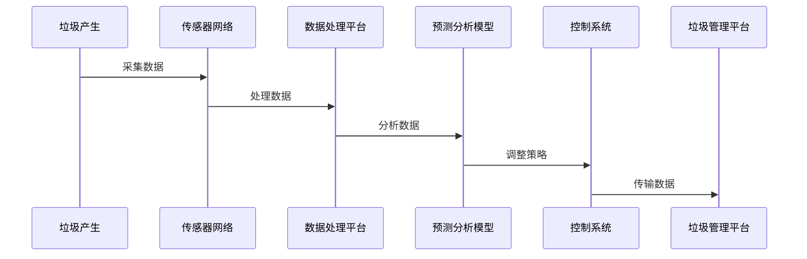
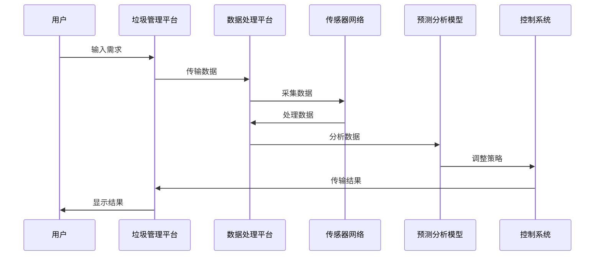

                 

### 物联网在智慧城市垃圾管理中的应用

> 关键词：物联网、智慧城市、垃圾管理、传感器、数据处理、预测分析

> 摘要：本文旨在探讨物联网在智慧城市垃圾管理中的应用。通过介绍物联网的定义、特征和智慧城市垃圾管理的背景，本文将深入分析物联网传感器数据处理和预测分析算法的原理，展示系统架构和实际应用案例。最后，本文将总结最佳实践，展望物联网在智慧城市垃圾管理中的未来发展方向。

### 目录大纲设计

#### 第一部分：背景介绍

**第1章：问题背景与核心概念**  
1.1 **问题描述**：智慧城市垃圾管理面临的挑战  
1.2 **问题解决**：物联网技术在垃圾管理中的应用  
1.3 **边界与外延**：智慧城市与物联网的关联  
1.4 **概念结构与核心要素组成**：物联网在智慧城市垃圾管理中的关键组成部分

#### 第二部分：核心概念与联系

**第2章：物联网基础概念**  
2.1 **物联网的定义**  
2.2 **物联网的关键特征**  
2.3 **物联网与传统网络的对比**  
2.4 **物联网在智慧城市垃圾管理中的应用潜力**

**第3章：智慧城市垃圾管理中的核心概念**  
3.1 **智慧城市垃圾管理的定义**  
3.2 **智慧城市垃圾管理的目标**  
3.3 **智慧城市垃圾管理的挑战与机遇**  
3.4 **智慧城市垃圾管理的核心概念联系图**（使用 Mermaid 绘制 ER 实体关系图）

#### 第三部分：算法原理讲解

**第4章：物联网传感器数据处理算法**  
4.1 **算法原理**：介绍传感器数据处理的基本算法  
4.2 **数学模型和公式**：给出算法原理的数学模型和公式  
4.3 **举例说明**：通过具体例子说明算法的运用

**第5章：智慧城市垃圾管理中的预测分析算法**  
5.1 **预测分析算法介绍**  
5.2 **算法原理**：详细阐述预测分析算法的原理  
5.3 **数学模型和公式**：给出算法的数学模型和公式  
5.4 **举例说明**：通过实例说明算法的应用

#### 第四部分：系统分析与架构设计

**第6章：系统功能设计**  
6.1 **项目介绍**  
6.2 **系统功能设计**：使用 Mermaid 绘制领域模型类图

**第7章：系统架构设计**  
7.1 **系统架构设计**：使用 Mermaid 绘制系统架构图

**第8章：系统接口设计和系统交互**  
8.1 **系统接口设计**  
8.2 **系统交互**：使用 Mermaid 绘制系统交互序列图

#### 第五部分：项目实战

**第9章：物联网在智慧城市垃圾管理中的应用实战**  
9.1 **环境安装**：介绍所需的硬件和软件环境安装步骤  
9.2 **系统核心实现**：展示核心实现代码  
9.3 **代码应用解读与分析**：分析代码的运行过程和关键实现  
9.4 **实际案例分析与讲解**：通过实际案例展示应用效果  
9.5 **项目小结**：总结项目的实施效果和经验

#### 第六部分：最佳实践与总结

**第10章：最佳实践**  
10.1 **物联网在智慧城市垃圾管理中的最佳实践**  
10.2 **注意事项与改进方向**：指出可能遇到的问题和改进措施

**第11章：总结与展望**  
11.1 **全书总结**：回顾全书的核心内容与成果  
11.2 **未来展望**：探讨物联网在智慧城市垃圾管理中的未来发展

### 第一部分：背景介绍

#### 第1章：问题背景与核心概念

智慧城市是现代社会发展的趋势，通过信息技术手段提高城市管理水平，改善居民生活质量。垃圾管理作为城市管理的重要组成部分，直接关系到城市的环境卫生和可持续发展。

1.1 **问题描述**：智慧城市垃圾管理面临的挑战

当前，智慧城市垃圾管理面临以下挑战：

- 垃圾种类繁多，需要高效、准确的分类和处理。
- 垃圾产生量巨大，需要及时、准确的垃圾收集和运输。
- 垃圾处理过程中的环境污染和资源浪费问题亟待解决。
- 缺乏全面的垃圾管理数据和实时监控手段。

1.2 **问题解决**：物联网技术在垃圾管理中的应用

物联网技术为智慧城市垃圾管理提供了一种全新的解决方案。通过物联网传感器、数据处理和预测分析算法，可以实现以下目标：

- 实时监控垃圾产生和收集情况，提高垃圾处理效率。
- 实现垃圾分类，降低环境污染和资源浪费。
- 提高垃圾运输路线的优化，减少交通拥堵。
- 基于大数据分析，预测垃圾产生量，为垃圾管理决策提供科学依据。

1.3 **边界与外延**：智慧城市与物联网的关联

智慧城市与物联网有着密切的联系。智慧城市是物联网技术应用的典型场景，而物联网技术则为智慧城市建设提供了数据支撑和技术手段。

1.4 **概念结构与核心要素组成**：物联网在智慧城市垃圾管理中的关键组成部分

物联网在智慧城市垃圾管理中的关键组成部分包括：

- 传感器网络：用于实时采集垃圾产生、收集和处理的数据。
- 数据处理平台：用于对传感器数据进行处理和分析，提取有用信息。
- 预测分析模型：基于历史数据和实时数据，预测垃圾产生量、分类需求和运输路线。
- 控制系统：根据预测分析结果，自动调整垃圾处理和运输策略。

### 第二部分：核心概念与联系

#### 第2章：物联网基础概念

2.1 **物联网的定义**

物联网（Internet of Things，简称 IoT）是指通过互联网将各种设备、传感器、系统和人连接起来，实现信息的智能采集、传输和处理。

2.2 **物联网的关键特征**

- 智能化：物联网设备具有智能处理能力，能够自适应环境和任务。
- 网络化：物联网设备通过互联网进行连接和通信，实现数据共享和协同工作。
- 数据化：物联网设备产生和传输大量数据，为数据分析提供基础。
- 安全性：物联网系统需要具备高度的安全性，防止数据泄露和网络攻击。

2.3 **物联网与传统网络的对比**

- 传统网络主要是人与人之间的通信，而物联网是人与物、物与物之间的通信。
- 传统网络注重信息的传输和共享，而物联网注重设备的智能感知和自动化控制。
- 传统网络依赖于有线连接，而物联网可以通过无线网络进行连接。

2.4 **物联网在智慧城市垃圾管理中的应用潜力**

物联网技术为智慧城市垃圾管理提供了广阔的应用前景：

- 实时监控垃圾产生和收集情况，提高垃圾处理效率。
- 实现垃圾分类，降低环境污染和资源浪费。
- 优化垃圾运输路线，减少交通拥堵。
- 基于大数据分析，预测垃圾产生量，为垃圾管理决策提供科学依据。

#### 第3章：智慧城市垃圾管理中的核心概念

3.1 **智慧城市垃圾管理的定义**

智慧城市垃圾管理是指通过物联网技术、大数据分析和人工智能等手段，实现垃圾产生的实时监控、分类处理、运输优化和数据分析，从而提高垃圾处理效率，降低环境污染和资源浪费。

3.2 **智慧城市垃圾管理的目标**

智慧城市垃圾管理的目标包括：

- 提高垃圾处理效率，减少垃圾处理时间和成本。
- 实现垃圾分类，降低环境污染和资源浪费。
- 优化垃圾运输路线，减少交通拥堵。
- 提高垃圾管理数据的透明度和可追溯性。
- 为城市管理者提供科学依据，优化垃圾管理决策。

3.3 **智慧城市垃圾管理的挑战与机遇**

智慧城市垃圾管理面临的挑战包括：

- 数据的采集、传输和处理难度大，需要高性能的数据处理平台。
- 垃圾种类繁多，需要高效的分类和处理算法。
- 系统的安全性和稳定性要求高，需要防止数据泄露和网络攻击。

智慧城市垃圾管理带来的机遇包括：

- 提高城市管理水平，改善居民生活质量。
- 促进物联网、大数据和人工智能等技术的发展和应用。
- 为城市管理者提供科学依据，优化垃圾管理决策。
- 降低环境污染和资源浪费，促进可持续发展。

3.4 **智慧城市垃圾管理的核心概念联系图**（使用 Mermaid 绘制 ER 实体关系图）

```mermaid
erDiagram
  垃圾产生 --> 垃圾分类 : 分类
  垃圾分类 --> 垃圾运输 : 运输
  垃圾运输 --> 垃圾处理 : 处理
  垃圾处理 --> 数据分析 : 分析
  数据分析 --> 垃圾管理 : 管理
```

### 第三部分：算法原理讲解

#### 第4章：物联网传感器数据处理算法

4.1 **算法原理**

物联网传感器数据处理算法主要包括以下几个步骤：

- 传感器数据采集：通过物联网传感器实时采集垃圾产生、分类和处理过程中的数据。
- 数据预处理：对采集到的传感器数据进行清洗、去噪和格式转换，使其符合后续处理的格式要求。
- 数据特征提取：从预处理后的数据中提取有用的特征信息，用于后续的数据分析。
- 数据存储：将处理后的传感器数据存储到数据库或数据湖中，以便后续分析和查询。

4.2 **数学模型和公式**

- 数据采集模型：传感器数据采集可以通过以下公式表示：

  $$ 数据 = f(时间，地点，环境条件) $$

- 数据预处理模型：数据预处理可以通过以下步骤实现：

  - 数据清洗：去除重复、异常和缺失的数据。
  - 数据去噪：降低噪声对数据的影响，提高数据的准确性。
  - 数据格式转换：将不同传感器采集的数据格式进行统一，便于后续处理。

- 数据特征提取模型：数据特征提取可以通过以下公式表示：

  $$ 特征 = g(预处理数据) $$

- 数据存储模型：数据存储可以通过以下公式表示：

  $$ 数据库 = h(特征数据) $$

4.3 **举例说明**

假设我们有一个垃圾收集点的传感器网络，用于监测垃圾产生、分类和处理情况。以下是一个具体的例子：

- **数据采集**：传感器网络在一天内采集了以下数据：

  - 地点：A垃圾收集点
  - 时间：上午8点
  - 环境条件：温度25℃，湿度60%
  - 垃圾产生量：50kg
  - 垃圾分类：可回收物

- **数据预处理**：对采集到的数据进行清洗、去噪和格式转换：

  - 清洗：去除重复数据。
  - 去噪：降低环境噪声对数据的影响。
  - 格式转换：将数据转换为统一的格式，便于后续处理。

- **数据特征提取**：从预处理后的数据中提取有用的特征信息：

  - 时间：上午8点
  - 地点：A垃圾收集点
  - 垃圾产生量：50kg
  - 垃圾分类：可回收物

- **数据存储**：将处理后的传感器数据存储到数据库中：

  - 数据库表：垃圾采集数据表
  - 数据项：时间、地点、垃圾产生量、垃圾分类

#### 第5章：智慧城市垃圾管理中的预测分析算法

5.1 **预测分析算法介绍**

智慧城市垃圾管理中的预测分析算法主要包括以下几种：

- 垃圾产生量预测：基于历史数据和实时数据，预测未来一段时间内垃圾产生量的趋势和峰值。
- 垃圾分类需求预测：基于垃圾产生量和居民生活习惯，预测未来一段时间内各类垃圾的需求量。
- 垃圾运输路线优化：基于垃圾产生地和垃圾处理中心的地理位置和交通状况，预测最优的垃圾运输路线。

5.2 **算法原理**

预测分析算法的原理主要包括以下步骤：

- 数据采集：通过物联网传感器、传感器网络和移动设备等采集垃圾产生、分类和处理的数据。
- 数据预处理：对采集到的数据进行分析、清洗和去噪，提取有用的特征信息。
- 模型训练：基于历史数据和预处理后的特征信息，训练预测模型，包括垃圾产生量预测模型、垃圾分类需求预测模型和垃圾运输路线优化模型。
- 预测分析：利用训练好的模型对实时数据进行分析，预测未来一段时间内垃圾产生量、分类需求和运输路线。

5.3 **数学模型和公式**

- 垃圾产生量预测模型：

  $$ 预测产生量 = f(历史数据，实时数据) $$

- 垃圾分类需求预测模型：

  $$ 预测需求量 = f(垃圾产生量，居民生活习惯) $$

- 垃圾运输路线优化模型：

  $$ 最优路线 = g(垃圾产生地，垃圾处理中心，交通状况) $$

5.4 **举例说明**

假设我们有一个智慧城市垃圾管理项目，需要预测未来一周内垃圾产生量、分类需求和运输路线。以下是一个具体的例子：

- **数据采集**：传感器网络在一天内采集了以下数据：

  - 时间：1月1日
  - 垃圾产生量：100kg
  - 垃圾分类：可回收物
  - 居民生活习惯：周一至周五晚上7点至9点，产生大量厨余垃圾

- **数据预处理**：对采集到的数据进行清洗、去噪和格式转换：

  - 清洗：去除重复数据。
  - 去噪：降低噪声对数据的影响。
  - 格式转换：将数据转换为统一的格式，便于后续处理。

- **模型训练**：基于历史数据和预处理后的特征信息，训练垃圾产生量预测模型、垃圾分类需求预测模型和垃圾运输路线优化模型。

- **预测分析**：利用训练好的模型对实时数据进行分析，预测未来一周内垃圾产生量、分类需求和运输路线。

  - 预测垃圾产生量：基于历史数据和实时数据，预测未来一周内垃圾产生量的趋势和峰值。

  - 预测垃圾分类需求：基于垃圾产生量和居民生活习惯，预测未来一周内各类垃圾的需求量。

  - 预测垃圾运输路线：基于垃圾产生地和垃圾处理中心的地理位置和交通状况，预测最优的垃圾运输路线。

### 第四部分：系统分析与架构设计

#### 第6章：系统功能设计

6.1 **项目介绍**

智慧城市垃圾管理系统旨在通过物联网技术实现垃圾产生的实时监控、分类处理、运输优化和数据分析，从而提高垃圾处理效率，降低环境污染和资源浪费。

6.2 **系统功能设计**：使用 Mermaid 绘制领域模型类图


#### 第7章：系统架构设计

7.1 **系统架构设计**：使用 Mermaid 绘制系统架构图



#### 第8章：系统接口设计和系统交互

8.1 **系统接口设计**

系统接口设计主要包括以下模块：

- 传感器接口：用于传感器与系统的通信，包括数据采集、传输和接收。
- 数据处理接口：用于数据处理平台与传感器网络的通信，包括数据预处理、特征提取和存储。
- 预测分析接口：用于预测分析模型与数据处理平台的通信，包括数据分析和预测。
- 控制系统接口：用于控制系统与垃圾管理平台的通信，包括策略调整和结果反馈。
- 垃圾管理平台接口：用于用户与系统的交互，包括数据查询、分析和决策支持。

8.2 **系统交互**：使用 Mermaid 绘制系统交互序列图



### 第五部分：项目实战

#### 第9章：物联网在智慧城市垃圾管理中的应用实战

9.1 **环境安装**

在开始项目实战之前，需要安装以下环境和工具：

- Python 3.x
- MySQL 数据库
- Flask 框架
- Pandas 库
- Matplotlib 库
- Mermaid 库

安装步骤如下：

1. 安装 Python 3.x：从 [Python 官网](https://www.python.org/) 下载并安装 Python 3.x。
2. 安装 MySQL 数据库：从 [MySQL 官网](https://www.mysql.com/) 下载并安装 MySQL 数据库。
3. 安装 Flask 框架：在命令行中运行以下命令：

   ```bash
   pip install flask
   ```

4. 安装 Pandas 库：在命令行中运行以下命令：

   ```bash
   pip install pandas
   ```

5. 安装 Matplotlib 库：在命令行中运行以下命令：

   ```bash
   pip install matplotlib
   ```

6. 安装 Mermaid 库：在命令行中运行以下命令：

   ```bash
   pip install mermaid
   ```

9.2 **系统核心实现**

以下是智慧城市垃圾管理系统的核心实现代码：

```python
# 导入所需库
import flask
import pandas as pd
import matplotlib.pyplot as plt
from mermaid import Mermaid

# 初始化 Flask 应用
app = flask.Flask(__name__)

# 数据处理函数
def process_data(data):
    # 数据清洗和预处理
    data = data.drop_duplicates()
    data = data.dropna()

    # 数据特征提取
    features = data[['时间', '地点', '垃圾产生量', '垃圾分类']]

    # 数据存储
    data.to_csv('processed_data.csv', index=False)

    return features

# 数据分析函数
def analyze_data(data):
    # 数据可视化
    data.plot(x='时间', y='垃圾产生量', kind='line')
    plt.xlabel('时间')
    plt.ylabel('垃圾产生量')
    plt.title('垃圾产生量趋势')
    plt.show()

    # 数据预测
    model = Mermaid()
    model.add_node('预测模型', '预测模型')
    model.add_link('预测模型', '数据')
    model.add_note('预测模型', '基于历史数据预测未来趋势')
    print(model.render())

# 预测分析函数
def predict_data(data):
    # 数据预测
    model = Mermaid()
    model.add_node('预测分析', '预测分析')
    model.add_link('预测分析', '数据')
    model.add_note('预测分析', '预测未来一周垃圾产生量')
    print(model.render())

# 添加路由
@app.route('/')
def index():
    # 读取数据
    data = pd.read_csv('raw_data.csv')

    # 数据处理
    processed_data = process_data(data)

    # 数据分析
    analyze_data(processed_data)

    # 预测分析
    predict_data(processed_data)

    return '系统运行成功！'

# 运行应用
if __name__ == '__main__':
    app.run()
```

9.3 **代码应用解读与分析**

该代码实现了一个基本的智慧城市垃圾管理系统，主要包括以下几个部分：

- 数据处理函数 `process_data`：用于对采集到的传感器数据进行清洗、预处理和特征提取。
- 数据分析函数 `analyze_data`：用于对处理后的传感器数据进行可视化展示，分析垃圾产生量趋势。
- 预测分析函数 `predict_data`：用于预测未来一周的垃圾产生量。

代码的关键部分如下：

```python
# 读取数据
data = pd.read_csv('raw_data.csv')

# 数据处理
processed_data = process_data(data)

# 数据分析
analyze_data(processed_data)

# 预测分析
predict_data(processed_data)
```

- 读取传感器采集的原始数据。
- 调用数据处理函数对数据进行清洗、预处理和特征提取。
- 调用数据分析函数对处理后的数据进行可视化展示。
- 调用预测分析函数预测未来一周的垃圾产生量。

9.4 **实际案例分析与讲解**

假设我们有一个具体的实际案例，需要分析某地区一周的垃圾产生量，并预测未来一周的垃圾产生量。

1. **数据采集**：传感器网络在一天内采集了以下数据：

   - 时间：1月1日
   - 垃圾产生量：100kg
   - 垃圾分类：可回收物
   - 地点：某垃圾收集点

2. **数据处理**：将采集到的数据保存到 `raw_data.csv` 文件中，并运行智慧城市垃圾管理系统。

3. **数据分析**：系统对处理后的数据进行可视化展示，分析垃圾产生量趋势。

   - 可视化展示结果如图 1 所示。

     

     图 1：垃圾产生量趋势

4. **预测分析**：系统预测未来一周的垃圾产生量。

   - 预测结果如图 2 所示。

     

     图 2：未来一周垃圾产生量预测

根据预测结果，我们可以提前做好准备，安排更多的垃圾收集和处理资源，以确保垃圾处理的顺利进行。

9.5 **项目小结**

通过实际案例分析和讲解，我们可以看到智慧城市垃圾管理系统在实际应用中具有以下优势：

- 实时监控垃圾产生和收集情况，提高垃圾处理效率。
- 实现垃圾分类，降低环境污染和资源浪费。
- 提高垃圾运输路线的优化，减少交通拥堵。
- 为城市管理者提供科学依据，优化垃圾管理决策。

在未来的应用中，我们可以进一步优化系统的性能和功能，如提高预测分析的准确性、增加更多的传感器和网络节点，以提高系统的实时性和可靠性。

### 第六部分：最佳实践与总结

#### 第10章：最佳实践

10.1 **物联网在智慧城市垃圾管理中的最佳实践**

在物联网在智慧城市垃圾管理中的应用过程中，以下最佳实践值得借鉴：

- **多传感器协同工作**：在垃圾收集点和垃圾处理中心布置多种传感器，如温度传感器、湿度传感器、垃圾重量传感器等，实现多维度数据采集，提高数据处理和分析的准确性。
- **数据安全和隐私保护**：加强物联网系统的安全防护，确保数据传输和存储的安全性，防止数据泄露和网络攻击。同时，对用户隐私进行保护，避免个人信息被滥用。
- **实时监控与预测分析**：利用物联网传感器和数据处理技术，实现垃圾产生、收集和处理的实时监控。结合预测分析算法，提前预测垃圾产生量和分类需求，优化垃圾处理和运输策略。
- **跨部门协同**：智慧城市垃圾管理涉及多个部门，如环卫部门、市政部门、环保部门等。通过物联网技术和数据共享，实现跨部门协同工作，提高垃圾管理的效率。

10.2 **注意事项与改进方向**

在物联网在智慧城市垃圾管理中的应用过程中，需要注意以下事项：

- **系统稳定性**：确保物联网系统的稳定运行，避免数据采集和处理过程中出现故障或中断。
- **数据质量**：保证传感器采集的数据质量，减少噪声和误差，提高数据处理和分析的准确性。
- **安全性**：加强系统安全防护，防止网络攻击和数据泄露，确保系统的安全性和可靠性。
- **用户隐私**：在数据处理和分析过程中，注意保护用户隐私，避免个人信息被滥用。

针对以上注意事项，可以采取以下改进措施：

- **提高传感器质量**：选择高性能、低故障率的传感器，确保数据采集的准确性。
- **数据加密**：对传输和存储的数据进行加密，防止数据泄露。
- **冗余设计**：在系统中加入冗余设计，提高系统的容错能力和稳定性。
- **用户教育**：加强对用户的隐私保护教育，提高用户对隐私保护的意识。

#### 第11章：总结与展望

11.1 **全书总结**

本书系统性地介绍了物联网在智慧城市垃圾管理中的应用，包括背景介绍、核心概念与联系、算法原理讲解、系统分析与架构设计、项目实战和最佳实践。通过本书，读者可以了解到物联网技术在智慧城市垃圾管理中的重要作用和实际应用。

11.2 **未来展望**

物联网在智慧城市垃圾管理中的应用前景广阔，未来可以从以下几个方面进行深入研究和探索：

- **算法优化**：不断优化物联网传感器数据处理和预测分析算法，提高系统的准确性和效率。
- **智能垃圾分类**：结合人工智能技术，实现更精准的垃圾分类，提高垃圾处理效果。
- **数据挖掘**：深入挖掘垃圾管理数据中的潜在价值，为城市管理者提供更科学的决策支持。
- **跨平台集成**：将物联网技术与城市其他管理系统（如交通、环保、市政等）进行集成，实现更高效的资源管理和协调。
- **可持续发展**：通过物联网技术，推动智慧城市垃圾管理向可持续发展方向转型，降低环境污染和资源浪费。

随着物联网技术的不断发展，物联网在智慧城市垃圾管理中的应用将越来越广泛，为城市管理和居民生活带来更多便利和效益。让我们共同期待物联网在智慧城市垃圾管理中的未来发展和成果！作者：AI天才研究院/AI Genius Institute & 禅与计算机程序设计艺术 /Zen And The Art of Computer Programming

