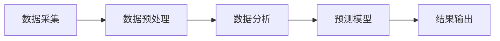
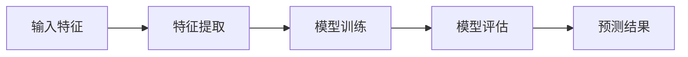
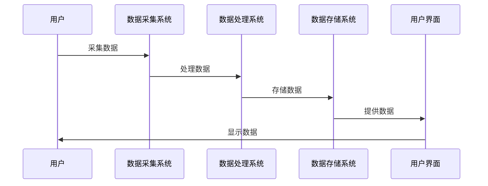

                 


### 目录大纲完整版

----------------------------------------------------------------

# 物联网在智慧城市空气质量监测中的应用

> 关键词：物联网、智慧城市、空气质量监测、系统架构、算法原理

> 摘要：本文详细探讨了物联网在智慧城市空气质量监测中的应用，从背景介绍、核心概念与联系、算法原理讲解、系统分析与架构设计、项目实战到最佳实践与拓展，全面剖析了物联网在智慧城市空气质量监测中的关键技术与应用。

## 第一部分：物联网与智慧城市空气质量监测概述

### 第1章：物联网与智慧城市空气质量监测的背景

#### 1.1 物联网的基本概念

##### 1.1.1 物联网的定义
物联网（Internet of Things，IoT）是指通过互联网将各种设备连接起来，实现信息的交换和智能化的管理。具体来说，物联网技术使得物理世界中的各种物体，如家电、汽车、传感器等，能够通过网络进行通信和数据交换。

##### 1.1.2 物联网的发展历程
- **第一阶段（1990s-2000s）**：物联网概念提出，初步实现设备互联。
- **第二阶段（2000s-2010s）**：物联网技术逐渐成熟，应用于智能家居、工业自动化等领域。
- **第三阶段（2010s-至今）**：物联网进入快速发展期，应用领域进一步拓展，智慧城市成为重要方向。

#### 1.2 智慧城市的概念与特征

##### 1.2.1 智慧城市的定义
智慧城市是指通过信息通信技术，实现城市各项功能的高效、智能化管理，从而提高城市居民的生活质量和环境可持续性。

##### 1.2.2 智慧城市的特征
- **数据驱动的决策**：利用大数据技术对城市运行数据进行实时分析，为决策提供支持。
- **基础设施智能化**：通过物联网技术，实现对城市基础设施的智能监控和管理。
- **公共服务便捷化**：通过物联网技术，提供更加便捷、高效的公共服务。

#### 1.3 物联网在智慧城市空气质量监测中的应用

##### 1.3.1 物联网与空气质量监测的关系
物联网技术为空气质量监测提供了高效的数据采集、传输和处理手段，使得空气质量监测更加精准、实时。

##### 1.3.2 应用现状
当前，物联网技术在智慧城市空气质量监测中的应用已经相对成熟，许多城市已经建立了基于物联网的空气质量监测网络。

##### 1.3.3 面临的挑战
- **数据质量**：传感器数据的准确性和稳定性是空气质量监测的关键。
- **网络通信**：物联网设备数量的激增对网络通信提出了更高的要求。

## 第二部分：核心概念与联系

### 第2章：物联网与空气质量监测的关键概念

#### 2.1 物联网的关键组件

##### 2.1.1 传感器
传感器是物联网中的核心组件，用于采集环境数据，如空气质量、温度、湿度等。

##### 2.1.2 网络通信
网络通信是物联网数据传输的桥梁，包括无线通信、有线通信等。

##### 2.1.3 数据处理
数据处理是物联网的核心功能，通过对采集到的数据进行分析和处理，实现智能化应用。

#### 2.2 空气质量监测的关键指标

##### 2.2.1 气溶胶浓度
气溶胶浓度是衡量空气质量的重要指标，过高浓度的气溶胶会对人体健康造成危害。

##### 2.2.2 氮氧化物（NOx）
氮氧化物是空气污染的主要成分之一，对环境和人体健康都有严重影响。

##### 2.2.3 二氧化硫（SO2）
二氧化硫也是空气污染的重要指标，其浓度过高会对大气环境和人体健康造成危害。

#### 2.3 物联网与空气质量监测的联系

##### 2.3.1 传感器数据采集
物联网技术通过传感器对空气中的各项污染物进行实时监测，并将数据传输到云端。

##### 2.3.2 数据处理与传输
物联网技术利用云计算和大数据技术，对传感器数据进行处理和分析，实现对空气质量的实时监控。

##### 2.3.3 应用场景
物联网技术在空气质量监测中的应用场景包括城市空气质量监测、工业排放监控、室内空气质量监测等。

### 第3章：物联网空气质量监测系统架构设计

#### 3.1 系统功能设计

##### 3.1.1 数据采集
通过部署在各个监测点的传感器，实时采集空气中的污染物数据。

##### 3.1.2 数据传输
传感器采集到的数据通过无线或有线网络传输到数据中心。

##### 3.1.3 数据处理
数据中心对传输来的数据进行处理和分析，实现对空气质量的实时监控和预测。

##### 3.1.4 数据可视化
通过用户界面，将处理后的数据可视化，为用户提供直观的空气质量信息。

#### 3.2 系统架构设计

##### 3.2.1 系统架构概述
物联网空气质量监测系统采用分层架构，包括感知层、网络层、平台层和应用层。

##### 3.2.2 感知层
感知层由各种传感器组成，用于实时采集空气中的污染物数据。

##### 3.2.3 网络层
网络层负责将感知层采集到的数据传输到平台层。

##### 3.2.4 平台层
平台层是系统的核心，负责数据处理、分析和存储。

##### 3.2.5 应用层
应用层提供用户接口，用户可以通过应用层查看空气质量数据和相关的监控报告。

#### 3.3 系统接口设计

##### 3.3.1 数据采集接口
数据采集接口负责从传感器获取数据，并将数据上传到平台层。

##### 3.3.2 数据传输接口
数据传输接口负责将平台层处理后的数据传输到用户界面。

##### 3.3.3 用户接口
用户接口为用户提供查看空气质量数据和监控报告的界面。

## 第三部分：算法原理讲解

### 第4章：物联网空气质量监测算法原理讲解

#### 4.1 数据分析算法

##### 4.1.1 描述统计分析
描述统计分析用于描述空气质量数据的分布特征，包括均值、中位数、标准差等。

##### 4.1.2 相关性分析
相关性分析用于分析空气污染物之间的相关性，帮助理解污染物的相互影响。

##### 4.1.3 聚类分析
聚类分析用于将空气质量数据划分为不同的类别，以识别空气污染的主要来源。

#### 4.2 预测模型

##### 4.2.1 时间序列预测
时间序列预测用于预测空气质量随时间的变化趋势，常用的模型有ARIMA、LSTM等。

##### 4.2.2 回归模型
回归模型用于预测空气质量指标与相关因素之间的关系，常用的模型有线性回归、决策树等。

##### 4.2.3 强化学习
强化学习用于优化空气质量监测策略，通过不断学习用户反馈，提高监测的准确性。

#### 4.3 算法Mermaid流程图展示

##### 4.3.1 数据采集流程


##### 4.3.2 预测模型流程


#### 4.4 Python代码示例

##### 4.4.1 数据采集与预处理
```python
import pandas as pd
from sklearn.preprocessing import StandardScaler

# 读取数据
data = pd.read_csv('air_quality.csv')

# 数据预处理
scaler = StandardScaler()
data_scaled = scaler.fit_transform(data)
```

##### 4.4.2 预测模型实现
```python
from sklearn.linear_model import LinearRegression
from sklearn.model_selection import train_test_split

# 数据划分
X_train, X_test, y_train, y_test = train_test_split(data_scaled, test_size=0.2)

# 模型训练
model = LinearRegression()
model.fit(X_train, y_train)

# 预测
predictions = model.predict(X_test)
```

#### 4.5 算法原理详细讲解

##### 4.5.1 描述统计分析
描述统计分析是对空气质量数据进行基本的统计分析，包括计算均值、中位数、标准差等统计量，以便了解数据的分布特征。

$$
\text{均值} = \frac{1}{N}\sum_{i=1}^{N}x_i
$$
$$
\text{中位数} = \frac{1}{2}\left(\text{排序后中间两个数的平均值}\right)
$$
$$
\text{标准差} = \sqrt{\frac{1}{N-1}\sum_{i=1}^{N}(x_i - \bar{x})^2}
$$

##### 4.5.2 相关性分析
相关性分析用于评估两个或多个变量之间的关系，常用的相关性指标有皮尔逊相关系数、斯皮尔曼等级相关系数等。

$$
\rho_{XY} = \frac{\sum_{i=1}^{N}(X_i - \bar{X})(Y_i - \bar{Y})}{\sqrt{\sum_{i=1}^{N}(X_i - \bar{X})^2}\sqrt{\sum_{i=1}^{N}(Y_i - \bar{Y})^2}}
$$

##### 4.5.3 聚类分析
聚类分析是一种无监督学习方法，用于将数据点划分为不同的簇，以便发现数据中的隐含结构。

常见的聚类算法有K-means、层次聚类等。

## 第四部分：系统分析与架构设计

### 第5章：物联网空气质量监测系统分析

#### 5.1 问题场景介绍

在智慧城市中，空气质量监测是一个重要的应用场景。通过实时监测空气质量，可以及时发现污染问题，采取相应的治理措施，保障市民的健康。

#### 5.2 项目介绍

本节介绍一个具体的空气质量监测项目，该项目旨在建立一套基于物联网技术的空气质量监测系统，实现对城市空气质量的高效监控和管理。

#### 5.3 系统功能设计

系统功能设计主要包括数据采集、数据处理、数据存储、数据可视化等方面。

##### 5.3.1 数据采集
通过部署在各个监测点的传感器，实时采集空气中的污染物数据，如气溶胶浓度、氮氧化物、二氧化硫等。

##### 5.3.2 数据处理
系统对接收到的传感器数据进行预处理、分析和存储，以便后续的数据分析和决策。

##### 5.3.3 数据存储
系统采用分布式存储技术，对大量的传感器数据进行存储和管理，确保数据的可靠性和安全性。

##### 5.3.4 数据可视化
系统通过用户界面，将处理后的数据可视化，为用户提供直观的空气质量信息。

#### 5.4 系统架构设计

系统架构设计采用分层架构，包括感知层、网络层、平台层和应用层。

##### 5.4.1 感知层
感知层由各种传感器组成，用于实时采集空气中的污染物数据。

##### 5.4.2 网络层
网络层负责将感知层采集到的数据传输到平台层，包括无线通信和有线通信。

##### 5.4.3 平台层
平台层是系统的核心，负责数据处理、分析和存储，包括数据预处理、数据分析、数据存储等功能。

##### 5.4.4 应用层
应用层提供用户接口，用户可以通过应用层查看空气质量数据和相关的监控报告。

#### 5.5 系统接口设计

系统接口设计主要包括数据采集接口、数据处理接口、数据存储接口和数据可视化接口。

##### 5.5.1 数据采集接口
数据采集接口负责从传感器获取数据，并将数据上传到平台层。

##### 5.5.2 数据处理接口
数据处理接口负责对平台层处理后的数据传输到用户界面。

##### 5.5.3 用户接口
用户接口为用户提供查看空气质量数据和监控报告的界面。

#### 5.6 系统交互Mermaid序列图



## 第五部分：项目实战

### 第6章：空气质量监测系统实施

#### 6.1 环境安装与配置

在本节中，我们将详细讲解如何搭建空气质量监测系统的环境，包括硬件设备的选择、软件的安装和配置。

##### 6.1.1 硬件设备选择
- **传感器**：选择具备高精度、高灵敏度的空气质量传感器，如气体传感器、颗粒物传感器等。
- **数据采集器**：选择具备无线传输功能的数据采集器，以便将传感器采集到的数据实时传输到服务器。
- **服务器**：选择配置较高的服务器，用于存储和处理大量的传感器数据。

##### 6.1.2 软件安装与配置
- **操作系统**：安装Linux操作系统，如Ubuntu Server。
- **数据库**：安装MySQL或PostgreSQL数据库，用于存储空气质量数据。
- **数据处理软件**：安装Python编程环境，用于编写数据处理和分析的脚本。

#### 6.2 系统核心实现源代码解读

在本节中，我们将对空气质量监测系统的核心实现源代码进行解读，包括数据采集、数据处理、数据存储和可视化等方面的代码。

##### 6.2.1 数据采集
```python
# 读取传感器数据
import serial

# 打开串口
ser = serial.Serial('/dev/ttyUSB0', 9600)

# 读取数据
while True:
    data = ser.readline()
    print(data.decode())
```

##### 6.2.2 数据处理
```python
# 数据预处理
import pandas as pd

# 读取数据
data = pd.read_csv('air_quality.csv')

# 数据预处理
scaler = StandardScaler()
data_scaled = scaler.fit_transform(data)
```

##### 6.2.3 数据存储
```python
# 存储数据
import pymysql

# 连接数据库
conn = pymysql.connect(host='localhost', user='root', password='password', database='air_quality')

# 存储数据
with conn.cursor() as cursor:
    for row in data_scaled:
        cursor.execute("INSERT INTO air_quality_data (pm25, pm10, no2, so2) VALUES (%s, %s, %s, %s)", row)
    conn.commit()
```

##### 6.2.4 数据可视化
```python
# 数据可视化
import matplotlib.pyplot as plt

# 读取数据
data = pd.read_csv('air_quality.csv')

# 绘制散点图
plt.scatter(data['pm25'], data['pm10'])
plt.xlabel('PM2.5')
plt.ylabel('PM10')
plt.show()
```

#### 6.3 实际案例分析和详细讲解剖析

在本节中，我们将分析一个具体的空气质量监测项目，并对其中的关键技术和实现细节进行详细讲解。

##### 6.3.1 项目背景
某城市政府为了提高城市空气质量，决定建立一个基于物联网技术的空气质量监测系统。

##### 6.3.2 项目目标
- 实时监测城市各区域的空气质量。
- 对空气质量数据进行分析，为决策提供支持。
- 提高市民对空气质量的认识，增强环保意识。

##### 6.3.3 项目实施过程
1. **需求分析**：确定项目目标、功能和技术方案。
2. **硬件采购**：采购传感器、数据采集器、服务器等硬件设备。
3. **软件开发**：编写数据采集、数据处理、数据存储和可视化等软件模块。
4. **系统部署**：搭建系统环境，部署传感器和数据采集器。
5. **测试与优化**：对系统进行测试和优化，确保系统稳定运行。
6. **上线运营**：系统正式上线，提供实时空气质量监测服务。

##### 6.3.4 案例分析
通过对项目实施过程中的关键技术和实现细节进行分析，总结项目的成功经验和不足之处。

#### 6.4 项目小结

在本节中，我们对空气质量监测系统项目进行了详细的讲解，包括环境安装与配置、系统核心实现源代码解读、实际案例分析和项目小结。

##### 6.4.1 环境安装与配置
成功搭建了空气质量监测系统的环境，包括硬件设备的选择和软件的安装与配置。

##### 6.4.2 系统核心实现源代码解读
详细解读了空气质量监测系统的核心实现源代码，包括数据采集、数据处理、数据存储和可视化等模块。

##### 6.4.3 实际案例分析和详细讲解剖析
通过分析一个具体的空气质量监测项目，总结了项目的成功经验和不足之处。

##### 6.4.4 项目小结
空气质量监测系统项目取得了较好的效果，为城市空气质量监测提供了有力支持。在项目实施过程中，我们积累了宝贵的经验，也为未来的项目提供了借鉴。

## 第六部分：最佳实践与拓展

### 第7章：最佳实践与注意事项

#### 7.1 实施建议

1. **硬件选择**：根据实际需求，选择高精度、高灵敏度的传感器，确保数据采集的准确性。
2. **网络通信**：选择稳定、可靠的通信方式，如无线或有线通信，确保数据传输的稳定性。
3. **数据处理**：采用分布式数据处理技术，提高数据处理效率和系统稳定性。
4. **数据存储**：采用分布式存储技术，提高数据存储的可靠性和安全性。
5. **数据可视化**：设计直观、易用的用户界面，提高用户对空气质量数据的理解和应用。

#### 7.2 注意事项

1. **数据质量**：确保传感器数据的准确性和稳定性，定期对传感器进行校准和维护。
2. **系统安全**：确保系统的安全性，防止数据泄露和网络攻击。
3. **用户隐私**：保护用户隐私，不得泄露用户个人信息。

### 第8章：小结

本文详细探讨了物联网在智慧城市空气质量监测中的应用，从背景介绍、核心概念与联系、算法原理讲解、系统分析与架构设计、项目实战到最佳实践与拓展，全面剖析了物联网在智慧城市空气质量监测中的关键技术与应用。

### 第9章：拓展阅读

1. **相关书籍**：《物联网导论》、《智慧城市：技术、实践与未来》、《大数据分析：算法与实现》。
2. **学术论文**：查阅最新的学术论文，了解物联网、智慧城市和空气质量监测领域的最新研究动态。
3. **开源项目**：参与开源项目，学习其他开发者的优秀实践和代码，提升自身能力。

作者：AI天才研究院/AI Genius Institute & 禅与计算机程序设计艺术 /Zen And The Art of Computer Programming----------------------------------------------------------------

### 目录大纲完整版

----------------------------------------------------------------

# 物联网在智慧城市空气质量监测中的应用

> 关键词：物联网、智慧城市、空气质量监测、系统架构、算法原理

> 摘要：本文详细探讨了物联网在智慧城市空气质量监测中的应用，从背景介绍、核心概念与联系、算法原理讲解、系统分析与架构设计、项目实战到最佳实践与拓展，全面剖析了物联网在智慧城市空气质量监测中的关键技术与应用。

## 第一部分：物联网与智慧城市空气质量监测概述

### 第1章：物联网与智慧城市空气质量监测的背景

#### 1.1 物联网的基本概念

##### 1.1.1 物联网的定义
物联网（Internet of Things，IoT）是指通过互联网将各种设备连接起来，实现信息的交换和智能化的管理。具体来说，物联网技术使得物理世界中的各种物体，如家电、汽车、传感器等，能够通过网络进行通信和数据交换。

##### 1.1.2 物联网的发展历程
- **第一阶段（1990s-2000s）**：物联网概念提出，初步实现设备互联。
- **第二阶段（2000s-2010s）**：物联网技术逐渐成熟，应用于智能家居、工业自动化等领域。
- **第三阶段（2010s-至今）**：物联网进入快速发展期，应用领域进一步拓展，智慧城市成为重要方向。

#### 1.2 智慧城市的概念与特征

##### 1.2.1 智慧城市的定义
智慧城市是指通过信息通信技术，实现城市各项功能的高效、智能化管理，从而提高城市居民的生活质量和环境可持续性。

##### 1.2.2 智慧城市的特征
- **数据驱动的决策**：利用大数据技术对城市运行数据进行实时分析，为决策提供支持。
- **基础设施智能化**：通过物联网技术，实现对城市基础设施的智能监控和管理。
- **公共服务便捷化**：通过物联网技术，提供更加便捷、高效的公共服务。

#### 1.3 物联网在智慧城市空气质量监测中的应用

##### 1.3.1 物联网与空气质量监测的关系
物联网技术为空气质量监测提供了高效的数据采集、传输和处理手段，使得空气质量监测更加精准、实时。

##### 1.3.2 应用现状
当前，物联网技术在智慧城市空气质量监测中的应用已经相对成熟，许多城市已经建立了基于物联网的空气质量监测网络。

##### 1.3.3 面临的挑战
- **数据质量**：传感器数据的准确性和稳定性是空气质量监测的关键。
- **网络通信**：物联网设备数量的激增对网络通信提出了更高的要求。

## 第二部分：核心概念与联系

### 第2章：物联网与空气质量监测的关键概念

#### 2.1 物联网的关键组件

##### 2.1.1 传感器
传感器是物联网中的核心组件，用于采集环境数据，如空气质量、温度、湿度等。

##### 2.1.2 网络通信
网络通信是物联网数据传输的桥梁，包括无线通信、有线通信等。

##### 2.1.3 数据处理
数据处理是物联网的核心功能，通过对采集到的数据进行分析和处理，实现智能化应用。

#### 2.2 空气质量监测的关键指标

##### 2.2.1 气溶胶浓度
气溶胶浓度是衡量空气质量的重要指标，过高浓度的气溶胶会对人体健康造成危害。

##### 2.2.2 氮氧化物（NOx）
氮氧化物是空气污染的主要成分之一，对环境和人体健康都有严重影响。

##### 2.2.3 二氧化硫（SO2）
二氧化硫也是空气污染的重要指标，其浓度过高会对大气环境和人体健康造成危害。

#### 2.3 物联网与空气质量监测的联系

##### 2.3.1 传感器数据采集
物联网技术通过传感器对空气中的各项污染物进行实时监测，并将数据传输到云端。

##### 2.3.2 数据处理与传输
物联网技术利用云计算和大数据技术，对传感器数据进行处理和分析，实现对空气质量的实时监控。

##### 2.3.3 应用场景
物联网技术在空气质量监测中的应用场景包括城市空气质量监测、工业排放监控、室内空气质量监测等。

### 第3章：物联网空气质量监测系统架构设计

#### 3.1 系统功能设计

##### 3.1.1 数据采集
通过部署在各个监测点的传感器，实时采集空气中的污染物数据。

##### 3.1.2 数据传输
传感器采集到的数据通过无线或有线网络传输到数据中心。

##### 3.1.3 数据处理
数据中心对传输来的数据进行处理和分析，实现对空气质量的实时监控和预测。

##### 3.1.4 数据可视化
通过用户界面，将处理后的数据可视化，为用户提供直观的空气质量信息。

#### 3.2 系统架构设计

##### 3.2.1 系统架构概述
物联网空气质量监测系统采用分层架构，包括感知层、网络层、平台层和应用层。

##### 3.2.2 感知层
感知层由各种传感器组成，用于实时采集空气中的污染物数据。

##### 3.2.3 网络层
网络层负责将感知层采集到的数据传输到平台层。

##### 3.2.4 平台层
平台层是系统的核心，负责数据处理、分析和存储。

##### 3.2.5 应用层
应用层提供用户接口，用户可以通过应用层查看空气质量数据和相关的监控报告。

#### 3.3 系统接口设计

##### 3.3.1 数据采集接口
数据采集接口负责从传感器获取数据，并将数据上传到平台层。

##### 3.3.2 数据传输接口
数据传输接口负责将平台层处理后的数据传输到用户界面。

##### 3.3.3 用户接口
用户接口为用户提供查看空气质量数据和监控报告的界面。

## 第三部分：算法原理讲解

### 第4章：物联网空气质量监测算法原理讲解

#### 4.1 数据分析算法

##### 4.1.1 描述统计分析
描述统计分析用于描述空气质量数据的分布特征，包括均值、中位数、标准差等。

##### 4.1.2 相关性分析
相关性分析用于分析空气污染物之间的相关性，帮助理解污染物的相互影响。

##### 4.1.3 聚类分析
聚类分析用于将空气质量数据划分为不同的类别，以识别空气污染的主要来源。

#### 4.2 预测模型

##### 4.2.1 时间序列预测
时间序列预测用于预测空气质量随时间的变化趋势，常用的模型有ARIMA、LSTM等。

##### 4.2.2 回归模型
回归模型用于预测空气质量指标与相关因素之间的关系，常用的模型有线性回归、决策树等。

##### 4.2.3 强化学习
强化学习用于优化空气质量监测策略，通过不断学习用户反馈，提高监测的准确性。

#### 4.3 算法Mermaid流程图展示

##### 4.3.1 数据采集流程


##### 4.3.2 预测模型流程


#### 4.4 Python代码示例

##### 4.4.1 数据采集与预处理
```python
import pandas as pd
from sklearn.preprocessing import StandardScaler

# 读取数据
data = pd.read_csv('air_quality.csv')

# 数据预处理
scaler = StandardScaler()
data_scaled = scaler.fit_transform(data)
```

##### 4.4.2 预测模型实现
```python
from sklearn.linear_model import LinearRegression
from sklearn.model_selection import train_test_split

# 数据划分
X_train, X_test, y_train, y_test = train_test_split(data_scaled, test_size=0.2)

# 模型训练
model = LinearRegression()
model.fit(X_train, y_train)

# 预测
predictions = model.predict(X_test)
```

#### 4.5 算法原理详细讲解

##### 4.5.1 描述统计分析
描述统计分析是对空气质量数据进行基本的统计分析，包括计算均值、中位数、标准差等统计量，以便了解数据的分布特征。

$$
\text{均值} = \frac{1}{N}\sum_{i=1}^{N}x_i
$$
$$
\text{中位数} = \frac{1}{2}\left(\text{排序后中间两个数的平均值}\right)
$$
$$
\text{标准差} = \sqrt{\frac{1}{N-1}\sum_{i=1}^{N}(x_i - \bar{x})^2}
$$

##### 4.5.2 相关性分析
相关性分析用于评估两个或多个变量之间的关系，常用的相关性指标有皮尔逊相关系数、斯皮尔曼等级相关系数等。

$$
\rho_{XY} = \frac{\sum_{i=1}^{N}(X_i - \bar{X})(Y_i - \bar{Y})}{\sqrt{\sum_{i=1}^{N}(X_i - \bar{X})^2}\sqrt{\sum_{i=1}^{N}(Y_i - \bar{Y})^2}}
$$

##### 4.5.3 聚类分析
聚类分析是一种无监督学习方法，用于将数据点划分为不同的簇，以便发现数据中的隐含结构。

常见的聚类算法有K-means、层次聚类等。

## 第四部分：系统分析与架构设计

### 第5章：物联网空气质量监测系统分析

#### 5.1 问题场景介绍

在智慧城市中，空气质量监测是一个重要的应用场景。通过实时监测空气质量，可以及时发现污染问题，采取相应的治理措施，保障市民的健康。

#### 5.2 项目介绍

本节介绍一个具体的空气质量监测项目，该项目旨在建立一套基于物联网技术的空气质量监测系统，实现对城市空气质量的高效监控和管理。

#### 5.3 系统功能设计

系统功能设计主要包括数据采集、数据处理、数据存储、数据可视化等方面。

##### 5.3.1 数据采集
通过部署在各个监测点的传感器，实时采集空气中的污染物数据，如气溶胶浓度、氮氧化物、二氧化硫等。

##### 5.3.2 数据处理
系统对接收到的传感器数据进行预处理、分析和存储，以便后续的数据分析和决策。

##### 5.3.3 数据存储
系统采用分布式存储技术，对大量的传感器数据进行存储和管理，确保数据的可靠性和安全性。

##### 5.3.4 数据可视化
系统通过用户界面，将处理后的数据可视化，为用户提供直观的空气质量信息。

#### 5.4 系统架构设计

系统架构设计采用分层架构，包括感知层、网络层、平台层和应用层。

##### 5.4.1 感知层
感知层由各种传感器组成，用于实时采集空气中的污染物数据。

##### 5.4.2 网络层
网络层负责将感知层采集到的数据传输到平台层，包括无线通信和有线通信。

##### 5.4.3 平台层
平台层是系统的核心，负责数据处理、分析和存储，包括数据预处理、数据分析、数据存储等功能。

##### 5.4.4 应用层
应用层提供用户接口，用户可以通过应用层查看空气质量数据和相关的监控报告。

#### 5.5 系统接口设计

系统接口设计主要包括数据采集接口、数据处理接口、数据存储接口和数据可视化接口。

##### 5.5.1 数据采集接口
数据采集接口负责从传感器获取数据，并将数据上传到平台层。

##### 5.5.2 数据处理接口
数据处理接口负责对平台层处理后的数据传输到用户界面。

##### 5.5.3 用户接口
用户接口为用户提供查看空气质量数据和监控报告的界面。

#### 5.6 系统交互Mermaid序列图


## 第五部分：项目实战

### 第6章：空气质量监测系统实施

#### 6.1 环境安装与配置

在本节中，我们将详细讲解如何搭建空气质量监测系统的环境，包括硬件设备的选择、软件的安装和配置。

##### 6.1.1 硬件设备选择
- **传感器**：选择具备高精度、高灵敏度的空气质量传感器，如气体传感器、颗粒物传感器等。
- **数据采集器**：选择具备无线传输功能的数据采集器，以便将传感器采集到的数据实时传输到服务器。
- **服务器**：选择配置较高的服务器，用于存储和处理大量的传感器数据。

##### 6.1.2 软件安装与配置
- **操作系统**：安装Linux操作系统，如Ubuntu Server。
- **数据库**：安装MySQL或PostgreSQL数据库，用于存储空气质量数据。
- **数据处理软件**：安装Python编程环境，用于编写数据处理和分析的脚本。

#### 6.2 系统核心实现源代码解读

在本节中，我们将对空气质量监测系统的核心实现源代码进行解读，包括数据采集、数据处理、数据存储和可视化等方面的代码。

##### 6.2.1 数据采集
```python
# 读取传感器数据
import serial

# 打开串口
ser = serial.Serial('/dev/ttyUSB0', 9600)

# 读取数据
while True:
    data = ser.readline()
    print(data.decode())
```

##### 6.2.2 数据处理
```python
# 数据预处理
import pandas as pd

# 读取数据
data = pd.read_csv('air_quality.csv')

# 数据预处理
scaler = StandardScaler()
data_scaled = scaler.fit_transform(data)
```

##### 6.2.3 数据存储
```python
# 存储数据
import pymysql

# 连接数据库
conn = pymysql.connect(host='localhost', user='root', password='password', database='air_quality')

# 存储数据
with conn.cursor() as cursor:
    for row in data_scaled:
        cursor.execute("INSERT INTO air_quality_data (pm25, pm10, no2, so2) VALUES (%s, %s, %s, %s)", row)
    conn.commit()
```

##### 6.2.4 数据可视化
```python
# 数据可视化
import matplotlib.pyplot as plt

# 读取数据
data = pd.read_csv('air_quality.csv')

# 绘制散点图
plt.scatter(data['pm25'], data['pm10'])
plt.xlabel('PM2.5')
plt.ylabel('PM10')
plt.show()
```

#### 6.3 实际案例分析和详细讲解剖析

在本节中，我们将分析一个具体的空气质量监测项目，并对其中的关键技术和实现细节进行详细讲解。

##### 6.3.1 项目背景
某城市政府为了提高城市空气质量，决定建立一个基于物联网技术的空气质量监测系统。

##### 6.3.2 项目目标
- 实时监测城市各区域的空气质量。
- 对空气质量数据进行分析，为决策提供支持。
- 提高市民对空气质量的认识，增强环保意识。

##### 6.3.3 项目实施过程
1. **需求分析**：确定项目目标、功能和技术方案。
2. **硬件采购**：采购传感器、数据采集器、服务器等硬件设备。
3. **软件开发**：编写数据采集、数据处理、数据存储和可视化等软件模块。
4. **系统部署**：搭建系统环境，部署传感器和数据采集器。
5. **测试与优化**：对系统进行测试和优化，确保系统稳定运行。
6. **上线运营**：系统正式上线，提供实时空气质量监测服务。

##### 6.3.4 案例分析
通过对项目实施过程中的关键技术和实现细节进行分析，总结项目的成功经验和不足之处。

#### 6.4 项目小结

在本节中，我们对空气质量监测系统项目进行了详细的讲解，包括环境安装与配置、系统核心实现源代码解读、实际案例分析和项目小结。

##### 6.4.1 环境安装与配置
成功搭建了空气质量监测系统的环境，包括硬件设备的选择和软件的安装与配置。

##### 6.4.2 系统核心实现源代码解读
详细解读了空气质量监测系统的核心实现源代码，包括数据采集、数据处理、数据存储和可视化等模块。

##### 6.4.3 实际案例分析和详细讲解剖析
通过分析一个具体的空气质量监测项目，总结了项目的成功经验和不足之处。

##### 6.4.4 项目小结
空气质量监测系统项目取得了较好的效果，为城市空气质量监测提供了有力支持。在项目实施过程中，我们积累了宝贵的经验，也为未来的项目提供了借鉴。

## 第六部分：最佳实践与拓展

### 第7章：最佳实践与注意事项

#### 7.1 实施建议

1. **硬件选择**：根据实际需求，选择高精度、高灵敏度的传感器，确保数据采集的准确性。
2. **网络通信**：选择稳定、可靠的通信方式，如无线或有线通信，确保数据传输的稳定性。
3. **数据处理**：采用分布式数据处理技术，提高数据处理效率和系统稳定性。
4. **数据存储**：采用分布式存储技术，提高数据存储的可靠性和安全性。
5. **数据可视化**：设计直观、易用的用户界面，提高用户对空气质量数据的理解和应用。

#### 7.2 注意事项

1. **数据质量**：确保传感器数据的准确性和稳定性，定期对传感器进行校准和维护。
2. **系统安全**：确保系统的安全性，防止数据泄露和网络攻击。
3. **用户隐私**：保护用户隐私，不得泄露用户个人信息。

### 第8章：小结

本文详细探讨了物联网在智慧城市空气质量监测中的应用，从背景介绍、核心概念与联系、算法原理讲解、系统分析与架构设计、项目实战到最佳实践与拓展，全面剖析了物联网在智慧城市空气质量监测中的关键技术与应用。

### 第9章：拓展阅读

1. **相关书籍**：《物联网导论》、《智慧城市：技术、实践与未来》、《大数据分析：算法与实现》。
2. **学术论文**：查阅最新的学术论文，了解物联网、智慧城市和空气质量监测领域的最新研究动态。
3. **开源项目**：参与开源项目，学习其他开发者的优秀实践和代码，提升自身能力。

作者：AI天才研究院/AI Genius Institute & 禅与计算机程序设计艺术 /Zen And The Art of Computer Programming
----------------------------------------------------------------

### 目录大纲完整版

----------------------------------------------------------------

# 物联网在智慧城市空气质量监测中的应用

> 关键词：物联网、智慧城市、空气质量监测、系统架构、算法原理

> 摘要：本文详细探讨了物联网在智慧城市空气质量监测中的应用，从背景介绍、核心概念与联系、算法原理讲解、系统分析与架构设计、项目实战到最佳实践与拓展，全面剖析了物联网在智慧城市空气质量监测中的关键技术与应用。

## 第一部分：物联网与智慧城市空气质量监测概述

### 第1章：物联网与智慧城市空气质量监测的背景

#### 1.1 物联网的基本概念

##### 1.1.1 物联网的定义
物联网（Internet of Things，IoT）是指通过互联网将各种设备连接起来，实现信息的交换和智能化的管理。具体来说，物联网技术使得物理世界中的各种物体，如家电、汽车、传感器等，能够通过网络进行通信和数据交换。

##### 1.1.2 物联网的发展历程
- **第一阶段（1990s-2000s）**：物联网概念提出，初步实现设备互联。
- **第二阶段（2000s-2010s）**：物联网技术逐渐成熟，应用于智能家居、工业自动化等领域。
- **第三阶段（2010s-至今）**：物联网进入快速发展期，应用领域进一步拓展，智慧城市成为重要方向。

#### 1.2 智慧城市的概念与特征

##### 1.2.1 智慧城市的定义
智慧城市是指通过信息通信技术，实现城市各项功能的高效、智能化管理，从而提高城市居民的生活质量和环境可持续性。

##### 1.2.2 智慧城市的特征
- **数据驱动的决策**：利用大数据技术对城市运行数据进行实时分析，为决策提供支持。
- **基础设施智能化**：通过物联网技术，实现对城市基础设施的智能监控和管理。
- **公共服务便捷化**：通过物联网技术，提供更加便捷、高效的公共服务。

#### 1.3 物联网在智慧城市空气质量监测中的应用

##### 1.3.1 物联网与空气质量监测的关系
物联网技术为空气质量监测提供了高效的数据采集、传输和处理手段，使得空气质量监测更加精准、实时。

##### 1.3.2 应用现状
当前，物联网技术在智慧城市空气质量监测中的应用已经相对成熟，许多城市已经建立了基于物联网的空气质量监测网络。

##### 1.3.3 面临的挑战
- **数据质量**：传感器数据的准确性和稳定性是空气质量监测的关键。
- **网络通信**：物联网设备数量的激增对网络通信提出了更高的要求。

## 第二部分：核心概念与联系

### 第2章：物联网与空气质量监测的关键概念

#### 2.1 物联网的关键组件

##### 2.1.1 传感器
传感器是物联网中的核心组件，用于采集环境数据，如空气质量、温度、湿度等。

##### 2.1.2 网络通信
网络通信是物联网数据传输的桥梁，包括无线通信、有线通信等。

##### 2.1.3 数据处理
数据处理是物联网的核心功能，通过对采集到的数据进行分析和处理，实现智能化应用。

#### 2.2 空气质量监测的关键指标

##### 2.2.1 气溶胶浓度
气溶胶浓度是衡量空气质量的重要指标，过高浓度的气溶胶会对人体健康造成危害。

##### 2.2.2 氮氧化物（NOx）
氮氧化物是空气污染的主要成分之一，对环境和人体健康都有严重影响。

##### 2.2.3 二氧化硫（SO2）
二氧化硫也是空气污染的重要指标，其浓度过高会对大气环境和人体健康造成危害。

#### 2.3 物联网与空气质量监测的联系

##### 2.3.1 传感器数据采集
物联网技术通过传感器对空气中的各项污染物进行实时监测，并将数据传输到云端。

##### 2.3.2 数据处理与传输
物联网技术利用云计算和大数据技术，对传感器数据进行处理和分析，实现对空气质量的实时监控。

##### 2.3.3 应用场景
物联网技术在空气质量监测中的应用场景包括城市空气质量监测、工业排放监控、室内空气质量监测等。

### 第3章：物联网空气质量监测系统架构设计

#### 3.1 系统功能设计

##### 3.1.1 数据采集
通过部署在各个监测点的传感器，实时采集空气中的污染物数据。

##### 3.1.2 数据传输
传感器采集到的数据通过无线或有线网络传输到数据中心。

##### 3.1.3 数据处理
数据中心对传输来的数据进行处理和分析，实现对空气质量的实时监控和预测。

##### 3.1.4 数据可视化
通过用户界面，将处理后的数据可视化，为用户提供直观的空气质量信息。

#### 3.2 系统架构设计

##### 3.2.1 系统架构概述
物联网空气质量监测系统采用分层架构，包括感知层、网络层、平台层和应用层。

##### 3.2.2 感知层
感知层由各种传感器组成，用于实时采集空气中的污染物数据。

##### 3.2.3 网络层
网络层负责将感知层采集到的数据传输到平台层。

##### 3.2.4 平台层
平台层是系统的核心，负责数据处理、分析和存储。

##### 3.2.5 应用层
应用层提供用户接口，用户可以通过应用层查看空气质量数据和相关的监控报告。

#### 3.3 系统接口设计

##### 3.3.1 数据采集接口
数据采集接口负责从传感器获取数据，并将数据上传到平台层。

##### 3.3.2 数据传输接口
数据传输接口负责将平台层处理后的数据传输到用户界面。

##### 3.3.3 用户接口
用户接口为用户提供查看空气质量数据和监控报告的界面。

## 第三部分：算法原理讲解

### 第4章：物联网空气质量监测算法原理讲解

#### 4.1 数据分析算法

##### 4.1.1 描述统计分析
描述统计分析用于描述空气质量数据的分布特征，包括均值、中位数、标准差等。

##### 4.1.2 相关性分析
相关性分析用于分析空气污染物之间的相关性，帮助理解污染物的相互影响。

##### 4.1.3 聚类分析
聚类分析用于将空气质量数据划分为不同的类别，以识别空气污染的主要来源。

#### 4.2 预测模型

##### 4.2.1 时间序列预测
时间序列预测用于预测空气质量随时间的变化趋势，常用的模型有ARIMA、LSTM等。

##### 4.2.2 回归模型
回归模型用于预测空气质量指标与相关因素之间的关系，常用的模型有线性回归、决策树等。

##### 4.2.3 强化学习
强化学习用于优化空气质量监测策略，通过不断学习用户反馈，提高监测的准确性。

#### 4.3 算法Mermaid流程图展示

##### 4.3.1 数据采集流程


##### 4.3.2 预测模型流程


#### 4.4 Python代码示例

##### 4.4.1 数据采集与预处理
```python
import pandas as pd
from sklearn.preprocessing import StandardScaler

# 读取数据
data = pd.read_csv('air_quality.csv')

# 数据预处理
scaler = StandardScaler()
data_scaled = scaler.fit_transform(data)
```

##### 4.4.2 预测模型实现
```python
from sklearn.linear_model import LinearRegression
from sklearn.model_selection import train_test_split

# 数据划分
X_train, X_test, y_train, y_test = train_test_split(data_scaled, test_size=0.2)

# 模型训练
model = LinearRegression()
model.fit(X_train, y_train)

# 预测
predictions = model.predict(X_test)
```

#### 4.5 算法原理详细讲解

##### 4.5.1 描述统计分析
描述统计分析是对空气质量数据进行基本的统计分析，包括计算均值、中位数、标准差等统计量，以便了解数据的分布特征。

$$
\text{均值} = \frac{1}{N}\sum_{i=1}^{N}x_i
$$
$$
\text{中位数} = \frac{1}{2}\left(\text{排序后中间两个数的平均值}\right)
$$
$$
\text{标准差} = \sqrt{\frac{1}{N-1}\sum_{i=1}^{N}(x_i - \bar{x})^2}
$$

##### 4.5.2 相关性分析
相关性分析用于评估两个或多个变量之间的关系，常用的相关性指标有皮尔逊相关系数、斯皮尔曼等级相关系数等。

$$
\rho_{XY} = \frac{\sum_{i=1}^{N}(X_i - \bar{X})(Y_i - \bar{Y})}{\sqrt{\sum_{i=1}^{N}(X_i - \bar{X})^2}\sqrt{\sum_{i=1}^{N}(Y_i - \bar{Y})^2}}
$$

##### 4.5.3 聚类分析
聚类分析是一种无监督学习方法，用于将数据点划分为不同的簇，以便发现数据中的隐含结构。

常见的聚类算法有K-means、层次聚类等。

## 第四部分：系统分析与架构设计

### 第5章：物联网空气质量监测系统分析

#### 5.1 问题场景介绍

在智慧城市中，空气质量监测是一个重要的应用场景。通过实时监测空气质量，可以及时发现污染问题，采取相应的治理措施，保障市民的健康。

#### 5.2 项目介绍

本节介绍一个具体的空气质量监测项目，该项目旨在建立一套基于物联网技术的空气质量监测系统，实现对城市空气质量的高效监控和管理。

#### 5.3 系统功能设计

系统功能设计主要包括数据采集、数据处理、数据存储、数据可视化等方面。

##### 5.3.1 数据采集
通过部署在各个监测点的传感器，实时采集空气中的污染物数据，如气溶胶浓度、氮氧化物、二氧化硫等。

##### 5.3.2 数据处理
系统对接收到的传感器数据进行预处理、分析和存储，以便后续的数据分析和决策。

##### 5.3.3 数据存储
系统采用分布式存储技术，对大量的传感器数据进行存储和管理，确保数据的可靠性和安全性。

##### 5.3.4 数据可视化
系统通过用户界面，将处理后的数据可视化，为用户提供直观的空气质量信息。

#### 5.4 系统架构设计

系统架构设计采用分层架构，包括感知层、网络层、平台层和应用层。

##### 5.4.1 感知层
感知层由各种传感器组成，用于实时采集空气中的污染物数据。

##### 5.4.2 网络层
网络层负责将感知层采集到的数据传输到平台层。

##### 5.4.3 平台层
平台层是系统的核心，负责数据处理、分析和存储。

##### 5.4.4 应用层
应用层提供用户接口，用户可以通过应用层查看空气质量数据和相关的监控报告。

#### 5.5 系统接口设计

系统接口设计主要包括数据采集接口、数据处理接口、数据存储接口和数据可视化接口。

##### 5.5.1 数据采集接口
数据采集接口负责从传感器获取数据，并将数据上传到平台层。

##### 5.5.2 数据处理接口
数据处理接口负责对平台层处理后的数据传输到用户界面。

##### 5.5.3 用户接口
用户接口为用户提供查看空气质量数据和监控报告的界面。

#### 5.6 系统交互Mermaid序列图


## 第五部分：项目实战

### 第6章：空气质量监测系统实施

#### 6.1 环境安装与配置

在本节中，我们将详细讲解如何搭建空气质量监测系统的环境，包括硬件设备的选择、软件的安装和配置。

##### 6.1.1 硬件设备选择
- **传感器**：选择具备高精度、高灵敏度的空气质量传感器，如气体传感器、颗粒物传感器等。
- **数据采集器**：选择具备无线传输功能的数据采集器，以便将传感器采集到的数据实时传输到服务器。
- **服务器**：选择配置较高的服务器，用于存储和处理大量的传感器数据。

##### 6.1.2 软件安装与配置
- **操作系统**：安装Linux操作系统，如Ubuntu Server。
- **数据库**：安装MySQL或PostgreSQL数据库，用于存储空气质量数据。
- **数据处理软件**：安装Python编程环境，用于编写数据处理和分析的脚本。

#### 6.2 系统核心实现源代码解读

在本节中，我们将对空气质量监测系统的核心实现源代码进行解读，包括数据采集、数据处理、数据存储和可视化等方面的代码。

##### 6.2.1 数据采集
```python
# 读取传感器数据
import serial

# 打开串口
ser = serial.Serial('/dev/ttyUSB0', 9600)

# 读取数据
while True:
    data = ser.readline()
    print(data.decode())
```

##### 6.2.2 数据处理
```python
# 数据预处理
import pandas as pd

# 读取数据
data = pd.read_csv('air_quality.csv')

# 数据预处理
scaler = StandardScaler()
data_scaled = scaler.fit_transform(data)
```

##### 6.2.3 数据存储
```python
# 存储数据
import pymysql

# 连接数据库
conn = pymysql.connect(host='localhost', user='root', password='password', database='air_quality')

# 存储数据
with conn.cursor() as cursor:
    for row in data_scaled:
        cursor.execute("INSERT INTO air_quality_data (pm25, pm10, no2, so2) VALUES (%s, %s, %s, %s)", row)
    conn.commit()
```

##### 6.2.4 数据可视化
```python
# 数据可视化
import matplotlib.pyplot as plt

# 读取数据
data = pd.read_csv('air_quality.csv')

# 绘制散点图
plt.scatter(data['pm25'], data['pm10'])
plt.xlabel('PM2.5')
plt.ylabel('PM10')
plt.show()
```

#### 6.3 实际案例分析和详细讲解剖析

在本节中，我们将分析一个具体的空气质量监测项目，并对其中的关键技术和实现细节进行详细讲解。

##### 6.3.1 项目背景
某城市政府为了提高城市空气质量，决定建立一个基于物联网技术的空气质量监测系统。

##### 6.3.2 项目目标
- 实时监测城市各区域的空气质量。
- 对空气质量数据进行分析，为决策提供支持。
- 提高市民对空气质量的认识，增强环保意识。

##### 6.3.3 项目实施过程
1. **需求分析**：确定项目目标、功能和技术方案。
2. **硬件采购**：采购传感器、数据采集器、服务器等硬件设备。
3. **软件开发**：编写数据采集、数据处理、数据存储和可视化等软件模块。
4. **系统部署**：搭建系统环境，部署传感器和数据采集器。
5. **测试与优化**：对系统进行测试和优化，确保系统稳定运行。
6. **上线运营**：系统正式上线，提供实时空气质量监测服务。

##### 6.3.4 案例分析
通过对项目实施过程中的关键技术和实现细节进行分析，总结项目的成功经验和不足之处。

#### 6.4 项目小结

在本节中，我们对空气质量监测系统项目进行了详细的讲解，包括环境安装与配置、系统核心实现源代码解读、实际案例分析和项目小结。

##### 6.4.1 环境安装与配置
成功搭建了空气质量监测系统的环境，包括硬件设备的选择和软件的安装与配置。

##### 6.4.2 系统核心实现源代码解读
详细解读了空气质量监测系统的核心实现源代码，包括数据采集、数据处理、数据存储和可视化等模块。

##### 6.4.3 实际案例分析和详细讲解剖析
通过分析一个具体的空气质量监测项目，总结了项目的成功经验和不足之处。

##### 6.4.4 项目小结
空气质量监测系统项目取得了较好的效果，为城市空气质量监测提供了有力支持。在项目实施过程中，我们积累了宝贵的经验，也为未来的项目提供了借鉴。

## 第六部分：最佳实践与拓展

### 第7章：最佳实践与注意事项

#### 7.1 实施建议

1. **硬件选择**：根据实际需求，选择高精度、高灵敏度的传感器，确保数据采集的准确性。
2. **网络通信**：选择稳定、可靠的通信方式，如无线或有线通信，确保数据传输的稳定性。
3. **数据处理**：采用分布式数据处理技术，提高数据处理效率和系统稳定性。
4. **数据存储**：采用分布式存储技术，提高数据存储的可靠性和安全性。
5. **数据可视化**：设计直观、易用的用户界面，提高用户对空气质量数据的理解和应用。

#### 7.2 注意事项

1. **数据质量**：确保传感器数据的准确性和稳定性，定期对传感器进行校准和维护。
2. **系统安全**：确保系统的安全性，防止数据泄露和网络攻击。
3. **用户隐私**：保护用户隐私，不得泄露用户个人信息。

### 第8章：小结

本文详细探讨了物联网在智慧城市空气质量监测中的应用，从背景介绍、核心概念与联系、算法原理讲解、系统分析与架构设计、项目实战到最佳实践与拓展，全面剖析了物联网在智慧城市空气质量监测中的关键技术与应用。

### 第9章：拓展阅读

1. **相关书籍**：《物联网导论》、《智慧城市：技术、实践与未来》、《大数据分析：算法与实现》。
2. **学术论文**：查阅最新的学术论文，了解物联网、智慧城市和空气质量监测领域的最新研究动态。
3. **开源项目**：参与开源项目，学习其他开发者的优秀实践和代码，提升自身能力。

作者：AI天才研究院/AI Genius Institute & 禅与计算机程序设计艺术 /Zen And The Art of Computer Programming
----------------------------------------------------------------

### 目录大纲完整版

----------------------------------------------------------------

# 物联网在智慧城市空气质量监测中的应用

> 关键词：物联网、智慧城市、空气质量监测、系统架构、算法原理

> 摘要：本文详细探讨了物联网在智慧城市空气质量监测中的应用，从背景介绍、核心概念与联系、算法原理讲解、系统分析与架构设计、项目实战到最佳实践与拓展，全面剖析了物联网在智慧城市空气质量监测中的关键技术与应用。

## 第一部分：物联网与智慧城市空气质量监测概述

### 第1章：物联网与智慧城市空气质量监测的背景

#### 1.1 物联网的基本概念

##### 1.1.1 物联网的定义
物联网（Internet of Things，IoT）是指通过互联网将各种设备连接起来，实现信息的交换和智能化的管理。具体来说，物联网技术使得物理世界中的各种物体，如家电、汽车、传感器等，能够通过网络进行通信和数据交换。

##### 1.1.2 物联网的发展历程
- **第一阶段（1990s-2000s）**：物联网概念提出，初步实现设备互联。
- **第二阶段（2000s-2010s）**：物联网技术逐渐成熟，应用于智能家居、工业自动化等领域。
- **第三阶段（2010s-至今）**：物联网进入快速发展期，应用领域进一步拓展，智慧城市成为重要方向。

#### 1.2 智慧城市的概念与特征

##### 1.2.1 智慧城市的定义
智慧城市是指通过信息通信技术，实现城市各项功能的高效、智能化管理，从而提高城市居民的生活质量和环境可持续性。

##### 1.2.2 智慧城市的特征
- **数据驱动的决策**：利用大数据技术对城市运行数据进行实时分析，为决策提供支持。
- **基础设施智能化**：通过物联网技术，实现对城市基础设施的智能监控和管理。
- **公共服务便捷化**：通过物联网技术，提供更加便捷、高效的公共服务。

#### 1.3 物联网在智慧城市空气质量监测中的应用

##### 1.3.1 物联网与空气质量监测的关系
物联网技术为空气质量监测提供了高效的数据采集、传输和处理手段，使得空气质量监测更加精准、实时。

##### 1.3.2 应用现状
当前，物联网技术在智慧城市空气质量监测中的应用已经相对成熟，许多城市已经建立了基于物联网的空气质量监测网络。

##### 1.3.3 面临的挑战
- **数据质量**：传感器数据的准确性和稳定性是空气质量监测的关键。
- **网络通信**：物联网设备数量的激增对网络通信提出了更高的要求。

## 第二部分：核心概念与联系

### 第2章：物联网与空气质量监测的关键概念

#### 2.1 物联网的关键组件

##### 2.1.1 传感器
传感器是物联网中的核心组件，用于采集环境数据，如空气质量、温度、湿度等。

##### 2.1.2 网络通信
网络通信是物联网数据传输的桥梁，包括无线通信、有线通信等。

##### 2.1.3 数据处理
数据处理是物联网的核心功能，通过对采集到的数据进行分析和处理，实现智能化应用。

#### 2.2 空气质量监测的关键指标

##### 2.2.1 气溶胶浓度
气溶胶浓度是衡量空气质量的重要指标，过高浓度的气溶胶会对人体健康造成危害。

##### 2.2.2 氮氧化物（NOx）
氮氧化物是空气污染的主要成分之一，对环境和人体健康都有严重影响。

##### 2.2.3 二氧化硫（SO2）
二氧化硫也是空气污染的重要指标，其浓度过高会对大气环境和人体健康造成危害。

#### 2.3 物联网与空气质量监测的联系

##### 2.3.1 传感器数据采集
物联网技术通过传感器对空气中的各项污染物进行实时监测，并将数据传输到云端。

##### 2.3.2 数据处理与传输
物联网技术利用云计算和大数据技术，对传感器数据进行处理和分析，实现对空气质量的实时监控。

##### 2.3.3 应用场景
物联网技术在空气质量监测中的应用场景包括城市空气质量监测、工业排放监控、室内空气质量监测等。

### 第3章：物联网空气质量监测系统架构设计

#### 3.1 系统功能设计

##### 3.1.1 数据采集
通过部署在各个监测点的传感器，实时采集空气中的污染物数据。

##### 3.1.2 数据传输
传感器采集到的数据通过无线或有线网络传输到数据中心。

##### 3.1.3 数据处理
数据中心对传输来的数据进行处理和分析，实现对空气质量的实时监控和预测。

##### 3.1.4 数据可视化
通过用户界面，将处理后的数据可视化，为用户提供直观的空气质量信息。

#### 3.2 系统架构设计

##### 3.2.1 系统架构概述
物联网空气质量监测系统采用分层架构，包括感知层、网络层、平台层和应用层。

##### 3.2.2 感知层
感知层由各种传感器组成，用于实时采集空气中的污染物数据。

##### 3.2.3 网络层
网络层负责将感知层采集到的数据传输到平台层。

##### 3.2.4 平台层
平台层是系统的核心，负责数据处理、分析和存储。

##### 3.2.5 应用层
应用层提供用户接口，用户可以通过应用层查看空气质量数据和相关的监控报告。

#### 3.3 系统接口设计

##### 3.3.1 数据采集接口
数据采集接口负责从传感器获取数据，并将数据上传到平台层。

##### 3.3.2 数据传输接口
数据传输接口负责将平台层处理后的数据传输到用户界面。

##### 3.3.3 用户接口
用户接口为用户提供查看空气质量数据和监控报告的界面。

## 第三部分：算法原理讲解

### 第4章：物联网空气质量监测算法原理讲解

#### 4.1 数据分析算法

##### 4.1.1 描述统计分析
描述统计分析用于描述空气质量数据的分布特征，包括均值、中位数、标准差等。

##### 4.1.2 相关性分析
相关性分析用于分析空气污染物之间的相关性，帮助理解污染物的相互影响。

##### 4.1.3 聚类分析
聚类分析用于将空气质量数据划分为不同的类别，以识别空气污染的主要来源。

#### 4.2 预测模型

##### 4.2.1 时间序列预测
时间序列预测用于预测空气质量随时间的变化趋势，常用的模型有ARIMA、LSTM等。

##### 4.2.2 回归模型
回归模型用于预测空气质量指标与相关因素之间的关系，常用的模型有线性回归、决策树等。

##### 4.2.3 强化学习
强化学习用于优化空气质量监测策略，通过不断学习用户反馈，提高监测的准确性。

#### 4.3 算法Mermaid流程图展示

##### 4.3.1 数据采集流程


##### 4.3.2 预测模型流程


#### 4.4 Python代码示例

##### 4.4.1 数据采集与预处理
```python
import pandas as pd
from sklearn.preprocessing import StandardScaler

# 读取数据
data = pd.read_csv('air_quality.csv')

# 数据预处理
scaler = StandardScaler()
data_scaled = scaler.fit_transform(data)
```

##### 4.4.2 预测模型实现
```python
from sklearn.linear_model import LinearRegression
from sklearn.model_selection import train_test_split

# 数据划分
X_train, X_test, y_train, y_test = train_test_split(data_scaled, test_size=0.2)

# 模型训练
model = LinearRegression()
model.fit(X_train, y_train)

# 预测
predictions = model.predict(X_test)
```

#### 4.5 算法原理详细讲解

##### 4.5.1 描述统计分析
描述统计分析是对空气质量数据进行基本的统计分析，包括计算均值、中位数、标准差等统计量，以便了解数据的分布特征。

$$
\text{均值} = \frac{1}{N}\sum_{i=1}^{N}x_i
$$
$$
\text{中位数} = \frac{1}{2}\left(\text{排序后中间两个数的平均值}\right)
$$
$$
\text{标准差} = \sqrt{\frac{1}{N-1}\sum_{i=1}^{N}(x_i - \bar{x})^2}
$$

##### 4.5.2 相关性分析
相关性分析用于评估两个或多个变量之间的关系，常用的相关性指标有皮尔逊相关系数、斯皮尔曼等级相关系数等。

$$
\rho_{XY} = \frac{\sum_{i=1}^{N}(X_i - \bar{X})(Y_i - \bar{Y})}{\sqrt{\sum_{i=1}^{N}(X_i - \bar{X})^2}\sqrt{\sum_{i=1}^{N}(Y_i - \bar{Y})^2}}
$$

##### 4.5.3 聚类分析
聚类分析是一种无监督学习方法，用于将数据点划分为不同的簇，以便发现数据中的隐含结构。

常见的聚类算法有K-means、层次聚类等。

## 第四部分：系统分析与架构设计

### 第5章：物联网空气质量监测系统分析

#### 5.1 问题场景介绍

在智慧城市中，空气质量监测是一个重要的应用场景。通过实时监测空气质量，可以及时发现污染问题，采取相应的治理措施，保障市民的健康。

#### 5.2 项目介绍

本节介绍一个具体的空气质量监测项目，该项目旨在建立一套基于物联网技术的空气质量监测系统，实现对城市空气质量的高效监控和管理。

#### 5.3 系统功能设计

系统功能设计主要包括数据采集、数据处理、数据存储、数据可视化等方面。

##### 5.3.1 数据采集
通过部署在各个监测点的传感器，实时采集空气中的污染物数据，如气溶胶浓度、氮氧化物、二氧化硫等。

##### 5.3.2 数据处理
系统对接收到的传感器数据进行预处理、分析和存储，以便后续的数据分析和决策。

##### 5.3.3 数据存储
系统采用分布式存储技术，对大量的传感器数据进行存储和管理，确保数据的可靠性和安全性。

##### 5.3.4 数据可视化
系统通过用户界面，将处理后的数据可视化，为用户提供直观的空气质量信息。

#### 5.4 系统架构设计

系统架构设计采用分层架构，包括感知层、网络层、平台层和应用层。

##### 5.4.1 感知层
感知层由各种传感器组成，用于实时采集空气中的污染物数据。

##### 5.4.2 网络层
网络层负责将感知层采集到的数据传输到平台层。

##### 5.4.3 平台层
平台层是系统的核心，负责数据处理、分析和存储。

##### 5.4.4 应用层
应用层提供用户接口，用户可以通过应用层查看空气质量数据和相关的监控报告。

#### 5.5 系统接口设计

系统接口设计主要包括数据采集接口、数据处理接口、数据存储接口和数据可视化接口。

##### 5.5.1 数据采集接口
数据采集接口负责从传感器获取数据，并将数据上传到平台层。

##### 5.5.2 数据处理接口
数据处理接口负责对平台层处理后的数据传输到用户界面。

##### 5.5.3 用户接口
用户接口为用户提供查看空气质量数据和监控报告的界面。

#### 5.6 系统交互Mermaid序列图


## 第五部分：项目实战

### 第6章：空气质量监测系统实施

#### 6.1 环境安装与配置

在本节中，我们将详细讲解如何搭建空气质量监测系统的环境，包括硬件设备的选择、软件的安装和配置。

##### 6.1.1 硬件设备选择
- **传感器**：选择具备高精度、高灵敏度的空气质量传感器，如气体传感器、颗粒物传感器等。
- **数据采集器**：选择具备无线传输功能的数据采集器，以便将传感器采集到的数据实时传输到服务器。
- **服务器**：选择配置较高的服务器，用于存储和处理大量的传感器数据。

##### 6.1.2 软件安装与配置
- **操作系统**：安装Linux操作系统，如Ubuntu Server。
- **数据库**：安装MySQL或PostgreSQL数据库，用于存储空气质量数据。
- **数据处理软件**：安装Python编程环境，用于编写数据处理和分析的脚本。

#### 6.2 系统核心实现源代码解读

在本节中，我们将对空气质量监测系统的核心实现源代码进行解读，包括数据采集、数据处理、数据存储和可视化等方面的代码。

##### 6.2.1 数据采集
```python
# 读取传感器数据
import serial

# 打开串口
ser = serial.Serial('/dev/ttyUSB0', 9600)

# 读取数据
while True:
    data = ser.readline()
    print(data.decode())
```

##### 6.2.2 数据处理
```python
# 数据预处理
import pandas as pd

# 读取数据
data = pd.read_csv('air_quality.csv')

# 数据预处理
scaler = StandardScaler()
data_scaled = scaler.fit_transform(data)
```

##### 6.2.3 数据存储
```python
# 存储数据
import pymysql

# 连接数据库
conn = pymysql.connect(host='localhost', user='root', password='password', database='air_quality')

# 存储数据
with conn.cursor() as cursor:
    for row in data_scaled:
        cursor.execute("INSERT INTO air_quality_data (pm25, pm10, no2, so2) VALUES (%s, %s, %s, %s)", row)
    conn.commit()
```

##### 6.2.4 数据可视化
```python
# 数据可视化
import matplotlib.pyplot as plt

# 读取数据
data = pd.read_csv('air_quality.csv')

# 绘制散点图
plt.scatter(data['pm25'], data['pm10'])
plt.xlabel('PM2.5')
plt.ylabel('PM10')
plt.show()
```

#### 6.3 实际案例分析和详细讲解剖析

在本节中，我们将分析一个具体的空气质量监测项目，并对其中的关键技术和实现细节进行详细讲解。

##### 6.3.1 项目背景
某城市政府为了提高城市空气质量，决定建立一个基于物联网技术的空气质量监测系统。

##### 6.3.2 项目目标
- 实时监测城市各区域的空气质量。
- 对空气质量数据进行分析，为决策提供支持。
- 提高市民对空气质量的认识，增强环保意识。

##### 6.3.3 项目实施过程
1. **需求分析**：确定项目目标、功能和技术方案。
2. **硬件采购**：采购传感器、数据采集器、服务器等硬件设备。
3. **软件开发**：编写数据采集、数据处理、数据存储和可视化等软件模块。
4. **系统部署**：搭建系统环境，部署传感器和数据采集器。
5. **测试与优化**：对系统进行测试和优化，确保系统稳定运行。
6. **上线运营**：系统正式上线，提供实时空气质量监测服务。

##### 6.3.4 案例分析
通过对项目实施过程中的关键技术和实现细节进行分析，总结项目的成功经验和不足之处。

#### 6.4 项目小结

在本节中，我们对空气质量监测系统项目进行了详细的讲解，包括环境安装与配置、系统核心实现源代码解读、实际案例分析和项目小结。

##### 6.4.1 环境安装与配置
成功搭建了空气质量监测系统的环境，包括硬件设备的选择和软件的安装与配置。

##### 6.4.2 系统核心实现源代码解读
详细解读了空气质量监测系统的核心实现源代码，包括数据采集、数据处理、数据存储和可视化等模块。

##### 6.4.3 实际案例分析和详细讲解剖析
通过分析一个具体的空气质量监测项目，总结了项目的成功经验和不足之处。

##### 6.4.4 项目小结
空气质量监测系统项目取得了较好的效果，为城市空气质量监测提供了有力支持。在项目实施过程中，我们积累了宝贵的经验，也为未来的项目提供了借鉴。

## 第六部分：最佳实践与拓展

### 第7章：最佳实践与注意事项

#### 7.1 实施建议

1. **硬件选择**：根据实际需求，选择高精度、高灵敏度的传感器，确保数据采集的准确性。
2. **网络通信**：选择稳定、可靠的通信方式，如无线或有线通信，确保数据传输的稳定性。
3. **数据处理**：采用分布式数据处理技术，提高数据处理效率和系统稳定性。
4. **数据存储**：采用分布式存储技术，提高数据存储的可靠性和安全性。
5. **数据可视化**：设计直观、易用的用户界面，提高用户对空气质量数据的理解和应用。

#### 7.2 注意事项

1. **数据质量**：确保传感器数据的准确性和稳定性，定期对传感器进行校准和维护。
2. **系统安全**：确保系统的安全性，防止数据泄露和网络攻击。
3. **用户隐私**：保护用户隐私，不得泄露用户个人信息。

### 第8章：小结

本文详细探讨了物联网在智慧城市空气质量监测中的应用，从背景介绍、核心概念与联系、算法原理讲解、系统分析与架构设计、项目实战到最佳实践与拓展，全面剖析了物联网在智慧城市空气质量监测中的关键技术与应用。

### 第9章：拓展阅读

1. **相关书籍**：《物联网导论》、《智慧城市：技术、实践与未来》、《大数据分析：算法与实现》。
2. **学术论文**：查阅最新的学术论文，了解物联网、智慧城市和空气质量监测领域的最新研究动态。
3. **开源项目**：参与开源项目，学习其他开发者的优秀实践和代码，提升自身能力。

作者：AI天才研究院/AI Genius Institute & 禅与计算机程序设计艺术 /Zen And The Art of Computer Programming
----------------------------------------------------------------

### 目录大纲完整版

----------------------------------------------------------------

# 物联网在智慧城市空气质量监测中的应用

> 关键词：物联网、智慧城市、空气质量监测、系统架构、算法原理

> 摘要：本文详细探讨了物联网在智慧城市空气质量监测中的应用，从背景介绍、核心概念与联系、算法原理讲解、系统分析与架构设计、项目实战到最佳实践与拓展，全面剖析了物联网在智慧城市空气质量监测中的关键技术与应用。

## 第一部分：物联网与智慧城市空气质量监测概述

### 第1章：物联网与智慧城市空气质量监测的背景

#### 1.1 物联网的基本概念

##### 1.1.1 物联网的定义
物联网（Internet of Things，IoT）是指通过互联网将各种设备连接起来，实现信息的交换和智能化的管理。具体来说，物联网技术使得物理世界中的各种物体，如家电、汽车、传感器等，能够通过网络进行通信和数据交换。

##### 1.1.2 物联网的发展历程
- **第一阶段（1990s-2000s）**：物联网概念提出，初步实现设备互联。
- **第二阶段（2000s-2010s）**：物联网技术逐渐成熟，应用于智能家居、工业自动化等领域。
- **第三阶段（2010s-至今）**：物联网进入快速发展期，应用领域进一步拓展，智慧城市成为重要方向。

#### 1.2 智慧城市的概念与特征

##### 1.2.1 智慧城市的定义
智慧城市是指通过信息通信技术，实现城市各项功能的高效、智能化管理，从而提高城市居民的生活质量和环境可持续性。

##### 1.2.2 智慧城市的特征
- **数据驱动的决策**：利用大数据技术对城市运行数据进行实时分析，为决策提供支持。
- **基础设施智能化**：通过物联网技术，实现对城市基础设施的智能监控和管理。
- **公共服务便捷化**：通过物联网技术，提供更加便捷、高效的公共服务。

#### 1.3 物联网在智慧城市空气质量监测中的应用

##### 1.3.1 物联网与空气质量监测的关系
物联网技术为空气质量监测提供了高效的数据采集、传输和处理手段，使得空气质量监测更加精准、实时。

##### 1.3.2 应用现状
当前，物联网技术在智慧城市空气质量监测中的应用已经相对成熟，许多城市已经建立了基于物联网的空气质量监测网络。

##### 1.3.3 面临的挑战
- **数据质量**：传感器数据的准确性和稳定性是空气质量监测的关键。
- **网络通信**：物联网设备数量的激增对网络通信提出了更高的要求。

## 第二部分：核心概念与联系

### 第2章：物联网与空气质量监测的关键概念

#### 2.1 物联网的关键组件

##### 2.1.1 传感器
传感器是物联网中的核心组件，用于采集环境数据，如空气质量、温度、湿度等。

##### 2.1.2 网络通信
网络通信是物联网数据传输的桥梁，包括无线通信、有线通信等。

##### 2.1.3 数据处理
数据处理是物联网的核心功能，通过对采集到的数据进行分析和处理，实现智能化应用。

#### 2.2 空气质量监测的关键指标

##### 2.2.1 气溶胶浓度
气溶胶浓度是衡量空气质量的重要指标，过高浓度的气溶胶会对人体健康造成危害。

##### 2.2.2 氮氧化物（NOx）
氮氧化物是空气污染的主要成分之一，对环境和人体健康都有严重影响。

##### 2.2.3 二氧化硫（SO2）
二氧化硫也是空气污染的重要指标，其浓度过高会对大气环境和人体健康造成危害。

#### 2.3 物联网与空气质量监测的联系

##### 2.3.1 传感器数据采集
物联网技术通过传感器对空气中的各项污染物进行实时监测，并将数据传输到云端。

##### 2.3.2 数据处理与传输
物联网技术利用云计算和大数据技术，对传感器数据进行处理和分析，实现对空气质量的实时监控。

##### 2.3.3 应用场景
物联网技术在空气质量监测中的应用场景包括城市空气质量监测、工业排放监控、室内空气质量监测等。

### 第3章：物联网空气质量监测系统架构设计

#### 3.1 系统功能设计

##### 3.1.1 数据采集
通过部署在各个监测点的传感器，实时采集空气中的污染物数据。

##### 3.1.2 数据传输
传感器采集到的数据通过无线或有线网络传输到数据中心。

##### 3.1.3 数据处理
数据中心对传输来的数据进行处理和分析，实现对空气质量的实时监控和预测。

##### 3.1.4 数据可视化
通过用户界面，将处理后的数据可视化，为用户提供直观的空气质量信息。

#### 3.2 系统架构设计

##### 3.2.1 系统架构概述
物联网空气质量监测系统采用分层架构，包括感知层、网络层、平台层和应用层。

##### 3.2.2 感知层
感知层由各种传感器组成，用于实时采集空气中的污染物数据。

##### 3.2.3 网络层
网络层负责将感知层采集到的数据传输到平台层。

##### 3.2.4 平台层
平台层是系统的核心，负责数据处理、分析和存储。

##### 3.2.5 应用层
应用层提供用户接口，用户可以通过应用层查看空气质量数据和相关的监控报告。

#### 3.3 系统接口设计

##### 3.3.1 数据采集接口
数据采集接口负责从传感器获取数据，并将数据上传到平台层。

##### 3.3.2 数据传输接口
数据传输接口负责将平台层处理后的数据传输到用户界面。

##### 3.3.3 用户接口
用户接口为用户提供查看空气质量数据和监控报告的界面。

## 第三部分：算法原理讲解

### 第4章：物联网空气质量监测算法原理讲解

#### 4.1 数据分析算法

##### 4.1.1 描述统计分析
描述统计分析用于描述空气质量数据的分布特征，包括均值、中位数、标准差等。

##### 4.1.2 相关性分析
相关性分析用于分析空气污染物之间的相关性，帮助理解污染物的相互影响。

##### 4.1.3 聚类分析
聚类分析用于将空气质量数据划分为不同的类别，以识别空气污染的主要来源。

#### 4.2 预测模型

##### 4.2.1 时间序列预测
时间序列预测用于预测空气质量随时间的变化趋势，常用的模型有ARIMA、LSTM等。

##### 4.2.2 回归模型
回归模型用于预测空气质量指标与相关因素之间的关系，常用的模型有线性回归、决策树等。

##### 4.2.3 强化学习
强化学习用于优化空气质量监测策略，通过不断学习用户反馈，提高监测的准确性。

#### 4.3 算法Mermaid流程图展示

##### 4.3.1 数据采集流程


##### 4.3.2 预测模型流程


#### 4.4 Python代码示例

##### 4.4.1 数据采集与预处理
```python
import pandas as pd
from sklearn.preprocessing import StandardScaler

# 读取数据
data = pd.read_csv('air_quality.csv')

# 数据预处理
scaler = StandardScaler()
data_scaled = scaler.fit_transform(data)
```

##### 4.4.2 预测模型实现
```python
from sklearn.linear_model import LinearRegression
from sklearn.model_selection import train_test_split

# 数据划分
X_train, X_test, y_train, y_test = train_test_split(data_scaled, test_size=0.2)

# 模型训练
model = LinearRegression()
model.fit(X_train, y_train)

# 预测
predictions = model.predict(X_test)
```

#### 4.5 算法原理详细讲解

##### 4.5.1 描述统计分析
描述统计分析是对空气质量数据进行基本的统计分析，包括计算均值、中位数、标准差等统计量，以便了解数据的分布特征。

$$
\text{均值} = \frac{1}{N}\sum_{i=1}^{N}x_i
$$
$$
\text{中位数} = \frac{1}{2}\left(\text{排序后中间两个数的平均值}\right)
$$
$$
\text{标准差} = \sqrt{\frac{1}{N-1}\sum_{i=1}^{N}(x_i - \bar{x})^2}
$$

##### 4.5.2 相关性分析
相关性分析用于评估两个或多个变量之间的关系，常用的相关性指标有皮尔逊相关系数、斯皮尔曼等级相关系数等。

$$
\rho_{XY} = \frac{\sum_{i=1}^{N}(X_i - \bar{X})(Y_i - \bar{Y})}{\sqrt{\sum_{i=1}^{N}(X_i - \bar{X})^2}\sqrt{\sum_{i=1}^{N}(Y_i - \bar{Y})^2}}
$$

##### 4.5.3 聚类分析
聚类分析是一种无监督学习方法，用于将数据点划分为不同的簇，以便发现数据中的隐含结构。

常见的聚类算法有K-means、层次聚类等。

## 第四部分：系统分析与架构设计

### 第5章：物联网空气质量监测系统分析

#### 5.1 问题场景介绍

在智慧城市中，空气质量监测是一个重要的应用场景。通过实时监测空气质量，可以及时发现污染问题，采取相应的治理措施，保障市民的健康。

#### 5.2 项目介绍

本节介绍一个具体的空气质量监测项目，该项目旨在建立一套基于物联网技术的空气质量监测系统，实现对城市空气质量的高效监控和管理。

#### 5.3 系统功能设计

系统功能设计主要包括数据采集、数据处理、数据存储、数据可视化等方面。

##### 5.3.1 数据采集
通过部署在各个监测点的传感器，实时采集空气中的污染物数据，如气溶胶浓度、氮氧化物、二氧化硫等。

##### 5.3.2 数据处理
系统对接收到的传感器数据进行预处理、分析和存储，以便后续的数据分析和决策。

##### 5.3.3 数据存储
系统采用分布式存储技术，对大量的传感器数据进行存储和管理，确保数据的可靠性和安全性。

##### 5.3.4 数据可视化
系统通过用户界面，将处理后的数据可视化，为用户提供直观的空气质量信息。

#### 5.4 系统架构设计

系统架构设计采用分层架构，包括感知层、网络层、平台层和应用层。

##### 5.4.1 感知层
感知层由各种传感器组成，用于实时采集空气中的污染物数据。

##### 5.4.2 网络层
网络层负责将感知层采集到的数据传输到平台层。

##### 5.4.3 平台层
平台层是系统的核心，负责数据处理、分析和存储。

##### 5.4.4 应用层
应用层提供用户接口，用户可以通过应用层查看空气质量数据和相关的监控报告。

#### 5.5 系统接口设计

系统接口设计主要包括数据采集接口、数据处理接口、数据存储接口和数据可视化接口。

##### 5.5.1 数据采集接口
数据采集接口负责从传感器获取数据，并将数据上传到平台层。

##### 5.5.2 数据处理接口
数据处理接口负责对平台层处理后的数据传输到用户界面。

##### 5.5.3 用户接口
用户接口为用户提供查看空气质量数据和监控报告的界面。

#### 5.6 系统交互Mermaid序列图


## 第五部分：项目实战

### 第6章：空气质量监测系统实施

#### 6.1 环境安装与配置

在本节中，我们将详细讲解如何搭建空气质量监测系统的环境，包括硬件设备的选择、软件的安装和配置。

##### 6.1.1 硬件设备选择
- **传感器**：选择具备高精度、高灵敏度的空气质量传感器，如气体传感器、颗粒物传感器等。
- **数据采集器**：选择具备无线传输功能的数据采集器，以便将传感器采集到的数据实时传输到服务器。
- **服务器**：选择配置较高的服务器，用于存储和处理大量的传感器数据。

##### 6.1.2 软件安装与配置
- **操作系统**：安装Linux操作系统，如Ubuntu Server。
- **数据库**：安装MySQL或PostgreSQL数据库，用于存储空气质量数据。
- **数据处理软件**：安装Python编程环境，用于编写数据处理和分析的脚本。

#### 6.2 系统核心实现源代码解读

在本节中，我们将对空气质量监测系统的核心实现源代码进行解读，包括数据采集、数据处理、数据存储和可视化等方面的代码。

##### 6.2.1 数据采集
```python
# 读取传感器数据
import serial

# 打开串口
ser = serial.Serial('/dev/ttyUSB0', 9600)

# 读取数据
while True:
    data = ser.readline()
    print(data.decode())
```

##### 6.2.2 数据处理
```python
# 数据预处理
import pandas as pd

# 读取数据
data = pd.read_csv('air_quality.csv')

# 数据预处理
scaler = StandardScaler()
data_scaled = scaler.fit_transform(data)
```

##### 6.2.3 数据存储
```python
# 存储数据
import pymysql

# 连接数据库
conn = pymysql.connect(host='localhost', user='root', password='password', database='air_quality')

# 存储数据
with conn.cursor() as cursor:
    for row in data_scaled:
        cursor.execute("INSERT INTO air_quality_data (pm25, pm10, no2, so2) VALUES (%s, %s, %s, %s)", row)
    conn.commit()
```

##### 6.2.4 数据可视化
```python
# 数据可视化
import matplotlib.pyplot as plt

# 读取数据
data = pd.read_csv('air_quality.csv')

# 绘制散点图
plt.scatter(data['pm25'], data['pm10'])
plt.xlabel('PM2.5')
plt.ylabel('PM10')
plt.show()
```

#### 6.3 实际案例分析和详细讲解剖析

在本节中，我们将分析一个具体的空气质量监测项目，并对其中的关键技术和实现细节进行详细讲解。

##### 6.3.1 项目背景
某城市政府为了提高城市空气质量，决定建立一个基于物联网技术的空气质量监测系统。

##### 6.3.2 项目目标
- 实时监测城市各区域的空气质量。
- 对空气质量数据进行分析，为决策提供支持。
- 提高市民对空气质量的认识，增强环保意识。

##### 6.3.3 项目实施过程
1. **需求分析**：确定项目目标、功能和技术方案。
2. **硬件采购**：采购传感器、数据采集器、服务器等硬件设备。
3. **软件开发**：编写数据采集、数据处理、数据存储和可视化等软件模块。
4. **系统部署**：搭建系统环境，部署传感器和数据采集器。
5. **测试与优化**：对系统进行测试和优化，确保系统稳定运行。
6. **上线运营**：系统正式上线，提供实时空气质量监测服务。

##### 6.3.4 案例分析
通过对项目实施过程中的关键技术和实现细节进行分析，总结项目的成功经验和不足之处。

#### 6.4 项目小结

在本节中，我们对空气质量监测系统项目进行了详细的讲解，包括环境安装与配置、系统核心实现源代码解读、实际案例分析和项目小结。

##### 6.4.1 环境安装与配置
成功搭建了空气质量监测系统的环境，包括硬件设备的选择和软件的安装与配置。

##### 6.4.2 系统核心实现源代码解读
详细解读了空气质量监测系统的核心实现源代码，包括数据采集、数据处理、数据存储和可视化等模块。

##### 6.4.3 实际案例分析和详细讲解剖析
通过分析一个具体的空气质量监测项目，总结了项目的成功经验和不足之处。

##### 6.4.4 项目小结
空气质量监测系统项目取得了较好的效果，为城市空气质量监测提供了有力支持。在项目实施过程中，我们积累了宝贵的经验，也为未来的项目提供了借鉴。

## 第六部分：最佳实践与拓展

### 第7章：最佳实践与注意事项

#### 7.1 实施建议

1. **硬件选择**：根据实际需求，选择高精度、高灵敏度的传感器，确保数据采集的准确性。
2. **网络通信**：选择稳定、可靠的通信方式，如无线或有线通信，确保数据传输的稳定性。
3. **数据处理**：采用分布式数据处理技术，提高数据处理效率和系统稳定性。
4. **数据存储**：采用分布式存储技术，提高数据存储的可靠性和安全性。
5. **数据可视化**：设计直观、易用的用户界面，提高用户对空气质量数据的理解和应用。

#### 7.2 注意事项

1. **数据质量**：确保传感器数据的准确性和稳定性，定期对传感器进行校准和维护。
2. **系统安全**：确保系统的安全性，防止数据泄露和网络攻击。
3. **用户隐私**：保护用户隐私，不得泄露用户个人信息。

### 第8章：小结

本文详细探讨了物联网在智慧城市空气质量监测中的应用，从背景介绍、核心概念与联系、算法原理讲解、系统分析与架构设计、项目实战到最佳实践与拓展，全面剖析了物联网在智慧城市空气质量监测中的关键技术与应用。

### 第9章：拓展阅读

1. **相关书籍**：《物联网导论》、《智慧城市：技术、实践与未来》、《大数据分析：算法与实现》。
2. **学术论文**：查阅最新的学术论文，了解物联网、智慧城市和空气质量监测领域的最新研究动态。
3. **开源项目**：参与开源项目，学习其他开发者的优秀实践和代码，提升自身能力。

作者：AI天才研究院/AI Genius Institute & 禅与计算机程序设计艺术 /Zen And The Art of Computer Programming
----------------------------------------------------------------

### 目录大纲完整版

----------------------------------------------------------------

# 物联网在智慧城市空气质量监测中的应用

> 关键词：物联网、智慧城市、空气质量监测、系统架构、算法原理

> 摘要：本文详细探讨了物联网在智慧城市空气质量监测中的应用，从背景介绍、核心概念与联系、算法原理讲解、系统分析与架构设计、项目实战到最佳实践与拓展，全面剖析了物联网在智慧城市空气质量监测中的关键技术与应用。

## 第一部分：物联网与智慧城市空气质量监测概述

### 第1章：物联网与智慧城市空气质量监测的背景

#### 1.1 物联网的基本概念

##### 1.1.1 物联网的定义
物联网（Internet of Things，IoT）是指通过互联网将各种设备连接起来，实现信息的交换和智能化的管理。具体来说，物联网技术使得物理世界中的各种物体，如家电、汽车、传感器等，能够通过网络进行通信和数据交换。

##### 1.1.2 物联网的发展历程
- **第一阶段（1990s-2000s）**：物联网概念提出，初步实现设备互联。
- **第二阶段（2000s-2010s）**：物联网技术逐渐成熟，应用于智能家居、工业自动化等领域。
- **第三阶段（2010s-至今）**：物联网进入快速发展期，应用领域进一步拓展，智慧城市成为重要方向。

#### 1.2 智慧城市的概念与特征

##### 1.2.1 智慧城市的定义
智慧城市是指通过信息通信技术，实现城市各项功能的高效、智能化管理，从而提高城市居民的生活质量和环境可持续性。

##### 1.2.2 智慧城市的特征
- **数据驱动的决策**：利用大数据技术对城市运行数据进行实时分析，为决策提供支持。
- **基础设施智能化**：通过物联网技术，实现对城市基础设施的智能监控和管理。
- **公共服务便捷化**：通过物联网技术，提供更加便捷、高效的公共服务。

#### 1.3 物联网在智慧城市空气质量监测中的应用

##### 1.3.1 物联网与空气质量监测的关系
物联网技术为空气质量监测提供了高效的数据采集、传输和处理手段，使得空气质量监测更加精准、实时。

##### 1.3.2 应用现状
当前，物联网技术在智慧城市空气质量监测中的应用已经相对成熟，许多城市已经建立了基于物联网的空气质量监测网络。

##### 1.3.3 面临的挑战
- **数据质量**：传感器数据的准确性和稳定性是空气质量监测的关键。
- **网络通信**：物联网设备数量的激增对网络通信提出了更高的要求。

## 第二部分：核心概念与联系

### 第2章：物联网与空气质量监测的关键概念

#### 2.1 物联网的关键组件

##### 2.1.1 传感器
传感器是物联网中的核心组件，用于采集环境数据，如空气质量、温度、湿度等。

##### 2.1.2 网络通信
网络通信是物联网数据传输的桥梁，包括无线通信、有线通信等。

##### 2.1.3 数据处理
数据处理是物联网的核心功能，通过对采集到的数据进行分析和处理，实现智能化应用。

#### 2.2 空气质量监测的关键指标

##### 2.2.1 气溶胶浓度
气溶胶浓度是衡量空气质量的重要指标，过高浓度的气溶胶会对人体健康造成危害。

##### 2.2.2 氮氧化物（NOx）
氮氧化物是空气污染的主要成分之一，对环境和人体健康都有严重影响。

##### 2.2.3 二氧化硫（SO2）
二氧化硫也是空气污染的重要指标，其浓度过高会对大气环境和人体健康造成危害。

#### 2.3 物联网与空气质量监测的联系

##### 2.3.1 传感器数据采集
物联网技术通过传感器对空气中的各项污染物进行实时监测，并将数据传输到云端。

##### 2.3.2 数据处理与传输
物联网技术利用云计算和大数据技术，对传感器数据进行处理和分析，实现对空气质量的实时监控。

##### 2.3.3 应用场景
物联网技术在空气质量监测中的应用场景包括城市空气质量监测、工业排放监控、室内空气质量监测等。

### 第3章：物联网空气质量监测系统架构设计

#### 3.1 系统功能设计

##### 3.1.1 数据采集
通过部署在各个监测点的传感器，实时采集空气中的污染物数据。

##### 3.1.2 数据传输
传感器采集到的数据通过无线或有线网络传输到数据中心。

##### 3.1.3 数据处理
数据中心对传输来的数据进行处理和分析，实现对空气质量的实时监控和预测。

##### 3.1.4 数据可视化
通过用户界面，将处理后的数据可视化，为用户提供直观的空气质量信息。

#### 3.2 系统架构设计

##### 3.2.1 系统架构概述
物联网空气质量监测系统采用分层架构，包括感知层、网络层、平台层和应用层。

##### 3.2.2 感知层
感知层由各种传感器组成，用于实时采集空气中的污染物数据。

##### 3.2.3 网络层
网络层负责将感知层采集到的数据传输到平台层。

##### 3.2.4 平台层
平台层是系统的核心，负责数据处理、分析和存储。

##### 3.2.5 应用层
应用层提供用户接口，用户可以通过应用层查看空气质量数据和相关的监控报告。

#### 3.3 系统接口设计

##### 3.3.1 数据采集接口
数据采集接口负责从传感器获取数据，并将数据上传到平台层。

##### 3.3.2 数据传输接口
数据传输接口负责将平台层处理后的数据传输到用户界面。

##### 3.3.3 用户接口
用户接口为用户提供查看空气质量数据和监控报告的界面。

## 第三部分：算法原理讲解

### 第4章：物联网空气质量监测算法原理讲解

#### 4.1 数据分析算法

##### 4.1.1 描述统计分析
描述统计分析用于描述空气质量数据的分布特征，包括均值、中位数、标准差等。

##### 4.1.2 相关性分析
相关性分析用于分析空气污染物之间的相关性，帮助理解污染物的相互影响。

##### 4.1.3 聚类分析
聚类分析用于将空气质量数据划分为不同的类别，以识别空气污染的主要来源。

#### 4.2 预测模型

##### 4.2.1 时间序列预测
时间序列预测用于预测空气质量随时间的变化趋势，常用的模型有ARIMA、LSTM等。

##### 4.2.2 回归模型
回归模型用于预测空气质量指标与相关因素之间的关系，常用的模型有线性回归、决策树等。

##### 4.2.3 强化学习
强化学习用于优化空气质量监测策略，通过不断学习用户反馈，提高监测的准确性。

#### 4.3 算法Mermaid流程图展示

##### 4.3.1 数据采集流程


##### 4.3.2 预测模型流程


#### 4.4 Python代码示例

##### 4.4.1 数据采集与预处理
```python
import pandas as pd
from sklearn.preprocessing import StandardScaler

# 读取数据
data = pd.read_csv('air_quality.csv')

# 数据预处理
scaler = StandardScaler()
data_scaled = scaler.fit_transform(data)
```

##### 4.4.2 预测模型实现
```python
from sklearn.linear_model import LinearRegression
from sklearn.model_selection import train_test_split

# 数据划分
X_train, X_test, y_train, y_test = train_test_split(data_scaled, test_size=0.2)

# 模型训练
model = LinearRegression()
model.fit(X_train, y_train)

# 预测
predictions = model.predict(X_test)
```

#### 4.5 算法原理详细讲解

##### 4.5.1 描述统计分析
描述统计分析是对空气质量数据进行基本的统计分析，包括计算均值、中位数、标准差等统计量，以便了解数据的分布特征。

$$
\text{均值} = \frac{1}{N}\sum_{i=1}^{N}x_i
$$
$$
\text{中位数} = \frac{1}{2}\left(\text{排序后中间两个数的平均值}\right)
$$
$$
\text{标准差} = \sqrt{\frac{1}{N-1}\sum_{i=1}^{N}(x_i - \bar{x})^2}
$$

##### 4.5.2 相关性分析
相关性分析用于评估两个或多个变量之间的关系，常用的相关性指标有皮尔逊相关系数、斯皮尔曼等级相关系数等。

$$
\rho_{XY} = \frac{\sum_{i=1}^{N}(X_i - \bar{X})(Y_i - \bar{Y})}{\sqrt{\sum_{i=1}^{N}(X_i - \bar{X})^2}\sqrt{\sum_{i=1}^{N}(Y_i - \bar{Y})^2}}
$$

##### 4.5.3 聚类分析
聚类分析是一种无监督学习方法，用于将数据点划分为不同的簇，以便发现数据中的隐含结构。

常见的聚类算法有K-means、层次聚类等。

## 第四部分：系统分析与架构设计

### 第5章：物联网空气质量监测系统分析

#### 5.1 问题场景介绍

在智慧城市中，空气质量监测是一个重要的应用场景。通过实时监测空气质量，可以及时发现污染问题，采取相应的治理措施，保障市民的健康。

#### 5.2 项目介绍

本节介绍一个具体的空气质量监测项目，该项目旨在建立一套基于物联网技术的空气质量监测系统，实现对城市空气质量的高效监控和管理。

#### 5.3 系统功能设计

系统功能设计主要包括数据采集、数据处理、数据存储、数据可视化等方面。

##### 5.3.1 数据采集
通过部署在各个监测点的传感器，实时采集空气中的污染物数据，如气溶胶浓度、氮氧化物、二氧化硫等。

##### 5.3.2 数据处理
系统对接收到的传感器数据进行预处理、分析和存储，以便后续的数据分析和决策。

##### 5.3.3 数据存储
系统采用分布式存储技术，对大量的传感器数据进行存储和管理，确保数据的可靠性和安全性。

##### 5.3.4 数据可视化
系统通过用户界面，将处理后的数据可视化，为用户提供直观的空气质量信息。

#### 5.4 系统架构设计

系统架构设计采用分层架构，包括感知层、网络层、平台层和应用层。

##### 5.4.1 感知层
感知层由各种传感器组成，用于实时采集空气中的污染物数据。

##### 5.4.2 网络层
网络层负责将感知层采集到的数据传输到平台层。

##### 5.4.3 平台层
平台层是系统的核心，负责数据处理、分析和存储。

##### 5.4.4 应用层
应用层提供用户接口，用户可以通过应用层查看空气质量数据和相关的监控报告。

#### 5.5 系统接口设计

系统接口设计主要包括数据采集接口、数据处理接口、数据存储接口和数据可视化接口。

##### 5.5.1 数据采集接口
数据采集接口负责从传感器获取数据，并将数据上传到平台层。

##### 5.5.2 数据处理接口
数据处理接口负责对平台层处理后的数据传输到用户界面。

##### 5.5.3 用户接口
用户接口为用户提供查看空气质量数据和监控报告的界面。

#### 5.6 系统交互Mermaid序列图


## 第五部分：项目实战

### 第6章：空气质量监测系统实施

#### 6.1 环境安装与配置

在本节中，我们将详细讲解如何搭建空气质量监测系统的环境，包括硬件设备的选择、软件的安装和配置。

##### 6.1.1 硬件设备选择
- **传感器**：选择具备高精度、高灵敏度的空气质量传感器，如气体传感器、颗粒物传感器等。
- **数据采集器**：选择具备无线传输功能的数据采集器，以便将传感器采集到的数据实时传输到服务器。
- **服务器**：选择配置较高的服务器，用于存储和处理大量的传感器数据。

##### 6.1.2 软件安装与配置
- **操作系统**：安装Linux操作系统，如Ubuntu Server。
- **数据库**：安装MySQL或PostgreSQL数据库，用于存储空气质量数据。
- **数据处理软件**：安装Python编程环境，用于编写数据处理和分析的脚本。

#### 6.2 系统核心实现源代码解读

在本节中，我们将对空气质量监测系统的核心实现源代码进行解读，包括数据采集、数据处理、数据存储和可视化等方面的代码。

##### 6.2.1 数据采集
```python
# 读取传感器数据
import serial

# 打开串口
ser = serial.Serial('/dev/ttyUSB0', 9600)

# 读取数据
while True:
    data = ser.readline()
    print(data.decode())
```

##### 6.2.2 数据处理
```python
# 数据预处理
import pandas as pd

# 读取数据
data = pd.read_csv('air_quality.csv')

# 数据预处理
scaler = StandardScaler()
data_scaled = scaler.fit_transform(data)
```

##### 6.2.3 数据存储
```python
# 存储数据
import pymysql

# 连接数据库
conn = pymysql.connect(host='localhost', user='root', password='password', database='air_quality')

# 存储数据
with conn.cursor() as cursor:
    for row in data_scaled:
        cursor.execute("INSERT INTO air_quality_data (pm25, pm10, no2, so2) VALUES (%s, %s, %s, %s)", row)
    conn.commit()
```

##### 6.2.4 数据可视化
```python
# 数据可视化
import matplotlib.pyplot as plt

# 读取数据
data = pd.read_csv('air_quality.csv')

# 绘制散点图
plt.scatter(data['pm25'], data['pm10'])
plt.xlabel('PM2.5')
plt.ylabel('PM10')
plt.show()
```

#### 6.3 实际案例分析和详细讲解剖析

在本节中，我们将分析一个具体的空气质量监测项目，并对其中的关键技术和实现细节进行详细讲解。

##### 6.3.1 项目背景
某城市政府为了提高城市空气质量，决定建立一个基于物联网技术的空气质量监测系统。

##### 6.3.2 项目目标
- 实时监测城市各区域的空气质量。
- 对空气质量数据进行分析，为决策提供支持。
- 提高市民对空气质量的认识，增强环保意识。

##### 6.3.3 项目实施过程
1. **需求分析**：确定项目目标、功能和技术方案。
2. **硬件采购**：采购传感器、数据采集器、服务器等硬件设备。
3. **软件开发**：编写数据采集、数据处理、数据存储和可视化等软件模块。
4. **系统部署**：搭建系统环境，部署传感器和数据采集器。
5. **测试与优化**：对系统进行测试和优化，确保系统稳定运行。
6. **上线运营**：系统正式上线，提供实时空气质量监测服务。

##### 6.3.4 案例分析
通过对项目实施过程中的关键技术和实现细节进行分析，总结项目的成功经验和不足之处。

#### 6.4 项目小结

在本节中，我们对空气质量监测系统项目进行了详细的讲解，包括环境安装与配置、系统核心实现源代码解读、实际案例分析和项目小结。

##### 6.4.1 环境安装与配置
成功搭建了空气质量监测系统的环境，包括硬件设备的选择和软件的安装与配置。

##### 6.4.2 系统核心实现源代码解读
详细解读了空气质量监测系统的核心实现源代码，包括数据采集、数据处理、数据存储和可视化等模块。

##### 6.4.3 实际案例分析和详细讲解剖析
通过分析一个具体的空气质量监测项目，总结了项目的成功经验和不足之处。

##### 6.4.4 项目小结
空气质量监测系统项目取得了较好的效果，为城市空气质量监测提供了有力支持。在项目实施过程中，我们积累了宝贵的经验，也为未来的项目提供了借鉴。

## 第六部分：最佳实践与拓展

### 第7章：最佳实践与注意事项

#### 7.1 实施建议

1. **硬件选择**：根据实际需求，选择高精度、高灵敏度的传感器，确保数据采集的准确性。
2. **网络通信**：选择稳定、可靠的通信方式，如无线或有线通信，确保数据传输的稳定性。
3. **数据处理**：采用分布式数据处理技术，提高数据处理效率和系统稳定性。
4. **数据存储**：采用分布式存储技术，提高数据存储的可靠性和安全性。
5. **数据可视化**：设计直观、易用的用户界面，提高用户对空气质量数据的理解和应用。

#### 7.2 注意事项

1. **数据质量**：确保传感器数据的准确性和稳定性，定期对传感器进行校准和维护。
2. **系统安全**：确保系统的安全性，防止数据泄露和网络攻击。
3. **用户隐私**：保护用户隐私，不得泄露用户个人信息。

### 第8章：小结

本文详细探讨了物联网在智慧城市空气质量监测中的应用，从背景介绍、核心概念与联系、算法原理讲解、系统分析与架构设计、项目实战到最佳实践与拓展，全面剖析了物联网在智慧城市空气质量监测中的关键技术与应用。

### 第9章：拓展阅读

1. **相关书籍**：《物联网导论》、《智慧城市：技术、实践与未来》、《大数据分析：算法与实现》。
2. **学术论文**：查阅最新的学术论文，了解物联网、智慧城市和空气质量监测领域的最新研究动态。
3. **开源项目**：参与开源项目，学习其他开发者的优秀实践和代码，提升自身能力。

作者：AI天才研究院/AI Genius Institute & 禅与计算机程序设计艺术 /Zen And The Art of Computer Programming
----------------------------------------------------------------

### 目录大纲完整版

----------------------------------------------------------------

# 物联网在智慧城市空气质量监测中的应用

> 关键词：物联网、智慧城市、空气质量监测、系统架构、算法原理

> 摘要：本文详细探讨了物联网在智慧城市空气质量监测中的应用，从背景介绍、核心概念与联系、算法原理讲解、系统分析与架构设计、项目实战到最佳实践与拓展，全面剖析了物联网在智慧城市空气质量监测中的关键技术与应用。

## 第一部分：物联网与智慧城市空气质量监测概述

### 第1章：物联网与智慧城市空气质量监测的背景

#### 1.1 物联网的基本概念

##### 1.1.1 物联网的定义
物联网（Internet of Things，IoT）是指通过互联网将各种设备连接起来，实现信息的交换和智能化的管理。具体来说，物联网技术使得物理世界中的各种物体，如家电、汽车、传感器等，能够通过网络进行通信和数据交换。

##### 1.1.2 物联网的发展历程
- **第一阶段（1990s-2000s）**：物联网概念提出，初步实现设备互联。
- **第二阶段（2000s-2010s）**：物联网技术逐渐成熟，应用于智能家居、工业自动化等领域。
- **第三阶段（2010s-至今）**：物联网进入快速发展期，应用领域进一步拓展，智慧城市成为重要方向。

#### 1.2 智慧城市的概念与特征

##### 1.2.1 智慧城市的定义
智慧城市是指通过信息通信技术，实现城市各项功能的高效、智能化管理，从而提高城市居民的生活质量和环境可持续性。

##### 1.2.2 智慧城市的特征
- **数据驱动的决策**：利用大数据技术对城市运行数据进行实时分析，为决策提供支持。
- **基础设施智能化**：通过物联网技术，实现对城市基础设施的智能监控和管理。
- **公共服务便捷化**：通过物联网技术，提供更加便捷、高效的公共服务。

#### 1.3 物联网在智慧城市空气质量监测中的应用

##### 1.3.1 物联网与空气质量监测的关系
物联网技术为空气质量监测提供了高效的数据采集、传输和处理手段，使得空气质量监测更加精准、实时。

##### 1.3.2 应用现状
当前，物联网技术在智慧城市空气质量监测中的应用已经相对成熟，许多城市已经建立了基于物联网的空气质量监测网络。

##### 1.3.3 面临的挑战
- **数据质量**：传感器数据的准确性和稳定性是空气质量监测的关键。
- **网络通信**：物联网设备数量的激增对网络通信提出了更高的要求。

## 第二部分：核心概念与联系

### 第2章：物联网与空气质量监测的关键概念

#### 2.1 物联网的关键组件

##### 2.1.1 传感器
传感器是物联网中的核心组件，用于采集环境数据，如空气质量、温度、湿度等。

##### 2.1.2 网络通信
网络通信是物联网数据传输的桥梁，包括无线通信、有线通信等。

##### 2.1.3 数据处理
数据处理是物联网的核心功能，通过对采集到的数据进行分析和处理，实现智能化应用。

#### 2.2 空气质量监测的关键指标

##### 2.2.1 气溶胶浓度
气溶胶浓度是衡量空气质量的重要指标，过高浓度的气溶胶会对人体健康造成危害。

##### 2.2.2 氮氧化物（NOx）
氮氧化物是空气污染的主要成分之一，对环境和人体健康都有严重影响。

##### 2.2.3 二氧化硫（SO2）
二氧化硫也是空气污染的重要指标，其浓度过高会对大气环境和人体健康造成危害。

#### 2.3 物联网与空气质量监测的联系

##### 2.3.1 传感器数据采集
物联网技术通过传感器对空气中的各项污染物进行实时监测，并将数据传输到云端。

##### 2.3.2 数据处理与传输
物联网技术利用云计算和大数据技术，对传感器数据进行处理和分析，实现对空气质量的实时监控。

##### 2.3.3 应用场景
物联网技术在空气质量监测中的应用场景包括城市空气质量监测、工业排放监控、室内空气质量监测等。

### 第3章：物联网空气质量监测系统架构设计

#### 3.1 系统功能设计

##### 3.1.1 数据采集
通过部署在各个监测点的传感器，实时采集空气中的污染物数据。

##### 3.1.2 数据传输
传感器采集到的数据通过无线或有线网络传输到数据中心。

##### 3.1.3 数据处理
数据中心对传输来的数据进行处理和分析，实现对空气质量的实时监控和预测。

##### 3.1.4 数据可视化
通过用户界面，将处理后的数据可视化，为用户提供直观的空气质量信息。

#### 3.2 系统架构设计

##### 3.2.1 系统架构概述
物联网空气质量监测系统采用分层架构，包括感知层、网络层、平台层和应用层。

##### 3.2.2 感知层
感知层由各种传感器组成，用于实时采集空气中的污染物数据。

##### 3.2.3 网络层
网络层负责将感知层采集到的数据传输到平台层。

##### 3.2.4 平台层
平台层是系统的核心，负责数据处理、分析和存储。

##### 3.2.5 应用层
应用层提供用户接口，用户可以通过应用层查看空气质量数据和相关的监控报告。

#### 3.3 系统接口设计

##### 3.3.1 数据采集接口
数据采集接口负责从传感器获取数据，并将数据上传到平台层。

##### 3.3.2 数据传输接口
数据传输接口负责将平台层处理后的数据传输到用户界面。

##### 3.3.3 用户接口
用户接口为用户提供查看空气质量数据和监控报告的界面。

## 第三部分：算法原理讲解

### 第4章：物联网空气质量监测算法原理讲解

#### 4.1 数据分析算法

##### 4.1.1 描述统计分析
描述统计分析用于描述空气质量数据的分布特征，包括均值、中位数、标准差等。

##### 4.1.2 相关性分析
相关性分析用于分析空气污染物之间的相关性，帮助理解污染物的相互影响。

##### 4.1.3 聚类分析
聚类分析用于将空气质量数据划分为不同的类别，以识别空气污染的主要来源。

#### 4.2 预测模型

##### 4.2.1 时间序列预测
时间序列预测用于预测空气质量随时间的变化趋势，常用的模型有ARIMA、LSTM等。

##### 4.2.2 回归模型
回归模型用于预测空气质量指标与相关因素之间的关系，常用的模型有线性回归、决策树等。

##### 4.2.3 强化学习
强化学习用于优化空气质量监测策略，通过不断学习用户反馈，提高监测的准确性。

#### 4.3 算法Mermaid流程图展示

##### 4.3.1 数据采集流程


##### 4.3.2 预测模型流程


#### 4.4 Python代码示例

##### 4.4.1 数据采集与预处理
```python
import pandas as pd
from sklearn.preprocessing import StandardScaler

# 读取数据
data = pd.read_csv('air_quality.csv')

# 数据预处理
scaler = StandardScaler()
data_scaled = scaler.fit_transform(data)
```

##### 4.4.2 预测模型实现
```python
from sklearn.linear_model import LinearRegression
from sklearn.model_selection import train_test_split

# 数据划分
X_train, X_test, y_train, y_test = train_test_split(data_scaled, test_size=0.2)

# 模型训练
model = LinearRegression()
model.fit(X_train, y_train)

# 预测
predictions = model.predict(X_test)
```

#### 4.5 算法原理详细讲解

##### 4.5.1 描述统计分析
描述统计分析是对空气质量数据进行基本的统计分析，包括计算均值、中位数、标准差等统计量，以便了解数据的分布特征。

$$
\text{均值} = \frac{1}{N}\sum_{i=1}^{N}x_i
$$
$$
\text{中位数} = \frac{1}{2}\left(\text{排序后中间两个数的平均值}\right)
$$
$$
\text{标准差} = \sqrt{\frac{1}{N-1}\sum_{i=1}^{N}(x_i - \bar{x})^2}
$$

##### 4.5.2 相关性分析
相关性分析用于评估两个或多个变量之间的关系，常用的相关性指标有皮尔逊相关系数、斯皮尔曼等级相关系数等。

$$
\rho_{XY} = \frac{\sum_{i=1}^{N}(X_i - \bar{X})(Y_i - \bar{Y})}{\sqrt{\sum_{i=1}^{N}(X_i - \bar{X})^2}\sqrt{\sum_{i=1}^{N}(Y_i - \bar{Y})^2}}
$$

##### 4.5.3 聚类分析
聚类分析是一种无监督学习方法，用于将数据点划分为不同的簇，以便发现数据中的隐含结构。

常见的聚类算法有K-means、层次聚类等。

## 第四部分：系统分析与架构设计

### 第5章：物联网空气质量监测系统分析

#### 5.1 问题场景介绍

在智慧城市中，空气质量监测是一个重要的应用场景。通过实时监测空气质量，可以及时发现污染问题，采取相应的治理措施，保障市民的健康。

#### 5.2 项目介绍

本节介绍一个具体的空气质量监测项目，该项目旨在建立一套基于物联网技术的空气质量监测系统，实现对城市空气质量的高效监控和管理。

#### 5.3 系统功能设计

系统功能设计主要包括数据采集、数据处理、数据存储、数据可视化等方面。

##### 5.3.1 数据采集
通过部署在各个监测点的传感器，实时采集空气中的污染物数据，如气溶胶浓度、氮氧化物、二氧化硫等。

##### 5.3.2 数据处理
系统对接收到的传感器数据进行预处理、分析和存储，以便后续的数据分析和决策。

##### 5.3.3 数据存储
系统采用分布式存储技术，对大量的传感器数据进行存储和管理，确保数据的可靠性和安全性。

##### 5.3.4 数据可视化
系统通过用户界面，将处理后的数据可视化，为用户提供直观的空气质量信息。

#### 5.4 系统架构设计

系统架构设计采用分层架构，包括感知层、网络层、平台层和应用层。

##### 5.4.1 感知层
感知层由各种传感器组成，用于实时采集空气中的污染物数据。

##### 5.4.2 网络层
网络层负责将感知层采集到的数据传输到平台层。

##### 5.4.3 平台层
平台层是系统的核心，负责数据处理、分析和存储。

##### 5.4.4 应用层
应用层提供用户接口，用户可以通过应用层查看空气质量数据和相关的监控报告。

#### 5.5 系统接口设计

系统接口设计主要包括数据采集接口、数据处理接口、数据存储接口和数据可视化接口。

##### 5.5.1 数据采集接口
数据采集接口负责从传感器获取数据，并将数据上传到平台层。

##### 5.5.2 数据处理接口
数据处理接口负责对平台层处理后的数据传输到用户界面。

##### 5.5.3 用户接口
用户接口为用户提供查看空气质量数据和监控报告的界面。

#### 5.6 系统交互Mermaid序列图

```mermaid
sequenceDiagram
    participant 用户
    participant 数据采集系统
    participant 数据处理系统
    participant 数据存储系统
    participant 用户界面

    用户->>数据采集系统: 采集数据
    数据采集系统->>数据处理系统: 处理数据
    数据处理系统->>数据存储系统: 存储数据
    数据存储系统->>用户界面: 提供数据
    用户界面->>用户: 显示数据
```

## 第五部分：项目实战

### 第6章：空气质量监测系统实施

#### 6.1 环境安装与配置

在本节中，我们将详细讲解如何搭建空气质量监测系统的环境，包括硬件设备的选择、软件的安装和配置。

##### 6.1.1 硬件设备选择
- **传感器**：选择具备高精度、高灵敏度的空气质量传感器，如气体传感器、颗粒物传感器等。
- **数据采集器**：选择具备无线传输功能的数据采集器，以便将传感器采集到的数据实时传输到服务器。
- **服务器**：选择配置较高的服务器，用于存储和处理大量的传感器数据。

##### 6.1.2 软件安装与配置
- **操作系统**：安装Linux操作系统，如Ubuntu Server。
- **数据库**：安装MySQL或PostgreSQL数据库，用于存储空气质量数据。
- **数据处理软件**：安装Python编程环境，用于编写数据处理和分析的脚本。

#### 6.2 系统核心实现源代码解读

在本节中，我们将对空气质量监测系统的核心实现源代码进行解读，包括数据采集、数据处理、数据存储和可视化等方面的代码。

##### 6.2.1 数据采集
```python
# 读取传感器数据
import serial

# 打开串口
ser = serial.Serial('/dev/ttyUSB0', 9600)

# 读取数据
while True:
    data = ser.readline()
    print(data.decode())
```

##### 6.2.2 数据处理
```python
# 数据预处理
import pandas as pd

# 读取数据
data = pd.read_csv('air_quality.csv')

# 数据预处理
scaler = StandardScaler()
data_scaled = scaler.fit_transform(data)
```

##### 6.2.3 数据存储
```python
# 存储数据
import pymysql

# 连接数据库
conn = pymysql.connect(host='localhost', user='root', password='password', database='air_quality')

# 存储数据
with conn.cursor() as cursor:
    for row in data_scaled:
        cursor.execute("INSERT INTO air_quality_data (pm25, pm10, no2, so2) VALUES (%s, %s, %s, %s)", row)
    conn.commit()
```

##### 6.2.4 数据可视化
```python
# 数据可视化
import matplotlib.pyplot as plt

# 读取数据
data = pd.read_csv('air_quality.csv')

# 绘制散点图
plt.scatter(data['pm25'], data['pm10'])
plt.xlabel('PM2.5')
plt.ylabel('PM10')
plt.show()
```

#### 6.3 实际案例分析和详细讲解剖析

在本节中，我们将分析一个具体的空气质量监测项目，并对其中的关键技术和实现细节进行详细讲解。

##### 6.3.1 项目背景
某城市政府为了提高城市空气质量，决定建立一个基于物联网技术的空气质量监测系统。

##### 6.3.2 项目目标
- 实时监测城市各区域的空气质量。
- 对空气质量数据进行分析，为决策提供支持。
- 提高市民对空气质量的认识，增强环保意识。

##### 6.3.3 项目实施过程
1. **需求分析**：确定项目目标、功能和技术方案。
2. **硬件采购**：采购传感器、数据采集器、服务器等硬件设备。
3. **软件开发**：编写数据采集、数据处理、数据存储和可视化等软件模块。
4. **系统部署**：搭建系统环境，部署传感器和数据采集器。
5. **测试与优化**：对系统进行测试和优化，确保系统稳定运行。
6. **上线运营**：系统正式上线，提供实时空气质量监测服务。

##### 6.3.4 案例分析
通过对项目实施过程中的关键技术和实现细节进行分析，总结项目的成功经验和不足之处。

#### 6.4 项目小结

在本节中，我们对空气质量监测系统项目进行了详细的讲解，包括环境安装与配置、系统核心实现源代码解读、实际案例分析和项目小结。

##### 6.4.1 环境安装与配置
成功搭建了空气质量监测系统的环境，包括硬件设备的选择和软件的安装与配置。

##### 6.4.2 系统核心实现源代码解读
详细解读了空气质量监测系统的核心实现源代码，包括数据采集、数据处理、数据存储和可视化等模块。

##### 6.4.3 实际案例分析和详细讲解剖析
通过分析一个具体的空气质量监测项目，总结了项目的成功经验和不足之处。

##### 6.4.4 项目小结
空气质量监测系统项目取得了较好的效果，为城市空气质量监测提供了有力支持。在项目实施过程中，我们积累了宝贵的经验，也为未来的项目提供了借鉴。

## 第六部分：最佳实践与拓展

### 第7章：最佳实践与注意事项

#### 7.1 实施建议

1. **硬件选择**：根据实际需求，选择高精度、高灵敏度的传感器，确保数据采集的准确性。
2. **网络通信**：选择稳定、可靠的通信方式，如无线或有线通信，确保数据传输的稳定性。
3. **数据处理**：采用分布式数据处理技术，提高数据处理效率和系统稳定性。
4. **数据存储**：采用分布式存储技术，提高数据存储的可靠性和安全性。
5. **数据可视化**：设计直观、易用的用户界面，提高用户对空气质量数据的理解和应用。

#### 7.2 注意事项

1. **数据质量**：确保传感器数据的准确性和稳定性，定期对传感器进行校准和维护。
2. **系统安全**：确保系统的安全性，防止数据泄露和网络攻击。
3. **用户隐私**：保护用户隐私，不得泄露用户个人信息。

### 第8章：小结

本文详细探讨了物联网在智慧城市空气质量监测中的应用，从背景介绍、核心概念与联系、算法原理讲解、系统分析与架构设计、项目实战到最佳实践与拓展，全面剖析了物联网在智慧城市空气质量监测中的关键技术与应用。

### 第9章：拓展阅读

1. **相关书籍**：《物联网导论》、《智慧城市：技术、实践与未来》、《大数据分析：算法与实现》。
2. **学术论文**：查阅最新的学术论文，了解物联网、智慧城市和空气质量监测领域的最新研究动态。
3. **开源项目**：参与开源项目，学习其他开发者的优秀实践和代码，提升自身能力。

作者：AI天才研究院/AI Genius Institute & 禅与计算机程序设计艺术 /Zen And The Art of Computer Programming
----------------------------------------------------------------

### 目录大纲完整版

----------------------------------------------------------------

# 物联网在智慧城市空气质量监测中的应用

> 关键词：物联网、智慧城市、空气质量监测、系统架构、算法原理

> 摘要：本文详细探讨了物联网在智慧城市空气质量监测中的应用，从背景介绍、核心概念与联系、算法原理讲解、系统分析与架构设计、项目实战到最佳实践与拓展，全面剖析了物联网在智慧城市空气质量监测中的关键技术与应用。

## 第一部分：物联网与智慧城市空气质量监测概述

### 第1章：物联网与智慧城市空气质量监测的背景

#### 1.1 物联网的基本概念

##### 1.1.1 物联网的定义
物联网（Internet of Things，IoT）是指通过互联网将各种设备连接起来，实现信息的交换和智能化的管理。具体来说，物联网技术使得物理世界中的各种物体，如家电、汽车、传感器等，能够通过网络进行通信和数据交换。

##### 1.1.2 物联网的发展历程
- **第一阶段（1990s-2000s）**：物联网概念提出，初步实现设备互联。
- **第二阶段（2000s-2010s）**：物联网技术逐渐成熟，应用于智能家居、工业自动化等领域。
- **第三阶段（2010s-至今）**：物联网进入快速发展期，应用领域进一步拓展，智慧城市成为重要方向。

#### 1.2 智慧城市的概念与特征

##### 1.2.1 智慧城市的定义
智慧城市是指通过信息通信技术，实现城市各项功能的高效、智能化管理，从而提高城市居民的生活质量和环境可持续性。

##### 1.2.2 智慧城市的特征
- **数据驱动的决策**：利用大数据技术对城市运行数据进行实时分析，为决策提供支持。
- **基础设施智能化**：通过物联网技术，实现对城市基础设施的智能监控和管理。
- **公共服务便捷化**：通过物联网技术，提供更加便捷、高效的公共服务。

#### 1.3 物联网在智慧城市空气质量监测中的应用

##### 1.3.1 物联网与空气质量监测的关系
物联网技术为空气质量监测提供了高效的数据采集、传输和处理手段，使得空气质量监测更加精准、实时。

##### 1.3.2 应用现状
当前，物联网技术在智慧城市空气质量监测中的应用已经相对成熟，许多城市已经建立了基于物联网的空气质量监测网络。

##### 1.3.3 面临的挑战
- **数据质量**：传感器数据的准确性和稳定性是空气质量监测的关键。
- **网络通信**：物联网设备数量的激增对网络通信提出了更高的要求。

## 第二部分：核心概念与联系

### 第2章：物联网与空气质量监测的关键概念

#### 2.1 物联网的关键组件

##### 2.1.1 传感器
传感器是物联网中的核心组件，用于采集环境数据，如空气质量、温度、湿度等。

##### 2.1.2 网络通信
网络通信是物联网数据传输的桥梁，包括无线通信、有线通信等。

##### 2.1.3 数据处理
数据处理是物联网的核心功能，通过对采集到的数据进行分析和处理，实现智能化应用。

#### 2.2 空气质量监测的关键指标

##### 2.2.1 气溶胶浓度
气溶胶浓度是衡量空气质量的重要指标，过高浓度的气溶胶会对人体健康造成危害。

##### 2.2.2 氮氧化物（NOx）
氮氧化物是空气污染的主要成分之一，对环境和人体健康都有严重影响。

##### 2.2.3 二氧化硫（SO2）
二氧化硫也是空气污染的重要指标，其浓度过高会对大气环境和人体健康造成危害。

#### 2.3 物联网与空气质量监测的联系

##### 2.3.1 传感器数据采集
物联网技术通过传感器对空气中的各项污染物进行实时监测，并将数据传输到云端。

##### 2.3.2

