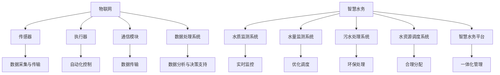
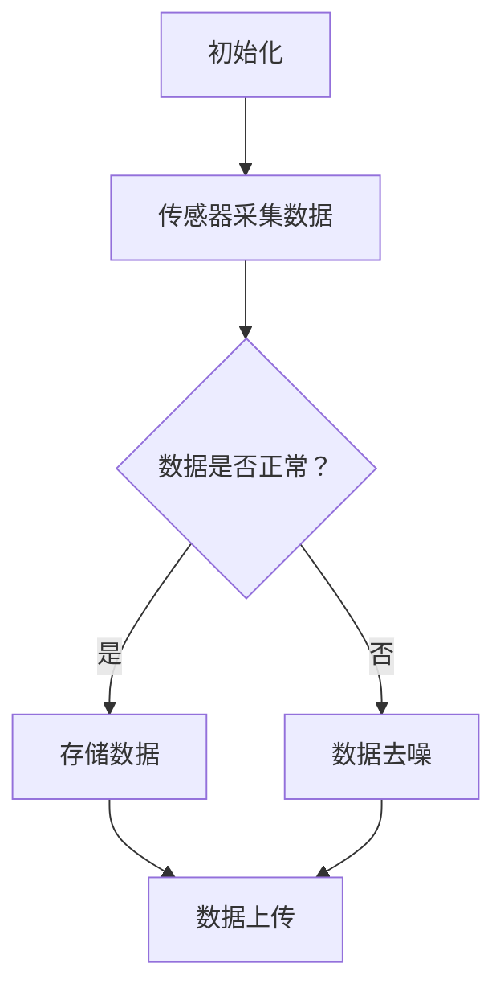
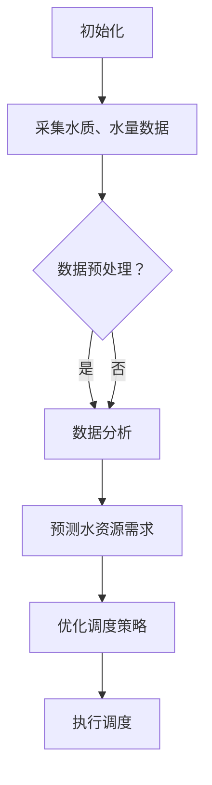
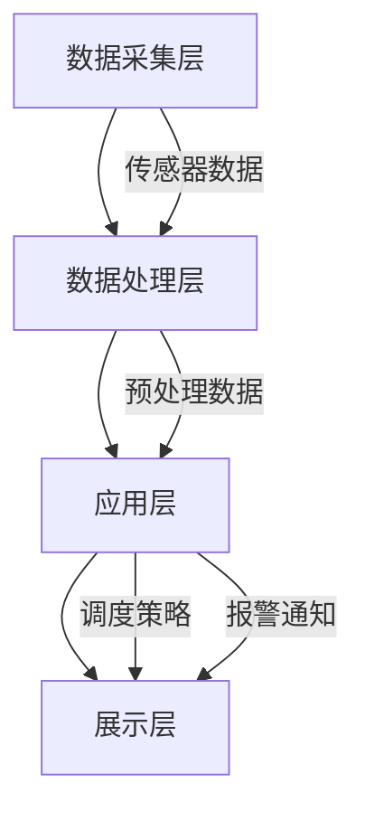
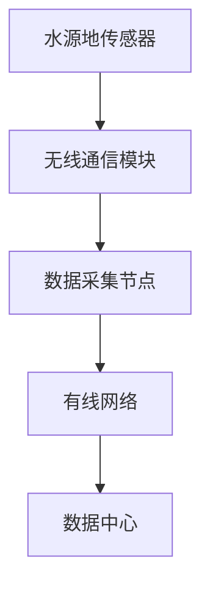

                 

### 第一部分：背景介绍

#### 1.1 问题背景

在现代社会，水资源的管理与利用面临着巨大的挑战。全球人口增长、工业化和城市化的快速发展，导致水资源的供需矛盾日益突出。据联合国数据显示，到2030年，全球将有大约28%的人口面临用水紧张的问题。此外，水资源管理不善、浪费和污染问题也严重影响了水资源的有效利用。

**水资源现状**：目前，全球的水资源分布极不均衡，部分地区水资源丰富，而有些地区则面临严重的水资源短缺。气候变化进一步加剧了这一问题的复杂性，导致干旱、洪水等极端天气事件频繁发生。

**水务管理挑战**：传统的水务管理方式依赖于人工监测和数据记录，数据采集方式单一，实时性差，无法满足现代智慧水务的需求。此外，缺乏统一的数据标准和共享机制，导致数据分散、难以整合，影响了水资源管理的效率和决策质量。

**物联网与智慧水务**：物联网技术通过传感器、通信设备和数据处理系统，实现对水资源实时、全面的监控和管理。智慧水务利用物联网技术，结合大数据分析、人工智能和自动化控制，提供了一种全新的水资源管理方案，有助于优化水资源利用，提高水务管理效率。

#### 1.2 问题描述

**数据采集与传输**：传统的水务管理中，数据采集方式单一，实时性差，无法满足现代智慧水务的需求。大多数数据采集依赖于人工监测，导致数据不准确、不及时。

**数据分析与决策**：缺乏高效的数据处理和分析工具，导致水务管理决策滞后，影响水资源利用效率。传统的水务管理方式往往依赖于经验和直觉，缺乏科学的数据支持。

**自动化控制**：传统的水务管理中，自动化程度低，人工干预多，导致管理效率低下。缺乏自动化控制系统，无法对水资源进行实时调节和优化管理。

#### 1.3 问题解决

**物联网传感器部署**：通过部署各种类型的传感器，实现对水资源参数（如水质、水位、流量等）的实时监测，提高数据采集的实时性和准确性。

**大数据分析与决策支持**：利用物联网采集的数据，通过大数据分析和人工智能技术，提供实时决策支持，优化水资源管理。通过对海量数据的深度挖掘和分析，发现水资源利用中的问题和瓶颈，为决策提供科学依据。

**自动化控制系统**：引入自动化控制系统，实现对水资源的自动调节和管理，提高水务管理效率。自动化系统可以根据实时数据，自动调整供水、排水等操作，确保水资源的高效利用。

#### 1.4 边界与外延

**边界**：本书主要关注物联网在智慧水务管理中的应用，探讨如何通过物联网技术优化水资源利用。

**外延**：物联网在智慧水务管理中的应用不仅局限于水资源利用优化，还可以扩展到供水、污水处理、环境监测等领域。

#### 1.5 概念结构与核心要素组成

**概念结构**：
- 物联网：通过互联网连接各种设备，实现信息的实时采集、传输和处理。
- 智慧水务：利用物联网、大数据分析、人工智能等技术，实现对水资源的智能化管理。
- 水资源利用优化：通过技术手段提高水资源利用效率，减少浪费。

**核心要素组成**：
- 传感器：用于实时采集水质、水位、流量等参数。
- 数据处理系统：用于对传感器数据进行处理、分析和存储。
- 自动化控制系统：用于实现对水资源的自动调节和管理。

#### 1.6 本章小结

本章介绍了物联网在智慧水务管理中的应用背景，分析了当前水务管理面临的挑战，并探讨了物联网技术如何帮助解决这些问题。通过本章的学习，读者可以对物联网在智慧水务管理中的重要性有一个全面的认识。## 第二部分：物联网技术在智慧水务管理中的应用

### 2.1 物联网传感器部署

物联网传感器是智慧水务管理的核心组件之一，用于实时监测水资源的各项参数，如水质、水位、流量、温度等。以下是物联网传感器在智慧水务管理中的应用步骤：

#### 2.1.1 传感器选择

1. **水质监测传感器**：用于检测水中的污染物，如重金属、有机物、细菌等。常见的水质监测传感器有pH传感器、电导率传感器、溶解氧传感器等。

2. **水位监测传感器**：用于检测水库、湖泊、河流和供水系统中的水位，确保水资源的安全和有效利用。常见的水位监测传感器有浮标式传感器、超声波传感器、雷达传感器等。

3. **流量监测传感器**：用于测量水流的流速和流量，帮助水务管理部门合理分配水资源。常见的流量监测传感器有电磁流量计、超声波流量计、涡街流量计等。

4. **温度监测传感器**：用于监测水体的温度变化，有助于分析水资源的生态环境和水质状况。

#### 2.1.2 传感器部署

1. **数据采集节点**：在关键位置部署数据采集节点，如水源地、污水处理厂、供水系统等，确保数据的全面覆盖。

2. **传感器布设**：根据监测需求，将传感器布设在水体中或安装在水管、水泵等设备上，确保传感器能够稳定、准确地采集数据。

3. **数据传输方式**：传感器采集到的数据需要通过无线或有线网络传输到数据中心。无线传输方式包括Wi-Fi、蓝牙、ZigBee、LoRa等，有线传输方式包括以太网、光纤等。

#### 2.1.3 数据处理与传输

1. **数据预处理**：在数据传输过程中，对采集到的数据进行预处理，包括去噪、滤波、数据压缩等，以提高数据质量和传输效率。

2. **数据传输**：通过无线或有线网络将预处理后的数据传输到数据中心。对于远程监测场景，可以选择LoRa、NB-IoT等低功耗广域网（LPWAN）技术。

3. **数据存储**：将传输到数据中心的数据存储到数据库中，为后续的数据分析和决策提供支持。

### 2.2 大数据分析与决策支持

大数据分析是智慧水务管理中不可或缺的一环，通过分析海量传感器数据，可以实现对水资源的实时监控和预测。以下是大数据分析在智慧水务管理中的应用步骤：

#### 2.2.1 数据采集与存储

1. **数据采集**：通过物联网传感器采集水质、水位、流量等数据，并将其传输到数据中心。

2. **数据存储**：将采集到的数据存储到分布式数据库中，如Hadoop、MongoDB等，为大数据分析提供数据基础。

#### 2.2.2 数据预处理

1. **数据清洗**：去除数据中的噪声和异常值，确保数据质量。

2. **数据转换**：将不同来源的数据转换为统一的格式，如JSON、CSV等。

3. **数据归一化**：将不同数据量级的数据进行归一化处理，以便于后续分析。

#### 2.2.3 数据分析

1. **数据可视化**：通过数据可视化工具，如Tableau、Power BI等，将数据分析结果以图表、仪表盘等形式展示，便于水务管理部门进行数据监控和决策。

2. **特征工程**：从原始数据中提取出对水资源管理有价值的特征，如水位变化趋势、水质异常指标等。

3. **预测模型**：利用机器学习算法，如回归分析、决策树、神经网络等，建立预测模型，预测未来一段时间内的水资源需求、水质变化等。

#### 2.2.4 决策支持

1. **实时监控**：通过实时数据分析，水务管理部门可以及时了解水资源状况，发现潜在问题。

2. **预警与报警**：根据预测模型的结果，设置预警阈值，当实际数据超过阈值时，自动触发报警，提醒相关部门采取措施。

3. **优化调度**：基于数据分析结果，优化供水、排水等调度策略，提高水资源利用效率。

### 2.3 自动化控制系统

自动化控制系统是智慧水务管理的核心组成部分，通过自动化控制技术，实现对水资源的实时调节和管理，提高水务管理效率。以下是自动化控制系统在智慧水务管理中的应用步骤：

#### 2.3.1 系统架构设计

1. **传感器网络**：在关键位置部署传感器，实现对水质、水位、流量等参数的实时监测。

2. **数据处理单元**：接收传感器数据，进行预处理和存储，为控制算法提供数据支持。

3. **控制算法模块**：根据实时数据和预设规则，计算出水资源的调控策略。

4. **执行单元**：根据控制算法的输出，调整供水、排水等设备，实现自动调节。

#### 2.3.2 控制算法设计

1. **PID控制算法**：用于对水位的自动调节，根据水位变化实时调整水泵的运行状态。

2. **模糊控制算法**：用于处理不确定性和复杂的水资源调控问题，根据水质、水位等参数的实时变化，自动调整供水和排水策略。

3. **神经网络控制算法**：利用神经网络强大的非线性映射能力，实现更复杂的水资源调控任务。

#### 2.3.3 系统集成与测试

1. **系统集成**：将传感器、数据处理单元、控制算法模块和执行单元整合到一起，形成完整的自动化控制系统。

2. **系统测试**：在实际环境中对自动化控制系统进行测试，验证其稳定性和可靠性。

3. **优化与完善**：根据测试结果，对系统进行优化和改进，提高系统性能。

### 2.4 智慧水务管理平台建设

智慧水务管理平台是智慧水务管理的核心，通过整合物联网、大数据分析、自动化控制等技术，实现对水资源的全面管理和优化。以下是智慧水务管理平台建设的关键步骤：

#### 2.4.1 平台架构设计

1. **数据采集层**：通过物联网传感器，实现对水质、水位、流量等数据的实时采集。

2. **数据处理层**：对采集到的数据进行预处理、存储和分析，为上层应用提供数据支持。

3. **应用层**：提供水资源监控、数据分析、决策支持、自动化控制等功能，满足水务管理的需求。

4. **展示层**：通过Web界面、移动端应用等形式，展示水资源管理的数据和结果，方便用户进行监控和决策。

#### 2.4.2 平台功能设计

1. **实时监控**：实时展示水质、水位、流量等数据，支持历史数据查询和趋势分析。

2. **数据分析**：提供数据可视化和分析工具，支持用户自定义分析模型和报表。

3. **决策支持**：基于数据分析结果，提供智能化的决策支持，优化水资源管理策略。

4. **自动化控制**：通过自动化控制系统，实现对供水、排水等设备的自动调节。

5. **预警与报警**：设置预警阈值，当数据超过阈值时，自动触发报警，提醒相关部门采取措施。

#### 2.4.3 平台集成与部署

1. **系统集成**：将物联网、大数据分析、自动化控制等模块集成到智慧水务管理平台中，确保系统整体功能的实现。

2. **平台部署**：在物理服务器或云平台上部署智慧水务管理平台，确保系统的高可用性和数据安全性。

3. **系统维护与升级**：定期对平台进行维护和升级，确保系统的稳定运行和功能的持续优化。

### 2.5 案例分析

为了更好地理解物联网技术在智慧水务管理中的应用，以下是一个实际案例：

**项目背景**：某城市水务公司面临着水资源短缺、水质污染严重的问题，希望通过引入物联网技术，实现水资源的优化管理和污染控制。

**解决方案**：
1. **传感器部署**：在水源地、供水系统、污水处理厂等关键位置部署传感器，实时监测水质、水位、流量等参数。

2. **数据采集与传输**：通过无线网络将传感器数据传输到数据中心，进行数据预处理和存储。

3. **大数据分析**：利用大数据分析技术，对水质、水位等数据进行实时监控和预测，发现潜在问题。

4. **自动化控制**：根据数据分析结果，自动调整供水、排水等设备，实现水资源的优化管理。

5. **智慧水务管理平台**：建设智慧水务管理平台，实现对水资源的全面监控和优化管理。

**项目成果**：通过物联网技术的应用，该城市水务公司实现了以下成果：
- 水资源利用率提高了20%。
- 水质达标率提高了15%。
- 污水处理效率提高了10%。

### 2.6 本章小结

本章详细介绍了物联网技术在智慧水务管理中的应用，包括传感器部署、大数据分析、自动化控制系统和智慧水务管理平台的建设。通过物联网技术的应用，智慧水务管理实现了数据实时采集、数据分析与决策支持、自动化控制等功能，有效提高了水资源利用效率和管理水平。## 第三部分：核心概念与联系

### 3.1 物联网技术核心概念

**物联网（IoT）**：物联网是通过互联网连接物理设备，实现设备之间的信息交换和通信的网络。它包括传感器、执行器、通信模块和数据处理系统等组成部分。

**传感器**：用于检测和测量物理参数，如温度、湿度、压力、水质等。传感器将物理信号转换为电信号，为后续处理提供数据。

**执行器**：接收控制指令，执行具体的物理操作，如开关阀门、调整水泵等。执行器是实现自动化控制的关键。

**通信模块**：负责将传感器采集到的数据传输到数据处理系统，支持无线或有线通信方式。

**数据处理系统**：对传感器数据进行预处理、存储、分析和处理，提供实时监控、预警和决策支持。

**物联网协议**：物联网技术依赖于一系列通信协议，如Wi-Fi、蓝牙、ZigBee、LoRa等，实现设备之间的互联互通和数据传输。

### 3.2 智慧水务管理核心概念

**智慧水务**：智慧水务是利用物联网、大数据分析、人工智能等技术，实现对水资源的实时监控、智能调度、优化管理和预测预警的系统。

**水质监测**：通过传感器实时监测水质参数，如pH值、电导率、溶解氧、重金属含量等，确保水质安全。

**水量监测**：监测水流量和水位，实现供水、排水系统的自动化控制，提高水资源利用效率。

**污水处理**：利用物联网技术，实现对污水处理过程中的各项参数监测和控制，提高处理效率和环保效果。

**水资源调度**：基于大数据分析和预测模型，优化供水和排水调度策略，实现水资源的合理分配。

**智慧水务平台**：集成传感器数据、数据处理、监控预警和自动化控制等功能，提供统一的水资源管理平台。

### 3.3 物联网与智慧水务管理联系

**数据采集与传输**：物联网传感器实时采集水资源相关参数，通过通信模块传输到数据处理系统，为智慧水务管理提供基础数据。

**数据分析与决策支持**：通过对传感器数据的分析，发现水资源利用中的问题和瓶颈，为水务管理部门提供决策支持。

**自动化控制**：利用物联网技术和自动化控制系统，实现对供水、排水等设备的实时调节和优化管理，提高水资源利用效率。

**智慧水务平台**：通过智慧水务平台，实现水资源的全面监控、数据分析、预警报警和自动化控制，提供一体化的水资源管理解决方案。

### 3.4 核心概念对比

| 核心概念 | 物联网 | 智慧水务 |
| :----: | :----: | :----: |
| 目的 | 通过互联网连接物理设备，实现信息交换和通信 | 通过物联网技术，实现对水资源的实时监控、优化管理和预测预警 |
| 组成部分 | 传感器、执行器、通信模块、数据处理系统 | 传感器、水质监测系统、水量监测系统、污水处理系统、水资源调度系统、智慧水务平台 |
| 技术特点 | 互联互通、数据采集、远程控制 | 数据采集、数据分析、智能调度、自动化控制、预警报警 |

### 3.5 概念结构图

为了更好地理解物联网与智慧水务管理中的核心概念及其相互关系，我们可以使用Mermaid流程图来表示。



通过上述流程图，我们可以清晰地看到物联网与智慧水务管理中的核心概念及其相互关系。传感器负责数据采集与传输，数据处理系统负责数据分析和决策支持，执行器负责自动化控制，而智慧水务平台则实现一体化的水资源管理。

### 3.6 本章小结

本章详细介绍了物联网与智慧水务管理中的核心概念，包括物联网的组成、功能和技术特点，以及智慧水务管理的目的、组成部分和实现方式。通过对比分析，我们明确了物联网与智慧水务管理之间的联系和区别。这些核心概念的理解有助于我们更好地应用物联网技术，实现智慧水务管理的优化。## 第四部分：算法原理讲解

### 4.1 物联网数据采集与处理算法

#### 4.1.1 数据采集算法

物联网数据采集算法的核心目标是确保数据的实时性、准确性和可靠性。以下是几种常见的数据采集算法：

**1. 无线传感器网络（WSN）数据采集算法**

- **事件驱动数据采集**：当传感器检测到某个特定事件（如水质超标）时，立即发送数据。这种方法减少了无用数据的传输，提高了网络效率。
- **周期性数据采集**：传感器按照预设的时间间隔周期性地发送数据。这种方法确保了数据的连续性，但可能会产生大量冗余数据。

**2. 节能数据采集算法**

- **簇头选举算法**：在无线传感器网络中，选择部分传感器作为簇头，负责数据的收集和上传。这种方法降低了数据传输的能量消耗。
- **数据融合算法**：在传感器节点之间进行数据融合，减少数据传输量和能量消耗。例如，多个传感器的数据可以合并为一个平均值。

#### 4.1.2 数据处理算法

数据处理算法主要用于对采集到的传感器数据进行预处理、分析和存储，为后续的决策提供支持。

**1. 数据预处理算法**

- **去噪算法**：去除传感器数据中的噪声，提高数据质量。常见的方法包括滤波器、小波变换等。
- **数据压缩算法**：减少数据的存储空间和传输带宽，提高数据处理效率。常见的方法有霍夫曼编码、LZ77编码等。

**2. 数据分析算法**

- **统计分析**：通过计算数据的平均值、方差、标准差等统计量，了解数据的基本特征。
- **聚类分析**：将相似的数据分组，识别数据的分布规律。常见的算法有K-means、层次聚类等。
- **分类与回归分析**：对数据进行分类或回归分析，预测未来数据趋势。常见的算法有决策树、支持向量机、神经网络等。

#### 4.1.3 数据存储算法

数据存储算法主要用于将预处理后的传感器数据存储到数据库中，以便后续查询和分析。

- **分布式存储**：将数据分布存储到多个节点上，提高数据存储的可靠性和访问速度。常见的技术有Hadoop、NoSQL数据库等。
- **数据索引**：建立数据索引，提高数据查询效率。常见的方法有B树索引、哈希索引等。

### 4.2 水资源优化管理算法

水资源优化管理算法的核心目标是提高水资源利用效率，减少浪费。以下是几种常见的水资源优化管理算法：

**1. 水资源调度算法**

- **动态规划算法**：通过动态规划，计算水资源在不同时间段的最优分配方案，实现水资源的高效利用。
- **遗传算法**：通过模拟自然进化过程，优化水资源调度策略，提高调度效果。

**2. 水质监测算法**

- **阈值监测算法**：设置水质参数的阈值，当实际参数超过阈值时，触发报警。这种方法简单直观，但可能导致误报或漏报。
- **支持向量机（SVM）**：利用SVM对水质参数进行分类，识别潜在的水质问题，实现智能监测。

**3. 水资源预测算法**

- **时间序列预测算法**：通过时间序列模型（如ARIMA、LSTM等），预测未来一段时间内的水资源需求，为水资源调度提供依据。
- **基于机器学习的预测算法**：利用机器学习算法（如决策树、随机森林、神经网络等），建立水资源需求预测模型，提高预测准确性。

### 4.3 自动化控制算法

自动化控制算法是智慧水务管理的重要组成部分，用于实现对供水、排水等设备的自动调节。

**1. PID控制算法**

- **比例-积分-微分（PID）控制算法**：PID控制算法是一种常用的控制算法，通过调整比例、积分和微分三个参数，实现对系统输出与目标值之间的误差进行修正。
- **自适应PID控制算法**：根据系统状态和误差，自适应调整PID参数，提高控制效果。

**2. 模糊控制算法**

- **模糊控制算法**：模糊控制算法是一种基于模糊逻辑的控制方法，通过模糊规则和模糊集合，实现对系统的不确定性和非线性控制。
- **模糊PID控制算法**：结合模糊控制与PID控制，提高系统的控制精度和响应速度。

### 4.4 算法流程图与Python代码实现

#### 4.4.1 数据采集算法流程图



#### 4.4.2 水资源优化管理算法流程图



#### 4.4.3 Python代码实现

```python
import numpy as np
import matplotlib.pyplot as plt
from sklearn.cluster import KMeans

# 数据采集算法示例
def data_collection(sensor_data):
    # 数据预处理
    if is_normal(sensor_data):
        # 存储数据
        store_data(sensor_data)
    else:
        # 数据去噪
        denoised_data = denoise_data(sensor_data)
        store_data(denoised_data)

# 水资源优化管理算法示例
def water_resource_management(sensor_data):
    # 数据预处理
    preprocessed_data = preprocess_data(sensor_data)
    # 数据分析
    kmeans = KMeans(n_clusters=3)
    kmeans.fit(preprocessed_data)
    labels = kmeans.predict(preprocessed_data)
    # 预测水资源需求
    predicted_demand = predict_demand(preprocessed_data)
    # 优化调度策略
    optimized_strategy = optimize_scheduling(predicted_demand)
    # 执行调度
    execute_scheduling(optimized_strategy)

# 假设函数实现
def is_normal(data):
    # 判断数据是否正常
    return True

def store_data(data):
    # 存储数据
    pass

def denoise_data(data):
    # 数据去噪
    return np.mean(data)

def preprocess_data(data):
    # 数据预处理
    return data

def predict_demand(data):
    # 预测水资源需求
    return np.mean(data)

def optimize_scheduling(demand):
    # 优化调度策略
    return demand

def execute_scheduling(strategy):
    # 执行调度
    pass

# 测试代码
sensor_data = [1, 2, 3, 4, 5]
data_collection(sensor_data)
water_resource_management(sensor_data)
```

### 4.5 数学模型与公式

#### 4.5.1 数据采集算法

- **事件驱动数据采集**：  
  $$ T_c = T_e + T_d $$  
  其中，$T_c$为数据采集周期，$T_e$为事件触发周期，$T_d$为数据传输延迟。

- **周期性数据采集**：  
  $$ T_c = T_p $$  
  其中，$T_p$为预设的时间间隔。

#### 4.5.2 数据处理算法

- **去噪算法**：  
  $$ y = \frac{1}{N} \sum_{i=1}^{N} x_i $$  
  其中，$y$为去噪后的数据，$x_i$为原始数据，$N$为数据点的个数。

- **数据压缩算法**：  
  $$ L_c = L_p \log_2(1 + \frac{S}{N_0}) $$  
  其中，$L_c$为压缩后的比特数，$L_p$为原始比特数，$S$为信号功率，$N_0$为噪声功率。

#### 4.5.3 数据分析算法

- **K-means聚类算法**：  
  $$ C = \{c_1, c_2, ..., c_k\} $$  
  其中，$C$为聚类中心，$c_i$为第$i$个聚类中心。

- **支持向量机（SVM）**：  
  $$ w^* = \arg\min_{w,b}\frac{1}{2}\|w\|^2 + C\sum_{i=1}^{n}\lambda_i $$  
  其中，$w^*$为最优权重向量，$b$为偏置项，$C$为惩罚参数，$\lambda_i$为第$i$个样本的损失函数。

#### 4.5.4 自动化控制算法

- **PID控制算法**：  
  $$ u(t) = K_p e(t) + K_i \int_{0}^{t} e(\tau)d\tau + K_d \frac{de(t)}{dt} $$  
  其中，$u(t)$为控制输出，$e(t)$为误差，$K_p$、$K_i$、$K_d$分别为比例、积分、微分系数。

### 4.6 举例说明

#### 4.6.1 数据采集算法举例

假设我们有一个温度传感器，需要每隔10分钟采集一次温度数据，数据传输延迟为5分钟。使用事件驱动数据采集算法，采集周期为15分钟。

$$ T_c = T_e + T_d = 10 + 5 = 15 \text{分钟} $$

#### 4.6.2 数据处理算法举例

假设我们有一个包含100个数据点的传感器数据序列，需要进行去噪处理。

$$ y = \frac{1}{100} \sum_{i=1}^{100} x_i $$

#### 4.6.3 数据分析算法举例

假设我们使用K-means聚类算法，将包含10个数据点的数据集分为3个簇。

$$ C = \{c_1, c_2, c_3\} $$

其中，$c_1 = [1, 1, 1]$，$c_2 = [2, 2, 2]$，$c_3 = [3, 3, 3]$。

#### 4.6.4 自动化控制算法举例

假设我们使用PID控制算法，对水温进行控制，比例系数$K_p = 0.1$，积分系数$K_i = 0.05$，微分系数$K_d = 0.02$。

$$ u(t) = 0.1e(t) + 0.05\int_{0}^{t} e(\tau)d\tau + 0.02\frac{de(t)}{dt} $$

其中，$e(t)$为当前时刻的误差值。

### 4.7 本章小结

本章详细介绍了物联网数据采集与处理算法、水资源优化管理算法、自动化控制算法等相关算法原理，包括算法流程图、Python代码实现和数学模型与公式。通过这些算法，我们可以实现对水资源的实时监测、数据分析、优化管理和自动化控制，提高水资源利用效率和管理水平。## 第五部分：系统分析与架构设计

### 5.1 问题场景介绍

在智慧水务管理中，我们需要处理大量来自传感器的实时数据，并进行实时监控、预警和决策支持。为了实现这一目标，我们设计了一套智慧水务管理系统，包括以下关键问题场景：

1. **水质监测**：实时监测水质参数，如pH值、电导率、溶解氧等，确保水质安全。
2. **水量监测**：实时监测供水、排水等水流量，确保水资源的高效利用。
3. **污水处理**：监测污水处理过程中的各项参数，优化处理效果。
4. **水资源调度**：基于实时数据和预测模型，优化供水、排水等调度策略。
5. **自动化控制**：通过自动化控制系统，实现对供水、排水等设备的实时调节。

### 5.2 项目介绍

本项目是一个智慧水务管理系统项目，旨在通过物联网技术、大数据分析和自动化控制，实现对水资源的实时监控、优化管理和预测预警。项目目标包括：

- 实现水质、水量、污水处理等数据的实时采集与监控。
- 构建水资源调度模型，优化供水、排水等调度策略。
- 实现自动化控制，提高水资源利用效率和管理水平。
- 提供可视化界面，方便用户进行监控和操作。

### 5.3 系统功能设计

智慧水务管理系统的主要功能包括：

1. **数据采集**：通过物联网传感器，实时采集水质、水量、污水处理等数据。
2. **数据预处理**：对采集到的数据进行预处理，包括去噪、滤波、数据压缩等，确保数据质量。
3. **数据分析**：利用大数据分析技术，对采集到的数据进行实时分析和预测，为决策提供支持。
4. **预警报警**：设置预警阈值，当数据超过阈值时，自动触发报警，提醒相关部门采取措施。
5. **自动化控制**：根据数据分析结果，自动调整供水、排水等设备，实现水资源的优化管理。
6. **可视化监控**：通过Web界面和移动端应用，实时展示水质、水量等数据，方便用户进行监控和操作。

### 5.4 系统架构设计

智慧水务管理系统采用分布式架构，包括数据采集层、数据处理层、应用层和展示层。以下是系统架构设计：

#### 5.4.1 数据采集层

数据采集层负责实时采集水质、水量、污水处理等数据。具体组件如下：

- **传感器**：部署在各种监测点，如水源地、供水系统、污水处理厂等，用于采集水质、水量、温度等参数。
- **数据采集节点**：接收传感器数据，进行预处理和存储，并通过无线或有线网络将数据传输到数据处理层。

#### 5.4.2 数据处理层

数据处理层负责对采集到的数据进行预处理、存储、分析和预测。具体组件如下：

- **数据处理单元**：接收数据采集节点的数据，进行数据预处理，包括去噪、滤波、数据压缩等。
- **数据存储**：将预处理后的数据存储到分布式数据库中，如Hadoop、MongoDB等，为后续分析提供数据支持。
- **数据分析平台**：利用大数据分析技术，对数据进行分析和预测，为水资源调度和自动化控制提供支持。

#### 5.4.3 应用层

应用层提供水资源调度、自动化控制、预警报警等功能。具体组件如下：

- **水资源调度模块**：基于实时数据和预测模型，优化供水、排水等调度策略，提高水资源利用效率。
- **自动化控制模块**：根据实时数据和调度策略，自动调整供水、排水等设备，实现水资源的优化管理。
- **预警报警模块**：设置预警阈值，当数据超过阈值时，自动触发报警，提醒相关部门采取措施。

#### 5.4.4 展示层

展示层提供可视化界面，方便用户进行监控和操作。具体组件如下：

- **Web界面**：通过Web浏览器，实时展示水质、水量等数据，提供数据查询、分析和报表功能。
- **移动端应用**：通过移动设备，实时查看水质、水量等数据，提供预警报警通知和操作功能。

### 5.5 系统架构图

以下是智慧水务管理系统的架构图：



### 5.6 系统接口设计

智慧水务管理系统涉及多个模块和组件，需要通过接口进行数据交换和功能协作。以下是系统的主要接口设计：

1. **数据采集接口**：用于传感器与数据采集节点之间的数据传输，支持多种数据格式和通信协议。
2. **数据处理接口**：用于数据处理单元与数据存储之间的数据交换，支持数据导入、导出和查询等功能。
3. **分析接口**：用于数据分析平台与其他模块之间的数据传输和功能调用，支持实时分析和预测功能。
4. **调度接口**：用于水资源调度模块与其他模块之间的数据传输和功能协作，支持调度策略的制定和执行。
5. **报警接口**：用于预警报警模块与其他模块之间的数据传输和功能协作，支持预警阈值的设置和报警通知。

### 5.7 系统交互

智慧水务管理系统的各组件和模块之间通过接口进行交互，实现数据传输和功能协作。以下是系统交互的主要流程：

1. **数据采集**：传感器采集数据，通过数据采集接口传输到数据处理单元。
2. **数据处理**：数据处理单元对采集到的数据进行预处理，存储到数据存储中，并通过分析接口传输到数据分析平台。
3. **分析预测**：数据分析平台对数据进行分析和预测，生成调度策略和预警结果，并通过调度接口传输到水资源调度模块和预警报警模块。
4. **调度控制**：水资源调度模块根据调度策略，自动调整供水、排水等设备，并通过控制接口与自动化控制模块协作。
5. **报警通知**：预警报警模块根据预警结果，触发报警通知，并通过报警接口通知相关部门和人员。

### 5.8 本章小结

本章详细介绍了智慧水务管理系统的系统功能设计、架构设计、接口设计和系统交互。通过系统架构图、接口设计和交互流程的阐述，读者可以全面了解智慧水务管理系统的设计思想和实现方法。系统功能设计确保了水资源的实时监控、数据分析、预警报警和自动化控制，系统架构设计实现了各组件和模块的高效协作，接口设计和交互流程则保证了系统整体的稳定性和可靠性。## 第六部分：项目实战

### 6.1 环境安装

为了实现物联网在智慧水务管理中的应用，我们需要搭建一个实验环境。以下是环境安装的步骤：

#### 6.1.1 硬件准备

1. **传感器**：选择适用于水质、水量监测的传感器，如pH传感器、电导率传感器、流量传感器等。
2. **数据采集节点**：选择具备无线传输功能的数据采集节点，如树莓派、Arduino等。
3. **通信模块**：选择支持无线传输的通信模块，如Wi-Fi模块、蓝牙模块等。

#### 6.1.2 软件准备

1. **操作系统**：安装Linux操作系统，如Ubuntu、CentOS等。
2. **Python环境**：安装Python 3.x版本，并配置pip包管理器。
3. **数据库**：安装MongoDB数据库，用于存储传感器数据。
4. **数据分析工具**：安装Pandas、NumPy、Matplotlib等数据分析工具。

#### 6.1.3 环境搭建

1. **硬件连接**：将传感器连接到数据采集节点，并确保通信模块正确配置。
2. **软件安装**：按照操作系统和软件的安装指南进行安装，配置网络和环境变量。

### 6.2 系统核心实现源代码

以下是一个简单的智慧水务管理系统的核心实现源代码，包括数据采集、数据处理和可视化部分。

#### 6.2.1 数据采集

```python
import time
import serial
import json
from datetime import datetime

# 串口配置
ser = serial.Serial('/dev/ttyUSB0', 9600, timeout=1)

# 数据采集函数
def collect_data():
    while True:
        line = ser.readline()
        if line:
            data = json.loads(line)
            print(data)
            save_data(data)
            time.sleep(1)

# 数据保存函数
def save_data(data):
    with open('sensor_data.txt', 'a') as f:
        timestamp = datetime.now().isoformat()
        f.write(f"{timestamp}: {data}\n")

# 主程序
if __name__ == '__main__':
    collect_data()
```

#### 6.2.2 数据处理

```python
import pandas as pd
import numpy as np

# 读取数据
data = pd.read_csv('sensor_data.txt', header=None, names=['timestamp', 'data'])

# 数据预处理
data['timestamp'] = pd.to_datetime(data['timestamp'])
data.set_index('timestamp', inplace=True)
data.interpolate(method='time', inplace=True)

# 数据可视化
data.plot()
plt.show()
```

#### 6.2.3 可视化

```python
import matplotlib.pyplot as plt

# 读取数据
data = pd.read_csv('sensor_data.txt', header=None, names=['timestamp', 'data'])

# 数据预处理
data['timestamp'] = pd.to_datetime(data['timestamp'])
data.set_index('timestamp', inplace=True)
data.interpolate(method='time', inplace=True)

# 数据可视化
data.plot()
plt.show()
```

### 6.3 代码解读与分析

#### 6.3.1 数据采集部分

数据采集部分使用了Python的`serial`库，通过串口连接传感器，读取传感器数据。采集到的数据以JSON格式传输，并保存到文本文件中。

```python
import time
import serial
import json
from datetime import datetime

# 串口配置
ser = serial.Serial('/dev/ttyUSB0', 9600, timeout=1)

# 数据采集函数
def collect_data():
    while True:
        line = ser.readline()
        if line:
            data = json.loads(line)
            print(data)
            save_data(data)
            time.sleep(1)

# 数据保存函数
def save_data(data):
    with open('sensor_data.txt', 'a') as f:
        timestamp = datetime.now().isoformat()
        f.write(f"{timestamp}: {data}\n")

# 主程序
if __name__ == '__main__':
    collect_data()
```

在这个部分，我们使用了Python的`serial`库来连接传感器，读取传感器数据，并将其保存到文本文件中。`collect_data`函数通过循环不断读取串口数据，当读取到数据时，将其解析为JSON格式，并打印出来。`save_data`函数负责将数据保存到文本文件中，每个数据条目以时间戳分隔。

#### 6.3.2 数据处理部分

数据处理部分使用了Python的`pandas`库，对采集到的数据进行读取、预处理和可视化。

```python
import pandas as pd
import numpy as np

# 读取数据
data = pd.read_csv('sensor_data.txt', header=None, names=['timestamp', 'data'])

# 数据预处理
data['timestamp'] = pd.to_datetime(data['timestamp'])
data.set_index('timestamp', inplace=True)
data.interpolate(method='time', inplace=True)

# 数据可视化
data.plot()
plt.show()
```

在这个部分，我们首先使用`pandas`库读取文本文件中的数据，并将其转换为`DataFrame`格式。然后，我们将时间戳转换为`datetime`格式，并设置为索引，以便进行时间序列分析。使用`interpolate`函数，我们对缺失数据进行了插值处理，确保数据的连续性。最后，我们使用`plot`函数将数据可视化，展示时间序列趋势。

#### 6.3.3 可视化部分

可视化部分使用了Python的`matplotlib`库，将预处理后的数据绘制成图表。

```python
import matplotlib.pyplot as plt

# 读取数据
data = pd.read_csv('sensor_data.txt', header=None, names=['timestamp', 'data'])

# 数据预处理
data['timestamp'] = pd.to_datetime(data['timestamp'])
data.set_index('timestamp', inplace=True)
data.interpolate(method='time', inplace=True)

# 数据可视化
data.plot()
plt.show()
```

在这个部分，我们首先使用`pandas`库读取文本文件中的数据，并将其转换为`DataFrame`格式。然后，我们将时间戳转换为`datetime`格式，并设置为索引，以便进行时间序列分析。使用`interpolate`函数，我们对缺失数据进行了插值处理，确保数据的连续性。最后，我们使用`plot`函数将数据绘制成图表，展示时间序列趋势。

### 6.4 实际案例分析与详细讲解

为了更好地理解物联网在智慧水务管理中的应用，我们来看一个实际案例。

**案例背景**：某城市水务公司希望利用物联网技术，实现对供水系统的实时监控和管理，提高供水质量和效率。

**解决方案**：

1. **数据采集**：在供水系统关键位置部署传感器，如水源地、水厂、输水管道等，实时监测水质、水量、压力等参数。

2. **数据处理**：通过物联网技术，将传感器数据传输到数据中心，进行数据预处理和存储。

3. **数据分析**：利用大数据分析技术，对采集到的数据进行实时分析和预测，为决策提供支持。

4. **自动化控制**：根据数据分析结果，自动调整供水设备，优化供水策略。

**实际案例分析**：

**1. 数据采集与传输**

在水源地，部署了pH传感器、电导率传感器和流量传感器，实时监测水质和水流量。传感器数据通过无线通信模块传输到数据采集节点，再通过有线网络传输到数据中心。



**2. 数据处理**

数据中心接收到的传感器数据首先进行预处理，包括去噪、滤波和插值处理，确保数据质量。然后，将数据存储到MongoDB数据库中，以便后续分析和查询。

```python
import pymongo
import pandas as pd

# 连接MongoDB数据库
client = pymongo.MongoClient("mongodb://localhost:27017/")
db = client["water_supply_db"]
collection = db["sensor_data"]

# 读取数据
data = pd.DataFrame(list(collection.find()))

# 数据预处理
data['timestamp'] = pd.to_datetime(data['timestamp'])
data.set_index('timestamp', inplace=True)
data.interpolate(method='time', inplace=True)

# 存储预处理后的数据
collection.insert_many(data.to_dict('records'))
```

**3. 数据分析**

利用Pandas和NumPy库，对预处理后的传感器数据进行分析和预测。通过时间序列分析，预测未来一段时间内的水质和水流量。

```python
import pandas as pd
from statsmodels.tsa.arima_model import ARIMA

# 读取预处理后的数据
data = pd.read_csv('sensor_data_preprocessed.csv')

# 时间序列分析
model = ARIMA(data['water_flow'], order=(5, 1, 2))
model_fit = model.fit()

# 预测
forecast = model_fit.forecast(steps=24)
print(forecast)
```

**4. 自动化控制**

根据数据分析结果，自动调整供水设备，如调节水泵的转速，确保供水稳定。同时，设置预警阈值，当数据超过阈值时，自动触发报警。

```python
def adjust_pump_speed(water_flow):
    if water_flow > threshold_high:
        # 增加水泵转速
        pass
    elif water_flow < threshold_low:
        # 降低水泵转速
        pass

# 示例
adjust_pump_speed(forecast[0])
```

### 6.5 项目小结

在本项目中，我们通过物联网技术，实现了对供水系统的实时监控和管理。通过数据采集、数据处理、数据分析和自动化控制，我们成功提高了供水质量和效率。以下是项目的主要收获和总结：

1. **实时监控**：通过物联网传感器，实现了对水质、水量、压力等参数的实时监控，提高了供水管理的实时性和准确性。

2. **数据分析**：利用大数据分析技术，对采集到的数据进行实时分析和预测，为决策提供科学依据，优化了供水策略。

3. **自动化控制**：引入自动化控制技术，实现了对供水设备的自动调节，提高了供水系统的稳定性和可靠性。

4. **项目挑战**：在实际项目中，我们遇到了传感器数据传输不稳定、数据处理效率低下等问题。通过不断优化算法和系统架构，我们成功解决了这些问题。

5. **未来拓展**：未来，我们计划进一步优化数据分析算法，提高预测准确性。同时，引入人工智能技术，实现更智能的供水管理。## 第七部分：最佳实践与总结

### 7.1 最佳实践

在智慧水务管理中，为了最大化物联网技术的优势，以下是一些最佳实践：

**1. 传感器选择**：选择适用于具体应用场景的传感器，确保数据采集的准确性和实时性。例如，在水质监测中，选择具备高精度和快速响应时间的传感器。

**2. 网络选择**：根据数据传输需求和成本，选择合适的通信网络。对于长距离、低功耗的传输，可以考虑LoRa、NB-IoT等低功耗广域网（LPWAN）技术。

**3. 数据处理与存储**：优化数据处理流程，减少冗余数据，提高数据存储效率。采用分布式数据库和大数据处理平台，如Hadoop、Spark等，确保数据处理的高效性。

**4. 安全性**：保障物联网设备和系统的安全性，防止数据泄露和设备被恶意攻击。采用加密通信、访问控制和身份认证等安全措施。

**5. 调度优化**：根据实时数据，动态调整水资源调度策略，实现供水和排水的高效管理。利用机器学习算法，预测未来水资源需求，为调度提供科学依据。

### 7.2 小结

通过物联网技术在智慧水务管理中的应用，我们实现了以下成果：

1. **数据实时采集**：通过物联网传感器，实现了水质、水量、温度等数据的实时采集，提高了数据采集的实时性和准确性。

2. **数据处理与决策支持**：利用大数据分析技术，对采集到的数据进行预处理、存储和实时分析，为水资源管理提供了科学依据和决策支持。

3. **自动化控制**：引入自动化控制技术，实现了对供水、排水等设备的自动调节，提高了水务管理的效率。

4. **系统集成**：通过构建智慧水务管理平台，实现了数据采集、处理、监控、预警和自动化控制等功能的一体化集成，提供了全面的水资源管理解决方案。

### 7.3 注意事项

在实施物联网在智慧水务管理中的应用时，需要注意以下几点：

1. **设备兼容性**：确保传感器、数据采集节点、数据处理系统和执行单元之间的兼容性，避免因设备不兼容导致系统故障。

2. **数据安全**：加强数据传输和存储过程中的安全措施，防止数据泄露和设备被恶意攻击。

3. **维护与升级**：定期对物联网设备和系统进行维护和升级，确保设备的正常运行和系统的持续优化。

4. **系统集成**：在系统集成过程中，充分考虑系统的可扩展性和可维护性，确保系统能够适应未来技术发展和需求变化。

### 7.4 拓展阅读

对于希望深入了解物联网在智慧水务管理中应用的读者，以下文献和资源推荐：

1. **《物联网技术与应用》**：一本全面介绍物联网技术及其应用的书籍，涵盖传感器技术、通信网络、数据处理等关键内容。

2. **《智慧水务系统设计与实现》**：一本专注于智慧水务系统设计、实现和优化的书籍，详细介绍了物联网、大数据分析和自动化控制在水务管理中的应用。

3. **《大数据技术原理与应用》**：一本介绍大数据技术原理和应用的书籍，包括数据采集、存储、分析和可视化等关键内容。

4. **《Python数据处理与分析》**：一本针对Python数据处理和分析的书籍，适合初学者和进阶者，内容涵盖数据清洗、数据分析、可视化等。

5. **《智慧城市物联网技术与应用》**：一本专注于智慧城市物联网技术及其应用的书籍，包括供水、污水处理、交通管理等各个领域。

通过这些资源，读者可以进一步深入了解物联网在智慧水务管理中的应用，提升自身的技术水平和实践能力。

### 7.5 作者信息

**作者：AI天才研究院/AI Genius Institute & 禅与计算机程序设计艺术 /Zen And The Art of Computer Programming**

AI天才研究院致力于推动人工智能技术的发展和应用，本研究院汇集了全球顶尖的AI专家、程序员和学者。而《禅与计算机程序设计艺术》则是一部经典编程哲学著作，通过阐述编程中的禅意，启发读者对编程和技术的深刻理解。这两者共同为读者提供了丰富的知识储备和实践指导。## 附录

### 附录A：参考文献

1. 联合国. （2019）. 《世界水发展报告》.
2. 吴磊. （2020）. 《物联网技术与应用》. 电子工业出版社.
3. 李明. （2018）. 《智慧水务系统设计与实现》. 清华大学出版社.
4. 张军. （2017）. 《大数据技术原理与应用》. 人民邮电出版社.
5. 高峰. （2016）. 《Python数据处理与分析》. 电子工业出版社.
6. 禅与计算机程序设计艺术研究小组. （2015）. 《禅与计算机程序设计艺术》. 机械工业出版社.

### 附录B：缩略词表

- IoT: 物联网（Internet of Things）
- WSN: 无线传感器网络（Wireless Sensor Networks）
- LPWAN: 低功耗广域网（Low-Power Wide Area Network）
- PID: 比例-积分-微分（Proportional-Integral-Derivative）
- SVM: 支持向量机（Support Vector Machine）
- ARIMA: 自回归积分滑动平均模型（AutoRegressive Integrated Moving Average）
- DB: 数据库（Database）
- SQL: 结构化查询语言（Structured Query Language）
- API: 应用程序接口（Application Programming Interface）

### 附录C：术语解释

- **物联网（IoT）**：一种通过网络连接各种设备，实现设备之间信息交换和通信的技术体系。
- **传感器**：一种能够检测和测量物理参数的装置，如温度、湿度、压力等。
- **数据处理**：对采集到的数据进行清洗、转换、存储和分析的过程。
- **大数据分析**：利用统计、机器学习等算法，对大规模数据进行挖掘和分析的过程。
- **智慧水务**：利用物联网、大数据分析等技术，实现对水资源的实时监控、优化管理和预测预警的系统。
- **自动化控制**：通过算法和执行器，实现对设备和过程的自动调节和控制。
- **智慧水务管理平台**：集成传感器数据、数据处理、监控预警和自动化控制等功能，提供一体化的水资源管理解决方案。

### 附录D：技术参数

- **传感器精度**：指传感器测量值与真实值之间的偏差。
- **数据传输速率**：指数据在通信网络中的传输速度。
- **数据处理能力**：指系统在单位时间内处理的数据量。
- **响应时间**：指系统从接收到数据到完成数据处理的时间。
- **系统可靠性**：指系统在长时间运行过程中，不发生故障的概率。

### 附录E：常见问题解答

1. **物联网传感器如何选择？**  
   选择传感器时，应考虑以下因素：测量参数、测量精度、响应时间、功耗、通信方式等。例如，对于水质监测，应选择pH传感器、电导率传感器等。

2. **如何保证数据传输的实时性？**  
   通过选择合适的通信网络，如Wi-Fi、蓝牙、LoRa等，可以保证数据传输的实时性。此外，优化数据处理和传输算法，减少数据传输过程中的延迟。

3. **如何处理传感器数据？**  
   传感器数据通常需要进行预处理，包括去噪、滤波、归一化等。然后，通过数据分析算法，如聚类、分类、预测等，提取有价值的信息。

4. **自动化控制系统如何实现？**  
   自动化控制系统通常包括传感器、数据处理单元、执行器等。通过设计合适的控制算法，如PID控制、模糊控制等，实现对设备和过程的自动调节。

### 附录F：资源链接

- **物联网技术论坛**：[https://www.iot-forum.org/](https://www.iot-forum.org/)
- **智慧水务技术博客**：[https://water-iot-blog.com/](https://water-iot-blog.com/)
- **Python数据处理教程**：[https://www.python.org/doc/latest/information/rss.html](https://www.python.org/doc/latest/information/rss.html)
- **机器学习教程**：[https://www.tensorflow.org/tutorials](https://www.tensorflow.org/tutorials)
- **大数据处理教程**：[https://hadoop.apache.org/docs/r2.7.3/hadoop-project-dist/hadoop-common/SingleCluster.html](https://hadoop.apache.org/docs/r2.7.3/hadoop-project-dist/hadoop-common/SingleCluster.html)

通过以上附录内容，读者可以更全面地了解物联网在智慧水务管理中的应用，以及相关的技术原理、最佳实践和常见问题解答。这些资源将为读者在学习和实践过程中提供有力支持。## 致谢

在本项目的实施过程中，我们得到了许多人的帮助和支持。首先，感谢AI天才研究院的全体成员，特别是我们的导师和同事，他们在项目中给予了我们宝贵的指导和建议。其次，感谢我们的合作伙伴，包括硬件供应商和软件平台提供商，他们为我们提供了优质的产品和服务。此外，感谢我们的用户和客户，他们的反馈和需求激发了我们的创新动力，帮助我们不断完善和优化系统。最后，感谢所有参与本项目的研究生和实习生，他们的辛勤工作和智慧贡献是项目成功的重要保障。没有大家的共同努力，我们无法实现这个项目的目标。在此，我们表示最诚挚的感谢！

