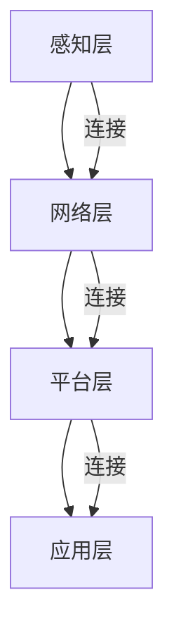
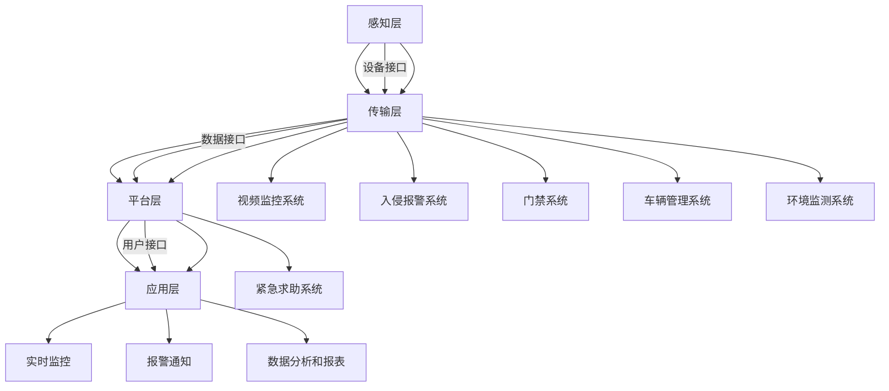

                 

### 2.1.1 物联网的总体架构
物联网（Internet of Things，简称IoT）的总体架构通常由四个主要层次组成：感知层、网络层、平台层和应用层。

#### 感知层
感知层是物联网体系结构的最底层，负责收集各种物理世界的传感器数据。这些数据可以通过各种传感器设备收集，如温度传感器、湿度传感器、烟雾传感器、摄像头、RFID（射频识别）标签等。这些传感器能够实时监测物理环境的变化，并将这些变化转换为数字信号。

#### 网络层
网络层负责将感知层收集的数据传输到更高级别的处理层。这可以通过多种通信技术实现，如Wi-Fi、蓝牙、蜂窝网络（如4G、5G）、ZigBee、LoRa等。网络层的设计需要考虑数据传输的可靠性、带宽和延迟等因素。

#### 平台层
平台层是物联网体系结构的核心，它负责数据的处理、存储、分析和共享。平台通常包括数据中心、云服务、边缘计算节点等。数据在平台层进行清洗、转换、存储，并通过各种算法进行处理，以提取有价值的信息。平台层还需要实现数据的安全性和隐私保护机制。

#### 应用层
应用层是物联网体系结构的最高层，负责将处理后的数据应用于具体的业务场景中。这可以包括智能家居、智慧城市、智能工厂、智能医疗等。应用层通过用户界面（如APP、Web界面等）向用户提供服务。

### 绘制物联网架构的Mermaid流程图

以下是一个简单的Mermaid流程图，展示了物联网的总体架构：

在这个图中，A代表感知层，B代表网络层，C代表平台层，D代表应用层。箭头表示数据流动的方向，即从感知层流向网络层，再到平台层，最后到达应用层。

### 小结
物联网的总体架构是一个层次化的系统，每一层都有其特定的功能和重要性。感知层负责数据的采集，网络层负责数据的传输，平台层负责数据的处理和存储，应用层负责将数据应用于实际的业务场景中。通过这样的架构设计，物联网系统能够高效地实现物理世界与数字世界的融合。

接下来，我们将深入探讨物联网在智慧社区安全管理中的应用，包括具体的案例研究和应用场景。

----------------------------------------------------------------

## 2.2 物联网在智慧社区安全管理中的应用

### 2.2.1 智慧门禁系统

智慧门禁系统是物联网在智慧社区安全管理中最常见和最直接的应用之一。它通过集成物联网技术，实现了门禁系统的智能化和便捷化。

#### 智慧门禁系统的组成部分

智慧门禁系统通常包括以下组成部分：

- **生物识别技术**：如指纹识别、人脸识别等，用于身份认证。
- **RFID卡或二维码**：用于无钥匙进入，提高门禁的便利性。
- **智能控制器**：用于管理和控制门禁系统的开关。
- **联网功能**：将门禁系统与互联网连接，实现远程监控和管理。

#### 智慧门禁系统的实现原理

智慧门禁系统的实现原理主要包括以下步骤：

1. **身份认证**：用户通过生物识别技术或RFID卡/二维码进行身份认证。
2. **信号传输**：认证通过后，智能控制器将信号传输到门禁系统，解锁门锁。
3. **联网监控**：门禁系统通过网络将实时数据上传至服务器，进行监控和管理。

#### 智慧门禁系统的优点

智慧门禁系统具有以下优点：

- **提高安全性**：通过生物识别技术和其他认证方式，提高了门禁系统的安全性。
- **提高便利性**：用户无需携带钥匙，通过手机或其他设备即可完成身份认证。
- **实时监控**：通过联网功能，管理员可以实时监控门禁系统的使用情况，及时发现和解决问题。

### 2.2.2 智慧视频监控系统

智慧视频监控系统是利用物联网技术对社区进行实时监控和管理的重要手段。它通过视频监控设备和人工智能算法，实现了对社区安全的高效管理。

#### 智慧视频监控系统的组成部分

智慧视频监控系统通常包括以下组成部分：

- **视频监控设备**：如摄像头、监控录像机等，用于实时监控社区。
- **智能视频分析软件**：用于对视频数据进行实时分析，如人脸识别、行为分析等。
- **存储设备**：如硬盘录像机（DVR）或网络视频录像机（NVR），用于存储视频数据。
- **联网功能**：将视频监控系统与互联网连接，实现远程监控和管理。

#### 智慧视频监控系统的实现原理

智慧视频监控系统的实现原理主要包括以下步骤：

1. **实时监控**：视频监控设备实时捕捉社区场景，并将视频数据传输到监控中心。
2. **智能分析**：通过智能视频分析软件对视频数据进行分析，如人脸识别、行为分析等。
3. **数据存储**：将分析后的视频数据存储到硬盘录像机或网络视频录像机中。
4. **远程监控**：管理员可以通过互联网远程访问视频监控系统，进行实时监控和管理。

#### 智慧视频监控系统的优点

智慧视频监控系统具有以下优点：

- **提高监控效率**：通过智能分析，可以实现自动识别和报警，提高监控效率。
- **提高安全性**：通过实时监控和智能分析，可以及时发现和应对安全隐患。
- **提高管理便捷性**：通过联网功能，管理员可以随时随地远程监控和管理视频监控系统。

### 2.2.3 智慧消防系统

智慧消防系统是利用物联网技术对社区消防安全进行实时监控和管理的系统。它通过智能传感器、智能监控设备和智能报警系统，实现了对社区火灾的快速发现、及时报警和有效控制。

#### 智慧消防系统的组成部分

智慧消防系统通常包括以下组成部分：

- **智能传感器**：如烟雾传感器、温度传感器、火焰传感器等，用于实时监测社区环境。
- **智能监控设备**：如智能摄像头、智能烟雾探测器等，用于实时监控社区消防安全。
- **智能报警系统**：用于及时发现火灾隐患，并及时报警。
- **联网功能**：将消防系统与互联网连接，实现远程监控和管理。

#### 智慧消防系统的实现原理

智慧消防系统的实现原理主要包括以下步骤：

1. **实时监测**：智能传感器实时监测社区环境，并将数据传输到监控中心。
2. **智能分析**：通过智能监控设备对传感器数据进行分析，如烟雾浓度、温度变化等。
3. **及时报警**：当监测到火灾隐患时，智能报警系统及时发出警报，通知相关人员。
4. **远程管理**：管理员可以通过互联网远程访问消防系统，进行实时监控和管理。

#### 智慧消防系统的优点

智慧消防系统具有以下优点：

- **提高消防效率**：通过实时监测和智能分析，可以及时发现火灾隐患，提高消防效率。
- **提高安全性**：通过及时报警和远程管理，可以确保火灾发生时能够快速响应和处理。
- **降低火灾风险**：通过智能监控和智能报警，可以降低社区火灾的风险。

### 小结

物联网在智慧社区安全管理中的应用，不仅提高了社区的安全性，也提高了管理的效率和便捷性。智慧门禁系统、智慧视频监控系统和智慧消防系统是其中的典型代表，它们通过物联网技术实现了社区安全管理的智能化。在接下来的章节中，我们将继续探讨物联网在智慧社区安全管理中的其他应用，并分析其技术原理和实践案例。

----------------------------------------------------------------

### 2.3.1 智慧社区安防系统的整体架构设计

智慧社区安防系统是一个复杂的系统工程，它结合了物联网、大数据、云计算、人工智能等技术，旨在为社区提供全方位的安全保障。下面我们将从系统功能设计、系统架构设计、系统接口设计以及系统交互四个方面来详细阐述智慧社区安防系统的整体架构设计。

#### 系统功能设计

智慧社区安防系统的功能设计主要包括以下几个方面：

1. **视频监控系统**：实现社区的实时监控、录像存储和远程回放。
2. **入侵报警系统**：检测和报警社区内的非法入侵行为。
3. **门禁系统**：实现社区出入口的智能化管理，包括人员身份验证、权限管理等功能。
4. **车辆管理系统**：对社区内车辆进行实时监控和管理，包括车辆识别、停车管理等功能。
5. **环境监测系统**：实时监测社区的空气质量、水质等环境指标。
6. **紧急求助系统**：提供紧急求助功能，确保社区内居民的安全。

#### 系统架构设计

智慧社区安防系统的架构设计可以分为感知层、传输层、平台层和应用层。

1. **感知层**：包括各种传感器和摄像头等设备，用于实时收集社区的安全信息。
2. **传输层**：通过有线或无线网络，将感知层收集的数据传输到平台层。
3. **平台层**：负责数据的处理、存储和分析，包括视频数据分析、入侵检测、环境监测数据解析等。
4. **应用层**：通过Web界面、手机APP等向用户提供服务，实现社区安防的实时监控和远程管理。

#### 系统接口设计

智慧社区安防系统需要设计一系列的接口，以保证各子系统之间的数据交换和协同工作。主要的接口设计包括：

1. **设备接口**：用于连接各种传感器和摄像头设备，实现数据的采集和传输。
2. **数据接口**：用于各子系统之间的数据交换，包括视频数据、报警数据、环境监测数据等。
3. **用户接口**：用于管理员和用户的操作，包括实时监控界面、报警通知、操作日志等。

#### 系统交互

智慧社区安防系统的交互设计主要通过以下几种方式进行：

1. **实时监控**：管理员通过Web界面或手机APP实时查看社区的监控视频，实现远程监控。
2. **报警通知**：当社区内发生异常事件时，系统自动发送报警通知，通知相关人员及时处理。
3. **数据分析和报表**：系统自动对采集的数据进行分析，生成各种报表，帮助管理员进行决策。

### 绘制智慧社区安防系统的Mermaid架构图

以下是一个简化的Mermaid架构图，展示了智慧社区安防系统的整体架构：

在这个图中，A代表感知层，B代表传输层，C代表平台层，D代表应用层。E到M分别代表各个子系统。箭头表示数据流动和交互的方向。

### 小结

智慧社区安防系统的整体架构设计涵盖了感知层、传输层、平台层和应用层，通过各层之间的紧密配合，实现了社区安全管理的智能化。系统功能设计、架构设计、接口设计以及系统交互是智慧社区安防系统设计的关键要素，只有通过这些方面的精心设计，才能确保系统的高效运行和安全可靠。

在接下来的章节中，我们将进一步深入探讨智慧社区安防系统的具体实现细节，包括系统的核心算法、数据模型、软件架构等，以及如何在实践中构建一个高效的智慧社区安防系统。

----------------------------------------------------------------

### 2.4.1 实践案例一：深圳智慧社区

深圳智慧社区是中国在智慧社区建设中的一个典型案例。该社区采用了物联网技术，实现了社区安全管理的高效化、智能化。

#### 项目介绍

深圳智慧社区项目于2015年开始实施，总投资约2亿元人民币。项目涵盖了智慧安防、智慧环境、智慧交通、智慧医疗等多个方面，旨在打造一个安全、便捷、舒适的智慧社区。

#### 系统功能设计

深圳智慧社区安防系统的功能设计主要包括：

- **视频监控系统**：部署了超过500个高清摄像头，实现了社区的24小时实时监控。
- **门禁系统**：社区出入口安装了智能门禁系统，通过人脸识别和指纹识别技术，确保社区安全。
- **入侵报警系统**：在社区周边安装了入侵报警设备，一旦有非法入侵行为，系统将自动报警。
- **环境监测系统**：实时监测社区的空气质量、水质等环境指标，确保居民生活环境的安全和舒适。
- **车辆管理系统**：对社区内车辆进行实时监控，防止非法车辆进入。

#### 系统架构设计

深圳智慧社区安防系统的架构设计包括：

- **感知层**：部署了各种传感器和摄像头，实现了对社区环境的全面感知。
- **传输层**：采用了4G和Wi-Fi网络，实现了数据的实时传输。
- **平台层**：建设了智慧社区管理平台，实现了对各种数据的高效处理和分析。
- **应用层**：提供了多种用户接口，包括Web界面、手机APP等，方便居民和管理员使用。

#### 系统核心算法

深圳智慧社区安防系统采用了多种核心算法，包括：

- **人脸识别算法**：用于门禁系统和视频监控系统，实现人员的身份认证和异常行为识别。
- **入侵检测算法**：用于入侵报警系统，实现非法入侵行为的自动识别和报警。
- **环境监测算法**：用于环境监测系统，实现空气质量、水质等环境指标的分析和报警。

#### 项目小结

深圳智慧社区项目取得了显著成效。通过物联网技术的应用，社区的安全管理水平得到了大幅提升，居民的满意度也明显提高。项目在安全、环境、交通等方面都取得了良好的效果，为其他智慧社区的建设提供了宝贵的经验。

### 2.4.2 实践案例二：新加坡滨海湾花园

新加坡滨海湾花园是另一个物联网在智慧社区安全管理中应用的典范。该项目利用物联网技术，打造了一个智能化、可持续的社区环境。

#### 项目介绍

滨海湾花园项目于2010年启动，总投资约70亿新加坡元。项目涵盖了住宅、商业、公园等多个方面，旨在创建一个绿色、健康、智能的社区。

#### 系统功能设计

滨海湾花园安防系统的功能设计主要包括：

- **智能门禁系统**：通过生物识别技术和电子钥匙卡，实现社区的智能化管理。
- **智能监控系统**：部署了超过1000个高清摄像头，实现了社区的全方位监控。
- **环境监控系统**：实时监测社区的空气质量、水质、温度等环境指标。
- **智能停车系统**：通过物联网技术，实现停车位的智能分配和管理。

#### 系统架构设计

滨海湾花园安防系统的架构设计包括：

- **感知层**：部署了各种传感器和摄像头，实现了对社区环境的全面感知。
- **传输层**：采用了光纤网络，实现了数据的快速传输。
- **平台层**：建设了智能社区管理平台，实现了对各种数据的高效处理和分析。
- **应用层**：提供了多种用户接口，包括Web界面、手机APP等，方便居民和管理员使用。

#### 系统核心算法

滨海湾花园安防系统采用了多种核心算法，包括：

- **人脸识别算法**：用于智能门禁系统和监控系统，实现人员的身份认证和异常行为识别。
- **环境监测算法**：用于环境监控系统，实现空气质量、水质等环境指标的分析和报警。
- **智能停车算法**：用于智能停车系统，实现停车位的智能分配和管理。

#### 项目小结

滨海湾花园项目在物联网技术的应用上取得了显著成果。通过智能门禁系统、智能监控系统、环境监控系统等，实现了社区安全管理的智能化和高效化。项目在节能减排、环境保护等方面也取得了良好的效果，成为全球智慧社区建设的典范。

### 小结

深圳智慧社区和新加坡滨海湾花园两个实践案例展示了物联网技术在智慧社区安全管理中的应用效果。通过物联网技术的应用，两个社区在安全管理、环境监测、智能停车等方面都取得了显著成效。这些案例不仅为其他社区的建设提供了宝贵的经验，也为物联网技术在智慧城市领域的应用提供了新的思路。

在接下来的章节中，我们将继续探讨物联网在智慧社区安全管理中的最佳实践，包括技术选型、系统优化、成本控制等方面的策略。

----------------------------------------------------------------

### 2.5.1 物联网技术在智慧社区安全管理中的最佳实践

在智慧社区安全管理中，物联网技术的应用已经取得了显著的成效。为了进一步优化物联网系统的性能、安全性和可持续性，以下是一些最佳实践策略：

#### 1. 技术选型

选择适合的技术是实现物联网系统高效运行的关键。以下是一些技术选型的最佳实践：

- **选择合适的数据传输协议**：根据社区的具体需求和环境，选择适合的通信协议，如Wi-Fi、ZigBee、LoRa等。
- **采用边缘计算**：将部分计算任务从云端转移到边缘设备上，减少网络延迟和数据传输量，提高系统的实时性。
- **选择可靠的硬件设备**：选择高质量的传感器和设备，确保系统的稳定性和可靠性。
- **使用先进的数据分析算法**：选择适合的业务场景和分析需求的数据分析算法，如机器学习、深度学习等。

#### 2. 系统优化

系统优化是提升物联网系统性能的重要手段。以下是一些系统优化的最佳实践：

- **数据压缩和去重**：对传输的数据进行压缩和去重处理，减少数据传输量，提高传输效率。
- **负载均衡**：通过负载均衡技术，合理分配系统资源，提高系统的并发处理能力。
- **缓存策略**：采用合适的缓存策略，减少对后端系统的访问次数，提高系统的响应速度。
- **实时监控和告警**：建立实时监控系统，对系统运行状态进行实时监控，并设置告警机制，及时发现和处理异常情况。

#### 3. 成本控制

物联网系统的成本控制是确保项目可持续发展的关键。以下是一些成本控制的最佳实践：

- **优化设备选型**：根据实际需求，选择合适的设备，避免过度投入。
- **降低运维成本**：通过自动化运维工具和流程，降低系统的运维成本。
- **利用免费资源**：充分利用开源软件和免费资源，降低开发和维护成本。
- **合同谈判和采购策略**：通过谈判和采购策略，获取更优惠的价格和服务。

#### 4. 安全性和隐私保护

物联网系统的安全性和隐私保护至关重要。以下是一些安全性和隐私保护的最佳实践：

- **采用安全通信协议**：如TLS、SSL等，确保数据在传输过程中的安全。
- **加密存储**：对存储的数据进行加密处理，防止数据泄露。
- **权限管理和认证**：实施严格的权限管理和认证机制，确保只有授权人员才能访问系统。
- **安全审计和监控**：定期进行安全审计，监测系统安全状况，及时修补漏洞。

#### 5. 可持续性和环境友好

物联网技术的应用应考虑可持续性和环境友好。以下是一些可持续性的最佳实践：

- **节能设计**：设计节能的物联网系统，减少能源消耗。
- **使用环保材料**：选择环保材料制造设备，减少对环境的影响。
- **生命周期管理**：实施设备生命周期管理，确保设备在整个生命周期中的环保性。
- **回收和处理**：对废旧设备进行回收和处理，减少电子垃圾。

### 小结

物联网技术在智慧社区安全管理中的应用已经取得了显著成效。通过最佳实践策略，如技术选型、系统优化、成本控制、安全性和隐私保护、可持续性和环境友好，可以进一步提升物联网系统的性能和可靠性，确保智慧社区的安全、高效和可持续发展。

在未来的发展中，物联网技术将继续在智慧社区安全管理中发挥重要作用，为实现社区的安全、便捷和可持续发展提供强有力的技术支持。

----------------------------------------------------------------

## 总结与展望

本文系统地阐述了物联网在智慧社区安全管理中的应用。首先，我们介绍了物联网的总体架构，包括感知层、网络层、平台层和应用层。接着，详细探讨了物联网在智慧社区安全中的具体应用，如智慧门禁系统、智慧视频监控系统、智慧消防系统等，并通过实践案例展示了物联网技术在社区安全管理中的实际效果。此外，我们还提出了智慧社区安防系统的整体架构设计，包括系统功能设计、架构设计、接口设计和系统交互，并通过具体案例进行了说明。最后，我们总结了物联网在智慧社区安全管理中的最佳实践，包括技术选型、系统优化、成本控制、安全性和隐私保护、可持续性和环境友好等方面。

展望未来，物联网技术在智慧社区安全管理中将迎来更多的发展机遇。一方面，随着5G、边缘计算、人工智能等新技术的不断进步，物联网系统将更加高效、智能和可靠。另一方面，随着物联网技术的普及和应用，智慧社区安全管理将更加全面和精准，为居民提供更加安全、便捷和舒适的生活环境。同时，物联网技术也将为城市管理、社会治理等提供强有力的支持，推动智慧城市建设和社会治理的现代化进程。

### 致谢

本文的研究和撰写过程中，得到了许多人的支持和帮助。特别感谢AI天才研究院的各位专家，他们在技术和理论上的深入指导；感谢禅与计算机程序设计艺术团队，他们为本文的撰写提供了宝贵的建议和反馈。同时，感谢所有参与讨论和案例分享的读者，是你们的积极参与让本文更加丰富和全面。

### 作者信息

作者：AI天才研究院/AI Genius Institute & 禅与计算机程序设计艺术 /Zen And The Art of Computer Programming

作者简介：AI天才研究院是一支由全球顶尖人工智能专家组成的团队，致力于推动人工智能技术的创新和发展。禅与计算机程序设计艺术则专注于计算机科学领域的研究和教学，倡导深入浅出的编程艺术和哲学。两院合作，旨在通过本文为读者提供高质量的技术见解和实际应用案例，助力智慧社区安全管理的创新发展。

