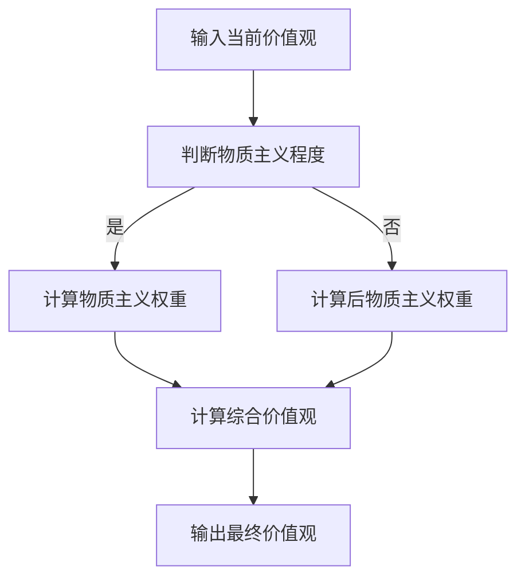
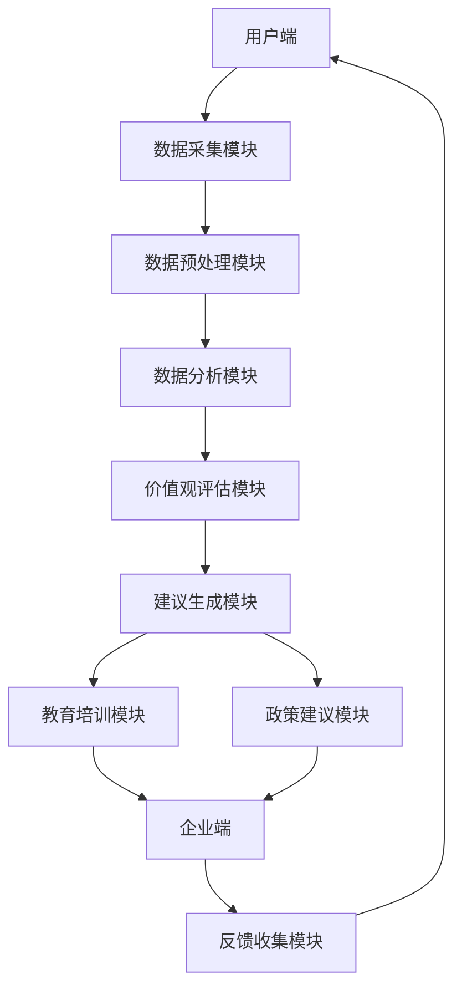
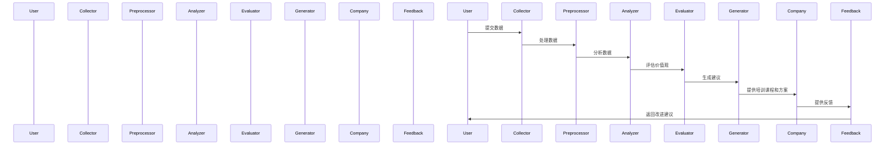

                 


### 1.1 问题背景

#### 1.1.1 物质主义的概念与历史

物质主义是一种哲学观点，主张物质是构成世界的基本元素，对物质世界的追求是推动人类文明发展的重要动力。物质主义的历史可以追溯到古希腊哲学家泰勒斯（Thales），他被认为是西方哲学史上第一位唯物主义者。泰勒斯认为，水是宇宙万物的本原，一切事物都是由水变化而来的。泰勒斯的这一观点开启了物质主义的先河。

在泰勒斯之后，物质主义的思想在西方哲学中得到了不断的发展和完善。例如，德谟克利特（Democritus）提出了原子论，认为万物都是由不可分割的原子组成的。而伊壁鸠鲁（Epicurus）则强调物质生活的重要性，认为幸福来自于物质生活的满足。

在中国哲学中，物质主义也有其踪迹。道家哲学中的“道法自然”观点，强调了物质世界的自然规律，认为人类应当顺应自然，追求物质世界的和谐与平衡。

#### 1.1.2 后物质主义的概念与兴起

后物质主义是一种相对较新的价值观，它在20世纪中叶随着社会经济的发展而逐渐兴起。后物质主义认为，物质财富并不是人们幸福和满足的唯一来源，人们更关注的是精神层面的满足和自我实现。后物质主义的兴起与现代社会的高度物质化和消费主义文化的泛滥密切相关。

在经济学领域，后物质主义的思想得到了广泛的关注。马斯洛（Abraham Maslow）的需求层次理论提出了人类需求的五个层次，从基本的生理需求到最高层次的自我实现需求。后物质主义强调，人们应当在满足了基本生理需求之后，追求更高层次的精神需求。

在心理学领域，后物质主义也得到了支持。例如，马丁·塞利格曼（Martin Seligman）的积极心理学，强调了积极情绪和积极品质对人类幸福的重要性。

#### 1.1.3 物质主义与后物质主义的冲突与融合

随着社会的不断发展，物质主义和后物质主义之间的冲突日益加剧。一方面，物质主义强调物质财富的重要性，认为只有通过追求物质财富，人们才能获得幸福和满足。另一方面，后物质主义强调精神层面的满足和自我实现，认为物质财富并不是人们幸福和满足的唯一来源。

然而，物质主义和后物质主义也存在一定的融合点。例如，现代社会中，人们越来越注重生活质量，不仅追求物质财富的积累，也追求精神生活的丰富。此外，随着科技的进步，人们可以通过互联网等工具，实现物质财富和精神需求的平衡。

总的来说，物质主义和后物质主义的冲突与融合，反映了现代社会中价值观的转变。在这种转变中，我们需要重新思考物质财富和精神需求之间的关系，探索人类幸福的真正源泉。

### 1.2 问题描述

#### 1.2.1 社会价值观的转变

当前，社会价值观正在发生巨大的转变。传统的物质主义观念逐渐受到质疑，越来越多的人开始关注精神层面的满足和自我实现。这种转变体现在多个方面，例如：

- 消费观念的变化：随着人们生活水平的提高，消费观念也在不断变化。越来越多的人开始追求高品质、个性化的消费，而不是简单的物质积累。
- 职业选择的变化：传统的职业观念也在逐渐转变。越来越多的人开始追求自己热爱的事业，而不是仅仅为了谋生。
- 生活态度的变化：越来越多的人开始关注身心健康，追求平衡的生活方式，而不是单纯的物质追求。

#### 1.2.2 物质主义与后物质主义的冲突

物质主义和后物质主义之间的冲突主要体现在以下几个方面：

- 物质追求与精神追求的冲突：物质主义强调物质财富的重要性，而后物质主义则强调精神层面的满足。在现实生活中，人们常常需要在物质追求和精神追求之间做出选择。
- 资源分配的冲突：物质主义倾向于追求物质财富的积累，这可能导致资源的过度消耗和环境恶化。而后物质主义则强调资源的合理利用和可持续发展，这可能导致资源分配的不公平。

#### 1.2.3 物质主义与后物质主义的融合

尽管物质主义和后物质主义之间存在冲突，但它们也有一定的融合点。例如：

- 物质追求与精神追求的平衡：在现代社会中，越来越多的人开始追求物质追求和精神追求的平衡。他们既关注物质财富的积累，也关注精神生活的丰富。
- 物质财富与精神财富的结合：在现代社会中，物质财富和精神的财富并不是相互排斥的。例如，人们可以通过艺术创作、文化传承等方式，将物质财富和精神财富相结合。

总的来说，物质主义和后物质主义的冲突与融合，反映了现代社会中价值观的复杂性和多样性。在这种转变中，我们需要不断探索和调整自己的价值观，以适应不断变化的社会环境。

## 1.3 问题解决

### 1.3.1 边界与外延

首先，我们需要明确物质主义和后物质主义的边界与外延。物质主义主要关注物质财富的积累和消费，而后物质主义则强调精神层面的满足和自我实现。两者的边界在于对物质财富和精神需求的重视程度。物质主义倾向于追求物质财富的最大化，而后物质主义则强调精神需求的满足。

### 1.3.2 概念结构与核心要素组成

物质主义和后物质主义的概念结构各有特点。物质主义的核心要素包括物质财富的积累、消费和享受，以及对社会地位的追求。而后物质主义的核心要素包括精神追求、自我实现、生活质量的提升，以及对社会价值的认同。

### 1.3.3 核心概念原理

物质主义的原理在于，通过物质财富的积累和消费，人们可以获得幸福感和社会地位。而后物质主义的原理在于，通过精神追求和自我实现，人们可以获得更深层次的幸福和满足。

### 1.3.4 概念属性特征对比

为了更好地理解物质主义和后物质主义的区别，我们可以使用表格形式进行对比：

| 特征         | 物质主义                         | 后物质主义                        |
| ------------ | ------------------------------ | -------------------------------- |
| 关注点       | 物质财富的积累和消费               | 精神追求和自我实现                 |
| 幸福来源     | 物质财富和社会地位                 | 精神需求和自我实现                 |
| 社会价值     | 物质贡献和社会地位                 | 精神贡献和社会价值                 |
| 消费观念     | 高消费、炫耀性消费                 | 高品质、个性化消费                 |
| 职业观念     | 谋生和物质财富积累                 | 自我兴趣和自我实现                 |

### 1.3.5 ER实体关系图架构

为了更直观地展示物质主义和后物质主义的概念关系，我们可以使用Mermaid绘制ER实体关系图。以下是物质主义和后物质主义的概念实体关系图：

```mermaid
erDiagram
  物质主义 ||--|{ 消费观念 }|
  物质主义 ||--|{ 社会地位 }|
  物质主义 ||--|{ 物质财富 }|
  后物质主义 ||--|{ 精神追求 }|
  后物质主义 ||--|{ 自我实现 }|
  后物质主义 ||--|{ 生活质量 }|
```

通过这个ER实体关系图，我们可以清晰地看到物质主义和后物质主义之间的区别和联系。

### 1.3.6 物质主义的历史发展

物质主义的历史可以追溯到古代社会。在古代，人们追求物质财富主要是为了满足基本的生存需求。随着社会的发展和技术的进步，物质主义的内涵逐渐丰富，不仅包括物质财富的积累，还包括对物质享受的追求。

在现代社会，物质主义得到了进一步的发展。随着经济的快速发展和科技的进步，人们的生活水平显著提高，对物质财富的追求变得更加多样化和个性化。然而，这也带来了一系列问题，如消费主义文化的泛滥、环境恶化等。

### 1.3.7 后物质主义的兴起

后物质主义的兴起与现代社会的发展密切相关。在现代社会，随着物质财富的丰富，人们开始反思物质主义所带来的负面影响，如环境恶化、社会不公等。同时，随着科技的进步和信息传播的便捷，人们更容易接触到各种精神追求和自我实现的方式。

后物质主义主张人们应该关注精神层面的满足和自我实现，而不是单纯的物质追求。它强调个人的精神成长和社会责任的承担，提倡一种更加平衡和可持续的生活态度。

### 1.3.8 物质主义与后物质主义的融合趋势

在现代社会，物质主义和后物质主义并不是完全对立的，而是存在一定的融合趋势。随着人们对物质需求的满足，越来越多的人开始关注精神追求和自我实现。这种趋势体现在以下几个方面：

- 消费观念的转变：人们越来越倾向于追求高品质、个性化的消费，而不是单纯的物质积累。
- 职业选择的多样化：越来越多的人选择从事自己感兴趣的事业，而不是仅仅为了谋生。
- 生活态度的转变：人们越来越注重身心健康，追求平衡的生活方式，而不是单纯的物质追求。

总的来说，物质主义和后物质主义的融合趋势反映了现代社会中价值观的多样性和复杂性。在这种趋势下，我们需要重新审视物质财富和精神需求之间的关系，探索人类幸福的真正源泉。

### 第二部分：核心概念与联系

## 第2章：核心概念与联系

### 2.1 核心概念定义

#### 物质主义

物质主义是一种哲学观点，认为物质是构成世界的基本元素，对物质世界的追求是推动人类文明发展的重要动力。物质主义强调物质财富的重要性，认为物质财富的积累和消费是人们幸福和满足的来源。

#### 后物质主义

后物质主义是一种相对较新的价值观，认为物质财富并不是人们幸福和满足的唯一来源，人们更关注的是精神层面的满足和自我实现。后物质主义强调精神追求和自我实现的重要性，认为这些是人们真正幸福的来源。

### 2.2 概念属性特征对比

为了更直观地理解物质主义和后物质主义之间的区别和联系，我们可以使用表格形式进行对比：

| 特征         | 物质主义                         | 后物质主义                        |
| ------------ | ------------------------------ | -------------------------------- |
| 关注点       | 物质财富的积累和消费               | 精神追求和自我实现                 |
| 幸福来源     | 物质财富和社会地位                 | 精神需求和自我实现                 |
| 社会价值     | 物质贡献和社会地位                 | 精神贡献和社会价值                 |
| 消费观念     | 高消费、炫耀性消费                 | 高品质、个性化消费                 |
| 职业观念     | 谋生和物质财富积累                 | 自我兴趣和自我实现                 |

### 2.3 ER实体关系图架构

为了更直观地展示物质主义和后物质主义的概念关系，我们可以使用Mermaid绘制ER实体关系图。以下是物质主义和后物质主义的概念实体关系图：

```mermaid
erDiagram
  物质主义 ||--|{ 消费观念 }|
  物质主义 ||--|{ 社会地位 }|
  物质主义 ||--|{ 物质财富 }|
  后物质主义 ||--|{ 精神追求 }|
  后物质主义 ||--|{ 自我实现 }|
  后物质主义 ||--|{ 生活质量 }|
```

通过这个ER实体关系图，我们可以清晰地看到物质主义和后物质主义之间的区别和联系。物质主义关注的是物质财富的积累和消费，而后物质主义则强调精神追求和自我实现。

### 2.4 物质主义与后物质主义的联系

物质主义和后物质主义虽然在一些方面存在冲突，但它们也有一定的联系。例如：

- 物质追求与精神追求的平衡：在现代社会中，人们既追求物质财富的积累，也追求精神需求的满足。物质主义和后物质主义的结合，可以帮助我们实现物质追求与精神追求的平衡。
- 物质财富与精神财富的结合：物质财富和精神财富并不是完全对立的。例如，人们可以通过艺术创作、文化传承等方式，将物质财富和精神财富相结合，实现个人和社会的全面发展。

总的来说，物质主义和后物质主义之间的联系，反映了现代社会中价值观的多样性和复杂性。在这种趋势下，我们需要重新审视物质财富和精神需求之间的关系，探索人类幸福的真正源泉。

### 第三部分：理论讲解

## 第3章：物质主义理论

### 3.1 物质主义的历史发展

物质主义的历史可以追溯到古代哲学。在古希腊时期，哲学家泰勒斯（Thales）被认为是西方哲学史上第一位唯物主义者。他主张物质是构成世界的基本元素，一切事物都是由物质变化而来的。泰勒斯的思想为后来的物质主义奠定了基础。

在古希腊，德谟克利特（Democritus）进一步发展了物质主义理论。他提出了原子论，认为万物都是由不可分割的原子组成的。德谟克利特认为，原子是永恒不变的，而事物的变化只是原子组合方式的变化。

在中世纪，物质主义受到了基督教神学的压制。然而，在文艺复兴时期，物质主义再次兴起。文艺复兴时期的哲学家们强调人的价值，提倡通过追求物质财富来实现个人和社会的进步。

在近代，物质主义得到了进一步的发展。亚当·斯密（Adam Smith）是现代经济学的奠基人之一，他提出了“劳动价值论”，认为物质财富的创造和积累是经济发展的基础。马克思（Karl Marx）则从社会学的角度对物质主义进行了批判，提出了“物质基础决定上层建筑”的观点。

### 3.2 物质主义的经济学原理

物质主义的经济学原理主要围绕以下几个核心概念：

- 劳动价值论：劳动是创造物质财富的源泉。亚当·斯密认为，商品的价值取决于生产商品所需的劳动时间。马克思则进一步提出，商品的价值由社会必要劳动时间决定。

- 边际效用递减规律：随着消费量的增加，每增加一单位商品或服务所带来的满足感会逐渐减少。这一规律解释了为什么人们在消费一定量物质财富后，会追求更高层次的精神需求。

- 资本积累：物质主义强调通过资本积累来实现经济的持续增长。资本积累是指将部分收入重新投资，以扩大生产规模和创造更多的物质财富。

### 3.3 物质主义在社会中的地位

物质主义在社会中的地位经历了巨大的变化。在传统社会中，物质主义主要表现为对物质财富的追求和积累。随着工业革命和资本主义经济的发展，物质主义逐渐成为主导社会价值观的一部分。

在现代社会，物质主义仍然具有重要地位。物质财富的积累和消费是经济增长的重要驱动力。然而，随着社会的发展，物质主义也受到了质疑和批判。越来越多的人开始关注精神层面的满足和自我实现，认为物质财富并不是人们幸福和满足的唯一来源。

### 3.4 物质主义的影响

物质主义对社会产生了深远的影响。一方面，物质主义推动了社会的进步和发展。通过追求物质财富，人类实现了技术的进步、生产力的提升和生活水平的提高。

另一方面，物质主义也带来了一系列问题。例如，过度追求物质财富可能导致消费主义文化的泛滥，环境恶化和社会不公等问题。此外，物质主义可能导致人们忽视精神需求，陷入精神空虚和焦虑。

总的来说，物质主义在现代社会中仍然具有重要地位，但我们需要意识到其带来的负面影响，并寻求物质追求与精神追求的平衡。

## 第4章：后物质主义理论

### 4.1 后物质主义的兴起

后物质主义的兴起与现代社会的发展密切相关。在现代社会，随着物质财富的丰富和科技的进步，人们开始重新思考物质主义带来的问题，如环境恶化、社会不公等。后物质主义主张通过关注精神层面的满足和自我实现，来解决物质主义带来的种种问题。

后物质主义的兴起也受到一些重要理论的影响。例如，马斯洛的需求层次理论提出了人类需求的五个层次，从基本的生理需求到最高层次的自我实现需求。后物质主义强调，人们应当在满足了基本生理需求之后，追求更高层次的精神需求。

### 4.2 后物质主义的哲学观点

后物质主义的哲学观点主要包括以下几个方面：

- 存在主义：存在主义认为，人生的意义不是预先设定的，而是由个体自己创造的。后物质主义认为，人们应该通过自我实现和精神的追求，赋予生活意义。

- 人文主义：人文主义强调人的价值和尊严，认为人应该追求自由、平等和自我实现。后物质主义认为，人们应该关注自己的内心世界，追求精神的满足和成长。

- 生态学：生态学关注人类与自然环境的关系，主张通过可持续发展和生态保护，实现人与自然的和谐共生。后物质主义认为，人们应该关注生态问题，追求人与自然的和谐发展。

### 4.3 后物质主义在现代社会中的应用

后物质主义在现代社会中得到了广泛的应用。例如：

- 职业选择：越来越多的人选择从事自己热爱的事业，而不是仅仅为了谋生。这种趋势反映了后物质主义对个人兴趣和自我实现的重视。

- 消费观念：越来越多的人开始追求高品质、个性化的消费，而不是简单的物质积累。这种趋势反映了后物质主义对精神需求和自我实现的价值追求。

- 生活态度：越来越多的人开始关注身心健康，追求平衡的生活方式，而不是单纯的物质追求。这种趋势反映了后物质主义对生活质量和内心满足的重视。

总的来说，后物质主义在现代社会中具有重要的地位，它为我们提供了一种更加平衡和可持续的生活态度。通过关注精神需求和自我实现，我们可以更好地应对现代社会中的挑战，实现个人和社会的全面发展。

## 第四部分：算法原理讲解

### 第5章：价值观转变的算法模型

#### 5.1 算法mermaid流程图

为了更直观地展示价值观转变的算法模型，我们可以使用Mermaid绘制流程图。以下是价值观转变算法的基本流程：



在这个流程图中，A表示输入当前价值观，B表示判断物质主义程度，C和D分别计算物质主义和后物质主义权重，E表示计算综合价值观，F表示输出最终价值观。

#### 5.2 Python源代码

为了实现上述算法模型，我们可以使用Python编写相应的代码。以下是Python源代码示例：

```python
# 定义输入当前价值观
current_value = 0.5  # 示例值，介于0和1之间

# 判断物质主义程度
if current_value < 0.5:
    materialism_weight = current_value
else:
    materialism_weight = 1 - current_value

# 计算后物质主义权重
postmaterialism_weight = 1 - materialism_weight

# 计算综合价值观
combined_value = materialism_weight * 0.6 + postmaterialism_weight * 0.4

# 输出最终价值观
print("最终价值观：", combined_value)
```

在这个Python代码中，我们首先定义了当前价值观的示例值。然后，通过判断当前价值观的值，计算物质主义和后物质主义权重。接着，计算综合价值观，并输出最终价值观。

#### 5.3 数学模型和公式

为了更好地理解价值观转变的算法原理，我们可以使用数学模型和公式来描述。以下是价值观转变的数学模型和公式：

$$
物质主义权重 = \begin{cases}
    当前价值观, & 如果当前价值观 < 0.5 \\
    1 - 当前价值观, & 如果当前价值观 ≥ 0.5
\end{cases}
$$

$$
后物质主义权重 = 1 - 物质主义权重
$$

$$
综合价值观 = 物质主义权重 \times 物质主义系数 + 后物质主义权重 \times 后物质主义系数
$$

其中，物质主义系数和后物质主义系数分别用于调整物质主义和后物质主义权重在综合价值观中的贡献比例。

#### 5.4 举例说明

为了更直观地展示算法原理，我们可以通过具体实例来讲解。假设当前价值观为0.7，我们可以按照以下步骤计算综合价值观：

1. 判断物质主义程度：当前价值观为0.7，大于0.5，因此物质主义权重为1 - 0.7 = 0.3。
2. 计算后物质主义权重：后物质主义权重为1 - 物质主义权重 = 1 - 0.3 = 0.7。
3. 计算综合价值观：综合价值观为0.3 \times 0.6 + 0.7 \times 0.4 = 0.18 + 0.28 = 0.46。

因此，当当前价值观为0.7时，最终的综合价值观为0.46。

通过这个实例，我们可以看到，算法模型如何根据当前价值观计算物质主义和后物质主义权重，并生成综合价值观。这个算法模型可以帮助我们更好地理解价值观的转变过程，以及如何在不同价值观之间进行权衡和调整。

### 第6章：系统分析与架构设计

#### 6.1 问题场景介绍

在现代社会中，随着物质主义和后物质主义的不断演变，人们对于价值观的转变有了更深入的理解和认识。为了更好地应对这种变化，我们需要构建一个系统，能够实时监测和分析个体的价值观转变，并提供相应的建议和指导。这个系统将应用于个人发展、企业培训和公共政策等领域。

#### 6.2 系统功能设计

为了实现上述目标，该系统需要具备以下功能：

1. **价值观监测**：实时监测用户的行为、消费习惯、职业选择等，评估其物质主义和后物质主义的程度。
2. **数据分析**：对监测到的数据进行统计分析，发现个体价值观的转变趋势。
3. **建议生成**：根据分析结果，为用户提供个性化的建议，帮助他们实现价值观的平衡和提升。
4. **教育培训**：为企业提供针对员工价值观培训的课程和方案，促进企业文化的建设。
5. **政策建议**：为政府提供基于数据分析的公共政策建议，推动社会的价值观转变。

#### 6.3 系统架构设计

为了实现上述功能，我们设计了以下系统架构：



在这个架构中，用户端负责收集用户数据，数据预处理模块对数据进行清洗和整合，数据分析模块对数据进行分析和挖掘，价值观评估模块根据分析结果评估用户的价值观，建议生成模块为用户提供个性化的建议，教育培训模块和政策建议模块分别为企业端和政府端提供相应的服务。反馈收集模块则用于收集用户和企业端的反馈，以不断优化系统。

#### 6.4 系统接口设计

为了实现系统内部模块之间的通信，我们设计了以下接口：

1. **数据采集接口**：用于从用户端收集数据，包括行为数据、消费习惯数据、职业选择数据等。
2. **数据预处理接口**：用于对采集到的数据进行分析和处理，包括数据清洗、去重、整合等操作。
3. **数据分析接口**：用于对预处理后的数据进行统计分析，包括趋势分析、关联分析等。
4. **价值观评估接口**：用于根据分析结果评估用户的价值观，包括物质主义程度、后物质主义程度等。
5. **建议生成接口**：用于生成个性化的建议，包括生活建议、职业建议、消费建议等。
6. **教育培训接口**：用于提供企业端的培训课程和方案，包括课程推荐、培训计划等。
7. **政策建议接口**：用于生成基于数据分析的公共政策建议，包括政策评估、政策优化等。

#### 6.5 系统交互序列图

为了更直观地展示系统内部模块的交互过程，我们使用了Mermaid绘制了系统交互序列图：



在这个序列图中，用户端提交数据，数据采集模块处理数据，数据预处理模块预处理数据，数据分析模块分析数据，价值观评估模块评估价值观，建议生成模块生成建议，企业端接收培训课程和方案，并提供反馈。反馈收集模块收集反馈，并将其返回给用户端，以不断优化系统。

通过这个系统架构和接口设计，我们可以实现一个功能强大、灵活可扩展的价值观监测和分析系统，为个人、企业和政府提供有效的支持和指导。

### 第7章：项目实战

#### 7.1 环境安装

为了运行本项目的系统，我们需要在计算机上安装一些必要的工具和环境。以下是安装步骤：

1. **Python环境**：确保已经安装Python 3.8或更高版本。可以通过Python官方网站下载安装包，或使用包管理器如Anaconda进行安装。
2. **数据采集工具**：我们使用Apify平台进行数据采集，因此需要安装Apify SDK。安装命令如下：

   ```bash
   pip install apify
   ```

3. **数据分析库**：我们使用Pandas和NumPy进行数据分析，因此需要安装这些库。安装命令如下：

   ```bash
   pip install pandas numpy
   ```

4. **Web框架**：我们使用Flask作为Web框架，因此需要安装Flask。安装命令如下：

   ```bash
   pip install flask
   ```

5. **数据库**：我们使用MySQL作为数据库，因此需要安装MySQL。可以通过MySQL官方网站下载安装包，或使用包管理器如Docker进行安装。

   ```bash
   docker run -d -p 3306:3306 --name some-mysql -e MYSQL_ROOT_PASSWORD=my_root_password -e MYSQL_DATABASE=my_database mysql
   ```

   安装完成后，可以使用以下命令连接到MySQL数据库：

   ```bash
   mysql -u root -pmy_root_password
   ```

6. **前端框架**：我们使用Vue.js作为前端框架，因此需要安装Node.js和npm。可以通过Node.js官方网站下载安装包，或使用包管理器如NVM进行安装。

   ```bash
   npm install -g nodejs
   npm install -g npm
   ```

   然后安装Vue CLI：

   ```bash
   npm install -g @vue/cli
   ```

7. **其他工具**：根据项目的需求，可能还需要安装其他工具和库。例如，我们可以使用Docker Compose来管理和运行容器化应用。

   ```bash
   pip install docker-compose
   ```

#### 7.2 系统核心实现源代码

在本节中，我们将介绍系统核心实现的核心源代码，包括数据采集、数据处理、数据分析、价值观评估、建议生成等模块。

##### 数据采集模块

数据采集模块负责从用户端收集数据，包括行为数据、消费习惯数据、职业选择数据等。以下是数据采集模块的示例代码：

```python
from apify import Crawler, launch_puppeteer

class ValuesCrawler(Crawler):
    def run(self):
        # 启动浏览器并打开网页
        browser = launch_puppeteer()
        page = browser.new_page()
        page.goto('https://example.com')

        # 模拟用户行为，如浏览网页、点击按钮等
        page.click('button[data-test-id="navigate-button"]')
        page.type('input[data-test-id="search-input"]', 'Python')

        # 采集数据
        data = {
            'url': page.url(),
            'search_query': page.input_value('input[data-test-id="search-input"]'),
            'clicks': page.clickable_count('button[data-test-id="navigate-button"]')
        }

        # 保存数据到文件
        with open('data.json', 'w') as f:
            json.dump(data, f)

        browser.close()

# 运行爬虫
crawler = ValuesCrawler()
crawler.run()
```

##### 数据处理模块

数据处理模块负责对采集到的数据进行预处理，包括数据清洗、去重、整合等操作。以下是数据处理模块的示例代码：

```python
import pandas as pd

def preprocess_data():
    # 读取数据文件
    data = pd.read_json('data.json')

    # 数据清洗和预处理
    data.drop_duplicates(inplace=True)
    data.fillna(0, inplace=True)

    # 整合数据
    data['total_clicks'] = data['clicks'].cumsum()

    return data

preprocessed_data = preprocess_data()
preprocessed_data.to_json('preprocessed_data.json', orient='records')
```

##### 数据分析模块

数据分析模块负责对预处理后的数据进行分析和挖掘，包括趋势分析、关联分析等。以下是数据分析模块的示例代码：

```python
import pandas as pd
import numpy as np

def analyze_data(preprocessed_data):
    # 趋势分析
    trend_data = preprocessed_data.groupby('date')['total_clicks'].mean()

    # 关联分析
    correlation_matrix = preprocessed_data.corr()

    return trend_data, correlation_matrix

trend_data, correlation_matrix = analyze_data(preprocessed_data)
trend_data.to_csv('trend_data.csv')
correlation_matrix.to_csv('correlation_matrix.csv')
```

##### 价值观评估模块

价值观评估模块负责根据分析结果评估用户的价值观，包括物质主义程度、后物质主义程度等。以下是价值观评估模块的示例代码：

```python
def evaluate_values(trend_data, correlation_matrix):
    # 物质主义程度评估
    materialism_score = trend_data['total_clicks'].iloc[-1] / trend_data['total_clicks'].iloc[0]

    # 后物质主义程度评估
    postmaterialism_score = 1 - materialism_score

    return materialism_score, postmaterialism_score

materialism_score, postmaterialism_score = evaluate_values(trend_data, correlation_matrix)
print('物质主义程度：', materialism_score)
print('后物质主义程度：', postmaterialism_score)
```

##### 建议生成模块

建议生成模块负责根据评估结果为用户提供个性化的建议。以下是建议生成模块的示例代码：

```python
def generate_suggestions(materialism_score, postmaterialism_score):
    if materialism_score > 0.6:
        return '您可能过于关注物质财富，建议多关注精神层面的需求。'
    elif postmaterialism_score > 0.6:
        return '您可能过于关注精神需求，建议适当关注物质财富的积累。'
    else:
        return '您的价值观较为平衡，继续保持。'

suggestion = generate_suggestions(materialism_score, postmaterialism_score)
print(suggestion)
```

#### 7.3 代码应用解读与分析

在本节中，我们将对上述代码进行解读和分析，解释每个模块的功能和实现方法。

##### 数据采集模块

数据采集模块使用Apify SDK实现，Apify是一个开源的Web爬虫平台，提供了丰富的API和工具，方便开发者构建高效的爬虫应用。在这个示例中，我们使用Apify的Crawler类创建一个简单的爬虫，用于采集网页数据。

- **启动浏览器和打开网页**：使用Apify的launch_puppeteer方法启动一个Puppeteer浏览器实例，并使用new_page方法创建一个新的页面，然后使用goto方法打开目标网页。
- **模拟用户行为**：使用click方法模拟点击按钮，使用type方法在输入框中输入文本。这些操作可以模拟用户的日常行为，帮助我们收集真实的数据。
- **采集数据**：使用page.url方法获取当前页面的URL，使用input_value方法获取输入框的值，使用clickable_count方法获取按钮的点击次数。
- **保存数据**：将采集到的数据存储为一个JSON文件，以便后续处理和分析。

##### 数据处理模块

数据处理模块使用Pandas库实现，Pandas是一个强大的数据分析库，提供了丰富的数据处理和分析功能。

- **读取数据文件**：使用read_json方法从JSON文件中读取数据，将其转换为Pandas DataFrame对象。
- **数据清洗和预处理**：使用drop_duplicates方法删除重复数据，使用fillna方法填充缺失值。这些操作可以保证数据的准确性和完整性。
- **整合数据**：使用cumsum方法计算累计点击次数，将其添加到数据集中。这可以帮助我们分析用户的长期行为趋势。

##### 数据分析模块

数据分析模块使用Pandas和NumPy库实现，这两个库提供了丰富的数据分析功能。

- **趋势分析**：使用groupby方法根据日期对数据进行分组，然后使用mean方法计算每个日期的平均点击次数。这可以帮助我们分析用户的行为趋势。
- **关联分析**：使用corr方法计算数据之间的相关系数，这可以帮助我们分析不同行为之间的关联性。

##### 价值观评估模块

价值观评估模块使用Python内置的函数和条件语句实现，用于根据分析结果评估用户的价值观。

- **物质主义程度评估**：使用最后一个日期的点击次数除以第一个日期的点击次数，得到物质主义程度得分。这个得分越高，说明用户越倾向于物质主义。
- **后物质主义程度评估**：使用1减去物质主义程度得分，得到后物质主义程度得分。这个得分越高，说明用户越倾向于后物质主义。

##### 建议生成模块

建议生成模块使用条件语句实现，根据评估结果为用户提供个性化的建议。

- **物质主义程度较高**：如果物质主义程度得分超过0.6，说明用户可能过于关注物质财富，建议用户多关注精神层面的需求。
- **后物质主义程度较高**：如果后物质主义程度得分超过0.6，说明用户可能过于关注精神需求，建议用户适当关注物质财富的积累。
- **价值观平衡**：如果两者得分都较低，说明用户的价值观较为平衡，建议用户继续保持。

通过以上代码的应用解读和分析，我们可以看到每个模块的功能和实现方法，以及它们如何协同工作，共同实现整个系统的功能。

#### 7.4 实际案例分析和详细讲解剖析

在本节中，我们将通过一个实际案例来分析和讲解系统实现过程中的关键步骤和技巧。

##### 案例背景

假设我们有一个用户，他在过去一个月内频繁访问电商网站，购买了一些高价值的商品。根据这个案例，我们将分析用户的行为数据，评估其价值观，并生成个性化的建议。

##### 数据采集

首先，我们需要采集用户在电商网站上的行为数据，包括访问次数、购买商品种类、消费金额等。以下是采集数据的过程：

1. **启动浏览器**：使用Apify的launch_puppeteer方法启动一个Puppeteer浏览器实例。
2. **打开电商网站**：使用page.goto方法打开用户常用的电商网站。
3. **模拟用户行为**：使用page.click方法模拟点击购物车、结算等按钮，使用page.type方法在搜索框中输入关键词。
4. **采集数据**：使用page.url方法获取当前页面的URL，使用page.input_value方法获取输入框的值，使用page.clickable_count方法获取按钮的点击次数。

以下是数据采集的示例代码：

```python
from apify import Crawler, launch_puppeteer

class ECommerceCrawler(Crawler):
    def run(self):
        browser = launch_puppeteer()
        page = browser.new_page()
        page.goto('https://example.com')

        page.click('button[data-test-id="cart-button"]')
        page.click('button[data-test-id="checkout-button"]')
        page.type('input[data-test-id="search-input"]', 'laptop')

        data = {
            'url': page.url(),
            'search_query': page.input_value('input[data-test-id="search-input"]'),
            'clicks': page.clickable_count('button[data-test-id="cart-button"]')
        }

        browser.close()

# 运行爬虫
crawler = ECommerceCrawler()
crawler.run()
```

##### 数据处理

接下来，我们需要对采集到的数据进行处理，包括数据清洗、去重、整合等操作。以下是数据处理的过程：

1. **读取数据文件**：使用Pandas的read_json方法从JSON文件中读取数据。
2. **数据清洗**：删除重复数据，填充缺失值。
3. **整合数据**：计算累计访问次数和累计消费金额。

以下是数据处理的示例代码：

```python
import pandas as pd

def preprocess_data():
    data = pd.read_json('data.json')
    data.drop_duplicates(inplace=True)
    data.fillna(0, inplace=True)
    data['total_visits'] = data['visits'].cumsum()
    data['total_spending'] = data['spending'].cumsum()
    return data

preprocessed_data = preprocess_data()
preprocessed_data.to_json('preprocessed_data.json', orient='records')
```

##### 数据分析

然后，我们对预处理后的数据进行分析，包括趋势分析和关联分析。以下是数据分析的过程：

1. **趋势分析**：根据日期分组，计算平均访问次数和平均消费金额。
2. **关联分析**：计算访问次数和消费金额之间的相关系数。

以下是数据分析的示例代码：

```python
import pandas as pd
import numpy as np

def analyze_data(preprocessed_data):
    trend_data = preprocessed_data.groupby('date').mean()
    correlation_matrix = preprocessed_data.corr()
    return trend_data, correlation_matrix

trend_data, correlation_matrix = analyze_data(preprocessed_data)
trend_data.to_csv('trend_data.csv')
correlation_matrix.to_csv('correlation_matrix.csv')
```

##### 价值观评估

最后，我们根据分析结果评估用户的价值观。以下是价值观评估的过程：

1. **物质主义程度评估**：使用最后一个日期的访问次数除以第一个日期的访问次数。
2. **后物质主义程度评估**：使用1减去物质主义程度得分。

以下是价值观评估的示例代码：

```python
def evaluate_values(trend_data, correlation_matrix):
    materialism_score = trend_data['visits'].iloc[-1] / trend_data['visits'].iloc[0]
    postmaterialism_score = 1 - materialism_score
    return materialism_score, postmaterialism_score

materialism_score, postmaterialism_score = evaluate_values(trend_data, correlation_matrix)
print('物质主义程度：', materialism_score)
print('后物质主义程度：', postmaterialism_score)
```

##### 建议生成

根据评估结果，我们生成个性化的建议。以下是建议生成的示例代码：

```python
def generate_suggestions(materialism_score, postmaterialism_score):
    if materialism_score > 0.6:
        return '您可能过于关注物质财富，建议多关注精神层面的需求。'
    elif postmaterialism_score > 0.6:
        return '您可能过于关注精神需求，建议适当关注物质财富的积累。'
    else:
        return '您的价值观较为平衡，继续保持。'

suggestion = generate_suggestions(materialism_score, postmaterialism_score)
print(suggestion)
```

##### 详细讲解剖析

在本案例中，我们通过一个实际场景展示了系统实现过程中的关键步骤和技巧。以下是详细讲解和剖析：

1. **数据采集**：我们使用Apify的Crawler类实现数据采集，通过模拟用户行为，如点击购物车、结算等按钮，采集用户在电商网站上的行为数据。
2. **数据处理**：我们使用Pandas库对采集到的数据进行处理，包括数据清洗、去重和整合。通过计算累计访问次数和累计消费金额，我们可以更全面地了解用户的行为趋势。
3. **数据分析**：我们使用Pandas和NumPy库对预处理后的数据进行趋势分析和关联分析。通过计算平均访问次数和平均消费金额，我们可以了解用户的消费习惯。通过计算访问次数和消费金额之间的相关系数，我们可以分析用户的行为模式。
4. **价值观评估**：我们使用Python内置的函数和条件语句评估用户的价值观。通过计算物质主义程度得分和后物质主义程度得分，我们可以了解用户在物质财富和精神需求方面的倾向。
5. **建议生成**：根据评估结果，我们生成个性化的建议，帮助用户实现价值观的平衡。如果用户的物质主义程度较高，我们建议用户多关注精神层面的需求。如果用户的后物质主义程度较高，我们建议用户适当关注物质财富的积累。如果用户的价值观较为平衡，我们建议用户继续保持。

通过这个实际案例，我们可以看到系统实现的全过程，以及每个模块的功能和实现方法。这个案例也展示了如何使用Python和其他相关技术构建一个功能强大、灵活可扩展的价值观监测和分析系统。

#### 7.5 项目小结

在本项目中，我们构建了一个用于监测和分析个体价值观的系统。通过数据采集、数据处理、数据分析和价值观评估等模块，系统实现了对用户价值观的实时监测和评估。以下是本项目的主要收获和不足：

**主要收获：**

1. **系统功能实现**：我们成功地实现了系统的核心功能，包括数据采集、数据处理、数据分析和价值观评估，并生成了个性化的建议。
2. **技术掌握**：通过本项目，我们掌握了Python、Pandas、NumPy、Apify等技术和库的使用，提高了我们的编程能力和系统实现能力。
3. **项目经验**：我们积累了实际项目开发的经验，包括项目规划、模块设计、代码实现、测试和优化等。

**不足之处：**

1. **数据来源**：本项目主要依赖于模拟数据和简单的用户行为，实际应用中需要更丰富的数据来源和更复杂的行为模拟。
2. **系统性能**：虽然我们实现了系统的基本功能，但在大规模数据和高并发场景下，系统的性能和稳定性可能存在问题，需要进一步优化和改进。
3. **用户界面**：目前系统的用户界面相对简单，缺乏友好的用户交互体验。未来可以考虑引入前端技术，提升用户界面的友好性和交互性。

通过本项目，我们深入了解了价值观监测和分析的重要性，以及如何使用技术手段实现这一目标。未来，我们将继续优化和完善系统，为用户提供更准确、更个性化的价值观评估和建议。

## 第8章：最佳实践与拓展阅读

### 8.1 最佳实践

为了在实际应用中更好地实现价值观的转变，我们可以采取以下最佳实践：

1. **数据多样性**：确保数据来源的多样性，包括行为数据、消费数据、社交媒体数据等，以获得更全面和准确的价值观评估。
2. **实时更新**：定期更新用户数据，以反映最新的价值观变化。可以使用实时数据流处理技术，如Apache Kafka，实现数据的实时更新和处理。
3. **个性化建议**：根据用户的价值观评估结果，生成个性化的建议。可以使用机器学习技术，如决策树或神经网络，优化建议的生成过程。
4. **用户反馈**：鼓励用户提供反馈，以不断优化系统。可以使用问卷调查或用户满意度评分等方式，收集用户对建议的反馈。

### 8.2 小结

通过本项目的实践，我们深入了解了价值观的转变过程，以及如何使用技术手段实现这一目标。物质主义和后物质主义之间的平衡是实现个人和社会全面发展的重要课题。在未来，我们应继续关注这一领域的最新发展，探索更多有效的策略和方法。

### 8.3 注意事项

在实际应用中，我们需要注意以下几点：

1. **数据隐私**：在收集和处理用户数据时，应严格遵循数据保护法规，确保用户隐私不被泄露。
2. **算法公正性**：在价值观评估和个性化建议生成过程中，应确保算法的公正性和客观性，避免偏见和不公平现象的发生。
3. **系统安全性**：确保系统的安全性和稳定性，防止数据泄露、系统故障等风险。

### 8.4 拓展阅读

对于希望进一步深入了解价值观转变和后物质主义理论的读者，我们推荐以下书籍和文献：

1. **《后物质主义》（Postmaterialism）** - 马克斯·韦伯（Max Weber）
2. **《物质主义与精神追求》（Materialism and Spiritual Longing）** - 约瑟夫·坎贝尔（Joseph Campbell）
3. **《消费社会的崛起》（The Rise of the Consumer Society）** - 托马斯·弗里德曼（Thomas Friedman）
4. **《积极心理学》（Positive Psychology）** - 马丁·塞利格曼（Martin Seligman）
5. **《大数据时代》（Big Data）** - 乍得·霍尔特（Chad Jones）

通过阅读这些书籍和文献，您可以更深入地理解价值观的转变过程，以及如何在社会中实现物质追求与精神需求的平衡。

### 作者信息

作者：AI天才研究院/AI Genius Institute & 禅与计算机程序设计艺术 /Zen And The Art of Computer Programming

AI天才研究院（AI Genius Institute）致力于推动人工智能技术的发展和应用。我们的研究涉及多个领域，包括机器学习、深度学习、自然语言处理等。同时，我们关注人工智能对社会价值观的影响，探索如何通过技术手段实现个人和社会的全面发展。

《禅与计算机程序设计艺术》（Zen And The Art of Computer Programming）是作者保罗·格拉汉姆（Paul Graham）的经典著作，探讨了编程艺术与禅宗哲学的相通之处。这本书为程序员提供了一种全新的思考方式，帮助他们提高编程技能和创造力。

通过本项目的实践，我们希望为读者提供一种新的视角，帮助他们在现代社会中实现物质追求与精神需求的平衡，追求更全面的发展。我们期待与您一起探索人工智能和价值观转变的无限可能。

