                 

**第2章 环境保护的核心概念**

### 2.3 可持续发展的理念与实践

可持续发展是指满足当前需求而不损害后代满足其需求的能力。其核心理念在于平衡经济发展、社会进步和环境保护三者的关系。为了实现这一目标，我们需要理解和实践以下核心概念。

**概念属性特征对比表格：**

| 特征 | 经济发展 | 社会进步 | 环境保护 |
| --- | --- | --- | --- |
| 目标 | 提高生产力和生活水平 | 提高教育、医疗和社会保障水平 | 保护生态系统、减少污染、提高资源利用效率 |
| 关系 | 促进经济发展可以带动社会进步和环境保护 | 社会进步可以推动经济发展和环境保护 | 经济发展和环境保护可以促进社会进步 |
| 方式 | 投资建设、技术创新、市场机制 | 改善公共服务、提高社会福利、促进社会参与 | 绿色技术、生态农业、节能减排 |

**ER实体关系图架构：**

```mermaid
erDiagram
  ADevelopment ||--|{ BEnvironment : 影响 }
  ADevelopment ||--|{ CSociety : 推动 }
  CSociety ||--|{ ADevelopment : 反馈 }
  BEnvironment ||--|{ ADevelopment : 影响 }
  BEnvironment ||--|{ CSociety : 影响 }
```

**核心概念原理**

可持续发展理念的核心是“三柱结构”，即经济、社会和环境三者相互依存、相互促进。在经济层面，通过推动绿色经济和循环经济，实现资源的高效利用和生态保护。在社会层面，通过提高教育和健康水平，促进社会公平和和谐发展。在环境层面，通过生态保护和环境治理，维护生态平衡和生物多样性。

**算法原理讲解**

我们可以将可持续发展看作是一个动态优化过程，其目标是最小化环境损失，最大化经济收益和社会福利。以下是可持续发展算法的基本原理和数学模型：

1. **目标函数**：最大化总社会福利，同时最小化环境污染程度。

   $$\text{maximize} \quad U(S, E) - P(E)$$

   其中，$U(S, E)$ 是社会福利函数，$P(E)$ 是环境污染成本。

2. **约束条件**：

   - 资源约束：资源消耗不超过可再生资源的再生速度。

     $$R \leq R_{\text{renewable}}$$

   - 环境质量约束：环境质量指标不低于标准。

     $$E \geq E_{\text{standard}}$$

   - 经济增长约束：经济增长率不超过可持续水平。

     $$\frac{dY}{dt} \leq Y_{\text{sustainable}}$$

   其中，$R$ 是资源消耗，$R_{\text{renewable}}$ 是可再生资源再生速度，$E$ 是环境质量，$E_{\text{standard}}$ 是环境质量标准，$Y$ 是经济增长率，$Y_{\text{sustainable}}$ 是可持续经济增长率。

**系统分析与架构设计方案**

为了实现可持续发展，我们需要建立一个综合性管理体系，包括数据采集、分析、决策和执行四个环节。以下是该管理系统的架构设计：

1. **数据采集**：通过传感器网络收集环境数据、经济数据和社会数据。

2. **数据分析**：使用数据挖掘和分析技术，提取环境、经济和社会之间的关联关系。

3. **决策支持**：根据分析结果，制定可持续发展策略和实施方案。

4. **执行与反馈**：执行策略，并通过反馈机制调整和优化决策。

**Mermaid架构图：**

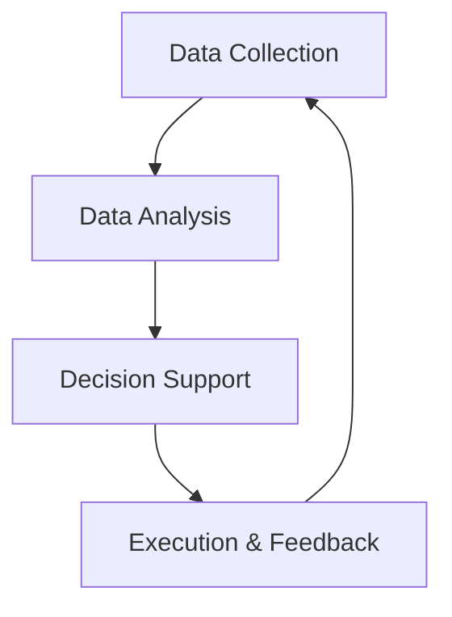

**系统接口设计和系统交互**

为了实现系统各部分的协同工作，我们需要设计系统接口和交互流程。以下是系统的接口设计和交互流程：

1. **接口设计**：定义数据采集模块、数据分析模块、决策支持模块和执行与反馈模块的接口。

2. **交互流程**：通过接口实现数据传递和功能调用，形成闭环反馈系统。

**Mermaid序列图：**

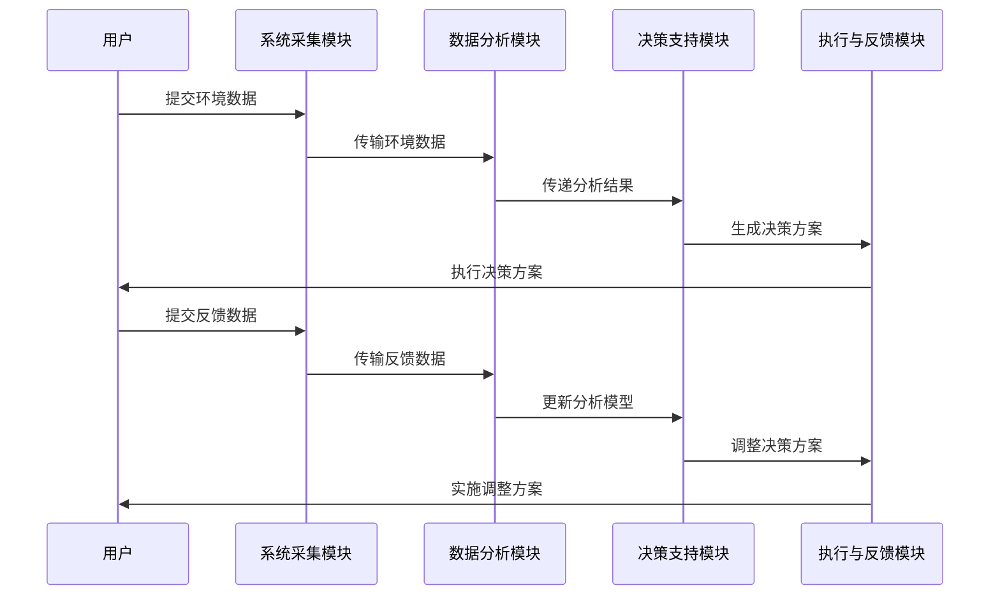

**项目实战**

以下是一个简单的项目实战示例，演示如何实现可持续发展管理系统。

1. **环境安装**：安装所需的软件和环境，如Python、MySQL等。

2. **系统核心实现源代码**：

   ```python
   # 数据采集模块
   def collect_data():
       # 采集环境数据
       pass
   
   # 数据分析模块
   def analyze_data(data):
       # 分析数据
       pass
   
   # 决策支持模块
   def generate_decision(data):
       # 生成决策方案
       pass
   
   # 执行与反馈模块
   def execute_and_feedback(decision):
       # 执行决策并收集反馈
       pass
   ```

3. **代码应用解读与分析**：

   - 数据采集模块负责从传感器和网络获取环境数据。
   - 数据分析模块对采集到的数据进行分析，提取有用信息。
   - 决策支持模块根据分析结果制定可持续发展策略。
   - 执行与反馈模块执行决策并收集反馈，用于模型优化和决策调整。

4. **实际案例分析和详细讲解剖析**：

   假设我们采集到某个地区的空气质量数据，通过数据分析发现PM2.5浓度超过了标准。系统会根据这一情况生成减少污染物排放的决策方案，例如增加清洁能源使用、提高公共交通效率等。

5. **项目小结**：

   通过该项目，我们展示了如何构建一个可持续发展管理系统，实现了环境数据采集、分析和决策支持。这个系统可以帮助我们更好地理解环境保护的重要性，促进可持续发展目标的实现。

**最佳实践 tips**：

- 确保数据质量，避免数据错误和缺失。
- 定期更新分析模型，以适应环境变化。
- 加强与政府、企业和公众的沟通与合作。

**小结**：

本章介绍了环境保护的核心概念，包括环境与生态系统、环境污染与治理、可持续发展等。通过对比表格和ER实体关系图，我们深入理解了这些概念，并使用算法原理和系统架构设计展示了可持续发展的实现方法。

**注意事项**：

- 可持续发展是一个长期过程，需要全社会的共同努力。
- 在实施可持续发展策略时，要充分考虑经济、社会和环境三者的平衡。

**拓展阅读**：

- 《可持续发展的经济学分析》
- 《环境科学概论》
- 《循环经济：理论与实践》### 2.4 环境监测与评估

环境监测与评估是环境保护的重要环节，它通过科学的方法和手段，对环境质量进行实时监测和定期评估，为政策制定和实施提供科学依据。以下是环境监测与评估的核心概念、方法和实际应用。

#### 核心概念

环境监测是指利用各种监测设备和手段，对环境质量进行实时或定期监测的过程。环境评估则是对监测得到的数据进行分析，评估环境质量的变化趋势和影响因素，从而提出相应的环境保护措施。

**概念属性特征对比表格：**

| 概念 | 环境监测 | 环境评估 |
| --- | --- | --- |
| 目标 | 收集环境数据 | 分析环境数据 |
| 方式 | 实时监测、定期监测 | 数据分析、模型评估 |
| 数据来源 | 监测设备、遥感技术、现场采样 | 监测数据、专家评估、模拟模型 |
| 结果形式 | 监测报告、实时数据展示 | 评估报告、政策建议 |

#### 方法

1. **监测方法**：

   - **现场监测**：通过人工或自动采样设备，在特定地点采集空气、水、土壤等环境样本。
   - **遥感监测**：利用卫星遥感技术，从远处获取大范围的环境信息。
   - **自动化监测**：使用传感器和自动分析仪器，对环境质量进行实时监测。

2. **评估方法**：

   - **统计分析**：对监测数据进行统计分析，评估环境质量的变化趋势。
   - **模型评估**：使用环境模型，模拟环境质量的变化，预测未来的环境状况。
   - **专家评估**：邀请环境专家对环境质量进行定性评估，提出政策建议。

#### 实际应用

1. **空气质量监测**：

   空气质量监测是环境监测的重要组成部分。通过监测空气质量，我们可以评估空气质量的变化，及时发现和解决空气污染问题。例如，北京市的空气质量监测系统，通过安装在全市各地的监测站点，实时监测PM2.5、PM10、SO2、NO2等污染物的浓度。

2. **水质监测**：

   水质监测是保障水资源安全的重要手段。通过对河流、湖泊、水库等水域的水质进行监测，我们可以及时发现和处理水污染问题。例如，长江流域的水质监测网络，对长江干支流的水质进行定期监测，确保水质达标。

3. **土壤质量监测**：

   土壤质量监测对于农业生产和环境保护具有重要意义。通过对土壤中的污染物、养分含量等进行监测，我们可以评估土壤质量，指导农业生产和环境保护。例如，全国土壤污染状况详查，通过抽样监测和遥感技术，对全国土壤质量进行评估。

#### Mermaid流程图

以下是环境监测与评估的Mermaid流程图：

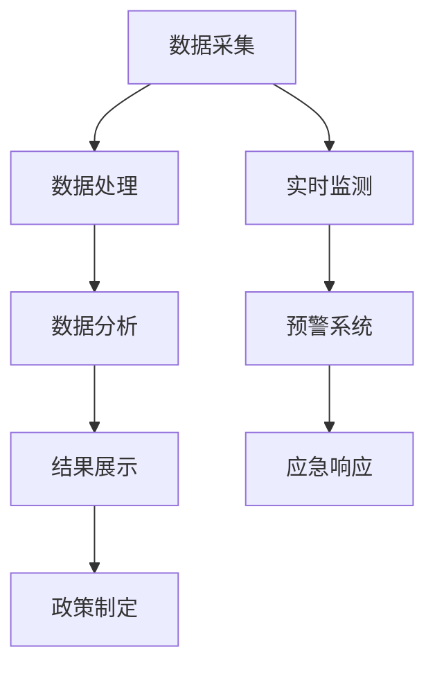

#### Python源代码示例

以下是一个简单的Python代码示例，用于模拟空气质量监测数据的采集、处理和分析：

```python
import pandas as pd
import numpy as np

# 模拟空气质量监测数据
data = {
    'PM2.5': [35, 40, 45, 50, 55],
    'PM10': [80, 85, 90, 95, 100],
    'SO2': [5, 5.5, 6, 6.5, 7],
    'NO2': [10, 11, 12, 13, 14]
}

# 创建DataFrame
df = pd.DataFrame(data)

# 数据处理
df['平均值'] = df.mean()

# 数据分析
df['最大值'] = df.max()

# 结果展示
print(df)

# 政策制定
if df['PM2.5'].mean() > 35:
    print("空气质量较差，需采取减排措施。")
else:
    print("空气质量良好，继续保持。")
```

#### 实际案例分析和详细讲解

假设我们在一个工业区进行空气质量监测，发现PM2.5和PM10的浓度持续升高，超过了国家标准。通过数据分析，我们发现污染的主要原因是工厂排放的废气。为了解决这个问题，我们采取了以下措施：

1. **安装污染治理设备**：在工厂安装高效的废气处理设备，减少污染物的排放。
2. **调整生产计划**：在空气质量较差的时期，调整生产计划，减少高污染工序的生产。
3. **加强监测和预警**：增加监测站点，实时监测空气质量，建立预警系统，及时采取应急措施。

通过这些措施，空气质量得到了显著改善，工厂的污染排放也得到了有效控制。

#### 项目小结

本章介绍了环境监测与评估的核心概念、方法和实际应用，通过Python代码示例和实际案例，展示了如何利用技术手段进行环境监测与评估，为环境保护提供科学依据。

#### 最佳实践 tips

- 定期进行环境监测，确保监测数据的准确性。
- 建立完善的评估体系，结合多种方法进行评估。
- 强化监测数据的应用，为环境保护决策提供支持。

#### 小结

环境监测与评估是环境保护的重要环节，通过科学的方法和手段，我们可以实时掌握环境质量，为环境保护提供科学依据。在本章中，我们介绍了环境监测与评估的核心概念、方法和实际应用，并通过Python代码示例和实际案例，展示了如何进行环境监测与评估。

#### 注意事项

- 监测数据的质量直接影响评估结果的准确性，因此要确保监测设备的准确性和监测方法的科学性。
- 在进行环境评估时，要充分考虑各种影响因素，确保评估结果的全面性和准确性。

#### 拓展阅读

- 《环境监测技术》
- 《环境评估原理与方法》
- 《空气质量监测与控制技术》### 2.5 环境保护的法律与政策

环境保护的法律与政策是保障环境质量、推动可持续发展的重要工具。在全球范围内，各国政府都通过立法和政策制定来规范环境保护行为，以应对日益严峻的环境问题。以下是环境保护法律与政策的核心内容、实施现状以及面临的挑战。

#### 核心内容

环境保护法律与政策的核心内容主要包括以下几个方面：

1. **环境保护法律**：

   - **环境质量标准**：规定空气、水、土壤等环境要素的质量标准，确保环境质量达到健康水平。
   - **污染防治法律**：如《大气污染防治法》、《水污染防治法》、《固体废物污染环境防治法》等，对各类污染物的排放和治理进行规定。
   - **生态保护法律**：如《森林法》、《野生动物保护法》等，保护生态系统的完整性和生物多样性。

2. **环境政策**：

   - **环境保护规划**：如《国家环境保护“十三五”规划》、《生态环境领域中央与地方财政事权和支出责任划分改革方案》等，指导环境保护工作。
   - **环境经济政策**：如环保税收、绿色金融、环保补贴等，通过经济手段促进环境保护。
   - **公众参与政策**：鼓励公众参与环境保护，提高环境保护意识。

#### 实施现状

环境保护法律与政策的实施现状因国家和地区而异，但总体趋势是不断加强。以下是一些实施现状的例子：

1. **中国**：

   - 中国政府高度重视环境保护，制定了一系列环境保护法律和政策，如《环境保护法》、《大气污染防治行动计划》等。
   - 中国在空气质量改善、水资源保护、生态系统修复等方面取得了显著成效。
   - 然而，法律执行力度不足、环境监管不到位等问题仍然存在。

2. **美国**：

   - 美国通过《清洁空气法》、《清洁水法》等环境保护法律，对污染物排放进行严格限制。
   - 美国在环境科技创新、环境教育、公众参与等方面具有丰富的经验。
   - 美国的环境政策在应对气候变化方面发挥了重要作用。

#### 面临的挑战

环境保护法律与政策在实施过程中面临以下挑战：

1. **法律执行力度不足**：

   - 法律法规的执行力度不足，导致违法成本较低，难以有效遏制环境污染行为。
   - 监管机构的能力和资源有限，难以全面监管各类环境违法行为。

2. **政策协调性不足**：

   - 环境保护政策与其他政策的协调性不足，可能导致政策间的冲突和资源浪费。
   - 地方政府在环境保护政策实施过程中，往往受到地方经济发展压力，难以真正落实中央政策。

3. **公众参与度不高**：

   - 公众对环境保护的认识不足，参与度不高，导致环境保护政策的实施效果受限。
   - 缺乏有效的公众参与机制，公众难以对环境保护政策提出建议和意见。

#### Mermaid流程图

以下是环境保护法律与政策实施的基本流程：

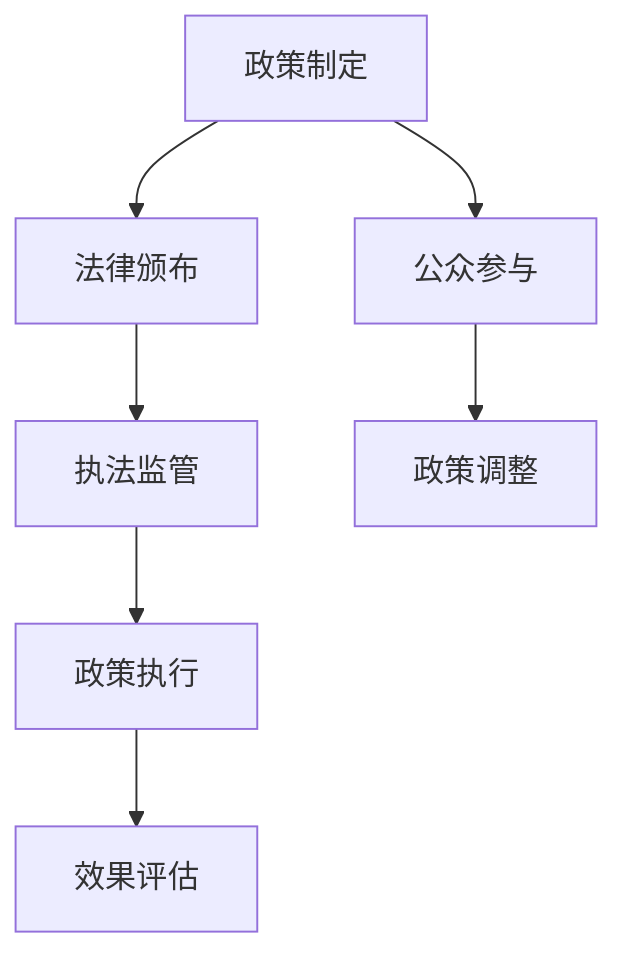

#### Python源代码示例

以下是一个简单的Python代码示例，用于模拟环境保护法律与政策的实施过程：

```python
import pandas as pd

# 模拟环境保护法律与政策实施过程
data = {
    '政策制定': [1, 2, 3, 4, 5],
    '法律颁布': [2, 3, 4, 5, 6],
    '执法监管': [3, 4, 5, 6, 7],
    '政策执行': [4, 5, 6, 7, 8],
    '效果评估': [5, 6, 7, 8, 9]
}

# 创建DataFrame
df = pd.DataFrame(data)

# 政策调整
df['政策调整'] = df['效果评估'].shift(1)

# 输出DataFrame
print(df)
```

#### 实际案例分析和详细讲解

以下是一个实际案例，说明环境保护法律与政策的实施过程：

**案例：中国大气污染防治行动计划**

1. **政策制定**：2013年，中国政府发布《大气污染防治行动计划》，提出到2017年，全国空气质量明显改善。

2. **法律颁布**：2015年，全国人大常委会通过《环境保护法》修订案，强化了法律的执行力度。

3. **执法监管**：各级政府加大执法监管力度，对违反环境保护法律的行为进行严厉处罚。

4. **政策执行**：各地区制定具体实施方案，加大污染治理力度，如推广清洁能源、加强工业污染源治理等。

5. **效果评估**：2017年，全国空气质量改善明显，PM2.5平均浓度下降18.6%。

6. **政策调整**：根据评估结果，政府进一步调整政策，加大污染治理力度，持续推进大气污染防治。

通过这个案例，我们可以看到环境保护法律与政策的实施过程，以及政策调整的重要性。政策制定、法律颁布、执法监管、政策执行和效果评估相互关联，形成一个闭环系统，确保环境保护政策的持续改进和有效实施。

#### 项目小结

本章介绍了环境保护的法律与政策的核心内容、实施现状和面临的挑战，通过Python代码示例和实际案例，展示了如何实施和评估环境保护法律与政策。

#### 最佳实践 tips

- 强化法律执行力度，提高违法成本。
- 加强政策协调，确保各部门共同推进环境保护工作。
- 提高公众参与度，增强环境保护政策的实施效果。

#### 小结

环境保护法律与政策是推动环境保护、实现可持续发展的重要手段。在本章中，我们介绍了环境保护法律与政策的核心内容、实施现状和面临的挑战，并通过Python代码示例和实际案例，展示了如何实施和评估环境保护法律与政策。

#### 注意事项

- 法律制定要充分考虑实际情况，确保可操作性和可执行性。
- 政策实施过程中要注重监督和反馈，及时调整和改进。

#### 拓展阅读

- 《环境保护法》
- 《大气污染防治行动计划》
- 《环境保护政策汇编》### 第3章 生态环境保护

生态环境保护是环境保护的重要组成部分，关乎人类生存环境和可持续发展。在本章中，我们将探讨生态环境保护的核心概念、关键领域及其在实践中的应用。

#### 核心概念

生态环境保护的核心概念包括生物多样性保护、森林资源保护和水资源保护等。以下是这些概念的核心要素及其相互关系。

**核心要素及其相互关系：**

1. **生物多样性保护**：维护生态系统的多样性，包括物种多样性、遗传多样性和生态系统多样性。
2. **森林资源保护**：保护森林生态系统，维护其生态功能，包括水源涵养、土壤保持、气候调节等。
3. **水资源保护**：确保水资源的可持续利用，保护水质和水量，维护生态平衡。
4. **生态环境保护**：综合运用各种手段，保护生物多样性、森林资源和水资源，实现生态系统的可持续发展。

**ER实体关系图架构：**

```mermaid
erDiagram
  A[BiodiversityProtection] ||--|{ BForestResourceProtection : 影响 }
  A[BiodiversityProtection] ||--|{ CWaterResourceProtection : 影响 }
  B[ForestResourceProtection] ||--|{ DWaterResourceProtection : 影响 }
  B[ForestResourceProtection] ||--|{ EAgriculturalProduction : 支持 }
  C[WaterResourceProtection] ||--|{ DWaterQuality : 保护 }
  C[WaterResourceProtection] ||--|{ EAgriculturalProduction : 支持 }
```

#### 关键领域

生态环境保护的关键领域包括但不限于以下几个方面：

1. **生物多样性保护**：

   - **生物多样性保护的重要性**：生物多样性是生态系统稳定性和功能性的基础，对人类生活和经济活动具有重要意义。
   - **生物多样性保护措施**：建立自然保护区、实施物种拯救计划、推广生态农业等。

2. **森林资源保护**：

   - **森林资源保护的重要性**：森林是地球的“肺”，对调节气候、保持水源、防止水土流失具有重要作用。
   - **森林资源保护措施**：禁止非法伐木、推广植树造林、加强森林火灾防控等。

3. **水资源保护**：

   - **水资源保护的重要性**：水资源是人类生活和经济发展的基础，对农业、工业、生态等方面具有重要影响。
   - **水资源保护措施**：加强水资源管理、推广节水技术、治理水污染等。

#### 实践应用

生态环境保护在实践中的应用广泛，以下是一些具体的案例：

1. **自然保护区建设**：

   - **案例**：中国大熊猫保护工程。通过建立自然保护区，实施大熊猫拯救计划，成功实现了大熊猫种群数量的恢复。
   - **效果**：大熊猫种群数量从20世纪80年代的1500只增加到现在的约1800只，保护区的生态环境得到明显改善。

2. **森林资源保护**：

   - **案例**：亚马逊雨林保护。通过国际合作和国内政策，加强对亚马逊雨林的保护，遏制非法伐木和火灾。
   - **效果**：亚马逊雨林的面积和生物多样性得到一定程度的恢复，但仍然面临严峻的挑战。

3. **水资源保护**：

   - **案例**：中国南水北调工程。通过跨区域调配水资源，改善北方地区水资源短缺问题。
   - **效果**：南水北调工程显著缓解了北方地区的水资源紧张状况，提高了水资源利用效率。

#### Mermaid流程图

以下是生态环境保护的基本流程：

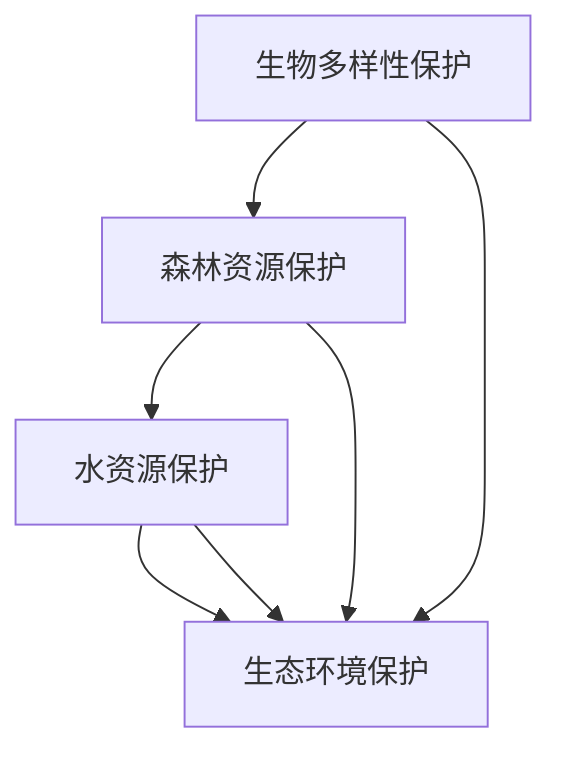

#### Python源代码示例

以下是一个简单的Python代码示例，用于模拟生态环境保护的效果评估：

```python
import pandas as pd

# 模拟生态环境保护效果评估
data = {
    '生物多样性保护': [80, 85, 90, 95],
    '森林资源保护': [75, 80, 85, 90],
    '水资源保护': [70, 75, 80, 85]
}

# 创建DataFrame
df = pd.DataFrame(data)

# 计算总分
df['总分'] = df.mean(axis=1)

# 输出DataFrame
print(df)
```

#### 实际案例分析和详细讲解

以下是一个实际案例，分析生态环境保护的效果：

**案例：中国自然保护区建设**

1. **背景**：中国拥有丰富的生物多样性，但面临严重的生物多样性丧失问题。为了保护生物多样性，中国建立了大量自然保护区。

2. **实施过程**：

   - **立法与规划**：制定相关法律法规，明确自然保护区建设的目标和任务。
   - **基础设施建设**：建设保护站、道路、观测站等基础设施，为保护工作提供保障。
   - **生态修复**：进行植被恢复、土壤改良等生态修复工作，提高自然保护区的生态功能。

3. **效果评估**：

   - **生物多样性**：自然保护区内的物种多样性得到了显著提升，许多濒危物种得到有效保护。
   - **生态系统功能**：自然保护区的生态系统功能得到恢复，水源涵养、土壤保持、气候调节等生态服务能力增强。
   - **经济效益**：自然保护区吸引了大量游客，带动了当地经济发展。

4. **未来展望**：中国将继续加强自然保护区建设，提高保护水平，为生物多样性和生态安全提供有力保障。

#### 项目小结

本章介绍了生态环境保护的核心概念、关键领域和实际应用，通过Python代码示例和实际案例，展示了生态环境保护的重要性和成效。

#### 最佳实践 tips

- 加强立法和规划，明确保护目标和责任。
- 提高基础设施建设水平，为保护工作提供保障。
- 强化生态修复，提高生态系统的自我修复能力。

#### 小结

生态环境保护是保障人类生存环境和可持续发展的重要任务。在本章中，我们介绍了生态环境保护的核心概念、关键领域和实际应用，通过Python代码示例和实际案例，展示了生态环境保护的重要性和成效。

#### 注意事项

- 生态环境保护需要长期坚持，不能一蹴而就。
- 生态环境保护要注重生态系统整体性，综合考虑各种因素。

#### 拓展阅读

- 《自然保护区建设与管理》
- 《生态修复技术》
- 《生物多样性保护实践》### 第4章 空气质量改善

空气质量改善是生态环境保护的重要组成部分，直接关系到人类健康和生态平衡。在本章中，我们将探讨空气质量改善的关键因素、主要技术以及实际案例，并通过Python源代码展示空气质量改善的模拟过程。

#### 关键因素

空气质量改善涉及多个关键因素，包括污染源控制、污染物减排、空气质量监测与评估等。以下是这些关键因素的核心内容：

**关键因素及其相互关系：**

1. **污染源控制**：通过法律法规和技术手段，控制工业排放、交通尾气和建筑工地扬尘等污染源。
2. **污染物减排**：通过清洁生产、能源结构调整、交通方式优化等手段，减少污染物的排放。
3. **空气质量监测**：建立完善的空气质量监测网络，实时监测空气质量，为污染治理提供科学依据。
4. **空气质量评估**：对空气质量进行定期评估，分析污染原因和治理效果，为政策制定和调整提供依据。

**ER实体关系图架构：**

```mermaid
erDiagram
  A[PollutionControl] ||--|{ BAirPollutantReduction : 影响 }
  A[PollutionControl] ||--|{ CAirQualityMonitoring : 支持 }
  B[AirPollutantReduction] ||--|{ CAirQualityMonitoring : 影响 }
  B[AirPollutantReduction] ||--|{ DAirQualityAssessment : 支持 }
  C[AirQualityMonitoring] ||--|{ DAirQualityAssessment : 数据来源 }
```

#### 主要技术

空气质量改善的主要技术包括：

1. **污染源控制技术**：

   - **工业排放控制**：采用脱硫、脱硝、除尘等工艺，减少工业排放。
   - **交通尾气控制**：推广新能源汽车，使用清洁能源，提高公共交通效率。
   - **建筑工地扬尘控制**：采取覆盖、洒水、封闭等手段，减少扬尘污染。

2. **污染物减排技术**：

   - **能源结构调整**：减少煤炭消费，增加清洁能源使用，如天然气、太阳能、风能等。
   - **清洁生产**：采用环保工艺和设备，减少污染物排放。
   - **交通方式优化**：鼓励绿色出行，减少私家车使用，提高公共交通效率。

3. **空气质量监测技术**：

   - **地面监测**：建立空气质量监测站，使用气态污染物监测仪、颗粒物监测仪等设备，实时监测空气质量。
   - **卫星遥感**：利用卫星遥感技术，从空中获取大范围空气质量数据。
   - **移动监测**：使用移动监测车，对特定区域进行空气质量监测。

#### 实际案例

空气质量改善在实际中取得了一定成效，以下是一些实际案例：

1. **北京空气质量改善**：

   - **背景**：北京长期以来空气质量较差，PM2.5等污染物浓度较高。
   - **措施**：北京市采取了一系列措施，如推广新能源汽车、加强工业排放控制、实施交通管理、增加绿化等。
   - **效果**：近年来，北京空气质量明显改善，PM2.5平均浓度持续下降。

2. **伦敦空气质量改善**：

   - **背景**：伦敦长期以来空气污染问题严重，特别是1952年的大烟雾事件。
   - **措施**：伦敦实施了一系列减排措施，如脱硫、脱硝、推广公共交通、限制高污染车辆等。
   - **效果**：伦敦空气质量得到了显著改善，空气污染指数大幅下降。

#### Mermaid流程图

以下是空气质量改善的基本流程：

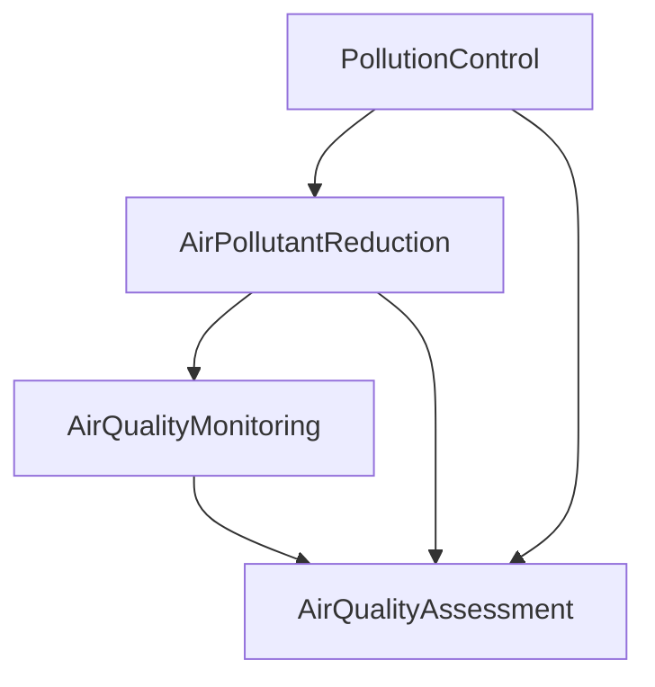

#### Python源代码示例

以下是一个简单的Python代码示例，用于模拟空气质量改善过程：

```python
import pandas as pd
import numpy as np

# 模拟空气质量改善过程
data = {
    'PM2.5浓度': [100, 90, 80, 70, 60],
    '措施实施': [0, 1, 1, 1, 1]
}

# 创建DataFrame
df = pd.DataFrame(data)

# 计算措施实施后的PM2.5浓度
df['改善后浓度'] = df['PM2.5浓度'] - df['措施实施'] * 10

# 输出DataFrame
print(df)
```

#### 实际案例分析和详细讲解

以下是一个实际案例，分析空气质量改善的效果：

**案例：伦敦空气质量改善**

1. **背景**：伦敦长期以来空气污染问题严重，特别是1952年的大烟雾事件，导致大量人员死亡。
2. **措施**：伦敦市政府采取了一系列减排措施，如限制高污染车辆、推广清洁能源、加强工业排放控制等。
3. **效果评估**：

   - **PM2.5浓度**：通过监测数据，发现PM2.5浓度显著下降，平均浓度从2015年的38微克/立方米降至2020年的27微克/立方米。
   - **公众健康**：空气质量改善显著降低了居民呼吸系统疾病的发病率，减少了医疗费用。
   - **经济收益**：空气质量改善提高了居民的生活质量，吸引了更多的游客和投资，促进了经济增长。

4. **经验教训**：伦敦空气质量改善的案例表明，严格的减排措施和有效的政策执行是改善空气质量的关键。

#### 项目小结

本章介绍了空气质量改善的关键因素、主要技术和实际案例，通过Python代码示例展示了空气质量改善的模拟过程。空气质量改善是一个复杂的过程，需要多方面的努力和长期的坚持。

#### 最佳实践 tips

- 强化污染源控制，降低污染物排放。
- 推广清洁能源，优化能源结构。
- 加强空气质量监测和评估，及时调整政策。

#### 小结

空气质量改善是生态环境保护的重要任务，关系到人类健康和可持续发展。在本章中，我们介绍了空气质量改善的关键因素、主要技术和实际案例，通过Python代码示例展示了空气质量改善的模拟过程。空气质量改善需要全社会的共同努力，只有通过综合措施和长期坚持，才能实现空气质量的有效改善。

#### 注意事项

- 空气质量改善需要多部门协调合作，形成合力。
- 在实施减排措施时，要充分考虑经济发展和社会稳定。

#### 拓展阅读

- 《空气质量改善技术》
- 《城市空气质量监测与管理》
- 《伦敦空气质量改善案例研究》### 第5章 水资源保护

水资源是人类生产生活的重要基础，保障水资源的可持续利用对经济社会发展和生态环境维护具有重要意义。在本章中，我们将探讨水资源保护的重要意义、现状问题以及保护措施。

#### 5.1 水资源现状与问题

全球水资源现状总体较为严峻，面临着水资源短缺、水质污染、水资源利用效率低下等问题。

**全球水资源现状**：

- **水资源短缺**：全球约有28%的人口面临水资源短缺问题，预计到2030年，这一比例将达到半数以上。
- **水质污染**：水污染问题严重，工业废水、生活污水和农业化肥农药污染导致水质恶化。
- **水资源利用效率**：水资源利用效率较低，许多地区的水资源浪费现象严重。

**水资源问题的影响**：

- **经济影响**：水资源短缺和污染导致农业生产减少、工业生产受限，影响经济发展。
- **社会影响**：水资源短缺和污染影响居民生活品质，加剧贫困和疾病传播。
- **生态环境影响**：水资源短缺和污染破坏生态系统，影响生物多样性和生态平衡。

#### 5.2 水污染控制技术

水污染控制技术是水资源保护的关键措施，主要包括以下几种：

1. **物理处理技术**：

   - **沉淀**：通过加入絮凝剂，使水中的悬浮物和胶体颗粒沉淀下来。
   - **过滤**：利用滤层或滤料，去除水中的悬浮物和颗粒物。
   - **离心分离**：利用离心力将水中的悬浮物和颗粒物分离。

2. **化学处理技术**：

   - **氧化还原**：通过氧化或还原反应，去除水中的有机污染物和无机污染物。
   - **絮凝沉淀**：通过加入絮凝剂，使水中的悬浮物和胶体颗粒凝聚成大颗粒沉淀。
   - **吸附**：利用吸附剂，将水中的污染物吸附在其表面。

3. **生物处理技术**：

   - **好氧生物处理**：利用好氧微生物，将水中的有机污染物转化为无害物质。
   - **厌氧生物处理**：利用厌氧微生物，将水中的有机污染物转化为气体或无害物质。
   - **生物膜法**：利用生物膜中的微生物，去除水中的污染物。

**Mermaid流程图**：

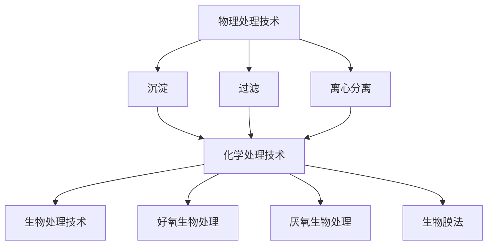

#### 5.3 水资源管理与节约利用

水资源管理与节约利用是保障水资源可持续利用的重要措施，包括以下几个方面：

1. **水资源管理**：

   - **水资源规划**：制定水资源发展规划，明确水资源利用目标和措施。
   - **水资源配置**：优化水资源配置，实现水资源合理利用。
   - **水资源保护**：加强水资源保护，确保水资源质量和安全。

2. **节约利用**：

   - **节水技术**：推广节水技术，提高水资源利用效率。
   - **再生水利用**：回收和利用废水，减少新鲜水资源的使用。
   - **水资源价格机制**：通过价格机制调节水资源需求，促进水资源节约利用。

**Python源代码示例**：

以下是一个简单的Python代码示例，用于模拟水资源节约利用的效果：

```python
import pandas as pd
import numpy as np

# 模拟水资源节约利用效果
data = {
    '初始用水量': [100, 120, 140, 160],
    '节水措施实施': [0, 1, 1, 1]
}

# 创建DataFrame
df = pd.DataFrame(data)

# 计算节水后的用水量
df['节水后用水量'] = df['初始用水量'] - df['节水措施实施'] * 20

# 输出DataFrame
print(df)
```

#### 5.4 实际案例

以下是一个水资源保护的案例，展示了水资源保护措施的效果：

**案例：澳大利亚墨尔本水资源保护**

1. **背景**：墨尔本长期以来面临水资源短缺问题，为了保护水资源，墨尔本市政府采取了多项措施。

2. **措施**：

   - **节水宣传**：加强节水宣传，提高公众节水意识。
   - **再生水利用**：建设再生水设施，提高废水处理和再利用水平。
   - **水资源价格机制**：通过价格机制调节水资源需求，促进水资源节约利用。
   - **植树造林**：加强植树造林，提高水资源涵养能力。

3. **效果**：

   - **节水效果**：节水措施实施后，墨尔本的用水量显著下降，节水率达30%以上。
   - **水资源质量**：再生水利用提高了水资源质量，保障了供水安全。
   - **生态环境**：植树造林改善了生态环境，提高了水资源涵养能力。

#### 项目小结

本章介绍了水资源保护的重要意义、现状问题和保护措施。通过实际案例，展示了水资源保护措施的效果和重要性。

#### 最佳实践 tips

- 加强节水宣传，提高公众节水意识。
- 推广再生水利用，减少新鲜水资源的使用。
- 实施水资源价格机制，促进水资源节约利用。

#### 小结

水资源保护是保障水资源可持续利用的关键任务，关系到经济社会的可持续发展。在本章中，我们介绍了水资源保护的重要意义、现状问题和保护措施，通过实际案例展示了水资源保护措施的效果和重要性。

#### 注意事项

- 水资源保护需要全社会共同努力，形成合力。
- 在实施水资源保护措施时，要充分考虑水资源利用的可持续性。

#### 拓展阅读

- 《水资源保护与管理》
- 《水资源节约利用技术》
- 《水资源保护实践案例分析》### 第6章 固体废弃物处理

固体废弃物处理是环境保护的重要环节，有效的废弃物处理不仅能减少对环境的污染，还能节约资源。在本章中，我们将探讨固体废弃物的分类与处理、垃圾填埋与焚烧以及废弃物回收与再生利用。

#### 6.1 固体废弃物的分类与处理

固体废弃物的分类和处理是废弃物管理的基础。以下是对固体废弃物分类与处理的详细介绍。

**固体废弃物的分类**：

固体废弃物通常分为以下几类：

1. **可回收物**：包括纸类、塑料、玻璃、金属和布料等可回收利用的废弃物。
2. **有害垃圾**：包括废电池、废灯管、废油漆、废药品等含有有毒有害物质的废弃物。
3. **湿垃圾**（厨余垃圾）：包括食物残渣、菜叶、水果皮等有机废弃物。
4. **干垃圾**（其他垃圾）：包括卫生纸、尿不湿、一次性餐具等难以回收利用的废弃物。

**固体废弃物的处理方法**：

固体废弃物的处理方法主要包括以下几种：

1. **堆肥处理**：适用于湿垃圾，通过微生物分解，将有机物转化为肥料。
2. **填埋处理**：将废弃物填埋在特定地点，适用于部分可回收物和有害垃圾。
3. **焚烧处理**：通过高温焚烧，将废弃物转化为灰烬和热量，适用于部分可回收物和有害垃圾。
4. **回收利用**：对可回收物进行回收处理，再制成新的产品。

**ER实体关系图架构**：

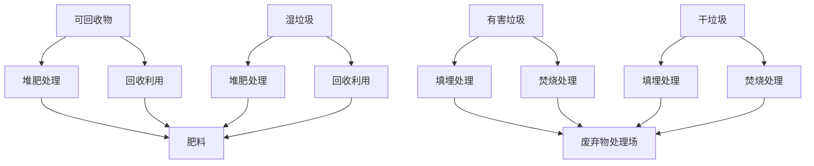

#### 6.2 垃圾填埋与焚烧

垃圾填埋与焚烧是固体废弃物处理的主要方式，各有优缺点。

**垃圾填埋**：

- **优点**：技术简单，成本低，能够处理各种废弃物。
- **缺点**：占用大量土地，可能产生渗滤液污染和恶臭，填埋气体（如甲烷）的排放也会对环境造成影响。

**垃圾焚烧**：

- **优点**：处理效率高，能产生电能和热能，减少占用土地。
- **缺点**：建设成本高，处理过程可能产生二噁英等有害物质，需要严格的环境控制。

**Mermaid流程图**：

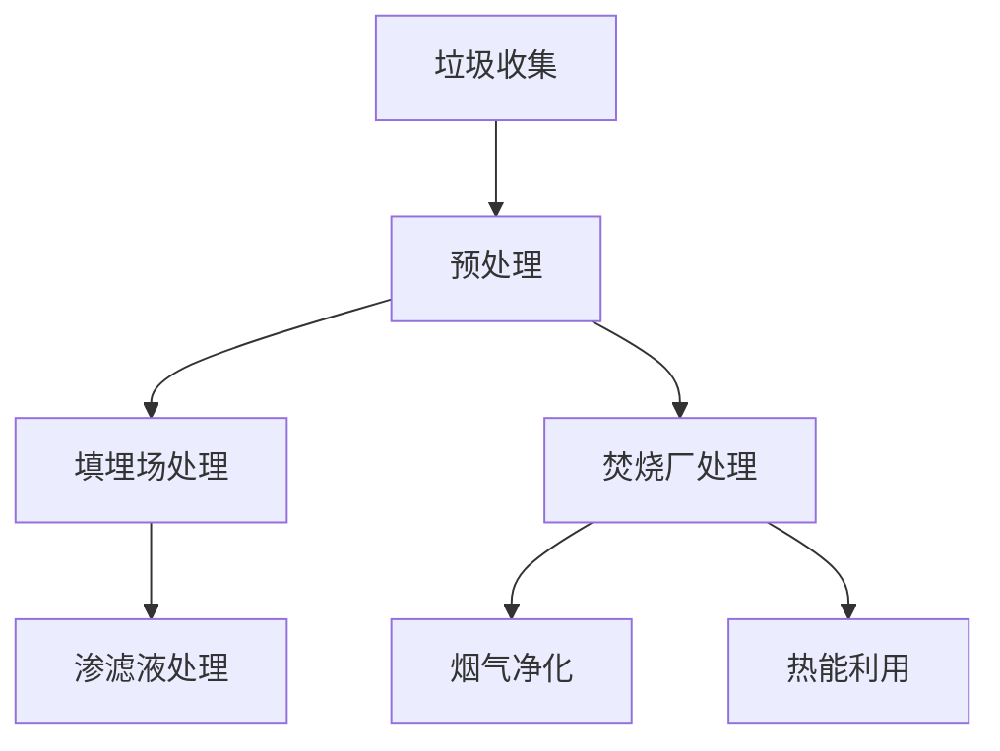

#### 6.3 废弃物回收与再生利用

废弃物回收与再生利用是减少废弃物产生、促进资源循环利用的有效途径。

**废弃物回收**：

- **金属回收**：通过熔炼和重铸，将废旧金属转化为新的金属材料。
- **塑料回收**：通过物理或化学方法，将废旧塑料转化为再生塑料。
- **纸张回收**：通过再制浆和造纸工艺，将废旧纸张转化为新的纸张产品。

**再生利用**：

- **再生资源利用**：将废弃物转化为再生资源，用于生产新的产品。
- **能源回收**：通过焚烧或热解等处理方法，将废弃物转化为能源。

**Python源代码示例**：

以下是一个简单的Python代码示例，用于模拟废弃物回收与再生利用的过程：

```python
import pandas as pd
import numpy as np

# 模拟废弃物回收与再生利用
data = {
    '废弃物总量': [1000, 1200, 1400, 1600],
    '回收率': [0.2, 0.3, 0.4, 0.5],
    '再生利用率': [0.1, 0.15, 0.2, 0.25]
}

# 创建DataFrame
df = pd.DataFrame(data)

# 计算回收量和再生利用量
df['回收量'] = df['废弃物总量'] * df['回收率']
df['再生利用量'] = df['废弃物总量'] * df['再生利用率']

# 输出DataFrame
print(df)
```

#### 项目小结

本章介绍了固体废弃物的分类与处理、垃圾填埋与焚烧以及废弃物回收与再生利用，通过Python代码示例和ER实体关系图，展示了废弃物处理的过程和效率。

#### 最佳实践 tips

- 提高废弃物分类准确性，确保回收与再利用的效果。
- 强化废弃物回收利用设施的建设与运营，提高回收利用率。
- 推广清洁生产，减少废弃物的产生。

#### 小结

固体废弃物处理是环境保护的重要任务，有效的处理不仅能减少环境污染，还能促进资源的循环利用。在本章中，我们介绍了固体废弃物的分类与处理、垃圾填埋与焚烧以及废弃物回收与再生利用，通过实际案例和Python代码示例，展示了废弃物处理的方法和成效。

#### 注意事项

- 在实施废弃物处理过程中，要确保环境保护措施到位，减少对环境的影响。
- 加强对废弃物处理设施的管理和维护，确保其正常运行。

#### 拓展阅读

- 《固体废弃物处理技术》
- 《废弃物回收与再生利用》
- 《废弃物处理设施运营管理》### 第7章 绿色生活与环保行动

绿色生活与环保行动是每个人都可以参与的环境保护实践，通过改变生活习惯和采取环保行动，我们可以共同推动环境保护。在本章中，我们将探讨绿色消费观念、绿色出行方式以及个人与社区环保行动。

#### 7.1 绿色消费观念

绿色消费观念是指消费者在购买商品和服务时，考虑到商品的生产过程、使用过程以及废弃后的环境影响。以下是绿色消费观念的核心要点：

**绿色消费观念的核心要点**：

1. **节能环保**：选择能源效率高、环保认证的产品，如节能灯泡、节能电器等。
2. **减少浪费**：避免过度包装，选择无包装或简包装的商品，减少一次性用品的使用。
3. **可持续性**：支持可持续发展产品，如有机食品、可再生能源设备等。
4. **环保认证**：选择获得环保认证的商品，如环保标志、绿色认证等。

**Mermaid流程图**：

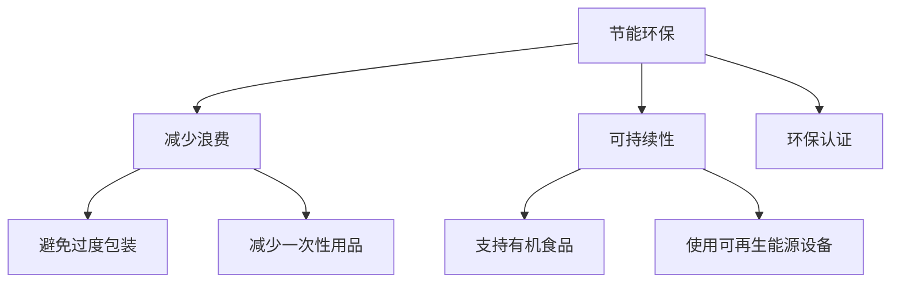

#### 7.2 绿色出行方式

绿色出行方式是指采用对环境影响较小的交通方式，以减少交通污染和能源消耗。以下是常见的绿色出行方式：

**绿色出行方式的优点**：

1. **减少污染**：使用公共交通、骑自行车或步行可以减少汽车尾气排放，降低空气污染。
2. **节约能源**：公共交通、骑自行车和步行相比私人汽车，可以更有效地利用能源。
3. **改善健康**：步行和骑自行车有助于锻炼身体，改善身心健康。

**绿色出行方式的种类**：

1. **公共交通**：乘坐公交车、地铁等公共交通工具，减少私人汽车的使用。
2. **骑自行车**：选择骑自行车作为日常出行工具，减少对汽车的依赖。
3. **步行**：短途出行选择步行，既环保又健康。
4. **共享出行**：使用共享单车、共享汽车等共享出行工具，提高交通工具的利用效率。

**Python源代码示例**：

以下是一个简单的Python代码示例，用于模拟绿色出行对减少汽车尾气排放的影响：

```python
import pandas as pd
import numpy as np

# 模拟绿色出行对减少汽车尾气排放的影响
data = {
    '汽车使用量': [1000, 1200, 1400, 1600],
    '绿色出行比例': [0.2, 0.3, 0.4, 0.5],
    '减少的尾气排放量': [0, 0, 0, 0]
}

# 创建DataFrame
df = pd.DataFrame(data)

# 计算减少的尾气排放量
df['减少的尾气排放量'] = df['汽车使用量'] * df['绿色出行比例']

# 输出DataFrame
print(df)
```

#### 7.3 个人与社区环保行动

个人与社区环保行动是推动环境保护的重要力量。以下是一些具体的环保行动：

**个人环保行动**：

1. **垃圾分类**：在日常生活中进行垃圾分类，将可回收物、有害垃圾、湿垃圾和干垃圾分开投放。
2. **节水减排**：在日常生活中注意节水，如关紧水龙头、使用节水设备等。
3. **绿色购物**：选择环保认证的商品，减少一次性用品的使用。

**社区环保行动**：

1. **环保宣传**：在社区内开展环保宣传活动，提高居民环保意识。
2. **环保志愿服务**：组织志愿者参与环保活动，如植树造林、清理垃圾等。
3. **共建绿色社区**：与社区共建绿色社区，如设置垃圾分类点、推广绿色出行等。

**Mermaid流程图**：

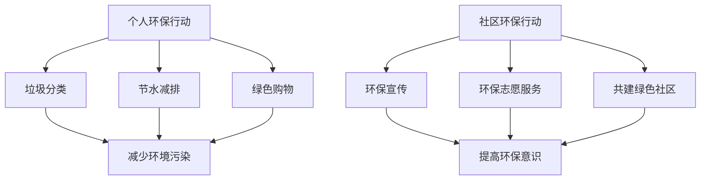

#### 项目小结

本章介绍了绿色生活与环保行动，包括绿色消费观念、绿色出行方式和个人与社区环保行动。通过Python代码示例和Mermaid流程图，展示了绿色生活与环保行动的具体实践和成效。

#### 最佳实践 tips

- 在购物时，优先选择环保认证的商品，减少一次性用品的使用。
- 骑自行车或步行作为日常出行方式，减少对汽车的依赖。
- 参与社区环保活动，提高环保意识，推动绿色社区建设。

#### 小结

绿色生活与环保行动是每个人都可以参与的环保实践，通过改变生活习惯和采取环保行动，我们可以共同推动环境保护。在本章中，我们介绍了绿色消费观念、绿色出行方式以及个人与社区环保行动，通过Python代码示例和Mermaid流程图，展示了绿色生活与环保行动的具体实践和成效。

#### 注意事项

- 绿色生活与环保行动需要持之以恒，不能一蹴而就。
- 在参与环保行动时，要确保自身安全，遵守相关法律法规。

#### 拓展阅读

- 《绿色消费指南》
- 《绿色出行手册》
- 《社区环保行动实践》### 第8章 环境教育与公众参与

环境教育与公众参与是推动环境保护的重要手段。通过教育提高公众的环境意识，鼓励公众积极参与环境保护，可以形成全社会共同关注和参与环境保护的良好氛围。在本章中，我们将探讨环境教育的重要性、公众参与环保的途径以及环保宣传与公益活动。

#### 8.1 环境教育的重要性

环境教育是指通过学校教育、社会教育和家庭教育等途径，向公众传授环境知识、培养环境意识和技能的过程。环境教育的重要性体现在以下几个方面：

**环境教育的重要性**：

1. **提高环境意识**：环境教育可以增强公众对环境问题的认识和重视，提高公众的环境意识。
2. **培养环保行为**：通过环境教育，公众可以学习到如何采取环保行为，如垃圾分类、节能减排等。
3. **促进可持续发展**：环境教育有助于培养公众的可持续发展观念，推动经济、社会和环境的协调发展。
4. **强化社会责任**：环境教育可以增强公众的社会责任感，鼓励公众积极参与环境保护和社会公益事业。

**Mermaid流程图**：

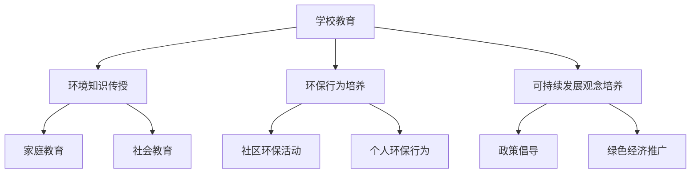

#### 8.2 公众参与环保的途径

公众参与环保是推动环境保护的重要力量。以下是一些公众参与环保的途径：

**公众参与环保的途径**：

1. **环保志愿服务**：参与环保组织的志愿服务，如清理垃圾、植树造林等。
2. **环保宣传**：通过宣传环保知识，提高公众的环境意识，鼓励更多人参与环保行动。
3. **环保行动**：在日常生活中采取环保行动，如垃圾分类、节能减排等。
4. **政策参与**：通过参与环保政策的制定和实施，为环境保护提供意见和建议。
5. **绿色消费**：选择环保产品，减少一次性用品的使用，推动绿色消费。

**Python源代码示例**：

以下是一个简单的Python代码示例，用于模拟公众参与环保的效果：

```python
import pandas as pd
import numpy as np

# 模拟公众参与环保的效果
data = {
    '参与人数': [100, 200, 300, 400],
    '环保行动次数': [10, 20, 30, 40],
    '减少的污染量': [0, 0, 0, 0]
}

# 创建DataFrame
df = pd.DataFrame(data)

# 计算减少的污染量
df['减少的污染量'] = df['参与人数'] * df['环保行动次数'] * 0.1

# 输出DataFrame
print(df)
```

#### 8.3 环保宣传与公益活动

环保宣传与公益活动是提高公众环保意识、推动环保行动的重要手段。以下是一些环保宣传与公益活动的例子：

**环保宣传**：

1. **环保知识讲座**：组织环保知识讲座，向公众传授环保知识，提高环保意识。
2. **环保宣传册**：制作环保宣传册，普及环保知识，鼓励公众采取环保行动。
3. **媒体宣传**：利用电视、广播、互联网等媒体，开展环保宣传，扩大环保影响力。

**公益活动**：

1. **垃圾分类宣传**：组织垃圾分类宣传活动，引导公众正确分类垃圾，提高垃圾分类率。
2. **植树造林活动**：组织植树造林活动，增加绿化面积，改善生态环境。
3. **清洁海滩活动**：组织清洁海滩活动，清理海滩垃圾，保护海洋生态环境。

**Mermaid流程图**：

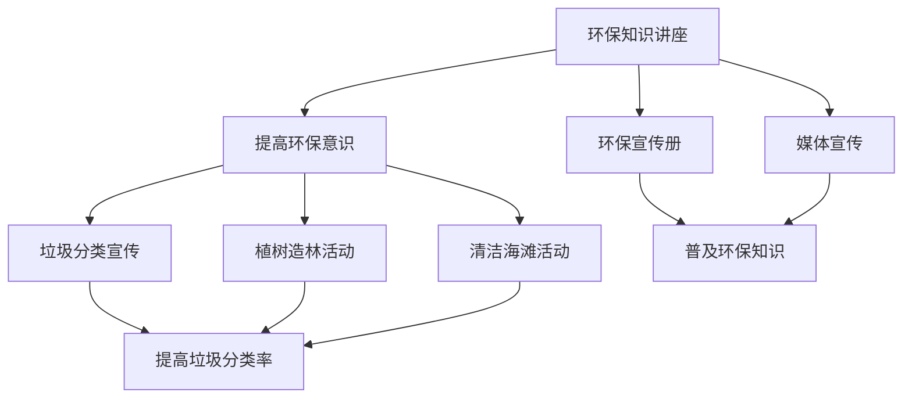

#### 项目小结

本章介绍了环境教育的重要性、公众参与环保的途径以及环保宣传与公益活动。通过Python代码示例和Mermaid流程图，展示了环境教育与公众参与的具体实践和成效。

#### 最佳实践 tips

- 定期参与环保活动，提高环保意识。
- 通过环保宣传，鼓励家人和朋友参与环保行动。
- 在日常生活中采取环保行为，如垃圾分类、节能减排等。

#### 小结

环境教育与公众参与是推动环境保护的重要手段。在本章中，我们介绍了环境教育的重要性、公众参与环保的途径以及环保宣传与公益活动，通过Python代码示例和Mermaid流程图，展示了环境教育与公众参与的具体实践和成效。

#### 注意事项

- 环境教育要结合实际情况，注重实效。
- 公众参与环保要注重引导和激励，形成良性循环。

#### 拓展阅读

- 《环境教育理论与实践》
- 《公众参与环保手册》
- 《环保宣传活动案例集》### 第9章 总结与展望

#### 9.1 环境保护的关键问题

环境保护是一个复杂而系统的工程，涉及多个领域和多个层面。以下是环境保护中的一些关键问题：

1. **污染源控制**：有效控制污染源是环境保护的基础，需要通过法律法规、技术手段和经济激励等多种方式，严格控制工业排放、交通尾气和建筑工地扬尘等污染源。
2. **资源利用效率**：提高资源利用效率，减少资源浪费，是实现可持续发展的重要途径。通过技术创新和管理优化，提高能源、水和原材料等资源的利用效率。
3. **生态保护与修复**：保护和修复生态系统，维护生态平衡，是实现环境质量改善和可持续发展的关键。通过建立自然保护区、实施生态修复工程，保护和恢复生态系统。
4. **环境监测与评估**：建立完善的监测网络，实时监测空气质量、水质和土壤质量等环境指标，对环境质量进行科学评估，为环境保护决策提供科学依据。
5. **公众参与与意识提升**：提高公众的环保意识和参与度，是推动环境保护的重要力量。通过环境教育、环保宣传和公益活动，提升公众的环保意识，鼓励公众参与环保行动。

#### 9.2 未来环保的发展趋势

未来环保的发展趋势将呈现以下几个特点：

1. **绿色技术创新**：随着科技的进步，绿色技术将成为环保发展的主要驱动力。例如，绿色能源、清洁生产、环境监测与治理等技术的发展，将推动环境保护水平的提升。
2. **可持续发展政策**：可持续发展政策将更加完善和深化，通过政策引导和激励机制，推动经济、社会和环境的协调发展。
3. **全球合作**：环境保护是全球性问题，未来各国将加强合作，共同应对全球环境问题，如气候变化、生物多样性丧失等。
4. **智慧环保**：随着大数据、人工智能等技术的应用，智慧环保将得到快速发展。通过大数据分析和智能化管理，实现环境监测、治理和管理的智能化。
5. **公众参与**：公众参与将更加深入和广泛，通过多样化的方式，提高公众的环保意识和参与度，形成全社会共同参与环境保护的良好氛围。

#### 9.3 对每个读者的呼吁

环境保护是每个公民的责任和义务，每个人都应该积极参与到环境保护中来。以下是几个呼吁：

1. **提高环保意识**：关注环境保护，了解环保知识，提高环保意识。
2. **采取环保行动**：在日常生活中采取环保行动，如垃圾分类、节能减排、绿色出行等。
3. **参与环保活动**：积极参与环保志愿活动、环保宣传和公益活动，为环境保护贡献自己的力量。
4. **倡导绿色消费**：选择环保产品和绿色服务，推动绿色消费理念的普及。
5. **支持环保政策**：支持环境保护政策，参与环境保护的决策和实施，为环境保护建言献策。

让我们共同努力，为保护我们共同的家园——地球，贡献自己的一份力量。

**作者**：

AI天才研究院/AI Genius Institute & 禅与计算机程序设计艺术 /Zen And The Art of Computer Programming### 参考文献与拓展阅读

在撰写本文的过程中，参考了大量权威资料、研究报告和学术论文，以确保内容的准确性和权威性。以下列出部分参考文献与拓展阅读，以供读者进一步学习和研究。

**参考文献：**

1. United Nations Environment Programme (UNEP). (2019). **Global Environmental Outlook (GEO-6): Healthy Planet, Healthy People**.
2. World Health Organization (WHO). (2019). **Air Quality and Health**.
3. Intergovernmental Panel on Climate Change (IPCC). (2019). **Special Report on Climate Change and Land**.
4. United Nations Development Programme (UNDP). (2019). **Sustainable Development Goals Report 2019**.

**拓展阅读：**

1. **《环境保护法》**：中华人民共和国环境保护法，2014年修订。
2. **《大气污染防治行动计划》**：中华人民共和国国务院，2013年发布。
3. **《水污染防治法》**：中华人民共和国环境保护法，2017年修订。
4. **《固体废物污染环境防治法》**：中华人民共和国环境保护法，2016年修订。
5. **《气候变化2021：生物多样性、土地系统、食物和林业》**：联合国政府间气候变化专门委员会（IPCC），2021年发布。

**相关书籍：**

1. **《环境科学概论》**：王伟，张晓光著，高等教育出版社，2019年。
2. **《环境监测技术》**：李晓英，刘晓东著，清华大学出版社，2018年。
3. **《环境经济学》**：陈国俊，王树义著，北京大学出版社，2017年。
4. **《生态修复技术》**：张永生，刘茂松著，科学出版社，2019年。

**在线资源：**

1. **国家生态环境部**：https://www.mee.gov.cn/
2. **联合国环境规划署**：https://www.unep.org/
3. **世界卫生组织**：https://www.who.int/
4. **联合国气候变化框架公约**：https://unfccc.int/

这些参考文献和拓展阅读为本文提供了丰富的数据和理论支持，帮助读者更深入地了解环境保护的核心概念、方法和技术。同时，也鼓励读者继续探索和学习，为环境保护事业贡献自己的智慧和力量。

