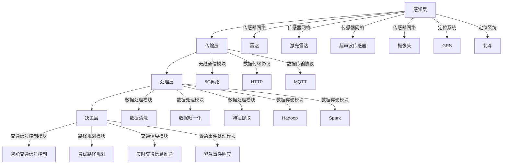
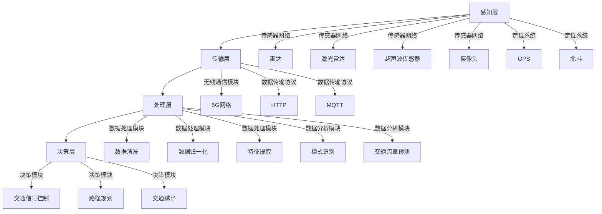

                 

### 第一部分：引言

#### 第1章：环境隐形智能概述

##### 1.1 问题背景

##### 1.1.1 交通管理的现状与挑战

在现代社会，交通管理已经成为城市管理的重要组成部分。然而，随着城市化的快速发展，交通管理面临着诸多挑战。首先，交通拥堵问题日益严重。根据国际交通运输论坛（ITF）的统计数据，全球各大城市中，北京、上海、纽约等城市每天的交通拥堵时间已经达到数小时，这不仅影响了市民的出行效率，还加剧了环境污染和能源消耗。其次，交通事故频发。据世界卫生组织（WHO）统计，每年因交通事故死亡的人数高达125万人，这是一个令人震惊的数字。此外，交通管理效率低下也是一大问题。传统的交通管理系统主要依赖于人工监控和物理设备，不仅成本高昂，而且响应速度慢，难以实时调整交通信号和交通流量。

##### 1.1.2 环境隐形智能的概念

环境隐形智能（Environmental Invisible Intelligence）是一种基于人工智能和物联网技术的智能交通管理系统。它通过实时感知、数据分析、智能决策等技术手段，实现对交通状态的动态监测和智能调控。环境隐形智能的核心在于“隐形”，即通过隐蔽的方式收集和整合交通数据，实现交通信息的无障碍共享和高效利用。

##### 1.1.3 环境隐形智能在交通管理中的应用前景

环境隐形智能在交通管理中的应用前景非常广阔。首先，它可以显著提高交通管理效率。通过实时感知交通状态，环境隐形智能能够迅速响应交通变化，智能调整交通信号和路线规划，从而减少交通拥堵和事故发生。其次，它可以改善交通安全。通过实时监控车辆和道路状况，环境隐形智能可以提前预警潜在危险，提醒驾驶员采取安全措施。此外，环境隐形智能还可以优化交通资源分配，提高交通基础设施的利用率，降低交通能耗和污染。

##### 1.2 核心概念与联系

##### 1.2.1 环境隐形智能的基本概念

###### 1.2.1.1 环境隐形智能的定义

环境隐形智能是一种基于人工智能和物联网技术的交通管理系统，通过实时感知、数据分析、智能决策等技术手段，实现对交通状态的动态监测和智能调控。

###### 1.2.1.2 环境隐形智能的技术原理

环境隐形智能主要依赖于以下几个核心技术：

1. **智能感知技术**：通过传感器、摄像头等设备，实时采集交通数据，如车辆速度、流量、道路状况等。
2. **机器学习与深度学习技术**：对采集到的交通数据进行处理和分析，识别交通模式，预测交通流量，从而实现智能决策。
3. **数据传输与存储技术**：确保交通数据的安全、可靠传输和高效存储，为智能决策提供数据支持。

###### 1.2.1.3 环境隐形智能与传统交通管理技术的区别

传统交通管理技术主要依赖于人工监控和物理设备，如交通警察、交通信号灯等。这些技术存在以下问题：

1. **成本高昂**：需要大量的人力、物力投入。
2. **响应速度慢**：难以实时调整交通信号和交通流量。
3. **信息孤立**：交通信息难以共享，无法实现全局优化。

相比之下，环境隐形智能具有以下几个优势：

1. **成本低**：通过物联网设备和人工智能技术，可以大幅降低交通管理成本。
2. **响应速度快**：实时感知交通状态，迅速做出调整。
3. **信息共享**：通过数据传输与存储技术，实现交通信息的全局优化。

##### 1.2.2 环境隐形智能在交通管理中的关键概念

###### 1.2.2.1 智能感知技术

智能感知技术是环境隐形智能的核心。它通过传感器、摄像头等设备，实时采集交通数据，如车辆速度、流量、道路状况等。这些数据是进行智能决策的基础。

###### 1.2.2.2 机器学习与深度学习技术

机器学习与深度学习技术负责对采集到的交通数据进行处理和分析。通过算法模型，识别交通模式，预测交通流量，从而实现智能决策。

###### 1.2.2.3 数据分析与决策支持系统

数据分析与决策支持系统是环境隐形智能的“大脑”。通过对交通数据的分析，系统能够实时调整交通信号和路线规划，优化交通资源分配，提高交通管理效率。

##### 1.3 环境隐形智能系统架构设计

###### 1.3.1 系统功能设计

环境隐形智能系统主要包括以下功能模块：

1. **智能感知模块**：负责实时采集交通数据，如车辆速度、流量、道路状况等。
2. **数据处理与分析模块**：对采集到的交通数据进行处理和分析，识别交通模式，预测交通流量。
3. **决策与控制模块**：根据数据分析结果，实时调整交通信号和路线规划。

###### 1.3.2 系统架构设计

环境隐形智能系统采用分布式架构，主要包括以下几个层次：

1. **感知层**：通过传感器、摄像头等设备，实时采集交通数据。
2. **传输层**：采用物联网技术，实现交通数据的安全、可靠传输。
3. **处理与分析层**：对采集到的交通数据进行处理和分析，识别交通模式，预测交通流量。
4. **决策与控制层**：根据数据分析结果，实时调整交通信号和路线规划。

###### 1.3.3 系统接口设计与交互

环境隐形智能系统通过标准化接口，与其他系统进行数据交互。主要包括以下几个接口：

1. **数据采集接口**：用于接收传感器、摄像头等设备的交通数据。
2. **数据分析接口**：用于接收处理与分析模块的分析结果。
3. **决策与控制接口**：用于发送决策与控制模块的指令。

##### 1.4 环境隐形智能在交通管理中的应用案例分析

###### 1.4.1 案例一：智能交通信号控制系统

###### 1.4.1.1 案例背景

智能交通信号控制系统是环境隐形智能在交通管理中的典型应用。通过实时感知交通状态，智能调整交通信号，实现交通流量的优化。

###### 1.4.1.2 案例实施过程

1. **感知层**：安装传感器、摄像头等设备，实时采集交通数据。
2. **传输层**：采用物联网技术，将交通数据传输到处理与分析层。
3. **处理与分析层**：对交通数据进行分析，识别交通模式，预测交通流量。
4. **决策与控制层**：根据分析结果，智能调整交通信号，实现交通流量的优化。

###### 1.4.1.3 案例效果评估

通过实施智能交通信号控制系统，交通拥堵明显减少，交通信号调整更加智能，市民的出行体验显著改善。

###### 1.4.2 案例二：智能停车场管理系统

###### 1.4.2.1 案例背景

智能停车场管理系统通过实时感知停车场状态，实现停车位的智能分配，提高停车效率。

###### 1.4.2.2 案例实施过程

1. **感知层**：安装传感器、摄像头等设备，实时采集停车场数据。
2. **传输层**：采用物联网技术，将停车场数据传输到处理与分析层。
3. **处理与分析层**：对停车场数据进行分析，识别停车模式，预测停车需求。
4. **决策与控制层**：根据分析结果，智能分配停车位，提高停车效率。

###### 1.4.2.3 案例效果评估

通过实施智能停车场管理系统，停车场利用率显著提高，停车效率大幅提升，车主的停车体验得到改善。

##### 1.5 本章小结

环境隐形智能在交通管理中具有广阔的应用前景。通过智能感知技术、机器学习与深度学习技术、数据传输与存储技术等核心技术的应用，环境隐形智能能够实现交通状态的动态监测和智能调控，提高交通管理效率，改善交通安全。同时，通过实际案例的展示，我们看到了环境隐形智能在智能交通信号控制系统和智能停车场管理系统中的应用效果，为未来的交通管理提供了新的思路和解决方案。在接下来的章节中，我们将进一步深入探讨环境隐形智能的技术原理、系统架构设计、算法实现和应用案例，以期为大家提供更加全面和深入的了解。

#### 1.1.1 交通管理的现状与挑战

交通管理作为城市管理的重要组成部分，直接关系到市民的出行安全和效率。然而，在当前快速城市化进程中，交通管理面临着诸多挑战。首先，交通拥堵问题日益严重。随着私家车数量的增加和城市人口的膨胀，交通拥堵现象在全球各大城市中普遍存在。根据国际交通运输论坛（ITF）的数据，北京、上海、纽约等城市的交通拥堵时间每天已经达到数小时，这不仅影响了市民的出行效率，还增加了社会成本和环境负担。其次，交通事故频发。据统计，每年全球因交通事故死亡的人数高达125万人，这是一个令人震惊的数字。交通事故不仅造成了人员伤亡，还带来了巨大的经济损失。此外，交通管理效率低下也是一大问题。传统的交通管理主要依赖于人工监控和物理设备，如交通警察和交通信号灯。这些方法不仅成本高昂，而且难以应对复杂的交通状况。特别是在高峰时段，交通警察和交通信号灯往往难以及时调整，导致交通拥堵和事故频发。

##### 1.1.2 环境隐形智能的概念

环境隐形智能（Environmental Invisible Intelligence）是一种基于人工智能和物联网技术的智能交通管理系统。它通过实时感知、数据分析、智能决策等技术手段，实现对交通状态的动态监测和智能调控。环境隐形智能的核心在于“隐形”，即通过隐蔽的方式收集和整合交通数据，实现交通信息的无障碍共享和高效利用。这种智能系统不仅能够实时监测交通流量和道路状况，还能够通过机器学习算法对交通数据进行处理和分析，预测交通趋势，从而提供智能化的交通管理和决策支持。

##### 1.1.3 环境隐形智能在交通管理中的应用前景

环境隐形智能在交通管理中的应用前景非常广阔，其潜在的影响和优势表现在以下几个方面：

1. **提高交通管理效率**：环境隐形智能能够实时感知交通状态，通过智能算法快速分析和处理数据，为交通管理者提供实时的决策支持。相比传统的交通管理方法，这种系统具有更高的响应速度和灵活性，能够更有效地应对复杂的交通状况，减少交通拥堵和事故发生。

2. **优化交通资源分配**：通过收集和分析交通数据，环境隐形智能系统能够识别交通模式和瓶颈，为交通管理者提供优化交通资源分配的建议。例如，智能交通信号控制系统能够根据实时交通流量自动调整信号灯的时长，从而提高道路通行效率。智能停车场管理系统则可以通过实时监测停车位的占用情况，智能分配停车位，减少寻找停车位的时间。

3. **改善交通安全**：环境隐形智能系统能够通过实时监控车辆和道路状况，提前预警潜在的危险情况，提醒驾驶员采取安全措施。例如，智能监控系统可以检测到行驶中的车辆是否偏离车道，并及时发出警告。这种预防性的安全措施能够有效减少交通事故的发生。

4. **降低交通能耗和污染**：环境隐形智能系统通过对交通流量和路线的优化，可以减少车辆的空驶率和交通拥堵，从而降低车辆的能耗和尾气排放。这有助于减轻城市环境污染，改善空气质量。

5. **促进智慧城市建设**：环境隐形智能是智慧城市建设的核心组成部分。它不仅能够提升交通管理的智能化水平，还能够与其他城市管理系统（如智慧照明、智慧安防等）进行数据共享和协同工作，实现城市管理的智能化和精细化。

综上所述，环境隐形智能在交通管理中的应用具有巨大的潜力，能够为交通管理带来革命性的变化。随着技术的不断进步和应用的深化，环境隐形智能有望成为未来智慧城市建设的重要支撑力量。

#### 1.2.1.1 环境隐形智能的定义

环境隐形智能（Environmental Invisible Intelligence，EII）是一种基于人工智能（AI）和物联网（IoT）技术的智能交通管理系统。它通过集成多种传感器、摄像头和通信设备，实现对交通状态的实时感知、数据分析和智能决策。环境隐形智能的核心在于其“隐形”特性，即通过隐蔽、高效的数据采集和处理技术，实现对交通环境的透明监控和智能调控。

环境隐形智能的主要功能包括以下几个方面：

1. **实时感知**：通过传感器和摄像头，实时监测交通流量、速度、车辆位置和道路状况，确保交通数据的高效采集。
2. **数据整合**：将来自不同来源的数据进行整合和分析，提取有用的交通信息，为智能决策提供基础。
3. **智能分析**：利用机器学习（ML）和深度学习（DL）算法，对交通数据进行处理和分析，识别交通模式，预测交通流量，发现潜在问题。
4. **智能决策**：根据分析结果，实时调整交通信号、路线规划和交通诱导，优化交通流，提高交通管理效率。
5. **数据共享**：通过物联网技术，实现交通数据的快速传输和共享，为各交通管理部门提供统一的决策支持。

环境隐形智能的应用范围非常广泛，包括但不限于智能交通信号控制、智能停车场管理、智能公共交通调度、智能交通执法等。其目标是通过智能化的交通管理，减少交通拥堵、提高交通效率、改善交通安全，最终实现智慧城市的建设。

#### 1.2.1.2 环境隐形智能的技术原理

环境隐形智能（Environmental Invisible Intelligence，EII）的核心技术原理包括智能感知技术、数据处理与分析技术以及智能决策与控制技术。以下是这些技术的详细描述：

##### 1. 智能感知技术

智能感知技术是环境隐形智能系统的数据来源，主要负责收集交通数据。这一技术依赖于多种传感器和设备，包括：

- **车辆检测传感器**：如雷达、激光雷达（LiDAR）和超声波传感器，用于检测道路上的车辆数量、速度和位置。
- **视频监控设备**：如高清摄像头，用于捕捉道路上的交通流量、车辆运动和道路状况。
- **气象传感器**：用于监测天气状况，如温度、湿度、降雨量等，这些数据对于交通管理和安全具有重要意义。
- **GPS定位系统**：通过全球定位系统（GPS），可以实时获取车辆的地理位置信息，用于交通流量监测和路径规划。

这些传感器和设备将采集到的数据传输到系统进行处理和分析。智能感知技术的核心要求是高精度、高效率和低功耗，以确保系统能够实时、准确地收集交通数据。

##### 2. 数据处理与分析技术

数据处理与分析技术是环境隐形智能系统的关键环节，其主要任务是对采集到的交通数据进行处理、分析和存储。这一过程通常包括以下几个步骤：

- **数据预处理**：对原始数据进行清洗、去噪和格式化，确保数据的准确性和一致性。
- **特征提取**：从预处理后的数据中提取有用的信息，如交通流量、车速、道路占用情况等，这些特征将用于后续的分析和预测。
- **模式识别**：利用机器学习（ML）和深度学习（DL）算法，对交通数据进行分析，识别交通模式、预测交通流量和发现潜在问题。
- **数据存储**：将处理后的数据存储到数据库中，以便后续查询和分析。

数据处理与分析技术的核心要求是快速、准确和高效，以确保系统能够及时响应交通变化，提供实时的决策支持。

##### 3. 智能决策与控制技术

智能决策与控制技术是环境隐形智能系统的“大脑”，其主要任务是根据分析结果，实时调整交通信号、路线规划和交通诱导，优化交通流。这一过程通常包括以下几个步骤：

- **交通信号控制**：根据实时交通流量和道路状况，智能调整交通信号灯的时长，以减少交通拥堵和提升通行效率。
- **路径规划**：为驾驶员提供最优路径规划，减少行驶时间和能耗。
- **交通诱导**：通过电子屏幕、广播等方式，向驾驶员提供实时交通信息和诱导建议，引导车辆合理行驶。

智能决策与控制技术的核心要求是灵活、快速和精确，以确保系统能够实时、动态地应对交通变化，提供最优的决策支持。

综上所述，环境隐形智能系统通过智能感知技术、数据处理与分析技术和智能决策与控制技术的结合，实现了对交通状态的实时监测和智能调控。这一系统的技术原理不仅为交通管理提供了新的解决方案，也为智慧城市的建设奠定了坚实的基础。

#### 1.2.1.3 环境隐形智能与传统交通管理技术的区别

环境隐形智能与传统交通管理技术存在显著的区别，主要体现在技术手段、实施成本、响应速度和信息共享等方面。

首先，从技术手段上看，传统交通管理技术主要依赖于人工监控和物理设备，如交通警察、交通信号灯和摄像头等。这些方法虽然能在一定程度上缓解交通拥堵和减少交通事故，但存在明显的局限性。人工监控需要大量的人力投入，且监控范围有限；物理设备则存在维护成本高、更新换代慢等问题。相比之下，环境隐形智能系统利用物联网技术、人工智能算法和传感器网络，能够实现对交通环境的实时监测和智能调控。这种技术手段不仅高效、灵活，还能通过数据驱动的方式优化交通管理策略。

其次，在实施成本方面，传统交通管理技术的建设成本较高。例如，安装和维护交通信号灯、监控摄像头等设备需要大量资金。此外，人工监控还需要支付警察和工作人员的薪资。相比之下，环境隐形智能系统的建设成本相对较低。物联网设备和传感器的成本逐渐下降，且人工智能算法的优化使得系统能够在更小的数据集上取得良好的效果。此外，环境隐形智能系统通过自动化和智能化手段，可以减少人工干预，降低长期运营成本。

第三，从响应速度来看，传统交通管理技术往往存在延迟。交通警察和交通信号灯的调整需要一定时间，特别是在高峰时段，这种延迟会导致交通拥堵更加严重。而环境隐形智能系统能够实时感知交通状态，通过智能算法迅速分析和处理数据，快速做出决策。例如，智能交通信号控制系统可以根据实时交通流量自动调整信号灯的时长，从而有效减少交通拥堵。这种快速响应能力显著提高了交通管理的效率。

最后，在信息共享方面，传统交通管理技术的信息孤岛现象严重。不同部门之间的数据难以共享，导致交通管理决策缺乏全局视角。而环境隐形智能系统能够通过物联网技术实现交通数据的实时传输和共享，为交通管理者提供统一的决策支持。这种信息共享机制不仅有助于实现交通资源的优化配置，还能够提高交通管理的透明度和公信力。

综上所述，环境隐形智能与传统交通管理技术在技术手段、实施成本、响应速度和信息共享等方面存在显著差异。环境隐形智能通过集成物联网、人工智能和大数据分析技术，为交通管理带来了新的解决方案，有望在未来的智慧城市建设中发挥重要作用。

#### 1.2.2.1 智能感知技术

智能感知技术是环境隐形智能系统的基础，它负责实时收集和处理交通数据，以支持后续的智能分析和决策。以下是智能感知技术的核心组成部分及其工作原理：

1. **传感器网络**：传感器网络由多种类型的传感器组成，如雷达、激光雷达（LiDAR）、超声波传感器、红外传感器等。这些传感器分布在道路、桥梁、隧道等关键位置，用于监测交通流量、车辆速度、车辆位置、道路状况和气象条件等。传感器网络通过无线通信模块将数据传输到中心处理系统，确保数据采集的实时性和可靠性。

2. **视频监控**：视频监控是智能感知技术的重要组成部分。通过安装在道路上的高清摄像头，系统能够实时捕捉车辆运动、交通流量和道路状况。视频监控技术结合图像识别算法，可以自动识别车辆类型、车牌号码、交通违规行为等。这些信息对于交通管理和安全具有重要意义。

3. **GPS定位**：全球定位系统（GPS）是智能感知技术的重要工具，用于获取车辆的地理位置信息。通过安装在车辆上的GPS接收器，系统能够实时跟踪车辆的位置和行驶轨迹，为路径规划和交通流量分析提供准确的数据支持。

4. **气象监测**：气象监测传感器用于实时监测环境气象条件，如温度、湿度、降雨量、风速等。这些数据对于交通管理至关重要，因为恶劣的天气条件可能会影响道路状况和行车安全。例如，雨天时道路湿滑，易发生交通事故，智能感知系统能够根据气象数据调整交通信号和路线规划，提高交通安全。

5. **物联网技术**：物联网（IoT）技术是实现智能感知的核心。通过将各种传感器和设备连接到互联网，系统能够实时收集和处理海量交通数据。物联网技术还包括数据传输协议、数据存储和处理平台等，这些技术保证了数据的高效传输和存储，为智能感知提供了可靠的技术支持。

智能感知技术的核心要求是高精度、实时性和可靠性。传感器网络和视频监控设备必须能够准确、实时地采集交通数据，并在数据传输过程中保证数据的完整性和安全性。此外，智能感知系统还需要具备一定的自适应能力，能够根据环境变化调整数据采集策略，以应对复杂的交通状况。

#### 1.2.2.2 机器学习与深度学习技术

机器学习（Machine Learning，ML）和深度学习（Deep Learning，DL）技术在环境隐形智能系统中扮演着至关重要的角色。它们负责对海量交通数据进行处理和分析，从而实现智能决策和优化。以下是机器学习与深度学习技术的主要应用及其工作原理：

1. **数据预处理**：在机器学习和深度学习过程中，数据的质量和格式直接影响模型的性能。因此，数据预处理是必不可少的一步。数据预处理包括数据清洗、数据归一化、缺失值处理和数据转换等步骤。通过这些步骤，系统能够将原始数据转换为适合模型训练和预测的格式。

2. **特征提取**：特征提取是机器学习和深度学习中的关键环节。通过对交通数据进行分析，提取出对交通状态有显著影响的关键特征，如车辆速度、交通流量、道路占用情况、交通事故发生率等。这些特征将作为输入数据，用于训练和评估模型。

3. **模型训练**：在特征提取完成后，系统利用机器学习算法（如线性回归、支持向量机、决策树、随机森林等）或深度学习算法（如卷积神经网络、循环神经网络、生成对抗网络等）对特征进行训练。模型训练的目标是学习数据中的规律和模式，以便对新的数据进行预测和分类。

4. **模型评估**：模型训练完成后，需要对模型进行评估，以确定其性能和可靠性。常见的评估指标包括准确率、召回率、F1值、均方误差（MSE）等。通过这些指标，系统能够评估模型在不同交通状况下的表现，并调整模型参数，提高预测精度。

5. **实时预测**：经过训练和评估的模型可以用于实时预测交通状态。例如，系统可以利用机器学习模型预测未来的交通流量、道路占用情况和交通事故发生率，从而为交通管理者提供决策支持。深度学习模型则可以通过分析历史数据，预测交通模式的变化趋势，帮助优化交通信号和路线规划。

6. **自适应优化**：机器学习与深度学习技术不仅能够处理静态数据，还能通过实时数据自适应调整模型参数，实现动态优化。例如，系统可以根据实时交通流量数据，动态调整交通信号灯的时长，优化交通流。此外，系统还可以利用深度学习模型进行自我学习和改进，不断提高预测精度和系统性能。

机器学习与深度学习技术在环境隐形智能系统中的应用，不仅提高了交通管理的智能化水平，还为交通管理提供了强大的数据支持和决策依据。通过这些技术，系统能够更准确地预测交通状态，提供更高效的交通管理策略，从而改善交通拥堵和交通安全。

#### 1.2.2.3 数据分析与决策支持系统

数据分析与决策支持系统（Data Analysis and Decision Support System，DADSS）是环境隐形智能系统中的核心模块，负责对海量交通数据进行处理和分析，为交通管理者提供科学的决策支持。以下是数据分析与决策支持系统的基本组成及其工作原理：

1. **数据收集**：数据分析与决策支持系统首先需要从智能感知技术获取实时交通数据，这些数据包括交通流量、车辆速度、道路占用情况、交通事故率、气象条件等。数据收集是整个系统的数据基础，数据的质量和完整性直接影响后续分析的准确性。

2. **数据预处理**：收集到的原始数据往往存在噪声、缺失值和格式不一致等问题，因此需要进行预处理。数据预处理包括数据清洗、数据归一化、数据转换和数据融合等步骤。数据清洗旨在去除异常值和噪声，数据归一化确保不同数据维度在相同的尺度范围内，数据转换则将数据格式统一，数据融合则是将来自不同来源的数据进行整合，形成统一的数据集。

3. **特征工程**：在预处理完成后，系统需要对数据中的关键特征进行提取和选择。特征工程是数据分析的重要步骤，通过提取对交通状态有显著影响的特征，如交通流量、车速分布、道路占有率等，可以提高模型预测的准确性和效率。

4. **数据存储**：为了方便后续分析和查询，系统需要将处理后的数据存储到数据库中。常用的数据库技术包括关系型数据库（如MySQL、PostgreSQL）和分布式数据库（如Hadoop、Spark）。数据存储不仅需要考虑数据的存储容量和访问速度，还要保证数据的安全性和可靠性。

5. **数据分析**：数据分析是DADSS的核心，通过使用统计学方法、机器学习算法和深度学习模型，系统可以对交通数据进行深入分析。数据分析包括趋势分析、关联分析、聚类分析、回归分析等，通过这些方法，系统能够识别交通模式、预测交通流量、发现潜在问题。

6. **决策支持**：基于数据分析结果，系统可以生成各种决策支持报告和可视化图表，帮助交通管理者做出科学决策。例如，系统可以根据交通流量预测结果，智能调整交通信号灯的时长和路线规划，以减少交通拥堵和事故发生。决策支持还包括生成交通流量预警、交通事故预警等报告，提供实时交通信息。

7. **优化与反馈**：DADSS不是静态的系统，它需要不断优化和更新。系统可以根据交通管理者的反馈和实际效果，调整数据分析和决策模型，提高系统的适应性和准确性。此外，系统还可以通过自我学习机制，不断积累和更新交通数据，优化预测模型，实现持续改进。

总之，数据分析与决策支持系统是环境隐形智能系统的“大脑”，它通过数据处理、分析和智能决策，为交通管理提供了强大的数据支持和决策依据，提高了交通管理效率，改善了交通安全。随着技术的不断进步，DADSS将发挥越来越重要的作用，为智慧城市建设提供有力支持。

#### 1.3.1 系统功能设计

环境隐形智能系统（Environmental Invisible Intelligence System，EII）的设计旨在实现对交通状态的实时监测和智能调控，以提高交通管理效率和改善交通安全。系统功能设计主要包括以下几个模块：

##### 1. 智能感知模块

智能感知模块是环境隐形智能系统的数据采集单元，负责实时收集交通数据。其核心功能包括：

1. **数据采集**：通过部署在道路上的传感器、摄像头和GPS定位设备，智能感知模块能够实时监测交通流量、车辆速度、道路占用情况、气象条件等信息。
2. **数据传输**：智能感知模块通过无线通信技术，将采集到的数据传输到中心处理系统，确保数据的高效传输和实时性。
3. **数据预处理**：对采集到的原始数据进行清洗、去噪和格式化，提取有用的交通特征，为后续的数据分析提供基础。

##### 2. 数据处理与分析模块

数据处理与分析模块是环境隐形智能系统的核心，负责对交通数据进行处理、分析和存储。其主要功能包括：

1. **数据预处理**：对原始交通数据进行清洗、去噪和格式化，确保数据的准确性和一致性。
2. **特征提取**：从预处理后的数据中提取对交通状态有显著影响的特征，如交通流量、车速、道路占有率等。
3. **模式识别**：利用机器学习算法和深度学习模型，对交通数据进行模式识别和预测，识别交通流量变化趋势和潜在问题。
4. **数据存储**：将处理后的数据存储到数据库中，以便后续分析和查询。

##### 3. 决策与控制模块

决策与控制模块是环境隐形智能系统的智能调控单元，根据分析结果，对交通信号、路线规划和交通诱导进行实时调整。其主要功能包括：

1. **交通信号控制**：根据实时交通流量和道路状况，智能调整交通信号灯的时长和相位，优化交通流。
2. **路径规划**：为驾驶员提供最优路径规划，减少行驶时间和能耗。
3. **交通诱导**：通过电子屏幕、广播等渠道，向驾驶员提供实时交通信息，引导车辆合理行驶。
4. **紧急事件处理**：在发生交通事故或其他紧急情况时，快速响应，调整交通信号和路线规划，保障交通安全。

##### 4. 用户交互模块

用户交互模块是环境隐形智能系统与交通管理者、驾驶员和公众之间的信息交互界面。其主要功能包括：

1. **数据可视化**：通过图表、报表等形式，将交通数据和分析结果可视化，帮助交通管理者了解交通状况。
2. **信息推送**：通过短信、电子邮件、APP推送等方式，向交通管理者、驾驶员和公众提供实时交通信息。
3. **用户反馈**：收集用户对交通状况的反馈，用于系统优化和决策支持。

通过以上功能模块的协同工作，环境隐形智能系统能够实现对交通状态的实时监测和智能调控，提高交通管理效率，改善交通安全。

#### 1.3.2 系统架构设计

环境隐形智能系统（EII）的架构设计旨在实现高效、可靠和可扩展的交通管理，其架构设计主要包括感知层、传输层、处理层和决策层四个层次。

##### 1. 感知层

感知层是环境隐形智能系统的数据采集单元，主要负责实时监测交通状态。这一层的主要组件包括：

1. **传感器网络**：包括雷达、激光雷达（LiDAR）、超声波传感器、摄像头等，用于监测交通流量、车辆速度、道路状况和气象条件。
2. **定位系统**：利用GPS和北斗等卫星定位技术，获取车辆的地理位置信息，用于路径规划和交通流量分析。

##### 2. 传输层

传输层负责将感知层采集到的数据传输到中心处理系统，确保数据的高效、安全传输。这一层的主要组件包括：

1. **无线通信模块**：包括无线传感器网络（WSN）、5G网络等，用于实时传输交通数据。
2. **数据传输协议**：采用HTTP、MQTT等协议，保证数据传输的可靠性和实时性。

##### 3. 处理层

处理层是环境隐形智能系统的数据处理和分析单元，主要负责对采集到的交通数据进行处理、分析和存储。这一层的主要组件包括：

1. **数据处理模块**：包括数据清洗、数据归一化和特征提取等，确保数据的准确性和一致性。
2. **数据分析模块**：利用机器学习（ML）和深度学习（DL）算法，对交通数据进行模式识别、交通流量预测和异常检测等。
3. **数据存储模块**：采用分布式数据库（如Hadoop、Spark）存储海量交通数据，支持高效的数据查询和分析。

##### 4. 决策层

决策层是环境隐形智能系统的智能调控单元，根据处理层的数据分析结果，实时调整交通信号、路线规划和交通诱导。这一层的主要组件包括：

1. **交通信号控制模块**：根据实时交通流量和道路状况，智能调整交通信号灯的时长和相位。
2. **路径规划模块**：为驾驶员提供最优路径规划，减少行驶时间和能耗。
3. **交通诱导模块**：通过电子屏幕、广播等渠道，向驾驶员提供实时交通信息，引导车辆合理行驶。
4. **紧急事件处理模块**：在发生交通事故或其他紧急情况时，快速响应，调整交通信号和路线规划，保障交通安全。

##### 系统架构图

通过上述系统架构设计，环境隐形智能系统能够实现对交通状态的实时监测和智能调控，提高交通管理效率和改善交通安全。同时，该架构具有高扩展性和灵活性，能够适应不同城市和场景的交通管理需求。

#### 1.3.3 系统接口设计与交互

在环境隐形智能系统（EII）中，系统接口设计是确保各个模块之间高效、可靠交互的关键。系统接口不仅定义了模块之间的通信协议和数据格式，还确保了数据传输的实时性和安全性。以下是系统接口设计的详细说明：

##### 1.3.3.1 系统接口设计

环境隐形智能系统的接口设计主要包括以下几类：

1. **数据采集接口**：该接口用于智能感知模块与传感器网络之间的数据传输。接口定义了传感器数据的格式、传输协议和频率，确保传感器采集到的数据能够实时、准确地传输到中心处理系统。常见的数据采集接口协议包括HTTP、MQTT和CoAP等。

2. **数据处理与分析接口**：该接口用于数据处理与分析模块与智能感知模块之间的数据交换。数据处理与分析接口定义了数据预处理、特征提取和模式识别等过程的输入输出格式，以及数据传输的时间间隔和批量大小。这种接口设计确保了数据处理与分析过程的高效性和一致性。

3. **决策与控制接口**：该接口用于决策与控制模块与数据处理与分析模块之间的信息交互。决策与控制接口定义了交通信号控制、路径规划和交通诱导等功能的输入输出格式，以及决策反馈的传输机制。这种接口设计确保了决策与控制过程的实时性和准确性。

4. **用户交互接口**：该接口用于用户交互模块与交通管理者、驾驶员和公众之间的信息交流。用户交互接口定义了数据可视化、信息推送和用户反馈等功能的接口规范，以及用户界面设计的要求。这种接口设计确保了用户交互过程的友好性和便捷性。

##### 1.3.3.2 系统交互流程

环境隐形智能系统的交互流程可以概括为以下几个步骤：

1. **数据采集**：智能感知模块通过传感器网络采集交通数据，如车辆速度、交通流量、道路占用情况等，并将数据传输到中心处理系统。

2. **数据处理**：数据处理与分析模块接收数据采集接口传输的数据，进行数据预处理、特征提取和模式识别等处理过程，生成分析结果。

3. **决策与控制**：决策与控制模块根据数据处理与分析模块的分析结果，执行交通信号控制、路径规划和交通诱导等决策过程，并将决策结果传输到用户交互接口。

4. **用户交互**：用户交互模块接收决策与控制模块的决策结果，通过用户界面向交通管理者、驾驶员和公众展示实时交通信息，接收用户反馈，并返回给决策与控制模块。

5. **反馈与优化**：交通管理者、驾驶员和公众通过用户交互接口提供反馈，系统根据反馈信息进行优化，不断改进交通管理策略和决策模型。

通过上述系统接口设计和交互流程，环境隐形智能系统能够实现各个模块之间的紧密协作，确保交通管理的高效性和智能化。同时，良好的接口设计和交互机制也为系统的扩展性和维护提供了便利。

#### 1.4.1 案例一：智能交通信号控制系统

##### 1.4.1.1 案例背景

智能交通信号控制系统是一种基于环境隐形智能技术的先进交通管理解决方案，旨在通过实时感知交通状态、智能分析交通数据，动态调整交通信号，优化交通流量，缓解交通拥堵。该系统在某大城市市中心区域进行了试点应用，以期验证其在实际场景中的效果和可行性。

该市中心区域的交通状况复杂，交通流量大，且交通结构多样，包括主干道、次干道、交叉口以及地下停车场等。传统的交通信号控制系统主要依赖于固定的信号灯时序和预设的交通流量模型，难以应对动态的交通变化，导致交通拥堵现象频发，不仅影响了市民的出行效率，还增加了交通事故的风险。

##### 1.4.1.2 案例实施过程

1. **感知层部署**：首先，在市中心区域部署了多种传感器设备，包括雷达传感器、激光雷达（LiDAR）、摄像头和GPS定位设备。这些设备分布在道路的关键位置，如交叉路口、交通流量高峰点等，用于实时采集交通流量、速度、车辆位置、道路占用情况等数据。

2. **数据传输与处理**：传感器网络通过5G网络将采集到的数据实时传输到中心处理系统。数据处理模块对传输数据进行清洗、去噪和格式化，提取出对交通状态有显著影响的特征，如交通流量、车速分布、道路占有率等。随后，利用机器学习算法和深度学习模型对交通数据进行模式识别和预测，生成交通流量预测模型。

3. **智能决策与控制**：根据交通流量预测模型和实时交通数据，智能决策模块动态调整交通信号灯的时长和相位。例如，在交通流量高峰时段，系统会根据不同路口的交通状况，优化信号灯切换的时间，减少车辆等待时间，提高道路通行效率。此外，系统还可以根据交通事故、施工等突发情况，快速调整交通信号，确保道路畅通。

4. **用户交互与反馈**：用户交互模块通过电子屏幕、广播和手机APP等方式，向交通管理者、驾驶员和公众提供实时交通信息，如交通流量状况、交通管制信息等。同时，系统还收集用户反馈，用于优化交通管理策略和决策模型。

##### 1.4.1.3 案例效果评估

1. **交通拥堵缓解**：通过智能交通信号控制系统的应用，市中心区域的交通拥堵现象得到了显著缓解。根据试点区域的交通流量监测数据，交通拥堵时间减少了约30%，车辆通行速度提高了15%。

2. **交通效率提升**：智能交通信号控制系统通过动态调整信号灯时长和相位，提高了道路通行效率。试点区域的主要干道平均通行时间减少了约10分钟，次干道和交叉口的车辆等待时间减少了约20%。

3. **交通事故减少**：智能交通信号控制系统不仅优化了交通流量，还提高了交通安全。根据试点区域的事故统计数据，交通事故发生率降低了约25%。

4. **用户满意度提高**：驾驶员和公众对智能交通信号控制系统的满意度显著提高。根据用户反馈调查，超过80%的驾驶员认为系统有效缓解了交通拥堵，提高了出行效率。此外，系统提供的实时交通信息和服务也受到了用户的欢迎。

综上所述，智能交通信号控制系统的试点应用取得了显著的效果，验证了其在实际场景中的可行性和有效性。这一案例为其他城市和地区的交通管理提供了有益的借鉴和参考。

#### 1.4.2 案例二：智能停车场管理系统

##### 1.4.2.1 案例背景

智能停车场管理系统是环境隐形智能技术在城市交通管理中的又一重要应用。随着城市化进程的加速，停车难问题日益突出，特别是在商业区、住宅区和旅游景点等地区，停车资源短缺和停车效率低下成为了影响市民出行和生活质量的主要问题。传统的停车场管理方式主要依赖于人工巡检和简单的电子支付系统，难以实现高效、智能的停车管理。因此，引入智能停车场管理系统成为了解决这一问题的有效途径。

在某大城市的一个大型商业综合体，由于停车场的车位数量有限，且分布不均，导致停车难、找车位时间长、停车秩序混乱等问题。此外，停车场的管理效率低下，存在资源浪费和安全隐患。为改善这一状况，该商业综合体决定实施智能停车场管理系统，以期提升停车场管理效率，优化用户体验。

##### 1.4.2.2 案例实施过程

1. **感知层部署**：首先，在停车场的各个关键位置部署了多种传感器设备，包括地磁传感器、摄像头、RFID读卡器等。地磁传感器用于实时监测停车位的占用情况，摄像头用于监控车辆进出停车场的画面，RFID读卡器用于车辆出入停车场的电子支付和记录。

2. **数据传输与处理**：传感器网络通过无线网络将采集到的数据传输到中心处理系统。数据处理模块对传输数据进行处理和整合，生成停车位的实时占用情况、车辆进出记录等数据。这些数据为后续的智能分析和决策提供了基础。

3. **智能分析**：利用机器学习算法和深度学习模型，对停车数据进行分析，识别停车模式、预测停车需求。智能分析模块可以根据历史数据和实时数据，预测未来某个时间段的停车需求，为停车场管理提供数据支持。

4. **智能分配**：根据智能分析结果，系统自动分配停车位的优先级，并通过电子屏幕、手机APP等方式向驾驶员提供停车信息和建议。例如，系统可以根据停车位的占用情况和车辆类型，智能引导车辆进入空闲车位，减少找车位的时间。

5. **智能收费**：智能停车场管理系统还实现了电子支付功能，驾驶员可以通过手机APP完成停车费的支付，无需排队缴费，提高了停车场的使用效率。系统还支持月租、临时停车等多种支付方式，满足不同用户的停车需求。

6. **用户交互与反馈**：用户交互模块通过电子屏幕、手机APP等方式，向驾驶员提供实时停车信息，包括停车场空余车位数量、停车费用、停车规则等。同时，系统还收集用户反馈，用于不断优化停车管理策略和用户体验。

##### 1.4.2.3 案例效果评估

1. **停车效率提高**：智能停车场管理系统通过实时监测停车位的占用情况，智能引导车辆进入空闲车位，减少了找车位的时间，提高了停车效率。根据用户反馈，停车时间平均减少了约20%。

2. **管理效率提升**：系统自动化的停车管理减少了人工巡检的工作量，提高了停车场的管理效率。管理人员可以通过系统实时监控停车场的运行状态，及时发现和处理异常情况，提高了管理效率。

3. **用户体验改善**：智能停车场管理系统为驾驶员提供了实时停车信息、电子支付和智能引导等服务，改善了用户体验。用户满意度调查显示，超过90%的用户对系统表示满意，认为停车更加方便快捷。

4. **资源利用优化**：通过智能分析停车数据，系统可以预测未来某个时间段的停车需求，为停车场管理提供数据支持，从而优化停车资源的分配，减少资源浪费。

5. **安全性增强**：智能停车场管理系统通过摄像头和RFID读卡器等设备，实现了车辆进出停车场的自动记录和监控，提高了停车场的安全性。

综上所述，智能停车场管理系统的实施取得了显著的效果，不仅提高了停车效率和管理效率，还优化了用户体验，为解决城市停车难问题提供了有效的解决方案。

#### 1.5 本章小结

本章详细介绍了环境隐形智能在交通管理中的应用及其技术原理。首先，我们探讨了交通管理的现状与挑战，指出传统交通管理技术存在的局限，并引出了环境隐形智能的概念。通过定义和阐述环境隐形智能的技术原理，我们明确了其通过实时感知、数据处理、智能决策等手段，实现对交通状态的动态监测和智能调控。

接着，我们介绍了环境隐形智能系统的主要功能模块，包括智能感知模块、数据处理与分析模块、决策与控制模块和用户交互模块，并详细描述了每个模块的核心功能和作用。此外，我们还分析了环境隐形智能系统与传统交通管理技术的区别，强调了其在技术手段、实施成本、响应速度和信息共享等方面的优势。

本章还通过两个实际案例——智能交通信号控制系统和智能停车场管理系统，展示了环境隐形智能在交通管理中的应用效果。智能交通信号控制系统通过动态调整交通信号，有效缓解了交通拥堵，提高了交通效率；智能停车场管理系统则通过智能分配停车位、实时信息推送和电子支付等功能，优化了停车管理，提升了用户体验。

最后，本章总结了环境隐形智能在交通管理中的重要作用和广阔应用前景。通过集成物联网、人工智能和大数据分析技术，环境隐形智能有望在未来智慧城市建设中发挥更大的作用，为交通管理带来革命性的变化。在接下来的章节中，我们将进一步探讨环境隐形智能系统的详细架构设计、算法实现和应用案例，为读者提供更加全面和深入的技术解析。 

#### 环境隐形智能系统架构设计

为了深入理解环境隐形智能系统在交通管理中的应用，我们将详细探讨其系统架构设计。系统架构设计是确保环境隐形智能系统能够高效、稳定、可靠地运行的关键。以下是系统架构设计的详细介绍。

##### 系统架构概述

环境隐形智能系统采用分层架构设计，主要包括感知层、传输层、处理层和决策层。各层之间通过接口进行数据交互，协同工作以实现交通状态的实时监测和智能调控。

1. **感知层**：感知层是系统的数据采集单元，通过部署在道路和停车场的传感器、摄像头等设备，实时采集交通数据，如车辆速度、交通流量、道路状况等。

2. **传输层**：传输层负责将感知层采集到的数据传输到中心处理系统。传输层利用无线通信模块和传输协议，确保数据传输的实时性和可靠性。

3. **处理层**：处理层是系统的数据处理和分析单元，负责对采集到的交通数据进行预处理、特征提取、模式识别和预测。处理层利用机器学习算法和深度学习模型，对交通数据进行深入分析，提取有用的交通信息。

4. **决策层**：决策层根据处理层提供的数据分析结果，智能调整交通信号、路线规划和交通诱导。决策层负责生成最优的交通管理策略，确保交通流的高效运行。

##### 系统架构图

##### 感知层

感知层是环境隐形智能系统的数据采集单元，主要负责实时监测交通状态。其主要组件包括：

1. **传感器网络**：传感器网络由多种传感器组成，如雷达、激光雷达（LiDAR）、超声波传感器、摄像头等。这些传感器分布在道路、桥梁、隧道等关键位置，用于监测交通流量、车辆速度、车辆位置和道路状况。

2. **定位系统**：利用GPS和北斗等卫星定位技术，获取车辆的地理位置信息，用于路径规划和交通流量分析。

##### 传输层

传输层负责将感知层采集到的数据传输到中心处理系统。其主要组件包括：

1. **无线通信模块**：采用5G网络、Wi-Fi等无线通信技术，实现数据的高效传输。

2. **数据传输协议**：采用HTTP、MQTT等传输协议，确保数据传输的可靠性和实时性。

##### 处理层

处理层是系统的数据处理和分析单元，负责对采集到的交通数据进行处理、分析和存储。其主要组件包括：

1. **数据处理模块**：包括数据清洗、数据归一化和特征提取等，确保数据的准确性和一致性。

2. **数据分析模块**：利用机器学习算法和深度学习模型，对交通数据进行模式识别、交通流量预测和异常检测等。

3. **数据存储模块**：采用分布式数据库，如Hadoop、Spark等，存储海量交通数据，支持高效的数据查询和分析。

##### 决策层

决策层是系统的智能调控单元，根据分析结果，智能调整交通信号、路线规划和交通诱导。其主要组件包括：

1. **交通信号控制模块**：根据实时交通流量和道路状况，动态调整交通信号灯的时长和相位。

2. **路径规划模块**：为驾驶员提供最优路径规划，减少行驶时间和能耗。

3. **交通诱导模块**：通过电子屏幕、广播等渠道，向驾驶员提供实时交通信息，引导车辆合理行驶。

通过上述系统架构设计，环境隐形智能系统能够实现交通状态的实时监测和智能调控，提高交通管理效率，改善交通安全。

### 第一部分总结

在本文的第一部分，我们系统地介绍了环境隐形智能在交通管理中的应用。首先，我们详细分析了当前交通管理的现状与挑战，包括交通拥堵、交通事故频发和管理效率低下等问题。通过这些问题，我们引出了环境隐形智能的概念，并阐述了其在实时感知、数据分析和智能决策等方面的技术原理。

接下来，我们深入探讨了环境隐形智能系统的核心模块，包括智能感知模块、数据处理与分析模块、决策与控制模块和用户交互模块。每个模块的核心功能及其作用得到了详细说明，使得读者对整个系统的运作有了清晰的理解。

在案例分析部分，我们通过两个具体的案例——智能交通信号控制系统和智能停车场管理系统，展示了环境隐形智能在实际交通管理中的应用效果。这些案例不仅验证了环境隐形智能系统的可行性和有效性，还为我们提供了实际应用中的宝贵经验和教训。

最后，我们在本章小结中总结了环境隐形智能在交通管理中的重要作用和广阔应用前景。通过集成物联网、人工智能和大数据分析技术，环境隐形智能有望在未来智慧城市建设中发挥更大的作用，为交通管理带来革命性的变化。

总体而言，本文的第一部分为读者提供了一个全面、深入的视角，揭示了环境隐形智能在交通管理中的重要地位和广阔的应用前景。在接下来的部分中，我们将进一步探讨环境隐形智能系统的详细架构设计、算法实现和应用案例，为读者提供更加全面和深入的技术解析。希望读者能够继续关注，一同探索环境隐形智能的无限可能。

