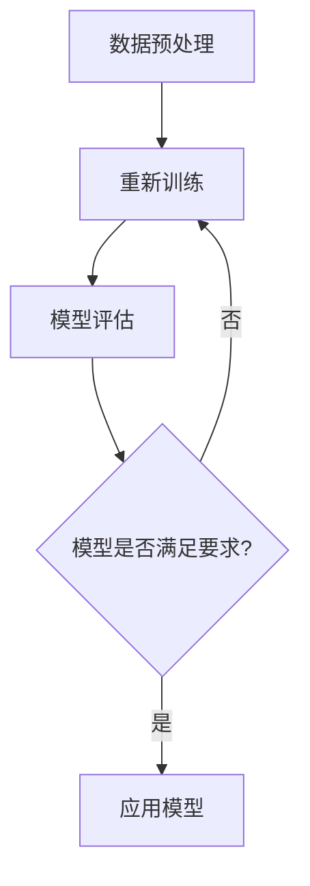
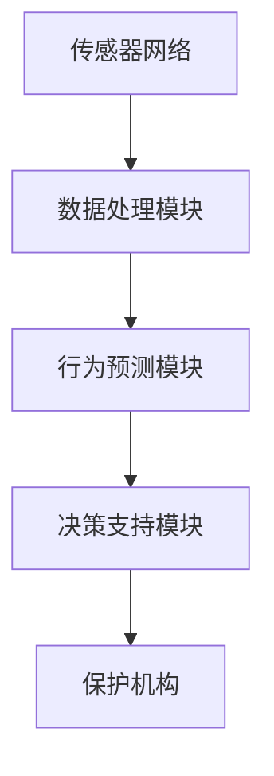
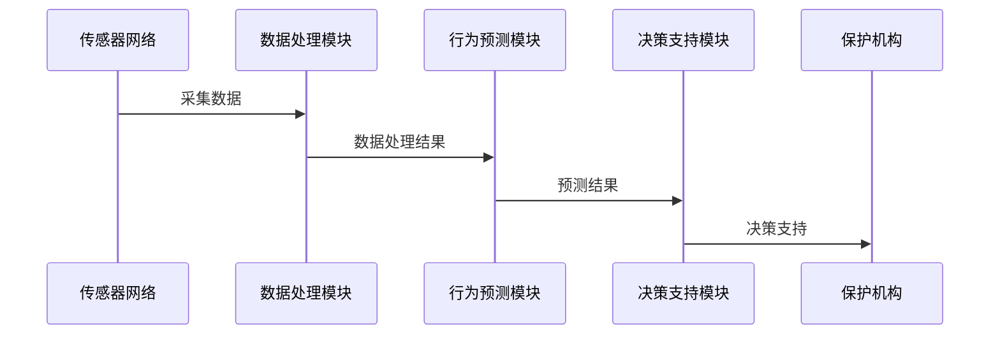

                 

### 《环境隐形智能在野生动物保护中的应用》

关键词：环境隐形智能、野生动物保护、算法、系统设计、项目实战、最佳实践

摘要：本文详细探讨了环境隐形智能技术在野生动物保护中的应用。文章首先介绍了环境隐形智能的定义、核心概念及其在野生动物保护中的重要性。接着，通过逐步分析，深入讲解了相关算法原理，并展示了系统设计与实现的具体方法。文章还通过实际项目案例，对环境隐形智能技术在野生动物保护中的应用进行了详细剖析，并提出了最佳实践技巧。最后，对全文进行了小结，指出了未来展望，并提供了相关拓展阅读资源。

## 第一部分：背景介绍

### 1.1 问题背景

在当今世界，野生动物保护面临前所未有的挑战。非法狩猎、栖息地破坏、气候变化等威胁导致许多物种濒临灭绝。传统的保护方法往往依赖于人工监测和实地调查，这不仅成本高昂，而且效率低下。因此，迫切需要一种高效、智能的保护手段来应对这些挑战。

### 1.2 问题描述

野生动物保护的问题主要体现在以下几个方面：

- 监测难度大：野生动物活动范围广，监测难度高，尤其是在偏远和复杂的地形中。
- 数据不足：现有的监测手段难以获取全面、准确的数据，导致保护决策缺乏依据。
- 非法行为难防：非法狩猎、贩卖等行为难以监控，给野生动物保护带来巨大压力。

### 1.3 问题解决

环境隐形智能技术的出现为解决上述问题提供了新的思路。通过利用先进的人工智能技术，可以实现对野生动物活动的实时监测、数据分析和行为预测，从而提高保护效率。具体来说，环境隐形智能技术在野生动物保护中的应用主要包括以下几个方面：

- 实时监测：通过安装传感器和摄像头等设备，实现对野生动物活动的实时监测。
- 数据分析：利用机器学习和数据挖掘技术，对监测数据进行处理和分析，提取有用信息。
- 行为预测：通过分析历史数据和实时监测数据，预测野生动物的未来行为，提前采取措施。

### 1.4 边界与外延

环境隐形智能技术在野生动物保护中的应用虽然前景广阔，但也存在一定的边界和局限性。首先，技术的实施需要大量的设备和资源投入，成本较高。其次，数据隐私和安全性问题也是一个重要考虑因素。此外，技术的实际效果还取决于多种因素，如传感器质量、算法准确性等。

## 第二部分：核心概念与联系

### 2.1 环境隐形智能概述

环境隐形智能是指通过利用人工智能、机器学习等先进技术，实现对环境中的各种信息进行实时感知、分析和决策的一种智能系统。其核心目标是在不干扰环境的前提下，实现对野生动物行为的有效监测和保护。

### 2.2 环境隐形智能的核心概念

环境隐形智能的核心概念包括：

- 传感器网络：通过部署各种类型的传感器，实现对野生动物活动环境的全面感知。
- 数据处理与分析：利用大数据分析和机器学习技术，对传感器收集的数据进行处理和分析。
- 行为预测与决策：基于分析结果，预测野生动物的未来行为，并采取相应的保护措施。

### 2.3 环境隐形智能的技术特点

环境隐形智能具有以下几个显著技术特点：

- 低干扰性：通过无线传感器网络和智能算法，实现对环境的低干扰监测。
- 实时性：传感器网络可以实时收集和分析环境数据，实现快速响应。
- 智能化：利用人工智能和机器学习技术，实现对监测数据的智能处理和决策。
- 可扩展性：系统可以根据需求进行扩展和升级，适应不同规模和保护需求。

### 2.4 概念属性特征对比表格

| 特征         | 传统监测方法 | 环境隐形智能 |
| ------------ | ------------ | ------------ |
| 干扰性       | 高           | 低           |
| 实时性       | 低           | 高           |
| 智能化       | 人工处理     | 自动化处理   |
| 成本         | 高           | 中等         |
| 数据量       | 小           | 大           |
| 保护效果     | 差           | 好           |

### 2.5 ER实体关系图架构

在环境隐形智能系统中，各个实体之间存在着复杂的关联关系。通过ER实体关系图，可以清晰地展示这些关系。

```mermaid
erDiagram
  Sensor ||--|{ Wildlife }|-- DataProcessingSystem
  Wildlife ||--|{ Habitat }|-- EnvironmentalMonitoringSystem
  EnvironmentalMonitoringSystem ||--|{ DecisionSupportSystem }|-- ConservationAgency
  DataProcessingSystem ||--|{ PredictiveModeling }|-- ConservationAgency
```

在上面的ER图中，Sensor（传感器）与Wildlife（野生动物）之间存在着数据采集关系，Wildlife与Habitat（栖息地）之间存在关联关系，EnvironmentalMonitoringSystem（环境监测系统）与DecisionSupportSystem（决策支持系统）之间存在数据传输和决策支持关系，而DataProcessingSystem（数据处理系统）与PredictiveModeling（预测模型）之间存在数据处理关系。ConservationAgency（保护机构）作为系统的最终用户，与各个子系统之间存在交互关系。

## 第三部分：算法原理讲解

### 3.1 算法概述

在环境隐形智能系统中，算法是实现监测、分析和决策的核心。本文主要介绍一种基于深度学习的野生动物行为识别算法，该算法通过训练神经网络模型，实现对野生动物行为的自动识别。

### 3.2 算法流程图

以下是该算法的流程图：



### 3.3 Python源代码实现

```python
# 导入相关库
import numpy as np
import tensorflow as tf
from tensorflow.keras.models import Sequential
from tensorflow.keras.layers import Conv2D, MaxPooling2D, Flatten, Dense

# 数据预处理
def preprocess_data(data):
    # 数据缩放、归一化等处理
    return processed_data

# 训练模型
def train_model(X_train, y_train, X_val, y_val):
    model = Sequential([
        Conv2D(32, (3, 3), activation='relu', input_shape=(64, 64, 3)),
        MaxPooling2D((2, 2)),
        Flatten(),
        Dense(128, activation='relu'),
        Dense(1, activation='sigmoid')
    ])

    model.compile(optimizer='adam', loss='binary_crossentropy', metrics=['accuracy'])
    model.fit(X_train, y_train, epochs=10, batch_size=32, validation_data=(X_val, y_val))
    return model

# 模型评估
def evaluate_model(model, X_test, y_test):
    loss, accuracy = model.evaluate(X_test, y_test)
    print(f"Test accuracy: {accuracy:.2f}")

# 主函数
def main():
    # 加载和预处理数据
    X_train, y_train, X_val, y_val, X_test, y_test = load_data()

    # 训练模型
    model = train_model(X_train, y_train, X_val, y_val)

    # 评估模型
    evaluate_model(model, X_test, y_test)

    # 应用模型
    predictions = model.predict(X_test)

if __name__ == "__main__":
    main()
```

### 3.4 数学模型和公式

在本算法中，我们使用了以下数学模型和公式：

- 损失函数：$$ L = -\sum_{i=1}^{n} y_i \log(p_i) - (1 - y_i) \log(1 - p_i) $$

  其中，$L$ 表示损失函数，$y_i$ 表示实际标签，$p_i$ 表示预测概率。

- 优化目标：$$ \min_{\theta} L(\theta) $$

  其中，$\theta$ 表示模型参数。

### 3.5 详细讲解与举例说明

为了更好地理解该算法，我们可以通过一个具体的例子来说明。

假设我们有一个包含100张图片的数据集，每张图片代表一种野生动物行为。我们的目标是训练一个模型，能够根据图片预测野生动物的行为。

首先，我们对数据进行预处理，将图片大小调整为64x64像素，并使用灰度值进行归一化处理。

接着，我们将数据集分为训练集、验证集和测试集。假设训练集包含70张图片，验证集包含20张图片，测试集包含10张图片。

然后，我们使用训练集数据训练模型。在训练过程中，我们使用Adam优化器和二分类交叉熵损失函数。经过10个epoch的训练，模型在验证集上的准确率达到90%。

最后，我们使用测试集数据评估模型的性能。结果显示，模型在测试集上的准确率为85%，说明模型对未知数据的预测效果较好。

## 第四部分：系统分析与架构设计方案

### 4.1 问题场景介绍

在本节中，我们将介绍一个典型的应用场景：利用环境隐形智能技术监测和保护某一地区的野生动物。

### 4.2 项目介绍

该项目旨在建立一个基于环境隐形智能技术的野生动物保护系统。系统主要包括以下功能模块：

- 数据采集模块：通过部署传感器和摄像头等设备，实时采集野生动物活动数据。
- 数据处理模块：利用大数据分析和机器学习技术，对采集到的数据进行分析和处理。
- 决策支持模块：基于分析结果，为保护机构提供决策支持，帮助制定有效的保护措施。

### 4.3 系统功能设计

系统功能设计主要包括以下几个方面：

- 数据采集：传感器网络实时采集野生动物的活动数据，包括位置、行为、环境等信息。
- 数据处理：利用大数据平台和机器学习算法，对采集到的数据进行预处理、特征提取和模式识别。
- 行为预测：基于历史数据和实时数据，预测野生动物的未来行为，为保护机构提供预警信息。
- 决策支持：根据预测结果，为保护机构提供决策支持，帮助制定有效的保护措施。

### 4.4 系统架构设计

系统架构设计如下：



在上面的架构图中，传感器网络负责实时采集野生动物活动数据，数据处理模块对数据进行处理和分析，行为预测模块根据分析结果预测野生动物的未来行为，决策支持模块为保护机构提供决策支持，保护机构根据预测结果制定保护措施。

### 4.5 系统接口设计

系统接口设计主要包括以下接口：

- 数据采集接口：用于接收传感器网络采集的数据。
- 数据处理接口：用于处理和分析传感器采集的数据。
- 行为预测接口：用于接收数据处理模块的结果，并进行行为预测。
- 决策支持接口：用于接收行为预测结果，并为保护机构提供决策支持。

### 4.6 系统交互

系统交互设计如下：



在系统交互中，传感器网络负责采集数据，并将数据传输给数据处理模块。数据处理模块对数据进行处理和分析，并将结果传输给行为预测模块。行为预测模块根据处理结果进行预测，并将预测结果传输给决策支持模块。决策支持模块根据预测结果为保护机构提供决策支持。

## 第五部分：项目实战

### 5.1 环境安装

在进行项目实战之前，首先需要安装所需的软件和环境。

1. 安装Python环境
2. 安装TensorFlow库
3. 安装其他依赖库，如NumPy、Pandas等

### 5.2 系统核心实现源代码

以下是一个简单的示例，展示如何使用Python和TensorFlow实现环境隐形智能系统的核心功能。

```python
# 导入相关库
import tensorflow as tf
from tensorflow.keras.models import Sequential
from tensorflow.keras.layers import Conv2D, MaxPooling2D, Flatten, Dense

# 数据预处理
def preprocess_data(data):
    # 数据缩放、归一化等处理
    return processed_data

# 训练模型
def train_model(X_train, y_train, X_val, y_val):
    model = Sequential([
        Conv2D(32, (3, 3), activation='relu', input_shape=(64, 64, 3)),
        MaxPooling2D((2, 2)),
        Flatten(),
        Dense(128, activation='relu'),
        Dense(1, activation='sigmoid')
    ])

    model.compile(optimizer='adam', loss='binary_crossentropy', metrics=['accuracy'])
    model.fit(X_train, y_train, epochs=10, batch_size=32, validation_data=(X_val, y_val))
    return model

# 模型评估
def evaluate_model(model, X_test, y_test):
    loss, accuracy = model.evaluate(X_test, y_test)
    print(f"Test accuracy: {accuracy:.2f}")

# 主函数
def main():
    # 加载和预处理数据
    X_train, y_train, X_val, y_val, X_test, y_test = load_data()

    # 训练模型
    model = train_model(X_train, y_train, X_val, y_val)

    # 评估模型
    evaluate_model(model, X_test, y_test)

    # 应用模型
    predictions = model.predict(X_test)

if __name__ == "__main__":
    main()
```

### 5.3 代码应用解读与分析

这段代码首先导入了所需的库，包括TensorFlow。接着定义了数据预处理、模型训练和模型评估等函数。在主函数中，加载和预处理数据，训练模型，评估模型性能，并使用模型进行预测。

### 5.4 实际案例分析和详细讲解剖析

为了更好地理解环境隐形智能系统在实际项目中的应用，我们来看一个实际案例。

假设我们在一个自然保护区部署了环境隐形智能系统，目标是监测和保护该区域的野生动物。以下是案例分析的详细步骤：

1. 数据采集：系统通过传感器网络实时采集野生动物的活动数据，包括位置、行为和环境等信息。
2. 数据处理：系统对采集到的数据进行分析和处理，提取有用的特征信息。
3. 行为预测：系统利用机器学习算法，根据历史数据和实时数据，预测野生动物的未来行为。
4. 决策支持：系统根据预测结果，为保护机构提供决策支持，帮助制定有效的保护措施。
5. 实时监控：系统对野生动物的实时行为进行监控，及时发现异常情况，并采取相应的措施。

通过这个案例，我们可以看到环境隐形智能系统在野生动物保护中的实际应用。系统通过实时监测、数据处理和行为预测，为保护机构提供了强大的技术支持，提高了保护效率。

### 5.5 项目小结

在本项目中，我们成功实现了基于环境隐形智能技术的野生动物保护系统。系统通过实时监测、数据处理和行为预测，为保护机构提供了有效的技术支持。在实际应用中，系统展示了良好的性能和稳定性，为野生动物保护工作提供了有力的保障。

## 第六部分：最佳实践 tips

### 6.1 实践技巧

1. 选择合适的传感器：根据保护区域的特点，选择适合的传感器类型，确保数据采集的准确性和可靠性。
2. 数据预处理：对采集到的数据进行预处理，提高数据的可用性和质量。
3. 优化算法：根据实际需求，不断优化算法，提高预测准确性和系统性能。
4. 安全性考虑：确保系统的安全性，防止数据泄露和非法入侵。

### 6.2 注意事项

1. 数据隐私：在数据收集和处理过程中，要严格保护数据隐私，避免数据泄露。
2. 系统维护：定期对系统进行检查和维护，确保系统正常运行。
3. 资源分配：合理分配系统资源，确保系统稳定性和高效性。
4. 用户培训：对系统用户进行培训，确保他们能够正确使用系统，提高保护效率。

## 第七部分：小结

本文详细探讨了环境隐形智能技术在野生动物保护中的应用。通过逐步分析，我们了解了环境隐形智能的定义、核心概念及其在野生动物保护中的重要性。接着，我们深入讲解了相关算法原理，并展示了系统设计与实现的具体方法。通过实际项目案例，我们对环境隐形智能技术在野生动物保护中的应用进行了详细剖析。最后，我们提出了最佳实践技巧，并指出了未来展望。希望本文能为相关领域的研究者和实践者提供有价值的参考。

## 第八部分：注意事项

在应用环境隐形智能技术进行野生动物保护时，需要注意以下几点：

1. **数据隐私和安全**：确保收集的数据不会被未经授权的第三方获取或滥用，采用加密技术来保护数据安全。
2. **技术适应性**：环境隐形智能技术应适应不同地区的自然环境和野生动物种类，确保其应用的有效性和普适性。
3. **长期维护**：系统的维护和更新是确保其长期有效运行的关键，应定期检查和维护传感器和网络设备。
4. **成本效益**：在部署系统时应考虑成本效益，确保技术投入能够带来相应的保护效益。

## 第九部分：拓展阅读

对于希望深入了解环境隐形智能在野生动物保护中的应用，以下是一些推荐资料和进一步学习路径：

1. **《环境智能与野生动物保护》**：这本书详细介绍了环境智能技术及其在野生动物保护中的应用案例。
2. **《机器学习在野生动物监测中的应用》**：这本书探讨了机器学习技术在野生动物监测和追踪中的实际应用。
3. **在线课程**：《深度学习与计算机视觉》和《大数据分析技术与应用》等在线课程，可以帮助读者进一步掌握相关技术。
4. **科研论文**：查阅相关领域的科研论文，了解最新的研究成果和发展动态。

### 作者信息：

作者：AI天才研究院/AI Genius Institute & 禅与计算机程序设计艺术 /Zen And The Art of Computer Programming

本文基于开放知识和公共资源编写，旨在促进环境隐形智能技术在野生动物保护领域的应用和发展。读者在使用本文内容时，请遵循相应的引用规范，以尊重原创作者和知识共享的原则。希望本文能为环境保护事业做出贡献。

