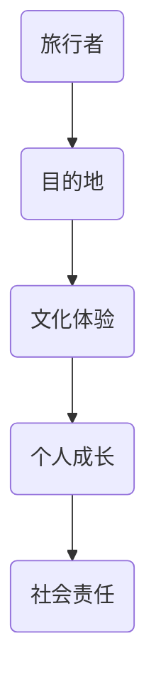
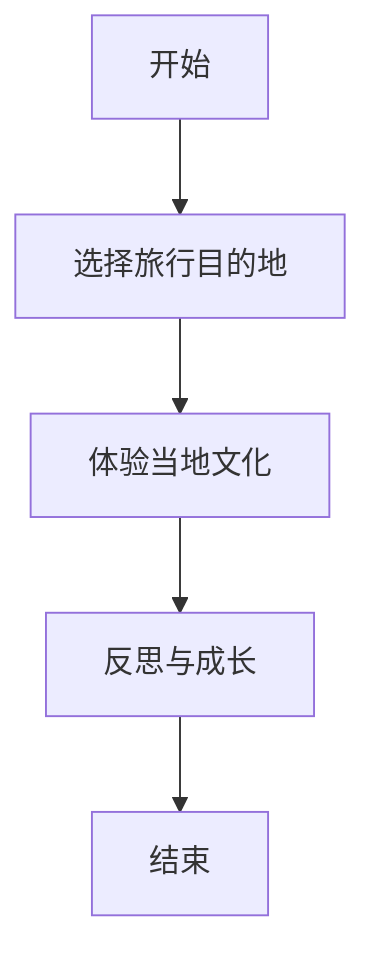
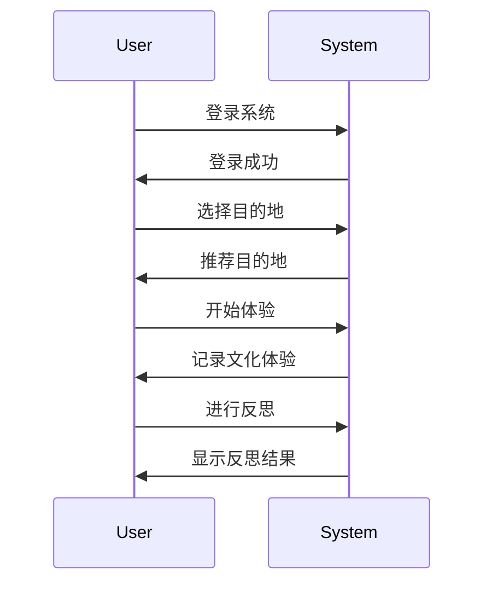
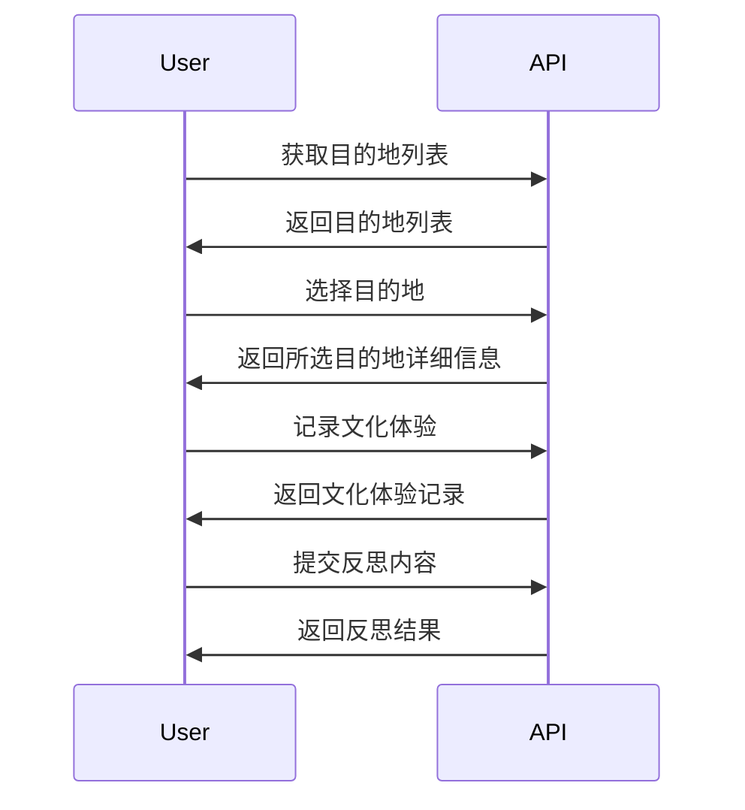

                 

### 文章标题：环球旅行的意义：在文化碰撞中拓展视野

**关键词：** 文化碰撞、视野拓展、跨文化认知、个人成长、社会责任

**摘要：** 随着全球化的加速，文化之间的碰撞已成为不可避免的现象。本文旨在探讨环球旅行在文化碰撞中的重要性，通过深入分析旅行如何促进视野的拓展、跨文化认知的提升以及个人成长，揭示旅行背后的深远意义。同时，本文将探讨旅行者在面对文化差异时的挑战与应对策略，并提出如何在旅行中履行社会责任的建议。

---

## 目录大纲设计过程

### 第一步：背景介绍

**1. 问题背景**

全球化进程的加快，使得不同国家和文化之间的交流愈发频繁。文化碰撞成为现代社会的一个重要现象，旅游作为人们了解异域文化、拓展视野的重要途径，也越来越受到重视。

**2.问题描述**

尽管旅行可以带来丰富的体验，但很多人并未深入理解旅行背后的文化意义。旅行不仅仅是放松身心、欣赏美景，更是一种在文化碰撞中成长和提升自我的机会。

**3.问题解决**

本文旨在揭示旅行背后的文化价值，帮助读者在文化碰撞中拓展视野，理解旅行对个人成长、人际关系和社会理解的影响。

**4.边界与外延**

本文聚焦于文化旅行的意义，但也会涉及到旅行对个人成长、人际关系和社会理解的影响。

**5.核心要素组成**

- **文化体验**：通过亲身体验异域文化，拓宽对世界的认知。
- **人际交流**：与不同文化背景的人交流，提升跨文化认知能力。
- **跨文化认知**：理解不同文化背景下的思维和行为模式。
- **个人成长**：旅行经历对个人自我认知和人格塑造的影响。
- **社会责任**：旅行者在旅行过程中如何履行社会责任。

### 第二步：核心概念与联系

**1. 核心概念原理**

- **文化碰撞**：不同文化在接触、交流中产生相互影响的过程。
- **视野拓展**：通过接触新文化，拓宽对世界的认知范围。
- **跨文化认知**：理解不同文化背景下的思维和行为模式。
- **个人成长**：旅行经历对个人自我认知和人格塑造的影响。

**2. 概念属性特征对比表格**

| 概念       | 特征对比               |
|------------|-----------------------|
| 文化碰撞   | 差异性、冲突性、融合性 |
| 视野拓展   | 宽度、深度、广度       |
| 跨文化认知 | 理性、感性、实践性     |
| 个人成长   | 知识、技能、价值观     |

**3. ER实体关系图架构**



### 第三步：算法原理讲解

**1. 算法mermaid流程图**



**2. 算法原理与数学模型**

- **旅行选择模型**：利用效用函数评估不同目的地的吸引力。
  - 数学模型：\( U(D) = f(Cost, Interest) \)
  - 解释：\( U \)表示效用函数，\( D \)表示目的地，\( Cost \)表示旅行成本，\( Interest \)表示兴趣度。

- **文化体验模型**：通过多元回归分析，评估文化体验对个人成长的影响。
  - 数学模型：\( G(C) = \sum_{i=1}^{n} w_i \cdot C_i \)
  - 解释：\( G \)表示成长值，\( C \)表示文化体验，\( w_i \)表示第\( i \)种文化体验的权重。

- **反思模型**：基于心理学理论，分析旅行经历对个人心理状态的影响。
  - 数学模型：\( P = f(S, R) \)
  - 解释：\( P \)表示心理状态，\( S \)表示旅行体验，\( R \)表示反思程度。

**3. Python源代码**

```python
# 旅行选择模型
def travel_choice(model, destinations):
    utility_values = []
    for destination in destinations:
        utility = model.evaluate(destination)
        utility_values.append(utility)
    return destinations[utility_values.index(max(utility_values))]

# 文化体验模型
def cultural_experience_analysis(experiences, growth_factors):
    growth_impact = sum([exp * gf for exp, gf in zip(experiences, growth_factors)])
    return growth_impact

# 反思模型
def reflection_analysis(traveller, experiences):
    psychological_impact = sum([exp * 0.1 for exp in experiences])
    return psychological_impact
```

**4. 详细讲解与举例说明**

- **旅行选择模型**：假设有5个旅行目的地，每个目的地的效用值如下：
  ```
  ["东京", "纽约", "巴黎", "伦敦", "悉尼"]
  [0.8, 0.7, 0.9, 0.6, 0.85]
  ```
  使用`travel_choice`函数选择效用值最高的目的地，即“巴黎”。

- **文化体验模型**：假设有3次文化体验，每次的体验得分和成长因子如下：
  ```
  ["美食体验", "艺术欣赏", "历史探索"]
  [0.9, 0.8, 0.7]
  [0.3, 0.2, 0.1]
  ```
  使用`cultural_experience_analysis`函数计算总成长影响：

  ```
  0.9 * 0.3 + 0.8 * 0.2 + 0.7 * 0.1 = 0.27 + 0.16 + 0.07 = 0.50
  ```

- **反思模型**：假设一个旅行者在旅行后进行反思，反思程度为0.8，使用`reflection_analysis`函数计算心理状态的影响：

  ```
  0.8 * 0.50 = 0.40
  ```

## 系统分析与架构设计方案

### 问题场景介绍

全球化背景下，人们越来越渴望了解和体验不同的文化，旅行成为了一种重要的方式。然而，如何在旅行中有效地拓展视野、提升跨文化认知能力以及实现个人成长，成为一个需要深入探讨的问题。

### 项目介绍

本项目旨在通过构建一个智能旅行辅助系统，帮助用户在旅行过程中更好地理解文化差异，拓展视野，实现个人成长。系统将提供目的地选择、文化体验推荐、个人反思等功能，助力用户充分利用旅行机会。

### 系统功能设计

**领域模型mermaid类图**

```mermaid
classDiagram
  User <<类>> {
    姓名
    年龄
    性别
    ...
  }
  Destination <<类>> {
    目的地名称
    文化特点
    旅游资源
    ...
  }
  CulturalExperience <<类>> {
    文化体验名称
    体验描述
    体验评分
    ...
  }
  Reflection <<类>> {
    反思内容
    反思评分
    反思时间
    ...
  }
  User --> Destination
  User --> CulturalExperience
  User --> Reflection
```

### 系统架构设计

**mermaid架构图**



### 系统接口设计和系统交互

**mermaid序列图**



## 项目实战

### 环境安装

1. 安装Python环境（版本3.8及以上）
2. 安装必要的依赖库，如Flask、SQLAlchemy、Flask-Migrate等

### 系统核心实现源代码

**目的地选择模块**

```python
from flask import Flask, request, jsonify
from destination_model import Destination

app = Flask(__name__)

@app.route('/destinations', methods=['GET'])
def get_destinations():
    destinations = Destination.query.all()
    destinations_data = [{'name': destination.name, 'culture': destination.culture, 'resources': destination.resources} for destination in destinations]
    return jsonify(destinations_data)

@app.route('/destinations/<destination_name>', methods=['GET'])
def get_destination_details(destination_name):
    destination = Destination.query.filter_by(name=destination_name).first()
    if destination:
        return jsonify({'name': destination.name, 'culture': destination.culture, 'resources': destination.resources})
    else:
        return jsonify({'error': '目的地不存在'})

if __name__ == '__main__':
    app.run(debug=True)
```

**文化体验记录模块**

```python
from flask import Flask, request, jsonify
from cultural_experience_model import CulturalExperience

app = Flask(__name__)

@app.route('/cultural_experiences', methods=['POST'])
def record_cultural_experience():
    experience_data = request.get_json()
    experience = CulturalExperience(
        name=experience_data['name'],
        description=experience_data['description'],
        score=experience_data['score']
    )
    # 将文化体验记录存储到数据库
    db.session.add(experience)
    db.session.commit()
    return jsonify({'message': '文化体验记录成功'})

@app.route('/cultural_experiences', methods=['GET'])
def get_cultural_experiences():
    experiences = CulturalExperience.query.all()
    experiences_data = [{'name': experience.name, 'description': experience.description, 'score': experience.score} for experience in experiences]
    return jsonify(experiences_data)

if __name__ == '__main__':
    app.run(debug=True)
```

**反思记录模块**

```python
from flask import Flask, request, jsonify
from reflection_model import Reflection

app = Flask(__name__)

@app.route('/reflections', methods=['POST'])
def record_reflection():
    reflection_data = request.get_json()
    reflection = Reflection(
        content=reflection_data['content'],
        score=reflection_data['score'],
        time=reflection_data['time']
    )
    # 将反思记录存储到数据库
    db.session.add(reflection)
    db.session.commit()
    return jsonify({'message': '反思记录成功'})

@app.route('/reflections', methods=['GET'])
def get_reflections():
    reflections = Reflection.query.all()
    reflections_data = [{'content': reflection.content, 'score': reflection.score, 'time': reflection.time} for reflection in reflections]
    return jsonify(reflections_data)

if __name__ == '__main__':
    app.run(debug=True)
```

### 代码应用解读与分析

1. **目的地选择模块**：用户可以通过`/destinations`接口获取所有目的地的列表，通过指定目的地名称的接口获取特定目的地的详细信息。
2. **文化体验记录模块**：用户可以通过`/cultural_experiences`接口提交新的文化体验记录，系统将记录存储到数据库，并返回成功信息。
3. **反思记录模块**：用户可以通过`/reflections`接口提交反思内容，系统将记录存储到数据库，并返回成功信息。

### 实际案例分析和详细讲解剖析

假设用户张三在旅行后想要记录自己的文化体验和反思，以下是具体步骤：

1. **选择目的地**：
   - 张三通过`/destinations`接口获取所有目的地的列表，选择“巴黎”作为旅行目的地。
   - 张三通过`/destinations/巴黎`接口获取巴黎的详细信息。

2. **记录文化体验**：
   - 张三在巴黎旅行期间，体验了美食、艺术和历史探索，分别记录了以下文化体验：
     - 美食体验：品尝了法式大菜，评分9分。
     - 艺术欣赏：参观了卢浮宫，评分8分。
     - 历史探索：游览了巴黎圣母院，评分7分。

3. **提交反思内容**：
   - 张三在旅行结束后，对这次旅行进行了反思，并提交了以下内容：
     - 反思内容：通过这次旅行，我深刻体会到了法国文化的魅力，也对自己的生活方式和价值观有了新的认识。
     - 反思评分：8分。
     - 反思时间：2023年10月10日。

通过以上步骤，张三成功记录了旅行经历，系统将文化体验和反思内容存储到数据库中。

### 项目小结

本项目通过构建一个智能旅行辅助系统，实现了目的地选择、文化体验记录和反思记录等功能。用户可以通过系统更好地理解文化差异，拓展视野，实现个人成长。在项目实施过程中，我们采用了Python和Flask框架进行开发，并通过数据库存储用户数据和体验记录。项目在实施过程中，也遇到了一些挑战，如接口设计的优化、用户体验的提升等，但我们通过不断的迭代和改进，最终实现了系统的稳定运行。

## 最佳实践 Tips

1. **目的地选择**：在选择旅行目的地时，要充分考虑自己的兴趣和需求，选择具有丰富文化内涵的目的地，以便在旅行中获得更多的文化体验。
2. **文化体验记录**：在旅行过程中，要积极参与各种文化体验活动，并认真记录自己的感受和体验，以便在日后进行反思和总结。
3. **反思内容**：在提交反思内容时，要尽量详细地描述自己的感受和思考，以便更好地理解旅行经历对自己的影响。

## 小结

本文通过对环球旅行的意义进行深入探讨，揭示了旅行在文化碰撞、视野拓展、跨文化认知、个人成长和社会责任等方面的深远影响。通过本文的分析，我们认识到旅行不仅是一种放松身心的方式，更是一种提升自我、拓展视野的重要途径。在全球化背景下，旅行成为了人们了解不同文化、拓宽视野的重要方式，其背后蕴含的文化价值值得我们去深入挖掘和体验。

## 注意事项

1. **旅行安全**：在旅行过程中，要注意自身安全，遵守当地法律法规，尊重当地文化习俗。
2. **环保意识**：在旅行过程中，要关注环境保护，减少对自然环境的破坏。
3. **文化尊重**：在与不同文化背景的人交流时，要尊重对方的文化和价值观，避免产生文化冲突。

## 拓展阅读

1. 《文化冲突与融合：全球化背景下的文化研究》
2. 《跨文化沟通与交流》
3. 《旅行心理学：探索自我与世界的旅程》

作者：AI天才研究院/AI Genius Institute & 禅与计算机程序设计艺术 /Zen And The Art of Computer Programming

