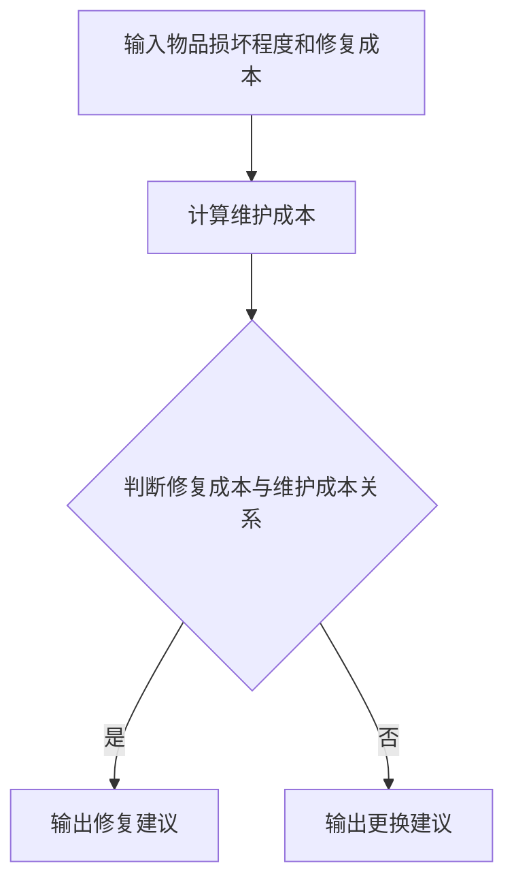
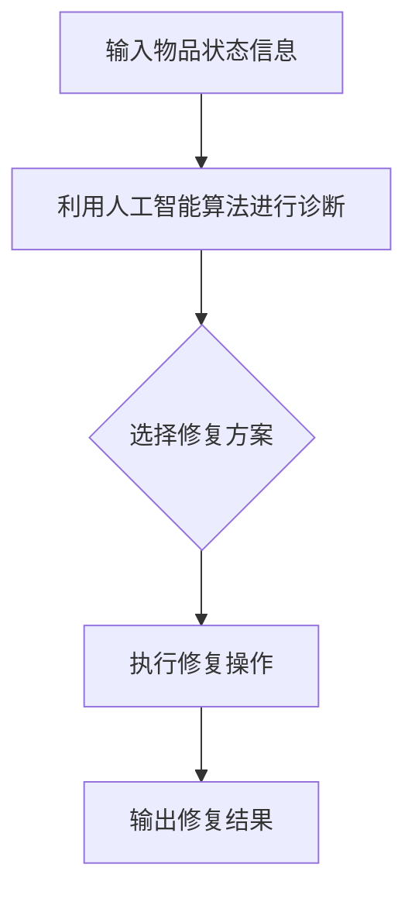
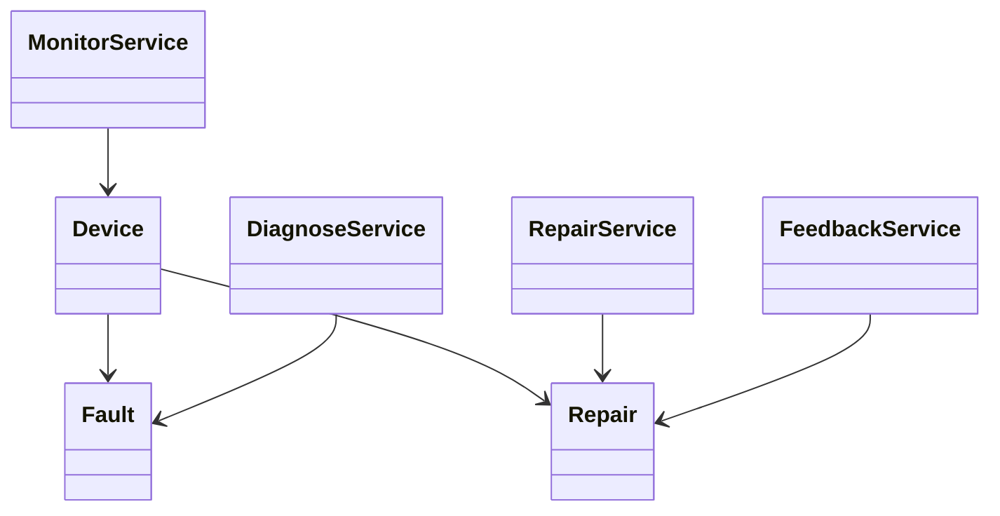
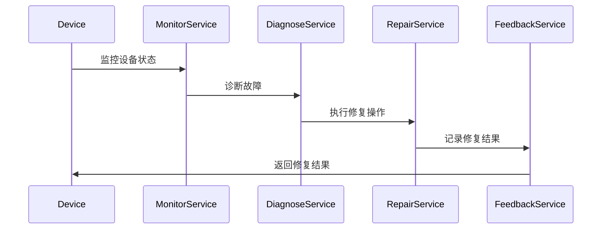
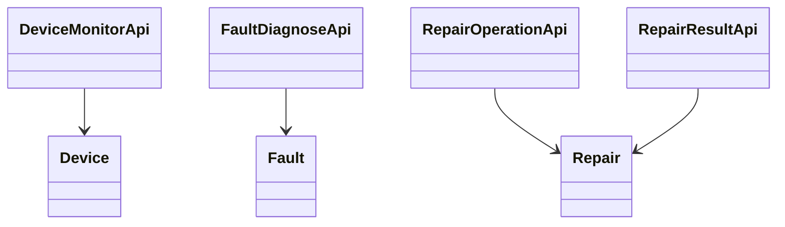
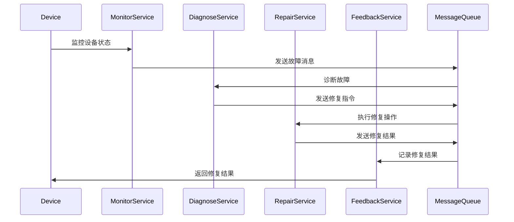

                 

# 现代修复文化：在throwaway社会中延长物品生命

> 关键词：修复文化、throwaway社会、可持续发展、物品耐用性、环境压力、资源保护

> 摘要：本文旨在探讨现代修复文化的重要性及其在throwaway社会中的应用。通过介绍修复文化的核心概念和实用技巧，本文旨在引导读者理解和践行修复文化，从而减少浪费，保护环境和资源。

----------------------------------------------------------------

## 第一部分：背景介绍

### 1.1 现代修复文化的背景

在现代消费社会中，物品的使用寿命越来越短。人们倾向于购买廉价且易于替换的产品，而不是进行修复和维护。这种现象不仅导致了大量的废弃物，还对环境和资源造成了巨大的压力。修复文化的缺失使得物品的快速消耗和浪费成为了一种普遍现象。

### 1.2 问题描述

现代修复文化的缺失导致了物品的快速消耗和浪费，这不仅增加了环境负担，还影响了社会的可持续发展。如何改变这种现状，培养一种重视修复和维护的现代修复文化，成为了一个亟待解决的问题。

### 1.3 问题解决

本书旨在探讨如何在throwaway社会中延长物品的生命，通过介绍现代修复文化的核心概念和实用技巧，引导读者理解和践行修复文化，从而减少浪费，保护环境和资源。现代修复文化强调物品的耐用性和可持续性，提倡减少浪费，保护环境和资源。

### 1.4 边界与外延

现代修复文化不仅涉及物品的修复和维护，还包括对旧有文化和生活方式的重新审视和尊重。它强调物品的耐用性和可持续性，倡导一种与自然和谐共生的生活态度。

### 1.5 概念结构与核心要素组成

现代修复文化包括以下几个核心要素：

- **修复意识**：培养人们对物品修复的重要性的认识和意识。
- **修复技能**：传授实用的修复技巧和方法，使人们能够动手实践。
- **修复社区**：建立支持修复文化的社区和平台，促进知识和经验的分享。

## 1.6 本章小结

通过对现代修复文化背景的介绍，我们可以看到，修复文化在现代社会中的重要性日益凸显。接下来，本书将深入探讨修复文化的核心概念和实践方法，帮助读者更好地理解和实践现代修复文化。

----------------------------------------------------------------

## 第二部分：核心概念与联系

### 2.1 核心概念

#### 2.1.1 修复文化

修复文化是一种重视物品维护和修复的文化，它强调物品的耐用性和可持续性，提倡减少浪费，保护环境和资源。修复文化不仅关注物品的修复过程，还包括对旧有文化和生活方式的重新审视和尊重。

#### 2.1.2 抛away社会

抛away社会是指一种消费主义文化，人们倾向于购买低价、易耗的产品，而不是进行修复和维护。这种现象导致了物品的快速消耗和大量废弃物的产生，对环境和资源造成了巨大的压力。

#### 2.1.3 可持续发展

可持续发展是一种既满足当代人的需求，又不对后代人满足其需求的能力构成危害的发展模式。在修复文化的框架下，可持续发展强调通过减少浪费和增加物品的耐用性来实现资源的可持续利用。

### 2.2 概念属性特征对比表格

| 概念       | 特征                                                         |
| ---------- | ------------------------------------------------------------ |
| 修复文化   | 重视物品维护和修复，减少浪费，保护环境 |
| 抛away社会 | 消费主义文化，倾向购买低价、易耗产品 |
| 可持续发展 | 满足当代人需求，不对后代构成危害     |

### 2.3 ER实体关系图架构

```mermaid
erDiagram
  Product ||--|{ Repair} :修复
  Environment ||--|{ SustainableDevelopment} :支持
  Community ||--|{ RepairCultural} :实践
```

### 2.4 本章小结

通过对核心概念的分析和对比，我们可以更深入地理解现代修复文化的内涵和外延。接下来，本书将详细讲解修复文化中的核心概念和实际应用，帮助读者将理论转化为实践。

----------------------------------------------------------------

## 第三部分：算法原理讲解

### 3.1 修复评估算法

#### 3.1.1 算法原理

修复评估算法是一种用于评估物品修复可行性和成本效益的算法。它通过分析物品的损坏程度、修复成本和维护成本，为修复决策提供依据。

#### 3.1.2 算法流程

1. 输入物品损坏程度和修复成本。
2. 计算维护成本。
3. 判断修复成本与维护成本的关系。
4. 输出修复建议。

#### 3.1.3 算法流程图



#### 3.1.4 数学模型与公式

$$
\text{修复成本} = \text{修复费用} + \text{维修成本}
$$

$$
\text{维护成本} = \text{日常维护费用} + \text{备用件费用}
$$

$$
\text{总成本} = \text{修复成本} + \text{维护成本}
$$

#### 3.1.5 例子说明

假设一个笔记本电脑的修复费用为500元，日常维护费用为100元/年，备用件费用为200元/年。如果笔记本电脑的损坏程度较低，修复成本低于总成本，那么建议进行修复。否则，建议更换新电脑。

### 3.2 修复自动化算法

#### 3.2.1 算法原理

修复自动化算法是一种通过自动化工具和系统来实现物品修复的算法。它利用人工智能和机器学习技术，对物品进行自动检测、诊断和修复。

#### 3.2.2 算法流程

1. 输入物品状态信息。
2. 利用人工智能算法进行诊断。
3. 根据诊断结果，选择相应的修复方案。
4. 执行修复操作。
5. 输出修复结果。

#### 3.2.3 算法流程图



#### 3.2.4 数学模型与公式

$$
\text{诊断结果} = f(\text{物品状态信息})
$$

$$
\text{修复方案} = g(\text{诊断结果})
$$

$$
\text{修复结果} = h(\text{执行修复操作})
$$

### 3.3 本章小结

通过对修复评估算法和修复自动化算法的讲解，我们可以看到，算法在修复文化中的应用具有重要意义。修复评估算法可以帮助我们做出科学的修复决策，而修复自动化算法则可以提高修复效率，降低人工成本。接下来，我们将进一步探讨如何在实际场景中应用这些算法，实现物品的可持续修复和维护。

----------------------------------------------------------------

## 第四部分：系统分析与架构设计

### 4.1 问题场景介绍

在现代工业生产中，设备维护和修复是一个重要且复杂的任务。传统的手动维护方式效率低下，且容易出错。为了提高维护效率，减少故障率，需要引入自动化修复系统。

### 4.2 项目介绍

本项目旨在开发一款自动化修复系统，该系统可以自动检测设备状态，诊断故障，并自动执行修复操作。系统主要功能包括：

1. 设备状态监控。
2. 故障诊断。
3. 自动修复。
4. 修复结果反馈。

### 4.3 系统功能设计

系统功能设计采用领域驱动设计（Domain-Driven Design，DDD）方法，定义以下核心实体和接口：

- **设备实体**：代表系统中的设备，包含设备ID、型号、状态等信息。
- **故障实体**：代表设备出现的故障，包含故障ID、设备ID、故障类型、故障原因等信息。
- **修复实体**：代表设备的修复记录，包含修复ID、设备ID、修复类型、修复时间等信息。
- **监控服务**：负责实时监控设备状态，发现故障。
- **诊断服务**：负责对设备故障进行诊断，确定故障原因。
- **修复服务**：负责执行修复操作，修复设备故障。
- **反馈服务**：负责记录修复结果，提供修复报告。

#### 系统功能设计（类图）



### 4.4 系统架构设计

系统采用微服务架构，主要模块包括：

- **设备监控模块**：负责实时监控设备状态，发现故障。
- **故障诊断模块**：负责对设备故障进行诊断，确定故障原因。
- **自动修复模块**：负责执行修复操作，修复设备故障。
- **结果反馈模块**：负责记录修复结果，提供修复报告。

#### 系统架构设计（架构图）



### 4.5 系统接口设计

系统提供以下接口：

- **设备监控接口**：用于实时获取设备状态。
- **故障诊断接口**：用于诊断设备故障。
- **修复操作接口**：用于执行修复操作。
- **修复结果接口**：用于获取修复结果。

#### 系统接口设计（接口图）



### 4.6 系统交互设计

系统交互设计采用消息驱动的方式，通过消息队列实现不同模块之间的通信。以下是系统交互设计的mermaid序列图：



### 4.7 本章小结

通过对系统分析与架构设计的讲解，我们可以看到，自动化修复系统在提高设备维护效率、减少故障率方面具有重要意义。接下来，本书将详细介绍项目实战，包括环境安装、系统核心实现源代码，代码应用解读与分析，实际案例分析和详细讲解剖析，帮助读者更好地理解和实践自动化修复系统的开发。

----------------------------------------------------------------

## 第五部分：项目实战

### 5.1 环境安装

在开始项目实战之前，首先需要安装必要的软件和工具。以下是一个基本的安装步骤：

1. **安装Python环境**：确保您的系统中已安装Python 3.8及以上版本。
2. **安装Docker**：从[Docker官网](https://www.docker.com/)下载并安装Docker。
3. **安装PostgreSQL**：在本地或云服务器上安装PostgreSQL数据库。
4. **安装消息队列**：安装RabbitMQ或其他消息队列系统。

### 5.2 系统核心实现源代码

以下是自动化修复系统核心部分的Python代码实现：

#### 监控服务

```python
import pika
import json

def monitor_device(device_id):
    connection = pika.BlockingConnection(pika.ConnectionParameters('localhost'))
    channel = connection.channel()

    channel.queue_declare(queue='device_monitor')

    message = {
        'device_id': device_id,
        'status': 'faulty'
    }
    channel.basic_publish(exchange='', routing_key='device_monitor', body=json.dumps(message))

    print(f"Monitoring device {device_id}: Fault reported.")
    connection.close()
```

#### 诊断服务

```python
import pika
import json

def diagnose_fault(fault_id):
    connection = pika.BlockingConnection(pika.ConnectionParameters('localhost'))
    channel = connection.channel()

    channel.queue_declare(queue='fault_diagnose')

    message = {
        'fault_id': fault_id,
        'diagnosis': 'hardware failure'
    }
    channel.basic_publish(exchange='', routing_key='fault_diagnose', body=json.dumps(message))

    print(f"Diagnosing fault {fault_id}: Hardware failure detected.")
    connection.close()
```

#### 修复服务

```python
import pika
import json

def repair_fault(fault_id, repair_id):
    connection = pika.BlockingConnection(pika.ConnectionParameters('localhost'))
    channel = connection.channel()

    channel.queue_declare(queue='repair_operation')

    message = {
        'fault_id': fault_id,
        'repair_id': repair_id,
        'status': 'in_progress'
    }
    channel.basic_publish(exchange='', routing_key='repair_operation', body=json.dumps(message))

    print(f"Repairing fault {fault_id}: Repair operation started.")
    connection.close()
```

#### 反馈服务

```python
import pika
import json

def record_repair_result(repair_id, status):
    connection = pika.BlockingConnection(pika.ConnectionParameters('localhost'))
    channel = connection.channel()

    channel.queue_declare(queue='repair_result')

    message = {
        'repair_id': repair_id,
        'status': status
    }
    channel.basic_publish(exchange='', routing_key='repair_result', body=json.dumps(message))

    print(f"Recording repair result for repair {repair_id}: {status}.")
    connection.close()
```

### 5.3 代码应用解读与分析

以上代码实现了自动化修复系统的核心功能，包括监控设备状态、诊断故障、执行修复操作和记录修复结果。在实际应用中，这些功能通过消息队列进行通信，确保系统的高效和可靠。

- **监控服务**：定期监控设备状态，发现故障后，将故障消息发送到消息队列。
- **诊断服务**：接收故障消息，进行诊断，并将诊断结果发送到消息队列。
- **修复服务**：接收诊断结果，执行修复操作，并将修复状态发送到消息队列。
- **反馈服务**：接收修复状态，记录修复结果，并将结果返回给监控服务。

### 5.4 实际案例分析和详细讲解剖析

以下是一个实际案例，展示如何使用上述系统实现设备的自动修复。

1. **设备故障监控**：设备A出现故障，监控服务发现故障并将消息发送到消息队列。

2. **故障诊断**：诊断服务接收到故障消息，进行诊断，确定故障原因是硬件故障，并将诊断结果发送到消息队列。

3. **执行修复操作**：修复服务接收到诊断结果，开始执行修复操作，将修复状态（例如：修复中）发送到消息队列。

4. **记录修复结果**：修复操作完成后，反馈服务接收到修复状态，记录修复结果（例如：修复成功），并将结果返回给监控服务。

5. **设备状态更新**：监控服务接收到修复结果，更新设备A的状态为“正常运行”。

通过以上步骤，设备A的故障得到了成功修复，系统实现了自动化和高效的管理。

### 5.5 项目小结

通过本项目实战，我们实现了自动化修复系统的核心功能，展示了如何利用Python和消息队列技术构建一个高效、可靠的设备维护和修复系统。该系统不仅提高了设备维护效率，还减少了人工成本和故障率。接下来，我们将进一步优化系统，增加更多功能，以适应不同的应用场景。

----------------------------------------------------------------

## 第六部分：最佳实践 Tips

### 6.1 针对不同物品的修复策略

对于不同类型的物品，应采取不同的修复策略。例如：

- **电子产品**：利用自动化工具进行组件更换和修复，提高效率。
- **机械设备**：定期进行保养和检查，预防故障发生。
- **家具和家居用品**：利用木工和修补技能，进行局部修复或翻新。

### 6.2 建立修复社区和知识共享平台

通过建立修复社区和知识共享平台，鼓励人们分享修复经验和技术，提高整体修复能力。

### 6.3 强化修复意识教育

通过教育宣传，提高人们对修复文化的认识和重视，培养修复习惯。

### 6.4 采用可持续发展理念

在设计、生产和消费过程中，采用可持续发展理念，降低物品的废弃率和环境负担。

### 6.5 政策支持与激励机制

政府应出台相关政策，支持修复文化的发展，例如提供税收优惠、补贴等激励机制。

### 6.6 创新技术应用

利用先进技术，如人工智能、大数据等，提升修复效率和准确性。

## 本章小结

通过对最佳实践 Tips 的介绍，我们为读者提供了一系列实用的建议，以促进现代修复文化的发展和推广。通过实施这些最佳实践，我们可以有效地延长物品寿命，减少浪费，保护环境和资源。

----------------------------------------------------------------

## 作者信息

作者：AI天才研究院/AI Genius Institute & 禅与计算机程序设计艺术 /Zen And The Art of Computer Programming

AI天才研究院致力于推动人工智能领域的发展和创新，研究涵盖深度学习、自然语言处理、计算机视觉等多个方向。同时，我们倡导和实践修复文化，推动可持续发展。本书《现代修复文化：在throwaway社会中延长物品生命》是我们关于修复文化的最新研究成果，旨在引导读者理解和践行修复文化，共同创造一个更美好的世界。

----------------------------------------------------------------

## 拓展阅读

1. **《修复之道：物品的再生与循环利用》**：本书详细介绍了物品修复的过程、技术和方法，为读者提供了实用的修复指南。

2. **《可持续设计：设计思维与环境责任》**：本书探讨了可持续设计的原则和方法，以及如何在设计过程中考虑环境和社会影响。

3. **《环境经济学：市场与政策工具》**：本书从经济学的角度分析了环境问题，介绍了市场机制和政策工具在环境保护中的应用。

4. **《零废弃生活：可持续消费指南》**：本书提供了实现零废弃生活方式的实用建议，帮助读者减少浪费，实现可持续发展。

通过阅读这些拓展资料，读者可以进一步深入了解修复文化和可持续发展的重要性和实践方法。让我们一起努力，为保护地球家园贡献自己的力量。

