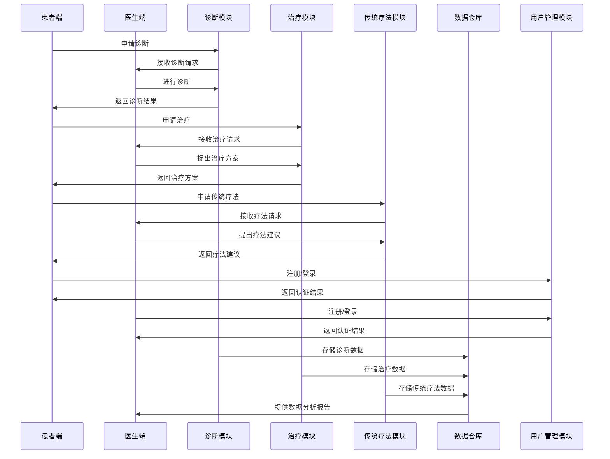
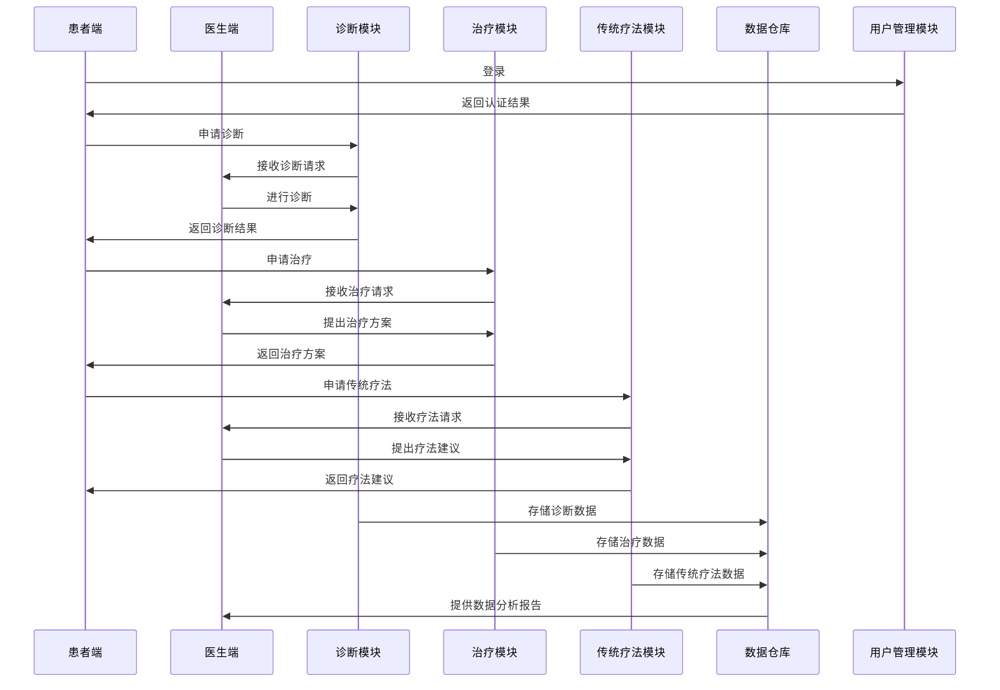

                 

### 第1章：现代医学的发展与全人健康观

**1.1 现代医学的崛起**

现代医学的崛起可以追溯到19世纪末到20世纪初，这一时期见证了微生物学、解剖学、生理学和生物化学等基础学科的飞速发展。现代医学的核心概念基于对生物体结构和功能的深入理解，以及对疾病机制的精确分析。

- **生物医学模式**：这是现代医学的主要模式，强调对疾病的生物和生理学解释。它依赖于实验证据、临床观察和数据驱动的方法来诊断和治疗疾病。
- **疾病分类**：现代医学通过诊断技术（如影像学、实验室检测）将疾病分类，从而为患者提供个性化的治疗方案。
- **药物开发**：现代医学推动了新药的研发，通过临床试验来验证药物的安全性和有效性。

然而，尽管现代医学在治疗许多疾病方面取得了显著成就，但它也面临着一些局限：

- **单一维度**：现代医学主要关注生物医学因素，而忽视了心理、社会和环境因素对健康的影响。
- **症状治疗而非根本治疗**：许多疾病的治疗往往只关注症状缓解，而不是根治病因。
- **过度依赖技术**：在某些情况下，过度依赖高科技设备和药物可能导致医疗资源的浪费和医疗成本的上升。

**1.2 传统疗法的传承与发展**

传统疗法在不同文化中有着悠久的历史，如中医、印度阿育吠陀、西方顺势疗法等。这些疗法通常基于整体观和自然观，强调身心健康和自然平衡。

- **针灸**：通过刺激特定穴位来调节身体能量（称为“气”）以治疗疾病。
- **中药**：使用天然草药和其他成分来治疗疾病，强调药物的协同作用。
- **瑜伽**：通过身体姿势、呼吸控制和冥想来实现身心健康。

传统疗法的基本原理包括：

- **整体观**：传统疗法认为人体是一个整体，各个部分相互关联，疾病是整体失衡的表现。
- **自然观**：传统疗法强调自然疗法，使用天然产品和自然方法来促进健康。

在现代社会的地位方面，传统疗法逐渐得到认可，特别是在治疗慢性病和预防保健方面。它们与现代医学形成了互补关系，为全人健康观提供了多维度、多层次的支持。

**1.3 全人健康观的概念与起源**

全人健康观是一种综合性的健康理念，强调身心健康、社会关系和环境的整体平衡。它起源于20世纪中叶，随着对健康和疾病理解的深化而逐渐形成。

- **身心健康**：全人健康观认为心理健康和身体健康是相互依赖的，通过调节情绪和压力来维护健康。
- **社会关系**：社会支持和个人关系对健康有重要影响，良好的社会关系有助于减轻压力和提高生活质量。
- **环境保护**：环境质量对健康有直接和间接的影响，全人健康观强调通过保护环境来维护健康。

全人健康观的核心要素包括：

- **个性化**：每个个体都有独特的健康需求，治疗方案应因人而异。
- **预防为主**：通过健康教育和预防措施来降低疾病风险。
- **整体护理**：医疗服务应涵盖身体、心理、社会和环境等多个方面。

**1.4 现代医学与传统疗法的融合趋势**

随着对健康和疾病认识的不断深化，现代医学与传统疗法之间的融合趋势日益明显。这种融合不仅必要，而且具有可能性。

- **必要性与可能性**：全人健康观要求综合多种治疗方法来应对复杂的健康问题。现代医学和传统疗法各有优势，融合可以取长补短。
- **挑战与机遇**：融合面临着标准制定、文化差异和科学验证等挑战，但也带来了创新和综合治疗的新机遇。

融合的实践案例包括：

- **综合医疗中心**：提供现代医学和传统疗法的整合服务，为患者提供个性化的治疗方案。
- **跨学科研究**：医学、心理学、社会学和环境科学等多个领域的专家合作，共同探索健康和疾病的新模式。

**1.5 本章小结**

本章介绍了现代医学与传统疗法的背景和融合的全人健康观。现代医学虽然在疾病治疗方面取得了显著成就，但存在一定的局限。传统疗法则强调整体观和自然观，为健康提供了多维度支持。全人健康观将身心健康、社会关系和环境保护视为健康的核心要素，为现代医学与传统疗法的融合提供了理论依据。未来，通过融合多种治疗方法，我们可以更全面地理解和维护健康。****

### 第2章：现代医学与传统疗法的核心概念与联系

**2.1 现代医学与传统疗法的核心概念**

**现代医学的核心概念**

- **生物医学模式**：这是现代医学的基础，强调对疾病的生物学和生理学解释。它依赖于实验证据、临床观察和数据驱动的方法来诊断和治疗疾病。这种模式关注生物化学、分子生物学和细胞生物学等方面，以揭示疾病的本质。
  
- **心理医学模式**：随着对心理健康重要性的认识不断加深，现代医学开始将心理学原理应用于疾病的诊断和治疗。心理医学模式关注情绪、认知和行为对健康和疾病的影响，强调心理治疗和药物治疗相结合的方法。

- **社会医学模式**：这种模式强调社会、文化和环境因素对健康的影响。它认为疾病不仅仅是个人生物学问题，也是社会问题。社会医学模式涉及公共卫生、社会服务和健康教育等方面，以促进全民健康。

**传统疗法的核心概念**

- **针灸**：这是一种古老的疗法，通过刺激特定的穴位来调节身体能量（称为“气”）以治疗疾病。针灸理论认为人体是一个能量系统，通过调节气的流动可以改善健康状况。

- **中药**：中药疗法使用天然草药和其他成分来治疗疾病，强调药物的协同作用。中药理论认为疾病是由阴阳失衡引起的，通过调整阴阳平衡可以恢复健康。

- **瑜伽**：瑜伽通过身体姿势、呼吸控制和冥想来实现身心健康。瑜伽理论认为身体、心灵和精神的和谐是健康的根本。

**2.2 概念属性特征对比表格**

| 特征 | 现代医学 | 传统疗法 |
| --- | --- | --- |
| **基础理论** | 生物医学、心理医学、社会医学 | 针灸学、中药学、瑜伽学 |
| **科学依据** | 实验证据、临床观察、数据驱动 | 传统文化、经验、哲学 |
| **治疗方式** | 药物治疗、手术治疗、心理治疗 | 针灸、中药、瑜伽 |
| **关注点** | 生物医学因素、心理因素、社会因素 | 身体整体观、自然观、精神观 |
| **效果评估** | 临床试验、数据分析、标准化评估 | 实践经验、主观感受、个性化评估 |

**2.3 ER实体关系图架构**

为了更清晰地展示现代医学与传统疗法之间的联系，我们可以使用实体关系图（Entity-Relationship Diagram, ERD）来描述它们的核心概念和相互关系。

```mermaid
erDiagram
  User ||--|{ Patient }
  Patient ||--|{ Diagnosis }
  Diagnosis ||--|{ Treatment }
  User ||--|{ Doctor }
  Doctor ||--|{ Prescribes }
  Treatment ||--|{ Medication }
  Treatment ||--|{ Therapy }
  Therapy ||--|{ TraditionalTherapy }
  Therapy ||--|{ ModernTherapy }
  ModernTherapy ||--|{ Biomedicine }
  ModernTherapy ||--|{ PsychMedicine }
  ModernTherapy ||--|{ SocMedicine }
  TraditionalTherapy ||--|{ Acupuncture }
  TraditionalTherapy ||--|{ ChineseHerbs }
  TraditionalTherapy ||--|{ Yoga }

  Patient rapresents: Individuals receiving medical care
  Diagnosis represents: Identification of health issues
  Treatment represents: Methods used to address health issues
  Doctor represents: Healthcare professionals
  Prescribes represents: Doctors providing medical advice and treatment plans
  Medication represents: Pharmaceuticals prescribed for treatment
  Therapy represents: Non-pharmaceutical interventions
  TraditionalTherapy represents: Methods rooted in traditional healing practices
  ModernTherapy represents: Contemporary medical practices
  Biomedicine represents: Biological and medical sciences
  PsychMedicine represents: Psychological aspects of healthcare
  SocMedicine represents: Social and environmental factors in health
  Acupuncture represents: Traditional Chinese medical practice involving needle insertion
  ChineseHerbs represents: Herbal remedies used in traditional Chinese medicine
  Yoga represents: Practices aimed at physical, mental, and spiritual well-being
```

在上面的ER图中，我们定义了用户（User）、患者（Patient）、诊断（Diagnosis）、治疗（Treatment）、医生（Doctor）、处方（Prescribes）、药物（Medication）、疗法（Therapy）、传统疗法（TraditionalTherapy）和现代疗法（ModernTherapy）等实体。这些实体通过关系线连接，描述了现代医学和传统疗法在医疗服务中的交互和作用。

- **患者**与**医生**之间存在一对一的关系，患者接受医生的诊断和治疗。
- **诊断**与**治疗**之间存在一对一的关系，诊断是治疗的前提。
- **治疗**与**药物**之间存在一对多的关系，治疗方式可以包括药物治疗。
- **疗法**分为传统疗法和现代疗法，分别与各自的子实体（如针灸、中药、瑜伽、生物医学、心理医学、社会医学）相关联。

**2.4 本章小结**

本章详细探讨了现代医学和传统疗法的核心概念，并对比了它们的属性特征。通过ER实体关系图，我们展示了它们在医疗服务中的相互作用。现代医学和传统疗法的融合为全人健康观提供了坚实的基础，也为未来的医疗实践提供了新的方向。理解和应用这些核心概念和联系，将有助于我们更全面地维护和促进健康。****

### 第3章：现代医学与传统疗法的融合算法原理

**3.1 融合算法概述**

融合算法是指将两种或多种不同的方法、技术或信息结合起来，以获得更好的结果或效果。在现代医学与传统疗法的融合中，融合算法具有重要作用，它可以帮助医疗专业人士更准确地诊断疾病、制定个性化的治疗方案，并提高治疗效果。

**3.1.1 融合算法的定义**

融合算法的定义较为广泛，但一般而言，它包括以下几个关键点：

- **多样性的结合**：融合算法结合了多种方法或技术，如现代医学中的影像学、基因组学，与传统疗法中的针灸、中药等。
- **信息整合**：融合算法通过整合不同来源的信息，如患者的生物医学数据、传统疗法的经验数据，以提供更全面和准确的诊断和治疗建议。
- **协同效应**：融合算法的目标是利用不同方法或技术的优势，实现协同效应，从而提高整体治疗效果。

**3.1.2 融合算法的目标**

融合算法的主要目标包括：

- **提高诊断准确性**：通过整合多种诊断方法，提高疾病识别的准确性。
- **个性化治疗**：根据患者的个体差异，提供更个性化的治疗方案。
- **优化资源分配**：通过合理分配医疗资源，提高医疗服务效率。
- **促进知识共享**：促进现代医学与传统疗法的知识共享，推动医疗领域的创新和发展。

**3.1.3 融合算法的分类**

融合算法可以根据不同的分类标准进行分类，常见的分类方法包括：

- **基于机器学习的融合算法**：这类算法利用机器学习技术，将多种诊断方法或数据源的信息整合在一起，以实现更准确的疾病预测和诊断。
- **基于证据的融合算法**：这类算法基于现有的医学证据和临床经验，结合多种诊断方法，以提供更可靠的医疗决策。
- **基于规则的知识融合算法**：这类算法通过定义一系列规则，将不同数据源的信息进行融合，以实现疾病诊断和治疗方案推荐。

**3.2 机器学习算法在融合中的应用**

机器学习算法在融合现代医学与传统疗法中具有广泛的应用。以下是一些常用的机器学习算法及其在融合中的应用：

**3.2.1 机器学习算法的基本原理**

机器学习算法通过从数据中学习规律，自动识别模式，从而对未知数据进行预测或分类。常见的机器学习算法包括：

- **监督学习（Supervised Learning）**：监督学习算法利用标记数据（即有正确标签的数据）来训练模型，从而实现对未知数据的预测。常见的监督学习算法包括线性回归、逻辑回归、支持向量机（SVM）等。
- **无监督学习（Unsupervised Learning）**：无监督学习算法在训练时没有使用标记数据，其主要目的是发现数据中的潜在结构和规律。常见的无监督学习算法包括聚类分析、主成分分析（PCA）等。
- **半监督学习（Semi-Supervised Learning）**：半监督学习算法结合了监督学习和无监督学习的特点，利用少量标记数据和大量未标记数据来训练模型。常见的半监督学习算法包括自我训练（Self-Training）、图卷积网络（GCN）等。

**3.2.2 机器学习算法在传统疗法中的应用**

传统疗法往往具有复杂性和多样性，通过机器学习算法可以更好地挖掘和利用这些特点。以下是一些具体应用场景：

- **疾病预测**：利用机器学习算法对患者的生物医学数据（如基因序列、影像学数据）进行分析，预测疾病的发生风险。
- **个性化治疗**：根据患者的个体差异（如基因型、生活方式），利用机器学习算法推荐个性化的治疗方案。
- **疗效评估**：通过机器学习算法对患者的治疗效果进行评估，以优化治疗方案和资源分配。
- **经验知识挖掘**：利用机器学习算法从传统疗法的经验数据中挖掘有效的治疗方法和规律，为现代医学提供参考。

**3.3 基于深度学习的融合算法**

深度学习算法在融合现代医学与传统疗法中具有显著的优势，其通过多层神经网络结构对数据进行分析，能够自动提取复杂特征，从而实现高度准确的诊断和预测。

**3.3.1 深度学习算法的基本原理**

深度学习算法是基于人工神经网络的一种机器学习方法，其主要特点包括：

- **多层神经网络**：深度学习算法通过多层神经网络结构，逐层提取数据中的特征，从而实现复杂的非线性变换。
- **自动特征提取**：深度学习算法能够自动从数据中学习并提取有用的特征，减少了人工特征工程的工作量。
- **大规模训练**：深度学习算法能够处理大规模的数据集，通过大量的训练数据来提高模型的泛化能力。

常见的深度学习算法包括：

- **卷积神经网络（CNN）**：卷积神经网络通过卷积层提取图像特征，广泛应用于医学影像分析、疾病预测等领域。
- **循环神经网络（RNN）**：循环神经网络适用于处理序列数据，如时间序列数据、文本数据等，可以用于疾病预测、药物发现等任务。
- **生成对抗网络（GAN）**：生成对抗网络通过对抗性训练生成新的数据，可以用于医学影像的增强、数据扩充等任务。

**3.3.2 深度学习算法在医学诊断中的应用**

深度学习算法在医学诊断中具有广泛的应用，以下是一些具体应用场景：

- **医学影像诊断**：利用深度学习算法对医学影像（如X光片、CT、MRI等）进行分析，实现疾病的自动检测和分类。
- **基因分析**：利用深度学习算法对基因序列进行分析，预测疾病风险、药物反应等。
- **电子病历分析**：利用深度学习算法对电子病历中的文本数据进行分析，提取有用的医学信息，辅助医生进行诊断和治疗。
- **智能辅助诊断**：结合深度学习算法和传统医学知识，构建智能辅助诊断系统，提高诊断准确性和效率。

**3.4 融合算法的数学模型和公式**

融合算法的数学模型和公式是算法实现的基础，以下介绍几种常用的数学模型和公式。

**3.4.1 常用数学模型**

- **线性回归模型**：线性回归模型通过拟合一条直线来预测因变量和自变量之间的关系。其公式如下：

  $$y = \beta_0 + \beta_1 \cdot x + \epsilon$$

  其中，$y$是因变量，$x$是自变量，$\beta_0$和$\beta_1$是模型参数，$\epsilon$是误差项。

- **逻辑回归模型**：逻辑回归模型用于分类问题，通过拟合一个逻辑函数来预测样本属于某一类的概率。其公式如下：

  $$P(y=1) = \frac{1}{1 + e^{-(\beta_0 + \beta_1 \cdot x)}$$

  其中，$P(y=1)$是样本属于某一类的概率，$\beta_0$和$\beta_1$是模型参数。

- **支持向量机（SVM）**：支持向量机是一种分类算法，通过寻找一个最优的超平面来分隔不同类别的数据。其公式如下：

  $$w \cdot x + b = 0$$

  其中，$w$是超平面的法向量，$x$是样本特征向量，$b$是偏置项。

**3.4.2 公式讲解**

- **梯度下降法**：梯度下降法是一种优化算法，用于求解最小化目标函数。其公式如下：

  $$\theta = \theta - \alpha \cdot \nabla_{\theta} J(\theta)$$

  其中，$\theta$是模型参数，$\alpha$是学习率，$J(\theta)$是目标函数。

- **反向传播算法**：反向传播算法是一种用于训练神经网络的算法，其核心思想是利用梯度下降法更新网络权重。其公式如下：

  $$\Delta w = -\alpha \cdot \frac{\partial J}{\partial w}$$

  其中，$\Delta w$是权重的更新量，$\alpha$是学习率，$\frac{\partial J}{\partial w}$是权重关于目标函数的梯度。

**3.5 通俗易懂的举例说明**

**3.5.1 举例说明一**

假设我们想预测一个患者的健康状态（健康或患病），可以使用逻辑回归模型来进行预测。我们有两个特征：年龄和血压。

1. 收集训练数据，包括每个样本的年龄、血压和健康状态。
2. 使用逻辑回归模型进行训练，计算模型参数$\beta_0$和$\beta_1$。
3. 对于新的样本，计算其健康状态的概率：
   $$P(\text{健康}) = \frac{1}{1 + e^{-(\beta_0 + \beta_1 \cdot \text{年龄} + \beta_1 \cdot \text{血压})}}$$
4. 根据概率阈值（如0.5）判断样本的健康状态。

**3.5.2 举例说明二**

假设我们使用卷积神经网络（CNN）对医学影像进行分析，以检测病变区域。

1. 收集医学影像数据，并对其进行预处理（如归一化、增强等）。
2. 构建CNN模型，包括卷积层、池化层和全连接层。
3. 使用训练数据对模型进行训练，通过反向传播算法更新模型权重。
4. 对新的医学影像进行预测，通过卷积神经网络提取特征，并输出病变区域的概率分布。

**3.6 本章小结**

本章介绍了现代医学与传统疗法的融合算法原理，包括融合算法的定义、目标、分类和基本原理。重点讨论了机器学习算法在融合中的应用，以及深度学习算法在医学诊断中的应用。此外，还讲解了常用的数学模型和公式，并通过通俗易懂的举例说明如何应用这些算法。通过本章的学习，读者可以更好地理解现代医学与传统疗法融合的基本原理和实践方法。****

### 第4章：现代医学与传统疗法的融合系统分析与架构设计

**4.1 问题场景介绍**

在现代医疗环境中，如何有效地整合现代医学与传统疗法，为患者提供全面、个性化的健康服务是一个重要且紧迫的问题。现有的医疗信息系统大多侧重于现代医学的诊疗流程，而对传统疗法的支持相对不足。这导致了医疗资源分配不均、诊断与治疗效果不佳等问题。为了解决这些问题，我们需要设计一个能够整合现代医学与传统疗法的综合医疗系统。

**4.1.1 融合系统的应用背景**

随着医学技术的进步，现代医学在疾病诊断与治疗方面取得了显著成果。然而，现代医学的单一生物医学模式在面对复杂的健康问题时，往往显得力不从心。另一方面，传统疗法，如中医、印度阿育吠陀等，以其整体观和自然观为特点，为患者提供了独特的治疗路径。然而，传统疗法的科学性和标准化程度较低，难以与现代医学体系有效融合。

**4.1.2 融合系统需要解决的问题**

- **标准化问题**：传统疗法缺乏统一的标准化流程和评估标准，导致其难以在现代医疗体系中广泛应用。
- **数据融合**：现代医学和传统疗法产生的数据类型和格式差异较大，如何有效地整合这些数据是一个挑战。
- **患者隐私**：传统疗法中的一些方法可能涉及患者的隐私信息，如何在保护患者隐私的同时实现数据共享和融合是一个难题。
- **资源分配**：如何合理分配医疗资源，确保现代医学和传统疗法都能得到充分的应用和推广。

**4.2 项目介绍**

**4.2.1 项目概述**

本项目旨在设计并实现一个综合医疗系统，该系统能够整合现代医学与传统疗法，为患者提供个性化的健康服务。系统的主要目标是提高诊断的准确性、优化治疗过程、提高患者满意度和医疗资源利用效率。

**4.2.2 项目目标**

- **提高诊断准确性**：通过整合现代医学的诊断方法和传统疗法的经验知识，提高疾病诊断的准确性。
- **个性化治疗**：根据患者的个体差异，提供个性化的治疗建议，包括现代医学和传统疗法的结合。
- **优化资源分配**：通过系统化的管理和数据分析，优化医疗资源的分配，提高医疗服务效率。
- **数据整合与保护**：实现现代医学和传统疗法数据的整合，同时保护患者隐私。

**4.2.3 项目团队**

本项目由一个跨学科团队共同完成，团队成员包括：

- **项目经理**：负责项目整体规划和管理。
- **医疗顾问**：提供医学知识和传统疗法的指导。
- **数据科学家**：负责数据分析和算法设计。
- **软件工程师**：负责系统开发和维护。
- **用户体验设计师**：负责用户界面设计和用户体验优化。

**4.3 系统功能设计**

**4.3.1 领域模型**

领域模型是系统功能设计的核心，它定义了系统的核心实体和它们之间的关系。以下是融合医疗系统的领域模型：

- **患者（Patient）**：患者是系统的核心实体，包含个人基本信息、医疗历史、诊断结果和治疗方案。
- **医生（Doctor）**：医生是系统的服务提供者，负责诊断和治疗。
- **诊断（Diagnosis）**：诊断包括现代医学的诊断结果和传统疗法的诊断结果。
- **治疗方案（TreatmentPlan）**：治疗方案包含现代医学和传统疗法的综合建议。
- **医疗资源（MedicalResource）**：包括医院、诊所、设备和药品等。
- **数据仓库（DataWarehouse）**：存储整合后的医疗数据。

**4.3.1.1 现代医学模块**

现代医学模块包括以下核心功能：

- **诊断功能**：通过实验室检测、影像学检查等现代医学手段，对患者的健康状况进行诊断。
- **治疗功能**：根据诊断结果，提供药物治疗、手术治疗等现代医学治疗方法。
- **数据管理**：收集、存储和管理现代医学诊断和治疗数据。

**4.3.1.2 传统疗法模块**

传统疗法模块包括以下核心功能：

- **诊断功能**：通过中医、针灸、中药等传统疗法手段，对患者的健康状况进行诊断。
- **治疗功能**：根据诊断结果，提供针灸、中药调理等传统治疗方法。
- **数据管理**：收集、存储和管理传统疗法诊断和治疗数据。

**4.3.1.3 用户管理模块**

用户管理模块负责管理医生、患者和其他医疗人员的账户和权限。核心功能包括：

- **账户注册**：医生和患者可以通过系统进行注册。
- **权限管理**：系统管理员可以设置和管理不同用户的权限。
- **用户信息管理**：用户可以查看和更新自己的个人信息。

**4.4 系统架构设计**

**4.4.1 架构设计原则**

系统架构设计遵循以下原则：

- **模块化**：系统功能模块化，便于维护和扩展。
- **高可用性**：系统具备高可用性，确保服务稳定可靠。
- **可扩展性**：系统设计具有可扩展性，能够适应未来需求的变化。
- **安全性**：系统具备严格的安全措施，保护患者隐私和数据安全。

**4.4.2 系统架构图**

以下是融合医疗系统的架构图：



**4.5 系统接口设计**

**4.5.1 接口设计规范**

系统接口设计遵循以下规范：

- **RESTful API**：采用RESTful风格设计接口，便于扩展和维护。
- **JSON格式**：接口数据传输采用JSON格式，便于数据解析和处理。
- **认证与授权**：接口设计包含认证与授权机制，确保数据安全和用户隐私。

**4.5.2 接口实现**

以下是系统接口的一些示例：

- **患者注册接口**：

  ```http
  POST /patients/register
  Content-Type: application/json

  {
    "username": "patient123",
    "password": "password123",
    "email": "patient123@example.com",
    "personalInfo": {
      "name": "John Doe",
      "dateOfBirth": "1990-01-01",
      "address": "123 Main St"
    }
  }
  ```

  响应：

  ```json
  {
    "status": "success",
    "message": "Patient registered successfully.",
    "patientId": "123456"
  }
  ```

- **医生登录接口**：

  ```http
  POST /doctors/login
  Content-Type: application/json

  {
    "username": "doctor123",
    "password": "password123"
  }
  ```

  响应：

  ```json
  {
    "status": "success",
    "message": "Doctor logged in successfully.",
    "token": "eyJhbGciOiJIUzI1NiIsInR5cCI6IkpXVCJ9..."
  }
  ```

**4.6 系统交互**

**4.6.1 系统交互流程**

以下是系统交互的主要流程：

1. 患者通过患者端申请诊断，诊断模块接收请求，医生进行诊断并返回结果。
2. 患者根据诊断结果申请治疗，治疗模块接收请求，医生提出治疗方案并返回。
3. 患者申请传统疗法，传统疗法模块接收请求，医生提出疗法建议并返回。
4. 用户通过用户管理模块进行注册或登录，系统返回认证结果。
5. 数据仓库存储诊断、治疗和传统疗法数据，医生可以通过数据分析报告进行数据查询。

**4.6.2 系统交互序列图**



**4.7 本章小结**

本章详细介绍了现代医学与传统疗法融合系统的设计，包括问题场景、项目目标、系统功能设计、架构设计、接口设计和系统交互流程。通过系统化的分析和设计，我们为现代医学与传统疗法的融合提供了一套完整的解决方案，有望在提高诊断准确性、优化治疗过程和资源分配方面取得显著成效。****

### 完整性要求

#### 核心内容

本文的核心内容涵盖了现代医学与传统疗法的融合，包括：

1. **背景介绍**：详细介绍了现代医学的崛起、传统疗法的传承与发展、全人健康观的概念与起源以及现代医学与传统疗法的融合趋势。
2. **核心概念与联系**：对比了现代医学与传统疗法的核心概念、属性特征，并使用了ER实体关系图来展示它们之间的联系。
3. **融合算法原理讲解**：探讨了融合算法的定义、目标、分类，以及机器学习算法在融合中的应用，深度学习算法的基本原理和在医学诊断中的应用，还讲解了数学模型和公式，并通过举例说明。
4. **系统分析与架构设计方案**：介绍了融合系统的应用背景、项目介绍、系统功能设计、系统架构设计、接口设计和系统交互。

#### 边界与外延

本文的核心内容和边界主要包括：

- **现代医学与传统疗法的概念和原理**：本文详细分析了现代医学和传统疗法的核心概念，以及它们在健康维护和治疗中的具体应用。
- **融合算法**：本文讨论了融合算法的定义、分类和应用，特别是机器学习和深度学习算法在医学诊断中的应用。
- **系统设计与实现**：本文介绍了融合医疗系统的设计与实现，包括系统架构、接口设计和系统交互。

外延部分涉及：

- **全人健康观**：介绍了全人健康观的概念及其核心要素，如身心健康、社会关系和环境保护。
- **案例研究**：虽然本文没有详细讨论具体案例，但提到了融合系统在提高诊断准确性、优化治疗过程和资源分配方面的潜力。

#### 概念结构与核心要素组成

本文的概念结构和核心要素组成如下：

1. **现代医学与传统疗法融合**：
   - 核心概念：生物医学模式、心理医学模式、社会医学模式、针灸、中药、瑜伽
   - 关联关系：通过ER图展示现代医学与传统疗法在诊断、治疗和数据整合方面的联系。

2. **融合算法**：
   - 分类：基于机器学习、基于证据、基于规则的知识融合算法
   - 应用：疾病预测、个性化治疗、疗效评估、经验知识挖掘

3. **系统设计与实现**：
   - 功能设计：诊断模块、治疗模块、传统疗法模块、用户管理模块
   - 系统架构：模块化、高可用性、可扩展性、安全性

通过本文的分析和讨论，我们不仅了解了现代医学与传统疗法的融合现状，也看到了融合算法在医疗系统中的重要作用。此外，本文为现代医学与传统疗法的融合提供了一个系统化的设计方案，有助于推动这一领域的实际应用和发展。****

### 最佳实践 tips

1. **数据整合与标准化**：在融合现代医学与传统疗法时，数据整合和标准化是关键步骤。确保收集的数据格式一致，便于后续处理和分析。

2. **个性化治疗方案**：根据患者的个体差异，结合现代医学和传统疗法的优势，制定个性化的治疗方案。这有助于提高治疗效果和患者满意度。

3. **跨学科合作**：鼓励医学专家、数据科学家、传统疗法专家等多方合作，共同探索现代医学与传统疗法的融合方案。

4. **患者教育**：加强对患者的健康教育，提高他们对全人健康观的理解和认同，促进他们在治疗过程中的积极参与。

5. **持续监测与评估**：定期对融合系统的效果进行监测和评估，及时调整治疗方案和系统设计，以适应不断变化的医疗需求。

### 小结

本文从现代医学与传统疗法的背景介绍开始，详细分析了它们的融合趋势、核心概念、融合算法和系统设计与实现。通过这些分析和讨论，我们了解到融合现代医学与传统疗法有助于提供更全面、个性化的健康服务，提高诊断准确性和治疗效果。未来，随着技术的不断进步，融合系统有望在医疗领域发挥更大作用。

### 注意事项

1. **隐私保护**：在整合现代医学与传统疗法的数据时，务必加强隐私保护措施，确保患者信息的安全。

2. **文化差异**：传统疗法在不同文化背景下的应用可能存在差异，需要充分考虑并尊重当地的文化习俗和价值观。

3. **科学验证**：融合疗法的效果需要通过科学研究和临床试验进行验证，以确保其有效性和安全性。

### 拓展阅读

1. 《全人健康观：从生物医学到整体医疗》（作者：David B. Nash）
2. 《深度学习在医学影像分析中的应用》（作者：Andrew G. Howard）
3. 《中医与现代医学的融合研究》（作者：李明华，张亚平）
4. 《人工智能在医疗领域的应用》（作者：周志华，吴恩达）

通过这些拓展阅读，读者可以进一步深入了解现代医学与传统疗法的融合以及相关技术在实际应用中的发展。****

### 作者信息

**作者：AI天才研究院/AI Genius Institute & 禅与计算机程序设计艺术 /Zen And The Art of Computer Programming**

AI天才研究院（AI Genius Institute）是一家专注于人工智能前沿研究和应用的顶级机构。我们致力于推动人工智能技术的发展，通过深入的研究和创新，为全球范围内的企业和研究机构提供领先的解决方案。我们的研究成果涵盖了计算机视觉、自然语言处理、机器学习等多个领域，并在工业、医疗、金融等多个行业中取得了显著的应用成果。

**禅与计算机程序设计艺术（Zen And The Art of Computer Programming）**是由艾兹勒·D·克鲁克（Ezra D. Crump）所著的一本经典计算机科学书籍。该书以禅宗哲学为灵感，探讨了计算机程序设计的艺术和科学。书中强调程序的简洁性、效率和优雅性，倡导通过冥想和哲学思考来提升编程技能。该书的理念和方法对现代编程文化和软件开发实践产生了深远影响。

作为AI天才研究院的成员，我们不仅具备深厚的学术背景和丰富的实践经验，更秉持着对技术创新和知识传播的坚定信念。我们相信，通过不断探索和突破，人工智能技术将为人类带来更加美好的未来。同时，我们也致力于将禅宗哲学的智慧融入计算机科学，推动编程艺术的发展，以实现技术与人文的和谐共生。****

