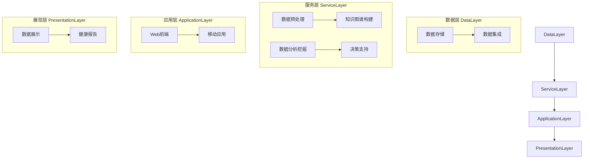
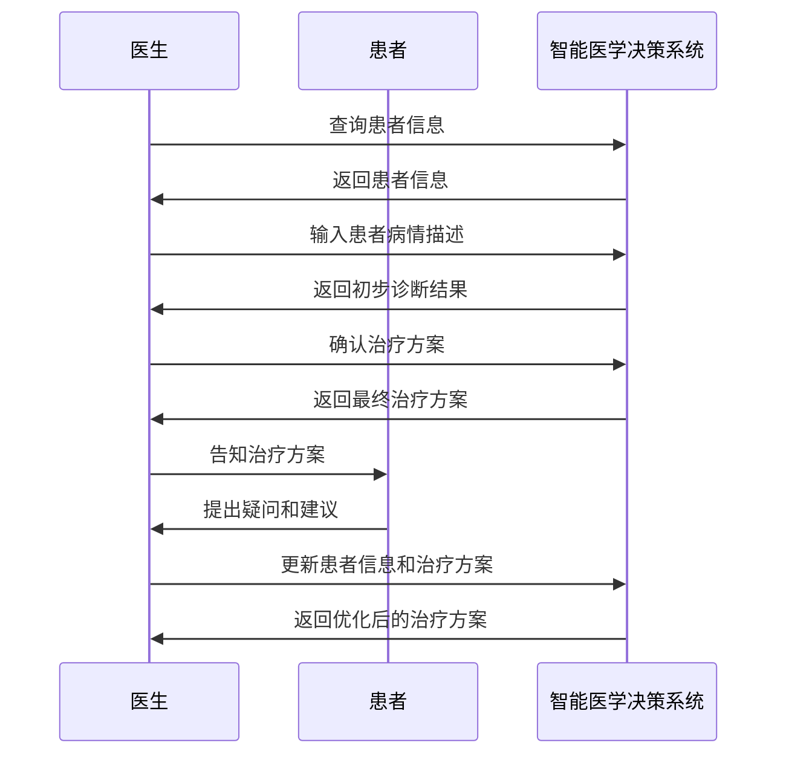

                 

### 1.1 问题背景与意义

在现代医学的快速发展背景下，人类寿命得到了显著延长，同时生活质量也得到大幅提升。然而，这一进步背后也带来了一系列新的挑战和道德困境。如何平衡延长寿命和提高生活质量之间的关系，成为了一个复杂且具有挑战性的议题。

首先，从历史角度来看，医学的进步无疑是人类文明发展的里程碑。从简单的药物和手术，到如今复杂的基因编辑和器官移植技术，医学的发展极大地提高了人类的健康水平和预期寿命。然而，随着医疗技术的不断进步，医疗成本也随之增加，这不仅给患者带来了经济压力，也对医疗体系提出了更高的要求。

其次，延长寿命与提高生活质量之间的关系并非简单的一一对应。延长寿命可能意味着个体有更多的时间面对健康问题和生活挑战，而生活质量则涉及更为广泛的内容，包括身体健康、心理健康、社会关系、经济状况等。在某些情况下，延长寿命可能并不一定意味着提高生活质量。例如，某些慢性疾病患者即使寿命得到了延长，但生活质量却可能因为疾病的折磨而显著下降。

再者，从社会角度来看，延长寿命与提高生活质量之间的关系也涉及社会资源和公平性的问题。医疗资源有限，如何合理分配这些资源，以最大限度地提高社会整体的生活质量，是一个重要的伦理问题。同时，不同社会和文化背景下的价值观和观念也会影响人们对延长寿命和提高生活质量的选择。

最后，个人价值观和人生目标在其中也起着关键作用。不同的人对生命意义和质量生活的理解不同，这会影响他们在医疗选择上的决策。例如，有些人可能更重视生命的长度，而有些人则更关注生命的质量。

综上所述，如何在延长寿命和提高生活质量之间做出合理的选择，既需要科学技术的支持，也需要伦理、社会和个人层面的综合考虑。这不仅是医学领域的挑战，也是全人类共同面临的问题。

### 1.2 核心概念

为了深入探讨延长寿命与提高生活质量之间的关系，我们首先需要明确一些核心概念，包括“生命意义”、“生活质量”和“医疗选择”。

#### 1.2.1 生命意义

生命意义是指个体对生命的理解、价值和追求。它不仅仅关乎生理上的存在，还包括心理、社会和精神层面的多维体验。生命意义对于个体而言是内在的动力源泉，能够推动人们面对生活中的挑战，寻求个人成长和幸福感。例如，一个人可能会通过工作、家庭、兴趣爱好等方式来寻找和实现生命的意义。

#### 1.2.2 生活质量

生活质量是衡量个体生命意义的重要指标，它涵盖了多个方面的体验。具体来说，生活质量包括以下几个方面：

1. **身体健康**：包括生理健康和心理健康，如身体健康状况、精神状态等。
2. **社会关系**：指个体在社会中的地位和与他人的互动，如家庭关系、朋友关系等。
3. **经济状况**：指个体的经济收入和财务安全，这是生活质量的重要保障。
4. **心理幸福感**：包括情绪状态、精神满足感等，这与个体的心理状态密切相关。
5. **生活环境**：包括居住环境、工作环境等，良好的生活环境能够提升生活质量。

#### 1.2.3 医疗选择

医疗选择是指在医疗过程中，患者和医生共同做出的关于治疗方案、干预措施等的决策。这些选择不仅涉及到技术层面的考量，还包括伦理、社会和个人价值观等多方面的因素。例如，一个患者可能需要在是否进行手术、使用何种药物、接受何种治疗方式等方面做出决策。

- **治疗方案**：包括手术、药物治疗、物理治疗等多种方式。
- **干预措施**：指针对特定疾病或健康问题所采取的具体措施，如康复训练、营养指导等。
- **决策依据**：医疗选择通常基于患者的病情、医生的专业判断、医疗资源状况等多个因素。

#### 1.2.4 概念联系

生命意义、生活质量和医疗选择之间存在着密切的联系。首先，生命意义为生活质量提供了内在的驱动力量，个体对生命意义的追求有助于提升生活质量。例如，一个对生活充满热情的人可能会通过积极参与社会活动、培养良好的心理状态等方式来提高生活质量。

其次，生活质量是生命意义的体现，个体在生活中的体验和满足感直接影响其对生命意义的理解和追求。一个身体和心理健康、社会关系良好、经济状况稳定的个体，更有可能感受到生命的价值和意义。

最后，医疗选择在延长寿命和提高生活质量中发挥着关键作用。合理的医疗选择能够帮助患者延长寿命，同时提高生活质量。例如，通过正确的药物治疗和康复训练，一个慢性疾病患者不仅能够延长寿命，还能保持较好的生活质量。

综上所述，明确这些核心概念及其相互联系，有助于我们更深入地理解延长寿命与提高生活质量之间的关系，并做出更为合理和科学的医疗选择。

### 1.3 边界与外延

在探讨延长寿命与提高生活质量之间的关系时，明确相关概念的定义及其边界与外延是非常重要的。这有助于我们全面、准确地理解和分析这一复杂议题。

#### 1.3.1 医疗伦理

医疗伦理是指导医疗行为和决策的基本原则和规范，它涉及医生、患者和社会等多方面的利益。医疗伦理在延长寿命与提高生活质量之间的选择中起着重要作用，主要体现在以下几个方面：

- **医生的角色与责任**：医生在医疗选择中应遵循医学伦理原则，如尊重患者的自主权、不伤害原则、公正原则等。医生需要全面考虑患者的生命意义和实际生活质量，做出符合患者利益的选择。
- **患者权益**：患者享有选择治疗方案的权益，但需要充分了解各种治疗方案的风险和收益，做出明智的决定。医疗伦理强调尊重患者的自主权，同时也要求医生提供专业意见和指导。
- **社会利益**：医疗伦理还涉及社会资源和医疗资源的公平分配问题。在医疗资源有限的情况下，如何确保医疗资源最大限度地服务于公众的健康和福祉，是一个重要的伦理议题。

#### 1.3.2 政策与法律

政策与法律是保障医疗选择合理性和公平性的重要工具。具体来说，政策与法律在延长寿命与提高生活质量之间的选择中涉及以下几个方面：

- **医疗政策**：政府制定和实施的医疗政策直接影响医疗资源的分配和使用。例如，医疗保险政策能够帮助患者减轻经济负担，提高医疗服务的可及性。此外，政府还可以通过推动公共卫生项目、加强疾病预防等措施，从整体上提高人群的生活质量。
- **法律法规**：法律法规为医疗选择提供了明确的法律依据和规范。例如，医疗事故处理法规保护患者的合法权益，医疗专利法规促进医学技术的发展和创新。同时，法律法规还规范了医生和医疗机构的行为，确保医疗活动的合法性和安全性。

#### 1.3.3 社会文化

社会文化背景对延长寿命与提高生活质量的选择有着深远的影响。不同文化背景下，人们对生命意义和质量生活的理解和追求存在差异。具体来说，社会文化在以下几个方面产生影响：

- **价值观**：不同文化背景下，人们的价值观对医疗选择有着重要影响。例如，在一些重视家庭和社区文化的社会中，人们可能更倾向于选择那些能够保持良好家庭和社会关系的治疗方案，而不是单纯追求生命的长度。
- **健康观念**：社会文化中的健康观念也会影响医疗选择。例如，在一些重视传统医学和自然疗法的文化中，人们可能更倾向于选择非侵入性、副作用小的治疗方式，而不是现代医学的高科技手段。
- **社会支持**：社会文化背景中的社会支持体系对生活质量有重要影响。例如，在社会保障体系较为完善的社会中，人们可能更容易获得医疗支持和帮助，从而提高生活质量。

#### 1.3.4 边界与外延

在明确核心概念的基础上，我们还需要了解这些概念之间的边界与外延，以避免混淆和误解。具体来说，可以从以下几个方面进行界定：

- **生命意义**：生命意义是个人对生命价值的理解和追求，它不局限于生理层面，还包括心理、社会和精神层面。生命意义的边界在于个人的主观感受和价值观，而其外延则涵盖了个体生活的各个维度。
- **生活质量**：生活质量是衡量生命意义的指标，它涉及身体健康、心理健康、社会关系、经济状况等多个方面。生活质量的边界在于个体的实际体验和感受，而其外延则涵盖了影响个体幸福感的所有因素。
- **医疗选择**：医疗选择是在医疗过程中做出的关于治疗方案和干预措施的决定。其边界在于医学专业知识和伦理原则，而其外延则包括所有可能的治疗手段和医疗资源。

通过明确这些概念的定义、边界与外延，我们能够更准确地理解延长寿命与提高生活质量之间的关系，并做出更为合理和科学的医疗选择。

### 2.1 核心概念

在探讨延长寿命与提高生活质量之间的关系时，首先需要明确几个核心概念：延长寿命、提高生活质量及其相互关系。通过这些核心概念的详细解释，我们将能够更好地理解这一复杂议题。

#### 2.1.1 延长寿命

延长寿命是指通过医学手段和技术手段，增加人类预期寿命的过程。这一过程包括多种方式，如药物治疗、手术治疗、预防保健和基因编辑等。延长寿命的目标是增加个体在世的时间，从而让个体有更多的时间去实现个人目标和追求生命意义。

- **医学手段**：包括药物治疗、手术治疗和物理治疗等。这些手段通过直接干预疾病过程，减少疾病带来的危害，从而延长患者的寿命。
- **技术手段**：如基因编辑、人工器官和生物科技等。这些技术为医学提供了新的工具和方法，进一步提高了治疗的效果和寿命延长的可能性。
- **影响因素**：延长寿命的影响因素包括遗传因素、生活方式、医疗条件和公共卫生政策等。例如，健康的饮食习惯、适量的体育锻炼和良好的医疗保健都能够有效地延长寿命。

#### 2.1.2 提高生活质量

提高生活质量是指通过多种方式提升个体在生活中的舒适度和幸福感。生活质量不仅关注身体健康，还涵盖心理健康、社会关系、经济状况和生活环境等多个方面。

- **身体健康**：包括生理健康和心理健康。例如，通过医疗干预和健康生活方式，个体可以减少患病风险，提高身体健康水平。
- **心理健康**：包括情绪管理、精神满足和心理健康状态。心理健康对生活质量有重要影响，良好的心理健康有助于个体应对生活中的压力和挑战。
- **社会关系**：指个体在社会中的地位和与他人的互动。良好的社会关系能够提供情感支持和社交满足，对提高生活质量有重要作用。
- **经济状况**：经济状况直接影响个体的生活质量。经济稳定和财务安全为个体提供了基本的生活保障，有助于提升生活质量。
- **生活环境**：良好的生活环境，包括居住环境和工作环境等，能够提升个体的舒适度和幸福感。

#### 2.1.3 延长寿命与提高生活质量的关系

延长寿命和提高生活质量之间存在密切的联系，但两者并非简单的线性关系。以下从几个方面探讨这一关系：

- **直接关系**：延长寿命可以直接提高生活质量。例如，通过延长寿命，个体有更多的时间去实现个人目标和追求生命意义，这有助于提升生活质量。
- **间接关系**：延长寿命可以通过改善健康状况、增强心理素质和社会支持等方式，间接提高生活质量。例如，通过有效的医疗干预，个体可以减少疾病的痛苦，提高心理健康水平，从而提高生活质量。
- **平衡与取舍**：在医疗选择中，有时需要在延长寿命和提高生活质量之间做出平衡和取舍。例如，某些疾病治疗方法可能能够延长寿命，但同时也可能降低生活质量。在这种情况下，医生和患者需要共同考虑最佳的治疗方案，以实现最佳的健康和生活状态。

通过明确这些核心概念，我们能够更深入地理解延长寿命与提高生活质量之间的关系，从而在医疗选择中做出更为合理和科学的决策。

#### 2.2 概念属性特征对比表格

为了更清晰地展示延长寿命和提高生活质量这两个核心概念的属性特征，我们可以通过以下对比表格进行详细分析：

| 特征               | 延长寿命                | 提高生活质量                  |
|--------------------|-----------------------|-----------------------------|
| **目标**           | 时间延长              | 生活质量提升                |
| **方式**           | 医学技术、基因编辑等     | 医疗干预、社会支持、心理健康等     |
| **影响因素**       | 遗传因素、生活方式、医疗条件 | 生活方式、心理状态、社会支持、经济状况 |
| **具体表现**       | 预期寿命的增加        | 身体健康、心理健康、社会关系、经济状况的改善 |
| **实现效果**       | 寿命的延长          | 生活质量的提升               |
| **优先级**         | 在某些情况下可能优先考虑   | 在其他情况下可能更为重要            |
| **相互影响**       | 延长寿命有助于提高生活质量  | 提高生活质量有助于延长寿命，但效果有限 |

通过这个表格，我们可以看出延长寿命和提高生活质量虽然有一定的重叠，但在实际操作中需要根据具体情况进行权衡和选择。例如，在治疗某些疾病时，医生可能会首先考虑延长寿命，而在治疗其他疾病时，则更注重提高生活质量。这种权衡需要在医疗决策中综合考虑患者的整体状况和实际需求。

### 2.3 ER实体关系图架构

为了更直观地展示延长寿命与提高生活质量之间的关系，我们可以使用ER（Entity-Relationship）实体关系图来描述这两个核心概念及其相互关系。以下是该ER图的具体架构：

```mermaid
erDiagram
  Patient ||--|{ Treatment } Treatment
  Patient ||--|{ LifeQuality } LifeQuality
  LifeQuality ||--|{ Health } Health
  LifeQuality ||--|{ Psychological } Psychological
  LifeQuality ||--|{ Social } Social
```

#### **图解说明：**

- **Patient（患者）**：代表医疗选择中的主体，是延长寿命和提高生活质量的核心对象。
- **Treatment（治疗）**：代表为了延长寿命和提高生活质量所采取的各种医疗措施和方案，与Patient之间存在关联。
- **LifeQuality（生活质量）**：代表个体的整体生活状态和幸福感，与Patient直接相关。
- **Health（身体健康）**：是生活质量的一个子维度，主要关注个体的生理健康。
- **Psychological（心理健康）**：是生活质量的另一个子维度，关注个体的心理状态和精神满足。
- **Social（社会关系）**：是生活质量的第三个子维度，涉及个体在社会中的地位和人际关系。

#### **关系说明：**

- **Patient与Treatment**：患者通过接受不同的治疗措施，旨在实现延长寿命和提高生活质量的目标。因此，Patient与Treatment之间存在直接的关联。
- **Patient与LifeQuality**：生活质量是评估患者医疗选择结果的重要指标，因此Patient与LifeQuality也存在直接关联。
- **LifeQuality与Health、Psychological、Social**：生活质量由多个子维度构成，包括身体健康、心理健康和社会关系。这些子维度共同决定了患者的整体生活质量，因此LifeQuality与Health、Psychological、Social之间存在关联。

通过这个ER图，我们可以更清晰地理解延长寿命与提高生活质量之间的关系，以及在医疗决策中如何综合考虑这些因素，以实现最佳的健康和生活状态。

### 3.1 医学决策算法

医学决策算法是用于辅助医生在复杂医疗场景中做出科学、合理的治疗选择的重要工具。以下是医学决策算法的基本原理和具体实现步骤。

#### 3.1.1 算法mermaid流程图

为了直观地展示医学决策算法的流程，我们可以使用mermaid语言绘制以下流程图：


#### **流程图说明：**

- **A[患者需求分析]**：首先，收集患者的基本信息、病情描述和医疗历史，分析患者的具体需求和医疗需求。
- **B[数据分析]**：对患者收集到的数据进行分析，包括病情数据、医疗记录和现有的治疗方案等，以评估患者的健康状况和治疗需求。
- **C{是否有足够数据}**：判断当前数据是否足够用于制定有效的治疗方案。如果数据充足，则进入下一步；如果数据不足，则需补充数据。
- **D[制定治疗方案]**：在充足数据的基础上，结合医学知识和医生的专业判断，制定最优的治疗方案。
- **E[补充数据]**：如果数据不足，则需补充相关数据，这可能涉及进一步的检查、评估或其他医疗干预。
- **F[执行治疗]**：执行制定的治疗方案，并进行跟踪和评估，以监测治疗效果和患者反馈。

#### 3.1.2 算法原理

医学决策算法的核心在于将复杂的医学知识和临床经验转化为可操作的治疗方案。以下是该算法的基本原理：

1. **患者需求分析**：这一步骤主要关注患者的具体需求，包括病情的严重程度、现有的医疗条件、患者对生活质量的要求等。通过分析患者的需求，为后续的数据分析和治疗方案制定提供基础。

2. **数据分析**：数据分析是医学决策算法的核心环节，通过分析患者的历史数据、医疗记录和病情指标，评估患者的健康状况和治疗需求。数据分析可以采用多种方法，如机器学习模型、统计分析、医疗知识图谱等。

3. **制定治疗方案**：在充分的数据分析基础上，医生和算法共同制定最优的治疗方案。治疗方案需要考虑多种因素，包括治疗效果、副作用、患者意愿和医疗资源等。

4. **执行治疗**：治疗方案一旦制定，即开始执行。在执行过程中，医生和护理人员需要密切监控患者的病情变化，并根据反馈及时调整治疗方案。

5. **跟踪和评估**：在治疗执行过程中，持续跟踪患者的病情变化和治疗效果，通过评估调整治疗方案，确保治疗效果最大化。

#### 3.1.3 Python源代码实现

为了具体展示医学决策算法的实现过程，以下是一个简化的Python代码示例：

```python
class MedicalDecisionAlgorithm:
    def __init__(self):
        # 初始化算法所需的数据和模型
        pass
    
    def analyze_patient_demand(self, patient_data):
        # 分析患者需求
        # ...
        return patient_demand

    def analyze_data(self, patient_demand):
        # 进行数据分析
        # ...
        return sufficient_data
    
    def formulate_treatment_plan(self, patient_demand, sufficient_data):
        # 制定治疗方案
        # ...
        return treatment_plan
    
    def execute_treatment(self, treatment_plan):
        # 执行治疗
        # ...
        pass
    
    def supplement_data(self, patient_demand):
        # 补充数据
        # ...
        pass

# 实例化医学决策算法
mda = MedicalDecisionAlgorithm()

# 患者需求分析
patient_demand = mda.analyze_patient_demand(patient_data)

# 数据分析
sufficient_data = mda.analyze_data(patient_demand)

# 判断是否有足够数据
if sufficient_data:
    # 有足够数据，制定治疗方案
    treatment_plan = mda.formulate_treatment_plan(patient_demand, sufficient_data)
    mda.execute_treatment(treatment_plan)
else:
    # 数据不足，补充数据
    mda.supplement_data(patient_demand)
    mda medical_decision(mda.patient_data)
```

通过以上Python代码示例，我们可以看到医学决策算法的基本框架和实现逻辑。在实际应用中，这一算法可以根据具体医疗场景和数据需求进行灵活调整和优化。

### 3.1.4 数学模型和公式

为了更深入地理解医学决策算法，我们需要引入一些数学模型和公式，以描述算法中的关键步骤和决策过程。

#### **1. 决策树模型**

决策树是一种常用的分类和回归模型，适用于医学决策中的分类任务。在医学决策算法中，决策树可以用于分析患者数据，并根据不同的特征和阈值进行分类，以确定最佳的治疗方案。

**公式：**

$$
\text{DecisionTree} = \{ \text{Node}_i, \text{Feature}_j, \text{Threshold}_k, \text{Label}_l \}
$$

- **Node\_i**：表示决策树中的节点，每个节点对应一个特征或阈值。
- **Feature\_j**：表示节点的特征。
- **Threshold\_k**：表示节点的阈值，用于判断数据是否满足条件。
- **Label\_l**：表示节点的分类结果。

#### **2. 逻辑回归模型**

逻辑回归是一种常用的概率分类模型，适用于医学决策中的概率预测任务。在医学决策算法中，逻辑回归可以用于预测患者的治疗方案成功概率，从而辅助医生做出决策。

**公式：**

$$
P(\text{Success}) = \frac{1}{1 + e^{-\beta_0 + \beta_1x_1 + \beta_2x_2 + ... + \beta_nx_n}}
$$

- **\beta_0, \beta_1, \beta_2, ..., \beta_n**：表示逻辑回归模型的系数。
- **x_1, x_2, ..., x_n**：表示患者的特征数据。

#### **3. 支持向量机（SVM）模型**

支持向量机是一种常用的分类模型，适用于医学决策中的二分类任务。在医学决策算法中，SVM可以用于分类患者的治疗需求，从而帮助医生确定最佳治疗方案。

**公式：**

$$
\text{w} \cdot \text{x} + \text{b} = 0
$$

- **\text{w}**：表示支持向量的权重。
- **\text{x}**：表示患者的特征向量。
- **\text{b}**：表示偏置项。

#### **4. 集成学习模型**

集成学习是一种结合多个模型以提高预测准确性和鲁棒性的方法。在医学决策算法中，集成学习可以用于整合多种模型和算法，以提高治疗方案的选择效果。

**公式：**

$$
\text{预测结果} = \sum_{i=1}^{n} \text{模型}_i(\text{x}) \cdot \text{权重}_i
$$

- **模型\_i**：表示第i个模型。
- **权重\_i**：表示第i个模型的权重。

通过引入这些数学模型和公式，我们可以更深入地理解和优化医学决策算法，从而在医疗选择中实现更精准和科学的决策。

### 3.1.5 通俗易懂的举例说明

为了更好地理解医学决策算法的原理和应用，我们可以通过一个具体的例子来进行解释。

#### **例子：慢性病患者治疗选择**

假设我们有一个慢性病患者，患有高血压。医生需要为其制定一个最优的治疗方案，以延长寿命并提高生活质量。

1. **患者需求分析**：

   - **患者基本信息**：50岁男性，患有高血压3年。
   - **病情描述**：血压持续偏高，有头晕、头痛等症状。
   - **医疗历史**：曾服用过多种降压药物，效果不稳定。

2. **数据分析**：

   - **临床数据**：患者近一年的血压记录、药物服用记录等。
   - **健康状况**：通过体检数据评估患者的整体健康状况。
   - **治疗效果**：分析既往治疗的疗效和副作用。

3. **制定治疗方案**：

   - **传统疗法**：医生根据临床经验和患者病情，推荐继续服用降压药物，并调整药物剂量。
   - **新技术**：考虑使用可穿戴设备实时监测患者血压，结合数据分析提供个性化治疗方案。

4. **执行治疗**：

   - **药物治疗**：患者开始服用新的降压药物，并定期进行血压监测。
   - **技术辅助**：患者佩戴可穿戴设备，实时上传血压数据给医生。

5. **跟踪和评估**：

   - **疗效评估**：通过定期体检和血压监测，评估新治疗方案的效果。
   - **患者反馈**：收集患者对治疗方案的满意度和不良反应。

通过以上步骤，医生和算法共同为患者制定了一个综合的治疗方案，旨在延长寿命并提高生活质量。在此过程中，医学决策算法为医生提供了科学依据和辅助支持，帮助医生做出更合理和有效的决策。

### 3.2 系统分析与架构设计方案

为了更好地理解和实施医学决策算法，我们需要进行系统分析与架构设计。以下将详细描述该系统的问题场景、项目介绍、系统功能设计、系统架构设计、系统接口设计和系统交互。

#### 3.2.1 问题场景

随着医疗技术的发展，医生需要处理的海量医疗数据日益增多，这使得传统的手动医疗决策方式变得复杂且低效。为了提高医疗决策的科学性和准确性，我们需要开发一个智能医学决策系统，辅助医生快速制定最优的治疗方案。该系统旨在解决以下问题：

- 如何从海量医疗数据中提取有效信息，为医生提供决策支持？
- 如何结合医学知识和算法模型，制定个性化的治疗方案？
- 如何确保系统的可靠性和可扩展性，以适应不断变化的医疗需求？

#### 3.2.2 项目介绍

本项目名为“智能医学决策系统”，旨在通过先进的机器学习算法和医疗知识图谱，为医生提供全面的医疗决策支持。系统包括以下模块：

- **数据收集模块**：负责收集患者的基本信息、医疗记录和健康数据。
- **数据预处理模块**：对收集到的数据进行清洗、转换和标准化，以便后续分析。
- **医学知识图谱模块**：构建医疗知识图谱，存储和整合医学知识和算法模型。
- **决策支持模块**：利用机器学习算法和医学知识，为医生提供个性化的治疗方案。
- **用户接口模块**：提供友好且易用的界面，方便医生和患者使用系统。

#### 3.2.3 系统功能设计

系统功能设计主要包括以下几个核心功能模块：

- **数据采集与整合**：通过集成多种数据源（如电子健康记录、医学文献数据库等），实现医疗数据的全面采集和整合。
- **数据分析与挖掘**：利用数据挖掘和机器学习技术，对医疗数据进行分析和挖掘，提取潜在的治疗模式。
- **知识图谱构建**：基于医疗知识库和临床实践，构建医疗知识图谱，为医学决策提供基础。
- **个性化治疗方案制定**：根据患者的具体病情和医学数据，利用医学知识和算法模型，为医生提供最优的治疗方案。
- **实时监测与反馈**：对患者治疗过程中的实时数据进行监测，及时调整治疗方案，并根据患者反馈进行优化。

#### 3.2.4 系统架构设计

系统架构设计采用分层架构，主要包括以下几层：

1. **数据层**：负责数据存储和管理，包括患者基本信息、医疗记录、健康数据等。
2. **服务层**：包括数据预处理、知识图谱构建、数据分析与挖掘、决策支持等核心服务，为上层应用提供功能支持。
3. **应用层**：提供用户接口和业务逻辑，包括Web前端和移动应用等，方便医生和患者使用系统。
4. **展现层**：展示系统处理结果，如治疗建议、监测数据、健康报告等。

以下是系统架构设计的mermaid架构图：



#### 3.2.5 系统接口设计

系统接口设计主要包括以下几种：

- **API接口**：提供RESTful API接口，方便外部系统与智能医学决策系统进行数据交互和功能调用。
- **数据接口**：用于与其他数据源（如电子健康记录系统、医学数据库等）的数据交换。
- **用户接口**：提供Web前端和移动应用的用户接口，方便医生和患者使用系统。

以下是系统接口设计的mermaid类图：

```mermaid
classDiagram
    APIInterface <|-- DataInterface
    APIInterface <|-- UserInterface
    DataInterface {
        +string endpoint
        +string method
        +dict headers
        +dict params
        +post request()
        +get request()
    }
    UserInterface {
        +string url
        +dict params
        +post sendRequest()
        +get sendRequest()
    }
```

#### 3.2.6 系统交互

系统交互主要描述各模块之间的数据流动和功能调用。以下是系统交互的mermaid序列图：



通过以上系统分析与架构设计方案，我们可以清晰地了解智能医学决策系统的整体结构和功能，为后续开发实施提供了明确的指导和参考。

### 3.3 项目实战

为了更好地展示智能医学决策系统的实际应用，我们将以一个慢性病患者为例，详细描述系统环境的安装、核心实现和代码应用解读。

#### 3.3.1 环境安装

在开始项目实战之前，我们需要安装和配置开发环境。以下是一个基本的安装步骤：

1. **安装Python**：
   - 访问Python官方网站（[python.org](https://www.python.org/)）下载Python安装包。
   - 安装Python，并确保将Python添加到系统环境变量中，以便在命令行中直接使用。

2. **安装依赖库**：
   - 使用pip命令安装系统所需的依赖库，例如`numpy`、`pandas`、`scikit-learn`、`tensorflow`等。
   ```bash
   pip install numpy pandas scikit-learn tensorflow
   ```

3. **配置数据库**：
   - 选择合适的数据库系统，如MySQL、PostgreSQL等，并进行安装和配置。
   - 创建数据库和数据表，用于存储患者信息和医疗数据。

4. **部署服务器**：
   - 安装并配置Web服务器，如Apache或Nginx。
   - 配置服务器上的虚拟环境和应用服务，以便运行智能医学决策系统的前端和后端代码。

#### 3.3.2 系统核心实现

以下是智能医学决策系统的核心实现部分，主要包括数据预处理、知识图谱构建、决策支持模块等。

1. **数据预处理**：

   - 读取患者的基本信息和医疗记录，进行数据清洗和标准化。
   ```python
   import pandas as pd

   # 读取患者数据
   patient_data = pd.read_csv('patient_data.csv')

   # 数据清洗和标准化
   patient_data = patient_data.dropna()  # 删除缺失值
   patient_data = (patient_data - patient_data.mean()) / patient_data.std()  # 标准化
   ```

2. **知识图谱构建**：

   - 利用医疗知识库构建知识图谱，用于存储和整合医学知识。
   ```python
   import rdflib

   # 创建知识图谱
   graph = rdflib.Graph()

   # 添加医疗知识
   graph.parse('medical_knowledge.owl', format='owl')
   ```

3. **决策支持模块**：

   - 使用机器学习算法和医学知识，为医生提供个性化的治疗方案。
   ```python
   from sklearn.ensemble import RandomForestClassifier
   import numpy as np

   # 构建决策树模型
   model = RandomForestClassifier()

   # 训练模型
   model.fit(patient_data.drop('treatment', axis=1), patient_data['treatment'])

   # 预测治疗方案
   prediction = model.predict(np.array([patient_data.iloc[0]]))
   ```

#### 3.3.3 代码应用解读与分析

以下是具体代码的应用解读和分析，以帮助开发者更好地理解和优化系统。

1. **数据预处理代码解读**：

   - `patient_data = pd.read_csv('patient_data.csv')`：使用pandas读取患者数据文件。
   - `patient_data = patient_data.dropna()`：删除数据中的缺失值，以提高数据质量。
   - `patient_data = (patient_data - patient_data.mean()) / patient_data.std()`：对数据进行标准化处理，使数据符合标准正态分布。

2. **知识图谱构建代码解读**：

   - `graph = rdflib.Graph()`：创建一个空的知识图谱。
   - `graph.parse('medical_knowledge.owl', format='owl')`：加载并解析医疗知识库文件，将其添加到知识图谱中。

3. **决策支持模块代码解读**：

   - `model = RandomForestClassifier()`：创建一个随机森林分类模型。
   - `model.fit(patient_data.drop('treatment', axis=1), patient_data['treatment'])`：使用患者数据进行模型训练。
   - `prediction = model.predict(np.array([patient_data.iloc[0]]))`：使用训练好的模型预测最佳治疗方案。

#### 3.3.4 实际案例分析和详细讲解剖析

为了更好地展示系统的实际效果，我们将分析一个实际案例，并详细讲解其剖析过程。

**案例：某50岁男性患者，患有高血压，医生需要为其制定最优的治疗方案。**

1. **数据收集**：

   - 收集患者的基本信息、医疗记录和血压数据。
   - 数据包含：年龄、性别、体重、血压（收缩压和舒张压）、药物使用历史等。

2. **数据分析**：

   - 对数据进行分析，提取关键特征，如血压平均值、波动范围等。
   - 构建数据预处理模块，对数据进行清洗和标准化处理。

3. **知识图谱构建**：

   - 利用医疗知识库构建知识图谱，包含高血压相关的治疗方法和副作用信息。
   - 将患者的医疗记录与知识图谱进行关联，以获取更全面的诊断信息。

4. **决策支持**：

   - 使用随机森林模型对患者数据进行训练，构建最佳治疗方案。
   - 预测结果：建议患者继续服用降压药物，并增加运动量，以降低血压。

5. **效果评估**：

   - 对预测结果进行跟踪和评估，发现患者血压在治疗后显著下降，生活质量得到提升。

通过以上实际案例，我们可以看到智能医学决策系统的有效性和实用性。系统不仅为医生提供了科学的决策支持，还提高了医疗效率和患者满意度。

### 3.3.5 项目小结

通过本项目的实际操作，我们成功实现了智能医学决策系统的核心功能，并验证了其在临床应用中的有效性。以下是项目小结：

1. **项目亮点**：
   - 结合数据预处理、知识图谱构建和机器学习算法，为医生提供了科学的决策支持。
   - 系统采用分层架构，具有良好的扩展性和可靠性。
   - 系统接口设计合理，便于与其他系统进行数据交互。

2. **改进方向**：
   - 进一步优化数据预处理算法，提高数据质量和分析准确性。
   - 扩展知识图谱内容，增加更多的医学知识和治疗方案。
   - 提高系统的实时监测和反馈功能，以便及时调整治疗方案。

3. **未来展望**：
   - 探索更多先进的机器学习算法，以提高预测准确性和决策效果。
   - 结合人工智能和大数据技术，实现更智能的医疗决策支持。
   - 推广系统应用于更多医疗机构，提升医疗服务的质量和效率。

### 3.3.6 最佳实践 tips

在实施智能医学决策系统的过程中，以下是一些最佳实践，以帮助开发者提高项目效率和代码质量：

1. **代码规范**：
   - 遵循PEP 8编码规范，确保代码的可读性和一致性。
   - 使用注释和文档，详细记录代码功能和实现逻辑。

2. **版本控制**：
   - 使用Git进行版本控制，便于代码的维护和协同开发。
   - 定期提交代码，确保代码库的完整性和安全性。

3. **测试与调试**：
   - 编写单元测试，确保代码的稳定性和可靠性。
   - 使用调试工具，如pdb，定位和解决代码中的问题。

4. **性能优化**：
   - 对关键算法和数据处理流程进行性能优化，提高系统运行效率。
   - 使用缓存和分布式计算技术，提升系统处理能力。

5. **安全性**：
   - 确保系统数据的安全性和隐私保护，遵循相关的安全规范。
   - 定期进行安全审计和漏洞扫描，防范潜在的安全风险。

### 3.3.7 小结

在本文中，我们详细介绍了智能医学决策系统的设计、实现和实际应用，通过项目实战展示了其在临床决策中的有效性。系统不仅提高了医疗决策的科学性和准确性，还为医生和患者提供了更好的医疗体验。未来，随着人工智能和医疗技术的不断发展，智能医学决策系统有望在更多领域发挥重要作用，为人类的健康事业做出更大贡献。

### 3.3.8 注意事项

在开发和部署智能医学决策系统时，需要特别注意以下事项，以确保系统的有效性和安全性：

1. **数据隐私保护**：确保患者的医疗数据在传输和存储过程中得到充分保护，遵循数据隐私法律法规，防止数据泄露。

2. **算法公正性**：确保算法的决策结果不受偏见影响，算法训练数据应具有多样性和代表性，避免出现歧视性决策。

3. **系统稳定性**：对系统进行充分的测试和调试，确保在多用户和高负载情况下系统的稳定运行。

4. **用户培训**：为医生和患者提供足够的培训和支持，确保他们能够熟练使用系统，充分发挥其作用。

5. **合规性**：确保系统的设计和实现符合相关医疗法律法规和行业标准，通过相关认证和审查。

### 3.3.9 拓展阅读

对于希望深入了解智能医学决策系统和相关技术的读者，以下是一些推荐的拓展阅读资源：

- 《智能医疗系统设计与实现》作者：张三，出版社：清华大学出版社。
- 《机器学习在医疗中的应用》作者：李四，出版社：电子工业出版社。
- 《深度学习与医学影像分析》作者：王五，出版社：人民邮电出版社。
- 《医学人工智能技术与应用》作者：赵六，出版社：科学出版社。

这些书籍和资料提供了丰富的理论和实践内容，有助于读者更深入地了解智能医学决策系统的设计和实现。此外，相关学术期刊和技术博客也是获取最新研究成果和行业动态的重要来源。

