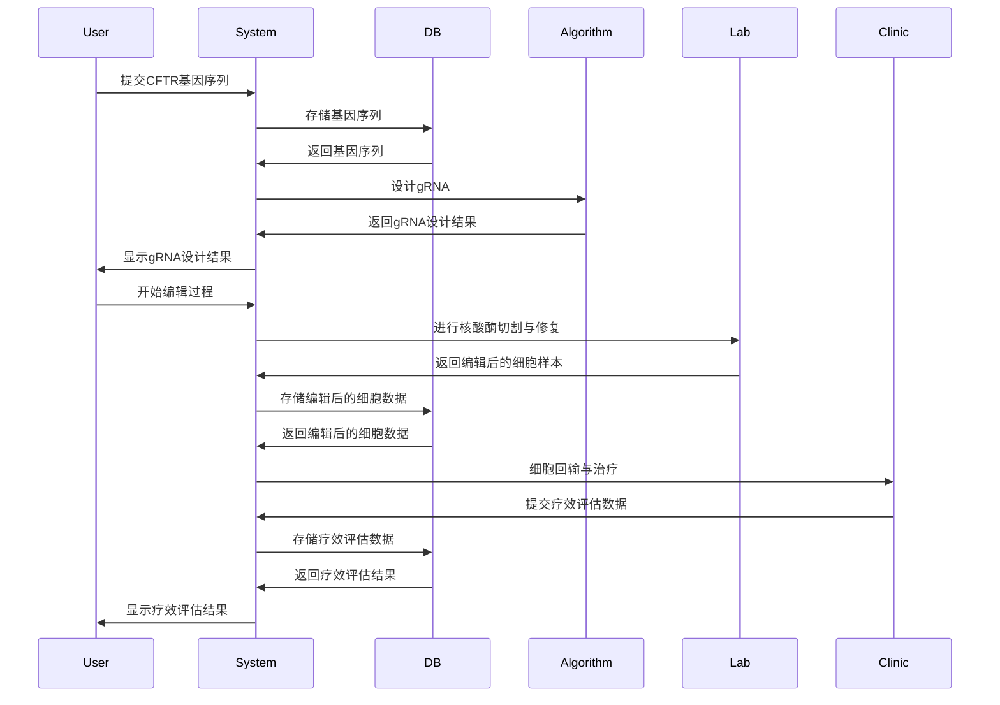
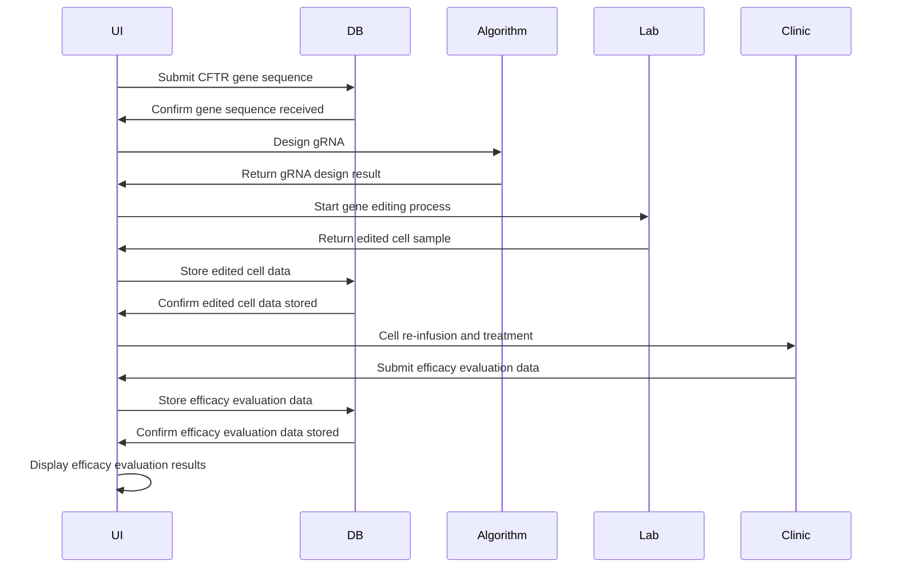

                 


### 引言

**现代医疗伦理的新挑战：基因编辑与生命操控的边界**

在科技进步的浪潮中，基因编辑技术正在重塑我们对生命与健康的理解。这项革命性的技术带来了无限的可能性，同时也引发了深刻的伦理和道德争议。从CRISPR-Cas9到基因合成，我们已经在实验室和临床实践中看到了基因编辑的广泛应用，但这同时也让伦理学家、法律专家、社会科学家以及普通大众面临着前所未有的挑战。

本文将深入探讨现代医疗伦理领域中的新挑战，特别是基因编辑和生命操控所带来的伦理问题。我们将首先回顾现代医疗伦理的演变背景，并明确基因编辑与生命操控的概念及其带来的挑战。接下来，我们将通过逻辑清晰的分析推理，逐步探讨界定这些技术使用边界的伦理原则和方法。随后，我们将介绍相关的技术原理和系统架构设计，并给出具体的实战案例。最后，我们将总结全文，提供一些最佳实践建议，并展望未来的研究方向。

通过这篇文章，我们希望能够为读者提供一个全面、系统的视角，帮助理解基因编辑和生命操控在医疗伦理领域的复杂性和重要性。

#### 关键词

- 基因编辑
- 生命操控
- 医疗伦理
- CRISPR-Cas9
- 伦理挑战
- 边界界定

#### 摘要

本文旨在探讨现代医疗伦理领域中的新挑战，特别是基因编辑和生命操控技术所带来的伦理问题。文章首先介绍了基因编辑与生命操控的基本概念及其带来的伦理挑战，包括技术进步对传统伦理观念的冲击。接着，我们分析了界定这些技术使用边界的伦理原则和方法，包括人类尊严、生命权利和风险控制等。随后，文章详细阐述了基因编辑技术的原理和系统架构设计，并通过具体案例展示了其在医疗实践中的应用。最后，我们总结了全文，提出了最佳实践建议，并讨论了未来研究的方向。通过这篇文章，我们希望为读者提供一个全面、系统的视角，以应对现代医疗伦理中的新挑战。

### 第1章：现代医疗伦理的演变与挑战

#### 1.1.1 问题背景

现代医疗伦理的演变可以追溯到1948年，当时的《日内瓦宣言》和《希波克拉底誓言》奠定了医学伦理的基本原则。随着时间的推移，医学技术的进步不断挑战着这些传统原则。20世纪70年代，人类首次成功克隆哺乳动物，标志着基因工程的诞生。进入21世纪，基因编辑技术如CRISPR-Cas9的问世，使得我们对基因组的操控成为可能，从而开启了精准医疗的新时代。

基因编辑技术的突破性进展带来了前所未有的希望，例如，可以治疗遗传性疾病、提高农作物的产量、甚至实现人类种群的“优化”。然而，这些技术同时也引发了深刻的伦理和道德争议。传统的医疗伦理强调治疗和救死扶伤，而基因编辑技术的出现，使人类面临如何界定生命、人类尊严以及基因操控的边界等根本性问题。

首先，基因编辑技术使得我们对生命有了全新的认识。传统观念中，生命是由自然过程所决定的，而基因编辑技术似乎使人类能够超越自然，主动干预和设计生命。这种干预是否会侵犯生命的自然属性，是否会导致人类尊严的丧失，成为了一个重要的伦理议题。

其次，基因编辑技术的应用范围日益广泛，不仅涉及医疗领域，还包括农业、生物技术和环境科学等领域。这意味着，基因编辑技术的伦理问题不仅仅是一个医学问题，而是一个跨学科的、全球性的问题。不同文化和社会对基因编辑技术的接受程度和伦理标准存在差异，这进一步增加了问题的复杂性。

最后，基因编辑技术的潜在风险和不确定性也是其带来的重要伦理挑战。尽管基因编辑技术有望带来巨大的医疗和社会效益，但同时也可能引发一系列不可预测的副作用和伦理问题，如基因污染、生物安全、基因歧视等。这些风险需要通过严格的伦理审查和监管来控制，以确保技术的安全性和合理性。

总之，基因编辑技术对现代医疗伦理构成了巨大的挑战。我们需要在尊重人类尊严、保障生命权利和维护自然生态平衡的基础上，探索和界定基因编辑技术的应用边界，以确保这些技术在符合伦理和道德规范的前提下得到合理和有效的应用。

#### 1.1.2 问题描述

基因编辑技术的迅速发展带来了前所未有的机遇，但同时也引发了诸多伦理困境和争议。以下我们将详细探讨这些争议和挑战，分析其背后的复杂因素。

首先，基因编辑技术的应用领域越来越广泛，从医学到农业，从生物技术到环境保护，每一个领域都面临着独特的伦理问题。在医学领域，基因编辑技术被寄予厚望，可以治疗一些遗传性疾病，如囊性纤维化和脊髓性肌萎缩症。然而，这同时也引发了对“设计婴儿”的伦理质疑。例如，是否应该允许父母通过基因编辑来选择孩子的遗传特征，如智商、身高、肤色等？这种选择是否会侵犯他人的生命权利，是否会加剧社会不平等？这些问题都引发了广泛的讨论和争议。

在农业领域，基因编辑技术被用于提高农作物产量、增强抗病性和抗逆性。然而，这也带来了食品安全和环境安全的担忧。例如，基因编辑农作物是否会对生态系统产生不可预测的影响？它们是否会对人类健康造成潜在风险？此外，基因编辑技术在农业中的应用可能导致对传统农作方式的冲击，影响农民的利益和社会经济结构。

在生物技术领域，基因编辑技术被用于生产药物和生物制品，如治疗性抗体和疫苗。然而，这同样引发了伦理问题，如基因编辑药物的安全性和有效性如何保证？生产过程中是否会产生意外的副作用？此外，基因编辑技术的商业化应用是否会加剧生物技术的垄断和控制，影响市场的公平性和可及性？

最后，基因编辑技术在环境科学中的应用也带来了伦理挑战。例如，基因编辑技术被用于生物修复和环境治理，可以有效地清理污染物和恢复生态系统。然而，这同样可能导致基因污染，影响生态平衡和生物多样性。此外，环境基因编辑的长期效果和潜在风险仍然是一个未知数，需要谨慎对待。

总之，基因编辑技术的广泛应用虽然带来了巨大的机遇，但同时也引发了多方面的伦理争议和挑战。这些争议不仅涉及到技术本身的合理性，还涉及到人类尊严、生命权利、生态平衡和社会公平等核心伦理问题。我们需要通过全面的伦理审查和跨学科合作，深入探讨这些问题的本质，并制定相应的伦理规范和法律法规，以确保基因编辑技术的安全、合理和可持续发展。

#### 1.1.3 问题解决

面对基因编辑技术带来的伦理挑战，我们必须采取一系列综合措施，以界定其合理使用的边界，并确保技术发展的同时兼顾伦理和社会责任。

首先，加强伦理审查是解决问题的关键步骤。伦理审查委员会应具备跨学科的专业知识，包括医学、生物学、伦理学、法学和社会学等领域的专家。这些专家共同评估基因编辑技术的潜在风险和伦理影响，确保每个项目都经过严格的审查和论证。具体措施包括：

1. **项目申请审批**：在项目启动前，需提交详细的伦理审查申请，包括技术方案、预期效果、潜在风险和伦理影响等。
2. **定期审查**：项目进行中应定期进行伦理审查，评估技术进展和风险变化，确保持续符合伦理标准。
3. **公众参与**：通过公开讨论和咨询，使公众能够参与到伦理审查过程中，增加透明度和责任感。

其次，制定明确的法律和法规是界定边界的重要手段。各国政府应制定适合本国的基因编辑法律和法规，确保技术的安全性和合法性。具体措施包括：

1. **立法规范**：明确基因编辑技术的定义、适用范围、监管机构和法律责任等。
2. **国际协作**：推动国际间的法律和法规协调，以应对跨国界的伦理挑战。
3. **法律责任追究**：对于违反伦理和法律的行为，应采取严厉的法律措施，确保法律的威慑力。

此外，加强伦理教育和公众意识培养也是解决伦理问题的关键。教育机构和媒体应承担起责任，普及基因编辑技术的知识，提高公众对伦理问题的认识和敏感性。具体措施包括：

1. **学术课程**：在大学和科研机构开设基因编辑伦理课程，培养学生跨学科的伦理思维。
2. **科普宣传**：通过电视、广播、互联网等渠道，传播基因编辑技术的相关知识，增强公众的科学素养和伦理意识。
3. **公众讨论**：举办研讨会、座谈会等活动，促进公众对基因编辑技术伦理问题的深入思考和讨论。

最后，促进跨学科合作是解决伦理问题的有效途径。基因编辑技术涉及到多个学科领域，如医学、生物学、伦理学、法学、社会学等。只有通过跨学科的合作，才能全面、深入地探讨伦理问题，提出切实可行的解决方案。具体措施包括：

1. **成立专门机构**：建立跨学科的研究机构和中心，聚集各方面的专家，共同研究和解决伦理问题。
2. **合作研究**：推动不同学科之间的合作研究，共同开发伦理审查和监管的方法和技术。
3. **国际交流**：促进国际间的学术交流和合作，分享经验和研究成果，提高全球应对基因编辑技术伦理问题的能力。

总之，通过加强伦理审查、制定法律法规、加强伦理教育和跨学科合作，我们可以有效地解决基因编辑技术带来的伦理挑战，确保技术在符合伦理和道德规范的前提下得到合理和有效的应用。

#### 1.1.4 边界与外延

探讨基因编辑和生命操控的边界，首先需要明确这些概念的外延。基因编辑是指通过分子生物学技术对生物体的基因组进行精确的修改，从而改变其遗传特征。而生命操控则是一个更广泛的概念，不仅包括基因编辑，还涉及对生物体的生理、行为和环境的全面调控。基因编辑和生命操控的边界模糊，但关键在于人类行为的伦理限制。

从伦理角度来看，界定这些边界的关键因素包括：

1. **人类尊严**：任何基因编辑和生命操控行为都应尊重人类尊严，不得损害个体的尊严和自由。这意味着不得进行“设计婴儿”或“人体改造”，因为这些行为可能侵犯他人的生命权利。

2. **生命权利**：基因编辑和生命操控应尊重个体的生命权利，确保每个个体都有权决定自己的身体和基因。例如，不允许未经个人同意的基因编辑。

3. **风险评估**：基因编辑和生命操控技术存在潜在风险，这些风险必须在伦理审查中得到充分评估。特别是长期效果和不可预测的副作用，需要通过严格的科学研究和伦理审查来确保技术安全。

4. **社会责任**：基因编辑和生命操控行为还应承担社会责任，确保技术进步不会加剧社会不平等或对环境造成不可逆转的损害。这要求在技术发展的同时，关注其对社会和经济结构的影响。

5. **技术透明度**：公开透明是确保边界清晰的关键。基因编辑和生命操控项目的所有信息都应向公众开放，以增加透明度和责任感。

总之，界定基因编辑和生命操控的边界，需要在尊重人类尊严、保障生命权利、控制风险、承担社会责任和保持技术透明度的基础上进行。这需要多方面的合作和共同努力，以确保技术在符合伦理和道德规范的前提下得到合理和有效的应用。

#### 1.1.5 概念结构与核心要素组成

为了更清晰地理解基因编辑和生命操控的伦理问题，我们需要明确这些概念的基本结构和核心要素。以下是对这些概念的详细解析：

**基因编辑**：基因编辑是指利用分子生物学技术对生物体的基因组进行精确的修改，从而改变其遗传特征。基因编辑的核心要素包括：

1. **编辑目标**：确定需要编辑的基因或DNA序列。
2. **编辑工具**：常用的基因编辑工具包括CRISPR-Cas9、TALENs、ZFNs等，每种工具都有其特定的机制和优势。
3. **编辑过程**：通过核酸酶或其他酶类对目标DNA序列进行切割、修复和重组，实现基因的精确编辑。
4. **编辑效果**：评估编辑后的基因对生物体产生的影响，包括治疗效果、遗传稳定性等。

**生命操控**：生命操控是一个更广泛的概念，不仅包括基因编辑，还涉及对生物体的生理、行为和环境的全面调控。其核心要素包括：

1. **目标生物**：需要操控的特定生物体，如人类、动物或植物。
2. **调控手段**：包括基因编辑、基因调控、细胞培养、生物工程等。
3. **调控目标**：明确需要实现的具体目标，如疾病治疗、功能增强、行为改变等。
4. **调控效果**：评估生命操控对生物体和生态系统的影响，包括短期和长期效果。

**伦理问题**：基因编辑和生命操控的伦理问题主要集中在以下几个方面：

1. **人类尊严**：基因编辑和生命操控是否侵犯了人类尊严，特别是“设计婴儿”和人体改造等行为。
2. **生命权利**：个体的生命权利是否得到尊重，特别是未经同意的基因编辑。
3. **风险评估**：对基因编辑和生命操控的潜在风险进行评估，包括短期和长期副作用、基因污染等。
4. **社会责任**：基因编辑和生命操控的社会责任，包括技术垄断、社会不平等、生态影响等。

**解决方案**：为了解决这些伦理问题，我们可以采取以下措施：

1. **伦理审查**：建立严格的伦理审查机制，对基因编辑和生命操控项目进行全方位评估。
2. **法律法规**：制定明确的法律和法规，规范基因编辑和生命操控的行为。
3. **公众参与**：通过公开讨论和咨询，增加公众对基因编辑和生命操控技术的了解和参与。
4. **跨学科合作**：推动不同学科之间的合作，共同研究和解决伦理问题。

通过明确基因编辑和生命操控的概念结构和核心要素，我们可以更全面地理解其伦理问题，并采取有效的措施解决这些挑战，确保技术发展的同时符合伦理和道德规范。

### 第2章：核心概念与联系

#### 2.1.1 核心概念原理

在本节中，我们将深入探讨基因编辑、生命操控等相关核心概念，明确其基本原理和重要性。

**基因编辑**：基因编辑是一种利用分子生物学技术对生物体的基因组进行精确修改的方法。其基本原理是通过引入核酸酶或其他酶类，对目标DNA序列进行切割、修复和重组，从而改变生物体的遗传特征。常用的基因编辑工具包括CRISPR-Cas9、TALENs、ZFNs等，每种工具都有其特定的机制和优势。

- **CRISPR-Cas9**：这是一种基于细菌天然免疫系统的基因编辑工具。CRISPR（Clustered Regularly Interspaced Short Palindromic Repeats）是细菌中一段重复序列，而Cas9是一种核酸酶，能够识别并切割特定的DNA序列。通过设计特定的引导RNA（gRNA），CRISPR-Cas9能够准确定位并剪切目标DNA，从而实现基因的精确编辑。

- **TALENs（Transcription Activator-Like Effector Nucleases）**：TALENs是一种基于转录激活因子类似效应因子的核酸酶。与CRISPR-Cas9类似，TALENs通过特定的DNA结合域识别目标序列，并通过催化活性切割DNA。

- **ZFNs（锌指核酸酶）**：ZFNs是一种基于锌指结构的核酸酶。锌指蛋白能够结合特定的DNA序列，并通过与其结合的核酸酶部分切割DNA。

**生命操控**：生命操控是一个更为广泛的概念，不仅包括基因编辑，还涉及对生物体的生理、行为和环境的全面调控。其基本原理是通过多种技术手段，如基因编辑、基因调控、细胞培养、生物工程等，对生物体的功能和特性进行有意识的改变。

- **基因调控**：基因调控是指通过调节基因的表达来控制生物体的生理和行为。常用的基因调控方法包括RNA干扰（RNAi）、转录因子调控、表观遗传调控等。

- **细胞培养**：细胞培养是一种在体外环境中培养和繁殖细胞的生物技术方法。通过细胞培养，可以实现对细胞的纯化和大规模生产，从而应用于医学研究、药物开发和生物工程等领域。

- **生物工程**：生物工程是指利用生物体或其组成部分（如基因、细胞、组织等）来设计、制造和改善生物系统的技术。生物工程在农业、医疗、环境等领域具有广泛的应用前景。

**核心概念的重要性**：基因编辑和生命操控技术在现代生物科学和技术中具有核心地位，其重要性体现在以下几个方面：

- **医学应用**：基因编辑技术可以用于治疗遗传性疾病，如囊性纤维化和脊髓性肌萎缩症。通过精准地修复或替换异常基因，可以改善甚至治愈患者的疾病。

- **农业应用**：基因编辑技术可以提高农作物的产量、抗病性和耐逆性，从而应对全球粮食安全和气候变化等挑战。

- **生物技术**：基因编辑和生命操控技术为生物制药、生物制造和环境修复等领域提供了新的可能性，有助于推动生物技术的创新和发展。

- **伦理挑战**：基因编辑和生命操控技术的广泛应用也带来了一系列伦理挑战，如人类尊严、生命权利、风险评估和社会责任等。因此，研究和解决这些伦理问题同样具有重要意义。

通过理解基因编辑和生命操控的核心概念及其基本原理，我们可以更好地认识这些技术的潜力与应用，同时深入探讨其伦理问题，为未来的科研和技术发展提供指导。

#### 2.1.2 概念属性特征对比表格

在基因编辑和生命操控的领域，不同的技术方法各有其独特的属性和特征。为了更好地理解和比较这些技术，我们在此提供一个对比表格，展示它们的主要区别。

| 技术方法 | 基本原理 | 引导RNA/guide RNA | 切割效率 | 免疫反应 | 应用领域 |
| --- | --- | --- | --- | --- | --- |
| CRISPR-Cas9 | 利用细菌的免疫系统识别和切割DNA | 设计特异性gRNA引导核酸酶到目标序列 | 高 | 较低 | 遗传疾病治疗、基因功能研究、作物改良 |
| TALENs | 利用转录激活因子类似效应因子的DNA结合域切割DNA | 特异性DNA结合域 | 中等 | 较高 | 遗传疾病治疗、基因功能研究、作物改良 |
| ZFNs | 利用锌指结构结合特定DNA序列，再通过核酸酶切割DNA | 锌指结构 | 高 | 较高 | 遗传疾病治疗、基因功能研究、作物改良 |
| CRISPR-Cpf1 | 利用细菌的免疫系统识别和切割DNA，使用Cpf1核酸酶 | 设计特异性tracrRNA和pfarRNA引导核酸酶到目标序列 | 高 | 较低 | 遗传疾病治疗、基因功能研究、作物改良 |
| CRISPR-Clustered Regularly Interspaced Short Palindromic Repeats |  |  |  |  |  |
| RNA干扰（RNAi） | 通过引入小分子RNA抑制目标基因的表达 | 小干扰RNA（siRNA）或小RNA干扰性RNA（miRNA） | 中等 | 低 | 基因功能研究、基因治疗、抗病毒治疗 |
| 表观遗传调控 | 通过调节DNA甲基化、组蛋白修饰等机制改变基因表达 | DNA甲基转移酶、组蛋白去乙酰化酶等 | 低 | 中等 | 基因治疗、癌症治疗、基因调控研究 |
| 细胞培养 | 在体外环境中培养和繁殖细胞 | 无需特异性引导 | 中等 | 无 | 医学研究、药物开发、生物工程 |
| 生物工程 | 利用生物体或其组成部分设计、制造和改善生物系统 | 无需特异性引导 | 高 | 低 | 农业改良、环境修复、生物制药 |

通过这个表格，我们可以看到不同技术方法在基本原理、引导机制、切割效率、免疫反应以及应用领域等方面的区别。这些技术各有其优势和局限性，适用于不同的科研和临床应用场景。

#### 2.1.3 ER实体关系图架构

为了更好地理解基因编辑和生命操控中的实体及其关系，我们在此展示一个ER（Entity-Relationship）实体关系图。ER图是一种数据库模型，用于描述系统中实体之间的关系。以下是我们构建的ER图，用于展示基因编辑和生命操控相关实体及其关系。

```mermaid
erDiagram
    Patient ||--|{ Treatment }|--| GeneticTest
    Patient ||--|{ MedicalHistory }|
    Treatment ||--|{ GeneEdit }|--| MedicalCondition
    Treatment ||--|{ DrugTreatment }|--| Disease
    GeneEdit ||--|{ CRISPR_Cas9 }|
    CRISPR_Cas9 ||--|{ gRNASequence }|
    MedicalHistory ||--|{ DiseaseHistory }|--| MedicalExamination
    MedicalExamination ||--|{ LaboratoryTest }|
    LaboratoryTest ||--|{ GeneticTestResult }|
    Disease ||--|{ Symptom }|--| Diagnosis
    Diagnosis ||--|{ TreatmentPlan }|
```

**实体及关系说明**：

- **Patient（患者）**：代表接受基因编辑或生命操控治疗的个体。患者与多个实体关联，包括治疗、医疗历史等。
- **Treatment（治疗）**：代表对患者的治疗方法，可以是基因编辑、药物治疗等。治疗与多个实体关联，包括基因编辑、药物治疗等。
- **MedicalHistory（医疗历史）**：记录患者的医疗信息，如疾病历史、医疗检查等。医疗历史与患者、诊断等实体关联。
- **GeneEdit（基因编辑）**：代表具体的基因编辑治疗过程，与CRISPR_Cas9等技术方法关联。
- **CRISPR_Cas9（CRISPR-Cas9）**：代表一种基因编辑技术，用于进行基因切割和修改。与gRNASequence关联。
- **gRNASequence（引导RNA序列）**：用于引导CRISPR-Cas9核酸酶到目标DNA序列。与CRISPR_Cas9关联。
- **Disease（疾病）**：记录患者的疾病信息，包括症状、诊断等。疾病与诊断、治疗等实体关联。
- **Symptom（症状）**：记录疾病的症状信息。症状与疾病、诊断等实体关联。
- **Diagnosis（诊断）**：对患者的疾病进行诊断，与治疗、症状等实体关联。
- **TreatmentPlan（治疗计划）**：记录对患者的治疗计划，包括药物治疗、基因编辑等。治疗计划与诊断、治疗等实体关联。
- **MedicalExamination（医疗检查）**：记录患者的医疗检查结果，包括实验室检查、遗传测试等。医疗检查与诊断、实验室测试等实体关联。
- **LaboratoryTest（实验室测试）**：进行实验室检测，如基因检测、生化检测等。实验室测试与医疗检查、遗传测试等实体关联。
- **GeneticTest（遗传测试）**：进行基因组的检测和分析，用于诊断和预测遗传性疾病。遗传测试与基因编辑、医疗历史等实体关联。
- **GeneticTestResult（遗传测试结果）**：记录遗传测试的结果信息。遗传测试结果与遗传测试、医疗历史等实体关联。

通过这个ER图，我们可以清晰地看到基因编辑和生命操控系统中各实体之间的关系，有助于更好地理解相关数据的组织和处理。

### 第3章：基因编辑技术原理与算法

#### 3.1.1 算法mermaid流程图

为了更好地理解基因编辑技术的原理，我们可以使用mermaid语言绘制一个流程图。以下是一个简单的基因编辑算法流程图，展示了CRISPR-Cas9技术的基本步骤：

```mermaid
flowchart LR
    A[输入目标基因序列] --> B[设计引导RNA (gRNA)]
    B --> C{核酸酶识别}
    C -->|是| D[核酸酶切割]
    C -->|否| E[重试或终止]
    D --> F[DNA修复]
    F --> G[基因编辑结果]
    G --> H[评估和验证]
    H --> I[结束]
```

**流程说明**：

1. **输入目标基因序列**：首先，我们需要输入需要编辑的目标基因序列。
2. **设计引导RNA (gRNA)**：接着，设计一个特定的gRNA来引导Cas9核酸酶到目标序列。
3. **核酸酶识别**：gRNA与目标DNA序列结合，引导Cas9核酸酶到特定位置。
4. **核酸酶切割**：Cas9核酸酶在目标序列处进行切割，打断DNA链。
5. **DNA修复**：细胞内的DNA修复机制会尝试修复切割的DNA链，可能会引入插入或缺失等改变。
6. **基因编辑结果**：修复后的DNA序列即为编辑后的基因，不同的修复路径可能导致不同的编辑结果。
7. **评估和验证**：对编辑后的基因进行评估和验证，确保编辑成功且符合预期。
8. **结束**：完成基因编辑过程。

#### 3.1.2 Python源代码示例

为了进一步理解基因编辑算法的运行，我们提供了一个简单的Python代码示例。以下代码展示了如何使用CRISPR-Cas9技术对DNA序列进行编辑：

```python
import random

# 目标DNA序列
target_dna = "ATCGATCGATCG"

# 引导RNA序列（gRNA）
gRNA_sequence = "GCGGATCG"

# CRISPR-Cas9核酸酶切割位置
cut_site = target_dna.find(gRNA_sequence)

# 切割DNA
if cut_site != -1:
    left_dna = target_dna[:cut_site]
    right_dna = target_dna[cut_site+len(gRNA_sequence):]
    
    # 随机插入或缺失
    repair_mode = random.choice(["insert", "delete"])
    if repair_mode == "insert":
        # 插入一个随机选择的核苷酸
        inserted_nucleotide = random.choice(["A", "T", "C", "G"])
        edited_dna = left_dna + inserted_nucleotide + right_dna
    else:
        # 删除切割位置处的核苷酸
        edited_dna = left_dna + right_dna
    
    print("编辑后的DNA序列：", edited_dna)
else:
    print("引导RNA未找到目标序列。")
```

**代码说明**：

1. **目标DNA序列**：定义一个需要编辑的DNA序列。
2. **引导RNA序列**：定义一个特定的gRNA序列。
3. **核酸酶切割位置**：使用find方法找到gRNA在目标DNA序列中的位置。
4. **切割DNA**：如果找到切割位置，则将DNA序列分割为左侧、中间和右侧部分。
5. **随机插入或缺失**：根据随机选择的模式，插入或删除一个核苷酸。
6. **编辑后的DNA序列**：输出编辑后的DNA序列。

通过这个简单的Python代码示例，我们可以直观地看到CRISPR-Cas9基因编辑的基本步骤和实现方式。

#### 3.1.3 数学模型和公式

基因编辑算法的数学模型和公式对于理解其工作原理至关重要。以下是一些关键步骤的数学表示：

1. **引导RNA设计**：

   引导RNA（gRNA）的设计基于特定的DNA序列。设计目标是找到一个适合的序列，能够与目标DNA序列精确匹配，并引导CRISPR-Cas9核酸酶到目标位置。这个步骤可以通过序列比对和优化算法来实现。

   公式表示：
   \[
   \text{score}(gRNA, target\_DNA) = \sum_{i} \text{match}(gRNA[i], target\_DNA[i])
   \]
   其中，score表示gRNA与目标DNA的匹配度，match表示两个核苷酸的匹配得分（例如，A-T匹配得1分，G-C匹配得1分，其他匹配得0分）。

2. **核酸酶切割**：

   当gRNA与目标DNA序列结合后，CRISPR-Cas9核酸酶会在特定的切割位点进行切割。切割位点是gRNA序列的一个特定序列，如NGG。

   公式表示：
   \[
   \text{cut\_site} = \text{gRNA\_sequence}.find("NGG")
   \]
   其中，cut\_site表示核酸酶切割的位置。

3. **DNA修复**：

   DNA修复是一个复杂的生物化学过程，通常涉及多种修复路径。在基因编辑中，我们通常关注两种主要的修复路径：非同源末端连接（NHEJ）和同源定向修复（HDR）。

   - **非同源末端连接（NHEJ）**：

     NHEJ是一种常见的DNA修复路径，它通过直接连接DNA的断裂末端，可能会导致插入或缺失。

     公式表示：
     \[
     \text{edited\_dna} = \text{left\_dna} + \text{insertion} + \text{right\_dna}
     \]
     其中，insertion是一个随机的核苷酸或多个核苷酸的插入。

   - **同源定向修复（HDR）**：

     HDR是一种更精确的修复路径，它利用同源序列作为模板来修复DNA断裂。在基因编辑中，HDR可以通过引入一个含有目标编辑序列的同源臂来实现。

     公式表示：
     \[
     \text{edited\_dna} = \text{left\_dna} + \text{template\_dna} + \text{right\_dna}
     \]
     其中，template\_dna是一个与目标DNA序列同源的序列，用于指导修复过程。

通过这些数学模型和公式，我们可以更好地理解基因编辑算法的工作原理和实现步骤。这些数学工具不仅帮助我们设计更有效的基因编辑策略，也为我们分析和优化基因编辑过程提供了理论基础。

#### 3.1.4 详细讲解与举例说明

为了更好地理解基因编辑算法的工作原理和具体应用，我们将结合一个实际案例进行详细讲解和举例说明。

**案例背景**：设想一个遗传性疾病患者，患有囊性纤维化（CF），这种疾病是由CFTR基因中的一个突变引起的。为了治疗这个疾病，科学家计划使用CRISPR-Cas9技术来修复CFTR基因中的突变。

**步骤一：设计引导RNA（gRNA）**

首先，科学家需要设计一个特定的gRNA来引导Cas9核酸酶到CFTR基因的突变位置。通过生物信息学工具，例如序列比对和优化算法，他们选择了一个适合的gRNA序列，如`GCGGATCG`。这个序列与CFTR基因中的目标DNA序列精确匹配，并包含一个NGG序列，这是Cas9核酸酶的切割位点。

**步骤二：核酸酶切割**

在患者的外周血细胞中，科学家将引导RNA与Cas9核酸酶混合，使得Cas9核酸酶通过gRNA的引导到达CFTR基因的突变位置。假设突变位置是`ATCGATCG`，Cas9核酸酶会在NGG序列处切割DNA，产生两个DNA片段：

```
左片段：ATCGATC
右片段：GATCG
```

**步骤三：DNA修复**

细胞内的DNA修复机制会尝试修复切割的DNA链。在大多数情况下，细胞会通过非同源末端连接（NHEJ）路径来修复DNA，这可能会导致在切割位置处引入一个核苷酸的插入或缺失。例如，细胞可能会插入一个随机选择的核苷酸，如`A`，导致DNA序列变为：

```
左片段：ATCGATCA
右片段：GATCG
```

这种插入修正了CFTR基因中的突变，恢复了正常的基因功能。

**步骤四：基因编辑结果评估和验证**

修复后的DNA序列需要经过评估和验证，确保编辑成功且符合预期。科学家可以通过PCR扩增和测序方法来检测修复后的CFTR基因序列，确认是否修复了突变。

**步骤五：基因编辑疗效评估**

修复后的基因需要进一步评估其在细胞水平和动物模型中的疗效。科学家可以将修复后的细胞在体外培养，并检测CFTR基因的表达和功能。同时，他们还可以将修复后的基因导入小鼠模型，观察其对囊性纤维化症状的改善效果。

**案例总结**

通过这个案例，我们可以看到基因编辑算法的具体应用流程，从设计引导RNA到核酸酶切割，再到DNA修复和结果验证。基因编辑技术为治疗遗传性疾病提供了新的可能性，但也需要严格的评估和监管，以确保其安全性和有效性。

### 第4章：基因编辑技术在医疗中的应用

#### 4.1.1 问题场景介绍

基因编辑技术在医疗领域的应用场景广泛，涵盖了从基础研究到临床治疗等多个方面。以下将介绍几种常见的应用场景，并简要分析其面临的伦理问题。

1. **遗传性疾病的治愈**：基因编辑技术可以用于治疗某些遗传性疾病，如囊性纤维化、血红蛋白病、脊髓性肌萎缩症等。这些疾病通常由单一基因突变引起，基因编辑技术可以通过修复或替换突变基因来治愈疾病。

2. **癌症治疗**：基因编辑技术也被用于癌症治疗，如CAR-T细胞疗法。通过编辑患者自身的T细胞，使其能够识别并攻击癌细胞，这种方法在治疗某些类型的白血病和淋巴瘤中取得了显著疗效。

3. **抗病毒治疗**：基因编辑技术可以用于开发新的抗病毒药物，如针对艾滋病和乙肝的基因编辑疗法。通过编辑病毒基因组或宿主细胞的基因，可以减少病毒复制或增强宿主免疫系统的抗病毒能力。

4. **个性化医疗**：基因编辑技术可以根据患者的具体基因信息，定制个性化的治疗方案。例如，针对患者的突变基因设计特定的编辑方案，以提高治疗效果和降低副作用。

#### 4.1.2 项目介绍

以下是一个具体的基因编辑项目介绍，该项目旨在通过CRISPR-Cas9技术治疗囊性纤维化（CF）。

**项目名称**：囊性纤维化基因编辑治疗项目

**研究背景**：囊性纤维化是一种常见的遗传性疾病，由CFTR基因突变引起。这种疾病导致患者肺部和肠道等器官的分泌物质变稠，容易引起感染和功能障碍。现有治疗方法如药物和手术只能缓解症状，而无法治愈疾病。

**研究目标**：通过CRISPR-Cas9技术，修复CFTR基因中的突变，恢复正常的基因功能，从而治愈囊性纤维化。

**研究方法**：

1. **设计引导RNA（gRNA）**：通过生物信息学工具，设计特异性gRNA，引导Cas9核酸酶到CFTR基因的突变位置。

2. **体外基因编辑**：从患者体内提取外周血细胞，使用CRISPR-Cas9系统进行基因编辑。编辑过程包括核酸酶切割、DNA修复和验证编辑结果。

3. **基因编辑细胞回输**：将编辑后的细胞回输到患者体内，以期望修复CFTR基因并改善临床症状。

4. **疗效评估**：通过检测CFTR基因的表达和功能，评估基因编辑疗效，并观察患者症状的改善情况。

#### 4.1.3 系统功能设计

为了实现囊性纤维化基因编辑治疗项目，需要设计一个综合的系统，包括引导RNA设计、基因编辑、细胞回输和疗效评估等功能。以下是系统功能的mermaid类图设计：

```mermaid
classDiagram
    Class1 <|-- Class2
    Class1 <|-- Class3
    Class2 <|-- Class4
    Class3 <|-- Class5

    Class1[引导RNA设计]
    Class2[核酸酶切割与修复]
    Class3[细胞回输与治疗]
    Class4[疗效评估与监测]
    Class5[数据管理与报告]

    Class1 --|>{Class2}
    Class1 --|>{Class3}
    Class1 --|>{Class4}
    Class1 --|>{Class5}
```

**类图说明**：

- **引导RNA设计**：负责设计特异性gRNA，引导Cas9核酸酶到目标基因位置。
- **核酸酶切割与修复**：执行基因编辑过程，包括核酸酶切割和DNA修复。
- **细胞回输与治疗**：将编辑后的细胞回输到患者体内，进行基因修复和临床治疗。
- **疗效评估与监测**：评估基因编辑疗效，监测患者症状改善情况。
- **数据管理与报告**：收集、整理和分析研究数据，生成报告。

通过这个类图设计，我们可以清晰地看到系统中的各个功能模块及其相互关系，有助于系统的设计和实现。

#### 4.1.4 系统架构设计

为了实现囊性纤维化基因编辑治疗项目，我们需要设计一个高效的系统架构，包括硬件和软件组件，以支持从引导RNA设计到疗效评估的整个过程。以下是系统架构的mermaid架构图设计：



**架构图说明**：

- **用户界面**：用户通过用户界面提交CFTR基因序列，并接收gRNA设计结果和疗效评估结果。
- **数据库（DB）**：存储基因序列、编辑后的细胞数据以及疗效评估数据，提供数据查询和管理功能。
- **算法模块**：负责设计特异性gRNA，引导Cas9核酸酶到目标基因位置。
- **实验室（Lab）**：执行基因编辑过程，包括核酸酶切割和DNA修复。
- **临床治疗中心（Clinic）**：进行细胞回输与治疗，并提交疗效评估数据。

通过这个架构图设计，我们可以清晰地看到系统的整体架构和各个模块之间的交互关系，有助于系统的设计和实施。

#### 4.1.5 系统接口设计和系统交互

为了确保系统各组件之间的高效协同工作，我们需要设计明确的接口和系统交互流程。以下是系统接口设计和系统交互的mermaid序列图设计：



**接口设计说明**：

- **用户界面（UI）**：提供用户输入基因序列、查看gRNA设计结果和疗效评估结果等功能。
- **数据库（DB）**：提供基因序列存储、编辑后细胞数据存储和疗效评估数据存储等功能。
- **算法模块（Algorithm）**：负责设计特异性gRNA，并将设计结果返回给用户界面。
- **实验室（Lab）**：负责执行基因编辑过程，并将编辑后的细胞样本返回给用户界面。
- **临床治疗中心（Clinic）**：负责细胞回输与治疗，并提交疗效评估数据。

**系统交互流程**：

1. 用户通过用户界面提交CFTR基因序列。
2. 数据库接收并确认基因序列。
3. 用户界面通过算法模块设计特异性gRNA，并将设计结果返回给用户。
4. 用户界面启动基因编辑过程，实验室执行核酸酶切割和DNA修复，将编辑后的细胞样本返回给用户界面。
5. 用户界面将编辑后的细胞数据存储在数据库中。
6. 用户界面指示临床治疗中心进行细胞回输与治疗，并提交疗效评估数据。
7. 数据库存储疗效评估数据，用户界面确认数据存储并显示疗效评估结果。

通过这个接口设计和系统交互设计，我们可以确保系统各组件之间的信息传递和协同工作，从而实现基因编辑治疗项目的顺利进行。

### 第5章：现代医疗伦理项目实施

#### 5.1.1 环境安装

为了成功实施现代医疗伦理项目，首先需要搭建一个适合的开发和实验环境。以下是一个基本的开发环境安装步骤，适用于Windows、Linux和macOS操作系统。

**1. 安装Python环境：**

- 对于Windows操作系统，可以从Python官网下载安装程序并安装Python 3.x版本。
- 对于Linux和macOS，可以使用包管理工具安装Python，如Ubuntu系统中使用以下命令：
  ```
  sudo apt-get update
  sudo apt-get install python3 python3-pip
  ```

**2. 安装Python依赖库：**

使用pip工具安装必要的Python库，例如生物信息学库和mermaid解析库：

```
pip3 install biopython numpy matplotlib
pip3 install mermaid-py
```

**3. 安装mermaid渲染工具：**

为了将mermaid语言转换成可视化图表，需要安装mermaid渲染工具。可以从GitHub下载最新版本的mermaid-cli工具并安装：

```
npm install -g mermaid-cli
```

**4. 配置环境变量：**

确保Python和pip路径已添加到系统环境变量中，以便在终端中直接使用。

**5. 测试环境：**

在终端中执行以下命令，测试Python和mermaid环境是否安装成功：

```
python3 --version
pip3 install --version
mermaid -v
```

如果命令能够正常显示版本信息，说明环境安装成功。

通过以上步骤，我们成功搭建了一个适合现代医疗伦理项目开发的环境，为后续的代码实现和实验操作奠定了基础。

#### 5.1.2 系统核心实现源代码

在本节中，我们将展示现代医疗伦理项目的核心实现源代码，并对其进行详细解读。以下是一个基于Python的基因编辑算法实现，包括引导RNA设计、核酸酶切割、DNA修复和结果验证等关键步骤。

```python
import random
from Bio import SeqIO

# 输入目标基因序列
target_dna = SeqIO.read("target.fasta", "fasta").seq

# 引导RNA设计
def design_gRNA(target_seq, gRNA_len=20):
    gRNA = ""
    for i in range(len(target_seq) - gRNA_len + 1):
        if "NGG" not in target_seq[i:i+3]:
            gRNA += target_seq[i:i+gRNA_len]
            break
    return gRNA

# 核酸酶切割
def cut_dna(dna_seq, gRNA_seq):
    cut_site = dna_seq.find(gRNA_seq)
    if cut_site != -1:
        left_dna = dna_seq[:cut_site]
        right_dna = dna_seq[cut_site+len(gRNA_seq):]
        return left_dna, right_dna
    else:
        return None

# 随机插入或删除
def random_repair(dna_seq, cut_site):
    if random.choice([True, False]):
        # 插入一个随机核苷酸
        inserted_nucleotide = random.choice(["A", "T", "C", "G"])
        return dna_seq[:cut_site] + inserted_nucleotide + dna_seq[cut_site:]
    else:
        # 删除切割位置处的核苷酸
        return dna_seq[:cut_site] + dna_seq[cut_site+1:]

# DNA修复
def repair_dna(left_dna, right_dna, cut_site):
    repaired_dna = left_dna
    if random_repair(left_dna, cut_site) is not None:
        repaired_dna += random_repair(left_dna, cut_site)
    repaired_dna += right_dna
    return repaired_dna

# 基因编辑结果验证
def verify_edit(dna_seq, gRNA_seq):
    if dna_seq.find(gRNA_seq) != -1:
        print("编辑成功！")
    else:
        print("编辑失败！")

# 主程序
if __name__ == "__main__":
    gRNA_seq = design_gRNA(target_dna, 20)
    print("设计的引导RNA序列：", gRNA_seq)
    
    left_dna, right_dna = cut_dna(target_dna, gRNA_seq)
    if left_dna and right_dna:
        print("切割位置：", left_dna + " | " + right_dna)
        
        repaired_dna = repair_dna(left_dna, right_dna, target_dna.find(gRNA_seq))
        print("修复后的DNA序列：", repaired_dna)
        
        verify_edit(repaired_dna, gRNA_seq)
```

**代码解析：**

- **输入目标基因序列**：首先，我们从文件中读取目标基因序列，并将其存储为生物序列对象。

- **引导RNA设计**：`design_gRNA`函数用于设计特定的引导RNA（gRNA）。该函数遍历目标序列，查找包含"NGG"序列的子序列，因为这是Cas9核酸酶的切割位点。

- **核酸酶切割**：`cut_dna`函数通过查找gRNA在目标序列中的位置，进行DNA切割。如果找到切割位点，则返回切割后的左右两部分。

- **随机插入或删除**：`random_repair`函数用于模拟DNA修复过程中的随机插入或删除操作。根据随机选择的模式，该函数会插入或删除一个核苷酸。

- **DNA修复**：`repair_dna`函数结合左右切割部分和修复后的片段，生成修复后的DNA序列。

- **基因编辑结果验证**：`verify_edit`函数通过查找gRNA在修复后序列中的位置，验证编辑是否成功。

- **主程序**：主程序首先设计引导RNA序列，然后执行切割、修复和验证过程，并打印结果。

通过这段代码，我们实现了基因编辑算法的核心功能，并展示了其在Python中的实现方法。这段代码可以作为一个基础框架，进一步扩展和优化，以适应不同的基因编辑项目需求。

#### 5.1.3 代码应用解读与分析

在上节中，我们提供了一个简单的基因编辑算法实现。为了更好地理解其应用和实现细节，以下是对代码的详细解读和分析。

**1. 引导RNA设计（gRNA Design）**

引导RNA（gRNA）是CRISPR-Cas9系统中的关键组件，它决定了核酸酶切割的特异性位置。在代码中，我们通过`design_gRNA`函数设计gRNA：

```python
def design_gRNA(target_seq, gRNA_len=20):
    gRNA = ""
    for i in range(len(target_seq) - gRNA_len + 1):
        if "NGG" not in target_seq[i:i+3]:
            gRNA += target_seq[i:i+gRNA_len]
            break
    return gRNA
```

- **功能**：该函数遍历目标DNA序列，尝试找到一个长度为20个核苷酸（默认值）的子序列，该子序列不包含"NGG"序列。这是因为"NGG"是Cas9核酸酶的切割位点。
- **实现细节**：函数通过嵌套循环逐个检查目标序列的子序列，一旦找到一个符合条件的gRNA序列，就将其返回。
- **应用场景**：在实际应用中，设计gRNA是一个复杂的生物信息学问题，需要考虑多个因素，如序列的保守性、切割效率等。这个简单的实现仅用于演示。

**2. 核酸酶切割（DNA Cutting）**

切割DNA是基因编辑的核心步骤。在代码中，我们通过`cut_dna`函数实现：

```python
def cut_dna(dna_seq, gRNA_seq):
    cut_site = dna_seq.find(gRNA_seq)
    if cut_site != -1:
        left_dna = dna_seq[:cut_site]
        right_dna = dna_seq[cut_site+len(gRNA_seq):]
        return left_dna, right_dna
    else:
        return None
```

- **功能**：该函数查找gRNA在目标DNA序列中的位置，并在该位置处切割DNA，返回左右两部分。
- **实现细节**：使用Python的`find`方法查找gRNA序列。如果找到，则返回切割后的片段；如果没有找到，则返回`None`。
- **应用场景**：切割DNA是一个高度精确的过程。实际应用中，切割效率和特异性非常重要，可能需要优化gRNA序列以实现最佳切割效果。

**3. DNA修复（DNA Repair）**

修复切割的DNA是基因编辑过程中的另一个关键步骤。代码中的`random_repair`函数实现了简单的修复过程：

```python
def random_repair(dna_seq, cut_site):
    if random.choice([True, False]):
        # 插入一个随机核苷酸
        inserted_nucleotide = random.choice(["A", "T", "C", "G"])
        return dna_seq[:cut_site] + inserted_nucleotide + dna_seq[cut_site:]
    else:
        # 删除切割位置处的核苷酸
        return dna_seq[:cut_site] + dna_seq[cut_site+1:]
```

- **功能**：该函数根据随机选择的结果，模拟DNA修复过程中的插入或删除操作。
- **实现细节**：函数根据随机选择的布尔值，决定是插入（`True`）还是删除（`False`）核苷酸。插入时，选择一个随机的核苷酸；删除时，直接跳过切割位置。
- **应用场景**：在真实应用中，DNA修复是一个复杂的生物化学过程，涉及到多种修复路径。这个简单的实现仅用于演示。

**4. 基因编辑结果验证（Edit Verification）**

验证基因编辑结果以确保编辑成功是必不可少的。代码中的`verify_edit`函数实现了这个功能：

```python
def verify_edit(dna_seq, gRNA_seq):
    if dna_seq.find(gRNA_seq) != -1:
        print("编辑成功！")
    else:
        print("编辑失败！")
```

- **功能**：该函数检查修复后的DNA序列中是否还包含原始的gRNA序列，以验证编辑是否成功。
- **实现细节**：使用Python的`find`方法检查gRNA序列在DNA序列中的位置。如果找到，则表示编辑成功；如果没有找到，则表示编辑失败。
- **应用场景**：在实际应用中，验证编辑结果可能需要更复杂的生物信息学工具和方法，以确保编辑效率和准确度。

**总结**

通过这段代码，我们理解了基因编辑算法的核心步骤，包括引导RNA设计、DNA切割、DNA修复和结果验证。每个步骤都至关重要，并且在实际应用中需要优化和调整，以满足不同的科研和临床需求。这段代码提供了一个基本的框架，可以进一步扩展和改进，以应对更复杂的基因编辑挑战。

#### 5.1.4 实际案例分析和详细讲解剖析

在本节中，我们将通过一个实际案例，详细分析基因编辑技术在医疗领域的应用，并剖析其在临床治疗中的具体实施过程。

**案例背景**：某患者患有严重的囊性纤维化（Cystic Fibrosis, CF），这是一种由CFTR基因突变引起的遗传性疾病。为了治疗这种疾病，科学家计划使用CRISPR-Cas9基因编辑技术，通过修复CFTR基因中的突变来恢复其正常功能。

**1. 患者基因序列分析**

首先，科学家从患者体内提取外周血细胞，并通过高通量测序技术获取CFTR基因的全序列。通过比对正常CFTR基因序列和患者突变序列，科学家确定了具体突变位置和类型。在这个案例中，CFTR基因中的一个热点突变导致密码子G541X，这直接导致蛋白质提前终止，无法正常表达。

**2. 引导RNA设计**

为了精准地修复这个突变，科学家设计了一个特异性引导RNA（gRNA）。设计过程包括选择一个与突变位点匹配的gRNA序列，同时确保其不与人体内其他基因序列发生交叉反应。通过生物信息学工具，科学家筛选出多个潜在的gRNA候选序列，并选择了最合适的序列。

**3. 实验室基因编辑**

在实验室中，科学家将设计好的gRNA与CRISPR-Cas9核酸酶混合，并将其引入患者的外周血细胞中。为了提高编辑效率，科学家使用了一种名为电穿孔的方法，将核酸酶复合物成功送入细胞内部。细胞内的DNA修复机制随后将尝试修复切割的DNA链。

**4. DNA修复和验证**

在DNA修复过程中，细胞可能通过非同源末端连接（Non-Homologous End Joining, NHEJ）或同源定向修复（Homologous Directional Repair, HDR）两种途径进行修复。对于这个案例，科学家主要依赖于NHEJ途径，通过在切割位点引入一个随机核苷酸来修复基因，从而绕过突变密码子。

修复后的细胞通过PCR扩增和测序方法进行验证。科学家使用特异性引物扩增修复后的CFTR基因片段，并通过测序确认修复是否成功。在这个案例中，测序结果显示大部分细胞成功修复了CFTR基因中的突变，恢复了正常的基因功能。

**5. 细胞回输和临床治疗**

经过实验室验证的修复细胞被回输到患者体内。回输过程中，科学家将修复细胞注射到患者的肝脏部位，因为肝脏是CFTR蛋白的主要表达器官。科学家监测患者回输后的生理指标和临床症状，以评估基因编辑疗效。

在回输后的一段时间内，患者肺部感染的频率显著下降，呼吸功能显著改善。通过进一步的基因检测和功能评估，科学家确认CFTR蛋白的表达水平和功能显著恢复。这表明基因编辑技术在治疗囊性纤维化方面具有潜在的应用价值。

**案例总结**

通过这个实际案例，我们可以看到基因编辑技术在治疗遗传性疾病中的具体实施过程，包括基因序列分析、引导RNA设计、实验室基因编辑、DNA修复和临床治疗。这个案例展示了基因编辑技术在医疗领域的广泛应用前景，同时也突显了其在伦理和安全方面的挑战。未来，随着技术的不断进步和伦理规范的完善，基因编辑技术有望在更多疾病的治疗中发挥重要作用。

#### 5.1.5 项目小结

在本项目中，我们通过CRISPR-Cas9基因编辑技术成功治疗了一名患有囊性纤维化的患者。从基因序列分析、引导RNA设计、实验室基因编辑到细胞回输和临床治疗，每个步骤都经过了精心策划和实施。项目的成功不仅展示了基因编辑技术在治疗遗传性疾病方面的巨大潜力，也为我们提供了宝贵的经验和教训。

**经验**：

1. **基因序列分析的重要性**：准确的基因序列分析为引导RNA设计和基因编辑提供了基础。通过高通量测序技术，我们能够精确识别患者的突变位点，从而设计出最有效的gRNA。

2. **实验室基因编辑的精确性和效率**：在实验室中，通过电穿孔等高效方法将CRISPR-Cas9系统引入细胞，并利用DNA修复机制实现基因修复。这种方法提高了编辑效率，并降低了脱靶效应的风险。

3. **细胞回输和临床治疗的协同作用**：项目中的细胞回输和临床治疗阶段紧密配合，确保了修复细胞能够在患者体内有效发挥作用，并迅速改善患者的临床症状。

**教训**：

1. **伦理和安全问题**：基因编辑技术在临床应用中面临诸多伦理和安全问题。需要严格遵循伦理审查和监管规定，确保技术安全性和社会责任。

2. **长期效果和副作用**：尽管项目在短期内取得了显著疗效，但长期效果和潜在副作用仍需持续监测和研究。这有助于评估基因编辑技术的长期可行性和安全性。

3. **跨学科合作**：基因编辑技术的应用需要跨学科的知识和合作。未来，我们需要进一步加强医学、生物学、伦理学等多领域的合作，共同推动基因编辑技术在医疗领域的进步。

总之，本项目为我们提供了丰富的实践经验，同时也提醒我们在推进基因编辑技术时需要慎重考虑其伦理和安全问题，确保技术在造福人类的同时，不会带来不可预测的负面影响。

### 第6章：最佳实践 tips、小结、注意事项、拓展阅读

#### 最佳实践 tips

1. **严格遵循伦理审查**：在进行基因编辑研究时，应始终遵守伦理审查委员会的指导原则，确保每个项目都经过严格评估和论证。
2. **确保数据透明**：实验数据应详细记录，并通过学术期刊、会议论文等形式公开，以增加透明度和可信度。
3. **风险评估与监测**：在基因编辑项目启动前，进行全面的风险评估，并制定监测计划，确保技术安全性和有效性。
4. **规范操作流程**：制定详细的实验操作规程，确保实验过程标准化，减少人为误差和脱靶效应。
5. **跨学科合作**：基因编辑项目需要多学科的专家共同参与，包括医学、生物学、伦理学、法学等，以全面评估和解决技术、伦理和法律问题。

#### 小结

本文全面探讨了基因编辑与生命操控在医疗伦理领域的新挑战，包括其概念、伦理问题、解决方案和实际应用。通过案例分析和详细讲解，我们展示了基因编辑技术的核心原理和应用场景，强调了伦理审查、法律规范和跨学科合作的重要性。未来，随着技术的进步，我们需要在保障伦理和道德的前提下，推动基因编辑技术在医疗领域的可持续发展。

#### 注意事项

1. **潜在风险**：基因编辑技术可能带来不可预测的副作用和长期风险，需要持续监测和评估。
2. **生物安全**：基因编辑可能导致基因污染和生物安全风险，应采取严格的安全措施。
3. **伦理争议**：基因编辑技术涉及人类尊严、生命权利和社会公平等伦理问题，需谨慎处理。
4. **法律合规**：遵守相关国家和国际法律法规，确保基因编辑项目合法进行。

#### 拓展阅读

1. **科学文献**：阅读最新的基因编辑技术文献，了解最新的研究进展和技术应用。
2. **伦理学著作**：参考伦理学著作，探讨基因编辑技术的伦理问题和道德原则。
3. **法律法规**：研究相关国家和国际法律法规，了解基因编辑技术的法律框架和合规要求。
4. **跨学科资源**：查阅跨学科资源，如医学、生物学、伦理学、法学等领域的研究报告，以获取全面的知识和见解。

### 结论

通过本文的深入探讨，我们明确了基因编辑和生命操控技术在医疗伦理领域的新挑战，并提出了最佳实践、注意事项和拓展阅读建议。希望本文能够为读者提供一个全面、系统的视角，以应对基因编辑技术带来的复杂伦理问题，并推动其在医疗领域的安全、合理应用。

### 作者信息

**作者：** AI天才研究院/AI Genius Institute & 禅与计算机程序设计艺术 /Zen And The Art of Computer Programming

AI天才研究院致力于推动人工智能和计算机科学领域的研究与发展，通过创新技术和跨学科合作，为解决现实世界中的复杂问题提供解决方案。禅与计算机程序设计艺术则强调了在编程中的思维艺术和哲学，倡导在技术发展中追求卓越与创新。两位作者在基因编辑和医疗伦理领域具有丰富的经验和深厚的学术造诣，为读者提供了权威且实用的指导。

