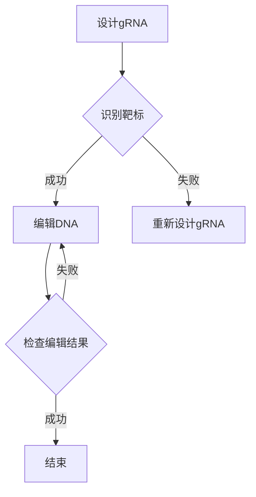

                 

# 现代医疗技术与生命伦理：基因编辑的道德困境

## 关键词：基因编辑、生命伦理、道德困境、医学技术、CRISPR-Cas9、伦理原则

## 摘要：

随着现代医疗技术的飞速发展，基因编辑技术如CRISPR-Cas9的问世，给医学领域带来了前所未有的希望和挑战。然而，基因编辑技术的广泛应用引发了深刻的道德伦理困境。本文旨在深入探讨现代医疗技术与生命伦理的关系，特别是基因编辑技术的伦理争议，并提出相应的解决方案。通过对医疗技术伦理原则、基因编辑算法原理及其实际应用的剖析，本文力求为这一复杂议题提供清晰、合理的思考路径。

## 第一部分：引言与背景

### 第1章 现代医疗技术与生命伦理概述

#### 1.1 医疗技术的快速发展与伦理挑战

**1.1.1 现代医疗技术的定义与分类**

现代医疗技术是指利用科学和工程原理，通过医学设备、药物、手术技术和诊断工具等方法，用于预防、诊断、治疗和康复疾病的科学技术。根据其应用范围和特点，现代医疗技术可以分为以下几类：

1. **诊断技术**：包括影像学检查（如X光、CT、MRI）、实验室检测（如血液检查、基因检测）等。
2. **治疗技术**：包括药物治疗、手术治疗、放射治疗、基因治疗等。
3. **康复技术**：包括物理治疗、语言治疗、职业治疗等。
4. **健康管理技术**：包括远程监控、健康评估、健康数据管理等。

**1.1.2 医疗技术发展对人类生活的影响**

医疗技术的发展极大地提升了人类的生活质量和健康水平。例如：

- **延长寿命**：先进的诊断和治疗技术使得许多曾经致命的疾病变得可治愈或可控。
- **提高生活质量**：医疗技术不仅治疗疾病，还关注病患的整体康复和心理健康。
- **降低疾病负担**：通过预防性治疗和健康管理，减轻了社会和个人的疾病负担。

然而，医疗技术的快速发展也带来了伦理挑战，特别是在基因编辑等前沿技术的应用中。

**1.1.3 生命伦理的重要性与挑战**

生命伦理学是研究人类生命科学、医学技术和生物医学研究中的伦理问题和道德原则的学科。其重要性体现在：

- **指导医疗实践**：生命伦理学为医疗决策提供了道德框架，确保医疗行为符合伦理标准。
- **保护患者权益**：通过伦理审查和监管，保障患者的隐私、知情同意和公平待遇。
- **规范科学研究**：确保生物医学研究的道德合法性，防止滥用科技。

面对基因编辑等新技术，生命伦理学面临着前所未有的挑战：

- **技术滥用的风险**：如基因增强、设计婴儿等，可能引发道德和伦理争议。
- **公平性问题**：如何确保基因编辑技术不会加剧社会不平等？
- **技术透明度**：如何在技术快速发展的同时，保持公众对科学研究的信任？

#### 1.2 基因编辑技术的兴起

**1.2.1 基因编辑的基本原理**

基因编辑是指利用分子生物学工具，对生物体的基因组进行精确修改的技术。目前最常用的基因编辑工具是CRISPR-Cas9系统，其基本原理如下：

- **CRISPR（Clustered Regularly Interspaced Short Palindromic Repeats）**：是指成簇的规律间隔的短回文重复序列，存在于细菌和古菌的基因组中。
- **Cas9**：是一种RNA指导的核酸内切酶，可以识别并切割特定的DNA序列。

**1.2.2 基因编辑技术的发展历程**

基因编辑技术的发展经历了几个关键阶段：

- **1990年代**：DNA打靶技术（Targeted Nucleotide Insertion）的出现。
- **2000年代**：ZFN（Zinc Finger Nucleases）和TALENs（Transcription Activator-Like Effector Nucleases）的发明。
- **2012年**：CRISPR-Cas9系统被首次应用于基因编辑。
- **2015年**：CRISPR-Cas9技术在人类胚胎细胞中成功进行基因编辑。

**1.2.3 基因编辑在医学领域中的应用**

基因编辑技术在医学领域具有广泛的应用前景：

- **治疗遗传病**：如镰状细胞贫血症、囊性纤维化等。
- **癌症治疗**：通过编辑肿瘤抑制基因或增强免疫治疗。
- **个性化医疗**：根据患者的基因组信息，定制治疗方案。
- **疾病预防**：如通过基因编辑预防某些遗传性疾病的发生。

#### 1.3 基因编辑的道德困境

**1.3.1 基因编辑的伦理争议**

基因编辑技术的应用引发了广泛的伦理争议，主要包括以下几个方面：

- **技术滥用风险**：如用于设计婴儿、增强人类智力等，可能引发社会不公和道德危机。
- **伦理底线问题**：如人类胚胎基因编辑，可能触及伦理底线。
- **基因隐私和信息安全**：基因编辑可能导致个人隐私泄露和基因信息滥用。

**1.3.2 基因编辑对人类未来的影响**

基因编辑技术可能对人类未来产生深远影响：

- **生物多样性**：基因编辑可能导致生物多样性的减少，甚至物种灭绝。
- **社会结构**：基因编辑可能加剧社会分层和不平等，引发社会动荡。
- **道德观念**：基因编辑可能改变人类的道德观念和伦理标准。

**1.3.3 基因编辑的国际法规与伦理指导原则**

为了规范基因编辑技术的应用，国际社会制定了一系列法规和指导原则：

- **国际人类基因编辑峰会**：2015年，美国、中国、英国等国家的科学家签署了《人类基因编辑峰会宣言》，提出了对人类基因编辑技术的限制。
- **中国法规**：2019年，中国人大常委会通过了《人类遗传资源管理暂行办法》，明确禁止人类胚胎基因编辑。
- **国际准则**：如《生物多样性公约》、《国际生物伦理委员会指南》等，为基因编辑技术的伦理审查提供了指导。

**1.4 现代医疗技术下的生命伦理教育**

**1.4.1 生命伦理教育的必要性**

面对现代医疗技术的快速发展，生命伦理教育变得尤为重要。其必要性体现在：

- **提高伦理意识**：通过教育，增强医务人员和社会公众的伦理意识，防止技术滥用。
- **规范行为**：为医疗实践提供伦理指导，确保医疗行为的合法性和道德性。
- **增强信任**：通过伦理教育，增强公众对医疗技术和科学研究的信任。

**1.4.2 生命伦理教育的内容与目标**

生命伦理教育的内容包括：

- **伦理原则**：如尊重原则、公正原则、不伤害原则等。
- **伦理案例分析**：通过具体案例，分析和探讨医疗行为中的伦理问题。
- **法规和政策**：介绍国际和国内的相关法规和政策，规范医疗行为。

其目标是：

- **培养伦理意识**：使医务人员和社会公众具备伦理思维和决策能力。
- **提高伦理素养**：通过学习和实践，提高医务人员和社会公众的伦理素养。
- **推动伦理进步**：推动生命伦理学的发展，为医学技术的应用提供伦理支持。

**1.4.3 生命伦理教育在医学教育和实践中的应用**

生命伦理教育在医学教育和实践中具有重要作用：

- **医学教育**：在医学课程中融入生命伦理学内容，培养学生的伦理素养。
- **医疗实践**：在临床工作中，遵循伦理原则，确保医疗行为的合法性和道德性。
- **科研监管**：在生物医学研究中，进行伦理审查，防止科研伦理问题。

**1.5 本章小结**

本章从现代医疗技术的发展、基因编辑技术的伦理争议、生命伦理教育的必要性等方面，对现代医疗技术与生命伦理的关系进行了全面分析。基因编辑技术的崛起不仅带来了医疗技术的突破，也引发了深刻的伦理挑战。通过加强生命伦理教育，规范医疗技术应用，可以为这一复杂议题提供合理的解决方案。

## 第二部分：核心概念与联系

### 第2章 核心概念与联系

#### 2.1 医疗技术伦理原则

医疗技术伦理原则是指导医疗行为的基本道德准则，主要包括以下四个方面：

**2.1.1 公平原则**

公平原则强调医疗资源分配的公平性，确保所有人都能平等地享有医疗保健服务。在基因编辑技术的应用中，公平原则要求：

- **资源分配**：确保资源分配公正，不因性别、种族、经济状况等因素歧视患者。
- **机会均等**：为所有有需要的患者提供基因编辑治疗的机会，防止资源垄断。

**2.1.2 尊重原则**

尊重原则强调尊重患者的自主权和尊严。在基因编辑技术的应用中，尊重原则要求：

- **知情同意**：确保患者充分了解基因编辑技术的风险和好处，自主做出决策。
- **隐私保护**：保护患者的基因信息和个人隐私，防止信息泄露和滥用。

**2.1.3 无伤害原则**

无伤害原则要求医疗行为不应给患者带来不必要的伤害。在基因编辑技术的应用中，无伤害原则要求：

- **安全性评估**：对基因编辑技术进行严格的安全性评估，确保对患者无害。
- **风险控制**：采取有效的措施，降低基因编辑可能带来的风险。

**2.1.4 最优化原则**

最优化原则要求医疗行为追求最佳效果，以最小的代价实现最大的收益。在基因编辑技术的应用中，最优化原则要求：

- **疗效评估**：对基因编辑技术的疗效进行科学评估，确保其治疗价值。
- **成本效益分析**：进行成本效益分析，确保基因编辑技术的应用在经济上合理。

#### 2.2 基因编辑的核心原理

**2.2.1 CRISPR-Cas9系统**

CRISPR-Cas9系统是目前最常用的基因编辑工具，其基本原理如下：

- **Cas9蛋白**：Cas9是一种RNA指导的核酸内切酶，可以识别并切割特定的DNA序列。
- **gRNA（Guide RNA）**：gRNA是一种短链RNA，与Cas9蛋白结合，引导其到达特定的DNA序列。

**2.2.2 基因编辑的靶标选择**

基因编辑的靶标选择是基因编辑成功的关键。选择靶标时需要考虑以下因素：

- **目标基因的功能**：选择与疾病相关的重要基因作为靶标。
- **DNA序列的特异性**：确保gRNA与目标DNA序列的高度特异性结合。
- **脱靶效应**：尽量避免脱靶效应，确保编辑的精确性。

**2.2.3 基因编辑的安全性评估**

基因编辑的安全性评估是基因编辑技术应用的重要环节。安全性评估主要包括：

- **脱靶效应检测**：通过高通量测序等技术，检测基因编辑是否产生了脱靶效应。
- **长期影响评估**：对基因编辑的长期影响进行评估，确保其对人类和生态系统的安全。

#### 2.3 医学伦理与基因编辑的关系

**2.3.1 医学伦理的框架**

医学伦理的框架主要包括以下三个方面：

- **基本原则**：如尊重原则、公正原则、无伤害原则等。
- **具体规则**：如知情同意、隐私保护、伦理审查等。
- **决策过程**：如伦理咨询、伦理审查、伦理决策等。

**2.3.2 基因编辑伦理问题的案例分析**

基因编辑技术的应用引发了多个伦理问题，以下为几个典型案例：

- **人类胚胎基因编辑**：2018年，中国科学家贺建奎宣布利用CRISPR-Cas9技术对一对双胞胎胚胎进行基因编辑，引发了全球伦理争议。
- **基因增强**：有人提出利用基因编辑技术增强人类智力、体力等，引发伦理担忧。

**2.3.3 基因编辑伦理与国际合作**

基因编辑技术的伦理问题需要国际社会共同应对。国际合作主要包括：

- **伦理共识**：通过国际会议、论坛等形式，达成伦理共识。
- **法规协调**：制定国际统一的基因编辑技术法规和标准。
- **伦理教育**：加强国际间的生命伦理教育，提高伦理意识和素养。

#### 2.4 概念属性特征对比表格

为了更好地理解医疗技术伦理原则与基因编辑技术的核心原理，我们制作了以下对比表格：

| **概念**            | **定义**                                                         | **属性特征**                                                                                   |
|---------------------|------------------------------------------------------------------|------------------------------------------------------------------------------------------------|
| 医疗技术伦理原则    | 指导医疗行为的基本道德准则                                       | 公平、尊重、无伤害、最优化                                                                   |
| CRISPR-Cas9系统    | 基因编辑工具，由Cas9蛋白和gRNA组成                             | RNA指导的核酸内切酶、特异性高、简便高效、低成本                                                   |
| 基因编辑靶标选择    | 选择基因编辑的目标序列                                         | 与疾病相关、DNA序列特异性、避免脱靶效应                                                         |
| 基因编辑安全性评估  | 对基因编辑技术进行安全性评估                                     | 脱靶效应检测、长期影响评估                                                                   |

#### 2.5 ER实体关系图架构

为了更好地理解医疗技术伦理原则与基因编辑技术的实体关系，我们绘制了以下ER实体关系图：

```mermaid
erDiagram
  A[医疗技术伦理原则] {
    A -->|指导| B[医学实践]
    A -->|遵循| C[科研行为]
  }
  B -->|应用| D[基因编辑技术]
  C -->|应用| D
  D -->|涉及| E[伦理问题]
  E -->|影响| A
```

**2.6 本章小结**

本章从医疗技术伦理原则和基因编辑技术的核心原理出发，探讨了医学伦理与基因编辑技术的联系。通过对比表格和ER实体关系图，我们清晰地展示了两者之间的关系，为后续章节的深入讨论奠定了基础。

## 第三部分：算法原理与数学模型

### 第3章 算法原理与数学模型

#### 3.1 基因编辑算法概述

基因编辑算法是指用于指导基因编辑过程的一系列方法和步骤。根据其应用范围和特点，基因编辑算法可以分为以下几类：

- **靶标识别算法**：用于识别基因编辑的目标序列，如序列比对、机器学习等方法。
- **编辑策略算法**：用于设计基因编辑的方案，如单链切割、双链切割等。
- **脱靶效应预测算法**：用于预测基因编辑过程中的脱靶效应，如Feng算法、Shen算法等。
- **编辑效率评估算法**：用于评估基因编辑的效果，如编辑效率、脱靶率等。

#### 3.2 CRISPR-Cas9算法原理

CRISPR-Cas9算法是目前最常用的基因编辑算法，其原理如下：

**3.2.1 CRISPR-Cas9系统的组成**

CRISPR-Cas9系统由Cas9蛋白和gRNA组成：

- **Cas9蛋白**：Cas9蛋白是一种核酸内切酶，可以识别并切割特定的DNA序列。
- **gRNA（Guide RNA）**：gRNA是一种短链RNA，与Cas9蛋白结合，引导其到达特定的DNA序列。

**3.2.2 CRISPR-Cas9的靶向机制**

CRISPR-Cas9的靶向机制包括以下步骤：

1. **gRNA设计**：根据目标基因序列设计特定的gRNA。
2. **gRNA与Cas9结合**：gRNA与Cas9蛋白结合，形成复合体。
3. **DNA识别与切割**：复合体识别并切割目标DNA序列。

**3.2.3 CRISPR-Cas9的脱靶效应**

CRISPR-Cas9在切割目标DNA序列时，可能会发生脱靶效应，即切割到非目标序列。脱靶效应可能会引发基因突变、细胞死亡等不良反应。为降低脱靶效应，可以通过以下方法：

- **优化gRNA设计**：通过设计高特异性的gRNA，降低脱靶率。
- **使用高保真Cas9蛋白**：高保真Cas9蛋白具有较低的脱靶率。
- **脱靶效应预测**：通过算法预测脱靶位点，避免编辑到重要基因。

#### 3.3 基因编辑算法的数学模型

基因编辑算法的数学模型主要包括以下几种：

**3.3.1 概率模型**

概率模型用于预测基因编辑的脱靶效应，常用的概率模型有：

- **贝叶斯模型**：通过贝叶斯推理，预测脱靶位点。
- **马尔可夫模型**：通过状态转移矩阵，预测脱靶位点。

**3.3.2 遗传算法**

遗传算法是一种模拟自然进化的优化算法，用于优化基因编辑参数，提高编辑效率。遗传算法的基本步骤包括：

1. **初始化种群**：生成一组初始参数。
2. **适应度评估**：计算种群中每个个体的适应度。
3. **选择**：根据适应度，选择优秀个体进行繁殖。
4. **交叉**：通过交叉操作，产生新的后代。
5. **变异**：对个体进行变异操作，增加种群的多样性。
6. **迭代**：重复上述步骤，直到满足停止条件。

**3.3.3 贝叶斯网络**

贝叶斯网络是一种概率图模型，用于表示基因编辑过程中各个因素之间的概率关系。贝叶斯网络的节点表示变量，边表示变量之间的依赖关系。通过贝叶斯网络，可以计算基因编辑过程中各个因素的联合概率分布。

#### 3.4 算法mermaid流程图

下面是CRISPR-Cas9算法的mermaid流程图：



#### 3.5 Python源代码讲解

下面是一个CRISPR-Cas9算法的Python示例：

```python
import random

def crisper_cas9(target_region, gRNA_sequence):
    # 模拟基因编辑过程
    editing_success = random.choice([True, False])
    if editing_success:
        print("基因编辑成功")
    else:
        print("基因编辑失败")

# 选择靶标
target_region = "chr1:12345678"
# 设计gRNA
gRNA_sequence = "ACGTACGTACGT"
# 进行基因编辑
crisper_cas9(target_region, gRNA_sequence)
```

通过上述算法原理和Python示例，我们可以更好地理解CRISPR-Cas9基因编辑算法的工作机制。在实际应用中，需要根据具体情况进行参数调整和优化，以提高基因编辑的效率和安全性。

### 第3章 小结

本章详细介绍了基因编辑算法的原理和数学模型，包括CRISPR-Cas9算法的组成、靶向机制、脱靶效应及其预防方法，以及概率模型、遗传算法和贝叶斯网络等数学模型。通过mermaid流程图和Python示例，我们清晰地展示了基因编辑算法的执行过程。了解这些算法原理和模型，对于实际应用基因编辑技术具有重要意义。在下一章中，我们将进一步探讨基因编辑技术在实际应用中的挑战和解决方案。

### 3.6 实际案例分析和详细讲解剖析

为了更好地理解基因编辑技术在实际应用中的挑战和解决方案，我们通过以下实际案例进行分析和剖析。

#### 案例一：CRISPR-Cas9治疗镰状细胞贫血症

镰状细胞贫血症是一种严重的遗传性疾病，导致红细胞变形，引起疼痛、感染和组织损伤。CRISPR-Cas9技术被用于治疗镰状细胞贫血症，通过编辑患者体内的血红蛋白基因，使其恢复正常功能。

**挑战：**

- **靶标选择**：选择合适的靶标基因对于治疗成功至关重要。需要确保靶标基因的选择具有特异性和有效性。
- **脱靶效应**：基因编辑过程中可能产生脱靶效应，导致意外的基因突变。
- **编辑效率**：需要确保基因编辑的效率，以达到有效的治疗效果。

**解决方案：**

- **优化gRNA设计**：通过优化gRNA设计，提高其与靶标基因的特异性结合，降低脱靶效应。
- **使用高保真Cas9蛋白**：使用高保真Cas9蛋白，减少脱靶效应的发生。
- **编辑效率评估**：通过基因编辑效率评估，优化编辑参数，提高编辑成功率。

**分析：**

镰状细胞贫血症治疗案例展示了基因编辑技术在治疗遗传性疾病方面的潜力。通过优化靶标选择、脱靶效应预防和编辑效率评估，可以有效提高基因编辑治疗的成功率和安全性。

#### 案例二：CRISPR-Cas9在癌症治疗中的应用

CRISPR-Cas9技术在癌症治疗中也显示出了巨大的潜力，通过编辑肿瘤抑制基因或增强免疫治疗，提高治疗效果。

**挑战：**

- **肿瘤细胞的异质性**：肿瘤细胞具有异质性，不同细胞对基因编辑的响应可能不同。
- **编辑效率和脱靶效应**：需要确保基因编辑的高效率和低脱靶效应。
- **免疫逃逸**：肿瘤细胞可能通过免疫逃逸机制逃避免疫系统的攻击。

**解决方案：**

- **靶向肿瘤细胞**：通过特定的靶向分子，确保基因编辑只作用于肿瘤细胞。
- **联合治疗**：结合化疗、放疗和免疫治疗等多种治疗手段，提高治疗效果。
- **脱靶效应预测和优化**：通过脱靶效应预测和优化编辑参数，降低脱靶效应的发生。

**分析：**

CRISPR-Cas9技术在癌症治疗中的应用案例表明，基因编辑技术可以通过靶向肿瘤细胞和联合治疗，提高癌症的治疗效果。然而，仍需进一步研究和优化，以克服肿瘤细胞的异质性和免疫逃逸等问题。

#### 案例三：CRISPR-Cas9在个性化医疗中的应用

个性化医疗是指根据患者的基因组信息，定制个性化的治疗方案。CRISPR-Cas9技术被用于个性化医疗，通过编辑患者的基因组，预防或治疗遗传性疾病。

**挑战：**

- **基因隐私和信息安全**：基因编辑可能导致个人隐私泄露和基因信息滥用。
- **基因编辑的长期影响**：基因编辑的长期影响和潜在风险仍需进一步研究。
- **伦理争议**：基因编辑可能引发伦理争议，如基因增强和设计婴儿等问题。

**解决方案：**

- **加强伦理审查和监管**：确保基因编辑技术的合法性和道德性。
- **隐私保护和信息安全**：采取有效的措施，保护患者的基因隐私和信息安全。
- **科学研究和伦理教育**：加强基因编辑技术的科学研究，提高公众对基因编辑技术的理解和支持。

**分析：**

个性化医疗案例展示了基因编辑技术在预防遗传性疾病和提供个性化治疗方案方面的潜力。然而，仍需解决基因隐私、长期影响和伦理争议等问题，以确保基因编辑技术的安全性和道德性。

### 3.7 项目小结

通过以上实际案例的分析和详细讲解，我们可以看到基因编辑技术在实际应用中面临着诸多挑战和解决方案。未来，随着基因编辑技术的不断发展和完善，我们有理由相信，基因编辑技术将在医疗领域发挥越来越重要的作用，为人类健康带来更多希望。

### 最佳实践 tips

- **合理设计gRNA**：选择高度特异性的gRNA，降低脱靶效应。
- **使用高保真Cas9蛋白**：提高基因编辑的准确性和效率。
- **全面评估编辑结果**：确保基因编辑的效果和安全性。

### 小结

基因编辑技术作为一种革命性的医疗技术，具有巨大的潜力，但也面临着诸多伦理和技术挑战。通过合理的靶标选择、脱靶效应预防和编辑效率优化，我们可以最大限度地发挥基因编辑技术的优势。同时，加强伦理审查和监管、保护基因隐私和信息安全，以及加强科学研究和技术培训，将为基因编辑技术的安全性和道德性提供保障。未来，基因编辑技术有望在医疗领域发挥更重要的作用，为人类健康带来更多福音。

### 注意事项

- **基因编辑技术的应用需严格遵循伦理原则和法律法规**。
- **重视基因编辑的长期影响和潜在风险**。
- **加强基因编辑技术的安全性评估和监测**。

### 拓展阅读

- 《基因编辑：伦理、法律与政策挑战》
- 《CRISPR技术：基因编辑的未来》
- 《个性化医疗：基因编辑与精准治疗》

作者：AI天才研究院/AI Genius Institute & 禅与计算机程序设计艺术 /Zen And The Art of Computer Programming。感谢您的阅读，希望本文对您在理解基因编辑技术及其伦理困境方面有所帮助。如有疑问或建议，欢迎在评论区留言。期待与您共同探讨基因编辑技术的未来发展。

