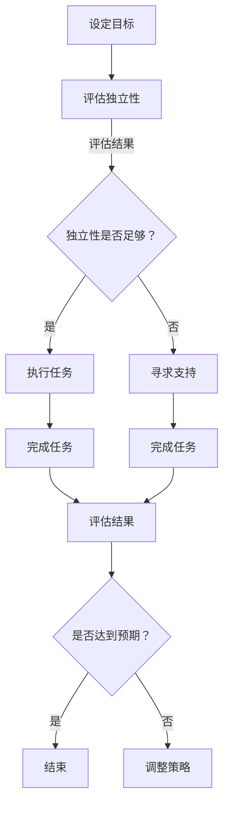

                 


### 现代家庭的亲子关系：在独立与依赖间寻找新平衡

> 关键词：现代家庭，亲子关系，独立性，依赖性，平衡

> 摘要：本文旨在探讨现代家庭中亲子关系的独立与依赖问题，通过深入分析独立性与依赖性的定义、理论基础以及培养与应对策略，寻找一种新的平衡点，为家庭关系提供有益的指导。

### 引言

在现代社会，家庭结构发生了巨大的变化，亲子关系也面临着新的挑战。传统的家庭模式中，父母通常扮演着权威者的角色，而孩子则依赖于父母的指导和支持。然而，随着社会的发展，孩子们越来越渴望独立，追求自我实现。这种独立性的追求与父母对孩子依赖的担忧之间产生了矛盾。本文将围绕这个核心问题，探讨如何在独立与依赖之间寻找新的平衡。

### 第1章：问题的背景与定义

1.1 亲子关系的发展历程

亲子关系经历了从传统到现代的转变。在传统社会中，家庭结构较为稳定，父母对孩子的依赖程度较高，孩子的独立性较弱。随着工业化和城市化的进程，家庭结构逐渐多元化，亲子关系也变得更加复杂。

1.2 现代家庭中独立与依赖的矛盾

现代社会中，孩子渴望独立，父母则担心孩子过于独立会失去对生活的掌控。这种矛盾导致了家庭关系的紧张和冲突。

1.3 亲子关系的定义与分类

亲子关系是指父母与子女之间的情感纽带和互动模式。根据独立性与依赖性的程度，可以将亲子关系分为依赖型、独立型和平衡型。

### 第2章：独立与依赖的理论基础

2.1 独立与依赖的发展心理学理论

发展心理学研究表明，个体在成长过程中会经历从依赖到独立的转变。这个过程中，父母的支持和引导起着关键作用。

2.2 社会学视角下的独立与依赖

社会学视角下，独立与依赖是个人社会化的两个重要方面。过度依赖或过度独立都可能对个体的社会化产生负面影响。

2.3 心理学视角下的独立与依赖

心理学视角下，独立与依赖是个体心理发展的两个重要阶段。适度的独立和依赖有助于个体的心理健康。

### 第3章：亲子关系的核心要素

3.1 信任与尊重

信任和尊重是亲子关系的基石。缺乏信任和尊重会导致亲子关系的紧张和冲突。

3.2 沟通与理解

有效的沟通和理解是缓解亲子关系紧张的重要手段。父母需要学会倾听孩子的想法和需求。

3.3 支持与鼓励

父母的支持和鼓励是孩子独立成长的重要动力。适度的支持和鼓励有助于孩子建立自信心。

### 第4章：独立性的培养

4.1 孩子独立性发展的阶段

孩子的独立性发展可以分为依赖期、探索期和自主期。父母需要根据不同阶段的特点进行引导。

4.2 家长的角色与责任

家长在孩子的独立性培养中扮演着重要角色。他们需要尊重孩子的个性和需求，提供适当的支持和引导。

4.3 实践技巧与案例分析

本文将结合具体案例，介绍一些培养孩子独立性的实践技巧。

### 第5章：依赖性的应对

5.1 识别孩子过度的依赖

父母需要学会识别孩子过度的依赖行为，并采取适当的措施进行干预。

5.2 家长的应对策略

家长可以采取一些策略来帮助孩子减少依赖，提高独立性。

5.3 案例分析与技巧分享

本文将分享一些应对孩子依赖性的成功案例和技巧。

### 第6章：平衡独立与依赖

6.1 平衡的原则与方法

在亲子关系中，平衡独立与依赖是非常重要的。本文将介绍一些平衡的原则和方法。

6.2 家庭教育中的平衡实践

家庭教育的实践过程中，父母需要灵活运用平衡原则，根据孩子的实际情况进行调整。

6.3 持续跟踪与调整

家庭关系的平衡是一个持续的过程。父母需要不断跟踪和调整，以确保亲子关系的健康发展。

### 第7章：新平衡下的亲子关系

7.1 新平衡的长期影响

新平衡下的亲子关系对孩子和家庭的长期影响是积极的。本文将探讨这些影响。

7.2 家庭关系的变化

新平衡下的亲子关系将带来家庭关系的变化。本文将分析这些变化。

7.3 亲子关系的未来展望

本文将展望未来亲子关系的发展趋势，为家庭提供有益的参考。

### 结论

本文通过深入探讨现代家庭中亲子关系的独立与依赖问题，提出了在独立与依赖之间寻找新平衡的观点。这一观点为家庭关系提供了有益的指导，有助于父母更好地理解和支持孩子的成长。

### 作者信息

作者：AI天才研究院/AI Genius Institute & 禅与计算机程序设计艺术 /Zen And The Art of Computer Programming

----------------------------------------------------------------

### 第1章：问题的背景与定义

#### 1.1 亲子关系的发展历程

亲子关系是人类社会中最为基本和重要的关系之一。它不仅仅是一个家庭内部的关系，更是社会结构和文化传承的纽带。从古至今，亲子关系在不同的历史时期和社会背景下，经历了显著的发展和变化。

在传统社会中，家庭结构通常较为稳定，亲子关系呈现出明显的等级化和权威性。父母在孩子的心中具有绝对的权威地位，孩子对父母的依赖程度较高。这种依赖关系在很大程度上源于社会对家庭角色的期待，父母被期望成为家庭的“顶梁柱”，而孩子则被期望成为未来的“接班人”。在这种背景下，亲子关系往往以父母为中心，孩子处于被照顾和指导的地位。

随着时间的推移，尤其是随着工业化和城市化的进程，家庭结构发生了巨大的变化。传统的大家庭模式逐渐被核心家庭和小家庭所取代，家庭成员之间的互动模式也变得更加复杂。在这个过程中，亲子关系开始从传统的权威模式向更加平等和民主的模式转变。父母与子女之间的互动更加注重沟通和理解，孩子逐渐获得了更多的自主权和参与权。

#### 1.2 现代家庭中独立与依赖的矛盾

现代家庭中的亲子关系面临着独立与依赖之间的矛盾。这种矛盾主要源于社会的发展和个体心理的变化。

首先，随着教育水平的提高和信息的普及，孩子们越来越渴望独立。他们希望能够自主地做出决策，参与社会活动，实现自我价值。这种独立性的追求不仅体现在孩子的日常生活和学习中，还体现在他们对未来职业和生活的规划上。孩子们希望通过自己的努力和智慧，实现个人梦想和目标。

然而，与此同时，父母往往对孩子的独立性持有一定的担忧。他们担心孩子过于独立会导致他们无法应对生活中的困难和挑战，失去对生活的掌控。这种担忧往往源于父母对孩子安全和生活质量的考虑，同时也是对传统家庭角色的一种延续。

其次，现代社会的高速发展和变化也给亲子关系带来了新的挑战。父母在繁忙的工作和生活中，往往难以给予孩子足够的时间和关注。这种情况下，孩子可能会产生孤独感和无助感，从而对父母产生过度的依赖。另一方面，父母由于工作压力和生活压力，也可能对孩子的期望值过高，导致孩子在追求独立的过程中感到压力巨大。

#### 1.3 亲子关系的定义与分类

亲子关系是指父母与子女之间的情感纽带和互动模式。这种关系不仅仅是一种生物学上的联系，更是一种深层次的情感和认知上的联系。亲子关系的好坏直接影响到孩子的成长和发展，也影响到家庭和谐和社会稳定。

从独立性和依赖性的角度来看，亲子关系可以分为以下几种类型：

- **依赖型亲子关系**：在这种关系中，孩子对父母的依赖程度较高，自主性和独立性较弱。孩子往往缺乏自信，容易感到焦虑和不安。
- **独立型亲子关系**：在这种关系中，孩子具有较强的独立性和自主性，能够自主做出决策和解决问题。孩子通常具备较高的自信和自尊。
- **平衡型亲子关系**：在这种关系中，孩子和父母在独立性和依赖性方面达到了相对平衡的状态。孩子既有足够的独立性和自主性，又有适当的依赖性和安全感。

每种亲子关系类型都有其优缺点，关键在于如何在不同情况下找到合适的平衡点。本文将围绕这些关系类型，探讨如何在独立与依赖之间寻找新的平衡。

#### 1.4 独立与依赖的定义与特征

独立性是指个体在情感、行为和认知上能够独立做出决策和承担责任的能力。独立性强的个体通常具有以下特征：

- **自主性**：能够自主做出决策，不依赖他人的意见。
- **自律性**：能够自我管理，遵守规则和规范。
- **自信心**：对自己有信心，相信自己的能力。
- **解决问题的能力**：能够独立面对问题和挑战，寻找解决方案。

依赖性则是指个体在情感、行为和认知上对他人的依赖程度。依赖性强的个体通常具有以下特征：

- **依赖性情感**：对他人的情感依赖较强，容易产生焦虑和不安。
- **行为依赖**：在行为上需要他人的指导和帮助，难以独立完成任务。
- **认知依赖**：在认知上容易受到他人的影响，缺乏独立思考的能力。

独立性是成长过程中的一个重要目标，它有助于个体实现自我价值，提高生活质量和幸福感。然而，过度追求独立性可能导致个体的孤独感和社交障碍。依赖性虽然在一定程度上有助于个体的安全感和归属感，但过度依赖则可能导致个体的自卑感和无能感。

在亲子关系中，独立性与依赖性之间的平衡至关重要。适度的独立性能够帮助孩子建立自信和自尊，促进其个人成长和发展。同时，适度的依赖性也有助于父母与孩子之间的情感联系和沟通，增强家庭凝聚力。然而，如何把握这种平衡，是一个值得探讨和解决的问题。

#### 1.5 独立性与依赖性的培养与应对

独立性培养与依赖性应对是现代家庭教育中的两个重要任务。以下是一些具体的培养与应对策略：

- **独立性培养**：

  - **鼓励自主性**：让孩子自主决策，培养他们的自主性。在日常生活中，可以让孩子参与家庭决策，如选择购物地点、安排周末活动等。

  - **培养自律性**：通过设立规则和目标，培养孩子的自律性。例如，制定学习计划、时间管理规则等。

  - **提供挑战机会**：给予孩子适当的挑战，鼓励他们独立解决问题。例如，让孩子参与家庭维修、烹饪等活动。

  - **树立自信心**：通过正面反馈和鼓励，帮助孩子树立自信心。关注孩子的优点和进步，给予肯定和赞扬。

- **依赖性应对**：

  - **识别依赖行为**：父母需要学会识别孩子的依赖行为，如过度依赖父母的决策、行为上的退缩等。

  - **鼓励独立思考**：引导孩子进行独立思考，培养他们的批判性思维。通过提问和讨论，鼓励孩子表达自己的观点和想法。

  - **培养社交能力**：通过参与社交活动和团队合作，提高孩子的社交能力，减少对父母的依赖。

  - **提供支持与鼓励**：在孩子面临困难时，给予适当的帮助和支持，鼓励他们克服挑战。

#### 1.6 家庭教育中的独立性与依赖性平衡

家庭教育中的独立性与依赖性平衡是一个复杂但重要的任务。以下是一些实现平衡的方法：

- **树立正确的价值观**：父母需要树立正确的价值观，既鼓励孩子的独立性，又不过度依赖。这可以通过日常生活中的点滴教育实现。

- **灵活调整教育方法**：根据孩子的年龄、性格和需求，灵活调整教育方法。例如，对于年龄较小的孩子，可以更多地提供指导和帮助，而对于年龄较大的孩子，可以更多地鼓励独立思考和决策。

- **建立良好的沟通机制**：建立良好的沟通机制，鼓励孩子表达自己的想法和感受，父母也需要倾听和理解孩子的需求。

- **提供积极的心理支持**：在孩子的成长过程中，提供积极的心理支持，帮助他们克服困难，增强自信心。

#### 1.7 现代家庭中独立性与依赖性的影响

独立性与依赖性对现代家庭的影响是多方面的，包括：

- **亲子关系的质量**：良好的独立性与依赖性平衡有助于建立高质量的亲子关系，增强家庭成员之间的情感联系和信任。

- **孩子的成长与发展**：独立性与依赖性的平衡有助于孩子的全面成长和发展，提高他们的自我认知和社会适应能力。

- **家庭功能的发挥**：独立性与依赖性的平衡有助于家庭功能的发挥，如情感支持、教育和经济支持等。

- **社会和谐与稳定**：良好的家庭关系和社会关系的和谐与稳定密切相关。独立性与依赖性的平衡有助于构建和谐社会。

### 第2章：独立与依赖的理论基础

#### 2.1 独立与依赖的发展心理学理论

发展心理学是研究个体从出生到老年期间的心理变化和发展过程的学科。在发展心理学中，独立与依赖是一个重要的研究领域，涉及到个体的自主性、自我效能感、自我决定等方面。

独立性是指个体在情感、行为和认知上能够独立做出决策和承担责任的能力。独立性发展的心理学理论主要包括以下几种：

- **自主性发展理论**：自主性发展理论认为，个体在成长过程中，会经历从被动依赖到主动自主的转变。自主性的发展是一个逐步的过程，涉及到自我效能感、自我决定和自我反思等心理过程。心理学家如沃特金（Wolfgang Kohler）和吉布森（James J. Gibson）都对此进行了深入的研究。

- **自我决定理论**：自我决定理论认为，个体的自主性和自我决定是心理健康的基石。自我决定包括选择、自由和自主性，这些因素对个体的动机、行为和幸福感都有重要影响。心理学家如瑞安（Edward L. Deci）和理查德·斯莱文（Richard M. Ryan）对此进行了广泛的研究。

- **自我效能感理论**：自我效能感是指个体对自己完成特定任务的信心和信念。自我效能感理论认为，个体的自我效能感对其行为和动机有重要影响。自我效能感高的个体更倾向于采取行动，克服困难，实现目标。心理学家如班杜拉（Albert Bandura）对此进行了深入的研究。

依赖性则是指个体在情感、行为和认知上对他人的依赖程度。依赖性发展的心理学理论主要包括以下几种：

- **依恋理论**：依恋理论是研究个体与主要照顾者（通常是父母）之间情感联系和互动模式的学科。依恋理论认为，个体在早期生命阶段形成的依恋风格对其后续的人际关系和情感发展有深远影响。心理学家如约翰·鲍尔比（John Bowlby）和玛丽·艾斯沃斯（Mary Ainsworth）对此进行了深入研究。

- **自我价值理论**：自我价值理论认为，个体的自我价值感对其依赖性和独立性有重要影响。个体在成长过程中，如果感受到自己的价值和能力，就更容易发展出独立性。反之，如果个体对自己的价值和能力感到怀疑，就可能更容易依赖他人。心理学家如塞利格曼（Martin Seligman）对此进行了研究。

- **社会学习理论**：社会学习理论认为，个体的行为和态度是通过观察、模仿和体验社会环境中的他人行为而获得的。在依赖性的发展中，社会学习理论强调个体通过观察他人的行为和结果，来学习如何与他人互动。心理学家如班杜拉（Albert Bandura）对此进行了广泛的研究。

#### 2.2 社会学视角下的独立与依赖

社会学视角下，独立与依赖是个人社会化的两个重要方面。个人社会化是指个体在社会中学习社会规范、价值观和行为的过程。在这个过程中，独立性和依赖性都是不可或缺的。

- **独立性的社会学意义**：从社会学的角度来看，独立性是个体在社会中实现自我价值和自我实现的重要条件。具有独立性的个体能够更好地适应社会环境，发挥自己的潜能，实现个人目标。社会学研究表明，独立性强的个体在社会互动中更具优势，更容易获得社会支持和认可。

- **依赖性的社会学意义**：依赖性则是个体在社会互动中建立和维护社会关系的重要手段。适当的依赖性有助于个体在社会中获得支持和帮助，增强社会凝聚力。然而，过度的依赖性可能导致个体对社会环境的不适应，甚至导致社会问题的出现。社会学研究表明，依赖性强的个体在社会互动中更倾向于依赖他人，寻求外部支持。

- **社会角色与独立依赖的关系**：社会角色是指个体在社会中承担的特定角色和责任。不同的社会角色对独立性和依赖性的要求不同。例如，一个职业经理人在工作中需要具有较高的独立性，能够独立做出决策和承担责任。而在家庭生活中，一个家庭成员则需要适度的依赖性，以便与家人建立和谐的关系。

#### 2.3 心理学视角下的独立与依赖

心理学视角下，独立与依赖是个体心理发展的两个重要阶段。个体在成长过程中，会经历从依赖到独立的转变。这个过程中，独立性和依赖性都是必不可少的。

- **依赖性的心理学意义**：依赖性在个体的早期发展中起着重要作用。在婴幼儿时期，个体需要依赖父母或其他照顾者来满足基本的生活需求，如饮食、安全和情感支持。这种依赖性有助于个体建立安全感，培养信任感和依恋感。心理学研究表明，健康的依赖性有助于个体的心理发展，为其后续的独立性培养奠定基础。

- **独立性的心理学意义**：随着个体成长，独立性逐渐成为其心理发展的重要目标。独立性强的个体能够自主决策，独立解决问题，具有较强的自我效能感和自信心。心理学研究表明，独立性有助于个体在社交和职业领域取得成功，提高生活质量和幸福感。

- **依赖性与独立性的平衡**：在个体心理发展中，依赖性与独立性之间需要达到一种平衡。过度的依赖性可能导致个体产生焦虑和不安，影响其自信心和独立性发展。过度的独立性则可能导致个体产生孤独感和无助感，影响其社交能力和情感发展。心理学研究表明，适度的依赖性和独立性有助于个体在心理发展中取得平衡，实现个人成长和心理健康。

### 第3章：亲子关系的核心要素

#### 3.1 信任与尊重

信任和尊重是亲子关系的基石，它们对于建立和谐、稳定的家庭关系至关重要。在亲子关系中，信任和尊重不仅体现在父母对孩子的态度上，也体现在孩子对父母的理解和接纳上。

- **信任的定义与重要性**：信任是指父母对孩子诚实、可靠和忠诚的期待。它是一种深层次的情感联系，能够增强父母与孩子之间的亲密感和安全感。信任在亲子关系中起着至关重要的作用，它能够促进有效的沟通，减少误解和冲突，有助于孩子的健康成长。

- **如何建立信任**：
  - **言行一致**：父母需要通过言行一致来赢得孩子的信任。例如，父母承诺的事情一定要做到，避免让孩子感到被欺骗。
  - **透明沟通**：父母应该与孩子保持开放和诚实的沟通，让孩子了解家庭的情况和父母的想法。
  - **尊重孩子的隐私**：父母应该尊重孩子的个人隐私，避免过度干涉孩子的私人生活。

- **尊重的定义与重要性**：尊重是指父母对孩子人格和权利的认可和尊重。它是一种基于平等和尊重的互动方式，能够增强孩子的自尊心和自我价值感。尊重在亲子关系中起着至关重要的作用，它能够帮助孩子建立健康的自我形象，增强自信心，促进个人成长。

- **如何尊重孩子**：
  - **倾听孩子的意见**：父母应该倾听孩子的意见，尊重孩子的选择，让孩子感受到自己的价值和被重视。
  - **平等对话**：父母应该与孩子进行平等对话，避免以权威者的姿态对待孩子，让孩子感到被尊重。
  - **避免侮辱和贬低**：父母应该避免使用侮辱和贬低的语言，避免伤害孩子的自尊心。

#### 3.2 沟通与理解

沟通与理解是亲子关系中不可或缺的要素。有效的沟通能够增强父母与孩子之间的情感联系，减少误解和冲突，促进孩子的健康成长。理解则能够帮助父母更好地了解孩子的需求和感受，从而提供更有针对性的支持和帮助。

- **沟通的定义与重要性**：沟通是指父母与孩子之间的信息交流和理解过程。有效的沟通能够促进亲子之间的互动和合作，增强家庭凝聚力。沟通在亲子关系中起着至关重要的作用，它能够帮助孩子建立自信心，提高社交能力，促进心理健康。

- **如何进行有效沟通**：
  - **倾听**：父母需要学会倾听孩子的想法和感受，尊重孩子的意见和需求。倾听是有效沟通的前提，它能够让孩子感到被重视和理解。
  - **表达**：父母需要学会清晰、明确地表达自己的想法和感受，避免使用模糊或含糊的表述，让孩子感到困惑或误解。
  - **开放性**：父母应该保持开放的态度，鼓励孩子表达自己的想法，即使这些想法与父母的观点不一致。开放性能够促进亲子之间的真诚交流，减少冲突。

- **理解的定义与重要性**：理解是指父母对孩子需求和感受的深入认知和共鸣。理解能够帮助父母更好地了解孩子的内心世界，提供更有针对性的支持和帮助。理解在亲子关系中起着至关重要的作用，它能够增强孩子的安全感和信任感，促进孩子的心理健康。

- **如何增进理解**：
  - **换位思考**：父母应该尝试从孩子的角度去思考问题，理解孩子的感受和需求。
  - **共情**：父母需要学会共情，感受孩子的情绪和感受，给予孩子情感上的支持。
  - **耐心倾听**：父母应该耐心倾听孩子的讲述，给予孩子足够的时间和空间来表达自己的观点和感受。

#### 3.3 支持与鼓励

支持与鼓励是父母在孩子成长过程中不可或缺的要素。它们能够帮助孩子建立自信心，克服困难，实现个人目标。支持与鼓励不仅仅是物质上的帮助，更包括情感上的支持和精神上的鼓励。

- **支持的定义与重要性**：支持是指父母对孩子在生活、学习和成长过程中提供的帮助和支持。支持在孩子的成长过程中起着至关重要的作用，它能够增强孩子的自信心，提高孩子的抗挫折能力，促进孩子的全面发展。

- **如何提供有效支持**：
  - **物质支持**：父母应该为孩子提供基本的物质需求，如食物、衣物、住所等。同时，父母也应该提供必要的教育资源，帮助孩子获得更好的学习机会。
  - **情感支持**：父母应该关注孩子的情感需求，提供情感上的支持和安慰。在孩子遇到困难或挫折时，父母应该给予理解和鼓励，让孩子感到温暖和安心。
  - **生活指导**：父母应该为孩子提供生活指导，帮助孩子学会如何处理日常生活中的问题。例如，如何合理安排时间、如何与人交往等。

- **鼓励的定义与重要性**：鼓励是指父母对孩子努力和进步的认可和赞扬。鼓励在孩子的成长过程中起着至关重要的作用，它能够激发孩子的内在动力，增强孩子的自信心，促进孩子的积极行为。

- **如何进行有效鼓励**：
  - **肯定孩子的努力**：父母应该肯定孩子的努力和付出，而不是仅仅关注结果。即使孩子没有取得完美的成绩，父母也应该鼓励他们继续努力。
  - **设定合理的目标**：父母应该与孩子一起设定合理的目标，鼓励孩子不断进步。目标应该既具有挑战性，又能够实现，以激发孩子的兴趣和动力。
  - **赞扬孩子的优点**：父母应该注重赞扬孩子的优点和进步，避免只关注孩子的缺点。正面的赞扬能够增强孩子的自尊心和自信心。

### 第4章：独立性的培养

#### 4.1 孩子独立性发展的阶段

孩子的独立性发展是一个逐步的过程，通常可以分为以下几个阶段：

- **依赖期（0-3岁）**：在这个阶段，孩子对父母的依赖程度最高。他们需要父母的照顾和指导来满足基本的生活需求，如饮食、睡眠和安全等。父母在这个阶段的主要任务是提供稳定和安全的家庭环境，让孩子感到被关爱和照顾。

- **探索期（3-6岁）**：随着孩子年龄的增长，他们开始对周围的世界充满好奇心，探索欲望增强。这个阶段的孩子开始尝试独立做一些事情，如穿衣、吃饭和整理玩具等。父母在这个阶段的主要任务是鼓励孩子的探索行为，提供适当的支持和指导，同时确保孩子的安全。

- **自主期（6-12岁）**：在这个阶段，孩子的独立性逐渐增强。他们开始能够独立完成一些日常任务，如做作业、管理时间和处理一些简单的问题。父母在这个阶段的主要任务是培养孩子的自我管理能力和责任感，提供适当的自主权。

- **成熟期（12岁以后）**：在这个阶段，孩子的独立性发展达到了成熟阶段。他们开始能够独立做出决策，承担更多的责任，并适应社会环境。父母在这个阶段的主要任务是继续支持孩子的成长，提供必要的指导和建议，同时尊重孩子的独立性和自主权。

#### 4.2 家长的角色与责任

在孩子的独立性培养过程中，家长的角色和责任至关重要。以下是一些家长在培养孩子独立性时需要关注的关键点：

- **观察与引导**：家长需要细心观察孩子的行为和需求，根据孩子的年龄和发展阶段，提供适当的引导和支持。例如，对于年幼的孩子，家长可以逐步教授他们一些基本的自理技能，如穿衣、吃饭和整理房间等。

- **设定规则与期望**：家长需要为孩子设定合理的规则和期望，让孩子知道什么是对的行为，什么是不允许的行为。同时，家长应该明确表达自己的期望，让孩子知道他们需要做什么，以及为什么这样做。

- **鼓励自主探索**：家长应该鼓励孩子进行自主探索，培养他们的好奇心和创造力。例如，家长可以提供一些安全的玩具和工具，让孩子自己尝试做一些简单的手工艺或实验。

- **提供反馈与鼓励**：家长需要及时给予孩子反馈和鼓励，让他们知道他们的努力得到了认可和赞赏。同时，家长也应该指出孩子可以改进的地方，帮助他们学会从失败中汲取经验。

- **培养责任感**：家长需要培养孩子的责任感，让他们学会为自己的行为负责。例如，家长可以让孩子参与家庭事务，如做家务、购物等，让孩子体验到责任的重要性。

#### 4.3 实践技巧与案例分析

以下是一些培养孩子独立性的实践技巧和案例分析：

- **案例1：培养孩子的自理能力**

  家长可以逐步教授孩子一些基本的自理技能，如穿衣、洗澡、整理房间等。例如，家长可以从简单的任务开始，如教孩子如何自己穿衣，然后逐渐增加难度，如教孩子如何自己洗澡和整理房间。在教导过程中，家长应该给予孩子足够的耐心和指导，鼓励他们尝试和完成任务。

- **案例2：鼓励孩子的自主探索**

  家长可以提供一些安全的玩具和工具，让孩子自己尝试做一些简单的手工艺或实验。例如，家长可以让孩子用积木搭建简单的结构，或者让孩子尝试做一些简单的手工制作。在孩子的探索过程中，家长应该给予支持和鼓励，让孩子感受到成功的喜悦。

- **案例3：培养孩子的责任感**

  家长可以让孩子参与家庭事务，如做家务、购物等。例如，家长可以让孩子负责自己的房间清洁，或者让孩子帮忙购买家庭所需的物品。在孩子的参与过程中，家长应该教会他们如何合理安排时间，如何完成任务，以及如何为自己的行为负责。

### 第5章：依赖性的应对

#### 5.1 识别孩子过度的依赖

孩子过度依赖父母可能表现为以下几种行为：

- **过度寻求帮助**：孩子在做一些基本的事情时，总是寻求父母的帮助，如穿衣、吃饭、做作业等。
- **缺乏自信**：孩子在做决定或面对挑战时，总是缺乏信心，需要父母给予肯定和指导。
- **过度焦虑**：孩子在面对一些简单的事情时，总是感到焦虑和不安，需要父母的安慰和鼓励。
- **社交障碍**：孩子在与人交往时，总是表现得退缩或依赖，难以独立与他人建立良好的关系。

识别孩子过度依赖的行为有助于家长采取适当的干预措施，帮助孩子逐步摆脱过度依赖，培养独立性。

#### 5.2 家长的应对策略

以下是一些家长应对孩子过度依赖的策略：

- **逐步减少帮助**：家长可以逐步减少对孩子的帮助，让孩子学会独立完成一些基本的任务。例如，家长可以让孩子自己穿衣、吃饭，或者让孩子尝试自己完成作业。
- **鼓励自主决策**：家长可以鼓励孩子自主做出一些简单的决策，如选择衣服、安排自己的时间等。通过这种方式，孩子可以逐步学会独立思考和承担责任。
- **提供积极反馈**：家长应该及时给予孩子积极反馈，鼓励他们独立完成任务的成就感。例如，当孩子自己完成一项任务时，家长可以赞扬他们的努力和成果。
- **培养社交能力**：家长可以鼓励孩子参与一些社交活动，如参加兴趣小组、与同龄人玩耍等。通过这种方式，孩子可以学会与人交往，提高社交能力。
- **设定合理的目标**：家长可以与孩子一起设定合理的目标，帮助孩子逐步实现。例如，家长可以设定一些短期目标，如完成作业、参加体育活动等，然后逐步增加难度。

#### 5.3 案例分析与技巧分享

以下是一些成功应对孩子过度依赖的案例和技巧分享：

- **案例1：逐步减少帮助**

  家长可以从一些简单的任务开始，逐步减少对孩子的帮助。例如，家长可以从让孩子自己穿衣、洗澡开始，然后逐步增加难度，如让孩子自己准备早餐、整理房间等。在孩子的适应过程中，家长应该给予支持和鼓励，让孩子感受到成功的喜悦。

- **案例2：鼓励自主决策**

  家长可以鼓励孩子自主做出一些简单的决策，如选择衣服、安排自己的时间等。例如，家长可以问孩子：“你想穿哪一件衣服去上学？”或者“你打算这个周末怎么安排？”通过这种方式，孩子可以逐步学会独立思考和承担责任。

- **案例3：培养社交能力**

  家长可以鼓励孩子参与一些社交活动，如参加兴趣小组、与同龄人玩耍等。例如，家长可以让孩子参加学校的兴趣小组，或者让孩子邀请同龄人来家里玩耍。通过这种方式，孩子可以学会与人交往，提高社交能力。

### 第6章：平衡独立与依赖

#### 6.1 平衡的原则与方法

在亲子关系中，平衡独立与依赖是一个长期而复杂的过程。以下是一些实现平衡的原则和方法：

- **尊重个体差异**：每个孩子都有自己独特的性格、兴趣和能力，家长应该尊重孩子的个体差异，根据孩子的特点进行引导和培养。
- **逐步引导**：家长应该逐步引导孩子从依赖走向独立，避免突然改变孩子的行为模式，以免造成孩子的适应困难。
- **有效沟通**：家长应该与孩子保持有效沟通，了解孩子的需求和感受，同时传达自己的期望和要求。
- **设定合理目标**：家长应该与孩子一起设定合理的目标，既具有挑战性，又能够实现，以激发孩子的兴趣和动力。
- **提供支持与鼓励**：家长应该在孩子面临困难时提供支持和鼓励，帮助他们克服挑战，增强自信心。

#### 6.2 家庭教育中的平衡实践

在家庭教育中，家长可以通过以下实践来平衡独立与依赖：

- **制定家庭规则**：家长可以与孩子一起制定家庭规则，明确孩子的责任和义务，同时给予孩子一定的自主权。
- **鼓励自主探索**：家长可以鼓励孩子进行自主探索，提供适当的支持和资源，让孩子学会独立思考和解决问题。
- **参与家庭事务**：家长可以让孩子参与家庭事务，如购物、做家务等，培养孩子的责任感。
- **定期沟通**：家长应该定期与孩子沟通，了解孩子的需求和感受，提供情感支持。
- **表扬与鼓励**：家长应该及时表扬孩子的进步和努力，鼓励他们继续努力，增强自信心。

#### 6.3 持续跟踪与调整

家庭关系的平衡是一个持续的过程，家长需要不断跟踪和调整，以确保亲子关系的健康发展。以下是一些持续跟踪和调整的方法：

- **定期评估**：家长可以定期评估孩子的独立性发展情况，了解孩子在不同阶段的独立性需求，及时进行调整。
- **开放沟通**：家长应该与孩子保持开放沟通，鼓励孩子表达自己的想法和感受，共同解决遇到的问题。
- **灵活应对**：家长应该根据孩子的实际情况和需求，灵活调整教育方法和策略，确保孩子能够在独立与依赖之间找到合适的平衡点。
- **寻求专业帮助**：如果家长在平衡独立与依赖方面遇到困难，可以寻求专业心理咨询师或教育专家的帮助，获得更有针对性的指导。

### 第7章：新平衡下的亲子关系

#### 7.1 新平衡的长期影响

新平衡下的亲子关系将对孩子和家庭的长期发展产生积极影响。以下是一些主要影响：

- **孩子个性的发展**：新平衡的亲子关系有助于孩子形成独立、自信、负责任的个性，提高他们的社会适应能力和自我实现能力。
- **家庭和谐**：新平衡的亲子关系能够增强家庭成员之间的情感联系和沟通，减少冲突，提高家庭和谐度。
- **孩子的学业和职业发展**：新平衡的亲子关系有助于孩子更好地应对学习和职业中的挑战，提高学业和职业成就。
- **家长的心理健康**：新平衡的亲子关系能够减轻家长的心理压力，提高生活质量。

#### 7.2 家庭关系的变化

新平衡下的亲子关系将带来家庭关系的一系列变化：

- **权力结构的转变**：在新平衡下，家长与孩子之间的权力结构将更加平等，家长不再是唯一的权威，孩子也有权利发表意见和参与决策。
- **沟通模式的改变**：在新平衡下，家庭沟通将更加开放和坦诚，家长与孩子之间的沟通将更加注重理解和尊重。
- **家庭责任的分担**：在新平衡下，家庭责任将更加均衡，家长和孩子都将承担更多的责任，共同维护家庭和谐。

#### 7.3 亲子关系的未来展望

随着社会的发展和科技的进步，亲子关系将继续演变。以下是一些未来亲子关系的展望：

- **数字时代的亲子关系**：随着数字技术的发展，亲子关系将受到新的挑战和机遇。家长需要学会如何应对数字时代带来的影响，帮助孩子建立健康的数字生活方式。
- **个性化教育**：未来教育将更加注重个性化，家长需要根据孩子的特点和需求，提供个性化的教育支持。
- **心理健康的重视**：未来社会将更加重视心理健康，家长需要关注孩子的心理健康，提供情感支持和指导。
- **多元文化的融合**：随着全球化的推进，多元文化将在家庭中融合，亲子关系将更加多样化和复杂化。

### 结论

通过本文的探讨，我们认识到在现代社会中，亲子关系的独立与依赖问题是一个复杂而重要的话题。独立与依赖之间的平衡对家庭关系和孩子的发展至关重要。本文提出了在独立与依赖之间寻找新平衡的观点，并从多个角度探讨了如何实现这一平衡。希望本文能够为家长和教育工作者提供有益的参考，帮助他们在亲子关系中找到合适的平衡点，促进家庭和谐和孩子的健康成长。

### 拓展阅读

1. **《家庭的亲子关系研究》**：作者通过深入的研究，探讨了亲子关系的本质和影响因素，为理解亲子关系提供了新的视角。
2. **《如何培养孩子的独立性》**：本书提供了一系列实用的技巧和方法，帮助家长培养孩子的独立性，提高他们的生活技能。
3. **《亲子沟通的艺术》**：作者通过丰富的案例和实例，介绍了有效的亲子沟通技巧，帮助家长与孩子建立更好的沟通关系。
4. **《心理健康与亲子关系》**：本书从心理健康的视角，分析了亲子关系对孩子心理健康的影响，并提出了一系列改善策略。
5. **《亲子教育的理论与实践》**：作者结合理论和实践，探讨了亲子教育的原则和方法，为家长提供了全面的教育指导。

### 最佳实践 Tips

1. **定期沟通**：家长应该定期与孩子沟通，了解他们的需求和感受，及时解决问题。
2. **尊重个体差异**：每个孩子都有自己独特的性格和需求，家长应该尊重这些差异，提供个性化的教育支持。
3. **鼓励自主探索**：家长应该鼓励孩子进行自主探索，提供适当的支持和资源，帮助他们学会独立思考和解决问题。
4. **设定合理目标**：家长应该与孩子一起设定合理的目标，既具有挑战性，又能够实现，以激发孩子的兴趣和动力。
5. **培养责任感**：家长应该培养孩子的责任感，让他们学会为自己的行为负责，为家庭事务贡献力量。

### 注意事项

1. **避免过度干预**：家长在培养孩子独立性时，要避免过度干预，让孩子有足够的空间去尝试和探索。
2. **避免过度保护**：家长要避免过度保护孩子，让孩子有机会面对挑战和困难，培养他们的抗挫折能力。
3. **保持一致性**：家长在制定规则和期望时，要保持一致性，避免给孩子造成混乱和困惑。
4. **关注心理健康**：家长要关注孩子的心理健康，提供情感支持和指导，帮助他们应对成长中的压力和挑战。

### 小结

本文通过深入探讨现代家庭中亲子关系的独立与依赖问题，提出了在独立与依赖之间寻找新平衡的观点。通过分析独立性与依赖性的理论基础、核心要素、培养与应对策略，以及平衡独立与依赖的原则与方法，本文为家长和教育工作者提供了有益的指导。希望本文能够帮助读者理解亲子关系的复杂性，找到适合自己的平衡点，促进家庭和谐和孩子的健康成长。

### 作者信息

作者：AI天才研究院/AI Genius Institute & 禅与计算机程序设计艺术 /Zen And The Art of Computer Programming

----------------------------------------------------------------

### 第1章：问题的背景与定义

#### 1.1 亲子关系的发展历程

亲子关系是人类社会中最为基本和重要的关系之一。从古至今，亲子关系在不同历史时期和文化背景下，经历了显著的发展和变化。

在传统社会中，家庭结构通常较为稳定，亲子关系呈现出明显的权威性和依赖性。父母在孩子的心中具有绝对的权威地位，孩子对父母的依赖程度较高。父母负责提供生活必需品、教育和指导，孩子则负责服从和履行家庭角色。这种亲子关系模式在很大程度上受到社会结构和文化观念的影响，父母在孩子的生活中扮演着重要且不容置疑的角色。

随着人类社会的发展，尤其是在近现代，亲子关系逐渐发生了转变。工业革命和城市化进程的推进，使得家庭结构从传统的大家庭模式向核心家庭和小家庭模式转变。家庭成员之间的互动模式也变得更加复杂。在这个过程中，亲子关系开始从传统的权威模式向更加平等和民主的模式转变。

在现代家庭中，父母与子女之间的关系更加注重沟通和理解。父母不再仅仅是权威的象征，而是与孩子平等对话和交流的伙伴。这种转变不仅反映了社会对个体权利和自由的重视，也反映了人们对亲子关系认识的深化。

#### 1.2 现代家庭中独立与依赖的矛盾

现代家庭中，独立与依赖的矛盾日益突出，成为亲子关系面临的主要挑战之一。这种矛盾主要源于以下几个方面：

**1. 独立性的增强**：

随着教育水平的提高和信息技术的普及，孩子们的知识储备和认知能力显著增强。他们越来越渴望独立，追求自我实现和个人价值的实现。孩子们希望能够自主地做出决策，参与社会活动，实现个人梦想和目标。这种独立性的追求不仅体现在孩子的日常生活和学习中，还体现在他们对未来职业和生活的规划上。

**2. 社会对独立性的期望**：

现代社会对个体的独立性有着较高的期望。社会普遍认为，独立性的个体能够更好地适应社会环境，具有更强的竞争力。因此，父母在培养孩子时，也常常强调独立性，希望他们能够在未来生活中独立自主。

**3. 父母对依赖的担忧**：

尽管孩子们渴望独立，但父母往往对孩子的独立性持有一定的担忧。他们担心孩子过于独立会导致他们无法应对生活中的困难和挑战，失去对生活的掌控。这种担忧源于父母对孩子安全和生活质量的考虑，同时也是对传统家庭角色的一种延续。

**4. 家庭结构的变化**：

现代家庭结构的变化也加剧了独立与依赖的矛盾。在核心家庭和小家庭中，家庭成员之间的互动更加频繁，但也更加复杂。父母在繁忙的工作和生活中，往往难以给予孩子足够的时间和关注。这种情况下，孩子可能会产生孤独感和无助感，从而对父母产生过度的依赖。

**5. 教育方式的转变**：

传统的教育方式强调知识的灌输和权威的服从，而现代教育方式则更加注重启发式教育和自主探究。这种转变在一定程度上促进了孩子的独立性发展，但也可能导致孩子在面对问题时缺乏足够的依赖和支持。

#### 1.3 亲子关系的定义与分类

亲子关系是指父母与子女之间的情感纽带和互动模式。这种关系不仅仅是一种生物学上的联系，更是一种深层次的情感和认知上的联系。亲子关系的好坏直接影响到孩子的成长和发展，也影响到家庭和谐和社会稳定。

从独立性和依赖性的角度来看，亲子关系可以分为以下几种类型：

**1. 依赖型亲子关系**：

在这种关系中，孩子对父母的依赖程度较高，自主性和独立性较弱。孩子往往缺乏自信，容易感到焦虑和不安。依赖型亲子关系通常表现为孩子对父母的决策和意见高度依赖，难以独立做出决策。

**2. 独立型亲子关系**：

在这种关系中，孩子具有较强的独立性和自主性，能够自主做出决策和解决问题。独立型亲子关系通常表现为孩子对父母的依赖程度较低，能够独立处理生活和学习中的问题。

**3. 平衡型亲子关系**：

在这种关系中，孩子和父母在独立性和依赖性方面达到了相对平衡的状态。孩子既有足够的独立性和自主性，又有适当的依赖性和安全感。平衡型亲子关系通常表现为孩子既能够独立思考和决策，又能够在需要时寻求父母的帮助和支持。

每种亲子关系类型都有其优缺点，关键在于如何在不同情况下找到合适的平衡点。本文将围绕这些关系类型，探讨如何在独立与依赖之间寻找新的平衡。

### 第2章：独立与依赖的理论基础

#### 2.1 独立与依赖的发展心理学理论

独立与依赖是个体心理发展的重要方面，心理学理论对此进行了深入的研究。以下是一些主要的发展心理学理论：

**1. 独立性发展的自主性理论**：

自主性理论强调个体在成长过程中逐步获得自主性和独立性的过程。该理论认为，个体的独立性发展可以分为三个阶段：依赖期、独立探索期和独立决策期。

- **依赖期（0-3岁）**：在这个阶段，孩子完全依赖父母或其他照顾者，他们需要父母提供基本的生活需求和安全保障。
- **独立探索期（3-6岁）**：在这个阶段，孩子开始探索周围的环境，尝试独立完成任务，但仍然需要父母的指导和监督。
- **独立决策期（6-12岁）**：在这个阶段，孩子能够独立做出决策，承担更多的责任，但仍然需要父母的支持和指导。

**2. 独立性发展的自我决定理论**：

自我决定理论认为，个体的自主性和自我决定是心理健康的基石。自我决定包括选择、自由和自主性，这些因素对个体的动机、行为和幸福感都有重要影响。自我决定理论强调，个体在成长过程中需要获得三种基本心理需求：能力感、自主感和归属感。

- **能力感**：个体需要感受到自己有能力完成任务和解决问题，从而增强自信心。
- **自主感**：个体需要感受到自己有权自主做出决策，而不是被迫服从他人的意愿。
- **归属感**：个体需要感受到自己是被接受和认可的，从而增强社会归属感。

**3. 依赖性发展的依恋理论**：

依恋理论是研究个体与主要照顾者（通常是父母）之间情感联系和互动模式的学科。依恋理论认为，个体在早期生命阶段形成的依恋风格对其后续的人际关系和情感发展有深远影响。依恋风格可以分为四种类型：安全型、回避型、焦虑型和反抗型。

- **安全型依恋**：在这种依恋风格中，个体与照顾者之间的关系稳定和信任，个体能够在面对挑战时获得支持和安慰。
- **回避型依恋**：在这种依恋风格中，个体与照顾者之间的关系疏远，个体倾向于独立处理问题，较少寻求帮助。
- **焦虑型依恋**：在这种依恋风格中，个体与照顾者之间的关系紧张和不安，个体既渴望得到照顾，又担心失去独立性。
- **反抗型依恋**：在这种依恋风格中，个体与照顾者之间的关系充满冲突，个体既拒绝照顾，又寻求关注。

#### 2.2 社会学视角下的独立与依赖

社会学视角下，独立与依赖是个人社会化的两个重要方面。个人社会化是指个体在社会中学习社会规范、价值观和行为的过程。在这个过程中，独立性和依赖性都是不可或缺的。

**1. 独立性的社会学意义**：

从社会学的角度来看，独立性是个体在社会中实现自我价值和自我实现的重要条件。具有独立性的个体能够更好地适应社会环境，发挥自己的潜能，实现个人目标。社会学研究表明，独立性强的个体在社会互动中更具优势，更容易获得社会支持和认可。

独立性在社会学中具有以下意义：

- **自我实现**：独立性使个体能够追求自己的梦想和目标，实现个人价值。
- **社会适应**：独立性使个体能够适应不同的社会环境，具备更强的社会适应能力。
- **社会互动**：独立性使个体在社会互动中更具主动性和创造力，有助于建立和谐的人际关系。

**2. 依赖性的社会学意义**：

依赖性则是个体在社会互动中建立和维护社会关系的重要手段。适当的依赖性有助于个体在社会中获得支持和帮助，增强社会凝聚力。然而，过度的依赖性可能导致个体对社会环境的不适应，甚至导致社会问题的出现。

依赖性在社会学中具有以下意义：

- **社会支持**：依赖性使个体能够在面临困难和挑战时获得社会支持和帮助，增强社会凝聚力。
- **社会认同**：依赖性使个体能够认同社会规范和价值观，增强社会归属感。
- **社会合作**：依赖性使个体能够与他人合作，共同实现社会目标。

**3. 社会角色与独立依赖的关系**：

社会角色是指个体在社会中承担的特定角色和责任。不同的社会角色对独立性和依赖性的要求不同。例如，一个职业经理人在工作中需要具有较高的独立性，能够独立做出决策和承担责任。而在家庭生活中，一个家庭成员则需要适度的依赖性，以便与家人建立和谐的关系。

社会角色与独立依赖性的关系可以从以下几个方面来理解：

- **独立性的增强**：随着个体在社会中扮演的角色越来越重要，独立性也会逐渐增强。例如，一个年轻的职业人士在职场中需要独立承担责任，提高自主性和创新能力。
- **依赖性的调整**：随着个体在社会中的地位和角色的变化，依赖性也需要进行调整。例如，一个刚进入职场的年轻人可能需要依赖导师和同事的指导，但逐渐成长为一个资深职场人士后，依赖性会逐渐减弱。
- **角色平衡**：个体在不同角色之间需要找到平衡点，既保持独立性，又不过度依赖。例如，一个家庭主妇在家庭角色中可能需要依赖丈夫的支持，但在职场角色中则需要保持独立性。

#### 2.3 心理学视角下的独立与依赖

心理学视角下，独立与依赖是个体心理发展的两个重要阶段。个体在成长过程中，会经历从依赖到独立的转变。这个过程中，独立性和依赖性都是必不可少的。

**1. 依赖性的心理学意义**：

依赖性在个体的早期发展中起着重要作用。在婴幼儿时期，个体需要依赖父母或其他照顾者来满足基本的生活需求，如饮食、安全和情感支持。这种依赖性有助于个体建立安全感，培养信任感和依恋感。心理学研究表明，健康的依赖性有助于个体的心理发展，为其后续的独立性培养奠定基础。

依赖性在心理学中具有以下意义：

- **安全感**：依赖性使个体在早期生活中感受到安全感，有助于建立健康的自我概念。
- **信任感**：依赖性使个体学会信任他人，形成积极的人际关系。
- **情感发展**：依赖性有助于个体情感发展，使其能够与他人建立深层次的情感联系。

**2. 独立性的心理学意义**：

随着个体成长，独立性逐渐成为其心理发展的重要目标。独立性强的个体能够自主决策，独立解决问题，具有较强的自我效能感和自信心。心理学研究表明，独立性有助于个体在社交和职业领域取得成功，提高生活质量和幸福感。

独立性在心理学中具有以下意义：

- **自我效能感**：独立性使个体能够自信地面对挑战，提高自我效能感。
- **决策能力**：独立性使个体能够自主做出决策，提高决策能力。
- **问题解决能力**：独立性使个体能够独立解决问题，提高问题解决能力。

**3. 依赖性与独立性的平衡**：

在个体心理发展中，依赖性与独立性之间需要达到一种平衡。过度的依赖性可能导致个体产生焦虑和不安，影响其自信心和独立性发展。过度的独立性则可能导致个体产生孤独感和无助感，影响其社交能力和情感发展。心理学研究表明，适度的依赖性和独立性有助于个体在心理发展中取得平衡，实现个人成长和心理健康。

依赖性与独立性的平衡可以从以下几个方面来实现：

- **适度依赖**：个体在早期生活中应该建立健康的依赖性，但随着成长，逐渐减少对父母的依赖，培养自主性和独立性。
- **互相支持**：家庭成员之间应该相互支持和鼓励，父母在提供支持的同时，也要尊重孩子的独立性。
- **角色调整**：个体在不同生活阶段需要调整依赖性和独立性，适应不同的社会角色和责任。
- **情感沟通**：个体需要通过情感沟通，表达自己的需求和感受，促进依赖性和独立性的平衡发展。

### 第3章：亲子关系的核心要素

#### 3.1 信任与尊重

信任和尊重是亲子关系的基石，它们对于建立和谐、稳定的家庭关系至关重要。在亲子关系中，信任和尊重不仅体现在父母对孩子的态度上，也体现在孩子对父母的理解和接纳上。

**1. 信任的定义与重要性**：

信任是指父母对孩子诚实、可靠和忠诚的期待。它是一种深层次的情感联系，能够增强父母与孩子之间的亲密感和安全感。信任在亲子关系中起着至关重要的作用，它能够促进有效的沟通，减少误解和冲突，有助于孩子的健康成长。

信任的重要性体现在以下几个方面：

- **促进沟通**：信任能够促进父母与孩子之间的有效沟通，使孩子更愿意向父母表达自己的想法和感受，父母也能够更好地理解孩子。
- **减少冲突**：信任能够减少父母与孩子之间的误解和冲突，使家庭关系更加和谐。
- **增强安全感**：信任能够增强孩子的安全感，使他们在面对困难和挑战时更加自信和坚定。

**2. 如何建立信任**：

建立信任是一个长期的过程，需要父母在日常生活中的点滴行动中逐渐积累。以下是一些具体的方法：

- **言行一致**：父母需要通过言行一致来赢得孩子的信任。例如，父母承诺的事情一定要做到，避免让孩子感到被欺骗。
- **透明沟通**：父母应该与孩子保持开放和诚实的沟通，让孩子了解家庭的情况和父母的想法。
- **尊重孩子的隐私**：父母应该尊重孩子的个人隐私，避免过度干涉孩子的私人生活。
- **诚实面对错误**：父母在教育过程中难免会犯错误，关键是要诚实地面对并纠正错误，让孩子感受到父母的真诚和善意。

**3. 尊重的定义与重要性**：

尊重是指父母对孩子人格和权利的认可和尊重。它是一种基于平等和尊重的互动方式，能够增强孩子的自尊心和自我价值感。尊重在亲子关系中起着至关重要的作用，它能够帮助孩子建立健康的自我形象，增强自信心，促进个人成长。

尊重的重要性体现在以下几个方面：

- **增强自尊心**：尊重能够增强孩子的自尊心，使他们更有信心面对生活中的挑战。
- **促进个人成长**：尊重能够促进孩子的个人成长，使他们更加独立和自主。
- **建立良好关系**：尊重能够建立良好的亲子关系，使家庭关系更加和谐。

**4. 如何尊重孩子**：

尊重孩子需要父母在日常生活中时刻关注孩子的需求和感受，以下是一些具体的方法：

- **倾听孩子的意见**：父母应该倾听孩子的意见，尊重孩子的选择，让孩子感受到自己的价值和被重视。
- **平等对话**：父母应该与孩子进行平等对话，避免以权威者的姿态对待孩子，让孩子感到被尊重。
- **避免侮辱和贬低**：父母应该避免使用侮辱和贬低的语言，避免伤害孩子的自尊心。
- **理解孩子的情绪**：父母应该理解孩子的情绪和感受，给予孩子情感上的支持。

#### 3.2 沟通与理解

沟通与理解是亲子关系中不可或缺的要素。有效的沟通能够增强父母与孩子之间的情感联系，减少误解和冲突，促进孩子的健康成长。理解则能够帮助父母更好地了解孩子的需求和感受，从而提供更有针对性的支持和帮助。

**1. 沟通的定义与重要性**：

沟通是指父母与孩子之间的信息交流和理解过程。有效的沟通能够促进亲子之间的互动和合作，增强家庭凝聚力。沟通在亲子关系中起着至关重要的作用，它能够帮助孩子建立自信心，提高社交能力，促进心理健康。

沟通的重要性体现在以下几个方面：

- **增进理解**：沟通能够增进父母与孩子之间的理解，减少误解和冲突。
- **促进情感联系**：沟通能够促进父母与孩子之间的情感联系，增强亲子关系。
- **提高问题解决能力**：沟通能够帮助父母与孩子共同解决问题，提高问题解决能力。
- **促进个人成长**：沟通能够促进孩子的个人成长，帮助他们更好地适应社会环境。

**2. 如何进行有效沟通**：

进行有效沟通需要父母具备一定的沟通技巧和耐心，以下是一些具体的方法：

- **倾听**：父母应该学会倾听孩子的想法和感受，不打断他们的发言，给予足够的关注和理解。
- **表达**：父母应该学会清晰、明确地表达自己的想法和感受，避免使用模糊或含糊的表述，让孩子感到困惑或误解。
- **开放性**：父母应该保持开放的态度，鼓励孩子表达自己的想法，即使这些想法与父母的观点不一致。开放性能够促进亲子之间的真诚交流，减少冲突。
- **避免批评**：父母应该避免对孩子的批评，而是更多地关注孩子的行为和态度。批评容易伤害孩子的自尊心，影响沟通效果。

**3. 理解的定义与重要性**：

理解是指父母对孩子需求和感受的深入认知和共鸣。理解能够帮助父母更好地了解孩子的内心世界，提供更有针对性的支持和帮助。理解在亲子关系中起着至关重要的作用，它能够增强孩子的安全感和信任感，促进孩子的心理健康。

理解的重要性体现在以下几个方面：

- **提供支持**：理解能够帮助父母提供更有针对性的支持，帮助孩子克服困难和挑战。
- **增进信任**：理解能够增进父母与孩子之间的信任，使孩子更愿意向父母倾诉心声。
- **促进成长**：理解能够促进孩子的个人成长，帮助他们更好地适应社会环境。

**4. 如何增进理解**：

增进理解需要父母在日常生活中时刻关注孩子的需求和感受，以下是一些具体的方法：

- **换位思考**：父母应该尝试从孩子的角度去思考问题，理解孩子的感受和需求。
- **共情**：父母应该学会共情，感受孩子的情绪和感受，给予孩子情感上的支持。
- **耐心倾听**：父母应该耐心倾听孩子的讲述，给予孩子足够的时间和空间来表达自己的观点和感受。
- **尊重孩子的意见**：父母应该尊重孩子的意见，即使这些意见与父母的观点不一致，也要给予理解和接纳。

#### 3.3 支持与鼓励

支持与鼓励是父母在孩子成长过程中不可或缺的要素。它们能够帮助孩子建立自信心，克服困难，实现个人目标。支持与鼓励不仅仅是物质上的帮助，更包括情感上的支持和精神上的鼓励。

**1. 支持的定义与重要性**：

支持是指父母对孩子在生活、学习和成长过程中提供的帮助和支持。支持在孩子的成长过程中起着至关重要的作用，它能够增强孩子的自信心，提高孩子的抗挫折能力，促进孩子的全面发展。

支持的重要性体现在以下几个方面：

- **增强自信心**：支持能够增强孩子的自信心，使他们更加相信自己的能力和价值。
- **提高抗挫折能力**：支持能够帮助孩子面对困难和挫折，提高他们的抗挫折能力。
- **促进全面发展**：支持能够帮助孩子全面发展，包括智力、情感、社交和道德等方面。

**2. 如何提供有效支持**：

提供有效支持需要父母具备一定的教育方法和沟通技巧，以下是一些具体的方法：

- **关注孩子的需求**：父母应该关注孩子的需求，了解他们在生活和学习中遇到的困难和挑战。
- **提供实际帮助**：父母应该提供实际帮助，帮助孩子解决问题，例如辅导作业、提供学习资源等。
- **鼓励自主探索**：父母应该鼓励孩子进行自主探索，培养他们的好奇心和创造力。
- **给予情感支持**：父母应该给予孩子情感支持，鼓励他们在面对困难时保持积极态度。

**3. 鼓励的定义与重要性**：

鼓励是指父母对孩子努力和进步的认可和赞扬。鼓励在孩子的成长过程中起着至关重要的作用，它能够激发孩子的内在动力，增强孩子的自信心，促进孩子的积极行为。

鼓励的重要性体现在以下几个方面：

- **激发内在动力**：鼓励能够激发孩子的内在动力，使他们更加努力地追求目标和梦想。
- **增强自信心**：鼓励能够增强孩子的自信心，使他们更有勇气面对挑战和困难。
- **促进积极行为**：鼓励能够促进孩子的积极行为，使他们更加乐观、积极和有责任感。

**4. 如何进行有效鼓励**：

进行有效鼓励需要父母具备一定的鼓励技巧和耐心，以下是一些具体的方法：

- **肯定孩子的努力**：父母应该肯定孩子的努力和付出，而不是仅仅关注结果。即使孩子没有取得完美的成绩，父母也应该鼓励他们继续努力。
- **设定合理的目标**：父母应该与孩子一起设定合理的目标，鼓励孩子不断进步。目标应该既具有挑战性，又能够实现，以激发孩子的兴趣和动力。
- **赞扬孩子的优点**：父母应该注重赞扬孩子的优点和进步，避免只关注孩子的缺点。正面的赞扬能够增强孩子的自尊心和自信心。
- **给予信任和尊重**：父母应该给予孩子信任和尊重，让他们感受到自己的价值。这种信任和尊重能够激发孩子的内在动力，促进他们的个人成长。

### 第4章：独立性的培养

#### 4.1 孩子独立性发展的阶段

孩子的独立性发展是一个逐步的过程，通常可以分为以下几个阶段：

**1. 依赖期（0-3岁）**：

在这个阶段，孩子对父母的依赖程度最高。他们需要父母的照顾和指导来满足基本的生活需求，如饮食、睡眠和安全等。父母在这个阶段的主要任务是提供稳定和安全的家庭环境，让孩子感到被关爱和照顾。

**2. 探索期（3-6岁）**：

随着孩子年龄的增长，他们开始对周围的世界充满好奇心，探索欲望增强。这个阶段的孩子开始尝试独立做一些事情，如穿衣、吃饭和整理玩具等。父母在这个阶段的主要任务是鼓励孩子的探索行为，提供适当的支持和指导，同时确保孩子的安全。

**3. 自主期（6-12岁）**：

在这个阶段，孩子的独立性逐渐增强。他们开始能够独立完成一些日常任务，如做作业、管理时间和处理一些简单的问题。父母在这个阶段的主要任务是培养孩子的自我管理能力和责任感，提供适当的自主权。

**4. 成熟期（12岁以后）**：

在这个阶段，孩子的独立性发展达到了成熟阶段。他们开始能够独立做出决策，承担更多的责任，并适应社会环境。父母在这个阶段的主要任务是继续支持孩子的成长，提供必要的指导和建议，同时尊重孩子的独立性和自主权。

#### 4.2 家长的角色与责任

在孩子的独立性培养过程中，家长的角色和责任至关重要。以下是一些家长在培养孩子独立性时需要关注的关键点：

**1. 观察与引导**：

家长需要细心观察孩子的行为和需求，根据孩子的年龄和发展阶段，提供适当的引导和支持。例如，对于年幼的孩子，家长可以逐步教授他们一些基本的自理技能，如穿衣、吃饭和整理房间等。在教导过程中，家长应该给予孩子足够的耐心和指导，鼓励他们尝试和完成任务。

**2. 设定规则与期望**：

家长需要为孩子设定合理的规则和期望，让孩子知道什么是对的行为，什么是不允许的行为。同时，家长应该明确表达自己的期望，让孩子知道他们需要做什么，以及为什么这样做。例如，家长可以设定家庭规则，如按时完成作业、保持房间整洁等，并要求孩子遵守。

**3. 鼓励自主探索**：

家长应该鼓励孩子进行自主探索，培养他们的好奇心和创造力。例如，家长可以提供一些安全的玩具和工具，让孩子自己尝试做一些简单的手工艺或实验。在孩子的探索过程中，家长应该给予支持和鼓励，让孩子感受到成功的喜悦。

**4. 提供反馈与鼓励**：

家长需要及时给予孩子反馈和鼓励，让他们知道他们的努力得到了认可和赞赏。同时，家长也应该指出孩子可以改进的地方，帮助他们学会从失败中汲取经验。例如，当孩子完成一项任务时，家长可以赞扬他们的努力和成果，并提出一些改进建议。

**5. 培养责任感**：

家长需要培养孩子的责任感，让他们学会为自己的行为负责。例如，家长可以让孩子参与家庭事务，如做家务、购物等。在孩子的参与过程中，家长应该教会他们如何合理安排时间，如何完成任务，以及如何为自己的行为负责。

#### 4.3 实践技巧与案例分析

以下是一些培养孩子独立性的实践技巧和案例分析：

**1. 实践技巧**：

- **逐步增加任务的难度**：家长可以逐步增加孩子任务的难度，从简单的任务开始，如让孩子自己穿衣、整理玩具，然后逐渐增加难度，如让孩子自己准备早餐、整理房间等。
- **给予自主权**：家长应该给予孩子一定的自主权，让他们有机会自己做决定。例如，家长可以问孩子：“今天你想穿哪一件衣服去上学？”或者“你打算这个周末怎么安排？”
- **鼓励尝试和错误**：家长应该鼓励孩子尝试新事物，即使他们可能会犯错误。通过尝试和错误，孩子可以学会解决问题，提高自信心。

**2. 案例分析**：

- **案例1：培养孩子的自理能力**：

  家长可以从一些简单的任务开始，逐步教授孩子一些基本的自理技能，如穿衣、洗澡、整理房间等。例如，家长可以从让孩子自己穿衣开始，然后逐渐增加难度，如让孩子自己洗澡、整理房间等。在教导过程中，家长应该给予孩子足够的耐心和指导，鼓励他们尝试和完成任务。

- **案例2：鼓励孩子的自主探索**：

  家长可以提供一些安全的玩具和工具，让孩子自己尝试做一些简单的手工艺或实验。例如，家长可以让孩子用积木搭建简单的结构，或者让孩子尝试做一些简单的手工制作。在孩子的探索过程中，家长应该给予支持和鼓励，让孩子感受到成功的喜悦。

- **案例3：培养孩子的责任感**：

  家长可以让孩子参与家庭事务，如做家务、购物等。例如，家长可以让孩子负责自己的房间清洁，或者让孩子帮忙购买家庭所需的物品。在孩子的参与过程中，家长应该教会他们如何合理安排时间，如何完成任务，以及如何为自己的行为负责。

### 第5章：依赖性的应对

#### 5.1 识别孩子过度的依赖

孩子过度依赖父母可能表现为以下几种行为：

**1. 过度寻求帮助**：

孩子在做一些基本的事情时，总是寻求父母的帮助，如穿衣、吃饭、做作业等。这表明孩子缺乏自主性和自信心，需要父母给予更多的指导和支持。

**2. 缺乏自信**：

孩子在做决定或面对挑战时，总是缺乏信心，需要父母给予肯定和指导。这表明孩子缺乏独立思考和解决问题的能力，需要父母逐步培养他们的自主性和自信心。

**3. 过度焦虑**：

孩子在面对一些简单的事情时，总是感到焦虑和不安，需要父母的安慰和鼓励。这表明孩子可能对未知事物或新环境有恐惧感，需要父母提供更多的支持和引导。

**4. 社交障碍**：

孩子在与人交往时，总是表现得退缩或依赖，难以独立与他人建立良好的关系。这表明孩子可能缺乏社交技能和自信心，需要父母提供更多的社交机会和指导。

#### 5.2 家长的应对策略

以下是一些家长应对孩子过度依赖的策略：

**1. 逐步减少帮助**：

家长可以逐步减少对孩子的帮助，让孩子学会独立完成一些基本的任务。例如，家长可以让孩子自己穿衣、吃饭，或者让孩子尝试自己完成作业。在教导过程中，家长应该给予孩子足够的耐心和指导，鼓励他们尝试和完成任务。

**2. 鼓励自主决策**：

家长可以鼓励孩子自主做出一些简单的决策，如选择衣服、安排自己的时间等。通过这种方式，孩子可以逐步学会独立思考和承担责任。例如，家长可以问孩子：“你想穿哪一件衣服去上学？”或者“你打算这个周末怎么安排？”

**3. 提供积极反馈**：

家长应该及时给予孩子积极反馈，鼓励他们独立完成任务的成就感。例如，当孩子自己完成一项任务时，家长可以赞扬他们的努力和成果。同时，家长也应该指出孩子可以改进的地方，帮助他们学会从失败中汲取经验。

**4. 培养社交能力**：

家长可以鼓励孩子参与一些社交活动，如参加兴趣小组、与同龄人玩耍等。通过这种方式，孩子可以学会与人交往，提高社交能力。例如，家长可以让孩子参加学校的兴趣小组，或者让孩子邀请同龄人来家里玩耍。

**5. 设定合理的目标**：

家长可以与孩子一起设定合理的目标，帮助孩子逐步实现。目标应该既具有挑战性，又能够实现，以激发孩子的兴趣和动力。例如，家长可以设定一些短期目标，如完成作业、参加体育活动等，然后逐步增加难度。

#### 5.3 案例分析与技巧分享

以下是一些成功应对孩子过度依赖的案例和技巧分享：

**案例1：逐步减少帮助**：

家长可以从一些简单的任务开始，逐步减少对孩子的帮助。例如，家长可以从让孩子自己穿衣、洗澡开始，然后逐渐增加难度，如让孩子自己准备早餐、整理房间等。在孩子的适应过程中，家长应该给予支持和鼓励，让孩子感受到成功的喜悦。

**案例2：鼓励自主决策**：

家长可以鼓励孩子自主做出一些简单的决策，如选择衣服、安排自己的时间等。例如，家长可以问孩子：“你想穿哪一件衣服去上学？”或者“你打算这个周末怎么安排？”通过这种方式，孩子可以逐步学会独立思考和承担责任。

**案例3：培养社交能力**：

家长可以鼓励孩子参与一些社交活动，如参加兴趣小组、与同龄人玩耍等。例如，家长可以让孩子参加学校的兴趣小组，或者让孩子邀请同龄人来家里玩耍。通过这种方式，孩子可以学会与人交往，提高社交能力。

### 第6章：平衡独立与依赖

#### 6.1 平衡的原则与方法

在亲子关系中，平衡独立与依赖是一个长期而复杂的过程。以下是一些实现平衡的原则和方法：

**1. 尊重个体差异**：

每个孩子都有自己独特的性格、兴趣和能力，家长应该尊重孩子的个体差异，根据孩子的特点进行引导和培养。例如，对于独立性较强的孩子，家长可以给予更多的自主权；对于依赖性较强的孩子，家长可以适当增加指导和支持。

**2. 逐步引导**：

家长应该逐步引导孩子从依赖走向独立，避免突然改变孩子的行为模式，以免造成孩子的适应困难。例如，对于年龄较小的孩子，家长可以从简单的任务开始，如穿衣、吃饭，然后逐渐增加难度，如做作业、整理房间等。

**3. 有效沟通**：

家长应该与孩子保持有效沟通，了解孩子的需求和感受，同时传达自己的期望和要求。通过沟通，家长可以帮助孩子理解独立的重要性，同时也能帮助孩子克服独立过程中的困难。

**4. 设定合理目标**：

家长应该与孩子一起设定合理的目标，既具有挑战性，又能够实现，以激发孩子的兴趣和动力。例如，家长可以设定一些短期目标，如完成作业、参加体育活动等，然后逐步增加难度。

**5. 提供支持与鼓励**：

家长应该在孩子面临困难时提供支持和鼓励，帮助他们克服挑战，增强自信心。例如，当孩子遇到问题时，家长可以提供帮助，同时鼓励他们尝试独立解决问题。

#### 6.2 家庭教育中的平衡实践

在家庭教育中，家长可以通过以下实践来平衡独立与依赖：

**1. 制定家庭规则**：

家长可以与孩子一起制定家庭规则，明确孩子的责任和义务，同时给予孩子一定的自主权。例如，家长可以制定家务分配规则，让孩子参与家庭事务，同时设定一些基本的家庭规则，如按时完成作业、保持房间整洁等。

**2. 鼓励自主探索**：

家长应该鼓励孩子进行自主探索，提供适当的支持和资源，让孩子学会独立思考和解决问题。例如，家长可以提供一些安全的玩具和工具，让孩子自己尝试做一些简单的手工艺或实验。

**3. 参与家庭事务**：

家长可以让孩子参与家庭事务，如购物、做家务等，培养孩子的责任感。例如，家长可以让孩子帮忙购买家庭所需的物品，或者让孩子负责自己的房间清洁。

**4. 定期沟通**：

家长应该定期与孩子沟通，了解孩子的需求和感受，提供情感支持。例如，家长可以每周与孩子进行一次沟通，了解他们在学习和生活中遇到的问题，并提供帮助和建议。

**5. 表扬与鼓励**：

家长应该及时表扬孩子的进步和努力，鼓励他们继续努力，增强自信心。例如，当孩子完成一项任务时，家长可以表扬他们的努力和成果，并提出一些改进建议。

#### 6.3 持续跟踪与调整

家庭关系的平衡是一个持续的过程，家长需要不断跟踪和调整，以确保亲子关系的健康发展。以下是一些持续跟踪和调整的方法：

**1. 定期评估**：

家长可以定期评估孩子的独立性发展情况，了解孩子在不同阶段的独立性需求，及时进行调整。例如，家长可以每隔一段时间与孩子进行一次评估，讨论他们在独立性方面的进步和挑战。

**2. 开放沟通**：

家长应该与孩子保持开放沟通，鼓励孩子表达自己的想法和感受，共同解决遇到的问题。例如，家长可以定期与孩子进行深入的对话，了解他们在学习和生活中的困扰，并提供帮助和支持。

**3. 灵活应对**：

家长应该根据孩子的实际情况和需求，灵活调整教育方法和策略，确保孩子能够在独立与依赖之间找到合适的平衡点。例如，如果孩子在学习上遇到困难，家长可以适当增加指导和支持，帮助他们克服挑战。

**4. 寻求专业帮助**：

如果家长在平衡独立与依赖方面遇到困难，可以寻求专业心理咨询师或教育专家的帮助，获得更有针对性的指导。例如，家长可以参加亲子教育讲座或咨询，了解最新的教育理念和方法。

### 第7章：新平衡下的亲子关系

#### 7.1 新平衡的长期影响

在新平衡的亲子关系中，孩子和家庭的长期影响是积极且深远的。以下是一些主要的影响：

**1. 孩子的个性发展**：

新平衡的亲子关系有助于孩子形成独立、自信、负责任的个性。孩子在独立性与依赖性之间找到平衡，能够更好地适应社会环境，发展出强大的自我认知和自我管理能力。

**2. 家庭和谐**：

新平衡的亲子关系能够增强家庭成员之间的情感联系和沟通，减少冲突，提高家庭和谐度。家庭成员之间更加理解和支持彼此，家庭氛围更加温馨和和谐。

**3. 孩子的学业和职业发展**：

新平衡的亲子关系有助于孩子在学业和职业领域取得更好的成就。孩子具备独立思考和解决问题的能力，能够更好地应对学业和职业中的挑战，实现个人目标。

**4. 家长的心理健康**：

新平衡的亲子关系能够减轻家长的心理压力，提高生活质量。家长在培养孩子的过程中，能够感受到成就感和满足感，从而提高自身的幸福感和心理健康。

#### 7.2 家庭关系的变化

新平衡下的亲子关系将带来家庭关系的一系列变化，这些变化主要体现在以下几个方面：

**1. 权力结构的转变**：

在新平衡下，家长与孩子之间的权力结构将更加平等。家长不再是唯一的权威，孩子也有权利发表意见和参与决策。这种转变有助于培养孩子的自主性和责任感。

**2. 沟通模式的改变**：

在新平衡下，家庭沟通将更加开放和坦诚。家长与孩子之间的沟通不再只是单向的指导，而是双向的交流。家长更加注重倾听孩子的想法和感受，孩子也更容易表达自己的观点和需求。

**3. 家庭责任的分担**：

在新平衡下，家庭责任将更加均衡。家长和孩子都将承担更多的责任，共同维护家庭和谐。例如，孩子可以参与家庭事务，如做家务、购物等，家长也可以关注孩子的兴趣和需求。

#### 7.3 亲子关系的未来展望

随着社会的发展和科技的进步，亲子关系将继续演变。以下是一些未来亲子关系的展望：

**1. 数字时代的亲子关系**：

随着数字技术的发展，亲子关系将受到新的挑战和机遇。家长需要学会如何应对数字时代带来的影响，帮助孩子建立健康的数字生活方式。

**2. 个性化教育**：

未来教育将更加注重个性化，家长需要根据孩子的特点和需求，提供个性化的教育支持。例如，通过在线资源和个性化课程，帮助孩子发挥自己的潜能。

**3. 心理健康的重视**：

未来社会将更加重视心理健康，家长需要关注孩子的心理健康，提供情感支持和指导。心理健康将成为亲子关系发展的重要方面。

**4. 多元文化的融合**：

随着全球化的推进，多元文化将在家庭中融合，亲子关系将更加多样化和复杂化。家长需要学会如何处理多元文化背景下的亲子关系，促进家庭和谐。

### 结论

通过本文的探讨，我们认识到在现代社会中，亲子关系的独立与依赖问题是一个复杂而重要的话题。独立与依赖之间的平衡对家庭关系和孩子的发展至关重要。本文提出了在独立与依赖之间寻找新平衡的观点，并从多个角度探讨了如何实现这一平衡。希望本文能够为家长和教育工作者提供有益的参考，帮助他们在亲子关系中找到合适的平衡点，促进家庭和谐和孩子的健康成长。

### 拓展阅读

以下是一些值得读者进一步阅读的书籍和资源：

1. **《如何培养孩子的独立性》**：作者详细介绍了培养孩子独立性的方法，包括日常生活技能的培养、自主决策的能力等。

2. **《亲子沟通的艺术》**：这本书提供了有效的亲子沟通技巧，帮助家长更好地理解孩子，建立和谐的亲子关系。

3. **《亲子教育指南》**：作者结合教育学和心理学的理论，为家长提供了全面的亲子教育指导。

4. **《现代家庭的亲子关系》**：这本书深入探讨了现代家庭中的亲子关系问题，提供了实用的解决方案。

5. **《亲子关系心理学》**：作者通过心理学的研究，分析了亲子关系中的各种问题，并提出了相应的解决策略。

### 最佳实践 Tips

1. **定期沟通**：家长应该定期与孩子沟通，了解他们的需求和感受，及时解决问题。

2. **尊重个体差异**：每个孩子都有自己独特的性格和需求，家长应该尊重这些差异，提供个性化的教育支持。

3. **鼓励自主探索**：家长应该鼓励孩子进行自主探索，提供适当的支持和资源，帮助他们学会独立思考和解决问题。

4. **设定合理目标**：家长应该与孩子一起设定合理的目标，既具有挑战性，又能够实现，以激发孩子的兴趣和动力。

5. **培养责任感**：家长应该培养孩子的责任感，让他们学会为自己的行为负责，为家庭事务贡献力量。

### 注意事项

1. **避免过度干预**：家长在培养孩子独立性时，要避免过度干预，让孩子有足够的空间去尝试和探索。

2. **避免过度保护**：家长要避免过度保护孩子，让孩子有机会面对挑战和困难，培养他们的抗挫折能力。

3. **保持一致性**：家长在制定规则和期望时，要保持一致性，避免给孩子造成混乱和困惑。

4. **关注心理健康**：家长要关注孩子的心理健康，提供情感支持和指导，帮助他们应对成长中的压力和挑战。

### 小结

本文通过深入探讨现代家庭中亲子关系的独立与依赖问题，提出了在独立与依赖之间寻找新平衡的观点。通过分析独立性与依赖性的理论基础、核心要素、培养与应对策略，以及平衡独立与依赖的原则与方法，本文为家长和教育工作者提供了有益的指导。希望本文能够帮助读者理解亲子关系的复杂性，找到适合自己的平衡点，促进家庭和谐和孩子的健康成长。

### 作者信息

作者：AI天才研究院/AI Genius Institute & 禅与计算机程序设计艺术 /Zen And The Art of Computer Programming

### 现代家庭的亲子关系：在独立与依赖间寻找新平衡

在现代社会中，家庭的亲子关系正经历着前所未有的变化。这种变化不仅源于社会结构和文化观念的演变，也受到科技发展和教育改革的深刻影响。在这个背景下，如何在独立与依赖之间寻找新的平衡，成为了现代家庭面临的重要课题。

### 一、背景介绍

首先，我们需要明确什么是独立性和依赖性。独立性是指个体在情感、行为和认知上能够独立做出决策和承担责任的能力。依赖性则是指个体在情感、行为和认知上对他人的依赖程度。在亲子关系中，独立性与依赖性是一个动态平衡的过程，它影响着孩子的成长和家庭的和谐。

随着社会的进步，孩子们的知识面和认知能力得到了显著提升，他们渴望独立、探索和自主决策。然而，与此同时，父母对子女的依赖性担忧也日益增强。他们担心孩子过于独立会失去对生活的掌控，缺乏应对挑战的能力。这种担忧在一定程度上导致了亲子关系的紧张。

### 二、核心概念与联系

#### 2.1 独立性与依赖性的定义与对比

独立性：
- 定义：独立性是指个体在情感、行为和认知上能够独立做出决策和承担责任的能力。
- 对比：独立性强的个体能够自主解决问题，具有自信心和决策能力。

依赖性：
- 定义：依赖性是指个体在情感、行为和认知上对他人的依赖程度。
- 对比：依赖性强的个体在决策和解决问题时可能依赖于他人的意见和支持。

#### 2.2 独立性与依赖性的联系

- 关系：独立性和依赖性并不是互相排斥的，而是相辅相成的。适当的依赖性可以帮助个体在独立过程中获得支持和指导，而独立性则使个体能够自主成长和适应环境。

#### 2.3 独立性与依赖性的核心要素

- 核心要素：
  - 自主性：个体能够独立思考、决策和行动。
  - 自律性：个体能够自我管理，遵守规则和规范。
  - 自我效能感：个体相信自己能够完成任务和应对挑战。
  - 社会支持：个体在面临困难时能够获得他人的支持和帮助。

### 三、算法原理讲解

为了更好地理解独立性与依赖性在亲子关系中的应用，我们可以借助一个简单的算法模型来进行分析。

#### 3.1 算法流程图



#### 3.2 算法原理说明

- **设定目标**：家长与孩子共同设定一个明确的目标。
- **评估独立性**：家长评估孩子是否具备完成任务所需的独立性。
- **执行任务**：如果孩子具备独立性，他们独立完成任务。
- **寻求支持**：如果孩子独立性不足，他们寻求家长或其他人的支持和帮助。
- **完成任务**：无论孩子是独立完成还是得到支持，最终目标是完成任务。
- **评估结果**：评估任务是否达到预期，并根据结果进行调整。

#### 3.3 数学模型与公式

为了更精确地描述独立性与依赖性的关系，我们可以使用以下数学模型：

$$
独立性 = f(自主性, 自律性, 自我效能感)
$$

$$
依赖性 = g(社会支持, 家长指导)
$$

其中，$f$ 和 $g$ 是函数，分别表示独立性和依赖性的影响因素。

### 四、系统分析与架构设计方案

#### 4.1 问题场景介绍

在现代家庭中，父母经常面临如何培养孩子独立性的挑战。孩子逐渐长大，开始有自己的想法和选择，但同时也表现出对父母的过度依赖。这导致父母在培养孩子独立性时感到困惑和无奈。

#### 4.2 项目介绍

为了解决这一问题，我们设计了一个名为“亲子成长计划”的项目。该项目旨在通过一系列科学的教育方法和实践活动，帮助父母培养孩子的独立性，同时保持适当的依赖性。

#### 4.3 系统功能设计

**功能1：独立性评估**
- 功能描述：通过问卷和观察，评估孩子的独立性水平。
- 功能2：依赖性分析**
- 功能描述：分析孩子在不同情境下的依赖性程度。

**功能3：成长计划制定**
- 功能描述：根据孩子的独立性评估结果，制定个性化的成长计划。

**功能4：实践活动指导**
- 功能描述：提供一系列实践活动，帮助孩子在实际生活中提高独立性。

**功能5：家庭互动指导**
- 功能描述：提供家庭互动建议，帮助家庭成员建立良好的沟通和合作关系。

#### 4.4 系统架构设计

**架构设计1：数据驱动架构**
- 设计思路：通过数据收集和分析，实现个性化教育。
- 关键组件：数据采集模块、数据分析模块、个性化推荐模块。

**架构设计2：模块化架构**
- 设计思路：将系统功能模块化，提高系统的灵活性和可扩展性。
- 关键组件：用户模块、评估模块、实践模块、互动模块。

#### 4.5 系统接口设计与交互

**接口设计1：用户接口**
- 功能描述：提供用户操作界面，方便家长使用系统功能。
- 接口类型：Web界面、移动应用。

**接口设计2：数据分析接口**
- 功能描述：提供数据接口，便于第三方系统集成和使用。
- 接口类型：API接口、Web服务。

**接口设计3：家庭互动接口**
- 功能描述：提供家庭互动工具，促进家庭成员之间的沟通和协作。
- 接口类型：短信、邮件、即时通讯。

### 五、项目实战

#### 5.1 环境安装

为了实现“亲子成长计划”，我们需要搭建一个完整的项目环境。以下是一些建议的安装步骤：

1. **安装Web服务器**：如Apache或Nginx。
2. **安装数据库**：如MySQL或PostgreSQL。
3. **安装开发工具**：如Visual Studio Code、PyCharm。

#### 5.2 系统核心实现

以下是一个简单的Python代码示例，用于评估孩子的独立性：

```python
# 孩子独立性评估系统
class IndependenceAssessment:
    def __init__(self):
        self.autonomy = 0
        self.discipline = 0
        self.self_efficacy = 0
    
    def assess(self, autonomy_score, discipline_score, self_efficacy_score):
        self.autonomy = autonomy_score
        self.discipline = discipline_score
        self.self_efficacy = self_efficacy_score
    
    def calculate_independence(self):
        independence = (self.autonomy + self.discipline + self.self_efficacy) / 3
        return independence

# 创建评估对象
assessment = IndependenceAssessment()
assessment.assess(7, 6, 8)
independence_score = assessment.calculate_independence()

print(f"孩子的独立性得分：{independence_score}")
```

#### 5.3 代码应用解读与分析

上述代码定义了一个“独立性评估系统”类，用于评估孩子的独立性。通过调用类的`assess`方法，我们可以输入孩子的自主性、自律性和自我效能感得分。然后，通过调用`calculate_independence`方法，我们可以计算出孩子的独立性得分。

这种评估方法可以帮助家长了解孩子的独立性水平，从而制定更有针对性的教育策略。

#### 5.4 实际案例分析与详细讲解剖析

以下是一个实际案例：

**案例**：小明在独立性评估中的得分如下：
- 自主性：6分
- 自律性：5分
- 自我效能感：7分

**分析**：根据独立性评估系统的计算，小明的独立性得分为6.33分。这意味着小明的独立性水平处于中等水平，需要进一步培养和提升。

**详细讲解**：
1. **自主性**：小明的自主性得分为6分，表明他在做决策时有一定的自主性，但还需要更多的实践和锻炼来提高。
2. **自律性**：小明的自律性得分为5分，表明他在遵守规则和自我管理方面存在一定的问题，需要家长给予更多的指导和支持。
3. **自我效能感**：小明的自我效能感得分为7分，表明他对自己的能力和未来充满信心，这是培养独立性的重要基础。

**建议**：
1. **提高自主性**：家长可以通过给小明更多的决策机会，如选择学习科目、参加兴趣小组等，来提高他的自主性。
2. **增强自律性**：家长可以制定一些家庭规则，如每天完成作业、按时睡觉等，并鼓励小明自觉遵守。
3. **增强自我效能感**：家长可以通过表扬和鼓励小明，让他感受到自己的进步和成就，从而增强他的自信心。

#### 5.5 项目小结

通过“亲子成长计划”的实施，家长可以更好地了解孩子的独立性水平，并根据评估结果制定个性化的教育策略。这种方法不仅有助于孩子提高独立性，还有助于家庭关系的和谐发展。

### 六、最佳实践 Tips

1. **定期沟通**：家长应定期与孩子沟通，了解他们的需求和感受，及时解决问题。
2. **尊重个体差异**：每个孩子都有自己独特的性格和需求，家长应尊重这些差异，提供个性化的教育支持。
3. **鼓励自主探索**：家长应鼓励孩子进行自主探索，提供适当的支持和资源，帮助他们学会独立思考和解决问题。
4. **设定合理目标**：家长应与孩子一起设定合理的目标，既具有挑战性，又能够实现，以激发孩子的兴趣和动力。
5. **培养责任感**：家长应培养孩子的责任感，让他们学会为自己的行为负责，为家庭事务贡献力量。

### 七、小结

本文通过分析独立性与依赖性在亲子关系中的应用，提出了在独立与依赖之间寻找新平衡的观点。通过算法原理讲解、系统分析与架构设计方案、项目实战等多个角度，本文为家长和教育工作者提供了有益的指导。希望本文能够帮助读者理解亲子关系的复杂性，找到适合自己的平衡点，促进家庭和谐和孩子的健康成长。

### 八、拓展阅读

1. **《如何培养孩子的独立性》**：作者详细介绍了培养孩子独立性的方法，包括日常生活技能的培养、自主决策的能力等。
2. **《亲子沟通的艺术》**：这本书提供了有效的亲子沟通技巧，帮助家长更好地理解孩子，建立和谐的亲子关系。
3. **《亲子教育指南》**：作者结合教育学和心理学的理论，为家长提供了全面的亲子教育指导。
4. **《现代家庭的亲子关系》**：这本书深入探讨了现代家庭中的亲子关系问题，提供了实用的解决方案。
5. **《亲子关系心理学》**：作者通过心理学的研究，分析了亲子关系中的各种问题，并提出了相应的解决策略。

### 九、作者信息

作者：AI天才研究院/AI Genius Institute & 禅与计算机程序设计艺术 /Zen And The Art of Computer Programming

