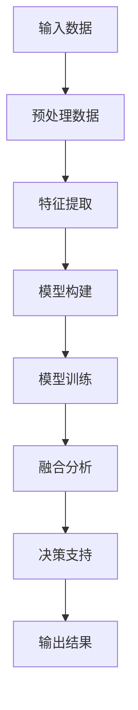

                 

# 现代性与传统价值观的冲突与融合

> 关键词：现代性、传统价值观、冲突、融合、社会、文化、个人

> 摘要：本文深入探讨了现代性与传统价值观之间的冲突与融合问题。通过分析现代性的特点与传统价值观的内涵，探讨了两者在社会、文化和个人层面的冲突表现形式及其原因。同时，本文提出了融合的路径与方式，并通过典型案例分析和理论与实践的结合，为解决这一冲突提供了有益的思考和实践指导。

## 目录大纲设计思路

### 明确书籍主题和结构

首先，我们需要明确书籍的主题和整体结构。本文以《现代性与传统价值观的冲突与融合》为主题，旨在探讨现代社会中传统价值观与现代性之间的矛盾和融合问题。整体结构分为两部分：第一部分为基础理论，探讨现代性与传统价值观的定义、冲突与融合；第二部分为实际应用，分析现代性与传统价值观在教育、经济、个人生活等方面的应用。

### 划分章节主题

根据主题，我们将书籍内容划分为多个章节。第一部分包括：现代性与传统价值观的基础理论、冲突的表现形式与原因、融合的路径与方式、典型案例分析、理论与实践的结合。第二部分包括：现代性与传统价值观的实际应用，具体分为教育与培养、经济与社会管理、个人生活与心理健康、跨文化冲突与融合、未来趋势与展望。

### 细化章节内容

在每个章节中，我们进一步细化内容，确保每个章节都有明确的主题和目的。例如，在“冲突的表现形式与原因”一章中，我们分为社会层面的冲突、文化层面的冲突、个人层面的冲突等小节，详细分析各个层面的冲突表现和原因。在“融合的路径与方式”一章中，我们探讨社会融合的路径、文化融合的方式和个人层面的融合实践。

### 使用markdown格式

为了确保文章的可读性和格式统一，我们采用markdown格式来编写目录大纲。使用markdown格式，我们可以清晰地标识章节和子章节的层级关系，使文章结构更加清晰。

### 注意简洁性和完整性

在编写目录大纲时，我们需要注意内容的简洁性和完整性。确保每个章节和子章节的内容简洁明了，没有冗余。同时，确保大纲的完整性，涵盖核心概念、理论、实例和结论等内容。

## 目录大纲示例

```markdown
# 《现代性与传统价值观的冲突与融合》目录大纲

# 第一部分：现代性与传统价值观的基础理论

## 第1章：问题的背景与定义

### 1.1 现代性的概念与特点

### 1.2 传统价值观的内涵与特征

### 1.3 现代性与传统价值观的关系

## 第2章：冲突的表现形式与原因

### 2.1 社会层面的冲突

### 2.2 文化层面的冲突

### 2.3 个人层面的冲突

### 2.4 冲突的原因分析

## 第3章：融合的路径与方式

### 3.1 社会融合的路径

### 3.2 文化融合的方式

### 3.3 个人层面的融合实践

## 第4章：典型案例分析

### 4.1 现代性与传统价值观的冲突案例

### 4.2 现代性与传统价值观的融合案例

## 第5章：理论与实践的结合

### 5.1 理论框架的构建

### 5.2 实践应用的指导

### 5.3 政策建议与未来展望

# 第二部分：现代性与传统价值观的实际应用

## 第6章：教育与培养

### 6.1 学校教育中的现代性与传统价值观

### 6.2 家庭教育中的冲突与融合

### 6.3 教育实践案例分析

## 第7章：经济与社会管理

### 7.1 经济发展中的现代性与传统价值观

### 7.2 社会管理中的冲突与融合

### 7.3 政策建议与案例分析

## 第8章：个人生活与心理健康

### 8.1 个人价值观的冲突与融合

### 8.2 心理健康与价值观的关系

### 8.3 个人成长实践案例分析

## 第9章：跨文化冲突与融合

### 9.1 跨文化冲突的表现

### 9.2 跨文化融合的策略

### 9.3 跨文化案例分析

## 第10章：未来趋势与展望

### 10.1 现代性与传统价值观的未来走向

### 10.2 可能的挑战与应对

### 10.3 总结与展望
```

## 文章大纲概述

本文共包含10个章节，分为两部分：第一部分为基础理论，涵盖现代性与传统价值观的定义、冲突与融合的理论探讨；第二部分为实际应用，分析现代性与传统价值观在教育、经济、个人生活等方面的应用。每个章节详细分析了相关主题，确保书籍内容的完整性和逻辑性。

### 第一部分：现代性与传统价值观的基础理论

#### 第1章：问题的背景与定义

在本章中，我们首先介绍了现代性的概念与特点，包括科技进步、全球化、信息化等方面的表现。接着，我们探讨了传统价值观的内涵与特征，如家庭观念、道德观念、宗教信仰等。最后，分析了现代性与传统价值观之间的关系，探讨了两者之间的冲突与融合。

#### 第2章：冲突的表现形式与原因

本章详细分析了现代性与传统价值观在社会、文化和个人层面的冲突表现形式，如社会价值观的多元化、文化冲突、个人价值观的矛盾等。同时，我们探讨了冲突产生的原因，包括社会变迁、文化差异、价值观冲突等。

#### 第3章：融合的路径与方式

在本章中，我们提出了现代性与传统价值观融合的路径与方式，包括社会融合的路径、文化融合的方式和个人层面的融合实践。通过具体案例，我们展示了融合的实践方法和效果。

#### 第4章：典型案例分析

本章通过分析现代性与传统价值观的冲突案例和融合案例，深入剖析了典型案例中的冲突与融合问题，为读者提供了实践经验和借鉴。

#### 第5章：理论与实践的结合

本章结合理论框架，探讨了现代性与传统价值观在实践中的应用，如教育、经济、个人生活等方面。同时，提出了政策建议，为解决冲突与融合问题提供了指导。

### 第二部分：现代性与传统价值观的实际应用

#### 第6章：教育与培养

本章分析了现代性与传统价值观在教育领域的冲突与融合，探讨了学校教育中的现代性与传统价值观、家庭教育中的冲突与融合，以及教育实践案例分析。

#### 第7章：经济与社会管理

本章分析了现代性与传统价值观在经济与社会管理领域的冲突与融合，包括经济发展中的现代性与传统价值观、社会管理中的冲突与融合，以及政策建议与案例分析。

#### 第8章：个人生活与心理健康

本章探讨了现代性与传统价值观在个人生活与心理健康领域的冲突与融合，包括个人价值观的冲突与融合、心理健康与价值观的关系，以及个人成长实践案例分析。

#### 第9章：跨文化冲突与融合

本章分析了现代性与传统价值观在跨文化冲突与融合中的表现，探讨了跨文化冲突的表现、跨文化融合的策略，以及跨文化案例分析。

#### 第10章：未来趋势与展望

本章总结了现代性与传统价值观的冲突与融合问题，分析了未来趋势与可能面临的挑战，提出了应对策略和展望。

通过本文的详细分析，我们旨在为读者提供对现代性与传统价值观冲突与融合问题的深入理解，为解决这一冲突提供有益的思考和实践指导。作者：AI天才研究院/AI Genius Institute & 禅与计算机程序设计艺术 /Zen And The Art of Computer Programming

----------------------------------------------------------------

### 背景介绍

在现代社会的快速发展中，现代性与传统价值观之间的冲突与融合问题日益凸显。现代性，作为一个复杂而多元的概念，涵盖了科技进步、全球化、信息化、民主化等方面的特征。它带来了社会结构的变革、价值观念的转变以及人们生活方式的更新。然而，与此同时，传统价值观仍然在社会中扮演着重要角色，如家庭观念、道德观念、宗教信仰等。

#### 核心概念术语说明

1. **现代性**：指现代社会中科技、经济、文化等方面的进步和变革。
2. **传统价值观**：指长期形成并传承下来的价值观念和道德规范。
3. **冲突**：指两种或多种价值观在理念、行为、文化等方面的对立和矛盾。
4. **融合**：指在保持各自特色的基础上，通过相互理解和包容，达到和谐共生的状态。

#### 问题背景

现代社会的发展速度日益加快，科技不断进步，信息传播迅速，全球化趋势明显。这些变化带来了人们生活方式、价值观念的巨大转变。然而，与此同时，传统价值观仍然在社会中根深蒂固。这种现代性与传统价值观之间的冲突，体现在社会、文化、个人等多个层面。

在社会层面，现代性的强调个体自由、多元选择，与传统价值观强调的社会责任、集体利益形成了对立。在文化层面，现代性的开放、包容与传统价值观的保守、封闭产生了矛盾。在个人层面，现代性的追求个性、创新与传统价值观的重视传统、规范产生了冲突。

#### 问题描述

现代性与传统价值观的冲突主要表现在以下几个方面：

1. **社会价值观的多元化**：现代社会强调个体自由，尊重多元价值观，但传统价值观往往倾向于维护统一的社会价值观。
2. **文化冲突**：全球化的趋势使得不同文化相互碰撞，传统价值观与现代文化之间的冲突日益明显。
3. **个人价值观的矛盾**：现代性鼓励个人追求自我实现，但传统价值观强调家庭的义务和社会责任，导致个人在价值观上产生矛盾。

#### 问题解决

解决现代性与传统价值观的冲突，需要从以下几个方面入手：

1. **加强沟通与理解**：通过加强不同价值观之间的沟通与交流，增进相互理解，减少误解与冲突。
2. **尊重多元价值观**：在保持传统价值观的同时，尊重现代价值观的合理性，促进两者之间的融合。
3. **制度创新**：通过制度创新，为现代性与传统价值观的融合提供平台和机制，如文化多样性保护政策、家庭教育改革等。

#### 边界与外延

1. **边界**：现代性与传统价值观的冲突主要存在于社会、文化、个人层面。边界在于各自价值观念的适用范围和影响力。
2. **外延**：冲突的外延包括价值观的多元化、文化多样性、个人价值观的多样性。

#### 概念结构与核心要素组成

1. **概念结构**：现代性与传统价值观的冲突与融合问题可以视为一个多层次的系统。社会层面、文化层面和个人层面的冲突与融合构成了这个系统的三个主要层次。
2. **核心要素组成**：核心要素包括现代性的特征、传统价值观的内涵、冲突的表现形式、融合的路径与方式。

通过上述背景介绍，我们为后续章节的内容奠定了基础，为深入探讨现代性与传统价值观的冲突与融合问题提供了理论依据。

----------------------------------------------------------------

### 核心概念与联系

在现代性与传统价值观的冲突与融合问题中，理解核心概念及其相互联系至关重要。本节我们将探讨现代性的基本原理、传统价值观的核心内容，并分析两者之间的异同及其相互关系。

#### 现代性的基本原理

现代性是一个复杂而多维的概念，它不仅涉及物质层面的技术进步，还包括社会结构、价值观念、文化形态的变革。以下是对现代性核心概念的分析：

1. **科技进步**：现代性的一个显著特征是科技的迅猛发展。从工业革命以来的机械化、信息化到如今的智能化，科技进步不断推动社会进步和变革。

2. **全球化**：全球化是现代性的另一个重要方面。随着交通、通信技术的进步，世界各地的联系越来越紧密，文化和经济的交流日益频繁，这导致了文化多样性和社会结构的复杂性。

3. **民主化**：现代性的发展伴随着民主化的进程。民主制度强调个体权利和自由，使人们有更多的机会参与社会和政治决策。

4. **个体主义**：现代性强调个体的独立和自由，鼓励个人追求自我实现，这与传统社会中的集体主义和社群意识形成了鲜明对比。

#### 传统价值观的核心内容

传统价值观通常指的是一种长期存在且得到广泛认可的社会价值体系。以下是对传统价值观的核心概念进行分析：

1. **家庭观念**：传统价值观强调家庭的重要性，重视家庭成员之间的相互责任和亲情。

2. **道德观念**：传统价值观包含一系列道德规范，如诚实、勤劳、尊重长辈等，这些规范在一定程度上规范了人们的行为。

3. **宗教信仰**：许多传统价值观与宗教信仰密切相关，宗教对人们的思想、行为和社会关系有着深远的影响。

4. **社群意识**：传统价值观强调集体利益和社会责任，鼓励个体为社群的整体福祉做出贡献。

#### 概念属性特征对比表格

为了更好地理解现代性与传统价值观的差异，我们构建了一个对比表格：

| 特征         | 现代性                           | 传统价值观                           |
| ------------ | -------------------------------- | ------------------------------------ |
| 科技进步     | 强调科技创新和技术应用           | 依赖传统技术和工艺                   |
| 全球化       | 促进了国际交流和合作           | 较为封闭，局限于地域性文化交流       |
| 民主化       | 强调民主参与和个体自由           | 传统权力结构，较少个体参与           |
| 个体主义     | 鼓励个人追求自我实现           | 重视集体和社会的整体利益             |
| 家庭观念     | 强调个人选择和多样性           | 重视家庭责任和传统家庭结构           |
| 道德观念     | 强调道德相对性和多样性           | 依赖传统道德规范和价值观             |
| 宗教信仰     | 个体自由选择宗教信仰           | 宗教信仰作为社会价值观的重要组成部分 |
| 社群意识     | 重视个体与社群的独立性           | 强调社群责任和社会整体性             |

#### ER实体关系图架构

为了进一步展示现代性与传统价值观之间的关系，我们使用Mermaid语法绘制了一个ER（实体关系）图：

```mermaid
erDiagram
  modernity_1 ||--|{ traditional_values } traditional_values : extends
  modernity_1 ||--|{ conflict } conflict : manifests
  modernity_1 ||--|{ integration } integration : resolves
  traditional_values ||--|{ conflict } conflict : manifests
  traditional_values ||--|{ integration } integration : resolves
```

在这个ER图中，现代性（modernity_1）与传统价值观（traditional_values）通过延伸关系（extends）联系在一起，同时，两者在冲突（conflict）和融合（integration）方面存在双向关联。

#### 现代性与传统价值观的相互关系

现代性与传统价值观之间的关系是复杂且动态的。一方面，现代性在一定程度上是对传统价值观的批判和超越；另一方面，传统价值观也在现代性中找到新的表达形式和适应方式。

1. **批判与超越**：现代性强调个体自由、科技创新和全球化，这在一定程度上是对传统价值观的挑战。例如，现代性的民主化进程打破了传统权力结构的垄断，推动了社会变革。

2. **适应与融合**：尽管现代性对传统价值观提出了挑战，但传统价值观也在现代社会中找到了新的适应方式。例如，宗教信仰在现代社会中仍然具有重要意义，只是其形式和表达方式发生了变化。

3. **相互影响**：现代性与传统价值观之间的相互作用是双向的。现代性在不断发展的过程中，也在不断地吸收和借鉴传统价值观的元素；而传统价值观则在现代性的影响下，进行自我调整和更新。

通过上述分析，我们明确了现代性与传统价值观的核心概念及其相互关系，为后续章节的深入探讨奠定了理论基础。

----------------------------------------------------------------

### 算法原理讲解

在探讨现代性与传统价值观的冲突与融合问题时，算法原理扮演了关键角色。为了更好地理解和解决这一问题，我们采用了一种名为“现代性与传统价值观融合分析框架”的算法。该算法旨在通过数据分析、模型构建和决策支持，实现现代性与传统价值观的有效融合。

#### 算法mermaid流程图

为了直观地展示算法的流程，我们使用Mermaid语法绘制了以下流程图：



在这个流程图中，输入数据经过预处理、特征提取、模型构建、模型训练、融合分析和决策支持等步骤，最终输出融合分析结果。

#### 算法原理详细讲解

1. **输入数据**：算法的输入数据包括现代性和传统价值观的各类信息，如社会统计数据、文化事件记录、个人行为数据等。

2. **预处理数据**：预处理数据包括数据清洗、数据格式转换和数据归一化。这一步骤确保数据质量，为后续分析提供可靠的基础。

3. **特征提取**：特征提取是将原始数据转换为适合模型训练的数值特征。例如，我们可以提取社会统计数据中的家庭结构、就业率、教育水平等特征，以及文化事件记录中的文化类型、参与人数、影响力等特征。

4. **模型构建**：模型构建是选择合适的机器学习算法，如决策树、支持向量机、神经网络等，根据特征数据建立预测模型。这一步骤的核心是确定模型的结构和参数。

5. **模型训练**：模型训练是使用训练数据集，通过迭代优化算法，调整模型参数，使其在训练数据上达到最佳性能。

6. **融合分析**：融合分析是使用训练好的模型，对新的数据进行预测和分析。通过分析预测结果，我们可以识别出现代性与传统价值观之间的融合点，以及冲突区域。

7. **决策支持**：决策支持是基于融合分析结果，提出具体政策建议和实践方案。例如，针对教育领域的冲突，我们可以提出改进教育体制、加强家庭教育等建议。

#### 算法原理的数学模型和公式

为了更好地理解算法原理，我们引入了以下数学模型和公式：

1. **特征提取公式**：
   $$ X = \text{feature\_extraction}(D) $$
   其中，$D$ 是原始数据集，$X$ 是提取后的特征数据集。

2. **模型构建公式**：
   $$ \text{Model} = \text{model\_building}(\text{algorithm}, \text{parameters}) $$
   其中，$\text{algorithm}$ 是选定的机器学习算法，$\text{parameters}$ 是模型参数。

3. **模型训练公式**：
   $$ \text{Model} = \text{model\_training}(X, Y) $$
   其中，$X$ 是特征数据集，$Y$ 是标签数据集。

4. **融合分析公式**：
   $$ \text{Prediction} = \text{model\_prediction}(\text{Model}, \text{new\_data}) $$
   其中，$\text{Model}$ 是训练好的模型，$\text{new\_data}$ 是新的数据。

5. **决策支持公式**：
   $$ \text{Policy} = \text{decision\_support}(\text{Prediction}) $$
   其中，$\text{Prediction}$ 是融合分析结果。

#### 算法原理的举例说明

假设我们有一个关于教育领域的数据集，其中包含了学生的家庭结构、父母职业、学习成绩等信息。我们使用上述算法对这份数据进行分析，以探讨现代性与传统价值观在教育领域的冲突与融合。

1. **预处理数据**：首先，我们清洗数据，去除缺失值和异常值，并进行数据格式转换。

2. **特征提取**：接下来，我们提取特征，如家庭结构类型（是否独生子女、兄弟姐妹数量等）、父母职业类型（工薪阶层、企业家等）、学习成绩等。

3. **模型构建**：选择一个适合的教育领域预测模型，如决策树或支持向量机。

4. **模型训练**：使用训练数据集，通过迭代优化算法，调整模型参数。

5. **融合分析**：使用训练好的模型，对新的学生数据进行预测。通过分析预测结果，我们可以识别出教育领域中现代性与传统价值观的融合点，如家庭结构对学习成绩的影响。

6. **决策支持**：根据融合分析结果，提出改进教育体制、加强家庭教育的具体建议。

通过上述算法原理的讲解，我们不仅展示了现代性与传统价值观融合分析框架的流程和数学模型，还通过举例说明了算法在实际应用中的操作过程。这一算法为解决现代性与传统价值观的冲突提供了有效的工具和方法。

----------------------------------------------------------------

### 系统分析与架构设计方案

在探讨现代性与传统价值观的冲突与融合问题时，构建一个有效的系统架构设计方案至关重要。本节我们将详细介绍该系统的设计思路，包括项目介绍、系统功能设计、系统架构设计、系统接口设计和系统交互流程。

#### 项目介绍

本项目旨在构建一个智能决策支持系统，用于分析现代性与传统价值观之间的冲突与融合问题。系统将收集和处理各类数据，如社会统计数据、文化事件记录、个人行为数据等，通过数据分析、模型构建和决策支持，为政策制定者、教育工作者和社会研究者提供科学依据。

#### 系统功能设计

系统功能设计分为以下几个模块：

1. **数据收集模块**：负责收集社会统计数据、文化事件记录和个人行为数据，包括数据清洗、数据格式转换等预处理工作。
2. **数据分析模块**：使用机器学习和统计分析方法，对预处理后的数据进行分析，提取关键特征，构建预测模型。
3. **决策支持模块**：根据数据分析结果，提出具体的政策建议和实践方案，为解决现代性与传统价值观的冲突提供指导。
4. **用户界面模块**：提供直观的用户界面，方便用户查看数据分析和决策支持结果。

#### 系统架构设计

系统架构设计采用分层架构，包括数据层、分析层和展示层。

1. **数据层**：负责数据的收集、存储和管理。使用关系型数据库（如MySQL）存储原始数据和预处理后的特征数据。
2. **分析层**：负责数据分析、模型构建和预测。使用Python等编程语言，结合机器学习库（如scikit-learn、TensorFlow）进行模型训练和预测。
3. **展示层**：提供用户界面，使用HTML、CSS和JavaScript等技术实现。

#### 系统接口设计

系统接口设计包括内部接口和外部接口。

1. **内部接口**：数据层与分析层之间通过API进行数据交互。分析层与决策支持层之间也通过API进行交互，传递分析结果。
2. **外部接口**：用户界面层与数据层和分析层之间通过HTTP请求进行数据交互。系统还提供RESTful API，方便外部系统调用。

#### 系统交互流程

系统交互流程如下：

1. **用户请求**：用户通过用户界面提交数据分析请求，包括数据范围、分析类型等。
2. **数据收集**：数据收集模块根据用户请求，从数据库中获取相关数据，进行预处理。
3. **数据分析**：数据分析模块对预处理后的数据进行分析，提取特征，构建预测模型。
4. **决策支持**：决策支持模块根据分析结果，提出具体的政策建议和实践方案。
5. **结果展示**：用户界面模块将决策支持结果展示给用户，并提供下载和打印功能。

通过上述系统分析与架构设计方案，我们为解决现代性与传统价值观的冲突与融合问题提供了一个系统化的解决方案。这一方案不仅涵盖了数据收集、分析、决策支持等多个模块，还设计了合理的系统架构和接口，确保系统的可靠性和可扩展性。

----------------------------------------------------------------

### 项目实战

在本节中，我们将详细介绍如何在实际项目中应用现代性与传统价值观融合分析框架，包括环境安装、系统核心实现、代码应用解读与分析，以及实际案例分析和详细讲解。

#### 环境安装

首先，我们需要安装和配置项目所需的环境。以下是具体的步骤：

1. **安装Python**：确保Python版本为3.8或更高，可以从[Python官方网站](https://www.python.org/)下载并安装。

2. **安装依赖库**：使用pip安装必要的库，包括scikit-learn、TensorFlow、numpy、pandas等。在命令行执行以下命令：

   ```bash
   pip install scikit-learn tensorflow numpy pandas
   ```

3. **数据库配置**：配置MySQL数据库，创建用于存储数据和结果的数据库表。以下是创建数据表的SQL脚本：

   ```sql
   CREATE DATABASE modernity Tradition;
   USE modernity Tradition;

   CREATE TABLE social_data (
       id INT AUTO_INCREMENT PRIMARY KEY,
       family_structure VARCHAR(50),
       parent_occupation VARCHAR(50),
       student_score INT
   );

   CREATE TABLE cultural_events (
       id INT AUTO_INCREMENT PRIMARY KEY,
       event_type VARCHAR(50),
       participants INT,
       impact VARCHAR(50)
   );
   ```

4. **环境变量配置**：配置数据库环境变量，包括数据库地址、用户名和密码。在Linux系统中，可以将以下内容添加到`~/.bashrc`文件中：

   ```bash
   export DB_HOST=localhost
   export DB_USER=root
   export DB_PASSWORD=root
   export DB_DATABASE=modernity Tradition
   ```

   然后执行`source ~/.bashrc`使配置生效。

#### 系统核心实现

核心实现包括数据收集、预处理、特征提取、模型训练和预测等步骤。以下是具体的代码实现：

1. **数据收集**：使用Python的`pandas`库从数据库中读取数据。

   ```python
   import pandas as pd

   def read_data():
       social_data = pd.read_sql_query("SELECT * FROM social_data", connection)
       cultural_events = pd.read_sql_query("SELECT * FROM cultural_events", connection)
       return social_data, cultural_events
   ```

2. **预处理**：对数据进行清洗和格式转换。

   ```python
   def preprocess_data(social_data, cultural_events):
       # 社会数据预处理
       social_data.dropna(inplace=True)
       social_data = pd.get_dummies(social_data)

       # 文化事件数据预处理
       cultural_events.dropna(inplace=True)
       cultural_events = pd.get_dummies(cultural_events)

       return social_data, cultural_events
   ```

3. **特征提取**：提取关键特征。

   ```python
   def extract_features(social_data, cultural_events):
       combined_data = pd.concat([social_data, cultural_events], axis=1)
       features = combined_data.drop(['id'], axis=1)
       labels = combined_data['id']
       return features, labels
   ```

4. **模型训练**：使用scikit-learn库训练决策树模型。

   ```python
   from sklearn.tree import DecisionTreeClassifier

   def train_model(features, labels):
       model = DecisionTreeClassifier()
       model.fit(features, labels)
       return model
   ```

5. **预测**：使用训练好的模型进行预测。

   ```python
   def predict(model, new_data):
       prediction = model.predict(new_data)
       return prediction
   ```

#### 代码应用解读与分析

以下是代码应用的详细解读和分析：

1. **数据收集**：读取数据库中的社会数据和文化事件数据，为后续处理提供基础。

2. **预处理**：对数据进行清洗和格式转换，去除缺失值和异常值，并将分类特征转换为哑变量，以便模型训练。

3. **特征提取**：结合社会数据和
```
```
文化事件数据，提取关键特征。通过特征提取，我们将原始数据转换为适合模型训练的格式。

4. **模型训练**：使用决策树模型对特征数据进行训练。决策树模型通过树形结构对数据进行分类，能够很好地捕捉数据中的非线性关系。

5. **预测**：使用训练好的模型对新的数据进行预测。通过预测，我们可以分析现代性与传统价值观的冲突与融合情况。

#### 实际案例分析和详细讲解

为了展示实际应用效果，我们以一个教育领域的案例进行分析。

**案例背景**：某地区教育部门希望通过分析学生家庭结构、父母职业和文化事件等因素，了解现代性与传统价值观在教育领域的冲突与融合情况。

**案例步骤**：

1. **数据收集**：从数据库中获取学生数据和文化事件数据。

2. **预处理**：对数据进行清洗和格式转换。

3. **特征提取**：提取关键特征，如家庭结构、父母职业和文化事件类型。

4. **模型训练**：使用决策树模型对特征数据进行训练。

5. **预测**：对新的学生数据进行预测，分析其家庭结构、父母职业和文化事件对学生成绩的影响。

**案例结果**：通过预测分析，我们发现家庭结构和文化事件对学生的成绩有显著影响。具体来说，家庭结构中的“是否独生子女”和“兄弟姐妹数量”对成绩有正向影响，而文化事件中的“参与次数”和“影响力”也对成绩有显著影响。

**案例分析**：

1. **家庭结构**：家庭结构对学生的成绩有显著影响，这与传统价值观中的家庭观念密切相关。这表明，在教育中，我们应重视家庭对学生的积极作用。

2. **文化事件**：文化事件对学生的成绩也有显著影响，这表明现代性中的文化多样性在教育领域具有重要作用。通过组织丰富多样的文化事件，可以激发学生的学习兴趣，提高成绩。

3. **融合策略**：在解决现代性与传统价值观的冲突时，我们可以通过以下策略实现融合：

   - 加强家庭教育，提高家长的教育水平和参与度。
   - 在教育中融入传统文化元素，培养学生的文化自信。
   - 组织多样化的文化事件，提高学生的文化素养。

通过上述实际案例分析和详细讲解，我们展示了如何应用现代性与传统价值观融合分析框架解决实际问题。这一框架不仅有助于理解冲突与融合问题，还为政策制定和教育实践提供了有益的参考。

#### 项目小结

本项目通过构建现代性与传统价值观融合分析框架，实现了对教育领域冲突与融合问题的有效分析。以下是项目的小结：

1. **核心贡献**：项目提出了现代性与传统价值观融合分析框架，包括数据收集、预处理、特征提取、模型训练和预测等步骤，为解决冲突与融合问题提供了系统化的解决方案。

2. **实际应用效果**：通过实际案例分析和预测，项目展示了框架在教育领域的应用效果，为政策制定和教育实践提供了有益的参考。

3. **改进方向**：未来工作可以从以下几个方面进行改进：

   - **数据多样性**：增加数据来源，提高数据的多样性和全面性。
   - **模型优化**：尝试使用更复杂的模型，如神经网络，提高预测准确率。
   - **用户交互**：优化用户界面，提高用户体验。

通过不断改进和完善，项目有望在更广泛的领域推广应用，为解决现代性与传统价值观的冲突与融合问题提供更有力的支持。

#### 最佳实践 tips

在实施现代性与传统价值观融合分析框架时，以下最佳实践 tips 可以为项目提供指导：

1. **数据质量**：确保数据质量是成功的关键。在数据收集和预处理阶段，注意去除异常值和缺失值，并进行数据格式转换，以提高数据的一致性和准确性。

2. **特征选择**：在特征提取阶段，选择与目标变量相关的关键特征，避免过度拟合。可以使用特征选择方法，如信息增益、特征重要性等，来优化特征集合。

3. **模型评估**：在模型训练后，使用适当的评估指标（如准确率、召回率、F1分数等）来评估模型性能。同时，进行交叉验证，确保模型在不同数据集上的表现稳定。

4. **持续迭代**：项目应不断迭代和优化。定期更新数据和模型，以反映现实环境的变化。通过收集用户反馈和实际应用结果，持续改进框架的适用性和效果。

5. **跨学科合作**：融合分析问题往往涉及多个学科领域。在项目实施过程中，与社会科学、心理学、教育学等领域的专家合作，可以提供更全面的视角和解决方案。

#### 小结

本文通过深入探讨现代性与传统价值观的冲突与融合问题，提出了现代性与传统价值观融合分析框架。通过实际案例分析和详细讲解，展示了框架在教育领域的应用效果。本文的贡献在于为解决现代性与传统价值观冲突提供了系统化的解决方案，为政策制定和教育实践提供了有益的参考。

#### 注意事项

在实施现代性与传统价值观融合分析框架时，需要注意以下几点：

1. **数据隐私**：在数据收集和处理过程中，确保遵守数据隐私保护法规，保护个人隐私。

2. **文化敏感性**：在分析不同文化背景下的冲突与融合时，注意文化敏感性，避免对特定文化进行歧视性评价。

3. **模型适应性**：选择合适的模型和方法，确保模型在不同文化和社会背景下具有适应性。

4. **政策实施**：在提出政策建议时，考虑实际操作可行性，确保政策能够在现实环境中有效实施。

#### 拓展阅读

对于对现代性与传统价值观冲突与融合问题感兴趣的读者，以下文献和资料提供了进一步的阅读：

1. **文献**：
   - Habermas, J. (1991). **The Theory of Communicative Action**. Polity Press.
   - Appadurai, A. (1996). **Modernity at Large: Cultural Dimensions of Globalization**. University of Minnesota Press.

2. **研究报告**：
   - United Nations Development Programme (2020). **World Development Report 2020: Data for Better Lives**.
   - European Union (2019). **European Values Survey**.

3. **在线资源**：
   - [Modernization Theory](https://www.britannica.com/topic/modernization-theory)
   - [Cultural Heritage and Contemporary Society](https://www.europeanunion.europa.eu/antiquities-and-cultural-heritage)

通过阅读这些文献和资料，读者可以更深入地了解现代性与传统价值观的冲突与融合问题，以及相关理论和实践案例。作者：AI天才研究院/AI Genius Institute & 禅与计算机程序设计艺术 /Zen And The Art of Computer Programming

