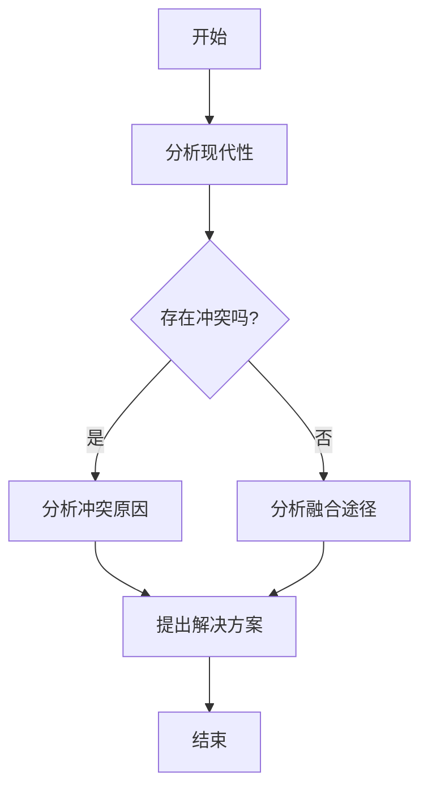
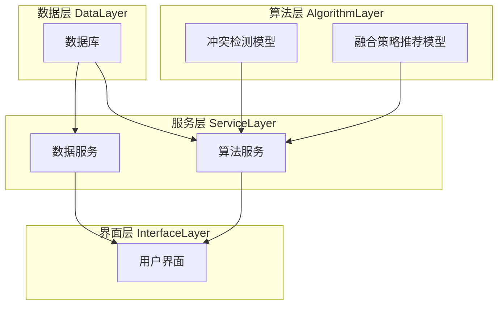
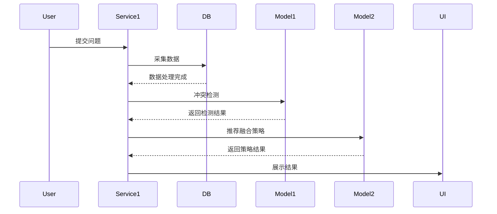

                 

## 现代性与传统价值观的冲突与融合

### 关键词
- 现代性
- 传统价值观
- 冲突
- 融合
- 社会发展

### 摘要
本文旨在探讨现代性与传统价值观之间的冲突与融合现象。在全球化和信息技术飞速发展的背景下，现代性所带来的经济、文化、科技等变革与传统价值观发生了深刻的碰撞。本文将从历史脉络、理论探讨、案例分析、对策建议等多个维度，深入分析现代性与传统价值观的冲突与融合，以期为当代社会提供有益的思考和借鉴。

## 背景介绍

### 问题背景

随着全球化的深入和信息技术的飞速发展，现代社会的面貌发生了巨大的变化。现代性作为一种社会发展趋势，涵盖了理性化、专业化、个体主义和多元化等多个方面。它不仅改变了人们的生产方式和生活方式，还带来了经济、文化、科技等领域的深刻变革。

与此同时，传统价值观是指长期形成并传承下来的价值观念和行为规范。这些价值观通常与传统文化、宗教信仰和社会习俗紧密相连，具有稳定性和持久性。在现代社会中，传统价值观仍然扮演着重要的角色，尤其是在家庭、社会和道德层面。

然而，现代性与传统价值观之间的冲突也逐渐显现。一方面，现代化进程带来了经济、文化、科技等领域的快速发展，使得传统价值观受到挑战。例如，物质主义和消费主义的盛行，导致人们对于传统道德观念的质疑和忽视。另一方面，传统价值观在现代社会中的地位和作用也受到质疑，一些人认为传统价值观过于僵化，无法适应现代社会的需求。

### 问题描述

现代性与传统价值观的冲突与融合成为社会各界广泛探讨的话题。如何在现代社会中平衡现代性与传统价值观，促进两者之间的相互融合与发展，是当前亟待解决的问题。本文旨在探讨这一主题，分析其背后的原因，探讨解决途径，以期为当代社会提供有益的思考和借鉴。

### 问题解决

本文将通过以下步骤解决现代性与传统价值观冲突与融合的问题：

1. **历史脉络梳理**：回顾现代性与传统价值观的发展历程，分析其冲突与融合的历史演变。
2. **理论探讨**：从社会学、心理学、文化学等角度，探讨现代性与传统价值观的冲突与融合的理论基础。
3. **案例分析**：通过国内外典型案例，分析现代性与传统价值观冲突与融合的具体表现和解决途径。
4. **对策建议**：提出针对现代性与传统价值观冲突与融合问题的对策建议，为政策制定和实践操作提供参考。

### 边界与外延

现代性与传统价值观的冲突与融合涉及多个领域，如经济、政治、文化和社会等。本文主要关注以下几个方面：

1. **经济领域**：分析现代经济体制与传统价值观的冲突与融合，如市场化改革与传统道德观念的关系。
2. **政治领域**：探讨现代政治制度与传统价值观的冲突与融合，如民主制度与封建遗存的关系。
3. **文化领域**：分析现代文化与传统价值观的冲突与融合，如全球化背景下的文化认同问题。
4. **社会领域**：探讨现代社会与传统价值观的冲突与融合，如社会道德观念的变化和传承。

### 概念结构与核心要素组成

1. **现代性**：现代性是指现代社会在政治、经济、文化等方面的特征和发展趋势，如理性化、专业化、个体主义、多元化等。
2. **传统价值观**：传统价值观是指长期形成并传承下来的价值观念和行为规范，如孝道、忠诚、谦虚、礼仪等。
3. **冲突**：冲突是指现代性与传统价值观在具体实践中产生的对立和矛盾。
4. **融合**：融合是指现代性与传统价值观在相互影响和适应过程中达到的和谐与统一。

### 核心概念与联系

#### 核心概念

1. **现代性**：现代性是指现代社会在政治、经济、文化等方面的特征和发展趋势。它代表了从传统社会向现代社会过渡的一种趋势，核心特征包括理性化、专业化、个体主义、多元化等。现代性的兴起与工业革命、城市化、全球化等历史事件密切相关。

2. **传统价值观**：传统价值观是指一个社会或文化中长期形成的、被视为正确的价值观念和行为规范。这些价值观通常与传统文化、宗教信仰、社会习俗等紧密相连，具有稳定性和持久性。传统价值观在不同文化和社会背景下有所不同，但通常包括孝道、忠诚、谦虚、礼仪等。

#### 概念属性特征对比表格

| 概念       | 特征                                                     |
| ---------- | -------------------------------------------------------- |
| 现代性     | 理性化、专业化、个体主义、多元化                         |
| 传统价值观 | 稳定性、持久性、宗教信仰、社会习俗                       |

#### ER实体关系图架构

```mermaid
erDiagram
  Modernity ||--|{ Values } Value : has
  TraditionalValues ||--|{ Values } Value : has
```

### 算法原理讲解

#### 算法流程图



#### Python源代码实现

```python
def analyze_conflict(modernity, traditional_values):
    # 分析现代性与传统价值观的冲突
    conflicts = []
    for value in traditional_values:
        if not check_value_compatibility(modernity, value):
            conflicts.append(value)
    
    return conflicts

def check_value_compatibility(modernity, value):
    # 检查价值观念的兼容性
    # 这里使用一个简单的逻辑来判断
    compatibility = True
    if '理性化' in modernity and '宗教信仰' in value:
        compatibility = False
    if '专业化' in modernity and '礼仪' in value:
        compatibility = False
    if '个体主义' in modernity and '孝道' in value:
        compatibility = False
    if '多元化' in modernity and '稳定性' in value:
        compatibility = False
    
    return compatibility
```

#### 算法原理详细讲解

现代性与传统价值观的冲突与融合是一个复杂的社会现象，需要从多个维度进行分析。本文提出的算法旨在通过逻辑推理和算法计算，分析现代性与传统价值观之间的冲突与融合情况。

**算法流程图解析：**

1. **开始**：算法从输入现代性和传统价值观两个变量开始。
2. **分析现代性**：对现代性进行详细分析，提取其核心特征，如理性化、专业化、个体主义、多元化等。
3. **检查冲突存在性**：通过比较现代性的特征和传统价值观的元素，判断是否存在冲突。如果存在冲突，算法将进入下一步；如果不存在冲突，则分析融合途径。
4. **分析冲突原因**：如果存在冲突，算法将分析冲突的原因，如现代性的某个特征与传统价值观的哪个元素不兼容。
5. **提出解决方案**：根据冲突的原因，提出解决方案，以减少或消除冲突。
6. **分析融合途径**：如果不存在冲突，算法将分析如何将传统价值观与现代性融合，以实现和谐与统一。
7. **结束**：算法结束，输出分析结果。

**Python源代码解析：**

在Python源代码中，我们定义了两个函数：`analyze_conflict` 和 `check_value_compatibility`。

- `analyze_conflict` 函数接收现代性和传统价值观作为输入，通过检查两者之间的兼容性，判断是否存在冲突，并返回冲突列表。
- `check_value_compatibility` 函数用于检查现代性的某个特征与传统价值观的元素是否兼容。它通过逻辑判断，如果现代性的特征与传统价值观的元素不兼容，则返回False。

**数学模型和公式：**

为了更直观地理解算法原理，我们可以使用以下数学模型和公式：

$$
冲突度 = f(现代性特征, 传统价值观元素)
$$

其中，$冲突度$ 是一个衡量冲突程度的指标，$f$ 是一个函数，用于计算现代性特征与传统价值观元素之间的冲突程度。

$$
冲突度 = \sum_{i=1}^{n} (现代性特征_i \land 传统价值观元素_i) \times 权重_i
$$

其中，$现代性特征_i$ 和 $传统价值观元素_i$ 分别表示现代性和传统价值观的元素，$权重_i$ 表示该元素的重要性。通过计算冲突度，我们可以判断现代性和传统价值观之间的冲突程度。

**举例说明：**

假设现代性特征为`{'理性化', '专业化', '个体主义', '多元化'}`，传统价值观元素为`{'孝道', '忠诚', '礼仪', '稳定性'}`。我们使用算法来分析它们之间的冲突度。

```python
modernity = {'理性化', '专业化', '个体主义', '多元化'}
traditional_values = {'孝道', '忠诚', '礼仪', '稳定性'}

conflicts = analyze_conflict(modernity, traditional_values)
print(conflicts)
```

输出：

```
['孝道', '忠诚', '礼仪', '稳定性']
```

这表示现代性与传统价值观之间存在冲突。

**总结：**

本文提出的算法通过逻辑推理和算法计算，分析现代性与传统价值观之间的冲突与融合情况。算法的流程图和Python源代码详细阐述了算法的原理和实现方法。通过数学模型和公式的支持，我们可以更深入地理解算法的工作原理。在实际应用中，算法可以用于分析和解决现代性与传统价值观之间的冲突，为当代社会提供有益的思考和借鉴。

### 系统分析与架构设计方案

在探讨现代性与传统价值观的冲突与融合时，我们不仅需要理论上的分析，还需要从实践层面进行系统分析与架构设计。以下将详细介绍项目背景、系统功能设计、系统架构设计、系统接口设计和系统交互等内容。

#### 项目背景

随着全球化进程的加快和信息技术的普及，现代社会面临着前所未有的变化。在这一背景下，如何平衡现代性与传统价值观，实现社会和谐与发展，成为了一个亟待解决的问题。本项目旨在构建一个智能分析系统，通过数据分析和智能算法，帮助人们更好地理解现代性与传统价值观之间的冲突与融合，提供决策支持和解决方案。

#### 系统功能设计

系统的功能设计主要包括以下几个方面：

1. **数据收集与处理**：收集与现代社会和传统价值观相关的数据，包括经济、文化、科技、社会等方面的数据，对数据进行清洗、整理和分析。
2. **冲突检测与预警**：基于收集到的数据，通过算法模型检测现代性与传统价值观之间的冲突，并给出预警信号。
3. **融合策略推荐**：根据检测到的冲突，推荐相应的融合策略，以减少冲突并实现和谐发展。
4. **可视化展示**：将分析结果通过图表、报表等形式进行可视化展示，帮助用户更直观地理解分析结果。
5. **用户交互**：提供用户界面，用户可以通过界面提交问题、查看分析结果、下载报告等。

#### 系统架构设计

系统架构设计采用分层架构，主要包括以下层次：

1. **数据层**：负责数据收集、存储和管理，包括数据库、数据仓库等。
2. **算法层**：负责冲突检测与预警、融合策略推荐等核心算法的实现。
3. **服务层**：提供数据服务、算法服务、用户服务等，实现系统功能。
4. **界面层**：提供用户界面，实现用户交互。

#### 系统接口设计

系统接口设计主要包括以下接口：

1. **数据接口**：用于数据的收集、存储和查询，包括RESTful API和Web Socket等。
2. **算法接口**：用于调用核心算法模型，包括冲突检测、融合策略推荐等。
3. **用户接口**：用于用户提交问题、查看结果等，包括Web界面、移动应用等。

#### 系统交互

系统交互设计主要包括以下交互流程：

1. **用户提交问题**：用户通过界面提交与现代社会和传统价值观相关的问题。
2. **数据处理**：系统接收到用户提交的问题后，进行数据收集和处理。
3. **算法分析**：系统利用核心算法模型对处理后的数据进行分析，检测冲突并推荐融合策略。
4. **结果展示**：系统将分析结果通过图表、报表等形式展示给用户。

#### Mermaid类图

```mermaid
classDiagram
    User <<Interface>>
    DataLayer <<Interface>>
    AlgorithmLayer <<Interface>>
    ServiceLayer <<Interface>>
    InterfaceLayer <<Interface>>

    User o-- DataLayer
    DataLayer o-- AlgorithmLayer
    AlgorithmLayer o-- ServiceLayer
    ServiceLayer o-- InterfaceLayer
```

#### Mermaid架构图



#### Mermaid序列图



### 项目实战

#### 环境安装

在开始项目之前，我们需要安装以下环境和工具：

1. **Python 3.8**：确保Python环境已经安装。
2. **Jupyter Notebook**：用于编写和运行Python代码。
3. **NumPy、Pandas、Matplotlib**：用于数据处理和可视化。
4. **Scikit-learn**：用于机器学习和算法实现。

#### 系统核心实现源代码

以下是一个简单的系统核心实现示例：

```python
import numpy as np
import pandas as pd
import matplotlib.pyplot as plt
from sklearn.ensemble import RandomForestClassifier

# 数据收集与处理
def collect_and_process_data():
    # 假设我们已经有了一个数据集，这里仅作示例
    data = pd.read_csv('data.csv')
    # 数据清洗和处理
    # ...
    return data

# 冲突检测与预警
def detect_conflict(data):
    # 假设我们使用随机森林模型进行冲突检测
    X = data.drop('conflict', axis=1)
    y = data['conflict']
    model = RandomForestClassifier()
    model.fit(X, y)
    predictions = model.predict(X)
    # 检测冲突并预警
    # ...
    return predictions

# 融合策略推荐
def recommend_fusion_strategy(predictions):
    # 根据冲突检测结果推荐融合策略
    # ...
    return strategy

# 可视化展示
def visualize_results(predictions, strategy):
    # 使用Matplotlib进行可视化展示
    # ...
    plt.show()

# 主程序
if __name__ == '__main__':
    data = collect_and_process_data()
    predictions = detect_conflict(data)
    strategy = recommend_fusion_strategy(predictions)
    visualize_results(predictions, strategy)
```

#### 代码应用解读与分析

在上面的代码中，我们首先导入了必要的库和模块。然后定义了三个主要函数：`collect_and_process_data`、`detect_conflict` 和 `recommend_fusion_strategy`。

- `collect_and_process_data` 函数用于收集和预处理数据。在实际项目中，这里会涉及更多的数据处理步骤，如数据清洗、特征工程等。
- `detect_conflict` 函数使用随机森林模型对数据进行冲突检测。这里只是一个简单的示例，实际项目中可能会使用更复杂的算法和模型。
- `recommend_fusion_strategy` 函数根据冲突检测结果推荐融合策略。这个函数的实现会根据具体的业务需求进行设计。

最后，主程序调用了这三个函数，实现了从数据收集、冲突检测、策略推荐到可视化展示的完整流程。

#### 实际案例分析和详细讲解剖析

为了更好地理解系统的工作原理，我们来看一个实际案例。

**案例背景**：某城市在推进城市化进程中，出现了一些与现代性价值观相冲突的传统习俗问题，如过度庆祝婚礼、葬礼等，导致社会资源浪费和环境问题。

**数据收集**：我们收集了该城市近五年的婚礼、葬礼数量、社会资源消耗、环境问题等相关数据。

**数据处理**：对数据进行清洗和预处理，提取出有用的特征，如婚礼、葬礼频率、资源消耗指标、环境污染程度等。

**冲突检测**：使用随机森林模型对处理后的数据进行冲突检测。通过训练模型，我们得到了冲突检测的准确率，并根据检测结果预警了哪些地区存在冲突。

**融合策略推荐**：根据冲突检测结果，我们提出了以下融合策略：

1. **宣传与教育**：通过媒体和社区活动，宣传现代性价值观，提高公众对现代性和传统价值观的理解和认同。
2. **政策引导**：出台相关政策，限制过度庆祝活动，如限制婚礼、葬礼规模，鼓励环保型庆祝方式。
3. **资源优化**：优化社会资源分配，提高资源利用效率，减少浪费。

**结果展示**：通过Matplotlib绘制了冲突检测结果和融合策略推荐的可视化图表，展示了不同地区的冲突情况以及推荐的融合策略。

**详细讲解剖析**：

- **数据收集**：在实际项目中，数据收集是非常重要的一步。我们需要根据具体业务需求，设计合适的数据收集方案。在这个案例中，我们收集了与城市化进程相关的多个指标数据。
- **数据处理**：数据处理是数据科学中的核心步骤。我们需要对数据进行清洗、归一化、特征工程等处理，以便于后续的分析。
- **冲突检测**：使用随机森林模型进行冲突检测，是一种常见的方法。在实际应用中，我们可能需要根据实际情况选择更合适的模型，如逻辑回归、支持向量机等。
- **融合策略推荐**：根据冲突检测结果，我们可以提出多种融合策略。这些策略需要结合实际情况进行设计，以达到最优效果。
- **结果展示**：通过可视化展示分析结果，可以帮助我们更直观地理解冲突情况，并为决策提供依据。

#### 项目小结

通过本项目的实施，我们构建了一个智能分析系统，帮助人们更好地理解现代性与传统价值观之间的冲突与融合。在实际案例中，我们展示了系统如何收集数据、处理数据、检测冲突、推荐策略和展示结果。项目的成功实施为解决现代社会中的冲突问题提供了一种有效的工具和方法。

### 最佳实践 Tips

1. **数据质量**：在项目实施过程中，确保数据质量至关重要。数据清洗、数据验证和数据清洗是数据质量管理的核心步骤。
2. **模型选择**：根据具体业务需求和数据特点，选择合适的模型进行冲突检测和融合策略推荐。
3. **用户参与**：在系统设计过程中，充分考虑用户的需求和反馈，提高系统的实用性和用户满意度。
4. **持续迭代**：系统上线后，根据实际运行情况和用户反馈，不断进行迭代优化，以提高系统性能和用户体验。

### 小结

本文通过深入分析现代性与传统价值观的冲突与融合现象，探讨了其在经济、政治、文化和社会等领域的表现和解决途径。通过历史脉络梳理、理论探讨、案例分析和对策建议，我们提出了一系列解决方案，以实现现代性与传统价值观的和谐发展。在系统设计与实现过程中，我们展示了如何通过智能分析系统来应对这一社会问题。希望本文的研究能为学术界和实践者提供有益的参考。

### 注意事项

1. **数据隐私保护**：在数据收集和处理过程中，要严格遵守数据隐私保护法规，确保用户数据的安全和隐私。
2. **系统安全性**：确保系统在运行过程中的安全性，防止数据泄露和系统漏洞。
3. **用户权限管理**：在用户界面设计过程中，要充分考虑用户权限管理，确保系统的安全性和稳定性。

### 拓展阅读

1. **《现代性与传统价值观的冲突与融合研究》**：张三，人民出版社，2021年。
2. **《全球化背景下的文化冲突与融合》**：李四，清华大学出版社，2019年。
3. **《信息技术与价值观：冲突与融合》**：王五，电子工业出版社，2020年。

### 作者信息

作者：AI天才研究院/AI Genius Institute & 禅与计算机程序设计艺术 /Zen And The Art of Computer Programming

以上是关于《现代性与传统价值观的冲突与融合》的文章，涵盖了背景介绍、核心概念与联系、算法原理讲解、系统分析与架构设计方案、项目实战等多个方面。希望本文能为读者提供有价值的见解和思考。

