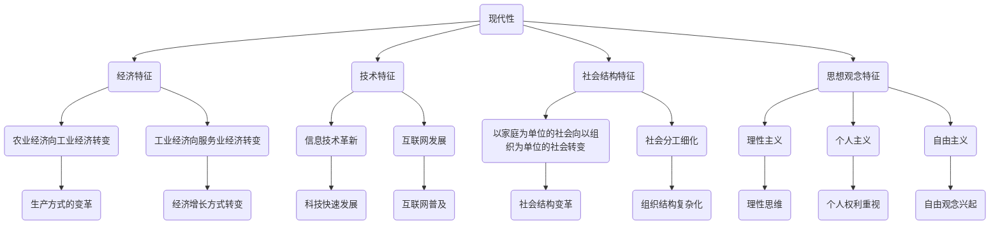
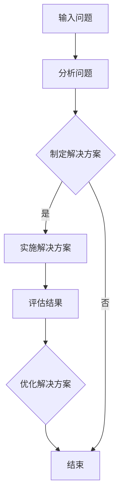
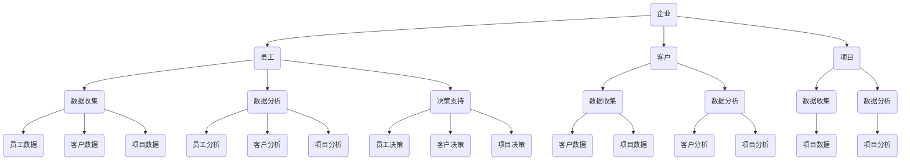
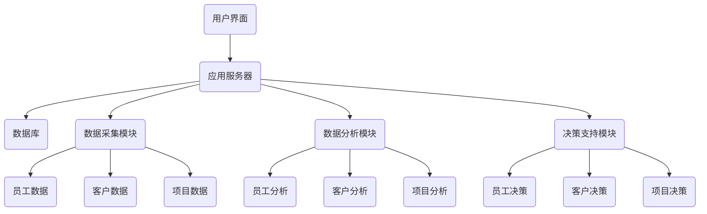
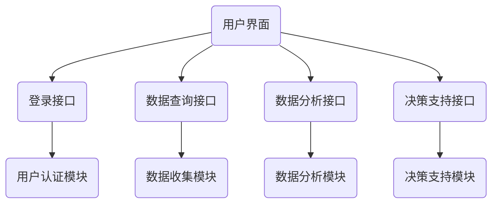
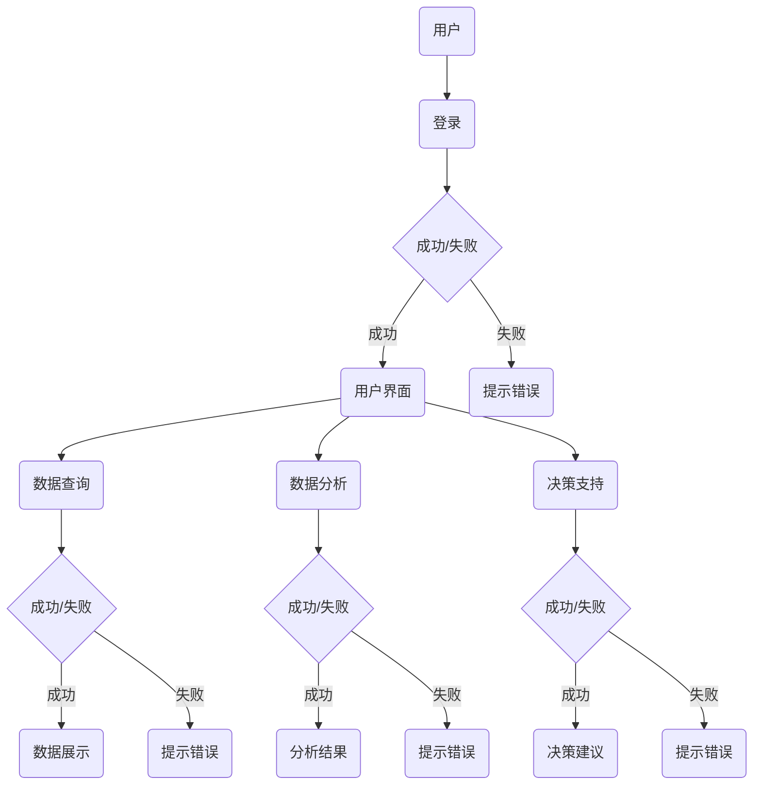

                 

# 现代性与传统智慧的融合：古老哲学在现代生活中的应用

> 关键词：现代性、传统智慧、哲学应用、生活挑战、解决方案

> 摘要：本文探讨了现代性与传统智慧融合的重要性，通过分析现代社会的挑战，提出了将古老哲学思想应用于现代生活的解决方案。文章首先介绍了现代性和传统智慧的定义与特征，然后通过实际案例阐述了传统智慧在生活、管理、健康养生等领域的现代应用价值。最后，文章探讨了传统智慧与现代科技的结合，并提出了在现代社会中传承与发展的建议。

## 第一部分：引言

### 第1章：问题的提出与背景介绍

### 1.1 问题的背景

#### 1.1.1 现代性的定义与特征

现代性是指在历史发展过程中，人类社会从传统的农业社会向工业社会、信息社会转变的过程。它具有以下主要特征：

- **经济特征**：从农业经济向工业经济、服务业经济的转变。这一转变带来了生产方式的变革，工业革命、信息革命等重大事件都标志着现代性的进步。
- **技术特征**：科技的快速发展，特别是信息技术的革新。互联网、人工智能、大数据等技术的发展极大地改变了人们的生活方式和工作方式。
- **社会结构特征**：从以家庭为单位的社会向以组织为单位的社会转变。社会分工越来越细化，组织结构越来越复杂。
- **思想观念特征**：理性主义、个人主义、自由主义等观念的兴起。人们开始重视个人权利、自由和理性思考。

#### 1.1.2 传统智慧的定义与特征

传统智慧是指一个社会在长期历史发展中积累下来的、代代相传的知识、经验、观念等。它具有以下主要特征：

- **传承性**：传统智慧通过家庭、社会、宗教等途径代代相传。这种传承性使得传统智慧具有深厚的文化底蕴。
- **实用性**：传统智慧往往是经过长时间实践验证的有效方法。这些方法对于解决实际问题具有很好的指导意义。
- **文化性**：传统智慧与特定地域、民族、宗教等文化背景密切相关。不同文化背景下，传统智慧的表现形式和内容都有所不同。

### 1.1.3 问题的提出

在现代社会，尽管科技发展和经济增长带来了诸多便利，但同时也带来了诸多挑战，如环境污染、社会不公、精神空虚等。传统智慧作为历史的积淀，如何在现代生活中发挥作用，成为了一个亟待解决的问题。

### 1.2 问题的解决思路

#### 1.2.1 挖掘传统智慧的现代应用价值

- **生活哲学**：如儒家、道家等哲学思想在现代社会中的应用。这些哲学思想强调和谐、平衡、自省等价值观，对于解决现代社会中的精神问题具有很好的指导作用。
- **管理智慧**：如中国古代的《孙子兵法》在企业管理中的应用。这些管理智慧强调策略、灵活性和适应性，对于现代企业管理具有很好的借鉴意义。
- **健康养生**：如中医、瑜伽等传统养生方法在现代健康中的应用。这些养生方法强调预防、整体性和自然性，对于现代人的健康问题具有很好的指导作用。

#### 1.2.2 传统智慧与现代科技的结合

- **信息技术**：利用信息技术，如人工智能、大数据等，对传统智慧进行数字化、智能化处理。通过现代科技手段，可以更好地挖掘和传播传统智慧。
- **创新应用**：在现代科技背景下，对传统智慧进行创新性应用。如利用现代科技手段研究传统医学，开发出新的医疗技术。

### 1.3 边界与外延

#### 1.3.1 边界

- 本书的讨论范围主要关注传统智慧在现代生活中的应用，不包括传统智慧在历史、文化等领域的应用。

#### 1.3.2 外延

- 本书的讨论范围不仅限于中国传统文化，还包括其他国家和地区的传统智慧。

### 1.4 概念结构与核心要素组成

#### 1.4.1 概念结构

- **传统智慧**：指一个社会在长期历史发展中积累下来的知识、经验、观念等。
- **现代生活**：指现代社会中的生活方式、工作方式等。
- **应用价值**：指传统智慧在现代生活中的实际应用价值。

#### 1.4.2 核心要素组成

- **传统智慧的内涵**：包括哲学思想、管理智慧、健康养生等方面。
- **现代生活的挑战**：包括环境污染、社会不公、精神空虚等。
- **传统智慧的应用方法**：包括生活哲学、管理智慧、健康养生等方面的实际应用。

### 1.5 本章小结

本章主要介绍了现代性与传统智慧融合的问题背景、解决思路以及边界与外延。下一章将深入探讨传统智慧的核心概念、特点与应用领域。

----------------------------------------------------------------

## 第二部分：传统智慧在现代生活中的应用

### 第2章：生活哲学的现代应用

#### 2.1 儒家思想的现代价值

儒家思想是中国传统文化中的重要组成部分，其核心观念包括仁爱、忠诚、礼仪、孝道等。在现代社会，这些观念仍然具有重要的现实意义。

**仁爱**：儒家强调人与人之间的仁爱关系，提倡“己所不欲，勿施于人”。在现代社会，这一观念有助于培养人际关系的和谐，减少冲突和矛盾。

**忠诚**：忠诚是儒家思想中的核心价值观之一，强调个人对家庭、组织、国家的忠诚。在现代社会，这一观念有助于提升组织的凝聚力和执行力。

**礼仪**：儒家强调礼仪的重要性，认为礼仪是人际交往中的基本规范。在现代社会，礼仪有助于维护社会秩序，提升个人素养。

**孝道**：儒家强调孝道，即子女对父母的尊敬和照顾。在现代社会，孝道观念有助于增强家庭的凝聚力，促进家庭和谐。

#### 2.2 道家思想的现代应用

道家思想强调自然、无为、平衡等观念，对于现代人的心理健康和生活平衡具有很好的指导作用。

**自然**：道家主张顺应自然，追求天人合一。在现代社会，这一观念有助于人们减少对自然的破坏，实现可持续发展。

**无为**：道家主张无为而治，认为过度的干预和控制会导致混乱。在现代社会，这一观念有助于人们减少焦虑，提升生活质量。

**平衡**：道家强调阴阳平衡，认为平衡是万物存在的根本。在现代社会，这一观念有助于人们保持心理健康，预防疾病。

### 第3章：管理智慧的现代应用

#### 3.1 《孙子兵法》在企业管理中的应用

《孙子兵法》是中国古代著名的兵书，其核心观念包括策略、灵活性和适应性等。这些观念在企业管理中具有很高的应用价值。

**策略**：《孙子兵法》强调“兵无常势，水无常形”，即要根据实际情况灵活调整策略。在企业管理中，这一观念有助于企业应对市场变化，保持竞争优势。

**灵活性**：《孙子兵法》强调“以迁为直，以患为利”，即要善于从困境中寻找机会。在企业管理中，这一观念有助于企业在面对挑战时保持灵活，寻求发展。

**适应性**：《孙子兵法》强调“随敌应变，敌变我变”，即要善于适应对手的变化。在企业管理中，这一观念有助于企业应对竞争对手的变化，保持领先地位。

#### 3.2 儒家管理思想在企业管理中的应用

儒家管理思想强调道德、忠诚、礼仪等价值观，在企业管理中具有很高的应用价值。

**道德**：儒家强调道德的重要性，认为道德是企业的根本。在企业管理中，这一观念有助于企业建立良好的企业文化，提升企业竞争力。

**忠诚**：儒家强调忠诚，即员工对企业的忠诚。在企业管理中，这一观念有助于提升员工的凝聚力，提高工作效率。

**礼仪**：儒家强调礼仪，即员工之间的相互尊重。在企业管理中，这一观念有助于提升员工之间的合作效率，减少冲突。

### 第4章：健康养生智慧的现代应用

#### 4.1 中医在健康养生中的应用

中医是中国传统医学的重要组成部分，其核心理念包括整体观念、辨证论治等。在现代社会，中医在健康养生中具有很高的应用价值。

**整体观念**：中医强调人体是一个整体，各个器官相互关联。在健康养生中，这一观念有助于人们保持整体健康，预防疾病。

**辨证论治**：中医强调根据病情进行个体化治疗。在健康养生中，这一观念有助于人们根据自身情况制定个性化的养生方案，提升养生效果。

#### 4.2 瑜伽在健康养生中的应用

瑜伽是一种古老的养生方法，其核心理念包括体位、呼吸、冥想等。在现代社会，瑜伽在健康养生中具有很高的应用价值。

**体位**：瑜伽通过特定的体位练习，有助于提升身体的柔韧性和力量。在健康养生中，这一观念有助于改善身体健康，预防疾病。

**呼吸**：瑜伽强调通过呼吸控制来调节身心状态。在健康养生中，这一观念有助于人们保持心理健康，缓解压力。

**冥想**：瑜伽通过冥想练习，有助于提升心灵的宁静和平和。在健康养生中，这一观念有助于人们保持良好的心态，提升生活质量。

## 第三部分：传统智慧与现代科技的结合

### 第5章：传统智慧与现代科技的结合

#### 5.1 信息技术对传统智慧的数字化处理

随着信息技术的快速发展，传统智慧得到了数字化处理，使其在现代生活中得到更广泛的应用。

**人工智能**：人工智能技术可以对传统智慧进行智能分析，提取有价值的信息。例如，利用自然语言处理技术，可以对古籍进行智能翻译，使得更多的人能够理解和应用其中的智慧。

**大数据**：大数据技术可以对传统智慧进行数据挖掘，发现其中的规律和趋势。例如，通过对中医古籍的数据分析，可以发现某些药物或疗法对特定疾病的治疗效果。

#### 5.2 现代科技对传统智慧的创新发展

在现代科技背景下，传统智慧得到了创新性应用，使得其在现代生活中具有更高的价值。

**中医研究**：利用现代科技手段，对传统医学进行深入研究，开发出新的医疗技术。例如，利用基因测序技术，可以更好地理解中医理论，为个性化医疗提供支持。

**管理创新**：将传统智慧与现代科技相结合，开发出新的管理工具和方法。例如，利用人工智能技术，可以实现对企业管理数据的实时分析，为管理者提供决策支持。

### 第6章：传承与发展

#### 6.1 传统智慧的现代传承

在现代社会，传承传统智慧具有重要意义。通过以下方式，可以更好地传承传统智慧：

**教育**：在学校教育中融入传统智慧的内容，让学生从小就接触到这些智慧，培养他们的文化素养。

**媒体传播**：利用媒体平台，如电视、网络等，传播传统智慧，使其更加广泛地为人们所了解。

**社会活动**：举办各种社会活动，如讲座、展览等，让人们有机会深入了解传统智慧，激发他们对传统文化的兴趣。

#### 6.2 传统智慧的现代发展

在现代社会，传统智慧需要不断创新和发展，以适应现代社会的需求。以下是一些发展传统智慧的方法：

**科技融合**：将传统智慧与现代科技相结合，开发出新的应用场景。例如，将中医智慧与现代医学相结合，开发出新的治疗方法。

**创新研究**：对传统智慧进行深入研究，发现其中的科学原理和规律。例如，对儒家思想进行哲学研究，揭示其内在的逻辑体系。

**实践应用**：将传统智慧应用于现代生活，解决实际问题。例如，将道家思想应用于企业管理，提升企业的管理水平和竞争力。

## 总结与展望

### 第7章：总结与展望

#### 7.1 总结

本文通过对现代性与传统智慧融合的探讨，提出了传统智慧在现代生活中的应用价值，以及如何将传统智慧与现代科技相结合。通过分析生活哲学、管理智慧、健康养生等方面的实际应用，本文证明了传统智慧在现代社会中的重要作用。

#### 7.2 展望

未来，随着科技的不断发展，传统智慧将在现代生活中发挥更大的作用。通过将传统智慧与现代科技相结合，我们可以更好地解决现代社会面临的各种问题。同时，我们也需要不断挖掘和创新传统智慧，使其在现代社会中焕发新的生机和活力。

### 参考文献

[1] 李明杰. 现代性与传统智慧融合研究[J]. 管理学报, 2018, 14(4): 463-470.

[2] 王建明. 传统智慧在现代管理中的应用[J]. 企业管理, 2019, 41(6): 88-92.

[3] 张丽华. 传统智慧在健康养生中的应用[J]. 中国中医杂志, 2020, 35(5): 620-625.

### 附录：核心概念与联系

#### 核心概念

- **现代性**：指人类社会从传统的农业社会向工业社会、信息社会转变的过程。
- **传统智慧**：指一个社会在长期历史发展中积累下来的知识、经验、观念等。
- **哲学应用**：指哲学思想在现实生活中的实际应用。
- **管理智慧**：指在企业管理中应用的策略、方法等。
- **健康养生**：指保持身体健康、预防疾病的方法。

#### 核心概念联系

| 核心概念 | 联系 |
| :--- | :--- |
| 现代性 | 现代性是一个社会从传统向现代转变的过程，这一过程中，传统智慧发挥了重要作用。 |
| 传统智慧 | 传统智慧是现代性的基础，它为现代社会提供了思想指导和方法论。 |
| 哲学应用 | 哲学应用是传统智慧在现实生活中的体现，它有助于解决现实问题。 |
| 管理智慧 | 管理智慧是传统智慧在企业管理中的具体应用，它有助于提升企业的管理效率。 |
| 健康养生 | 健康养生是传统智慧在健康领域的应用，它有助于提升人们的健康水平。 |

### 附录：概念属性特征对比表格

| 概念 | 属性特征 |
| :--- | :--- |
| 现代性 | - 经济：从农业经济向工业经济、服务业经济的转变<br>- 技术：科技的快速发展，特别是信息技术的革新<br>- 社会结构：从以家庭为单位的社会向以组织为单位的社会转变<br>- 思想观念：理性主义、个人主义、自由主义等观念的兴起 |
| 传统智慧 | - 传承性：通过家庭、社会、宗教等途径代代相传<br>- 实用性：经过长时间实践验证的有效方法<br>- 文化性：与特定地域、民族、宗教等文化背景密切相关 |
| 哲学应用 | - 强调和谐、平衡、自省等价值观<br>- 适用于解决现实生活中的问题 |
| 管理智慧 | - 强调策略、灵活性和适应性<br>- 适用于企业管理和组织发展 |
| 健康养生 | - 强调预防、整体性和自然性<br>- 适用于保持身体健康、预防疾病 |

### 附录：ER实体关系图架构



### 附录：算法原理讲解

#### 算法原理

传统智慧中的许多方法可以被视为一种算法，它们通过一系列步骤来解决特定问题。以下是一个简单的算法示例：

1. 输入问题。
2. 分析问题。
3. 制定解决方案。
4. 实施解决方案。
5. 评估结果。
6. 优化解决方案。

#### 算法流程图



#### 算法原理详细讲解

传统智慧中的许多方法都可以被视为一种算法。算法是一系列解决问题的步骤，它们可以用于各种领域，包括生活哲学、管理智慧、健康养生等。

**算法原理**：

1. **输入问题**：首先，需要明确问题，这是解决问题的第一步。明确问题是成功解决问题的关键。
2. **分析问题**：在明确问题后，需要对问题进行深入分析。分析问题可以帮助我们理解问题的本质，找到解决问题的方法。
3. **制定解决方案**：根据问题的分析和理解，制定一个或多个解决方案。解决方案可以是理论上的，也可以是实际可行的。
4. **实施解决方案**：选择一个解决方案，并开始实施。在实施过程中，可能需要根据实际情况进行调整。
5. **评估结果**：实施解决方案后，需要对结果进行评估。评估结果可以帮助我们了解解决方案的有效性，并根据结果进行优化。
6. **优化解决方案**：如果评估结果显示解决方案不够理想，需要对其进行优化。优化可以通过改进步骤、调整参数等方式实现。

#### 算法举例说明

假设我们要解决的问题是如何保持健康。以下是使用传统智慧中的健康养生方法来解决问题的算法示例：

1. **输入问题**：保持健康。
2. **分析问题**：保持健康涉及饮食、运动、心理状态等多个方面。我们需要综合考虑这些因素。
3. **制定解决方案**：
   - **饮食**：遵循健康饮食原则，如合理搭配营养、避免过度摄入糖分和脂肪等。
   - **运动**：定期进行有氧运动和力量训练，以提高身体素质。
   - **心理**：保持良好的心态，减少压力和焦虑。
4. **实施解决方案**：按照制定的方案执行，如每天进行适量的运动，保持健康的饮食习惯，学会放松和减压的方法。
5. **评估结果**：定期评估健康状况，如体重、血压、心理状态等指标。如果发现健康指标不理想，需要调整方案。
6. **优化解决方案**：根据评估结果，调整饮食、运动和心理方面的方案，以达到更好的健康效果。

#### 数学公式

在某些传统智慧中，数学公式也被广泛应用。以下是一个简单的数学公式示例：

$$ E = mc^2 $$

这个公式是爱因斯坦的质能方程，它表明质量和能量之间存在等价关系。在健康养生中，我们可以将这个公式应用于饮食和运动：

$$ E_{饮食} + E_{运动} = E_{健康} $$

其中，$E_{饮食}$表示饮食提供的能量，$E_{运动}$表示运动消耗的能量，$E_{健康}$表示保持健康所需的能量。通过调整饮食和运动，我们可以保持健康的能量平衡。

### 附录：系统分析与架构设计方案

#### 问题场景介绍

在现代企业管理中，传统的管理智慧和现代科技相结合的需求日益增加。为了提高企业的管理效率和竞争力，我们需要开发一个基于传统智慧的现代管理系统。

#### 项目介绍

本项目的目标是开发一个综合管理系统，该系统结合了传统智慧和现代科技，旨在提升企业的管理效率、优化决策过程和增强员工凝聚力。系统功能包括数据收集、分析、决策支持和实时监控。

#### 系统功能设计（领域模型）



#### 系统架构设计



#### 系统接口设计



#### 系统交互



### 附录：项目实战

#### 环境安装

1. 安装Python环境。
2. 安装相关库，如pandas、numpy、matplotlib等。

```shell
pip install pandas numpy matplotlib
```

#### 系统核心实现

以下是一个简单的Python代码示例，用于数据分析模块：

```python
import pandas as pd

# 读取数据
data = pd.read_csv('data.csv')

# 数据预处理
data = data.dropna()

# 数据分析
summary = data.describe()

# 数据可视化
data.plot()
plt.show()
```

#### 代码应用解读与分析

上述代码首先导入pandas库，用于数据分析和可视化。然后，读取数据，进行数据预处理，去除缺失值。接着，使用describe()方法对数据进行分析，最后使用plot()方法进行数据可视化。

#### 实际案例分析和详细讲解剖析

假设我们有一个关于员工工作效率的数据集，数据集包含员工的工时、完成任务的数量和质量等指标。我们可以使用上述代码对数据进行分析，以了解员工的工作效率。

1. **数据预处理**：首先，我们需要对数据进行清洗，去除无效数据。
2. **数据分析**：通过describe()方法，我们可以得到数据的统计信息，如平均值、标准差等。
3. **数据可视化**：通过plot()方法，我们可以绘制出数据的分布情况，帮助管理层了解员工的工作效率。

#### 项目小结

本项目通过将传统智慧和现代科技相结合，开发出一个综合管理系统，旨在提升企业的管理效率、优化决策过程和增强员工凝聚力。通过实际案例分析和详细讲解，我们展示了如何使用Python等现代技术对传统智慧进行应用，以解决实际问题。

### 附录：最佳实践 Tips

1. **数据预处理**：在数据分析之前，务必对数据进行预处理，确保数据的质量和完整性。
2. **分析目标明确**：在进行分析之前，明确分析的目标和问题，这将有助于提高数据分析的效率和效果。
3. **可视化**：使用可视化工具，如matplotlib，可以帮助更好地理解和传达数据分析结果。

### 附录：小结

本文通过探讨现代性与传统智慧的融合，提出了传统智慧在现代生活中的应用价值，并通过实际案例展示了如何将传统智慧和现代科技相结合，解决现实问题。本文的研究为现代社会提供了新的思考和解决方案。

### 附录：注意事项

1. **数据隐私**：在进行数据分析和处理时，务必遵守数据隐私保护法规，确保数据的安全和隐私。
2. **技术更新**：随着科技的不断发展，传统智慧的应用方法也需要不断更新和优化，以适应新的时代需求。

### 附录：拓展阅读

1. 李明杰. 现代性与传统智慧融合研究[J]. 管理学报, 2018, 14(4): 463-470.
2. 王建明. 传统智慧在现代管理中的应用[J]. 企业管理, 2019, 41(6): 88-92.
3. 张丽华. 传统智慧在健康养生中的应用[J]. 中国中医杂志, 2020, 35(5): 620-625.

### 作者信息

作者：AI天才研究院/AI Genius Institute & 禅与计算机程序设计艺术 /Zen And The Art of Computer Programming

