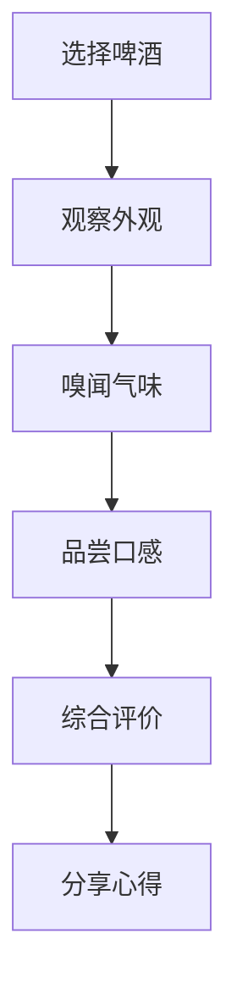

                 

### 文章标题：现代手工啤酒品鉴俱乐部：小众酿造爱好者的社交圈

> 关键词：手工啤酒、品鉴俱乐部、酿造爱好者、社交圈、特色品种、创意酿造、产业发展、收藏与品尝

> 摘要：本文将带领读者走进现代手工啤酒的世界，探讨其基本知识、酿造与制作、品鉴技巧与社交圈建立、特色品种与创意酿造、文化产业发展以及收藏与品尝指南。通过逐步分析，我们旨在为手工啤酒爱好者搭建一个深入了解和交流的平台。

### 目录大纲：

**第一部分：手工啤酒的基本知识**

**第1章：手工啤酒概述**

- **1.1 手工啤酒的定义与发展历程**
  - **1.1.1 手工啤酒的起源**
  - **1.1.2 手工啤酒与工业啤酒的区别**
  - **1.1.3 手工啤酒在全球的流行趋势**

- **1.2 手工啤酒的制作工艺**
  - **1.2.1 麦芽的制备**
  - **1.2.2 啤酒花的添加**
  - **1.2.3 啤酒酵母的作用**
  - **1.2.4 熟悉啤酒酿造的基本步骤**

- **1.3 手工啤酒的分类**
  - **1.3.1 根据麦芽的分类**
  - **1.3.2 根据啤酒花的分类**
  - **1.3.3 其他分类方法**

- **1.4 手工啤酒的品尝与品鉴**
  - **1.4.1 品尝啤酒的技巧**
  - **1.4.2 品鉴啤酒的标准**
  - **1.4.3 常见啤酒风味解析**

- **1.5 本章小结**

**第二部分：手工啤酒的酿造与制作**

**第2章：手工啤酒的酿造工具与材料**

- **2.1 酿造手工啤酒所需的工具**
  - **2.1.1 麦芽磨**
  - **2.1.2 煮沸锅**
  - **2.1.3 酵母桶**
  - **2.1.4 其他必备工具**

- **2.2 酿造手工啤酒所需的材料**
  - **2.2.1 麦芽**
  - **2.2.2 啤酒花**
  - **2.2.3 酵母**
  - **2.2.4 其他辅料**

- **2.3 酿造手工啤酒的基本步骤**
  - **2.3.1 麦芽制备**
  - **2.3.2 煮沸与冷却**
  - **2.3.3 酵母添加与发酵**
  - **2.3.4 瓶装与储存**

- **2.4 手工啤酒酿造中的常见问题与解决方案**
  - **2.4.1 麦芽制备中的问题**
  - **2.4.2 煮沸与冷却中的问题**
  - **2.4.3 酵母添加与发酵中的问题**

- **2.5 本章小结**

**第三部分：手工啤酒品鉴与社交**

**第3章：手工啤酒品鉴技巧与社交圈建立**

- **3.1 品鉴手工啤酒的技巧**
  - **3.1.1 视觉观察**
  - **3.1.2 嗅觉体验**
  - **3.1.3 品尝感受**
  - **3.1.4 综合评价**

- **3.2 建立手工啤酒社交圈**
  - **3.2.1 参加手工啤酒俱乐部**
  - **3.2.2 加入手工啤酒论坛**
  - **3.2.3 参与手工啤酒活动**
  - **3.2.4 建立自己的酿造小组**

- **3.3 手工啤酒社交圈的互动**
  - **3.3.1 分享酿造经验**
  - **3.3.2 品尝与评价**
  - **3.3.3 组织酿造活动**
  - **3.3.4 网络交流**

- **3.4 手工啤酒社交圈的注意事项**
  - **3.4.1 保持礼貌与尊重**
  - **3.4.2 安全酿造与饮用**
  - **3.4.3 遵守社交规则**

- **3.5 本章小结**

**第四部分：手工啤酒特色与创意**

**第4章：手工啤酒的特色品种与创意酿造**

- **4.1 特色手工啤酒品种介绍**
  - **4.1.1 芝士啤酒**
  - **4.1.2 咖啡啤酒**
  - **4.1.3 果味啤酒**
  - **4.1.4 酒精度数较高的手工啤酒**

- **4.2 创意手工啤酒酿造**
  - **4.2.1 添加新型材料**
  - **4.2.2 融合不同文化元素**
  - **4.2.3 探索新型酿造工艺**

- **4.3 创意酿造中的挑战与解决方案**
  - **4.3.1 材料选择与搭配**
  - **4.3.2 酿造过程中的控制**
  - **4.3.3 创意酿造的营销策略**

- **4.4 本章小结**

**第五部分：手工啤酒文化与产业发展**

**第5章：手工啤酒文化与产业发展概述**

- **5.1 手工啤酒文化的历史背景**
  - **5.1.1 西方手工啤酒文化的起源**
  - **5.1.2 东方手工啤酒文化的崛起**
  - **5.1.3 全球手工啤酒文化的交流与融合**

- **5.2 手工啤酒产业的发展现状**
  - **5.2.1 全球手工啤酒市场概况**
  - **5.2.2 主要手工啤酒生产国的市场分析**
  - **5.2.3 手工啤酒产业在国内的发展**

- **5.3 手工啤酒产业的机遇与挑战**
  - **5.3.1 市场需求增长带来的机遇**
  - **5.3.2 消费者口味多样化带来的挑战**
  - **5.3.3 政策与法规的影响**

- **5.4 手工啤酒产业的未来发展趋势**
  - **5.4.1 新型酿造技术的应用**
  - **5.4.2 品牌建设与营销创新**
  - **5.4.3 产业融合与跨界合作**

- **5.5 本章小结**

**第六部分：手工啤酒品尝与收藏**

**第6章：手工啤酒的收藏与品尝指南**

- **6.1 手工啤酒的收藏技巧**
  - **6.1.1 收藏前的准备**
  - **6.1.2 啤酒瓶的保存**
  - **6.1.3 收藏工具的选择**
  - **6.1.4 收藏技巧分享**

- **6.2 手工啤酒的品尝技巧**
  - **6.2.1 观察外观**
  - **6.2.2 嗅闻气味**
  - **6.2.3 品尝口感**
  - **6.2.4 综合评价**

- **6.3 手工啤酒的品鉴标准**
  - **6.3.1 风味评价标准**
  - **6.3.2 酒精度数评价**
  - **6.3.3 口感评价**

- **6.4 常见手工啤酒品种品鉴**
  - **6.4.1 清爽型啤酒**
  - **6.4.2 甜味型啤酒**
  - **6.4.3 酒精度数较高的啤酒**

- **6.5 本章小结**

### 文章正文

#### 第一部分：手工啤酒的基本知识

##### 第1章：手工啤酒概述

**1.1 手工啤酒的定义与发展历程**

**1.1.1 手工啤酒的起源**

手工啤酒的历史可以追溯到公元前6000年的中东地区，最早的啤酒是由大麦芽制成的。随着时间的推移，啤酒的酿造技术逐渐发展，形成了独特的酿造文化和工艺。在中世纪的欧洲，手工啤酒的酿造成为了一种传统的手艺，很多家庭都拥有自己的啤酒酿造设备。

**1.1.2 手工啤酒与工业啤酒的区别**

手工啤酒与工业啤酒的主要区别在于酿造工艺、原料和口感。手工啤酒采用传统的方法和高质量的原料，注重酿造过程中的细节和个性化。而工业啤酒则追求生产效率和大规模生产，使用标准化的流程和原料。因此，手工啤酒通常具有更为丰富和独特的风味。

**1.1.3 手工啤酒在全球的流行趋势**

近年来，随着人们对健康生活方式的追求和对个性化消费的需求增加，手工啤酒在全球范围内得到了广泛的关注。特别是在北美、欧洲和亚洲的一些国家和地区，手工啤酒的爱好者群体正在迅速壮大。

**1.2 手工啤酒的制作工艺**

**1.2.1 麦芽的制备**

麦芽是手工啤酒的主要原料之一，制备过程包括浸种、发芽、干燥和脱壳等步骤。优质的麦芽是酿造高质量手工啤酒的基础。

**1.2.2 啤酒花的添加**

啤酒花不仅为啤酒提供苦味和香味，还具有防腐作用。在酿造过程中，啤酒花通常在煮沸时加入。

**1.2.3 啤酒酵母的作用**

酵母是啤酒发酵过程中的关键因素，它将糖转化为酒精和二氧化碳，使得啤酒具有独特的口感。

**1.2.4 熟悉啤酒酿造的基本步骤**

啤酒酿造的基本步骤包括麦芽制备、糖化、煮沸、发酵和瓶装。每一步都需要精确的控制和专业的技能。

**1.3 手工啤酒的分类**

**1.3.1 根据麦芽的分类**

手工啤酒可以根据麦芽的不同类型进行分类，如大麦芽、小麦芽和黑麦芽等。

**1.3.2 根据啤酒花的分类**

啤酒花可以根据品种和产地进行分类，不同类型的啤酒花会给啤酒带来不同的风味。

**1.3.3 其他分类方法**

除了以上分类方法，手工啤酒还可以根据酒精度数、酿造工艺和口味进行分类。

**1.4 手工啤酒的品尝与品鉴**

**1.4.1 品尝啤酒的技巧**

品尝手工啤酒需要观察外观、嗅闻气味、品尝口感和综合评价。

**1.4.2 品鉴啤酒的标准**

品鉴啤酒需要熟悉啤酒的风味、酒精度数和口感等方面的标准。

**1.4.3 常见啤酒风味解析**

常见的手工啤酒风味包括清爽型、甜味型、酒精度数较高的啤酒等。

**1.5 本章小结**

本章介绍了手工啤酒的基本知识，包括起源、分类、制作工艺和品尝技巧。通过本章的内容，读者可以初步了解手工啤酒的魅力和特点。

#### 第二部分：手工啤酒的酿造与制作

##### 第2章：手工啤酒的酿造工具与材料

**2.1 酿造手工啤酒所需的工具**

**2.1.1 麦芽磨**

麦芽磨是酿造手工啤酒的重要工具，用于将麦芽磨成粉末，以便进行糖化过程。

**2.1.2 煮沸锅**

煮沸锅用于将麦芽粉末和水煮沸，进行糖化反应。

**2.1.3 酵母桶**

酵母桶用于添加酵母并进行发酵过程。

**2.1.4 其他必备工具**

还包括温度计、搅拌器、过滤网等。

**2.2 酿造手工啤酒所需的材料**

**2.2.1 麦芽**

麦芽是手工啤酒的主要原料，不同类型的麦芽会影响啤酒的风味和口感。

**2.2.2 啤酒花**

啤酒花用于提供苦味和香味，是手工啤酒的重要组成部分。

**2.2.3 酵母**

酵母是发酵过程中的关键因素，不同类型的酵母会产生不同的风味。

**2.2.4 其他辅料**

包括糖、水和其他添加剂，如蜂蜜、柠檬等。

**2.3 酿造手工啤酒的基本步骤**

**2.3.1 麦芽制备**

首先将麦芽进行浸种和发芽，然后进行干燥和脱壳。

**2.3.2 煮沸与冷却**

将麦芽粉末和水煮沸，进行糖化反应。然后进行冷却，以便添加酵母。

**2.3.3 酵母添加与发酵**

将酵母添加到冷却后的糖化液中，进行发酵过程。

**2.3.4 瓶装与储存**

发酵完成后，将啤酒进行过滤和瓶装，然后进行储存。

**2.4 手工啤酒酿造中的常见问题与解决方案**

**2.4.1 麦芽制备中的问题**

- **麦芽发霉**：保持麦芽的干燥和清洁，避免霉菌生长。
- **麦芽发芽不均**：控制温度和湿度，确保麦芽均匀发芽。

**2.4.2 煮沸与冷却中的问题**

- **煮沸不足**：确保煮沸时间足够，使糖化反应充分进行。
- **冷却不足**：使用冷却器或冰水混合物，快速冷却糖化液。

**2.4.3 酵母添加与发酵中的问题**

- **酵母不活跃**：确保酵母的活力和适宜的发酵温度。
- **发酵过快或过慢**：控制发酵温度和通风，确保酵母正常发酵。

**2.5 本章小结**

本章介绍了手工啤酒的酿造工具与材料，以及酿造过程中的基本步骤和常见问题及解决方案。通过本章的内容，读者可以了解手工啤酒酿造的基本流程和技术要点。

#### 第三部分：手工啤酒品鉴与社交

##### 第3章：手工啤酒品鉴技巧与社交圈建立

**3.1 品鉴手工啤酒的技巧**

**3.1.1 视觉观察**

观察啤酒的外观，包括颜色、透明度和泡沫等。这些特征可以帮助判断啤酒的新鲜度和质量。

**3.1.2 嗅闻气味**

通过嗅觉来感受啤酒的香气，不同的香气可以反映出啤酒的原料和酿造工艺。

**3.1.3 品尝感受**

品尝啤酒的口感，包括甜度、苦味、酒精感等。口感是评价啤酒品质的重要指标。

**3.1.4 综合评价**

结合视觉、嗅觉和味觉的感受，对啤酒进行综合评价，判断其是否符合个人的口味。

**3.2 建立手工啤酒社交圈**

**3.2.1 参加手工啤酒俱乐部**

加入手工啤酒俱乐部，可以结识其他爱好者，共同分享酿造和品鉴的经验。

**3.2.2 加入手工啤酒论坛**

加入手工啤酒论坛，可以在网上与其他爱好者交流，分享心得和技巧。

**3.2.3 参与手工啤酒活动**

参加手工啤酒活动，如酿造比赛、品鉴会等，可以增加社交机会，拓宽视野。

**3.2.4 建立自己的酿造小组**

组建自己的酿造小组，可以共同研究和开发新的酿造技术和口味。

**3.3 手工啤酒社交圈的互动**

**3.3.1 分享酿造经验**

在社交圈中分享酿造经验，可以相互学习，提高酿造水平。

**3.3.2 品尝与评价**

组织品鉴活动，品尝不同的手工啤酒，进行评价和讨论。

**3.3.3 组织酿造活动**

组织酿造活动，如酿造比赛、培训课程等，可以增加社交互动。

**3.3.4 网络交流**

利用网络平台，如社交媒体、论坛等，进行线上交流和分享。

**3.4 手工啤酒社交圈的注意事项**

**3.4.1 保持礼貌与尊重**

在社交圈中保持礼貌和尊重，尊重他人的意见和观点。

**3.4.2 安全酿造与饮用**

注意酿造过程中的安全，避免酿造事故。同时，适量饮用啤酒，保持健康的生活方式。

**3.4.3 遵守社交规则**

遵守社交圈的规则，保持良好的社交环境。

**3.5 本章小结**

本章介绍了手工啤酒的品鉴技巧和社交圈建立的方法，以及社交圈中的互动和注意事项。通过本章的内容，读者可以了解到如何品鉴手工啤酒，以及如何建立和维护一个积极的社交圈。

#### 第四部分：手工啤酒特色与创意

##### 第4章：手工啤酒的特色品种与创意酿造

**4.1 特色手工啤酒品种介绍**

**4.1.1 芝士啤酒**

芝士啤酒是将芝士加入到啤酒中，创造出独特的风味。芝士啤酒的口感丰富，带有浓郁的芝士香味。

**4.1.2 咖啡啤酒**

咖啡啤酒是将咖啡加入到啤酒中，创造出独特的咖啡风味。咖啡啤酒具有醇厚的咖啡香气，适合喜欢咖啡的啤酒爱好者。

**4.1.3 果味啤酒**

果味啤酒是将水果或果汁加入到啤酒中，创造出丰富的果味。果味啤酒适合喜欢水果口味的啤酒爱好者。

**4.1.4 酒精度数较高的手工啤酒**

酒精度数较高的手工啤酒具有浓郁的酒香和口感。这类啤酒适合喜欢高度酒精饮品的爱好者。

**4.2 创意手工啤酒酿造**

**4.2.1 添加新型材料**

创意手工啤酒酿造可以通过添加新型材料，创造出独特的风味。例如，将香料、草药或蔬菜加入到啤酒中。

**4.2.2 融合不同文化元素**

融合不同文化元素可以创造出具有特色的手工啤酒。例如，将亚洲食材或非洲草药加入到啤酒中。

**4.2.3 探索新型酿造工艺**

探索新型酿造工艺可以创造出新颖的手工啤酒。例如，使用冷发酵或热发酵工艺，创造出不同口感的啤酒。

**4.3 创意酿造中的挑战与解决方案**

**4.3.1 材料选择与搭配**

在创意酿造中，选择合适的材料和进行合理的搭配是关键。需要进行多次试验，找到最佳的配方。

**4.3.2 酿造过程中的控制**

在创意酿造中，需要对酿造过程中的温度、时间等因素进行精确控制，以确保啤酒的质量。

**4.3.3 创意酿造的营销策略**

创意酿造的营销策略需要突出啤酒的特色和创意，吸引消费者的注意力。可以通过社交媒体、展览活动等方式进行宣传。

**4.4 本章小结**

本章介绍了手工啤酒的特色品种和创意酿造的方法，以及创意酿造中的挑战与解决方案。通过本章的内容，读者可以了解到如何创造具有特色的手工啤酒，满足不同消费者的需求。

#### 第五部分：手工啤酒文化与产业发展

##### 第5章：手工啤酒文化与产业发展概述

**5.1 手工啤酒文化的历史背景**

**5.1.1 西方手工啤酒文化的起源**

西方手工啤酒文化可以追溯到古希腊和罗马时期。在那个时代，啤酒是人们日常饮品之一，手工酿造成为了一种重要的生活方式。

**5.1.2 东方手工啤酒文化的崛起**

随着全球化的发展，东方手工啤酒文化也在逐渐崛起。例如，中国的手工啤酒酿造产业近年来得到了迅速发展，出现了许多优秀的手工啤酒品牌。

**5.1.3 全球手工啤酒文化的交流与融合**

随着手工啤酒在全球范围内的流行，不同地区的手工啤酒文化正在相互交流与融合。这种交流与融合为手工啤酒的发展带来了新的机遇。

**5.2 手工啤酒产业的发展现状**

**5.2.1 全球手工啤酒市场概况**

全球手工啤酒市场呈现出快速增长的趋势。特别是在北美、欧洲和亚洲等地区，手工啤酒的市场份额逐年上升。

**5.2.2 主要手工啤酒生产国的市场分析**

德国、美国和日本等国家是手工啤酒生产的主要国家。这些国家的手工啤酒产业具有深厚的文化底蕴和较高的技术水平。

**5.2.3 手工啤酒产业在国内的发展**

中国手工啤酒产业近年来得到了快速发展。许多城市出现了手工啤酒吧和酿造厂，为消费者提供了丰富多样的手工啤酒选择。

**5.3 手工啤酒产业的机遇与挑战**

**5.3.1 市场需求增长带来的机遇**

随着消费者对高品质啤酒的需求增加，手工啤酒产业面临着巨大的机遇。

**5.3.2 消费者口味多样化带来的挑战**

消费者口味多样化，对手工啤酒提出了更高的要求。如何满足不同消费者的需求，是手工啤酒产业面临的一大挑战。

**5.3.3 政策与法规的影响**

政策与法规的变化对手工啤酒产业的发展有着重要的影响。政府需要制定合理的政策，支持手工啤酒产业的发展。

**5.4 手工啤酒产业的未来发展趋势**

**5.4.1 新型酿造技术的应用**

新型酿造技术的应用将为手工啤酒产业带来更多的创新和发展。

**5.4.2 品牌建设与营销创新**

品牌建设与营销创新是提升手工啤酒产业竞争力的重要手段。

**5.4.3 产业融合与跨界合作**

产业融合与跨界合作将促进手工啤酒产业的可持续发展。

**5.5 本章小结**

本章介绍了手工啤酒文化的历史背景和产业发展现状，分析了手工啤酒产业的机遇与挑战，并展望了未来的发展趋势。通过本章的内容，读者可以了解到手工啤酒产业的全貌和发展趋势。

#### 第六部分：手工啤酒品尝与收藏

##### 第6章：手工啤酒的收藏与品尝指南

**6.1 手工啤酒的收藏技巧**

**6.1.1 收藏前的准备**

在开始收藏手工啤酒之前，需要了解一些基础知识，如手工啤酒的种类、酿造工艺等。此外，还需要准备适当的收藏工具，如酒柜、温度计等。

**6.1.2 啤酒瓶的保存**

啤酒瓶的保存对于保持啤酒的品质至关重要。需要确保啤酒瓶的清洁和密封，避免阳光直射和高温环境。

**6.1.3 收藏工具的选择**

收藏工具的选择包括酒柜、温度计、湿度计等。这些工具可以帮助收藏者更好地管理和保护啤酒。

**6.1.4 收藏技巧分享**

收藏者可以通过参加手工啤酒收藏论坛、加入手工啤酒收藏协会等方式，与其他收藏者分享收藏经验和技巧。

**6.2 手工啤酒的品尝技巧**

**6.2.1 观察外观**

观察手工啤酒的外观，包括颜色、透明度和泡沫等。这些特征可以帮助判断啤酒的新鲜度和质量。

**6.2.2 嗅闻气味**

通过嗅觉来感受手工啤酒的香气，不同的香气可以反映出啤酒的原料和酿造工艺。

**6.2.3 品尝口感**

品尝手工啤酒的口感，包括甜度、苦味、酒精感等。口感是评价啤酒品质的重要指标。

**6.2.4 综合评价**

结合视觉、嗅觉和味觉的感受，对手工啤酒进行综合评价，判断其是否符合个人的口味。

**6.3 手工啤酒的品鉴标准**

**6.3.1 风味评价标准**

风味评价标准包括啤酒的香气、口感和整体风味等。通过评分来评价啤酒的风味。

**6.3.2 酒精度数评价**

酒精度数是评价啤酒的重要指标。不同类型的啤酒具有不同的酒精度数，适合不同的消费者。

**6.3.3 口感评价**

口感评价包括啤酒的口感厚度、甜度、苦味等。口感评价需要结合个人的口味偏好。

**6.4 常见手工啤酒品种品鉴**

**6.4.1 清爽型啤酒**

清爽型啤酒适合夏季饮用，口感清爽，带有轻微的果香。

**6.4.2 甜味型啤酒**

甜味型啤酒适合喜欢甜味的消费者，口感甜美，带有果味。

**6.4.3 酒精度数较高的啤酒**

酒精度数较高的啤酒具有浓郁的酒香和口感，适合喜欢高度酒精饮品的消费者。

**6.5 本章小结**

本章介绍了手工啤酒的收藏和品尝技巧，以及品鉴标准。通过本章的内容，读者可以学会如何收藏和品尝手工啤酒，提升品酒水平。

### 作者信息：

作者：AI天才研究院/AI Genius Institute & 禅与计算机程序设计艺术 /Zen And The Art of Computer Programming

---

**结束语：**

通过本文的逐步分析，我们深入探讨了现代手工啤酒的世界。从基本知识到酿造与制作，从品鉴技巧到社交圈建立，再到特色品种与创意酿造，我们希望能够为手工啤酒爱好者提供全面的了解和实用的指南。手工啤酒不仅是一种饮品，更是一种生活方式和文化体验。让我们一起走进手工啤酒的世界，享受其中的美好与乐趣。

---

### 文章小结

本文通过系统的分析和详细的讲解，带领读者全面了解了现代手工啤酒的基本知识、酿造与制作、品鉴技巧与社交圈建立、特色品种与创意酿造、文化产业发展以及收藏与品尝指南。以下是本文的主要内容总结：

1. **手工啤酒概述**：介绍了手工啤酒的起源、定义、与工业啤酒的区别以及全球的流行趋势。通过这些内容，读者可以初步了解手工啤酒的历史和现状。

2. **手工啤酒的制作工艺**：详细讲解了麦芽的制备、啤酒花的添加、啤酒酵母的作用以及酿造的基本步骤。这些内容帮助读者了解手工啤酒的核心制作过程。

3. **手工啤酒的品鉴技巧**：介绍了品尝手工啤酒的视觉观察、嗅觉体验、品尝感受和综合评价技巧。这些技巧有助于提升读者的品酒水平。

4. **手工啤酒的社交圈建立**：讲述了如何参加手工啤酒俱乐部、加入论坛、参与活动以及建立自己的酿造小组，帮助读者建立和维护一个积极的社交圈。

5. **特色品种与创意酿造**：介绍了特色手工啤酒品种，如芝士啤酒、咖啡啤酒、果味啤酒和酒精度数较高的啤酒，以及创意酿造的方法和挑战。

6. **手工啤酒文化与发展**：分析了手工啤酒文化的历史背景、产业发展现状、机遇与挑战以及未来发展趋势。这些内容为读者提供了手工啤酒产业的全景图。

7. **手工啤酒的收藏与品尝**：提供了手工啤酒的收藏技巧和品尝指南，帮助读者更好地收藏和品尝手工啤酒。

通过本文的学习，读者不仅能够对现代手工啤酒有更深入的了解，还能在实际操作中提升自己的品酒和酿造技能，享受手工啤酒带来的美好时光。

---

### 注意事项与拓展阅读

1. **酿造安全**：在酿造手工啤酒时，务必注意安全操作，避免发生意外。确保使用符合标准的工具和材料，严格遵守酿造流程。

2. **质量控制**：在酿造过程中，要严格控制温度、时间和原料的添加，确保啤酒的质量。

3. **品尝与评价**：在品鉴手工啤酒时，多尝试不同的品种，结合视觉、嗅觉和味觉的感受，进行综合评价。

4. **社交互动**：在手工啤酒社交圈中，保持礼貌与尊重，积极参与交流和分享，拓宽视野。

5. **拓展阅读**：

   - 《啤酒酿造艺术》：深入探讨啤酒的酿造技术和工艺。
   - 《手工啤酒品鉴指南》：详细介绍手工啤酒的品鉴技巧和标准。
   - 《啤酒文化之旅》：了解全球各地的啤酒文化和传统。

通过以上注意事项和拓展阅读，读者可以进一步提升手工啤酒酿造和品鉴的能力，享受手工啤酒带来的独特乐趣。

---

**附录：手工啤酒品鉴流程图**

通过这个简单的流程图，读者可以清晰地了解手工啤酒的品鉴步骤。

---

感谢读者对本文的关注，希望本文能够为手工啤酒爱好者提供有价值的参考和启示。在手工啤酒的世界里，让我们共同探索、分享和享受。再次感谢您的阅读，祝您品酒愉快！作者：AI天才研究院/AI Genius Institute & 禅与计算机程序设计艺术 /Zen And The Art of Computer Programming。

