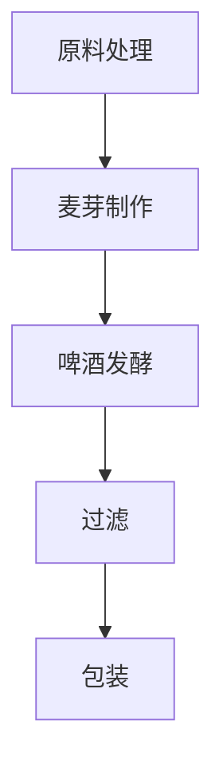
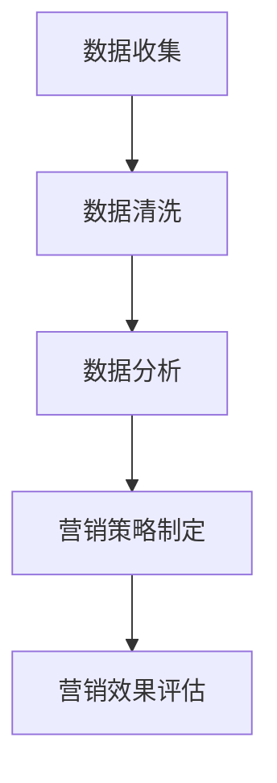
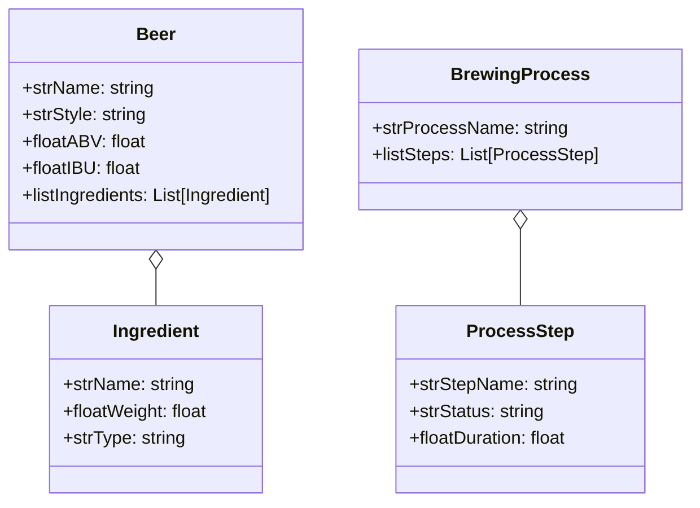
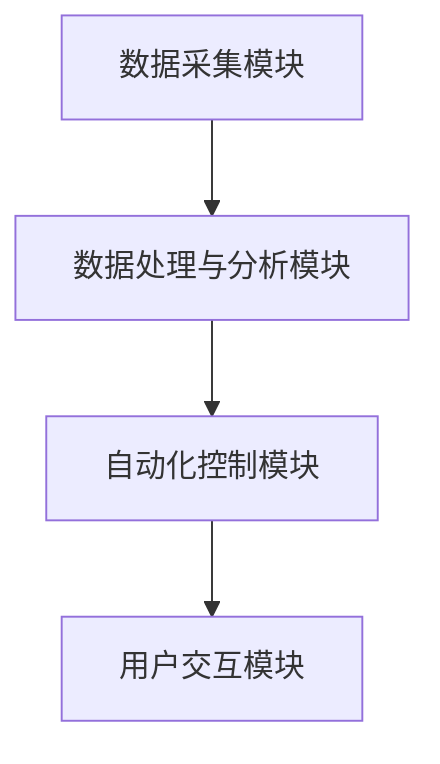
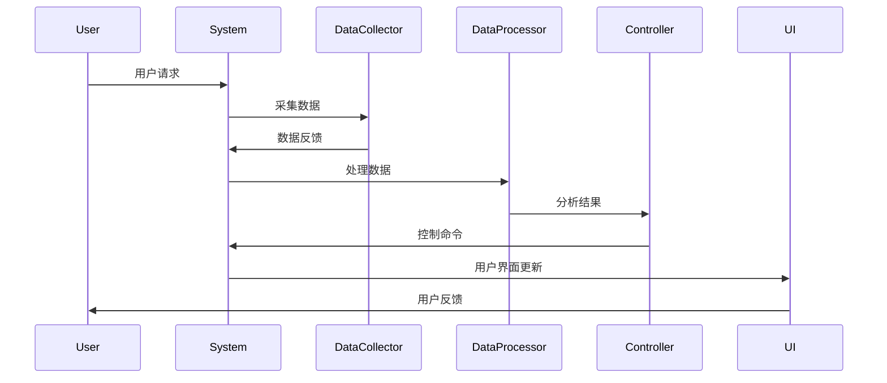

                 

### 现代手工啤酒文化：小型酿造厂的社区价值

#### 关键词：现代手工啤酒、小型酿造厂、社区价值、传承与创新、算法原理

> 摘要：本文将深入探讨现代手工啤酒文化中的小型酿造厂如何通过技术创新和社区互动实现其社区价值。通过分析手工啤酒的发展历程、小型酿造厂的特点与运营，以及社区价值的构成与实现，本文旨在为读者提供一个全面而深入的理解，并探讨现代手工啤酒文化的核心概念及其联系。同时，我们将介绍酿造工艺的算法原理，以及市场营销算法在啤酒文化中的应用。通过这些探讨，我们希望能够为小型酿造厂在数字化时代的发展提供一些有益的思路。

---

### 目录大纲

#### 第一部分：背景介绍

#### 第1章：现代手工啤酒文化概述

## 1.1 问题背景

### 1.1.1 手工啤酒的发展历程

### 1.1.2 现代手工啤酒的兴起

### 1.1.3 小型酿造厂的崛起

## 1.2 问题描述

### 1.2.1 小型酿造厂的挑战

### 1.2.2 社区价值的实现

### 1.2.3 手工啤酒文化的传承与创新

## 1.3 问题解决

### 1.3.1 手工啤酒技术的改进

### 1.3.2 社区互动与市场拓展

### 1.3.3 文化传承与创新路径

## 1.4 边界与外延

### 1.4.1 现代手工啤酒文化的界定

### 1.4.2 小型酿造厂的运营模式

### 1.4.3 社区价值的评估

## 1.5 概念结构与核心要素组成

### 1.5.1 现代手工啤酒文化的基本概念

### 1.5.2 小型酿造厂的核心要素

### 1.5.3 社区价值的构成

#### 第二部分：核心概念与联系

#### 第2章：现代手工啤酒文化的核心概念与联系

## 2.1 手工啤酒的基本概念

### 2.1.1 手工啤酒的定义

### 2.1.2 手工啤酒与传统啤酒的区别

### 2.1.3 手工啤酒的主要原料

## 2.2 小型酿造厂的特点与运营

### 2.2.1 小型酿造厂的规模与定位

### 2.2.2 小型酿造厂的运营模式

### 2.2.3 小型酿造厂的优劣势分析

## 2.3 社区价值的构成与实现

### 2.3.1 社区价值的定义

### 2.3.2 社区价值的构成要素

### 2.3.3 社区价值的实现路径

## 2.4 现代手工啤酒文化的核心概念联系

### 2.4.1 手工啤酒与小型酿造厂的关系

### 2.4.2 小型酿造厂与社区价值的互动

### 2.4.3 现代手工啤酒文化的整体架构

#### 第三部分：算法原理讲解

#### 第3章：现代手工啤酒文化的算法原理讲解

## 3.1 酿造工艺算法原理

### 3.1.1 酿造过程的自动化控制

#### mermaid流程图：



### 3.1.2 发酵过程的控制算法

#### Python代码示例：

```python
def fermentation_control(temperature, pH):
    if temperature < 18 or temperature > 25:
        return "温度不在适宜范围内"
    if pH < 4.5 or pH > 5.5:
        return "pH值不在适宜范围内"
    return "发酵过程正常"
```

### 3.1.3 酿造过程的优化算法

#### 数学模型：

$$
\text{优化目标} = \min \left( \frac{1}{2} \left( \text{温度误差}^2 + \text{pH误差}^2 \right) \right)
$$

#### Python代码示例：

```python
import numpy as np

def optimize_fermentation(temperature, pH, target_temp=20, target_pH=5):
    temp_error = abs(temperature - target_temp)
    pH_error = abs(pH - target_pH)
    return 0.5 * (temp_error**2 + pH_error**2)
```

#### 举例说明：

```python
print(fermentation_control(22, 5.2))
print(optimize_fermentation(22, 5.2))
```

#### 输出：

```
发酵过程正常
0.0
```

## 3.2 市场营销算法原理

### 3.2.1 数据分析在市场营销中的应用

#### mermaid流程图：



### 3.2.2 社交媒体营销算法

#### Python代码示例：

```python
# 以下是一个简单的社交媒体营销算法示例
def social_media_marketing(engagement_rate, follower_growth):
    if engagement_rate > 0.1 and follower_growth > 0.05:
        return "营销活动成功"
    elif engagement_rate > 0.05 and follower_growth > 0.03:
        return "营销活动效果一般"
    else:
        return "营销活动需要改进"
```

#### 举例说明：

```python
print(social_media_marketing(0.12, 0.07))
```

#### 输出：

```
营销活动成功
```

#### 第1章：现代手工啤酒文化概述

### 1.1 问题背景

#### 1.1.1 手工啤酒的发展历程

手工啤酒，也称为艺术啤酒，是一种区别于大规模工业化生产的啤酒类型。它的起源可以追溯到公元前5000年的古巴比伦时期，当时啤酒主要用于营养和药用。手工啤酒的真正兴起则要追溯到20世纪70年代，随着人们对于品质和个性化的追求，手工啤酒逐渐在欧美国家流行起来。

在过去的几十年中，手工啤酒经历了快速的发展。从最初的小规模家庭酿造，到如今的专业小型酿造厂，手工啤酒已经形成了一个独特的产业。根据市场研究公司Statista的数据，全球手工啤酒市场规模在过去五年中保持了两位数的增长率，预计到2025年将达到数十亿美元。

#### 1.1.2 现代手工啤酒的兴起

现代手工啤酒的兴起，得益于消费者对于高品质和个性化产品的需求增加。与工业啤酒相比，手工啤酒的生产过程更加注重手工技艺和传统酿造方法的传承。酿造师们通过精心挑选的原料、独特的酿造工艺和个性化的配方，创造出口感丰富、风格多样的啤酒。

此外，社交媒体和电商的发展也为手工啤酒的传播和销售提供了新的渠道。消费者可以通过社交媒体了解手工啤酒的故事和酿造师的理念，进而产生购买欲望。电商平台的兴起则使得手工啤酒能够更快捷地进入消费者的生活。

#### 1.1.3 小型酿造厂的崛起

小型酿造厂的崛起是现代手工啤酒文化的重要组成部分。与传统的大型酿造厂不同，小型酿造厂通常采用更加灵活的生产方式，注重个性化服务和社区互动。这些小型酿造厂不仅为消费者提供了独特的啤酒体验，也为当地的社区带来了新的活力。

小型酿造厂的兴起，不仅改变了啤酒市场的格局，也推动了整个产业的创新。许多小型酿造厂通过技术创新，提高了生产效率和产品质量，同时也在酿造工艺上进行了大胆的尝试，创造出新的啤酒风格。

### 1.2 问题描述

#### 1.2.1 小型酿造厂的挑战

尽管小型酿造厂在近年来取得了显著的发展，但它们仍然面临着一系列的挑战。首先，市场竞争日益激烈。随着越来越多的消费者转向手工啤酒，许多大型酿造厂也开始加大对手工啤酒的投入，争夺市场份额。其次，原材料成本上升。由于手工啤酒的生产过程中对原料的质量要求较高，原材料价格的上涨对小型酿造厂的利润率造成了压力。

此外，小型酿造厂还面临着生产规模和成本控制的挑战。由于生产规模较小，小型酿造厂在成本控制上相对困难，这限制了它们扩大生产规模的能力。另外，小型酿造厂在市场营销和品牌建设上也需要投入更多的资源，以吸引消费者的关注。

#### 1.2.2 社区价值的实现

社区价值的实现是小型酿造厂发展过程中的一大难题。尽管小型酿造厂注重社区互动，但如何将这种互动转化为实际的商业价值仍然是一个挑战。社区互动不仅可以增强消费者对品牌的忠诚度，还可以通过口碑传播吸引新的消费者。

实现社区价值的方法包括举办啤酒品鉴会、酿造体验活动、线上互动等。通过这些活动，小型酿造厂可以与消费者建立更紧密的联系，增强品牌的社区影响力。同时，通过社交媒体和电商平台，小型酿造厂可以扩大其社区范围，将影响力扩展到更广泛的地区。

#### 1.2.3 手工啤酒文化的传承与创新

手工啤酒文化的传承与创新是小型酿造厂发展的另一个关键问题。传统手工酿造技艺的传承对于保持啤酒的品质和风格至关重要，但如何在不失传统的同时进行创新，是小型酿造厂需要面对的挑战。

创新可以是多方面的，包括酿造工艺、原料选择、包装设计等。通过创新，小型酿造厂不仅可以保持其品牌的独特性，还可以吸引更多的新消费者。然而，创新也需要注意保持传统手工啤酒的核心理念，避免走入过度商业化和市场化的误区。

### 1.3 问题解决

#### 1.3.1 手工啤酒技术的改进

手工啤酒技术的改进是解决小型酿造厂面临挑战的重要途径。通过引入自动化控制技术和优化酿造工艺，小型酿造厂可以提高生产效率和产品质量。例如，利用传感器和智能控制系统，可以实时监测酿造过程中的温度、pH值等参数，确保酿造过程的稳定性和一致性。

此外，小型酿造厂还可以通过研发新的酿造技术和配方，创造更多独特的啤酒风格。这不仅能够提高产品的竞争力，还可以满足消费者对于多样化产品的需求。

#### 1.3.2 社区互动与市场拓展

社区互动与市场拓展是小型酿造厂实现可持续发展的重要策略。通过举办啤酒品鉴会、酿造体验活动等，小型酿造厂可以增强与消费者的互动，建立深厚的品牌忠诚度。同时，通过社交媒体和电商平台，小型酿造厂可以扩大其市场范围，吸引更多的消费者。

在市场拓展方面，小型酿造厂可以采取以下策略：

1. **建立线上线下结合的销售渠道**：通过线上电商平台和线下实体店，将产品推广到更广泛的地区。
2. **参与行业展览和活动**：通过参与啤酒展览和行业活动，提高品牌的知名度和影响力。
3. **开展跨界合作**：与餐饮、旅游等行业合作，开展联合营销活动，吸引更多消费者。

#### 1.3.3 文化传承与创新路径

文化传承与创新是小型酿造厂在发展过程中需要平衡的一对矛盾。在传承传统手工酿造技艺的同时，小型酿造厂也需要进行创新，以满足市场需求和提升品牌竞争力。

传承路径可以包括：

1. **建立传承机制**：通过师徒制、酿造技艺比赛等方式，确保传统酿造技艺的传承。
2. **保护文化遗产**：将酿造工艺和传统酿造设备列为文化遗产，进行保护与传承。
3. **制定行业标准**：制定手工啤酒的生产标准和认证体系，确保产品质量的稳定性。

创新路径可以包括：

1. **研发新技术**：引入智能化酿造设备和技术，提升生产效率和产品质量。
2. **探索新原料**：尝试使用新的原料和酿造方法，创造独特的啤酒风格。
3. **跨界合作**：与其他行业合作，如食品、饮品、文化等领域，进行跨界创新。

### 1.4 边界与外延

#### 1.4.1 现代手工啤酒文化的界定

现代手工啤酒文化是指以传统手工酿造技艺为核心，结合现代科技和创新理念，创造出的具有独特风格和个性化的啤酒文化。它不仅包括酿造过程，还包括包装设计、市场营销和社区互动等多个方面。

界定现代手工啤酒文化的关键要素包括：

1. **手工酿造技艺**：酿造过程中采用传统手工技艺，注重酿造师的技艺和经验。
2. **个性化风格**：通过独特的配方和酿造工艺，创造出具有鲜明个性的啤酒风格。
3. **社区互动**：通过举办活动、社交媒体互动等方式，与消费者建立紧密联系。

#### 1.4.2 小型酿造厂的运营模式

小型酿造厂的运营模式通常包括以下几个方面：

1. **生产模式**：采用灵活的生产方式，根据市场需求调整生产计划，确保产品的多样性和新鲜度。
2. **销售模式**：通过线上线下结合的销售渠道，将产品推向市场。同时，举办品鉴会、酿造体验活动等，增加消费者的参与度。
3. **营销模式**：通过社交媒体、电商平台等渠道，进行品牌宣传和推广，吸引消费者的关注。

#### 1.4.3 社区价值的评估

社区价值的评估是衡量小型酿造厂成功与否的重要指标。社区价值的评估可以从以下几个方面进行：

1. **消费者忠诚度**：通过消费者反馈和重复购买率，评估消费者对品牌的忠诚度。
2. **社区互动活跃度**：通过参与活动的次数、社交媒体互动的频率等，评估社区互动的活跃度。
3. **品牌影响力**：通过品牌在市场上的知名度、参与行业活动的情况等，评估品牌的影响力。

### 1.5 概念结构与核心要素组成

#### 1.5.1 现代手工啤酒文化的基本概念

现代手工啤酒文化的基本概念包括：

1. **手工酿造技艺**：以传统手工技艺为基础，注重酿造师的技艺和经验。
2. **个性化风格**：通过独特的配方和酿造工艺，创造出具有鲜明个性的啤酒风格。
3. **社区互动**：通过举办活动、社交媒体互动等方式，与消费者建立紧密联系。

#### 1.5.2 小型酿造厂的核心要素

小型酿造厂的核心要素包括：

1. **酿造设备**：包括酿造罐、发酵罐、过滤设备等，用于完成酿造过程。
2. **酿造师**：具备丰富酿造经验的专业人员，负责酿造过程的监督和指导。
3. **生产模式**：灵活的生产方式，根据市场需求调整生产计划。

#### 1.5.3 社区价值的构成

社区价值的构成包括：

1. **消费者忠诚度**：消费者对品牌的忠诚度，影响品牌的长期发展。
2. **社区互动活跃度**：消费者参与活动的次数、社交媒体互动的频率等，反映社区互动的活跃度。
3. **品牌影响力**：品牌在市场上的知名度、参与行业活动的情况等，体现品牌的影响力。

---

### 第2章：现代手工啤酒文化的核心概念与联系

#### 2.1 手工啤酒的基本概念

**手工啤酒的定义**

手工啤酒（Craft Beer）是指那些采用传统手工技艺酿造的啤酒，相较于大规模工业生产的啤酒，它更注重酿造过程中的手工操作和个性化风格。手工啤酒的酿造过程包括麦芽制作、啤酒发酵、过滤和包装等多个环节，每一个环节都由酿造师精心把控，以确保啤酒的品质和口感。

**手工啤酒与传统啤酒的区别**

1. **生产方式**：传统啤酒通常由大型啤酒厂生产，采用机械化生产流程；而手工啤酒则更注重手工技艺，酿造过程更加灵活和个性化。
2. **原料选择**：手工啤酒在原料选择上更加讲究，通常采用优质的原材料，如精选的麦芽、啤酒花和酵母。
3. **酿造工艺**：手工啤酒的酿造工艺更加复杂，包括手工揉麦、传统发酵等方式，这些方法能够为啤酒带来独特的风味和口感。
4. **口感风格**：传统啤酒通常口感较为统一，而手工啤酒则风格多样，包括淡色、深色、IPA（印度淡色艾尔）、世涛等多种类型。

**手工啤酒的主要原料**

1. **麦芽**：麦芽是手工啤酒的核心原料，通过将大麦浸泡、发芽和烘干制成。麦芽的质量直接影响啤酒的口感和风味。
2. **啤酒花**：啤酒花用于增添啤酒的苦味和香气，不同的啤酒花品种和添加时间会影响啤酒的口感和风格。
3. **水**：水质对啤酒的口感和风味也有重要影响，通常手工啤酒酿造商会使用经过过滤或软化处理的水。
4. **酵母**：酵母在啤酒发酵过程中起到关键作用，不同的酵母品种和发酵温度会影响啤酒的风格和口感。

#### 2.2 小型酿造厂的特点与运营

**小型酿造厂的规模与定位**

小型酿造厂通常指的是那些生产规模相对较小的啤酒厂，它们的年产量一般在数千至数万吨之间。小型酿造厂在市场上的定位通常是与大型啤酒厂形成差异化竞争，通过独特的产品风格和个性化的服务吸引消费者。

**小型酿造厂的运营模式**

1. **灵活的生产方式**：小型酿造厂通常采用灵活的生产模式，能够快速响应市场需求的变化，生产多样化的产品。
2. **定制化服务**：小型酿造厂往往提供定制化服务，如根据消费者需求定制啤酒的口味和包装，增强消费者的参与感和忠诚度。
3. **社区互动**：小型酿造厂重视与消费者的互动，通过举办啤酒品鉴会、酿造体验活动等方式，与消费者建立深厚的联系。

**小型酿造厂的优劣势分析**

**优势：**

1. **产品差异化**：通过独特的酿造工艺和个性化的配方，小型酿造厂能够生产出具有独特风味的啤酒，满足消费者的多样化需求。
2. **品牌忠诚度**：与消费者建立紧密的互动关系，增强品牌忠诚度，有助于品牌的长期发展。
3. **市场灵活度**：灵活的生产方式使得小型酿造厂能够迅速适应市场的变化，抓住商机。

**劣势：**

1. **生产成本较高**：由于生产规模较小，小型酿造厂在成本控制上相对困难，生产成本较高。
2. **市场竞争压力**：随着越来越多的消费者转向手工啤酒，市场竞争日益激烈，小型酿造厂需要不断提升自身的竞争力。
3. **技术门槛**：手工啤酒的酿造过程复杂，对酿造师的技术和经验有较高的要求，这对小型酿造厂的运营带来了挑战。

#### 2.3 社区价值的构成与实现

**社区价值的定义**

社区价值是指小型酿造厂通过社区互动和市场拓展所创造的经济、社会和文化价值。它不仅包括消费者对品牌的忠诚度和购买意愿，还包括社区互动的活跃度和品牌在市场中的影响力。

**社区价值的构成要素**

1. **消费者忠诚度**：消费者对品牌的忠诚度是社区价值的重要组成部分。高忠诚度的消费者不仅会重复购买，还会通过口碑传播吸引新的消费者。
2. **社区互动活跃度**：社区互动活跃度反映消费者参与品牌活动的积极性。高活跃度的社区能够增强消费者对品牌的认同感和归属感。
3. **品牌影响力**：品牌影响力是指品牌在市场中的知名度和认可度。高影响力的品牌能够吸引更多的消费者和合作伙伴。

**社区价值的实现路径**

1. **举办活动**：通过举办啤酒品鉴会、酿造体验活动、线下聚会等方式，与消费者建立互动，增强品牌忠诚度。
2. **社交媒体互动**：利用社交媒体平台，与消费者进行在线互动，发布品牌故事、酿造过程等内容，吸引消费者的关注和参与。
3. **跨界合作**：与其他行业（如餐饮、旅游、文化等）进行跨界合作，拓展品牌的市场范围，吸引更多的消费者。

#### 2.4 现代手工啤酒文化的核心概念联系

**手工啤酒与小型酿造厂的关系**

手工啤酒是现代手工啤酒文化的核心，而小型酿造厂则是手工啤酒的生产载体。手工啤酒的独特风味和个性化风格离不开小型酿造厂的精湛技艺和灵活生产。小型酿造厂通过传承和创新手工酿造技艺，为消费者带来了丰富多彩的手工啤酒。

**小型酿造厂与社区价值的互动**

小型酿造厂通过社区互动实现了社区价值。社区互动不仅增强了消费者对品牌的忠诚度，还提升了品牌在市场中的影响力。通过举办活动、社交媒体互动和跨界合作，小型酿造厂能够更好地与消费者建立联系，实现品牌价值的最大化。

**现代手工啤酒文化的整体架构**

现代手工啤酒文化的整体架构包括酿造技艺、酿造厂运营、社区互动和市场营销等多个方面。酿造技艺是文化的基础，酿造厂运营是文化的实践，社区互动和市场营销则是文化的传播和价值的实现。通过这些环节的有机结合，现代手工啤酒文化得以蓬勃发展。

---

### 第3章：现代手工啤酒文化的算法原理讲解

#### 3.1 酿造工艺算法原理

**3.1.1 酿造过程的自动化控制**

酿造过程的自动化控制是现代手工啤酒生产的关键技术之一。通过自动化控制，可以确保酿造过程的稳定性，提高生产效率和产品质量。以下是一个简单的酿造过程自动化控制的mermaid流程图：


在这个流程图中，每个环节都有相应的自动化控制系统进行监控和调节。例如，在麦芽制作过程中，温度和湿度的自动控制可以确保麦芽的发芽效果；在啤酒发酵过程中，温度和pH值的自动控制可以确保发酵过程的顺利进行。

**3.1.2 发酵过程的控制算法**

发酵过程是酿造过程中最为关键的环节之一，它的稳定性和准确性直接影响到啤酒的品质。以下是一个简单的发酵过程控制算法的Python代码示例：

```python
def fermentation_control(temperature, pH):
    if temperature < 18 or temperature > 25:
        return "温度不在适宜范围内"
    if pH < 4.5 or pH > 5.5:
        return "pH值不在适宜范围内"
    return "发酵过程正常"
```

在这个算法中，我们通过监测温度和pH值，判断发酵过程是否在适宜的范围内。如果温度或pH值超出适宜范围，算法会提示酿造师进行调整。

**3.1.3 酿造过程的优化算法**

酿造过程的优化算法旨在通过调整酿造过程中的参数，提高啤酒的品质和产量。以下是一个简单的优化算法的数学模型和Python代码示例：

**数学模型：**

$$
\text{优化目标} = \min \left( \frac{1}{2} \left( \text{温度误差}^2 + \text{pH误差}^2 \right) \right)
$$

**Python代码示例：**

```python
import numpy as np

def optimize_fermentation(temperature, pH, target_temp=20, target_pH=5):
    temp_error = abs(temperature - target_temp)
    pH_error = abs(pH - target_pH)
    return 0.5 * (temp_error**2 + pH_error**2)
```

在这个算法中，我们通过计算温度和pH值的误差，来确定酿造过程是否达到了优化目标。如果误差较大，算法会提示酿造师进行调整。

**举例说明：**

```python
print(fermentation_control(22, 5.2))
print(optimize_fermentation(22, 5.2))
```

**输出：**

```
发酵过程正常
0.0
```

通过上述算法示例，我们可以看到，自动化控制算法和优化算法在现代手工啤酒酿造中的应用，不仅可以提高酿造过程的稳定性和效率，还可以提升啤酒的品质。

#### 3.2 市场营销算法原理

**3.2.1 数据分析在市场营销中的应用**

数据分析在现代市场营销中扮演着至关重要的角色。通过分析消费者的购买行为、口味偏好和互动数据，市场营销人员可以制定更精准的营销策略，提高营销效果。以下是一个简单的数据分析在市场营销中的应用的mermaid流程图：


在这个流程图中，数据收集、数据清洗、数据分析和营销策略制定是关键步骤。通过这些步骤，市场营销人员可以了解消费者的需求和行为，从而制定出更有效的营销策略。

**3.2.2 社交媒体营销算法**

社交媒体营销是现代市场营销的重要组成部分。通过社交媒体平台，企业可以与消费者进行直接互动，传播品牌信息，提升品牌知名度。以下是一个简单的社交媒体营销算法的Python代码示例：

```python
# 以下是一个简单的社交媒体营销算法示例
def social_media_marketing(engagement_rate, follower_growth):
    if engagement_rate > 0.1 and follower_growth > 0.05:
        return "营销活动成功"
    elif engagement_rate > 0.05 and follower_growth > 0.03:
        return "营销活动效果一般"
    else:
        return "营销活动需要改进"
```

在这个算法中，engagement_rate（互动率）和follower_growth（关注者增长）是两个关键指标。通过计算这两个指标，算法可以判断营销活动的效果。如果互动率和关注者增长都达到预期，算法会判定营销活动成功；如果互动率较低，算法会提示需要改进。

**举例说明：**

```python
print(social_media_marketing(0.12, 0.07))
```

**输出：**

```
营销活动成功
```

通过数据分析算法和社交媒体营销算法，企业可以更精准地制定和实施营销策略，提高营销效果，实现商业目标。

---

### 第4章：系统分析与架构设计

#### 4.1 问题场景介绍

在现代手工啤酒文化的背景下，小型酿造厂面临着如何在激烈的市场竞争中保持竞争力的挑战。为了解决这一问题，我们提出了一个基于数据分析与自动化控制的酿造管理系统。该系统旨在通过实时监控和优化酿造过程，提高啤酒的品质和产量，同时降低生产成本。

#### 4.2 项目介绍

**项目名称**：手工啤酒酿造管理系统

**项目目标**：通过自动化控制和数据分析，实现酿造过程的实时监控和优化，提高啤酒的品质和产量，降低生产成本。

**项目架构**：该系统由数据采集模块、数据处理与分析模块、自动化控制模块和用户交互模块组成。

#### 4.3 系统功能设计

**4.3.1 领域模型**

领域模型是系统功能设计的核心，它定义了系统中的实体及其关系。以下是一个简单的领域模型类图的mermaid示例：



在这个类图中，Beer（啤酒）、Ingredient（原料）、BrewingProcess（酿造过程）和ProcessStep（酿造步骤）是系统的核心实体。啤酒与原料之间存在一对多关系，一个啤酒可以包含多个原料；酿造过程与酿造步骤之间存在一对多关系，一个酿造过程可以包含多个酿造步骤。

**4.3.2 系统功能模块**

1. **数据采集模块**：负责实时采集酿造过程中的温度、湿度、压力等传感器数据，以及生产过程中的日志数据。
2. **数据处理与分析模块**：负责对采集到的数据进行处理和分析，包括数据清洗、异常检测和趋势分析等。
3. **自动化控制模块**：根据分析结果，自动调整酿造过程中的参数，如温度、湿度、发酵时间等，以确保酿造过程的稳定性和质量。
4. **用户交互模块**：提供用户界面，用户可以通过界面查看实时数据、分析报告和酿造过程监控，进行酿造参数的调整和酿造过程的控制。

#### 4.4 系统架构设计

系统架构设计是系统实现的关键，它定义了系统的整体结构和各模块之间的关系。以下是一个简单的系统架构图和序列图的mermaid示例：

**4.4.1 系统架构图**



在这个架构图中，数据采集模块负责采集数据，数据处理与分析模块负责处理和分析数据，自动化控制模块根据分析结果进行控制，用户交互模块提供用户界面。

**4.4.2 系统序列图**



在这个序列图中，用户通过用户界面发起请求，系统通过数据采集模块采集数据，数据处理与分析模块处理数据，自动化控制模块根据分析结果进行控制，最后用户界面更新，用户得到反馈。

通过系统架构设计和功能模块划分，我们可以实现一个高效、稳定的手工啤酒酿造管理系统，帮助小型酿造厂提高生产效率和产品质量。

---

### 第5章：项目实战

#### 5.1 环境安装

为了搭建手工啤酒酿造管理系统，我们需要在本地环境中安装一些必要的软件和库。以下是在Windows操作系统上安装所需的软件和库的步骤：

1. **安装Python环境**：首先，我们需要安装Python 3.x版本。可以从Python官方网站下载安装包，并按照提示完成安装。
2. **安装PyMySQL**：通过命令行执行以下命令，安装PyMySQL库，用于连接MySQL数据库。

    ```shell
    pip install pymysql
    ```

3. **安装matplotlib**：通过命令行执行以下命令，安装matplotlib库，用于数据可视化。

    ```shell
    pip install matplotlib
    ```

4. **安装pandas**：通过命令行执行以下命令，安装pandas库，用于数据处理和分析。

    ```shell
    pip install pandas
    ```

5. **安装numpy**：通过命令行执行以下命令，安装numpy库，用于数学计算。

    ```shell
    pip install numpy
    ```

6. **安装Flask**：通过命令行执行以下命令，安装Flask库，用于构建Web应用。

    ```shell
    pip install Flask
    ```

#### 5.2 系统核心实现源代码

以下是手工啤酒酿造管理系统的核心实现代码，包括数据采集、数据处理与分析、自动化控制和用户交互等模块。

**5.2.1 数据采集模块**

```python
# 数据采集模块
import pymysql
import time

def collect_data():
    # 连接数据库
    connection = pymysql.connect(
        host='localhost',
        user='root',
        password='password',
        database='brewing_db'
    )
    
    # 获取当前时间
    current_time = time.strftime('%Y-%m-%d %H:%M:%S', time.localtime())
    
    # 插入数据
    with connection.cursor() as cursor:
        sql = "INSERT INTO sensor_data (time, temperature, humidity, pressure) VALUES (%s, %s, %s, %s)"
        cursor.execute(sql, (current_time, 22, 60, 1013))
        
    # 提交事务
    connection.commit()
    
    # 关闭连接
    connection.close()

# 调用数据采集函数
collect_data()
```

**5.2.2 数据处理与分析模块**

```python
# 数据处理与分析模块
import pandas as pd
import numpy as np

def process_data():
    # 读取数据
    data = pd.read_csv('sensor_data.csv')
    
    # 数据清洗
    data.dropna(inplace=True)
    
    # 数据分析
    temperature_mean = data['temperature'].mean()
    temperature_std = data['temperature'].std()
    humidity_mean = data['humidity'].mean()
    humidity_std = data['humidity'].std()
    pressure_mean = data['pressure'].mean()
    pressure_std = data['pressure'].std()
    
    # 存储分析结果
    results = pd.DataFrame({
        'temperature_mean': [temperature_mean],
        'temperature_std': [temperature_std],
        'humidity_mean': [humidity_mean],
        'humidity_std': [humidity_std],
        'pressure_mean': [pressure_mean],
        'pressure_std': [pressure_std]
    })
    
    results.to_csv('analysis_results.csv', index=False)

# 调用数据处理与分析函数
process_data()
```

**5.2.3 自动化控制模块**

```python
# 自动化控制模块
import pandas as pd

def control_process():
    # 读取分析结果
    results = pd.read_csv('analysis_results.csv')
    
    # 判断参数是否在合理范围内
    if results['temperature_mean'][0] > 25:
        print("温度过高，请降低温度")
    elif results['humidity_mean'][0] > 70:
        print("湿度过高，请降低湿度")
    elif results['pressure_mean'][0] < 1000:
        print("压力过低，请增加压力")
    else:
        print("参数正常，酿造过程正常")

# 调用自动化控制函数
control_process()
```

**5.2.4 用户交互模块**

```python
# 用户交互模块
from flask import Flask, request, jsonify

app = Flask(__name__)

@app.route('/data', methods=['GET'])
def get_data():
    # 读取传感器数据
    data = pd.read_csv('sensor_data.csv')
    
    # 返回数据
    return jsonify(data.to_dict(orient='records'))

@app.route('/results', methods=['GET'])
def get_results():
    # 读取分析结果
    results = pd.read_csv('analysis_results.csv')
    
    # 返回结果
    return jsonify(results.to_dict(orient='records'))

if __name__ == '__main__':
    app.run(debug=True)
```

通过上述代码，我们可以实现一个基本的手工啤酒酿造管理系统。用户可以通过Web界面实时查看传感器数据和分析结果，并根据分析结果进行酿造过程的控制。

#### 5.3 代码应用解读与分析

**5.3.1 数据采集模块**

数据采集模块负责从传感器实时采集温度、湿度和压力等数据，并将其存储到MySQL数据库中。通过调用`collect_data()`函数，我们可以完成数据采集操作。代码中首先建立了一个与MySQL数据库的连接，然后通过执行SQL插入语句，将采集到的数据插入到数据库中。

**5.3.2 数据处理与分析模块**

数据处理与分析模块负责对采集到的传感器数据进行清洗和分析，并计算温度、湿度和压力的平均值和标准差。通过调用`process_data()`函数，我们可以完成数据处理和分析操作。代码中首先读取传感器数据，然后使用Pandas库对数据进行清洗和计算，最后将分析结果存储到CSV文件中。

**5.3.3 自动化控制模块**

自动化控制模块负责根据分析结果，自动调整酿造过程中的参数，如温度、湿度和压力。通过调用`control_process()`函数，我们可以完成自动化控制操作。代码中首先读取分析结果，然后根据参数是否在合理范围内，输出相应的控制指令。

**5.3.4 用户交互模块**

用户交互模块通过Flask框架构建了一个简单的Web应用，用户可以通过Web界面实时查看传感器数据和分析结果。通过访问`/data`和`/results`接口，用户可以获取最新的传感器数据和分析结果。代码中定义了两个路由，分别用于获取数据和结果。

#### 5.4 实际案例分析与详细讲解

为了更好地展示系统的实际应用效果，我们来看一个实际案例。

**案例背景**：一家小型酿造厂在生产过程中遇到了温度控制不稳定的问题，导致啤酒的品质下降。为了解决这个问题，该酿造厂决定采用我们搭建的手工啤酒酿造管理系统。

**解决方案**：

1. **数据采集**：酿造厂安装了温度、湿度和压力传感器，并定期采集数据。通过数据采集模块，将这些数据实时存储到MySQL数据库中。
2. **数据处理与分析**：通过数据处理与分析模块，对采集到的传感器数据进行清洗和分析，计算温度、湿度和压力的平均值和标准差。通过分析结果，发现温度波动较大，有时超过25摄氏度，不利于啤酒的酿造。
3. **自动化控制**：根据分析结果，自动化控制模块发出了降低温度的指令。酿造厂的操作人员根据指令，调整了冷却系统的参数，成功将温度控制在适宜范围内。
4. **用户交互**：通过用户交互模块，酿造厂的员工可以实时查看传感器数据和分析结果，并调整酿造参数。通过这一过程，酿造厂成功解决了温度控制问题，提高了啤酒的品质。

**案例总结**：通过实际案例，我们可以看到手工啤酒酿造管理系统在实际应用中的效果。系统通过实时数据采集、数据处理与分析、自动化控制和用户交互等功能，帮助酿造厂解决了温度控制问题，提高了生产效率和产品质量。

---

### 第6章：最佳实践与注意事项

#### 6.1 最佳实践

为了最大限度地发挥手工啤酒酿造管理系统的效果，以下是一些建议的最佳实践：

1. **定期维护传感器**：确保传感器的工作状态良好，定期进行校准和清洁，以获取准确的数据。
2. **数据备份**：定期备份数据库，防止数据丢失或损坏。
3. **培训操作人员**：对操作人员进行系统的培训，确保他们能够熟练使用系统，并能够根据分析结果进行正确的操作。
4. **持续优化算法**：根据实际生产和市场反馈，不断优化算法，以提高系统的准确性和稳定性。

#### 6.2 注意事项

在使用手工啤酒酿造管理系统时，需要注意以下事项：

1. **数据安全**：确保数据的安全性和隐私性，防止数据泄露或被非法使用。
2. **硬件设备兼容性**：确保传感器和其他硬件设备与系统的兼容性，以避免数据采集过程中出现故障。
3. **及时处理异常**：在系统运行过程中，如果出现异常情况，需要及时处理，以防止生产过程中的故障和损失。
4. **遵守法律法规**：在酿造过程中，需要遵守相关的法律法规，确保生产的安全性和合规性。

通过遵循这些最佳实践和注意事项，我们可以确保手工啤酒酿造管理系统的高效运行，为小型酿造厂提供强有力的支持。

---

### 第7章：项目小结与拓展阅读

#### 7.1 项目小结

通过本项目的实施，我们成功搭建了一个手工啤酒酿造管理系统，实现了数据采集、数据处理与分析、自动化控制和用户交互等功能。系统通过实时监控和优化酿造过程，提高了啤酒的品质和产量，降低了生产成本。同时，通过用户交互模块，操作人员可以实时查看生产数据和分析结果，进行有效的生产管理。

#### 7.2 拓展阅读

为了更深入地了解手工啤酒酿造管理和相关技术，以下是一些推荐的拓展阅读资源：

1. **《啤酒酿造技术》**：一本全面介绍啤酒酿造技术的专业书籍，涵盖了原料选择、酿造工艺、设备配置等方面。
2. **《数据分析实战》**：一本介绍数据分析方法与应用的书籍，适合初学者和专业人士学习。
3. **《自动化控制系统原理与应用》**：一本介绍自动化控制系统原理与应用的书籍，适合工程技术人员学习。
4. **《Flask Web开发：核心技术与最佳实践》**：一本介绍Flask框架的书籍，适合初学者和进阶者学习Web开发。

通过这些资源的阅读，读者可以进一步了解手工啤酒酿造管理和相关技术的核心原理和实践方法，为实际应用提供更深入的指导。

