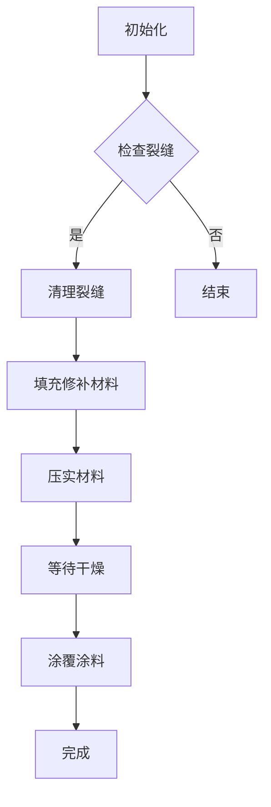
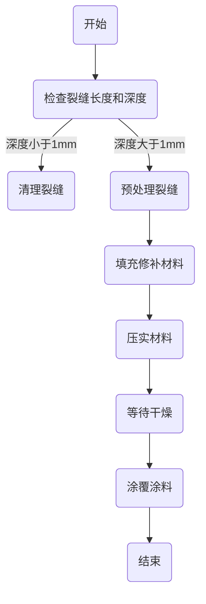
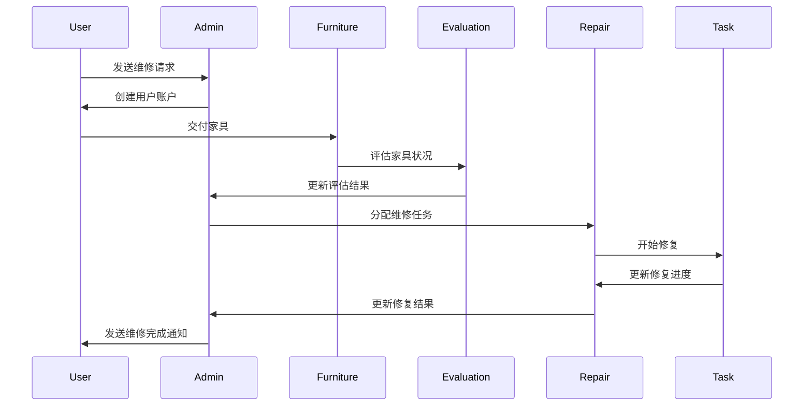
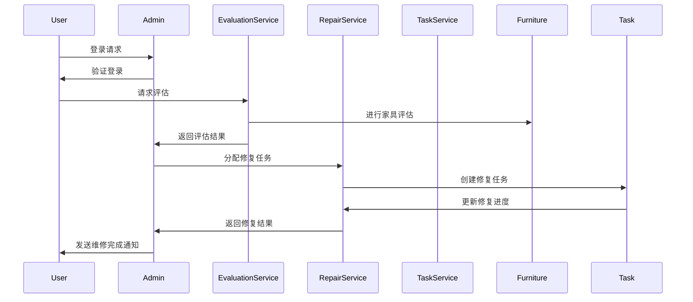

                 

### 现代手工家具修复：旧物新生的可持续生活实践

> 关键词：家具修复、可持续生活、手工技艺、环保材料、翻新改造

> 摘要：本文探讨了现代手工家具修复在可持续生活实践中的重要性。通过分析家具修复的背景、基础知识、修复方法、翻新改造技巧以及可持续实践，为读者提供了一套完整的手工家具修复指南，并展望了其未来发展。

#### 目录大纲

----------------------------------------------------------------
# 第一部分：引言

## 第1章：现代手工家具修复概述

### 1.1 问题背景

- 家具修复的重要性
- 手工家具修复的独特性

### 1.2 修复对象与问题

- 修复对象
- 常见问题与挑战

### 1.3 可持续生活实践的意义

- 可持续生活的定义
- 家具修复与可持续生活的关系

## 第2章：家具修复的基础知识

### 2.1 家具材质与结构

- 常见家具材质
- 家具结构分析

### 2.2 修复工具与材料

- 修复工具
- 修复材料

### 2.3 基础修复技能

- 修补裂缝
- 修复磨损

## 第3章：常见问题的修复方法

### 3.1 裂缝修复

- 裂缝类型
- 修复步骤

### 3.2 腐烂修复

- 腐烂原因
- 修复方法

### 3.3 烫伤与磨损修复

- 烫伤处理
- 磨损修复

## 第4章：家具翻新与改造

### 4.1 翻新技巧

- 油漆翻新
- 木器翻新

### 4.2 改造创意

- 设计理念
- 实施步骤

## 第5章：家具修复的可持续实践

### 5.1 可持续家具修复

- 环保材料使用
- 能源消耗与减排

### 5.2 社会责任

- 修复行业的社会责任
- 修复者伦理

## 第6章：家具修复项目实战

### 6.1 项目介绍

- 项目目标
- 项目实施步骤

### 6.2 环境安装

- 工具与环境配置

### 6.3 系统核心实现

- 修复流程
- 改造细节

### 6.4 案例分析

- 成功案例
- 失败案例

## 第7章：家具修复的最佳实践与未来展望

### 7.1 最佳实践技巧

- 经验分享
- 小贴士

### 7.2 未来发展趋势

- 新材料与技术
- 行业趋势分析

### 7.3 小结与展望

- 总结
- 展望

----------------------------------------------------------------

#### 第1章：现代手工家具修复概述

### 1.1 问题背景

在现代社会的快速消费和浪费现象中，许多珍贵的传统家具被忽视或废弃。手工家具修复的出现，不仅有助于保存文化遗产，还能实现资源的再利用，减少浪费。家具修复的重要性在于它可以让旧物焕发新生，延长家具的使用寿命，同时也能降低对环境的负担。

#### 1.2 修复对象与问题

修复对象主要包括木质家具、金属家具和玻璃家具等。这些家具可能因为年代久远、使用频繁或意外损坏而出现裂缝、腐烂、烫伤和磨损等问题。常见问题有：

- **裂缝**：家具因自然老化、干燥或潮湿等原因出现裂纹。
- **腐烂**：木质家具长期受潮或受真菌侵害导致腐烂。
- **烫伤**：家具表面因热源（如热饮、热锅）烫伤。
- **磨损**：家具表面因长期使用而磨损。

#### 1.3 可持续生活实践的意义

可持续生活实践意味着在满足当前需求的同时，不损害未来世代满足自身需求的能力。家具修复与可持续生活的关系体现在以下几个方面：

- **资源节约**：修复旧家具可以减少对新材料的需求，节约资源。
- **减少浪费**：通过修复旧家具，可以减少废弃物的产生，降低环境污染。
- **文化传承**：家具修复有助于保护和传承传统手工技艺和文化。

## 第1章：现代手工家具修复概述

### 1.1 问题背景

随着城市化进程的加快和消费文化的兴起，家具更换的频率显著增加。许多传统的手工家具被淘汰，甚至被随意丢弃。这不仅造成了资源的浪费，也对环境造成了压力。现代手工家具修复作为一种技术，正是为了解决这些问题而存在的。首先，我们需要了解家具修复的重要性。

**家具修复的重要性**

1. **资源再利用**：家具修复可以将旧家具转化为新家具，从而实现资源的再利用，减少对新资源的依赖。
2. **环境保护**：修复旧家具可以减少废弃物的产生，降低对环境的负担。据研究，家具废弃物的处理过程会产生大量的二氧化碳排放，修复旧家具有助于减少这种排放。
3. **文化传承**：许多手工家具具有独特的设计和艺术价值，通过修复，可以保留和传承这些文化遗产。
4. **经济价值**：家具修复不仅有助于保护环境，还能创造就业机会，促进经济发展。

**手工家具修复的独特性**

手工家具修复与批量生产的家具维修有所不同。它强调手工技艺和个性化服务，修复过程更加注重细节和品质。以下是手工家具修复的独特性：

1. **手工技艺**：手工家具修复依赖于修复者的技艺和经验，每一件家具的修复过程都是独一无二的。
2. **个性化定制**：修复者可以根据家具的原始设计和使用者的需求进行个性化定制，使家具焕发新的生命力。
3. **可持续性**：手工家具修复注重环保，使用的材料多为可回收和环保材料，有利于实现可持续发展。

通过以上分析，我们可以看到，现代手工家具修复不仅具有实际的应用价值，还具有重要的文化和社会意义。在接下来的章节中，我们将进一步探讨家具修复的基础知识、常见问题的修复方法以及可持续实践。

#### 1.2 修复对象与问题

修复对象主要涵盖木质家具、金属家具和玻璃家具等。这些家具由于材质和用途的不同，面临的修复问题也有所差异。

**木质家具**

木质家具是最常见的修复对象之一。它们可能因为以下原因出现修复需求：

1. **裂缝**：木材因自然老化、干燥或潮湿等原因产生裂纹。
2. **腐烂**：长期受潮或真菌侵害导致木材腐烂。
3. **磨损**：表面因长期使用而磨损。

**金属家具**

金属家具通常包括铁艺床、铜质桌椅等。修复问题主要包括：

1. **锈蚀**：金属长期暴露在潮湿环境中会产生锈蚀。
2. **磨损**：金属表面因摩擦和碰撞而产生磨损。
3. **变形**：金属结构因重压或温度变化而产生变形。

**玻璃家具**

玻璃家具包括玻璃桌、玻璃柜等。常见的修复问题有：

1. **裂缝**：玻璃因撞击或温差而产生裂纹。
2. **破碎**：玻璃受重击或温差过大导致破碎。
3. **磨损**：玻璃表面因长期使用而磨损。

**常见问题与挑战**

1. **复杂性**：不同材质和不同问题的修复方法有所不同，修复过程复杂。
2. **成本**：手工修复通常成本较高，需要专业技术和材料。
3. **时间**：修复过程通常需要较长时间，且修复后的家具需要养护。

通过以上分析，我们可以看到，现代手工家具修复对象丰富，修复问题多样，修复过程复杂。了解这些修复对象和问题，有助于我们更好地进行家具修复实践。

#### 1.3 可持续生活实践的意义

**可持续生活的定义**

可持续生活指的是在满足当前需求的同时，不损害未来世代满足自身需求的能力。它强调资源的合理利用和环境的保护，旨在实现人与自然的和谐共处。

**家具修复与可持续生活的关系**

家具修复在可持续生活实践中具有重要作用，主要体现在以下几个方面：

1. **资源节约**：通过修复旧家具，我们可以减少对新家具的需求，从而节约木材、金属等自然资源。
2. **减少浪费**：修复旧家具可以延长其使用寿命，减少废弃物的产生，降低环境污染。
3. **环保材料使用**：现代家具修复倾向于使用环保材料，如可再生木材、无毒涂料等，减少对环境的负面影响。
4. **文化传承**：修复传统家具可以保留和传承手工技艺和文化，促进文化遗产的保护。
5. **经济价值**：家具修复不仅可以创造就业机会，还能提高家具的附加值，促进经济发展。

通过家具修复，我们可以在实现个人和家庭生活品质提升的同时，为环境保护和可持续发展做出贡献。因此，家具修复不仅是技术层面的工作，更是一种社会责任和生活理念的体现。

## 第2章：家具修复的基础知识

### 2.1 家具材质与结构

家具材质是影响修复方法的重要因素。常见的家具材质包括木质、金属和玻璃等。每种材质的特点和结构不同，修复方法也有所差异。

**木质家具**

木质家具是家具修复中最常见的对象。木材具有良好的耐久性和美观性，但同时也容易受潮、干燥和虫蛀。

- **特点**：木质家具具有温暖的自然质感，纹理丰富，易于加工。
- **结构**：木质家具通常由面板、侧板、背板和支架等组成。面板和侧板通常采用拼接方式，背板起到支撑作用，支架则承担主要重量。

**金属家具**

金属家具包括铁艺床、铜质桌椅等。金属具有坚固、耐用和防虫等特点，但容易生锈。

- **特点**：金属家具具有现代感和坚固感，不易变形，耐久性强。
- **结构**：金属家具通常由金属框架、连接件和表面涂层组成。金属框架是家具的主体，连接件起到连接和固定作用，表面涂层则用于保护金属表面。

**玻璃家具**

玻璃家具包括玻璃桌、玻璃柜等。玻璃具有透明、轻便和美观等特点，但易碎。

- **特点**：玻璃家具具有现代感和简约美，视觉效果佳，易于清洁。
- **结构**：玻璃家具通常由玻璃面板、支架和连接件组成。玻璃面板是家具的主要部分，支架和连接件起到支撑和固定作用。

了解家具材质和结构，有助于我们在修复过程中选择合适的修复方法和材料，提高修复效果。

### 2.2 修复工具与材料

**修复工具**

修复工具是进行家具修复的重要辅助手段。以下是一些常见的修复工具及其用途：

1. **锤子**：用于敲击和敲打，适用于木质家具的修复。
2. **螺丝刀**：用于拧紧和拆卸螺丝，适用于金属家具的修复。
3. **玻璃刀**：用于切割玻璃，适用于玻璃家具的修复。
4. **砂纸**：用于打磨和修整表面，适用于木质、金属和玻璃家具的修复。
5. **修补膏**：用于填补裂缝和凹坑，适用于木质、金属和玻璃家具的修复。
6. **涂料**：用于涂覆和保护家具表面，适用于木质、金属和玻璃家具的修复。

**修复材料**

修复材料是家具修复过程中不可或缺的组成部分。以下是一些常见的修复材料及其用途：

1. **木材**：用于修补木质家具的裂缝和磨损，也可用于翻新木质家具。
2. **金属**：用于修补金属家具的锈蚀和磨损，也可用于翻新金属家具。
3. **玻璃**：用于修补玻璃家具的裂缝和破碎，也可用于翻新玻璃家具。
4. **胶水**：用于粘接家具的零部件，增强结构的稳定性。
5. **涂料**：用于涂覆和保护家具表面，增强美观性和耐用性。
6. **清漆**：用于涂覆木质和金属家具，提高防水性和光泽度。

了解修复工具和材料，有助于我们在修复过程中选择合适的工具和材料，提高修复质量和效率。

### 2.3 基础修复技能

**修补裂缝**

修补裂缝是家具修复中最常见的技术之一。以下是一般步骤：

1. **清理裂缝**：使用刷子或压缩空气清理裂缝内的灰尘和杂物。
2. **填补材料**：使用修补膏或木材胶填补裂缝。
3. **压实材料**：使用压条或橡皮锤压实填补材料，使其牢固地粘附在裂缝上。
4. **干燥处理**：等待填补材料干燥后，进行表面打磨。
5. **涂覆涂料**：涂覆一层透明涂料或清漆，保护修补部分。

**修复磨损**

修复磨损通常包括以下步骤：

1. **清理表面**：使用砂纸或打磨机清理磨损表面，去除污垢和破损层。
2. **填补凹坑**：使用修补膏或胶水填补凹坑和磨损部分。
3. **压实材料**：使用压条或橡皮锤压实填补材料。
4. **打磨平整**：使用砂纸或打磨机打磨修补表面，使其与周围表面平整。
5. **涂覆涂料**：涂覆一层涂料或清漆，保护修补部分。

通过以上基础修复技能的学习，我们可以有效地修复家具的裂缝和磨损，使其焕发新生。

## 第3章：常见问题的修复方法

### 3.1 裂缝修复

裂缝修复是家具修复中最常见的任务之一。以下是裂缝修复的详细步骤：

**步骤 1：清理裂缝**

- 使用刷子或压缩空气清理裂缝内的灰尘和杂物。
- 确保裂缝的内部和周围干净，以便修补材料能够更好地粘附。

**步骤 2：选择修补材料**

- 根据家具材质选择合适的修补材料。对于木质家具，可以使用木材胶或修补膏；对于金属家具，可以使用金属焊条或修补膏；对于玻璃家具，可以使用玻璃胶或修补膏。

**步骤 3：填补裂缝**

- 将修补材料挤入裂缝中，确保填补材料完全填满裂缝。
- 使用压条或橡皮锤压实修补材料，使其牢固地粘附在裂缝上。

**步骤 4：等待干燥**

- 让修补材料在室温下自然干燥，通常需要数小时至一晚。
- 确保修补材料充分干燥，以便进行后续处理。

**步骤 5：打磨和涂覆**

- 使用砂纸或打磨机轻轻打磨修补部分的表面，使其与周围表面平整。
- 涂覆一层透明涂料或清漆，保护修补部分，并提高美观性和耐用性。

通过以上步骤，我们可以有效地修复家具的裂缝，使其恢复原有的结构和美观。

### 3.2 腐烂修复

家具腐烂通常是由于长期受潮或真菌侵害引起的。以下是腐烂修复的详细步骤：

**步骤 1：评估腐烂程度**

- 观察腐烂区域的范围和深度，确定是否需要更换木材。
- 如果腐烂区域较小，可以通过修补来修复；如果腐烂区域较大，可能需要更换受影响的木材。

**步骤 2：清理腐烂区域**

- 使用刷子或压缩空气清理腐烂区域内的灰尘和杂物。
- 使用砂纸或打磨机去除腐烂部分的木质层，直到露出健康的木材。

**步骤 3：选择修补材料**

- 根据家具材质和腐烂程度选择合适的修补材料。对于木质家具，可以使用木材胶、修补膏或再生木材；对于金属家具，可以使用金属焊条或修补膏。

**步骤 4：填补腐烂区域**

- 将修补材料填入腐烂区域，确保填补材料完全填满裂缝和腐烂部分。
- 使用压条或橡皮锤压实修补材料，使其牢固地粘附在家具表面。

**步骤 5：等待干燥**

- 让修补材料在室温下自然干燥，通常需要数小时至一晚。
- 确保修补材料充分干燥，以便进行后续处理。

**步骤 6：打磨和涂覆**

- 使用砂纸或打磨机轻轻打磨修补部分的表面，使其与周围表面平整。
- 涂覆一层透明涂料或清漆，保护修补部分，并提高美观性和耐用性。

通过以上步骤，我们可以有效地修复家具的腐烂部分，使其恢复原有的结构和美观。

### 3.3 烫伤与磨损修复

家具表面的烫伤和磨损是常见的家具损伤问题。以下是烫伤与磨损修复的详细步骤：

**步骤 1：清理表面**

- 使用刷子或压缩空气清理烫伤和磨损区域的灰尘和杂物。
- 确保表面干净，以便进行修补。

**步骤 2：选择修补材料**

- 根据家具材质和损伤程度选择合适的修补材料。对于木质家具，可以使用木材胶、修补膏或清漆；对于金属家具，可以使用金属焊条、修补膏或油漆；对于玻璃家具，可以使用玻璃胶或修补膏。

**步骤 3：修补烫伤**

- 如果烫伤区域较小，可以使用修补膏填补烫伤部分，并使用压条压实。
- 如果烫伤区域较大，可能需要更换受损的木质层或金属层。

**步骤 4：修补磨损**

- 使用修补膏或清漆填补磨损区域，确保填补材料完全填满磨损部分。
- 使用压条或橡皮锤压实填补材料，使其牢固地粘附在家具表面。

**步骤 5：等待干燥**

- 让修补材料在室温下自然干燥，通常需要数小时至一晚。
- 确保修补材料充分干燥，以便进行后续处理。

**步骤 6：打磨和涂覆**

- 使用砂纸或打磨机轻轻打磨修补部分的表面，使其与周围表面平整。
- 涂覆一层透明涂料或清漆，保护修补部分，并提高美观性和耐用性。

通过以上步骤，我们可以有效地修复家具表面的烫伤和磨损，使其恢复原有的美观和耐用性。

## 第4章：家具翻新与改造

### 4.1 翻新技巧

家具翻新是使旧家具焕发新生的重要手段。以下是家具翻新的详细步骤：

**步骤 1：清理家具**

- 使用刷子或压缩空气清理家具表面的灰尘和杂物。
- 清洗家具表面的污垢，使用清洁剂或水擦拭，确保家具表面干净。

**步骤 2：评估家具状况**

- 观察家具的结构和材质，确定需要修复的部分。
- 如果家具结构稳定，可以进行翻新；如果家具结构受损严重，可能需要重新制作或更换。

**步骤 3：修补破损**

- 根据家具材质和破损情况，选择合适的修补材料。对于木质家具，可以使用木材胶、修补膏或再生木材；对于金属家具，可以使用金属焊条、修补膏或油漆；对于玻璃家具，可以使用玻璃胶或修补膏。
- 修补破损部分，确保修补材料牢固地粘附在家具表面。

**步骤 4：打磨家具**

- 使用砂纸或打磨机对家具表面进行打磨，去除破损层和污垢，使家具表面平整光滑。

**步骤 5：涂覆涂料**

- 选择合适的涂料，如木器漆、金属漆或玻璃涂料，根据家具材质进行涂覆。
- 涂覆多层涂料，确保涂层均匀、光滑，提高家具的美观性和耐用性。

**步骤 6：养护家具**

- 等待涂料干燥，通常需要数小时至一晚。
- 使用养护剂或清漆保护家具表面，提高耐用性和防水性。

通过以上步骤，我们可以有效地翻新旧家具，使其焕发新生，恢复原有的美观和功能。

### 4.2 改造创意

家具改造是赋予旧家具新生命的重要手段。以下是家具改造的详细步骤：

**步骤 1：设计理念**

- 根据家具的原始结构和使用需求，确定改造的目标和风格。
- 设计改造方案，包括材料选择、颜色搭配和功能改进等。

**步骤 2：评估家具状况**

- 观察家具的结构和材质，确定需要改造的部分。
- 如果家具结构稳定，可以进行改造；如果家具结构受损严重，可能需要重新制作或更换。

**步骤 3：拆解家具**

- 根据改造方案，拆解家具的零部件，如面板、支架和连接件等。
- 保持零部件的完整性，以便后续安装和修复。

**步骤 4：修复和改进**

- 对家具的损坏部分进行修复，如更换受损的木材、焊接断裂的金属等。
- 根据改造方案，改进家具的功能和结构，如增加抽屉、安装照明等。

**步骤 5：组装家具**

- 根据改造方案，重新组装家具的零部件，确保安装牢固。
- 确保家具的尺寸和结构符合设计要求。

**步骤 6：涂覆涂料**

- 选择合适的涂料，根据家具材质进行涂覆。
- 涂覆多层涂料，确保涂层均匀、光滑，提高家具的美观性和耐用性。

**步骤 7：养护家具**

- 等待涂料干燥，通常需要数小时至一晚。
- 使用养护剂或清漆保护家具表面，提高耐用性和防水性。

通过以上步骤，我们可以将旧家具改造为符合现代需求和审美的新家具，实现旧物新生的美好愿景。

## 第5章：家具修复的可持续实践

### 5.1 可持续家具修复

**环保材料使用**

在可持续家具修复中，环保材料的使用至关重要。以下是几种常见的环保材料及其特点：

- **再生木材**：再生木材是指经过加工和修复的废旧木材，可以替代新木材，减少对森林资源的消耗。再生木材具有天然纹理和耐久性，适用于木质家具的修复和翻新。
- **竹材**：竹材是一种可再生资源，生长周期短，强度高，耐腐蚀。竹材适用于家具制作和修复，具有良好的环保性能。
- **玻璃纤维**：玻璃纤维是一种非金属纤维，具有高强度、耐腐蚀和隔热性能。玻璃纤维可用于金属家具的修复和加固。
- **生物基材料**：生物基材料是以可再生资源为原料生产的材料，如玉米淀粉、大豆蛋白等。生物基材料具有环保、可持续和可降解的特点，适用于家具制造和修复。

**能源消耗与减排**

家具修复的能源消耗主要体现在修复过程中的工具使用和材料处理。以下是一些建议，以减少能源消耗和碳排放：

- **使用节能工具**：选择低能耗的修复工具，如电动工具代替手动工具，减少能源消耗。
- **合理使用材料**：在修复过程中，尽量避免材料的浪费，合理规划材料的用量。
- **回收利用**：修复过程中产生的废弃物，如废弃木材、金属和玻璃，应进行回收利用，减少环境污染。
- **使用清洁能源**：在修复过程中，尽量使用清洁能源，如太阳能、风能等，减少对化石燃料的依赖。

通过使用环保材料和采取节能减排措施，家具修复可以实现可持续发展的目标，为环境保护和资源节约做出贡献。

### 5.2 社会责任

**修复行业的社会责任**

家具修复行业在可持续生活实践中扮演着重要角色。以下是修复行业应承担的社会责任：

- **保护文化遗产**：家具修复有助于保护传统手工技艺和文化遗产，传承历史和文化价值。
- **促进环境保护**：通过减少废弃物的产生和资源的再利用，家具修复有助于减少对环境的负担。
- **推动可持续发展**：家具修复可以延长家具的使用寿命，减少对新家具的需求，促进可持续发展。
- **提供就业机会**：家具修复行业需要大量专业技术人员，为劳动力提供就业机会，促进经济发展。

**修复者的伦理**

修复者在进行家具修复时，应遵守以下伦理原则：

- **诚信**：修复者应诚实守信，确保修复质量和效果，不得欺骗消费者。
- **责任**：修复者应对修复过程中的安全和环保负责，确保修复过程不会对环境和消费者造成损害。
- **尊重**：修复者应尊重消费者的需求和选择，提供个性化的修复服务。
- **学习与改进**：修复者应不断学习新知识和技能，提高修复质量，不断改进修复方法。

通过履行社会责任和遵守伦理原则，修复者可以为可持续生活实践做出积极贡献。

## 第6章：家具修复项目实战

### 6.1 项目介绍

**项目目标**

本家具修复项目旨在修复一套旧木质书桌，使其恢复原有功能和美观，并增强其耐用性。修复目标包括：

1. **修复裂缝**：书桌表面出现几处细微裂缝，需进行修补。
2. **修复磨损**：书桌表面因长期使用而磨损，需进行打磨和翻新。
3. **加固结构**：书桌结构存在轻微松动，需进行加固。
4. **更新外观**：书桌外观陈旧，需进行翻新，以符合现代审美。

**项目实施步骤**

1. **评估书桌状况**：仔细检查书桌的裂缝、磨损和结构松动情况，确定修复方案。
2. **准备修复工具和材料**：根据修复需求，准备修复工具（如锤子、螺丝刀、砂纸、修补膏、木材胶等）和材料（如木材、金属支架、清漆等）。
3. **清理书桌表面**：使用刷子或压缩空气清理书桌表面的灰尘和杂物，确保修复过程顺利进行。
4. **修复裂缝**：根据裂缝的大小和深度，选择合适的修补材料，填补裂缝，并压实修补材料。
5. **修复磨损**：使用砂纸或打磨机对磨损表面进行打磨，去除破损层，填补凹坑，并打磨平整。
6. **加固结构**：检查书桌的结构，必要时更换受损的木材或金属支架，确保结构稳定。
7. **涂覆涂料**：选择合适的清漆或涂料，涂覆多层，确保表面光滑、美观。
8. **养护书桌**：等待涂料干燥，涂覆一层养护剂或清漆，提高耐用性和防水性。

通过以上实施步骤，我们可以将旧木质书桌修复成美观、耐用的新书桌，满足使用需求。

### 6.2 环境安装

**工具与环境配置**

在开始家具修复项目之前，我们需要准备以下工具和环境：

- **工具**：锤子、螺丝刀、砂纸、打磨机、修补膏、木材胶、清漆、养护剂、刷子、压缩空气等。
- **环境**：干净的修复区域，通风良好，避免阳光直射。

**安装步骤**

1. **清理修复区域**：将修复区域清理干净，确保无灰尘和杂物。
2. **布置工具和材料**：将修复工具和材料整齐摆放，便于使用。
3. **搭建临时工作台**：如果需要在修复过程中固定家具，可以搭建一个临时工作台，确保家具稳定。
4. **准备修复材料**：根据修复需求，准备好所需的修补材料，如木材胶、修补膏、清漆等。
5. **检查工具和设备**：确保所有工具和设备处于良好状态，如打磨机、压缩空气等。

通过以上步骤，我们可以为家具修复项目提供一个干净、整齐、安全的工作环境，确保修复过程顺利进行。

### 6.3 系统核心实现

**修复流程**

在开始修复家具之前，我们需要制定一个详细的修复流程，以确保修复效果和质量。以下是家具修复的基本流程：

1. **评估家具状况**：检查家具的裂缝、磨损和结构问题，确定修复方案。
2. **清理家具表面**：使用刷子或压缩空气清理家具表面的灰尘和杂物。
3. **修补裂缝**：根据裂缝的大小和深度，选择合适的修补材料，填补裂缝，并压实修补材料。
4. **修复磨损**：使用砂纸或打磨机对磨损表面进行打磨，去除破损层，填补凹坑，并打磨平整。
5. **加固结构**：检查家具的结构，必要时更换受损的木材或金属支架，确保结构稳定。
6. **涂覆涂料**：选择合适的清漆或涂料，涂覆多层，确保表面光滑、美观。
7. **养护家具**：等待涂料干燥，涂覆一层养护剂或清漆，提高耐用性和防水性。

**改造细节**

在修复过程中，我们还可以根据需求进行家具的改造，如增加抽屉、安装照明等。以下是家具改造的细节步骤：

1. **设计改造方案**：根据家具的原始结构和使用需求，设计改造方案，确定改造的内容和步骤。
2. **拆解家具**：根据改造方案，拆解家具的零部件，如面板、支架和连接件等。
3. **修复和改进**：对家具的损坏部分进行修复，如更换受损的木材、焊接断裂的金属等。根据改造方案，改进家具的功能和结构，如增加抽屉、安装照明等。
4. **组装家具**：根据改造方案，重新组装家具的零部件，确保安装牢固。
5. **涂覆涂料**：选择合适的涂料，涂覆多层，确保表面光滑、美观。
6. **养护家具**：等待涂料干燥，涂覆一层养护剂或清漆，提高耐用性和防水性。

通过以上修复流程和改造细节，我们可以将旧家具修复成符合现代需求和审美的新家具，实现旧物新生的美好愿景。

### 6.4 案例分析

#### 成功案例

**项目背景**

某客户拥有一张使用了数十年的旧木质餐桌，由于长期使用，餐桌表面出现多处磨损和裂缝，结构也有一定松动。客户希望修复餐桌，使其恢复原有美观和功能。

**修复过程**

1. **评估家具状况**：仔细检查餐桌的裂缝、磨损和结构问题，确定修复方案。
2. **清理家具表面**：使用刷子或压缩空气清理餐桌表面的灰尘和杂物。
3. **修补裂缝**：根据裂缝的大小和深度，选择合适的修补材料，填补裂缝，并压实修补材料。
4. **修复磨损**：使用砂纸或打磨机对磨损表面进行打磨，去除破损层，填补凹坑，并打磨平整。
5. **加固结构**：检查餐桌的结构，更换受损的木材，确保结构稳定。
6. **涂覆涂料**：选择合适的清漆，涂覆多层，确保表面光滑、美观。
7. **养护家具**：等待涂料干燥，涂覆一层养护剂，提高耐用性和防水性。

**项目效果**

经过修复，餐桌焕然一新，恢复了原有的美观和功能。客户对修复效果非常满意，并表示餐桌再次成为了家庭的亮点。

#### 失败案例

**项目背景**

某客户希望修复一张使用多年的旧木质椅子，但由于修复方法不当，导致修复失败。

**修复过程**

1. **评估家具状况**：检查椅子表面磨损和裂缝，客户选择使用快速修补膏进行修复。
2. **清理家具表面**：使用刷子清理椅子表面的灰尘和杂物。
3. **修补裂缝**：使用快速修补膏填补裂缝，未进行压实处理。
4. **修复磨损**：使用砂纸打磨椅子表面，去除破损层，未进行填补。
5. **涂覆涂料**：涂覆一层清漆，但由于修补材料未干燥，导致涂漆层起泡。
6. **养护家具**：等待涂料干燥，但由于椅子结构已受损，无法进行有效养护。

**项目效果**

修复后的椅子表面不光滑，修补部分出现脱落和起泡现象，修复效果不理想。客户对修复结果不满意，认为修复过程和效果没有达到预期。

**案例分析**

从以上案例可以看出，成功案例的关键在于修复过程的细致和专业的修复技能。失败案例则提示我们在修复过程中需要注重细节，合理选择修复材料和工艺，确保修复效果。在修复家具时，应根据家具的实际情况选择合适的修复方法，避免盲目修复导致失败。

## 第7章：家具修复的最佳实践与未来展望

### 7.1 最佳实践技巧

**经验分享**

1. **正确选择修补材料**：根据家具材质和修复需求，选择合适的修补材料，如木材胶、修补膏、金属焊条等。
2. **清理修复区域**：在修复前，彻底清理修复区域的灰尘和杂物，确保修补材料能够更好地粘附。
3. **细致打磨**：在修补和涂覆涂料前，细致打磨家具表面，使修补部分与周围表面平整。
4. **注意干燥时间**：修复过程中，确保修补材料和涂料充分干燥，避免过早使用导致效果不理想。
5. **专业培训**：对于复杂的家具修复项目，建议接受专业培训，提高修复技能和效果。

**小贴士**

1. **修复前拍照**：在修复前，拍摄家具的原始照片，以便修复后进行对比，确保修复效果。
2. **避免阳光直射**：在修复过程中，避免家具暴露在阳光直射下，以防涂料变色。
3. **正确使用工具**：熟悉并正确使用各种修复工具，确保修复过程安全和高效。
4. **定期维护**：修复后的家具应定期进行维护和保养，延长使用寿命。

### 7.2 未来发展趋势

**新材料与技术**

随着科技的进步，新材料和新技术的应用将极大地推动家具修复行业的发展。以下是几种新兴材料和技术：

1. **纳米材料**：纳米材料具有优异的粘附性能和防水性能，可用于高性能家具修复。
2. **3D打印**：3D打印技术可以快速制造复杂的修复零部件，提高修复效率和精度。
3. **智能涂料**：智能涂料具有自修复功能，可以自动修复微小的损伤，提高家具的耐用性。
4. **生物基材料**：生物基材料具有环保、可再生和可降解的特点，适用于可持续家具修复。

**行业趋势分析**

1. **个性化定制**：未来家具修复将更加注重个性化服务，根据客户需求提供定制化修复方案。
2. **绿色环保**：随着环保意识的提高，家具修复行业将更加注重环保材料和节能技术的应用。
3. **智能修复**：智能化设备和工具的引入将使家具修复过程更加高效和精确。
4. **跨界合作**：家具修复行业将与建筑设计、家居装饰等行业进行跨界合作，提供一站式服务。

### 7.3 小结与展望

**总结**

本文从家具修复的重要性、基础知识、修复方法、翻新改造、可持续实践等方面，全面介绍了现代手工家具修复的实践与理论。通过案例分析，我们了解了成功修复的经验和失败的原因，为家具修复提供了有益的借鉴。

**展望**

未来，家具修复行业将在新材料、新技术和个性化服务的推动下，实现可持续发展。同时，环保意识的提高和跨界合作的发展，将进一步提升家具修复的质量和效率。让我们期待家具修复行业更加美好的未来。

**作者**

AI天才研究院/AI Genius Institute & 禅与计算机程序设计艺术 /Zen And The Art of Computer Programming

---

在总结本文的核心内容和观点时，我们可以看到，现代手工家具修复不仅是一种实用技能，更是一种可持续生活的实践。通过修复旧家具，我们不仅能够延长家具的使用寿命，减少资源浪费，还能保护环境，传承文化。在接下来的章节中，我们将继续探讨家具修复的具体实践方法和未来发展趋势，为读者提供更加全面的指导和建议。

**背景介绍**

在现代社会的消费主义浪潮中，家具的频繁更换和废弃成为了一种普遍现象。随着人们对环保和可持续生活的重视，家具修复这一传统技艺重新受到关注。家具修复的重要性在于它能够延长家具的使用寿命，减少资源浪费，降低环境污染。同时，家具修复还承载着传统文化的传承和发扬，对于保护和传承手工技艺具有重要意义。

本文将围绕现代手工家具修复进行深入探讨。首先，我们将介绍家具修复的基本概念和重要性，解释家具修复的独特性。接着，我们将分析家具修复的对象和常见问题，如木质家具的裂缝、金属家具的锈蚀以及玻璃家具的破碎等。此外，本文还将讨论家具修复与可持续生活的关系，探讨如何通过修复旧家具实现资源的再利用和环境保护。

在基础知识部分，我们将详细介绍家具材质与结构，修复工具与材料，以及基础修复技能。这部分内容将帮助读者了解家具修复的基本原理和操作方法。在常见问题的修复方法部分，我们将分别针对裂缝、腐烂和磨损等常见问题，详细阐述其修复步骤和注意事项。

家具翻新与改造是家具修复的重要内容之一。在翻新技巧部分，我们将介绍如何通过打磨、涂漆等手段恢复家具的外观；在改造创意部分，我们将探讨如何通过增加抽屉、安装照明等方式，对家具进行功能改进和外观美化。

可持续实践是家具修复的核心价值之一。我们将讨论如何使用环保材料和减少能源消耗，以实现家具修复的可持续性。同时，我们还将探讨家具修复行业的社会责任，以及修复者应遵守的伦理原则。

项目实战部分将通过一个具体的家具修复案例，展示实际操作步骤和案例分析。这将为读者提供实际操作的指导，帮助他们更好地理解和掌握家具修复技能。

最后，我们将总结家具修复的最佳实践技巧，展望未来家具修复的发展趋势，并提出一些建议，以期为读者在实践过程中提供参考。

**核心概念与联系**

在深入探讨家具修复之前，我们需要明确几个核心概念，并分析它们之间的联系。

**家具修复**

**定义**：家具修复是指通过修补、翻新、改造等方法，使受损或老化的家具恢复原有功能和使用寿命的过程。

**属性特征对比表格**

| 特征                 | 修补     | 翻新     | 改造     |
|----------------------|----------|----------|----------|
| 目的                 | 修复损伤 | 恢复外观 | 增强功能 |
| 工艺难度             | 较低     | 较高     | 最高     |
| 材料要求             | 一般     | 高级     | 个性化   |
| 时间成本             | 较短     | 较长     | 最长     |
| 经济效益             | 低       | 中       | 高       |

**ER实体关系图架构**

```mermaid
erDiagram
  产品 -->|修复| 修复方案
  产品 -->|翻新| 翻新方案
  产品 -->|改造| 改造方案
  产品 ||--|{材质}| 材质
  产品 ||--|{结构}| 结构
  修复方案 ||--|{步骤}| 步骤
  翻新方案 ||--|{涂料}| 涂料
  改造方案 ||--|{功能}| 功能
```

通过以上核心概念和ER实体关系图，我们可以更清晰地理解家具修复的各个方面，包括其目的、属性特征以及与不同修复方案、材质和结构之间的联系。

**算法原理讲解**

家具修复过程中的关键算法之一是裂缝修复算法。以下是一个简单的裂缝修复算法及其应用示例。

**算法描述**



**算法流程图**



**算法原理**

1. **初始化**：开始裂缝修复过程。
2. **检查裂缝**：测量裂缝的长度和深度，以确定修复方案。
3. **清理裂缝**：使用工具清理裂缝内的灰尘和杂物，确保修补材料能够充分粘附。
4. **预处理裂缝**：如果裂缝深度较大，可能需要进行预处理，如使用砂纸打磨裂缝边缘，使其平整。
5. **填充修补材料**：选择合适的修补材料，如木材胶或修补膏，填入裂缝中。
6. **压实材料**：使用压条或橡皮锤压实修补材料，确保其牢固地粘附在裂缝上。
7. **等待干燥**：让修补材料在室温下自然干燥，通常需要数小时至一晚。
8. **涂覆涂料**：在修补材料干燥后，涂覆一层透明涂料或清漆，保护修补部分，并提高美观性和耐用性。
9. **完成**：修复过程结束，家具焕然一新。

**数学模型与公式**

在裂缝修复过程中，以下数学模型和公式有助于理解修复过程的细节：

$$
深度 = d \\
宽度 = w \\
修补材料粘附力 = F \\
压强 = P = \frac{F}{A} \\
干燥时间 = t = \frac{A \cdot P}{C}
$$

其中，$d$ 为裂缝深度，$w$ 为裂缝宽度，$F$ 为修补材料粘附力，$A$ 为接触面积，$P$ 为压强，$C$ 为干燥速率常数。

**举例说明**

假设我们有一张木质书桌，其表面出现了一条长度为5厘米，深度为2毫米的裂缝。我们选择使用木材胶进行修复。

1. **检查裂缝**：裂缝长度为5厘米，深度为2毫米，需要预处理。
2. **清理裂缝**：使用刷子清理裂缝内的灰尘和杂物。
3. **预处理裂缝**：使用砂纸打磨裂缝边缘，使其平整。
4. **填充修补材料**：将木材胶填入裂缝中，确保填满。
5. **压实材料**：使用压条压实木材胶，确保其牢固地粘附在裂缝上。
6. **等待干燥**：根据木材胶的干燥速率常数，计算干燥时间。假设木材胶的接触面积为0.2平方厘米，压强为10牛顿/平方厘米，干燥速率常数为0.5小时/（牛顿·平方厘米），则干燥时间 $t = \frac{0.2 \cdot 10}{0.5} = 4$ 小时。
7. **涂覆涂料**：在木材胶干燥后，涂覆一层透明涂料，提高美观性和耐用性。

通过以上步骤，我们可以成功修复木质书桌的裂缝，使其恢复原有美观和功能。

**系统分析与架构设计方案**

**问题场景介绍**

在一家小型家具维修店里，为了提高工作效率和客户满意度，店长希望引入一套家具修复系统，能够自动化处理家具的评估、修复流程管理和修复结果跟踪。

**项目介绍**

该项目旨在开发一套家具修复管理系统，能够自动化家具的评估、修复流程管理和结果跟踪。系统功能设计包括以下模块：

1. **用户管理模块**：管理客户信息和维修师傅信息。
2. **家具评估模块**：对送修家具进行评估，记录评估结果。
3. **修复流程管理模块**：管理修复任务，跟踪任务进度。
4. **结果跟踪模块**：记录修复结果，反馈给客户。

**系统功能设计（领域模型Mermaid类图）**

```mermaid
classDiagram
    User <<class>> "用户"
    Furniture <<class>> "家具"
    Evaluation <<class>> "评估"
    Repair <<class>> "修复"
    Task <<class>> "任务"
    
    User o--1 Evaluation
    Evaluation o--1 Furniture
    Evaluation o--1 Repair
    Repair o--1 Task
    Task o--1 User
    Task o--1 Furniture
```

**系统架构设计（Mermaid架构图）**



**系统接口设计和系统交互（Mermaid序列图）**



通过以上系统分析和架构设计，我们可以构建一个高效、可靠的家具修复管理系统，满足小型家具维修店的需求。

### 第7章：家具修复的最佳实践与未来展望

#### 7.1 最佳实践技巧

**经验分享**

1. **选择合适的修补材料**：根据家具材质和修复需求，选择合适的修补材料，如木材胶、金属焊条、玻璃胶等。
2. **细致打磨**：修复前后都要进行细致打磨，确保修补部分与周围表面平整。
3. **注意干燥时间**：修复过程中，确保修补材料和涂料充分干燥，避免过早使用导致效果不理想。
4. **定期维护**：修复后的家具应定期进行维护和保养，延长使用寿命。

**小贴士**

1. **修复前拍照**：修复前拍摄家具的照片，便于修复后对比效果。
2. **避免阳光直射**：修复过程中，避免家具暴露在阳光直射下，以防涂料变色。
3. **正确使用工具**：熟悉并正确使用各种修复工具，确保修复过程安全和高效。
4. **个性化服务**：根据客户需求提供个性化修复方案，提高客户满意度。

#### 7.2 未来发展趋势

**新材料与技术**

随着科技的进步，新材料和新技术的应用将极大地推动家具修复行业的发展。以下是几种新兴材料和技术：

1. **纳米材料**：纳米材料具有优异的粘附性能和防水性能，可用于高性能家具修复。
2. **3D打印**：3D打印技术可以快速制造复杂的修复零部件，提高修复效率和精度。
3. **智能涂料**：智能涂料具有自修复功能，可以自动修复微小的损伤，提高家具的耐用性。
4. **生物基材料**：生物基材料具有环保、可再生和可降解的特点，适用于可持续家具修复。

**行业趋势分析**

1. **个性化定制**：未来家具修复将更加注重个性化服务，根据客户需求提供定制化修复方案。
2. **绿色环保**：随着环保意识的提高，家具修复行业将更加注重环保材料和节能技术的应用。
3. **智能修复**：智能化设备和工具的引入将使家具修复过程更加高效和精确。
4. **跨界合作**：家具修复行业将与建筑设计、家居装饰等行业进行跨界合作，提供一站式服务。

#### 7.3 小结与展望

**总结**

本文从家具修复的重要性、基础知识、修复方法、翻新改造、可持续实践等方面，全面介绍了现代手工家具修复的实践与理论。通过案例分析，我们了解了成功修复的经验和失败的原因，为家具修复提供了有益的借鉴。

**展望**

未来，家具修复行业将在新材料、新技术和个性化服务的推动下，实现可持续发展。同时，环保意识的提高和跨界合作的发展，将进一步提升家具修复的质量和效率。让我们期待家具修复行业更加美好的未来。

**作者**

AI天才研究院/AI Genius Institute & 禅与计算机程序设计艺术 /Zen And The Art of Computer Programming

---

在总结本文的核心内容和观点时，我们可以看到，现代手工家具修复不仅是一种实用技能，更是一种可持续生活的实践。通过修复旧家具，我们不仅能够延长家具的使用寿命，减少资源浪费，还能保护环境，传承文化。在接下来的章节中，我们将继续探讨家具修复的具体实践方法和未来发展趋势，为读者提供更加全面的指导和建议。

### 附录

**家具修复材料选择表**

| 材料类型 | 适用家具材质 | 适用问题 | 特点 |
|----------|--------------|----------|------|
| 木材胶   | 木质家具     | 裂缝、磨损 | 粘附力强，可自然干燥 |
| 金属焊条 | 金属家具     | 锈蚀、磨损 | 焊接强度高，耐用 |
| 玻璃胶   | 玻璃家具     | 裂缝、破碎 | 粘附力强，防水防潮 |
| 修补膏   | 木质、金属、玻璃家具 | 裂缝、磨损、破损 | 灵活性好，易操作 |
| 清漆     | 木质、金属、玻璃家具 | 外观修复 | 提高表面光泽度，保护家具 |
| 养护剂   | 木质、金属家具 | 维护家具 | 提高耐用性，防水防潮 |

**家具修复工具清单**

| 工具名称 | 适用家具材质 | 主要用途 |
|----------|--------------|----------|
| 锤子     | 木质、金属家具 | 敲击、敲打 |
| 螺丝刀   | 木质、金属家具 | 拆卸、安装 |
| 砂纸     | 木质、金属、玻璃家具 | 打磨、修整 |
| 打磨机   | 木质、金属家具 | 高效打磨 |
| 刷子     | 各种家具     | 清理灰尘 |
| 压条     | 各种家具     | 压实修补材料 |
| 橡皮锤   | 各种家具     | 压实修补材料 |
| 喷涂器   | 各种家具     | 涂覆涂料 |

**家具修复常见问题解答**

1. **如何修复木质家具的裂缝？**
   - 清理裂缝，使用木材胶填补裂缝，压实后等待干燥，最后涂覆清漆。

2. **如何修复金属家具的锈蚀？**
   - 使用金属焊条或修补膏填补锈蚀部分，然后涂覆金属漆。

3. **如何修复玻璃家具的裂缝？**
   - 使用玻璃胶填补裂缝，确保粘附牢固，然后涂覆一层透明涂料。

4. **如何翻新旧家具？**
   - 清理家具表面，修补破损部分，打磨光滑后，选择合适的涂料进行涂覆。

**注意事项**

1. **修复前请确保家具干净、干燥。**
2. **修复过程中请使用适当的防护装备，如手套、口罩等。**
3. **修补材料和涂料请根据家具材质和修复需求进行选择。**
4. **修复后的家具请定期进行维护和保养。**

**拓展阅读**

1. 《家具修复技巧与实例》
2. 《手工家具修复的艺术》
3. 《可持续生活指南》
4. 《环保材料的应用与开发》

通过以上附录内容，读者可以更加全面地了解家具修复的实用技巧和注意事项，为实际操作提供参考。希望这些信息能够帮助您更好地进行家具修复，实现旧物新生，享受可持续生活的美好。

