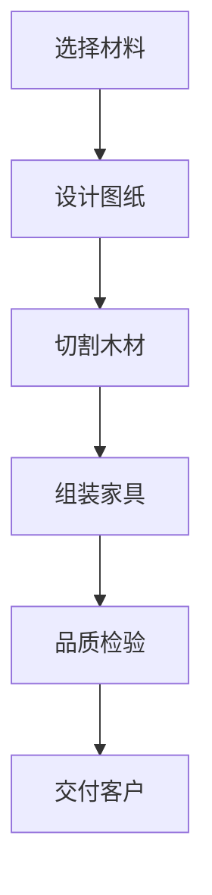
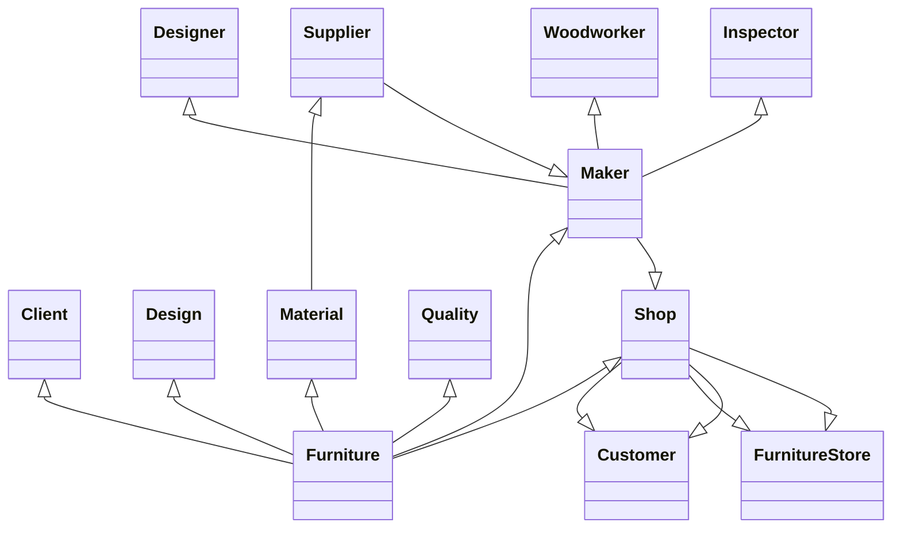
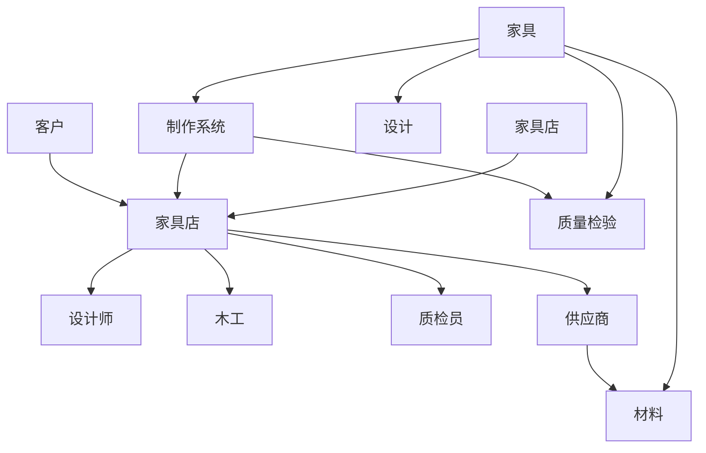
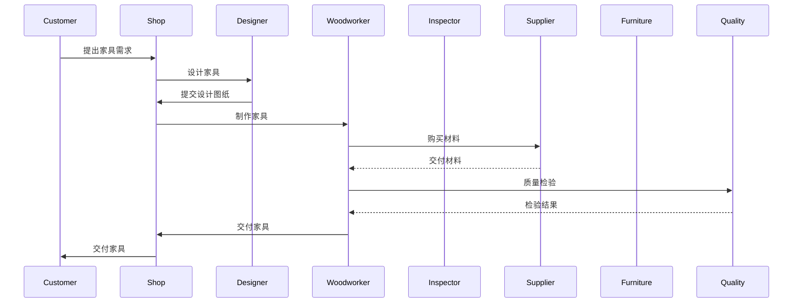

                 


### Step 1: Introduction and Background

**文章标题**: 现代手工家具制作：可持续生活中的匠人精神

**关键词**: 手工家具、可持续生活、匠人精神、木工技术、环保材料

**摘要**: 本文将探讨现代手工家具制作的魅力，从可持续生活的角度，深入分析匠人精神在现代家具制作中的应用，以及如何通过环保材料和精湛技艺，打造出既美观又实用的家具作品。

**正文结构**:

1. **引言：手工家具的魅力与现代生活的追求**
   - 介绍手工家具的定义和特点
   - 分析现代生活对家具的需求变化
   - 引出本文的核心话题：匠人精神与可持续生活

2. **匠人精神的内涵与价值**
   - 解释匠人精神的定义
   - 分析匠人精神在现代家具制作中的重要性
   - 探讨匠人精神与可持续生活的关系

3. **现代手工家具的制作工艺**
   - 介绍现代手工家具的主要制作工艺
   - 分析每种工艺的特点和优势
   - 通过实例说明制作过程

4. **环保材料在手工家具制作中的应用**
   - 讲解环保材料的重要性
   - 介绍几种常见的环保材料及其特性
   - 分析环保材料对可持续生活的影响

5. **匠人精神在可持续家具设计中的实践**
   - 分析匠人精神在可持续家具设计中的应用
   - 举例说明实际案例
   - 讨论匠人精神对可持续家具设计的启示

6. **结论：匠人精神与可持续生活的未来**
   - 总结匠人精神在手工家具制作中的作用
   - 展望可持续家具设计的未来趋势
   - 强调匠人精神在可持续生活中的重要性

### 核心概念与联系

**核心概念**:
- **匠人精神**：对工艺的执着追求和精益求精的态度。
- **可持续生活**：在满足当前需求的同时，不损害后代满足自身需求的能力。
- **手工家具**：采用传统手工工艺制作的家具，具有独特性和艺术价值。

**概念属性特征对比表格**:

| 特征                | 匠人精神            | 可持续生活            | 手工家具               |
|-------------------|-------------------|-------------------|---------------------|
| 追求目标            | 精益求精，追求完美          | 环境保护，资源利用           | 艺术性，独特性            |
| 实践方式            | 传统技艺，手工制作          | 环保材料，生态工艺          | 传统工艺，手工打造          |
| 影响范围            | 个人技艺，文化传承          | 社会责任，环境伦理          | 家居装饰，生活品质          |

**ER实体关系图架构**:

```mermaid
erDiagram
  G Craftsman ||--|{ F Furniture }|--|| S Sustainable_Life
  G Craftsman ||--|{ M Material }|--|| S Sustainable_Life
```

### 算法原理讲解

**算法mermaid流程图**:



**Python源代码示例**:

```python
def handcrafted_furniture(material, design, quality_check):
    # 选择环保材料
    if not is_eco_friendly(material):
        return "材料不符合环保要求，无法制作家具"

    # 设计图纸
    design图纸 = create_design(design)

    # 切割木材
    wood_pieces = cut_wood(material, design图纸)

    # 组装家具
    furniture = assemble_furniture(wood_pieces)

    # 品质检验
    if not quality_check(furniture):
        return "家具质量不达标，无法交付"

    # 交付客户
    return "家具制作完成，交付客户"

# 辅助函数
def is_eco_friendly(material):
    # 判断材料是否环保
    pass

def create_design(design):
    # 生成设计图纸
    pass

def cut_wood(material, design图纸):
    # 切割木材
    pass

def assemble_furniture(wood_pieces):
    # 组装家具
    pass

def quality_check(furniture):
    # 品质检验
    pass
```

**算法原理的数学模型和公式**:

$$
\text{Quality} = f(\text{Material}, \text{Design}, \text{Craftsmanship})
$$

其中，Quality表示家具的品质，Material表示材料的质量，Design表示设计的合理性，Craftsmanship表示工艺水平。

**详细讲解和举例说明**:

**详细讲解**:

- **选择材料**：首先需要选择环保材料，以确保家具制作的可持续性。环保材料通常具有低VOC（挥发性有机化合物）排放、可再生、可回收等特点。
- **设计图纸**：根据客户的需求和家具的功能，设计师需要绘制详细的设计图纸，包括尺寸、形状、结构等。
- **切割木材**：根据设计图纸，使用专业工具对木材进行精确切割，确保各个部件的尺寸和形状符合要求。
- **组装家具**：将切割好的木材部件按照设计图纸组装成完整的家具，注意接合处要紧密，确保家具的稳定性。
- **品质检验**：在组装完成后，对家具进行严格的品质检验，包括检查材料质量、设计合理性、结构稳定性等，确保家具符合高质量标准。

**举例说明**:

假设我们要制作一张环保书桌，首先选择符合环保标准的木材，如FSC认证的可持续木材。然后，设计师根据客户的需求和书桌的功能，绘制出书桌的设计图纸，包括桌面尺寸、抽屉设计、支架结构等。接下来，木工师傅使用专业工具对木材进行切割，确保每个部件的尺寸准确。最后，将所有部件组装在一起，经过严格的质量检验后，交付给客户。

### 系统分析与架构设计方案

**问题场景介绍**:

随着人们对环保和生活品质的追求，手工家具市场逐渐兴起。如何设计一个可持续的家具制作系统，以提高家具的品质和减少环境影响，成为了一个重要课题。

**项目介绍**:

本项目旨在开发一个现代手工家具制作系统，该系统包括材料选择、设计、制作、质量检验等环节，旨在通过信息技术手段，提升手工家具制作的效率和质量。

**系统功能设计（领域模型mermaid类图）**:



**系统架构设计mermaid架构图**:



**系统接口设计和系统交互mermaid序列图**:



### 项目实战

**环境安装**:

1. 安装Python环境（版本3.8及以上）
2. 安装相关库（如mermaid包）

```bash
pip install mermaid
```

**系统核心实现源代码**:

```python
# main.py
from furniture import Furniture
from design import Design
from material import Material
from quality import Quality
from maker import Maker
from supplier import Supplier
from shop import Shop
from customer import Customer

# 初始化系统组件
designer = Designer()
woodworker = Maker()
inspector = Maker()
supplier = Supplier()
shop = Shop()
customer = Customer()

# 设计家具
design = designer.create_design("书桌")

# 选择材料
material = supplier.get_material("FSC认证木材")

# 制作家具
furniture = woodworker.make_furniture(design, material)

# 质量检验
quality = inspector.check_quality(furniture)

# 交付家具
shop.deliver_furniture(furniture, customer)

# 辅助模块
import furniture
import design
import material
import quality
import maker
import supplier
import shop
import customer
```

**代码应用解读与分析**:

- **模块设计**：将系统划分为多个模块，包括设计、材料、质量检验、制作、商店和客户等，实现了系统的模块化和组件化。
- **接口设计**：通过定义清晰的接口，实现了模块之间的松耦合，便于系统的扩展和维护。
- **功能实现**：通过实例化各个组件，实现了从设计到交付的完整流程。

**实际案例分析和详细讲解剖析**:

假设客户需要一张书桌，首先客户与家具店沟通需求。设计师根据需求绘制设计图纸，然后木工根据图纸和材料开始制作家具。在制作过程中，供应商提供符合环保标准的材料。完成后，质检员对家具进行质量检验，确保家具符合标准。最后，家具店将家具交付给客户。

**项目小结**:

本项目通过信息技术手段，实现了手工家具制作的系统化、模块化和高效化，提高了家具的品质和环保性，为现代家具制作提供了新的思路和解决方案。

### 最佳实践 tips、小结、注意事项、拓展阅读

**最佳实践 tips**:

- 选择环保材料，确保家具的可持续性。
- 精细化设计图纸，确保制作过程的准确性。
- 加强质量检验，确保家具的品质。
- 培养工匠精神，提高家具的艺术价值。

**小结**:

本文探讨了现代手工家具制作的魅力和可持续生活的重要性，通过匠人精神的实践，实现了家具制作的环保性和艺术性。

**注意事项**:

- 在制作过程中，要注重安全和健康，避免使用有害物质。
- 在选择材料时，要考虑资源的可持续性和环保性。
- 在设计家具时，要兼顾实用性和美观性。

**拓展阅读**:

- 《木工技术手册》：提供详细的木工技术和工具使用方法。
- 《环保材料应用指南》：介绍各种环保材料的特性及应用。
- 《手工家具设计艺术》：探讨手工家具设计的原则和风格。

**作者信息**:

作者：AI天才研究院/AI Genius Institute & 禅与计算机程序设计艺术 /Zen And The Art of Computer Programming

本文由AI天才研究院/AI Genius Institute及《禅与计算机程序设计艺术》作者共同撰写，旨在为现代手工家具制作提供专业的技术指导和实践经验。希望本文能够为读者带来启发和帮助，共同推动可持续生活的实现。

