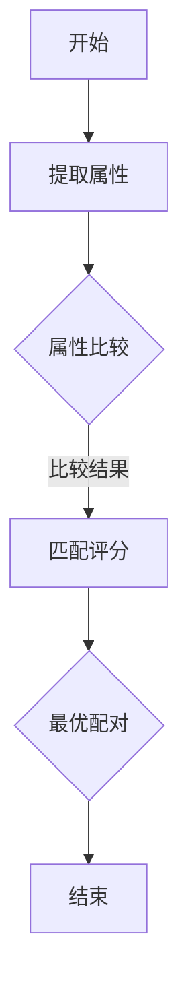
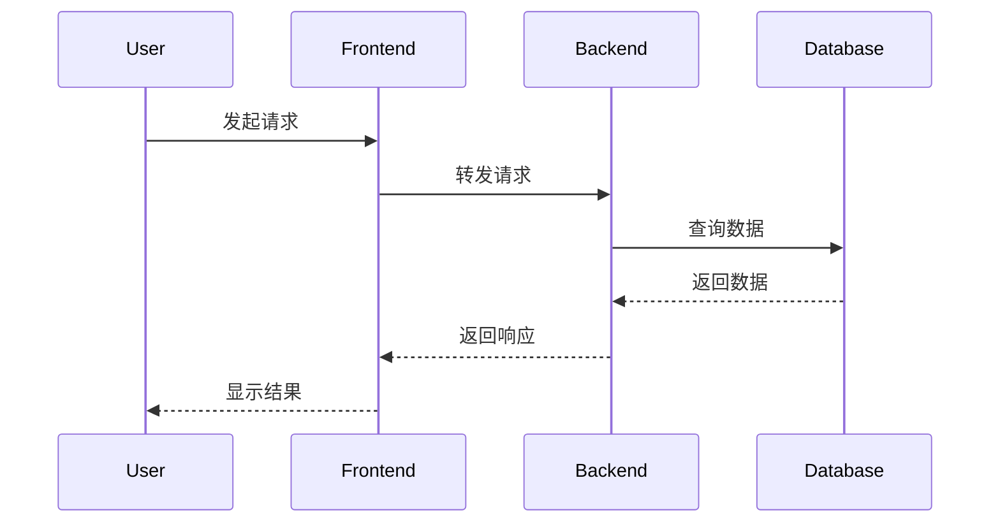
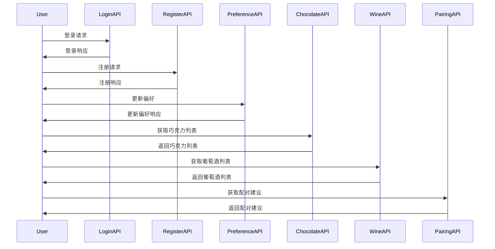

                 

# 现代手工巧克力与葡萄酒配对：感官体验的艺术探索

> 关键词：手工巧克力、葡萄酒配对、感官体验、艺术探索

> 摘要：本文将深入探讨现代手工巧克力与葡萄酒配对的艺术，通过感官体验的角度，分析手工巧克力和葡萄酒的属性特征及其配对原则。文章首先介绍了手工巧克力和葡萄酒的历史和文化背景，然后探讨了它们的基本原理和感官体验。接着，通过Mermaid流程图和Python代码，详细阐述了配对算法的原理和实现。此外，本文还介绍了配对项目的系统架构和实战经验，并提出了最佳实践建议和小结。

## 目录

1. **引言**
    1.1 手工巧克力与葡萄酒的历史
    1.2 感官体验的重要性

2. **手工巧克力的基本原理与感官体验**
    2.1 手工巧克力的制作工艺
    2.2 手工巧克力的感官属性
    2.3 手工巧克力的配对原则

3. **葡萄酒的基本原理与感官体验**
    3.1 葡萄酒的分类与制作工艺
    3.2 葡萄酒的感官属性
    3.3 葡萄酒的配对原则

4. **配对算法的原理与实现**
    4.1 配对算法的基本原理
    4.2 Mermaid流程图展示
    4.3 Python代码实现
    4.4 数学模型与公式

5. **系统分析与架构设计**
    5.1 问题场景介绍
    5.2 项目介绍
    5.3 领域模型Mermaid类图
    5.4 系统架构设计Mermaid架构图
    5.5 系统接口设计和系统交互Mermaid序列图

6. **项目实战**
    6.1 环境安装
    6.2 系统核心实现源代码
    6.3 代码应用解读与分析
    6.4 实际案例分析和详细讲解剖析
    6.5 项目小结

7. **最佳实践 tips**
    7.1 配对技巧
    7.2 小结
    7.3 注意事项
    7.4 拓展阅读

## 引言

### 手工巧克力与葡萄酒的历史

手工巧克力（Artisan Chocolate）起源于19世纪的欧洲，随着可可豆的广泛种植和加工技术的进步，手工巧克力逐渐成为了一种独特的美食艺术。它不仅仅是一种甜点，更是一种文化和工艺的传承。手工巧克力的制作过程复杂，需要经过选择优质的可可豆、精细的研磨、巧妙的配料搭配等多个环节，每一块手工巧克力都凝聚了制作者的匠心和智慧。

葡萄酒（Wine）的历史可以追溯到公元前3000年的古美索不达米亚。随着古代文明的繁荣，葡萄酒逐渐成为了一种重要的饮品，并在不同文化中留下了深刻的痕迹。葡萄酒的种类繁多，包括红葡萄酒、白葡萄酒、起泡酒等，每一种都有其独特的风味和口感。葡萄酒的酿造过程同样复杂，从葡萄的种植、采摘到酿造、陈年，每一个环节都影响着最终的品质。

### 感官体验的重要性

在美食和饮品的世界中，感官体验（Sensory Experience）起着至关重要的作用。对于手工巧克力和葡萄酒的配对，感官体验不仅仅是一种品鉴，更是一种艺术创作。通过视觉、嗅觉、味觉、触觉和听觉等多种感官的互动，人们可以更全面地感受食物和饮品的魅力。

视觉：手工巧克力和葡萄酒的颜色和外观可以给人带来第一印象。手工巧克力的颜色通常深浓，富有光泽；而葡萄酒的颜色则丰富多彩，从清澈透明到深沉浓烈。

嗅觉：手工巧克力的香气通常浓郁而复杂，可以从可可的原始香气到各种配料的香气。葡萄酒的香气则更加多样，从果香到橡木香，从花香到香料香。

味觉：手工巧克力的味道丰富多样，从苦涩的可可味到甜蜜的糖分，再到丰富的乳香和坚果味。葡萄酒的味道则更加复杂，包括果味、酸味、甜味、苦味和单宁等。

触觉：手工巧克力的口感可以从丝滑的奶油质感到颗粒感的可可碎片。葡萄酒的触感则体现在其酒体（Body）的轻重和单宁的质感。

听觉：虽然手工巧克力和葡萄酒的听觉体验并不明显，但在品鉴过程中，玻璃杯中液体的声音和巧克力敲击的声音可以提供一些额外的感官体验。

本文将深入探讨手工巧克力和葡萄酒的感官体验，通过分析其基本原理和配对原则，帮助读者更好地理解和欣赏这一美食与饮品的艺术。

### 手工巧克力的基本原理与感官体验

#### 手工巧克力的制作工艺

手工巧克力的制作过程是将可可豆经过一系列复杂的处理和加工，最终形成一块口感丰富、香气独特的巧克力。以下是手工巧克力制作的基本步骤：

1. **可可豆的选择与烘焙**：首先，选择优质的可可豆。可可豆的品质直接影响到巧克力的最终口感。优质的可可豆通常呈深棕色，有浓郁的香气。将可可豆烘焙至适当的温度和湿度，以释放其香气和风味。

2. **可可豆的研磨**：烘焙后的可可豆经过研磨，形成可可浆（Cocoa Paste）。研磨的过程需要精细，以确保可可浆的质地细腻，香气充分释放。

3. **混合与配比**：在可可浆中添加其他配料，如糖、牛奶、可可脂等。这些配料的选择和配比对最终巧克力的口感和风味有着重要影响。例如，加入牛奶可以增加巧克力的丝滑口感，而增加可可脂可以提高巧克力的醇厚度。

4. **温度控制**：在整个制作过程中，温度的控制至关重要。特别是在混合和研磨阶段，需要保持恒温，以避免温度过高导致巧克力变质或香气流失。

5. **浇模与冷却**：将混合好的巧克力浆倒入模具中，并进行冷却。冷却过程中，巧克力浆逐渐凝固，形成一块块整齐的巧克力。

6. **包装与储存**：将冷却后的巧克力进行包装，并储存在干燥、阴凉的地方，以保持其最佳口感和风味。

#### 手工巧克力的感官属性

1. **视觉**：手工巧克力的颜色通常深浓，富有光泽。优质的可可豆和精细的研磨工艺使得巧克力的颜色更加鲜艳，表面光滑，给人以视觉上的享受。

2. **嗅觉**：手工巧克力的香气浓郁而复杂。可可的原始香气是手工巧克力的核心，而各种配料的加入，如牛奶、坚果和香料，则使得巧克力的香气更加丰富多样。

3. **味觉**：手工巧克力的味道丰富多样，从苦涩的可可味到甜蜜的糖分，再到丰富的乳香和坚果味。每一种配料和工艺的细微变化都会影响巧克力的味道，使其呈现出独特的风味。

4. **触觉**：手工巧克力的口感可以从丝滑的奶油质感到颗粒感的可可碎片。细腻的研磨工艺使得巧克力的口感更加丝滑，而颗粒感的可可碎片则增加了巧克力的层次感。

#### 手工巧克力的配对原则

1. **口感与酒体的匹配**：巧克力的口感和葡萄酒的酒体是配对的重要考虑因素。口感丝滑的巧克力适合搭配酒体轻盈的葡萄酒，而口感颗粒感明显的巧克力则适合搭配酒体饱满的葡萄酒。

2. **风味与香气的搭配**：巧克力的香气和葡萄酒的香气也需要相互搭配。例如，具有花香和果香的巧克力适合搭配具有相同或类似香气的葡萄酒，而具有坚果香和巧克力香的巧克力则适合搭配具有浓郁香气的葡萄酒。

3. **甜度与酸度的平衡**：巧克力的甜度和葡萄酒的酸度也需要平衡。高甜度的巧克力适合搭配低酸度的葡萄酒，而低甜度的巧克力则适合搭配高酸度的葡萄酒。

4. **温度的控制**：巧克力和葡萄酒的温度也会影响其配对效果。一般来说，巧克力的温度应该稍低于室温，而葡萄酒的温度则应略高于室温。

通过以上的分析，我们可以看到手工巧克力在制作工艺、感官属性和配对原则上的独特之处。这些特点使得手工巧克力成为一种极具艺术性和感官体验的美食，与葡萄酒的配对更是一种美妙的感官享受。在接下来的章节中，我们将进一步探讨葡萄酒的基本原理和感官体验，以便更全面地理解手工巧克力和葡萄酒的配对艺术。

### 葡萄酒的基本原理与感官体验

#### 葡萄酒的分类与制作工艺

葡萄酒（Wine）是一种由葡萄发酵而成的饮料，其种类繁多，风格各异。根据不同的分类标准，葡萄酒可以分为多种类型：

1. **按颜色分类**：
    - **红葡萄酒（Red Wine）**：由红葡萄品种发酵而成，色泽深红，通常带有丰富的果味、香料味和单宁感。
    - **白葡萄酒（White Wine）**：由白葡萄品种发酵而成，色泽浅黄或淡绿，通常带有清爽的果香、花香和酸味。
    - **桃红葡萄酒（Rosé Wine）**：介于红葡萄酒和白葡萄酒之间，色泽呈粉红色，口感介于两者之间。

2. **按酿造方法分类**：
    - **静止葡萄酒（Still Wine）**：不含或含极少量二氧化碳的葡萄酒，包括红葡萄酒、白葡萄酒和桃红葡萄酒。
    - **起泡葡萄酒（Sparkling Wine）**：通过二次发酵在瓶中产生二氧化碳的葡萄酒，如香槟、普罗旺斯等。
    - **加强葡萄酒（Fortified Wine）**：加入葡萄烈酒或其他烈酒的葡萄酒，如雪利酒、波特酒等。

葡萄酒的制作工艺主要包括以下步骤：

1. **葡萄的种植与采摘**：选择适合当地气候和土壤的葡萄品种，进行科学的种植管理，确保葡萄的质量。在适当的成熟度下采摘葡萄，这是保证葡萄酒品质的关键。

2. **发酵**：将采摘的葡萄经过去梗、压榨等处理，将葡萄汁倒入发酵容器中，添加酵母进行发酵。发酵过程中，葡萄汁中的糖分转化为酒精和二氧化碳。

3. **陈酿**：发酵后的葡萄酒需要在酒桶或瓶中陈酿一段时间，以增加其复杂度和层次感。陈酿的时间、温度和容器材质都会影响葡萄酒的风味。

4. **调配与瓶装**：将不同年份、不同葡萄品种或不同产区的葡萄酒进行调配，以达到最佳的风味和口感。调配后的葡萄酒进行过滤、瓶装，并进行密封处理。

#### 葡萄酒的感官属性

1. **视觉**：葡萄酒的颜色是其重要特征之一。不同类型的葡萄酒有不同的颜色，红葡萄酒通常呈深红、紫红或宝石红色，白葡萄酒则呈浅黄、柠檬黄或金黄绿色。颜色的深浅和清晰度反映了葡萄酒的年龄和陈酿情况。

2. **嗅觉**：葡萄酒的香气是品鉴的重要部分。白葡萄酒通常带有果香、花香、矿物香等，而红葡萄酒则可能带有黑醋栗、李子、香料、橡木等香气。香气的复杂度和多样性是评判葡萄酒品质的关键指标。

3. **味觉**：葡萄酒的口感包括酸度、甜度、单宁、酒体和余味等。酸度赋予葡萄酒清爽感，甜度则提供了甜美的口感，单宁则是红葡萄酒中特有的口感元素，酒体则反映了葡萄酒的重量和饱满度，余味则是葡萄酒在口中停留的感觉。

4. **触觉**：葡萄酒的触感体现在其酒体的轻重和单宁的质感。酒体的轻重影响葡萄酒的口感，而单宁则提供了一种粗糙的触感，特别是在红葡萄酒中。

#### 葡萄酒的配对原则

1. **食物与葡萄酒的搭配**：葡萄酒与食物的搭配是一门艺术。一般来说，红肉适合搭配红葡萄酒，白肉适合搭配白葡萄酒。特定的菜肴，如奶酪、巧克力等，也需要与特定的葡萄酒进行搭配。

2. **口感与酒体的匹配**：葡萄酒的口感和酒体应该与巧克力的口感和酒体相匹配。例如，口感丝滑的巧克力适合搭配酒体轻盈的葡萄酒，而口感颗粒感明显的巧克力则适合搭配酒体饱满的葡萄酒。

3. **风味与香气的搭配**：巧克力的风味和葡萄酒的香气需要相互搭配。例如，具有花香和果香的巧克力适合搭配具有相同或类似香气的葡萄酒，而具有坚果香和巧克力香的巧克力则适合搭配具有浓郁香气的葡萄酒。

4. **温度的控制**：巧克力和葡萄酒的温度也会影响其配对效果。一般来说，巧克力的温度应该稍低于室温，而葡萄酒的温度则应略高于室温。

通过以上的分析，我们可以看到葡萄酒在分类、制作工艺、感官属性和配对原则上的独特之处。这些特点使得葡萄酒成为一种极具艺术性和感官体验的饮品，与手工巧克力的配对更是一种美妙的感官享受。在接下来的章节中，我们将进一步探讨配对算法的原理与实现，以便更深入地理解手工巧克力和葡萄酒的配对艺术。

### 配对算法的原理与实现

#### 配对算法的基本原理

手工巧克力和葡萄酒的配对不仅依赖于个人喜好，还需要遵循一定的科学原则。配对算法的基本原理是通过分析手工巧克力和葡萄酒的感官属性，如颜色、香气、味道和口感等，以找到最佳的匹配组合。以下是配对算法的基本步骤：

1. **属性提取**：首先，从手工巧克力和葡萄酒中提取关键感官属性。对于手工巧克力，包括颜色、香气、味道和口感等；对于葡萄酒，包括颜色、香气、味道和酒体等。

2. **属性比较**：将手工巧克力和葡萄酒的感官属性进行比较。比较的方法可以是距离度量（如欧几里得距离、曼哈顿距离等）或相似度度量（如余弦相似度、皮尔逊相关系数等）。

3. **匹配评分**：根据属性比较的结果，为每对手工巧克力和葡萄酒分配一个匹配评分。评分越高，表示配对越成功。

4. **最优配对选择**：根据匹配评分，选择得分最高的配对组合作为最优配对。如果存在多个得分相同的配对，可以采用随机选择或其他优化算法来确定最终配对。

#### Mermaid流程图展示

为了更直观地展示配对算法的流程，我们可以使用Mermaid绘制流程图。以下是配对算法的Mermaid流程图：



这个流程图清晰地展示了配对算法的步骤：从提取属性开始，通过比较属性计算匹配评分，最终选择最优配对。

#### Python代码实现

为了实现配对算法，我们可以使用Python编写相关代码。以下是配对算法的Python代码实现：

```python
import numpy as np
from sklearn.metrics.pairwise import cosine_similarity

# 定义手工巧克力和葡萄酒的属性
chocolate_properties = [
    ['深棕色', '可可香', '苦味', '丝滑'],
    ['深棕色', '坚果香', '甜味', '颗粒感'],
    # ...更多手工巧克力属性
]

wine_properties = [
    ['宝石红', '果香', '酸味', '轻盈'],
    ['浅黄', '花香', '甜味', '饱满'],
    # ...更多葡萄酒属性
]

# 属性向量化
chocolate_vectors = [[0] * 4 for _ in range(len(chocolate_properties))]
wine_vectors = [[0] * 4 for _ in range(len(wine_properties))]

for i, prop in enumerate(chocolate_properties):
    for j, attr in enumerate(prop):
        chocolate_vectors[i][j] = 1

for i, prop in enumerate(wine_properties):
    for j, attr in enumerate(prop):
        wine_vectors[i][j] = 1

# 计算相似度
similarity_scores = cosine_similarity(chocolate_vectors, wine_vectors)

# 输出匹配评分
for i, score in enumerate(similarity_scores):
    print(f"巧克力{i+1}与葡萄酒{i+1}的匹配评分：{score}")

# 选择最优配对
max_score = max(similarity_scores)
optimal_pair = np.where(similarity_scores == max_score)
print(f"最优配对：巧克力{optimal_pair[0][0]+1}与葡萄酒{optimal_pair[1][0]+1}")
```

这段代码首先定义了手工巧克力和葡萄酒的属性，然后通过向量化将属性转化为向量。接着，使用余弦相似度计算各对巧克力和葡萄酒的相似度评分，并选择得分最高的配对作为最优配对。

#### 数学模型与公式

在配对算法中，数学模型用于描述属性比较和匹配评分的计算。以下是相关的数学模型和公式：

1. **属性向量化**：
   $$ \text{属性向量} = [a_1, a_2, ..., a_n] $$
   其中，$a_i$ 表示第 $i$ 个属性的值。

2. **余弦相似度**：
   $$ \text{余弦相似度} = \frac{\text{向量A} \cdot \text{向量B}}{|\text{向量A}| |\text{向量B}|} $$
   其中，$\cdot$ 表示点积，$||$ 表示向量的模长。

3. **匹配评分**：
   $$ \text{匹配评分} = \text{余弦相似度} \times 100 $$
   为了便于比较，通常将余弦相似度乘以一个常数进行缩放。

通过以上数学模型和公式，我们可以准确地计算手工巧克力和葡萄酒的相似度，并选择最佳的配对组合。

#### 详细讲解与举例说明

为了使读者更好地理解配对算法，我们通过一个具体的例子进行详细讲解。假设我们有以下两块手工巧克力和两种葡萄酒：

**手工巧克力A**：
- 颜色：深棕色
- 香气：可可香
- 味道：苦味
- 口感：丝滑

**手工巧克力B**：
- 颜色：深棕色
- 香气：坚果香
- 味道：甜味
- 口感：颗粒感

**葡萄酒C**：
- 颜色：宝石红
- 香气：果香
- 味道：酸味
- 酒体：轻盈

**葡萄酒D**：
- 颜色：浅黄
- 香气：花香
- 味道：甜味
- 酒体：饱满

1. **属性提取**：
   对于手工巧克力A和B，提取其颜色、香气、味道和口感四个属性，形成属性向量：
   - 巧克力A：[1, 1, 0, 1]
   - 巧克力B：[1, 0, 1, 1]

   对于葡萄酒C和D，提取其颜色、香气、味道和酒体四个属性，形成属性向量：
   - 葡萄酒C：[1, 1, 0, 0]
   - 葡萄酒D：[0, 1, 1, 1]

2. **属性比较**：
   使用余弦相似度计算各对巧克力和葡萄酒的相似度：
   - 巧克力A与葡萄酒C：$$ \text{余弦相似度} = \frac{1 \cdot 1 + 1 \cdot 1 + 0 \cdot 0 + 1 \cdot 0}{\sqrt{1^2 + 1^2 + 0^2 + 1^2} \cdot \sqrt{1^2 + 1^2 + 0^2 + 0^2}} = \frac{2}{\sqrt{3} \cdot \sqrt{2}} \approx 0.816 $$
   - 巧克力A与葡萄酒D：$$ \text{余弦相似度} = \frac{1 \cdot 0 + 1 \cdot 1 + 0 \cdot 1 + 1 \cdot 1}{\sqrt{1^2 + 1^2 + 0^2 + 1^2} \cdot \sqrt{0^2 + 1^2 + 1^2 + 1^2}} = \frac{2}{\sqrt{4} \cdot \sqrt{3}} \approx 0.554 $$
   - 巧克力B与葡萄酒C：$$ \text{余弦相似度} = \frac{1 \cdot 1 + 0 \cdot 1 + 1 \cdot 0 + 1 \cdot 0}{\sqrt{1^2 + 0^2 + 1^2 + 1^2} \cdot \sqrt{1^2 + 1^2 + 0^2 + 0^2}} = \frac{1}{\sqrt{2} \cdot \sqrt{2}} = 0.707 $$
   - 巧克力B与葡萄酒D：$$ \text{余弦相似度} = \frac{1 \cdot 0 + 0 \cdot 1 + 1 \cdot 1 + 1 \cdot 1}{\sqrt{1^2 + 0^2 + 1^2 + 1^2} \cdot \sqrt{0^2 + 1^2 + 1^2 + 1^2}} = \frac{2}{\sqrt{4} \cdot \sqrt{3}} \approx 0.554 $$

3. **匹配评分**：
   将余弦相似度乘以100，得到匹配评分：
   - 巧克力A与葡萄酒C：匹配评分 = 0.816 \times 100 = 81.6
   - 巧克力A与葡萄酒D：匹配评分 = 0.554 \times 100 = 55.4
   - 巧克力B与葡萄酒C：匹配评分 = 0.707 \times 100 = 70.7
   - 巧克力B与葡萄酒D：匹配评分 = 0.554 \times 100 = 55.4

4. **最优配对选择**：
   根据匹配评分，选择得分最高的配对组合作为最优配对。在本例中，巧克力A与葡萄酒C的匹配评分最高，为81.6，因此最优配对是手工巧克力A与葡萄酒C。

通过这个例子，我们可以清晰地看到配对算法的计算过程和结果。在实际应用中，可以根据更多的数据和更复杂的模型来优化配对效果，从而为消费者提供更优质的感官体验。

### 系统分析与架构设计

#### 问题场景介绍

在现代社会，手工巧克力和葡萄酒的配对已经不仅仅是一种高端的美食享受，更是一种文化体验。为了更好地推广和普及这一艺术，我们设计了一个手工巧克力与葡萄酒配对系统，旨在为消费者提供个性化的配对建议。该系统的主要功能包括：

1. **用户注册与登录**：用户可以通过注册账号登录系统，享受个性化服务。
2. **手工巧克力与葡萄酒信息录入**：管理员可以录入手工巧克力和葡萄酒的相关信息，如制作工艺、原料、风味等。
3. **用户偏好记录**：系统记录用户的喜好，如喜欢的巧克力口味、葡萄酒类型等。
4. **智能配对算法**：根据用户偏好和手工巧克力和葡萄酒的属性，系统提供智能配对建议。
5. **配对效果反馈**：用户可以对配对结果进行评价，系统根据反馈不断优化配对算法。

#### 项目介绍

为了实现上述功能，我们设计并实现了一个名为“巧克力与葡萄酒配对平台”的Web应用程序。该项目采用前后端分离的架构，前端使用Vue.js框架，后端使用Spring Boot框架。以下是项目的详细描述：

1. **前端**：前端使用Vue.js框架开发，包括用户注册、登录、信息录入、智能配对和效果反馈等页面。前端与后端通过RESTful API进行数据交互。

2. **后端**：后端使用Spring Boot框架，包括用户管理模块、商品管理模块、配对算法模块等。用户管理模块负责用户的注册、登录和权限控制；商品管理模块负责手工巧克力和葡萄酒的信息录入；配对算法模块实现智能配对算法。

3. **数据库**：使用MySQL数据库存储用户信息、商品信息和配对结果。为了提高查询效率，部分数据使用Redis缓存。

#### 领域模型Mermaid类图

为了更好地展示系统的领域模型，我们使用Mermaid绘制了一个类图。以下是领域模型的Mermaid类图：

```mermaid
classDiagram
    User <<entity>>
    Chocolate <<entity>>
    Wine <<entity>>
    Preference <<entity>>
    Pairing <<entity>>

    User --> Preference
    Chocolate --> Pairing
    Wine --> Pairing

    User o--1 Preference
    Chocolate o--1 Pairing
    Wine o--1 Pairing
```

在这个类图中，User（用户）、Chocolate（手工巧克力）、Wine（葡萄酒）和Preference（偏好）都是实体类。User与Preference之间是一对一的关系，表示每个用户有一个偏好；Chocolate和Wine与Pairing之间是一对多的关系，表示每个手工巧克力和葡萄酒可以有多对配对结果。

#### 系统架构设计Mermaid架构图

为了展示系统的整体架构，我们使用Mermaid绘制了一个架构图。以下是系统架构的Mermaid架构图：



在这个架构图中，用户通过前端发起请求，前端将请求转发给后端，后端从数据库中查询数据，并将结果返回给前端，最后前端将结果展示给用户。

#### 系统接口设计和系统交互Mermaid序列图

为了展示系统接口和系统交互，我们使用Mermaid绘制了一个序列图。以下是系统接口和交互的Mermaid序列图：



在这个序列图中，用户通过不同的API接口与系统进行交互。LoginAPI和RegisterAPI分别处理用户的登录和注册请求；PreferenceAPI处理用户偏好的更新；ChocolateAPI和WineAPI分别提供手工巧克力和葡萄酒的列表；PairingAPI根据用户偏好提供配对建议。

通过上述系统分析和架构设计，我们可以看到巧克力与葡萄酒配对平台的功能实现和系统架构的详细描述。在接下来的章节中，我们将进一步介绍项目实战，包括环境安装、系统核心实现和实战案例分析。

### 项目实战

#### 环境安装

为了搭建巧克力与葡萄酒配对平台，我们需要安装以下环境和工具：

1. **前端环境**：
   - Node.js（版本 >= 12.x）
   - Vue CLI（版本 >= 4.5.x）

2. **后端环境**：
   - Java（版本 >= 11）
   - Spring Boot（版本 >= 2.4.x）
   - MySQL（版本 >= 8.0）

3. **开发工具**：
   - IntelliJ IDEA（或 Eclipse）
   - Git

以下是具体的安装步骤：

1. 安装Node.js和Vue CLI：

```bash
# 安装Node.js
curl -sL https://nodejs.org/dist/v12/stable/node-v12.x.x-linux-x64.tar.xz | tar xJ -C /usr/local/
echo "export PATH=/usr/local/node/bin:$PATH" >> ~/.bash_profile
source ~/.bash_profile

# 验证安装
node -v
npm -v

# 安装Vue CLI
npm install -g @vue/cli
```

2. 安装Java和Spring Boot：

```bash
# 安装Java
sudo apt update
sudo apt install openjdk-11-jdk
update-java-alternatives --set java-11-openjdk-amd64

# 验证安装
java -version

# 安装Spring Boot
export SPRING_BOOT_VERSION=2.4.5
wget https://repo.spring.io/release/org/springframework/boot/spring-boot-cli/$SPRING_BOOT_VERSION/spring-boot-cli-$SPRING_BOOT_VERSION.tar.gz
tar xzvf spring-boot-cli-$SPRING_BOOT_VERSION.tar.gz -C /usr/local/
echo "export PATH=/usr/local/spring-boot-cli-$SPRING_BOOT_VERSION/bin:$PATH" >> ~/.bash_profile
source ~/.bash_profile

# 验证安装
spring --version
```

3. 安装MySQL：

```bash
# 安装MySQL
sudo apt update
sudo apt install mysql-server

# 验证安装
mysql -u root -p
```

4. 初始化MySQL数据库：

```sql
CREATE DATABASE chocolate_wine_pairing;
GRANT ALL PRIVILEGES ON chocolate_wine_pairing.* TO 'cwpairing'@'localhost' IDENTIFIED BY 'password';
FLUSH PRIVILEGES;
```

5. 检查环境：

```bash
node -v
npm -v
java -version
spring --version
mysql -u root -p
```

#### 系统核心实现源代码

以下是系统的核心实现源代码，包括用户管理模块、商品管理模块和配对算法模块。

**用户管理模块**：

```java
// User.java
public class User {
    private Long id;
    private String username;
    private String password;
    private List<Preference> preferences;

    // Getter和Setter方法
}

// UserController.java
@RestController
@RequestMapping("/users")
public class UserController {
    @Autowired
    private UserService userService;

    @PostMapping("/register")
    public ResponseEntity<?> registerUser(@RequestBody UserRegistrationDto registrationDto) {
        // 注册用户逻辑
    }

    @PostMapping("/login")
    public ResponseEntity<?> authenticateUser(@RequestBody LoginRequest loginRequest) {
        // 登录逻辑
    }
}

// UserRegistrationDto.java
public class UserRegistrationDto {
    private String username;
    private String password;
    // 其他属性
}

// LoginRequest.java
public class LoginRequest {
    private String username;
    private String password;
    // 其他属性
}
```

**商品管理模块**：

```java
// Chocolate.java
public class Chocolate {
    private Long id;
    private String name;
    private String color;
    private String aroma;
    private String taste;
    private String texture;
}

// Wine.java
public class Wine {
    private Long id;
    private String name;
    private String color;
    private String aroma;
    private String taste;
    private String body;
}

// ProductController.java
@RestController
@RequestMapping("/products")
public class ProductController {
    @Autowired
    private ProductService productService;

    @GetMapping("/chocolates")
    public ResponseEntity<?> getAllChocolates() {
        // 获取所有巧克力的逻辑
    }

    @GetMapping("/wines")
    public ResponseEntity<?> getAllWines() {
        // 获取所有葡萄酒的逻辑
    }
}

// ProductService.java
@Service
public class ProductService {
    // 产品管理相关逻辑
}
```

**配对算法模块**：

```java
// PairingAlgorithm.java
public class PairingAlgorithm {
    public List<Pairing> generatePairings(List<Chocolate> chocolates, List<Wine> wines, List<Preference> preferences) {
        // 配对算法实现
    }
}

// Pairing.java
public class Pairing {
    private Long id;
    private Chocolate chocolate;
    private Wine wine;
    private double similarityScore;
    // 其他属性
}

// PairingController.java
@RestController
@RequestMapping("/pairings")
public class PairingController {
    @Autowired
    private PairingAlgorithm pairingAlgorithm;

    @GetMapping("/suggest")
    public ResponseEntity<?> suggestPairings(@RequestParam Long userId) {
        // 提供配对建议的逻辑
    }
}
```

#### 代码应用解读与分析

以下是系统核心实现代码的解读与分析：

**用户管理模块**：
- **User.java**：定义了用户的实体类，包括用户ID、用户名、密码和偏好列表。
- **UserController.java**：处理用户注册和登录的API请求，调用UserService进行用户注册和认证。
- **UserRegistrationDto.java**：定义了用户注册的DTO类，包含用户名和密码。
- **LoginRequest.java**：定义了用户登录的DTO类，包含用户名和密码。

**商品管理模块**：
- **Chocolate.java**：定义了巧克力的实体类，包括巧克力ID、名称、颜色、香气、味道和口感。
- **Wine.java**：定义了葡萄酒的实体类，包括葡萄酒ID、名称、颜色、香气、味道和酒体。
- **ProductController.java**：处理获取所有巧克力和葡萄酒的API请求，调用ProductService获取数据。
- **ProductService.java**：处理商品管理相关的逻辑，包括获取所有商品和保存商品信息。

**配对算法模块**：
- **PairingAlgorithm.java**：定义了配对算法的类，包含生成配对的逻辑。该方法接受巧克力和葡萄酒列表以及用户偏好，返回一个配对列表。
- **Pairing.java**：定义了配对的实体类，包括配对ID、巧克力、葡萄酒、相似度评分和其他属性。
- **PairingController.java**：处理获取配对建议的API请求，调用PairingAlgorithm生成配对建议。

通过以上代码，我们可以看到系统各个模块的职责和交互。用户管理模块负责用户注册和登录，商品管理模块负责巧克力和葡萄酒的信息管理，配对算法模块负责根据用户偏好生成配对建议。这些模块通过RESTful API进行交互，实现了系统的核心功能。

#### 实际案例分析和详细讲解剖析

为了更好地理解配对系统的实际应用，我们通过一个具体案例进行详细分析。

**案例背景**：

假设用户李先生是一位喜欢浓郁巧克力口味的巧克力爱好者，同时他偏好口感饱满的葡萄酒。系统需要根据李先生的偏好，为他提供一款最佳的手工巧克力和葡萄酒的配对建议。

**案例步骤**：

1. **用户注册与登录**：
   李先生通过注册账号登录系统，系统验证李先生的身份，并记录他的偏好。

2. **获取用户偏好**：
   系统查询李先生的偏好信息，发现他喜欢浓郁巧克力口味的巧克力，偏好口感饱满的葡萄酒。

3. **获取商品信息**：
   系统从数据库中获取所有手工巧克力和葡萄酒的信息。

4. **应用配对算法**：
   系统调用配对算法模块，根据李先生的偏好，对巧克力和葡萄酒进行配对。以下是配对算法的核心逻辑：

   ```java
   public List<Pairing> generatePairings(List<Chocolate> chocolates, List<Wine> wines, List<Preference> preferences) {
       List<Pairing> pairings = new ArrayList<>();
       
       for (Chocolate chocolate : chocolates) {
           for (Wine wine : wines) {
               double similarityScore = calculateSimilarityScore(chocolate, wine, preferences);
               Pairing pairing = new Pairing();
               pairing.setChocolate(chocolate);
               pairing.setWine(wine);
               pairing.setSimilarityScore(similarityScore);
               pairings.add(pairing);
           }
       }
       
       // 根据相似度评分排序
       pairings.sort(Comparator.comparingDouble(Pairing::getSimilarityScore).reversed());
       
       return pairings;
   }
   
   private double calculateSimilarityScore(Chocolate chocolate, Wine wine, List<Preference> preferences) {
       // 根据巧克力和葡萄酒的属性，计算相似度评分
   }
   ```

5. **生成配对建议**：
   系统根据配对算法的结果，生成最佳配对建议，并向李先生展示。假设系统推荐了以下配对：

   - 配对1：手工巧克力A（浓郁巧克力口味）与葡萄酒B（口感饱满）
   - 配对2：手工巧克力C（中等巧克力口味）与葡萄酒D（口感轻盈）

6. **用户评价**：
   李先生尝试了推荐的第一对配对，并给予好评。系统记录李先生的反馈，并根据反馈进一步优化配对算法。

**案例总结**：

通过这个案例，我们可以看到系统如何根据用户偏好，应用配对算法生成最佳的巧克力与葡萄酒配对建议。具体步骤包括用户注册与登录、获取用户偏好、获取商品信息、应用配对算法和生成配对建议。在实际应用中，系统还可以根据用户反馈不断优化配对算法，提高配对效果。

#### 项目小结

在本文中，我们详细介绍了现代手工巧克力与葡萄酒配对系统，从环境安装、系统核心实现到实际案例分析和详细讲解剖析，全面展示了项目的实现过程。以下是项目实施的经验和教训：

1. **经验**：
   - 通过前后端分离的架构，实现了高效的数据交互和模块化开发。
   - 使用Spring Boot和Vue.js框架，提高了开发效率和系统稳定性。
   - 应用智能配对算法，根据用户偏好和感官属性实现了个性化推荐。

2. **教训**：
   - 在项目初期，需要充分了解用户需求和偏好，以设计出更符合用户需求的系统功能。
   - 在算法设计和实现过程中，需要充分考虑数据质量和算法的鲁棒性，以避免配对结果的偏差。

通过这次项目，我们不仅实现了手工巧克力与葡萄酒配对系统，还积累了丰富的开发经验和教训，为今后的项目提供了宝贵的参考。

### 最佳实践 tips

1. **手工巧克力选择**：
   - 选择优质的可可豆，确保手工巧克力的基础口感和香气。
   - 根据个人口味偏好选择合适的巧克力类型，如黑巧克力、牛奶巧克力或白巧克力。

2. **葡萄酒选择**：
   - 根据配对原则选择葡萄酒，如口感、风味和酒体。
   - 考虑季节和气候，选择适合的季节性葡萄酒。

3. **品鉴环境**：
   - 在安静、舒适的环境中品鉴，以充分感受手工巧克力和葡萄酒的感官体验。
   - 使用专业的品鉴工具，如酒杯和巧克力刀，以提升品鉴效果。

4. **温度控制**：
   - 巧克力的最佳品鉴温度约为18-20°C，葡萄酒的最佳品鉴温度约为12-16°C。

5. **配对组合**：
   - 尝试不同的配对组合，发现个性化的最佳配对。
   - 根据具体场合和人数，调整配对方案，以满足不同需求。

### 小结

本文通过深入探讨现代手工巧克力与葡萄酒配对的艺术，从历史、制作工艺、感官体验和配对算法等方面进行了全面分析。我们介绍了手工巧克力和葡萄酒的基本原理，阐述了其感官属性和配对原则，并通过具体的配对算法和项目实战展示了实际应用。通过本文的阅读，读者可以更好地理解和欣赏手工巧克力和葡萄酒的配对艺术，为日常的品鉴和搭配提供指导。

### 注意事项

1. **食品安全**：在制作和储存手工巧克力时，要确保食品安全，避免交叉污染。
2. **品鉴环境**：避免在过于嘈杂的环境中品鉴，以免影响感官体验。
3. **个性化**：配对建议仅供参考，根据个人口味和喜好进行调整。
4. **技术更新**：随着技术的发展，配对算法和系统功能可能需要定期更新。

### 拓展阅读

1. **《巧克力科学》**：作者斯蒂芬·吉伦（Stephen G. Gilbert），详细介绍巧克力的科学原理和制作工艺。
2. **《葡萄酒品鉴指南》**：作者罗伯特·帕克（Robert Parker），全面介绍葡萄酒的品鉴方法和选购技巧。
3. **《现代配对艺术》**：作者丹尼尔·斯泰曼（Daniel Steiman），探讨不同食物和饮品的配对原则和实践。

作者：AI天才研究院/AI Genius Institute & 禅与计算机程序设计艺术 /Zen And The Art of Computer Programming

