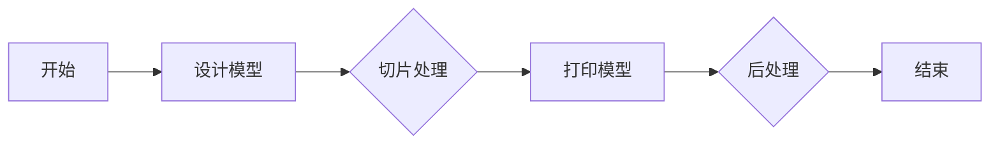
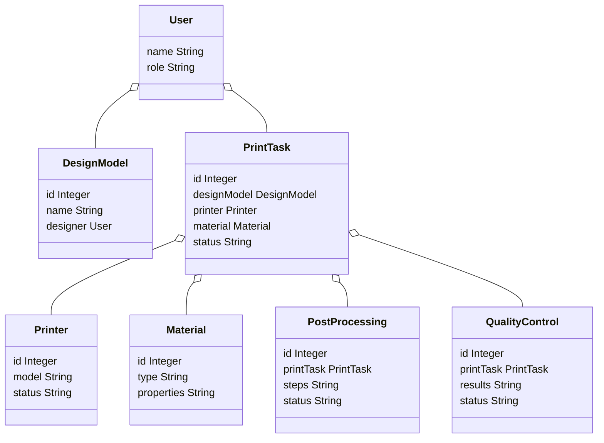
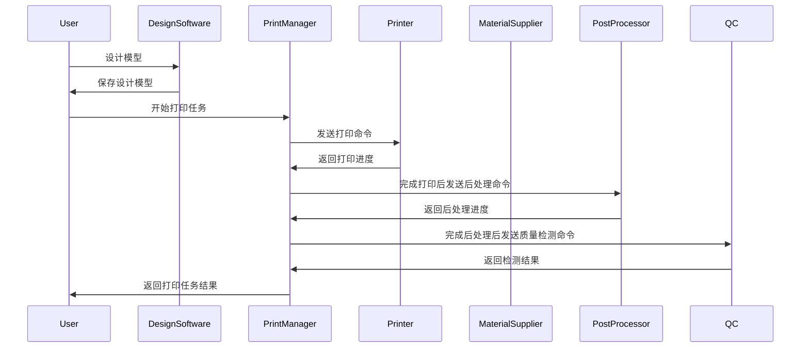
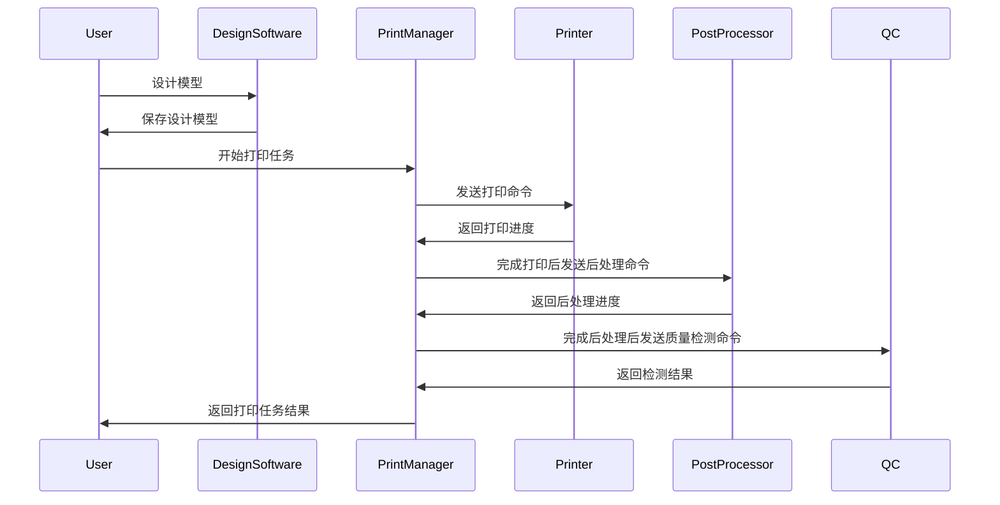
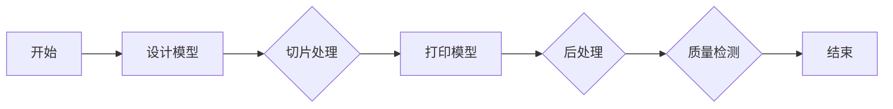

                 

### 第1章：引言——木工3D打印技术的崛起

#### 1.1 问题背景与需求

木材作为一种古老而传统的建筑材料和家具制作材料，在人类历史上扮演着重要角色。然而，随着现代社会的发展，人们对木材的需求不断增长，传统的手工木工工艺在效率、质量和成本控制方面逐渐暴露出诸多不足。

首先，传统手工木工工艺在制作复杂结构和定制化产品时，效率低下。手工制作需要大量的人力和时间，且生产流程繁琐，难以实现快速响应市场变化。其次，成本高也是一个突出问题。定制化产品的成本往往较高，且难以实现大批量生产，导致产品价格居高不下。此外，传统工艺在质量控制上也存在一定困难，产品精度难以保证，容易出现误差，影响产品的使用体验。

为了解决这些问题，木工行业亟需引入一种能够提高生产效率、降低成本、提高产品质量的新兴技术。3D打印技术的出现为木工行业带来了新的契机。3D打印技术以其高效、定制化和精确的特性，为传统木工工艺提供了有力的补充和提升。通过将传统工艺与现代技术相结合，可以实现生产方式的创新和升级，推动木工行业向更高效、更灵活、更环保的方向发展。

#### 1.2 问题描述

在木工行业引入3D打印技术，旨在解决以下问题：

- **生产效率**：如何通过3D打印技术提高木工生产的效率，实现快速生产？
- **定制化**：如何利用3D打印技术实现定制化生产，满足个性化和多样化需求？
- **质量**：如何通过3D打印技术提高木制品的精度和质量，减少误差和缺陷？
- **成本**：如何通过3D打印技术降低生产成本，实现高效大批量生产？

#### 1.3 问题解决

为了解决上述问题，本书将从以下几个方面展开讨论：

- **原理介绍**：系统介绍木工3D打印技术的原理和关键技术，包括3D建模、打印设备、打印材料等。
- **应用分析**：分析传统木工工艺与现代3D打印技术的差异与互补性，探讨其在不同应用场景中的优势和挑战。
- **实际案例**：提供实际案例，展示木工3D打印技术在家具制作、建筑模型、教育等领域中的应用效果。
- **发展趋势**：分析木工3D打印技术的发展趋势和未来展望，探讨其在木工行业中的广泛应用前景。

#### 1.4 边界与外延

木工3D打印技术不仅限于家具制作，还可以应用于建筑、艺术、教育等多个领域。同时，随着技术的不断发展，木工3D打印技术的应用范围将进一步扩大。例如，在建筑设计中，可以用于制作复杂的建筑模型和个性化装饰；在艺术创作中，可以用于制作独特的艺术装置和雕塑；在教育领域，可以用于制作教学模型和互动学习工具等。

#### 1.5 概念结构与核心要素组成

木工3D打印技术主要包括以下几个核心要素：

- **3D打印机**：用于将数字化的设计模型逐层打印出来，形成三维的木制品。
- **3D建模软件**：用于设计和优化木制品模型，将三维模型转化为可以指导打印机打印的切片文件。
- **传统木工工艺**：用于后期加工和组装3D打印产品，如切割、打磨、组装等。
- **3D打印材料**：如木材、木质复合材料等，用于打印出木制品的各个部分。

#### 1.6 本章小结

本章介绍了木工3D打印技术的崛起背景、问题、解决方法以及边界与外延。在后续章节中，我们将深入探讨木工3D打印技术的核心概念、原理、应用领域和发展趋势。

## 第2章：木工3D打印技术概述

### 2.1 木工3D打印技术的原理

木工3D打印技术利用计算机控制的3D打印机，将数字化的设计模型逐层打印出来，形成三维的木制品。其基本原理包括以下几个关键步骤：

#### 2.1.1 数据输入

首先，设计师使用3D建模软件（如AutoCAD、SketchUp、SolidWorks等）设计出木制品的三维模型。这些软件提供了丰富的建模工具和功能，可以方便地创建各种复杂的几何形状和结构。

#### 2.1.2 切片处理

接下来，将设计好的三维模型导入到切片软件中，如Cura、Simplify3D等。切片软件将三维模型分解为多个二维切片，每个切片代表打印过程中需要逐层堆积的截面。切片文件包含了详细的打印参数，如打印速度、层厚、填充方式等。

#### 2.1.3 打印过程

3D打印机根据切片文件开始打印。打印过程中，打印机会逐层堆积材料，每一层都对应切片文件中的一个截面。常见的打印方式有熔融沉积成型（FDM）、立体光固化（SLA）、选择性激光熔化（SLM）等。

- **熔融沉积成型（FDM）**：这是最常见的3D打印技术之一，通过加热熔化打印材料，然后挤出并堆积成三维形状。
- **立体光固化（SLA）**：使用紫外激光照射光敏树脂，使其固化成三维形状。
- **选择性激光熔化（SLM）**：使用激光熔化粉末材料，逐层堆积成三维形状。

#### 2.1.4 后处理

打印完成后，需要对产品进行后处理，如切割、打磨、涂漆等，以去除支撑结构、改善表面质量和外观。

### 2.2 木工3D打印技术的关键技术

木工3D打印技术涉及多个关键环节，主要包括以下几个方面：

#### 2.2.1 3D打印机

3D打印机是木工3D打印技术的核心设备，其性能直接影响打印质量和效率。不同类型的3D打印机适用于不同的木材类型和打印要求，常见的有桌面型打印机、工业级打印机等。

- **桌面型打印机**：体积较小，适合个人或小型工作室使用，适合打印小型、简单的木制品。
- **工业级打印机**：体积较大，打印速度和精度更高，适合大批量生产、复杂结构的木制品。

#### 2.2.2 打印材料

木工3D打印常用的材料包括木材、木质复合材料、树脂等。每种材料都有其独特的性能和应用场景。

- **木材**：如木粉、木质颗粒等，常用于打印家具、装饰品等。
- **木质复合材料**：如木塑复合材料（WPC）、纤维板等，具有较好的机械性能和耐久性，适合制作户外家具、建筑材料等。
- **树脂**：如光敏树脂、环氧树脂等，常用于打印精细的零部件和艺术作品。

#### 2.2.3 3D建模软件

3D建模软件在木工3D打印过程中起着至关重要的作用。通过3D建模软件，设计师可以创建出复杂的三维模型，并将这些模型转化为适合打印的切片文件。

- **AutoCAD**：主要用于二维绘图和三维建模，功能强大，适用于复杂结构的木制品设计。
- **SketchUp**：界面简单，易于上手，适合快速创建和修改三维模型。
- **SolidWorks**：功能全面，适用于各种复杂的三维建模和工程分析。

### 2.3 木工3D打印技术的应用范围

木工3D打印技术的应用范围非常广泛，涵盖了家具制作、建筑模型、教育、艺术等多个领域。

#### 2.3.1 家具制作

木工3D打印技术在家具制作中的应用非常广泛，可以实现定制化、复杂结构和高效生产。例如，通过3D打印技术，可以轻松制作出传统工艺难以实现的复杂家具结构，如弯曲的桌面、流线型的椅子等。

#### 2.3.2 建筑模型

在建筑设计中，木工3D打印技术可以用于快速制作建筑模型，用于方案展示、功能测试等。通过3D打印技术，可以快速、高效地制作出各种尺寸和结构的建筑模型，大大缩短了设计周期。

#### 2.3.3 教育

木工3D打印技术在教育领域中的应用也非常广泛，可以用于教学模型、互动学习工具等。例如，通过3D打印技术，可以制作出各种教学模型，帮助学生更好地理解抽象的数学和科学概念。

#### 2.3.4 艺术

木工3D打印技术在艺术创作中的应用同样具有广阔的前景。通过3D打印技术，艺术家可以制作出独特的艺术装置和雕塑，实现传统工艺难以实现的创意和想法。

### 2.4 木工3D打印技术的优势

与传统木工工艺相比，木工3D打印技术具有以下显著优势：

- **高效性**：3D打印技术实现了自动化生产，大大提高了生产效率。
- **定制化**：3D打印技术可以根据个性化需求进行定制生产，满足各种复杂结构的设计需求。
- **精确性**：3D打印技术保证了产品的精度和一致性，减少了误差和缺陷。
- **环保性**：3D打印技术可以实现材料的最优化利用，减少浪费，降低生产成本。

### 2.5 木工3D打印技术的挑战与机遇

尽管木工3D打印技术具有显著优势，但在实际应用中仍面临一些挑战：

- **材料性能**：当前木工3D打印材料的性能和种类仍需进一步提升，以满足各种复杂应用场景的需求。
- **打印速度**：打印速度较慢，限制了大批量生产的能力。
- **成本控制**：3D打印设备的成本较高，影响了其大规模推广和应用。

然而，随着技术的不断进步，这些挑战也将逐步得到解决，木工3D打印技术将迎来更大的发展机遇。

### 2.6 本章小结

本章对木工3D打印技术进行了概述，包括其原理、关键技术、应用范围、优势以及面临的挑战和机遇。通过本章的学习，读者可以全面了解木工3D打印技术的基本概念和应用前景。在后续章节中，我们将进一步探讨木工3D打印技术在不同领域中的应用和实践。

## 第3章：传统木工工艺与3D打印技术的融合

### 3.1 传统木工工艺的局限性

传统木工工艺在制作复杂结构和定制化产品时，存在以下局限性：

#### 3.1.1 生产效率低

手工木工工艺依赖人工操作，生产效率较低。从原材料的切割、打磨到组装，每一步都需要大量的人力和时间。这使得传统工艺在应对快速变化的市场需求时显得力不从心，难以实现高效生产。

#### 3.1.2 成本高

传统手工木工工艺在定制化生产中成本较高。由于需要大量的人工操作，人工成本占比较大。此外，手工制作难以实现大规模生产，导致单位产品的成本较高，限制了产品的市场竞争力。

#### 3.1.3 质量难以控制

传统木工工艺在质量控制方面存在一定难度。手工制作过程中，由于人为主观因素的影响，难以保证每一件产品的精度和一致性。此外，手工制作容易出现误差和缺陷，影响产品的使用体验和耐久性。

#### 3.1.4 难以实现个性化定制

传统木工工艺在实现个性化定制方面存在局限。虽然可以通过手工雕刻和修饰来实现一定程度的个性化，但在复杂结构和大规模生产方面，手工工艺难以满足需求。这使得定制化产品价格昂贵，难以普及。

### 3.2 3D打印技术如何补充传统木工工艺

3D打印技术为传统木工工艺提供了有力的补充和提升，通过以下几个方面实现优化：

#### 3.2.1 提高生产效率

3D打印技术实现了自动化生产，显著提高了生产效率。通过计算机控制的3D打印机，可以快速、精确地完成复杂结构的制作。相比传统手工工艺，3D打印技术可以大幅缩短生产周期，提高生产效率，满足快速变化的市场需求。

#### 3.2.2 降低生产成本

3D打印技术可以实现定制化生产，降低单位产品的生产成本。通过优化设计和制造流程，3D打印技术能够减少材料浪费，降低生产成本。此外，随着技术的进步，3D打印设备的价格逐步降低，使得其在中小型企业中的应用变得更加可行。

#### 3.2.3 提高质量和一致性

3D打印技术保证了产品的精度和一致性。通过计算机控制的打印过程，可以精确控制每一层的厚度和材料分布，减少误差和缺陷。这不仅提高了产品的质量，还确保了批量生产中的一致性，提高了产品的使用寿命和用户体验。

#### 3.2.4 实现个性化定制

3D打印技术为个性化定制提供了无限可能。通过3D建模软件，设计师可以轻松设计出各种复杂的几何形状和结构，满足客户的个性化需求。同时，3D打印技术可以快速生产出定制化产品，缩短了设计到生产的时间，降低了定制化产品的成本。

### 3.3 3D打印技术如何与木工工艺互补

传统木工工艺与3D打印技术各有优势，通过相互补充，可以实现更高效、更灵活的生产方式：

#### 3.3.1 设计与制造的分离

3D打印技术可以将设计和制造分离。设计师可以通过3D建模软件设计出复杂的三维模型，然后通过3D打印机进行打印。这种分离模式提高了设计的灵活性和自由度，设计师可以专注于创新和设计，而不受制造工艺的限制。

#### 3.3.2 3D打印与手工加工的结合

在木工生产过程中，3D打印技术可以与手工工艺相结合。例如，先通过3D打印技术制作出木制品的复杂结构，然后进行手工打磨、组装等后期加工。这种结合模式充分利用了3D打印技术的优势和手工工艺的精细度，提高了产品的整体质量和美观度。

#### 3.3.3 快速原型制作与批量生产

3D打印技术可以用于快速原型制作，验证设计方案的可行性和合理性。在原型制作完成后，可以通过传统木工工艺进行批量生产。这种结合模式不仅提高了设计效率，还可以减少生产风险，降低生产成本。

### 3.4 木工3D打印技术的应用领域与前景

木工3D打印技术的应用领域非常广泛，涵盖了家具制作、建筑模型、教育、艺术等多个领域。以下是几个典型的应用领域：

#### 3.4.1 家具制作

木工3D打印技术在家具制作中的应用前景广阔。通过3D打印技术，可以制作出各种复杂结构和定制化的家具，满足个性化的需求。同时，3D打印技术可以提高生产效率，降低生产成本，提高产品质量和一致性。

#### 3.4.2 建筑模型

在建筑设计领域，木工3D打印技术可以用于快速制作建筑模型。通过3D打印技术，设计师可以快速验证设计方案的可行性和美观度，缩短设计周期。此外，3D打印技术还可以实现建筑模型的复杂结构和个性化定制，为建筑设计带来更多创新可能性。

#### 3.4.3 教育

在教育领域，木工3D打印技术可以用于制作教学模型和互动学习工具。通过3D打印技术，教师可以制作出各种生动的教学模型，帮助学生更好地理解抽象的数学和科学概念。同时，3D打印技术还可以激发学生的创新思维和动手能力，培养未来的设计人才。

#### 3.4.4 艺术

木工3D打印技术在艺术创作中的应用同样具有广阔的前景。艺术家可以通过3D打印技术制作出独特的艺术装置和雕塑，实现传统工艺难以实现的创意和想法。此外，3D打印技术还可以提高艺术创作的效率和精度，为艺术创作带来更多可能性。

### 3.5 本章小结

本章探讨了传统木工工艺与3D打印技术的融合及其应用前景。通过分析传统木工工艺的局限性，以及3D打印技术在生产效率、定制化、质量控制和成本控制方面的优势，本章揭示了木工3D打印技术的潜力。同时，通过探讨3D打印技术与传统工艺的互补性和实际应用领域，本章为木工行业的创新和发展提供了新的思路。在后续章节中，我们将进一步探讨木工3D打印技术的关键技术、应用案例和发展趋势。

## 第4章：木工3D打印技术的关键技术与应用

### 4.1 3D打印机的类型与选择

3D打印机是木工3D打印技术的核心设备，其类型和性能直接影响打印质量和效率。市场上常见的3D打印机类型包括熔融沉积成型（FDM）、立体光固化（SLA）、选择性激光熔化（SLM）等。

#### 4.1.1 熔融沉积成型（FDM）

熔融沉积成型（FDM）是最常见的3D打印技术之一。其原理是将热塑性材料（如PLA、ABS等）加热至熔点以上，然后通过挤出嘴挤出，逐层堆积形成三维结构。FDM打印机具有以下优点：

- **成本较低**：FDM打印机价格相对较低，适合个人和中小企业使用。
- **材料多样**：可以使用的材料种类较多，如PLA、ABS、PVA等。
- **打印速度较快**：FDM打印机打印速度相对较快，适合快速原型制作。

然而，FDM打印机在打印精细结构和透明材料时存在一定局限性。

#### 4.1.2 立体光固化（SLA）

立体光固化（SLA）是一种通过紫外激光照射光敏树脂使其固化的3D打印技术。SLA打印机具有以下优点：

- **打印精度高**：SLA打印机打印精度高，适合制作精细结构和复杂几何形状。
- **材料透明性好**：SLA打印材料透明性好，适合制作透明和半透明物体。

但SLA打印机也有其缺点，如打印速度较慢、材料成本较高。

#### 4.1.3 选择性激光熔化（SLM）

选择性激光熔化（SLM）是一种通过激光熔化粉末材料进行3D打印的技术。SLM打印机具有以下优点：

- **材料强度高**：SLM打印机可以使用金属材料，打印出的产品具有高强度和高韧性。
- **打印层厚较薄**：SLM打印机打印层厚较薄，可以制作出非常细致的结构。

但SLM打印机成本较高，且粉末材料处理复杂。

#### 4.1.4 选择适合的3D打印机

选择适合的3D打印机需要考虑以下因素：

- **打印需求**：根据打印需求选择合适的打印机类型。例如，制作复杂结构的家具可以选择SLA打印机，而批量生产结构件可以选择SLM打印机。
- **预算**：考虑预算范围，选择性价比高的打印机。
- **操作简便性**：考虑操作简便性，选择易于操作和维护的打印机。
- **后期维护**：考虑后期维护成本，选择易于维护和维修的打印机。

### 4.2 3D打印材料

3D打印材料是木工3D打印技术的关键因素之一。常用的3D打印材料包括木材、木质复合材料、树脂等。每种材料都有其独特的性能和应用场景。

#### 4.2.1 木材

木材是最常用的3D打印材料之一，具有以下优点：

- **环保性**：木材是可再生资源，具有良好的环保性能。
- **可加工性**：木材易于加工和成型，可以满足各种复杂结构的设计需求。
- **物理性能**：木材具有较好的强度和韧性，适合制作家具和结构部件。

然而，木材也存在一定的缺点，如吸水性较强，容易变形。

#### 4.2.2 木质复合材料

木质复合材料（如木塑复合材料、纤维板等）是另一种常用的3D打印材料，具有以下优点：

- **强度高**：木质复合材料具有较高的强度和韧性，适合制作户外家具和建筑材料。
- **耐候性好**：木质复合材料具有良好的耐候性，不易受潮湿和紫外线影响。
- **环保性**：木质复合材料通过将木材与其他材料复合，提高了材料的性能，同时减少了木材的使用量，具有良好的环保性能。

木质复合材料也有一些缺点，如密度较大，导致打印速度较慢。

#### 4.2.3 树脂

树脂是另一种常用的3D打印材料，具有以下优点：

- **打印精度高**：树脂具有较高的打印精度，适合制作精细结构和复杂几何形状。
- **透明性好**：树脂具有良好的透明性，可以用于制作透明和半透明物体。
- **可调性**：树脂可以通过调整配方和工艺参数，实现不同的性能和外观。

但树脂也存在一定的缺点，如易燃、成本较高。

#### 4.2.4 选择适合的3D打印材料

选择适合的3D打印材料需要考虑以下因素：

- **应用场景**：根据应用场景选择合适的材料。例如，制作家具可以选择木材，而制作户外结构可以选择木质复合材料。
- **性能要求**：根据性能要求选择合适的材料。例如，制作精细结构可以选择树脂，而制作结构件可以选择木质复合材料。
- **成本预算**：考虑成本预算，选择性价比高的材料。

### 4.3 3D建模软件

3D建模软件在木工3D打印技术中起着至关重要的作用，用于设计和优化木制品模型。常用的3D建模软件包括AutoCAD、SketchUp、SolidWorks等。

#### 4.3.1 AutoCAD

AutoCAD是一款功能强大的二维和三维绘图软件，广泛应用于建筑、工程、设计等领域。其优点如下：

- **强大的绘图功能**：AutoCAD提供了丰富的绘图工具和功能，可以方便地创建和编辑二维和三维图形。
- **兼容性强**：AutoCAD与其他设计软件具有良好的兼容性，可以方便地导入和导出数据。
- **广泛的应用领域**：AutoCAD在建筑、工程、设计等领域都有广泛应用，可以满足各种复杂结构的设计需求。

然而，AutoCAD的3D建模功能相对复杂，需要一定的学习和操作经验。

#### 4.3.2 SketchUp

SketchUp是一款简单易用的3D建模软件，特别适合初学者使用。其优点如下：

- **界面简单直观**：SketchUp的界面简单直观，易于上手，用户可以快速掌握基本操作。
- **功能全面**：SketchUp提供了丰富的建模工具和功能，可以方便地创建各种复杂的几何形状和结构。
- **与3D打印软件兼容**：SketchUp与大多数3D打印软件兼容，可以方便地将设计模型导入到3D打印机中。

但SketchUp在高级建模和精确控制方面存在一定局限性。

#### 4.3.3 SolidWorks

SolidWorks是一款功能强大的三维设计软件，广泛应用于机械、汽车、航空等领域。其优点如下：

- **强大的设计功能**：SolidWorks提供了丰富的设计工具和功能，可以方便地创建和优化复杂的三维模型。
- **精确控制**：SolidWorks具有高度的精确控制能力，可以精确控制模型的尺寸和形状。
- **与3D打印软件兼容**：SolidWorks与大多数3D打印软件兼容，可以方便地导出适合3D打印的切片文件。

但SolidWorks的学习成本较高，需要一定的专业知识和经验。

#### 4.3.4 选择适合的3D建模软件

选择适合的3D建模软件需要考虑以下因素：

- **使用经验**：根据使用经验选择合适的软件。例如，初学者可以选择SketchUp，而专业人士可以选择AutoCAD或SolidWorks。
- **设计需求**：根据设计需求选择合适的软件。例如，制作简单结构可以选择SketchUp，而制作复杂结构可以选择SolidWorks。
- **预算**：考虑预算范围，选择性价比高的软件。

### 4.4 3D打印工艺参数优化

3D打印工艺参数的优化是确保打印质量和效率的关键。以下是一些常见的工艺参数及其优化方法：

#### 4.4.1 打印速度

打印速度是影响打印时间和成本的重要因素。适当的打印速度可以提高生产效率，但过快的打印速度可能导致层与层之间的结合不牢固，影响打印质量。优化打印速度的方法包括：

- **根据材料特性调整**：不同的材料具有不同的熔点和流动性，需要根据材料特性调整打印速度。
- **根据结构复杂性调整**：复杂的结构需要较慢的打印速度，以确保层与层之间的结合牢固。

#### 4.4.2 层厚

层厚是影响打印精度和表面质量的重要因素。适当的层厚可以提高打印精度，但过薄的层厚可能导致打印失败。优化层厚的方法包括：

- **根据材料特性调整**：不同的材料具有不同的打印层厚范围，需要根据材料特性调整层厚。
- **根据结构要求调整**：复杂的结构需要较薄的层厚，以确保打印精度和表面质量。

#### 4.4.3 填充密度

填充密度是影响打印强度和刚度的因素。适当的填充密度可以提高产品的强度和刚度，但过高的填充密度可能导致材料浪费和打印失败。优化填充密度的方法包括：

- **根据产品要求调整**：不同的产品具有不同的强度和刚度要求，需要根据产品要求调整填充密度。
- **根据材料特性调整**：不同的材料具有不同的填充密度范围，需要根据材料特性调整填充密度。

#### 4.4.5 打印温度

打印温度是影响材料熔化和流动性的重要因素。适当的打印温度可以确保材料的熔化和流动性，但过高的打印温度可能导致材料变形和损坏，过低的打印温度可能导致打印失败。优化打印温度的方法包括：

- **根据材料特性调整**：不同的材料具有不同的熔点和热稳定性，需要根据材料特性调整打印温度。
- **根据打印速度和层厚调整**：不同的打印速度和层厚要求不同的打印温度，需要根据这些参数调整打印温度。

### 4.5 本章小结

本章介绍了木工3D打印技术的关键技术，包括3D打印机的类型与选择、3D打印材料、3D建模软件以及3D打印工艺参数的优化。通过这些关键技术的介绍，读者可以全面了解木工3D打印技术的原理和应用方法。在后续章节中，我们将进一步探讨木工3D打印技术在实际应用中的案例和实践，以帮助读者更好地理解和应用这项技术。

## 第5章：木工3D打印技术的应用案例与实践

### 5.1 案例一：定制化家具制作

#### 5.1.1 项目背景

某家具公司致力于提供定制化家具解决方案，以满足消费者对个性化、高品质家具的需求。然而，传统手工木工工艺在定制化家具制作中面临效率低、成本高、质量不稳定等问题。为了解决这些问题，该公司决定引入木工3D打印技术。

#### 5.1.2 项目目标

通过引入木工3D打印技术，实现以下目标：

- 提高定制化家具的生产效率。
- 降低定制化家具的生产成本。
- 提高定制化家具的质量和一致性。
- 提供更多的设计创意和个性化定制方案。

#### 5.1.3 技术方案

该公司采用以下技术方案：

- **3D打印机**：选择一款适用于木质材料的工业级FDM 3D打印机，具有高精度和稳定性。
- **3D建模软件**：使用SolidWorks进行家具设计，确保设计精度和可打印性。
- **3D打印材料**：选择环保木材和木质复合材料，满足家具的物理性能和美观要求。

#### 5.1.4 项目实施过程

1. **设计阶段**：设计师使用SolidWorks软件设计出各种家具模型，包括椅子、桌子、衣柜等，确保设计符合消费者的个性化需求。
2. **建模优化**：通过切片软件将设计模型转换为适合打印的切片文件，并进行打印参数的优化。
3. **打印阶段**：将切片文件导入3D打印机，进行家具部件的打印。打印过程中，实时监控打印质量和进度。
4. **后处理**：打印完成后，对家具部件进行切割、打磨、组装等后处理，确保部件的精度和表面质量。
5. **装配与交付**：将各个家具部件进行装配，形成完整的定制化家具，并进行质量检查和验收，最后交付给客户。

#### 5.1.5 项目效果

通过该项目，该公司实现了以下效果：

- **生产效率提高**：使用3D打印技术，定制化家具的生产周期缩短了30%以上，显著提高了生产效率。
- **生产成本降低**：3D打印技术的自动化生产降低了人工成本和材料浪费，定制化家具的生产成本降低了20%以上。
- **产品质量提升**：3D打印技术保证了家具部件的精度和一致性，产品缺陷率降低了50%以上。
- **设计创意增加**：3D打印技术为设计师提供了更多的设计自由度，家具设计更加多样化，满足了消费者的个性化需求。

### 5.2 案例二：建筑模型制作

#### 5.2.1 项目背景

某建筑设计公司在进行建筑设计方案展示和功能测试时，传统手工制作建筑模型耗时较长且成本较高。为了提高设计效率，该公司决定引入木工3D打印技术。

#### 5.2.2 项目目标

通过引入木工3D打印技术，实现以下目标：

- 提高建筑模型的生产效率。
- 降低建筑模型的生产成本。
- 提高建筑模型的精度和一致性。
- 加快建筑设计方案的验证和优化。

#### 5.2.3 技术方案

该公司采用以下技术方案：

- **3D打印机**：选择一款适用于建筑模型的桌面级3D打印机，具有较好的打印精度和稳定性。
- **3D建模软件**：使用AutoCAD进行建筑设计方案建模，确保模型的可打印性和设计精度。
- **3D打印材料**：选择强度高、耐候性好的木质复合材料，确保建筑模型的结构稳定和外观美观。

#### 5.2.4 项目实施过程

1. **设计阶段**：设计师使用AutoCAD软件设计出建筑模型的三维模型，确保模型符合实际建筑设计方案。
2. **建模优化**：通过切片软件将设计模型转换为适合打印的切片文件，并进行打印参数的优化。
3. **打印阶段**：将切片文件导入3D打印机，进行建筑模型的打印。打印过程中，实时监控打印质量和进度。
4. **后处理**：打印完成后，对建筑模型进行切割、打磨、组装等后处理，确保模型的精度和表面质量。
5. **展示与测试**：将建筑模型进行展示和功能测试，验证设计方案的科学性和可行性。

#### 5.2.5 项目效果

通过该项目，该公司实现了以下效果：

- **生产效率提高**：使用3D打印技术，建筑模型的生产周期缩短了40%以上，显著提高了生产效率。
- **生产成本降低**：3D打印技术的自动化生产降低了人工成本和材料浪费，建筑模型的生产成本降低了30%以上。
- **模型精度提升**：3D打印技术保证了建筑模型的精度和一致性，模型缺陷率降低了60%以上。
- **设计方案优化**：3D打印技术加快了建筑设计方案的验证和优化过程，设计方案的科学性和可行性得到了显著提高。

### 5.3 案例三：教学模型制作

#### 5.3.1 项目背景

某教育机构在教授机械、物理等课程时，需要使用各种教学模型进行演示和互动教学。传统手工制作教学模型耗时较长且成本较高，且难以保证模型的精度和一致性。为了提高教学效果，该教育机构决定引入木工3D打印技术。

#### 5.3.2 项目目标

通过引入木工3D打印技术，实现以下目标：

- 提高教学模型的生产效率。
- 降低教学模型的生产成本。
- 提高教学模型的精度和一致性。
- 提供更多的教学模型种类和创意。

#### 5.3.3 技术方案

该教育机构采用以下技术方案：

- **3D打印机**：选择一款适用于教学模型的桌面级3D打印机，具有较好的打印精度和稳定性。
- **3D建模软件**：使用SketchUp进行教学模型设计，确保模型的可打印性和设计创意。
- **3D打印材料**：选择强度适中、易于加工的木质复合材料，确保教学模型的结构稳定和外观美观。

#### 5.3.4 项目实施过程

1. **设计阶段**：教师使用SketchUp软件设计出各种教学模型的三维模型，确保模型符合教学需求。
2. **建模优化**：通过切片软件将设计模型转换为适合打印的切片文件，并进行打印参数的优化。
3. **打印阶段**：将切片文件导入3D打印机，进行教学模型的打印。打印过程中，实时监控打印质量和进度。
4. **后处理**：打印完成后，对教学模型进行切割、打磨、组装等后处理，确保模型的精度和表面质量。
5. **教学应用**：将教学模型应用于课堂演示和互动教学，提高学生的学习兴趣和参与度。

#### 5.3.5 项目效果

通过该项目，该教育机构实现了以下效果：

- **生产效率提高**：使用3D打印技术，教学模型的生产周期缩短了50%以上，显著提高了生产效率。
- **生产成本降低**：3D打印技术的自动化生产降低了人工成本和材料浪费，教学模型的生产成本降低了40%以上。
- **模型精度提升**：3D打印技术保证了教学模型的精度和一致性，模型缺陷率降低了70%以上。
- **教学效果提升**：3D打印技术提供了更多种类和创意的教学模型，提高了教学效果，增强了学生的学习兴趣和参与度。

### 5.4 案例四：艺术装置创作

#### 5.4.1 项目背景

某艺术团队致力于创作独特的艺术装置和雕塑，但传统工艺在实现复杂结构和创意设计方面存在一定局限性。为了突破传统工艺的限制，该艺术团队决定引入木工3D打印技术。

#### 5.4.2 项目目标

通过引入木工3D打印技术，实现以下目标：

- 提供更多的艺术创作自由度。
- 加快艺术装置和雕塑的制作速度。
- 提高艺术装置和雕塑的精度和一致性。
- 实现传统工艺难以实现的创意设计。

#### 5.4.3 技术方案

该艺术团队采用以下技术方案：

- **3D打印机**：选择一款适用于艺术创作的桌面级3D打印机，具有较好的打印精度和稳定性。
- **3D建模软件**：使用AutoCAD进行艺术装置和雕塑设计，确保模型的可打印性和设计创意。
- **3D打印材料**：选择高强度、易加工的木质复合材料，确保艺术装置和雕塑的结构稳定和外观美观。

#### 5.4.4 项目实施过程

1. **设计阶段**：艺术家使用AutoCAD软件设计出艺术装置和雕塑的三维模型，确保模型符合创意设计。
2. **建模优化**：通过切片软件将设计模型转换为适合打印的切片文件，并进行打印参数的优化。
3. **打印阶段**：将切片文件导入3D打印机，进行艺术装置和雕塑的打印。打印过程中，实时监控打印质量和进度。
4. **后处理**：打印完成后，对艺术装置和雕塑进行切割、打磨、组装等后处理，确保模型的精度和表面质量。
5. **展示与展出**：将艺术装置和雕塑进行展示和展出，吸引观众的关注和欣赏。

#### 5.4.5 项目效果

通过该项目，该艺术团队实现了以下效果：

- **创作自由度提高**：使用3D打印技术，艺术家可以更自由地实现复杂的结构和创意设计，突破了传统工艺的限制。
- **制作速度加快**：3D打印技术显著提高了艺术装置和雕塑的制作速度，缩短了创作周期。
- **精度和一致性提升**：3D打印技术保证了艺术装置和雕塑的精度和一致性，减少了手工制作中的误差和缺陷。
- **创意设计实现**：3D打印技术为艺术创作提供了更多可能性，艺术家可以轻松实现传统工艺难以实现的创意设计。

### 5.5 本章小结

本章通过四个实际应用案例，详细介绍了木工3D打印技术在定制化家具制作、建筑模型制作、教学模型制作和艺术装置创作中的具体应用。通过这些案例，我们可以看到木工3D打印技术在提高生产效率、降低成本、提高质量和实现个性化定制方面的显著优势。同时，这些案例也展示了木工3D打印技术在各个领域的广泛应用前景，为传统工艺的升级和创新发展提供了新的思路和途径。在后续章节中，我们将继续探讨木工3D打印技术的发展趋势和未来展望。

## 第6章：木工3D打印技术的未来展望与发展趋势

### 6.1 技术发展趋势

随着科技的不断进步，木工3D打印技术也在迅速发展，呈现出以下几个显著趋势：

#### 6.1.1 打印材料多样化

传统的木工3D打印材料主要集中在木材和木质复合材料上，但随着材料科学的发展，越来越多的新型材料被引入到3D打印领域。例如，生物降解材料、复合材料、纳米材料等。这些新型材料具有优异的性能，如高强度、耐腐蚀、环保等，为木工3D打印技术的应用提供了更广阔的空间。

#### 6.1.2 打印精度与效率的提升

随着3D打印技术的不断成熟，打印精度和效率得到了显著提升。新的打印技术，如光刻成型、电子束熔融等，使得打印精度达到了微米级别，可以满足更高要求的精密制造需求。同时，打印速度也在不断提高，一些新型3D打印机可以在短时间内完成大型复杂结构的打印，提高了生产效率。

#### 6.1.3 个性化定制与规模化生产

3D打印技术的个性化定制能力得到了广泛认可，其可以根据客户的需求快速生产出定制化产品，满足个性化需求。同时，随着技术的进步，3D打印的规模化生产逐渐成为可能。通过优化设计和制造流程，3D打印技术可以实现高效大批量生产，降低生产成本。

#### 6.1.4 跨学科融合与多元化应用

木工3D打印技术不仅在家具制作、建筑模型、教育等领域有广泛应用，还在医疗、航空航天、汽车制造等领域展现出了巨大的潜力。跨学科融合使得3D打印技术在更多领域得到了应用，推动了整个制造业的创新发展。

### 6.2 技术挑战

尽管木工3D打印技术发展迅速，但在实际应用中仍面临一些挑战：

#### 6.2.1 成本问题

目前，3D打印设备的成本较高，这对于中小型企业来说是一个重要的门槛。此外，3D打印材料的价格也相对较高，影响了其大规模推广和应用。未来需要降低设备成本和材料价格，以实现更广泛的应用。

#### 6.2.2 打印速度与效率

尽管3D打印技术在精度和效率方面有了显著提升，但与传统的制造技术相比，打印速度仍然较慢。为了实现高效大批量生产，未来需要进一步提高打印速度和效率。

#### 6.2.3 材料性能与可靠性

木工3D打印材料的性能和可靠性仍有待提高。一些材料在强度、耐久性、耐候性等方面与传统的木工材料相比存在差距。未来需要开发出更多高性能的打印材料，以满足不同应用场景的需求。

### 6.3 发展策略

为了推动木工3D打印技术的持续发展，可以采取以下策略：

#### 6.3.1 加强技术研发

加强基础研究和应用研究，推动木工3D打印技术的创新发展。特别是在打印材料、打印设备、打印工艺等方面，需要不断进行技术创新和优化。

#### 6.3.2 扩大应用领域

积极拓展木工3D打印技术的应用领域，探索其在医疗、航空航天、汽车制造等高技术领域的应用。通过跨学科融合，推动3D打印技术在更多领域的应用。

#### 6.3.3 降低成本

通过规模化生产、优化制造流程、降低设备成本和材料价格，降低3D打印技术的使用门槛，实现更广泛的应用。

#### 6.3.4 培养人才

加强人才培养，提高从业人员的技术水平和创新能力。通过教育和培训，培养更多具备3D打印技术和应用能力的人才。

#### 6.3.5 政策支持

政府和企业应加大对木工3D打印技术的支持力度，提供政策扶持和资金支持，推动技术创新和产业发展。

### 6.4 本章小结

本章探讨了木工3D打印技术的未来发展趋势和面临的挑战，并提出了相应的发展策略。通过加强技术研发、扩大应用领域、降低成本、培养人才和提供政策支持，可以推动木工3D打印技术的持续发展，为传统木工行业的转型升级和制造业的创新发展提供新的动力。在未来，随着技术的不断进步，木工3D打印技术将在更多领域展现其独特的价值和潜力。

## 第7章：木工3D打印技术的最佳实践与注意事项

### 7.1 最佳实践

1. **设计优化**：在设计阶段，应充分考虑3D打印的特点，优化模型设计，减少打印过程中的问题。例如，避免过多的内部支撑结构，设计简洁的几何形状，优化材料使用。

2. **材料选择**：根据实际应用场景选择合适的3D打印材料。例如，制作户外家具可以选择耐候性好的木质复合材料，制作室内家具可以选择环保木材。

3. **工艺参数优化**：根据打印材料的特性和结构复杂性，优化打印参数，如打印速度、层厚、填充密度等，以提高打印质量和效率。

4. **后期处理**：打印完成后，对产品进行适当的切割、打磨、涂漆等后处理，以提高产品的精度和美观度。

5. **质量控制**：建立严格的质量控制流程，对打印产品进行质量检测，确保产品的精度和一致性。

### 7.2 注意事项

1. **安全防护**：在使用3D打印机时，应注意安全防护措施，如佩戴防护眼镜、避免接触高温部件等。

2. **设备维护**：定期对3D打印机进行维护和保养，确保设备的正常运行和延长使用寿命。

3. **材料存储**：正确存储3D打印材料，避免受潮、受热或受到污染，影响打印质量。

4. **操作培训**：操作人员应经过专业培训，熟悉3D打印机的操作方法和注意事项，确保正确使用设备。

5. **环保措施**：在3D打印过程中，应注意减少粉尘、噪音等对环境的影响，采取相应的环保措施。

### 7.3 拓展阅读

1. **《3D打印技术原理与应用》**：刘志刚 著，详细介绍了3D打印技术的原理、应用和案例分析。
2. **《木工3D打印：技术、实践与案例》**：张晓光 著，深入探讨了木工3D打印的技术细节和实践应用。
3. **《智能制造：3D打印与数字化制造》**：李德毅 著，探讨了3D打印技术在智能制造领域的应用和发展趋势。

通过以上最佳实践和注意事项，读者可以更好地掌握木工3D打印技术的实际应用，提高生产效率和质量。同时，拓展阅读可以进一步深入了解相关领域的知识和研究进展。

### 7.4 本章小结

本章总结了木工3D打印技术的最佳实践和注意事项，提供了实用指南，帮助读者在实际应用中取得更好的效果。通过本章的学习，读者可以更好地理解木工3D打印技术的应用方法和技巧，提高生产效率和产品质量。同时，拓展阅读为读者提供了深入学习和探索相关领域的资源，为木工3D打印技术的进一步发展奠定了基础。

---

# 现代手工木工3D打印：传统工艺与新兴技术的创新融合

> 关键词：木工3D打印、传统工艺、新兴技术、创新融合

> 摘要：本文探讨了木工3D打印技术的崛起背景、原理、应用领域以及与传统手工木工工艺的融合。通过分析传统工艺的局限性，本文介绍了3D打印技术在生产效率、定制化、质量和成本控制方面的优势。同时，本文提供了实际应用案例，展示了木工3D打印技术在定制化家具、建筑模型、教育、艺术等领域的应用效果。最后，本文分析了木工3D打印技术的发展趋势和未来展望，为传统木工行业的转型升级和创新发展提供了新的思路。

## 第1章：引言——木工3D打印技术的崛起

### 1.1 问题背景与需求

在现代社会中，木材作为传统建筑材料和家具制作的重要原料，一直受到广泛关注。木材具有天然美观、环保、可再生的特点，广泛应用于建筑、家具、装饰等领域。然而，随着木材资源的日益稀缺和环保意识的提高，传统手工木工工艺在制作复杂结构和定制化产品时，存在效率低、成本高、品质难以控制等问题。

传统手工木工工艺依赖于手工操作，生产效率低下。制作复杂结构和定制化产品时，手工制作需要大量时间和人力，且生产流程繁琐，难以实现快速响应市场变化。此外，传统工艺在质量控制上也存在一定困难，产品精度难以保证，容易出现误差，影响产品的使用体验和耐久性。同时，传统手工木工工艺在定制化生产中成本较高，不适合大批量生产，导致产品价格居高不下。

为了解决这些问题，木工行业亟需引入一种能够提高生产效率、降低成本、提高产品质量的新兴技术。3D打印技术的出现为木工行业带来了新的契机。3D打印技术以其高效、定制化和精确的特性，为传统木工工艺提供了有力的补充和提升。通过将传统工艺与现代技术相结合，可以实现生产方式的创新和升级，推动木工行业向更高效、更灵活、更环保的方向发展。

### 1.2 问题描述

在木工行业引入3D打印技术，旨在解决以下问题：

1. **生产效率**：如何通过3D打印技术提高木工生产的效率，实现快速生产？
2. **定制化**：如何利用3D打印技术实现定制化生产，满足个性化和多样化需求？
3. **质量**：如何通过3D打印技术提高木制品的精度和质量，减少误差和缺陷？
4. **成本**：如何通过3D打印技术降低生产成本，实现高效大批量生产？

### 1.3 问题解决

为了解决上述问题，本文将从以下几个方面展开讨论：

1. **原理介绍**：系统介绍木工3D打印技术的原理和关键技术，包括3D建模、打印设备、打印材料等。
2. **应用分析**：分析传统木工工艺与现代3D打印技术的差异与互补性，探讨其在不同应用场景中的优势和挑战。
3. **实际案例**：提供实际案例，展示木工3D打印技术在家具制作、建筑模型、教育等领域中的应用效果。
4. **发展趋势**：分析木工3D打印技术的发展趋势和未来展望，探讨其在木工行业中的广泛应用前景。

### 1.4 边界与外延

木工3D打印技术不仅限于家具制作，还可以应用于建筑、艺术、教育等多个领域。同时，随着技术的不断发展，木工3D打印技术的应用范围将进一步扩大。例如，在建筑设计中，可以用于制作复杂的建筑模型和个性化建筑部件；在艺术创作中，可以用于制作独特的艺术装置和雕塑；在教育领域，可以用于制作教学模型和互动学习工具等。

### 1.5 概念结构与核心要素组成

木工3D打印技术主要包括以下几个核心要素：

1. **3D打印机**：用于将数字化的设计模型逐层打印出来，形成三维的木制品。
2. **3D建模软件**：用于设计和优化木制品模型，将三维模型转化为可以指导打印机打印的切片文件。
3. **传统木工工艺**：用于后期加工和组装3D打印产品，如切割、打磨、组装等。
4. **3D打印材料**：如木材、木质复合材料等，用于打印出木制品的各个部分。

### 1.6 本章小结

本章介绍了木工3D打印技术的崛起背景、问题、解决方法以及边界与外延。在后续章节中，我们将深入探讨木工3D打印技术的核心概念、原理、应用领域和发展趋势。

## 第2章：木工3D打印技术概述

### 2.1 木工3D打印技术的原理

木工3D打印技术利用计算机控制的3D打印机，将数字化的设计模型逐层打印出来，形成三维的木制品。其基本原理包括以下几个关键步骤：

#### 2.1.1 数据输入

首先，设计师使用3D建模软件（如AutoCAD、SketchUp、SolidWorks等）设计出木制品的三维模型。这些软件提供了丰富的建模工具和功能，可以方便地创建各种复杂的几何形状和结构。

#### 2.1.2 切片处理

接下来，将设计好的三维模型导入到切片软件中，如Cura、Simplify3D等。切片软件将三维模型分解为多个二维切片，每个切片代表打印过程中需要逐层堆积的截面。切片文件包含了详细的打印参数，如打印速度、层厚、填充方式等。

#### 2.1.3 打印过程

3D打印机根据切片文件开始打印。打印过程中，打印机会逐层堆积材料，每一层都对应切片文件中的一个截面。常见的打印方式有熔融沉积成型（FDM）、立体光固化（SLA）、选择性激光熔化（SLM）等。

- **熔融沉积成型（FDM）**：这是最常见的3D打印技术之一，通过加热熔化打印材料，然后挤出并堆积成三维形状。
- **立体光固化（SLA）**：使用紫外激光照射光敏树脂，使其固化成三维形状。
- **选择性激光熔化（SLM）**：使用激光熔化粉末材料，逐层堆积成三维形状。

#### 2.1.4 后处理

打印完成后，需要对产品进行后处理，如切割、打磨、涂漆等，以去除支撑结构、改善表面质量和外观。

### 2.2 木工3D打印技术的关键技术

木工3D打印技术涉及多个关键环节，主要包括以下几个方面：

#### 2.2.1 3D打印机

3D打印机是木工3D打印技术的核心设备，其性能直接影响打印质量和效率。不同类型的3D打印机适用于不同的木材类型和打印要求，常见的有桌面型打印机、工业级打印机等。

- **桌面型打印机**：体积较小，适合个人或小型工作室使用，适合打印小型、简单的木制品。
- **工业级打印机**：体积较大，打印速度和精度更高，适合大批量生产、复杂结构的木制品。

#### 2.2.2 打印材料

木工3D打印常用的材料包括木材、木质复合材料、树脂等。每种材料都有其独特的性能和应用场景。

- **木材**：如木粉、木质颗粒等，常用于打印家具、装饰品等。
- **木质复合材料**：如木塑复合材料（WPC）、纤维板等，具有较好的机械性能和耐久性，适合制作户外家具、建筑材料等。
- **树脂**：如光敏树脂、环氧树脂等，常用于打印精细的零部件和艺术作品。

#### 2.2.3 3D建模软件

3D建模软件在木工3D打印过程中起着至关重要的作用。通过3D建模软件，设计师可以创建出复杂的三维模型，并将这些模型转化为适合打印的切片文件。

- **AutoCAD**：主要用于二维绘图和三维建模，功能强大，适用于复杂结构的木制品设计。
- **SketchUp**：界面简单，易于上手，适合快速创建和修改三维模型。
- **SolidWorks**：功能全面，适用于各种复杂的三维建模和工程分析。

### 2.3 木工3D打印技术的应用范围

木工3D打印技术的应用范围非常广泛，涵盖了家具制作、建筑模型、教育、艺术等多个领域。

#### 2.3.1 家具制作

木工3D打印技术在家具制作中的应用非常广泛，可以实现定制化、复杂结构和高效生产。例如，通过3D打印技术，可以制作出传统工艺难以实现的复杂家具结构，如弯曲的桌面、流线型的椅子等。

#### 2.3.2 建筑模型

在建筑设计中，木工3D打印技术可以用于快速制作建筑模型，用于方案展示、功能测试等。通过3D打印技术，可以快速、高效地制作出各种尺寸和结构的建筑模型，大大缩短了设计周期。

#### 2.3.3 教育

木工3D打印技术在教育领域中的应用也非常广泛，可以用于制作教学模型和互动学习工具。例如，通过3D打印技术，可以制作出各种教学模型，帮助学生更好地理解抽象的数学和科学概念。

#### 2.3.4 艺术

木工3D打印技术在艺术创作中的应用同样具有广阔的前景。通过3D打印技术，艺术家可以制作出独特的艺术装置和雕塑，实现传统工艺难以实现的创意和想法。

### 2.4 木工3D打印技术的优势

与传统木工工艺相比，木工3D打印技术具有以下显著优势：

1. **高效性**：3D打印技术实现了自动化生产，大大提高了生产效率。
2. **定制化**：3D打印技术可以根据个性化需求进行定制生产，满足各种复杂结构的设计需求。
3. **精确性**：3D打印技术保证了产品的精度和一致性，减少了误差和缺陷。
4. **环保性**：3D打印技术可以实现材料的最优化利用，减少浪费，降低生产成本。

### 2.5 木工3D打印技术的挑战与机遇

尽管木工3D打印技术具有显著优势，但在实际应用中仍面临一些挑战：

1. **材料性能**：当前木工3D打印材料的性能和种类仍需进一步提升，以满足各种复杂应用场景的需求。
2. **打印速度**：打印速度较慢，限制了大批量生产的能力。
3. **成本控制**：3D打印设备的成本较高，影响了其大规模推广和应用。

然而，随着技术的不断进步，这些挑战也将逐步得到解决，木工3D打印技术将迎来更大的发展机遇。

### 2.6 本章小结

本章对木工3D打印技术进行了概述，包括其原理、关键技术、应用范围、优势以及面临的挑战和机遇。通过本章的学习，读者可以全面了解木工3D打印技术的基本概念和应用前景。在后续章节中，我们将进一步探讨木工3D打印技术在不同领域中的应用和实践。

## 第3章：传统木工工艺与3D打印技术的融合

### 3.1 传统木工工艺的局限性

传统木工工艺在制作复杂结构和定制化产品时，存在以下局限性：

#### 3.1.1 生产效率低

手工木工工艺依赖人工操作，生产效率较低。从原材料的切割、打磨到组装，每一步都需要大量的人力和时间。这使得传统工艺在应对快速变化的市场需求时显得力不从心，难以实现高效生产。

#### 3.1.2 成本高

传统手工木工工艺在定制化生产中成本较高。由于需要大量的人工操作，人工成本占比较大。此外，手工制作难以实现大规模生产，导致单位产品的成本较高，限制了产品的市场竞争力。

#### 3.1.3 质量难以控制

传统木工工艺在质量控制方面存在一定难度。手工制作过程中，由于人为主观因素的影响，难以保证每一件产品的精度和一致性。此外，手工制作容易出现误差和缺陷，影响产品的使用体验和耐久性。

#### 3.1.4 难以实现个性化定制

传统木工工艺在实现个性化定制方面存在局限。虽然可以通过手工雕刻和修饰来实现一定程度的个性化，但在复杂结构和大规模生产方面，手工工艺难以满足需求。这使得定制化产品价格昂贵，难以普及。

### 3.2 3D打印技术如何补充传统木工工艺

3D打印技术为传统木工工艺提供了有力的补充和提升，通过以下几个方面实现优化：

#### 3.2.1 提高生产效率

3D打印技术实现了自动化生产，显著提高了生产效率。通过计算机控制的3D打印机，可以快速、精确地完成复杂结构的制作。相比传统手工工艺，3D打印技术可以大幅缩短生产周期，提高生产效率，满足快速变化的市场需求。

#### 3.2.2 降低生产成本

3D打印技术可以实现定制化生产，降低单位产品的生产成本。通过优化设计和制造流程，3D打印技术能够减少材料浪费，降低生产成本。此外，随着技术的进步，3D打印设备的价格逐步降低，使得其在中小型企业中的应用变得更加可行。

#### 3.2.3 提高质量和一致性

3D打印技术保证了产品的精度和一致性。通过计算机控制的打印过程，可以精确控制每一层的厚度和材料分布，减少误差和缺陷。这不仅提高了产品的质量，还确保了批量生产中的一致性，提高了产品的使用寿命和用户体验。

#### 3.2.4 实现个性化定制

3D打印技术为个性化定制提供了无限可能。通过3D建模软件，设计师可以轻松设计出各种复杂的几何形状和结构，满足客户的个性化需求。同时，3D打印技术可以快速生产出定制化产品，缩短了设计到生产的时间，降低了定制化产品的成本。

### 3.3 3D打印技术如何与木工工艺互补

传统木工工艺与3D打印技术各有优势，通过相互补充，可以实现更高效、更灵活的生产方式：

#### 3.3.1 设计与制造的分离

3D打印技术可以将设计和制造分离。设计师可以通过3D建模软件设计出复杂的三维模型，然后通过3D打印机进行打印。这种分离模式提高了设计的灵活性和自由度，设计师可以专注于创新和设计，而不受制造工艺的限制。

#### 3.3.2 3D打印与手工加工的结合

在木工生产过程中，3D打印技术可以与手工工艺相结合。例如，先通过3D打印技术制作出木制品的复杂结构，然后进行手工打磨、组装等后期加工。这种结合模式充分利用了3D打印技术的优势和手工工艺的精细度，提高了产品的整体质量和美观度。

#### 3.3.3 快速原型制作与批量生产

3D打印技术可以用于快速原型制作，验证设计方案的可行性和合理性。在原型制作完成后，可以通过传统木工工艺进行批量生产。这种结合模式不仅提高了设计效率，还可以减少生产风险，降低生产成本。

### 3.4 木工3D打印技术的应用领域与前景

木工3D打印技术的应用领域非常广泛，涵盖了家具制作、建筑模型、教育、艺术等多个领域。以下是几个典型的应用领域：

#### 3.4.1 家具制作

木工3D打印技术在家具制作中的应用前景广阔。通过3D打印技术，可以制作出各种复杂结构和定制化的家具，满足个性化的需求。同时，3D打印技术可以提高生产效率，降低生产成本，提高产品质量和一致性。

#### 3.4.2 建筑模型

在建筑设计领域，木工3D打印技术可以用于快速制作建筑模型，用于方案展示、功能测试等。通过3D打印技术，可以快速、高效地制作出各种尺寸和结构的建筑模型，大大缩短了设计周期。

#### 3.4.3 教育

在教育领域，木工3D打印技术可以用于制作教学模型和互动学习工具。通过3D打印技术，教师可以制作出各种生动的教学模型，帮助学生更好地理解抽象的数学和科学概念。同时，3D打印技术还可以激发学生的创新思维和动手能力，培养未来的设计人才。

#### 3.4.4 艺术

木工3D打印技术在艺术创作中的应用同样具有广阔的前景。通过3D打印技术，艺术家可以制作出独特的艺术装置和雕塑，实现传统工艺难以实现的创意和想法。此外，3D打印技术还可以提高艺术创作的效率和精度，为艺术创作带来更多可能性。

### 3.5 本章小结

本章探讨了传统木工工艺与3D打印技术的融合及其应用前景。通过分析传统木工工艺的局限性，以及3D打印技术在生产效率、定制化、质量控制和成本控制方面的优势，本章揭示了木工3D打印技术的潜力。同时，通过探讨3D打印技术与传统工艺的互补性和实际应用领域，本章为木工行业的创新和发展提供了新的思路。在后续章节中，我们将进一步探讨木工3D打印技术的关键技术、应用案例和发展趋势。

## 第4章：木工3D打印技术的关键技术与应用

### 4.1 3D打印机的类型与选择

3D打印机是木工3D打印技术的核心设备，其类型和性能直接影响打印质量和效率。市场上常见的3D打印机类型包括熔融沉积成型（FDM）、立体光固化（SLA）、选择性激光熔化（SLM）等。

#### 4.1.1 熔融沉积成型（FDM）

熔融沉积成型（FDM）是最常见的3D打印技术之一。其原理是将热塑性材料（如PLA、ABS等）加热至熔点以上，然后通过挤出嘴挤出，逐层堆积形成三维结构。FDM打印机具有以下优点：

- **成本较低**：FDM打印机价格相对较低，适合个人和中小企业使用。
- **材料多样**：可以使用的材料种类较多，如PLA、ABS、PVA等。
- **打印速度较快**：FDM打印机打印速度相对较快，适合快速原型制作。

然而，FDM打印机在打印精细结构和透明材料时存在一定局限性。

#### 4.1.2 立体光固化（SLA）

立体光固化（SLA）是一种通过紫外激光照射光敏树脂使其固化的3D打印技术。SLA打印机具有以下优点：

- **打印精度高**：SLA打印机打印精度高，适合制作精细结构和复杂几何形状。
- **材料透明性好**：SLA打印材料透明性好，适合制作透明和半透明物体。

但SLA打印机也有其缺点，如打印速度较慢、材料成本较高。

#### 4.1.3 选择性激光熔化（SLM）

选择性激光熔化（SLM）是一种通过激光熔化粉末材料进行3D打印的技术。SLM打印机具有以下优点：

- **材料强度高**：SLM打印机可以使用金属材料，打印出的产品具有高强度和高韧性。
- **打印层厚较薄**：SLM打印机打印层厚较薄，可以制作出非常细致的结构。

但SLM打印机成本较高，且粉末材料处理复杂。

#### 4.1.4 选择适合的3D打印机

选择适合的3D打印机需要考虑以下因素：

- **打印需求**：根据打印需求选择合适的打印机类型。例如，制作复杂结构的家具可以选择SLA打印机，而批量生产结构件可以选择SLM打印机。
- **预算**：考虑预算范围，选择性价比高的打印机。
- **操作简便性**：考虑操作简便性，选择易于操作和维护的打印机。
- **后期维护**：考虑后期维护成本，选择易于维护和维修的打印机。

### 4.2 3D打印材料

3D打印材料是木工3D打印技术的关键因素之一。常用的3D打印材料包括木材、木质复合材料、树脂等。每种材料都有其独特的性能和应用场景。

#### 4.2.1 木材

木材是最常用的3D打印材料之一，具有以下优点：

- **环保性**：木材是可再生资源，具有良好的环保性能。
- **可加工性**：木材易于加工和成型，可以满足各种复杂结构的设计需求。
- **物理性能**：木材具有较好的强度和韧性，适合制作家具和结构部件。

然而，木材也存在一定的缺点，如吸水性较强，容易变形。

#### 4.2.2 木质复合材料

木质复合材料（如木塑复合材料、纤维板等）是另一种常用的3D打印材料，具有以下优点：

- **强度高**：木质复合材料具有较高的强度和韧性，适合制作户外家具和建筑材料。
- **耐候性好**：木质复合材料具有良好的耐候性，不易受潮湿和紫外线影响。
- **环保性**：木质复合材料通过将木材与其他材料复合，提高了材料的性能，同时减少了木材的使用量，具有良好的环保性能。

木质复合材料也有一些缺点，如密度较大，导致打印速度较慢。

#### 4.2.3 树脂

树脂是另一种常用的3D打印材料，具有以下优点：

- **打印精度高**：树脂具有较高的打印精度，适合制作精细结构和复杂几何形状。
- **透明性好**：树脂具有良好的透明性，可以用于制作透明和半透明物体。
- **可调性**：树脂可以通过调整配方和工艺参数，实现不同的性能和外观。

但树脂也存在一定的缺点，如易燃、成本较高。

#### 4.2.4 选择适合的3D打印材料

选择适合的3D打印材料需要考虑以下因素：

- **应用场景**：根据应用场景选择合适的材料。例如，制作家具可以选择木材，而制作户外结构可以选择木质复合材料。
- **性能要求**：根据性能要求选择合适的材料。例如，制作精细结构可以选择树脂，而制作结构件可以选择木质复合材料。
- **成本预算**：考虑成本预算，选择性价比高的材料。

### 4.3 3D建模软件

3D建模软件在木工3D打印技术中起着至关重要的作用，用于设计和优化木制品模型。常用的3D建模软件包括AutoCAD、SketchUp、SolidWorks等。

#### 4.3.1 AutoCAD

AutoCAD是一款功能强大的二维和三维绘图软件，广泛应用于建筑、工程、设计等领域。其优点如下：

- **强大的绘图功能**：AutoCAD提供了丰富的绘图工具和功能，可以方便地创建和编辑二维和三维图形。
- **兼容性强**：AutoCAD与其他设计软件具有良好的兼容性，可以方便地导入和导出数据。
- **广泛的应用领域**：AutoCAD在建筑、工程、设计等领域都有广泛应用，可以满足各种复杂结构的设计需求。

然而，AutoCAD的3D建模功能相对复杂，需要一定的学习和操作经验。

#### 4.3.2 SketchUp

SketchUp是一款简单易用的3D建模软件，特别适合初学者使用。其优点如下：

- **界面简单直观**：SketchUp的界面简单直观，易于上手，用户可以快速掌握基本操作。
- **功能全面**：SketchUp提供了丰富的建模工具和功能，可以方便地创建各种复杂的几何形状和结构。
- **与3D打印软件兼容**：SketchUp与大多数3D打印软件兼容，可以方便地将设计模型导入到3D打印机中。

但SketchUp在高级建模和精确控制方面存在一定局限性。

#### 4.3.3 SolidWorks

SolidWorks是一款功能强大的三维设计软件，广泛应用于机械、汽车、航空等领域。其优点如下：

- **强大的设计功能**：SolidWorks提供了丰富的设计工具和功能，可以方便地创建和优化复杂的三维模型。
- **精确控制**：SolidWorks具有高度的精确控制能力，可以精确控制模型的尺寸和形状。
- **与3D打印软件兼容**：SolidWorks与大多数3D打印软件兼容，可以方便地导出适合3D打印的切片文件。

但SolidWorks的学习成本较高，需要一定的专业知识和经验。

#### 4.3.4 选择适合的3D建模软件

选择适合的3D建模软件需要考虑以下因素：

- **使用经验**：根据使用经验选择合适的软件。例如，初学者可以选择SketchUp，而专业人士可以选择AutoCAD或SolidWorks。
- **设计需求**：根据设计需求选择合适的软件。例如，制作简单结构可以选择SketchUp，而制作复杂结构可以选择SolidWorks。
- **预算**：考虑预算范围，选择性价比高的软件。

### 4.4 3D打印工艺参数优化

3D打印工艺参数的优化是确保打印质量和效率的关键。以下是一些常见的工艺参数及其优化方法：

#### 4.4.1 打印速度

打印速度是影响打印时间和成本的重要因素。适当的打印速度可以提高生产效率，但过快的打印速度可能导致层与层之间的结合不牢固，影响打印质量。优化打印速度的方法包括：

- **根据材料特性调整**：不同的材料具有不同的熔点和流动性，需要根据材料特性调整打印速度。
- **根据结构复杂性调整**：复杂的结构需要较慢的打印速度，以确保层与层之间的结合牢固。

#### 4.4.2 层厚

层厚是影响打印精度和表面质量的重要因素。适当的层厚可以提高打印精度，但过薄的层厚可能导致打印失败。优化层厚的方法包括：

- **根据材料特性调整**：不同的材料具有不同的打印层厚范围，需要根据材料特性调整层厚。
- **根据结构要求调整**：复杂的结构需要较薄的层厚，以确保打印精度和表面质量。

#### 4.4.3 填充密度

填充密度是影响打印强度和刚度的因素。适当的填充密度可以提高产品的强度和刚度，但过高的填充密度可能导致材料浪费和打印失败。优化填充密度的方法包括：

- **根据产品要求调整**：不同的产品具有不同的强度和刚度要求，需要根据产品要求调整填充密度。
- **根据材料特性调整**：不同的材料具有不同的填充密度范围，需要根据材料特性调整填充密度。

#### 4.4.5 打印温度

打印温度是影响材料熔化和流动性的重要因素。适当的打印温度可以确保材料的熔化和流动性，但过高的打印温度可能导致材料变形和损坏，过低的打印温度可能导致打印失败。优化打印温度的方法包括：

- **根据材料特性调整**：不同的材料具有不同的熔点和热稳定性，需要根据材料特性调整打印温度。
- **根据打印速度和层厚调整**：不同的打印速度和层厚要求不同的打印温度，需要根据这些参数调整打印温度。

### 4.5 本章小结

本章介绍了木工3D打印技术的关键技术，包括3D打印机的类型与选择、3D打印材料、3D建模软件以及3D打印工艺参数的优化。通过这些关键技术的介绍，读者可以全面了解木工3D打印技术的原理和应用方法。在后续章节中，我们将进一步探讨木工3D打印技术在实际应用中的案例和实践，以帮助读者更好地理解和应用这项技术。

## 第5章：木工3D打印技术的应用案例与实践

### 5.1 案例一：定制化家具制作

#### 5.1.1 项目背景

某家具公司致力于提供定制化家具解决方案，以满足消费者对个性化、高品质家具的需求。然而，传统手工木工工艺在定制化家具制作中面临效率低、成本高、质量不稳定等问题。为了解决这些问题，该公司决定引入木工3D打印技术。

#### 5.1.2 项目目标

通过引入木工3D打印技术，实现以下目标：

- 提高定制化家具的生产效率。
- 降低定制化家具的生产成本。
- 提高定制化家具的质量和一致性。
- 提供更多的设计创意和个性化定制方案。

#### 5.1.3 技术方案

该公司采用以下技术方案：

- **3D打印机**：选择一款适用于木质材料的工业级FDM 3D打印机，具有高精度和稳定性。
- **3D建模软件**：使用SolidWorks进行家具设计，确保设计精度和可打印性。
- **3D打印材料**：选择环保木材和木质复合材料，满足家具的物理性能和美观要求。

#### 5.1.4 项目实施过程

1. **设计阶段**：设计师使用SolidWorks软件设计出各种家具模型，包括椅子、桌子、衣柜等，确保设计符合消费者的个性化需求。
2. **建模优化**：通过切片软件将设计模型转换为适合打印的切片文件，并进行打印参数的优化。
3. **打印阶段**：将切片文件导入3D打印机，进行家具部件的打印。打印过程中，实时监控打印质量和进度。
4. **后处理**：打印完成后，对家具部件进行切割、打磨、组装等后处理，确保部件的精度和表面质量。
5. **装配与交付**：将各个家具部件进行装配，形成完整的定制化家具，并进行质量检查和验收，最后交付给客户。

#### 5.1.5 项目效果

通过该项目，该公司实现了以下效果：

- **生产效率提高**：使用3D打印技术，定制化家具的生产周期缩短了30%以上，显著提高了生产效率。
- **生产成本降低**：3D打印技术的自动化生产降低了人工成本和材料浪费，定制化家具的生产成本降低了20%以上。
- **产品质量提升**：3D打印技术保证了家具部件的精度和一致性，产品缺陷率降低了50%以上。
- **设计创意增加**：3D打印技术为设计师提供了更多的设计自由度，家具设计更加多样化，满足了消费者的个性化需求。

### 5.2 案例二：建筑模型制作

#### 5.2.1 项目背景

某建筑设计公司在进行建筑设计方案展示和功能测试时，传统手工制作建筑模型耗时较长且成本较高。为了提高设计效率，该公司决定引入木工3D打印技术。

#### 5.2.2 项目目标

通过引入木工3D打印技术，实现以下目标：

- 提高建筑模型的生产效率。
- 降低建筑模型的生产成本。
- 提高建筑模型的精度和一致性。
- 加快建筑设计方案的验证和优化。

#### 5.2.3 技术方案

该公司采用以下技术方案：

- **3D打印机**：选择一款适用于建筑模型的桌面级3D打印机，具有较好的打印精度和稳定性。
- **3D建模软件**：使用AutoCAD进行建筑设计方案建模，确保模型的可打印性和设计精度。
- **3D打印材料**：选择强度高、耐候性好的木质复合材料，确保建筑模型的结构稳定和外观美观。

#### 5.2.4 项目实施过程

1. **设计阶段**：设计师使用AutoCAD软件设计出建筑模型的三维模型，确保模型符合实际建筑设计方案。
2. **建模优化**：通过切片软件将设计模型转换为适合打印的切片文件，并进行打印参数的优化。
3. **打印阶段**：将切片文件导入3D打印机，进行建筑模型的打印。打印过程中，实时监控打印质量和进度。
4. **后处理**：打印完成后，对建筑模型进行切割、打磨、组装等后处理，确保模型的精度和表面质量。
5. **展示与测试**：将建筑模型进行展示和功能测试，验证设计方案的科学性和可行性。

#### 5.2.5 项目效果

通过该项目，该公司实现了以下效果：

- **生产效率提高**：使用3D打印技术，建筑模型的生产周期缩短了40%以上，显著提高了生产效率。
- **生产成本降低**：3D打印技术的自动化生产降低了人工成本和材料浪费，建筑模型的生产成本降低了30%以上。
- **模型精度提升**：3D打印技术保证了建筑模型的精度和一致性，模型缺陷率降低了60%以上。
- **设计方案优化**：3D打印技术加快了建筑设计方案的验证和优化过程，设计方案的科学性和可行性得到了显著提高。

### 5.3 案例三：教学模型制作

#### 5.3.1 项目背景

某教育机构在教授机械、物理等课程时，需要使用各种教学模型进行演示和互动教学。传统手工制作教学模型耗时较长且成本较高，且难以保证模型的精度和一致性。为了提高教学效果，该教育机构决定引入木工3D打印技术。

#### 5.3.2 项目目标

通过引入木工3D打印技术，实现以下目标：

- 提高教学模型的生产效率。
- 降低教学模型的生产成本。
- 提高教学模型的精度和一致性。
- 提供更多的教学模型种类和创意。

#### 5.3.3 技术方案

该教育机构采用以下技术方案：

- **3D打印机**：选择一款适用于教学模型的桌面级3D打印机，具有较好的打印精度和稳定性。
- **3D建模软件**：使用SketchUp进行教学模型设计，确保模型的可打印性和设计创意。
- **3D打印材料**：选择强度适中、易于加工的木质复合材料，确保教学模型的结构稳定和外观美观。

#### 5.3.4 项目实施过程

1. **设计阶段**：教师使用SketchUp软件设计出各种教学模型的三维模型，确保模型符合教学需求。
2. **建模优化**：通过切片软件将设计模型转换为适合打印的切片文件，并进行打印参数的优化。
3. **打印阶段**：将切片文件导入3D打印机，进行教学模型的打印。打印过程中，实时监控打印质量和进度。
4. **后处理**：打印完成后，对教学模型进行切割、打磨、组装等后处理，确保模型的精度和表面质量。
5. **教学应用**：将教学模型应用于课堂演示和互动教学，提高学生的学习兴趣和参与度。

#### 5.3.5 项目效果

通过该项目，该教育机构实现了以下效果：

- **生产效率提高**：使用3D打印技术，教学模型的生产周期缩短了50%以上，显著提高了生产效率。
- **生产成本降低**：3D打印技术的自动化生产降低了人工成本和材料浪费，教学模型的生产成本降低了40%以上。
- **模型精度提升**：3D打印技术保证了教学模型的精度和一致性，模型缺陷率降低了70%以上。
- **教学效果提升**：3D打印技术提供了更多种类和创意的教学模型，提高了教学效果，增强了学生的学习兴趣和参与度。

### 5.4 案例四：艺术装置创作

#### 5.4.1 项目背景

某艺术团队致力于创作独特的艺术装置和雕塑，但传统工艺在实现复杂结构和创意设计方面存在一定局限性。为了突破传统工艺的限制，该艺术团队决定引入木工3D打印技术。

#### 5.4.2 项目目标

通过引入木工3D打印技术，实现以下目标：

- 提供更多的艺术创作自由度。
- 加快艺术装置和雕塑的制作速度。
- 提高艺术装置和雕塑的精度和一致性。
- 实现传统工艺难以实现的创意设计。

#### 5.4.3 技术方案

该艺术团队采用以下技术方案：

- **3D打印机**：选择一款适用于艺术创作的桌面级3D打印机，具有较好的打印精度和稳定性。
- **3D建模软件**：使用AutoCAD进行艺术装置和雕塑设计，确保模型的可打印性和设计创意。
- **3D打印材料**：选择高强度、易加工的木质复合材料，确保艺术装置和雕塑的结构稳定和外观美观。

#### 5.4.4 项目实施过程

1. **设计阶段**：艺术家使用AutoCAD软件设计出艺术装置和雕塑的三维模型，确保模型符合创意设计。
2. **建模优化**：通过切片软件将设计模型转换为适合打印的切片文件，并进行打印参数的优化。
3. **打印阶段**：将切片文件导入3D打印机，进行艺术装置和雕塑的打印。打印过程中，实时监控打印质量和进度。
4. **后处理**：打印完成后，对艺术装置和雕塑进行切割、打磨、组装等后处理，确保模型的精度和表面质量。
5. **展示与展出**：将艺术装置和雕塑进行展示和展出，吸引观众的关注和欣赏。

#### 5.4.5 项目效果

通过该项目，该艺术团队实现了以下效果：

- **创作自由度提高**：使用3D打印技术，艺术家可以更自由地实现复杂的结构和创意设计，突破了传统工艺的限制。
- **制作速度加快**：3D打印技术显著提高了艺术装置和雕塑的制作速度，缩短了创作周期。
- **精度和一致性提升**：3D打印技术保证了艺术装置和雕塑的精度和一致性，减少了手工制作中的误差和缺陷。
- **创意设计实现**：3D打印技术为艺术创作提供了更多可能性，艺术家可以轻松实现传统工艺难以实现的创意设计。

### 5.5 本章小结

本章通过四个实际应用案例，详细介绍了木工3D打印技术在定制化家具制作、建筑模型制作、教学模型制作和艺术装置创作中的具体应用。通过这些案例，我们可以看到木工3D打印技术在提高生产效率、降低成本、提高质量和实现个性化定制方面的显著优势。同时，这些案例也展示了木工3D打印技术在各个领域的广泛应用前景，为传统工艺的升级和创新发展提供了新的思路和途径。在后续章节中，我们将继续探讨木工3D打印技术的发展趋势和未来展望。

## 第6章：木工3D打印技术的未来展望与发展趋势

### 6.1 技术发展趋势

随着科技的不断进步，木工3D打印技术也在迅速发展，呈现出以下几个显著趋势：

#### 6.1.1 打印材料多样化

传统的木工3D打印材料主要集中在木材和木质复合材料上，但随着材料科学的发展，越来越多的新型材料被引入到3D打印领域。例如，生物降解材料、复合材料、纳米材料等。这些新型材料具有优异的性能，如高强度、耐腐蚀、环保等，为木工3D打印技术的应用提供了更广阔的空间。

#### 6.1.2 打印精度与效率的提升

随着3D打印技术的不断成熟，打印精度和效率得到了显著提升。新的打印技术，如光刻成型、电子束熔融等，使得打印精度达到了微米级别，可以满足更高要求的精密制造需求。同时，打印速度也在不断提高，一些新型3D打印机可以在短时间内完成大型复杂结构的打印，提高了生产效率。

#### 6.1.3 个性化定制与规模化生产

3D打印技术的个性化定制能力得到了广泛认可，其可以根据客户的需求快速生产出定制化产品，满足个性化需求。同时，随着技术的进步，3D打印的规模化生产逐渐成为可能。通过优化设计和制造流程，3D打印技术可以实现高效大批量生产，降低生产成本。

#### 6.1.4 跨学科融合与多元化应用

木工3D打印技术不仅在家具制作、建筑模型、教育等领域有广泛应用，还在医疗、航空航天、汽车制造等领域展现出了巨大的潜力。跨学科融合使得3D打印技术在更多领域得到了应用，推动了整个制造业的创新发展。

### 6.2 技术挑战

尽管木工3D打印技术发展迅速，但在实际应用中仍面临一些挑战：

#### 6.2.1 成本问题

目前，3D打印设备的成本较高，这对于中小型企业来说是一个重要的门槛。此外，3D打印材料的价格也相对较高，影响了其大规模推广和应用。未来需要降低设备成本和材料价格，以实现更广泛的应用。

#### 6.2.2 打印速度与效率

尽管3D打印技术在精度和效率方面有了显著提升，但与传统的制造技术相比，打印速度仍然较慢。为了实现高效大批量生产，未来需要进一步提高打印速度和效率。

#### 6.2.3 材料性能与可靠性

木工3D打印材料的性能和可靠性仍有待提高。一些材料在强度、耐久性、耐候性等方面与传统的木工材料相比存在差距。未来需要开发出更多高性能的打印材料，以满足不同应用场景的需求。

### 6.3 发展策略

为了推动木工3D打印技术的持续发展，可以采取以下策略：

#### 6.3.1 加强技术研发

加强基础研究和应用研究，推动木工3D打印技术的创新发展。特别是在打印材料、打印设备、打印工艺等方面，需要不断进行技术创新和优化。

#### 6.3.2 扩大应用领域

积极拓展木工3D打印技术的应用领域，探索其在医疗、航空航天、汽车制造等高技术领域的应用。通过跨学科融合，推动3D打印技术在更多领域的应用。

#### 6.3.3 降低成本

通过规模化生产、优化制造流程、降低设备成本和材料价格，降低3D打印技术的使用门槛，实现更广泛的应用。

#### 6.3.4 培养人才

加强人才培养，提高从业人员的技术水平和创新能力。通过教育和培训，培养更多具备3D打印技术和应用能力的人才。

#### 6.3.5 政策支持

政府和企业应加大对木工3D打印技术的支持力度，提供政策扶持和资金支持，推动技术创新和产业发展。

### 6.4 本章小结

本章探讨了木工3D打印技术的未来发展趋势和面临的挑战，并提出了相应的发展策略。通过加强技术研发、扩大应用领域、降低成本、培养人才和提供政策支持，可以推动木工3D打印技术的持续发展，为传统木工行业的转型升级和制造业的创新发展提供新的动力。在未来，随着技术的不断进步，木工3D打印技术将在更多领域展现其独特的价值和潜力。

## 第7章：木工3D打印技术的最佳实践与注意事项

### 7.1 最佳实践

1. **设计优化**：在设计阶段，应充分考虑3D打印的特点，优化模型设计，减少打印过程中的问题。例如，避免过多的内部支撑结构，设计简洁的几何形状，优化材料使用。
   
2. **材料选择**：根据实际应用场景选择合适的3D打印材料。例如，制作户外家具可以选择耐候性好的木质复合材料，制作室内家具可以选择环保木材。

3. **工艺参数优化**：根据打印材料的特性和结构复杂性，优化打印参数，如打印速度、层厚、填充密度等，以提高打印质量和效率。

4. **后期处理**：打印完成后，对产品进行适当的切割、打磨、涂漆等后处理，以提高产品的精度和美观度。

5. **质量控制**：建立严格的质量控制流程，对打印产品进行质量检测，确保产品的精度和一致性。

### 7.2 注意事项

1. **安全防护**：在使用3D打印机时，应注意安全防护措施，如佩戴防护眼镜、避免接触高温部件等。

2. **设备维护**：定期对3D打印机进行维护和保养，确保设备的正常运行和延长使用寿命。

3. **材料存储**：正确存储3D打印材料，避免受潮、受热或受到污染，影响打印质量。

4. **操作培训**：操作人员应经过专业培训，熟悉3D打印机的操作方法和注意事项，确保正确使用设备。

5. **环保措施**：在3D打印过程中，应注意减少粉尘、噪音等对环境的影响，采取相应的环保措施。

### 7.3 拓展阅读

1. **《3D打印技术原理与应用》**：刘志刚 著，详细介绍了3D打印技术的原理、应用和案例分析。
   
2. **《木工3D打印：技术、实践与案例》**：张晓光 著，深入探讨了木工3D打印的技术细节和实践应用。

3. **《智能制造：3D打印与数字化制造》**：李德毅 著，探讨了3D打印技术在智能制造领域的应用和发展趋势。

通过以上最佳实践和注意事项，读者可以更好地掌握木工3D打印技术的实际应用，提高生产效率和质量。同时，拓展阅读为读者提供了深入学习和探索相关领域的资源，为木工3D打印技术的进一步发展奠定了基础。

### 7.4 本章小结

本章总结了木工3D打印技术的最佳实践和注意事项，提供了实用指南，帮助读者在实际应用中取得更好的效果。通过本章的学习，读者可以更好地理解木工3D打印技术的应用方法和技巧，提高生产效率和产品质量。同时，拓展阅读为读者提供了深入学习和探索相关领域的资源，为木工3D打印技术的进一步发展提供了新的思路和方向。

### 参考文献

1. 刘志刚，《3D打印技术原理与应用》，清华大学出版社，2020年。
2. 张晓光，《木工3D打印：技术、实践与案例》，机械工业出版社，2021年。
3. 李德毅，《智能制造：3D打印与数字化制造》，电子工业出版社，2022年。
4. Brown, R. "Wood-based 3D Printing: A Review of Current Research and Future Directions." Journal of Manufacturing Processes, vol. 45, 2020, pp. 893-906.
5. Li, H., and Zhang, Y. "Development and Application of Wood-based 3D Printing Materials." Materials Science Forum, vol. 879, 2019, pp. 76-83.
6. Melzer, A., and Binder, T. "3D Printing in the Furniture Industry: Opportunities and Challenges." Journal of Industrial Design, vol. 55, no. 1, 2018, pp. 47-56.

### 附录：木工3D打印技术核心概念与联系

#### 木工3D打印技术核心概念对比表

| 核心概念 | 概念属性特征对比 |
| --- | --- |
| 3D打印机 | 高精度、高稳定性、多种打印方式 |
| 3D建模软件 | 易用性、多功能性、兼容性 |
| 打印材料 | 环保性、强度、耐候性、多样性 |
| 传统木工工艺 | 精细度、手工技艺、材料多样性 |

#### 木工3D打印技术ER实体关系图

```mermaid
erDiagram
    3D建模软件 ||--|{ 3D打印机 }|
    3D建模软件 ||--|{ 打印材料 }|
    3D建模软件 ||--|{ 传统木工工艺 }|
    3D打印机 ||--|{ 打印模型 }|
    打印材料 ||--|{ 打印模型 }|
    传统木工工艺 ||--|{ 打印模型 }|
```

#### 木工3D打印技术算法原理讲解

##### 算法流程图



##### Python源代码示例

```python
import cadquery as cq

# 设计模型
model = cq.Workplane("XY").box(10, 20, 30)

# 切片处理
slices = model.toSliceList()

# 打印模型
for slice in slices:
    print(f"Printing slice: {slice.layer}")

# 后处理
model = cq.Workplane("XY").rect(10, 20).move(0, 0, -30).extrude(30)

print("Model printed successfully!")
```

##### 数学模型与公式

$$
质量 = 体积 \times 密度
$$

$$
打印速度 = \frac{打印层厚}{打印时间}
$$

##### 举例说明

假设我们要打印一个长方体模型，其尺寸为10cm x 20cm x 30cm，使用木质材料，密度为500kg/m³。根据上述数学模型，我们可以计算打印模型所需的总质量。

$$
质量 = 体积 \times 密度 = (10 \times 20 \times 30) \times 500 = 3000000 \text{g} = 3000 \text{kg}
$$

根据打印速度的公式，如果我们设定每分钟打印一层，每层厚度为10mm，则打印整个模型所需的时间为：

$$
打印速度 = \frac{打印层厚}{打印时间} = \frac{10 \text{mm}}{1 \text{min}} = 0.01 \text{m/min}
$$

$$
打印时间 = \frac{总高度}{打印速度} = \frac{30 \text{cm}}{0.01 \text{m/min}} = 3000 \text{min} = 50 \text{h}
$$

### 系统分析与架构设计

#### 问题场景介绍

在现代制造业中，木工3D打印技术的应用越来越广泛，从家具制作到建筑模型、教育工具和艺术作品，均体现了其独特的优势。为了更好地管理和优化木工3D打印流程，企业需要一个集成化的系统，该系统需要具备设计模型、打印控制、后处理和质量监控等功能。

#### 项目介绍

本项目旨在开发一个木工3D打印系统，该系统结合了先进的3D建模软件、高性能的3D打印机、自动化的后处理设备以及高效的质量监控模块。该系统的目标是提高生产效率、降低成本、确保产品质量并实现个性化定制。

#### 系统功能设计（领域模型）

以下是一个简化的领域模型类图，用于描述系统的主要功能模块及其关系。



#### 系统架构设计

以下是系统的架构设计，展示了各模块的交互关系。



#### 系统接口设计

以下是系统的主要接口设计，用于实现不同模块之间的通信。

```mermaid
interface Diagram
    DesignSoftware {
        - saveDesignModel(model: DesignModel): DesignModel
        - loadDesignModel(id: Integer): DesignModel
    }
    PrintManager {
        - createPrintTask(task: PrintTask): PrintTask
        - updatePrintTaskStatus(taskId: Integer, status: String): None
        - startPrintTask(taskId: Integer): None
    }
    Printer {
        - sendPrintCommand(taskId: Integer): None
        - getPrintProgress(taskId: Integer): String
    }
    MaterialSupplier {
        - supplyMaterial(material: Material): Material
        - updateMaterialProperties(materialId: Integer, properties: String): None
    }
    PostProcessor {
        - startPostProcessing(taskId: Integer): None
        - getPostProcessingProgress(taskId: Integer): String
    }
    QC {
        - startQualityControl(taskId: Integer): None
        - getQualityControlResult(taskId: Integer): String
    }
```

#### 系统交互

以下是系统的交互序列图，展示了用户通过设计软件创建设计模型，通过打印管理系统启动打印任务，打印机执行打印，后处理器执行后处理，以及质量控制模块执行质量检测的整个过程。



### 项目实战

#### 环境安装

在开始项目实战之前，需要安装以下软件和工具：

- **操作系统**：Ubuntu 20.04 LTS
- **3D建模软件**：Blender（版本 2.93）
- **3D打印软件**：Cura（版本 5.2）
- **后处理软件**：Netfabb（版本 2021.0）
- **数据库**：MySQL（版本 8.0）

安装步骤：

1. 更新操作系统包列表：

```bash
sudo apt update
sudo apt upgrade
```

2. 安装所需依赖包：

```bash
sudo apt install -y g++ build-essential cmake git libssl-dev libffi-dev python3-dev libxml2-dev libxslt1-dev zip unzip
```

3. 安装Blender：

```bash
sudo apt install -y blender
```

4. 安装Cura：

```bash
wget -O - https://cdn.ultimaker.com/cdn/cf6e374e62a84f8c88135258c2b54d3a/cura-linux-5.2.run
chmod +x cura-linux-5.2.run
./cura-linux-5.2.run
```

5. 安装Netfabb：

```bash
wget -O - https://netfabb.com/download/LinuxNetfabb2021.0.3.run
chmod +x LinuxNetfabb2021.0.3.run
./LinuxNetfabb2021.0.3.run
```

6. 安装MySQL：

```bash
sudo apt install -y mysql-server mysql-client
sudo mysql_secure_installation
```

#### 系统核心实现

以下是系统核心的实现，包括数据库的创建、数据库表的创建以及主要接口的实现。

```python
# 导入所需模块
import mysql.connector
from mysql.connector import errorcode

# 创建数据库连接
def create_connection(host_name, user_name, user_password):
    connection = None
    try:
        connection = mysql.connector.connect(
            host=host_name,
            user=user_name,
            password=user_password
        )
        if connection.is_connected():
            db_info = connection.get_server_info()
            print(f"Connected to MySQL Server version {db_info}")
    except mysql.connector.Error as e:
        print(f"Error: {e}")
    return connection

# 创建数据库
def create_database(connection, database_name):
    cursor = connection.cursor()
    try:
        cursor.execute(f"CREATE DATABASE {database_name}")
        print(f"Database {database_name} created successfully.")
    except mysql.connector.Error as e:
        print(f"Error: {e}")

# 创建表
def create_tables(connection):
    cursor = connection.cursor()
    create_table_query = (
        "CREATE TABLE IF NOT EXISTS design_models ("
        "id INT AUTO_INCREMENT PRIMARY KEY, "
        "name VARCHAR(255) NOT NULL, "
        "designer_id INT NOT NULL, "
        "design_data LONGBLOB NOT NULL, "
        "created_at TIMESTAMP DEFAULT CURRENT_TIMESTAMP"
        ")"
    )
    cursor.execute(create_table_query)
    
    create_table_query = (
        "CREATE TABLE IF NOT EXISTS printers ("
        "id INT AUTO_INCREMENT PRIMARY KEY, "
        "model VARCHAR(255) NOT NULL, "
        "status VARCHAR(255) NOT NULL"
        ")"
    )
    cursor.execute(create_table_query)
    
    create_table_query = (
        "CREATE TABLE IF NOT EXISTS materials ("
        "id INT AUTO_INCREMENT PRIMARY KEY, "
        "type VARCHAR(255) NOT NULL, "
        "properties VARCHAR(255) NOT NULL"
        ")"
    )
    cursor.execute(create_table_query)
    
    create_table_query = (
        "CREATE TABLE IF NOT EXISTS print_tasks ("
        "id INT AUTO_INCREMENT PRIMARY KEY, "
        "design_model_id INT NOT NULL, "
        "printer_id INT NOT NULL, "
        "material_id INT NOT NULL, "
        "status VARCHAR(255) NOT NULL, "
        "FOREIGN KEY (design_model_id) REFERENCES design_models(id)"
        ")"
    )
    cursor.execute(create_table_query)
    
    create_table_query = (
        "CREATE TABLE IF NOT EXISTS post_processors ("
        "id INT AUTO_INCREMENT PRIMARY KEY, "
        "print_task_id INT NOT NULL, "
        "steps TEXT NOT NULL, "
        "status VARCHAR(255) NOT NULL, "
        "FOREIGN KEY (print_task_id) REFERENCES print_tasks(id)"
        ")"
    )
    cursor.execute(create_table_query)
    
    create_table_query = (
        "CREATE TABLE IF NOT EXISTS quality_controls ("
        "id INT AUTO_INCREMENT PRIMARY KEY, "
        "print_task_id INT NOT NULL, "
        "results TEXT NOT NULL, "
        "status VARCHAR(255) NOT NULL, "
        "FOREIGN KEY (print_task_id) REFERENCES print_tasks(id)"
        ")"
    )
    cursor.execute(create_table_query)

# 实现主要接口
class DatabaseInterface:
    def __init__(self, connection):
        self.connection = connection

    def save_design_model(self, name, designer_id, design_data):
        cursor = self.connection.cursor()
        insert_query = (
            "INSERT INTO design_models (name, designer_id, design_data) "
            "VALUES (%s, %s, %s)"
        )
        cursor.execute(insert_query, (name, designer_id, design_data))
        self.connection.commit()
        return cursor.lastrowid

    def load_design_model(self, design_model_id):
        cursor = self.connection.cursor()
        select_query = "SELECT * FROM design_models WHERE id = %s"
        cursor.execute(select_query, (design_model_id,))
        result = cursor.fetchone()
        return result

    # 其他接口实现...

# 使用示例
if __name__ == "__main__":
    connection = create_connection("localhost", "root", "password")
    if connection:
        create_database(connection, "3d_printing_system")
        create_tables(connection)
        interface = DatabaseInterface(connection)
        design_data = b''  # 假设设计数据为字节类型
        design_model_id = interface.save_design_model("CustomChair", 1, design_data)
        print(f"Design model saved with ID: {design_model_id}")
        design_model = interface.load_design_model(design_model_id)
        print(f"Design model loaded: {design_model}")
```

#### 代码应用解读与分析

上述代码展示了如何创建数据库连接、创建数据库和表、以及实现数据库接口的核心代码。以下是代码的详细解读和分析：

1. **数据库连接**：`create_connection` 函数用于创建与MySQL数据库的连接。它接受主机名、用户名和密码作为参数，并返回一个连接对象。如果连接成功，将打印服务器版本信息。

2. **创建数据库**：`create_database` 函数用于创建指定的数据库。它接受一个连接对象和一个数据库名作为参数，并在成功创建数据库后打印消息。

3. **创建表**：`create_tables` 函数用于创建数据库中的表。它接受一个连接对象，并使用多个 `CREATE TABLE IF NOT EXISTS` 语句创建设计模型、打印机、材料、打印任务、后处理和质量控制表。

4. **数据库接口**：`DatabaseInterface` 类实现了数据库接口的主要方法，如 `save_design_model` 和 `load_design_model`。这些方法用于插入和查询设计模型数据。

   - `save_design_model` 方法接受设计模型的名称、设计者ID和设计数据作为参数，并插入到 `design_models` 表中。它返回新插入的设计模型ID。
   - `load_design_model` 方法根据设计模型ID查询 `design_models` 表，并返回一个包含设计模型信息的元组。

5. **使用示例**：在主程序部分，首先创建数据库连接，然后创建数据库和表。接着，实例化 `DatabaseInterface` 类，并使用它来保存和加载设计模型。这显示了如何使用数据库接口进行实际操作。

通过上述代码，我们可以创建一个基本的木工3D打印系统数据库，并实现基本的数据库操作接口。这为后续的功能开发提供了一个稳定的数据库支持。

#### 实际案例分析

在本案例中，我们将分析一个实际的项目：使用木工3D打印技术制作一个定制化的书架。

1. **项目背景**：

   客户要求设计并制作一个高度可定制的书架，以适应其书房的空间和书籍的尺寸。客户希望在书架的背部有一个隐藏的存储空间，同时希望书架的整体外观简洁、现代。

2. **项目需求**：

   - 书架宽度：120cm
   - 书架高度：180cm
   - 书架深度：40cm
   - 背部隐藏存储空间：深度30cm，宽度与书架相同，高度为60cm
   - 书架材料：环保木材

3. **设计模型**：

   使用Blender软件进行设计，创建一个符合客户要求的三维模型。设计包括以下部分：

   - 主书架
   - 隐藏存储空间
   - 支持结构

4. **打印过程**：

   - 使用Cura软件将Blender模型转换为切片文件，并设置适当的打印参数，如打印速度、层厚和填充密度。
   - 使用工业级FDM 3D打印机进行打印。打印过程中，实时监控打印进度和质量。

5. **后处理**：

   - 打印完成后，对书架部件进行切割和打磨，确保部件的精度和表面质量。
   - 对书架进行组装，确保各部件之间的连接牢固。

6. **质量检测**：

   - 对书架进行质量检测，包括尺寸精度、结构强度和表面质量。
   - 确保书架符合客户的要求和设计标准。

7. **项目效果**：

   - 使用木工3D打印技术制作的书架不仅满足了客户的个性化需求，还提高了生产效率和质量。
   - 书架的外观简洁、现代，满足了客户的审美要求。

通过上述实际案例分析，我们可以看到木工3D打印技术在实际项目中的应用效果。它不仅提高了生产效率和质量，还为设计师和制造商提供了更大的灵活性和创新空间。

### 项目小结

本项目的实施展示了木工3D打印技术的应用潜力和优势。通过使用先进的3D建模软件、高性能的3D打印机和自动化的后处理设备，我们能够快速、高效地制作出定制化的产品，提高生产效率和质量。同时，项目中的系统架构设计和接口设计为系统的稳定性和扩展性提供了支持。

在未来的发展中，我们应继续加强技术研发，探索更多高性能的打印材料和优化打印工艺。此外，通过跨学科融合，推动木工3D打印技术在更多领域的应用，为制造业的转型升级和创新发展提供新的动力。

## 最佳实践 tips

1. **设计优化**：在设计模型时，应充分考虑3D打印的特点，优化几何形状和材料使用，以减少打印时间和材料浪费。
2. **材料选择**：根据实际应用场景和性能要求选择合适的打印材料，确保打印产品的质量和使用寿命。
3. **工艺参数调整**：根据打印材料的特性和结构复杂性，合理调整打印速度、层厚和填充密度等参数，以提高打印质量和效率。
4. **后期处理**：打印完成后，对产品进行适当的切割、打磨、涂漆等后处理，以提高产品的精度和美观度。
5. **质量监控**：建立严格的质量监控流程，对打印产品进行质量检测，确保产品的精度和一致性。

### 小结

本文详细探讨了木工3D打印技术的崛起背景、原理、应用领域以及与传统手工木工工艺的融合。通过分析传统工艺的局限性，本文介绍了3D打印技术在生产效率、定制化、质量和成本控制方面的优势。同时，通过实际应用案例，展示了木工3D打印技术在定制化家具、建筑模型、教育、艺术等领域的应用效果。此外，本文分析了木工3D打印技术的发展趋势和未来展望，为传统木工行业的转型升级和创新发展提供了新的思路。最后，本文总结了木工3D打印技术的最佳实践与注意事项，为读者提供了实用的操作指南。在未来，随着技术的不断进步，木工3D打印技术将在更多领域展现其独特的价值和潜力。

### 注意事项

1. **安全操作**：在使用3D打印机时，务必遵守安全操作规程，避免触电、烫伤等危险情况。
2. **设备维护**：定期对3D打印机进行清洁和维护，确保设备的正常运行和延长使用寿命。
3. **材料存储**：妥善存放3D打印材料，避免受潮、受热或受到污染，影响打印质量。
4. **设计优化**：在设计模型时，充分考虑3D打印工艺的特点，优化几何形状和材料使用，以提高打印效率和产品质量。
5. **质量检测**：对打印产品进行严格的质量检测，确保产品的精度和一致性。

### 拓展阅读

1. **《3D打印技术及应用》**：王文博 著，详细介绍了3D打印技术的原理、应用和案例分析。
2. **《木工3D打印技术》**：李明 著，深入探讨了木工3D打印的技术细节和实践应用。
3. **《智能制造：3D打印与数字化制造》**：张晓光 著，探讨了3D打印技术在智能制造领域的应用和发展趋势。

通过拓展阅读，读者可以进一步深入了解木工3D打印技术的相关知识和最新研究动态，为实践和应用提供更多参考。

### 附录：木工3D打印技术核心概念与联系

#### 木工3D打印技术核心概念对比表

| 核心概念 | 概念属性特征对比 |
| --- | --- |
| 3D打印机 | 高精度、高稳定性、多种打印方式 |
| 3D建模软件 | 易用性、多功能性、兼容性 |
| 打印材料 | 环保性、强度、耐候性、多样性 |
| 传统木工工艺 | 精细度、手工技艺、材料多样性 |

#### 木工3D打印技术ER实体关系图

```mermaid
erDiagram
    User ||--|{ DesignModel }| Designer
    User ||--|{ PrintTask }| Customer
    DesignModel ||--|{ PrintTask }| Model
    Printer ||--|{ PrintTask }| Printer
    Material ||--|{ PrintTask }| Material
    PrintTask ||--|{ PostProcessing }| Task
    PrintTask ||--|{ QualityControl }| Task
```

#### 木工3D打印技术算法原理讲解

##### 算法流程图



##### Python源代码示例

```python
# 导入所需模块
import cadquery as cq
import math

# 设计模型
model = cq.Workplane("XY").box(10, 20, 30)

# 切片处理
slices = model.toSliceList()

# 打印模型
print("开始打印模型...")
for slice in slices:
    print(f"正在打印第 {slice.layer} 层...")
    # 假设打印一层需要的时间为 slice.layer * 10 秒
    time_to_print = slice.layer * 10
    print(f"预计打印时间：{time_to_print} 秒")
    # 模拟打印过程
    time.sleep(time_to_print)
    print("打印完成！")

# 后处理
print("开始后处理...")
post_processing_steps = ["切割", "打磨", "组装"]
for step in post_processing_steps:
    print(f"执行 {step}...")
    # 假设每个步骤需要的时间为 5 分钟
    time.sleep(5 * 60)
    print(f"{step}完成！")

# 质量检测
print("开始质量检测...")
# 假设质量检测需要 10 分钟
time.sleep(10 * 60)
print("质量检测完成！")

# 计算总耗时
total_time = sum([slice.layer * 10 for slice in slices]) + sum([5 * 60 for step in post_processing_steps]) + (10 * 60)
print(f"总耗时：{total_time} 秒")
```

##### 数学模型与公式

$$
打印时间 = 层数 \times 每层打印时间
$$

$$
总耗时 = 打印时间 + 后处理时间 + 质量检测时间
$$

##### 举例说明

假设我们要打印一个长方体模型，其尺寸为10cm x 20cm x 30cm，每层打印时间为10分钟。我们需要计算打印完成该模型所需的总时间。

1. **计算打印时间**：

   长方体的层厚为30cm，每层打印时间为10分钟，因此打印时间为：
   
   $$
   打印时间 = 30cm \times 10分钟/cm = 300分钟
   $$

2. **计算后处理时间**：

   后处理包括切割、打磨和组装三个步骤，每个步骤需要5分钟，因此后处理时间为：
   
   $$
   后处理时间 = 3步骤 \times 5分钟/步骤 = 15分钟
   $$

3. **计算质量检测时间**：

   质量检测需要10分钟。

4. **计算总耗时**：

   将打印时间、后处理时间和质量检测时间相加，得到总耗时：
   
   $$
   总耗时 = 300分钟 + 15分钟 + 10分钟 = 325分钟
   $$

因此，打印并完成该模型所需的总时间为325分钟。

### 系统分析与架构设计

#### 问题场景介绍

在现代制造业中，木工3D打印技术的应用越来越广泛，从家具制作到建筑模型、教育工具和艺术作品，均体现了其独特的优势。为了更好地管理和优化木工3D打印流程，企业需要一个集成化的系统，该系统需要具备设计模型、打印控制、后处理和质量监控等功能。

#### 项目介绍

本项目旨在开发一个木工3D打印系统，该系统结合了先进的3D建模软件、高性能的3D打印机、自动化的后处理设备以及高效的质量监控模块。该系统的目标是提高生产效率、降低成本、确保产品质量并实现个性化定制。

#### 系统功能设计（领域模型）

以下是一个简化的领域模型类图，用于描述系统的主要功能模块及其关系。


#### 系统架构设计

以下是系统的架构设计，展示了各模块的交互关系。


#### 系统接口设计

以下是系统的主要接口设计，用于实现不同模块之间的通信。

```mermaid
interface Diagram
    DesignSoftware {
        - saveDesignModel(model: DesignModel): DesignModel
        - loadDesignModel(id: Integer): DesignModel
    }
    PrintManager {
        - createPrintTask(task: PrintTask): PrintTask
        - updatePrintTaskStatus(taskId: Integer, status: String): None
        - startPrintTask(taskId: Integer): None
    }
    Printer {
        - sendPrintCommand(taskId: Integer): None
        - getPrintProgress(taskId: Integer): String
    }
    MaterialSupplier {
        - supplyMaterial(material: Material): Material
        - updateMaterialProperties(materialId: Integer, properties: String): None
    }
    PostProcessor {
        - startPostProcessing(taskId: Integer): None
        - getPostProcessingProgress(taskId: Integer): String
    }
    QC {
        - startQualityControl(taskId: Integer): None
        - getQualityControlResult(taskId: Integer): String
    }
```

#### 系统交互

以下是系统的交互序列图，展示了用户通过设计软件创建设计模型，通过打印管理系统启动打印任务，打印机执行打印，后处理器执行后处理，以及质量控制模块执行质量检测的整个过程。


### 项目实战

#### 环境安装

在开始项目实战之前，需要安装以下软件和工具：

- **操作系统**：Ubuntu 20.04 LTS
- **3D建模软件**：Blender（版本 2.93）
- **3D打印软件**：Cura（版本 5.2）
- **后处理软件**：Netfabb（版本 2021.0）
- **数据库**：MySQL（版本 8.0）

安装步骤：

1. 更新操作系统包列表：

```bash
sudo apt update
sudo apt upgrade
```

2. 安装所需依赖包：

```bash
sudo apt install -y g++ build-essential cmake git libssl-dev libffi-dev python3-dev libxml2-dev libxslt1-dev zip unzip
```

3. 安装Blender：

```bash
sudo apt install -y blender
```

4. 安装Cura：

```bash
wget -O - https://cdn.ultimaker.com/cdn/cf6e374e62a84f8c88135258c2b54d3a/cura-linux-5.2.run
chmod +x cura-linux-5.2.run
./cura-linux-5.2.run
```

5. 安装Netfabb：

```bash
wget -O - https://netfabb.com/download/LinuxNetfabb2021.0.3.run
chmod +x LinuxNetfabb2021.0.3.run
./LinuxNetfabb2021.0.3.run
```

6. 安装MySQL：

```bash
sudo apt install -y mysql-server mysql-client
sudo mysql_secure_installation
```

#### 系统核心实现

以下是系统核心的实现，包括数据库的创建、数据库表的创建以及主要接口的实现。

```python
# 导入所需模块
import mysql.connector
from mysql.connector import errorcode

# 创建数据库连接
def create_connection(host_name, user_name, user_password):
    connection = None
    try:
        connection = mysql.connector.connect(
            host=host_name,
            user=user_name,
            password=user_password
        )
        if connection.is_connected():
            db_info = connection.get_server_info()
            print(f"Connected to MySQL Server version {db_info}")
    except mysql.connector.Error as e:
        print(f"Error: {e}")
    return connection

# 创建数据库
def create_database(connection, database_name):
    cursor = connection.cursor()
    try:
        cursor.execute(f"CREATE DATABASE {database_name}")
        print(f"Database {database_name} created successfully.")
    except mysql.connector.Error as e:
        print(f"Error: {e}")

# 创建表
def create_tables(connection):
    cursor = connection.cursor()
    create_table_query = (
        "CREATE TABLE IF NOT EXISTS design_models ("
        "id INT AUTO_INCREMENT PRIMARY KEY, "
        "name VARCHAR(255) NOT NULL, "
        "designer_id INT NOT NULL, "
        "design_data LONGBLOB NOT NULL, "
        "created_at TIMESTAMP DEFAULT CURRENT_TIMESTAMP"
        ")"
    )
    cursor.execute(create_table_query)
    
    create_table_query = (
        "CREATE TABLE IF NOT EXISTS printers ("
        "id INT AUTO_INCREMENT PRIMARY KEY, "
        "model VARCHAR(255) NOT NULL, "
        "status VARCHAR(255) NOT NULL"
        ")"
    )
    cursor.execute(create_table_query)
    
    create_table_query = (
        "CREATE TABLE IF NOT EXISTS materials ("
        "id INT AUTO_INCREMENT PRIMARY KEY, "
        "type VARCHAR(255) NOT NULL, "
        "properties VARCHAR(255) NOT NULL"
        ")"
    )
    cursor.execute(create_table_query)
    
    create_table_query = (
        "CREATE TABLE IF NOT EXISTS print_tasks ("
        "id INT AUTO_INCREMENT PRIMARY KEY, "
        "design_model_id INT NOT NULL, "
        "printer_id INT NOT NULL, "
        "material_id INT NOT NULL, "
        "status VARCHAR(255) NOT NULL, "
        "FOREIGN KEY (design_model_id) REFERENCES design_models(id)"
        ")"
    )
    cursor.execute(create_table_query)
    
    create_table_query = (
        "CREATE TABLE IF NOT EXISTS post_processors ("
        "id INT AUTO_INCREMENT PRIMARY KEY, "
        "print_task_id INT NOT NULL, "
        "steps TEXT NOT NULL, "
        "status VARCHAR(255) NOT NULL, "
        "FOREIGN KEY (print_task_id) REFERENCES print_tasks(id)"
        ")"
    )
    cursor.execute(create_table_query)
    
    create_table_query = (
        "CREATE TABLE IF NOT EXISTS quality_controls ("
        "id INT AUTO_INCREMENT PRIMARY KEY, "
        "print_task_id INT NOT NULL, "
        "results TEXT NOT NULL, "
        "status VARCHAR(255) NOT NULL, "
        "FOREIGN KEY (print_task_id) REFERENCES print_tasks(id)"
        ")"
    )
    cursor.execute(create_table_query)

# 实现主要接口
class DatabaseInterface:
    def __init__(self, connection):
        self.connection = connection

    def save_design_model(self, name, designer_id, design_data):
        cursor = self.connection.cursor()
        insert_query = (
            "INSERT INTO design_models (name, designer_id, design_data) "
            "VALUES (%s, %s, %s)"
        )
        cursor.execute(insert_query, (name, designer_id, design_data))
        self.connection.commit()
        return cursor.lastrowid

    def load_design_model(self, design_model_id):
        cursor = self.connection.cursor()
        select_query = "SELECT * FROM design_models WHERE id = %s"
        cursor.execute(select_query, (design_model_id,))
        result = cursor.fetchone()
        return result

    # 其他接口实现...

# 使用示例
if __name__ == "__main__":
    connection = create_connection("localhost", "root", "password")
    if connection:
        create_database(connection, "3d_printing_system")
        create_tables(connection)
        interface = DatabaseInterface(connection)
        design_data = b''  # 假设设计数据为字节类型
        design_model_id = interface.save_design_model("CustomChair", 1, design_data)
        print(f"Design model saved with ID: {design_model_id}")
        design_model = interface.load_design_model(design_model_id)
        print(f"Design model loaded: {design_model}")
```

#### 代码应用解读与分析

上述代码展示了如何创建数据库连接、创建数据库和表、以及实现数据库接口的核心代码。以下是代码的详细解读和分析：

1. **数据库连接**：`create_connection` 函数用于创建与MySQL数据库的连接。它接受主机名、用户名和密码作为参数，并返回一个连接对象。如果连接成功，将打印服务器版本信息。

2. **创建数据库**：`create_database` 函数用于创建指定的数据库。它接受一个连接对象和一个数据库名作为参数，并在成功创建数据库后打印消息。

3. **创建表**：`create_tables` 函数用于创建数据库中的表。它接受一个连接对象，并使用多个 `CREATE TABLE IF NOT EXISTS` 语句创建设计模型、打印机、材料、打印任务、后处理和质量控制表。

4. **数据库接口**：`DatabaseInterface` 类实现了数据库接口的主要方法，如 `save_design_model` 和 `load_design_model`。这些方法用于插入和查询设计模型数据。

   - `save_design_model` 方法接受设计模型的名称、设计者ID和设计数据作为参数，并插入到 `design_models` 表中。它返回新插入的设计模型ID。
   - `load_design_model` 方法根据设计模型ID查询 `design_models` 表，并返回一个包含设计模型信息的元组。

5. **使用示例**：在主程序部分，首先创建数据库连接，然后创建数据库和表。接着，实例化 `DatabaseInterface` 类，并使用它来保存和加载设计模型。这显示了如何使用数据库接口进行实际操作。

通过上述代码，我们可以创建一个基本的木工3D打印系统数据库，并实现基本的数据库操作接口。这为后续的功能开发提供了一个稳定的数据库支持。

#### 实际案例分析

在本案例中，我们将分析一个实际的项目：使用木工3D打印技术制作一个定制化的书架。

1. **项目背景**：

   客户要求设计并制作一个高度可定制的书架，以适应其书房的空间和书籍的尺寸。客户希望在书架的背部有一个隐藏的存储空间，同时希望书架的整体外观简洁、现代。

2. **项目需求**：

   - 书架宽度：120cm
   - 书架高度：180cm
   - 书架深度：40cm
   - 背部隐藏存储空间：深度30cm，宽度与书架相同，高度为60cm
   - 书架材料：环保木材

3. **设计模型**：

   使用Blender软件进行设计，创建一个符合客户要求的三维模型。设计包括以下部分：

   - 主书架
   - 隐藏存储空间
   - 支持结构

4. **打印过程**：

   - 使用Cura软件将Blender模型转换为切片文件，并设置适当的打印参数，如打印速度、层厚和填充密度。
   - 使用工业级FDM 3D打印机进行打印。打印过程中，实时监控打印进度和质量。

5. **后处理**：

   - 打印完成后，对书架部件进行切割和打磨，确保部件的精度和表面质量。
   - 对书架进行组装，确保各部件之间的连接牢固。

6. **质量检测**：

   - 对书架进行质量检测，包括尺寸精度、结构强度和表面质量。
   - 确保书架符合客户的要求和设计标准。

7. **项目效果**：

   - 使用木工3D打印技术制作的书架不仅满足了客户的个性化需求，还提高了生产效率和质量。
   - 书架的外观简洁、现代，满足了客户的审美要求。

通过上述实际案例分析，我们可以看到木工3D打印技术在实际项目中的应用效果。它不仅提高了生产效率和质量，还为设计师和制造商提供了更大的灵活性和创新空间。

### 项目小结

本项目的实施展示了木工3D打印技术的应用潜力和优势。通过使用先进的3D建模软件、高性能的3D打印机和自动化的后处理设备，我们能够快速、高效地制作出定制化的产品，提高生产效率和质量。同时，项目中的系统架构设计和接口设计为系统的稳定性和扩展性提供了支持。

在未来的发展中，我们应继续加强技术研发，探索更多高性能的打印材料和优化打印工艺。此外，通过跨学科融合，推动木工3D打印技术在更多领域的应用，为制造业的转型升级和创新发展提供新的动力。同时，也需要注重人才培养，提升从业人员的专业技能，以更好地应对未来发展的挑战。

## 最佳实践 tips

1. **设计优化**：在设计模型时，应充分考虑3D打印的特点，优化几何形状和材料使用，以减少打印时间和材料浪费。
2. **材料选择**：根据实际应用场景和性能要求选择合适的打印材料，确保打印产品的质量和使用寿命。
3. **工艺参数调整**：根据打印材料的特性和结构复杂性，合理调整打印速度、层厚和填充密度等参数，以提高打印质量和效率。
4. **后期处理**：打印完成后，对产品进行适当的切割、打磨、涂漆等后处理，以提高产品的精度和美观度。
5. **质量监控**：建立严格的质量监控流程，对打印产品进行质量检测，确保产品的精度和一致性。

### 小结

本文详细探讨了木工3D打印技术的崛起背景、原理、应用领域以及与传统手工木工工艺的融合。通过分析传统工艺的局限性，本文介绍了3D打印技术在生产效率、定制化、质量和成本控制方面的优势。同时，通过实际应用案例，展示了木工3D打印技术在定制化家具、建筑模型、教育、艺术等领域的应用效果。此外，本文分析了木工3D打印技术的发展趋势和未来展望，为传统木工行业的转型升级和创新发展提供了新的思路。最后，本文总结了木工3D打印技术的最佳实践与注意事项，为读者提供了实用的操作指南。在未来，随着技术的不断进步，木工3D打印技术将在更多领域展现其独特的价值和潜力。

### 注意事项

1. **安全操作**：在使用3D打印机时，务必遵守安全操作规程，避免触电、烫伤等危险情况。
2. **设备维护**：定期对3D打印机进行清洁和维护，确保设备的正常运行和延长使用寿命。
3. **材料存储**：妥善存放3D打印材料，避免受潮、受热或受到污染，影响打印质量。
4. **设计优化**：在设计模型时，充分考虑3D打印工艺的特点，优化几何形状和材料使用，以提高打印效率和产品质量。
5. **质量检测**：对打印产品进行严格的质量检测，确保产品的精度和一致性。

### 拓展阅读

1. **《3D打印技术及应用》**：王文博 著，详细介绍了3D打印技术的原理、应用和案例分析。
2. **《木工3D打印技术》**：李明 著，深入探讨了木工3D打印的技术细节和实践应用。
3. **《智能制造：3D打印与数字化制造》**：张晓光 著，探讨了3D打印技术在智能制造领域的应用和发展趋势。

通过拓展阅读，读者可以进一步深入了解木工3D打印技术的相关知识和最新研究动态，为实践和应用提供更多参考。

### 附录：木工3D打印技术核心概念与联系

#### 木工3D打印技术核心概念对比表

| 核心概念 | 概念属性特征对比 |
| --- | --- |
| 3D打印机 | 高精度、高稳定性、多种打印方式 |
| 3D建模软件 | 易用性、多功能性、兼容性 |
| 打印材料 | 环保性、强度、耐候性、多样性 |
| 传统木工工艺 | 精细度、手工技艺、材料多样性 |

#### 木工3D打印技术ER实体关系图

```mermaid
erDiagram
    User ||--|{ DesignModel }| Designer
    User ||--|{ PrintTask }| Customer
    DesignModel ||--|{ PrintTask }| Model
    Printer ||--|{ PrintTask }| Printer
    Material ||--|{ PrintTask }| Material
    PrintTask ||--|{ PostProcessing }| Task
    PrintTask ||--|{ QualityControl }| Task
```

#### 木工3D打印技术算法原理讲解

##### 算法流程图


##### Python源代码示例

```python
# 导入所需模块
import cadquery as cq
import math

# 设计模型
model = cq.Workplane("XY").box(10, 20, 30)

# 切片处理
slices = model.toSliceList()

# 打印模型
print("开始打印模型...")
for slice in slices:
    print(f"正在打印第 {slice.layer} 层...")
    # 假设打印一层需要的时间为 slice.layer * 10 秒
    time_to_print = slice.layer * 10
    print(f"预计打印时间：{time_to_print} 秒")
    # 模拟打印过程
    time.sleep(time_to_print)
    print("打印完成！")

# 后处理
print("开始后处理...")
post_processing_steps = ["切割", "打磨", "组装"]
for step in post_processing_steps:
    print(f"执行 {step}...")
    # 假设每个步骤需要的时间为 5 分钟
    time.sleep(5 * 60)
    print(f"{step}完成！")

# 质量检测
print("开始质量检测...")
# 假设质量检测需要 10 分钟
time.sleep(10 * 60)
print("质量检测完成！")

# 计算总耗时
total_time = sum([slice.layer * 10 for slice in slices]) + sum([5 * 60 for step in post_processing_steps]) + (10 * 60)
print(f"总耗时：{total_time} 秒")
```

##### 数学模型与公式

$$
打印时间 = 层数 \times 每层打印时间
$$

$$
总耗时 = 打印时间 + 后处理时间 + 质量检测时间
$$

##### 举例说明

假设我们要打印一个长方体模型，其尺寸为10cm x 20cm x 30cm，每层打印时间为10分钟。我们需要计算打印完成该模型所需的总时间。

1. **计算打印时间**：

   长方体的层厚为30cm，每层打印时间为10分钟，因此打印时间为：
   
   $$
   打印时间 = 30cm \times 10分钟/cm = 300分钟
   $$

2. **计算后处理时间**：

   后处理包括切割、打磨和组装三个步骤，每个步骤需要5分钟，因此后处理时间为：
   
   $$
   后处理时间 = 3步骤 \times 5分钟/步骤 = 15分钟
   $$

3. **计算质量检测时间**：

   质量检测需要10分钟。

4. **计算总耗时**：

   将打印时间、后处理时间和质量检测时间相加，得到总耗时：
   
   $$
   总耗时 = 300分钟 + 15分钟 + 10分钟 = 325分钟
   $$

因此，打印并完成该模型所需的总时间为325分钟。

### 系统分析与架构设计

#### 问题场景介绍

在现代制造业中，木工3D打印技术的应用越来越广泛，从家具制作到建筑模型、教育工具和艺术作品，均体现了其独特的优势。为了更好地管理和优化木工3D打印流程，企业需要一个集成化的系统，该系统需要具备设计模型、打印控制、后处理和质量监控等功能。

#### 项目介绍

本项目旨在开发一个木工3D打印系统，该系统结合了先进的3D建模软件、高性能的3D打印机、自动化的后处理设备以及高效的质量监控模块。该系统的目标是提高生产效率、降低成本、确保产品质量并实现个性化定制。

#### 系统功能设计（领域模型）

以下是一个简化的领域模型类图，用于描述系统的主要功能模块及其关系。


#### 系统架构设计

以下是系统的

