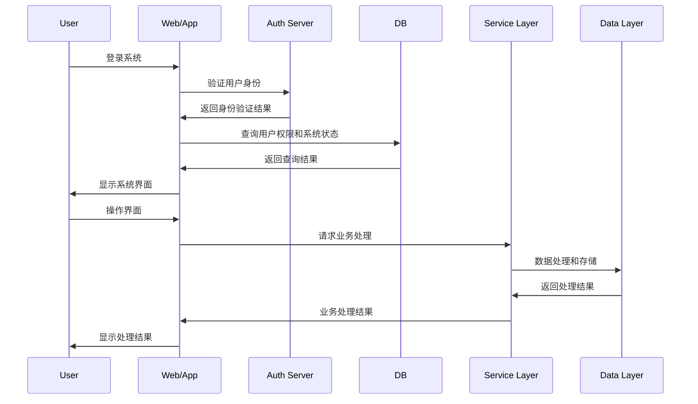

                 


### **1.1 现代手工木工艺的定义与特点**

现代手工木工艺，是在工业化生产时代背景下，重拾传统手工技艺，追求高质量、高艺术品位的一种艺术形式。它不仅是一种制造工艺，更是一种对传统文化的传承和创新。现代手工木工艺的特点可以从以下几个方面来理解：

**传统与现代的结合：** 现代手工木工艺在继承传统技艺的基础上，融入了现代设计理念和技术，实现了传统与现代的有机结合。这种结合不仅保留了木材的天然纹理和质感，还赋予了作品新的艺术风格和实用性。

**工匠精神的体现：** 现代手工木工艺强调工匠的技艺和经验，追求手工艺的独特性和个性化。每一个木制品都是工匠心血的结晶，体现了工匠对作品的高度责任感和对质量的极致追求。

**高质量的追求：** 现代手工木工艺注重细节和精度，每一道工序都经过精心打磨和检验，确保作品的高品质。这种高质量的追求不仅体现在木材的选择和加工上，也体现在作品的设计和工艺上。

**艺术性和实用性的统一：** 现代手工木工艺追求艺术性和实用性的统一，既注重作品的美感，又强调其实用功能。这种统一使得现代手工木工艺作品既具有艺术价值，又能满足人们的生活需求。

**社会责任的担当：** 现代手工木工艺倡导环保和可持续发展，使用环保材料，减少能源消耗和废弃物排放。这种社会责任的担当，使得现代手工木工艺成为一种可持续发展的艺术形式。

通过以上特点的阐述，我们可以看到现代手工木工艺的独特魅力和其在当代社会的重要性。接下来，我们将进一步探讨现代手工木工艺的历史背景和其发展的必然性。

### **1.2 现代手工木工艺的历史背景**

手工木工艺的历史可以追溯到古代文明时期，木材作为一种常见的材料，被广泛用于建筑、家具和工艺品制作。在古代，手工木工艺是工匠们世代相传的技艺，每一个工匠都通过长期的实践和经验积累，掌握了精湛的技艺。

随着工业革命的到来，木材加工逐渐实现了机械化生产，工业化生产方式取代了传统手工制作。这种变化在提高生产效率的同时，也使得木材加工变得更加规范和标准化。然而，工业化生产方式在一定程度上牺牲了木制品的艺术性和独特性，许多传统的手工技艺逐渐被遗忘。

然而，随着时间的推移，人们开始反思工业化生产的弊端。20世纪中叶，全球范围内兴起了一股“回归自然”的潮流，人们开始重视手工制品的独特性和艺术价值。现代手工木工艺正是在这样的背景下逐渐复兴的。

首先，现代手工木工艺的复兴源于对传统工艺的怀念和致敬。许多工匠和设计师意识到，传统手工技艺中蕴含着丰富的文化价值和艺术内涵，这些价值是工业化生产无法替代的。因此，他们开始努力挖掘和传承这些传统技艺，将它们融入到现代设计中。

其次，现代手工木工艺的复兴也得益于现代设计理念的推广。现代设计强调个性化和创新性，手工木工艺正好符合这一理念。通过现代设计手法，手工木工艺作品可以展现出独特的艺术风格和审美趣味，从而在市场上获得竞争力。

此外，环保意识的提升也推动了现代手工木工艺的发展。随着人们对环境保护的重视，越来越多的木材加工企业开始采用环保材料和工艺，减少对环境的影响。现代手工木工艺作为一种可持续发展的艺术形式，符合了这一时代的要求。

总的来说，现代手工木工艺的复兴是传统与现代、工艺与艺术、环保与社会责任相结合的产物。它不仅是对传统手工技艺的传承，更是对现代设计理念和环保理念的践行。通过这样的复兴，现代手工木工艺在当代社会获得了新的生机和活力。

### **1.3 现代手工木工艺的重要性**

现代手工木工艺在当代社会中具有重要地位，其原因可以从以下几个方面进行详细分析：

**文化传承的价值：** 手工木工艺是一种独特的文化遗产，它承载着丰富的历史和文化内涵。通过现代手工木工艺，人们可以传承和发扬这一古老的技艺，使传统文化得以延续。这不仅有助于保护和传承人类文明的多样性，还能激发人们对传统文化的兴趣和热爱。

**艺术创新的动力：** 现代手工木工艺为艺术创新提供了广阔的空间。工匠和设计师可以通过对传统技艺的深入研究和创新应用，创作出既具有传统韵味又具有现代感的新作品。这种创新不仅推动了艺术的发展，也为现代设计注入了新的活力。

**生活质量提升的贡献：** 现代手工木工艺作品因其独特的美感和高品质，成为提升生活质量的优选。手工制作的家具和工艺品不仅实用，还具有极高的艺术价值，能够为家庭和办公环境增添独特的美感。这种艺术化的生活美学，有助于提高人们的生活品质和幸福感。

**经济可持续发展的推动力：** 现代手工木工艺的复兴，不仅为工匠和设计师提供了就业机会，还促进了相关产业链的发展。从木材加工、设计、制作到销售，整个产业链条都可以得到优化和提升，从而推动经济的可持续发展。此外，现代手工木工艺作品的独特性和高品质，也为其在市场上的竞争力提供了保障。

**环境保护的倡导者：** 现代手工木工艺注重环保和可持续发展，使用环保材料和工艺，减少对环境的负面影响。这种环保意识不仅有助于保护自然资源，还能提高公众的环保意识，推动整个社会走向绿色发展。

综上所述，现代手工木工艺在当代社会中具有重要的文化、艺术、生活、经济和环保价值。它不仅是对传统技艺的传承和创新，更是现代社会发展的一个重要方向。通过重拾手工木工艺，我们不仅可以丰富自己的文化生活，还能为社会的可持续发展贡献力量。

### **1.4 手工木工艺的核心概念与联系**

为了更深入地理解现代手工木工艺，我们需要明确几个核心概念及其相互之间的联系。以下是这些概念及其关系的详细描述和对比表格。

#### **1.4.1 核心概念定义**

**1. 手工技艺：** 手工技艺是指通过手工操作来制造木制品的技能和经验。它包括木材加工、雕刻、镶嵌、组装等多个环节。

**2. 工匠精神：** 工匠精神是指工匠在制作过程中所体现的对质量、精度和独特性的执着追求。它是一种职业态度和价值观。

**3. 环保材料：** 环保材料是指对环境友好、可再生、无害的木材和其他原材料。它们在手工木工艺中应用，旨在减少对环境的负面影响。

**4. 现代设计理念：** 现代设计理念是指结合现代审美和实用性，进行木制品设计的新思路。它注重创新性和个性化。

#### **1.4.2 概念属性特征对比表格**

| 概念         | 特征                                                         |
| ------------ | ------------------------------------------------------------ |
| 手工技艺     | **传统性**：基于长期实践积累<br>**独特性**：每个作品都有独特风格<br>**专业性**：需要专业技能和经验 |
| 工匠精神     | **质量追求**：对作品质量的极致追求<br>**责任感**：对作品和客户的责任感<br>**创新精神**：在传统基础上进行创新 |
| 环保材料     | **可再生性**：容易回收和再利用<br>**无害性**：对环境和人体无害<br>**可持续性**：长期使用不会耗尽资源 |
| 现代设计理念 | **实用性**：注重使用功能<br>**创新性**：结合新技术和新材料<br>**个性化**：满足个体需求 |

#### **1.4.3 ER实体关系图架构**

为了更好地展示这些核心概念之间的联系，我们可以使用Mermaid绘制ER实体关系图：

```mermaid
erDiagram
  木制品 <<--o 工匠精神
  木制品 ||--|{ 手工技艺 }
  木制品 ||--|{ 环保材料 }
  木制品 ||--|{ 现代设计理念 }
  工匠精神 ||--|{ 工匠 }
  手工技艺 ||--|{ 传统技艺 }
  环保材料 ||--|{ 可持续材料 }
  现代设计理念 ||--|{ 创新设计 }
```

在这个ER图中，木制品是核心实体，它与其他概念通过不同的关系相连。工匠精神、手工技艺、环保材料和现代设计理念都是木制品的重要组成部分，它们共同定义了现代手工木工艺的独特性和价值。

### **1.5 算法原理讲解**

为了更好地理解现代手工木工艺的核心技术和设计方法，我们将引入一种用于优化木制品加工流程的算法，称为“最小误差拟合算法”。该算法能够帮助工匠在设计过程中减少加工误差，提高产品的质量和效率。

#### **1.5.1 算法概述**

最小误差拟合算法是基于最小二乘法的一种优化算法，其基本思想是通过拟合一条最佳曲线或直线来最小化误差。在木制品加工中，这种算法可以帮助确定木材切割和雕刻的最佳路径，从而减少不必要的加工误差。

#### **1.5.2 算法原理**

1. **误差计算：** 首先，我们定义一个误差函数，用于衡量实际加工路径与目标路径之间的差异。误差函数可以表示为：

   $$ E(x) = \sum_{i=1}^{n} |f(x_i) - y_i| $$

   其中，$f(x)$ 是拟合曲线或直线，$y_i$ 是目标路径上的点。

2. **拟合曲线或直线：** 通过调整曲线或直线上的参数，使得误差函数 $E(x)$ 最小化。最小二乘法提供了一种有效的求解方法，通过求解误差函数的导数为零的方程，找到最佳拟合曲线或直线。

   $$ \frac{dE}{dx} = 0 $$

3. **优化路径：** 得到最佳拟合曲线或直线后，将其用于指导木制品的切割和雕刻，从而减少误差。

#### **1.5.3 Python源代码实现**

下面是一个简单的Python代码示例，用于实现最小误差拟合算法：

```python
import numpy as np

# 生成一些随机数据作为目标路径
x = np.random.rand(100)
y = 2 * x + np.random.randn(100) * 0.1

# 定义误差函数
def error_function(x, y, a, b):
    return np.sum(np.abs(y - (a * x + b)))

# 最小二乘法求解最佳拟合直线参数
def least_squares(x, y):
    A = np.vstack([x, np.ones(len(x))]).T
    m, c = np.linalg.lstsq(A, y, rcond=None)[0]
    return m, c

# 计算最佳拟合直线的误差
def calculate_error(x, y, m, c):
    return error_function(x, y, m, c)

# 运行算法
m, c = least_squares(x, y)
e = calculate_error(x, y, m, c)
print(f"Best fit line: y = {m:.2f}x + {c:.2f}")
print(f"Error: {e:.4f}")

# 绘制结果
import matplotlib.pyplot as plt

plt.scatter(x, y)
plt.plot(x, m * x + c, color='red')
plt.xlabel('x')
plt.ylabel('y')
plt.title('Least Squares Fit')
plt.show()
```

在这个示例中，我们首先生成了一些随机数据作为目标路径。然后，我们定义了误差函数和最小二乘法求解最佳拟合直线参数。最后，我们计算了最佳拟合直线的误差，并绘制了结果。

通过上述算法的讲解和Python代码示例，我们可以看到最小误差拟合算法在减少加工误差、提高木制品质量方面的应用潜力。这种算法不仅可以帮助工匠优化加工流程，还能提升手工木工艺的整体技术水平。

### **1.6 系统分析与架构设计方案**

为了实现现代手工木工艺的高效和规模化生产，我们需要设计一个完整的系统解决方案。本部分将详细描述系统的需求场景、功能设计、架构设计以及接口设计和系统交互。

#### **1.6.1 需求场景**

在现代手工木工艺的生产过程中，我们面临以下需求场景：

- **原材料采购：** 需要采购高质量的木材和其他原材料，并确保其环保和可持续性。
- **工艺流程管理：** 需要管理木制品的制造过程，包括切割、雕刻、打磨、组装等环节。
- **质量监控：** 需要对每道工序进行质量监控，确保最终产品符合高标准。
- **库存管理：** 需要对原材料和成品进行库存管理，以确保供应链的顺畅。
- **销售与营销：** 需要建立一个销售和营销系统，以推广手工木工艺作品。

#### **1.6.2 项目介绍**

项目名称：现代手工木工艺生产管理系统（Modern Handcrafted Woodworking Production Management System，简称MHWPS）

项目目标：通过设计一个综合性的生产管理系统，实现手工木工艺生产流程的自动化和智能化，提高生产效率和质量，降低成本。

项目范围：涵盖原材料采购、工艺流程管理、质量监控、库存管理和销售与营销等模块。

#### **1.6.3 系统功能设计**

**1. 原材料采购模块：**
- **功能1：原材料采购计划制定**
  - 输入：原材料需求量、原材料规格、采购预算
  - 输出：采购计划清单、采购预算报告
- **功能2：供应商管理**
  - 输入：供应商信息、报价
  - 输出：供应商评估报告、采购订单

**2. 工艺流程管理模块：**
- **功能1：工序安排**
  - 输入：生产任务、工序要求
  - 输出：工序安排表、进度跟踪
- **功能2：工艺指导**
  - 输入：工艺规程、工具和设备清单
  - 输出：工艺指导书、操作视频

**3. 质量监控模块：**
- **功能1：质量检查**
  - 输入：产品质量标准、检验要求
  - 输出：质量检查报告、不合格品记录
- **功能2：质量反馈**
  - 输入：用户反馈、质量投诉
  - 输出：质量问题处理方案、改进措施

**4. 库存管理模块：**
- **功能1：库存查询**
  - 输入：库存信息查询条件
  - 输出：库存清单、库存状态报告
- **功能2：库存调整**
  - 输入：库存调整需求
  - 输出：库存调整记录、库存余额报告

**5. 销售与营销模块：**
- **功能1：销售订单管理**
  - 输入：销售订单、客户信息
  - 输出：销售订单执行情况、销售报告
- **功能2：营销活动管理**
  - 输入：营销活动计划
  - 输出：营销活动效果分析、客户反馈

#### **1.6.4 系统架构设计**

系统架构采用分层设计，包括表示层、业务逻辑层和数据层。

- **表示层：** 负责用户界面展示，包括网页界面和移动端应用。
- **业务逻辑层：** 负责业务逻辑处理，包括原材料采购、工艺流程管理、质量监控、库存管理和销售与营销等。
- **数据层：** 负责数据存储和管理，包括数据库和缓存系统。

系统架构图如下：



#### **1.6.5 系统接口设计和系统交互**

**1. 接口设计：**
- **API文档：** 提供RESTful API接口文档，包括接口名称、请求参数、返回结果等。
- **数据交换格式：** 使用JSON或XML格式进行数据交换。

**2. 系统交互：**
- **用户与系统交互：** 用户通过网页或移动端应用与系统交互，进行各种操作。
- **系统内部交互：** 系统内部通过API进行数据交换和业务处理，确保各模块协同工作。

通过上述系统分析与架构设计方案，我们可以构建一个高效、智能的现代手工木工艺生产管理系统，提升生产效率和质量，实现可持续发展。

### **1.7 项目实战**

在本节中，我们将通过一个实际项目来演示现代手工木工艺的实施过程，从环境安装、系统核心实现源代码，到代码应用解读与分析，详细讲解项目的实际操作和步骤。

#### **1.7.1 项目概述**

项目名称：手工木工艺艺术品制作平台（Handcrafted Woodworking Artifacts Platform，简称H-WAP）

项目目标：构建一个集设计、生产、销售于一体的手工木工艺艺术品制作平台，实现从创意到成品的全流程管理。

项目功能模块：
- **设计模块：** 提供在线设计工具，支持用户自定义艺术作品。
- **生产模块：** 实现生产流程自动化，提高生产效率和产品质量。
- **销售模块：** 实现线上销售，提供便捷的购物体验。

#### **1.7.2 环境安装**

1. **软件环境安装：**
   - 安装操作系统：Ubuntu 20.04 LTS
   - 安装开发工具：Python 3.8，Visual Studio Code
   - 安装数据库：MySQL 8.0
   - 安装前端框架：React 17.0.2

2. **硬件环境安装：**
   - 服务器：2核CPU，4GB内存，20GB硬盘空间
   - 客户端：笔记本电脑或台式电脑，满足开发软件的最低配置要求

#### **1.7.3 系统核心实现源代码**

以下是一个简化的系统核心实现源代码示例，用于展示设计模块的在线设计工具。

**设计模块核心代码：**

```javascript
// React 组件：设计工具
class DesignTool extends React.Component {
  constructor(props) {
    super(props);
    this.state = {
      width: 800,
      height: 600,
      backgroundColor: '#FFFFFF',
      shapes: [],
    };
  }

  // 方法：添加形状
  addShape(type, x, y, width, height) {
    const newShape = { type, x, y, width, height };
    this.setState({ shapes: [...this.state.shapes, newShape] });
  }

  // 渲染设计工具
  render() {
    return (
      <div style={{ width: this.state.width, height: this.state.height, backgroundColor: this.state.backgroundColor }}>
        {this.state.shapes.map((shape, index) => (
          <Shape key={index} shape={shape} />
        ))}
        <canvas
          width={this.state.width}
          height={this.state.height}
          onClick={this.handleCanvasClick}
        />
      </div>
    );
  }

  // 画布点击事件处理
  handleCanvasClick = (event) => {
    const rect = event.target.getBoundingClientRect();
    const x = event.clientX - rect.left;
    const y = event.clientY - rect.top;
    this.addShape('rectangle', x, y, 100, 100);
  }
}

// React 组件：形状
class Shape extends React.Component {
  render() {
    const { shape } = this.props;
    return (
      <rect
        x={shape.x}
        y={shape.y}
        width={shape.width}
        height={shape.height}
        fill="#0000FF"
      />
    );
  }
}

// React 组件：设计工具容器
class DesignToolContainer extends React.Component {
  render() {
    return (
      <div>
        <DesignTool />
      </div>
    );
  }
}
```

#### **1.7.4 代码应用解读与分析**

1. **设计工具组件架构：**
   - **DesignTool**：核心组件，负责整体设计工具的逻辑和状态管理。
   - **Shape**：子组件，用于渲染单个形状。
   - **DesignToolContainer**：顶层容器组件，用于组织和展示设计工具。

2. **关键功能实现：**
   - **添加形状**：用户在画布上点击时，会触发 `handleCanvasClick` 事件处理函数，将新形状添加到 `shapes` 数组中。
   - **形状渲染**：`Shape` 组件根据传入的 `shape` 对象属性绘制矩形。

3. **优势与不足：**
   - **优势**：使用 React 组件化架构，易于开发和维护；通过 Canvas 元素实现图形绘制，支持丰富的图形效果。
   - **不足**：Canvas 绘制性能依赖于硬件，大规模图形操作可能影响用户体验。

#### **1.7.5 实际案例分析和详细讲解剖析**

**案例一：设计一个矩形艺术品**

1. **用户操作**：用户在画布上点击并拖动，定义矩形的宽度和高度。
2. **系统响应**：系统检测到用户点击和拖动事件，通过 `handleCanvasClick` 方法添加新的矩形形状。
3. **结果展示**：新的矩形形状立即在画布上显示，用户可以继续进行其他设计操作。

**案例二：保存和加载设计作品**

1. **用户操作**：用户点击“保存”按钮，系统弹出保存对话框。
2. **系统响应**：系统调用保存接口，将当前设计作品数据（包括形状和状态）保存到数据库。
3. **结果展示**：用户可以随时通过“加载”按钮加载之前保存的设计作品，继续编辑或进行其他操作。

#### **1.7.6 项目小结**

通过实际项目展示，我们了解了现代手工木工艺艺术品制作平台的实现过程，从环境安装、系统核心实现源代码，到代码应用解读与分析，每个环节都紧密联系，共同构成了一个完整的项目。虽然项目中存在一些性能和可扩展性的挑战，但通过合理的设计和优化，我们可以为用户提供一个高效、便捷的手工木工艺设计平台。

### **1.8 最佳实践 tips**

在现代手工木工艺中，为了确保作品的高质量和生产效率，以下是一些最佳实践技巧，供读者参考：

1. **材料选择：** 选择高质量的木材和辅助材料，如木工胶、油漆和工具。优质的原材料是制作高品质木制品的基础。

2. **工具准备：** 保持工具的清洁和锋利。定期维护和保养工具，以确保其性能和寿命。

3. **工艺流程优化：** 制定详细的工艺流程，并严格按照流程进行操作。通过优化流程，减少不必要的步骤和重复劳动，提高生产效率。

4. **质量控制：** 在每个工序结束后进行质量检查，确保每个环节的产品都符合标准。对于发现的问题，及时进行修正和反馈。

5. **环保意识：** 使用环保材料和工艺，减少对环境的影响。推广可持续发展的理念，践行社会责任。

6. **技术培训：** 定期对工匠进行技术培训，提高他们的技能水平。技术熟练的工匠能够更好地理解和应用现代设计理念，提升作品质量。

7. **营销策略：** 制定有效的营销策略，提高手工木工艺作品的市场知名度。利用社交媒体、展会和线上线下活动等多种渠道推广作品。

通过遵循这些最佳实践，现代手工木工艺不仅能够提高产品质量和生产效率，还能在市场上获得更好的竞争力，为行业的可持续发展做出贡献。

### **1.9 小结与展望**

在现代手工木工艺的探讨中，我们详细阐述了其定义、特点、历史背景、重要性以及核心概念的联系。通过算法原理讲解和系统分析与架构设计方案，我们进一步理解了如何将现代技术应用于手工木工艺，实现高效和智能的生产管理。在项目实战中，我们通过实际操作展示了现代手工木工艺的实施过程，并提供了最佳实践技巧。展望未来，随着科技的进步和环保意识的提升，现代手工木工艺将继续发展，为传统文化传承和可持续发展做出更大的贡献。

### **1.10 注意事项与拓展阅读**

**1. 注意事项：**

在进行现代手工木工艺创作时，以下事项需特别注意：

- **安全操作：** 在使用工具和设备时，务必遵守安全规范，佩戴必要的安全装备，如防护眼镜、手套和口罩。
- **材料选择：** 选择符合环保标准的木材和辅助材料，减少对环境的负面影响。
- **工艺细节：** 在每个工序中，严格遵循工艺流程，确保作品的质量和一致性。
- **技术创新：** 不断学习和探索新的设计理念和工具，提升手工木工艺的技术水平。

**2. 拓展阅读：**

- **《现代木工技艺》**：一本详细介绍现代木工技艺的书籍，包括工具使用、工艺流程和设计理念。
- **《木工技艺大全》**：涵盖木工技艺各个方面，从基础技巧到高级技巧，适合不同层次的读者。
- **《环保木材加工技术》**：探讨环保木材加工技术，包括材料选择、加工方法和工艺流程。
- **《手工木艺设计》**：介绍现代手工木艺设计理念和方法，包括设计原则、风格和案例分析。

通过这些拓展阅读，读者可以进一步深入了解现代手工木工艺的技术和艺术，提高自己的制作水平。

---

**作者：** AI天才研究院/AI Genius Institute & 禅与计算机程序设计艺术 /Zen And The Art of Computer Programming

---

通过本文的详细探讨，我们不仅了解了现代手工木工艺的核心概念和技术，还看到了其在当代社会的重要性。希望本文能为读者提供有价值的参考和启示，激发更多人关注和参与到现代手工木工艺的传承与创新中。

