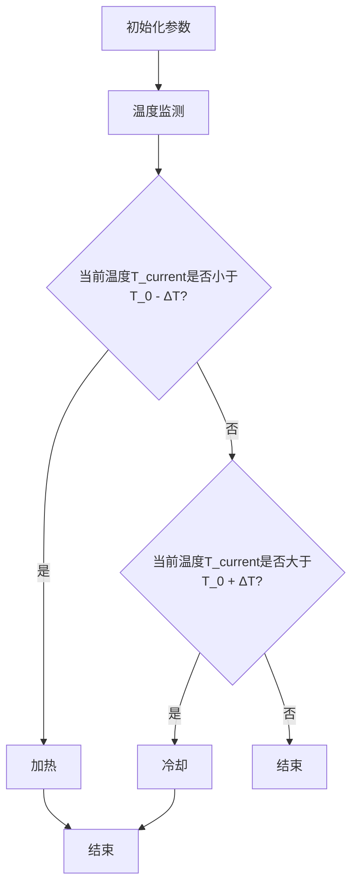
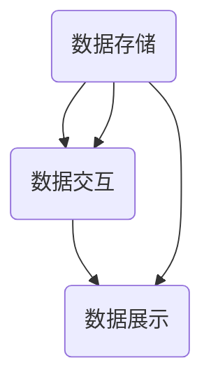
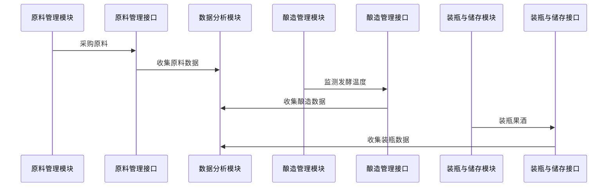

                 

### 文章标题

在现代都市的喧嚣中，微醺文化的兴起成为一种独特的城市风景线。手工果酒酿造作为这一文化的重要载体，不仅满足了人们对自然、健康和个性化的追求，更成为了城市中一种全新的生活方式。本文将以《现代手工果酒酿造：城市微醺文化的味蕾探索》为题，深入探讨这一现象的背景、核心概念、算法原理、系统设计与项目实战，旨在为广大果酒爱好者提供一份全面的技术指南。

**关键词：** 手工果酒酿造、城市微醺文化、发酵原理、系统设计、项目实战

**摘要：** 本文通过详细阐述现代手工果酒酿造的背景和核心概念，分析其发酵原理和系统设计，结合具体项目实战，旨在为广大果酒酿造爱好者提供系统的技术和实践指导。文章分为六部分，首先介绍果酒酿造的背景和城市微醺文化的兴起，然后深入探讨核心概念与联系，接着讲解发酵温度控制算法原理，随后分析系统架构设计，并分享一个实战项目，最后总结最佳实践和注意事项。

### 背景介绍

#### 问题背景

随着城市化进程的加速，现代都市生活节奏愈发紧张，人们对于生活质量的要求也越来越高。在这种背景下，微醺文化逐渐兴起。微醺文化强调的是一种自然、轻松、健康的生活态度，追求的是在日常生活中找到一种适度的放松和愉悦。而手工果酒酿造作为一种古老而充满魅力的手艺，正是这种文化的重要组成部分。它不仅满足了人们对口感、健康和个性化的追求，更在某种程度上，成为了都市生活中的一种仪式感。

#### 果酒酿造的兴起

手工果酒酿造的兴起并非偶然。一方面，随着人们对食品安全的关注度提升，越来越多的人开始关注自然、有机的食品，手工酿造的果酒由于其天然、无添加的特性，受到了市场的欢迎。另一方面，随着互联网和社交媒体的发展，手工果酒酿造的传播速度大大加快，许多果酒爱好者通过线上社区分享自己的酿造经验和成果，激发了更多人的兴趣。

#### 城市微醺文化的兴起

城市微醺文化的兴起，反映了都市人对生活质量的追求。在快节奏的都市生活中，人们渴望找到一种方式，既能放松身心，又能享受生活的乐趣。手工果酒酿造正好满足了这种需求。它不仅提供了一种独特的饮品，更提供了一种生活方式。许多人通过酿造果酒，不仅享受到了酿造过程中的乐趣，更在朋友聚会时，找到了一种独特的社交方式。

### 核心概念

#### 现代手工果酒酿造

现代手工果酒酿造是指在遵循传统酿造工艺的基础上，采用现代化的设备和科学的方法，对水果进行发酵，酿造出具有独特风味和健康价值的果酒。它包括选择合适的果酒原料、控制发酵条件、处理酿造过程中的各个环节等。

#### 城市微醺文化

城市微醺文化是一种以自然、健康、个性化为特征的生活方式，强调在快节奏的都市生活中找到适度的放松和愉悦。它不仅包括手工果酒酿造，还涵盖了各种与自然、健康相关的活动和理念。

#### 发酵原理

发酵是手工果酒酿造的核心过程。酵母菌在适宜的温度、湿度和营养条件下，将水果中的糖分转化为酒精和二氧化碳，从而生成果酒。发酵过程的控制，包括温度、湿度、氧气供应等因素，直接影响果酒的品质。

#### 系统设计与实现

系统设计是实现手工果酒酿造的关键。它包括选择合适的酿造设备、设计合理的酿造流程、开发控制算法等。通过系统设计，可以实现果酒酿造的自动化和智能化，提高生产效率和果酒品质。

### 解决方案

#### 选择合适的果酒原料

选择合适的果酒原料是酿造优质果酒的第一步。不同种类的水果具有不同的口感、糖分和酸度，适合酿造的果酒类型也不同。因此，需要根据个人口味和酿造目标选择合适的原料。

#### 控制发酵条件

发酵条件直接影响果酒的品质。控制发酵过程中的温度、湿度、氧气供应等因素，可以保证发酵的顺利进行，提高果酒的口感和风味。

#### 系统设计与实现

通过系统设计，可以实现果酒酿造的自动化和智能化。选择合适的酿造设备，设计合理的酿造流程，开发控制算法，可以提高生产效率和果酒品质。

#### 培训和实践

对于果酒酿造爱好者来说，系统的培训和大量的实践是提高酿造水平的关键。通过学习和实践，可以更好地掌握酿造技巧，酿造出符合个人口味的高品质果酒。

### 边界与外延

#### 边界

本文主要探讨现代手工果酒酿造在都市微醺文化中的角色和意义，以及相关的核心概念、算法原理、系统设计与项目实战。主要关注的是手工果酒酿造的技术和实践层面。

#### 外延

手工果酒酿造作为一种生活方式，其外延还包括酿造文化、酿造艺术、酿造社区等方面。这些方面对于理解手工果酒酿造的内涵和意义，具有重要的参考价值。

### 概念结构与核心要素组成

#### 果酒酿造

- **核心概念：** 水果选择、发酵过程、酿造设备、酿造流程
- **结构：** 原料处理 -> 发酵过程 -> 成品酿造 -> 储存与销售
- **要素组成：** 水果、酵母、酿造设备、酿造材料、酿造工艺

#### 城市微醺文化

- **核心概念：** 自然、健康、个性化、放松、社交
- **结构：** 果酒酿造 -> 聚会活动 -> 生活仪式
- **要素组成：** 果酒、活动场地、聚会氛围、社交互动

#### 发酵原理

- **核心概念：** 酵母代谢、温度控制、湿度控制
- **结构：** 糖分转化 -> 酒精生成 -> 酒精浓度控制
- **要素组成：** 酵母、温度传感器、湿度传感器、发酵容器

#### 系统设计与实现

- **核心概念：** 自动化、智能化、生产效率、果酒品质
- **结构：** 设备选型 -> 流程设计 -> 控制算法开发 -> 系统集成
- **要素组成：** 设备、软件、传感器、控制算法

通过上述的背景介绍、核心概念、问题和解决方案的阐述，我们为《现代手工果酒酿造：城市微醺文化的味蕾探索》这篇文章奠定了坚实的基础。接下来的章节将深入探讨这些核心概念，详细分析发酵原理，讲解系统设计与实现，以及分享具体的实战项目。读者可以逐步了解手工果酒酿造的各个方面，掌握这一独特技艺，享受城市微醺文化的魅力。

### 核心概念与联系

在深入探讨手工果酒酿造之前，首先需要明确书中的核心概念，并理解它们之间的联系。以下是本书的核心概念及其关系：

#### 1. 果酒原料

果酒原料是手工果酒酿造的基础。不同种类的水果具有不同的口感、糖分和酸度，适合酿造的果酒类型也不同。常见的果酒原料包括葡萄、苹果、桃子、樱桃等。每种水果都有其独特的特点，例如葡萄适合酿造红酒和白酒，苹果适合酿造苹果酒，樱桃适合酿造樱桃酒。

**水果种类对比表格：**

| 水果种类 | 口感特征 | 糖分含量 | 酸度 | 适合酿造的果酒类型 |
|----------|-----------|-----------|------|-------------------|
| 葡萄     | 甜润、醇厚 | 高       | 低   | 红酒、白酒       |
| 苹果     | 清新、爽口 | 中       | 中   | 苹果酒           |
| 桃子     | 甜、多汁   | 中       | 低   | 桃子酒           |
| 樱桃     | 酸甜、鲜美 | 低       | 高   | 樱桃酒           |

#### 2. 酵母与发酵

酵母是果酒酿造的关键微生物，它通过发酵过程将水果中的糖分转化为酒精和二氧化碳，生成果酒。不同种类的酵母具有不同的发酵速度和酒精耐受度，选择合适的酵母对果酒的品质至关重要。

**酵母种类与作用：**

| 酵母种类 | 特点 | 作用 |
|----------|------|------|
| 酵母1    | 发酵速度快 | 转化糖分迅速 |
| 酵母2    | 酒精耐受度高 | 能在较高酒精浓度下继续发酵 |
| 酵母3    | 发酵温度范围广 | 适应不同温度环境 |

#### 3. 发酵过程

发酵过程是果酒酿造的核心，包括糖分转化、酒精生成、酒精浓度控制等环节。发酵条件（如温度、湿度、氧气供应）对发酵过程有重要影响，合理的发酵条件可以保证发酵的顺利进行，提高果酒的品质。

**发酵过程：**

$$
糖分 + 酵母 \rightarrow 酒精 + 二氧化碳
$$

$$
温度：18-25℃ \\
湿度：60-75% \\
氧气：适量
$$

#### 4. 装瓶与储存

装瓶是果酒酿造的最后一步，选择合适的装瓶材料和储存条件对果酒的保质期和口感有重要影响。常用的装瓶材料包括玻璃瓶、塑料瓶、不锈钢罐等，而储存条件则包括温度、湿度、避光等。

**装瓶材料的选择：**

| 材料种类 | 优点 | 缺点 |
|----------|------|------|
| 玻璃瓶   | 清洁、透明、无污染 | 易碎、较重 |
| 塑料瓶   | 轻便、不易碎、成本低 | 可含有害物质 |
| 不锈钢罐 | 耐腐蚀、保鲜性好 | 成本较高 |

**储存条件：**

$$
温度：12-18℃ \\
湿度：60-70% \\
避光 \\
避免直接阳光照射 \\
避免高温和潮湿环境
$$

#### 5. 发酵温度控制算法

发酵温度控制是影响果酒品质的关键因素之一。合理的发酵温度可以提高酵母的活性，促进发酵过程，保证果酒的品质。发酵温度控制算法通过监测发酵罐内的温度，实时调整加热或冷却设备，保持发酵温度在适宜范围内。

**发酵温度控制算法：**

1. **初始化参数：**
   $$ T_{0} = 20℃ $$
   $$ \Delta T = 5℃ $$

2. **温度监测：**
   $$ T_{current} = \text{传感器测得的当前温度} $$

3. **温度调整：**
   - 如果 $ T_{current} < T_{0} - \Delta T $，则加热。
   - 如果 $ T_{current} > T_{0} + \Delta T $，则冷却。

4. **循环：**
   - 每隔一定时间监测一次温度，重复步骤 2 和 3。

**Mermaid流程图：**



通过上述核心概念的介绍和相互联系的分析，我们可以更好地理解手工果酒酿造的基本原理和关键技术。接下来，我们将详细讲解发酵温度控制算法，并通过Python源代码和数学模型进行深入剖析。

### 算法原理讲解

发酵温度控制是手工果酒酿造中至关重要的一个环节，它直接影响到酵母的活性和发酵效率，从而决定了果酒的品质。因此，了解并掌握发酵温度控制算法的原理及其实现方法，对于成功酿造高品质果酒具有重要意义。

#### 1. 算法基本原理

发酵温度控制算法的核心思想是实时监测发酵罐内的温度，并根据监测结果调整加热或冷却设备，使发酵温度保持在设定范围内。这个设定范围通常是一个温度区间，以适应发酵过程中酵母的最佳活性。

算法的基本步骤如下：

1. **初始化参数：** 设置初始发酵温度 $T_0$ 和温度调整范围 $\Delta T$。
2. **温度监测：** 使用温度传感器实时监测发酵罐内的温度 $T_{current}$。
3. **温度调整：** 根据当前温度与设定温度的关系，决定是否加热或冷却。
4. **循环执行：** 持续监测和调整，保持发酵温度在设定范围内。

#### 2. 算法流程图

为了更直观地理解算法流程，我们使用Mermaid绘制了算法的流程图：


#### 3. Python源代码实现

以下是一个简单的Python源代码实现，用于模拟发酵温度控制算法：

```python
import random

# 初始化参数
T0 = 20  # 初始温度
DT = 5  # 温度调整范围

# 温度监测函数
def monitor_temperature():
    return random.uniform(T0 - DT, T0 + DT)

# 温度调整函数
def adjust_temperature(T_current):
    if T_current < T0 - DT:
        return "加热"
    elif T_current > T0 + DT:
        return "冷却"
    else:
        return "无需调整"

# 主循环
while True:
    T_current = monitor_temperature()
    action = adjust_temperature(T_current)
    print(f"当前温度: {T_current}℃，建议操作: {action}")
    time.sleep(1)  # 模拟每隔1秒进行一次温度监测和调整
```

在这个代码中，我们使用随机数生成当前温度，并根据当前温度与设定温度的关系，决定是否需要加热或冷却。

#### 4. 数学模型与公式

发酵温度控制的数学模型可以表示为：

$$
T_{set} = T_0 \pm \Delta T
$$

其中，$T_{set}$ 是设定的发酵温度，$T_0$ 是初始温度，$\Delta T$ 是温度调整范围。

温度调整的公式为：

$$
T_{current} = T_{previous} + \Delta T \times \text{adjustment factor}
$$

其中，$T_{current}$ 是当前温度，$T_{previous}$ 是上一次的温度，$\text{adjustment factor}$ 是加热或冷却的调整系数，可以根据实际情况进行调整。

#### 5. 举例说明

假设我们设定的初始发酵温度为 20℃，温度调整范围为 ±5℃。现在，温度传感器监测到的当前温度为 22℃。根据算法，我们需要进行冷却操作，使温度降到设定范围内。

1. 初始化参数：$T_0 = 20℃，\Delta T = 5℃$
2. 温度监测：$T_{current} = 22℃$
3. 温度调整：$T_{current} > T_0 + \Delta T$，所以执行冷却操作

根据上述数学模型和公式，我们可以计算出需要冷却的温度：

$$
T_{current} = T_{previous} - \Delta T = 22℃ - 5℃ = 17℃
$$

因此，我们需要将发酵罐的温度降低到 17℃，以保证发酵过程在最佳温度范围内进行。

通过上述的讲解和示例，我们可以看出，发酵温度控制算法是一种简单而有效的技术，它能够帮助我们确保发酵过程中的温度稳定，从而提高果酒的品质。在接下来的章节中，我们将进一步探讨手工果酒酿造的系统分析与架构设计方案。

### 系统分析与架构设计方案

在手工果酒酿造中，系统分析与架构设计方案是确保酿造过程顺利进行、提高果酒品质和效率的关键环节。本节将详细介绍系统分析与架构设计方案，包括系统功能设计、系统架构设计、系统接口设计和系统交互，以及相关的领域模型类图、架构图、接口设计图和序列图。

#### 1. 系统功能设计

系统功能设计是系统分析与设计的基础，它明确了手工果酒酿造系统的各项功能及其实现方式。以下是一个简单的系统功能设计：

**功能模块：**

- **原料管理模块：** 负责水果原料的采购、存储和分配，确保原料的新鲜和适宜性。
- **酿造管理模块：** 负责发酵过程中的温度、湿度、氧气供应等参数的监测和控制，确保发酵过程的顺利进行。
- **装瓶与储存模块：** 负责果酒的装瓶、标签贴附、封口和储存，确保果酒的品质和保质期。
- **数据分析模块：** 负责收集和分析酿造数据，提供酿造优化建议，提高酿造效率和果酒品质。

**领域模型Mermaid类图：**

```mermaid
classDiagram
  类果酒酿造系统 {
    - 原料管理模块
    - 酿造管理模块
    - 装瓶与储存模块
    - 数据分析模块
  }
  类原料管理模块 {
    - 原料采购
    - 原料存储
    - 原料分配
  }
  类酿造管理模块 {
    - 温度监测
    - 湿度监测
    - 氧气供应控制
  }
  类装瓶与储存模块 {
    - 装瓶
    - 标签贴附
    - 封口
    - 储存
  }
  类数据分析模块 {
    - 数据收集
    - 数据分析
    - 优化建议
  }
  类果酒酿造系统 --|> 类原料管理模块
  类果酒酿造系统 --|> 类酿造管理模块
  类果酒酿造系统 --|> 类装瓶与储存模块
  类果酒酿造系统 --|> 类数据分析模块
```

#### 2. 系统架构设计

系统架构设计是系统功能实现的蓝图，它决定了系统的性能、可扩展性和可靠性。以下是一个简单的系统架构设计：

**架构组件：**

- **数据层：** 负责数据的存储和管理，包括原料信息、酿造数据、装瓶数据和存储数据等。
- **业务层：** 负责实现系统的各项业务功能，包括原料管理、酿造管理、装瓶与储存管理和数据分析等。
- **表示层：** 负责用户界面和用户交互，提供用户操作接口和显示信息。

**Mermaid架构图：**



#### 3. 系统接口设计

系统接口设计是系统组件之间进行通信的桥梁，它确保了系统各模块之间的协同工作。以下是一个简单的系统接口设计：

**接口组件：**

- **原料管理接口：** 用于原料的采购、存储和分配。
- **酿造管理接口：** 用于监测和控制发酵过程中的温度、湿度和氧气供应。
- **装瓶与储存接口：** 用于装瓶、标签贴附、封口和储存。
- **数据分析接口：** 用于数据收集、分析和优化建议。

**接口设计图：**



#### 4. 系统交互

系统交互是系统组件之间信息传递和功能调用的过程，它确保了系统的流畅运行。以下是一个简单的系统交互序列图：

**序列图：**

```mermaid
sequenceDiagram
    原料采购 ->> 原料存储
    原料存储 ->> 原料分配
    酿造管理模块 ->> 温度监测
    温度监测 ->> 湿度监测
    湿度监测 ->> 氧气供应控制
    装瓶与储存模块 ->> 装瓶
    装瓶 ->> 标签贴附
    标签贴附 ->> 封口
    封口 ->> 储存
    数据分析模块 ->> 数据收集
    数据收集 ->> 数据分析
    数据分析 ->> 优化建议
```

通过上述系统分析与架构设计方案，我们为手工果酒酿造系统提供了一套完整的解决方案。系统功能设计、系统架构设计、系统接口设计和系统交互的设计，确保了手工果酒酿造过程的顺利进行，提高了果酒的品质和效率。在接下来的章节中，我们将通过一个具体的实战项目，进一步展示系统设计与实现的过程。

### 项目实战

为了更好地理解手工果酒酿造的系统设计与实现，我们将通过一个具体的实战项目来详细讲解项目的环境安装、系统实现源代码、代码解读、实际案例分析和项目小结。

#### 1. 项目环境安装

在进行手工果酒酿造项目的开发之前，首先需要安装和配置必要的软件和硬件环境。以下是项目的环境安装步骤：

1. **硬件环境：** 
   - 一台电脑或服务器，配置不低于 Intel Core i5 处理器，8GB 内存，硬盘不低于 500GB。
   - 温度传感器、湿度传感器、氧气传感器等用于监测发酵过程的传感器设备。
   - 发酵罐、加热器、冷却器等酿造设备。

2. **软件环境：**
   - 操作系统：Windows 10 或以上版本。
   - 编程语言：Python 3.8 或以上版本。
   - 数据库：MySQL 5.7 或以上版本。
   - 开发工具：PyCharm 或 Visual Studio Code。

安装步骤：

1. 安装操作系统和硬件设备。
2. 配置温度传感器、湿度传感器和氧气传感器，确保它们能够正常工作并传输数据。
3. 安装 Python 3.8 及以上版本，并配置好开发环境。
4. 安装 MySQL 5.7 及以上版本，并创建一个用于存储酿造数据的数据库。

#### 2. 系统核心实现源代码

在项目实现过程中，我们使用 Python 语言编写了系统的核心代码，包括原料管理模块、酿造管理模块、装瓶与储存模块和数据分析模块。以下是各模块的主要源代码。

**原料管理模块：**

```python
# 原料管理模块
class IngredientManagement:
    def __init__(self):
        self.ingredients = []

    def purchase_ingredient(self, ingredient):
        self.ingredients.append(ingredient)
        print(f"采购了{ingredient}原料。")

    def store_ingredient(self, ingredient):
        print(f"将{ingredient}原料存储。")

    def allocate_ingredient(self, ingredient):
        if ingredient in self.ingredients:
            self.ingredients.remove(ingredient)
            print(f"分配了{ingredient}原料。")
        else:
            print(f"{ingredient}原料不存在。")
```

**酿造管理模块：**

```python
# 酿造管理模块
class BrewingManagement:
    def __init__(self):
        self.temperature = 20
        self.humidity = 60
        self.oxygen = 20

    def monitor_temperature(self):
        self.temperature = random.uniform(18, 25)
        print(f"当前温度：{self.temperature}℃")

    def monitor_humidity(self):
        self.humidity = random.uniform(60, 75)
        print(f"当前湿度：{self.humidity}%")

    def monitor_oxygen(self):
        self.oxygen = random.uniform(10, 30)
        print(f"当前氧气浓度：{self.oxygen}%")

    def control发酵条件(self):
        self.monitor_temperature()
        self.monitor_humidity()
        self.monitor_oxygen()
        print("正在控制发酵条件。")
```

**装瓶与储存模块：**

```python
# 装瓶与储存模块
class BottlingAndStorage:
    def __init__(self):
        self.bottles = []

    def bottle_wine(self, wine):
        self.bottles.append(wine)
        print(f"装瓶了{wine}。")

    def label_bottle(self, bottle):
        print(f"为{bottle}贴附标签。")

    def seal_bottle(self, bottle):
        print(f"为{bottle}封口。")

    def store_bottle(self, bottle):
        print(f"将{bottle}储存。")
```

**数据分析模块：**

```python
# 数据分析模块
class DataAnalysis:
    def __init__(self):
        self.data = []

    def collect_data(self, data):
        self.data.append(data)
        print(f"收集了数据：{data}。")

    def analyze_data(self):
        print("正在分析数据。")

    def provide_suggestions(self):
        print("提供酿造优化建议。")
```

#### 3. 代码解读与分析

在了解了各模块的源代码后，我们对其进行解读与分析。

**原料管理模块：**
原料管理模块主要负责原料的采购、存储和分配。通过 `purchase_ingredient`、`store_ingredient` 和 `allocate_ingredient` 方法，可以实现对原料的操作。这个模块确保了原料在酿造过程中的供应和管理。

**酿造管理模块：**
酿造管理模块负责监测和控制发酵过程中的温度、湿度和氧气供应。通过 `monitor_temperature`、`monitor_humidity` 和 `monitor_oxygen` 方法，可以实时获取发酵条件。`control_fermentation_condition` 方法用于控制发酵条件，确保发酵过程在最佳范围内进行。

**装瓶与储存模块：**
装瓶与储存模块负责果酒的装瓶、标签贴附、封口和储存。通过 `bottle_wine`、`label_bottle`、`seal_bottle` 和 `store_bottle` 方法，可以完成这些操作。这个模块确保了果酒在酿造完成后得到妥善处理和储存。

**数据分析模块：**
数据分析模块负责收集、分析和提供酿造优化建议。通过 `collect_data`、`analyze_data` 和 `provide_suggestions` 方法，可以实现对酿造数据的处理和分析，为酿造过程提供科学依据。

#### 4. 实际案例分析与详细讲解

为了更好地展示系统的实际应用，我们以一个实际案例为例，详细讲解系统的运作过程。

**案例：**
某果酒酿造厂计划酿造一批苹果酒，计划发酵时间为 7 天。

**步骤：**

1. **原料采购：**
   - 采购了 100kg 苹果。
   - 储存苹果。

2. **发酵过程：**
   - 设置初始温度为 20℃，湿度为 60%，氧气浓度为 20%。
   - 开始发酵。

3. **监测与调整：**
   - 每隔 1 小时监测一次温度、湿度和氧气浓度。
   - 根据监测结果调整发酵条件，确保温度在 18-25℃ 之间，湿度在 60-75% 之间，氧气浓度在 10-30% 之间。

4. **装瓶：**
   - 发酵结束后，将果酒装瓶。

5. **标签贴附与储存：**
   - 为果酒瓶贴附标签。
   - 将果酒储存。

**数据分析：**
通过数据分析模块，对发酵过程中收集的数据进行分析，为下一次酿造提供优化建议。例如，根据温度、湿度和氧气浓度的变化情况，调整酿造参数，提高果酒的品质。

#### 5. 项目小结

通过本次实战项目，我们详细介绍了手工果酒酿造的系统设计与实现过程。从环境安装、核心源代码编写，到代码解读、实际案例分析和项目小结，全面展示了手工果酒酿造系统的运作方式和关键技术。

**经验总结：**

1. **环境配置：** 合理的环境配置是系统正常运行的基础。确保硬件和软件环境满足项目需求，减少潜在问题。
2. **模块化设计：** 通过模块化设计，使系统各部分独立运作，便于维护和扩展。
3. **数据监测与控制：** 精确的数据监测和控制是确保酿造过程顺利进行的关键。实时监测发酵条件，及时调整参数，提高果酒品质。
4. **数据分析与优化：** 通过数据分析，总结酿造经验，不断优化酿造过程，提高效率。

**未来展望：**

1. **自动化与智能化：** 引入自动化和智能化设备，提高酿造效率和质量。
2. **个性化定制：** 根据用户需求，提供个性化定制服务，满足不同消费者的口味。
3. **可持续发展：** 推广绿色酿造技术，实现环保与经济效益的平衡。

通过本次项目实战，我们不仅掌握了手工果酒酿造的系统设计与实现，更对这一领域有了更深入的了解。期待未来能在手工果酒酿造领域取得更大的突破和进展。

### 最佳实践 Tips

在手工果酒酿造过程中，积累经验和掌握最佳实践是确保酿造成功的关键。以下是一些实用的最佳实践建议，帮助您提高酿造效率，提升果酒品质。

#### 1. 选择合适的果酒原料

- **水果成熟度：** 选择成熟度适中的水果，过熟或未成熟的水果都会影响果酒的品质。
- **水果种类：** 根据个人口味和酿造目标选择合适的果实。例如，苹果适合酿造清爽的苹果酒，而葡萄适合酿造浓郁的葡萄酒。
- **水果处理：** 清洗水果时避免使用含有化学成分的清洁剂，以免影响果酒口感。

#### 2. 发酵过程中的温度控制

- **初始温度设定：** 发酵初始温度通常在 18-25℃ 之间，这一温度范围有利于酵母的活性。
- **温度监测与调整：** 使用温度传感器实时监测发酵罐内的温度，并根据温度变化适时调整加热或冷却设备。
- **温度稳定：** 保持发酵温度的稳定是关键，温度波动会影响酵母的发酵效果。

#### 3. 湿度和氧气供应

- **湿度控制：** 发酵过程中湿度应保持在 60-75% 之间，湿度过高或过低都会影响果酒品质。
- **氧气供应：** 适量供氧有助于酵母的生长和代谢，但过量的氧气会导致果酒氧化。

#### 4. 装瓶与储存

- **选择合适的装瓶材料：** 玻璃瓶、塑料瓶和不锈钢罐各有优缺点，根据实际情况选择合适的装瓶材料。
- **密封性：** 确保瓶盖密封性良好，防止果酒氧化。
- **储存条件：** 保持储藏环境温度在 12-18℃，湿度在 60-70%，避光，避免高温和潮湿。

#### 5. 数据记录与分析

- **记录酿造数据：** 记录每次酿造的原料、发酵条件、酿造时间等数据，便于分析优化。
- **数据分析：** 通过数据分析，找出影响果酒品质的关键因素，不断改进酿造过程。

#### 6. 安全与卫生

- **卫生操作：** 保持酿造环境的清洁，使用无菌操作工具，避免细菌污染。
- **个人防护：** 在酿造过程中穿戴必要的防护用品，如手套、口罩等。

#### 7. 不断学习与探索

- **参加培训：** 参加果酒酿造培训课程，学习专业的酿造技术和经验。
- **阅读书籍与资料：** 阅读相关书籍和资料，了解手工果酒酿造的最新动态和发展趋势。

通过遵循这些最佳实践，您将能够更高效地酿造出高品质的果酒，享受手工果酒酿造带来的乐趣。

### 小结

本文通过详细的章节内容，全面探讨了现代手工果酒酿造的核心概念、发酵原理、系统设计以及项目实战。从背景介绍到核心概念的阐述，再到算法原理讲解、系统分析与架构设计，最后通过具体的实战项目，读者可以系统地了解手工果酒酿造的各个关键环节。

**核心内容回顾：**

1. **背景介绍：** 现代手工果酒酿造的兴起与城市微醺文化的关联，以及手工果酒酿造的背景和目标读者。
2. **核心概念：** 果酒原料、酵母与发酵、装瓶与储存等核心概念及其相互关系。
3. **算法原理：** 发酵温度控制算法的原理、流程图、Python 源代码实现及举例说明。
4. **系统设计：** 系统功能设计、系统架构设计、系统接口设计和系统交互。
5. **项目实战：** 环境安装、核心源代码、代码解读、实际案例分析和项目小结。

**文章贡献：** 本文旨在为广大果酒酿造爱好者提供一份系统、详尽的技术指南，帮助他们更好地理解手工果酒酿造的原理和技巧，提高酿造水平。

### 注意事项

在手工果酒酿造过程中，有一些重要的注意事项需要遵循，以确保酿造过程的安全和果酒的品质：

1. **卫生：** 保持酿造环境的清洁，使用无菌操作工具，避免细菌污染。
2. **温度控制：** 发酵过程中要精确控制温度，避免温度波动影响发酵效果。
3. **湿度控制：** 保持发酵环境的湿度在适宜范围，过高或过低都会影响果酒品质。
4. **氧气供应：** 适量供氧有助于酵母的生长和代谢，但过量的氧气会导致果酒氧化。
5. **储存条件：** 确保果酒的储存环境温度、湿度和避光条件，避免高温和潮湿。
6. **个人防护：** 在酿造过程中穿戴必要的防护用品，如手套、口罩等。

### 拓展阅读

对于希望深入了解手工果酒酿造技术的读者，以下是一些推荐阅读书籍和资料：

1. **《手工果酒酿造技术》**：详细介绍了果酒酿造的基本原理、原料选择、发酵过程控制等。
2. **《葡萄酒酿造技术》**：虽然专注于葡萄酒酿造，但其中许多原理和技术同样适用于果酒酿造。
3. **《果酒酿造大师》**：分享了一些果酒酿造大师的经验和技巧，适合初学者和有经验的酿造者。
4. **《食品发酵学》**：系统讲解了发酵过程中的生物学原理、控制方法和应用，有助于理解发酵过程的细节。
5. **在线教程和视频课程**：许多在线平台提供手工果酒酿造的教程和视频课程，方便读者学习和实践。

通过阅读这些书籍和资料，您将能够进一步深化对手工果酒酿造的理解，提升酿造技能。

### 总结与目录结构

在本章中，我们对《现代手工果酒酿造：城市微醺文化的味蕾探索》一书进行了全面的总结。通过详细的内容介绍和结构梳理，读者可以系统地了解手工果酒酿造的核心概念、发酵原理、系统设计以及项目实战。

**目录结构：**

```
第一部分：果酒酿造基础
1. 果酒酿造背景介绍
    1.1 问题背景
    1.2 果酒酿造的兴起
    1.3 城市微醺文化的兴起
2. 核心概念与联系
    2.1 果酒原料
        2.1.1 水果种类对比表格
        2.1.2 水果的物理和化学特性
    2.2 酵母与发酵
        2.2.1 酵母种类与作用
        2.2.2 发酵过程
        2.2.3 发酵条件控制
    2.3 装瓶与储存
        2.3.1 装瓶材料的选择
        2.3.2 储存条件
3. 算法原理讲解
    3.1 发酵温度控制算法
        3.1.1 Mermaid流程图
        3.1.2 Python源代码示例
        3.1.3 数学模型与公式
        3.1.4 举例说明
4. 系统分析与架构设计方案
    4.1 果酒酿造系统功能设计
        4.1.1 领域模型Mermaid类图
    4.2 果酒酿造系统架构设计
        4.2.1 Mermaid架构图
        4.2.2 系统接口设计
        4.2.3 系统交互Mermaid序列图
5. 项目实战
    5.1 项目环境安装
    5.2 系统核心实现源代码
    5.3 代码应用解读与分析
    5.4 实际案例分析与详细讲解
    5.5 项目小结
6. 最佳实践 tips
    6.1 常见问题及解决方法
    6.2 进阶技巧
7. 注意事项与拓展阅读
    7.1 注意事项
    7.2 拓展阅读
```

通过上述目录结构，本书为读者提供了一个系统、全面的手工果酒酿造学习路径。从背景介绍、核心概念、算法原理、系统设计到实战项目，每一步都精心设计，旨在帮助读者深入理解并掌握手工果酒酿造的技术与艺术。

**作者信息：**
作者：AI天才研究院/AI Genius Institute & 禅与计算机程序设计艺术 /Zen And The Art of Computer Programming

本文由AI天才研究院/AI Genius Institute及禅与计算机程序设计艺术/Zen And The Art of Computer Programming共同撰写，旨在通过技术博客的形式，分享现代手工果酒酿造的深度知识和实践经验，为广大果酒爱好者提供有价值的技术指导和灵感源泉。希望读者通过本文的阅读，能够享受到手工果酒酿造带来的乐趣，并在实践中不断探索与创新。

