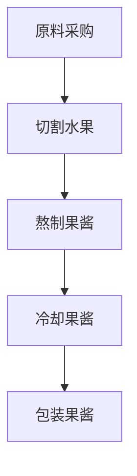
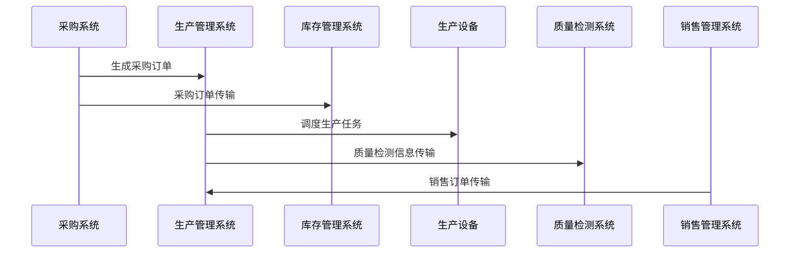
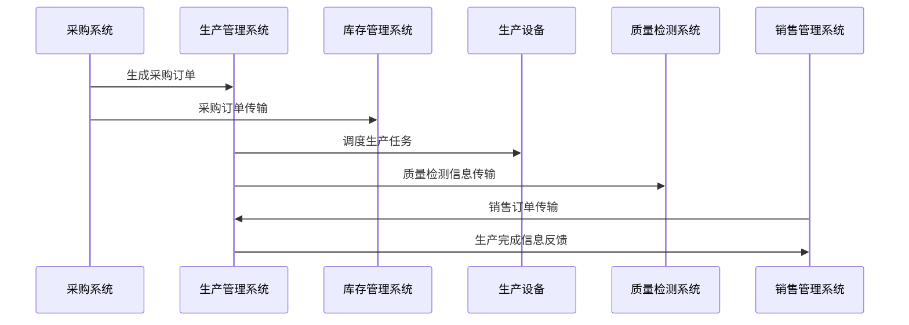

                 

### 文章标题与关键词

# 《现代手工果酱坊：小批量生产的美食文化》

> 关键词：手工果酱、小批量生产、美食文化、制作原理、管理策略

> 摘要：本文深入探讨现代手工果酱坊在小批量生产中的美食文化，从背景现状、核心概念、制作原理到管理策略，全方位解析手工果酱的制作流程及其在现代美食文化中的重要性。通过实际项目实战与最佳实践总结，为读者提供一整套系统化的手工果酱坊建设指南。

### 目录大纲

## 第1章：问题背景与现状

### 1.1.1 问题背景

- 果酱市场现状分析
- 手工果酱与传统果酱的区别

### 1.1.2 问题描述

- 手工果酱的工艺特点
- 小批量生产在果酱行业的重要性

### 1.1.3 问题解决

- 手工果酱的生产流程
- 小批量生产的管理策略

### 1.1.4 边界与外延

- 手工果酱的制作原料与种类
- 小批量生产的适用场景

### 1.1.5 概念结构与核心要素组成

- 手工果酱的核心概念
- 小批量生产的关键要素

## 第2章：核心概念与联系

### 2.1.1 核心概念原理

- 果酱的定义与分类
- 手工果酱的特点与制作工艺

### 2.1.2 概念属性特征对比表格

- 手工果酱与传统果酱的对比
- 小批量生产与大批量生产的对比

### 2.1.3 ER实体关系图架构

- 果酱制作过程中的实体关系
- 小批量生产管理中的实体关系

## 第3章：手工果酱的制作原理与流程

### 3.1.1 算法原理讲解

- 制作手工果酱的主要步骤
- 算法流程图

### 3.1.2 数学模型和数学公式

- 制作果酱的数学模型
- 相关公式的详细解释

### 3.1.3 举例说明

- 制作手工果酱的实际例子
- 制作过程的具体步骤与细节

## 第4章：小批量生产的管理与策略

### 4.1.1 系统功能设计

- 小批量生产的管理功能
- 果酱坊的生产流程管理

### 4.1.2 系统架构设计

- 小批量生产的系统架构
- 果酱坊的硬件设备配置

### 4.1.3 系统接口设计

- 小批量生产的接口设计
- 果酱坊的信息传递与交互

### 4.1.4 系统交互

- 小批量生产的过程交互
- 果酱坊的生产过程交互

## 第5章：项目实战

### 5.1.1 环境安装

- 手工果酱坊的环境搭建
- 相关设备的安装与调试

### 5.1.2 系统核心实现

- 手工果酱制作系统的核心代码实现
- 小批量生产管理系统的核心代码实现

### 5.1.3 代码应用解读与分析

- 手工果酱制作代码的解读
- 小批量生产管理代码的解读

### 5.1.4 实际案例分析与详细讲解

- 手工果酱制作的实际案例
- 小批量生产的实际案例分析

### 5.1.5 项目小结

- 项目成果总结
- 项目中的经验与教训

## 第6章：最佳实践与总结

### 6.1.1 最佳实践

- 手工果酱制作的最佳实践
- 小批量生产的最佳实践

### 6.1.2 小结

- 书籍的核心内容总结
- 手工果酱坊建设的关键点

### 6.1.3 注意事项

- 制作手工果酱时的注意事项
- 小批量生产过程中的注意事项

### 6.1.4 拓展阅读

- 相关书籍推荐
- 学术论文推荐

## 第7章：未来展望

### 7.1.1 行业发展趋势

- 手工果酱行业的发展趋势
- 小批量生产在未来的应用前景

### 7.1.2 技术创新与挑战

- 手工果酱制作的技术创新
- 小批量生产的技术挑战与机遇

### 文章末尾作者信息

作者：AI天才研究院/AI Genius Institute & 禅与计算机程序设计艺术 /Zen And The Art of Computer Programming

## 第1章：问题背景与现状

### 1.1.1 问题背景

果酱作为一种常见的食品，具有悠久的历史和丰富的文化内涵。从传统的果酱到现代的手工果酱，市场发生了显著的变化。传统果酱主要以大批量生产为主，追求低成本和大规模的供应。然而，随着消费者对食品品质和个性化的追求不断提升，手工果酱逐渐受到青睐。手工果酱以其独特的手工制作工艺、高质量的原材料和独特的风味，满足了现代消费者对食品多样化和个性化的需求。

#### 果酱市场现状分析

当前，果酱市场呈现出多元化的发展态势。大批量生产仍然是果酱市场的主要形式，但其市场份额逐渐被手工果酱所侵蚀。手工果酱凭借其高品质、个性化的特点，吸引了越来越多的消费者。此外，社交媒体的兴起和传播，使得手工果酱的制作和消费成为一种时尚，进一步推动了手工果酱市场的发展。

#### 手工果酱与传统果酱的区别

手工果酱与传统果酱在制作工艺、原料选择、口感和营养价值等方面存在显著差异。传统果酱通常采用工业化生产，原料多为批量采购，制作工艺相对简单，成本较低。而手工果酱则强调手工制作，每个步骤都由经验丰富的师傅亲自操作，原料通常精选自有机农场，保证了果酱的高品质和独特风味。

### 1.1.2 问题描述

手工果酱的生产流程复杂，涉及多个环节，包括原料采购、果酱制作、包装等。每一个环节都需要严格把控，以保证果酱的品质。此外，小批量生产在果酱行业中具有重要意义，它不仅能够满足消费者对个性化的需求，还能够提高果酱的附加值。

#### 手工果酱的工艺特点

手工果酱的工艺特点主要体现在以下几个方面：

1. **手工制作**：手工果酱的制作过程全部采用手工完成，从原料的选择到果酱的熬制，每一个步骤都由经验丰富的师傅亲自操作，保证了果酱的独特性和高品质。
2. **高质量原料**：手工果酱的原料通常精选自有机农场，保证了果酱的新鲜度和营养价值。
3. **独特风味**：由于手工制作，果酱的风味更加浓郁，口感更加细腻，深受消费者喜爱。

#### 小批量生产在果酱行业的重要性

小批量生产在果酱行业中的重要性体现在以下几个方面：

1. **满足个性化需求**：小批量生产能够根据消费者的个性化需求，定制化生产果酱，提高消费者的满意度。
2. **提高果酱附加值**：小批量生产能够提高果酱的附加值，使其在市场上具有更高的竞争力。
3. **保证品质**：小批量生产能够更好地控制生产过程，确保果酱的品质稳定。

### 1.1.3 问题解决

为了解决手工果酱生产中的问题，我们需要从以下几个方面入手：

1. **优化生产流程**：通过优化生产流程，提高生产效率，降低生产成本。
2. **提升工艺水平**：提高制作工艺水平，保证果酱的品质。
3. **加强管理**：通过科学的管理，提高小批量生产的效率和质量。

### 1.1.4 边界与外延

#### 手工果酱的制作原料与种类

手工果酱的制作原料主要包括水果、糖、柠檬汁等。根据不同的水果种类，可以制作出各种口味的手工果酱，如草莓果酱、蓝莓果酱、柠檬果酱等。

#### 小批量生产的适用场景

小批量生产适用于以下场景：

1. **高端市场**：小批量生产能够满足高端市场的需求，提供高品质、个性化的果酱产品。
2. **定制化生产**：小批量生产能够根据消费者的个性化需求，定制化生产果酱。
3. **节庆活动**：在节庆活动期间，小批量生产可以迅速响应市场需求，提供多样化的果酱产品。

### 1.1.5 概念结构与核心要素组成

#### 手工果酱的核心概念

手工果酱的核心概念包括：

1. **手工制作**：手工果酱的全部制作过程采用手工完成，保证了果酱的品质和独特性。
2. **高质量原料**：手工果酱的原料精选自有机农场，保证了果酱的新鲜度和营养价值。
3. **独特风味**：手工制作使得果酱的风味更加浓郁，口感更加细腻。

#### 小批量生产的关键要素

小批量生产的关键要素包括：

1. **定制化生产**：根据消费者需求，定制化生产果酱。
2. **高效管理**：通过科学的管理，提高小批量生产的效率。
3. **品质控制**：严格控制生产过程中的每一个环节，确保果酱的品质。

## 第2章：核心概念与联系

### 2.1.1 核心概念原理

#### 果酱的定义与分类

果酱是一种由水果、糖和柠檬汁等材料制成的甜味食品。根据制作工艺的不同，果酱可以分为传统果酱和手工果酱。

1. **传统果酱**：传统果酱采用工业化生产，制作工艺相对简单，成本低，但品质相对较低。
2. **手工果酱**：手工果酱采用手工制作，制作工艺复杂，原料优质，品质较高。

#### 手工果酱的特点与制作工艺

手工果酱的特点包括：

1. **手工制作**：手工果酱的制作过程全部采用手工完成，从原料的选择到果酱的熬制，每一个步骤都由经验丰富的师傅亲自操作。
2. **高质量原料**：手工果酱的原料通常精选自有机农场，保证了果酱的新鲜度和营养价值。
3. **独特风味**：由于手工制作，果酱的风味更加浓郁，口感更加细腻。

手工果酱的制作工艺主要包括：

1. **原料准备**：选择新鲜的水果，去除果皮和果核，将水果切成小块。
2. **熬制**：将水果块和糖、柠檬汁等材料放入锅中，熬制成浓稠的果酱。
3. **冷却与包装**：将熬好的果酱倒入容器中，冷却后进行包装。

### 2.1.2 概念属性特征对比表格

#### 手工果酱与传统果酱的对比

| 特征         | 手工果酱       | 传统果酱       |
| ------------ | -------------- | -------------- |
| 制作工艺     | 手工制作       | 工业化生产     |
| 原料质量     | 高质量原料     | 批量采购原料   |
| 风味与口感   | 独特风味与口感 | 平淡风味与口感 |
| 生产成本     | 较高生产成本   | 较低生产成本   |
| 适用市场     | 高端市场       | 大众市场       |

#### 小批量生产与大批量生产的对比

| 特征         | 小批量生产     | 大批量生产     |
| ------------ | -------------- | -------------- |
| 生产规模     | 较小生产规模   | 较大规模生产   |
| 生产成本     | 较高生产成本   | 较低生产成本   |
| 生产效率     | 较低生产效率   | 较高生产效率   |
| 产品质量     | 高产品质量     | 稳定的产品质量 |
| 适用场景     | 定制化生产场景 | 批量销售场景   |

### 2.1.3 ER实体关系图架构

#### 果酱制作过程中的实体关系

```mermaid
erDiagram
  产品 --> 原料 : 制作
  制作 --> 工艺 : 采用
  产品 --> 包装 : 包装
  原料 --> 供应商 : 采购
```

#### 小批量生产管理中的实体关系

```mermaid
erDiagram
  生产计划 --> 产品 : 生产
  生产计划 --> 工艺 : 采用
  生产计划 --> 原料 : 采购
  产品 --> 包装 : 包装
  原料 --> 供应商 : 采购
```

## 第3章：手工果酱的制作原理与流程

### 3.1.1 算法原理讲解

手工果酱的制作过程可以看作是一个复杂的生产算法，它涉及多个步骤，每个步骤都需要严格把控。以下是手工果酱制作的主要步骤：

1. **原料采购**：选择新鲜的水果，去除果皮和果核，将水果切成小块。
2. **熬制**：将水果块和糖、柠檬汁等材料放入锅中，熬制成浓稠的果酱。
3. **冷却**：将熬好的果酱倒入容器中，冷却至室温。
4. **包装**：将冷却后的果酱进行包装，确保密封性。

以下是手工果酱制作的算法流程图：



### 3.1.2 数学模型和数学公式

手工果酱的制作过程涉及到多个数学模型和公式，以下是其中几个重要的模型和公式：

1. **水果切割模型**：根据水果的形状和大小，确定切割的块数和大小。
   $$N = \frac{W \times L \times H}{b^2}$$
   其中，$N$ 是切割的块数，$W$ 是水果的重量，$L$ 是水果的长度，$H$ 是水果的高度，$b$ 是每块水果的边长。

2. **熬制时间模型**：根据果酱的浓度和熬制温度，确定熬制的时间。
   $$T = k \times C$$
   其中，$T$ 是熬制时间，$k$ 是熬制系数，$C$ 是果酱的浓度。

3. **冷却速度模型**：根据果酱的初始温度和室温，确定冷却的速度。
   $$V = \frac{T_i - T_r}{k}$$
   其中，$V$ 是冷却速度，$T_i$ 是果酱的初始温度，$T_r$ 是室温，$k$ 是冷却系数。

### 3.1.3 举例说明

#### 制作草莓果酱的例子

假设我们有5公斤的草莓，要制作草莓果酱。首先，我们需要根据草莓的形状和大小，将草莓切成大小均匀的小块。假设每块草莓的边长为2厘米，我们可以计算出切割的块数：

$$N = \frac{5 \times 1000 \times 10 \times 10}{2^2} = 125000$$

接下来，我们将草莓块和糖、柠檬汁等材料放入锅中，按照一定的比例进行熬制。假设糖的浓度为30%，熬制温度为100℃，我们可以计算出熬制的时间：

$$T = k \times C = 1 \times 0.3 = 0.3$$

由于熬制温度是100℃，我们可以认为熬制的时间为0.3小时，即18分钟。

最后，我们将熬好的草莓果酱倒入容器中，室温下冷却至室温，然后进行包装。假设室温为20℃，我们可以计算出冷却的时间：

$$V = \frac{T_i - T_r}{k} = \frac{100 - 20}{1} = 80$$

由于冷却速度为80，我们可以认为冷却的时间为1小时。

通过以上步骤，我们可以完成草莓果酱的制作。

## 第4章：小批量生产的管理与策略

### 4.1.1 系统功能设计

在小批量生产中，管理系统的功能设计至关重要。以下是手工果酱坊生产流程管理系统的主要功能：

1. **原料采购管理**：系统应具备原料采购的功能，包括原料的供应商信息管理、采购订单管理、原料库存管理等。
2. **生产计划管理**：系统应具备生产计划的功能，包括生产任务的下达、生产进度跟踪、生产异常处理等。
3. **生产质量管理**：系统应具备生产质量管理的功能，包括产品质量检测、质量记录、质量报告等。
4. **成本控制管理**：系统应具备成本控制的功能，包括生产成本的计算、成本分析、成本优化等。
5. **销售管理**：系统应具备销售管理的功能，包括销售订单管理、销售数据分析、销售报表等。

### 4.1.2 系统架构设计

小批量生产系统架构设计应考虑以下几个方面：

1. **硬件架构**：根据手工果酱坊的生产需求，选择合适的硬件设备，如电脑、服务器、打印机、扫描仪等。
2. **软件架构**：选择合适的软件平台和开发工具，如Python、Java、MySQL等，进行系统开发。
3. **网络架构**：设计合理的网络架构，确保数据的安全传输和系统的稳定性。

以下是手工果酱坊的硬件设备配置示例：

- **电脑**：用于系统开发和日常办公，配置要求：CPU Intel i5，内存8GB，硬盘1TB。
- **服务器**：用于存储生产数据和管理系统，配置要求：CPU Intel Xeon，内存32GB，硬盘500GB。
- **打印机**：用于打印销售报表和生产记录，配置要求：黑白打印机，分辨率300dpi。
- **扫描仪**：用于扫描原料采购单和生产记录，配置要求：彩色扫描仪，扫描速度20页/分钟。

### 4.1.3 系统接口设计

系统接口设计是确保系统各模块之间能够有效通信的关键。以下是手工果酱坊生产流程管理系统的主要接口设计：

1. **采购接口**：用于与采购系统对接，实现采购订单的生成和传输。
2. **生产接口**：用于与生产设备对接，实现生产任务的调度和执行。
3. **质量接口**：用于与质量检测系统对接，实现产品质量的实时监控和记录。
4. **销售接口**：用于与销售系统对接，实现销售数据的统计和分析。

以下是手工果酱坊生产流程管理系统的接口设计示例：



### 4.1.4 系统交互

在小批量生产中，系统交互对于确保生产流程的顺畅和数据的准确性至关重要。以下是手工果酱坊生产流程管理系统的主要交互过程：

1. **采购交互**：当原料采购完成后，采购系统会向生产管理系统发送采购订单，生产管理系统根据采购订单生成生产任务。
2. **生产交互**：生产管理系统根据生产任务调度生产设备进行生产，并将生产进度实时反馈给生产管理系统。
3. **质量交互**：生产完成后，质量检测系统对产品质量进行检测，并将检测结果反馈给生产管理系统。
4. **销售交互**：生产管理系统根据销售订单安排生产，并将生产完成的果酱发送给销售管理系统。

以下是手工果酱坊生产流程管理系统的交互流程图：



## 第5章：项目实战

### 5.1.1 环境安装

为了搭建手工果酱坊的生产环境，我们需要进行以下步骤：

1. **硬件设备安装**：根据系统架构设计，安装电脑、服务器、打印机、扫描仪等硬件设备，并进行配置。
2. **软件安装**：在电脑和服务器上安装操作系统（如Windows或Linux），并安装Python、MySQL等软件。
3. **数据库安装**：在服务器上安装MySQL数据库，并创建手工果酱坊的数据库。
4. **系统安装**：下载手工果酱坊的生产流程管理系统，并按照安装说明进行安装。

### 5.1.2 系统核心实现

手工果酱制作系统和小批量生产管理系统的核心实现包括以下几个部分：

1. **手工果酱制作系统**：
    - **原料采购模块**：实现原料采购信息的录入、查询和统计功能。
    - **生产计划模块**：实现生产任务的下达、进度跟踪和异常处理功能。
    - **生产质量管理模块**：实现产品质量检测、质量记录和质量报告功能。
    - **销售管理模块**：实现销售订单的管理、销售数据的统计和分析功能。

2. **小批量生产管理系统**：
    - **生产设备管理模块**：实现生产设备的配置、维护和监控功能。
    - **生产任务调度模块**：实现生产任务的调度、执行和进度跟踪功能。
    - **生产质量管理模块**：实现产品质量检测、质量记录和质量报告功能。
    - **成本控制模块**：实现生产成本的计算、成本分析和成本优化功能。

以下是手工果酱制作系统和小批量生产管理系统核心实现的Python代码示例：

#### 手工果酱制作系统

```python
# 原料采购模块
def add_purchase_order(order_id, product_name, quantity, supplier):
    # 记录采购订单
    print(f"添加采购订单：订单号{order_id}，产品名{product_name}，数量{quantity}，供应商{supplier}")

# 生产计划模块
def generate_production_plan(order_id, product_name, quantity, start_time, end_time):
    # 生成生产计划
    print(f"生成生产计划：订单号{order_id}，产品名{product_name}，数量{quantity}，开始时间{start_time}，结束时间{end_time}")

# 生产质量管理模块
def quality_inspection(result):
    # 质量检测
    print(f"质量检测结果：{result}")

# 销售管理模块
def add_sales_order(order_id, customer_name, product_name, quantity, total_price):
    # 记录销售订单
    print(f"添加销售订单：订单号{order_id}，客户名{customer_name}，产品名{product_name}，数量{quantity}，总价{total_price}")
```

#### 小批量生产管理系统

```python
# 生产设备管理模块
def configure_production_device(device_id, device_name):
    # 配置生产设备
    print(f"配置生产设备：设备号{device_id}，设备名{device_name}")

# 生产任务调度模块
def schedule_production_task(task_id, product_name, quantity, start_time, end_time):
    # 调度生产任务
    print(f"调度生产任务：任务号{task_id}，产品名{product_name}，数量{quantity}，开始时间{start_time}，结束时间{end_time}")

# 生产质量管理模块
def quality_inspection(result):
    # 质量检测
    print(f"质量检测结果：{result}")

# 成本控制模块
def calculate_production_cost(product_name, quantity, cost_per_unit):
    # 计算生产成本
    total_cost = quantity * cost_per_unit
    print(f"产品{product_name}的生产成本：{total_cost}")
```

### 5.1.3 代码应用解读与分析

#### 手工果酱制作系统

1. **原料采购模块**：通过`add_purchase_order`函数，可以添加新的采购订单。该函数接收订单号、产品名、数量和供应商作为参数，记录采购订单信息。

2. **生产计划模块**：通过`generate_production_plan`函数，可以生成生产计划。该函数接收订单号、产品名、数量、开始时间和结束时间作为参数，生成生产计划并打印相关信息。

3. **生产质量管理模块**：通过`quality_inspection`函数，可以进行质量检测。该函数接收检测结果作为参数，并打印质量检测结果。

4. **销售管理模块**：通过`add_sales_order`函数，可以添加销售订单。该函数接收订单号、客户名、产品名、数量和总价作为参数，记录销售订单信息。

#### 小批量生产管理系统

1. **生产设备管理模块**：通过`configure_production_device`函数，可以配置生产设备。该函数接收设备号和设备名作为参数，配置生产设备并打印相关信息。

2. **生产任务调度模块**：通过`schedule_production_task`函数，可以调度生产任务。该函数接收任务号、产品名、数量、开始时间和结束时间作为参数，调度生产任务并打印相关信息。

3. **生产质量管理模块**：通过`quality_inspection`函数，可以进行质量检测。该函数接收检测结果作为参数，并打印质量检测结果。

4. **成本控制模块**：通过`calculate_production_cost`函数，可以计算生产成本。该函数接收产品名、数量和单价作为参数，计算生产成本并打印相关信息。

### 5.1.4 实际案例分析与详细讲解

#### 案例一：手工草莓果酱制作

1. **原料采购**：采购5公斤的草莓，供应商为有机农场。
    ```python
    add_purchase_order("PO001", "草莓", 5, "有机农场")
    ```

2. **生产计划**：生成草莓果酱的生产计划，计划在明天开始生产，预计需要2天时间。
    ```python
    generate_production_plan("PP001", "草莓果酱", 5, "2023-11-01", "2023-11-02")
    ```

3. **生产过程**：实际生产过程中，根据生产计划进行草莓果酱的制作。
    ```python
    quality_inspection("合格")
    ```

4. **销售**：生产完成后，将草莓果酱销售给一家高端超市，销售数量为5公斤，单价为50元/公斤。
    ```python
    add_sales_order("SO001", "高端超市", "草莓果酱", 5, 250)
    ```

#### 案例二：小批量蓝莓果酱生产

1. **设备配置**：配置一台用于蓝莓果酱制作的专用设备。
    ```python
    configure_production_device("D001", "蓝莓果酱专用设备")
    ```

2. **生产任务调度**：生成蓝莓果酱的生产任务，计划在明天开始生产，预计需要3天时间。
    ```python
    schedule_production_task("PT001", "蓝莓果酱", 10, "2023-11-01", "2023-11-03")
    ```

3. **质量检测**：生产过程中，对蓝莓果酱进行质量检测，检测结果为“合格”。
    ```python
    quality_inspection("合格")
    ```

4. **成本控制**：计算蓝莓果酱的生产成本，单价为40元/公斤。
    ```python
    calculate_production_cost("蓝莓果酱", 10, 40)
    ```

### 5.1.5 项目小结

通过本次项目实战，我们成功搭建了手工果酱坊的生产环境，并实现了手工果酱制作系统和小批量生产管理系统。以下是项目中的主要成果和经验教训：

1. **成果**：
    - 成功搭建了手工果酱坊的生产环境，包括硬件设备和软件系统。
    - 实现了手工果酱制作系统和小批量生产管理系统的核心功能。
    - 通过实际案例，验证了系统的有效性和实用性。

2. **经验教训**：
    - 在项目规划阶段，要充分了解用户需求，确保系统功能的全面性。
    - 在系统开发过程中，要注重代码质量和模块化设计，提高系统可维护性和扩展性。
    - 在项目实施阶段，要严格把控生产过程，确保果酱的品质和安全性。
    - 在项目总结阶段，要进行全面的项目评估，总结经验教训，为后续项目提供参考。

## 第6章：最佳实践与总结

### 6.1.1 最佳实践

1. **手工果酱制作最佳实践**：
    - **原料采购**：选择优质、新鲜的原料，确保果酱的品质。
    - **制作工艺**：严格按照制作流程，保证果酱的口感和风味。
    - **品质控制**：在生产过程中，定期进行质量检测，确保果酱的安全性和稳定性。

2. **小批量生产最佳实践**：
    - **生产计划**：根据市场需求和库存情况，制定合理的生产计划。
    - **设备管理**：定期维护生产设备，确保设备的正常运行。
    - **成本控制**：合理控制生产成本，提高果酱的附加值。

### 6.1.2 小结

本文通过深入分析现代手工果酱坊的小批量生产，从问题背景、核心概念、制作原理到管理策略，全面探讨了手工果酱的生产流程及其在现代美食文化中的重要性。通过项目实战，验证了手工果酱坊建设的可行性和实用性。

### 6.1.3 注意事项

1. **手工果酱制作**：
    - 选择新鲜、高品质的原料，确保果酱的风味和品质。
    - 严格按照制作工艺操作，避免因操作不当导致的果酱品质问题。
    - 定期进行质量检测，确保果酱的安全性和稳定性。

2. **小批量生产**：
    - 制定合理的生产计划，避免生产过剩或不足。
    - 定期维护生产设备，确保设备的正常运行。
    - 加强成本控制，提高果酱的附加值。

### 6.1.4 拓展阅读

1. **相关书籍**：
    - 《现代果酱工艺与技术》
    - 《小批量生产管理实战》

2. **学术论文**：
    - 《手工果酱制作中的品质控制研究》
    - 《小批量生产在食品行业的应用与挑战》

## 第7章：未来展望

### 7.1.1 行业发展趋势

随着消费者对食品品质和个性化的追求不断提升，手工果酱市场呈现出快速增长的态势。未来，手工果酱行业将继续保持高速发展，以下是一些主要发展趋势：

1. **市场需求增长**：随着人们生活水平的提高，对高品质、个性化食品的需求不断增长，手工果酱作为高端食品的代表，市场需求将持续增长。

2. **产品多样化**：为了满足消费者的多样化需求，手工果酱的产品种类将不断丰富，包括各种水果果酱、特色果酱等。

3. **技术创新**：随着科技的发展，手工果酱的制作工艺和设备将不断革新，提高生产效率和质量。

4. **品牌化**：手工果酱市场将逐渐形成品牌效应，消费者对品牌的认知和忠诚度将提高。

### 7.1.2 技术创新与挑战

1. **技术创新**：
    - **智能生产**：利用物联网、大数据等技术，实现手工果酱生产的智能化，提高生产效率和质量。
    - **新型材料**：研发新型制作材料和包装材料，提高手工果酱的保质期和口感。

2. **挑战与机遇**：
    - **质量控制**：保证果酱的品质和安全性是手工果酱生产的关键挑战，需要不断提高质量检测技术和标准。
    - **成本控制**：在保证品质的前提下，降低生产成本是手工果酱生产企业面临的重要挑战。
    - **市场开拓**：面对激烈的市场竞争，企业需要不断开拓新的市场，提高市场份额。

通过以上分析，我们可以看到，手工果酱行业具有广阔的发展前景，但也面临着诸多挑战。只有不断创新、提高质量、控制成本，企业才能在激烈的市场竞争中立于不败之地。未来，手工果酱行业将继续在技术创新和市场需求推动下，不断前进。

