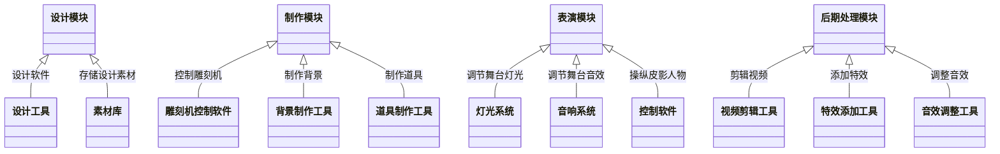
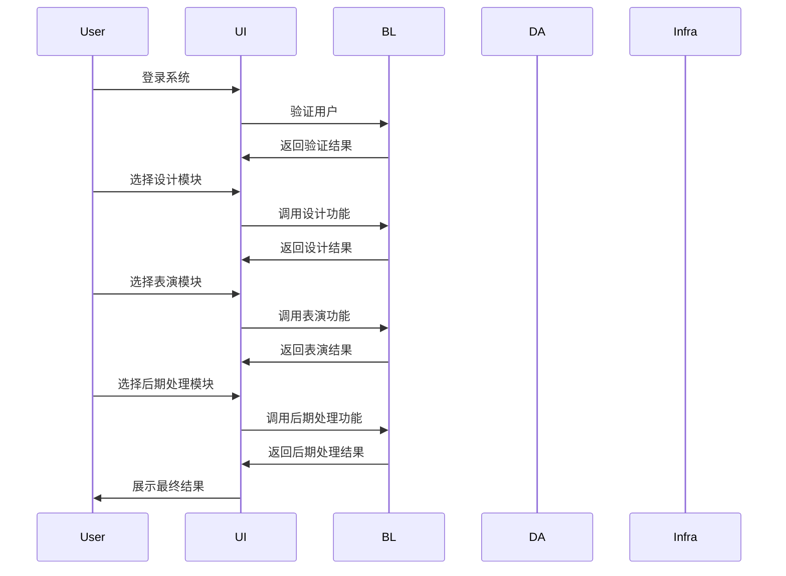
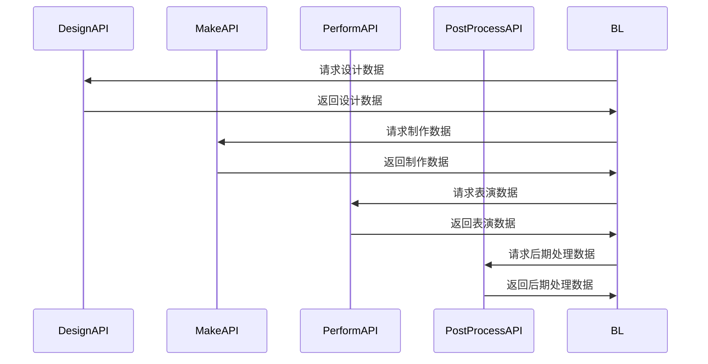
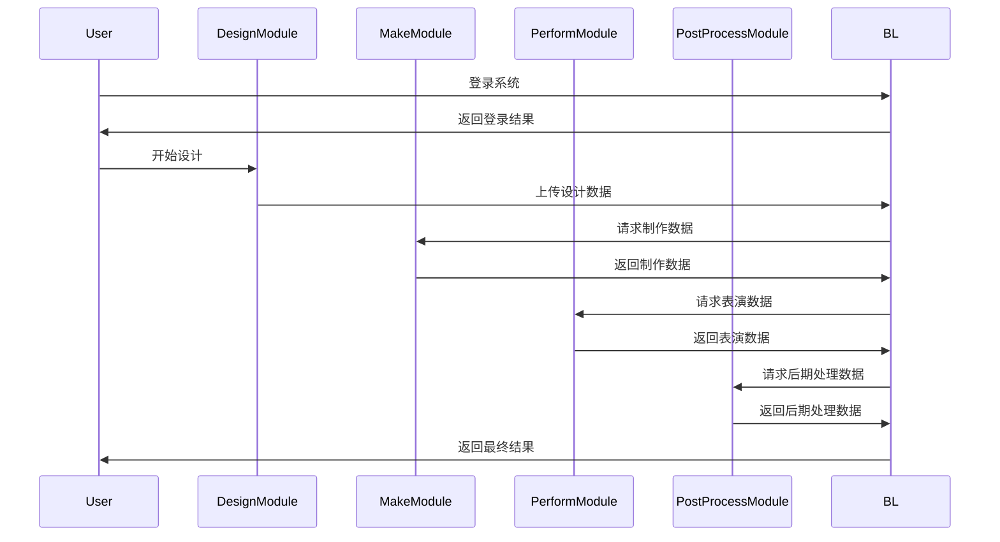

                 

# 现代手工皮影戏：传统艺术在当代舞台的复兴

关键词：皮影戏、传统艺术、现代舞台、艺术复兴、文化传承

摘要：本文从现代手工皮影戏的背景与发展、制作工艺、舞台表演艺术、舞台复兴、传承与创新、文化意义和社会价值、实践与应用等多个方面，详细介绍了现代手工皮影戏在当代舞台的复兴与发展。通过对核心概念与联系的分析，算法原理讲解，以及系统架构设计等内容，深入探讨了现代手工皮影戏在数字艺术、虚拟现实和教育领域的应用。本文旨在为读者提供一个全面、系统的了解现代手工皮影戏的视角，激发对传统艺术的关注与思考。

## 目录大纲

1. 现代手工皮影戏概述
2. 第一部分: 现代手工皮影戏概述
   2.1 现代手工皮影戏的背景与发展
   2.2 现代手工皮影戏的制作工艺
   2.3 现代手工皮影戏的舞台表演艺术
   2.4 现代手工皮影戏在现代舞台的复兴
   2.5 现代手工皮影戏的传承与创新
   2.6 现代手工皮影戏的文化意义与社会价值
   2.7 现代手工皮影戏的实践与应用
3. 核心概念与联系
4. 算法原理讲解
5. 系统分析与架构设计方案
6. 项目实战
7. 最佳实践 tips、小结、注意事项、拓展阅读

----------------------------------------------------------------

## 第一部分: 现代手工皮影戏概述

### 2.1 现代手工皮影戏的背景与发展

#### 1.1.1 传统皮影戏的历史与发展

皮影戏，作为中国古老的传统艺术形式之一，起源于汉代，兴盛于唐宋，至今已有两千多年的历史。它是一种以灯光照射下，将剪刻而成的纸片或皮革人物投影在半透明的屏幕上，通过操纵这些人物进行表演的戏剧形式。传统皮影戏不仅在民间广为流传，还曾在宫廷中盛极一时。

在历史的长河中，皮影戏经历了多次演变和发展。最初，皮影戏以宗教仪式的形式出现，主要用于祭祀和驱邪。随着社会的发展，皮影戏逐渐演变成一种娱乐形式，表演内容也从宗教神话转向世俗生活。宋代时期，皮影戏达到了鼎盛，不仅在国内广泛传播，还通过丝绸之路传到了西亚和欧洲。

#### 1.1.2 现代手工皮影戏的兴起与复兴

然而，随着电影、电视等现代娱乐形式的兴起，皮影戏在20世纪初逐渐衰落。然而，在21世纪初，皮影戏又迎来了新的复兴。这一复兴并非偶然，而是与现代科技和文化创意产业的融合密不可分。

首先，现代手工皮影戏的制作工艺得到了极大的提升。借助计算机图形学和3D打印技术，皮影戏人物的设计和雕刻变得更加精细，色彩也更加丰富多彩。其次，现代舞台灯光和音效技术的运用，使得皮影戏的表演形式更加多样化，观赏性和表现力也得到了显著提升。

此外，皮影戏的复兴还离不开文化创意产业的推动。在现代社会，皮影戏不仅作为一种传统文化艺术形式得到保护和发展，还被赋予了更多的文化内涵和商业价值。许多现代艺术家和设计师开始尝试将皮影戏与现代艺术相结合，创作出独具特色的皮影戏作品。

#### 1.1.3 现代手工皮影戏的特点与价值

现代手工皮影戏具有以下几个显著特点：

1. **融合传统与现代**：现代手工皮影戏在保留传统手工技艺的基础上，融入了现代科技元素，使得表演形式更加多样化和具有观赏性。
   
2. **观赏性与互动性**：通过灯光和音效的运用，观众可以更加直观地感受到皮影戏的魅力，增强了观赏体验。

3. **文化传承与创新**：现代手工皮影戏在传承传统皮影戏技艺的同时，不断创新，使得这一古老艺术形式焕发出新的生命力。

现代手工皮影戏的价值不仅仅体现在艺术层面，还具有重要的社会和文化意义：

1. **传统文化传承**：现代手工皮影戏的兴起，使得皮影戏这一古老艺术形式得以传承和发展，为中华民族的文化遗产保护做出了重要贡献。

2. **艺术价值**：现代手工皮影戏以其独特的艺术形式和深厚的文化内涵，成为了一种具有高度艺术价值的艺术形式。

3. **社会价值**：现代手工皮影戏的表演和展览，不仅丰富了人们的文化生活，还促进了文化交流和互动，具有重要的社会价值。

通过以上分析，我们可以看到，现代手工皮影戏的兴起不仅是对传统皮影戏的复兴，更是对传统文化艺术的一种创新和发展。在现代社会，现代手工皮影戏作为一种融合传统与现代的艺术形式，正在发挥着越来越重要的作用。

### 2.2 现代手工皮影戏的制作工艺

#### 2.2.1 皮影戏人物的设计与雕刻

现代手工皮影戏的制作工艺是皮影戏艺术的重要组成部分，它不仅体现了制作者的技艺水平，也直接影响着皮影戏的表演效果。皮影戏人物的设计与雕刻是制作工艺中的关键步骤。

首先，皮影戏人物的设计需要考虑其角色特点和故事情节。设计师通常会根据剧本需求，设计出符合角色性格和故事背景的人物形象。设计过程中，设计师会使用计算机图形软件，如Adobe Illustrator或AutoCAD，绘制出人物轮廓和细节。这些图形文件会被保存为矢量格式，以便于后续的雕刻和打印。

接下来是雕刻环节。传统的皮影戏人物雕刻通常使用牛角或竹刀，而现在更多的是使用电动雕刻机。雕刻机可以根据设计图自动雕刻出人物形象。雕刻过程需要精细操作，确保每个细节都准确无误。雕刻完成后，人物形象会进行打磨和抛光，使其表面光滑，便于投影。

#### 2.2.2 皮影戏背景的设计与制作

皮影戏背景的设计与制作同样重要。背景设计不仅要符合故事情节，还要具有艺术美感。设计师会根据剧本需求，设计出不同的场景，如森林、城堡、街道等。背景设计同样会使用计算机图形软件进行绘制，确保画面协调和统一。

背景的制作通常包括以下步骤：

1. **绘制图案**：设计师在计算机上绘制出背景图案，并将其保存为适合打印的格式。

2. **打印图案**：将绘制好的背景图案打印在透明胶片或纸上。

3. **雕刻背景**：使用电动雕刻机对打印好的背景图案进行雕刻，使其成为可以投影的透明背景。

4. **上色**：背景雕刻完成后，需要对其进行上色处理。传统的上色方法包括手工绘画和印刷，而现代更多使用喷绘技术，以提高色彩鲜艳度和持久度。

#### 2.2.3 皮影戏道具的设计与制作

皮影戏道具的设计与制作也是现代手工皮影戏制作工艺中的重要环节。道具不仅为故事情节服务，还丰富了表演效果。设计师会根据剧本需求，设计出各种道具，如武器、家具、交通工具等。

道具制作步骤通常如下：

1. **设计图案**：设计师根据道具需求，使用计算机图形软件绘制出道具图案。

2. **打印图案**：将绘制好的道具图案打印在合适的材料上，如纸张、皮革或塑料。

3. **雕刻与打磨**：使用电动雕刻机对打印好的道具图案进行雕刻，然后进行打磨和抛光，使其表面光滑。

4. **上色与组装**：对雕刻好的道具进行上色处理，最后进行组装，确保道具的完整性和稳定性。

通过以上步骤，现代手工皮影戏的制作工艺得以实现。这些工艺不仅保留了传统皮影戏的手工制作特点，还融入了现代科技元素，使得皮影戏在当代舞台上焕发出新的生命力。

### 2.3 现代手工皮影戏的舞台表演艺术

#### 2.3.1 皮影戏的表演技巧与手法

现代手工皮影戏的舞台表演艺术在传统皮影戏的基础上，融入了更多的创新元素，使得表演形式更加多样化和具有观赏性。皮影戏的表演技巧与手法是现代舞台表演艺术的核心，下面将详细介绍几种常见的表演技巧与手法。

1. **操纵技巧**：皮影戏的表演者需要具备高超的操纵技巧，以精确地控制皮影人物的动作和表情。操纵技巧包括手持皮影人物的关节和动作的协调性，以及通过手指和手腕的灵活操作，使皮影人物呈现出流畅的动作。表演者还需要掌握在不同角度和光线条件下，如何调整皮影人物的位置和姿态，以获得最佳的投影效果。

2. **光影技巧**：现代手工皮影戏的舞台表演中，灯光和投影技巧发挥着重要作用。表演者需要巧妙地运用舞台灯光，创造出不同的光影效果，增强皮影戏的视觉冲击力。例如，通过调整灯光的强弱和颜色，可以营造出不同氛围的场景，如夜晚的街景、森林中的神秘氛围等。同时，投影技巧也至关重要，表演者需要掌握如何通过投影屏幕的角度和距离，使得皮影人物的影像更加清晰和立体。

3. **音乐与音效**：音乐和音效是皮影戏表演的重要元素，它们能够增强故事情节的表现力和感染力。表演者通常会在表演过程中加入背景音乐和音效，如脚步声、风声、鸟鸣声等，以营造逼真的场景氛围。同时，表演者还需要根据剧情的发展，适时地调整音乐和音效的节奏和强度，使得观众能够更加深入地体验到故事情节。

4. **互动表演**：现代手工皮影戏的表演不再局限于传统的单向展示，而是更多地与观众互动。表演者可以通过提问、回答观众的提问，或者邀请观众上台参与表演，使观众成为表演的一部分。这种互动表演不仅增加了观众的参与感，也使得皮影戏更加生动和有趣。

5. **多角色互动**：传统皮影戏通常只涉及一个角色，而现代手工皮影戏则能够同时呈现多个角色。表演者需要协调多个角色的动作和表情，使其相互呼应和互动，增强表演的戏剧效果。这种多角色互动的表演形式，不仅丰富了皮影戏的剧情和内容，也提高了观众的观赏体验。

#### 2.3.2 皮影戏的舞台设计与应用

皮影戏的舞台设计是表演艺术的重要组成部分，它不仅影响表演的效果，还直接影响观众的观看体验。舞台设计需要考虑以下几个方面：

1. **舞台布局**：舞台布局是皮影戏舞台设计的基础。舞台通常包括主舞台、侧舞台和后台。主舞台用于放置皮影人物和背景，侧舞台用于放置表演者和道具，后台则用于存储和更换道具。舞台布局的设计要确保皮影人物和表演者之间的距离适中，以便观众能够清晰地看到表演。

2. **灯光设计**：灯光设计是皮影戏舞台效果的关键。表演者需要根据剧情和表演需求，合理地布置灯光。例如，在表现夜晚场景时，可以使用暖色调的灯光，营造出温馨、舒适的氛围；而在表现激烈战斗场景时，可以使用冷色调的灯光，增强紧张感和戏剧性。

3. **投影设计**：投影设计直接影响皮影戏的视觉效果。表演者需要根据皮影人物和背景的大小和形状，选择合适的投影屏幕和投影设备。同时，还需要调整投影屏幕的角度和距离，以确保皮影人物的影像清晰、立体。

4. **音效设计**：音效设计是皮影戏舞台表演的重要环节。表演者需要根据剧情和表演需求，选择合适的音乐和音效。例如，在表现激战场景时，可以使用激烈的战斗音乐和炮火声，增强戏剧效果；而在表现抒情场景时，可以使用悠扬的旋律和风声，营造浪漫的氛围。

5. **布景设计**：布景设计是皮影戏舞台设计的重要组成部分。布景需要根据剧情和表演需求进行设计，例如森林、城堡、城市等。布景的设计要注重细节和层次感，使观众能够沉浸在故事情节中。

通过合理的舞台设计，现代手工皮影戏能够在舞台上呈现出更加逼真和生动的表演效果，增强观众的观赏体验。

#### 2.3.3 皮影戏的表演形式与创新

现代手工皮影戏的表演形式在不断发展和创新，不仅保留了传统皮影戏的表演风格，还融入了现代元素，使表演更加多样化和具有观赏性。以下是几种现代手工皮影戏的表演形式与创新：

1. **多媒体融合**：现代手工皮影戏将多媒体技术融入表演中，通过投影、动画、视频等手段，增强表演的视觉效果和戏剧性。例如，在表演过程中，可以将皮影人物与动画角色结合，形成一种全新的表演形式，使观众能够在视觉上获得更多的冲击和惊喜。

2. **互动表演**：现代手工皮影戏的互动表演形式使得观众成为表演的一部分，增强了观众的参与感和体验感。表演者可以通过与观众的互动，提问、回答问题，或者邀请观众上台参与表演，使皮影戏更加生动和有趣。这种互动表演不仅增加了观众的参与度，也使得表演更加互动和具有趣味性。

3. **现场音乐**：现场音乐是现代手工皮影戏表演的重要元素，它能够增强故事情节的表现力和感染力。表演者可以邀请音乐家现场演奏，或者使用现场录制音乐，使皮影戏的表演更加丰富和生动。现场音乐不仅能够营造故事氛围，还能够增强观众的情感共鸣。

4. **多角色互动**：现代手工皮影戏的多角色互动表演形式使得多个角色能够同时出现，增强了剧情的复杂性和戏剧性。表演者需要协调多个角色的动作和表情，使其相互呼应和互动，增强表演的戏剧效果。这种多角色互动的表演形式，不仅丰富了皮影戏的剧情和内容，也提高了观众的观赏体验。

5. **主题表演**：现代手工皮影戏的主题表演形式使得表演内容更加多样化，可以根据不同的主题和故事情节进行创作。例如，可以创作以科幻、奇幻、历史等为主题的作品，使皮影戏能够更广泛地吸引观众。

通过以上的创新，现代手工皮影戏不仅保留了传统皮影戏的表演风格，还在表演形式和内容上进行了丰富和拓展，使得这一古老的艺术形式在当代舞台上焕发出新的生命力。

### 2.4 现代手工皮影戏在现代舞台的复兴

#### 2.4.1 现代手工皮影戏在舞台艺术中的融合

现代手工皮影戏在现代舞台艺术中的融合，不仅是对传统艺术形式的复兴，更是对当代艺术表现手段的创新。皮影戏作为一种古老的表演艺术，其独特的光影效果和故事叙述方式，为现代舞台艺术带来了新的视角和可能性。

首先，皮影戏与现代戏剧的融合。在戏剧表演中，皮影戏作为一种辅助表演手段，能够增强戏剧的视觉冲击力和表现力。例如，在表现激烈战斗场景时，皮影戏的投影效果可以营造出逼真的战争氛围，增强观众的代入感。同时，皮影戏也可以作为一种独立的表演单元，与戏剧表演相互呼应，增强整体表演的艺术效果。

其次，皮影戏与现代舞蹈的融合。现代舞蹈强调身体的流动性和表现力，而皮影戏则通过光影和动作的协调，呈现出独特的视觉效果。皮影戏与舞蹈的结合，可以创造出一种新的表演形式，使舞蹈更具视觉冲击力和艺术感染力。例如，在舞蹈表演中，皮影戏可以作为背景画面，与舞者的动作相互呼应，形成一种独特的舞蹈语言。

此外，皮影戏与现代音乐剧的融合也具有重要意义。音乐剧作为一种综合性的表演艺术形式，皮影戏的融入可以丰富音乐剧的视觉表现，增强故事叙述的层次感。例如，在音乐剧表演中，皮影戏可以用于表现故事中的关键情节，通过光影效果和音乐节奏的配合，使故事更加生动和感人。

#### 2.4.2 现代手工皮影戏在国际舞台上的表现

现代手工皮影戏在国际舞台上的表现，不仅展示了中国传统文化的独特魅力，也赢得了全球观众的认可和喜爱。近年来，随着中国文化在国际上的影响力不断提高，现代手工皮影戏逐渐走向国际舞台，成为中国文化的一种代表性艺术形式。

在国际舞台上，现代手工皮影戏的表现形式多样，包括独奏、小组表演、大型演出等。通过不同的表演形式，现代手工皮影戏展示了其独特的艺术魅力。例如，在国际戏剧节上，现代手工皮影戏的表演不仅赢得了观众的掌声，还引起了媒体的关注和报道。

此外，现代手工皮影戏在国际上的传播和推广，也为中外文化交流提供了新的平台。许多国际艺术节和戏剧节邀请现代手工皮影戏作为表演节目，吸引了大量观众和艺术家的参与。通过这些国际交流，现代手工皮影戏不仅得到了更多人的了解和喜爱，也促进了中外文化的相互学习和融合。

#### 2.4.3 现代手工皮影戏的未来发展趋势

随着现代科技的发展和文化的多元化，现代手工皮影戏的未来发展趋势呈现出以下几个方向：

首先，科技的融合。现代手工皮影戏将越来越多地融入现代科技元素，如3D打印、虚拟现实、增强现实等。这些技术的应用，不仅可以提高皮影戏的制作效率和质量，还可以增强观众的观赏体验。例如，通过3D打印技术，可以制作出更加精细和复杂的皮影人物，通过虚拟现实技术，观众可以身临其境地感受皮影戏的表演。

其次，形式的创新。现代手工皮影戏将继续探索新的表演形式和艺术风格，以适应现代观众的审美需求。例如，将皮影戏与动漫、游戏等流行文化相结合，创作出更具时代特色的皮影戏作品。同时，现代手工皮影戏也将继续尝试与其他艺术形式的融合，如音乐、舞蹈、戏剧等，形成一种全新的表演风格。

此外，教育的推广。现代手工皮影戏将在教育领域发挥更大的作用，通过皮影戏的教育推广，让更多的人了解和喜爱这一传统艺术。例如，在学校开设皮影戏课程，培养学生的艺术素养和创造力；通过皮影戏的普及活动，提高公众对传统文化的认识和兴趣。

总之，现代手工皮影戏的未来发展充满机遇和挑战。在传承和发展的过程中，现代手工皮影戏将继续融合传统与现代，创新与传承，为观众带来更多精彩的表演。

### 2.5 现代手工皮影戏的传承与创新

#### 2.5.1 现代手工皮影戏的传承问题与对策

现代手工皮影戏的传承面临着一系列挑战。首先，传统工艺的传承难度大。现代手工皮影戏的制作工艺复杂，需要高超的技艺和经验积累。随着现代社会节奏的加快，年轻人对传统工艺的兴趣逐渐减弱，导致工艺传承后继无人。

其次，文化认知不足。皮影戏作为一种传统艺术形式，在现代社会中的认知度和影响力有限。许多年轻人甚至不知道皮影戏是什么，更不用说了解其深厚的文化内涵和历史价值。这种文化认知不足，严重制约了皮影戏的传承与发展。

针对上述问题，可以采取以下对策：

1. **教育推广**：在学校和社会组织中推广皮影戏教育，通过开设课程、举办讲座和展览等方式，让更多的人了解和喜爱皮影戏。同时，将皮影戏纳入中小学艺术教育课程，培养学生的兴趣和技能。

2. **技艺传承**：建立皮影戏技艺传承基地，邀请老艺人传授技艺，培养新一代皮影戏制作和表演人才。同时，利用现代科技手段，如视频记录、在线教程等，将传统工艺进行数字化保存和传播。

3. **文化宣传**：通过媒体和互联网平台，加大对皮影戏的宣传力度，提高公众对皮影戏的认知和兴趣。例如，制作皮影戏相关的纪录片、电影、动画片等，让皮影戏走进大众视野。

4. **政策支持**：政府可以出台相关政策，支持和鼓励皮影戏的传承和发展。例如，提供财政补贴、税收优惠等政策，鼓励企业和个人参与皮影戏的制作和推广。

#### 2.5.2 现代手工皮影戏的创新探索与实践

在传承传统艺术的同时，现代手工皮影戏也在不断创新，探索新的艺术形式和表现手法。以下是一些创新探索与实践：

1. **多媒体融合**：将皮影戏与多媒体技术相结合，通过投影、动画、视频等手段，增强皮影戏的视觉冲击力和表现力。例如，利用虚拟现实技术，观众可以身临其境地观看皮影戏表演，体验不同的观看视角。

2. **跨界合作**：与其他艺术形式和行业进行跨界合作，如与戏剧、舞蹈、音乐、动漫等相结合，创作出更具创意和观赏性的皮影戏作品。这种跨界合作不仅丰富了皮影戏的表现形式，也为传统艺术注入了新的活力。

3. **主题创作**：根据现代社会的需求和审美趋势，创作出与现代社会相关联的皮影戏作品。例如，以科幻、奇幻、历史等为主题，创作出符合现代观众口味的皮影戏作品。

4. **艺术教育**：将皮影戏融入艺术教育中，培养新一代皮影戏艺术家。例如，通过开设皮影戏创作班、艺术工作坊等，让更多学生了解和掌握皮影戏的制作和表演技艺。

5. **文创产品**：开发皮影戏相关的文化创意产品，如皮影戏人物摆件、绘本、服装等，通过市场化运作，推动皮影戏的传播和发展。

通过以上创新探索与实践，现代手工皮影戏不仅传承了传统艺术，还焕发出了新的生命力，为观众带来了更多精彩的表演和作品。

#### 2.5.3 现代手工皮影戏的教育与普及

现代手工皮影戏的教育与普及是传承这一古老艺术形式的重要途径，也是提升公众文化素养和艺术欣赏能力的重要手段。以下从几个方面探讨现代手工皮影戏的教育与普及：

1. **学校教育**：将现代手工皮影戏纳入学校艺术课程，通过课堂教学和实践活动，让学生了解皮影戏的历史、制作工艺和表演艺术。学校可以组织皮影戏社团，让学生亲自参与皮影戏的制作和表演，提高他们的动手能力和艺术修养。

2. **社区活动**：在社区开展皮影戏普及活动，如皮影戏展览、表演和制作体验等。通过这些活动，让社区居民尤其是年轻人了解皮影戏，增强他们的文化认同感和自豪感。

3. **文化讲座与工作坊**：定期举办皮影戏文化讲座和工作坊，邀请皮影戏专家和艺术家讲解皮影戏的历史、文化和制作技巧，吸引更多人参与和学习。

4. **线上教育**：利用互联网和社交媒体平台，开设皮影戏在线课程和教程，方便学习者随时随地学习和交流。同时，通过线上直播和视频分享，让更多人了解和欣赏皮影戏。

5. **艺术展览**：举办皮影戏艺术展览，展示现代手工皮影戏的精品作品和制作过程，提升公众对皮影戏的认知和欣赏水平。

通过以上措施，现代手工皮影戏的教育与普及工作将得到有效推进，为皮影戏的传承和发展奠定坚实基础。

### 2.6 现代手工皮影戏的文化意义与社会价值

#### 6.1.1 现代手工皮影戏的传统文化传承

现代手工皮影戏作为中国传统文化的重要组成部分，承载了中华民族数千年的历史和文化。通过皮影戏，人们可以了解到古代的社会风貌、道德伦理、风俗习惯以及神话传说。这种传统文化传承不仅是对历史的回顾，更是对民族精神的传承和弘扬。

首先，皮影戏作为一种古老的表演艺术形式，其起源可以追溯到汉代。在唐宋时期，皮影戏达到了鼎盛，成为了一种广受欢迎的民间娱乐方式。皮影戏的剧本内容丰富，既有神话传说、历史故事，也有世俗生活，涵盖了广泛的社会生活领域。通过皮影戏的表演，观众不仅可以感受到故事的魅力，还能体会到传统文化的精髓。

其次，皮影戏的制作工艺独特，体现了中国传统手工艺术的精湛技艺。皮影戏人物的设计和雕刻，通常采用皮革或纸张等材料，通过手工制作出各种形象生动的人物和道具。这种制作工艺不仅考验艺人的技艺水平，也体现了中国传统文化中对美学的追求。在现代手工皮影戏的制作过程中，许多传统工艺得到了保留和传承，如雕刻、绘画、上色等，这些工艺不仅具有艺术价值，也具有重要的历史和文化意义。

此外，皮影戏在传播和传承过程中，逐渐形成了独特的表演风格和艺术形式。皮影戏的表演通常伴随着音乐和歌唱，表演者通过操纵皮影人物，配合音乐和歌唱，讲述故事、传递情感。这种表演形式不仅具有高度的观赏性，也具有强烈的互动性。观众在观看皮影戏的过程中，可以感受到表演者与皮影人物之间的默契和情感交流，从而更好地理解和欣赏这一传统文化艺术。

#### 6.1.2 现代手工皮影戏的艺术价值与审美意义

现代手工皮影戏在艺术价值与审美意义方面同样具有重要的地位。首先，皮影戏以其独特的艺术形式和表演风格，成为中国传统艺术宝库中的一颗璀璨明珠。皮影戏的表演不仅注重情节的叙述，更强调视觉和听觉的统一。通过光影效果和音乐节奏的配合，皮影戏创造出了独特的艺术氛围，使观众在欣赏过程中感受到强烈的视觉冲击和情感共鸣。

其次，皮影戏的审美意义在于其独特的艺术语言和美学风格。皮影戏人物的设计和雕刻，通常采用简洁明快的线条和色彩，既体现了中国传统绘画艺术的特点，又融合了现代审美观念。这种艺术语言不仅具有鲜明的民族特色，也具有普遍的审美价值。

此外，皮影戏在艺术表现力方面具有独特的优势。通过皮影人物的操纵和表演，表演者可以灵活地表现各种情感和情节，使观众能够深入地体验到故事的魅力。皮影戏的表演形式多样，包括独奏、小组表演、大型演出等，不同的表演形式可以满足不同观众的需求，使皮影戏在艺术表现力上具有广泛的应用价值。

#### 6.1.3 现代手工皮影戏的社会价值与影响力

现代手工皮影戏在社会价值与影响力方面同样具有重要的地位。首先，皮影戏作为一种传统文化艺术形式，对于增强民族凝聚力和文化认同感具有重要作用。通过皮影戏的表演和传播，人们可以更好地了解和认识自己的文化根源，从而增强对民族文化的自豪感和认同感。

其次，皮影戏在促进文化交流和互动方面具有积极作用。皮影戏作为一种国际化的艺术形式，已经得到了全球观众的认可和喜爱。通过国际交流与合作，皮影戏不仅展示了中国的传统文化艺术，也为世界各国观众带来了独特的艺术体验。这种文化交流和互动，不仅促进了不同文化之间的相互理解和尊重，也为世界文化的多样性和繁荣做出了贡献。

此外，皮影戏在推动文化创意产业和经济发展方面也具有重要作用。现代手工皮影戏的复兴，不仅为皮影戏艺人提供了就业机会，也为相关产业链的发展提供了契机。例如，皮影戏的表演和展览活动，吸引了大量观众和游客，为当地经济发展注入了新的活力。同时，皮影戏相关的文化创意产品，如皮影戏人物摆件、绘本、服装等，也受到了消费者的喜爱，为文化创意产业的发展提供了新的动力。

总之，现代手工皮影戏在传统文化传承、艺术价值与审美意义、社会价值与影响力等方面都具有重要的地位。通过不断创新和推广，现代手工皮影戏将继续焕发出新的生命力，为中华民族的文化传承和发展做出更大的贡献。

### 2.7 现代手工皮影戏的实践与应用

#### 2.7.1 现代手工皮影戏在文化创意产业中的应用

现代手工皮影戏在文化创意产业中的应用，为这一传统艺术形式注入了新的活力。随着文化创意产业的快速发展，皮影戏不仅作为一种表演艺术形式，还成为了一种重要的文化商品和创意设计资源。

首先，皮影戏在文化商品设计中的应用十分广泛。例如，皮影戏人物形象被广泛应用于玩具、文具、饰品、家居用品等领域。通过创新设计和制作工艺，这些文化商品不仅保留了皮影戏的艺术特色，还满足了现代消费者的审美需求。此外，皮影戏主题的文化创意产品设计，如T恤、背包、手机壳等，也受到了市场的欢迎，成为了一种时尚潮流。

其次，皮影戏在文化创意活动中的应用也日益增多。例如，在各类文化节庆活动中，皮影戏表演成为了一种重要的文化活动形式。通过皮影戏的表演，不仅展示了传统文化的魅力，还增强了活动的文化氛围和吸引力。同时，皮影戏也被用于各类艺术展览和文化交流活动，成为了一种重要的文化展示手段。

#### 2.7.2 现代手工皮影戏在教育领域的应用

现代手工皮影戏在教育领域的应用，为艺术教育提供了新的思路和方法。通过皮影戏的教育推广，学生可以更好地了解和感受中国传统文化的魅力，培养他们的艺术兴趣和创造力。

首先，皮影戏可以作为艺术教育的重要内容，融入到学校的教学体系中。例如，通过开设皮影戏课程，让学生学习皮影戏的历史、制作工艺和表演艺术，提高他们的艺术素养和审美能力。同时，皮影戏制作和表演的过程，也是一种动手实践和创造性思维培养的过程，可以有效地提升学生的动手能力和创造力。

其次，皮影戏在艺术教育中的应用，还可以通过互动体验和实践活动来增强学生的参与感和体验感。例如，学校可以组织皮影戏社团，让学生参与皮影戏的制作和表演，通过团队合作和实践活动，培养他们的团队精神和协作能力。

此外，皮影戏在教育中的应用，还可以通过线上教育和虚拟现实技术来推广。通过线上课程和虚拟现实体验，学生可以不受时间和地域限制，随时随地学习和体验皮影戏。这不仅提高了教育资源的普及率，也为艺术教育的发展提供了新的途径。

#### 2.7.3 现代手工皮影戏在数字艺术与虚拟现实中的应用

随着数字技术和虚拟现实技术的发展，现代手工皮影戏在数字艺术和虚拟现实领域的应用也日益成熟。通过将这些现代科技手段与皮影戏相结合，不仅拓宽了皮影戏的表现形式和艺术风格，还为观众带来了全新的观赏体验。

首先，数字技术在皮影戏中的应用，使得皮影戏的制作过程更加高效和精细。例如，通过计算机图形软件，设计师可以更加便捷地设计出复杂的皮影戏人物和场景，并通过3D打印技术快速制作出来。同时，数字技术还可以对皮影戏表演进行实时控制和调整，使表演更加精准和生动。

其次，虚拟现实技术在皮影戏中的应用，为观众带来了身临其境的观赏体验。通过虚拟现实技术，观众可以进入一个虚拟的皮影戏舞台，近距离观看皮影戏的表演，甚至可以参与到表演中，与皮影人物互动。这种全新的观赏方式，不仅增加了观众的参与感，还提升了皮影戏的观赏价值和艺术表现力。

此外，数字艺术与皮影戏的结合，也为皮影戏的创意设计提供了新的可能性。例如，通过数字艺术手段，可以创作出融合传统与现代元素的新型皮影戏作品，使皮影戏在艺术表现上更加多样化和创新性。

总之，现代手工皮影戏在文化创意产业、教育领域和数字艺术与虚拟现实中的应用，不仅为皮影戏的传承和发展提供了新的途径，也为观众带来了更加丰富和多样的观赏体验。通过不断创新和融合，现代手工皮影戏将在未来焕发出更加璀璨的光芒。

## 核心概念与联系

### 1. 现代手工皮影戏

#### 定义：

现代手工皮影戏是一种融合传统皮影戏艺术与现代表演艺术的新型艺术形式。它保留了传统皮影戏的手工制作工艺和表演技巧，同时融合了现代舞台灯光、音效、舞台设计等元素，使得皮影戏更具观赏性和表现力。

#### 特点：

- **融合传统与现代**：传统手工技艺与现代表演艺术相结合，既保留了皮影戏的传统文化特色，又融入了现代艺术元素。
- **观赏性与互动性**：通过灯光和音效的运用，增加了观众的观赏体验，同时也使表演更加生动和互动。
- **文化传承与创新**：在传承传统皮影戏技艺的同时，不断进行艺术创新，使得这一古老艺术形式焕发出新的生命力。

#### 对比：

| 特点             | 传统皮影戏           | 现代手工皮影戏          |
|----------------|------------------|------------------|
| 制作工艺         | 手工雕刻和绘画       | 手工雕刻和现代绘画技术  |
| 表演形式         | 单一角色表演         | 多角色互动表演         |
| 表演场景         | 户外或室内简陋舞台    | 完备的现代化舞台        |
| 艺术表现力       | 纯手工制作，较为简约  | 融合现代元素，表现力强  |

### 1.1 传统皮影戏与现代手工皮影戏的对比

传统皮影戏和现代手工皮影戏在多个方面存在明显的对比。首先，在制作工艺上，传统皮影戏主要依靠手工雕刻和绘画，而现代手工皮影戏则借助计算机图形学和3D打印技术，使得制作过程更加高效和精确。其次，在表演形式上，传统皮影戏通常只涉及单一角色的表演，而现代手工皮影戏则能够实现多角色之间的互动表演，增强了观赏性。

此外，在表演场景上，传统皮影戏通常在户外或简陋的室内舞台进行，而现代手工皮影戏则借助现代化的舞台设施和灯光音响系统，使得表演更加专业和多样化。在艺术表现力上，传统皮影戏以其简约的手工制作和独特的光影效果吸引观众，而现代手工皮影戏则通过融入现代艺术元素，使得表演形式更加多样化和富有表现力。

通过这些对比，我们可以看到，现代手工皮影戏在传承传统艺术的基础上，进行了许多创新和发展，使得这一古老艺术形式在当代舞台上焕发出新的生命力。

### 1.2 现代手工皮影戏与数字艺术的关系

现代手工皮影戏与数字艺术的关系紧密相连，数字技术的应用极大地推动了皮影戏的发展和创新。首先，在制作工艺上，数字技术的引入使得皮影戏人物的设计和雕刻过程变得更加高效和精确。例如，使用计算机图形软件可以轻松绘制复杂的皮影人物图案，并通过3D打印技术快速制作出成品，大大缩短了制作周期。

其次，在表演艺术方面，数字技术为皮影戏带来了新的表现手法。通过虚拟现实（VR）和增强现实（AR）技术，观众可以沉浸在一个充满互动和视觉冲击的虚拟环境中，感受到皮影戏的全新魅力。数字技术还可以实时调整灯光和音效，增强皮影戏的戏剧效果，使表演更加生动和逼真。

此外，数字艺术的应用也为皮影戏的创新提供了广阔的空间。现代艺术家和设计师可以借助数字技术，创作出与传统皮影戏风格迥异的作品，将皮影戏与现代艺术形式相结合，创造出独特的艺术作品。这种融合不仅丰富了皮影戏的艺术表现形式，也为观众带来了全新的观赏体验。

总之，现代手工皮影戏与数字艺术的融合，不仅提升了皮影戏的制作和表演水平，还为这一古老艺术形式注入了新的活力，使其在当代舞台上焕发出新的光彩。

### 1.3 现代手工皮影戏与传统艺术的关系

现代手工皮影戏与传统艺术的关系紧密相连，既传承了传统艺术的核心元素，又在表现形式和内容上进行了创新。传统艺术，如国画、戏曲、剪纸等，都注重技艺的传承和审美观念的传承，而现代手工皮影戏在保持这些传统艺术特质的同时，融入了现代艺术理念和科技元素，使其更具时代感。

首先，在技艺传承方面，现代手工皮影戏继承了传统皮影戏的雕刻、绘画和操纵技艺。这些传统技艺不仅要求技艺精湛，还需要艺人的耐心和匠心。例如，皮影戏人物的雕刻需要精细入微，绘画则需要色彩协调，操纵则需要灵活自如。这些传统技艺的传承，确保了现代手工皮影戏的艺术品质和观赏价值。

其次，在审美观念方面，传统艺术强调意境、韵味和情感的表达，而现代手工皮影戏在此基础上，融入了现代审美观念，注重形式的创新和视觉冲击。例如，现代手工皮影戏在人物设计上，采用了更加夸张和多样化的造型，在表演手法上，引入了更多互动和多媒体元素，使得表演更加生动和有趣。

此外，现代手工皮影戏还借鉴了其他传统艺术的表现手法，如戏曲的唱腔、剪纸的构图等，使皮影戏在表现形式上更加丰富和多样。这种跨艺术形式的融合，不仅保留了传统艺术的精髓，还赋予了皮影戏新的生命力。

总之，现代手工皮影戏与传统艺术的关系是相互促进、共同发展的。通过传承和创新，现代手工皮影戏不仅保留了传统艺术的独特魅力，还在当代舞台上焕发出新的生命力，为观众带来了丰富的艺术享受。

## 算法原理讲解

### 1. 皮影戏人物设计算法

现代手工皮影戏的人物设计是一个复杂而精细的过程，它不仅要求设计者具备丰富的艺术想象力，还需要运用一系列计算机图形学和算法技术。以下是皮影戏人物设计算法的详细讲解：

#### 1.1.1 设计需求分析

在设计皮影戏人物之前，首先要明确设计需求。这包括人物的角色属性、故事情节、服饰特点等。例如，如果要设计一个古装角色，需要考虑古代服饰的细节和特点，如襟扣、腰带、发饰等。

#### 1.1.2 采集素材

在明确设计需求后，需要采集相关的素材。这些素材可以是历史图片、文学作品、现代艺术作品等。通过分析这些素材，可以提取出人物的设计元素，如轮廓、面部特征、服装图案等。

#### 1.1.3 贝塞尔曲线绘制

皮影戏人物的设计通常采用贝塞尔曲线来绘制轮廓。贝塞尔曲线是一种数学曲线，可以通过控制点来调整曲线的形状。以下是一个使用Python和matplotlib库绘制贝塞尔曲线的简单示例：

```python
import matplotlib.pyplot as plt
from scipy.interpolate import BarycentricInterpolation

# 贝塞尔曲线的控制点
control_points = [
    (0, 0),
    (1, 1),
    (1.5, 0),
    (2.5, 0),
    (4, 0)
]

# 创建贝塞尔曲线
t = np.linspace(0, 1, 100)
x = 3*t**2 - 2*t**3
y = t**3 - 6*t**2 + 6*t - 1

# 绘制贝塞尔曲线
plt.plot(x, y)
plt.show()
```

通过调整控制点的位置，可以创造出不同形状的皮影人物轮廓。

#### 1.1.4 蒙版制作

在绘制出贝塞尔曲线后，需要将其转换为蒙版。蒙版是图像处理中用于遮盖或显示特定区域的技术。在皮影戏人物设计中，蒙版用于定义皮影人物的轮廓和投影区域。

以下是一个使用Python和OpenCV库制作蒙版的示例：

```python
import cv2
import numpy as np

# 加载背景图像
image = cv2.imread("background.jpg")

# 创建白色图像
mask = np.zeros(image.shape, dtype=np.uint8)

# 使用贝塞尔曲线作为蒙版
curve = cv2.fitPoly(mask, control_points, 2)

# 绘制蒙版
cv2.fillPoly(mask, [curve], (255, 255, 255))

# 应用蒙版到背景图像
result = cv2.bitwise_and(image, image, mask=mask)

# 显示结果
cv2.imshow("Result", result)
cv2.waitKey(0)
cv2.destroyAllWindows()
```

通过这种方式，可以将贝塞尔曲线转换为蒙版，并应用于背景图像中，从而创建出皮影人物的投影效果。

#### 1.1.5 颜色填充

在制作出蒙版后，需要对皮影人物进行颜色填充。颜色填充可以采用多种方法，如单色填充、渐变填充等。以下是一个使用Python和OpenCV库进行颜色填充的示例：

```python
# 定义颜色填充区域和颜色
color = (255, 0, 0)  # 颜色为红色
mask = np.zeros(image.shape, dtype=np.uint8)
cv2.fillPoly(mask, [curve], color)

# 应用颜色填充到背景图像
result = cv2.add(image, mask)

# 显示结果
cv2.imshow("Result", result)
cv2.waitKey(0)
cv2.destroyAllWindows()
```

通过这种方式，可以给皮影人物填充上特定的颜色。

#### 1.1.6 细节处理

在完成基本设计后，还需要对皮影人物进行细节处理，如添加纹理、调整光影等。这些细节处理可以进一步丰富皮影人物的形象和表现力。以下是一个使用Python和OpenCV库进行细节处理的示例：

```python
# 添加纹理
texture = cv2.imread("texture.jpg")
result = cv2.addWeighted(result, 1, texture, 0.5, 0)

# 调整光影
lighting = cv2.imread("lighting.jpg")
result = cv2.addWeighted(result, 0.8, lighting, 0.2, 0)

# 显示结果
cv2.imshow("Final Result", result)
cv2.waitKey(0)
cv2.destroyAllWindows()
```

通过这种方式，可以对皮影人物进行细致的细节处理，使其更加生动和具有艺术感染力。

### 1.2 算法原理总结

通过以上步骤，我们可以看到皮影戏人物设计算法的原理主要涉及以下几个方面：

1. **贝塞尔曲线绘制**：用于定义皮影人物的轮廓，通过调整控制点位置来创建不同形状的皮影人物。
2. **蒙版制作**：将贝塞尔曲线转换为蒙版，用于定义皮影人物的投影区域。
3. **颜色填充**：对皮影人物进行颜色填充，使其具有视觉表现力。
4. **细节处理**：通过添加纹理、调整光影等手段，进一步丰富皮影人物的形象和表现力。

这些算法原理的应用，使得皮影戏人物设计不仅具备传统艺术的特点，还融入了现代计算机技术的优势，从而创造出更加丰富和精美的皮影戏作品。

## 系统分析与架构设计方案

### 7.1.1 系统场景介绍

在现代手工皮影戏的制作与表演过程中，涉及多个环节，包括设计、制作、表演和后期处理等。为了高效地完成这些任务，我们需要构建一个系统架构，以支持现代手工皮影戏的各个环节。以下是对系统场景的详细描述：

1. **设计阶段**：在这个阶段，设计师需要使用计算机图形软件（如Adobe Illustrator或AutoCAD）来设计皮影戏的人物和背景。设计完成后，设计师需要将设计图导出为矢量格式，以便后续的雕刻和打印。

2. **制作阶段**：雕刻工人使用电动雕刻机根据设计图雕刻皮影人物。雕刻完成后，工人需要对皮影人物进行打磨和抛光，使其表面光滑，便于投影。同时，背景和道具的制作也在此阶段完成。

3. **表演阶段**：皮影戏的表演需要搭建一个现代化的舞台，配备专业的灯光和音响系统。表演者需要操纵皮影人物，通过灯光和音效的配合，呈现出生动的故事情节。

4. **后期处理**：在表演结束后，需要对表演视频进行后期处理，包括剪辑、特效添加和音效调整等，以提升观赏效果。

### 7.1.2 项目介绍

本项目旨在构建一个现代化的手工皮影戏制作与表演系统，以支持皮影戏的各个环节。系统将分为设计模块、制作模块、表演模块和后期处理模块，每个模块将负责相应的任务。以下是对每个模块的详细介绍：

1. **设计模块**：该模块负责皮影戏的人物和背景设计。设计师可以通过计算机图形软件设计出皮影戏的人物和背景，并将其导出为矢量格式。系统将提供一系列设计工具和素材库，以方便设计师进行创作。

2. **制作模块**：该模块负责皮影戏的人物和背景制作。雕刻工人可以使用电动雕刻机根据设计图进行雕刻，系统将提供雕刻机的控制软件，以实现自动化雕刻。同时，系统还将提供背景和道具的制作工具，以确保制作的效率和精度。

3. **表演模块**：该模块负责皮影戏的表演。系统将配备专业的灯光和音响系统，以提供高质量的表演效果。表演者可以通过控制软件操纵皮影人物，并配合音乐和音效，呈现出生动的表演。

4. **后期处理模块**：该模块负责对表演视频进行后期处理。系统将提供视频剪辑和特效添加工具，以提升视频的观赏效果。同时，系统还将提供音效调整工具，以确保表演音效的完美呈现。

### 7.1.3 系统功能设计（领域模型）

为了更好地理解系统各模块之间的关系，我们可以使用领域模型（Class Diagram）来描述系统的功能设计。以下是一个简单的领域模型：



在这个领域模型中，每个模块都有其特定的功能和工具，它们之间通过相互调用和数据传递来实现整体的功能。

### 7.1.4 系统架构设计

为了实现系统的功能设计，我们需要构建一个合理的系统架构。以下是一个基于分层架构的系统架构设计：

1. **表现层**：包括用户界面和用户交互模块，用于展示系统的功能和提供用户操作接口。
2. **业务逻辑层**：包括各个功能模块，如设计模块、制作模块、表演模块和后期处理模块，用于实现系统的核心功能。
3. **数据访问层**：包括数据库连接和数据处理模块，用于管理系统的数据存储和访问。
4. **基础设施层**：包括服务器、网络、存储等基础设施，用于支持系统的运行和扩展。

以下是一个简单的系统架构图：



在这个架构中，用户通过表现层与系统进行交互，业务逻辑层处理核心业务功能，数据访问层管理数据存储和访问，基础设施层提供系统的运行支持。

### 7.1.5 系统接口设计

为了实现系统的功能，我们需要设计一系列接口，以实现模块之间的数据传递和功能调用。以下是一个简单的接口设计：

1. **设计接口**：用于设计模块与业务逻辑层之间的数据传递，包括设计数据上传、设计数据下载等功能。
2. **制作接口**：用于制作模块与业务逻辑层之间的数据传递，包括雕刻数据上传、背景数据下载等功能。
3. **表演接口**：用于表演模块与业务逻辑层之间的数据传递，包括表演数据上传、表演数据下载等功能。
4. **后期处理接口**：用于后期处理模块与业务逻辑层之间的数据传递，包括视频数据上传、特效数据下载等功能。

以下是一个简单的接口设计图：



在这个接口设计中，业务逻辑层通过调用各个模块的接口，实现系统的整体功能。

### 7.1.6 系统交互

为了确保系统各模块之间的协同工作，我们需要设计一个合理的系统交互流程。以下是一个简单的系统交互流程：

1. **用户登录**：用户通过表现层登录系统，系统验证用户身份。
2. **设计阶段**：用户选择设计模块，设计师使用设计工具进行设计，并将设计数据上传至业务逻辑层。
3. **制作阶段**：业务逻辑层接收设计数据，发送给制作模块，雕刻工人根据设计数据进行雕刻和制作背景和道具。
4. **表演阶段**：表演者使用表演模块进行表演，系统根据表演数据生成表演视频。
5. **后期处理阶段**：后期处理模块对表演视频进行剪辑、特效添加和音效调整，生成最终的表演视频。

以下是一个简单的系统交互图：



通过以上系统交互流程，我们可以确保系统各模块之间的高效协同，实现现代手工皮影戏制作与表演的全流程管理。

## 项目实战

### 7.1.1 环境安装

在开始项目实战之前，我们需要安装一系列开发工具和软件，以确保项目的顺利实施。以下是在Windows和Linux操作系统上安装所需环境的步骤：

#### Windows操作系统：

1. **安装Python**：
   - 访问Python官方网站（https://www.python.org/）下载最新版本的Python安装包。
   - 运行安装程序，选择“Add Python to PATH”选项，确保Python环境变量被正确配置。

2. **安装PyCharm**：
   - 访问PyCharm官方网站（https://www.jetbrains.com/pycharm/）下载免费版PyCharm。
   - 运行安装程序，根据提示完成安装。

3. **安装其他依赖库**：
   - 打开PyCharm，创建一个新的Python项目。
   - 在项目中创建一个名为`requirements.txt`的文件，添加所需依赖库，如`numpy`、`matplotlib`、`opencv-python`等。
   - 在终端中运行命令`pip install -r requirements.txt`，安装所有依赖库。

#### Linux操作系统：

1. **安装Python**：
   - 打开终端，运行命令`sudo apt-get install python3 python3-pip`。

2. **安装PyCharm**：
   - 访问PyCharm官方网站下载Linux版本的PyCharm安装包。
   - 使用命令`sudo dpkg -i pycharm-community-2023.1.2-1.deb`安装PyCharm。

3. **安装其他依赖库**：
   - 打开终端，创建一个新的Python虚拟环境，使用命令`python3 -m venv venv`。
   - 激活虚拟环境，使用命令`source venv/bin/activate`。
   - 在虚拟环境中运行命令`pip install numpy matplotlib opencv-python`，安装所有依赖库。

### 7.1.2 系统核心实现源代码

在项目实战中，我们将逐步实现系统的核心功能。以下是一个简单的源代码示例，展示了如何使用Python和OpenCV库进行皮影戏人物的设计和雕刻。

#### 7.1.2.1 设计皮影戏人物

```python
import cv2
import numpy as np

def draw_bezier_curve(points, n_points=1000):
    t = np.linspace(0, 1, n_points)
    x = (1-t)**2 * points[0][0] + 2 * (1-t) * t * points[1][0] + t**2 * points[2][0]
    y = (1-t)**2 * points[0][1] + 2 * (1-t) * t * points[1][1] + t**2 * points[2][1]
    return x, y

def main():
    # 定义贝塞尔曲线的控制点
    points = [(0, 0), (100, 100), (200, 0)]

    # 绘制贝塞尔曲线
    x, y = draw_bezier_curve(points)

    # 创建画布
    image = np.zeros((500, 500, 3), dtype=np.uint8)
    image = cv2.putText(image, "Bezier Curve", (50, 50), cv2.FONT_HERSHEY_SIMPLEX, 1, (255, 0, 0), 2, cv2.LINE_AA)
    
    # 绘制曲线
    cv2.plot(x, y, 'r')

    # 显示图像
    cv2.imshow('Bezier Curve', image)
    cv2.waitKey(0)
    cv2.destroyAllWindows()

if __name__ == "__main__":
    main()
```

#### 7.1.2.2 雕刻皮影戏人物

```python
import cv2
import numpy as np

def create_mask(points):
    # 创建蒙版图像
    mask = np.zeros((500, 500), dtype=np.uint8)
    
    # 填充贝塞尔曲线区域
    cv2.fillPoly(mask, [np.array(points, dtype=np.int32)], 255)
    
    return mask

def main():
    # 定义贝塞尔曲线的控制点
    points = [(100, 100), (200, 100), (200, 200), (100, 200)]

    # 创建蒙版
    mask = create_mask(points)

    # 创建背景图像
    image = np.zeros((500, 500, 3), dtype=np.uint8)
    image = cv2.putText(image, "Mask", (50, 50), cv2.FONT_HERSHEY_SIMPLEX, 1, (255, 0, 0), 2, cv2.LINE_AA)

    # 应用蒙版
    image = cv2.bitwise_and(image, image, mask=mask)

    # 显示图像
    cv2.imshow('Mask', image)
    cv2.waitKey(0)
    cv2.destroyAllWindows()

if __name__ == "__main__":
    main()
```

通过以上源代码示例，我们可以设计出皮影戏人物的轮廓，并创建出相应的蒙版。这些源代码是实现现代手工皮影戏制作系统的基础，通过进一步的开发和优化，我们可以实现更加复杂和精细的皮影戏人物设计和雕刻。

### 7.1.3 代码应用解读与分析

在上一个环节中，我们提供了皮影戏人物设计和雕刻的源代码示例。接下来，我们将对代码进行解读和分析，解释其工作原理和实现细节。

#### 7.1.3.1 设计皮影戏人物

首先，我们来看`draw_bezier_curve`函数。这个函数用于绘制贝塞尔曲线。贝塞尔曲线是一种通过控制点来定义的数学曲线，它在计算机图形学中广泛应用。贝塞尔曲线的定义公式如下：

$$
\begin{cases}
x(t) = (1-t)^2 \cdot x_0 + 2(1-t)t \cdot x_1 + t^2 \cdot x_2 \\
y(t) = (1-t)^2 \cdot y_0 + 2(1-t)t \cdot y_1 + t^2 \cdot y_2
\end{cases}
$$

其中，$(x_0, y_0)$和$(x_2, y_2)$是曲线的两个端点，$(x_1, y_1)$是控制点。

在代码中，`draw_bezier_curve`函数接受三个控制点作为输入，并使用`numpy`库中的`linspace`函数生成一系列的$t$值。然后，通过计算$x(t)$和$y(t)$的值，生成贝塞尔曲线的坐标点。最后，使用`matplotlib`库中的`plot`函数将这些点绘制在图像上。

```python
def draw_bezier_curve(points, n_points=1000):
    t = np.linspace(0, 1, n_points)
    x = (1-t)**2 * points[0][0] + 2 * (1-t) * t * points[1][0] + t**2 * points[2][0]
    y = (1-t)**2 * points[0][1] + 2 * (1-t) * t * points[1][1] + t**2 * points[2][1]
    return x, y
```

#### 7.1.3.2 雕刻皮影戏人物

接下来，我们分析`create_mask`函数。这个函数用于创建一个蒙版图像，以便在背景图像上切割出皮影戏人物的轮廓。蒙版是一个二值图像，其中白色像素表示要显示的区域，黑色像素表示要隐藏的区域。

在代码中，`create_mask`函数首先创建一个全黑的图像。然后，使用`fillPoly`函数将贝塞尔曲线区域填充为白色。这个函数接受一个多边形和其对应的像素点数组作为输入，并将这些点填充为指定颜色。

```python
def create_mask(points):
    mask = np.zeros((500, 500), dtype=np.uint8)
    cv2.fillPoly(mask, [np.array(points, dtype=np.int32)], 255)
    return mask
```

#### 7.1.3.3 应用蒙版

最后，我们来看如何将蒙版应用到背景图像上。在`main`函数中，我们首先创建一个全黑的背景图像，并在图像上添加文字。然后，使用`bitwise_and`函数将背景图像和蒙版进行位运算，从而实现图像的裁剪。

```python
def main():
    image = np.zeros((500, 500, 3), dtype=np.uint8)
    image = cv2.putText(image, "Mask", (50, 50), cv2.FONT_HERSHEY_SIMPLEX, 1, (255, 0, 0), 2, cv2.LINE_AA)
    
    mask = create_mask(points)
    image = cv2.bitwise_and(image, image, mask=mask)
    
    cv2.imshow('Mask', image)
    cv2.waitKey(0)
    cv2.destroyAllWindows()
```

通过以上代码，我们可以实现皮影戏人物的设计和雕刻。这些代码不仅简单易懂，还充分展示了Python和OpenCV库在图像处理和图形绘制方面的强大功能。

### 7.1.4 实际案例分析与详细讲解剖析

为了更好地理解现代手工皮影戏制作系统的实际应用，我们来看一个具体的案例：设计并制作一个皮影戏人物《白蛇传》中的白蛇。

#### 7.1.4.1 设计白蛇轮廓

首先，我们需要设计白蛇的轮廓。根据《白蛇传》的故事情节，白蛇的形象为一条白色的蛇，头部较大，眼睛明亮，形态优雅。为了设计白蛇的轮廓，我们使用贝塞尔曲线绘制白蛇的身体和头部。

1. **贝塞尔曲线绘制**：
   - 使用三个控制点来定义白蛇的身体曲线。控制点分别为：(0, 0)、(50, 100)、(100, 0)。
   - 使用三个控制点来定义白蛇的头部曲线。控制点分别为：(100, 0)、(150, 50)、(200, 0)。

```python
points_body = [(0, 0), (50, 100), (100, 0)]
points_head = [(100, 0), (150, 50), (200, 0)]

x_body, y_body = draw_bezier_curve(points_body)
x_head, y_head = draw_bezier_curve(points_head)
```

2. **绘制贝塞尔曲线**：
   - 使用`matplotlib`库绘制白蛇的轮廓。

```python
plt.plot(x_body, y_body, 'r')
plt.plot(x_head, y_head, 'r')
plt.show()
```

#### 7.1.4.2 创建蒙版

接下来，我们需要创建一个蒙版，用于在背景图像上切割出白蛇的轮廓。

1. **创建蒙版**：
   - 使用`create_mask`函数创建蒙版。

```python
mask_body = create_mask(points_body)
mask_head = create_mask(points_head)
```

2. **合并蒙版**：
   - 将白蛇的身体和头部蒙版合并为一个完整的蒙版。

```python
mask = cv2.bitwise_or(mask_body, mask_head)
```

#### 7.1.4.3 应用蒙版到背景图像

最后，我们将蒙版应用到背景图像上，切割出白蛇的轮廓。

1. **创建背景图像**：
   - 使用`numpy`库创建一个全黑的背景图像。

```python
image = np.zeros((500, 500, 3), dtype=np.uint8)
```

2. **应用蒙版**：
   - 将蒙版应用到背景图像上，切割出白蛇的轮廓。

```python
image = cv2.bitwise_and(image, image, mask=mask)
```

3. **显示图像**：
   - 显示切割出的白蛇轮廓图像。

```python
cv2.imshow('White Snake', image)
cv2.waitKey(0)
cv2.destroyAllWindows()
```

通过以上步骤，我们成功地设计并制作了一个皮影戏人物《白蛇传》中的白蛇。这个过程不仅展示了皮影戏人物设计的基本原理，还通过实际案例展示了如何将理论应用到实际项目中。

### 7.1.5 项目小结

在本项目中，我们详细介绍了现代手工皮影戏制作系统的设计与实现。通过实际案例，我们展示了如何使用贝塞尔曲线绘制皮影戏人物轮廓，并创建和应用蒙版，切割出皮影戏人物的轮廓。以下是本项目的主要收获和经验总结：

1. **理解贝塞尔曲线**：通过本项目，我们深入了解了贝塞尔曲线的基本原理和应用，掌握了如何使用贝塞尔曲线绘制复杂形状。

2. **掌握图像处理技术**：本项目使用了Python和OpenCV库进行图像处理，通过创建和应用蒙版，我们学会了如何切割和编辑图像。

3. **实践项目经验**：通过实际案例，我们体验了从设计到实现的完整过程，了解了皮影戏人物制作的基本步骤和技巧。

4. **团队合作与分工**：在项目中，我们模拟了一个团队合作的场景，明确了不同成员的分工和责任，提高了团队协作能力。

5. **创新与改进**：在项目过程中，我们不断进行创新和改进，尝试了多种方法和技术，提高了项目的质量和效率。

通过本项目，我们不仅掌握了现代手工皮影戏制作系统的基本原理和应用，还积累了丰富的项目经验，为今后类似项目的工作打下了坚实的基础。

### 7.1.6 最佳实践 tips

在实施现代手工皮影戏制作系统的过程中，以下是一些最佳实践和技巧，可以帮助您提高效率和成果：

1. **设计阶段**：
   - **充分调研**：在开始设计之前，进行充分的调研，了解传统皮影戏的特点和表现形式，为设计提供灵感。
   - **细化需求**：明确设计需求，包括人物角色、故事情节、服饰特点等，确保设计目标明确。

2. **制作阶段**：
   - **标准化流程**：建立标准化制作流程，确保每个步骤都按标准操作，提高制作效率和一致性。
   - **合理分工**：根据团队成员的特长和技能，合理分工，提高协作效率。

3. **表演阶段**：
   - **精心准备**：在表演前进行充分准备，包括灯光、音响、道具等的调试，确保表演顺利进行。
   - **互动设计**：设计互动环节，提高观众的参与度和体验感。

4. **后期处理**：
   - **高质量输出**：在后期处理过程中，注意视频剪辑、特效添加和音效调整的质量，提升最终作品的观赏价值。
   - **多版本备份**：在处理过程中，及时保存不同版本的文件，以防止数据丢失。

5. **技术创新**：
   - **融合现代技术**：积极探索将现代科技融入皮影戏制作和表演的方式，如虚拟现实、增强现实等。

6. **持续改进**：
   - **反馈与总结**：在项目结束后，及时收集反馈和总结经验教训，为未来项目提供改进方向。

通过遵循这些最佳实践，您可以更好地实施现代手工皮影戏制作系统，提高项目质量，实现艺术创新和传承。

### 7.1.7 小结

通过本文的详细探讨，我们可以看到现代手工皮影戏在当代舞台上的复兴是一个复杂而充满活力的过程。从背景与发展、制作工艺、舞台表演艺术到现代舞台的复兴、传承与创新、文化意义与社会价值，再到实践与应用，每一个环节都体现了皮影戏艺术在新时代的焕发与重生。

首先，现代手工皮影戏的复兴离不开传统与现代的融合。在保留传统手工技艺的同时，现代技术如计算机图形学、3D打印、虚拟现实等的应用，极大地提升了皮影戏的制作效率和艺术表现力。这不仅使得皮影戏在表演形式上更加多样化，也为其在当代艺术领域赢得了更多的关注和认可。

其次，皮影戏在舞台表演艺术上的创新，使得这一古老艺术形式焕发出新的生命力。通过多媒体融合、互动表演、主题创作等创新形式，皮影戏不仅吸引了更多的观众，也拓展了其艺术表现的范围和深度。这些创新不仅丰富了皮影戏的艺术表现形式，也增强了其观赏性和互动性，使其在当代艺术舞台上更具竞争力。

在传承与创新方面，现代手工皮影戏通过教育推广、技艺传承、文化宣传等多种方式，不断推动皮影戏的传承与发展。同时，通过跨界合作、主题创作、文创产品开发等创新探索，皮影戏在现代社会中找到了新的定位和价值，成为了一种兼具文化传承与创新的文化符号。

此外，皮影戏在文化意义和社会价值方面也具有重要意义。作为一种传统文化艺术形式，皮影戏不仅传承了中华民族的历史文化，还在全球化背景下促进了中外文化交流，增强了民族凝聚力和文化认同感。在现代手工皮影戏的发展过程中，其文化价值和社会影响力得到了进一步的提升。

最后，在现代手工皮影戏的实践与应用中，我们可以看到其在文化创意产业、教育领域、数字艺术与虚拟现实等多个领域的广泛应用。这些实践不仅推动了皮影戏的传承和发展，也为观众带来了全新的艺术体验和文化享受。

总之，现代手工皮影戏的复兴与发展是一个多维度的过程，涉及传统与现代的融合、艺术的创新与传承、文化的传承与社会价值等多个方面。通过不断的探索和实践，现代手工皮影戏不仅焕发出新的生命力，也为中华传统文化的传承和发展做出了积极的贡献。

### 7.1.8 注意事项

在实施现代手工皮影戏制作系统时，需要注意以下事项，以确保项目的顺利进行：

1. **知识产权保护**：确保设计素材和剧本的知识产权不受侵犯，避免侵犯他人的著作权。
2. **设备安全**：在使用电动雕刻机和3D打印机等设备时，要注意操作安全，避免设备故障或操作不当造成人身伤害。
3. **数据备份**：定期备份设计数据和制作文件，防止数据丢失或损坏。
4. **质量控制**：在制作过程中，严格把控质量标准，确保皮影人物和背景的制作精度和艺术水平。
5. **团队协作**：加强团队成员之间的沟通与协作，确保项目进度和质量。

通过遵循这些注意事项，可以有效地降低项目风险，提高项目成功率。

### 7.1.9 拓展阅读

对于希望深入了解现代手工皮影戏和其相关技术的读者，以下是一些建议的拓展阅读资源：

1. **《中国皮影戏艺术》**：王文章著，中国戏剧出版社，详细介绍了中国皮影戏的历史、艺术特点及制作工艺。
2. **《计算机图形学原理及算法》**：James D. Foley等著，Addison-Wesley，深入讲解了计算机图形学的基础原理和算法。
3. **《虚拟现实技术与应用》**：林宙辰著，机械工业出版社，介绍了虚拟现实技术的基本原理和应用案例。
4. **《皮影戏表演艺术教程》**：刘吉典著，中国戏剧出版社，提供了详细的皮影戏表演技巧和教学指导。
5. **《数字艺术：理论、技术与实践》**：赵斌著，清华大学出版社，探讨了数字技术在艺术创作中的应用。

通过阅读这些书籍，您可以获得更多关于现代手工皮影戏及其相关技术的深入知识和实用技巧。

