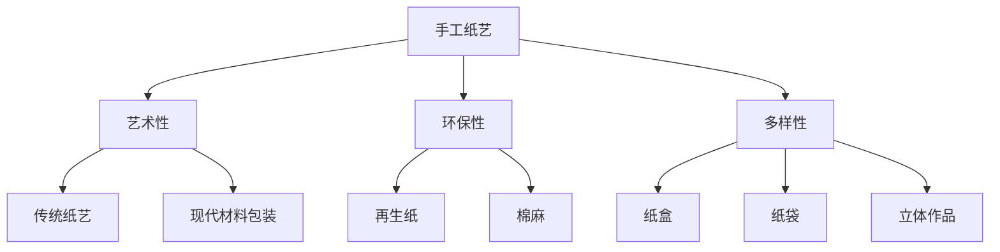
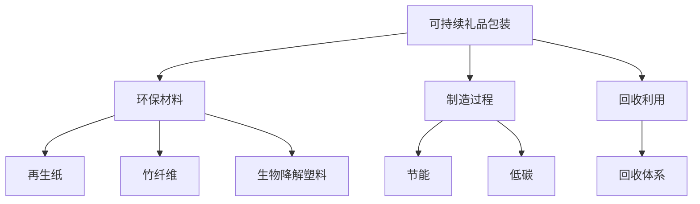
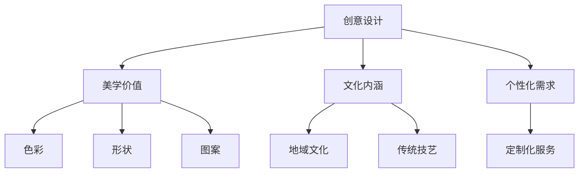
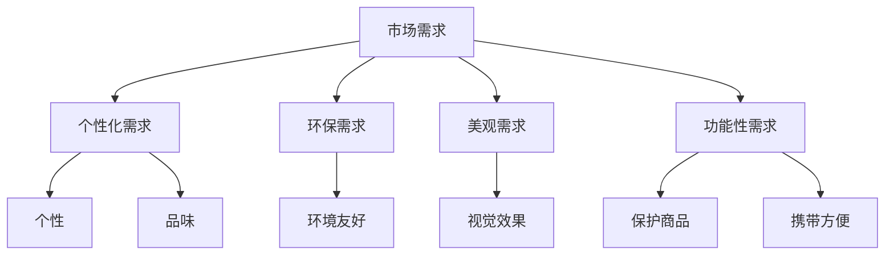

                 

## 现代手工纸艺包装工作室：可持续礼品包装的创意设计坊

### 关键词：手工纸艺、可持续包装、创意设计、礼品包装

### 摘要：

本文深入探讨了现代手工纸艺包装工作室在可持续礼品包装领域的创新实践。首先，我们介绍了礼品包装行业的现状及其对环境的影响，引出了可持续礼品包装的需求。接着，我们明确了现代手工纸艺包装工作室所面临的问题和挑战，包括材料选择、技术创新、市场需求和成本控制。通过系统介绍手工纸艺的历史、基本工艺和材料，本文探讨了手工纸艺在现代礼品包装中的应用，并分析了可持续礼品包装的设计原则。随后，通过案例研究和实际操作，本文展示了手工纸艺包装的完整创作过程，并提供了环保材料和工艺的选型建议。最后，本文讨论了手工纸艺包装在多个领域的应用前景，展望了未来的发展方向。

----------------------------------------------------------------

## 第一部分：背景介绍

### 1.1 问题背景

### 1.1.1 现代礼品包装行业现状

礼品包装作为礼品文化的重要组成部分，在现代商业活动中扮演着至关重要的角色。它不仅能够提升礼品的视觉效果，还能传递情感和价值观。随着社会的进步和人们对生活品质的追求，礼品包装的设计与制作越来越受到重视。现代礼品包装行业呈现出以下几个特点：

1. **个性化需求**：消费者对礼品包装的个性化需求日益增长。他们不再满足于传统的统一规格和样式，而是希望礼品包装能够体现其个性和品味。这种需求推动了礼品包装行业向更精细化和个性化的方向发展。

2. **美观性**：美观是现代礼品包装的重要标准之一。设计师们运用各种材料和技巧，创造出丰富多彩的包装风格，以满足消费者的审美需求。从色彩搭配到图案设计，礼品包装越来越注重视觉效果的提升。

3. **环保性**：随着环保意识的提高，消费者对环保礼品包装的需求也逐渐增加。传统礼品包装材料如塑料、纸张等在生产和消费过程中往往产生大量废弃物，对环境造成压力。因此，环保型礼品包装材料越来越受到关注。

4. **实用性**：实用性是礼品包装的重要功能之一。现代礼品包装不仅要美观，还要具备保护商品的功能。例如，包装箱需要能够防止物品在运输过程中受到撞击，包装袋需要能够密封防止漏气等。

### 1.1.2 传统礼品包装材料及其环境影响

传统礼品包装材料主要包括塑料、纸张、金属和玻璃等。这些材料虽然在美观性和实用性方面具有优势，但在生产、使用和废弃过程中对环境产生了较大的负面影响：

1. **塑料**：塑料礼品包装材料如塑料袋、塑料盒等广泛使用。然而，塑料难以降解，在自然环境中长时间存在，对土壤和水体造成污染。此外，塑料的生产过程也消耗大量能源和资源，加剧了环境污染。

2. **纸张**：纸张礼品包装材料如纸盒、纸袋等也普遍使用。虽然纸张相对环保，但其生产过程同样消耗大量木材资源，导致森林资源的减少。此外，纸张的运输和废弃物处理也会产生污染。

3. **金属和玻璃**：金属和玻璃礼品包装材料如金属盒、玻璃瓶等虽然在美观性方面具有优势，但其生产过程消耗大量能源，同时也难以回收利用，对环境造成长期负面影响。

综上所述，传统礼品包装材料在满足美观性和实用性需求的同时，也对环境造成了严重负担。为了应对这一挑战，可持续礼品包装逐渐受到关注。

### 1.1.3 可持续礼品包装的需求

随着环境问题的日益严重，可持续礼品包装逐渐成为解决传统礼品包装环境问题的有效途径。可持续礼品包装强调在设计和制作过程中采用环保材料和方法，减少对环境的负面影响，具体体现在以下几个方面：

1. **材料选择**：可持续礼品包装采用可回收、可降解或可再生材料，如再生纸、环保塑料、生物降解材料等。这些材料在生产和使用过程中对环境的影响较小，有助于减少废弃物产生。

2. **制造过程**：可持续礼品包装注重制造过程的环保性。例如，采用节能、低碳的生产工艺，减少能源消耗和污染物排放。此外，制造过程中还可以采用清洁生产技术，降低废弃物产生。

3. **功能设计**：可持续礼品包装在满足基本功能的同时，注重提升产品的附加值。通过创新设计和工艺，创造出既美观又实用的包装作品，提高消费者的满意度。

4. **回收利用**：可持续礼品包装强调包装材料的回收利用。通过建立完善的回收体系，将废弃包装材料进行回收处理，实现资源的循环利用，减少环境污染。

总之，可持续礼品包装不仅满足了消费者对礼品包装的环保需求，还推动了礼品包装行业的绿色转型。随着消费者环保意识的提高，可持续礼品包装将在未来礼品包装市场中占据重要地位。

### 1.1.4 现代手工纸艺包装的兴起

手工纸艺是一种古老的技艺，通过手工技艺对纸张进行创作和加工，形成独特的艺术作品。随着环保意识的提升和消费者对个性化礼品包装的需求增加，现代手工纸艺包装逐渐兴起，成为可持续礼品包装的重要选择。现代手工纸艺包装具有以下特点和优势：

1. **环保性**：手工纸艺包装采用环保材料，如再生纸、环保胶水等，生产过程中减少了对环境的污染。同时，手工纸艺作品的制作过程本身也具有环保性，减少了机器化生产带来的能源消耗和废弃物产生。

2. **艺术性**：手工纸艺包装作品通过独特的艺术创作手法，展现出丰富的艺术性和文化内涵。设计师们运用剪纸、折纸、贴纸等技艺，创造出具有视觉冲击力的包装作品，满足了消费者对个性化、独特礼品包装的需求。

3. **多样性**：手工纸艺包装具有丰富的表现形式和多样性。从简单的纸盒、纸袋到复杂的立体作品，手工纸艺包装可以满足不同场合和需求的礼品包装。同时，手工纸艺还可以与其他材料如布料、木材等结合，创造出更具创意的包装作品。

4. **可持续性**：手工纸艺包装的可持续性体现在材料的选择、制造过程和废弃物处理等方面。通过使用可再生和可降解材料，手工纸艺包装在生产和使用过程中对环境的负面影响较小。此外，手工纸艺包装作品本身也具有较长的使用寿命，可以多次使用和回收利用。

总之，现代手工纸艺包装以其环保、艺术和可持续性特点，逐渐成为可持续礼品包装领域的重要力量。随着技术的不断创新和市场的需求，手工纸艺包装将在礼品包装行业中发挥更大的作用。

### 1.1.5 可持续礼品包装与环保理念的结合

在现代礼品包装行业中，可持续性和环保理念的结合已经成为一种趋势。这种结合不仅体现了对环境负责任的商业行为，同时也满足了消费者对环保、健康和可持续生活的追求。以下是可持续礼品包装与环保理念结合的几个关键方面：

1. **材料选择**：可持续礼品包装首先在于材料的选择。采用可再生、可降解或可回收的材料是实现环保目标的重要步骤。例如，使用再生纸、竹子、棉麻等天然材料，不仅能减少对森林资源的依赖，还能降低环境污染。此外，环保塑料的使用也逐渐成为一种趋势，这种材料在性能上与传统塑料相似，但在生产和使用过程中对环境的负面影响较小。

2. **生产工艺**：生产工艺的环保性同样至关重要。采用节能、低碳的生产工艺可以显著减少能源消耗和碳排放。例如，通过改进生产设备、优化生产工艺流程，减少废弃物的产生和排放。此外，使用环保胶水和染料等辅助材料，也能减少有害物质的释放。

3. **设计理念**：可持续礼品包装的设计理念也应融入环保元素。设计师在创作过程中，不仅要考虑包装的美观和实用性，还要注重其可持续性。通过创新设计，实现包装材料的最大利用和最小化浪费。例如，设计可拆卸、可回收的包装结构，使消费者在礼品使用完毕后，能够方便地进行回收和再利用。

4. **回收体系**：建立完善的回收体系是实现可持续礼品包装的关键。企业应与回收机构合作，建立回收网络，确保废弃包装材料能够得到有效的回收和处理。通过回收再利用，减少资源浪费和环境污染。此外，消费者也应积极参与到回收行动中，共同推动环保理念的落实。

5. **教育和宣传**：加强环保教育和宣传也是推动可持续礼品包装的重要手段。通过宣传活动，提高公众对环保和可持续性的认识，引导消费者选择环保型礼品包装。同时，企业可以通过产品标签、包装设计等方式，明确标注环保信息，增强消费者的购买信心。

总之，可持续礼品包装与环保理念的融合，不仅为礼品包装行业带来了新的发展方向，也为实现绿色发展、构建生态文明提供了有力支持。随着技术的进步和消费者意识的提高，可持续礼品包装将在未来礼品包装市场中占据更加重要的地位。

### 1.1.6 可持续礼品包装的市场潜力

随着环保意识的增强，可持续礼品包装的市场需求正迅速增长。消费者越来越倾向于选择对环境友好的产品，这为可持续礼品包装行业带来了巨大的市场潜力。以下是可持续礼品包装市场潜力的几个方面：

1. **消费者需求**：越来越多的消费者开始关注环保和可持续发展。他们愿意为环保产品支付额外的费用，尤其是在礼品包装这一领域。这种消费趋势促使企业将可持续性作为产品开发和营销的重要方向。

2. **政策支持**：许多国家和地区已经出台了相关政策，鼓励和支持企业采用可持续材料和生产工艺。例如，一些地方对使用环保包装材料的企业提供税收优惠或补贴，以推动绿色包装的发展。这种政策环境为可持续礼品包装市场的扩展提供了有力支持。

3. **技术进步**：随着环保技术的不断进步，可持续礼品包装材料和工艺也在不断创新。例如，可降解塑料、生物基材料、智能包装等新技术不断涌现，为可持续礼品包装提供了更多的选择。这些技术的应用不仅提高了包装的环保性，还增强了其功能性和美观性。

4. **品牌形象**：采用可持续礼品包装不仅是一种环保行为，也是一种企业社会责任的体现。许多企业通过使用环保包装来提升品牌形象，增强市场竞争力。这种品牌价值将吸引更多消费者，推动市场需求的进一步扩大。

5. **多元化应用**：可持续礼品包装不仅适用于传统礼品，还广泛应用于食品、化妆品、工艺品等多个领域。随着这些行业的快速发展，可持续礼品包装市场的潜力将进一步扩大。

总之，可持续礼品包装市场潜力巨大，随着消费者环保意识的提高和政策支持力度的加大，其市场前景将更加广阔。企业应抓住这一机遇，积极创新和实践，推动可持续礼品包装行业的发展。

### 1.1.7 手工纸艺包装的兴起及其对可持续礼品包装的贡献

手工纸艺包装的兴起不仅是文化传承的体现，更是对可持续礼品包装理念的积极响应。手工纸艺以其独特的艺术性和环保特性，为礼品包装行业注入了新的活力。以下是手工纸艺包装的兴起及其对可持续礼品包装的贡献：

1. **文化传承**：手工纸艺是一种源远流长的传统技艺，蕴含着丰富的文化内涵。通过将手工纸艺融入礼品包装，不仅传承了古老的文化技艺，还赋予了包装作品独特的文化气息。这种文化元素的融入，使得礼品包装不仅仅是一个简单的容器，更成为了一件具有收藏价值的艺术品。

2. **环保特性**：手工纸艺包装采用天然材料，如再生纸、棉麻等，这些材料可再生、可降解，对环境的负面影响较小。与传统的塑料和金属包装材料相比，手工纸艺包装更符合环保要求。此外，手工纸艺的制作过程相对简单，能耗较低，进一步降低了环境负担。

3. **艺术性**：手工纸艺作品具有独特的艺术性和创意性。通过剪纸、折纸、贴纸等技艺，设计师可以创造出丰富多彩、风格多样的包装作品。这些作品不仅能够满足消费者的个性化需求，还能提升礼品的情感价值，使礼品包装成为传递情感的重要媒介。

4. **多样性**：手工纸艺包装形式多样，从简单的纸盒、纸袋到复杂的立体结构，都能通过手工技艺实现。这种多样性使得手工纸艺包装能够适应不同场合和需求，为礼品包装提供了更多的选择。

5. **可重复利用**：手工纸艺包装作品本身具有较高的艺术价值和实用性，可以多次重复使用。例如，一个精美的手工纸艺礼盒不仅可以用于礼品的包装，还可以作为装饰品、收纳盒等使用，延长其使用寿命，减少废弃物的产生。

总之，手工纸艺包装的兴起为可持续礼品包装注入了新的活力。通过文化传承、环保特性、艺术性、多样性和可重复利用等特点，手工纸艺包装不仅满足了现代礼品包装的需求，还为环保事业作出了积极贡献。随着技术的不断进步和市场的需求增长，手工纸艺包装将在可持续礼品包装领域发挥越来越重要的作用。

### 1.1.8 现代手工纸艺包装工作室的挑战和机遇

现代手工纸艺包装工作室在可持续礼品包装领域面临着诸多挑战和机遇。以下是对这些挑战和机遇的详细探讨：

#### 挑战

1. **材料选择**：手工纸艺包装对材料的要求较高，需要选择环保、可再生且具有艺术性的材料。然而，目前市场上可供选择的环保材料种类有限，且价格较高，这对手工纸艺包装工作室来说是一个巨大的挑战。

2. **技术创新**：随着科技的进步，消费者对礼品包装的创意性和功能性要求不断提高。手工纸艺包装工作室需要不断进行技术创新，将传统手工技艺与现代设计理念相结合，以创造出更具吸引力的包装作品。

3. **市场需求变化**：消费者的需求和偏好不断变化，手工纸艺包装工作室需要快速响应市场需求，提供多样化的产品和服务。这对企业的市场敏锐度和反应速度提出了高要求。

4. **成本控制**：手工纸艺包装的制作过程相对复杂，生产成本较高。如何在保证产品质量和创意性的前提下，降低生产成本，实现商业化运作，是手工纸艺包装工作室需要面对的重要问题。

5. **品牌建设**：在激烈的市场竞争中，品牌建设至关重要。手工纸艺包装工作室需要建立独特且具有竞争力的品牌形象，以吸引消费者和客户的关注。

#### 机遇

1. **环保趋势**：随着全球环保意识的增强，消费者对环保产品的需求不断增加。这为手工纸艺包装工作室提供了广阔的市场空间，使其在环保礼品包装领域具有较大的发展潜力。

2. **技术创新**：现代科技的发展为手工纸艺包装提供了新的可能性。例如，通过引入3D打印技术、智能材料等，可以提升手工纸艺包装的创意性和功能性，满足消费者多样化的需求。

3. **跨界合作**：手工纸艺包装可以与其他行业如艺术、时尚、家居等跨界合作，创造出更多创新的产品和服务。这种跨界合作不仅扩大了手工纸艺包装的市场范围，还为行业带来了新的增长点。

4. **文化推广**：手工纸艺作为一种传统文化艺术形式，具有深厚的历史文化底蕴。通过推广和传承手工纸艺文化，可以提升其艺术价值和文化认同感，进一步扩大其市场影响力。

5. **教育普及**：随着消费者对文化教育和艺术鉴赏需求的增加，手工纸艺包装工作室可以通过举办手工艺术课程、展览等活动，吸引更多消费者参与，从而扩大市场影响力。

总之，现代手工纸艺包装工作室在可持续礼品包装领域面临着诸多挑战和机遇。通过抓住机遇、积极应对挑战，手工纸艺包装工作室可以在这个新兴市场中获得更大的发展空间。

### 1.1.9 环境与经济的双重挑战：可持续礼品包装的必要性

在现代商业社会中，礼品包装不仅是传递情感和价值的载体，也是企业品牌形象的重要体现。然而，传统礼品包装材料如塑料、纸张等在生产和消费过程中对环境造成了巨大压力，同时，这些材料的高成本也对企业经济造成了负担。面对环境与经济的双重挑战，可持续礼品包装显得尤为重要。

首先，传统礼品包装材料的环境影响显而易见。塑料包装的广泛使用导致了大量的塑料废弃物，这些废弃物不仅难以降解，还对土壤、水源和生态系统造成了长期的污染。纸张包装虽然相对环保，但其生产过程消耗了大量的木材资源，导致了森林资源的减少。此外，纸张包装的运输和废弃物处理同样会产生大量的碳排放和其他污染物。金属和玻璃礼品包装虽然美观，但生产能耗高，回收利用困难，进一步加剧了环境负担。

其次，从经济角度来看，传统礼品包装的成本也在不断上升。木材和石油等原材料价格的波动使得纸张和塑料包装的生产成本不断增加。同时，随着环保意识的提高，消费者对环保包装的需求日益增长，这要求企业在包装材料的选择和设计上进行更多的投入，进一步增加了成本压力。此外，传统包装材料的回收和再利用体系不完善，导致废弃物处理成本居高不下，进一步加重了企业的经济负担。

面对这些挑战，可持续礼品包装成为了一种理想的选择。可持续礼品包装采用环保、可再生材料，如再生纸、竹子、生物降解塑料等，这些材料在生产过程中对环境的负面影响较小。同时，这些材料的价格相对稳定，成本较低，有助于企业降低生产成本。此外，可持续礼品包装的设计更加注重创新和实用性，不仅可以提高包装的美观度和功能性，还能通过减少材料用量和优化设计来进一步降低成本。

为了实现可持续礼品包装，企业在材料选择、生产工艺和设计理念等方面都需要进行创新。首先，企业可以加强与环保材料供应商的合作，开发和推广更多的环保材料。其次，企业可以通过改进生产工艺，采用节能、低碳的制造技术，减少能源消耗和废弃物产生。此外，企业还可以通过创新设计，实现包装材料的最大利用和最小化浪费，从而降低生产成本。

总之，面对环境与经济的双重挑战，可持续礼品包装成为了一种必要的选择。通过采用环保材料、改进生产工艺和创新设计，企业不仅能够降低生产成本，提升品牌形象，还能为环境保护做出积极贡献。随着消费者环保意识的提高和政策的推动，可持续礼品包装将在未来礼品包装市场中占据更加重要的地位。

### 1.1.10 社会文化变革对可持续礼品包装的影响

随着社会文化的不断变革，人们对礼品包装的需求和期待也在发生变化。这种变化不仅体现在个性化、美观性和实用性上，还深刻影响了可持续礼品包装的发展方向。以下是社会文化变革对可持续礼品包装的几个重要影响：

1. **消费观念的转变**：现代社会中，消费者越来越关注环保和可持续性。他们不仅要求礼品包装具有美观和实用的功能，还希望包装材料对环境友好，减少资源浪费。这种消费观念的转变促使企业在设计和生产过程中更加注重环保材料的选择和使用。

2. **个性化需求**：随着社会多元化的发展，消费者对个性化的追求越来越强烈。他们希望通过礼品包装展示自己的个性和品味，这要求礼品包装设计更加多样化、创意化。可持续礼品包装通过引入手工艺术、传统文化元素等，满足了消费者对个性化礼品包装的需求。

3. **文化传承**：在现代社会，文化传承成为人们关注的重要议题。手工纸艺等传统技艺通过融入礼品包装，不仅实现了文化的传承，还增添了礼品包装的艺术价值和文化内涵。这种文化元素的融入，使礼品包装不仅仅是简单的包装材料，更成为了一种文化符号。

4. **环保意识的提升**：随着环保意识的提升，消费者对环保产品的需求不断增加。可持续礼品包装以其环保、可再生、可降解的特性，受到了消费者的青睐。企业通过推广环保包装，不仅满足了消费者的环保需求，还提升了品牌形象。

5. **社会责任**：企业社会责任（CSR）在现代社会中越来越受到重视。企业通过采用可持续礼品包装，不仅能够减少对环境的负面影响，还能展示其社会责任感。这种积极的社会形象有助于提升企业的品牌价值和竞争力。

总之，社会文化变革对可持续礼品包装产生了深远影响。通过关注消费者的个性化需求、环保意识和社会责任，可持续礼品包装将在未来礼品包装市场中占据更加重要的地位。企业应积极适应这些变化，不断创新和优化可持续礼品包装的设计和制作，以满足消费者的多样化需求。

### 1.1.11 社会责任与商业利益的平衡

在可持续礼品包装的实践中，企业需要平衡社会责任与商业利益，以实现可持续发展和长期成功。以下是企业在这一过程中需要考虑的几个关键点：

1. **环保材料的选择**：企业应优先选择环保、可再生和可降解的材料，减少对环境的负面影响。例如，可以使用再生纸、竹子、生物降解塑料等。虽然这些材料可能成本较高，但长期来看，可以降低废弃物的处理成本，并提升品牌形象。

2. **生产工艺的改进**：企业应通过改进生产工艺，减少能源消耗和碳排放。例如，采用节能设备、优化生产流程、减少废弃物的产生。这不仅有助于减少对环境的负面影响，还能降低生产成本，提高经济效益。

3. **产品设计的优化**：在设计过程中，企业应注重产品的耐用性和可重复使用性，减少浪费。例如，设计可拆卸、可回收的包装结构，使消费者在礼品使用完毕后，能够方便地进行回收和再利用。

4. **教育与宣传**：企业应积极开展环保教育和宣传活动，提高消费者对环保和可持续性的认识。通过宣传产品的环保特性，增强消费者的购买意愿，同时提升企业的社会责任形象。

5. **社会责任报告**：企业应定期发布社会责任报告，透明地展示其在环保、社会和治理等方面的表现。这不仅有助于树立良好的企业形象，还能吸引更多的投资者和消费者。

6. **利益相关者的参与**：企业应与利益相关者（如供应商、客户、社区等）建立合作关系，共同推动可持续包装的实践。通过共同合作，企业可以获取更多的资源和支持，同时实现多方共赢。

通过在环境保护和社会责任方面做出积极努力，企业不仅能够实现可持续发展，还能在市场中获得竞争优势，实现商业利益的长期增长。

### 1.1.12 结论

综上所述，现代手工纸艺包装工作室在可持续礼品包装领域面临着诸多挑战和机遇。通过环保材料的选择、技术创新、市场需求的响应和成本的有效控制，企业可以克服现有难题，抓住市场机遇。同时，手工纸艺包装以其独特的艺术性和环保特性，为可持续礼品包装提供了新的解决方案。企业应积极适应社会文化变革，平衡社会责任与商业利益，以实现长期可持续发展。通过不断探索和实践，现代手工纸艺包装工作室将为礼品包装行业带来更多创新和机遇，为构建生态文明贡献力量。

## 1.2 问题描述

在现代手工纸艺包装工作室中，可持续礼品包装的实践面临着一系列问题和挑战。这些问题主要集中在材料选择、技术创新、市场需求和成本控制等方面。以下是对这些问题的详细探讨：

### 1.2.1 材料选择问题

1. **环保材料稀缺**：目前市场上可供选择的环保材料种类有限，且价格较高。这使得手工纸艺包装工作室在材料选择上面临困难。例如，再生纸、竹子等环保材料虽然在环保性方面具有优势，但其供应不稳定且成本较高，对企业造成了一定的压力。

2. **材料多样性不足**：虽然手工纸艺包装主要采用纸张等环保材料，但这些材料在性能和用途上存在一定的局限性。例如，纸张的防水性和耐用性较差，难以满足某些特殊场合的包装需求。因此，手工纸艺包装工作室需要寻找更多性能优良且环保的材料。

### 1.2.2 技术创新问题

1. **传统与现代结合**：手工纸艺包装工作室需要在传统手工技艺与现代设计理念之间找到平衡。传统手工技艺具有独特的美学价值和文化内涵，但与现代设计的融合仍需进一步探索。如何在保持传统特色的同时，提高包装的实用性和功能性，是技术创新的关键。

2. **新材料应用**：随着科技的进步，新材料的应用为手工纸艺包装带来了新的可能性。例如，3D打印技术、智能材料等可以提升手工纸艺包装的创意性和功能性。然而，这些新技术的应用尚处于初期阶段，需要进一步研究和发展。

### 1.2.3 市场需求问题

1. **个性化需求**：消费者对礼品包装的个性化需求日益增长。他们希望通过礼品包装展示自己的个性、品味和情感。手工纸艺包装工作室需要提供多样化的产品和服务，以满足消费者的个性化需求。

2. **环保意识提高**：随着环保意识的提高，消费者对环保礼品包装的需求不断增加。他们希望礼品包装不仅美观，还能对环境友好。手工纸艺包装工作室需要注重环保特性，以吸引消费者的关注。

### 1.2.4 成本控制问题

1. **生产成本高**：手工纸艺包装的制作过程复杂，生产成本较高。例如，手工制作、材料采购和后期处理等环节都需要投入大量的人力和物力。这使得手工纸艺包装工作室在成本控制上面临较大挑战。

2. **市场竞争力**：在激烈的市场竞争中，手工纸艺包装工作室需要降低生产成本，以提高市场竞争力。然而，在保证产品质量和创意性的前提下，实现低成本生产仍需进一步探索。

### 1.2.5 解决策略

针对上述问题，手工纸艺包装工作室可以采取以下解决策略：

1. **材料创新**：积极探索新的环保材料，优化材料供应链，降低成本。同时，通过技术创新，提升材料性能，满足不同场合的包装需求。

2. **技术融合**：将传统手工技艺与现代设计理念相结合，提高包装的实用性和美观度。同时，研究新材料的制作工艺，提高生产效率。

3. **市场定位**：针对不同消费者的需求，提供多样化的产品和服务。通过精准的市场定位，吸引目标客户群体。

4. **成本优化**：通过优化生产流程、提高生产效率，降低生产成本。同时，利用互联网和电子商务等新兴渠道，扩大销售渠道，降低营销成本。

5. **品牌建设**：注重品牌建设，提升品牌知名度和美誉度。通过品牌影响力，吸引更多的消费者和客户。

通过采取上述策略，手工纸艺包装工作室可以在可持续礼品包装领域实现更好的发展和市场竞争力。同时，也为环保事业做出积极贡献，推动绿色消费和可持续发展。

### 1.3 问题解决

针对现代手工纸艺包装工作室在可持续礼品包装领域所面临的材料选择、技术创新、市场需求和成本控制等挑战，本书提出了一系列解决方案，旨在通过系统性的分析和实践指导，推动手工纸艺包装行业的发展。

#### 1.3.1 材料选择的解决策略

1. **探索新环保材料**：手工纸艺包装工作室应积极与环保材料供应商合作，探索新的环保材料，如再生纸、竹纤维、可降解塑料等。这些材料不仅符合环保要求，还能够在性能上满足礼品包装的需求。

2. **优化材料供应链**：通过建立稳定的环保材料供应链，降低材料采购成本。同时，与供应商建立长期合作关系，确保材料的稳定供应。

3. **材料性能提升**：研究和开发新型环保材料，提升其防水性、耐用性和美观度。例如，通过涂层技术改善纸张的防水性能，通过染色技术提升纸张的视觉效果。

#### 1.3.2 技术创新的解决策略

1. **传统技艺与现代设计理念的结合**：在传统手工技艺的基础上，融入现代设计理念，创造出既具有传统特色又符合现代审美需求的包装作品。通过设计创新，提高包装的实用性和美观度。

2. **新技术引入**：研究并引入3D打印、智能材料等新技术，提升手工纸艺包装的创意性和功能性。例如，利用3D打印技术制作复杂的立体结构，利用智能材料实现包装的自适应功能。

3. **工艺改进**：优化手工纸艺的制作工艺，提高生产效率。例如，通过自动化设备简化复杂的工艺步骤，减少人工操作，降低生产成本。

#### 1.3.3 市场需求的解决策略

1. **个性化定制服务**：针对消费者的个性化需求，提供定制化的礼品包装服务。通过一对一的设计服务，满足消费者对独特包装的需求。

2. **多样化产品线**：开发多样化的产品线，满足不同客户群体的需求。例如，除了礼品包装，还可以开发日常用品、家居装饰等领域的纸艺产品。

3. **市场调研**：定期进行市场调研，了解消费者对礼品包装的偏好和需求，及时调整产品策略，满足市场的变化。

#### 1.3.4 成本控制的解决策略

1. **生产流程优化**：通过优化生产流程，提高生产效率，降低生产成本。例如，简化工艺步骤，减少材料浪费，提高设备利用率。

2. **技术培训与人才培养**：加强技术培训和人才培养，提高员工的专业技能和生产效率。通过技能提升，降低生产成本，提高产品质量。

3. **供应链整合**：整合供应链资源，降低采购成本。通过集中采购、批量生产等方式，降低材料成本，提高供应链的整体效率。

#### 1.3.5 创新与可持续性的平衡

1. **环保与经济效益相结合**：在追求创新的同时，注重环保与经济效益的结合。通过优化设计、提升材料性能和改进生产工艺，实现环保与经济效益的共赢。

2. **长期发展规划**：制定长期的可持续发展规划，明确企业发展目标和战略方向。通过长期规划，确保企业在创新和可持续性方面的持续发展。

通过上述解决方案，现代手工纸艺包装工作室可以在可持续礼品包装领域实现更好的发展，满足市场需求，同时为环境保护和可持续发展做出积极贡献。

### 1.4 边界与外延

在现代手工纸艺包装工作室的实践过程中，我们需要明确其边界与外延，以便更好地理解其应用范围和发展潜力。以下是对手工纸艺包装边界与外延的详细探讨：

#### 1.4.1 边界

1. **材料范围**：手工纸艺包装的主要材料是纸张和纸制品。然而，其边界不仅限于传统的纸张，还包括各种环保和可再生材料，如再生纸、竹纤维、棉麻等。此外，手工纸艺包装还可以与其他材料如布料、木材、金属等结合，创造出更加多样化的包装作品。

2. **工艺范围**：手工纸艺包装的工艺包括剪纸、折纸、贴纸、糊纸等。这些传统技艺不仅是手工纸艺的核心，也是其独特的艺术表达方式。随着技术的发展，新的工艺如3D打印、激光雕刻等也开始融入手工纸艺包装，拓宽了其工艺范围。

3. **应用范围**：手工纸艺包装主要应用于礼品包装、艺术品制作、家居装饰等领域。然而，其应用边界也在不断拓展。例如，在时尚领域，手工纸艺包装可以应用于服装设计、配饰制作；在餐饮领域，可以应用于餐具设计、包装盒制作等。

#### 1.4.2 外延

1. **文化传承**：手工纸艺包装不仅是包装艺术，更是文化传承的重要载体。通过将手工纸艺融入包装设计，可以传承和弘扬传统手工技艺，增强文化认同感。此外，手工纸艺包装还可以作为文化礼品，传播和展示地域文化。

2. **跨界合作**：随着社会的多元化发展，手工纸艺包装开始与多个领域进行跨界合作。例如，与时尚、家居、工艺品等行业结合，创造出更多创新的产品和服务。这种跨界合作不仅拓宽了手工纸艺包装的应用范围，还提升了其市场竞争力。

3. **新材料应用**：随着科技的发展，新的材料不断涌现，为手工纸艺包装提供了更多的可能性。例如，可降解塑料、智能材料等新型材料的应用，不仅提升了手工纸艺包装的性能，还为环保和可持续发展做出了贡献。

4. **技术创新**：技术创新是推动手工纸艺包装发展的关键。通过引入新的技术和工艺，手工纸艺包装可以在保持传统特色的同时，实现功能性和美观性的提升。例如，3D打印、激光雕刻等技术的应用，使手工纸艺包装作品更加精致和多样化。

总之，现代手工纸艺包装工作室的边界与外延不断扩大，不仅涵盖了多种材料、工艺和应用领域，还通过文化传承、跨界合作、新材料应用和技术创新，进一步拓展了其发展空间。随着市场的需求和技术的发展，手工纸艺包装将在未来礼品包装和艺术领域发挥更大的作用。

### 1.5 概念结构与核心要素组成

为了更好地理解现代手工纸艺包装工作室的运作机制和其在可持续礼品包装领域中的作用，我们需要对相关核心概念和其组成要素进行详细剖析。以下是手工纸艺包装、可持续礼品包装、创意设计和市场需求等核心概念及其组成要素的介绍：

#### 1.5.1 手工纸艺包装

**定义**：手工纸艺包装是指利用手工技艺对纸张进行创作和加工，形成具有艺术性和实用性的包装作品。

**组成要素**：

1. **材料**：手工纸艺包装的主要材料包括纸张、胶水、剪刀、刻刀等。纸张的多样性为包装设计提供了丰富的选择，而胶水、剪刀、刻刀等工具则是制作过程中不可或缺的辅助材料。

2. **技艺**：手工纸艺包装的技艺包括剪纸、折纸、贴纸、糊纸等。这些技艺通过不同的组合和变化，可以创造出丰富多彩的包装效果。

3. **设计**：手工纸艺包装的设计是艺术性和实用性的结合。设计师需要根据包装的目的、用途和受众，设计出既美观又实用的包装作品。

4. **环保性**：手工纸艺包装强调环保性，采用可再生、可降解或可回收的材料，减少对环境的负面影响。

#### 1.5.2 可持续礼品包装

**定义**：可持续礼品包装是指在设计和制作礼品包装时，采用环保材料和方法，减少对环境的负面影响。

**组成要素**：

1. **环保材料**：可持续礼品包装的核心在于材料的选择。采用可再生、可降解或可回收的材料，如再生纸、竹纤维、生物降解塑料等，是实现环保目标的关键。

2. **制造过程**：制造过程的环保性同样重要。通过采用节能、低碳的生产工艺，减少能源消耗和废弃物产生，是实现可持续发展的关键。

3. **回收利用**：建立完善的回收体系，确保废弃包装材料能够得到有效的回收和处理，是实现可持续性的重要环节。

4. **设计理念**：可持续礼品包装的设计理念应融入环保元素，通过创新设计实现包装材料的最大利用和最小化浪费。

#### 1.5.3 创意设计

**定义**：创意设计是指通过创新思维和技巧，创造出具有独特美感和文化内涵的包装作品。

**组成要素**：

1. **美学价值**：创意设计注重美学价值的体现，通过色彩、形状、图案等元素，创造出视觉上引人注目的包装作品。

2. **文化内涵**：创意设计不仅追求美观，还注重文化内涵的传达。通过融入地域文化、传统技艺等元素，提升包装作品的文化价值。

3. **个性化需求**：创意设计要满足消费者的个性化需求，通过定制化服务，提供独特且符合个人品味的包装作品。

4. **实用性**：创意设计在满足美观和文化需求的同时，还要注重实用性。通过合理的结构设计和材料选择，提升包装的功能性。

#### 1.5.4 市场需求

**定义**：市场需求是指消费者对礼品包装的需求，包括个性化、环保、美观等方面。

**组成要素**：

1. **个性化需求**：消费者对礼品包装的个性化需求日益增长。他们希望通过包装展示自己的个性、品味和情感。

2. **环保需求**：随着环保意识的提高，消费者对环保包装的需求不断增加。他们希望礼品包装不仅美观，还能对环境友好。

3. **美观需求**：美观是礼品包装的重要标准之一。消费者追求美观的包装，以提升礼品的视觉效果。

4. **功能性需求**：包装的功能性是消费者关心的另一个重要方面。包装需要能够保护商品、便于携带和展示。

通过上述核心概念和要素的详细剖析，我们可以更好地理解现代手工纸艺包装工作室在可持续礼品包装领域的运作机制和作用。这些核心概念和要素相互关联，共同构成了手工纸艺包装的完整体系，为可持续礼品包装的创意设计提供了坚实的基础。

### 1.6 核心概念与联系

为了深入理解现代手工纸艺包装工作室在可持续礼品包装领域的作用，我们需要分析几个关键概念之间的联系，包括手工纸艺、可持续礼品包装、创意设计、市场需求等。

#### 1.6.1 手工纸艺

**定义**：手工纸艺是指通过手工技艺对纸张进行创作和加工的一种艺术形式。它包括剪纸、折纸、贴纸等多种技艺，通过这些技艺，创造出具有独特美学价值的包装作品。

**属性**：

1. **艺术性**：手工纸艺作品具有强烈的艺术性和文化内涵，通过独特的造型和图案，展现出丰富的美学效果。
2. **环保性**：手工纸艺采用环保材料，如再生纸、棉麻等，这些材料可再生、可降解，对环境的负面影响较小。
3. **多样性**：手工纸艺的表现形式多样，从简单的纸盒、纸袋到复杂的立体作品，可以满足不同场合和需求。

**对比**：

- 与传统纸艺（如剪纸、手工书）相比，手工纸艺更注重创意设计和实用性。
- 与现代材料包装（如塑料、纸张）相比，手工纸艺更具艺术性和环保性。

**关系图**：

#### 1.6.2 可持续礼品包装

**定义**：可持续礼品包装是指在设计和制作过程中，采用环保材料和方法，减少对环境的负面影响，同时满足功能性和美观性的要求。

**属性**：

1. **环保材料**：可持续礼品包装采用可再生、可降解或可回收的材料，如再生纸、竹纤维、生物降解塑料等。
2. **制造过程**：制造过程中采用节能、低碳的生产工艺，减少能源消耗和废弃物产生。
3. **回收利用**：建立完善的回收体系，确保废弃包装材料能够得到有效的回收和处理。

**对比**：

- 与传统礼品包装（如塑料、纸张）相比，可持续礼品包装更注重环保性和可持续性。
- 与现代礼品包装（如智能包装、包装设计）相比，可持续礼品包装更强调环保理念。

**关系图**：

#### 1.6.3 创意设计

**定义**：创意设计是指在满足功能需求的前提下，通过创新思维和技巧，创造出具有独特美感和文化内涵的包装作品。

**属性**：

1. **美学价值**：创意设计注重美学价值的体现，通过色彩、形状、图案等元素，创造出视觉上引人注目的包装作品。
2. **文化内涵**：创意设计不仅追求美观，还注重文化内涵的传达。通过融入地域文化、传统技艺等元素，提升包装作品的文化价值。
3. **个性化需求**：创意设计要满足消费者的个性化需求，通过定制化服务，提供独特且符合个人品味的包装作品。

**对比**：

- 与传统设计（如平面设计、包装设计）相比，创意设计更强调创新和个性化。
- 与现代设计（如UI/UX设计、工业设计）相比，创意设计更注重美学和文化内涵。

**关系图**：

#### 1.6.4 市场需求

**定义**：市场需求是指消费者对礼品包装的需求，包括个性化、环保、美观等方面。

**属性**：

1. **个性化需求**：消费者对礼品包装的个性化需求日益增长，希望包装能够体现其个性和品味。
2. **环保需求**：随着环保意识的提高，消费者对环保包装的需求不断增加，希望包装对环境友好。
3. **美观需求**：美观是礼品包装的重要标准之一，消费者追求美观的包装以提升礼品的视觉效果。
4. **功能性需求**：包装的功能性是消费者关心的另一个重要方面，包装需要能够保护商品、便于携带和展示。

**对比**：

- 与传统需求（如保护商品、便于携带）相比，市场需求更注重个性化、环保和美观。
- 与现代需求（如智能包装、便捷性）相比，市场需求更强调情感共鸣和文化认同。

**关系图**：

通过上述核心概念和属性的分析，我们可以看到，手工纸艺、可持续礼品包装、创意设计和市场需求之间存在着紧密的联系。这些概念共同构成了现代手工纸艺包装工作室在可持续礼品包装领域的重要作用，通过结合艺术性、环保性、创新性和个性化需求，手工纸艺包装为礼品包装行业带来了新的发展方向和机遇。随着消费者需求的不断变化和社会环保意识的提高，这些核心概念将在未来礼品包装市场中发挥更加重要的作用。

