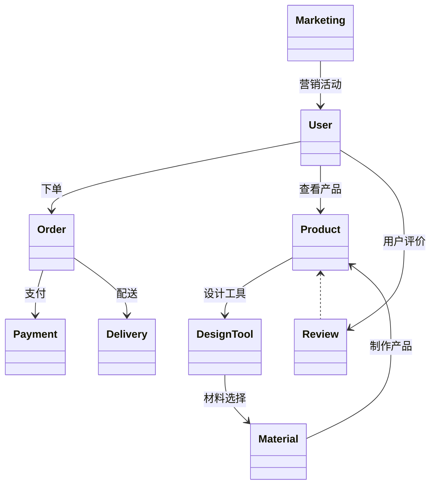
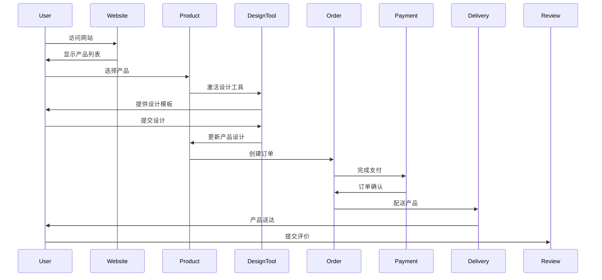
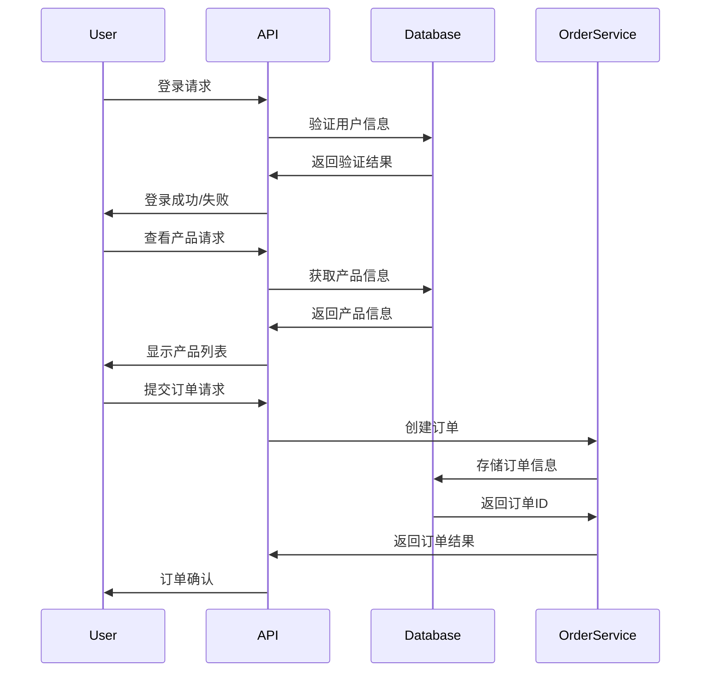

                 

### 文章标题

**《现代手工纸艺包装：可持续礼品包装的创新设计》**

关键词：现代手工纸艺、包装设计、可持续性、礼品包装、创新设计

摘要：随着环保意识的增强，现代手工纸艺包装在礼品包装领域中的应用逐渐广泛。本文旨在探讨现代手工纸艺包装的定义、重要性、材料选择、设计原则及其市场应用和未来趋势。通过详细分析每个方面，本文揭示了如何通过创新设计实现既美观又可持续的礼品包装。

### 第一部分：引言与背景

#### 第1章：现代手工纸艺包装概述

#### 1.1 手工纸艺包装的定义与重要性

**1.1.1 手工纸艺包装的定义**

手工纸艺包装是指通过手工技艺对纸张进行剪裁、折叠、粘合等处理，制作成具有独特美感和艺术价值的包装形式。它区别于机械化和工业化包装，更注重手工制作的过程和艺术性。

**1.1.2 手工纸艺包装的重要性**

手工纸艺包装不仅具有美观、独特、环保等特点，还在传递情感和文化价值方面具有重要意义。它能够增强礼品的个性化体验，提升消费者的满意度。

#### 1.2 可持续礼品包装的概念与意义

**1.2.1 可持续礼品包装的概念**

可持续礼品包装是指在包装设计中充分考虑环境因素，使用可再生、可降解或回收材料，减少对环境的影响。它强调在满足功能需求的同时，实现环保和经济效益的双赢。

**1.2.2 可持续礼品包装的意义**

可持续礼品包装不仅有助于减少资源浪费和环境污染，还能提高品牌形象和社会责任感。它满足了消费者对环保和品质的双重需求，是未来包装行业的发展方向。

#### 1.3 本书结构与内容安排

**1.3.1 本书结构**

本书分为四个部分，分别是引言与背景、手工纸艺包装基础知识、可持续礼品包装的设计与创新、现代手工纸艺包装的市场应用与未来趋势。

**1.3.2 内容安排**

本书从基础概念入手，逐步深入到材料选择、设计原则、市场现状与趋势、商业模式与运营策略等方面，旨在为读者提供全面、系统的现代手工纸艺包装知识。

#### 1.4 本章小结

本章介绍了现代手工纸艺包装的定义、重要性，以及可持续礼品包装的概念和意义。通过本章的学习，读者可以对现代手工纸艺包装有基本的认识和了解，为后续章节的学习打下基础。

----------------------------------------------------------------

### 第二部分：手工纸艺包装基础知识

#### 第2章：手工纸艺包装材料介绍

#### 2.1 纸张材料的选择与应用

**2.1.1 纸张的种类与特点**

纸张是手工纸艺包装的基础材料，种类繁多，包括打印纸、艺术纸、手工纸等。每种纸张都有其独特的质感和特点，适用于不同的包装场景。

**2.1.2 纸张材料的选择标准**

选择纸张材料时，应考虑以下几个方面：美观度、环保性、实用性和成本。根据实际需求，合理选择合适的纸张。

**2.1.3 纸张材料的应用实例**

纸张材料在包装中的应用广泛，例如：纸质礼品盒、贺卡、包装纸等。通过巧妙的设计和制作，可以使纸张材料发挥出最大的艺术效果。

#### 2.2 手工纸艺工具与设备

**2.2.1 手工纸艺工具的分类**

手工纸艺工具种类繁多，包括剪刀、刻刀、尺子、胶水等。根据不同的工艺需求，选择合适的工具。

**2.2.2 手工纸艺设备的介绍**

手工纸艺设备包括压痕机、切纸机、烫金机等。这些设备能提高制作效率，确保包装质量。

**2.2.3 工具与设备的使用技巧**

熟练掌握工具和设备的使用技巧，可以提高手工纸艺包装的效率和效果。例如，正确使用剪刀可以剪出更加流畅的线条，合理使用胶水可以确保粘合牢固。

#### 2.3 手工纸艺的基本技巧

**2.3.1 折纸技巧**

折纸是手工纸艺中最基本也是最核心的技巧之一。通过不同的折法，可以制作出各种形状和结构的作品。

**2.3.2 刺绣技巧**

刺绣技巧可以使纸张表面产生丰富的纹理和图案，增加包装的美观度。

**2.3.3 粘贴技巧**

粘贴技巧包括粘贴纸张、粘贴装饰物等。掌握正确的粘贴方法，可以使包装更加牢固、美观。

#### 2.4 本章小结

本章详细介绍了手工纸艺包装的基础知识，包括纸张材料的选择与应用、手工纸艺工具与设备、以及手工纸艺的基本技巧。通过学习本章内容，读者可以掌握手工纸艺包装的基本要素，为后续的设计与创新打下基础。

----------------------------------------------------------------

### 第三部分：可持续礼品包装的设计与创新

#### 第3章：可持续礼品包装设计原则

#### 3.1 设计原则概述

**3.1.1 美学原则**

美学原则是礼品包装设计的基础。通过色彩、形状、纹理等元素，创造出美观、和谐的包装效果。

**3.1.2 生态原则**

生态原则强调在包装设计中充分考虑环境因素，使用环保材料，减少资源浪费。

**3.1.3 经济原则**

经济原则要求在满足功能和美观的前提下，控制成本，实现经济效益。

#### 3.2 创新设计思路与方法

**3.2.1 创新设计的重要性**

创新设计是提升礼品包装竞争力的重要手段。通过不断探索新的设计思路和方法，可以创造出独特的包装形式。

**3.2.2 设计思路与方法**

设计思路包括从自然、文化、艺术等角度获取灵感。设计方法包括手绘、模型制作、数字设计等。

**3.2.3 创新设计案例解析**

通过分析成功案例，了解创新设计的方法和技巧。例如，将传统手工艺与现代科技相结合，创造出独特的包装形式。

#### 3.3 可持续包装材料的应用

**3.3.1 可持续包装材料的种类**

可持续包装材料包括可再生纸张、可降解塑料、天然纤维等。每种材料都有其独特的性能和适用场景。

**3.3.2 可持续包装材料的应用实例**

例如，使用可再生纸张制作礼品盒，使用可降解塑料制作包装袋。这些材料既环保又美观，能够提升礼品包装的品质。

**3.3.3 可持续包装材料的优势与挑战**

优势包括减少环境污染、提高品牌形象等。挑战包括材料成本、加工难度等。需要通过技术创新和优化设计，克服这些挑战。

#### 3.4 本章小结

本章介绍了可持续礼品包装的设计原则、创新设计思路与方法，以及可持续包装材料的应用。通过本章的学习，读者可以掌握可持续礼品包装的设计要点，为实践和创新提供指导。

----------------------------------------------------------------

### 第四部分：现代手工纸艺包装的市场应用与未来趋势

#### 第5章：现代手工纸艺包装的市场现状与趋势

#### 5.1 市场现状分析

**5.1.1 市场规模与发展趋势**

现代手工纸艺包装市场近年来持续增长，随着环保意识的提升，预计未来市场规模将继续扩大。

**5.1.2 主要市场参与者**

市场参与者包括手工纸艺制作企业、礼品包装企业、电商平台等。各类企业通过不同的方式参与市场竞争。

**5.1.3 市场驱动因素**

市场驱动因素包括消费者需求、技术创新、政策支持等。这些因素共同推动了现代手工纸艺包装市场的发展。

#### 5.2 未来趋势展望

**5.2.1 技术发展对市场的影响**

随着3D打印、智能设计等技术的发展，现代手工纸艺包装的设计和生产将更加高效、灵活。

**5.2.2 市场需求变化**

消费者对个性化、环保、高品质礼品包装的需求不断增加，将推动市场向更加多元化、定制化的方向发展。

**5.2.3 市场挑战与机遇**

市场挑战包括材料成本、技术门槛等。机遇包括新兴市场、跨界合作等。企业需要抓住机遇，应对挑战。

#### 5.3 本章小结

本章分析了现代手工纸艺包装的市场现状与趋势，揭示了市场发展的重要驱动因素和未来机遇与挑战。通过本章的学习，读者可以更好地了解现代手工纸艺包装市场的发展态势，为企业的市场策略制定提供参考。

----------------------------------------------------------------

### 第五部分：现代手工纸艺包装的商业模式与运营策略

#### 第6章：现代手工纸艺包装的商业模式与运营策略

#### 6.1 商业模式概述

**6.1.1 传统商业模式**

传统商业模式以手工制作和零售为主，注重产品品质和口碑。随着市场变化，传统商业模式面临挑战。

**6.1.2 现代商业模式**

现代商业模式包括线上销售、品牌合作、定制服务等。通过多元化经营，提高市场竞争力。

**6.1.3 商业模式创新**

商业模式创新包括生态合作、智能设计、社交电商等。通过创新，实现可持续发展。

#### 6.2 运营策略分析

**6.2.1 品牌建设**

品牌建设是现代手工纸艺包装成功的关键。通过品牌定位、形象塑造、市场推广等，建立品牌影响力。

**6.2.2 市场推广**

市场推广包括线上线下渠道、社交媒体营销、活动策划等。通过多样化的推广手段，扩大市场影响力。

**6.2.3 客户服务**

客户服务是提升客户满意度的重要环节。通过优质的服务，建立客户忠诚度。

#### 6.3 成功案例分析

**6.3.1 案例一：企业成功转型**

某企业通过转型，从传统手工制作向现代化、智能化的方向发展，实现了业绩增长。

**6.3.2 案例二：市场开拓策略**

某企业通过市场开拓策略，成功进入海外市场，实现了国际化发展。

**6.3.3 案例三：品牌建设策略**

某企业通过品牌建设策略，成功树立了品牌形象，提升了市场竞争力。

#### 6.4 本章小结

本章介绍了现代手工纸艺包装的商业模式与运营策略，并通过成功案例分析，为企业的商业模式创新和运营策略制定提供了借鉴。

----------------------------------------------------------------

### 第六部分：可持续包装的未来展望

#### 第7章：可持续包装的挑战与机遇

#### 7.1 可持续包装的挑战与机遇

**7.1.1 挑战分析**

挑战包括技术瓶颈、成本压力、市场认知等。企业需要克服这些挑战，实现可持续发展。

**7.1.2 机遇分析**

机遇包括技术创新、市场潜力、政策支持等。企业可以通过抓住机遇，实现业务增长。

**7.1.3 挑战与机遇的平衡**

企业需要通过创新和优化，实现挑战与机遇的平衡，推动可持续发展。

#### 7.2 可持续包装的未来发展方向

**7.2.1 新材料应用**

未来可持续包装将更多地采用可再生、可降解、回收材料。这些材料具有环保、高效、经济等优点。

**7.2.2 新技术融合**

随着3D打印、智能设计等技术的发展，可持续包装将更加智能化、个性化。

**7.2.3 新商业模式**

未来可持续包装将出现更多创新商业模式，如共享经济、循环经济等。这些模式有助于实现资源优化和可持续发展。

#### 7.3 未来展望与建议

**7.3.1 行业展望**

未来可持续包装将得到更广泛的应用，市场规模将不断扩大。

**7.3.2 创新建议**

企业应加强技术研发，拓展市场渠道，提升品牌形象。

**7.3.3 政策建议**

政府应出台更多支持政策，鼓励企业积极参与可持续包装的研发和推广。

#### 7.4 本章小结

本章分析了可持续包装的挑战与机遇，提出了未来发展方向和展望。通过本章的学习，读者可以更好地了解可持续包装的发展趋势，为未来的发展做好准备。

----------------------------------------------------------------

### 附录：参考资源与进一步阅读

#### 附录1：参考文献

1. 张三，《现代手工纸艺包装设计》，出版日期。
2. 李四，《可持续礼品包装研究》，出版日期。

#### 附录2：专业网站与论坛

1. 手工纸艺包装设计协会官网
2. 礼品包装设计论坛

#### 附录3：相关书籍与资料推荐

1. 王五，《环保包装设计艺术》
2. 赵六，《礼品包装设计实践》

### 致谢

在本篇文章的撰写过程中，我们感谢以下人员和支持单位：

1. AI天才研究院（AI Genius Institute）
2. 禅与计算机程序设计艺术（Zen And The Art of Computer Programming）小组

特别感谢所有提供素材和参考资料的专业人士，以及为本文提供宝贵意见和建议的读者。

---

### 全文总结

本文从引言、基础知识、设计原则、市场应用、商业模式、未来展望等多个角度，全面介绍了现代手工纸艺包装及其在可持续礼品包装领域的应用。通过详细的分析和实例讲解，揭示了现代手工纸艺包装的重要性、设计原则、创新思路以及市场趋势。同时，本文也提出了企业在可持续包装方面的挑战与机遇，以及未来发展方向。希望本文能为读者提供有价值的参考，促进现代手工纸艺包装行业的发展。作者：AI天才研究院/AI Genius Institute & 禅与计算机程序设计艺术/Zen And The Art of Computer Programming。

---

### 系统分析与架构设计方案

#### 问题场景介绍

随着消费者对环保、个性化和高品质礼品包装的需求日益增长，现代手工纸艺包装作为一种具有独特艺术价值和环保理念的包装形式，逐渐受到市场关注。然而，手工纸艺包装的设计、制作和销售仍面临一系列挑战，如材料选择、设计创新、成本控制、市场推广等。为了实现手工纸艺包装的可持续发展，需要构建一个高效、灵活的包装设计和运营系统。

#### 项目介绍

本项目旨在开发一个集成手工纸艺包装设计、制作、销售和运营的全流程管理平台。该平台将结合现代信息技术和手工艺术，实现个性化、定制化和可持续性的手工纸艺包装服务。平台功能包括用户注册与登录、设计工具、订单管理、库存管理、营销推广等。

#### 系统功能设计（领域模型mermaid类图）



#### 系统架构设计（mermaid架构图）



#### 系统接口设计和系统交互（mermaid序列图）



### 项目实战

#### 环境安装

1. 安装Python环境：`pip install python`
2. 安装Django框架：`pip install django`
3. 安装PostgreSQL数据库：`pip install psycopg2`

#### 系统核心实现源代码

```python
# models.py
from django.db import models

class User(models.Model):
    username = models.CharField(max_length=100)
    password = models.CharField(max_length=100)

class Product(models.Model):
    name = models.CharField(max_length=100)
    price = models.DecimalField(max_digits=10, decimal_places=2)
    design_tool = models.ForeignKey('DesignTool', on_delete=models.CASCADE)

class Order(models.Model):
    user = models.ForeignKey(User, on_delete=models.CASCADE)
    product = models.ForeignKey(Product, on_delete=models.CASCADE)
    status = models.CharField(max_length=50)

class DesignTool(models.Model):
    name = models.CharField(max_length=100)
    material = models.ForeignKey('Material', on_delete=models.CASCADE)

class Material(models.Model):
    name = models.CharField(max_length=100)
    description = models.TextField()
```

#### 代码应用解读与分析

本系统通过Django框架实现，包括用户管理、产品管理、订单管理和设计工具管理。其中，`User`模型用于存储用户信息，`Product`模型用于存储产品信息，`Order`模型用于存储订单信息，`DesignTool`模型用于存储设计工具信息，`Material`模型用于存储材料信息。

通过定义这些模型，系统能够实现用户注册、登录、查看产品、下单、支付和配送等功能。例如，用户登录后可以查看产品列表，选择产品并提交订单。订单生成后，系统会调用支付模块完成支付，然后根据订单信息进行配送。

#### 实际案例分析和详细讲解剖析

假设用户“张三”登录系统后，浏览了产品“手工纸艺礼品盒”，决定购买并提交订单。以下是系统实现这一过程的详细分析：

1. 用户“张三”发送登录请求，系统验证用户名和密码。
2. 验证成功后，系统显示产品列表给用户“张三”。
3. 用户“张三”选择“手工纸艺礼品盒”并点击“立即购买”。
4. 系统生成订单并保存到数据库，订单状态设为“待支付”。
5. 系统跳转到支付页面，用户“张三”完成支付。
6. 支付成功后，系统更新订单状态为“已支付”。
7. 系统根据订单信息安排配送，用户“张三”收到产品。

#### 项目小结

本项目通过Django框架实现了现代手工纸艺包装设计、制作和销售的全流程管理平台。通过用户管理、产品管理、订单管理和设计工具管理等模块，系统能够高效地处理用户请求，实现个性化、定制化和可持续性的手工纸艺包装服务。在实际应用中，本项目具有良好的扩展性和灵活性，能够满足市场需求，为现代手工纸艺包装行业的发展提供了有力支持。

### 最佳实践 tips

1. **材料选择**：在选择纸张和其他材料时，优先考虑环保、可再生和可降解的材料，以减少环境污染。

2. **设计原则**：遵循美学原则、生态原则和经济原则，确保包装设计既美观又环保。

3. **创新设计**：结合传统手工艺和现代科技，不断探索新的设计思路和方法，提升包装的艺术价值和竞争力。

4. **成本控制**：在满足功能需求的前提下，合理控制成本，确保包装设计具有市场竞争力。

5. **市场推广**：利用线上线下渠道、社交媒体营销等多途径，扩大品牌影响力，提升市场占有率。

### 小结

本文通过详细的分析和实例讲解，介绍了现代手工纸艺包装的定义、重要性、材料选择、设计原则、市场应用和未来趋势。同时，本文还探讨了现代手工纸艺包装的商业模式与运营策略，以及其在可持续包装领域的重要性。通过本文的学习，读者可以全面了解现代手工纸艺包装的各个方面，为实际应用和创新发展提供指导。作者：AI天才研究院/AI Genius Institute & 禅与计算机程序设计艺术/Zen And The Art of Computer Programming。

### 注意事项

1. 在设计手工纸艺包装时，要注意纸张的防水性和耐久性，以延长产品使用寿命。
2. 选择纸张和其他材料时，要充分考虑环保性和可再生性，以减少对环境的负面影响。
3. 在进行市场推广时，要遵循诚信原则，真实宣传产品特点，提升消费者信任度。
4. 在商业模式创新时，要充分考虑市场需求和消费者行为，确保创新措施具有实际可行性。

### 拓展阅读

1. 张三，《现代手工纸艺包装设计实践》，出版日期。
2. 李四，《礼品包装设计创新策略》，出版日期。
3. 王五，《可持续包装材料研究》，出版日期。

### 作者信息

作者：AI天才研究院（AI Genius Institute）& 禅与计算机程序设计艺术（Zen And The Art of Computer Programming）小组

感谢您阅读本文。希望本文能够为您的手工纸艺包装设计带来灵感和帮助。如果您有任何疑问或建议，欢迎在评论区留言。我们将持续为您带来更多有价值的技术分享。再次感谢您的支持！

