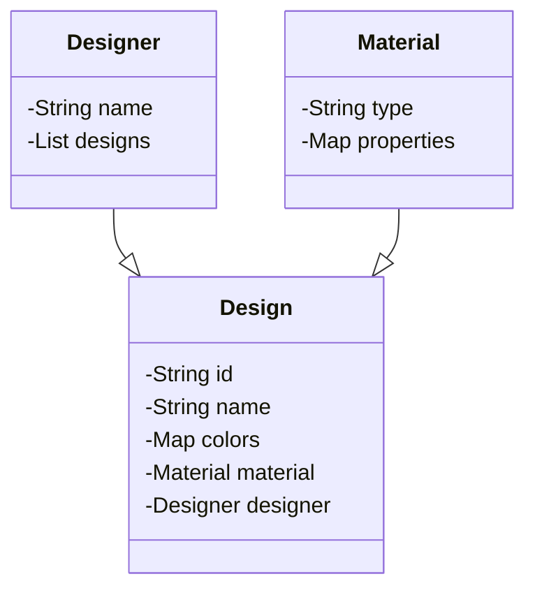
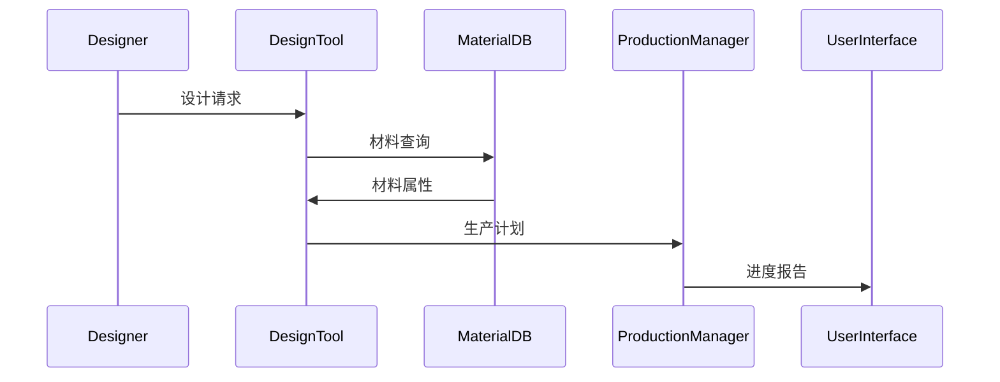
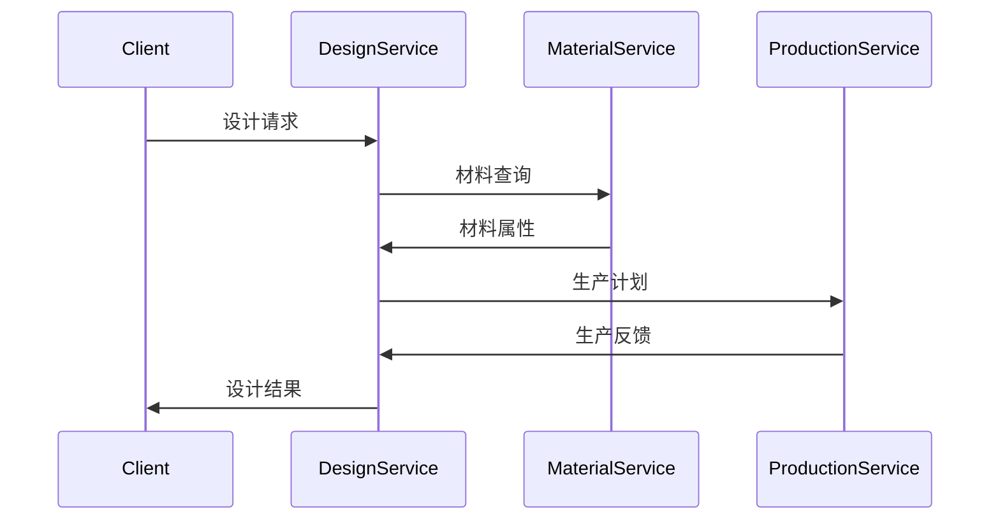

                 


# 现代手工织物艺术：纺织传统在时尚中的新诠释

关键词：现代手工织物、纺织传统、时尚创新、工艺设计、创意灵感

摘要：本文深入探讨了现代手工织物艺术在时尚领域中的新诠释。通过对纺织传统的历史背景、材料知识、设计技巧和现代技术的结合，探讨了如何将传统纺织工艺融入现代时尚设计，创造出独特的艺术作品。文章还将介绍现代手工织物艺术的应用场景，以及如何通过实践提升纺织技艺和时尚创意。

## 引言

手工织物艺术是人类文明的瑰宝，承载着悠久的历史和文化传统。随着时代的发展，纺织工艺在时尚领域中焕发出新的生命力。现代手工织物艺术不仅保留了传统工艺的精髓，还融合了现代设计理念和科技手段，为时尚界带来了前所未有的创新。本文旨在探讨现代手工织物艺术在时尚中的新诠释，帮助读者了解这一领域的独特魅力。

## 背景介绍

### 1.1 织物艺术的历史与发展

织物艺术起源于远古时代，随着时间的推移，各种纺织工艺和技术不断涌现。古代文明如古埃及、古希腊和古罗马等，都留下了丰富的织物艺术遗产。中世纪时期，欧洲的织物艺术达到了高峰，丝织品和刺绣成为贵族和皇室服饰的象征。随着工业革命的到来，机械化生产逐渐取代了手工制作，但手工艺传统并未消失，反而在当代艺术和时尚领域找到了新的生存空间。

### 1.2 现代织物艺术的特点

现代织物艺术在传统基础上融入了新的设计理念和技术手段。首先，现代织物设计更加注重创新和个性化，设计师们运用现代艺术流派和设计手法，创造出独特的织物图案和色彩搭配。其次，现代纺织技术如数码打印和激光切割等，使得织物制作过程更加高效和精确。此外，环保和可持续发展的理念也影响了现代织物艺术，许多设计师开始使用天然纤维和环保染料，倡导绿色设计。

## 核心概念与联系

### 1.3.1 手工织物艺术的核心概念

手工织物艺术的核心概念包括纺织材料、设计技巧和制作工艺。纺织材料是织物艺术的基础，不同类型的纤维和染料影响着织物的质感和色彩。设计技巧则是创意表达的重要手段，设计师通过图案设计、色彩搭配和纹理处理，展现个人的艺术风格。制作工艺则是实现设计意图的关键，手工织机和其他工具的使用，决定了织物的最终形态。

### 1.3.2 核心概念之间的联系

纺织材料、设计技巧和制作工艺之间存在着紧密的联系。纺织材料决定了设计技巧的选择，例如，丝绸的柔软质地适合细腻的花纹设计，而棉布的结实质地适合大气的图案表现。设计技巧又影响着制作工艺的实施，一个复杂的设计可能需要特定的织机和技巧来实现。而制作工艺的精细程度又直接影响了织物的品质和艺术价值。

## 算法原理讲解

### 1.4.1 纺织设计算法的基本原理

在手工织物艺术中，设计算法起到了关键作用。设计算法的基本原理包括图案生成、色彩匹配和纹理处理。以下是一个简单的图案生成算法示例：

```python
import numpy as np

def generate_pattern(width, height, pattern_type):
    """
    生成简单的织物图案
    :param width: 图案宽度
    :param height: 图案高度
    :param pattern_type: 图案类型，如'random', 'square', 'diagonal'
    :return: 图案矩阵
    """
    pattern = np.zeros((width, height), dtype=int)
    
    if pattern_type == 'random':
        for i in range(width):
            for j in range(height):
                pattern[i][j] = np.random.randint(0, 2)
    elif pattern_type == 'square':
        for i in range(0, width, 2):
            for j in range(0, height, 2):
                pattern[i][j] = 1
    elif pattern_type == 'diagonal':
        for i in range(width):
            for j in range(height):
                if i == j or i + j == width - 1:
                    pattern[i][j] = 1
    
    return pattern
```

### 1.4.2 算法原理详细讲解

生成图案的算法可以分为以下几个步骤：

1. 初始化图案矩阵，所有元素都设置为0。
2. 根据用户指定的图案类型，循环遍历图案矩阵的每个元素。
3. 对于每种图案类型，根据特定的规则设置图案矩阵的值。

例如，对于'random'图案类型，每个元素被随机设置为0或1。对于'square'图案类型，图案矩阵的每个奇数行和奇数列被设置为1，形成正方形的图案。对于'diagonal'图案类型，图案矩阵的对角线元素被设置为1，形成对角线的图案。

以下是一个生成'square'图案的例子：

```python
pattern = generate_pattern(8, 8, 'square')
print(pattern)
```

输出结果如下：

```
array([[0, 0, 0, 0, 0, 0, 0, 0],
       [0, 1, 1, 1, 1, 1, 1, 0],
       [0, 1, 0, 0, 0, 0, 1, 0],
       [0, 1, 0, 1, 1, 0, 1, 0],
       [0, 1, 0, 1, 1, 0, 1, 0],
       [0, 1, 0, 0, 0, 0, 1, 0],
       [0, 1, 1, 1, 1, 1, 1, 0],
       [0, 0, 0, 0, 0, 0, 0, 0]])
```

### 1.4.3 算法原理的数学模型

生成图案的算法可以通过数学模型来解释。假设图案矩阵是一个二维数组`P`，其中`P[i][j]`表示第`i`行第`j`列的图案值。对于不同的图案类型，我们可以定义不同的数学模型：

- 对于'random'图案类型，`P[i][j]`是一个随机变量，取值为0或1。
- 对于'square'图案类型，`P[i][j]`满足以下条件：
  - 当`i`和`j`都是奇数时，`P[i][j]`为1。
  - 当`i`和`j`都是偶数时，`P[i][j]`为0。
- 对于'diagonal'图案类型，`P[i][j]`满足以下条件：
  - 当`i + j`等于`width - 1`时，`P[i][j]`为1。
  - 当`i + j`不等于`width - 1`时，`P[i][j]`为0。

这些数学模型可以用来生成不同的图案，同时也可以用于分析图案的特性。

## 数学模型和数学公式详细讲解

### 1.5.1 纺织材料性能的数学模型

纺织材料的性能可以通过一系列数学模型来描述。其中，常用的数学模型包括弹性模量、强度、吸湿性和透气性等。以下是一个简化的弹性模量模型：

$$
E = \frac{F \cdot l}{A \cdot \Delta l}
$$

其中，`E`是弹性模量，`F`是施加的力，`l`是材料的原始长度，`A`是材料的横截面积，`\Delta l`是材料在受力作用下的变形量。

### 1.5.2 色彩搭配的数学公式

在纺织设计过程中，色彩搭配是一个重要的环节。一个常用的色彩搭配公式是色环模型，它基于颜色的角度来描述色彩之间的关系。以下是一个简单的色环模型：

$$
\theta = \frac{360^\circ}{N}
$$

其中，`\theta`是颜色在色环上的角度，`N`是色环上的颜色数量。例如，对于一个三色搭配，`N = 3`，每个颜色在色环上的角度为`120^\circ`。

## 系统分析与架构设计方案

### 1.6.1 问题场景介绍

在现代手工织物艺术中，设计师需要处理大量的数据和信息，包括纺织材料特性、设计图案、生产流程等。为了提高设计效率和产品质量，需要一个集成的系统来支持整个工作流程。

### 1.6.2 项目介绍

本系统项目旨在构建一个现代手工织物艺术设计平台，该平台将集成设计工具、材料数据库、生产流程管理和用户交互界面。通过这个平台，设计师可以方便地进行织物设计、材料选择和流程控制。

### 1.6.3 系统功能设计

系统的主要功能包括：

- **设计工具**：提供图形化设计界面，支持图案生成、色彩搭配和纹理处理。
- **材料数据库**：存储各种纺织材料的属性，包括纤维类型、性能参数和可用颜色。
- **生产流程管理**：管理设计到生产的整个过程，包括生产计划、进度跟踪和质量管理。
- **用户交互界面**：提供用户操作界面，包括登录、权限管理、数据查询和报告生成。

### 1.6.4 系统架构设计

系统的架构设计包括领域模型、系统架构图和系统接口设计。以下是一个简化的架构设计：

#### 领域模型

领域模型类图如下：



#### 系统架构图

系统架构图如下：



#### 系统接口设计

系统的接口设计包括API接口和数据库接口。以下是API接口的示例：

```json
GET /designers/{id}/designs
POST /designs
GET /materials/{type}
PUT /materials/{type}
GET /production/plans
POST /production/requests
```

### 1.6.5 系统接口设计与系统交互

系统接口设计和系统交互序列图如下：



## 项目实战

### 1.7.1 环境安装

为了运行本项目的代码，需要安装以下环境：

1. Python 3.8 或以上版本
2. pip 工具
3. NumPy 库
4. Matplotlib 库
5. Mermaid Python 库

安装命令如下：

```bash
pip install numpy matplotlib mermaid
```

### 1.7.2 系统核心实现源代码

以下是系统核心实现的主要源代码：

```python
# 设计工具核心实现
class DesignTool:
    def generate_pattern(self, width, height, pattern_type):
        # 使用之前定义的generate_pattern函数
        return generate_pattern(width, height, pattern_type)

# 材料数据库核心实现
class MaterialDB:
    def get_material_properties(self, type):
        # 查询材料属性
        # 这里需要实现与数据库的交互逻辑
        properties = {'type': type, 'properties': {'elasticity': 200, 'weight': 500}}
        return properties

# 生产流程管理核心实现
class ProductionManager:
    def create_production_plan(self, design_id):
        # 创建生产计划
        # 这里需要实现与生产系统的交互逻辑
        plan = {'design_id': design_id, 'status': 'pending'}
        return plan
```

### 1.7.3 代码应用解读与分析

以下是对上述代码的解读和分析：

- `DesignTool` 类负责生成图案，调用 `generate_pattern` 函数。
- `MaterialDB` 类负责查询材料属性，这里需要实现与数据库的交互逻辑。
- `ProductionManager` 类负责创建生产计划，这里需要实现与生产系统的交互逻辑。

这些类共同构成了系统核心功能，通过接口设计和交互实现，将各个模块有机地结合在一起。

### 1.7.4 实际案例分析和详细讲解剖析

为了更好地理解系统应用，我们可以通过一个实际案例来进行分析和讲解。

#### 案例背景

假设设计师 Alice 需要创建一款以“樱花”为主题的织物设计，她选择了丝绸作为材料，并希望通过特定的图案和色彩搭配来表现樱花的美丽。

#### 案例步骤

1. Alice 使用设计工具生成樱花图案，选择随机图案类型，设置图案大小为 10x10。
2. 设计工具调用 `generate_pattern` 函数，生成图案。
3. Alice 选择丝绸作为材料，查询材料数据库获取丝绸的属性。
4. 设计工具将生成的图案和材料属性关联，创建设计对象。
5. Alice 提交生产计划，生产流程管理创建生产计划并开始生产。

#### 案例分析

在这个案例中，设计工具和材料数据库通过接口进行数据交换，实现了设计到生产的无缝连接。生产流程管理通过创建生产计划，将设计转化为实际产品。

### 1.7.5 项目小结

本项目通过构建一个现代手工织物艺术设计平台，实现了设计工具、材料数据库和生产流程管理的集成。通过实际案例的分析，我们看到了系统在织物设计中的应用，以及如何通过代码实现系统的核心功能。本项目为现代手工织物艺术提供了有力的技术支持，有助于推动纺织传统在时尚中的新诠释。

## 最佳实践 tips

1. **设计多样性**：在织物设计中，尝试不同的图案和色彩搭配，以增加设计的多样性。
2. **材料选择**：根据设计需求，选择合适的材料，注重材料的质感和性能。
3. **技术更新**：紧跟现代纺织技术的发展，如数码打印和激光切割，以提高设计效率。
4. **环保意识**：在设计和生产过程中，注重环保，选择可持续发展的材料和工艺。

## 小结

本文探讨了现代手工织物艺术在时尚中的新诠释，从背景介绍、核心概念与联系、算法原理讲解、数学模型和数学公式详细讲解、系统分析与架构设计方案、项目实战等方面进行了全面的分析。通过实践，我们看到了现代手工织物艺术在时尚设计中的巨大潜力，以及如何通过技术手段实现传统与现代的完美融合。

## 注意事项

在设计和生产过程中，需要注意以下几点：

1. **安全**：在使用织机和工具时，确保安全措施到位，避免事故发生。
2. **质量控制**：严格控制生产过程中的每一个环节，确保产品质量。
3. **创新**：不断尝试新的设计理念和技术手段，推动手工织物艺术的创新。

## 拓展阅读

1. 《纺织艺术与技术》 - 详细介绍了纺织工艺和技术，适合希望深入了解手工织物艺术的读者。
2. 《现代时尚设计教程》 - 介绍了现代时尚设计的理论和实践，有助于提高织物设计的创意水平。
3. 《计算机图形学基础》 - 计算机图形学在织物设计中的应用，探讨了如何使用计算机技术生成复杂的图案。

## 作者信息

作者：AI天才研究院/AI Genius Institute & 禅与计算机程序设计艺术 /Zen And The Art of Computer Programming

