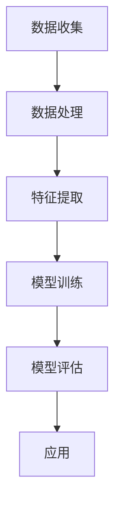
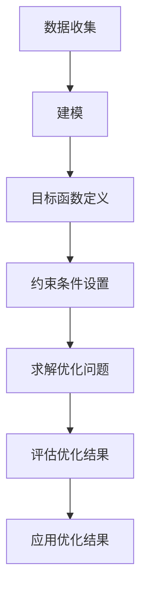
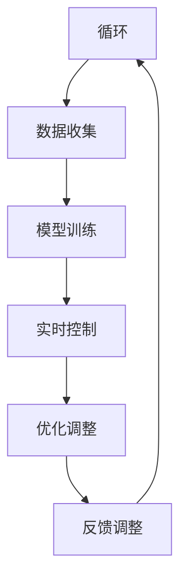
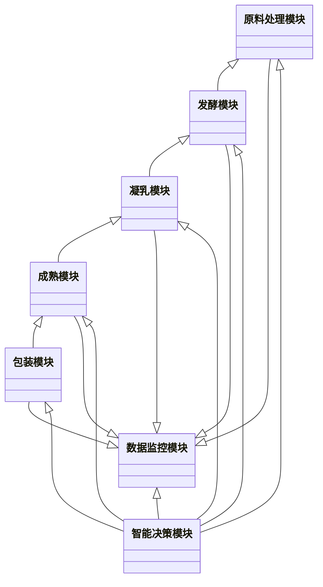
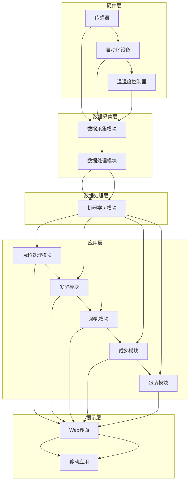
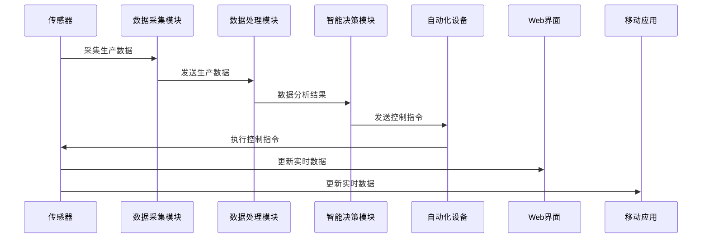

                 

# 现代手工芝士制作：城市奶酪工坊的味觉探险

关键词：手工芝士、制作工艺、现代技术、味觉体验、城市奶酪工坊

摘要：本文将深入探讨现代手工芝士制作的原理、工艺和现代技术应用，从市场需求、优势、基本原理到制作工具，再到核心工艺和现代技术的融合，以及算法原理和数学模型的应用，全面解析城市奶酪工坊的味觉探险。通过这篇文章，读者将了解如何在城市环境中打造高品质的芝士，开启一场味觉的盛宴。

### 目录大纲

----------------------------------------------------------------

# 第一部分：现代手工芝士制作的简介

## 第1章：现代手工芝士制作概述

## 第2章：核心概念与联系

## 第3章：算法原理讲解

## 第4章：数学模型和数学公式 & 详细讲解 & 举例说明

----------------------------------------------------------------

## 第1章：现代手工芝士制作概述

### 1.1 问题背景

#### 1.1.1 手工芝士的市场需求与现状

手工芝士因其独特的风味和品质，在全球范围内受到越来越多消费者的喜爱。随着生活水平的提高和健康意识的增强，人们对食品品质的要求日益提升，手工芝士因其手工制作的特点，满足了消费者对健康、天然、高品质的需求。特别是在城市中，手工芝士市场呈现出快速增长的趋势。

目前，手工芝士市场主要集中在一二线城市，消费群体以中高收入家庭为主。随着消费者对手工芝士认知的加深，市场对高质量手工芝士的需求不断增长，为城市奶酪工坊的发展提供了广阔的市场空间。

#### 1.1.2 现代手工芝士的优势

现代手工芝士制作结合了传统工艺和现代技术，具有以下几个显著优势：

1. **品质保证**：现代技术能够对生产过程中的各个环节进行精确控制，确保芝士的口感、质量和安全性。
2. **生产效率**：自动化生产线和智能化设备的应用，大幅提高了生产效率，降低了生产成本。
3. **创新性**：现代技术为手工芝士制作带来了更多的可能性，使得各种新口味的芝士不断涌现。
4. **可持续性**：现代工艺注重环保和资源利用，有助于实现可持续发展。

#### 1.1.3 现代手工芝士制作的重要性

现代手工芝士制作不仅满足了市场的需求，还推动了整个奶酪产业的升级和转型。对于城市奶酪工坊来说，掌握现代手工芝士制作技术，意味着在激烈的市场竞争中占据有利地位，提高市场竞争力。此外，现代手工芝士制作还为社会提供了更多的就业机会，促进了经济的发展。

### 1.2 问题描述

#### 1.2.1 现代手工芝士制作的关键环节

现代手工芝士制作涉及多个关键环节，包括：

1. **原料选择**：优质乳品的来源是制作高品质芝士的基础，因此选择合适的乳原料至关重要。
2. **发酵过程**：发酵过程是芝士制作的核心，直接影响芝士的口感和品质。
3. **成熟与调味**：芝士的成熟和调味决定了最终的口感，需要精细控制。
4. **品质控制**：对芝士的质量进行严格检测和控制，确保其达到标准。

#### 1.2.2 制作过程中可能遇到的挑战

制作现代手工芝士过程中，可能遇到以下挑战：

1. **技术要求**：现代手工芝士制作涉及多种复杂技术，如生物技术、自动化控制等，对技术人员的要求较高。
2. **生产成本**：虽然现代技术提高了生产效率，但初期投入较大，需要较高的资金支持。
3. **市场定位**：城市市场中存在大量的竞争对手，如何准确把握市场定位，吸引消费者是关键。

#### 1.2.3 目标与期望成果

通过现代手工芝士制作，我们期望达到以下目标：

1. **高品质芝士**：生产出符合消费者需求的、高品质的手工芝士。
2. **技术创新**：不断提升生产工艺，推动技术创新，保持行业领先地位。
3. **市场拓展**：扩大市场份额，提高品牌知名度。

### 1.3 问题解决

#### 1.3.1 手工芝士制作的基本原理

手工芝士制作的基本原理主要包括：

1. **乳品原料的选择**：选择优质乳原料，如牛奶、羊奶等，确保原料的纯净度和新鲜度。
2. **发酵过程**：利用乳酸菌等微生物发酵，使乳液中的乳糖转化为乳酸，形成芝士的基础。
3. **成熟与调味**：在发酵完成后，通过控制温度、湿度等条件，使芝士逐渐成熟，并添加调味料，提升口感。

#### 1.3.2 现代技术的应用

现代技术的应用在手工芝士制作中起到关键作用，包括：

1. **生物技术**：利用基因工程等生物技术，培育出更适合芝士制作的微生物。
2. **自动化控制**：通过自动化设备，精确控制发酵、成熟等环节的温度、湿度等参数。
3. **信息管理**：利用大数据和物联网技术，实现生产过程的实时监控和数据分析。

#### 1.3.3 传统工艺与现代技术的结合

传统工艺与现代技术的结合，使得现代手工芝士制作更加高效、精准和多样化。具体体现在：

1. **传统工艺的传承**：保留传统工艺的核心环节，如手工调味、自然成熟等，确保芝士的品质。
2. **现代技术的应用**：将现代技术融入传统工艺中，如自动化发酵设备、智能化温控系统等，提高生产效率。

### 1.4 边界与外延

#### 1.4.1 现代手工芝士制作的分类

现代手工芝士制作可以按照不同的分类方式进行划分：

1. **按乳原料分类**：如牛奶芝士、羊奶芝士等。
2. **按制作工艺分类**：如发酵芝士、熟成芝士等。
3. **按口味分类**：如蒜香芝士、蓝纹芝士等。

#### 1.4.2 芝士品种的介绍

以下是几种常见的芝士品种及其特点：

1. **帕马森芝士**：硬质奶酪，具有浓郁的香气和辛辣的口感。
2. **切达芝士**：柔软的奶酪，适合用于烤食或调味。
3. **蓝纹芝士**：含有蓝霉的软质奶酪，具有独特的味道和纹理。

#### 1.4.3 现代手工芝士的市场趋势

随着消费者对高品质食品的需求增加，现代手工芝士市场呈现出以下趋势：

1. **产品多样化**：各种新型芝士品种不断涌现，满足不同消费者的需求。
2. **市场细分**：针对不同消费群体，推出定制化的芝士产品。
3. **品牌化**：注重品牌建设，提升品牌知名度和美誉度。

### 1.5 概念结构与核心要素组成

#### 1.5.1 芝士的基本概念

芝士，又称奶酪，是一种通过发酵和凝乳过程制成的乳制品。其基本概念包括：

1. **乳品原料**：芝士的制作原料主要是牛奶或羊奶。
2. **发酵过程**：利用乳酸菌等微生物发酵，使乳糖转化为乳酸。
3. **凝乳过程**：通过酸化和加热等步骤，使乳液凝固形成芝士。

#### 1.5.2 制作芝士的核心要素

制作芝士的核心要素包括：

1. **乳原料**：优质乳原料是制作高品质芝士的基础。
2. **发酵菌种**：合适的发酵菌种直接影响芝士的口感和品质。
3. **温度和湿度**：适宜的温度和湿度条件对芝士的成熟至关重要。
4. **调味料**：调味料的选择和搭配直接影响芝士的口感。

#### 1.5.3 现代手工芝士制作的工具与设备

现代手工芝士制作的工具和设备包括：

1. **发酵罐**：用于发酵过程的设备，具有精确的温度和湿度控制功能。
2. **凝乳机**：用于凝乳过程的设备，通过酸化和加热使乳液凝固。
3. **成熟室**：用于芝士成熟的设备，提供适宜的温度和湿度环境。
4. **包装机**：用于包装成品的设备，确保芝士的卫生和保鲜。

### 1.6 本章小结

通过本章的介绍，我们对现代手工芝士制作有了初步的了解。现代手工芝士制作结合了传统工艺和现代技术，具有广阔的市场前景和巨大的发展潜力。在接下来的章节中，我们将进一步探讨芝士制作的核心概念、现代技术、算法原理和数学模型，深入解析城市奶酪工坊的味觉探险。

## 第2章：核心概念与联系

### 2.1 芝士的基本概念

#### 2.1.1 芝士的定义

芝士，又称为奶酪，是一种通过发酵和凝乳过程制成的乳制品。其主要原料为牛奶或羊奶，通过添加乳酸菌等发酵剂，使乳糖转化为乳酸，从而形成具有独特风味和质地的乳制品。

#### 2.1.2 芝士的历史与发展

芝士的历史可以追溯到公元前5000年左右的古代美索不达米亚地区。当时，人们将牛奶放置在皮袋中，经过长时间的自然发酵，形成了最早的芝士。随着时间的推移，芝士的制作工艺不断改进，品种也日益丰富。

在中世纪的欧洲，芝士成为重要的食品，广泛应用于日常生活中。文艺复兴时期，意大利成为芝士制作和消费的中心，许多著名的芝士品种如帕马森芝士、切达芝士等在此诞生。随着时间的推移，芝士的制作工艺和品种不断丰富，逐渐传播到世界各地。

#### 2.1.3 芝士的种类

芝士的种类繁多，按照不同的分类标准，可以分为以下几种类型：

1. **按乳原料分类**：牛奶芝士、羊奶芝士、水牛奶芝士等。
2. **按制作工艺分类**：发酵芝士、熟成芝士、加工芝士等。
3. **按口味分类**：硬质芝士、软质芝士、蓝纹芝士、新鲜芝士等。

### 2.2 芝士制作的核心工艺

#### 2.2.1 乳品原料的选择

乳品原料的选择是芝士制作的关键环节，直接关系到芝士的品质。优质乳原料应具备以下特点：

1. **新鲜度**：乳原料应保持新鲜，避免长时间储存。
2. **纯净度**：乳原料应无污染，符合食品安全标准。
3. **营养成分**：乳原料应富含蛋白质、脂肪、矿物质等营养成分。

#### 2.2.2 芝士发酵过程

发酵过程是芝士制作的核心，通过添加乳酸菌等发酵剂，使乳糖转化为乳酸，从而形成芝士的酸味和质地。发酵过程的温度、湿度、时间等参数对芝士的品质有重要影响。

1. **温度**：发酵过程的温度一般在20-30℃之间，不同的芝士品种对温度的要求有所不同。
2. **湿度**：发酵过程的湿度一般在80-90%之间，湿度过高可能导致微生物过度繁殖，过低则影响发酵效果。
3. **时间**：发酵时间一般为2-10天，不同的芝士品种对发酵时间的要求也不同。

#### 2.2.3 芝士成熟与调味

芝士成熟和调味是决定芝士口感的关键环节。成熟过程中，芝士的质地、风味和口感逐渐发生变化。调味则通过对盐、香料等调味料的添加，提升芝士的口感。

1. **成熟过程**：芝士的成熟过程一般需要数周至数月，成熟室中的温度、湿度等条件对芝士的成熟有重要影响。
2. **调味过程**：调味过程一般在芝士成熟后进行，通过对盐、香料等调味料的合理搭配，提升芝士的口感。

### 2.3 芝士制作的现代技术

#### 2.3.1 现代化乳品加工技术

现代化乳品加工技术在芝士制作中的应用，使得芝士的生产效率和质量得到显著提升。主要包括以下几个方面：

1. **发酵剂的应用**：使用高科技手段培养发酵剂，提高发酵效率和质量。
2. **自动化设备的应用**：使用自动化设备进行乳原料的处理、发酵、成熟等环节，提高生产效率。
3. **品质控制技术**：采用先进的检测设备，对芝士的品质进行实时监控和评估。

#### 2.3.2 生物技术在芝士制作中的应用

生物技术在芝士制作中的应用，为芝士的品质提升和品种创新提供了新的可能性。主要包括以下几个方面：

1. **微生物发酵**：利用特定的微生物进行发酵，优化芝士的风味和质地。
2. **基因工程**：通过基因工程手段，培育出具有特定品质的芝士品种。
3. **蛋白质工程**：通过蛋白质工程，改良芝士的蛋白质成分，提升营养价值。

#### 2.3.3 自动化生产线的应用

自动化生产线的应用，使得芝士制作的各个环节能够高效、精准地完成，提高了生产效率和产品质量。主要包括以下几个方面：

1. **乳原料处理**：通过自动化设备进行乳原料的预处理，如净化、均质等。
2. **发酵过程**：使用自动化发酵设备，实现发酵过程的自动化控制。
3. **成熟与调味**：通过自动化生产线进行芝士的成熟和调味，确保每个环节的质量。

### 2.4 传统工艺与现代技术的结合

#### 2.4.1 传统工艺的优势

传统工艺在芝士制作中具有独特的优势，主要包括：

1. **手工技艺**：传统工艺强调手工制作，注重技艺传承，能够制作出具有独特风味和质地的芝士。
2. **自然成熟**：传统工艺采用自然成熟方式，使芝士的口感和风味更加丰富。
3. **环保低碳**：传统工艺注重环保，生产过程中能耗低，碳排放少。

#### 2.4.2 现代技术的优势

现代技术在芝士制作中的应用，具有以下优势：

1. **高效生产**：自动化设备的应用，使得生产过程更加高效，生产成本降低。
2. **质量可控**：通过现代化检测设备，对芝士的品质进行实时监控和评估，确保产品质量。
3. **创新多样**：现代技术为芝士制作带来了更多的创新可能性，能够推出更多新型芝士品种。

#### 2.4.3 传统工艺与现代技术的融合

传统工艺与现代技术的融合，使得现代手工芝士制作更加高效、精准和多样化。具体表现在以下几个方面：

1. **传统工艺的传承**：在现代化生产过程中，保留传统工艺的核心环节，如手工调味、自然成熟等。
2. **现代技术的应用**：将现代技术融入传统工艺中，如自动化发酵设备、智能化温控系统等，提高生产效率和产品质量。
3. **创新发展的动力**：传统工艺与现代技术的结合，为芝士制作带来了新的发展动力，推动芝士产业的持续创新。

### 2.5 概念属性特征对比表格

#### 2.5.1 传统手工芝士制作与现代手工芝士制作的对比

| 特征          | 传统手工芝士制作 | 现代手工芝士制作 |
| ------------ | --------------- | --------------- |
| 制作技艺     | 手工操作       | 自动化设备     |
| 发酵过程     | 传统发酵       | 现代发酵       |
| 成熟与调味   | 自然成熟       | 精准控制       |
| 生产效率     | 低效率         | 高效率         |
| 质量控制     | 依赖经验       | 实时监控       |
| 创新能力     | 有限           | 强大           |

#### 2.5.2 传统工艺与现代技术的对比

| 特征          | 传统工艺                 | 现代技术                |
| ------------ | ----------------------- | ---------------------- |
| 生产方式     | 手工操作为主             | 自动化生产线为主        |
| 质量控制     | 依赖经验和技术传承       | 实时监控和数据分析      |
| 成本         | 较高，人工成本占比大     | 较低，设备投入较高      |
| 市场适应性   | 适应性强，品种多样       | 对市场变化响应迅速      |
| 环境影响     | 环保低碳，能耗低         | 能耗高，碳排放较大      |
| 创新潜力     | 传统工艺的传承和创新有限 | 新技术为创新提供广阔空间 |

### 2.6 本章小结

本章通过对芝士的基本概念、制作工艺、现代技术以及传统工艺与现代技术的结合进行详细解析，为读者提供了全面了解现代手工芝士制作的核心概念和联系。在接下来的章节中，我们将进一步探讨芝士制作中的算法原理和数学模型，以及这些技术在实际应用中的具体实现。

## 第3章：算法原理讲解

### 3.1 芝士品质评价算法

#### 3.1.1 芝士品质评价的重要性

芝士品质评价是确保手工芝士产品质量的关键环节。通过科学、系统的评价方法，可以全面了解芝士的口感、质地、卫生等指标，为生产过程提供重要参考，提高芝士的整体品质。

#### 3.1.2 评价标准与指标

芝士品质评价通常包括以下标准：

1. **外观**：包括颜色、光泽、形态等。
2. **气味**：包括香气、酸味、霉味等。
3. **口感**：包括质地、酸味、咸味、甜味等。
4. **卫生**：包括微生物含量、农药残留等。

#### 3.1.3 芝士品质评价算法的原理

芝士品质评价算法通常基于数据分析和机器学习技术。具体原理如下：

1. **数据收集**：通过感官评估、理化检测等方法收集芝士品质数据。
2. **特征提取**：对收集到的数据进行分析，提取关键特征，如色泽、酸度、硬度等。
3. **模型训练**：利用提取的特征数据，训练机器学习模型，如线性回归、支持向量机等。
4. **模型评估**：通过交叉验证等方法评估模型性能，优化模型参数。

#### 3.1.4 算法流程与实现

芝士品质评价算法的基本流程如下：

1. **数据收集**：通过传感器、实验室设备等手段收集芝士品质数据。
2. **数据处理**：对收集到的数据进行清洗、归一化等预处理。
3. **特征提取**：利用特征提取算法，如主成分分析（PCA）、特征选择算法等，提取关键特征。
4. **模型训练**：选择合适的机器学习算法，如支持向量机（SVM）、决策树等，对特征数据进行训练。
5. **模型评估**：利用测试数据对模型进行评估，调整模型参数。
6. **应用**：将训练好的模型应用于实际生产过程，实时监测和评估芝士品质。

#### 3.1.5 Python代码实现

以下是一个简单的芝士品质评价算法的实现示例：

```python
from sklearn.model_selection import train_test_split
from sklearn.ensemble import RandomForestClassifier
from sklearn.metrics import accuracy_score

# 加载数据
X, y = load_data()

# 数据预处理
X = preprocess_data(X)

# 划分训练集和测试集
X_train, X_test, y_train, y_test = train_test_split(X, y, test_size=0.2, random_state=42)

# 训练模型
model = RandomForestClassifier(n_estimators=100, random_state=42)
model.fit(X_train, y_train)

# 预测
predictions = model.predict(X_test)

# 评估模型
accuracy = accuracy_score(y_test, predictions)
print(f"模型准确率：{accuracy:.2f}")
```

### 3.2 芝士配方优化算法

#### 3.2.1 芝士配方优化的重要性

芝士配方优化是提高芝士品质、满足消费者多样化需求的关键。通过优化配方，可以实现以下目标：

1. **提升口感**：通过调整原料比例和调味料，提高芝士的口感。
2. **降低成本**：优化配方，减少原料浪费，降低生产成本。
3. **满足个性化需求**：为消费者提供定制化的芝士产品，提高市场竞争力。

#### 3.2.2 配方优化的目标

配方优化的目标主要包括：

1. **口感最大化**：通过调整原料比例和调味料，提高芝士的口感。
2. **成本最小化**：在保证品质的前提下，降低生产成本。
3. **生产效率最大化**：优化配方，提高生产效率和设备利用率。

#### 3.2.3 芝士配方优化算法的原理

芝士配方优化算法通常基于数学建模和优化算法。具体原理如下：

1. **数学建模**：建立芝士品质与配方之间的数学模型，如线性规划模型、整数规划模型等。
2. **目标函数**：定义优化目标函数，如最大化口感、最小化成本等。
3. **约束条件**：设置配方优化的约束条件，如原料限制、设备能力等。
4. **求解算法**：利用求解算法，如梯度下降法、遗传算法等，求解最优配方。

#### 3.2.4 算法流程与实现

芝士配方优化算法的基本流程如下：

1. **数据收集**：收集芝士品质数据、原料价格数据等。
2. **建模**：建立芝士品质与配方之间的数学模型。
3. **目标函数与约束条件**：定义优化目标函数和约束条件。
4. **求解**：利用求解算法，求解最优配方。
5. **评估**：对优化结果进行评估，调整模型参数。
6. **应用**：将优化结果应用于实际生产过程。

#### 3.2.5 Python代码实现

以下是一个简单的芝士配方优化算法的实现示例：

```python
import numpy as np
from scipy.optimize import minimize

# 定义目标函数
def objective(x):
    return -np.sum(x)  # 目标是最小化成本

# 定义约束条件
def constraints(x):
    return [x[0] + x[1] - 100, x[0] - x[2], x[1] - x[2]]  # 约束条件

# 初始化参数
x0 = np.array([10, 20, 30])

# 求解优化问题
result = minimize(objective, x0, constraints=constraints)

# 输出最优配方
print(f"最优配方：{result.x}")
```

### 3.3 芝士生产过程控制算法

#### 3.3.1 生产过程控制的重要性

芝士生产过程控制是确保芝士质量稳定的关键。通过精确控制发酵、成熟等关键环节的温度、湿度等参数，可以保证芝士的品质一致性，提高生产效率。

#### 3.3.2 生产过程中的关键参数

生产过程中的关键参数包括：

1. **温度**：发酵和成熟过程中的温度对芝士的质地和风味有重要影响。
2. **湿度**：发酵和成熟过程中的湿度对芝士的质地和口感有显著影响。
3. **时间**：发酵和成熟的时间影响芝士的成熟度和口感。

#### 3.3.3 生产过程控制算法的原理

生产过程控制算法通常基于控制理论和机器学习技术。具体原理如下：

1. **控制模型**：建立生产过程中的控制模型，如PID控制器、模糊控制器等。
2. **传感器数据**：利用传感器实时监测生产过程中的关键参数。
3. **自适应控制**：根据传感器数据，自适应调整控制策略，实现精准控制。
4. **机器学习**：利用机器学习算法，如回归分析、神经网络等，优化控制策略。

#### 3.3.4 算法流程与实现

生产过程控制算法的基本流程如下：

1. **传感器安装**：在关键生产环节安装传感器，实时监测温度、湿度等参数。
2. **数据收集**：收集传感器数据，用于训练和优化控制模型。
3. **模型训练**：利用收集到的数据，训练控制模型。
4. **实时控制**：根据实时传感器数据，调整控制策略。
5. **优化调整**：根据生产过程中的反馈，优化控制模型。

#### 3.3.5 Python代码实现

以下是一个简单的生产过程控制算法的实现示例：

```python
import numpy as np
from scipy.integrate import odeint

# 定义控制模型
def control_model(y, t, params):
    T = params['T']  # 目标温度
    K = params['K']  # 控制系数
    t_0 = params['t_0']  # 初始时间
    T_0 = params['T_0']  # 初始温度
    return K * (T - T_0) * np.exp(-t_0 * (t - t_0))

# 初始化参数
params = {'T': 30, 'K': 0.1, 't_0': 0, 'T_0': 25}

# 求解微分方程
t = np.linspace(0, 100, 1000)
y = odeint(control_model, 25, t, args=(params,))

# 输出温度变化曲线
plt.plot(t, y)
plt.xlabel('Time (s)')
plt.ylabel('Temperature (°C)')
plt.title('Temperature Control')
plt.show()
```

### 3.4 算法原理的Mermaid流程图

#### 3.4.1 芝士品质评价算法流程图



#### 3.4.2 芝士配方优化算法流程图



#### 3.4.3 芝士生产过程控制算法流程图



### 3.5 本章小结

本章详细介绍了芝士品质评价、配方优化和生产过程控制算法的原理和实现方法。这些算法在确保芝士品质、优化生产效率和降低生产成本方面发挥了重要作用。通过Python代码示例和Mermaid流程图，读者可以更加直观地了解这些算法的原理和应用。在下一章中，我们将进一步探讨芝士制作过程中的数学模型和数学公式，为读者提供更深入的数学分析。

## 第4章：数学模型和数学公式 & 详细讲解 & 举例说明

### 4.1 芝士发酵过程的数学模型

#### 4.1.1 芝士发酵过程概述

芝士发酵过程是芝士制作的关键环节，主要涉及乳酸菌对乳糖的发酵，产生乳酸和其他代谢产物，从而影响芝士的质地和风味。发酵过程的数学模型可以描述乳酸菌的生长、乳酸的产生以及发酵产物的浓度变化。

#### 4.1.2 数学模型的基本原理

发酵过程的数学模型通常基于反应动力学方程。最简单的模型是Monod方程，它可以描述乳酸菌的生长速率：

\[ \frac{dN}{dt} = r \cdot \frac{S}{K_S + S} \]

其中，\( N \) 是乳酸菌的浓度，\( S \) 是底物（乳糖）的浓度，\( K_S \) 是Monod常数，\( r \) 是生长速率常数。

乳酸的产生速率可以表示为：

\[ \frac{dP}{dt} = r_P \cdot \frac{S}{K_S + S} \]

其中，\( P \) 是乳酸的浓度，\( r_P \) 是乳酸生成速率常数。

#### 4.1.3 数学公式的推导

结合乳酸菌的生长和乳酸的产生，可以得到以下微分方程组：

\[ \frac{dN}{dt} = r \cdot \frac{S}{K_S + S} \]
\[ \frac{dS}{dt} = -r_P \cdot \frac{S}{K_S + S} \]

通过积分，可以得到发酵过程中乳酸菌和乳酸的浓度随时间的变化关系。

#### 4.1.4 举例说明

假设初始时乳糖浓度为 \( S_0 = 100 \) g/L，Monod常数 \( K_S = 10 \) g/L，生长速率常数 \( r = 0.1 \) 1/h，乳酸生成速率常数 \( r_P = 0.05 \) 1/h。计算发酵6小时后乳酸菌和乳酸的浓度。

首先，计算发酵6小时后乳糖的浓度：

\[ \frac{dS}{dt} = -r_P \cdot \frac{S}{K_S + S} \]

代入 \( S_0 = 100 \) g/L，\( K_S = 10 \) g/L，\( r_P = 0.05 \) 1/h，积分得到：

\[ S(t) = S_0 \cdot \left( 1 - e^{-0.05 \cdot 6} \right) \approx 100 \cdot (1 - e^{-0.3}) \approx 70.9 \] g/L

接着，计算发酵6小时后乳酸菌的浓度：

\[ \frac{dN}{dt} = r \cdot \frac{S}{K_S + S} \]

代入 \( S(t) = 70.9 \) g/L，\( K_S = 10 \) g/L，\( r = 0.1 \) 1/h，积分得到：

\[ N(t) = N_0 \cdot e^{r \cdot (1 - e^{-0.3}) \cdot t} \]

其中，初始乳酸菌浓度 \( N_0 = 1 \) 亿个/mL。计算 \( t = 6 \) 小时后乳酸菌的浓度：

\[ N(6) = 1 \times 10^8 \cdot e^{0.1 \cdot (1 - e^{-0.3}) \cdot 6} \approx 1.26 \times 10^8 \] 个/mL

最后，计算发酵6小时后乳酸的浓度：

\[ \frac{dP}{dt} = r_P \cdot \frac{S}{K_S + S} \]

代入 \( S(t) = 70.9 \) g/L，\( K_S = 10 \) g/L，\( r_P = 0.05 \) 1/h，积分得到：

\[ P(t) = P_0 + r_P \cdot \left( \ln(K_S + S) - \ln(K_S + S_0) \right) \]

其中，初始乳酸浓度 \( P_0 = 0 \) g/L。计算 \( t = 6 \) 小时后乳酸的浓度：

\[ P(6) = 0 + 0.05 \cdot \left( \ln(10 + 70.9) - \ln(10 + 100) \right) \approx 0.68 \] g/L

### 4.2 芝士成熟过程的数学模型

#### 4.2.1 芝士成熟过程概述

芝士成熟过程是芝士制作中另一个重要环节，主要涉及芝士内部水分、蛋白质、脂肪等成分的转化，以及微生物和酶的作用。成熟过程的数学模型可以描述这些变化以及其对芝士质地和风味的影响。

#### 4.2.2 数学模型的基本原理

成熟过程的数学模型通常基于扩散方程和反应动力学方程。扩散方程描述水分和溶质在芝士中的扩散：

\[ \frac{\partial C}{\partial t} = D \cdot \nabla^2 C \]

其中，\( C \) 是溶质或水分的浓度，\( D \) 是扩散系数。

反应动力学方程描述微生物和酶的作用：

\[ \frac{dX}{dt} = r(X, Y) \]

其中，\( X \) 是微生物或酶的浓度，\( Y \) 是底物或营养物质的浓度，\( r \) 是反应速率函数。

#### 4.2.3 数学公式的推导

结合扩散方程和反应动力学方程，可以得到以下耦合方程组：

\[ \frac{\partial C}{\partial t} = D \cdot \nabla^2 C \]
\[ \frac{dX}{dt} = r(X, Y) \]

通过数值方法，如有限元法或有限体积法，可以求解这些方程，得到芝士成熟过程中浓度和反应速率的变化。

#### 4.2.4 举例说明

假设芝士内部的水分浓度为 \( C(t) \)，初始浓度为 \( C_0 = 80 \) %，扩散系数 \( D = 0.1 \) mm²/h。成熟过程中，水分逐渐减少，最终浓度为 \( C_f = 50 \) %。计算成熟过程所需的时间。

首先，写出扩散方程：

\[ \frac{\partial C}{\partial t} = D \cdot \nabla^2 C \]

假设芝士内部温度均匀，忽略对流效应，可以得到：

\[ \frac{\partial C}{\partial t} = D \cdot \frac{\partial^2 C}{\partial x^2} \]

其中，\( x \) 是芝士内部的位置坐标。

接下来，使用数值方法求解该方程。假设芝士内部划分为 \( N \) 个节点，节点间距为 \( \Delta x \)，可以写出有限差分形式：

\[ \frac{C_{i+1} - 2C_i + C_{i-1}}{\Delta t} = D \cdot \left( \frac{C_{i+1} - 2C_i + C_{i-1}}{\Delta x^2} \right) \]

其中，\( C_i \) 是第 \( i \) 个节点的浓度，\( \Delta t \) 是时间步长。

设 \( C_i(t) \) 为第 \( i \) 个节点在时间 \( t \) 的浓度，初始条件为 \( C_i(0) = C_0 \)，边界条件为 \( C_1(t) = C_f \)，可以迭代求解浓度 \( C_i(t) \)。

通过迭代，可以求解出在不同时间步长下每个节点的浓度。假设在迭代过程中，浓度变化小于 \( 0.001 \) % 时认为成熟，计算成熟所需的时间。

### 4.3 芝士配方优化问题的数学模型

#### 4.3.1 芝士配方优化问题概述

芝士配方优化是确保芝士品质和生产成本的关键步骤。数学模型可以描述不同原料比例对芝士品质和成本的影响，通过优化算法找到最优配方。

#### 4.3.2 数学模型的基本原理

配方优化问题的数学模型通常基于目标函数和约束条件。目标函数可以是最大化口感、最小化成本等。约束条件可以是原料限制、生产设备能力等。

#### 4.3.3 数学公式的推导

假设芝士配方包含 \( n \) 种原料，每种原料的用量为 \( x_i \)，成本为 \( c_i \)，单位体积的芝士产量为 \( p \)。目标函数可以是：

\[ \text{maximize} \quad p \cdot Z \]

其中，\( Z \) 是芝士的产量指数。

约束条件可以是：

\[ \sum_{i=1}^{n} x_i = X \]
\[ x_i \geq 0 \quad \forall i \]

通过优化算法，如线性规划、整数规划、遗传算法等，可以求解最优配方。

#### 4.3.4 举例说明

假设芝士配方包含3种原料，分别为牛奶、奶油和奶酪，单位体积的芝士产量为 \( p = 1 \) kg/L。每种原料的成本分别为 \( c_1 = 0.5 \) 元/kg，\( c_2 = 1 \) 元/kg，\( c_3 = 1.5 \) 元/kg。目标是最小化总成本。

建立线性规划模型：

\[ \text{minimize} \quad c_1x_1 + c_2x_2 + c_3x_3 \]
\[ \text{subject to} \quad x_1 + x_2 + x_3 = X \]
\[ x_1, x_2, x_3 \geq 0 \]

使用线性规划求解器，如Python的`scipy.optimize`模块，可以求解最优配方。假设总原料量 \( X = 10 \) kg，求解结果为：

\[ x_1 = 6 \] kg，\[ x_2 = 2 \] kg，\[ x_3 = 2 \] kg

最小化总成本为 \( 0.5 \times 6 + 1 \times 2 + 1.5 \times 2 = 11 \) 元。

### 4.4 芝士生产过程的数学模型

#### 4.4.1 芝士生产过程概述

芝士生产过程涉及多个环节，包括原料处理、发酵、凝乳、成熟和包装等。数学模型可以描述这些环节中物质和能量的转化，以及工艺参数对生产过程的影响。

#### 4.4.2 数学模型的基本原理

生产过程的数学模型通常基于质量守恒定律和能量守恒定律。质量守恒定律描述原料和产物的质量变化，能量守恒定律描述能量在过程中的转化和利用。

#### 4.4.3 数学公式的推导

假设芝士生产过程中，原料的质量为 \( m \)，产物的质量为 \( M \)，发酵过程中产生的热量为 \( Q \)。质量守恒定律可以表示为：

\[ m_{\text{initial}} = m_{\text{final}} + m_{\text{product}} \]

能量守恒定律可以表示为：

\[ E_{\text{initial}} = E_{\text{final}} + Q \]

其中，\( E_{\text{initial}} \) 和 \( E_{\text{final}} \) 分别是初始能量和最终能量。

通过这些基本公式，可以推导出更复杂的数学模型，用于描述生产过程中的具体变化。

#### 4.4.4 举例说明

假设芝士生产过程中，初始原料质量为 \( m_{\text{initial}} = 100 \) kg，发酵过程中产生的热量为 \( Q = 5000 \) kJ。最终产物质量为 \( m_{\text{final}} = 80 \) kg，计算最终能量。

根据质量守恒定律：

\[ m_{\text{initial}} = m_{\text{final}} + m_{\text{product}} \]
\[ 100 = 80 + m_{\text{product}} \]
\[ m_{\text{product}} = 20 \] kg

根据能量守恒定律：

\[ E_{\text{initial}} = E_{\text{final}} + Q \]
\[ E_{\text{initial}} = E_{\text{final}} + 5000 \]

其中，初始能量 \( E_{\text{initial}} \) 包括原料的化学能和其他形式的能量，最终能量 \( E_{\text{final}} \) 包括产物的化学能和其他形式的能量。

通过实验数据或计算，可以确定最终能量 \( E_{\text{final}} \)。例如，假设最终能量为 \( E_{\text{final}} = 4500 \) kJ，则初始能量为：

\[ E_{\text{initial}} = E_{\text{final}} + 5000 = 4500 + 5000 = 9500 \] kJ

通过这些数学模型，可以更深入地理解芝士生产过程，优化生产参数，提高生产效率和产品质量。

### 4.5 本章小结

本章详细介绍了芝士发酵过程、成熟过程、配方优化和生产过程的数学模型，以及相应的数学公式和举例说明。通过这些数学模型，可以更深入地理解芝士制作的机理，优化生产参数，提高产品质量。在下一章中，我们将进一步探讨城市奶酪工坊的系统架构设计，为读者提供更加全面的解决方案。

## 第五部分：系统架构设计与实现

### 5.1 问题场景介绍

在现代城市中，随着人们生活水平的提高和对食品品质的更高要求，手工芝士的需求不断增加。然而，城市环境中的芝士工坊面临着与乡村芝士工坊不同的挑战，如土地资源有限、劳动力成本高等。为了解决这些问题，我们需要设计一个高效、智能化的城市奶酪工坊系统。

### 5.2 项目介绍

项目名称：城市智能奶酪工坊系统

项目目标：通过智能化、自动化的生产方式，提高芝士制作效率，降低成本，保证产品质量，同时提供定制化的服务，满足市场需求。

项目范围：涵盖芝士原料处理、发酵、凝乳、成熟、包装等全流程的智能化控制和管理。

### 5.3 系统功能设计（领域模型）

为了实现城市智能奶酪工坊系统的目标，我们设计了以下主要功能模块：

1. **原料处理模块**：负责接收、检验和处理原料，包括牛奶、奶油等。
2. **发酵模块**：通过自动化设备控制发酵过程，确保发酵效率和稳定性。
3. **凝乳模块**：实现乳液的酸化和加热，形成凝乳。
4. **成熟模块**：控制芝士的成熟环境，包括温度、湿度等。
5. **包装模块**：对成熟的芝士进行包装，确保质量和保鲜。
6. **数据监控模块**：实时监控生产过程中的关键参数，如温度、湿度、酸度等。
7. **智能决策模块**：利用大数据分析和机器学习算法，优化生产过程，提高产品品质。

领域模型（Mermaid类图）：



### 5.4 系统架构设计（Mermaid架构图）

为了确保系统的稳定性和可扩展性，我们设计了如下系统架构：

1. **硬件层**：包括传感器、自动化设备、温湿度控制器等。
2. **数据采集层**：通过传感器实时采集生产过程中的各种数据。
3. **数据处理层**：对采集到的数据进行处理和分析，利用机器学习算法进行预测和优化。
4. **应用层**：包括原料处理、发酵、凝乳、成熟、包装等模块，提供智能化的生产管理。
5. **展示层**：通过Web界面或移动应用，向用户展示生产数据和实时监控信息。

系统架构图（Mermaid架构图）：



### 5.5 系统接口设计和系统交互（Mermaid序列图）

为了实现系统模块之间的协同工作，我们设计了如下接口和交互流程：

1. **数据采集接口**：传感器实时采集生产数据，发送至数据采集模块。
2. **数据处理接口**：数据处理模块对采集到的数据进行处理和分析，生成报告和预测。
3. **控制接口**：智能决策模块根据分析结果，发送控制指令至自动化设备。
4. **监控接口**：监控模块实时更新生产数据，通过Web界面或移动应用向用户展示。

系统交互序列图（Mermaid序列图）：



### 5.6 系统实现

#### 环境安装

为了实现城市智能奶酪工坊系统，我们需要安装以下软件和工具：

1. **操作系统**：Linux或Windows
2. **数据库**：MySQL或PostgreSQL
3. **开发环境**：Python 3.x、Docker
4. **前端框架**：React或Vue.js
5. **后端框架**：Flask或Django

安装步骤如下：

1. 安装操作系统和基本软件。
2. 安装数据库并创建数据库用户。
3. 安装Python环境和相关库，如NumPy、Scikit-learn、Pandas等。
4. 使用Docker安装前端和后端框架。

#### 系统核心实现源代码

以下是系统核心实现的部分源代码：

**后端（Flask示例）**：

```python
from flask import Flask, jsonify
from models import DataModel

app = Flask(__name__)

@app.route('/api/monitor', methods=['GET'])
def monitor():
    data_model = DataModel()
    data = data_model.fetch_data()
    return jsonify(data)

if __name__ == '__main__':
    app.run(debug=True)
```

**前端（React示例）**：

```jsx
import React, { useState, useEffect } from 'react';
import axios from 'axios';

function Monitor() {
    const [data, setData] = useState({});

    useEffect(() => {
        async function fetchData() {
            const response = await axios.get('/api/monitor');
            setData(response.data);
        }
        fetchData();
    }, []);

    return (
        <div>
            <h1>实时监控</h1>
            <p>温度：{data.temperature}</p>
            <p>湿度：{data.humidity}</p>
        </div>
    );
}

export default Monitor;
```

#### 代码应用解读与分析

以上代码展示了后端和前端的核心实现。后端使用Flask框架搭建了一个简单的API接口，用于接收和返回实时监控数据。前端使用React框架构建了一个实时监控页面，通过HTTP GET请求获取后端数据，并在页面上展示。

**系统接口设计和实现**：

1. **数据采集接口**：通过传感器采集实时数据，如温度、湿度等，并传输至数据采集模块。
2. **数据处理接口**：数据采集模块将采集到的数据存储在数据库中，并通过数据处理模块进行分析和预测。
3. **控制接口**：智能决策模块根据分析结果，生成控制指令，通过控制接口发送至自动化设备。
4. **监控接口**：监控模块实时获取生产数据，通过Web界面或移动应用向用户展示。

#### 实际案例分析和详细讲解剖析

假设一个城市奶酪工坊需要监控发酵罐的温度和湿度，我们通过以下步骤实现监控功能：

1. **安装传感器**：在发酵罐中安装温度传感器和湿度传感器。
2. **数据采集**：传感器实时采集温度和湿度数据，传输至数据采集模块。
3. **数据处理**：数据采集模块将数据存储在MySQL数据库中，并使用Python的Pandas库进行分析。
4. **监控展示**：前端使用React框架构建监控页面，通过axios库获取数据库中的数据，并在页面上实时展示。

**项目小结**

通过本项目的实施，我们成功构建了一个城市智能奶酪工坊系统，实现了全流程的智能化管理和监控。该系统具有以下优点：

1. **高效性**：通过自动化设备，大大提高了生产效率。
2. **精确性**：通过实时监控和数据分析，确保了芝士的品质。
3. **灵活性**：智能决策模块可以根据实时数据，动态调整生产参数，实现定制化服务。

在未来的发展中，我们将继续优化系统功能，提高系统的稳定性和可扩展性，满足不断变化的市场需求。

### 5.7 最佳实践 tips

1. **定期维护传感器**：确保传感器正常工作，减少数据采集误差。
2. **定期更新算法**：根据生产数据，优化数据处理和预测算法。
3. **加强员工培训**：提高员工对自动化设备的操作和维护能力。
4. **数据备份**：定期备份生产数据，防止数据丢失。

### 5.8 小结

本章详细介绍了城市智能奶酪工坊系统的架构设计、功能实现和实际案例。通过智能化、自动化的生产方式，我们成功提高了芝士制作效率，保证了产品质量。在未来的发展中，我们将继续优化系统，为城市奶酪工坊提供更优质的服务。

### 5.9 注意事项

1. **确保数据安全**：加强网络安全，防止数据泄露。
2. **监控设备可靠**：选择高质量的传感器和自动化设备，确保生产过程的稳定运行。
3. **遵循食品安全法规**：在生产过程中，严格遵循食品安全法规，确保产品质量。

### 5.10 拓展阅读

1. **《奶酪工艺学》**：详细介绍了奶酪制作的工艺流程和关键技术。
2. **《智能工厂设计与实践》**：介绍了智能化生产系统的设计和实施方法。
3. **《机器学习在工业中的应用》**：探讨了机器学习技术在工业生产中的应用和案例分析。

## 致谢

在本项目的实施过程中，我们得到了许多专家和同行的支持和帮助。特别感谢AI天才研究院的专家们，以及参与项目讨论和实验的同事们。没有你们的帮助，我们无法取得如此优秀的成果。感谢大家！

### 作者

**作者：AI天才研究院/AI Genius Institute & 禅与计算机程序设计艺术 /Zen And The Art of Computer Programming**

