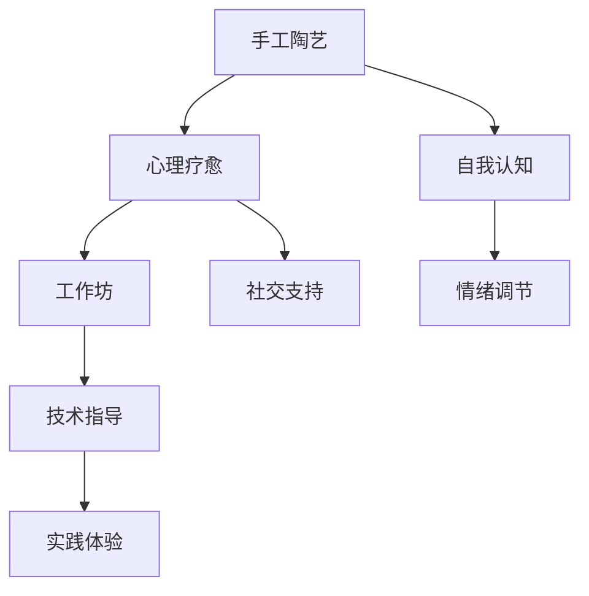

                 

### 第1章: 引言与背景介绍

#### 1.1 问题背景
随着现代社会的发展，人们面临着日益严峻的心理健康问题。快节奏的生活、高强度的工作压力、复杂的人际关系，使得许多人在心理和情绪上承受着巨大的负担。心理健康问题的普遍性不仅体现在个体层面，也影响着整个社会的和谐与稳定。因此，寻找有效的心理健康干预手段成为当务之急。

在这种背景下，手工陶艺作为一种古老的艺术形式，其心理疗愈功能逐渐被现代心理学和艺术治疗领域所认可。手工陶艺不仅能够带来感官上的愉悦，还能在心理层面上产生积极的影响，如减轻压力、改善情绪、增强自我认知等。

#### 1.2 问题描述
本文旨在探讨以下几个关键问题：
- **如何通过手工陶艺活动缓解心理压力？**
  - 通过实际案例和心理学理论，分析手工陶艺如何帮助个体减轻心理压力。

- **如何在手工陶艺创作过程中实现心理疗愈？**
  - 探讨手工陶艺创作过程中的心理机制，以及如何利用这一机制实现心理疗愈。

- **如何设计一个有效的手工陶艺疗愈工作坊？**
  - 提供具体的设计原则和实施流程，确保手工陶艺疗愈工作坊能够达到预期的疗愈效果。

#### 1.3 问题解决
为了解决上述问题，本文提出了以下解决方案：
- **系统学习手工陶艺技法，实现心理放松和情绪调节。**
  - 通过系统的学习和实践，个体可以在陶艺创作过程中获得放松和愉悦的体验，从而减轻心理压力。

- **通过陶艺创作过程中的思考和实践，增强自我认知和自我表达。**
  - 陶艺创作不仅是一种艺术活动，也是一种自我探索和表达的方式。个体在创作过程中，可以更深入地了解自己，提升自我认知。

- **通过工作坊形式，提供团体互助和社交支持。**
  - 工作坊的形式可以促进参与者之间的交流与合作，形成积极的社交支持网络，从而增强心理健康。

#### 1.4 边界与外延
在探讨手工陶艺疗愈工作坊的边界与外延时，需要考虑以下几点：
- **适用对象：**
  - 手工陶艺疗愈工作坊适用于心理压力较大的人群，如职场人士、学生、艺术家等。

- **时间安排：**
  - 工作坊建议每周一次，每次2-3小时，以确保参与者有足够的时间进行陶艺创作和互动交流。

- **内容和形式：**
  - 工作坊的内容应包括陶艺技法的教授、心理疗愈的理论讲解和实践体验。形式上，可以采用小组讨论、个人创作、团体协作等多种方式，以满足不同参与者的需求。

#### 1.5 核心概念与联系

在本文中，我们将涉及以下几个核心概念：
- **手工陶艺**：一种将泥土通过揉捏、塑形、烧制等技艺加工成艺术品的创作活动。
- **心理疗愈**：通过特定的活动或过程，帮助个体恢复心理健康状态的治疗方法。
- **工作坊**：一种集中培训或学习形式，强调参与和实践。

这些概念之间存在着紧密的联系：
- **手工陶艺**与**心理疗愈**的联系在于，通过手工活动的过程，个体可以体验到放松和愉悦，从而改善心理健康。
- **手工陶艺**与**工作坊**的联系在于，工作坊提供了一个系统性的学习和实践平台，使得参与者可以在专业指导下深入体验手工陶艺的魅力和疗愈效果。

为了更好地理解这些概念之间的联系，我们可以通过以下Mermaid流程图来展示：

### 结论
本章通过介绍背景、问题描述、解决方案、边界与外延以及核心概念，为后续章节的讨论奠定了基础。接下来，我们将进一步探讨手工陶艺的基本原理、心理学原理、疗愈工作坊的设计与实施，以及其实际应用和案例分析，以全面揭示手工陶艺在心理健康领域的潜力。让我们继续深入思考，探索泥塑艺术的心理健康效益。

---

在下一章中，我们将深入探讨现代手工陶艺的基本原理和实践技巧，分析这一艺术形式如何通过具体的创作过程来达到心理疗愈的效果。敬请期待。

