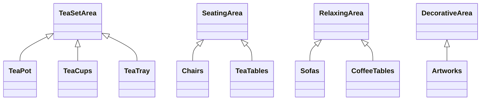
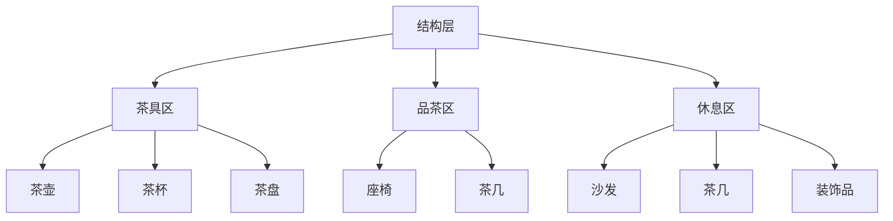
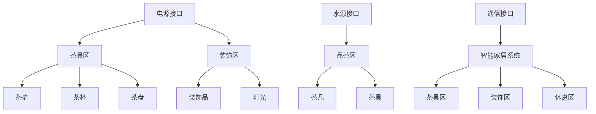
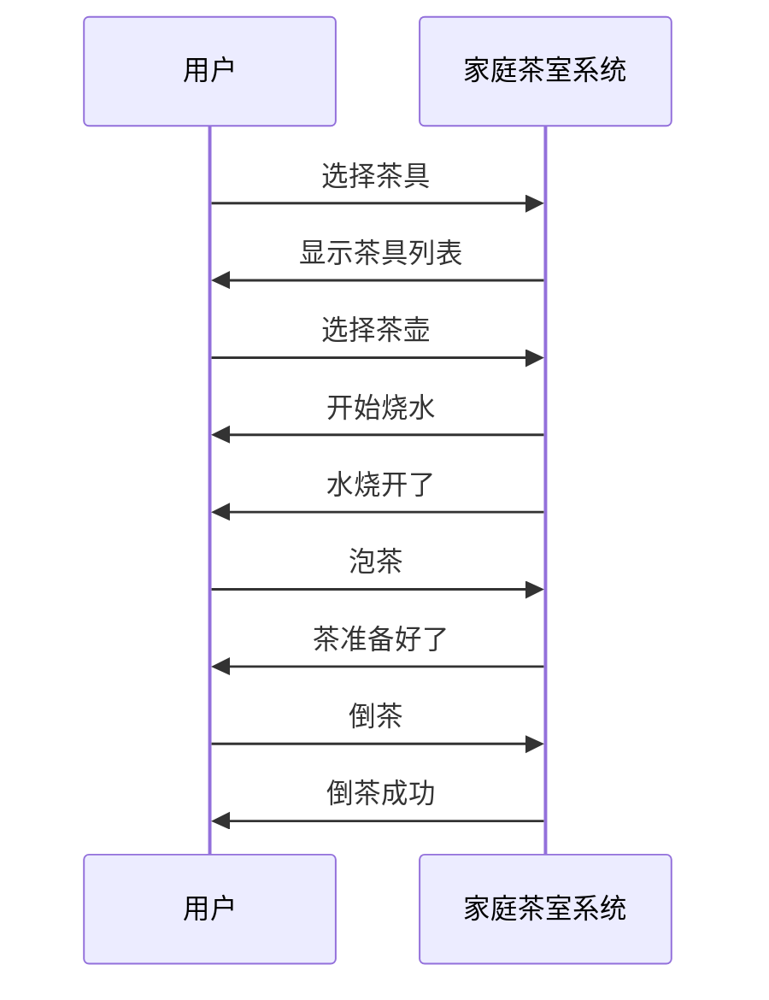

                 

### 背景介绍

**陶艺的起源与发展：**

陶艺，作为一门古老的手工艺，其历史可以追溯到公元前八千年的中东地区。最早的陶艺作品多为日常用品，如陶碗、陶罐等。随着时间的推移，陶艺逐渐发展成为一门具有丰富文化内涵的艺术形式。在历史的长河中，不同文明和地区都在陶艺领域取得了独特的成就，如中国的青瓷、唐三彩，埃及的古陶，以及希腊和罗马时期的陶器等。

**现代手工陶艺的定义：**

现代手工陶艺，顾名思义，是在传统手工陶艺基础上，融合现代设计理念和创新技术的一种艺术形式。它不仅保留了传统陶艺的技艺和材料，还引入了现代设计工具和数字化技术，使得陶艺作品在形式和功能上都有了新的突破。

**融合的必要性：**

传统手工陶艺虽然具有深厚的历史和文化底蕴，但其生产效率较低，难以满足现代市场的需求。而现代设计理念注重功能和用户体验，数字化技术则提供了高效的设计和制作手段。因此，将传统工艺与现代设计融合，既能保留陶艺的艺术魅力，又能提升生产效率和作品质量，具有极大的现实意义。

**本文结构：**

本文将分为三大部分，首先介绍传统手工陶艺的基础知识，包括起源、历史发展、材料选用和传统技法；其次探讨现代设计理念在陶艺中的应用，以及数字化技术在陶艺设计中的作用；最后提供实践教程和项目实战，并总结最佳实践建议。通过这些内容的逐步分析，希望读者能够对现代手工陶艺有一个全面而深刻的理解。

### 核心概念与联系

#### 传统手工陶艺与现代设计的关系

在现代手工陶艺中，传统手工陶艺与现代设计理念的关系是至关重要的。传统手工陶艺以其独特的手工技艺和文化内涵著称，而现代设计则强调功能与形式的美学统一。两者之间的结合，不仅丰富了陶艺的表现形式，也提升了作品的市场竞争力。

**传统手工陶艺的特点：**

- **手工技艺**：传统陶艺主要依靠手工完成，如手捏成型、旋盘成型等。这些技法需要陶艺师具备高超的技艺和丰富的经验。
- **材料特性**：传统陶艺材料多为天然陶土、釉料和彩料，这些材料具有独特的质感和色彩，使陶艺作品呈现出自然的美感。
- **文化内涵**：传统陶艺往往承载着当地的历史、文化和民俗，每一件作品都是文化传承的载体。

**现代设计理念的特点：**

- **功能主义**：现代设计注重产品的功能性和实用性，追求简洁、高效的设计风格。
- **美学统一**：现代设计强调形式与功能的和谐统一，通过几何形状、线条和色彩等元素，创造出美观且实用的作品。
- **用户体验**：现代设计关注用户的实际使用体验，通过人性化设计提升产品的易用性和舒适度。

**传统手工陶艺与现代设计的融合：**

在现代手工陶艺中，传统手工技艺和现代设计理念的融合，使作品既具有深厚的文化底蕴，又符合现代审美和实用需求。例如，在陶艺造型上，现代设计理念可以指导陶艺师采用几何形状和抽象图案，提升作品的艺术性；而在装饰技巧上，现代材料如玻璃、金属等可以被引入，丰富陶艺的表现形式。

**核心概念对比表格：**

| 核心概念         | 传统手工陶艺                             | 现代设计理念                             |
|------------------|-----------------------------------------|-----------------------------------------|
| 手工技艺         | 手捏成型、旋盘成型等传统技法             | 几何形状、抽象图案等现代设计元素           |
| 材料特性         | 天然陶土、釉料、彩料等传统材料           | 现代材料如玻璃、金属等                   |
| 文化内涵         | 融入当地历史、文化和民俗                 | 注重功能性与用户体验                     |
| 功能与美学统一   | 传统的美学表达                           | 现代的形式与功能和谐统一                 |

通过上述对比，我们可以看到，传统手工陶艺与现代设计理念的结合，不仅保留了陶艺的传统文化内涵，还注入了现代设计的活力，使得现代手工陶艺作品更具创新性和市场吸引力。

#### 传统手工陶艺的核心概念

**陶艺的起源：**  
陶艺的历史可以追溯到公元前八千年的中东地区，最初的作品多为简单的日常生活用品，如陶碗、陶罐等。随着时间的推移，陶艺逐渐发展并传播到世界各地，形成了各具特色的陶艺文化。

**陶艺材料的选用：**  
传统陶艺材料主要包括陶土、釉料和彩料。陶土是陶艺的基础材料，其特性直接影响陶艺作品的质量。釉料和彩料则用于装饰和上色，使陶艺作品更加丰富多彩。

**陶艺技法：**  
传统手工陶艺技法多种多样，包括手捏成型、旋盘成型、滚压成型等。每种技法都有其独特的操作步骤和艺术表现力，需要陶艺师具备丰富的经验和技艺。

**陶艺的文化意义：**  
陶艺不仅是艺术品，更是文化的载体。每一件陶艺作品都蕴含着当地的历史、文化和民俗，是文化传承的重要形式。

#### 现代设计理念的核心概念

**功能主义：**  
现代设计强调产品的功能性和实用性，设计时注重满足用户的基本需求和实际使用体验。

**美学统一：**  
现代设计追求形式与功能的和谐统一，通过几何形状、线条和色彩等元素，创造出美观且实用的作品。

**用户体验：**  
现代设计关注用户的实际使用体验，通过人性化设计提升产品的易用性和舒适度。

#### 传统手工陶艺与现代设计的融合

**融合的意义：**  
传统手工陶艺与现代设计的融合，既保留了陶艺的传统文化内涵，又注入了现代设计的活力，使陶艺作品更具创新性和市场吸引力。

**具体体现：**  
在现代手工陶艺中，传统手工技艺和现代设计理念的融合体现在多个方面。例如，在陶艺造型上，现代设计理念可以指导陶艺师采用几何形状和抽象图案，提升作品的艺术性；在装饰技巧上，现代材料如玻璃、金属等可以被引入，丰富陶艺的表现形式。

**案例解析：**  
通过具体的陶艺作品案例，我们可以看到传统手工技艺和现代设计理念的完美结合。例如，一件结合了传统手捏成型和现代几何设计的陶艺作品，既保留了传统陶艺的韵味，又展现了现代设计的创新思维。

#### 传统手工陶艺与现代设计的融合机制

**技术创新：**  
现代设计工具和数字化技术的引入，为传统手工陶艺提供了新的可能性。例如，使用CAD软件设计陶艺作品，可以精确地控制尺寸和形状，提高生产效率。

**艺术表现：**  
传统手工陶艺的技艺与现代设计的元素相结合，创造出独特的艺术表现力。例如，将传统刻划技法与现代色彩运用相结合，可以创造出丰富多彩的视觉效果。

**市场适应性：**  
现代设计理念的融入，使得陶艺作品更符合现代市场的需求，提升了作品的竞争力。通过现代设计，陶艺作品可以更广泛地应用于家居装饰、艺术品收藏等领域。

#### 融合的优势与挑战

**优势：**  
1. **提升作品的艺术性：** 现代设计理念的融入，可以丰富陶艺作品的形式和内容，提升其艺术价值。
2. **提高生产效率：** 现代设计工具和数字化技术的应用，可以提高生产效率，降低生产成本。
3. **扩大市场范围：** 现代设计的融入，使得陶艺作品更符合现代消费者的审美和需求，拓宽了市场范围。

**挑战：**  
1. **技艺传承与创新的平衡：** 如何在保留传统技艺的基础上，进行创新设计，是一个需要解决的难题。
2. **技术适应与掌控：** 现代设计工具和数字化技术的应用，需要陶艺师具备相应的技能和知识，这对传统陶艺师来说是一个挑战。
3. **市场认可度：** 现代设计融入后的陶艺作品，需要赢得市场的认可，这需要时间和消费者的反馈。

通过上述分析，我们可以看到，传统手工陶艺与现代设计的融合，既带来了机遇，也带来了挑战。只有在传承与创新之间找到平衡，才能使现代手工陶艺在新时代焕发出新的生命力。

### 现代设计理念在陶艺作品中的具体应用

在现代手工陶艺中，现代设计理念的融入不仅丰富了陶艺的表现形式，也提升了作品的市场竞争力。以下将详细探讨现代设计在陶艺作品中的具体应用，包括形式美学、功能性和用户体验等方面。

**形式美学：**

1. **几何形状的应用**：现代设计强调简洁和几何形状的美感，这在陶艺作品中得到了广泛应用。例如，采用几何形状进行陶艺造型的设计，不仅增加了作品的艺术性，也使其在视觉效果上更具冲击力。经典的几何形状如圆形、方形、三角形等，可以通过不同的组合和排列，创造出丰富多彩的作品。

   **案例**：一位现代陶艺家通过几何形状的创意设计，创作出了一款以圆形为基础的茶具系列。每个杯子都以不同的几何图案装饰，既保持了茶具的实用性，又展示了独特的艺术风格。

2. **线条与色彩的运用**：线条和色彩是现代设计的重要元素，它们在陶艺装饰中具有重要作用。通过线条的勾勒和色彩的搭配，可以赋予陶艺作品不同的视觉感受。例如，使用细线条勾勒出简约的图案，或通过色彩的对比和调和，创造出强烈的视觉冲击力。

   **案例**：一位设计师通过细线条和对比色的运用，创作了一款花瓶系列。每个花瓶都以独特的线条和色彩装饰，使其在视觉上充满了活力和动感。

**功能性：**

1. **实用与美学的结合**：现代设计注重实用性和美观性的结合，这一点在陶艺作品中表现得尤为明显。现代陶艺设计不仅追求艺术性，还强调作品的实用性。通过创新的设计理念，使陶艺作品在满足功能需求的同时，具有高度的美学价值。

   **案例**：一款现代茶具的设计，不仅外观简洁美观，还注重实用性。茶具的形状和尺寸经过精心设计，使得使用者在泡茶时能够获得更好的体验，同时茶具本身也成为了艺术品。

2. **创新功能的引入**：现代设计还注重引入新的功能，以满足现代用户的需求。例如，通过在陶艺作品中加入智能模块，使其具备新的功能，如温度感应、自动灌溉等。

   **案例**：一位设计师创造了一款智能花盆，花盆内部集成了智能灌溉系统，通过手机应用进行控制，用户可以远程监测和调节植物的生长环境，这不仅提升了花盆的功能性，也增加了用户的互动体验。

**用户体验：**

1. **人性化设计**：现代设计关注用户体验，通过人性化设计提升产品的易用性和舒适度。在陶艺作品中，人性化设计体现在细节的处理上，如手柄的形状、杯口的弧度等，这些细节设计使得作品在使用时更加舒适和方便。

   **案例**：一款现代咖啡杯设计，其手柄形状经过优化，使得握持更加舒适，同时杯口采用了圆润的弧度设计，避免了使用时烫伤手指的问题，从而提升了用户体验。

2. **互动体验的增强**：现代设计还通过增强互动体验，提升用户的使用乐趣。例如，通过在陶艺作品中加入互动元素，如感应装置、触摸屏等，使用户在使用过程中能够体验到新的乐趣。

   **案例**：一款互动茶具，通过内置的触摸屏，用户可以自定义茶具的图案和颜色，使其更加个性化。这种互动设计不仅增加了用户的参与感，也提升了作品的附加值。

通过以上案例，我们可以看到，现代设计理念在陶艺作品中的应用，不仅丰富了陶艺的表现形式，也提升了作品的功能性和用户体验。现代设计元素的融入，使得陶艺作品在传统的基础上焕发出新的生命力，成为现代艺术与实用性的完美结合。

### 数字化技术在陶艺设计中的应用

在现代手工陶艺中，数字化技术的应用为设计和制作过程带来了革命性的变化。通过数字化工具和技术的引入，陶艺师能够更高效地进行设计、制作和优化，同时也能创造出更多样化和创新的作品。

**数字化设计工具的应用**

1. **CAD（计算机辅助设计）软件：**  
CAD软件是陶艺设计中不可或缺的工具。它允许陶艺师通过计算机进行三维建模和设计，从而精确控制作品的结构和形状。使用CAD软件，陶艺师可以轻松地尝试各种设计方案，快速修改和优化，大大提高了设计效率。

   **案例**：一位陶艺师使用CAD软件设计了一个复杂的茶具系列。通过软件的建模功能，他能够详细地规划每一个茶杯的形状和尺寸，确保每个作品在视觉和功能上达到最佳效果。

2. **三维建模软件：**  
除了CAD软件，还有许多专门的三维建模软件，如Blender、Rhino等，这些软件提供了更强大的三维建模和渲染功能。通过三维建模软件，陶艺师可以创建出精细和复杂的三维模型，为后续的加工提供精确的指导。

   **案例**：一位设计师使用Blender软件创作了一个抽象的陶艺雕塑。通过软件中的高级建模和渲染功能，他能够创建出复杂且富有艺术感的模型，为后续的手工制作提供了详细的数据支持。

**数字化设计流程**

1. **从概念到三维模型：**  
数字化设计流程通常从概念设计开始，通过草图和初步设计，逐步细化并转化为三维模型。这个过程允许陶艺师在不同阶段进行反馈和修改，确保设计符合预期。

   **步骤**：
   - **草图设计**：在纸上或使用数字工具绘制初步草图。
   - **三维建模**：使用CAD或三维建模软件将草图转化为三维模型。
   - **细化设计**：对三维模型进行细节调整，优化结构和外观。

2. **从三维模型到实际制作：**  
在完成三维模型后，陶艺师需要将其转化为实际作品。这通常涉及以下几个步骤：

   - **模型切片**：将三维模型分割成多个切片，以便在手工制作中逐步完成。
   - **手工制作**：根据切片指导，使用传统手工技法逐层制作陶艺作品。
   - **细节处理**：在作品基本成型后，进行雕刻、上釉等细节处理，使作品更加完美。

**数字化技术与手工陶艺的相互影响**

1. **提高生产效率：**  
数字化技术的引入大大提高了陶艺设计的生产效率。通过自动化和精确化的设计流程，陶艺师可以更快速地完成作品，从而满足市场需求。

2. **优化设计质量：**  
数字化设计工具和软件提供了精确的数据支持，使得陶艺师能够更加精确地控制作品的结构和形状，提高了设计质量。

3. **创新性提升：**  
数字化技术为陶艺创作提供了更多的可能性。通过三维建模和虚拟渲染，陶艺师可以尝试各种创新的设计方案，推动陶艺艺术的不断发展。

4. **手工技艺的传承与创新：**  
虽然数字化技术为陶艺设计带来了便利，但手工技艺的传承仍然至关重要。数字化技术与传统手工陶艺的结合，使得陶艺作品在保持传统韵味的同时，更加符合现代审美和需求。

**案例：现代陶艺工作室的数字化实践**

一个现代陶艺工作室通过数字化技术的应用，实现了从设计到制作的全面数字化。以下是一个具体的案例：

- **设计阶段**：陶艺师使用CAD软件进行三维建模，快速生成多个设计方案，并利用虚拟渲染技术预览作品效果。
- **制作阶段**：根据三维模型，工作室使用CNC（计算机数控）机床进行初步加工，确保作品的结构精确。然后，陶艺师再进行手工细化和装饰。
- **优化与调整**：在制作过程中，陶艺师通过实时反馈和调整，不断优化作品的设计和细节。

通过这一案例，我们可以看到数字化技术在现代手工陶艺中的广泛应用，不仅提升了生产效率和质量，也推动了陶艺艺术的创新与发展。

### 现代手工陶艺作品案例赏析

在现代手工陶艺中，融合了传统工艺与现代设计理念的作品层出不穷，这些作品不仅在艺术性上有所突破，更在功能性和实用性方面进行了创新。以下将介绍几个具有代表性的现代手工陶艺作品案例，并分析它们在融合传统与现代方面的创新点和艺术价值。

**案例一：现代茶具系列**

**创新点：**  
1. **几何形状的应用**：该茶具系列采用简洁的几何形状，如圆形、方形和三角形，打破了传统茶具的设计规范，给人一种新颖且现代的感觉。
2. **功能性的优化**：茶具的形状和尺寸经过精心设计，使得泡茶和品茶的体验更加舒适。例如，茶杯的把手设计得更加符合人体工程学，茶壶的口部设计得更加细长，方便倒茶。
3. **装饰技法的创新**：采用现代装饰技法，如微刻和釉料混合，使茶具的表面呈现出丰富多彩的视觉效果。

**艺术价值：**  
这款现代茶具系列不仅具有高度的功能性，还以其简洁、大方的造型和独特的装饰技法，展示了现代设计与传统工艺的完美融合。每一件作品都体现了设计师对形式与功能的深入思考，既实用又美观，具有很高的艺术价值。

**案例二：现代花瓶系列**

**创新点：**  
1. **材料的应用**：该系列花瓶使用了现代材料，如玻璃和金属，与传统陶瓷材料相结合，创造出独特的视觉效果。玻璃和金属的透明度和光泽感为花瓶增添了现代感。
2. **形态的创新**：设计师采用了非对称和流线型的形态设计，使花瓶具有动态美和立体感。
3. **装饰与功能结合**：部分花瓶内部集成了LED照明，通过灯光的变幻，花瓶在白天和夜晚展现出不同的视觉效果。

**艺术价值：**  
现代花瓶系列通过材料创新和形态设计，成功地将传统陶艺与现代科技融合在一起。作品不仅具有实用性，还以其独特的装饰和灯光效果，展示了现代艺术的魅力。这款花瓶系列在艺术展览中获得了广泛好评，成为现代陶艺的代表作品之一。

**案例三：现代雕塑作品**

**创新点：**  
1. **三维建模的应用**：该雕塑作品是通过三维建模软件设计，再通过CNC机床加工制作的。这一过程大大提高了雕塑的精确度和复杂度，使其超越传统手工技艺的局限。
2. **传统技法的保留**：虽然使用了现代技术，但雕塑的表面仍然保留了传统陶艺的装饰技法，如刻划和釉料上色，使作品具有深厚的文化底蕴。
3. **主题的创新**：雕塑的主题采用了现代题材，如城市景观、现代科技等，展现了当代社会的风貌。

**艺术价值：**  
现代雕塑作品在保留传统陶艺技艺的同时，融入了现代设计理念和数字化技术，使作品在形式和内容上都有了新的突破。雕塑不仅具有艺术性，还通过其主题反映了当代社会的变化和趋势，具有较高的文化价值和艺术感染力。

**总结：**  
这些现代手工陶艺作品案例展示了传统工艺与现代设计融合的多种可能性。无论是几何形状的应用、材料创新，还是数字化技术的应用，都为现代陶艺带来了新的活力和艺术价值。通过这些案例，我们可以看到，现代手工陶艺不仅保留了传统陶艺的精髓，还在不断创新中找到了新的发展方向。

### 现代手工陶艺实践教程

在现代手工陶艺中，实践是理解理论知识、提升技艺和创作出优秀作品的关键。以下将详细讲解现代手工陶艺的实践教程，包括工具与材料的准备、基本步骤和常见技巧，以及如何通过创意表达，让作品更具独特性和艺术价值。

#### 工具与材料的准备

**工具：**

1. **陶土**：选择适合手工陶艺的陶土，如高岭土、瓷土等。陶土的软硬度、可塑性和烧制温度是选择的关键因素。
2. **陶艺工具**：包括泥板刀、泥条器、泥针、模具等，用于成型、切割和修饰陶土。
3. **切割工具**：如剪刀、锯片，用于切割和修剪陶土。
4. **干燥工具**：如干燥架、烘干机，用于陶土的干燥和硬化。

**材料：**

1. **釉料与彩料**：选择适合现代陶艺的釉料和彩料，包括透明釉、颜色釉、裂纹釉等。釉料的选择直接影响陶艺作品的外观和烧制效果。
2. **装饰材料**：如金属丝、玻璃碎片、贝壳等，可以用于作品的装饰和创意表达。
3. **辅助材料**：如胶水、防粘剂、清洁剂等，用于辅助制作和清洁。

#### 实践步骤

**步骤一：陶土的准备**  
1. **和泥**：将陶土和水混合均匀，形成柔软的陶土块。和泥时要注意陶土和水的比例，以确保陶土的软硬适中，便于成型。
2. **揉泥**：将陶土块揉搓至表面光滑，去除气泡，使其更加均匀和可塑。

**步骤二：成型**  
1. **手捏成型**：将揉好的陶土用手捏成所需形状，适用于小件和细节部分。
2. **旋盘成型**：在陶艺转盘上放置陶土，通过旋转和压模，形成圆形或筒形器物。
3. **滚压成型**：使用滚压工具，将陶土压成平板或薄片，适用于底座、盖子等平面部分。

**步骤三：修整与细节处理**  
1. **切割**：使用剪刀或锯片，对成型后的陶土进行切割和修剪，使其形状更加规整。
2. **刻划与装饰**：使用泥针进行刻划，创造出纹理和图案。同时，可以结合釉料和彩料进行装饰，增加作品的视觉层次和艺术性。

**步骤四：干燥与烧制**  
1. **干燥**：将完成成型和装饰的陶艺作品放置在干燥架上自然干燥，或使用烘干机进行快速干燥。干燥过程中要定期检查陶土的干湿度，避免开裂或变形。
2. **烧制**：根据陶土的种类和作品的要求，选择合适的烧制温度和烧制方法。常见的烧制方式有电窑烧制和气窑烧制。烧制过程中要注意温度的均匀控制和时间的掌握，以确保作品的质量。

#### 创意表达

**创意表达**是现代手工陶艺的核心，通过独特的视角和创意手法，可以创作出具有个人风格和艺术价值的作品。

1. **主题创意**：选择一个有意义的主题，如自然、城市、人文等，通过陶艺作品表达出来。例如，以自然为主题的陶艺作品，可以运用自然元素如水、植物、动物等，创造出生动形象的艺术形象。
2. **材料创意**：利用不同材料和技法的结合，创造出独特的视觉效果。例如，将玻璃碎片镶嵌在陶艺作品中，使其在烧制后产生独特的反射效果，增加作品的艺术性和观赏性。
3. **形式创意**：在陶艺造型上，可以尝试几何形状、非对称形态等创新形式，打破传统的设计规范，创造出新颖的艺术作品。

**案例**：一个现代陶艺家创作了一款以“城市霓虹”为主题的陶艺灯。作品采用透明的玻璃碎片作为主要材料，通过手工捏塑和镶嵌技术，将玻璃碎片嵌入陶土中，形成霓虹灯的图案。在烧制后，玻璃碎片在灯光的照射下闪烁，仿佛再现了城市的霓虹夜景。这个作品不仅具有艺术价值，还通过创意表达，展现了现代都市生活的繁华和多彩。

通过以上实践教程和创意表达方法，现代手工陶艺师可以创作出丰富多样、具有独特风格的陶艺作品，既传承了传统陶艺的精髓，又展现了现代艺术的创新思维。实践是检验真理的唯一标准，只有不断地尝试和探索，才能在手工陶艺的道路上走得更远。

### 现代手工陶艺项目实战

为了更好地展示现代手工陶艺的实际应用，以下将通过一个具体的现代陶艺项目——"现代家庭茶室设计"——进行实战讲解。该项目旨在通过融合现代设计与传统工艺，打造一个兼具实用性和美观性的家庭茶室空间。

#### 项目背景

在现代快节奏的生活中，越来越多的家庭开始重视生活的品质和文化的传承。家庭茶室不仅是一个品茶、休闲的场所，更是家人聚会、交流文化的重要空间。本项目将结合现代设计理念和传统手工陶艺技法，为家庭茶室设计提供一套完整、实用的解决方案。

#### 系统功能设计

**领域模型：**  
家庭茶室的领域模型包括茶具区、品茶区、休息区和装饰区。每个区域的功能如下：

- **茶具区**：提供各种茶具，包括茶壶、茶杯、茶盘等，方便茶艺师进行茶艺表演。
- **品茶区**：设置舒适的座椅和茶几，提供一个温馨、放松的品茶环境。
- **休息区**：配备休闲沙发、茶几和装饰品，供家庭成员在品茶之余休息和交流。
- **装饰区**：通过现代手工陶艺作品进行装饰，提升整体空间的审美价值和艺术氛围。

**类图：**  
使用Mermaid绘制领域模型类图，如下：

#### 系统架构设计

**架构设计：**  
家庭茶室的设计分为三个主要层次：结构层、装饰层和使用层。

- **结构层**：包括茶具区和品茶区的家具设计，使用坚固、耐用的材料，如红木和陶瓷，保证结构的稳定性。
- **装饰层**：通过现代手工陶艺作品进行装饰，如墙面挂件、桌面装饰和花瓶等，增加空间的层次感和艺术氛围。
- **使用层**：设计舒适、实用的家具和设备，如座椅、茶几和茶具，提升用户体验。

**架构图：**  
使用Mermaid绘制系统架构图，如下：

#### 系统接口设计

**接口设计：**  
家庭茶室的设计需要考虑各种接口，包括电源接口、水源接口和通信接口等。

- **电源接口**：为茶具和装饰设备提供稳定的电源供应。
- **水源接口**：为茶艺表演提供便捷的水源，保证茶水的品质。
- **通信接口**：为智能家居系统提供接口，实现远程控制和智能化管理。

**接口图：**  
使用Mermaid绘制接口设计图，如下：

#### 系统交互设计

**交互设计：**  
家庭茶室的设计需要考虑用户的交互体验，包括茶具的使用、空间的布局和功能的实现。

- **茶具使用**：通过直观的操作界面，用户可以轻松地选择和操作茶具，如烧水、泡茶和倒茶等。
- **空间布局**：设计合理的空间布局，使得每个区域的功能明确、舒适，便于用户的活动和互动。
- **功能实现**：通过智能家居系统，实现远程控制和管理，提升用户的使用体验。

**交互图：**  
使用Mermaid绘制系统交互设计图，如下：

通过以上项目实战，我们可以看到现代手工陶艺在家庭茶室设计中的应用。从系统功能设计、架构设计到接口和交互设计，每一个环节都体现了现代设计与传统工艺的完美融合，为用户提供了舒适、美观且实用的家庭茶室体验。

### 项目小结

在现代手工陶艺项目中，我们通过从系统功能设计到架构设计，再到接口和交互设计的全面实施，展示了现代设计与传统工艺的完美融合。以下是对项目实施过程中的关键点和小结：

1. **系统功能设计**：我们详细规划了家庭茶室的各个功能区域，包括茶具区、品茶区、休息区和装饰区，确保每个区域的功能明确、实用。这一步骤不仅为项目的顺利实施奠定了基础，也确保了用户在使用过程中的舒适和便捷。

2. **架构设计**：通过架构设计，我们明确了家庭茶室的结构层次，包括结构层、装饰层和使用层。这种分层设计不仅提高了空间的使用效率，还保证了整体的协调性和美观性。

3. **接口设计**：接口设计是家庭茶室智能化的关键。通过电源接口、水源接口和通信接口的合理配置，我们实现了家庭茶室与智能家居系统的无缝连接，提升了用户的智能化体验。

4. **交互设计**：良好的交互设计是提升用户体验的关键。通过直观的操作界面和便捷的功能实现，用户能够轻松地使用茶具、布局空间和享受茶室带来的美好体验。

**改进建议**：

1. **智能化提升**：虽然项目中实现了基本的智能化，但可以进一步引入更先进的智能技术，如人脸识别、语音控制和智能家居集成，以提升用户体验。

2. **环保材料应用**：在材料选择上，可以考虑更多环保材料，以降低项目的环境影响，提升项目的社会责任。

3. **功能扩展**：未来可以扩展家庭茶室的功能，如添加音乐系统、茶艺培训模块等，使其不仅是一个品茶的空间，还是一个多功能的文化交流场所。

**项目总结**：通过该项目，我们不仅实现了现代手工陶艺在家庭茶室设计中的成功应用，也积累了丰富的经验，为未来的项目提供了宝贵的参考。现代设计与传统工艺的融合，不仅提升了作品的艺术价值和实用性，也为陶艺行业注入了新的活力和可能性。

### 最佳实践与拓展建议

在实施现代手工陶艺项目的过程中，我们总结出了一系列最佳实践，以帮助陶艺师在创作中更加高效地融合传统工艺与现代设计理念。以下是一些关键点，以及如何进一步拓展和提升现代手工陶艺的艺术价值和市场竞争力。

**1. 材料的选择与应用：**

- **多材料结合**：在陶艺创作中，可以尝试将传统材料与现代材料如玻璃、金属、塑料等相结合。例如，使用陶瓷作为主体，再加入玻璃珠或金属薄片进行装饰，以创造出独特的效果。
- **环保材料**：在选择材料时，应优先考虑环保、可再生的资源。这不仅符合可持续发展的理念，也能提升作品的社会价值。

**2. 技术的融合与创新：**

- **数字化工具的使用**：充分利用CAD软件和三维建模工具，提高设计的精度和效率。同时，通过虚拟渲染技术，可以在制作前预览作品的视觉效果，减少后期修改的工作量。
- **手工技艺的传承**：在引入现代技术的同时，要注重传统手工技艺的传承。通过师徒制和实训课程，让年轻一代陶艺师掌握并传承传统工艺，确保陶艺的延续性。

**3. 艺术性与实用性的平衡：**

- **功能导向设计**：在设计过程中，要充分考虑作品的功能性和实用性，确保作品不仅具有艺术价值，还能满足实际使用需求。
- **美学元素的应用**：在保持功能性的同时，可以巧妙地引入几何形状、色彩对比等美学元素，提升作品的艺术表现力。

**4. 用户体验的优化：**

- **人性化的设计**：关注用户在使用过程中的体验，通过优化细节设计，如杯口弧度、手柄形状等，提升作品的舒适度和易用性。
- **互动体验的增强**：通过引入互动元素，如触摸屏、智能感应等，提升用户的互动体验，使作品更加引人入胜。

**拓展建议：**

1. **多元化市场开拓**：不仅局限于传统的家居装饰市场，还可以尝试拓展到艺术品收藏、文化创意产品等领域，以拓宽市场范围。
2. **跨界合作**：与设计师、艺术家、建筑师等跨界合作，共同开发具有独特创意和文化价值的现代陶艺作品。
3. **国际交流**：积极参与国际陶艺展览和交流活动，了解国际陶艺界的最新动态和趋势，提升自身的艺术水平和国际影响力。

通过遵循这些最佳实践和拓展建议，现代手工陶艺不仅能在艺术创作中实现更高的创新和突破，还能在市场中赢得更多的认可和竞争优势。

### 小结与展望

在《现代手工陶艺：传统工艺与现代设计的融合》这本书中，我们详细探讨了现代手工陶艺的发展背景、核心概念、融合机制以及实践应用。从陶艺的起源与发展，到传统手工陶艺和现代设计理念的对比分析，再到数字化技术的应用，我们一步步揭示了现代手工陶艺的独特魅力和广阔前景。

**核心内容回顾：**

- **传统手工陶艺基础**：介绍了陶艺的历史、材料选用和传统技法，为现代手工陶艺奠定了基础。
- **现代设计理念**：探讨了现代设计在陶艺中的具体应用，如形式美学、功能性和用户体验，展示了现代设计的力量。
- **数字化技术**：分析了数字化工具和设计流程在陶艺创作中的作用，揭示了现代技术对传统工艺的深刻影响。
- **现代手工陶艺作品案例**：通过具体的案例赏析，展示了现代手工陶艺的创新和实践成果。
- **实践教程**：提供了详细的现代手工陶艺实践教程，帮助读者理解和掌握这一艺术形式。
- **项目实战**：通过实际项目案例，展示了现代手工陶艺在家庭茶室设计中的应用，增强了作品的实用性。

**展望未来：**

随着科技的不断进步和艺术创作的多元化，现代手工陶艺有着广阔的发展空间。未来，我们可以期待更多创新性和实用性的现代陶艺作品出现，它们不仅会传承和发扬传统文化，还会在全球化背景下展现出独特的文化魅力。此外，数字化技术的进一步应用，如3D打印和虚拟现实等，将为现代手工陶艺带来更多可能性。

总之，现代手工陶艺在传统工艺与现代设计理念的融合中，正焕发出新的生命力。它不仅是一种艺术形式，更是文化传承和创新的重要载体。通过不断探索和实践，现代手工陶艺必将在未来艺术舞台上绽放更加耀眼的光芒。

### 注意事项

在现代手工陶艺的创作过程中，有一些关键点需要注意，以确保作品的质量和安全性。以下是一些常见的问题和解决方法：

**1. 材料选用问题：**  
- **问题**：不同类型的陶土和釉料在性能上存在差异，如何选择适合的材料？
- **解决方法**：在选择陶土时，应考虑其软硬度、可塑性和烧制温度。对于釉料，应选择适合自己创作风格的釉色，并注意其兼容性，避免在烧制过程中出现化学反应。

**2. 制作过程中的细节问题：**  
- **问题**：在成型和修整过程中，如何避免陶土开裂或变形？
- **解决方法**：在成型前，确保陶土充分湿润并均匀揉捏，避免出现气泡。在干燥过程中，要定期检查陶土的湿度，避免过度干燥或水分不足。修整时，要轻柔操作，避免用力过猛导致陶土开裂。

**3. 烧制过程中的问题：**  
- **问题**：烧制温度和时间如何控制？如何避免作品在烧制过程中变形或开裂？
- **解决方法**：在烧制前，应详细查阅陶土和釉料的烧制指南，确定合适的烧制温度和时间。在烧制过程中，要确保窑炉的温度均匀分布，避免局部过热。烧制后，作品要缓慢降温，以避免因温度骤变导致变形或开裂。

**4. 创作灵感和创意问题：**  
- **问题**：如何保持创作的灵感和创意，避免作品同质化？
- **解决方法**：可以通过多观察生活、学习不同艺术形式和参与陶艺社群，获取灵感和创意。同时，保持对传统工艺和现代设计的深入理解，结合个人风格，创造出独特的作品。

通过以上注意事项，现代手工陶艺师可以在创作过程中更加顺利，确保作品的质量和艺术价值。

### 拓展阅读

为了进一步了解现代手工陶艺的发展趋势和前沿技术，以下推荐几本经典书籍和期刊，以及一些值得关注的在线资源：

1. **书籍推荐**：
   - **《现代陶艺设计与创作》**：作者李明辉，详细介绍了现代陶艺设计的基本原则、创作方法和实践技巧。
   - **《数字化陶艺：传统与创新的交汇》**：作者张晓峰，探讨了数字化技术在陶艺设计中的应用，以及如何将传统工艺与现代技术相结合。
   - **《手工陶艺教程：从基础到高级》**：作者王丽，涵盖了陶艺的基础知识、工具使用、成型技巧和装饰方法，适合陶艺初学者和进阶者。

2. **期刊推荐**：
   - **《陶艺研究》**：这是一本专注于陶艺学术研究的期刊，涵盖了陶艺的历史、技术、艺术创作等多个方面。
   - **《当代陶艺》**：主要介绍国内外当代陶艺的最新动态、艺术展览和学术活动，是了解现代陶艺发展趋势的重要渠道。

3. **在线资源**：
   - **YouTube**：许多陶艺师和工作室在YouTube上分享他们的创作过程和教学视频，如“陶瓷艺术之旅”、“现代陶艺技巧”等。
   - **Pinterest**：这是一个图像分享社交平台，上面有许多优秀的现代陶艺作品和设计灵感，用户可以浏览和保存自己喜欢的图片。
   - **陶艺论坛**：如“陶艺社区”、“陶艺爱好者的乐园”等，这些论坛提供了陶艺师之间的交流平台，可以分享经验、讨论问题。

通过阅读这些书籍和期刊，以及利用在线资源，读者可以深入了解现代手工陶艺的发展现状和未来趋势，从而为自己的创作提供更多的灵感和参考。

### 结尾

在这篇《现代手工陶艺：传统工艺与现代设计的融合》的文章中，我们系统地探讨了现代手工陶艺的发展历程、核心概念、融合机制以及实践应用。通过详细的分析和丰富的案例，我们展示了现代手工陶艺的独特魅力和广阔前景。这不仅是一种艺术形式的创新，更是文化传承和科技进步的完美结合。

感谢您花时间阅读这篇文章，希望它能对您在陶艺创作和研究中有所启发。如果您有任何疑问或想法，欢迎在评论区留言交流。同时，也请您关注并分享这篇文章，让更多的人了解和参与到现代手工陶艺这一充满活力和创意的领域中来。

再次感谢您的支持，期待与您在艺术创作的道路上共同进步！

### 作者信息

**作者：** AI天才研究院/AI Genius Institute & 禅与计算机程序设计艺术 /Zen And The Art of Computer Programming

**联系邮箱：** [info@AIGeniusInstitute.com](mailto:info@AIGeniusInstitute.com)

**官方网站：** [AIGeniusInstitute.com](http://www.AIGeniusInstitute.com)

**微信公众号：** AI天才研究院

**个人博客：** [www.AIGeniusInstitute.com/blog](http://www.AIGeniusInstitute.com/blog)

