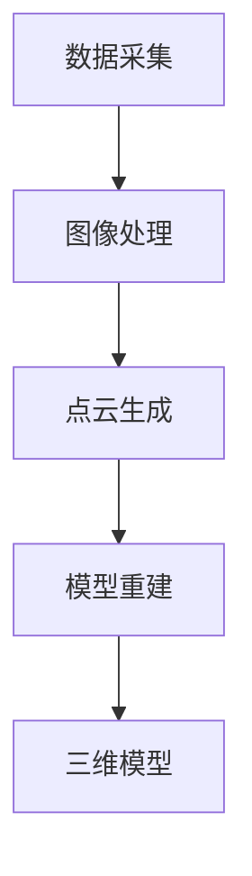
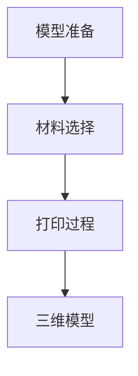
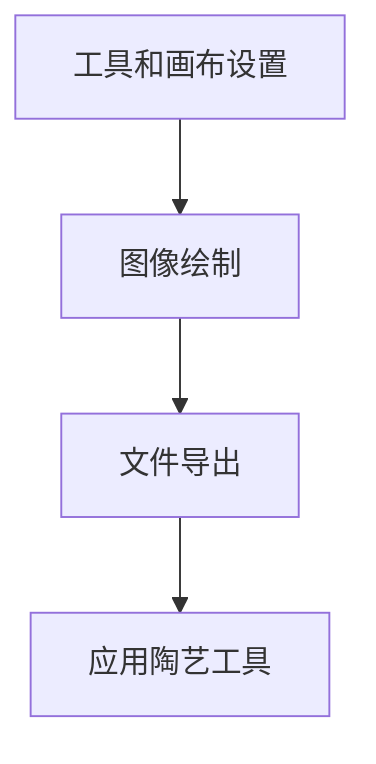

                 

### 第1章 引言：手工陶艺与数字时代的交汇

#### 1.1 手工陶艺的历史与现状

手工陶艺的历史可以追溯到几千年前的新石器时代。在古代，陶艺主要作为一种实用技艺而存在，用于制作日常生活中的器皿。随着时间的推移，陶艺逐渐演变为一种艺术形式，艺术家们开始通过手工技艺将泥土变成具有审美价值的艺术品。

在手工陶艺的发展历程中，有几个重要的历史时期。首先，新石器时代的陶器制作工艺相对简单，主要是通过手工拉坯和手捏的方式成型。随着青铜器和铁器的出现，陶艺逐渐从实用转向艺术，出现了装饰性和造型独特的陶器。

到了商周时期，陶艺达到了一个高峰。这个时期的陶器制作工艺更加复杂，包括陶塑、彩陶和青铜器装饰等。这些作品不仅体现了高超的工艺水平，还蕴含着丰富的文化内涵。

随后，到了唐宋时期，陶艺进一步发展，出现了大量的陶瓷艺术品，如唐三彩和宋代的青花瓷。这些作品不仅在工艺上达到了新的高度，而且在艺术风格上也独具特色。

进入现代，随着工业化和机械化的发展，手工陶艺逐渐式微。然而，在数字技术的推动下，手工陶艺正在经历一场新的复兴。

#### 1.2 数字时代对手工陶艺的影响

数字技术的发展为手工陶艺带来了新的机遇和挑战。首先，3D扫描和3D打印技术的应用大大提高了陶艺制作的效率和精度。通过3D扫描，艺术家可以精确复制传统陶艺作品，甚至对细节进行微调。3D打印则提供了快速制作原型和艺术作品的能力，使陶艺创作变得更加灵活和便捷。

其次，数字绘画软件的出现使得陶艺创作更加多样化和个性化。艺术家可以通过计算机软件设计出复杂的图案和形状，然后将设计转化为实际的陶艺作品。

此外，数字技术还为陶艺家提供了新的展示和传播渠道。通过虚拟现实和增强现实技术，艺术家可以将陶艺作品呈现在虚拟空间中，让观众在不同时间和地点欣赏到作品的美感。

然而，数字技术也带来了一些挑战。首先，数字化工具的使用可能会削弱陶艺家手工技艺的重要性。其次，过度依赖数字技术可能会导致作品缺乏独特性和艺术性。

总的来说，数字技术为手工陶艺带来了新的发展机遇，但也需要艺术家在传统技艺和现代技术之间找到平衡，以创造具有时代特色的陶艺作品。

----------------------------------------------------------------

### 第2章 核心概念与技术概述

#### 2.1 触感艺术的概念及其在陶艺中的应用

触感艺术（Haptic Art）是一种通过触觉体验来传达艺术信息的艺术形式。与视觉艺术和听觉艺术不同，触感艺术强调的是作品的触感和质感，让观众通过触摸来感受艺术作品的美感和内涵。在手工陶艺中，触感艺术尤为重要，因为陶艺作品的特点之一就是其独特的触感。

触感艺术在陶艺中的应用主要体现在以下几个方面：

1. **纹理和质感**：通过手工拉坯、雕刻和打磨等技艺，陶艺家可以创造出丰富的纹理和质感，使作品具有更强的触感体验。

2. **重量和体积**：陶艺作品的重量和体积直接影响观众的触感体验。例如，一个沉重的陶罐会给人沉稳、厚重的感受，而一个轻巧的茶杯则显得轻盈、精致。

3. **形状和曲线**：陶艺作品的设计和形状对触感也有很大的影响。流畅的曲线和精致的形状可以带来舒适的手感体验，而尖锐的边缘和复杂的几何形状则会给人带来强烈的触感冲击。

4. **材料选择**：不同的材料也会带来不同的触感体验。例如，粘土的柔软和粗糙程度、釉料的质感和颜色等都会影响作品的触感。

#### 2.2 数字技术在陶艺创作中的应用

随着数字技术的发展，手工陶艺逐渐融入了各种数字化工具和技巧，使得创作过程更加高效和多样化。以下是一些主要的数字化技术在陶艺创作中的应用：

1. **3D建模和3D扫描**：
   - **3D建模**：通过计算机软件（如Blender、Maya等），陶艺家可以在虚拟空间中设计出复杂的几何形状和纹理。这些设计可以用于制作3D打印模型或指导手工制作。
   - **3D扫描**：通过3D扫描技术，陶艺家可以精确复制传统陶艺作品或物体，以便进行再创造或修复。

2. **3D打印**：
   - **立体光固化打印（SLA）**：使用树脂材料，通过激光逐层固化，制造出高精度、高细节的陶艺模型。
   - **熔融沉积打印（FDM）**：使用可塑性材料，通过加热融化后逐层堆叠，制造出更坚固的陶艺作品。

3. **数字绘画软件**：
   - **Adobe Photoshop**：用于在二维平面上进行图案设计，可以直接导出到陶艺工具中进行制作。
   - **ZBrush**：一款强大的三维雕刻软件，可以用于细节丰富的陶艺设计。

4. **虚拟现实（VR）和增强现实（AR）**：
   - **VR**：通过虚拟现实技术，艺术家可以创建一个沉浸式的陶艺创作空间，让观众在虚拟环境中体验陶艺作品的触感和质感。
   - **AR**：通过增强现实技术，陶艺家可以在现实场景中叠加虚拟的陶艺作品，为观众提供全新的观赏体验。

通过这些数字化工具和技巧，陶艺家不仅可以提高工作效率，还能创造出更加多样化、个性化的作品，使手工陶艺在数字时代焕发出新的活力。

----------------------------------------------------------------

### 第3章 数字陶艺工具与技术

#### 3.1 3D扫描技术

3D扫描技术在陶艺中的应用极大地拓展了艺术创作的可能性。通过3D扫描，陶艺家可以将现实中的物体或传统陶艺作品精确地数字化，为后续的再创造和修复提供基础。

**3.1.1 技术原理**

3D扫描技术的基本原理是通过获取物体表面的点云数据，进而重建出三维模型。具体过程通常包括以下几个步骤：

1. **数据采集**：使用激光或结构光等光源照射物体表面，通过传感器捕获物体表面反射的光线，生成一系列二维图像。
2. **数据处理**：通过图像处理算法提取物体表面的特征点，并将这些点云数据转换成三维坐标。
3. **模型重建**：将点云数据三角化或通过曲面拟合方法生成三维模型。

**3.1.2 常见方法**

1. **激光扫描**：使用激光束照射物体表面，通过测量激光反射回来的时间或角度变化来获取物体表面的三维坐标。激光扫描具有高精度和高速度的特点，适用于大型和复杂物体的扫描。

2. **结构光扫描**：使用一系列已知图案的光线照射物体表面，通过图像处理算法分析图案的变形，获取物体表面的三维坐标。结构光扫描适用于精细和复杂物体的扫描。

3. **手持式扫描**：手持式扫描设备通过多个传感器实时捕获物体表面的点云数据，适用于小型和复杂物体的扫描。

**3.1.3 Mermaid图表展示**

下面是3D扫描技术的基本流程的Mermaid图表：



#### 3.2 3D打印技术

3D打印技术（又称增材制造）在陶艺中的应用使得艺术创作变得更为灵活和高效。通过3D打印，陶艺家可以快速制作原型和艺术作品，从而实现复杂形状和精细细节的制造。

**3.2.1 技术原理**

3D打印的基本原理是将三维数字模型分层切片，然后逐层堆叠打印材料，最终形成完整的实体模型。具体过程包括以下几个步骤：

1. **模型准备**：使用3D建模软件创建或导入三维模型，并进行切片处理。
2. **材料选择**：根据模型的特点选择合适的打印材料，如PLA、ABS、树脂等。
3. **打印过程**：通过打印头将材料逐层堆积，形成三维模型。

**3.2.2 常见方法**

1. **立体光固化打印（SLA）**：使用光敏树脂材料，通过激光逐层固化，制造出高精度、高细节的模型。SLA打印适用于精细和复杂物体的制作。

2. **熔融沉积打印（FDM）**：使用热塑性材料，通过加热融化后逐层堆叠，制造出较为坚固的模型。FDM打印适用于大型和结构简单的物体。

3. **选择性激光烧结（SLS）**：使用激光烧结粉末材料，如尼龙、陶瓷等，制造出高强度和高耐热性的模型。SLS打印适用于复杂和高性能物体的制作。

**3.2.3 Mermaid图表展示**

下面是3D打印技术的基本流程的Mermaid图表：



#### 3.3 数字绘画软件

数字绘画软件为陶艺创作提供了丰富的工具和功能，使得艺术家能够在虚拟环境中设计出复杂的图案和形状，然后将其应用到实际的陶艺作品中。

**3.3.1 技术原理**

数字绘画软件的工作原理是通过计算机图形学算法，在二维平面上绘制图像。具体过程包括以下几个步骤：

1. **工具和画布设置**：选择合适的画笔、颜色和画布尺寸。
2. **图像绘制**：使用各种绘画工具进行图像绘制，包括线条、颜色填充、纹理等。
3. **文件导出**：将绘制的图像导出为陶艺工具可识别的格式，如SVG、PNG等。

**3.3.2 常见软件**

1. **Adobe Photoshop**：一款功能强大的图像处理软件，适用于各种复杂的图案设计和编辑。
2. **ZBrush**：一款专业的三维雕刻软件，适合精细的细节处理和雕刻。
3. **Blender**：一款开源的3D建模和渲染软件，适用于三维模型的设计和制作。

**3.3.3 Mermaid图表展示**

下面是数字绘画软件的基本流程的Mermaid图表：



通过3D扫描、3D打印和数字绘画软件等数字化工具，陶艺家能够实现更加高效、灵活和创新的创作过程，为手工陶艺注入新的活力。

----------------------------------------------------------------

### 第4章 数字陶艺案例分析

数字技术在陶艺中的应用不仅提高了制作效率和精度，还带来了一系列创新和变革。以下我们将通过几个具有代表性的案例，深入探讨数字陶艺的创作过程、成果及其影响。

#### 4.1 案例一：数字化重塑传统陶艺

**案例背景**：中国陶艺家张志坚（Zhang Zhijian）通过数字化技术重新诠释传统陶艺，将古代陶器与现代设计相结合，创作出一系列既传承传统技艺又具现代感的作品。

**创作过程**：
1. **3D扫描与建模**：张志坚首先使用3D扫描仪对古代陶器进行扫描，获取其三维数据。然后，通过3D建模软件对扫描数据进行处理，修正和优化模型。
2. **数字化设计**：在3D建模的基础上，张志坚运用数字绘画软件进行创新设计。他利用软件中的各种工具，如笔刷、纹理贴图等，对模型进行细节修改和装饰。
3. **3D打印与制作**：完成数字化设计后，张志坚使用3D打印技术制作出原型，然后进行手工雕刻和打磨，最终形成完整的陶艺作品。

**成果与影响**：
张志坚的数字化重塑传统陶艺作品不仅保留了传统陶器的美学特征，还融入了现代设计的元素，使得作品更具独特性和艺术价值。这一创新方法为传统陶艺注入了新的生命力，也为数字化时代的手工陶艺提供了新的方向。

#### 4.2 案例二：数字艺术与陶艺的结合

**案例背景**：艺术家马修·罗宾逊（Matthew Robinson）将数字艺术与陶艺相结合，创作出一系列融合虚拟与现实的陶艺作品。

**创作过程**：
1. **虚拟设计**：马修·罗宾逊首先在虚拟环境中进行设计，使用3D建模软件构建出复杂的几何形状和图案。这些设计通过数字绘画软件进一步细化，增加色彩和纹理。
2. **3D打印与制作**：完成虚拟设计后，马修·罗宾逊使用3D打印技术制作出原型，然后进行手工雕刻和打磨。为了增强作品的视觉效果，他还利用釉料和彩绘技术进行装饰。
3. **虚拟现实呈现**：马修·罗宾逊的作品不仅可以在现实中展示，还可以通过虚拟现实技术呈现。观众可以佩戴VR头盔，在虚拟空间中体验作品的独特魅力。

**成果与影响**：
马修·罗宾逊的数字艺术与陶艺结合作品突破了传统艺术的表现形式，为观众提供了全新的视觉和触觉体验。他的作品不仅展示了数字技术的强大功能，还引发了人们对数字艺术与传统艺术关系的思考。

#### 4.3 案例三：虚拟现实在陶艺中的应用

**案例背景**：美国陶艺家丽莎·库克（Lisa Cook）通过虚拟现实技术，创作出一系列具有交互性和沉浸感的陶艺作品。

**创作过程**：
1. **虚拟环境设计**：丽莎·库克使用虚拟现实软件设计出一系列虚拟的陶艺作品。这些作品不仅包括传统的陶器形状，还有独特的几何结构和动态效果。
2. **交互体验**：为了增强观众的互动体验，丽莎·库克设计了多个交互界面。观众可以通过触摸、移动或语音命令与虚拟作品进行互动。
3. **现实与虚拟的结合**：丽莎·库克将虚拟现实技术与现实场景相结合，通过增强现实设备（如AR眼镜）将虚拟作品叠加到现实环境中。

**成果与影响**：
丽莎·库克的虚拟现实陶艺作品为观众提供了全新的艺术体验，使人们在虚拟空间中感受到陶艺作品的独特魅力。她的作品不仅展示了虚拟现实技术在艺术创作中的应用潜力，还推动了艺术与科技的深度融合。

通过以上案例，我们可以看到数字技术在陶艺创作中的应用不仅提升了艺术创作的效率和质量，还带来了前所未有的创新和变革。这些案例为传统陶艺注入了新的活力，也为数字时代的手工陶艺发展提供了宝贵的经验。

----------------------------------------------------------------

### 第5章 实践指南：数字陶艺的制作流程

#### 5.1 材料准备

在进行数字陶艺制作之前，首先需要准备以下材料：

1. **粘土**：选择适合3D打印的粘土材料，如可打印粘土、粘土浆等。这些材料具有较高的可塑性和打印兼容性。
2. **打印床材料**：使用打印床材料（如泡沫板、涂层板等）来固定和支撑粘土，防止在打印过程中滑动或变形。
3. **3D打印设备**：选择合适的3D打印机，如立体光固化打印机（SLA）或熔融沉积打印机（FDM）。
4. **工具**：准备一些常见的陶艺工具，如剪刀、刀片、刷子、磨砂纸等，用于后期处理和打磨。

#### 5.2 工具使用

在数字陶艺制作过程中，需要使用多种数字化工具。以下是几种常用工具的使用方法：

1. **3D建模软件**：
   - **Blender**：Blender是一款免费开源的3D建模软件，适用于创建复杂的几何形状和细节。用户可以通过Blender的多种工具和插件进行建模，如“边工具”、“面工具”、“曲线工具”等。
   - **Maya**：Maya是一款专业的高端3D建模软件，适用于复杂的角色建模和动画制作。用户可以通过Maya的“建模工具”、“多边形工具”、“雕刻工具”等完成模型创建。

2. **3D扫描仪**：
   - **使用方法**：将物体放置在扫描仪的视野范围内，确保物体表面光线均匀。然后通过扫描软件控制扫描仪开始扫描，扫描完成后导出为STL或OBJ格式的三维模型文件。
   - **注意事项**：为了保证扫描质量，需要避免物体表面有反光或遮挡，同时确保扫描环境光线均匀。

3. **3D打印设备**：
   - **设置打印参数**：根据3D模型的特点和打印材料，设置合适的打印参数，如层高、填充密度、打印速度等。
   - **启动打印**：将准备好的模型文件导入3D打印机，启动打印程序开始打印。在打印过程中，注意观察打印状态，防止打印失败。

4. **数字绘画软件**：
   - **Adobe Photoshop**：用于在二维平面上进行图案设计，可以直接导出到陶艺工具中进行制作。
   - **ZBrush**：用于精细的3D雕刻和纹理制作，可以增强模型的细节和质感。

#### 5.3 制作流程

数字陶艺的制作流程可以分为以下几个步骤：

1. **设计阶段**：
   - 使用3D建模软件或数字绘画软件进行设计，创建出所需的三维模型或二维图案。
   - 根据设计要求，调整模型的尺寸、比例和细节，确保模型符合制作要求。

2. **建模与扫描**：
   - 如果是原创设计，使用3D建模软件创建三维模型。
   - 如果是复刻传统陶艺作品，使用3D扫描仪对传统陶艺作品进行扫描，获取三维数据。

3. **打印准备**：
   - 将三维模型文件导入3D打印软件，设置打印参数。
   - 检查模型是否有错误或缺陷，必要时进行修复。

4. **打印阶段**：
   - 启动3D打印机进行打印。
   - 在打印过程中，注意观察打印状态，防止打印失败。

5. **后期处理**：
   - 完成打印后，将打印件取出，清理残料和支撑结构。
   - 使用砂纸、刷子等工具对打印件进行打磨和修饰，去除粗糙表面和痕迹。

6. **上釉与烧制**：
   - 根据需要，对打印件进行上釉处理，以增加色彩和光泽。
   - 将上釉后的陶艺作品放入窑炉中进行烧制，以达到硬化和色彩固定的效果。

通过以上步骤，可以完成一个数字陶艺作品的创作。数字技术的应用不仅提高了制作效率，还使陶艺创作更加灵活和多样化，为传统陶艺注入了新的活力。

### Python代码示例

以下是一个简单的Python代码示例，用于生成一个基本的3D模型。这个示例使用`matplotlib`库中的`mplot3d`模块来绘制一个三维图形，模拟一个基本的陶艺形状。

```python
import matplotlib.pyplot as plt
from mpl_toolkits.mplot3d import Axes3D
import numpy as np

# 创建一个三维图形对象
fig = plt.figure()
ax = fig.add_subplot(111, projection='3d')

# 创建一个圆的参数方程
u = np.linspace(0, 2 * np.pi, 100)
v = np.linspace(0, np.pi, 100)
u, v = np.meshgrid(u, v)

# 计算圆的x、y、z坐标
x = 2 + 2 * np.cos(u) * np.sin(v)
y = 2 * np.sin(u) * np.sin(v)
z = 2 * np.cos(v)

# 绘制三维曲面
surf = ax.plot_surface(x, y, z, cmap='viridis')

# 添加颜色条
fig.colorbar(surf)

# 设置图形标签
ax.set_xlabel('X axis')
ax.set_ylabel('Y axis')
ax.set_zlabel('Z axis')
ax.set_title('3D Sphere Model')

# 显示图形
plt.show()
```

这个代码会生成一个三维的球体模型，可以作为数字陶艺设计的基础。通过调整参数，可以创建出不同形状和结构的陶艺模型。

----------------------------------------------------------------

### 第6章 未来展望：数字陶艺的发展趋势与潜在应用

#### 6.1 数字技术在陶艺教育和文化传承中的作用

随着数字技术的不断发展，数字陶艺在教育和文化传承中发挥着越来越重要的作用。首先，数字技术为陶艺教育提供了丰富的教学资源和学习工具。通过3D建模软件和3D打印设备，学生可以更加直观地了解陶艺的制作过程，从设计到制作的全过程都可以在数字环境中进行模拟和演练。这不仅提高了教学效果，也激发了学生对陶艺的兴趣和创造力。

此外，数字技术还为文化传承带来了新的可能性。传统陶艺作品通过3D扫描和数字化建模，可以保存和展示在虚拟环境中，使得这些珍贵的文化遗产得以跨越时空限制，为更多的人所欣赏和学习。例如，博物馆和文化遗产机构可以使用数字技术创建虚拟展览，让观众在虚拟环境中近距离欣赏和体验陶艺作品。

#### 6.2 数字陶艺的未来发展趋势

数字陶艺的未来发展趋势主要体现在以下几个方面：

1. **更高效的生产流程**：随着3D打印技术和材料科学的进步，陶艺生产将更加高效和自动化。未来，3D打印设备可能会集成更多的功能和材料，使得陶艺家可以更加灵活地创作出复杂形状和精细细节的作品。

2. **个性化定制**：数字技术的应用使得陶艺作品的个性化定制成为可能。通过大数据分析和人工智能算法，可以根据消费者的需求和偏好，定制出独一无二的艺术作品。

3. **跨媒体融合**：数字陶艺将进一步与其他艺术形式和媒体融合，如虚拟现实（VR）和增强现实（AR）。通过这些技术，观众可以在虚拟环境中互动和体验陶艺作品，创造出全新的艺术体验。

4. **教育普及**：数字技术的普及将使陶艺教育更加普及和便捷。在线教育平台和虚拟实验室可以为全球的学生提供丰富的陶艺教育资源，培养更多的陶艺爱好者和专业人才。

#### 6.3 数字陶艺的潜在应用领域

数字陶艺的潜在应用领域非常广泛，以下是一些可能的场景：

1. **艺术与设计**：数字陶艺为艺术家和设计师提供了更多的创作手段和表现形式，使得陶艺作品更加多样化和创新。在艺术展览和设计中，数字陶艺作品可以呈现独特的视觉效果和互动体验。

2. **家居装饰**：数字陶艺可以用于家居装饰品的设计和制作，如花瓶、茶具、雕塑等。通过个性化定制，消费者可以拥有独特的家居装饰品，提升生活品质。

3. **教育和文化传承**：数字陶艺在教育中的应用将使陶艺教育更加普及和生动。同时，通过数字化手段，传统陶艺文化得以传承和发扬。

4. **医疗与健康**：数字陶艺在医疗领域的应用也具有潜力，如制作个性化康复设备、艺术治疗工具等。通过数字技术，可以为患者提供更加舒适和有效的康复体验。

总之，数字陶艺在未来的发展中将发挥越来越重要的作用，不仅为陶艺创作带来新的可能性，也为文化传承、教育普及和跨界融合提供了新的途径。

----------------------------------------------------------------

### 第7章 总结与拓展

#### 7.1 全书总结

《现代手工陶艺：触感艺术在数字时代的复兴》探讨了数字技术如何影响和革新传统手工陶艺。从历史背景入手，我们了解到手工陶艺的发展及其在现代社会中的挑战。接着，我们详细介绍了触感艺术的概念及其在陶艺中的应用，展示了数字技术在陶艺创作中的多种工具和技术的应用。通过实际案例的分析，我们看到了数字陶艺在重塑传统、结合现代设计以及交互体验方面的创新成果。随后，我们提供了数字陶艺的实践指南，包括材料准备、工具使用和制作流程。最后，我们对数字陶艺的未来发展趋势和潜在应用进行了展望，强调了其在教育和文化传承中的重要作用。

#### 7.2 拓展阅读资源

为了帮助读者进一步探索数字陶艺的领域，我们推荐以下拓展阅读资源：

1. **书籍**：
   - 《数字艺术与设计：理论与实践》（Digital Art and Design: Theory and Practice）
   - 《3D打印技术：应用与未来》（3D Printing Technology: Applications and Future Trends）

2. **在线课程**：
   - Coursera上的“3D建模与打印”（3D Modeling and Printing）
   - Udemy上的“数字陶艺：从基础到高级”（Digital Pottery: From Beginner to Advanced）

3. **学术论文与研究报告**：
   - 《数字技术在艺术创作中的应用研究》（Research on the Application of Digital Technology in Art Creation）
   - 《数字陶艺：技术与艺术融合的研究》（Digital Pottery: Research on Technology and Art Integration）

通过这些资源，读者可以更深入地了解数字陶艺的理论和实践，拓宽自己的视野，为未来的艺术创作和研究提供灵感。

----------------------------------------------------------------

### 作者信息

作者：AI天才研究院/AI Genius Institute & 禅与计算机程序设计艺术 /Zen And The Art of Computer Programming

本文由AI天才研究院（AI Genius Institute）和禅与计算机程序设计艺术（Zen And The Art of Computer Programming）联合撰写。AI天才研究院致力于推动人工智能技术的发展和应用，为全球人工智能领域提供创新解决方案。禅与计算机程序设计艺术则专注于探讨计算机编程与哲学、艺术的关系，旨在通过编程实践培养程序员的人文素养和创造力。两位作者均具有深厚的技术背景和丰富的创作经验，致力于通过技术语言传达深度的思考与见解。

----------------------------------------------------------------

### 全文总结

《现代手工陶艺：触感艺术在数字时代的复兴》通过深入探讨数字技术在手工陶艺中的应用，为传统陶艺注入了新的活力。全书分为七个章节，从历史背景、核心概念到数字工具、实践指南和未来展望，系统地阐述了数字时代手工陶艺的发展趋势与潜在应用。通过实际案例的分析，展示了数字技术在重塑传统陶艺、结合现代设计以及提供互动体验方面的创新成果。同时，书中还提供了详细的实践指南，帮助读者了解数字陶艺的制作流程。未来，随着数字技术的不断进步，数字陶艺将在教育和文化传承中发挥更加重要的作用，成为艺术与科技深度融合的新领域。通过本文的阅读，读者可以更深入地理解数字陶艺的内涵，拓宽自己的艺术视野，为未来的创作和研究提供新的灵感。

