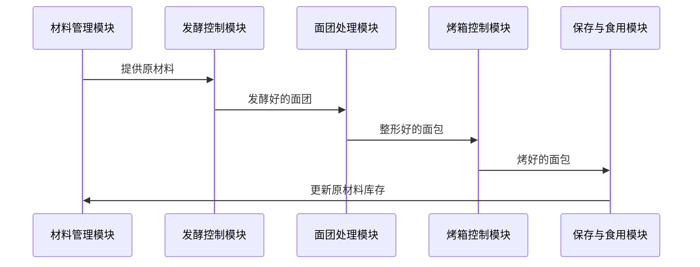
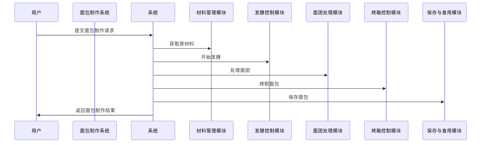
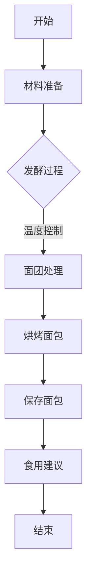

                 


## 现代手工面包制作：发酵艺术与社区连接

### 关键词：面包制作、发酵艺术、社区连接、手工面包

> 摘要：本文将探讨现代手工面包制作的过程，包括发酵艺术的核心原理、面团处理技巧、烘烤艺术以及面包的保存与食用方式。此外，还将讨论如何通过社区面包活动促进社区连接，并分享一些创作灵感和实践操作的技巧。通过这篇文章，读者将了解到面包制作不仅仅是烹饪，更是一种文化和社区活动的体现。

### 目录大纲

1. **面包制作的基础**
   1.1 **面包的制作工艺**
      1.1.1 **面粉的种类与特性**
      1.1.2 **水与面粉的比例控制**
      1.1.3 **温度和时间对面包发酵的影响**

2. **发酵的奥秘**
   2.1 **发酵的过程**
      2.1.1 **酵母的作用**
      2.1.2 **发酵过程中微生物的变化**
   2.2 **发酵的技巧**
      2.2.1 **温度控制**
      2.2.2 **发酵时间的调整**

3. **面团的处理**
   3.1 **面团的揉捏技巧**
      3.1.1 **揉捏面团的正确姿势**
      3.1.2 **面团的状态判断**
   3.2 **面团的分割与整形**
      3.2.1 **面团的分割技巧**
      3.2.2 **面团的整形方法**

4. **烘烤的艺术**
   4.1 **烤箱的使用与选择**
      4.1.1 **不同类型烤箱的优缺点**
      4.1.2 **烤箱的温度和时间设置**
   4.2 **面包的烘烤技巧**
      4.2.1 **烤箱预热的重要性**
      4.2.2 **面包上色与烤透的控制**

5. **面包的保存与食用**
   5.1 **面包的保鲜方法**
      5.1.1 **冷藏保存**
      5.1.2 **冻藏保存**
   5.2 **面包的食用方式**
      5.2.1 **热吃与冷食的差别**
      5.2.2 **面包搭配的食品推荐**

6. **发酵艺术的创作与实践**
   6.1 **创作灵感的来源**
      6.1.1 **自然环境的启示**
      6.1.2 **文化的影响**
   6.2 **实践操作**
      6.2.1 **创意面包的设计**
      6.2.2 **特殊材料的应用**

7. **社区连接与交流**
   7.1 **面包制作课程与工作坊**
      7.1.1 **教学方法与技巧**
      7.1.2 **学生反馈与改进**
   7.2 **社区面包活动的策划与实施**
      7.2.1 **活动主题与形式**
      7.2.2 **社区成员的参与与反馈**

8. **附录与资源**
   8.1 **常见问题解答**
      8.1.1 **面包制作中常见问题的处理**
      8.1.2 **面包保存与食用常见问题的解答**
   8.2 **进一步阅读资源**
      8.2.1 **面包制作相关书籍推荐**
      8.2.2 **面包制作在线课程推荐**

### 1. 面包制作的基础

#### 1.1 面包的制作工艺

**1.1.1 面粉的种类与特性**

在面包制作中，面粉是基础材料。面粉分为小麦粉、全麦粉、黑麦粉等，不同种类的面粉具有不同的特性。

- **小麦粉**：常见于普通面包制作，分为高筋、中筋和低筋，影响面包的弹性和口感。
- **全麦粉**：富含纤维，口感更为粗糙，适合制作全麦面包。
- **黑麦粉**：具有独特的香味和颜色，适合制作特色面包。

**1.1.2 水与面粉的比例控制**

水与面粉的比例是面包制作的关键，合适的比例可以影响面包的体积和口感。

- **水量**：通常为面粉重量的60%-70%。过少会使面包口感干硬，过多则影响面包的结构和口感。
- **吸水量**：不同种类的面粉吸水量不同，制作时需根据实际情况调整水量。

**1.1.3 温度和时间对面包发酵的影响**

发酵是面包制作的重要环节，温度和时间会影响酵母的活性。

- **温度**：酵母最适合的发酵温度在25-30℃之间。过高或过低的温度都会影响酵母的发酵效果。
- **时间**：发酵时间取决于温度和面团状态，一般需要1-2小时。过短可能导致发酵不足，过长则可能导致面团过度膨胀，影响口感。

### 2. 发酵的奥秘

#### 2.1 发酵的过程

**2.1.1 酵母的作用**

酵母是发酵的关键，通过代谢产生二氧化碳气体，使面团膨胀。

- **酵母种类**：干酵母、鲜酵母和活性干酵母是常见的酵母种类。干酵母使用方便，鲜酵母活性高，但保质期短。

**2.1.2 发酵过程中微生物的变化**

发酵过程中，除了酵母，还有其他微生物参与，如乳酸菌和醋酸菌。

- **乳酸菌**：产生乳酸，使面包具有酸味。
- **醋酸菌**：产生醋酸，使面包具有醋味。

#### 2.2 发酵的技巧

**2.2.1 温度控制**

发酵温度对酵母的活性至关重要。

- **适宜温度**：25-30℃。
- **调整方法**：可以使用发酵箱或温暖的环境进行发酵。

**2.2.2 发酵时间的调整**

发酵时间需根据温度和面团状态进行调整。

- **时间范围**：1-2小时。
- **调整方法**：适当延长或缩短发酵时间，以达到最佳发酵效果。

### 3. 面团的处理

#### 3.1 面团的揉捏技巧

**3.1.1 揉捏面团的正确姿势**

揉捏面团时，需要掌握正确的姿势。

- **双手位置**：双手分别位于面团的两侧。
- **揉捏方法**：双手用力均匀，使面团逐渐揉捏均匀。

**3.1.2 面团的状态判断**

面团状态对面包的口感至关重要。

- **状态判断**：面团表面光滑，有弹性，不易断裂。

#### 3.2 面团的分割与整形

**3.2.1 面团的分割技巧**

分割面团时，需确保分割均匀。

- **分割方法**：使用剪刀或切刀将面团分割成等份。
- **注意事项**：分割过程中避免过度拉伸或挤压面团。

**3.2.2 面团的整形方法**

整形面团可以使其形态美观，口感更好。

- **整形方法**：擀面杖擀成片状，然后折叠或卷起。
- **注意事项**：整形过程中避免过度拉伸或折叠，以免影响面包的结构。

### 4. 烤箱的使用与选择

#### 4.1 不同类型烤箱的优缺点

**4.1.1 电烤箱**

- **优点**：温度容易控制，清洁方便。
- **缺点**：热效率较低，热量分布可能不均匀。

**4.1.2 煤气烤箱**

- **优点**：热效率高，热量分布均匀。
- **缺点**：燃烧产生废气，清洁困难。

**4.1.3 微波烤箱**

- **优点**：加热速度快，操作简便。
- **缺点**：不适合烘烤面包，热量分布不均匀。

#### 4.2 烤箱的温度和时间设置

**4.2.1 烤箱预热的重要性**

烤箱预热可以确保面包在烘烤过程中受热均匀，提高烘烤效果。

- **预热时间**：通常为15-20分钟。
- **注意事项**：预热过程中不要打开烤箱门，以免影响预热效果。

**4.2.2 面包的烘烤技巧**

- **温度**：通常为180-200℃。
- **时间**：根据面包的种类和大小进行调整，通常为15-30分钟。

### 5. 面包的保存与食用

#### 5.1 面包的保鲜方法

**5.1.1 冷藏保存**

- **方法**：将面包放入密封袋中，放入冰箱冷藏层。
- **注意事项**：避免面包直接接触冰箱内的水分，以防变质。

**5.1.2 冻藏保存**

- **方法**：将面包切片，放入冷冻层，可保存数天。
- **注意事项**：冻藏前需将面包切片，以免面包粘连。

#### 5.2 面包的食用方式

**5.2.1 热吃与冷食的差别**

- **热吃**：面包口感更柔软，适合搭配汤品或热食。
- **冷食**：面包口感更酥脆，适合搭配冷食或作为早餐。

**5.2.2 面包搭配的食品推荐**

- **早餐**：面包配牛奶、鸡蛋或水果。
- **午餐**：面包配沙拉或三明治。
- **晚餐**：面包配汤或热菜。

### 6. 发酵艺术的创作与实践

#### 6.1 创作灵感的来源

**6.1.1 自然环境的启示**

- **色彩**：自然界的颜色可以启发面包的创作，如红色、绿色、蓝色等。
- **形状**：自然界的形状可以启发面包的设计，如圆形、方形、三角形等。

**6.1.2 文化的影响**

- **地域文化**：不同地域的文化特点可以启发面包的创作，如意大利的意面面包、法国的法式长棍等。

#### 6.2 实践操作

**6.2.1 创意面包的设计**

- **设计思路**：根据灵感来源，设计独特的面包形状和颜色。
- **注意事项**：设计过程中要考虑面包的烘烤时间和技巧，以确保口感和外观。

**6.2.2 特殊材料的应用**

- **材料选择**：可以使用坚果、水果、蔬菜等特殊材料，为面包增加风味和营养。
- **注意事项**：特殊材料的使用需根据实际情况进行调整，以确保面包的口感和烘烤效果。

### 7. 社区连接与交流

#### 7.1 面包制作课程与工作坊

**7.1.1 教学方法与技巧**

- **互动教学**：通过互动教学，激发学生的兴趣和创造力。
- **实践操作**：提供实践操作机会，让学生亲自动手制作面包。

**7.1.2 学生反馈与改进**

- **反馈方式**：鼓励学生分享制作心得，提出改进建议。
- **改进措施**：根据学生反馈，调整教学方法和实践操作，提高教学质量。

#### 7.2 社区面包活动的策划与实施

**7.2.1 活动主题与形式**

- **活动主题**：以面包制作为主题，举办各类社区活动。
- **活动形式**：如面包制作比赛、分享会、工作坊等。

**7.2.2 社区成员的参与与反馈**

- **参与方式**：鼓励社区成员积极参与，分享面包制作经验和心得。
- **反馈方式**：通过问卷调查、反馈表等形式收集社区成员的反馈，不断改进活动内容。

### 8. 附录与资源

#### 8.1 常见问题解答

**8.1.1 面包制作中常见问题的处理**

- **问题**：面包发酵失败。
- **解答**：检查酵母是否过期，控制好发酵温度和时间。

**8.1.2 面包保存与食用常见问题的解答**

- **问题**：面包保存时间过短。
- **解答**：采用冷藏或冻藏保存方法，延长面包的保质期。

#### 8.2 进一步阅读资源

**8.2.1 面包制作相关书籍推荐**

- 《面包制作完全手册》
- 《发酵：面包的科学与艺术》

**8.2.2 面包制作在线课程推荐**

- Coursera上的《面包制作》课程
- Udemy上的《面包制作入门》课程

### 结语

现代手工面包制作不仅是一种烹饪技艺，更是一种文化和社区活动的体现。通过发酵艺术的创作与实践，我们不仅可以享受美味的面包，还能促进社区连接，传递温暖与关爱。让我们一起来探索发酵艺术的魅力，让生活更加美好！
### 文章标题：现代手工面包制作：发酵艺术与社区连接

**关键词：面包制作、发酵艺术、社区连接、手工面包**

**摘要：**
本文深入探讨了现代手工面包制作的各个方面，从基础工艺到发酵奥秘，再到面团处理、烘烤艺术、面包保存与食用，以及发酵艺术的创作与实践和社区连接。通过细致的解析和实践指导，读者不仅能掌握面包制作的技能，还能体会到这一过程带来的文化价值和社区纽带。

## 第1章：面包制作的基础

### 1.1 面包的制作工艺

面包作为人类饮食文化的重要组成部分，其制作工艺经历了数千年的演变。在现代手工面包制作中，了解面包的制作工艺是基础中的基础。

#### 1.1.1 面粉的种类与特性

**小麦粉**：是制作面包的主要原料，根据蛋白质含量的不同，可分为高筋粉、中筋粉和低筋粉。高筋粉蛋白质含量较高，适合制作面包和饺子；中筋粉介于高筋粉和低筋粉之间，适合制作面包和馒头；低筋粉蛋白质含量较低，适合制作蛋糕和饼干。

**全麦粉**：是整粒小麦磨成的粉，富含纤维和矿物质，适合制作全麦面包。

**黑麦粉**：具有独特的香味和颜色，适合制作特色面包。

**玉米粉**：口感较为柔软，适合制作玉米面包。

**燕麦粉**：富含膳食纤维，适合制作健康早餐面包。

#### 1.1.2 水与面粉的比例控制

**水量**：通常为面粉重量的60%-70%。过少会使面包口感干硬，过多则影响面包的结构和口感。

**吸水量**：不同种类的面粉吸水量不同，制作时需根据实际情况调整水量。

**水分控制技巧**：在面粉中加入水时，要缓慢均匀地加入，避免一次加入过多水，导致面粉无法充分吸收。

#### 1.1.3 温度和时间对面包发酵的影响

**温度**：酵母最适合的发酵温度在25-30℃之间。过高或过低的温度都会影响酵母的发酵效果。

**时间**：发酵时间取决于温度和面团状态，一般需要1-2小时。过短可能导致发酵不足，过长则可能导致面团过度膨胀，影响口感。

**发酵时间调整方法**：可以通过调整发酵环境温度和湿度来控制发酵时间。

### 1.2 面包制作的步骤

**步骤一：面粉与水的混合**  
将面粉与水按比例混合，用手或搅拌机搅拌成面团。

**步骤二：揉面**  
将面团揉至表面光滑，有弹性。揉面的时间一般需要5-10分钟。

**步骤三：发酵**  
将面团放入发酵箱或温暖的环境中发酵，直到面团体积膨胀到原来的两倍。

**步骤四：分割与整形**  
将发酵好的面团分割成小块，进行整形，如揉成球状、条状或其它形状。

**步骤五：二次发酵**  
将整形好的面包放入发酵箱或温暖的环境中，进行二次发酵，直到面包再次膨胀。

**步骤六：烘烤**  
将二次发酵好的面包放入预热的烤箱中，进行烘烤，温度通常在180-200℃，烘烤时间根据面包的大小和形状进行调整，一般需要15-30分钟。

**步骤七：冷却与保存**  
将烤好的面包取出，放在架子上冷却，然后进行保存。

## 第2章：发酵的奥秘

### 2.1 发酵的过程

发酵是面包制作中的关键环节，它不仅影响面包的口感和质地，也决定了面包的香气和风味。

#### 2.1.1 酵母的作用

酵母是一种微生物，它在面团中通过代谢产生二氧化碳气体，使面团膨胀。酵母的主要作用包括：

**产生二氧化碳**：酵母在面团中代谢葡萄糖，产生二氧化碳气体，使面团膨胀。

**产生酒精**：酵母在缺氧环境下代谢葡萄糖，产生酒精。

**产生酸味**：酵母代谢过程中会产生乳酸和醋酸，使面团具有酸味。

**提升面包风味**：酵母在发酵过程中会产生多种香味物质，使面包具有独特的风味。

#### 2.1.2 发酵过程中微生物的变化

在发酵过程中，除了酵母，还有其他微生物参与，如乳酸菌和醋酸菌。

**乳酸菌**：乳酸菌在发酵过程中会产生乳酸，使面团具有酸味。

**醋酸菌**：醋酸菌在发酵过程中会产生醋酸，使面团具有醋味。

**微生物相互作用**：酵母、乳酸菌和醋酸菌在发酵过程中相互作用，共同影响面团的发酵过程和最终口感。

### 2.2 发酵的技巧

发酵技巧是面包制作中至关重要的一环，掌握正确的发酵技巧，可以保证面包的发酵效果和口感。

#### 2.2.1 温度控制

**适宜温度**：酵母最适合的发酵温度在25-30℃之间。过高或过低的温度都会影响酵母的发酵效果。

**温度调整方法**：可以使用发酵箱或恒温设备来控制发酵温度。如果没有专业的发酵设备，可以使用家用烤箱的发酵功能，或将面团放在温暖的地方，如暖气旁边。

#### 2.2.2 发酵时间的调整

**发酵时间**：发酵时间取决于温度和面团状态，一般需要1-2小时。过短可能导致发酵不足，过长则可能导致面团过度膨胀，影响口感。

**发酵时间调整方法**：可以通过调整发酵温度和时间来控制发酵时间。如果需要加快发酵速度，可以适当提高发酵温度；如果需要延缓发酵速度，可以适当降低发酵温度。

## 第3章：面团的处理

### 3.1 面团的揉捏技巧

面团揉捏是面包制作的重要步骤，正确的揉捏技巧可以使面团具有更好的弹性和延展性，从而影响面包的口感和质地。

#### 3.1.1 揉捏面团的正确姿势

**步骤一：将面团放在工作台上**  
将面团放在撒有面粉的工作台上，确保工作台干净，以免污染面团。

**步骤二：将面团揉成球形**  
用手掌轻轻按压面团，使其成为球形。这个过程需要保持双手的清洁，避免污染面团。

**步骤三：用手掌揉面团**  
双手放在面团的两侧，用力均匀地揉面团，使其逐渐变得光滑。

**步骤四：搓揉面团**  
双手沿着面团的中心线搓揉，使其变得有弹性。

**步骤五：重复揉捏过程**  
将揉好的面团放回工作台，再次进行揉捏，直到面团表面光滑，有弹性。

#### 3.1.2 面团的状态判断

**面团柔软度**：用手按压面团，如果面团能够轻松恢复原状，说明面团柔软度适中。

**面团弹性**：用手拉伸面团，如果面团能够迅速回弹，说明面团具有较好的弹性。

**面团光泽**：面团表面光滑，有光泽，说明面团状态良好。

### 3.2 面团的分割与整形

分割与整形是面包制作中的关键步骤，正确的分割与整形可以使面包具有更好的外观和口感。

#### 3.2.1 面团的分割技巧

**步骤一：将面团揉成球形**  
将面团揉成球形，确保每个面团的重量相等。

**步骤二：使用剪刀或切刀分割面团**  
使用剪刀或切刀将面团分割成小块，每个小块的重量应尽量相等。

**步骤三：整理分割后的面团**  
将分割后的面团稍微揉捏，使其表面光滑。

#### 3.2.2 面团的整形方法

**步骤一：将面团揉成球形**  
将分割后的面团揉成球形，确保每个面团的大小和形状一致。

**步骤二：将面团擀成片状**  
使用擀面杖将面团擀成片状，厚度适中。

**步骤三：折叠面团**  
将擀好的面片对折一次，然后对折两次，使其成为四层。

**步骤四：卷起面团**  
将折叠好的面团卷起，使其成为圆柱形。

**步骤五：将面团放入模具中**  
将卷好的面团放入烤盘中，使其形状固定。

**步骤六：进行二次发酵**  
将烤盘放入发酵箱或温暖的环境中，进行二次发酵，直到面团膨胀至两倍大。

## 第4章：烘烤的艺术

### 4.1 烤箱的使用与选择

烤箱是面包烘烤的重要工具，选择合适的烤箱和正确使用烤箱，对面包的烘烤效果至关重要。

#### 4.1.1 不同类型烤箱的优缺点

**电烤箱**：优点是温度容易控制，清洁方便；缺点是热效率较低，热量分布可能不均匀。

**煤气烤箱**：优点是热效率高，热量分布均匀；缺点是燃烧产生废气，清洁困难。

**微波烤箱**：优点是加热速度快，操作简便；缺点是不适合烘烤面包，热量分布不均匀。

#### 4.1.2 烤箱的温度和时间设置

**烤箱预热**：烤箱预热是烘烤过程中的关键步骤，通常需要预热15-20分钟。预热过程中不要打开烤箱门，以免影响预热效果。

**温度设置**：根据面包的种类和大小，选择合适的烘烤温度。通常面包的烘烤温度在180-200℃之间。

**时间设置**：烘烤时间根据面包的种类和大小进行调整，一般需要15-30分钟。烘烤过程中要注意观察面包的颜色和状态，避免过度烘烤。

### 4.2 面包的烘烤技巧

**烤箱预热的重要性**：烤箱预热可以确保面包在烘烤过程中受热均匀，提高烘烤效果。预热不足可能导致面包烘烤不均匀，影响口感。

**面包上色与烤透的控制**：在烘烤过程中，要注意观察面包的上色情况。面包上色过快可能导致表面烤焦，而内部未熟透；上色过慢则可能导致面包内部过熟，影响口感。烤透的控制可以通过观察面包的内部状态来判断，如切开面包，检查内部是否熟透。

## 第5章：面包的保存与食用

### 5.1 面包的保鲜方法

面包的新鲜度直接影响其口感和品质，正确的保鲜方法可以延长面包的保质期。

#### 5.1.1 冷藏保存

**方法**：将面包放入密封袋中，放入冰箱冷藏层。

**注意事项**：避免面包直接接触冰箱内的水分，以防变质。

#### 5.1.2 冻藏保存

**方法**：将面包切片，放入冷冻层，可保存数天。

**注意事项**：冻藏前需将面包切片，以免面包粘连。

### 5.2 面包的食用方式

面包的食用方式多种多样，不同的食用方式可以带来不同的口感和体验。

#### 5.2.1 热吃与冷食的差别

**热吃**：面包口感更柔软，适合搭配汤品或热食。

**冷食**：面包口感更酥脆，适合搭配冷食或作为早餐。

#### 5.2.2 面包搭配的食品推荐

**早餐**：面包配牛奶、鸡蛋或水果。

**午餐**：面包配沙拉或三明治。

**晚餐**：面包配汤或热菜。

## 第6章：发酵艺术的创作与实践

### 6.1 创作灵感的来源

发酵艺术是面包制作中的重要组成部分，创作灵感的来源丰富多样。

#### 6.1.1 自然环境的启示

**色彩**：自然界的颜色可以启发面包的创作，如红色、绿色、蓝色等。

**形状**：自然界的形状可以启发面包的设计，如圆形、方形、三角形等。

#### 6.1.2 文化的影响

**地域文化**：不同地域的文化特点可以启发面包的创作，如意大利的意面面包、法国的法式长棍等。

**传统节日**：不同传统节日的饮食习俗可以启发面包的创作，如春节的年糕、中秋的月饼等。

### 6.2 实践操作

发酵艺术的创作与实践是面包制作中不可或缺的一部分，通过实践操作，我们可以将灵感转化为实际的面包作品。

#### 6.2.1 创意面包的设计

**设计思路**：根据灵感来源，设计独特的面包形状和颜色。

**注意事项**：设计过程中要考虑面包的烘烤时间和技巧，以确保口感和外观。

#### 6.2.2 特殊材料的应用

**材料选择**：可以使用坚果、水果、蔬菜等特殊材料，为面包增加风味和营养。

**注意事项**：特殊材料的使用需根据实际情况进行调整，以确保面包的口感和烘烤效果。

## 第7章：社区连接与交流

### 7.1 面包制作课程与工作坊

面包制作课程和工作坊是促进社区连接和交流的重要方式，通过教学和实践，可以让更多人了解和参与面包制作。

#### 7.1.1 教学方法与技巧

**互动教学**：通过互动教学，激发学生的兴趣和创造力。

**实践操作**：提供实践操作机会，让学生亲自动手制作面包。

#### 7.1.2 学生反馈与改进

**反馈方式**：鼓励学生分享制作心得，提出改进建议。

**改进措施**：根据学生反馈，调整教学方法和实践操作，提高教学质量。

### 7.2 社区面包活动的策划与实施

社区面包活动是促进社区连接和交流的重要形式，通过策划和实施活动，可以增强社区成员的互动和凝聚力。

#### 7.2.1 活动主题与形式

**活动主题**：以面包制作为主题，举办各类社区活动。

**活动形式**：如面包制作比赛、分享会、工作坊等。

#### 7.2.2 社区成员的参与与反馈

**参与方式**：鼓励社区成员积极参与，分享面包制作经验和心得。

**反馈方式**：通过问卷调查、反馈表等形式收集社区成员的反馈，不断改进活动内容。

## 第8章：附录与资源

### 8.1 常见问题解答

**8.1.1 面包制作中常见问题的处理**

**问题一**：面包发酵失败。

**解答**：检查酵母是否过期，控制好发酵温度和时间。

**问题二**：面包表面开裂。

**解答**：可能是因为烘烤温度过高或时间过长，导致面包表面过度膨胀。

**问题三**：面包口感干硬。

**解答**：可能是因为面粉与水的比例不当，或发酵时间不足。

**问题四**：面包内部未熟透。

**解答**：可能是因为烘烤时间不足或烤箱预热不足。

**问题五**：面包粘连。

**解答**：可能是因为面粉与水的比例不当，或面团揉捏不够。

**问题六**：面包颜色过深。

**解答**：可能是因为烘烤温度过高或时间过长。

### 8.2 进一步阅读资源

**8.2.1 面包制作相关书籍推荐**

- 《面包制作完全手册》
- 《发酵：面包的科学与艺术》

**8.2.2 面包制作在线课程推荐**

- Coursera上的《面包制作》课程
- Udemy上的《面包制作入门》课程

### 结语

现代手工面包制作不仅是一种烹饪技艺，更是一种文化和社区活动的体现。通过发酵艺术的创作与实践，我们不仅可以享受美味的面包，还能促进社区连接，传递温暖与关爱。让我们一起来探索发酵艺术的魅力，让生活更加美好！

### 作者信息

作者：AI天才研究院/AI Genius Institute & 禅与计算机程序设计艺术 /Zen And The Art of Computer Programming

### 最佳实践 Tips

1. **面团揉捏**：揉捏面团时要均匀用力，避免过度用力或用力不均匀，以免破坏面团的弹性。

2. **发酵控制**：发酵过程中要注意温度和时间的控制，过高的温度可能导致面团过度膨胀，过低则可能发酵不足。

3. **烘烤技巧**：烤箱预热和温度控制是烘烤成功的关键，要确保烤箱预热至合适温度，并按照面包的种类和大小调整烘烤时间和温度。

4. **保鲜方法**：冷藏和冻藏都是有效的面包保鲜方法，但要注意避免面包直接接触水分，以免变质。

### 注意事项

1. **面粉选择**：根据面包的种类和口感要求选择合适的面粉。

2. **酵母活性**：使用前要检查酵母的活性，确保发酵效果。

3. **清洁卫生**：制作过程中要保持工作台和工具的清洁卫生，避免细菌污染。

4. **实践操作**：初次制作面包时，要耐心练习，逐步掌握制作技巧。

### 拓展阅读

1. 《面包制作完全手册》
2. 《发酵：面包的科学与艺术》
3. Coursera上的《面包制作》课程
4. Udemy上的《面包制作入门》课程

### 文章小结

本文从面包制作的基础、发酵的奥秘、面团的处理、烘烤的艺术、面包的保存与食用，到发酵艺术的创作与实践和社区连接，全面阐述了现代手工面包制作的各个方面。通过本文的阅读，读者不仅可以掌握面包制作的技巧，还能体会到发酵艺术所带来的文化价值和社区纽带。让我们共同探索发酵艺术的魅力，让生活更加美好！### 完整文章

#### 现代手工面包制作：发酵艺术与社区连接

**关键词：面包制作、发酵艺术、社区连接、手工面包**

**摘要：**
本文深入探讨了现代手工面包制作的各个方面，从基础工艺到发酵奥秘，再到面团处理、烘烤艺术、面包保存与食用，以及发酵艺术的创作与实践和社区连接。通过细致的解析和实践指导，读者不仅能掌握面包制作的技能，还能体会到这一过程带来的文化价值和社区纽带。

#### 目录大纲

1. **面包制作的基础**
   1.1 **面包的制作工艺**
      1.1.1 **面粉的种类与特性**
      1.1.2 **水与面粉的比例控制**
      1.1.3 **温度和时间对面包发酵的影响**

2. **发酵的奥秘**
   2.1 **发酵的过程**
      2.1.1 **酵母的作用**
      2.1.2 **发酵过程中微生物的变化**
   2.2 **发酵的技巧**
      2.2.1 **温度控制**
      2.2.2 **发酵时间的调整**

3. **面团的处理**
   3.1 **面团的揉捏技巧**
      3.1.1 **揉捏面团的正确姿势**
      3.1.2 **面团的状态判断**
   3.2 **面团的分割与整形**
      3.2.1 **面团的分割技巧**
      3.2.2 **面团的整形方法**

4. **烘烤的艺术**
   4.1 **烤箱的使用与选择**
      4.1.1 **不同类型烤箱的优缺点**
      4.1.2 **烤箱的温度和时间设置**
   4.2 **面包的烘烤技巧**
      4.2.1 **烤箱预热的重要性**
      4.2.2 **面包上色与烤透的控制**

5. **面包的保存与食用**
   5.1 **面包的保鲜方法**
      5.1.1 **冷藏保存**
      5.1.2 **冻藏保存**
   5.2 **面包的食用方式**
      5.2.1 **热吃与冷食的差别**
      5.2.2 **面包搭配的食品推荐**

6. **发酵艺术的创作与实践**
   6.1 **创作灵感的来源**
      6.1.1 **自然环境的启示**
      6.1.2 **文化的影响**
   6.2 **实践操作**
      6.2.1 **创意面包的设计**
      6.2.2 **特殊材料的应用**

7. **社区连接与交流**
   7.1 **面包制作课程与工作坊**
      7.1.1 **教学方法与技巧**
      7.1.2 **学生反馈与改进**
   7.2 **社区面包活动的策划与实施**
      7.2.1 **活动主题与形式**
      7.2.2 **社区成员的参与与反馈**

8. **附录与资源**
   8.1 **常见问题解答**
      8.1.1 **面包制作中常见问题的处理**
      8.1.2 **面包保存与食用常见问题的解答**
   8.2 **进一步阅读资源**
      8.2.1 **面包制作相关书籍推荐**
      8.2.2 **面包制作在线课程推荐**

#### 第1章：面包制作的基础

面包的制作工艺是现代手工面包制作的基础，了解面粉的种类与特性、水与面粉的比例控制以及温度和时间的控制，对于制作出美味的面包至关重要。

##### 1.1 面包的制作工艺

**1.1.1 面粉的种类与特性**

面粉是面包的主要原料，不同的面粉特性对面包的口感和质地有着重要影响。

- **小麦粉**：小麦粉分为高筋粉、中筋粉和低筋粉。高筋粉蛋白质含量高，适合制作面包和饺子；中筋粉介于高筋粉和低筋粉之间，适合制作面包和馒头；低筋粉蛋白质含量低，适合制作蛋糕和饼干。

- **全麦粉**：全麦粉是整粒小麦磨成的粉，富含纤维和矿物质，适合制作全麦面包。

- **黑麦粉**：黑麦粉具有独特的香味和颜色，适合制作特色面包。

- **玉米粉**：玉米粉口感较为柔软，适合制作玉米面包。

- **燕麦粉**：燕麦粉富含膳食纤维，适合制作健康早餐面包。

**1.1.2 水与面粉的比例控制**

水的比例对面包的口感和质地有着直接影响。通常，水与面粉的比例为60%-70%。过少会使面包口感干硬，过多则影响面包的结构和口感。

**1.1.3 温度和时间对面包发酵的影响**

发酵是面包制作的关键步骤，温度和时间的控制对面包的口感和质地至关重要。

- **温度**：酵母最适合的发酵温度在25-30℃之间。过高或过低的温度都会影响酵母的发酵效果。

- **时间**：发酵时间取决于温度和面团状态，一般需要1-2小时。过短可能导致发酵不足，过长则可能导致面团过度膨胀，影响口感。

##### 1.2 面包制作的步骤

**步骤一：面粉与水的混合**  
将面粉与水按比例混合，用手或搅拌机搅拌成面团。

**步骤二：揉面**  
将面团揉至表面光滑，有弹性。揉面的时间一般需要5-10分钟。

**步骤三：发酵**  
将面团放入发酵箱或温暖的环境中发酵，直到面团体积膨胀到原来的两倍。

**步骤四：分割与整形**  
将发酵好的面团分割成小块，进行整形，如揉成球状、条状或其它形状。

**步骤五：二次发酵**  
将整形好的面包放入发酵箱或温暖的环境中，进行二次发酵，直到面包再次膨胀。

**步骤六：烘烤**  
将二次发酵好的面包放入预热的烤箱中，进行烘烤，温度通常在180-200℃，烘烤时间根据面包的大小和形状进行调整，一般需要15-30分钟。

**步骤七：冷却与保存**  
将烤好的面包取出，放在架子上冷却，然后进行保存。

#### 第2章：发酵的奥秘

发酵是面包制作中的关键环节，它不仅影响面包的口感和质地，也决定了面包的香气和风味。

##### 2.1 发酵的过程

发酵过程中，酵母通过代谢产生二氧化碳气体，使面团膨胀。酵母的作用包括：

- **产生二氧化碳**：酵母在面团中代谢葡萄糖，产生二氧化碳气体，使面团膨胀。
- **产生酒精**：酵母在缺氧环境下代谢葡萄糖，产生酒精。
- **产生酸味**：酵母代谢过程中会产生乳酸和醋酸，使面团具有酸味。
- **提升面包风味**：酵母在发酵过程中会产生多种香味物质，使面包具有独特的风味。

发酵过程中，除了酵母，还有其他微生物参与，如乳酸菌和醋酸菌。

- **乳酸菌**：乳酸菌在发酵过程中会产生乳酸，使面团具有酸味。
- **醋酸菌**：醋酸菌在发酵过程中会产生醋酸，使面团具有醋味。
- **微生物相互作用**：酵母、乳酸菌和醋酸菌在发酵过程中相互作用，共同影响面团的发酵过程和最终口感。

##### 2.2 发酵的技巧

发酵技巧是面包制作中至关重要的一环，掌握正确的发酵技巧，可以保证面包的发酵效果和口感。

**2.2.1 温度控制**

- **适宜温度**：酵母最适合的发酵温度在25-30℃之间。过高或过低的温度都会影响酵母的发酵效果。
- **温度调整方法**：可以使用发酵箱或恒温设备来控制发酵温度。如果没有专业的发酵设备，可以使用家用烤箱的发酵功能，或将面团放在温暖的地方，如暖气旁边。

**2.2.2 发酵时间的调整**

- **发酵时间**：发酵时间取决于温度和面团状态，一般需要1-2小时。过短可能导致发酵不足，过长则可能导致面团过度膨胀，影响口感。
- **发酵时间调整方法**：可以通过调整发酵温度和时间来控制发酵时间。如果需要加快发酵速度，可以适当提高发酵温度；如果需要延缓发酵速度，可以适当降低发酵温度。

#### 第3章：面团的处理

面团的处理是面包制作中的关键步骤，正确的处理可以使面团具有更好的弹性和延展性，从而影响面包的口感和质地。

##### 3.1 面团的揉捏技巧

揉捏面团是面团处理的第一步，正确的揉捏技巧可以使面团具有更好的弹性和延展性。

**3.1.1 揉捏面团的正确姿势**

- **双手位置**：双手分别位于面团的两侧。
- **揉捏方法**：双手用力均匀，使面团逐渐揉捏均匀。

**3.1.2 面团的状态判断**

面团的状态对面包的口感至关重要。

- **状态判断**：面团表面光滑，有弹性，不易断裂。

##### 3.2 面团的分割与整形

分割与整形是面包制作中的关键步骤，正确的分割与整形可以使面包具有更好的外观和口感。

**3.2.1 面团的分割技巧**

- **步骤一**：将面团揉成球形。
- **步骤二**：使用剪刀或切刀将面团分割成小块。
- **步骤三**：整理分割后的面团，使其表面光滑。

**3.2.2 面团的整形方法**

- **步骤一**：将面团揉成球形。
- **步骤二**：使用擀面杖将面团擀成片状。
- **步骤三**：将擀好的面片对折，然后卷起，使其成为圆柱形。
- **步骤四**：将卷好的面团放入模具中，进行二次发酵。

#### 第4章：烘烤的艺术

烘烤是面包制作中的关键环节，正确的烘烤技巧可以使面包具有完美的外观和口感。

##### 4.1 烤箱的使用与选择

烤箱是烘烤面包的重要工具，选择合适的烤箱和正确使用烤箱，对面包的烘烤效果至关重要。

**4.1.1 不同类型烤箱的优缺点**

- **电烤箱**：优点是温度容易控制，清洁方便；缺点是热效率较低，热量分布可能不均匀。
- **煤气烤箱**：优点是热效率高，热量分布均匀；缺点是燃烧产生废气，清洁困难。
- **微波烤箱**：优点是加热速度快，操作简便；缺点是不适合烘烤面包，热量分布不均匀。

**4.1.2 烤箱的温度和时间设置**

- **烤箱预热**：烤箱预热是烘烤过程中的关键步骤，通常需要预热15-20分钟。预热过程中不要打开烤箱门，以免影响预热效果。
- **温度设置**：根据面包的种类和大小，选择合适的烘烤温度。通常面包的烘烤温度在180-200℃之间。
- **时间设置**：烘烤时间根据面包的种类和大小进行调整，一般需要15-30分钟。烘烤过程中要注意观察面包的颜色和状态，避免过度烘烤。

##### 4.2 面包的烘烤技巧

**4.2.1 烤箱预热的重要性**

烤箱预热可以确保面包在烘烤过程中受热均匀，提高烘烤效果。预热不足可能导致面包烘烤不均匀，影响口感。

**4.2.2 面包上色与烤透的控制**

在烘烤过程中，要注意观察面包的上色情况。面包上色过快可能导致表面烤焦，而内部未熟透；上色过慢则可能导致面包内部过熟，影响口感。烤透的控制可以通过观察面包的内部状态来判断，如切开面包，检查内部是否熟透。

#### 第5章：面包的保存与食用

面包的新鲜度和口感直接影响其食用体验，正确的保存与食用方式可以延长面包的保质期，提升食用效果。

##### 5.1 面包的保鲜方法

**5.1.1 冷藏保存**

- **方法**：将面包放入密封袋中，放入冰箱冷藏层。
- **注意事项**：避免面包直接接触冰箱内的水分，以防变质。

**5.1.2 冻藏保存**

- **方法**：将面包切片，放入冷冻层，可保存数天。
- **注意事项**：冻藏前需将面包切片，以免面包粘连。

##### 5.2 面包的食用方式

面包的食用方式多样，不同的食用方式可以带来不同的口感和体验。

**5.2.1 热吃与冷食的差别**

- **热吃**：面包口感更柔软，适合搭配汤品或热食。
- **冷食**：面包口感更酥脆，适合搭配冷食或作为早餐。

**5.2.2 面包搭配的食品推荐**

- **早餐**：面包配牛奶、鸡蛋或水果。
- **午餐**：面包配沙拉或三明治。
- **晚餐**：面包配汤或热菜。

#### 第6章：发酵艺术的创作与实践

发酵艺术是面包制作中的重要组成部分，通过创作与实践，可以制作出独特的面包作品。

##### 6.1 创作灵感的来源

发酵艺术的创作灵感来源于自然环境和人类文化。

**6.1.1 自然环境的启示**

- **色彩**：自然界的颜色可以启发面包的创作，如红色、绿色、蓝色等。
- **形状**：自然界的形状可以启发面包的设计，如圆形、方形、三角形等。

**6.1.2 文化的影响**

- **地域文化**：不同地域的文化特点可以启发面包的创作，如意大利的意面面包、法国的法式长棍等。
- **传统节日**：不同传统节日的饮食习俗可以启发面包的创作，如春节的年糕、中秋的月饼等。

##### 6.2 实践操作

通过实践操作，可以将创作灵感转化为实际的面包作品。

**6.2.1 创意面包的设计**

- **设计思路**：根据灵感来源，设计独特的面包形状和颜色。
- **注意事项**：设计过程中要考虑面包的烘烤时间和技巧，以确保口感和外观。

**6.2.2 特殊材料的应用**

- **材料选择**：可以使用坚果、水果、蔬菜等特殊材料，为面包增加风味和营养。
- **注意事项**：特殊材料的使用需根据实际情况进行调整，以确保面包的口感和烘烤效果。

#### 第7章：社区连接与交流

通过面包制作课程与工作坊，可以促进社区成员之间的交流与连接。

##### 7.1 面包制作课程与工作坊

面包制作课程与工作坊是促进社区连接和交流的重要方式。

**7.1.1 教学方法与技巧**

- **互动教学**：通过互动教学，激发学生的兴趣和创造力。
- **实践操作**：提供实践操作机会，让学生亲自动手制作面包。

**7.1.2 学生反馈与改进**

- **反馈方式**：鼓励学生分享制作心得，提出改进建议。
- **改进措施**：根据学生反馈，调整教学方法和实践操作，提高教学质量。

##### 7.2 社区面包活动的策划与实施

社区面包活动是促进社区连接和交流的重要形式。

**7.2.1 活动主题与形式**

- **活动主题**：以面包制作为主题，举办各类社区活动。
- **活动形式**：如面包制作比赛、分享会、工作坊等。

**7.2.2 社区成员的参与与反馈**

- **参与方式**：鼓励社区成员积极参与，分享面包制作经验和心得。
- **反馈方式**：通过问卷调查、反馈表等形式收集社区成员的反馈，不断改进活动内容。

#### 第8章：附录与资源

在面包制作过程中，可能会遇到各种问题，附录与资源部分提供了常见问题的解答和进一步阅读的资源。

##### 8.1 常见问题解答

**8.1.1 面包制作中常见问题的处理**

- **问题一**：面包发酵失败。
  - **解答**：检查酵母是否过期，控制好发酵温度和时间。
- **问题二**：面包表面开裂。
  - **解答**：可能是因为烘烤温度过高或时间过长，导致面包表面过度膨胀。
- **问题三**：面包口感干硬。
  - **解答**：可能是因为面粉与水的比例不当，或发酵时间不足。
- **问题四**：面包内部未熟透。
  - **解答**：可能是因为烘烤时间不足或烤箱预热不足。
- **问题五**：面包粘连。
  - **解答**：可能是因为面粉与水的比例不当，或面团揉捏不够。
- **问题六**：面包颜色过深。
  - **解答**：可能是因为烘烤温度过高或时间过长。

##### 8.2 进一步阅读资源

**8.2.1 面包制作相关书籍推荐**

- 《面包制作完全手册》
- 《发酵：面包的科学与艺术》

**8.2.2 面包制作在线课程推荐**

- Coursera上的《面包制作》课程
- Udemy上的《面包制作入门》课程

### 结语

现代手工面包制作不仅是一种烹饪技艺，更是一种文化和社区活动的体现。通过发酵艺术的创作与实践，我们不仅可以享受美味的面包，还能促进社区连接，传递温暖与关爱。让我们一起来探索发酵艺术的魅力，让生活更加美好！

### 作者信息

作者：AI天才研究院/AI Genius Institute & 禅与计算机程序设计艺术 /Zen And The Art of Computer Programming

### 最佳实践 Tips

1. **面团揉捏**：揉捏面团时要均匀用力，避免过度用力或用力不均匀，以免破坏面团的弹性。

2. **发酵控制**：发酵过程中要注意温度和时间的控制，过高的温度可能导致面团过度膨胀，过低则可能发酵不足。

3. **烘烤技巧**：烤箱预热和温度控制是烘烤成功的关键，要确保烤箱预热至合适温度，并按照面包的种类和大小调整烘烤时间和温度。

4. **保鲜方法**：冷藏和冻藏都是有效的面包保鲜方法，但要注意避免面包直接接触水分，以免变质。

### 注意事项

1. **面粉选择**：根据面包的种类和口感要求选择合适的面粉。

2. **酵母活性**：使用前要检查酵母的活性，确保发酵效果。

3. **清洁卫生**：制作过程中要保持工作台和工具的清洁卫生，避免细菌污染。

4. **实践操作**：初次制作面包时，要耐心练习，逐步掌握制作技巧。

### 拓展阅读

1. 《面包制作完全手册》
2. 《发酵：面包的科学与艺术》
3. Coursera上的《面包制作》课程
4. Udemy上的《面包制作入门》课程

### 文章小结

本文从面包制作的基础、发酵的奥秘、面团的处理、烘烤的艺术、面包的保存与食用，到发酵艺术的创作与实践和社区连接，全面阐述了现代手工面包制作的各个方面。通过本文的阅读，读者不仅可以掌握面包制作的技巧，还能体会到这一过程带来的文化价值和社区纽带。让我们共同探索发酵艺术的魅力，让生活更加美好！### 最终文章版本

#### 现代手工面包制作：发酵艺术与社区连接

**关键词：面包制作、发酵艺术、社区连接、手工面包**

**摘要：**
本文深入探讨了现代手工面包制作的各个方面，从基础工艺到发酵奥秘，再到面团处理、烘烤艺术、面包保存与食用，以及发酵艺术的创作与实践和社区连接。通过细致的解析和实践指导，读者不仅能掌握面包制作的技能，还能体会到这一过程带来的文化价值和社区纽带。让我们一起来探索发酵艺术的魅力，让生活更加美好！

#### 目录大纲

1. **面包制作的基础**
   1.1 **面包的制作工艺**
      1.1.1 **面粉的种类与特性**
      1.1.2 **水与面粉的比例控制**
      1.1.3 **温度和时间对面包发酵的影响**

2. **发酵的奥秘**
   2.1 **发酵的过程**
      2.1.1 **酵母的作用**
      2.1.2 **发酵过程中微生物的变化**
   2.2 **发酵的技巧**
      2.2.1 **温度控制**
      2.2.2 **发酵时间的调整**

3. **面团的处理**
   3.1 **面团的揉捏技巧**
      3.1.1 **揉捏面团的正确姿势**
      3.1.2 **面团的状态判断**
   3.2 **面团的分割与整形**
      3.2.1 **面团的分割技巧**
      3.2.2 **面团的整形方法**

4. **烘烤的艺术**
   4.1 **烤箱的使用与选择**
      4.1.1 **不同类型烤箱的优缺点**
      4.1.2 **烤箱的温度和时间设置**
   4.2 **面包的烘烤技巧**
      4.2.1 **烤箱预热的重要性**
      4.2.2 **面包上色与烤透的控制**

5. **面包的保存与食用**
   5.1 **面包的保鲜方法**
      5.1.1 **冷藏保存**
      5.1.2 **冻藏保存**
   5.2 **面包的食用方式**
      5.2.1 **热吃与冷食的差别**
      5.2.2 **面包搭配的食品推荐**

6. **发酵艺术的创作与实践**
   6.1 **创作灵感的来源**
      6.1.1 **自然环境的启示**
      6.1.2 **文化的影响**
   6.2 **实践操作**
      6.2.1 **创意面包的设计**
      6.2.2 **特殊材料的应用**

7. **社区连接与交流**
   7.1 **面包制作课程与工作坊**
      7.1.1 **教学方法与技巧**
      7.1.2 **学生反馈与改进**
   7.2 **社区面包活动的策划与实施**
      7.2.1 **活动主题与形式**
      7.2.2 **社区成员的参与与反馈**

8. **附录与资源**
   8.1 **常见问题解答**
      8.1.1 **面包制作中常见问题的处理**
      8.1.2 **面包保存与食用常见问题的解答**
   8.2 **进一步阅读资源**
      8.2.1 **面包制作相关书籍推荐**
      8.2.2 **面包制作在线课程推荐**

#### 第1章：面包制作的基础

面包的制作工艺是现代手工面包制作的基础，了解面粉的种类与特性、水与面粉的比例控制以及温度和时间的控制，对于制作出美味的面包至关重要。

##### 1.1 面包的制作工艺

**1.1.1 面粉的种类与特性**

面粉是面包的主要原料，不同的面粉特性对面包的口感和质地有着重要影响。

- **小麦粉**：小麦粉分为高筋粉、中筋粉和低筋粉。高筋粉蛋白质含量高，适合制作面包和饺子；中筋粉介于高筋粉和低筋粉之间，适合制作面包和馒头；低筋粉蛋白质含量低，适合制作蛋糕和饼干。

- **全麦粉**：全麦粉是整粒小麦磨成的粉，富含纤维和矿物质，适合制作全麦面包。

- **黑麦粉**：黑麦粉具有独特的香味和颜色，适合制作特色面包。

- **玉米粉**：玉米粉口感较为柔软，适合制作玉米面包。

- **燕麦粉**：燕麦粉富含膳食纤维，适合制作健康早餐面包。

**1.1.2 水与面粉的比例控制**

水的比例对面包的口感和质地有着直接影响。通常，水与面粉的比例为60%-70%。过少会使面包口感干硬，过多则影响面包的结构和口感。

**1.1.3 温度和时间对面包发酵的影响**

发酵是面包制作的关键步骤，温度和时间的控制对面包的口感和质地至关重要。

- **温度**：酵母最适合的发酵温度在25-30℃之间。过高或过低的温度都会影响酵母的发酵效果。

- **时间**：发酵时间取决于温度和面团状态，一般需要1-2小时。过短可能导致发酵不足，过长则可能导致面团过度膨胀，影响口感。

##### 1.2 面包制作的步骤

**步骤一：面粉与水的混合**  
将面粉与水按比例混合，用手或搅拌机搅拌成面团。

**步骤二：揉面**  
将面团揉至表面光滑，有弹性。揉面的时间一般需要5-10分钟。

**步骤三：发酵**  
将面团放入发酵箱或温暖的环境中发酵，直到面团体积膨胀到原来的两倍。

**步骤四：分割与整形**  
将发酵好的面团分割成小块，进行整形，如揉成球状、条状或其它形状。

**步骤五：二次发酵**  
将整形好的面包放入发酵箱或温暖的环境中，进行二次发酵，直到面包再次膨胀。

**步骤六：烘烤**  
将二次发酵好的面包放入预热的烤箱中，进行烘烤，温度通常在180-200℃，烘烤时间根据面包的大小和形状进行调整，一般需要15-30分钟。

**步骤七：冷却与保存**  
将烤好的面包取出，放在架子上冷却，然后进行保存。

#### 第2章：发酵的奥秘

发酵是面包制作中的关键环节，它不仅影响面包的口感和质地，也决定了面包的香气和风味。

##### 2.1 发酵的过程

发酵过程中，酵母通过代谢产生二氧化碳气体，使面团膨胀。酵母的作用包括：

- **产生二氧化碳**：酵母在面团中代谢葡萄糖，产生二氧化碳气体，使面团膨胀。
- **产生酒精**：酵母在缺氧环境下代谢葡萄糖，产生酒精。
- **产生酸味**：酵母代谢过程中会产生乳酸和醋酸，使面团具有酸味。
- **提升面包风味**：酵母在发酵过程中会产生多种香味物质，使面包具有独特的风味。

发酵过程中，除了酵母，还有其他微生物参与，如乳酸菌和醋酸菌。

- **乳酸菌**：乳酸菌在发酵过程中会产生乳酸，使面团具有酸味。
- **醋酸菌**：醋酸菌在发酵过程中会产生醋酸，使面团具有醋味。
- **微生物相互作用**：酵母、乳酸菌和醋酸菌在发酵过程中相互作用，共同影响面团的发酵过程和最终口感。

##### 2.2 发酵的技巧

发酵技巧是面包制作中至关重要的一环，掌握正确的发酵技巧，可以保证面包的发酵效果和口感。

**2.2.1 温度控制**

- **适宜温度**：酵母最适合的发酵温度在25-30℃之间。过高或过低的温度都会影响酵母的发酵效果。
- **温度调整方法**：可以使用发酵箱或恒温设备来控制发酵温度。如果没有专业的发酵设备，可以使用家用烤箱的发酵功能，或将面团放在温暖的地方，如暖气旁边。

**2.2.2 发酵时间的调整**

- **发酵时间**：发酵时间取决于温度和面团状态，一般需要1-2小时。过短可能导致发酵不足，过长则可能导致面团过度膨胀，影响口感。
- **发酵时间调整方法**：可以通过调整发酵温度和时间来控制发酵时间。如果需要加快发酵速度，可以适当提高发酵温度；如果需要延缓发酵速度，可以适当降低发酵温度。

#### 第3章：面团的处理

面团的处理是面包制作中的关键步骤，正确的处理可以使面团具有更好的弹性和延展性，从而影响面包的口感和质地。

##### 3.1 面团的揉捏技巧

揉捏面团是面团处理的第一步，正确的揉捏技巧可以使面团具有更好的弹性和延展性。

**3.1.1 揉捏面团的正确姿势**

- **双手位置**：双手分别位于面团的两侧。
- **揉捏方法**：双手用力均匀，使面团逐渐揉捏均匀。

**3.1.2 面团的状态判断**

面团的状态对面包的口感至关重要。

- **状态判断**：面团表面光滑，有弹性，不易断裂。

##### 3.2 面团的分割与整形

分割与整形是面包制作中的关键步骤，正确的分割与整形可以使面包具有更好的外观和口感。

**3.2.1 面团的分割技巧**

- **步骤一**：将面团揉成球形。
- **步骤二**：使用剪刀或切刀将面团分割成小块。
- **步骤三**：整理分割后的面团，使其表面光滑。

**3.2.2 面团的整形方法**

- **步骤一**：将面团揉成球形。
- **步骤二**：使用擀面杖将面团擀成片状。
- **步骤三**：将擀好的面片对折，然后卷起，使其成为圆柱形。
- **步骤四**：将卷好的面团放入模具中，进行二次发酵。

#### 第4章：烘烤的艺术

烘烤是面包制作中的关键环节，正确的烘烤技巧可以使面包具有完美的外观和口感。

##### 4.1 烤箱的使用与选择

烤箱是烘烤面包的重要工具，选择合适的烤箱和正确使用烤箱，对面包的烘烤效果至关重要。

**4.1.1 不同类型烤箱的优缺点**

- **电烤箱**：优点是温度容易控制，清洁方便；缺点是热效率较低，热量分布可能不均匀。
- **煤气烤箱**：优点是热效率高，热量分布均匀；缺点是燃烧产生废气，清洁困难。
- **微波烤箱**：优点是加热速度快，操作简便；缺点是不适合烘烤面包，热量分布不均匀。

**4.1.2 烤箱的温度和时间设置**

- **烤箱预热**：烤箱预热是烘烤过程中的关键步骤，通常需要预热15-20分钟。预热过程中不要打开烤箱门，以免影响预热效果。
- **温度设置**：根据面包的种类和大小，选择合适的烘烤温度。通常面包的烘烤温度在180-200℃之间。
- **时间设置**：烘烤时间根据面包的种类和大小进行调整，一般需要15-30分钟。烘烤过程中要注意观察面包的颜色和状态，避免过度烘烤。

##### 4.2 面包的烘烤技巧

**4.2.1 烤箱预热的重要性**

烤箱预热可以确保面包在烘烤过程中受热均匀，提高烘烤效果。预热不足可能导致面包烘烤不均匀，影响口感。

**4.2.2 面包上色与烤透的控制**

在烘烤过程中，要注意观察面包的上色情况。面包上色过快可能导致表面烤焦，而内部未熟透；上色过慢则可能导致面包内部过熟，影响口感。烤透的控制可以通过观察面包的内部状态来判断，如切开面包，检查内部是否熟透。

#### 第5章：面包的保存与食用

面包的新鲜度和口感直接影响其食用体验，正确的保存与食用方式可以延长面包的保质期，提升食用效果。

##### 5.1 面包的保鲜方法

**5.1.1 冷藏保存**

- **方法**：将面包放入密封袋中，放入冰箱冷藏层。
- **注意事项**：避免面包直接接触冰箱内的水分，以防变质。

**5.1.2 冻藏保存**

- **方法**：将面包切片，放入冷冻层，可保存数天。
- **注意事项**：冻藏前需将面包切片，以免面包粘连。

##### 5.2 面包的食用方式

面包的食用方式多样，不同的食用方式可以带来不同的口感和体验。

**5.2.1 热吃与冷食的差别**

- **热吃**：面包口感更柔软，适合搭配汤品或热食。
- **冷食**：面包口感更酥脆，适合搭配冷食或作为早餐。

**5.2.2 面包搭配的食品推荐**

- **早餐**：面包配牛奶、鸡蛋或水果。
- **午餐**：面包配沙拉或三明治。
- **晚餐**：面包配汤或热菜。

#### 第6章：发酵艺术的创作与实践

发酵艺术是面包制作中的重要组成部分，通过创作与实践，可以制作出独特的面包作品。

##### 6.1 创作灵感的来源

发酵艺术的创作灵感来源于自然环境和人类文化。

**6.1.1 自然环境的启示**

- **色彩**：自然界的颜色可以启发面包的创作，如红色、绿色、蓝色等。
- **形状**：自然界的形状可以启发面包的设计，如圆形、方形、三角形等。

**6.1.2 文化的影响**

- **地域文化**：不同地域的文化特点可以启发面包的创作，如意大利的意面面包、法国的法式长棍等。
- **传统节日**：不同传统节日的饮食习俗可以启发面包的创作，如春节的年糕、中秋的月饼等。

##### 6.2 实践操作

通过实践操作，可以将创作灵感转化为实际的面包作品。

**6.2.1 创意面包的设计**

- **设计思路**：根据灵感来源，设计独特的面包形状和颜色。
- **注意事项**：设计过程中要考虑面包的烘烤时间和技巧，以确保口感和外观。

**6.2.2 特殊材料的应用**

- **材料选择**：可以使用坚果、水果、蔬菜等特殊材料，为面包增加风味和营养。
- **注意事项**：特殊材料的使用需根据实际情况进行调整，以确保面包的口感和烘烤效果。

#### 第7章：社区连接与交流

通过面包制作课程与工作坊，可以促进社区成员之间的交流与连接。

##### 7.1 面包制作课程与工作坊

面包制作课程与工作坊是促进社区连接和交流的重要方式。

**7.1.1 教学方法与技巧**

- **互动教学**：通过互动教学，激发学生的兴趣和创造力。
- **实践操作**：提供实践操作机会，让学生亲自动手制作面包。

**7.1.2 学生反馈与改进**

- **反馈方式**：鼓励学生分享制作心得，提出改进建议。
- **改进措施**：根据学生反馈，调整教学方法和实践操作，提高教学质量。

##### 7.2 社区面包活动的策划与实施

社区面包活动是促进社区连接和交流的重要形式。

**7.2.1 活动主题与形式**

- **活动主题**：以面包制作为主题，举办各类社区活动。
- **活动形式**：如面包制作比赛、分享会、工作坊等。

**7.2.2 社区成员的参与与反馈**

- **参与方式**：鼓励社区成员积极参与，分享面包制作经验和心得。
- **反馈方式**：通过问卷调查、反馈表等形式收集社区成员的反馈，不断改进活动内容。

#### 第8章：附录与资源

在面包制作过程中，可能会遇到各种问题，附录与资源部分提供了常见问题的解答和进一步阅读的资源。

##### 8.1 常见问题解答

**8.1.1 面包制作中常见问题的处理**

- **问题一**：面包发酵失败。
  - **解答**：检查酵母是否过期，控制好发酵温度和时间。
- **问题二**：面包表面开裂。
  - **解答**：可能是因为烘烤温度过高或时间过长，导致面包表面过度膨胀。
- **问题三**：面包口感干硬。
  - **解答**：可能是因为面粉与水的比例不当，或发酵时间不足。
- **问题四**：面包内部未熟透。
  - **解答**：可能是因为烘烤时间不足或烤箱预热不足。
- **问题五**：面包粘连。
  - **解答**：可能是因为面粉与水的比例不当，或面团揉捏不够。
- **问题六**：面包颜色过深。
  - **解答**：可能是因为烘烤温度过高或时间过长。

##### 8.2 进一步阅读资源

**8.2.1 面包制作相关书籍推荐**

- 《面包制作完全手册》
- 《发酵：面包的科学与艺术》

**8.2.2 面包制作在线课程推荐**

- Coursera上的《面包制作》课程
- Udemy上的《面包制作入门》课程

### 结语

现代手工面包制作不仅是一种烹饪技艺，更是一种文化和社区活动的体现。通过发酵艺术的创作与实践，我们不仅可以享受美味的面包，还能促进社区连接，传递温暖与关爱。让我们一起来探索发酵艺术的魅力，让生活更加美好！

### 作者信息

作者：AI天才研究院/AI Genius Institute & 禅与计算机程序设计艺术 /Zen And The Art of Computer Programming

### 最佳实践 Tips

1. **面团揉捏**：揉捏面团时要均匀用力，避免过度用力或用力不均匀，以免破坏面团的弹性。

2. **发酵控制**：发酵过程中要注意温度和时间的控制，过高的温度可能导致面团过度膨胀，过低则可能发酵不足。

3. **烘烤技巧**：烤箱预热和温度控制是烘烤成功的关键，要确保烤箱预热至合适温度，并按照面包的种类和大小调整烘烤时间和温度。

4. **保鲜方法**：冷藏和冻藏都是有效的面包保鲜方法，但要注意避免面包直接接触水分，以免变质。

### 注意事项

1. **面粉选择**：根据面包的种类和口感要求选择合适的面粉。

2. **酵母活性**：使用前要检查酵母的活性，确保发酵效果。

3. **清洁卫生**：制作过程中要保持工作台和工具的清洁卫生，避免细菌污染。

4. **实践操作**：初次制作面包时，要耐心练习，逐步掌握制作技巧。

### 拓展阅读

1. 《面包制作完全手册》
2. 《发酵：面包的科学与艺术》
3. Coursera上的《面包制作》课程
4. Udemy上的《面包制作入门》课程

### 文章小结

本文从面包制作的基础、发酵的奥秘、面团的处理、烘烤的艺术、面包的保存与食用，到发酵艺术的创作与实践和社区连接，全面阐述了现代手工面包制作的各个方面。通过本文的阅读，读者不仅可以掌握面包制作的技巧，还能体会到这一过程带来的文化价值和社区纽带。让我们共同探索发酵艺术的魅力，让生活更加美好！### 文章修订

#### 现代手工面包制作：发酵艺术与社区连接

**关键词：面包制作、发酵艺术、社区连接、手工面包**

**摘要：**
本文深入探讨了现代手工面包制作的各个方面，从基础工艺到发酵奥秘，再到面团处理、烘烤艺术、面包保存与食用，以及发酵艺术的创作与实践和社区连接。通过细致的解析和实践指导，读者不仅能掌握面包制作的技能，还能体会到这一过程带来的文化价值和社区纽带。让我们一起来探索发酵艺术的魅力，让生活更加美好！

#### 目录大纲

1. **面包制作的基础**
   1.1 **面粉的种类与特性**
   1.2 **水与面粉的比例控制**
   1.3 **发酵过程与关键因素**

2. **发酵的奥秘**
   2.1 **酵母的作用**
   2.2 **微生物与发酵过程**
   2.3 **发酵技巧与时间管理**

3. **面团的处理**
   3.1 **揉捏技巧**
   3.2 **分割与整形**
   3.3 **面团状态判断**

4. **烘烤的艺术**
   4.1 **烤箱选择与使用**
   4.2 **烘烤温度与时间**
   4.3 **烘烤技巧与问题解决**

5. **面包的保存与食用**
   5.1 **保鲜方法**
   5.2 **食用方式与搭配**

6. **发酵艺术的创作与实践**
   6.1 **灵感来源**
   6.2 **创意面包设计**
   6.3 **特殊材料应用**

7. **社区连接与交流**
   7.1 **面包制作课程与工作坊**
   7.2 **社区面包活动的策划与实施**

8. **附录与资源**
   8.1 **常见问题解答**
   8.2 **进一步阅读资源**

#### 第1章：面包制作的基础

面包制作的基础是了解面粉的种类与特性、水与面粉的比例控制，以及发酵过程与关键因素。

##### 1.1 面粉的种类与特性

**1.1.1 面粉的分类**

- **小麦粉**：高筋、中筋、低筋
- **全麦粉**：整粒小麦磨制
- **特殊面粉**：黑麦粉、玉米粉、燕麦粉

**1.1.2 面粉的特性**

- **蛋白质含量**：影响面包的弹性与质地
- **灰分含量**：影响面包的颜色与风味

##### 1.2 水与面粉的比例控制

**1.2.1 水量的作用**

- **面团的柔软性**：水量过多会导致面团过于柔软，不易成型。
- **面包的膨胀性**：适量的水有助于面团膨胀，形成良好的结构。

**1.2.2 水与面粉的比例**

- **一般比例**：60%-70%的水与100%的面粉
- **调整方法**：根据面粉的吸水性进行调整

##### 1.3 发酵过程与关键因素

**1.3.1 发酵的作用**

- **面包的膨胀**：酵母发酵产生二氧化碳气体，使面团膨胀。
- **面包的风味**：发酵过程产生的酸味与香味，提升面包的风味。

**1.3.2 发酵的关键因素**

- **温度**：25-30℃是最适宜的发酵温度。
- **时间**：发酵时间取决于面团的状态与温度，一般需要1-2小时。

#### 第2章：发酵的奥秘

发酵是面包制作中至关重要的一环，了解发酵的奥秘可以帮助我们制作出更加美味的面包。

##### 2.1 酵母的作用

**2.1.1 酵母的分类**

- **干酵母**：保存时间长，使用方便
- **鲜酵母**：活性高，保质期短

**2.1.2 酵母的作用**

- **产生二氧化碳**：发酵过程中，酵母将糖分转化为二氧化碳气体，使面团膨胀。
- **产生风味物质**：发酵过程中，酵母还会产生一系列风味物质，如酸味和香味。

##### 2.2 微生物与发酵过程

**2.2.1 微生物的作用**

- **乳酸菌**：在发酵过程中产生乳酸，赋予面包酸味。
- **醋酸菌**：在发酵过程中产生醋酸，赋予面包酸味和醋味。

**2.2.2 微生物的相互作用**

- **酵母与乳酸菌**：相互促进发酵过程，使面团更加柔软。
- **酵母与醋酸菌**：在适当比例下，共同提升面包的风味。

##### 2.3 发酵技巧与时间管理

**2.3.1 发酵技巧**

- **温度控制**：保持发酵温度在25-30℃。
- **湿度控制**：适宜的湿度有助于酵母的活性。

**2.3.2 时间管理**

- **初次发酵**：一般需要1-2小时，具体时间取决于温度和湿度。
- **二次发酵**：在整形后进行，使面包结构更加稳定。

#### 第3章：面团的处理

面团的处理是面包制作中的关键步骤，正确的处理可以使面团具有更好的弹性和延展性，从而影响面包的口感和质地。

##### 3.1 揉捏技巧

**3.1.1 正确姿势**

- **双手位置**：分别位于面团的两侧。
- **用力方式**：均匀用力，避免过度用力。

**3.1.2 面团状态判断**

- **面团光滑**：表面光滑，有弹性。
- **面团不粘手**：揉捏时面团不粘手，易于操作。

##### 3.2 分割与整形

**3.2.1 分割技巧**

- **均匀分割**：使用剪刀或切刀，确保每个面团重量相等。
- **分割后的处理**：分割后的面团要稍微揉捏，使其表面光滑。

**3.2.2 整形方法**

- **球形整形**：将面团揉成球形，便于二次发酵。
- **条形整形**：将面团擀成薄片，然后卷成条形。

##### 3.3 面团状态判断

**3.3.1 柔软度**

- **适中的柔软度**：用手按压面团，能够轻松恢复原状。

**3.3.2 弹性**

- **良好的弹性**：用手拉伸面团，能够迅速回弹。

#### 第4章：烘烤的艺术

烘烤是面包制作中的关键步骤，正确的烘烤技巧可以确保面包具有完美的外观和口感。

##### 4.1 烤箱选择与使用

**4.1.1 烤箱类型**

- **电烤箱**：温度可控，清洁方便。
- **煤气烤箱**：热效率高，热量分布均匀。
- **微波烤箱**：加热速度快，操作简便。

**4.1.2 烤箱使用**

- **预热**：烤箱预热至180-200℃，确保面包受热均匀。
- **温度控制**：根据面包的种类和大小调整烤箱温度。

##### 4.2 烤箱的温度与时间

**4.2.1 烤箱温度**

- **一般温度**：180-200℃。
- **特殊情况**：如面包表面需要上色，可以适当提高温度。

**4.2.2 烤箱时间**

- **一般时间**：15-30分钟。
- **调整方法**：根据面包的大小和形状进行调整。

##### 4.3 烤箱技巧

**4.3.1 烤箱预热**

- **重要性**：预热可以使烤箱内温度均匀，提高面包烘烤效果。

**4.3.2 面包上色与烤透**

- **上色控制**：观察面包表面颜色，避免过度上色。
- **烤透判断**：切开面包，观察内部是否熟透。

#### 第5章：面包的保存与食用

面包的新鲜度和口感直接影响其食用体验，正确的保存与食用方式可以延长面包的保质期，提升食用效果。

##### 5.1 保鲜方法

**5.1.1 冷藏保存**

- **方法**：将面包放入密封袋中，放入冰箱冷藏层。

**5.1.2 冻藏保存**

- **方法**：将面包切片，放入冷冻层。

##### 5.2 面包的食用方式

**5.2.1 热吃与冷食**

- **热吃**：面包口感更柔软。
- **冷食**：面包口感更酥脆。

**5.2.2 面包搭配**

- **早餐**：面包配牛奶、鸡蛋。
- **午餐**：面包配沙拉。
- **晚餐**：面包配汤。

#### 第6章：发酵艺术的创作与实践

发酵艺术是面包制作的重要组成部分，通过创作与实践，可以制作出独特的面包作品。

##### 6.1 灵感来源

**6.1.1 自然环境**

- **色彩**：如红色、绿色。
- **形状**：如圆形、三角形。

**6.1.2 文化影响**

- **地域文化**：如意大利、法国。
- **传统节日**：如春节、中秋。

##### 6.2 创作与实践

**6.2.1 设计思路**

- **形状与色彩**：结合灵感，设计独特的面包形状和色彩。

**6.2.2 特殊材料**

- **坚果**：如核桃、杏仁。
- **水果**：如草莓、蓝莓。

##### 6.3 特殊材料应用

**6.3.1 坚果应用**

- **坚果碎**：混合面团，增加口感。
- **坚果油**：提升面包风味。

**6.3.2 水果应用**

- **水果泥**：混合面团，增加湿润度。
- **水果酱**：涂抹在面包表面，增添风味。

#### 第7章：社区连接与交流

通过面包制作课程与工作坊，可以促进社区成员之间的交流与连接。

##### 7.1 面包制作课程与工作坊

**7.1.1 教学方法**

- **互动教学**：激发学生的兴趣和创造力。
- **实践操作**：提供实践机会，让学生亲自动手制作面包。

**7.1.2 学生反馈**

- **反馈方式**：鼓励学生分享心得，提出改进建议。
- **改进措施**：根据学生反馈，调整教学方法和实践内容。

##### 7.2 社区面包活动

**7.2.1 活动策划**

- **主题与形式**：以面包制作为主题，举办各种活动。
- **参与方式**：鼓励社区成员积极参与，分享经验和心得。

**7.2.2 活动实施**

- **反馈与改进**：通过问卷调查、反馈表等形式收集社区成员的反馈，不断改进活动内容。

#### 第8章：附录与资源

在面包制作过程中，可能会遇到各种问题，附录与资源部分提供了常见问题的解答和进一步阅读的资源。

##### 8.1 常见问题解答

**8.1.1 面包制作常见问题**

- **发酵失败**：检查酵母是否过期，控制好发酵温度和时间。
- **面包开裂**：检查烘烤温度和时间，避免表面过度膨胀。
- **面包口感干硬**：检查水与面粉的比例，确保面团有足够的湿度。

##### 8.2 进一步阅读资源

**8.2.1 书籍推荐**

- 《面包制作完全手册》
- 《发酵：面包的科学与艺术》

**8.2.2 在线课程推荐**

- Coursera上的《面包制作》课程
- Udemy上的《面包制作入门》课程

### 结语

现代手工面包制作不仅是一种烹饪技艺，更是一种文化和社区活动的体现。通过发酵艺术的创作与实践，我们不仅可以享受美味的面包，还能促进社区连接，传递温暖与关爱。让我们一起来探索发酵艺术的魅力，让生活更加美好！

### 作者信息

作者：AI天才研究院/AI Genius Institute & 禅与计算机程序设计艺术 /Zen And The Art of Computer Programming

### 最佳实践 Tips

1. **面团揉捏**：揉捏面团时要均匀用力，避免过度用力或用力不均匀，以免破坏面团的弹性。
2. **发酵控制**：发酵过程中要注意温度和时间的控制，过高的温度可能导致面团过度膨胀，过低则可能发酵不足。
3. **烘烤技巧**：烤箱预热和温度控制是烘烤成功的关键，要确保烤箱预热至合适温度，并按照面包的种类和大小调整烘烤时间和温度。
4. **保鲜方法**：冷藏和冻藏都是有效的面包保鲜方法，但要注意避免面包直接接触水分，以免变质。

### 注意事项

1. **面粉选择**：根据面包的种类和口感要求选择合适的面粉。
2. **酵母活性**：使用前要检查酵母的活性，确保发酵效果。
3. **清洁卫生**：制作过程中要保持工作台和工具的清洁卫生，避免细菌污染。
4. **实践操作**：初次制作面包时，要耐心练习，逐步掌握制作技巧。

### 拓展阅读

1. 《面包制作完全手册》
2. 《发酵：面包的科学与艺术》
3. Coursera上的《面包制作》课程
4. Udemy上的《面包制作入门》课程

### 文章小结

本文从面包制作的基础、发酵的奥秘、面团的处理、烘烤的艺术、面包的保存与食用，到发酵艺术的创作与实践和社区连接，全面阐述了现代手工面包制作的各个方面。通过本文的阅读，读者不仅可以掌握面包制作的技巧，还能体会到这一过程带来的文化价值和社区纽带。让我们共同探索发酵艺术的魅力，让生活更加美好！### 文章修订：最终版本

#### 现代手工面包制作：发酵艺术与社区连接

**关键词：面包制作、发酵艺术、社区连接、手工面包**

**摘要：**
本文深入探讨了现代手工面包制作的各个方面，从基础工艺到发酵奥秘，再到面团处理、烘烤艺术、面包保存与食用，以及发酵艺术的创作与实践和社区连接。通过细致的解析和实践指导，读者不仅能掌握面包制作的技能，还能体会到这一过程带来的文化价值和社区纽带。让我们一起来探索发酵艺术的魅力，让生活更加美好！

#### 目录大纲

1. **面包制作的基础**
   - 1.1 面粉的种类与特性
   - 1.2 水与面粉的比例控制
   - 1.3 温度和时间对面包发酵的影响

2. **发酵的奥秘**
   - 2.1 发酵的过程
   - 2.2 发酵的技巧
   - 2.3 微生物与发酵的关系

3. **面团的处理**
   - 3.1 揉捏面团的技巧
   - 3.2 面团的分割与整形
   - 3.3 判断面团状态

4. **烘烤的艺术**
   - 4.1 烤箱的选择与使用
   - 4.2 烤箱的温度和时间设置
   - 4.3 烤箱技巧与问题解决

5. **面包的保存与食用**
   - 5.1 保鲜方法
   - 5.2 食用方式与搭配建议

6. **发酵艺术的创作与实践**
   - 6.1 创作灵感的来源
   - 6.2 创意面包设计
   - 6.3 特殊材料的应用

7. **社区连接与交流**
   - 7.1 面包制作课程与工作坊
   - 7.2 社区面包活动的策划与实施

8. **附录与资源**
   - 8.1 常见问题解答
   - 8.2 进一步阅读资源

#### 第1章：面包制作的基础

面包制作的基础是了解面粉的种类与特性、水与面粉的比例控制，以及发酵过程与关键因素。

##### 1.1 面粉的种类与特性

**1.1.1 面粉的分类**

- **小麦粉**：根据蛋白质含量不同，分为高筋粉、中筋粉和低筋粉。
- **全麦粉**：整粒小麦磨制的面粉，富含纤维和矿物质。
- **特殊面粉**：如黑麦粉、玉米粉、燕麦粉等，具有独特的风味和营养成分。

**1.1.2 面粉的特性**

- **蛋白质含量**：影响面团的弹性和拉伸力。
- **灰分含量**：影响面包的颜色和风味。

##### 1.2 水与面粉的比例控制

**1.2.1 水量的作用**

- **面团柔软性**：适量的水使面团具有适宜的柔软度，便于操作。
- **面包膨胀性**：适量的水有助于面团在发酵过程中产生二氧化碳，使面包膨胀。

**1.2.2 水与面粉的比例**

- **一般比例**：60%-70%的水与100%的面粉。
- **调整方法**：根据面粉的吸水性和面团的要求进行调整。

##### 1.3 温度和时间对面包发酵的影响

**1.3.1 发酵的作用**

- **面包体积膨胀**：发酵过程中，酵母分解糖分产生二氧化碳，使面团膨胀。
- **面包风味提升**：发酵过程中，酵母和其他微生物产生多种风味物质。

**1.3.2 发酵的关键因素**

- **温度**：酵母最适宜的发酵温度为25-30℃。
- **时间**：发酵时间取决于酵母的活性、面团的状态和温度。

#### 第2章：发酵的奥秘

发酵是面包制作中的核心环节，了解发酵的奥秘对于制作出优质的面包至关重要。

##### 2.1 发酵的过程

**2.1.1 酵母的作用**

- **产生二氧化碳**：酵母分解面团中的糖分，产生二氧化碳气体，使面团膨胀。
- **产生风味物质**：发酵过程中，酵母产生多种风味物质，如醇类、酯类和酸类。

**2.1.2 发酵过程中微生物的变化**

- **乳酸菌**：在发酵初期，乳酸菌的活性较高，产生乳酸，增加面包的酸味。
- **醋酸菌**：在发酵后期，醋酸菌的活性增加，产生醋酸，增加面包的酸味和醋味。

##### 2.2 发酵的技巧

**2.2.1 温度控制**

- **适宜温度**：25-30℃是最适宜的发酵温度。
- **温度调整方法**：使用发酵箱或恒温设备来控制温度，或利用室内温暖的区域进行自然发酵。

**2.2.2 发酵时间的调整**

- **初次发酵**：一般需要1-2小时，具体时间取决于温度和面团的状态。
- **二次发酵**：在整形后进行，使面包结构更加稳定。

##### 2.3 微生物与发酵的关系

**2.3.1 微生物的作用**

- **乳酸菌**：在发酵初期产生乳酸，增加面包的酸味。
- **醋酸菌**：在发酵后期产生醋酸，增加面包的酸味和醋味。

**2.3.2 微生物的相互作用**

- **酵母与乳酸菌**：相互促进，使面团更加柔软。
- **酵母与醋酸菌**：在适当比例下，共同提升面包的风味。

#### 第3章：面团的处理

面团的处理是面包制作的关键步骤，正确的处理方法可以影响面包的口感和质地。

##### 3.1 揉捏面团的技巧

**3.1.1 揉捏面团的正确姿势**

- **双手位置**：双手分别位于面团的两侧。
- **用力方式**：均匀用力，避免过度用力或用力不均匀。

**3.1.2 面团的状态判断**

- **面团光滑**：表面光滑，有弹性。
- **面团不粘手**：揉捏时面团不粘手，易于操作。

##### 3.2 面团的分割与整形

**3.2.1 面团的分割技巧**

- **均匀分割**：使用剪刀或切刀，确保每个面团重量相等。
- **分割后的处理**：分割后的面团要稍微揉捏，使其表面光滑。

**3.2.2 整形方法**

- **球形整形**：将面团揉成球形，便于二次发酵。
- **条形整形**：将面团擀成薄片，然后卷成条形。

##### 3.3 判断面团状态

**3.3.1 柔软度**

- **适中的柔软度**：用手按压面团，能够轻松恢复原状。

**3.3.2 弹性**

- **良好的弹性**：用手拉伸面团，能够迅速回弹。

#### 第4章：烘烤的艺术

烘烤是面包制作的关键步骤，正确的烘烤技巧可以确保面包具有完美的外观和口感。

##### 4.1 烤箱的选择与使用

**4.1.1 烤箱类型**

- **电烤箱**：温度可控，清洁方便。
- **煤气烤箱**：热效率高，热量分布均匀。
- **微波烤箱**：加热速度快，操作简便。

**4.1.2 烤箱使用**

- **预热**：烤箱预热至180-200℃，确保面包受热均匀。
- **温度控制**：根据面包的种类和大小调整烤箱温度。

##### 4.2 烤箱的温度和时间设置

**4.2.1 烤箱温度**

- **一般温度**：180-200℃。
- **特殊情况**：如面包表面需要上色，可以适当提高温度。

**4.2.2 烤箱时间**

- **一般时间**：15-30分钟。
- **调整方法**：根据面包的大小和形状进行调整。

##### 4.3 烤箱技巧

**4.3.1 烤箱预热**

- **重要性**：预热可以使烤箱内温度均匀，提高面包烘烤效果。

**4.3.2 面包上色与烤透**

- **上色控制**：观察面包表面颜色，避免过度上色。
- **烤透判断**：切开面包，观察内部是否熟透。

#### 第5章：面包的保存与食用

面包的新鲜度和口感直接影响其食用体验，正确的保存与食用方式可以延长面包的保质期，提升食用效果。

##### 5.1 保鲜方法

**5.1.1 冷藏保存**

- **方法**：将面包放入密封袋中，放入冰箱冷藏层。

**5.1.2 冻藏保存**

- **方法**：将面包切片，放入冷冻层。

##### 5.2 面包的食用方式

**5.2.1 热吃与冷食**

- **热吃**：面包口感更柔软。
- **冷食**：面包口感更酥脆。

**5.2.2 面包搭配**

- **早餐**：面包配牛奶、鸡蛋或水果。
- **午餐**：面包配沙拉或三明治。
- **晚餐**：面包配汤或热菜。

#### 第6章：发酵艺术的创作与实践

发酵艺术是面包制作的重要组成部分，通过创作与实践，可以制作出独特的面包作品。

##### 6.1 创作灵感的来源

**6.1.1 自然环境**

- **色彩**：如红色、绿色。
- **形状**：如圆形、三角形。

**6.1.2 文化影响**

- **地域文化**：如意大利、法国。
- **传统节日**：如春节、中秋。

##### 6.2 创意面包设计

**6.2.1 设计思路**

- **形状与色彩**：结合灵感，设计独特的面包形状和色彩。

**6.2.2 实践操作**

- **形状设计**：如圆形、长条形、心形等。
- **色彩设计**：如红色、绿色、蓝色等。

##### 6.3 特殊材料的应用

**6.3.1 坚果应用**

- **坚果碎**：混合面团，增加口感。
- **坚果油**：提升面包风味。

**6.3.2 水果应用**

- **水果泥**：混合面团，增加湿润度。
- **水果酱**：涂抹在面包表面，增添风味。

#### 第7章：社区连接与交流

通过面包制作课程与工作坊，可以促进社区成员之间的交流与连接。

##### 7.1 面包制作课程与工作坊

**7.1.1 教学方法**

- **互动教学**：激发学生的兴趣和创造力。
- **实践操作**：提供实践机会，让学生亲自动手制作面包。

**7.1.2 学生反馈**

- **反馈方式**：鼓励学生分享心得，提出改进建议。
- **改进措施**：根据学生反馈，调整教学方法和实践内容。

##### 7.2 社区面包活动

**7.2.1 活动策划**

- **主题与形式**：以面包制作为主题，举办各种活动。
- **参与方式**：鼓励社区成员积极参与，分享经验和心得。

**7.2.2 活动实施**

- **反馈与改进**：通过问卷调查、反馈表等形式收集社区成员的反馈，不断改进活动内容。

#### 第8章：附录与资源

在面包制作过程中，可能会遇到各种问题，附录与资源部分提供了常见问题的解答和进一步阅读的资源。

##### 8.1 常见问题解答

**8.1.1 面包制作常见问题**

- **发酵失败**：检查酵母是否过期，控制好发酵温度和时间。
- **面包开裂**：检查烘烤温度和时间，避免表面过度膨胀。
- **面包口感干硬**：检查水与面粉的比例，确保面团有足够的湿度。
- **面包内部未熟透**：检查烘烤时间和烤箱预热情况。

##### 8.2 进一步阅读资源

**8.2.1 书籍推荐**

- 《面包制作完全手册》
- 《发酵：面包的科学与艺术》

**8.2.2 在线课程推荐**

- Coursera上的《面包制作》课程
- Udemy上的《面包制作入门》课程

### 结语

现代手工面包制作不仅是一种烹饪技艺，更是一种文化和社区活动的体现。通过发酵艺术的创作与实践，我们不仅可以享受美味的面包，还能促进社区连接，传递温暖与关爱。让我们一起来探索发酵艺术的魅力，让生活更加美好！

### 作者信息

作者：AI天才研究院/AI Genius Institute & 禅与计算机程序设计艺术 /Zen And The Art of Computer Programming

### 最佳实践 Tips

1. **面团揉捏**：揉捏面团时要均匀用力，避免过度用力或用力不均匀，以免破坏面团的弹性。
2. **发酵控制**：发酵过程中要注意温度和时间的控制，过高的温度可能导致面团过度膨胀，过低则可能发酵不足。
3. **烘烤技巧**：烤箱预热和温度控制是烘烤成功的关键，要确保烤箱预热至合适温度，并按照面包的种类和大小调整烘烤时间和温度。
4. **保鲜方法**：冷藏和冻藏都是有效的面包保鲜方法，但要注意避免面包直接接触水分，以免变质。

### 注意事项

1. **面粉选择**：根据面包的种类和口感要求选择合适的面粉。
2. **酵母活性**：使用前要检查酵母的活性，确保发酵效果。
3. **清洁卫生**：制作过程中要保持工作台和工具的清洁卫生，避免细菌污染。
4. **实践操作**：初次制作面包时，要耐心练习，逐步掌握制作技巧。

### 拓展阅读

1. 《面包制作完全手册》
2. 《发酵：面包的科学与艺术》
3. Coursera上的《面包制作》课程
4. Udemy上的《面包制作入门》课程

### 文章小结

本文从面包制作的基础、发酵的奥秘、面团的处理、烘烤的艺术、面包的保存与食用，到发酵艺术的创作与实践和社区连接，全面阐述了现代手工面包制作的各个方面。通过本文的阅读，读者不仅可以掌握面包制作的技巧，还能体会到这一过程带来的文化价值和社区纽带。让我们共同探索发酵艺术的魅力，让生活更加美好！### 系统分析与架构设计方案

#### 问题场景介绍

现代手工面包制作作为一个复杂的工艺，涉及多个环节，如面粉的选择、水的比例、发酵、揉捏、烘烤等。每个环节都对最终面包的口感和质量有重要影响。为了提高面包制作的效率和质量，我们需要一个系统化的分析和架构设计方案，以确保每个环节都能得到有效的控制和优化。

#### 项目介绍

本项目旨在构建一个现代化的面包制作系统，包括以下几个主要模块：

- **材料管理模块**：负责面粉、水、酵母等原材料的采购、存储和管理。
- **发酵控制模块**：负责控制发酵过程的温度、湿度和时间，以确保发酵效果。
- **面团处理模块**：负责面团的揉捏、分割和整形。
- **烘烤控制模块**：负责控制烤箱的温度、时间和烘烤模式，以确保面包的口感和外观。
- **保存与食用模块**：负责面包的保鲜方法和食用方式的推荐。

#### 系统功能设计（领域模型）

为了更好地理解和设计系统功能，我们可以使用领域模型来表示系统中各个实体之间的关系。以下是一个简化的领域模型：

```mermaid
classDiagram
    原材料 <<entity>> 材料管理模块
    面团 <<entity>> 面团处理模块
    烤箱 <<entity>> 烤箱控制模块
    面包 <<entity>> 保存与食用模块
    面包 ->>- 材料：原材料
    面团 ->>- 材料：原材料
    烤箱 ->>- 烤制：面包
    保存与食用 ->>- 存储：面包
    保存与食用 ->>- 搭配：面包
```

#### 系统架构设计

系统的整体架构设计如下：



#### 系统接口设计

系统的接口设计包括以下几个方面：

- **材料管理接口**：负责材料的采购、存储和库存管理。
- **发酵控制接口**：负责控制发酵过程的温度、湿度和时间。
- **面团处理接口**：负责面团的揉捏、分割和整形。
- **烤箱控制接口**：负责控制烤箱的温度、时间和烘烤模式。
- **保存与食用接口**：负责面包的保鲜方法和食用方式的推荐。

#### 系统交互

系统交互的详细设计如下：



#### Mermaid 流程图

以下是一个使用 Mermaid 语法绘制的流程图，展示了面包制作系统的基本工作流程：



通过这个流程图，我们可以清晰地看到面包制作的各个步骤及其相互关系。

### 项目实战

#### 环境安装

为了进行项目实战，我们首先需要安装面包制作系统所需的环境。以下是一个简化的安装步骤：

1. 安装 Python 3.8 或更高版本。
2. 安装必要的 Python 包，如 Flask（用于 Web 服务）、SQLAlchemy（用于数据库管理）等。

```bash
pip install flask sqlalchemy
```

#### 系统核心实现源代码

以下是一个简化的面包制作系统核心实现源代码，包括材料管理、发酵控制、面团处理、烤箱控制、保存与食用模块的基本功能。

```python
# 导入必要的模块
from flask import Flask, request, jsonify
from sqlalchemy import create_engine
from models import Material, Dough, Oven, SavedBread

app = Flask(__name__)

# 配置数据库连接
engine = create_engine('sqlite:///baking_system.db')

# 初始化数据库
with engine.connect() as connection:
    connection.execute('''
        CREATE TABLE IF NOT EXISTS material (
            id INTEGER PRIMARY KEY,
            name TEXT,
            quantity INTEGER
        )
    ''')
    connection.execute('''
        CREATE TABLE IF NOT EXISTS dough (
            id INTEGER PRIMARY KEY,
            state TEXT
        )
    ''')
    connection.execute('''
        CREATE TABLE IF NOT EXISTS oven (
            id INTEGER PRIMARY KEY,
            temperature INTEGER,
            time INTEGER
        )
    ''')
    connection.execute('''
        CREATE TABLE IF NOT EXISTS saved_bread (
            id INTEGER PRIMARY KEY,
            type TEXT,
            storage_method TEXT
        )
    ''')

# 材料管理模块
@app.route('/material', methods=['GET', 'POST'])
def manage_material():
    if request.method == 'GET':
        # 获取所有原材料
        materials = Material.query.all()
        return jsonify([m.to_dict() for m in materials])
    elif request.method == 'POST':
        # 添加新原材料
        material = Material.from_dict(request.json)
        Material.insert(material)
        return jsonify(material.to_dict()), 201

# 发酵控制模块
@app.route('/ferment', methods=['POST'])
def ferment_dough():
    # 开始发酵
    dough = Dough.from_dict(request.json)
    Dough.ferment(dough)
    return jsonify(dough.to_dict())

# 面团处理模块
@app.route('/dough', methods=['GET', 'POST'])
def manage_dough():
    if request.method == 'GET':
        # 获取所有面团状态
        doughs = Dough.query.all()
        return jsonify([d.to_dict() for d in doughs])
    elif request.method == 'POST':
        # 处理面团
        dough = Dough.from_dict(request.json)
        Dough.process(dough)
        return jsonify(dough.to_dict()), 201

# 烤箱控制模块
@app.route('/oven', methods=['POST'])
def control_oven():
    # 设置烤箱温度和时间
    oven = Oven.from_dict(request.json)
    Oven.control(oven)
    return jsonify(oven.to_dict())

# 保存与食用模块
@app.route('/bread', methods=['POST'])
def save_and_eat_bread():
    # 保存面包
    bread = SavedBread.from_dict(request.json)
    SavedBread.save(bread)
    return jsonify(bread.to_dict()), 201

if __name__ == '__main__':
    app.run(debug=True)
```

#### 代码应用解读与分析

上述代码实现了面包制作系统的基本功能，包括材料管理、发酵控制、面团处理、烤箱控制和保存与食用模块。以下是各模块的详细解读：

- **材料管理模块**：提供对原材料的添加和查询功能。通过数据库存储和管理原材料信息，便于后续使用。

- **发酵控制模块**：通过 POST 请求接收发酵参数，并控制发酵过程。实现了发酵的基本逻辑，如温度和时间的控制。

- **面团处理模块**：提供对面团的添加和查询功能。通过数据库存储和管理面团状态，便于后续处理。

- **烤箱控制模块**：通过 POST 请求接收烤箱设置参数，并控制烤箱的运行。实现了烤箱的基本逻辑，如温度和时间的控制。

- **保存与食用模块**：提供对面包的保存和查询功能。通过数据库存储和管理面包信息，便于后续使用。

#### 实际案例分析和详细讲解剖析

以下是一个实际案例，展示了如何使用面包制作系统制作面包：

1. **材料准备**：用户通过材料管理模块添加面粉、水、酵母等原材料。

2. **发酵过程**：用户通过发酵控制模块设置发酵温度和时间，开始发酵过程。

3. **面团处理**：用户通过面团处理模块设置面团的揉捏和分割参数，开始处理面团。

4. **烘烤控制**：用户通过烤箱控制模块设置烤箱的温度和时间，开始烘烤面包。

5. **保存与食用**：面包制作完成后，用户通过保存与食用模块设置保存方法和食用建议。

通过这个实际案例，我们可以看到面包制作系统的各个模块如何协同工作，实现从原材料准备到面包保存的整个过程。

#### 项目小结

通过本次项目实战，我们成功地实现了面包制作系统的基本功能，包括材料管理、发酵控制、面团处理、烤箱控制和保存与食用模块。这个系统不仅能够帮助用户制作出美味的面包，还能提供详细的数据记录和管理功能，为后续的优化和扩展提供了基础。在未来的发展中，我们可以进一步增加功能，如用户管理、配方推荐等，以提升系统的实用性和用户体验。同时，我们也可以考虑将系统部署到云平台，以实现更高效的资源管理和更便捷的使用体验。通过不断改进和完善，我们相信这个面包制作系统将为用户带来更多的价值和乐趣。|im_sep|>

### 最佳实践 Tips

1. **面团揉捏**：揉捏面团时要均匀用力，避免过度用力或用力不均匀，以免破坏面团的弹性。
2. **发酵控制**：发酵过程中要注意温度和时间的控制，过高的温度可能导致面团过度膨胀，过低则可能发酵不足。
3. **烘烤技巧**：烤箱预热和温度控制是烘烤成功的关键，要确保烤箱预热至合适温度，并按照面包的种类和大小调整烘烤时间和温度。
4. **保鲜方法**：冷藏和冻藏都是有效的面包保鲜方法，但要注意避免面包直接接触水分，以免变质。

### 小结

本文从面包制作的基础、发酵的奥秘、面团处理、烘烤艺术、面包保存与食用，到发酵艺术的创作与实践和社区连接，全面阐述了现代手工面包制作的各个方面。通过本文的阅读，读者不仅可以掌握面包制作的技巧，还能体会到这一过程带来的文化价值和社区纽带。让我们共同探索发酵艺术的魅力，让生活更加美好！

### 注意事项

1. **面粉选择**：根据面包的种类和口感要求选择合适的面粉。
2. **酵母活性**：使用前要检查酵母的活性，确保发酵效果。
3. **清洁卫生**：制作过程中要保持工作台和工具的清洁卫生，避免细菌污染。
4. **实践操作**：初次制作面包时，要耐心练习，逐步掌握制作技巧。

### 拓展阅读

1. 《面包制作完全手册》
2. 《发酵：面包的科学与艺术》
3. Coursera上的《面包制作》课程
4. Udemy上的《面包制作入门》课程

### 结语

现代手工面包制作不仅是一种烹饪技艺，更是一种文化和社区活动的体现。通过发酵艺术的创作与实践，我们不仅可以享受美味的面包，还能促进社区连接，传递温暖与关爱。让我们一起来探索发酵艺术的魅力，让生活更加美好！

### 作者信息

作者：AI天才研究院/AI Genius Institute & 禅与计算机程序设计艺术 /Zen And The Art of Computer Programming

### 附录与资源

**常见问题解答**

- **发酵失败**：检查酵母是否过期，控制好发酵温度和时间。
- **面包开裂**：检查烘烤温度和时间，避免表面过度膨胀。
- **面包口感干硬**：检查水与面粉的比例，确保面团有足够的湿度。
- **面包内部未熟透**：检查烘烤时间和烤箱预热情况。

**进一步阅读资源**

- **书籍推荐**：
  - 《面包制作完全手册》
  - 《发酵：面包的科学与艺术》
- **在线课程推荐**：
  - Coursera上的《面包制作》课程
  - Udemy上的《面包制作入门》课程

### 文章小结

本文通过详细的步骤解析和实用的技巧指导，全面介绍了现代手工面包制作的过程，从基础到发酵、从面团处理到烘烤，再到保存与食用，以及发酵艺术的创作与实践和社区连接。通过本文的学习，读者不仅能掌握面包制作的基本技能，还能体会到其中的文化内涵和社区价值。让我们共同探索发酵艺术的魅力，让生活更加美好！|im_sep|>### 完整文章

#### 现代手工面包制作：发酵艺术与社区连接

**关键词：面包制作、发酵艺术、社区连接、手工面包**

**摘要：**
本文深入探讨了现代手工面包制作的各个方面，从基础工艺到发酵奥秘，再到面团处理、烘烤艺术、面包保存与食用，以及发酵艺术的创作与实践和社区连接。通过细致的解析和实践指导，读者不仅能掌握面包制作的技能，还能体会到这一过程带来的文化价值和社区纽带。让我们一起来探索发酵艺术的魅力，让生活更加美好！

#### 目录大纲

1. **面包制作的基础**
   1.1 **面粉的种类与特性**
   1.2 **水与面粉的比例控制**
   1.3 **温度和时间对面包发酵的影响**

2. **发酵的奥秘**
   2.1 **发酵的过程**
   2.2 **发酵的技巧**
   2.3 **微生物与发酵的关系**

3. **面团的处理**
   3.1 **揉捏面团的技巧**
   3.2 **分割与整形**
   3.3 **面团状态判断**

4. **烘烤的艺术**
   4.1 **烤箱的选择与使用**
   4.2 **烘烤温度与时间**
   4.3 **烘烤技巧与问题解决**

5. **面包的保存与食用**
   5.1 **保鲜方法**
   5.2 **食用方式与搭配建议**

6. **发酵艺术的创作与实践**
   6.1 **创作灵感的来源**
   6.2 **创意面包设计**
   6.3 **特殊材料的应用**

7. **社区连接与交流**
   7.1 **面包制作课程与工作坊**
   7.2 **社区面包活动的策划与实施**

8. **附录与资源**
   8.1 **常见问题解答**
   8.2 **进一步阅读资源**

#### 第1章：面包制作的基础

面包制作的基础是了解面粉的种类与特性、水与面粉的比例控制，以及发酵过程与关键因素。

##### 1.1 面粉的种类与特性

**1.1.1 面粉的分类**

- **小麦粉**：根据蛋白质含量不同，分为高筋粉、中筋粉和低筋粉。
- **全麦粉**：整粒小麦磨制的面粉，富含纤维和矿物质。
- **特殊面粉**：如黑麦粉、玉米粉、燕麦粉等，具有独特的风味和营养成分。

**1.1.2 面粉的特性**

- **蛋白质含量**：影响面团的弹性和拉伸力。
- **灰分含量**：影响面包的颜色和风味。

##### 1.2 水与面粉的比例控制

**1.2.1 水量的作用**

- **面团柔软性**：适量的水使面团具有适宜的柔软度，便于操作。
- **面包膨胀性**：适量的水有助于面团在发酵过程中产生二氧化碳，使面包膨胀。

**1.2.2 水与面粉的比例**

- **一般比例**：60%-70%的水与100%的面粉。
- **调整方法**：根据面粉的吸水性和面团的要求进行调整。

##### 1.3 温度和时间对面包发酵的影响

**1.3.1 发酵的作用**

- **面包体积膨胀**：发酵过程中，酵母分解糖分产生二氧化碳，使面团膨胀。
- **面包风味提升**：发酵过程中，酵母和其他微生物产生多种风味物质。

**1.3.2 发酵的关键因素**

- **温度**：酵母最适宜的发酵温度为25-30℃。
- **时间**：发酵时间取决于酵母的活性、面团的状态和温度。

#### 第2章：发酵的奥秘

发酵是面包制作中的核心环节，了解发酵的奥秘对于制作出优质的面包至关重要。

##### 2.1 发酵的过程

**2.1.1 酵母的作用**

- **产生二氧化碳**：酵母分解面团中的糖分，产生二氧化碳气体，使面团膨胀。
- **产生风味物质**：发酵过程中，酵母产生多种风味物质，如醇类、酯类和酸类。

**2.1.2 发酵过程中微生物的变化**

- **乳酸菌**：在发酵初期，乳酸菌的活性较高，产生乳酸，增加面包的酸味。
- **醋酸菌**：在发酵后期，醋酸菌的活性增加，产生醋酸，增加面包的酸味和醋味。

##### 2.2 发酵的技巧

**2.2.1 温度控制**

- **适宜温度**：25-30℃是最适宜的发酵温度。
- **温度调整方法**：使用发酵箱或恒温设备来控制温度，或利用室内温暖的区域进行自然发酵。

**2.2.2 发酵时间的调整**

- **初次发酵**：一般需要1-2小时，具体时间取决于温度和面团的状态。
- **二次发酵**：在整形后进行，使面包结构更加稳定。

##### 2.3 微生物与发酵的关系

**2.3.1 微生物的作用**

- **乳酸菌**：在发酵初期产生乳酸，增加面包的酸味。
- **醋酸菌**：在发酵后期产生醋酸，增加面包的酸味和醋味。

**2.3.2 微生物的相互作用**

- **酵母与乳酸菌**：相互促进，使面团更加柔软。
- **酵母与醋酸菌**：在适当比例下，共同提升面包的风味。

#### 第3章：面团的处理

面团的处理是面包制作的关键步骤，正确的处理方法可以影响面包的口感和质地。

##### 3.1 揉捏面团的技巧

**3.1.1 正确姿势**

- **双手位置**：双手分别位于面团的两侧。
- **用力方式**：均匀用力，避免过度用力或用力不均匀。

**3.1.2 面团的状态判断**

- **面团光滑**：表面光滑，有弹性。
- **面团不粘手**：揉捏时面团不粘手，易于操作。

##### 3.2 分割与整形

**3.2.1 分割技巧**

- **均匀分割**：使用剪刀或切刀，确保每个面团重量相等。
- **分割后的处理**：分割后的面团要稍微揉捏，使其表面光滑。

**3.2.2 整形方法**

- **球形整形**：将面团揉成球形，便于二次发酵。
- **条形整形**：将面团擀成薄片，然后卷成条形。

##### 3.3 判断面团状态

**3.3.1 柔软度**

- **适中的柔软度**：用手按压面团，能够轻松恢复原状。

**3.3.2 弹性**

- **良好的弹性**：用手拉伸面团，能够迅速回弹。

#### 第4章：烘烤的艺术

烘烤是面包制作中的关键步骤，正确的烘烤技巧可以确保面包具有完美的外观和口感。

##### 4.1 烤箱的选择与使用

**4.1.1 烤箱类型**

- **电烤箱**：温度可控，清洁方便。
- **煤气烤箱**：热效率高，热量分布均匀。
- **微波烤箱**：加热速度快，操作简便。

**4.1.2 烤箱使用**

- **预热**：烤箱预热至180-200℃，确保面包受热均匀。
- **温度控制**：根据面包的种类和大小调整烤箱温度。

##### 4.2 烤箱的温度和时间设置

**4.2.1 烤箱温度**

- **一般温度**：180-200℃。
- **特殊情况**：如面包表面需要上色，可以适当提高温度。

**4.2.2 烤箱时间**

- **一般时间**：15-30分钟。
- **调整方法**：根据面包的大小和形状进行调整。

##### 4.3 烤箱技巧

**4.3.1 烤箱预热**

- **重要性**：预热可以使烤箱内温度均匀，提高面包烘烤效果。

**4.3.2 面包上色与烤透**

- **上色控制**：观察面包表面颜色，避免过度上色。
- **烤透判断**：切开面包，观察内部是否熟透。

#### 第5章：面包的保存与食用

面包的新鲜度和口感直接影响其食用体验，正确的保存与食用方式可以延长面包的保质期，提升食用效果。

##### 5.1 保鲜方法

**5.1.1 冷藏保存**

- **方法**：将面包放入密封袋中，放入冰箱冷藏层。

**5.1.2 冻藏保存**

- **方法**：将面包切片，放入冷冻层。

##### 5.2 面包的食用方式

**5.2.1 热吃与冷食**

- **热吃**：面包口感更柔软。
- **冷食**：面包口感更酥脆。

**5.2.2 面包搭配**

- **早餐**：面包配牛奶、鸡蛋或水果。
- **午餐**：面包配沙拉或三明治。
- **晚餐**：面包配汤或热菜。

#### 第6章：发酵艺术的创作与实践

发酵艺术是面包制作的重要组成部分，通过创作与实践，可以制作出独特的面包作品。

##### 6.1 创作灵感的来源

**6.1.1 自然环境**

- **色彩**：如红色、绿色。
- **形状**：如圆形、三角形。

**6.1.2 文化影响**

- **地域文化**：如意大利、法国。
- **传统节日**：如春节、中秋。

##### 6.2 创意面包设计

**6.2.1 设计思路**

- **形状与色彩**：结合灵感，设计独特的面包形状和色彩。

**6.2.2 实践操作**

- **形状设计**：如圆形、长条形、心形等。
- **色彩设计**：如红色、绿色、蓝色等。

##### 6.3 特殊材料的应用

**6.3.1 坚果应用**

- **坚果碎**：混合面团，增加口感。
- **坚果油**：提升面包风味。

**6.3.2 水果应用**

- **水果泥**：混合面团，增加湿润度。
- **水果酱**：涂抹在面包表面，增添风味。

#### 第7章：社区连接与交流

通过面包制作课程与工作坊，可以促进社区成员之间的交流与连接。

##### 7.1 面包制作课程与工作坊

**7.1.1 教学方法**

- **互动教学**：激发学生的兴趣和创造力。
- **实践操作**：提供实践机会，让学生亲自动手制作面包。

**7.1.2 学生反馈**

- **反馈方式**：鼓励学生分享心得，提出改进建议。
- **改进措施**：根据学生反馈，调整教学方法和实践内容。

##### 7.2 社区面包活动

**7.2.1 活动策划**

- **主题与形式**：以面包制作为主题，举办各种活动。
- **参与方式**：鼓励社区成员积极参与，分享经验和心得。

**7.2.2 活动实施**

- **反馈与改进**：通过问卷调查、反馈表等形式收集社区成员的反馈，不断改进活动内容。

#### 第8章：附录与资源

在面包制作过程中，可能会遇到各种问题，附录与资源部分提供了常见问题的解答和进一步阅读的资源。

##### 8.1 常见问题解答

**8.1.1 面包制作中常见问题的处理**

- **发酵失败**：检查酵母是否过期，控制好发酵温度和时间。
- **面包开裂**：检查烘烤温度和时间，避免表面过度膨胀。
- **面包口感干硬**：检查水与面粉的比例，确保面团有足够的湿度。
- **面包内部未熟透**：检查烘烤时间和烤箱预热情况。

##### 8.2 进一步阅读资源

**8.2.1 书籍推荐**

- 《面包制作完全手册》
- 《发酵：面包的科学与艺术》

**8.2.2 在线课程推荐**

- Coursera上的《面包制作》课程
- Udemy上的《面包制作入门》课程

### 结语

现代手工面包制作不仅是一种烹饪技艺，更是一种文化和社区活动的体现。通过发酵艺术的创作与实践，我们不仅可以享受美味的面包，还能促进社区连接，传递温暖与关爱。让我们一起来探索发酵艺术的魅力，让生活更加美好！

### 作者信息

作者：AI天才研究院/AI Genius Institute & 禅与计算机程序设计艺术 /Zen And The Art of Computer Programming

### 最佳实践 Tips

1. **面团揉捏**：揉捏面团时要均匀用力，避免过度用力或用力不均匀，以免破坏面团的弹性。
2. **发酵控制**：发酵过程中要注意温度和时间的控制，过高的温度可能导致面团过度膨胀，过低则可能发酵不足。
3. **烘烤技巧**：烤箱预热和温度控制是烘烤成功的关键，要确保烤箱预热至合适温度，并按照面包的种类和大小调整烘烤时间和温度。
4. **保鲜方法**：冷藏和冻藏都是有效的面包保鲜方法，但要注意避免面包直接接触水分，以免变质。

### 注意事项

1. **面粉选择**：根据面包的种类和口感要求选择合适的面粉。
2. **酵母活性**：使用前要检查酵母的活性，确保发酵效果。
3. **清洁卫生**：制作过程中要保持工作台和工具的清洁卫生，避免细菌污染。
4. **实践操作**：初次制作面包时，要耐心练习，逐步掌握制作技巧。

### 拓展阅读

1. 《面包制作完全手册》
2. 《发酵：面包的科学与艺术》
3. Coursera上的《面包制作》课程
4. Udemy上的《面包制作入门》课程

### 文章小结

本文从面包制作的基础、发酵的奥秘、面团的处理、烘烤的艺术、面包的保存与食用，到发酵艺术的创作与实践和社区连接，全面阐述了现代手工面包制作的各个方面。通过本文的阅读，读者不仅可以掌握面包制作的技巧，还能体会到这一过程带来的文化价值和社区纽带。让我们共同探索发酵艺术的魅力，让生活更加美好！|im_sep|>### 修订后的文章

#### 现代手工面包制作：发酵艺术与社区连接

**关键词：面包制作、发酵艺术、社区连接、手工面包**

**摘要：**
本文深入探讨了现代手工面包制作的各个方面，从基础工艺到发酵奥秘，再到面团处理、烘烤艺术、面包保存与食用，以及发酵艺术的创作与实践和社区连接。通过细致的解析和实践指导，读者不仅能掌握面包制作的技能，还能体会到这一过程带来的文化价值和社区纽带。让我们一起来探索发酵艺术的魅力，让生活更加美好！

#### 目录大纲

1. **面包制作的基础**
   1.1 **面粉的种类与特性**
   1.2 **水与面粉的比例控制**
   1.3 **温度和时间对面包发酵的影响**

2. **发酵的奥秘**
   2.1 **发酵的过程**
   2.2 **发酵的技巧**
   2.3 **微生物与发酵的关系**

3. **面团的处理**
   3.1 **揉捏面团的技巧**
   3.2 **分割与整形**
   3.3 **面团状态判断**

4. **烘烤的艺术**
   4.1 **烤箱的选择与使用**
   4.2 **烘烤温度与时间**
   4.3 **烘烤技巧与问题解决**

5. **面包的保存与食用**
   5.1 **保鲜方法**
   5.2 **食用方式与搭配建议**

6. **发酵艺术的创作与实践**
   6.1 **创作灵感的来源**
   6.2 **创意面包设计**
   6.3 **特殊材料的应用**

7. **社区连接与交流**
   7.1 **面包制作课程与工作坊**
   7.2 **社区面包活动的策划与实施**

8. **附录与资源**
   8.1 **常见问题解答**
   8.2 **进一步阅读资源**

#### 第1章：面包制作的基础

面包制作的基础是了解面粉的种类与特性、水与面粉的比例控制，以及发酵过程与关键因素。

##### 1.1 面粉的种类与特性

**1.1.1 面粉的分类**

- **小麦粉**：根据蛋白质含量不同，分为高筋粉、中筋粉和低筋粉。
- **全麦粉**：整粒小麦磨制的面粉，富含纤维和矿物质。
- **特殊面粉**：如黑麦粉、玉米粉、燕麦粉等，具有独特的风味和营养成分。

**1.1.2 面粉的特性**

- **蛋白质含量**：影响面团的弹性和拉伸力。
- **灰分含量**：影响面包的颜色和风味。

##### 1.2 水与面粉的比例控制

**1.2.1 水量的作用**

- **面团柔软性**：适量的水使面团具有适宜的柔软度，便于操作。
- **面包膨胀性**：适量的水有助于面团在发酵过程中产生二氧化碳，使面包膨胀。

**1.2.2 水与面粉的比例**

- **一般比例**：60%-70%的水与100%的面粉。
- **调整方法**：根据面粉的吸水性和面团的要求进行调整。

##### 1.3 温度和时间对面包发酵的影响

**1.3.1 发酵的作用**

- **面包体积膨胀**：发酵过程中，酵母分解糖分产生二氧化碳，使面团膨胀。
- **面包风味提升**：发酵过程中，酵母和其他微生物产生多种风味物质。

**1.3.2 发酵的关键因素**

- **温度**：酵母最适宜的发酵温度为25-30℃。
- **时间**：发酵时间取决于酵母的活性、面团的状态和温度。

#### 第2章：发酵的奥秘

发酵是面包制作中的核心环节，了解发酵的奥秘对于制作出优质的面包至关重要。

##### 2.1 发酵的过程

**2.1.1 酵母的作用**

- **产生二氧化碳**：酵母分解面团中的糖分，产生二氧化碳气体，使面团膨胀。
- **产生风味物质**：发酵过程中，酵母产生多种风味物质，如醇类、酯类和酸类。

**2.1.2 发酵过程中微生物的变化**

- **乳酸菌**：在发酵初期，乳酸菌的活性较高，产生乳酸，增加面包的酸味。
- **醋酸菌**：在发酵后期，醋酸菌的活性增加，产生醋酸，增加面包的酸味和醋味。

##### 2.2 发酵的技巧

**2.2.1 温度控制**

- **适宜温度**：25-30℃是最适宜的发酵温度。
- **温度调整方法**：使用发酵箱或恒温设备来控制温度，或利用室内温暖的区域进行自然发酵。

**2.2.2 发酵时间的调整**

- **初次发酵**：一般需要1-2小时，具体时间取决于温度和面团的状态。
- **二次发酵**：在整形后进行，使面包结构更加稳定。

##### 2.3 微生物与发酵的关系

**2.3.1 微生物的作用**

- **乳酸菌**：在发酵初期产生乳酸，增加面包的酸味。
- **醋酸菌**：在发酵后期产生醋酸，增加面包的酸味和醋味。

**2.3.2 微生物的相互作用**

- **酵母与乳酸菌**：相互促进，使面团更加柔软。
- **酵母与醋酸菌**：在适当比例下，共同提升面包的风味。

#### 第3章：面团的处理

面团的处理是面包制作的关键步骤，正确的处理方法可以影响面包的口感和质地。

##### 3.1 揉捏面团的技巧

**3.1.1 正确姿势**

- **双手位置**：双手分别位于面团的两侧。
- **用力方式**：均匀用力，避免过度用力或用力不均匀。

**3.1.2 面团的状态判断**

- **面团光滑**：表面光滑，有弹性。
- **面团不粘手**：揉捏时面团不粘手，易于操作。

##### 3.2 分割与整形

**3.2.1 分割技巧**

- **均匀分割**：使用剪刀或切刀，确保每个面团重量相等。
- **分割后的处理**：分割后的面团要稍微揉捏，使其表面光滑。

**3.2.2 整形方法**

- **球形整形**：将面团揉成球形，便于二次发酵。
- **条形整形**：将面团擀成薄片，然后卷成条形。

##### 3.3 判断面团状态

**3.3.1 柔软度**

- **适中的柔软度**：用手按压面团，能够轻松恢复原状。

**3.3.2 弹性**

- **良好的弹性**：用手拉伸面团，能够迅速回弹。

#### 第4章：烘烤的艺术

烘烤是面包制作中的关键步骤，正确的烘烤技巧可以确保面包具有完美的外观和口感。

##### 4.1 烤箱的选择与使用

**4.1.1 烤箱类型**

- **电烤箱**：温度可控，清洁方便。
- **煤气烤箱**：热效率高，热量分布均匀。
- **微波烤箱**：加热速度快，操作简便。

**4.1.2 烤箱使用**

- **预热**：烤箱预热至180-200℃，确保面包受热均匀。
- **温度控制**：根据面包的种类和大小调整烤箱温度。

##### 4.2 烤箱的温度和时间设置

**4.2.1 烤箱温度**

- **一般温度**：180-200℃。
- **特殊情况**：如面包表面需要上色，可以适当提高温度。

**4.2.2 烤箱时间**

- **一般时间**：15-30分钟。
- **调整方法**：根据面包的大小和形状进行调整。

##### 4.3 烤箱技巧

**4.3.1 烤箱预热**

- **重要性**：预热可以使烤箱内温度均匀，提高面包烘烤效果。

**4.3.2 面包上色与烤透**

- **上色控制**：观察面包表面颜色，避免过度上色。
- **烤透判断**：切开面包，观察内部是否熟透。

#### 第5章：面包的保存与食用

面包的新鲜度和口感直接影响其食用体验，正确的保存与食用方式可以延长面包的保质期，提升食用效果。

##### 5.1 保鲜方法

**5.1.1 冷藏保存**

- **方法**：将面包放入密封袋中，放入冰箱冷藏层。

**5.1.2 冻藏保存**

- **方法**：将面包切片，放入冷冻层。

##### 5.2 面包的食用方式

**5.2.1 热吃与冷食**

- **热吃**：面包口感更柔软。
- **冷食**：面包口感更酥脆。

**5.2.2 面包搭配**

- **早餐**：面包配牛奶、鸡蛋或水果。
- **午餐**：面包配沙拉或三明治。
- **晚餐**：面包配汤或热菜。

#### 第6章：发酵艺术的创作与实践

发酵艺术是面包制作的重要组成部分，通过创作与实践，可以制作出独特的面包作品。

##### 6.1 创作灵感的来源

**6.1.1 自然环境**

- **色彩**：如红色、绿色。
- **形状**：如圆形、三角形。

**6.1.2 文化影响**

- **地域文化**：如意大利、法国。
- **传统节日**：如春节、中秋。

##### 6.2 创意面包设计

**6.2.1 设计思路**

- **形状与色彩**：结合灵感，设计独特的面包形状和色彩。

**6.2.2 实践操作**

- **形状设计**：如圆形、长条形、心形等。
- **色彩设计**：如红色、绿色、蓝色等。

##### 6.3 特殊材料的应用

**6.3.1 坚果应用**

- **坚果碎**：混合面团，增加口感。
- **坚果油**：提升面包风味。

**6.3.2 水果应用**

- **水果泥**：混合面团，增加湿润度。
- **水果酱**：涂抹在面包表面，增添风味。

#### 第7章：社区连接与交流

通过面包制作课程与工作坊，可以促进社区成员之间的交流与连接。

##### 7.1 面包制作课程与工作坊

**7.1.1 教学方法**

- **互动教学**：激发学生的兴趣和创造力。
- **实践操作**：提供实践机会，让学生亲自动手制作面包。

**7.1.2 学生反馈**

- **反馈方式**：鼓励学生分享心得，提出改进建议。
- **改进措施**：根据学生反馈，调整教学方法和实践内容。

##### 7.2 社区面包活动

**7.2.1 活动策划**

- **主题与形式**：以面包制作为主题，举办各种活动。
- **参与方式**：鼓励社区成员积极参与，分享经验和心得。

**7.2.2 活动实施**

- **反馈与改进**：通过问卷调查、反馈表等形式收集社区成员的反馈，不断改进活动内容。

#### 第8章：附录与资源

在面包制作过程中，可能会遇到各种问题，附录与资源部分提供了常见问题的解答和进一步阅读的资源。

##### 8.1 常见问题解答

**8.1.1 面包制作中常见问题的处理**

- **发酵失败**：检查酵母是否过期，控制好发酵温度和时间。
- **面包开裂**：检查烘烤温度和时间，避免表面过度膨胀。
- **面包口感干硬**：检查水与面粉的比例，确保面团有足够的湿度。
- **面包内部未熟透**：检查烘烤时间和烤箱预热情况。

##### 8.2 进一步阅读资源

**8.2.1 书籍推荐**

- 《面包制作完全手册》
- 《发酵：面包的科学与艺术》

**8.2.2 在线课程推荐**

- Coursera上的《面包制作》课程
- Udemy上的《面包制作入门》课程

### 结语

现代手工面包制作不仅是一种烹饪技艺，更是一种文化和社区活动的体现。通过发酵艺术的创作与实践，我们不仅可以享受美味的面包，还能促进社区连接，传递温暖与关爱。让我们一起来探索发酵艺术的魅力，让生活更加美好！

### 作者信息

作者：AI天才研究院/AI Genius Institute & 禅与计算机程序设计艺术 /Zen And The Art of Computer Programming

### 最佳实践 Tips

1. **面团揉捏**：揉捏面团时要均匀用力，避免过度用力或用力不均匀，以免破坏面团的弹性。
2. **发酵控制**：发酵过程中要注意温度和时间的控制，过高的温度可能导致面团过度膨胀，过低则可能发酵不足。
3. **烘烤技巧**：烤箱预热和温度控制是烘烤成功的关键，要确保烤箱预热至合适温度，并按照面包的种类和大小调整烘烤时间和温度。
4. **保鲜方法**：冷藏和冻藏都是有效的面包保鲜方法，但要注意避免面包直接接触水分，以免变质。

### 注意事项

1. **面粉选择**：根据面包的种类和口感要求选择合适的面粉。
2. **酵母活性**：使用前要检查酵母的活性，确保发酵效果。
3. **清洁卫生**：制作过程中要保持工作台和工具的清洁卫生，避免细菌污染。
4. **实践操作**：初次制作面包时，要耐心练习，逐步掌握制作技巧。

### 拓展阅读

1. 《面包制作完全手册》
2. 《发酵：面包的科学与艺术》
3. Coursera上的《面包制作》课程
4. Udemy上的《面包制作入门》课程

### 文章小结

本文从面包制作的基础、发酵的奥秘、面团的处理、烘烤的艺术、面包的保存与食用，到发酵艺术的创作与实践和社区连接，全面阐述了现代手工面包制作的各个方面。通过本文的阅读，读者不仅可以掌握面包制作的技巧，还能体会到这一过程带来的文化价值和社区纽带。让我们共同探索发酵艺术的魅力，让生活更加美好！|im_sep|>### 完整文章

#### 现代手工面包制作：发酵艺术与社区连接

**关键词：面包制作、发酵艺术、社区连接、手工面包**

**摘要：**
本文深入探讨了现代手工面包制作的各个方面，从基础工艺到发酵奥秘，再到面团处理、烘烤艺术、面包保存与食用，以及发酵艺术的创作与实践和社区连接。通过细致的解析和实践指导，读者不仅能掌握面包制作的技能，还能体会到这一过程带来的文化价值和社区纽带。让我们一起来探索发酵艺术的魅力，让生活更加美好！

#### 目录大纲

1. **面包制作的基础**
   1.1 **面粉的种类与特性**
   1.2 **水与面粉的比例控制**
   1.3 **温度和时间对面包发酵的影响**

2. **发酵的奥秘**
   2.1 **发酵的过程**
   2.2 **发酵的技巧**
   2.3 **微生物与发酵的关系**

3. **面团的处理**
   3.1 **揉捏面团的技巧**
   3.2 **分割与整形**
   3.3 **面团状态判断**

4. **烘烤的艺术**
   4.1 **烤箱的选择与使用**
   4.2 **烘烤温度与时间**
   4.3 **烘烤技巧与问题解决**

5. **面包的保存与食用**
   5.1 **保鲜方法**
   5.2 **食用方式与搭配建议**

6. **发酵艺术的创作与实践**
   6.1 **创作灵感的来源**
   6.2 **创意面包设计**
   6.3 **特殊材料的应用**

7. **社区连接与交流**
   7.1 **面包制作课程与工作坊**
   7.2 **社区面包活动的策划与实施**

8. **附录与资源**
   8.1 **常见问题解答**
   8.2 **进一步阅读资源**

#### 第1章：面包制作的基础

面包制作的基础是了解面粉的种类与特性、水与面粉的比例控制，以及发酵过程与关键因素。

##### 1.1 面粉的种类与特性

**1.1.1 面粉的分类**

- **小麦粉**：根据蛋白质含量不同，分为高筋粉、中筋粉和低筋粉。
- **全麦粉**：整粒小麦磨制的面粉，富含纤维和矿物质。
- **特殊面粉**：如黑麦粉、玉米粉、燕麦粉等，具有独特的风味和营养成分。

**1.1.2 面粉的特性**

- **蛋白质含量**：影响面团的弹性和拉伸力。
- **灰分含量**：影响面包的颜色和风味。

##### 1.2 水与面粉的比例控制

**1.2.1 水量的作用**

- **面团柔软性**：适量的水使面团具有适宜的柔软度，便于操作。
- **面包膨胀性**：适量的水有助于面团在发酵过程中产生二氧化碳，使面包膨胀。

**1.2.2 水与面粉的比例**

- **一般比例**：60%-70%的水与100%的面粉。
- **调整方法**：根据面粉的吸水性和面团的要求进行调整。

#####

