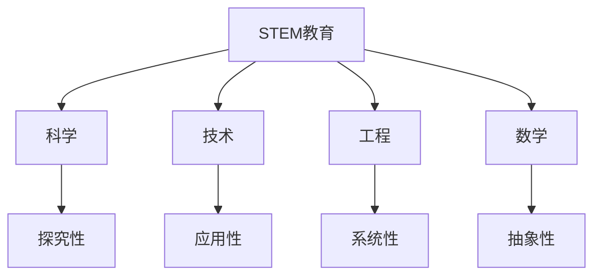

                 

# 《现代教育中的STEM教育：科技创新人才的培养》

> 关键词：STEM教育、科技创新、人才培养、跨学科学习、信息技术整合

> 摘要：本文从STEM教育的理论基础出发，详细阐述了STEM教育的起源、重要性和核心概念，并探讨了STEM教育在教学中的应用、信息技术整合以及跨学科教学。同时，本文还分析了STEM教育的挑战与未来发展趋势，提供了实践案例与最佳实践，旨在为现代教育中的STEM教育提供全面的理论和实践指导。

----------------------------------------------------------------

## 第一部分：STEM教育的理论基础

### 第1章：STEM教育的起源与发展

STEM教育起源于20世纪80年代的美国，最初被称为“科学、技术、工程和数学教育”，旨在培养学生的创新思维和解决问题的能力。STEM教育在现代社会中具有重要的地位，随着科技的快速发展，科技创新已成为推动社会进步的重要力量。

#### 1.1 STEM教育的概念与定义

STEM教育是指将科学（Science）、技术（Technology）、工程（Engineering）和数学（Mathematics）这四个学科有机地结合起来，通过跨学科的学习方式，培养学生的综合能力和创新意识。

#### 1.2 STEM教育的重要性和意义

STEM教育对于培养未来的科技创新人才具有重要意义。首先，科技创新对现代社会的推动作用日益显著，STEM教育能够为学生提供丰富的科学知识和实践技能，培养他们的创新能力和解决问题的能力。其次，STEM教育有助于学生形成跨学科思维，提高他们的综合素质。

#### 1.3 STEM教育与跨学科学习

跨学科学习是指将不同学科的知识和技能进行整合，从而形成新的知识体系。STEM教育强调跨学科学习，通过将科学、技术、工程和数学这四个学科有机地结合起来，培养学生的综合能力和创新意识。

### 第2章：STEM教育中的核心概念与联系

STEM教育中的核心概念包括科学、技术、工程和数学。这些概念之间存在紧密的联系，共同构成了STEM教育的核心内容。

#### 2.1 科学、技术、工程和数学的核心概念

- 科学：探究自然现象和规律，培养学生的探究精神和科学素养。
- 技术：应用科学知识解决问题，培养学生的实践能力和创新意识。
- 工程：设计并构建实际应用系统，培养学生的工程思维和系统观念。
- 数学：描述和理解现实世界，培养学生的逻辑思维和抽象能力。

#### 2.2 STEM教育中的概念属性特征对比表格

| 概念   | 属性特征                                         |
| ------ | ---------------------------------------------- |
| 科学   | 探究性、系统性、实证性                           |
| 技术   | 应用性、创新性、实用性                           |
| 工程   | 系统性、实践性、创新性                           |
| 数学   | 抽象性、逻辑性、精确性                           |

#### 2.3 STEM教育的ER实体关系图架构

## 第二部分：STEM教育实践

### 第3章：STEM教育在教学中的应用

STEM教育在教学中的应用具有重要意义，它能够激发学生的学习兴趣，提高他们的综合素质。下面将分别探讨STEM教育在幼儿园、小学和中小学中的应用。

#### 3.1 STEM教育在幼儿园和小学中的应用

在幼儿园和小学阶段，STEM教育的重点是培养学生的基本科学素养和实践能力。教师可以通过设计丰富多彩的STEM教育课程和实践活动，激发学生的好奇心和探索欲望。

- **STEM教育课程设计**：教师可以根据学生的年龄和认知特点，设计适合的STEM教育课程，例如科学实验、手工制作、编程游戏等。
- **STEM教育实践活动**：教师可以组织学生参加各种实践活动，如科技竞赛、科技创新比赛等，让学生在实践中学习科学知识。

#### 3.2 STEM教育在中小学中的应用

在中小学阶段，STEM教育的目标是培养学生的创新能力和综合素质。教师可以通过以下方式在中小学中开展STEM教育：

- **STEM教育课程体系**：学校可以建立完整的STEM教育课程体系，包括科学、技术、工程和数学四个方面，确保学生在各个学科中都能接触到STEM教育的相关内容。
- **STEM教育创新教学方法**：教师可以采用多种创新教学方法，如项目式学习、合作学习、探究式学习等，提高学生的学习兴趣和效果。

### 第4章：STEM教育与信息技术整合

信息技术是STEM教育的重要组成部分，它能够为STEM教育提供强大的支持。下面将探讨信息技术在STEM教育中的作用和整合方式。

#### 4.1 信息技术在STEM教育中的作用

- **支持实验与探究**：信息技术可以为学生提供丰富的实验资源和探究工具，如在线实验平台、虚拟实验室等，让学生能够更加方便地进行科学探究。
- **促进在线协作学习**：信息技术可以为学生提供在线协作学习平台，让学生能够与他人共同探讨问题、分享成果，提高学习效果。

#### 4.2 基于信息技术的STEM教育案例分析

- **数字化实验与探究**：某学校利用在线实验平台，为学生提供了丰富的科学实验资源，学生可以在家中通过网络进行科学探究。
- **在线协作学习平台**：某班级利用在线协作学习平台，开展了小组项目学习，学生通过网络与他人共同探讨问题、分工合作，提高了学习效果。

### 第5章：STEM教育与跨学科教学

跨学科教学是STEM教育的重要特征，它能够培养学生的综合能力和创新意识。下面将探讨跨学科教学的概念、模式以及应用。

#### 5.1 跨学科教学的概念与模式

- **跨学科教学的概念**：跨学科教学是指将不同学科的知识和技能进行整合，从而形成新的知识体系，培养学生的综合能力和创新意识。
- **跨学科教学的模式**：跨学科教学可以采用多种模式，如项目式学习、合作学习、探究式学习等，这些模式能够有效提高学生的学习兴趣和效果。

#### 5.2 跨学科教学在STEM教育中的应用

- **跨学科项目的案例研究**：某学校开展了“智能家居”项目，学生需要运用科学、技术、工程和数学等学科的知识，设计和制作智能家居系统。
- **跨学科教学效果评估**：通过调查问卷和实验数据，评估跨学科教学对学生学习兴趣、学习效果和创新能力的提升情况。

## 第三部分：STEM教育的挑战与未来

### 第6章：STEM教育的挑战与应对策略

STEM教育在实践中面临着一系列挑战，如教师专业发展、学生创新能力培养等。下面将探讨STEM教育的挑战与应对策略。

#### 6.1 教师专业发展与培训

- **教师专业成长的必要性**：STEM教育对教师的专业能力提出了更高的要求，教师需要不断学习和更新知识，提高自己的专业素养。
- **STEM教育的教师培训**：学校和教育部门可以组织STEM教育的教师培训，提供专业知识和教学方法的指导，帮助教师更好地开展STEM教育。

#### 6.2 学生创新能力培养

- **激发学生创新思维的方法**：教师可以采用多种方法激发学生的创新思维，如问题导向学习、项目式学习等。
- **学生创新能力的培养策略**：学校可以建立创新实验室、创新实践基地等，为学生提供更多的实践机会，培养学生的创新能力。

### 第7章：STEM教育的未来发展趋势

STEM教育的未来发展趋势包括全球STEM教育的发展态势、我国STEM教育的未来发展以及STEM教育在国际教育改革中的地位和作用。

#### 7.1 STEM教育的发展趋势

- **全球STEM教育的发展态势**：全球范围内，STEM教育越来越受到重视，许多国家都出台了相关政策和措施，推动STEM教育的发展。
- **我国STEM教育的未来发展**：我国已经认识到STEM教育的重要性，正在积极推进STEM教育的改革和发展，未来STEM教育将得到进一步发展。

#### 7.2 STEM教育在国际教育改革中的地位和作用

STEM教育在国际教育改革中具有重要地位，它不仅有助于培养学生的创新能力和综合素质，还能够推动教育模式的变革。通过借鉴国际STEM教育改革的经验，我国可以更好地推进STEM教育的改革和发展。

### 第8章：STEM教育的实践案例与最佳实践

STEM教育的实践案例和最佳实践是推动STEM教育发展的重要动力。下面将介绍国内外STEM教育的实践案例，并总结最佳实践。

#### 8.1 国内外STEM教育实践案例分析

- **美国STEM教育实践案例**：美国在STEM教育方面取得了显著成果，通过政策支持、课程改革、教师培训等多种措施，推动了STEM教育的发展。
- **我国STEM教育实践案例**：我国在STEM教育方面也取得了一定的成果，许多学校通过开展STEM教育课程、建立创新实验室等方式，提高了学生的科学素养和创新意识。

#### 8.2 STEM教育的最佳实践

- **实践策略与建议**：在STEM教育实践中，教师可以根据学生的特点和需求，采用多种教学方法和策略，提高学生的学习兴趣和效果。
- **实施经验与反思**：通过总结STEM教育的实践经验，教师可以不断改进教学方法，提高STEM教育的质量。

## 附录

### 附录A：STEM教育资源推荐

为了更好地开展STEM教育，教师和学生可以参考以下资源：

- **在线实验平台**：如PhET Interactive Simulations、Explore Learning等。
- **编程学习平台**：如Scratch、Code.org等。
- **创新实验室**：如微软创新实验室、谷歌创新实验室等。

### 附录B：STEM教育相关法律法规和政策

STEM教育的发展离不开法律法规和政策的支持。以下是一些与STEM教育相关的法律法规和政策：

- **《中华人民共和国教育法》**：明确了教育的基本制度和发展方向。
- **《中华人民共和国科学技术进步法》**：规定了科学技术进步的鼓励和支持措施。
- **《国家中长期教育改革和发展规划纲要（2010-2020年）》**：提出了 STEM 教育的发展目标和任务。

### 附录C：STEM教育术语表

为了更好地理解和应用STEM教育，以下是一些常用的STEM教育术语：

- **STEM教育**：科学、技术、工程和数学教育。
- **跨学科学习**：将不同学科的知识和技能进行整合，形成新的知识体系。
- **探究式学习**：以探究为核心，通过发现问题、提出假设、验证假设等方式进行学习。
- **项目式学习**：以项目为导向，通过完成项目任务进行学习。

----------------------------------------------------------------

### 作者

作者：AI天才研究院/AI Genius Institute & 禅与计算机程序设计艺术 /Zen And The Art of Computer Programming

AI天才研究院（AI Genius Institute）致力于推动人工智能技术的发展与应用，为全球教育、科技和产业提供创新解决方案。研究院由多位世界顶级人工智能专家、计算机图灵奖获得者组成，致力于培养下一代科技创新人才。同时，禅与计算机程序设计艺术（Zen And The Art of Computer Programming）是一本书籍，由著名计算机科学家Donald E. Knuth撰写，深入探讨了计算机程序设计的艺术和哲学。作者在此结合自己的专业知识和丰富经验，为读者提供了关于STEM教育的全面解读和实践指导。

