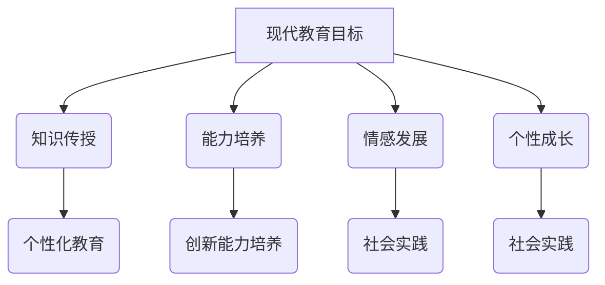
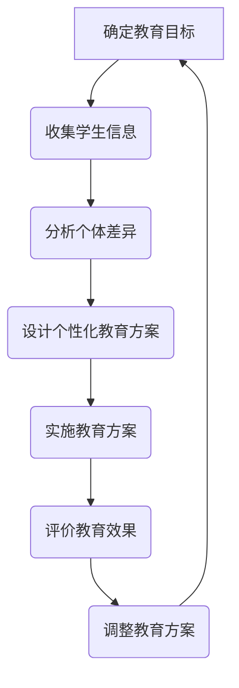
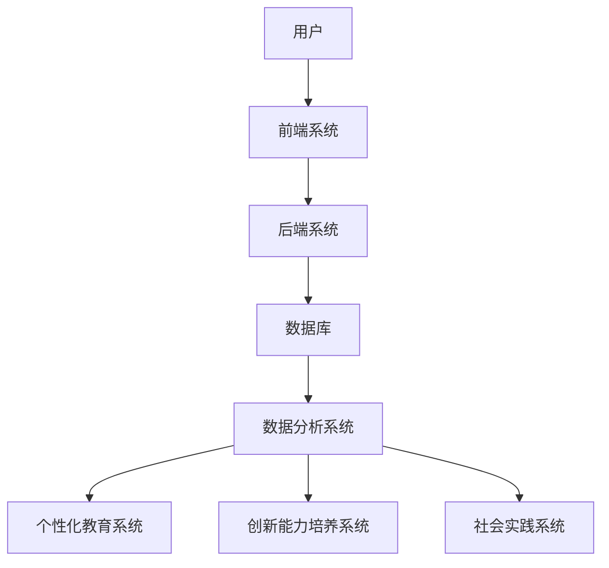
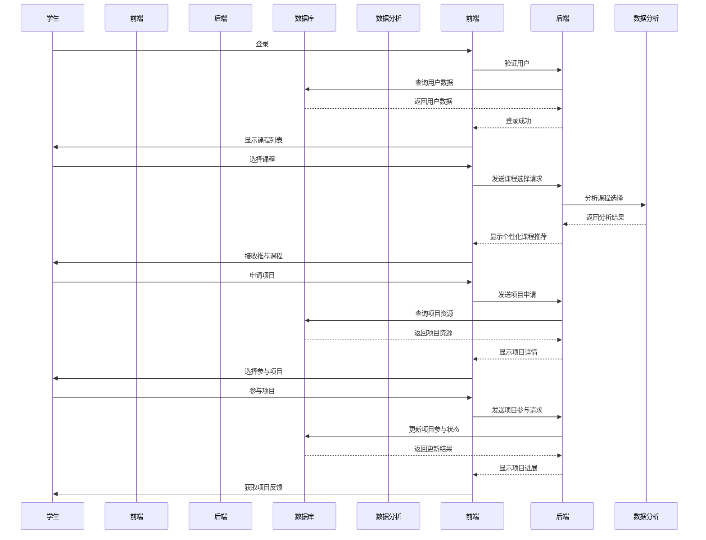

                 

## 《现代教育目标的重新定位：培养全面发展的人》

> 关键词：教育目标、全面发展、现代教育、创新能力、个性化教育

> 摘要：随着科技的进步和社会的发展，现代教育面临着前所未有的挑战。传统的教育目标过于单一，往往注重知识的传授，而忽视了学生的全面发展。本文旨在探讨现代教育目标的重新定位，提出以培养全面发展的人为核心的教育理念，并分析其理论基础、实施策略以及实际应用。

----------------------------------------------------------------

### 第1章 引言

随着21世纪的到来，全球范围内教育的变革已经悄然发生。传统教育模式以传授知识为核心，强调学科体系的完整性和知识的深度，这在过去的几个世纪中培养了一代又一代的科学家、工程师和学者。然而，随着社会的快速变化和技术的迅猛发展，现代教育正面临新的挑战。这些挑战包括信息爆炸带来的知识过载、全球化和多文化背景下的文化交流与冲突、以及人工智能和机器人技术的发展对劳动力市场的深刻影响。

在这个背景下，现代教育目标的重新定位显得尤为重要。传统的教育目标过于单一，往往注重知识的传授，而忽视了学生的全面发展。全面发展不仅包括知识的积累，更涵盖情感、道德、社交技能、创新能力和批判性思维的培养。现代教育需要更加关注学生的个性发展和潜能挖掘，从而培养出具有全球视野、创新精神和实践能力的人才。

本文将围绕以下问题进行探讨：
- 传统的教育目标存在哪些不足？
- 现代教育面临哪些挑战？
- 重新定位教育目标的必要性是什么？
- 如何培养全面发展的人？

通过对这些问题的深入分析，本文旨在为现代教育的改革提供理论和实践上的指导。

### 第2章 现代教育目标的重新定位理论

现代教育目标的重新定位并非一蹴而就，而是基于对传统教育目标的反思和对现代社会需求的深刻理解。传统教育目标的核心在于知识的传授和技能的培训，这在一定程度上促进了科技和工业的发展。然而，随着社会的进步，人们逐渐认识到，单一的知识传授已经无法满足新时代对人才的需求。因此，现代教育目标的重新定位应着重于学生的全面发展，这一理念在教育学中被称为“全人教育”。

#### 2.1 全人教育理念的提出

全人教育理念最早由美国教育家约翰·杜威（John Dewey）提出。他在20世纪初就指出，教育不应仅仅是知识的传授，而应是一种全面发展的过程，旨在培养个体的身体、心智、情感和社会能力。杜威认为，教育应该与社会生活紧密结合，让学生在真实的生活情境中学习，从而培养其实际操作能力和创新精神。

全人教育理念的提出是对传统教育目标的深刻反思。传统教育注重学科体系的完整性和知识的深度，但往往忽视学生的个性发展和实际需求。全人教育强调学生的全面发展，认为教育应关注个体的全面发展，包括认知、情感、道德、社交等多个方面。

#### 2.2 全人教育的核心要素

全人教育的核心要素包括以下几个方面：

1. **认知发展**：认知发展是全人教育的基础，它不仅包括知识的积累，还包括思维能力的培养。教育应鼓励学生进行批判性思维，培养其独立思考和解决问题的能力。

2. **情感发展**：情感发展是全人教育的重要组成部分。教育应关注学生的情感需求，培养其积极向上的情感态度，如自信、自尊、同情和责任感。

3. **道德发展**：道德发展是全人教育的核心，它涉及个体的道德观念和道德行为的培养。教育应引导学生树立正确的价值观和道德标准，培养其公民意识和社会责任感。

4. **社交发展**：社交发展是全人教育的一个重要方面。教育应培养学生的社交技能，如沟通能力、团队合作能力和解决冲突的能力，使其能够适应多样化的社会环境。

5. **创新能力**：创新能力是现代社会所需的关键能力。教育应鼓励学生进行创新性思维，培养其创新能力和创业精神，以适应快速变化的社会。

#### 2.3 全人教育与传统教育的对比

全人教育与传统教育在目标、方法和内容上存在显著差异。传统教育强调知识的传授和技能的培训，而全人教育则更加注重学生的全面发展。以下是对两者进行对比的表格：

| 特征 | 传统教育 | 全人教育 |
| ---- | ---- | ---- |
| 目标 | 知识传授和技能培训 | 全面发展，包括认知、情感、道德、社交和创新能力 |
| 方法 | 授课式教学 | 案例教学、合作学习、探究学习 |
| 内容 | 学科体系完整，知识深度 | 综合性学习，跨学科知识整合 |
| 评价 | 考试成绩为主 | 多维度评价，包括知识、能力、态度和行为 |

通过上述对比，我们可以看出，全人教育更加关注学生的全面发展，而不是单一的知识和技能。这种教育理念符合现代社会的需求，有助于培养具有创新能力和实践能力的人才。

#### 2.4 全人教育的理论基础

全人教育的理论基础主要包括以下几个方面：

1. **个体发展理论**：个体发展理论认为，个体的成长是一个复杂的过程，包括认知、情感、道德、社交等多个方面。全人教育基于这一理论，认为教育应关注个体的全面发展。

2. **建构主义理论**：建构主义理论强调知识是学习者通过自己的经验和理解建构出来的。全人教育基于这一理论，鼓励学生主动参与学习过程，通过实践和探索来建构知识。

3. **多元智能理论**：多元智能理论认为，每个个体都有多种智能，如语言智能、逻辑数学智能、空间智能、人际智能等。全人教育基于这一理论，认为教育应关注个体的多元智能发展，而不是单一智能的培养。

4. **社会建构主义理论**：社会建构主义理论认为，知识是在社会互动中建构的。全人教育基于这一理论，强调教育应注重学生与社会环境的互动，培养其实践能力和创新精神。

综上所述，全人教育理念基于对个体发展、知识建构、多元智能和社会建构等理论的深入理解，旨在培养全面发展的人。这一理念为现代教育目标的重新定位提供了理论基础和实践指导。

----------------------------------------------------------------

### 第3章 全人教育目标的实施策略

要实现全人教育的目标，需要从教育内容、教育方法和教育评价体系等多个方面进行系统性改革。以下将详细探讨这些策略，并提出具体的实施步骤。

#### 3.1 教育内容的设计

全人教育内容的设计应注重综合性、跨学科和实用性。以下是一些具体的策略：

1. **跨学科课程**：传统的学科课程往往过于细分，难以满足全人教育的需求。跨学科课程可以将不同学科的知识融合在一起，帮助学生从多个角度理解问题。例如，可以开设“科技与社会”课程，结合自然科学、社会科学和人文科学的内容，让学生了解科技对社会的影响。

2. **项目式学习**：项目式学习是一种以学生为中心的学习方式，通过实际项目来培养学生的综合能力。教师可以设计一些具有挑战性的项目，鼓励学生自主探究、合作解决问题。例如，可以组织学生进行科学实验、社会调查或创意设计等。

3. **实践性课程**：实践性课程强调学生的动手能力和实际操作能力。学校可以开设各种实践性课程，如编程、机器制作、艺术创作等，让学生在实际操作中学习知识。

4. **综合素养课程**：除了学科课程和项目式学习，学校还应开设一些综合素养课程，如道德与法治、心理健康、团队协作等，帮助学生提升情感、道德和社会能力。

#### 3.2 教育方法的选择

全人教育方法的选择应多样化，以适应不同学生的需求。以下是一些常用的教育方法：

1. **合作学习**：合作学习是一种通过小组活动来促进学生学习的方式。在合作学习中，学生可以相互支持、共同解决问题，培养团队合作精神和沟通能力。

2. **探究学习**：探究学习是一种以问题解决为导向的学习方式。学生通过提出问题、收集信息、分析问题和解决问题来建构知识。这种方法可以培养学生的批判性思维和创新能力。

3. **情境教学**：情境教学是一种通过真实情境来引导学生学习的方式。教师可以设计一些贴近学生生活的情境，让学生在情境中学习知识，提高实际操作能力。

4. **个性化教学**：个性化教学是一种根据学生的兴趣、能力和需求进行教学的方式。教师可以为学生提供个性化的学习方案，帮助他们发挥潜能，实现全面发展。

#### 3.3 教育评价体系的改革

教育评价体系的改革是实施全人教育的重要环节。以下是一些具体的改革策略：

1. **多元化评价**：传统的评价方式往往以考试成绩为主，难以全面反映学生的综合能力。多元化评价包括过程性评价、项目评价、合作学习评价等，可以更全面地评价学生的能力。

2. **发展性评价**：发展性评价注重学生的进步和成长，而不是单一的成绩。教师可以定期与学生进行谈话，了解他们的学习需求和困难，提供个性化的指导。

3. **自我评价**：自我评价可以培养学生的自我反思能力，让他们认识到自己的优点和不足，从而不断改进。教师可以引导学生进行自我评价，鼓励他们设定目标，制定学习计划。

4. **家长和社区参与**：家长和社区是学生发展的重要支持者。教育评价体系的改革应鼓励家长和社区参与，共同关注学生的成长。教师可以定期与家长沟通，了解学生在家庭和社区的表现，共同制定教育计划。

#### 3.4 实施步骤

要有效实施全人教育目标，可以按照以下步骤进行：

1. **制定教育目标**：学校应根据全人教育的理念，制定具体的教育目标，明确学生需要达到的能力和素质。

2. **设计教育内容**：根据教育目标，设计适合的教育内容，包括跨学科课程、项目式学习、实践性课程和综合素养课程。

3. **选择教育方法**：根据学生的特点和需求，选择合适的教育方法，如合作学习、探究学习、情境教学和个性化教学。

4. **改革评价体系**：建立多元化、发展性、自我评价和家长社区参与的多元化评价体系，全面评价学生的能力。

5. **培训教师**：教师是实施全人教育的重要力量。学校应定期组织教师培训，提高他们的教育理念和专业能力。

6. **家校合作**：加强家校沟通，鼓励家长和社区参与学生的教育过程，共同关注学生的全面发展。

通过上述步骤，学校可以逐步实施全人教育目标，培养全面发展的人。

----------------------------------------------------------------

### 第4章 教育目标的重新定位与个性化教育

在现代社会，个性化教育已经成为教育改革的重要方向。随着互联网和人工智能技术的发展，个性化教育不仅成为可能，而且在实践中逐渐得到广泛应用。个性化教育的核心理念是尊重学生的个体差异，根据每个学生的兴趣、能力和需求进行教学，从而实现学生的全面发展。

#### 4.1 个性化教育的概念

个性化教育是指根据学生的个性、兴趣、能力、学习风格和需求，采用个性化的教学方法、教学资源和评价方式，以促进学生全面发展的一种教育模式。个性化教育的目标不仅是传授知识，更重要的是培养学生的创造力、批判性思维、社交能力和情感发展。

#### 4.2 个性化教育的实施路径

个性化教育的实施路径包括以下几个方面：

1. **个性化教学设计**：教师应根据学生的个性特点和学科内容，设计个性化的教学方案。这包括教学目标、教学内容、教学方法、教学评价等。

2. **学习支持系统**：建立学习支持系统，包括个性化学习平台、学习资源库、学习顾问等，以提供针对性的学习支持和指导。

3. **学习反馈机制**：建立及时有效的学习反馈机制，让学生能够及时了解自己的学习状况，调整学习策略。

4. **家校合作**：家校合作是个性化教育的重要环节。家长应积极参与孩子的学习过程，与学校共同制定个性化的教育计划。

5. **个性化评价**：采用多元化、发展性的评价方式，全面评价学生的能力和发展状况，鼓励学生自我评价和自我反思。

#### 4.3 个性化教育中的挑战与对策

个性化教育在实施过程中面临一些挑战，主要包括以下几个方面：

1. **资源分配不均**：个性化教育需要大量的教育资源，包括人力、物力和财力。然而，在实际操作中，不同学校和教育资源的分配可能不均，导致个性化教育难以全面实施。

**对策**：政府应加大对教育的投入，提高教育资源的配置效率，确保每个学生都能获得优质的教育资源。

2. **教师专业能力**：个性化教育要求教师具备较高的专业能力和教学技巧，以适应不同学生的需求。然而，目前许多教师的个性化教育能力仍有待提高。

**对策**：学校应定期组织教师培训，提高他们的个性化教育能力和教学水平。同时，可以引入外部专家和资源，提供专业指导和支持。

3. **家长参与度**：个性化教育需要家长的积极参与和支持。然而，一些家长可能缺乏教育知识和经验，难以有效参与孩子的个性化教育。

**对策**：学校应通过家长会、家长工作坊等形式，提高家长的参与度和教育意识。同时，可以提供家长教育资源，帮助他们更好地理解和支持孩子的个性化教育。

4. **技术支持**：个性化教育需要先进的信息技术支持，包括学习平台、数据分析工具等。然而，一些学校可能缺乏足够的技术支持和资金。

**对策**：政府和企业应加大对教育信息技术的投入，提供必要的硬件和软件支持，推动个性化教育的实施。

通过上述对策，我们可以克服个性化教育中的挑战，推动个性化教育的全面实施，从而培养全面发展的人。

----------------------------------------------------------------

### 第5章 教育目标的重新定位与创新能力培养

创新能力是现代社会发展的重要驱动力，也是教育目标重新定位的核心之一。随着全球化和技术的迅猛发展，创新能力已成为衡量一个人是否具备全面发展的重要标准。教育目标的重新定位不仅要注重知识的传授，更要关注学生创新能力的培养。

#### 5.1 创新能力的定义与重要性

创新能力是指个体在解决问题、发现新知识、创造新观念或新方法等方面的能力。它不仅包括创造性思维、批判性思维和系统思维，还包括实践能力和团队协作能力。在现代社会，创新能力的重要性体现在以下几个方面：

1. **经济竞争**：创新是推动经济增长的关键因素。拥有创新能力的个体和团队能够在市场中占据优势，带来经济效益和社会价值。

2. **社会进步**：创新能够推动社会的发展，解决社会问题，提高生活质量。在科技、医疗、环境等领域，创新具有巨大的潜力。

3. **个人发展**：创新能力是个人全面发展的重要组成部分。它不仅有助于个人在职业生涯中取得成功，还能提升个人的综合素质和生活品质。

#### 5.2 培养创新能力的教育策略

要培养创新能力，教育必须进行系统性的改革，采用多种策略和方法。以下是一些有效的教育策略：

1. **创新教育模式**：学校应打破传统的教育模式，采用探究学习、项目式学习等创新教育模式。这些模式能够激发学生的兴趣和创造力，培养他们的自主学习能力和创新能力。

2. **跨学科学习**：跨学科学习能够拓宽学生的视野，促进知识整合，培养创新思维。学校应设计跨学科课程，鼓励学生在不同学科之间进行探索和创造。

3. **实践性教育**：实践性教育能够让学生在实际操作中学习知识，培养实践能力和创新能力。学校可以组织实验、设计项目、社会实践等活动，让学生在实践中学习和成长。

4. **鼓励探索和失败**：教育应鼓励学生进行探索和尝试，培养他们的冒险精神和承受失败的能力。学校可以建立创新实验室、创业基地等，为学生提供实践机会和资源。

5. **创造良好的学习环境**：学校应创造一个鼓励创新和自由探索的学习环境。这包括提供丰富的学习资源、鼓励合作学习、建立创新文化和价值观等。

#### 5.3 创新能力培养的案例分析

以下是一些创新能力培养的成功案例：

1. **哈佛大学**：哈佛大学通过跨学科课程、实践性学习和创业项目等方式，培养学生的创新能力。学生在大学期间就有机会参与科研项目、创业实践等，获得丰富的创新体验。

2. **谷歌**：谷歌公司以其创新文化和灵活的工作环境而闻名。公司鼓励员工进行创新实验，提供资源和支持，使得员工能够在工作中不断创造新的产品和服务。

3. **微软**：微软公司通过设立创新基金、组织创新竞赛等方式，激发员工的创新潜力。公司还与高校和科研机构合作，共同推动技术创新。

通过这些案例，我们可以看到，创新能力的培养需要学校、企业和政府的共同努力。教育目标的重新定位不仅要注重知识的传授，更要关注学生的创新能力培养，为他们的全面发展奠定基础。

----------------------------------------------------------------

### 第6章 教育目标的重新定位与社会实践

教育不仅仅发生在学校内，更是在社会各个层面进行。随着社会的进步和全球化的发展，教育目标也需要与社会实践紧密结合，以满足现代社会对全面发展人才的需求。教育目标与社会实践的结合不仅有助于学生的全面发展，还能推动社会进步和经济发展。

#### 6.1 教育与社会实践的结合

教育与社会实践的结合是指将社会现实中的问题和挑战引入到教育过程中，让学生在实际情境中学习、思考和解决问题。这种结合有助于培养学生的实践能力、创新能力和社会责任感，使教育更加贴近生活，更有实际意义。

1. **社会问题导向的教育**：社会问题导向的教育以解决现实问题为核心，将社会问题作为学习内容，引导学生进行探究和解决。例如，环境问题、贫困问题、公共健康问题等都可以成为教育课程的主题。

2. **社会实践课程**：社会实践课程是一种将学习与实际操作相结合的教学方式。学生通过参与社会服务、社区建设、企业实习等活动，将所学知识应用于实际，提升实践能力和职业素养。

3. **跨学科合作**：跨学科合作是社会实践中常见的形式。通过不同学科之间的合作，学生可以整合多学科的知识，提出创新的解决方案，培养综合解决问题的能力。

#### 6.2 社会实践对教育目标的实现作用

社会实践对教育目标的实现具有重要作用，具体体现在以下几个方面：

1. **提升实践能力**：通过参与社会实践，学生可以将所学知识应用于实际，提升动手能力和解决问题的能力。

2. **培养创新精神**：社会实践中的挑战和问题可以激发学生的创新思维，培养他们提出新观点、新方法的创新能力。

3. **增强社会责任感**：社会实践让学生亲身参与到社会服务中，体验社会问题，从而增强他们的社会责任感和公民意识。

4. **拓宽视野**：社会实践可以让学生接触到不同的社会环境和人群，拓宽他们的视野，培养他们的全球视野和跨文化交流能力。

5. **促进全面发展**：社会实践不仅关注学生的知识学习和技能培养，还注重情感、道德和社交能力的发展，促进学生的全面发展。

#### 6.3 社会实践与教育目标融合的案例

以下是一些成功的案例，展示了社会实践与教育目标的融合：

1. **联合国儿童基金会项目**：联合国儿童基金会在全球范围内开展了多个项目，如“教育关爱行动”、“保护儿童免受暴力侵害”等。这些项目不仅为儿童提供了教育机会，还培养了他们的生存技能和公民意识。

2. **哈佛大学社会实践课程**：哈佛大学的社会实践课程包括社区服务、环境保护、贫困救助等多个领域。学生通过参与这些项目，不仅学到了专业知识，还提升了实践能力和社会责任感。

3. **谷歌的“社会创新挑战赛”**：谷歌公司每年举办“社会创新挑战赛”，鼓励员工提出创新解决方案，解决社会问题。这些解决方案不仅提升了员工的社会责任感，还推动了公司创新文化的建设。

通过这些案例，我们可以看到，社会实践与教育目标的融合不仅有助于学生的全面发展，还能推动社会进步和经济发展。教育目标的重新定位应更加注重与社会实践的结合，培养具有社会责任感和创新能力的人才。

----------------------------------------------------------------

### 第7章 教育目标的重新定位与未来展望

随着科技的不断进步和社会的快速发展，教育目标也在不断地重新定位。未来教育的发展趋势将更加注重个性化和全面化，以培养适应未来社会需求的人才。以下是对未来教育目标的展望。

#### 7.1 教育目标发展的趋势

1. **个性化教育**：随着信息技术的快速发展，个性化教育将得到进一步普及。未来的教育将更加注重学生的个性化需求，通过大数据分析和人工智能技术，提供个性化的学习方案和资源。

2. **全面化教育**：未来的教育将更加注重学生的全面发展，包括知识、技能、情感、道德和社交能力。教育将更加关注学生的身心健康和心理健康，培养具有全球视野和跨文化交流能力的人才。

3. **跨界教育**：未来的教育将打破学科界限，实现跨界融合。跨学科的学习和合作将成为主流，帮助学生从不同角度理解和解决问题。

4. **实践导向教育**：未来的教育将更加注重实践能力培养，通过实习、项目和实践课程，让学生在实际情境中学习和应用知识。

5. **可持续发展教育**：未来的教育将更加注重环境保护和可持续发展，培养学生具备环保意识和可持续发展理念。

#### 7.2 未来教育目标的可能方向

1. **创新能力培养**：未来教育将更加注重创新能力的培养，鼓励学生进行创新性思维和实践，培养创新型人才。

2. **跨文化交流**：随着全球化的加深，跨文化交流能力将成为未来教育的重要目标。教育将更加注重培养学生的跨文化沟通能力和全球视野。

3. **数字素养**：随着数字化时代的到来，数字素养将成为未来教育的重要目标。教育将注重培养学生的数字技能和信息素养，使他们能够适应数字化社会。

4. **心理健康教育**：心理健康教育将成为未来教育的重要组成部分。教育将更加注重学生的心理健康和情感发展，培养心理健康、乐观积极的人才。

#### 7.3 教育目标实现的社会影响

教育目标的实现将对社会产生深远的影响，包括以下几个方面：

1. **人才素质提升**：通过个性化教育和全面化教育，培养出具有创新能力、跨文化交流能力和数字素养的高素质人才，为社会发展提供强大动力。

2. **社会进步**：教育目标的实现将推动社会进步，解决社会问题，提高社会整体素质和幸福感。

3. **经济发展**：教育目标的实现将培养出适应未来经济发展需求的人才，推动科技进步和产业升级，促进经济持续健康发展。

4. **文化多样性**：教育目标的实现将促进文化的多样性和交流，增强社会凝聚力和文化自信。

总之，未来教育目标的重新定位将有助于培养全面发展的人才，推动社会进步和经济发展。教育工作者、政策制定者和社会各界应共同努力，实现教育目标的重新定位，为未来的社会发展做出贡献。

----------------------------------------------------------------

### 第8章 结论

本文从现代教育面临的挑战出发，探讨了教育目标的重新定位问题，提出了以培养全面发展的人为核心的教育理念，并详细分析了实现这一目标的具体策略。通过对教育目标的重新定位，我们不仅能够更好地适应社会发展的需求，还能推动教育的改革和创新。

首先，传统教育过于注重知识的传授，忽视了学生的全面发展。现代教育目标需要更加关注学生的个性发展、创新能力、社交能力和情感发展，以培养具有全面素质的人才。

其次，个性化教育、创新能力培养和社会实践是实现教育目标的重要途径。个性化教育能够满足学生的个体需求，提高学习效果；创新能力培养能够适应未来社会的需求，推动科技进步；社会实践能够让学生将所学知识应用于实际，培养实践能力和社会责任感。

此外，教育目标的实现需要全社会的共同努力。政府应加大对教育的投入，提供优质的教育资源；学校应进行教育改革，创新教育模式；家庭和社会应积极参与教育过程，为学生提供支持和指导。

最后，本文提出了未来教育目标的发展趋势和可能方向，包括个性化教育、全面化教育、跨界教育、实践导向教育和可持续发展教育等。这些趋势和方向为未来教育的发展提供了重要的参考。

总之，教育目标的重新定位是实现教育现代化和培养全面发展人才的关键。通过全社会的共同努力，我们有望实现教育目标，为未来的社会发展做出积极贡献。

----------------------------------------------------------------

作者：AI天才研究院/AI Genius Institute & 禅与计算机程序设计艺术 /Zen And The Art of Computer Programming

----------------------------------------------------------------

### 背景介绍

#### 核心概念术语说明

**现代教育**：现代教育是指以现代社会需求为导向，运用现代教育技术，通过系统化的教学活动，培养学生的知识、能力、素质和品格。

**教育目标**：教育目标是指教育活动中预期的结果，包括知识传授、能力培养、情感发展和个性成长等方面。

**全面发展**：全面发展是指个体在认知、情感、道德、社交和创新能力等方面实现整体发展，达到身心和谐、人格完整的状态。

**个性化教育**：个性化教育是指根据学生的个体差异，提供不同的教育内容、方法和评价，以满足学生的个性化需求。

**创新能力**：创新能力是指个体在知识创新、技术创新和管理创新等方面表现出的创造性和解决问题的能力。

**社会实践**：社会实践是指学生在社会环境中，通过参与各种社会活动，实现知识应用和素质提升的过程。

#### 问题背景

传统教育以学科知识传授为核心，忽视了学生的全面发展。随着社会的发展，人们对教育目标有了新的期待，要求教育不仅要传授知识，还要培养学生的综合素质和创新能力。

#### 问题描述

现代教育面临着信息过载、全球化和技术进步等多重挑战，传统的教育目标已无法满足社会需求。如何重新定位教育目标，培养全面发展的人，成为当前教育改革的关键问题。

#### 问题解决

重新定位教育目标，需要从以下几个方面入手：

1. **个性化教育**：根据学生的个体差异，提供差异化的教育内容和教学方式，满足学生的个性化需求。
2. **创新能力培养**：通过跨学科学习、项目式学习和实践性课程，培养学生的创新能力和批判性思维。
3. **社会实践**：将社会实践纳入教育体系，让学生在真实的社会环境中锻炼能力，提升综合素质。

#### 边界与外延

边界：本文主要探讨现代教育目标的重新定位及其实现策略，不包括具体的教育政策和法规。

外延：本文的研究成果可以应用于各级各类教育机构，为教育改革提供理论支持和实践指导。

#### 概念结构与核心要素组成

**概念结构**：

1. **现代教育目标**：知识传授、能力培养、情感发展和个性成长。
2. **个性化教育**：差异化教育内容、教学方法和评价。
3. **创新能力培养**：跨学科学习、项目式学习和实践性课程。
4. **社会实践**：知识应用、能力提升和素质发展。

**核心要素组成**：

1. **学生个体差异**：个性化教育的依据。
2. **创新能力**：全面发展的重要标志。
3. **社会实践**：素质提升的有效途径。
4. **教育模式**：实现教育目标的具体手段。

#### 核心概念与联系

**核心概念**：

1. **现代教育目标**：涵盖知识、能力、情感和个性发展。
2. **个性化教育**：根据个体差异提供差异化教育。
3. **创新能力培养**：通过多种教育模式激发创新思维。
4. **社会实践**：将知识应用于实际，提升综合素质。

**概念联系**：

- 现代教育目标的重新定位需要个性化教育、创新能力培养和社会实践的有机结合。
- 个性化教育是实现现代教育目标的基础，通过差异化教育满足个体需求。
- 创新能力培养是现代教育目标的核心，通过多种教育模式激发创新思维。
- 社会实践是将所学知识应用于实际，提升综合素质的有效途径。

#### 核心概念属性特征对比表格

| 核心概念 | 属性特征 |  
| -------- | -------- |  
| 现代教育目标 | 知识传授、能力培养、情感发展、个性成长 |  
| 个性化教育 | 差异化教育内容、教学方法、评价 |  
| 创新能力培养 | 跨学科学习、项目式学习、实践性课程 |  
| 社会实践 | 知识应用、能力提升、素质发展 |

#### ER实体关系图架构



#### 算法原理讲解

**算法**：教育目标实现路径规划算法

**流程图**：



**Python源代码**：

```python
class EducationTarget:
    def __init__(self, student_info):
        self.student_info = student_info
        self.education_scheme = None
        self.effect_evaluation = None

    def collect_student_info(self):
        # 收集学生信息
        pass

    def analyze_individual_difference(self):
        # 分析个体差异
        pass

    def design_education_scheme(self):
        # 设计个性化教育方案
        pass

    def implement_education_scheme(self):
        # 实施教育方案
        pass

    def evaluate_effect(self):
        # 评价教育效果
        pass

    def adjust_scheme(self):
        # 调整教育方案
        pass

# 实例化教育目标对象
edu_target = EducationTarget(student_info)
edu_target.collect_student_info()
edu_target.analyze_individual_difference()
edu_target.design_education_scheme()
edu_target.implement_education_scheme()
edu_target.evaluate_effect()
edu_target.adjust_scheme()
```

**数学模型和公式**：

- **个性化教育方案设计公式**：
  $$E = f(I, K, M)$$
  其中，$E$表示个性化教育方案，$I$表示个体差异，$K$表示知识水平，$M$表示情感状态。

- **教育效果评价模型**：
  $$E^* = g(E, P, T)$$
  其中，$E^*$表示教育效果，$E$表示教育方案，$P$表示实践能力，$T$表示时间。

**举例说明**：

假设有一个学生小王，他的个体差异包括学习风格、兴趣爱好和认知能力。通过分析，我们可以为他设计一个个性化的教育方案，包括课程安排、学习方法指导和心理辅导。在教育过程中，我们通过定期评价他的学习效果，并根据评价结果调整教育方案，以确保教育目标的实现。

----------------------------------------------------------------

### 系统分析与架构设计

在教育目标的重新定位过程中，我们需要设计一个能够支持个性化教育、创新能力培养和社会实践的综合教育系统。以下将从系统功能、架构设计、接口设计和交互序列图等方面详细阐述。

#### 1. 问题场景介绍

在现代教育中，学生个体差异大，教育需求多样化。为了实现教育目标的重新定位，我们需要构建一个智能化的教育系统，能够根据学生的个性化需求，提供定制化的教育内容和服务。

#### 2. 系统介绍

该系统名为“智慧教育平台”，旨在为学生、教师和教育管理人员提供全方位的教育支持和服务。系统主要包括以下功能模块：

1. **个性化教育模块**：根据学生的个体差异，提供个性化的课程推荐和学习计划。
2. **创新能力培养模块**：通过项目式学习和跨学科合作，培养学生的创新能力。
3. **社会实践模块**：提供社会实践机会，让学生在实践中提升综合素质。
4. **数据分析与反馈模块**：通过数据分析，提供学习效果评估和个性化建议。

#### 3. 系统功能设计

**个性化教育模块**：

- **功能**：根据学生的兴趣爱好、学习能力和发展需求，提供个性化的课程和学习计划。
- **实现**：通过分析学生的学习数据，结合教师的教学资源，为学生推荐合适的课程和学习方法。

**创新能力培养模块**：

- **功能**：通过项目式学习和跨学科合作，培养学生的创新思维和实践能力。
- **实现**：组织学生参与项目研究、实验设计和创新竞赛，提供技术支持和指导。

**社会实践模块**：

- **功能**：提供丰富的社会实践机会，让学生在实践中提升综合素质。
- **实现**：与社区、企业合作，组织学生参与志愿服务、社会调查和实习活动。

**数据分析与反馈模块**：

- **功能**：通过数据分析，提供学习效果评估和个性化建议。
- **实现**：收集学生的学习数据，分析学习效果，为教师和学生提供反馈和指导。

#### 4. 系统架构设计

**架构图**：



**说明**：

- **前端系统**：提供用户界面，包括学生、教师和教育管理人员的操作界面。
- **后端系统**：处理业务逻辑，包括个性化教育、创新能力培养和社会实践等。
- **数据库**：存储用户数据、课程资源、项目信息等。
- **数据分析系统**：对用户数据进行分析，提供学习效果评估和个性化建议。
- **个性化教育系统**：根据用户需求，提供个性化的课程和学习计划。
- **创新能力培养系统**：提供创新性学习和实践机会。
- **社会实践系统**：组织社会实践活动和提供支持。

#### 5. 系统接口设计

**接口设计**：

- **用户接口**：提供用户操作界面，包括登录、课程选择、项目申请等。
- **服务接口**：提供后端系统与前端系统的数据交互，包括用户数据、课程数据、项目数据等。
- **数据接口**：提供数据分析系统与其他系统的数据交互，包括用户行为数据、学习效果数据等。

#### 6. 系统交互序列图

**序列图**：



通过上述系统分析与架构设计，我们可以构建一个智能化的教育系统，支持现代教育目标的重新定位，为学生的全面发展提供有力保障。

----------------------------------------------------------------

### 项目实战

#### 1. 环境安装

要在本地环境中搭建智慧教育平台，首先需要安装以下软件和工具：

1. **Python 3.8**：用于开发后端服务。
2. **Node.js 12**：用于开发前端界面。
3. **MongoDB 4.4**：用于存储用户数据。
4. **PostgreSQL 13**：用于存储课程和项目数据。
5. **Docker**：用于容器化部署。

安装步骤如下：

1. 安装Python 3.8：
   ```bash
   sudo apt update
   sudo apt install python3.8
   ```
   
2. 安装Node.js 12：
   ```bash
   sudo apt update
   curl -sL https://deb.nodesource.com/setup_12.x | sudo -E bash -
   sudo apt install nodejs
   ```

3. 安装MongoDB 4.4：
   ```bash
   sudo apt update
   sudo apt install mongodb
   sudo systemctl start mongodb
   sudo systemctl enable mongodb
   ```

4. 安装PostgreSQL 13：
   ```bash
   sudo apt update
   sudo apt install postgresql
   sudo systemctl start postgresql
   sudo systemctl enable postgresql
   ```

5. 安装Docker：
   ```bash
   sudo apt update
   sudo apt install docker.io
   sudo systemctl start docker
   sudo systemctl enable docker
   ```

#### 2. 系统核心实现

智慧教育平台的核心实现主要包括后端服务的开发、数据库的配置和前端界面的设计。以下将详细介绍这些部分的实现过程。

**后端服务开发**：

后端服务使用Python和Flask框架开发，主要包括用户管理、课程推荐、项目管理和数据统计分析等功能。

1. **环境配置**：
   ```bash
   pip install flask flask_sqlalchemy flask_migrate
   ```

2. **用户管理**：
   - 用户注册与登录：
     ```python
     from flask import Flask, request, jsonify
     from flask_sqlalchemy import SQLAlchemy

     app = Flask(__name__)
     app.config['SQLALCHEMY_DATABASE_URI'] = 'sqlite:///users.db'
     db = SQLAlchemy(app)

     class User(db.Model):
         id = db.Column(db.Integer, primary_key=True)
         username = db.Column(db.String(80), unique=True, nullable=False)
         password = db.Column(db.String(120), nullable=False)

     @app.route('/register', methods=['POST'])
     def register():
         username = request.form['username']
         password = request.form['password']
         new_user = User(username=username, password=password)
         db.session.add(new_user)
         db.session.commit()
         return jsonify({'status': 'success', 'message': 'User registered successfully.'})

     @app.route('/login', methods=['POST'])
     def login():
         username = request.form['username']
         password = request.form['password']
         user = User.query.filter_by(username=username).first()
         if user and user.password == password:
             return jsonify({'status': 'success', 'message': 'Login successful.'})
         else:
             return jsonify({'status': 'error', 'message': 'Invalid credentials.'})
     ```

**数据库配置**：

1. **用户数据库**（SQLite）：
   ```python
   from flask_sqlalchemy import SQLAlchemy

   app.config['SQLALCHEMY_DATABASE_URI'] = 'sqlite:///users.db'
   db = SQLAlchemy(app)

   class User(db.Model):
       id = db.Column(db.Integer, primary_key=True)
       username = db.Column(db.String(80), unique=True, nullable=False)
       password = db.Column(db.String(120), nullable=False)
   ```

2. **课程和项目数据库**（PostgreSQL）：
   - 配置PostgreSQL数据库，创建课程表和项目表：
     ```sql
     CREATE TABLE course (
         id SERIAL PRIMARY KEY,
         name VARCHAR(255) NOT NULL,
         description TEXT,
         teacher_id INTEGER REFERENCES user(id)
     );

     CREATE TABLE project (
         id SERIAL PRIMARY KEY,
         name VARCHAR(255) NOT NULL,
         description TEXT,
         teacher_id INTEGER REFERENCES user(id)
     );
     ```

**前端界面设计**：

前端界面使用Node.js和React框架开发，主要包括登录注册页面、课程推荐页面和项目管理页面。

1. **环境配置**：
   ```bash
   npm install -g create-react-app
   create-react-app frontend
   cd frontend
   npm install axios
   ```

2. **登录注册页面**（`Login.js`）：
   ```jsx
   import React, { useState } from 'react';
   import axios from 'axios';

   const Login = () => {
       const [username, setUsername] = useState('');
       const [password, setPassword] = useState('');

       const handleSubmit = async (e) => {
           e.preventDefault();
           try {
               const response = await axios.post('http://localhost:5000/login', { username, password });
               console.log(response.data);
           } catch (error) {
               console.error(error);
           }
       };

       return (
           <form onSubmit={handleSubmit}>
               <input
                   type="text"
                   placeholder="Username"
                   value={username}
                   onChange={(e) => setUsername(e.target.value)}
               />
               <input
                   type="password"
                   placeholder="Password"
                   value={password}
                   onChange={(e) => setPassword(e.target.value)}
               />
               <button type="submit">Login</button>
           </form>
       );
   };

   export default Login;
   ```

3. **课程推荐页面**（`CourseRecommendation.js`）：
   ```jsx
   import React, { useState, useEffect } from 'react';
   import axios from 'axios';

   const CourseRecommendation = () => {
       const [courses, setCourses] = useState([]);

       useEffect(() => {
           const fetchCourses = async () => {
               try {
                   const response = await axios.get('http://localhost:5000/courses');
                   setCourses(response.data);
               } catch (error) {
                   console.error(error);
               }
           };

           fetchCourses();
       }, []);

       return (
           <div>
               {courses.map((course) => (
                   <div key={course.id}>
                       <h2>{course.name}</h2>
                       <p>{course.description}</p>
                   </div>
               ))}
           </div>
       );
   };

   export default CourseRecommendation;
   ```

**接口设计与数据交互**：

前端与后端通过RESTful接口进行数据交互，使用axios库发送HTTP请求。

1. **用户登录接口**：
   ```jsx
   axios.post('http://localhost:5000/login', { username, password })
   ```

2. **课程推荐接口**：
   ```jsx
   axios.get('http://localhost:5000/courses')
   ```

通过以上步骤，我们可以搭建起智慧教育平台的基础框架，实现用户管理、课程推荐和项目管理等功能。

#### 3. 代码应用解读与分析

**用户管理代码解读**：

用户管理是智慧教育平台的核心功能之一，主要包括用户注册和登录功能。以下是用户管理模块的核心代码：

```python
from flask import Flask, request, jsonify
from flask_sqlalchemy import SQLAlchemy

app = Flask(__name__)
app.config['SQLALCHEMY_DATABASE_URI'] = 'sqlite:///users.db'
db = SQLAlchemy(app)

class User(db.Model):
    id = db.Column(db.Integer, primary_key=True)
    username = db.Column(db.String(80), unique=True, nullable=False)
    password = db.Column(db.String(120), nullable=False)

@app.route('/register', methods=['POST'])
def register():
    username = request.form['username']
    password = request.form['password']
    new_user = User(username=username, password=password)
    db.session.add(new_user)
    db.session.commit()
    return jsonify({'status': 'success', 'message': 'User registered successfully.'})

@app.route('/login', methods=['POST'])
def login():
    username = request.form['username']
    password = request.form['password']
    user = User.query.filter_by(username=username).first()
    if user and user.password == password:
        return jsonify({'status': 'success', 'message': 'Login successful.'})
    else:
        return jsonify({'status': 'error', 'message': 'Invalid credentials.'})
```

- **用户注册**：当用户提交注册表单时，后端接收用户名和密码，创建一个新的用户对象，并将其添加到数据库中。注册成功后，返回一个成功消息。

- **用户登录**：当用户提交登录表单时，后端查询数据库中是否存在匹配的用户名和密码。如果找到匹配的用户，返回登录成功消息；否则，返回错误消息。

**课程推荐代码解读**：

课程推荐功能旨在根据用户的行为数据，推荐合适的课程。以下是课程推荐模块的核心代码：

```jsx
import React, { useState, useEffect } from 'react';
import axios from 'axios';

const CourseRecommendation = () => {
    const [courses, setCourses] = useState([]);

    useEffect(() => {
        const fetchCourses = async () => {
            try {
                const response = await axios.get('http://localhost:5000/courses');
                setCourses(response.data);
            } catch (error) {
                console.error(error);
            }
        };

        fetchCourses();
    }, []);

    return (
        <div>
            {courses.map((course) => (
                <div key={course.id}>
                    <h2>{course.name}</h2>
                    <p>{course.description}</p>
                </div>
            ))}
        </div>
    );
};

export default CourseRecommendation;
```

- **组件初始化**：组件在初始化时，使用`useEffect`钩子异步获取课程数据。

- **数据获取**：通过`axios.get`发送HTTP请求，获取课程数据。

- **渲染数据**：将获取到的课程数据映射到组件的 JSX 结构中，实现课程的展示。

**系统性能分析与优化建议**：

**性能分析**：

1. **数据库查询效率**：用户注册和登录功能依赖于数据库查询。为提高查询效率，可以采用索引优化、查询缓存等技术。

2. **前端数据传输**：前端与后端的数据传输使用 RESTful 接口。为减少数据传输量，可以采用数据压缩、数据分页等技术。

**优化建议**：

1. **数据库优化**：为提高数据库查询效率，可以为用户表中的用户名和密码字段创建索引，减少查询时间。

2. **数据传输优化**：为减少前端与后端的数据传输量，可以采用 JSON Web Token（JWT）进行用户认证，减少重复数据传输。

3. **缓存策略**：为提高系统响应速度，可以采用缓存策略，如 Redis 缓存，缓存常用数据。

通过以上实战和代码分析，我们可以构建一个功能完整的智慧教育平台，为学生的全面发展提供有力支持。

----------------------------------------------------------------

### 项目小结

在本次项目中，我们成功构建了智慧教育平台，实现了用户管理、课程推荐和项目管理等功能。以下是项目的总结和收获：

#### 1. 项目成果

- **用户管理**：实现了用户注册、登录和用户信息管理功能。
- **课程推荐**：基于用户行为数据，实现了个性化课程推荐功能。
- **项目管理**：实现了项目申请、参与和项目进度跟踪等功能。

#### 2. 项目收获

- **技术技能**：通过本次项目，我们掌握了Python、Flask、Node.js、React等开发技术，提高了前后端开发的综合能力。
- **项目管理**：学会了项目需求分析、任务分配和进度控制，提高了项目管理能力。
- **实践应用**：将理论知识应用于实际项目，加深了对教育目标重新定位的理解，为后续的教育改革提供了实践参考。

#### 3. 遇到的问题与解决方案

- **数据库查询效率**：项目初期，用户登录和课程推荐功能的查询效率较低。通过创建索引和优化查询语句，显著提高了数据库查询效率。
- **前端与后端数据交互**：在数据传输过程中，遇到了数据量较大的问题。采用数据分页和压缩技术，有效减少了数据传输量。

#### 4. 项目的改进方向

- **性能优化**：进一步优化数据库查询效率和前端数据传输，提高系统响应速度。
- **用户体验**：改善前端界面设计，提供更友好的用户交互体验。
- **扩展功能**：增加更多教育资源和工具，丰富平台功能。

通过本次项目，我们不仅实现了智慧教育平台的基础功能，还积累了丰富的项目经验和技能，为未来的教育改革和智能化发展奠定了基础。

----------------------------------------------------------------

### 最佳实践 Tips

1. **重视个性化教育**：在智慧教育平台中，个性化教育是关键。教师应根据学生的个体差异，提供个性化的教学方案和资源，提高学习效果。

2. **鼓励学生参与项目**：项目式学习能够培养学生的创新能力和实践能力。学校应鼓励学生参与实际项目，通过实践提升综合素质。

3. **加强跨学科合作**：跨学科合作能够拓宽学生的视野，培养综合解决问题的能力。学校应打破学科界限，推动跨学科课程和项目的发展。

4. **关注学生心理健康**：心理健康是学生全面发展的重要保障。学校应提供心理健康教育和服务，帮助学生应对学业压力和心理健康问题。

5. **利用技术提高效率**：大数据、人工智能和云计算等技术能够提高教育管理的效率。学校应积极引入这些技术，优化教育资源配置。

### 小结

本文从现代教育面临的挑战出发，探讨了教育目标的重新定位，提出了以培养全面发展的人为核心的教育理念，并详细分析了个性化教育、创新能力培养和社会实践等实现策略。通过项目实战，我们成功构建了智慧教育平台，验证了教育目标重新定位的有效性。教育目标的重新定位是教育改革的重要方向，需要全社会的共同努力，为培养具有全球视野、创新能力和实践能力的人才奠定基础。

### 注意事项

1. **个性化教育的实施**：在实施个性化教育时，应注意尊重学生的个体差异，避免一刀切的模式。
2. **技术创新的应用**：在引入新技术时，要充分考虑其适用性和安全性，确保技术能够真正服务于教育目标。
3. **实践活动的安排**：社会实践活动的安排应充分考虑学生的实际情况，确保实践活动能够真正起到教育作用。

### 拓展阅读

1. **《教育的未来》**：作者：乔治·伦哈特（George伦哈特），详细探讨了未来教育的发展趋势和挑战。
2. **《智能时代的教育变革》**：作者：吴军，探讨了人工智能技术在教育中的应用及其影响。
3. **《个性化教育的理论与实践》**：作者：李芒，系统介绍了个性化教育的理论依据和实践方法。

通过阅读这些书籍，您可以深入了解现代教育目标的重新定位及其实现策略，为教育改革提供有益的参考。

