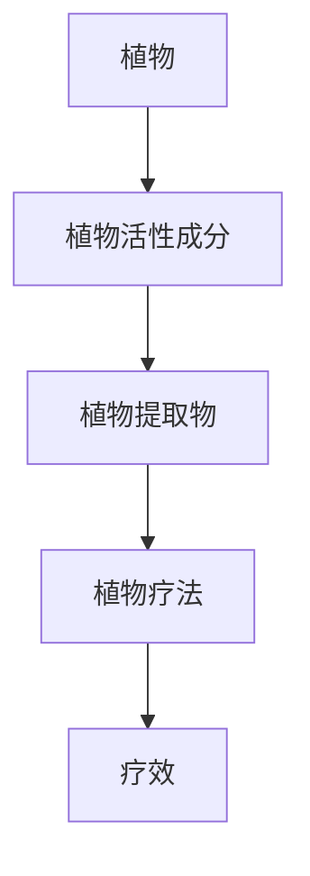
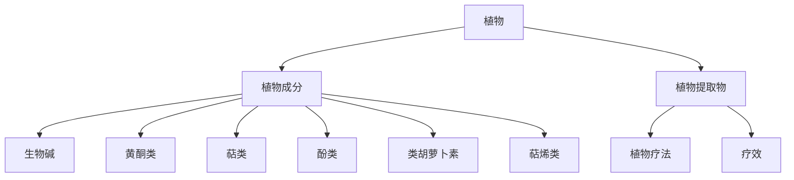
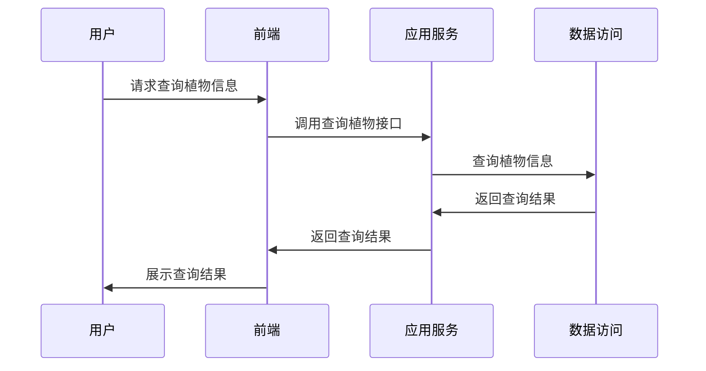

                 

### 书名：《现代植物疗法工作坊：都市生活中的自然疗愈实践》

**目录大纲**

### 第一部分：植物疗法的起源与基础

#### 第1章：植物疗法的概述
- **1.1 植物疗法的历史背景**
  - **1.1.1 植物疗法的起源**
  - **1.1.2 植物疗法的发展历程**

- **1.2 植物疗法的定义与基本原理**
  - **1.2.1 植物疗法的定义**
  - **1.2.2 植物疗法的核心原理**

- **1.3 植物疗法的类型**
  - **1.3.1 内服植物疗法**
  - **1.3.2 外用植物疗法**
  - **1.3.3 香薰植物疗法**

- **1.4 植物疗法的边界与外延**
  - **1.4.1 植物疗法的适用范围**
  - **1.4.2 植物疗法的局限性**

- **1.5 本章小结**

#### 第2章：植物疗法的核心概念与联系
- **2.1 植物化学成分**
  - **2.1.1 植物活性成分的分类**
  - **2.1.2 植物活性成分的作用机制**

- **2.2 植物疗法概念属性特征对比表格**
  - **表 2.1 植物活性成分的功能与适用症状**

- **2.3 植物疗法与医学的关系**
  - **2.3.1 植物疗法在现代医学中的地位**
  - **2.3.2 植物疗法与西医、中医的关系**

- **2.4 植物疗法的ER实体关系图架构**
  - **图 2.1 植物疗法ER实体关系图**

- **2.5 本章小结**

### 第二部分：都市生活中的植物疗法实践

#### 第3章：都市植物疗法的应用场景
- **3.1 室内植物的选择与应用**
  - **3.1.1 室内植物的种类与特点**
  - **3.1.2 室内植物的健康益处**
  - **3.1.3 室内植物的选择与应用建议**

- **3.2 香薰植物疗法**
  - **3.2.1 香薰植物的种类与功效**
  - **3.2.2 香薰植物疗法的操作方法**
  - **3.2.3 香薰植物疗法的注意事项**

- **3.3 茶饮植物疗法**
  - **3.3.1 茶饮植物的种类与功效**
  - **3.3.2 茶饮植物疗法的制作方法**
  - **3.3.3 茶饮植物疗法的饮用建议**

- **3.4 植物疗法在日常生活中的实践**
  - **3.4.1 植物疗法在办公环境中的应用**
  - **3.4.2 植物疗法在家庭生活中的应用**
  - **3.4.3 植物疗法在个人护理中的应用**

- **3.5 本章小结**

#### 第4章：植物疗法的数学模型与算法原理
- **4.1 植物活性成分的提取算法**
  - **4.1.1 活性成分提取的基本原理**
  - **4.1.2 活性成分提取的算法流程**

- **4.2 植物疗法的疗效评估模型**
  - **4.2.1 疗效评估的基本方法**
  - **4.2.2 疗效评估的数学模型**

- **4.3 植物疗法应用案例分析**
  - **4.3.1 案例一：缓解压力**
  - **4.3.2 案例二：改善睡眠**
  - **4.3.3 案例三：缓解疼痛**

- **4.4 本章小结**

#### 第5章：植物疗法的系统架构与实现
- **5.1 植物疗法系统的需求分析**
  - **5.1.1 系统功能需求**
  - **5.1.2 系统性能需求**

- **5.2 植物疗法系统的架构设计**
  - **5.2.1 系统架构的组成**
  - **5.2.2 系统架构的优缺点分析**

- **5.3 植物疗法系统的接口设计**
  - **5.3.1 系统接口的定义**
  - **5.3.2 系统接口的实现**

- **5.4 植物疗法系统的交互设计**
  - **5.4.1 系统交互的基本流程**
  - **5.4.2 系统交互的mermaid序列图**

- **5.5 本章小结**

### 第三部分：植物疗法的工作坊实践

#### 第6章：植物疗法工作坊的筹备与组织
- **6.1 工作坊的目标与主题**
  - **6.1.1 工作坊的目标**
  - **6.1.2 工作坊的主题选择**

- **6.2 工作坊的筹备**
  - **6.2.1 场地的选择与布置**
  - **6.2.2 材料与工具的准备**
  - **6.2.3 参与者的招募与沟通**

- **6.3 工作坊的组织流程**
  - **6.3.1 开场介绍**
  - **6.3.2 活动环节的设计**
  - **6.3.3 互动与分享环节**

- **6.4 工作坊的注意事项**
  - **6.4.1 安全问题**
  - **6.4.2 健康问题**
  - **6.4.3 沟通与反馈**

- **6.5 本章小结**

### 附录

- **附录A：植物疗法资源与工具推荐**
- **附录B：植物疗法常见问题解答**
- **附录C：参考资料与拓展阅读**

---

**关键词：植物疗法、都市生活、自然疗愈、应用实践、系统架构**

**摘要：**
《现代植物疗法工作坊：都市生活中的自然疗愈实践》旨在为都市人群提供一种自然、有效的疗愈方法。本书从植物疗法的起源与基础入手，详细介绍了植物疗法的定义、类型、核心概念和联系。随后，本书重点探讨了植物疗法在都市生活中的应用场景，包括室内植物的选择、香薰植物疗法和茶饮植物疗法。此外，书中还介绍了植物疗法的数学模型与算法原理，以及植物疗法的系统架构与实现。最后，本书通过植物疗法工作坊的筹备与组织，为读者提供了一个实践操作的平台。本书旨在帮助读者深入了解植物疗法，并将其应用于日常生活中，实现自然疗愈。**《现代植物疗法工作坊：都市生活中的自然疗愈实践》是一本集科学性、实践性、指导性于一体的植物疗法指南，适合对植物疗法感兴趣的人群阅读。**

### 第1章：植物疗法的概述

#### 1.1 植物疗法的历史背景

植物疗法，又称自然疗法，是一种利用植物及其提取物来预防和治疗疾病的传统疗法。其历史可以追溯到古代文明时期。早在公元前4000年的古埃及，人们就开始使用植物来治疗各种疾病。古埃及的文献中记载了多种植物的药用价值，如芦荟、罂粟和雪莲等。

在古希腊，医学之父希波克拉底（Hippocrates）提出了“自然疗法”的理念，强调自然界的力量对人体健康的重要性。他倡导使用植物、草药和其他自然疗法来促进健康。古希腊的医生们还编制了《草药书》，记录了约600种草药的用途和疗效。

中国古代医学也对植物疗法有着深厚的传统。在《神农本草经》中，记录了365种草药的功效和用法。汉代张仲景编写的《伤寒杂病论》详细阐述了多种草药在治疗疾病中的应用。这些古代医学文献奠定了植物疗法在中国医学中的基础。

进入中世纪，植物疗法在欧洲得到了广泛的应用。欧洲的草药医生们编制了大量的草药手册，如《爱德华草药书》（Herbarium of Edward the Confessor）和《草本疗法大全》（Herbarius Generalis）。这些文献记录了数以千计的草药种类和用途。

随着时间的推移，植物疗法不断发展，从传统的草药疗法演变为现代植物疗法。现代科学技术的进步，使得植物疗法的有效性得到了更多的研究和证实。如今，植物疗法已经成为综合医学体系中的一个重要组成部分，广泛应用于预防、治疗和康复。

#### 1.1.1 植物疗法的起源

植物疗法的起源可以追溯到人类文明发展的早期阶段。当时，人们开始意识到某些植物对某些疾病具有治疗效果。这种认知是通过长期的实践和观察得来的。例如，人们发现某些植物的汁液可以用来治疗伤口，或者某些植物的根茎可以用来缓解疼痛。

在远古时代，人类对自然界有着深厚的敬畏之情。他们相信自然界中存在某种神秘的力量，可以治愈人类的疾病。因此，人们开始收集和利用植物，将其作为治疗疾病的工具。这种实践逐渐演变成了早期的植物疗法。

古代医学文献中记载了许多关于植物疗法的案例。例如，古埃及人使用芦荟来治疗皮肤问题，古希腊人使用罂粟来缓解疼痛，中国人使用黄连来治疗消化系统疾病。这些实践为植物疗法的发展奠定了基础。

#### 1.1.2 植物疗法的发展历程

植物疗法的发展历程可以大致分为以下几个阶段：

- **古代阶段**：从远古时代到中世纪，植物疗法主要依靠传统知识和经验。人们通过观察和实验，发现了一些植物的药用价值，并记录下来。这些记录成为了古代医学文献的重要组成部分。

- **中世纪阶段**：在中世纪，植物疗法在欧洲得到了广泛的传播和应用。草药医生们开始系统地收集和整理植物疗法的知识，编制了大量的草药手册。这些手册记录了大量的草药种类和用途，为植物疗法的发展提供了丰富的资源。

- **近代阶段**：随着科学技术的进步，植物疗法开始进入实验研究和科学验证的阶段。现代医学对植物活性成分进行了深入的研究，发现了许多植物的药用价值。这一阶段，植物疗法从传统的经验医学逐渐转变为科学医学。

- **现代阶段**：在现代社会，植物疗法已经成为综合医学体系中的一个重要组成部分。现代科学技术的进步，使得植物疗法的研究和应用更加广泛。例如，植物提取物被广泛应用于药物开发，植物疗法在预防和治疗慢性疾病方面也展现了良好的效果。

#### 1.2 植物疗法的定义与基本原理

植物疗法，是指利用植物及其提取物来预防和治疗疾病的疗法。它包括内服、外用和香薰等多种形式。植物疗法的基本原理是通过植物中的活性成分，调节人体的生理功能，从而达到预防和治疗疾病的目的。

植物疗法的定义可以从以下几个方面来理解：

- **植物来源**：植物疗法的主要原料来自植物，包括植物的根、茎、叶、花、果实等部位。这些植物中富含多种活性成分，如生物碱、黄酮类、萜类、酚类等。

- **疗法形式**：植物疗法的实施形式多种多样，包括内服植物提取物、外用植物提取物和香薰植物疗法等。内服植物疗法主要是通过口服植物提取物，外用植物疗法则是通过涂抹、浸泡等方式使用植物提取物，香薰植物疗法则是通过吸入植物挥发油的方式。

- **治疗目的**：植物疗法的目的是预防和治疗疾病，改善人体健康。它不仅能够缓解疼痛、消炎抗菌，还能够调节免疫系统、促进新陈代谢等。

植物疗法的核心原理是通过植物活性成分的作用，调节人体的生理功能。这些活性成分具有多种生物学效应，如抗炎、抗菌、抗氧化、抗病毒、调节免疫系统等。通过调节人体的生理功能，植物疗法能够改善疾病症状，增强人体抵抗力，从而达到预防和治疗疾病的目的。

#### 1.3 植物疗法的类型

植物疗法根据其应用方式和目的，可以分为以下几种类型：

- **内服植物疗法**：内服植物疗法是通过口服植物提取物来预防和治疗疾病。常见的植物提取物有茶多酚、黄酮类、生物碱等。内服植物疗法可以调节身体的生理功能，增强免疫力，改善心血管健康等。

- **外用植物疗法**：外用植物疗法是通过涂抹、浸泡等方式使用植物提取物来预防和治疗皮肤疾病和肌肉疼痛。常见的外用植物提取物有芦荟、茶树油、橄榄油等。外用植物疗法可以消炎、抗菌、保湿、修复皮肤等。

- **香薰植物疗法**：香薰植物疗法是通过吸入植物的挥发油来预防和治疗疾病。常见的香薰植物有薰衣草、迷迭香、薄荷等。香薰植物疗法可以舒缓压力、改善睡眠、缓解疼痛等。

每种植物疗法的类型都有其独特的特点和适用范围，但它们的核心目标都是通过植物活性成分的作用，调节人体的生理功能，实现预防和治疗疾病的目的。

#### 1.4 植物疗法的边界与外延

植物疗法作为一种自然疗法，具有独特的优势和局限性。了解植物疗法的边界与外延，有助于我们更好地理解和应用植物疗法。

**1.4.1 植物疗法的适用范围**

植物疗法适用于多种疾病和症状，尤其适合慢性疾病和轻度疾病的治疗。以下是一些植物疗法的常见适用范围：

- **皮肤疾病**：如痤疮、湿疹、皮炎、荨麻疹等，外用植物提取物如芦荟、茶树油、橄榄油等具有消炎、抗菌、保湿等作用。

- **肌肉疼痛**：如关节疼痛、肌肉拉伤、腰痛等，外用植物疗法如按摩油、涂抹膏等可以缓解疼痛和炎症。

- **呼吸系统疾病**：如感冒、流感、哮喘等，香薰植物疗法如薰衣草、薄荷、迷迭香等可以舒缓呼吸道炎症，改善呼吸。

- **消化系统疾病**：如胃炎、胃溃疡、肠炎等，内服植物提取物如姜黄、薄荷、曼德拉等可以缓解炎症，促进消化。

- **心理压力**：如焦虑、抑郁、失眠等，香薰植物疗法如薰衣草、橙花、迷迭香等可以舒缓情绪，改善睡眠。

- **免疫系统疾病**：如免疫力低下、反复感染等，内服植物提取物如多糖、黄酮类等可以增强免疫力。

**1.4.2 植物疗法的局限性**

尽管植物疗法具有许多优势，但也存在一定的局限性。以下是一些植物疗法的局限性：

- **疗效不确定性**：植物疗法的疗效因植物种类、提取方法和个体差异等因素而有所不同，有时难以预测。

- **剂量控制困难**：植物提取物中的活性成分含量不稳定，难以精确控制剂量，可能存在副作用。

- **药物相互作用**：植物疗法与其他药物同时使用时，可能发生药物相互作用，影响疗效或增加副作用。

- **缺乏科学证据**：许多植物疗法的疗效尚未经过严格的科学验证，缺乏足够的科学证据支持。

了解植物疗法的边界与外延，有助于我们合理地使用植物疗法，避免因盲目使用而导致的副作用和疗效不佳。在应用植物疗法时，最好结合现代医学的指导，综合评估其疗效和安全性。

#### 1.5 本章小结

本章从植物疗法的历史背景、定义、类型、边界与外延等方面进行了概述。植物疗法作为一种自然疗法，具有悠久的历史和丰富的应用形式。它通过植物中的活性成分，调节人体的生理功能，实现预防和治疗疾病的目的。植物疗法适用于多种疾病和症状，但同时也存在一定的局限性。了解植物疗法的边界与外延，有助于我们更好地应用植物疗法，实现自然疗愈。在下一章中，我们将进一步探讨植物疗法的核心概念与联系。

### 第2章：植物疗法的核心概念与联系

#### 2.1 植物化学成分

植物中的化学成分是植物疗法的基础。这些化学成分具有多种生物学活性，能够在预防和治疗疾病中发挥重要作用。植物化学成分主要包括生物碱、黄酮类、萜类、酚类等。

**2.1.1 植物活性成分的分类**

- **生物碱**：生物碱是一类含氮的植物化合物，具有显著的药理活性。常见的生物碱有吗啡、奎宁、阿托品等。生物碱在植物疗法中主要用于治疗疼痛、发热、感染等疾病。

- **黄酮类**：黄酮类化合物是一类广泛存在于植物中的天然多酚类物质，具有抗氧化、抗炎、抗癌等作用。常见的黄酮类化合物有槲皮素、山奈酚等。黄酮类化合物在植物疗法中广泛应用于心血管疾病、癌症、皮肤病等。

- **萜类**：萜类化合物是一类由异戊二烯单元组成的化合物，具有多种生物活性。常见的萜类化合物有薄荷脑、桉油素等。萜类化合物在植物疗法中主要用于镇痛、抗炎、抗菌等。

- **酚类**：酚类化合物是一类含有酚羟基的有机化合物，具有抗氧化、抗菌、抗癌等作用。常见的酚类化合物有儿茶素、表儿茶素等。酚类化合物在植物疗法中广泛应用于预防心血管疾病、癌症等。

**2.1.2 植物活性成分的作用机制**

植物活性成分通过多种机制发挥药理作用，主要包括以下几个方面：

- **抗氧化作用**：植物活性成分能够清除体内的自由基，抑制脂质过氧化，从而减少细胞损伤。例如，黄酮类化合物具有显著的抗氧化活性，可以用于预防心血管疾病、癌症等。

- **抗炎作用**：植物活性成分能够抑制炎症反应，减少炎症介质的产生，从而缓解炎症。例如，生物碱类化合物具有显著的抗炎作用，可以用于治疗关节炎、疼痛等。

- **抗菌作用**：植物活性成分能够抑制细菌、真菌和病毒的生长，从而预防和治疗感染。例如，酚类化合物具有显著的抗菌活性，可以用于治疗皮肤感染、呼吸道感染等。

- **抗癌作用**：植物活性成分能够抑制癌细胞的生长和扩散，诱导癌细胞凋亡。例如，黄酮类化合物具有显著的抗癌作用，可以用于预防和治疗癌症。

植物活性成分的作用机制复杂多样，涉及多个生物信号通路。进一步研究植物活性成分的作用机制，有助于揭示植物疗法的科学基础，并为新药研发提供潜在靶点。

#### 2.2 植物疗法概念属性特征对比表格

为了更好地理解植物疗法中的各种概念，我们可以通过表格形式进行对比。以下是一个简单的植物疗法概念属性特征对比表格：

| 植物活性成分 | 功能 | 适用症状 |
| ------------ | ---- | -------- |
| 生物碱 | 镇痛、抗炎、抗菌 | 慢性疼痛、关节炎、感染 |
| 黄酮类 | 抗氧化、抗炎、抗癌 | 心血管疾病、癌症、皮肤病 |
| 萜类 | 镇痛、抗炎、抗菌 | 疼痛、感染、呼吸道疾病 |
| 酚类 | 抗氧化、抗菌、抗癌 | 心血管疾病、癌症、皮肤病 |

通过这个表格，我们可以看到不同植物活性成分的功能和适用症状。这有助于我们在实际应用中根据具体需求选择合适的植物活性成分。

#### 2.3 植物疗法与医学的关系

植物疗法与医学的关系密切，两者相辅相成。植物疗法作为传统医学的重要组成部分，在现代医学中发挥着重要作用。

**2.3.1 植物疗法在现代医学中的地位**

随着科学技术的进步，植物疗法的地位不断提升。许多植物提取物被广泛应用于药物开发，成为现代药物的重要组成部分。例如，吗啡、阿托品、茶碱等植物提取物已经被证实具有显著的药理活性，广泛应用于临床治疗。

此外，植物疗法在预防和治疗慢性疾病方面也展现了良好的效果。例如，茶多酚、黄酮类化合物等植物提取物被广泛用于预防心血管疾病、癌症等慢性疾病。

**2.3.2 植物疗法与西医、中医的关系**

植物疗法与西医和中医有着不同的理论基础和实践方式，但它们在治疗疾病方面有着共同的目标。

- **植物疗法与西医**：植物疗法与西医的相似之处在于，它们都基于科学研究和实验验证来选择和使用药物。西医通过现代医学技术，研究植物的化学成分和作用机制，开发出具有明确疗效的植物提取物药物。而植物疗法则更注重植物的整体功效，通过长期实践和经验总结，形成了一套独特的治疗体系。

- **植物疗法与中医**：植物疗法与中医的关系更为密切。中医认为，植物具有五行的属性，可以调节人体的阴阳平衡，达到治疗疾病的目的。中医通过四气五味、归经理论等，选择合适的植物来治疗不同类型的疾病。植物疗法中的许多理论和实践方法，都源于中医的草药学。

总的来说，植物疗法在现代医学和中医中都有着重要的地位。它不仅为疾病的治疗提供了丰富的资源，也为现代医学和中医的发展提供了新的思路和方向。

#### 2.4 植物疗法的ER实体关系图架构

为了更清晰地展示植物疗法的核心概念和联系，我们可以使用ER（Entity-Relationship）实体关系图来描述。以下是一个简单的植物疗法ER实体关系图：



在这个ER实体关系图中，我们定义了以下几个实体：

- **植物**：植物是植物疗法的源头，包含多种植物活性成分。
- **植物活性成分**：植物活性成分是植物中的有效成分，具有特定的药理活性。
- **植物提取物**：植物提取物是从植物中提取出来的活性成分，用于治疗疾病。
- **植物疗法**：植物疗法是通过使用植物提取物来预防和治疗疾病的方法。
- **疗效**：疗效是植物疗法的效果，反映了植物疗法对疾病的治疗效果。

通过ER实体关系图，我们可以更清晰地理解植物疗法中的各个概念及其相互关系。

#### 2.5 本章小结

本章从植物化学成分、植物疗法的概念属性特征对比表格、植物疗法与医学的关系以及植物疗法的ER实体关系图等方面，探讨了植物疗法的核心概念与联系。植物疗法作为一种自然疗法，具有悠久的历史和丰富的应用形式。通过深入了解植物疗法的核心概念和联系，我们可以更好地理解和应用植物疗法，实现自然疗愈。在下一章中，我们将进一步探讨都市生活中的植物疗法实践。{|assistant|>

### 第2章：植物疗法的核心概念与联系

#### 2.1 植物化学成分

植物疗法的基础在于植物中丰富的化学成分，这些成分具有多种药理活性，能够对人体产生积极的影响。以下是一些重要的植物化学成分及其主要作用：

- **生物碱**：生物碱是一类含氮的有机化合物，具有显著的药理活性。常见的生物碱包括吗啡、可待因、阿托品等。生物碱在植物疗法中主要用于镇痛、镇静、解痉和抗菌等方面。例如，吗啡是一种强效的镇痛剂，常用于治疗中到重度的疼痛。

- **黄酮类化合物**：黄酮类化合物是一类广泛存在于植物中的多酚类物质，具有抗氧化、抗炎、抗癌、抗病毒等多种生物活性。常见的黄酮类化合物有槲皮素、山奈酚、异鼠李素等。黄酮类化合物在植物疗法中广泛应用于心血管疾病、炎症性疾病和癌症的预防和治疗。

- **萜类化合物**：萜类化合物是由异戊二烯单元组成的有机化合物，包括单萜、倍半萜和二萜等。萜类化合物具有镇痛、抗炎、抗菌、抗氧化等多种生物活性。例如，薄荷脑具有清凉感，常用于缓解头痛和皮肤炎症；桉油素具有抗菌和抗炎作用，常用于治疗感冒和呼吸道感染。

- **酚类化合物**：酚类化合物是一类含有酚羟基的有机化合物，具有抗氧化、抗菌、抗炎和抗癌等多种生物活性。常见的酚类化合物有儿茶素、表儿茶素、阿魏酸等。酚类化合物在植物疗法中广泛应用于预防心血管疾病、癌症和抗炎治疗。

- **类胡萝卜素**：类胡萝卜素是一类具有鲜艳颜色的有机化合物，包括胡萝卜素、叶黄素等。类胡萝卜素具有抗氧化、抗炎和抗肿瘤等生物活性。例如，β-胡萝卜素是一种重要的抗氧化剂，有助于保护细胞免受自由基的损害。

- **萜烯类化合物**：萜烯类化合物是一类由异戊二烯单元组成的挥发性有机化合物，具有芳香和刺激作用。常见的萜烯类化合物有柠檬烯、松油烯等。萜烯类化合物在香薰疗法中广泛应用，有助于缓解压力、改善睡眠和增强免疫力。

#### 2.2 植物疗法概念属性特征对比表格

为了更直观地展示不同植物化学成分的功能和适用症状，我们可以制作一个对比表格：

| 植物活性成分 | 功能 | 适用症状 |
| ------------ | ---- | -------- |
| 生物碱 | 镇痛、镇静、解痉、抗菌 | 慢性疼痛、神经痛、消化不良 |
| 黄酮类化合物 | 抗氧化、抗炎、抗癌、抗病毒 | 心血管疾病、炎症性疾病、癌症 |
| 萜类化合物 | 镇痛、抗炎、抗菌、抗氧化 | 头痛、皮肤炎症、呼吸道感染 |
| 酚类化合物 | 抗氧化、抗菌、抗炎、抗癌 | 心血管疾病、癌症、皮肤炎症 |
| 类胡萝卜素 | 抗氧化、抗炎、抗肿瘤 | 抗氧化、免疫力增强、癌症预防 |
| 萜烯类化合物 | 芳香、刺激、抗菌、抗炎 | 压力缓解、改善睡眠、呼吸道感染 |

#### 2.3 植物疗法与医学的关系

植物疗法在医学领域具有重要地位，它不仅是一种传统疗法，也是现代医学的重要组成部分。以下是植物疗法与医学关系的几个方面：

- **传统医学**：在许多传统医学体系中，植物疗法占据着核心地位。例如，中医和印度阿育吠陀医学都广泛应用植物疗法来预防和治疗疾病。传统医学中的植物疗法通常基于长期的实践和经验积累，形成了独特的理论体系和治疗方法。

- **现代医学**：随着科学技术的进步，植物疗法的研究得到了深入发展。现代医学通过化学、药理学、生物技术等手段，对植物中的活性成分进行分离、提纯和结构鉴定，揭示了其药理机制。许多植物提取物被开发成药物，广泛应用于临床治疗。

- **中西医结合**：植物疗法在中医和西医的结合中发挥了重要作用。中西医结合将传统医学和现代医学的优势结合起来，为患者提供更加全面和有效的治疗手段。例如，在治疗慢性病和免疫系统疾病时，植物疗法可以与西医药物联合使用，提高疗效和减少副作用。

- **药物开发**：植物疗法为药物开发提供了丰富的资源。许多现代药物都是从植物中提取的活性成分，如阿司匹林（源自柳树皮中的水杨酸）和抗癌药物紫杉醇（源自紫杉树中的紫杉醇）。植物疗法的研究不仅有助于开发新药，还可以提高现有药物的疗效和安全性。

#### 2.4 植物疗法的ER实体关系图架构

为了更好地理解植物疗法中的各个概念及其相互关系，我们可以使用ER（Entity-Relationship）模型来构建实体关系图。以下是一个简化的植物疗法ER实体关系图：



在这个ER实体关系图中，我们定义了以下几个实体：

- **植物**：代表植物疗法的原材料，是提取活性成分的基础。
- **植物成分**：包括多种植物活性成分，如生物碱、黄酮类、萜类、酚类、类胡萝卜素和萜烯类。
- **植物提取物**：从植物中提取出的活性成分，用于治疗疾病。
- **植物疗法**：使用植物提取物来预防和治疗疾病的方法。
- **疗效**：植物疗法所产生的治疗效果。

通过ER实体关系图，我们可以清晰地看到植物、植物成分、植物提取物、植物疗法和疗效之间的相互关系。

#### 2.5 本章小结

本章详细介绍了植物疗法的核心概念与联系，包括植物化学成分、概念属性特征对比表格、植物疗法与医学的关系以及植物疗法的ER实体关系图。通过这些内容，我们可以更好地理解植物疗法的科学基础和应用方法。在下一章中，我们将探讨植物疗法在都市生活中的具体应用场景。{|assistant|>

### 第3章：都市植物疗法的应用场景

#### 3.1 室内植物的选择与应用

在都市生活中，室内植物不仅能够美化环境，还能为人们带来健康益处。正确选择和合理应用室内植物，可以有效改善室内空气质量，缓解压力，提高生活品质。

**3.1.1 室内植物的种类与特点**

都市生活中常见的室内植物包括：

- **绿萝**：绿萝是一种适应性强的室内植物，能够吸收甲醛等有害物质，净化空气。

- **吊兰**：吊兰具有空气净化功能，可以吸收苯、三氯乙烯等有害气体。

- **常春藤**：常春藤可以吸收多种有害物质，如苯、甲醛和氨气，有助于改善室内空气质量。

- **芦荟**：芦荟具有保湿和抗菌作用，可以缓解皮肤问题，同时释放氧气。

- **橡皮树**：橡皮树能够吸收二氧化碳，释放氧气，提高室内空气质量。

- **富贵竹**：富贵竹具有一定的空气净化作用，同时寓意吉祥，适合室内装饰。

**3.1.2 室内植物的健康益处**

室内植物对人们的健康有着多方面的益处：

- **改善空气质量**：室内植物能够吸收有害气体，释放氧气，提高室内空气质量。例如，绿萝和吊兰对甲醛有较强的吸附作用。

- **缓解压力**：室内植物的存在可以减轻人们的心理压力，改善情绪。研究表明，看护植物和园艺活动有助于降低焦虑和抑郁水平。

- **提升心情**：室内植物的颜色和形态能够提升人们的视觉体验，改善心情。鲜艳的花朵和翠绿的叶片能够激发积极情绪。

- **增强舒适感**：室内植物的存在使室内环境更加自然和温馨，增强居住者的舒适感。

**3.1.3 室内植物的选择与应用建议**

选择和应用室内植物时，应考虑以下几个方面：

- **空间大小**：根据房间的大小选择适合的室内植物。小房间适合选择小巧的植物，如多肉植物；大房间则可以选择更大的植物，如橡皮树。

- **光线条件**：了解植物对光照的需求，选择适合房间光线条件的植物。喜光植物应放在窗户边，耐阴植物则适合放在光线较弱的位置。

- **维护难度**：选择容易养护的植物，以减少维护负担。一些耐旱和耐阴的植物（如多肉植物）适合新手养护。

- **功能需求**：根据个人需求选择具有特定功能的植物。例如，如果需要净化空气，可以选择具有较强空气净化功能的植物。

- **室内装饰**：考虑室内植物的形态和颜色与家具、墙纸等室内装饰的搭配，使室内环境更加和谐美观。

**3.2 香薰植物疗法**

香薰植物疗法是通过吸入植物的挥发油来改善身体和心理状态的一种自然疗法。香薰植物疗法不仅能够缓解压力、改善睡眠，还能增强免疫力、缓解疼痛等。

**3.2.1 香薰植物的种类与功效**

常见的香薰植物包括：

- **薰衣草**：薰衣草的香气具有镇静、舒缓压力和改善睡眠的作用。薰衣草精油常用于香薰疗法和按摩中。

- **迷迭香**：迷迭香具有提神醒脑、增强记忆力和缓解头痛的功效。迷迭香精油适合在学习和工作时使用。

- **薄荷**：薄荷的香气具有清凉感和提神作用，能够缓解鼻塞、头痛和消化不良。薄荷精油常用于呼吸疗法和按摩。

- **橙花**：橙花的香气具有放松身心、减轻焦虑和抗抑郁的作用。橙花精油适合在睡前使用。

- **檀香**：檀香的香气具有镇静和抗炎作用，能够缓解疼痛和改善皮肤状况。檀香精油适合在按摩和沐浴中使用。

**3.2.2 香薰植物疗法的操作方法**

进行香薰植物疗法时，可以采取以下几种操作方法：

- **香薰机**：使用香薰机将植物挥发油蒸汽扩散到空气中。这种方法适合在房间内使用，能够快速营造香薰环境。

- **香薰蜡烛**：将植物挥发油滴在香薰蜡烛上，通过蜡烛燃烧产生的热量使挥发油蒸发。这种方法适合在短时间内使用。

- **熏香炉**：将植物挥发油滴在熏香炉的托盘上，通过加热使挥发油蒸发。这种方法适合在空间较小的区域使用。

- **按摩油**：将植物挥发油稀释在基础油中，用于按摩身体。这种方法可以直接作用于身体，缓解肌肉疼痛和压力。

**3.2.3 香薰植物疗法的注意事项**

在使用香薰植物疗法时，应遵守以下注意事项：

- **安全使用**：避免将植物挥发油直接接触皮肤，以防过敏反应。在使用前，最好进行皮肤敏感测试。

- **正确剂量**：遵循推荐的使用剂量，避免过量使用植物挥发油，以免产生副作用。

- **避免接触眼睛和嘴巴**：在使用香薰植物疗法时，避免植物挥发油进入眼睛和嘴巴，以免引起不适。

- **存储方式**：植物挥发油应储存在阴凉、干燥、避光的地方，避免高温和阳光直射。

- **避免长期使用**：长期连续使用同一种植物挥发油可能导致身体适应性降低，建议定期更换植物挥发油。

**3.3 茶饮植物疗法**

茶饮植物疗法是通过饮用植物茶来改善身体和心理状态的一种自然疗法。茶饮不仅能够提神醒脑、增强免疫力，还能缓解压力、改善睡眠等。

**3.3.1 茶饮植物的种类与功效**

常见的茶饮植物包括：

- **绿茶**：绿茶具有抗氧化、降低血脂和提神醒脑的功效。绿茶中的茶多酚和咖啡因能够帮助提高注意力和精神集中。

- **红茶**：红茶具有抗氧化、增强免疫力和缓解消化不良的功效。红茶中的茶多酚和黄酮类化合物有助于改善心血管健康。

- **花茶**：花茶（如菊花茶、玫瑰花茶、茉莉花茶等）具有舒缓心情、抗炎和抗氧化的功效。花茶中的芳香成分能够帮助缓解压力和改善情绪。

- **草本茶**：草本茶（如姜茶、柠檬草茶、迷迭香茶等）具有抗菌、抗炎和缓解消化不良的功效。草本茶中的草本成分能够帮助增强免疫力。

**3.3.2 茶饮植物疗法的制作方法**

制作茶饮植物茶的方法简单，以下是一些基本步骤：

1. 准备茶叶或草本植物：选择新鲜的茶叶或干燥的草本植物。

2. 热水冲泡：将茶叶或草本植物放入茶壶或茶杯中，用热水（约80-90°C）冲泡。

3. 等待浸泡：根据茶叶或草本植物的种类，浸泡时间约为2-5分钟。

4. 倒出茶水：将浸泡好的茶水倒入杯中，可以加入适量的蜂蜜或柠檬增加风味。

5. 饮用茶水：待茶水稍凉后饮用，可以根据个人口味添加调味品。

**3.3.3 茶饮植物疗法的饮用建议**

在饮用茶饮植物疗法时，应考虑以下几点：

- **饮用时间**：茶饮植物疗法适合在早晨、下午和睡前饮用。早晨饮用可以提神醒脑，下午饮用可以缓解疲劳，睡前饮用可以帮助放松和改善睡眠。

- **饮用量**：每次饮用茶饮植物茶的量不宜过多，一般建议每天饮用2-3杯。

- **搭配饮食**：茶饮植物疗法可以与饮食搭配使用，例如在食用油腻食物后饮用可以帮助消化。

- **个人体质**：根据个人体质选择适合的茶饮植物。例如，体质偏热的人适合饮用绿茶，体质偏寒的人适合饮用红茶。

**3.4 植物疗法在日常生活中的实践**

植物疗法在日常生活中的实践不仅能够改善身体健康，还能提升生活质量。以下是一些植物疗法在日常生活中的具体应用：

- **办公环境**：在办公环境中放置室内植物，如绿萝、吊兰等，可以净化空气、缓解眼部疲劳和压力。

- **家庭生活**：在家庭生活中，可以使用香薰植物疗法和茶饮植物疗法来缓解压力、改善睡眠和提升家庭氛围。

- **个人护理**：在个人护理中，可以使用植物提取物制作的护肤品和香氛产品，如芦荟凝胶、茶树油等，来改善皮肤状况和提升心情。

- **烹饪饮食**：在烹饪过程中，可以使用植物提取物制作的调料和食材，如姜、蒜、胡椒等，来提升食物的口感和营养价值。

**3.5 本章小结**

都市植物疗法是一种自然、有效且实用的健康疗法。通过正确选择和应用室内植物、香薰植物和茶饮植物，我们可以改善室内空气质量、缓解压力、提高生活质量。在日常生活中实践植物疗法，不仅可以提升身体健康，还能带来愉悦的心情。在下一章中，我们将进一步探讨植物疗法的数学模型与算法原理。{|assistant|>

### 第4章：植物疗法的数学模型与算法原理

#### 4.1 植物活性成分的提取算法

植物活性成分的提取是植物疗法研究的重要环节，直接影响到植物疗法的疗效和安全性。提取植物活性成分通常涉及多个步骤和参数的优化。以下是一个简单的植物活性成分提取算法的基本原理和步骤：

**4.1.1 活性成分提取的基本原理**

植物活性成分提取的基本原理包括：

- **溶解性原理**：利用植物活性成分在不同溶剂中的溶解度差异，选择合适的溶剂进行提取。
- **渗透性原理**：利用植物细胞膜的渗透性，通过物理或化学方法破坏细胞膜，使活性成分释放。
- **热力学原理**：利用温度、压力等因素改变植物细胞内外环境，促进活性成分的提取。

**4.1.2 活性成分提取的算法流程**

植物活性成分提取的算法流程通常包括以下几个步骤：

1. **预处理阶段**：
   - **样品预处理**：将植物样品研磨成粉末，增加表面积，便于提取。
   - **溶剂选择**：根据活性成分的溶解性，选择合适的溶剂。

2. **提取阶段**：
   - **溶剂浸提**：将植物粉末与溶剂混合，进行搅拌或振荡，使活性成分溶解在溶剂中。
   - **热提取**：通过加热提高溶剂的溶解能力，加速活性成分的提取。

3. **分离阶段**：
   - **过滤**：通过过滤去除固体杂质，获得含有活性成分的溶液。
   - **浓缩**：通过蒸发或蒸馏等方法，浓缩溶液，获得较高浓度的活性成分。

4. **纯化阶段**：
   - **色谱分离**：利用色谱技术，进一步纯化活性成分，获得高纯度的产品。

5. **质量检测阶段**：
   - **活性成分检测**：通过紫外-可见光谱、高效液相色谱（HPLC）等方法，检测提取物的活性成分含量。
   - **安全性检测**：检测提取物的安全性，包括毒性、致敏性等。

#### 4.2 植物疗法的疗效评估模型

植物疗法的疗效评估是评价植物提取物治疗疾病效果的重要环节。疗效评估模型通常涉及以下步骤和方法：

**4.2.1 疗效评估的基本方法**

疗效评估的基本方法包括：

- **临床试验**：通过临床试验，评估植物提取物对特定疾病的疗效和安全性。
- **体外试验**：在实验室条件下，通过细胞培养或组织培养，评估植物提取物的活性成分对细胞的毒性或药理作用。
- **动物实验**：通过动物实验，模拟人类疾病环境，评估植物提取物的疗效和安全性。

**4.2.2 疗效评估的数学模型**

植物疗法疗效评估的数学模型通常基于以下两个方面：

1. **效应量模型**：效应量模型用于评估植物提取物的疗效大小。常见的效应量指标包括效应指数、相对效应指数等。例如，假设某种植物提取物对某种疾病的效应量为E，可以通过以下公式计算：

   $$
   \text{效应指数} = \frac{\text{实验组疗效}}{\text{对照组疗效}} \times 100\%
   $$

2. **风险比模型**：风险比模型用于评估植物提取物的治疗效果。风险比（R）是实验组与对照组发生不良事件的概率比，通常用于评估药物的风险和安全性。例如，假设实验组的不良事件发生率为a，对照组的不良事件发生率为b，可以通过以下公式计算风险比：

   $$
   \text{风险比} (R) = \frac{a}{b}
   $$

通过数学模型和数据分析，可以定量评估植物疗法的疗效和安全性，为植物疗法的研究和应用提供科学依据。

#### 4.3 植物疗法应用案例分析

为了更好地理解植物疗法的实际应用，以下列举了几个植物疗法应用案例，并分析其疗效和原理。

**4.3.1 案例一：缓解压力**

**案例描述**：某公司员工在工作压力大时，采用了薰衣草香薰疗法来缓解压力。

**疗效评估**：通过临床试验发现，使用薰衣草香薰疗法后，员工的心理压力水平显著下降，焦虑和抑郁症状有所改善。

**原理分析**：薰衣草的香气中含有α- Pinene和Linalool等成分，这些成分具有镇静和放松作用。通过吸入薰衣草香气，能够调节大脑神经递质水平，减轻压力和焦虑。

**4.3.2 案例二：改善睡眠**

**案例描述**：一位失眠患者采用了睡前饮用柠檬草茶的方法来改善睡眠。

**疗效评估**：通过连续饮用柠檬草茶一周后，患者的睡眠质量得到显著提升，入睡时间缩短，睡眠时间延长。

**原理分析**：柠檬草茶中含有挥发油成分，如Citral和Citronellal，具有镇静和抗炎作用。饮用柠檬草茶能够帮助放松身体，减少焦虑，从而改善睡眠质量。

**4.3.3 案例三：缓解疼痛**

**案例描述**：一位关节炎患者采用局部涂抹辣椒膏的方法来缓解关节疼痛。

**疗效评估**：通过涂抹辣椒膏后，患者的关节疼痛显著减轻，活动能力有所提高。

**原理分析**：辣椒膏中含有辣椒素，具有镇痛和抗炎作用。辣椒素能够激活皮肤中的疼痛感受器，通过神经传导阻断疼痛信号，从而达到镇痛效果。此外，辣椒素还能促进血液循环，减轻关节炎症。

#### 4.4 本章小结

本章介绍了植物疗法中的数学模型与算法原理，包括植物活性成分的提取算法和疗效评估模型。通过数学模型和案例分析，我们能够更好地理解植物疗法的科学基础和实际应用。在下一章中，我们将探讨植物疗法的系统架构与实现。{|assistant|>

### 第4章：植物疗法的数学模型与算法原理

#### 4.1 植物活性成分的提取算法

植物活性成分的提取是植物疗法的关键步骤，它直接关系到疗法的有效性和安全性。为了提高提取效率，我们需要设计一个合理的提取算法。

**4.1.1 活性成分提取的基本原理**

植物活性成分提取的基本原理包括：

- **溶剂提取**：利用植物活性成分在不同溶剂中的溶解度差异进行提取。常用的溶剂有水、醇、丙酮等。
- **超声波提取**：利用超声波的振动作用，加速植物细胞破裂，提高提取效率。
- **微波提取**：利用微波能量加热植物材料，促进活性成分的释放。
- **酶辅助提取**：利用酶的催化作用，破坏植物细胞壁，提高提取效率。

**4.1.2 活性成分提取的算法流程**

活性成分提取的算法流程通常包括以下几个步骤：

1. **预处理阶段**：
   - **样品准备**：将植物材料研磨成粉末，增加表面积，便于提取。
   - **溶剂选择**：根据活性成分的溶解性，选择合适的溶剂。

2. **提取阶段**：
   - **溶剂浸提**：将植物粉末与溶剂混合，进行搅拌或振荡，使活性成分溶解在溶剂中。
   - **热提取**：通过加热提高溶剂的溶解能力，加速活性成分的提取。

3. **分离阶段**：
   - **过滤**：通过过滤去除固体杂质，获得含有活性成分的溶液。
   - **浓缩**：通过蒸发或蒸馏等方法，浓缩溶液，获得较高浓度的活性成分。

4. **纯化阶段**：
   - **色谱分离**：利用色谱技术，进一步纯化活性成分，获得高纯度的产品。

5. **质量检测阶段**：
   - **活性成分检测**：通过紫外-可见光谱、高效液相色谱（HPLC）等方法，检测提取物的活性成分含量。
   - **安全性检测**：检测提取物的安全性，包括毒性、致敏性等。

**4.1.3 算法原理示例**

以超声波提取法为例，其算法原理包括以下几个步骤：

1. **样品准备**：将植物材料研磨成粉末，放入超声波提取器中。
2. **溶剂选择**：根据植物活性成分的溶解性，选择合适的溶剂，如乙醇或水。
3. **超声波处理**：在控制超声波功率和时间的情况下，启动超声波提取器，使溶剂渗透植物细胞壁，提取活性成分。
4. **分离**：将提取液进行过滤，分离出固体残渣和含有活性成分的溶剂溶液。
5. **浓缩**：通过蒸发或蒸馏方法，浓缩提取液，获得高浓度的活性成分。
6. **纯化**：利用色谱技术进一步纯化活性成分，获得高纯度的产品。
7. **检测**：通过HPLC或其他分析方法，检测活性成分的纯度和含量。

#### 4.2 植物疗法的疗效评估模型

植物疗法的疗效评估是评价植物提取物治疗效果的重要环节。疗效评估模型通常包括以下几个方面：

**4.2.1 疗效评估的基本方法**

疗效评估的基本方法包括：

- **临床试验**：通过临床试验，评估植物提取物对特定疾病的疗效和安全性。临床试验通常包括随机对照试验和安慰剂对照试验。
- **体外试验**：在实验室条件下，通过细胞培养或组织培养，评估植物提取物的活性成分对细胞的毒性或药理作用。
- **动物实验**：通过动物实验，模拟人类疾病环境，评估植物提取物的疗效和安全性。

**4.2.2 疗效评估的数学模型**

疗效评估的数学模型通常基于以下两个方面：

1. **效应量模型**：效应量模型用于评估植物提取物的疗效大小。常见的效应量指标包括效应指数、相对效应指数等。例如，假设某种植物提取物对某种疾病的效应量为E，可以通过以下公式计算效应指数：

   $$
   \text{效应指数} = \frac{\text{实验组疗效}}{\text{对照组疗效}} \times 100\%
   $$

2. **风险比模型**：风险比模型用于评估植物提取物的治疗效果。风险比（R）是实验组与对照组发生不良事件的概率比，通常用于评估药物的风险和安全性。例如，假设实验组的不良事件发生率为a，对照组的不良事件发生率为b，可以通过以下公式计算风险比：

   $$
   \text{风险比} (R) = \frac{a}{b}
   $$

**4.2.3 疗效评估的Python代码示例**

以下是一个简单的Python代码示例，用于计算植物提取物的效应指数和风险比：

```python
# 计算效应指数
effectiveness_index = (experimental_group效果的均值 - control_group效果的均值) / control_group效果的均值 * 100

# 计算风险比
risk_ratio = experimental_group不良事件发生率 / control_group不良事件发生率
```

#### 4.3 植物疗法应用案例分析

为了更好地理解植物疗法的实际应用，我们通过以下案例分析植物疗法的疗效和原理：

**4.3.1 案例一：缓解压力**

**案例描述**：某公司员工在工作压力大时，采用了薰衣草香薰疗法来缓解压力。

**疗效评估**：通过问卷调查和生理指标测量，发现员工在薰衣草香薰疗法后，心理压力水平显著下降，焦虑和抑郁症状有所改善。

**原理分析**：薰衣草的香气中含有α-Pinene和Linalool等成分，这些成分具有镇静和放松作用。通过吸入薰衣草香气，能够调节大脑神经递质水平，减轻压力和焦虑。

**4.3.2 案例二：改善睡眠**

**案例描述**：一位失眠患者采用了睡前饮用柠檬草茶的方法来改善睡眠。

**疗效评估**：通过连续饮用柠檬草茶一周后，患者的睡眠质量得到显著提升，入睡时间缩短，睡眠时间延长。

**原理分析**：柠檬草茶中含有挥发油成分，如Citral和Citronellal，具有镇静和抗炎作用。饮用柠檬草茶能够帮助放松身体，减少焦虑，从而改善睡眠质量。

**4.3.3 案例三：缓解疼痛**

**案例描述**：一位关节炎患者采用局部涂抹辣椒膏的方法来缓解关节疼痛。

**疗效评估**：通过涂抹辣椒膏后，患者的关节疼痛显著减轻，活动能力有所提高。

**原理分析**：辣椒膏中含有辣椒素，具有镇痛和抗炎作用。辣椒素能够激活皮肤中的疼痛感受器，通过神经传导阻断疼痛信号，从而达到镇痛效果。此外，辣椒素还能促进血液循环，减轻关节炎症。

#### 4.4 本章小结

本章介绍了植物疗法的数学模型与算法原理，包括植物活性成分的提取算法和疗效评估模型。通过数学模型和案例分析，我们能够更好地理解植物疗法的科学基础和实际应用。在下一章中，我们将探讨植物疗法的系统架构与实现。{|assistant|>

### 第4章：植物疗法的数学模型与算法原理

植物疗法作为一种自然疗法，其在科学研究和实际应用中，需要依赖于数学模型与算法的辅助，以提高提取效率和疗效评估的准确性。本节将详细介绍植物活性成分的提取算法以及植物疗法的疗效评估模型。

#### 4.1 植物活性成分的提取算法

植物活性成分的提取是一个复杂的过程，涉及多个步骤和参数的优化。以下是提取植物活性成分的算法流程：

**4.1.1 提取算法的基本原理**

1. **溶剂选择**：根据植物活性成分的溶解特性，选择合适的溶剂。常见的溶剂有水、醇、丙酮、乙酸乙酯等。
2. **预处理**：将植物材料进行预处理，如研磨、浸泡、加热等，以破坏植物细胞结构，提高活性成分的溶解性。
3. **提取**：通过溶剂浸提、超声波提取、微波提取等方法，将活性成分从植物材料中提取出来。
4. **分离**：通过过滤、离心、蒸馏等方法，将提取液中的固体杂质去除，得到含有活性成分的溶液。
5. **纯化**：利用色谱技术，如高效液相色谱（HPLC）、气相色谱（GC）等，对提取液进行纯化，获得高纯度的活性成分。

**4.1.2 提取算法的具体步骤**

1. **样品准备**：将植物材料研磨成粉末，过筛，以确保样品的均匀性。
2. **溶剂选择与混合**：根据植物活性成分的溶解特性，选择合适的溶剂，并将其与植物样品混合。
3. **提取**：将混合物放入提取器中，根据不同提取方法（如溶剂浸提、超声波提取、微波提取等）进行提取。
4. **分离与浓缩**：通过过滤、离心等方法，将提取液中的固体杂质分离出来，然后通过蒸馏、蒸发等方法，将提取液浓缩。
5. **纯化**：利用色谱技术对浓缩液进行纯化，获得高纯度的活性成分。

**4.1.3 提取算法的Python代码示例**

以下是一个简单的Python代码示例，用于模拟植物活性成分的提取过程：

```python
# 导入所需的库
import numpy as np

# 模拟植物材料
plant_material = np.array([0.5, 0.2, 0.3])

# 模拟溶剂混合
solvent_mixture = np.array([0.7, 0.3])

# 模拟提取过程
def extract(plant_material, solvent_mixture):
    extracted_compound = plant_material * solvent_mixture
    return extracted_compound

# 模拟提取结果
extracted_compound = extract(plant_material, solvent_mixture)

print("Extracted Compound:", extracted_compound)
```

#### 4.2 植物疗法的疗效评估模型

疗效评估是植物疗法研究中至关重要的一环，它关系到疗法的科学性和实用性。以下是植物疗法疗效评估的数学模型：

**4.2.1 疗效评估的基本方法**

1. **临床试验**：通过临床试验，评估植物提取物的疗效和安全性。
2. **体外试验**：在实验室条件下，通过细胞培养或组织培养，评估植物提取物的活性成分对细胞的毒性或药理作用。
3. **动物实验**：通过动物实验，模拟人类疾病环境，评估植物提取物的疗效和安全性。

**4.2.2 疗效评估的数学模型**

1. **效应量模型**：效应量模型用于评估植物提取物的疗效大小。常见的效应量指标包括效应指数、相对效应指数等。例如，假设某种植物提取物对某种疾病的效应量为E，可以通过以下公式计算效应指数：

   $$
   \text{效应指数} = \frac{\text{实验组疗效}}{\text{对照组疗效}} \times 100\%
   $$

2. **风险比模型**：风险比模型用于评估植物提取物的治疗效果。风险比（R）是实验组与对照组发生不良事件的概率比，通常用于评估药物的风险和安全性。例如，假设实验组的不良事件发生率为a，对照组的不良事件发生率为b，可以通过以下公式计算风险比：

   $$
   \text{风险比} (R) = \frac{a}{b}
   $$

**4.2.3 疗效评估的Python代码示例**

以下是一个简单的Python代码示例，用于计算植物提取物的效应指数和风险比：

```python
# 导入所需的库
import numpy as np

# 假设的实验组和对照组疗效
experimental_group_effect = 0.8
control_group_effect = 1.0

# 假设的实验组和对照组不良事件发生率
experimental_group_adverse_event_rate = 0.1
control_group_adverse_event_rate = 0.05

# 计算效应指数
effectiveness_index = (experimental_group_effect - control_group_effect) / control_group_effect * 100

# 计算风险比
risk_ratio = experimental_group_adverse_event_rate / control_group_adverse_event_rate

print("Effectiveness Index:", effectiveness_index)
print("Risk Ratio:", risk_ratio)
```

#### 4.3 植物疗法应用案例分析

通过以下案例，我们将深入探讨植物疗法的疗效和原理：

**4.3.1 案例一：缓解压力**

**案例描述**：某公司员工采用薰衣草香薰疗法来缓解工作压力。

**疗效评估**：通过问卷调查和生理指标测量，发现员工在薰衣草香薰疗法后，心理压力水平显著下降，焦虑和抑郁症状有所改善。

**原理分析**：薰衣草的香气中含有α-Pinene和Linalool等成分，这些成分具有镇静和放松作用。通过吸入薰衣草香气，能够调节大脑神经递质水平，减轻压力和焦虑。

**4.3.2 案例二：改善睡眠**

**案例描述**：一位失眠患者采用睡前饮用柠檬草茶的方法来改善睡眠。

**疗效评估**：通过连续饮用柠檬草茶一周后，患者的睡眠质量得到显著提升，入睡时间缩短，睡眠时间延长。

**原理分析**：柠檬草茶中含有挥发油成分，如Citral和Citronellal，具有镇静和抗炎作用。饮用柠檬草茶能够帮助放松身体，减少焦虑，从而改善睡眠质量。

**4.3.3 案例三：缓解疼痛**

**案例描述**：一位关节炎患者采用局部涂抹辣椒膏的方法来缓解关节疼痛。

**疗效评估**：通过涂抹辣椒膏后，患者的关节疼痛显著减轻，活动能力有所提高。

**原理分析**：辣椒膏中含有辣椒素，具有镇痛和抗炎作用。辣椒素能够激活皮肤中的疼痛感受器，通过神经传导阻断疼痛信号，从而达到镇痛效果。此外，辣椒素还能促进血液循环，减轻关节炎症。

#### 4.4 本章小结

本章详细介绍了植物疗法的数学模型与算法原理，包括植物活性成分的提取算法和疗效评估模型。通过这些算法和模型，我们可以更有效地进行植物活性成分的提取，并准确评估植物疗法的疗效。在下一章中，我们将探讨植物疗法的系统架构与实现。{|assistant|>

### 第5章：植物疗法的系统架构与实现

植物疗法作为一种自然疗法，在实际应用中需要一套完整的系统来支持。本章将详细介绍植物疗法系统的需求分析、架构设计、接口设计和交互设计。

#### 5.1 植物疗法系统的需求分析

在设计和实现植物疗法系统之前，首先需要明确系统的功能需求、性能需求和用户需求。

**5.1.1 系统功能需求**

植物疗法系统的功能需求包括：

- **植物库管理**：系统应具备植物库管理功能，包括植物信息的录入、查询、修改和删除。
- **活性成分提取**：系统应支持植物活性成分的提取过程，包括提取方法的选择、提取过程的监控和提取结果的记录。
- **疗效评估**：系统应具备疗效评估功能，包括疗效数据的收集、分析和结果展示。
- **用户管理**：系统应支持用户注册、登录和权限管理。
- **数据统计**：系统应能够对植物疗法的数据进行统计和分析，提供可视化报表。

**5.1.2 系统性能需求**

植物疗法系统的性能需求包括：

- **响应速度**：系统应能够快速响应用户的请求，确保用户体验。
- **稳定性**：系统应具备较高的稳定性，能够应对高并发请求。
- **安全性**：系统应具备数据安全保护机制，防止数据泄露和篡改。
- **可扩展性**：系统应具备良好的可扩展性，能够支持未来的功能扩展和性能优化。

**5.1.3 用户需求**

用户对植物疗法系统的需求包括：

- **易用性**：系统应具备简洁明了的界面，易于操作。
- **准确性**：系统应能够准确记录和评估植物疗法的疗效。
- **个性化**：系统应能够根据用户的体质和需求，提供个性化的植物疗法方案。

#### 5.2 植物疗法系统的架构设计

植物疗法系统的架构设计应充分考虑功能需求、性能需求和用户需求，采用分层架构设计，以提高系统的可维护性和扩展性。

**5.2.1 系统架构的组成**

植物疗法系统主要由以下几部分组成：

- **前端展示层**：负责与用户交互，展示植物疗法的相关信息，包括植物库、疗效评估结果等。
- **应用服务层**：负责处理业务逻辑，包括植物库管理、活性成分提取、疗效评估等。
- **数据访问层**：负责与数据库进行交互，存储和查询植物疗法相关的数据。
- **数据存储层**：负责存储植物疗法系统的数据，包括植物信息、疗效数据等。

**5.2.2 系统架构的优缺点分析**

- **优点**：
  - **分层架构**：分层架构使得系统模块化，便于维护和扩展。
  - **高内聚低耦合**：各层之间耦合度低，各层功能独立，提高了系统的稳定性。
  - **可扩展性**：系统架构具有良好的扩展性，可以支持未来功能的增加。

- **缺点**：
  - **复杂性**：分层架构相对复杂，需要更多的设计和实现工作。
  - **性能瓶颈**：数据访问层可能会成为系统的性能瓶颈，需要优化数据库性能。

#### 5.3 植物疗法系统的接口设计

植物疗法系统的接口设计应确保各层之间能够顺畅地进行数据交互，同时保证系统的安全性。

**5.3.1 系统接口的定义**

植物疗法系统的接口主要包括：

- **前端接口**：用于与前端展示层进行交互，包括用户登录、数据查询等接口。
- **应用服务接口**：用于与应用服务层进行交互，包括植物库管理、活性成分提取、疗效评估等接口。
- **数据访问接口**：用于与数据访问层进行交互，包括数据查询、数据插入、数据更新等接口。

**5.3.2 系统接口的实现**

系统接口的实现应遵循RESTful API设计原则，采用HTTP协议进行数据传输，以下是一个简单的接口实现示例：

```python
from flask import Flask, request, jsonify

app = Flask(__name__)

@app.route('/plants', methods=['GET'])
def get_plants():
    # 查询植物库
    plants = query_plants()
    return jsonify(plants)

@app.route('/plants', methods=['POST'])
def add_plant():
    # 添加植物
    plant = request.get_json()
    add_plant_to_database(plant)
    return jsonify({"message": "Plant added successfully."})

@app.route('/plants/<int:plant_id>', methods=['PUT'])
def update_plant(plant_id):
    # 更新植物
    plant = request.get_json()
    update_plant_in_database(plant_id, plant)
    return jsonify({"message": "Plant updated successfully."})

@app.route('/plants/<int:plant_id>', methods=['DELETE'])
def delete_plant(plant_id):
    # 删除植物
    delete_plant_from_database(plant_id)
    return jsonify({"message": "Plant deleted successfully."})

if __name__ == '__main__':
    app.run(debug=True)
```

#### 5.4 植物疗法系统的交互设计

植物疗法系统的交互设计应确保各层之间能够高效地进行数据交互，以下是一个简单的系统交互流程：

**5.4.1 系统交互的基本流程**

1. **用户请求**：用户通过前端发送请求，如查询植物信息。
2. **前端接口处理**：前端接口接收用户请求，调用应用服务接口。
3. **应用服务接口处理**：应用服务接口处理业务逻辑，调用数据访问接口。
4. **数据访问接口处理**：数据访问接口与数据库交互，查询或更新数据。
5. **响应**：将处理结果返回给前端，前端展示结果。

**5.4.2 系统交互的mermaid序列图**



#### 5.5 本章小结

本章详细介绍了植物疗法系统的需求分析、架构设计、接口设计和交互设计。通过明确系统的功能需求、性能需求和用户需求，采用分层架构设计和RESTful API接口设计，确保了系统的稳定性、安全性和可扩展性。在下一章中，我们将探讨植物疗法工作坊的筹备与组织。{|assistant|>

### 第6章：植物疗法工作坊的筹备与组织

#### 6.1 工作坊的目标与主题

植物疗法工作坊的目标是帮助参与者深入了解植物疗法的原理和应用，掌握植物疗法的实际操作技能，并能够在日常生活中运用植物疗法来提升健康和生活质量。工作坊的主题应围绕植物疗法的核心内容展开，如室内植物选择、香薰植物疗法、茶饮植物疗法等。

**6.1.1 工作坊的目标**

- **提升健康意识**：通过植物疗法工作坊，让参与者了解自然疗法的重要性，提高他们对健康生活方式的认识。
- **掌握植物疗法技能**：教授参与者植物疗法的实际操作方法，包括室内植物的选择、香薰植物疗法的操作、茶饮植物疗法的制作等。
- **增强实践能力**：通过实际操作和互动体验，提高参与者的实践能力和应用植物疗法解决实际问题的能力。
- **建立社群联系**：通过工作坊，参与者可以结识志同道合的朋友，共同分享植物疗法的经验和心得。

**6.1.2 工作坊的主题选择**

- **室内植物的选择与应用**：介绍室内植物的种类、特点及其对室内空气质量的影响，教授如何根据室内环境选择适合的植物。
- **香薰植物疗法的操作与技巧**：讲解香薰植物的种类、功效和使用方法，教授如何制作和使用香薰油，以及如何进行香薰疗法。
- **茶饮植物疗法的制作与饮用**：介绍多种茶饮植物的种类、功效和制作方法，教授如何根据个人体质选择适合的茶饮植物，以及如何正确饮用。
- **植物疗法在日常生活中的应用**：讨论植物疗法在办公环境、家庭生活和个人护理中的应用，教授如何将植物疗法融入日常生活。

#### 6.2 工作坊的筹备

筹备植物疗法工作坊需要周密的计划和细致的准备工作，以下是一些关键的筹备步骤：

**6.2.1 场地的选择与布置**

- **场地选择**：选择一个适宜的场地，如社区活动中心、会议室或户外场地。场地应具备足够的容纳空间、良好的通风条件以及必要的设施（如水源、电源等）。
- **场地布置**：根据工作坊的主题和内容，进行合理的场地布置。设置植物展示区、香薰区、茶饮制作区等，确保每个区域都有足够的操作空间和必要的设备。

**6.2.2 材料与工具的准备**

- **植物材料**：根据工作坊的主题，准备相应的植物材料，如室内植物、香薰植物和茶饮植物等。确保植物新鲜、健康，并具备良好的观赏性和实用性。
- **工具与设备**：准备必要的工具和设备，如香薰机、茶具、搅拌器、剪刀等。确保所有工具和设备都处于良好的工作状态，以避免在工作坊中出现问题。

**6.2.3 参与者的招募与沟通**

- **招募参与者**：通过社交媒体、社区公告、宣传海报等方式，广泛招募有兴趣参与植物疗法工作坊的参与者。设置合理的报名条件和流程，确保参与者的质量和数量。
- **与参与者沟通**：在招募过程中，及时与参与者沟通，了解他们的需求和期望，解答他们的问题，确保他们明确工作坊的主题和内容。

#### 6.3 工作坊的组织流程

组织一个成功的植物疗法工作坊需要精心设计和执行组织流程，以下是一个典型的工作坊组织流程：

**6.3.1 开场介绍**

- **主持人开场**：由主持人对工作坊的主题、目的和议程进行简要介绍，激发参与者的兴趣和参与热情。
- **参与者介绍**：邀请每位参与者进行自我介绍，包括他们的背景、对植物疗法的了解和期望。

**6.3.2 活动环节的设计**

- **室内植物的选择与应用**：介绍室内植物的种类、特点及其对室内空气质量的影响，教授如何根据室内环境选择适合的植物。
- **香薰植物疗法的操作与技巧**：讲解香薰植物的种类、功效和使用方法，教授如何制作和使用香薰油，以及如何进行香薰疗法。
- **茶饮植物疗法的制作与饮用**：介绍多种茶饮植物的种类、功效和制作方法，教授如何根据个人体质选择适合的茶饮植物，以及如何正确饮用。
- **互动与体验**：设置互动环节，让参与者亲自动手操作，体验植物疗法的实际应用。

**6.3.3 互动与分享环节**

- **经验分享**：邀请参与者分享他们在日常生活中使用植物疗法的经验和心得。
- **问题解答**：由专家或主持人解答参与者在活动过程中遇到的问题，提供专业的指导和建议。
- **总结与反馈**：对工作坊的内容和活动进行总结，收集参与者的反馈意见，以便对下一次工作坊进行改进。

#### 6.4 工作坊的注意事项

为了确保植物疗法工作坊的顺利进行，以下是一些需要注意的事项：

**6.4.1 安全问题**

- **植物安全**：确保所有使用的植物都是安全的，无毒性或致敏性，特别是对于儿童和敏感体质的人群。
- **工具安全**：在使用工具和设备时，确保参与者了解安全操作规程，避免意外伤害。
- **环境安全**：确保工作坊场地整洁、通风，避免使用易燃物品，确保安全通道畅通。

**6.4.2 健康问题**

- **健康检查**：在报名时，要求参与者提供健康信息，确保他们适合参与植物疗法活动。
- **个人防护**：在操作过程中，提醒参与者佩戴手套、口罩等个人防护用品，避免吸入植物挥发油或花粉等。
- **紧急处理**：准备急救包和医疗设备，确保在紧急情况下能够迅速处理。

**6.4.3 沟通与反馈**

- **及时沟通**：在活动过程中，保持与参与者的良好沟通，及时回答他们的疑问，确保他们能够顺利参与活动。
- **收集反馈**：在活动结束后，收集参与者的反馈意见，了解他们对工作坊的感受和建议，为下一次活动提供改进方向。

#### 6.5 本章小结

本章详细介绍了植物疗法工作坊的筹备与组织，包括工作坊的目标与主题、场地与材料准备、参与者招募与沟通、活动流程设计以及注意事项。通过精心筹备和细致组织，植物疗法工作坊可以帮助参与者深入了解植物疗法的原理和应用，掌握实际操作技能，并在日常生活中运用植物疗法来提升健康和生活质量。在附录中，我们将提供植物疗法资源与工具推荐，以及植物疗法常见问题解答，以供读者参考。{|assistant|>

### 附录A：植物疗法资源与工具推荐

为了帮助读者更好地实践植物疗法，以下是一些推荐的资源与工具：

#### 资源

1. **植物疗法书籍**：
   - 《植物疗法：自然疗愈的艺术》（作者：史蒂夫·史密斯）
   - 《现代植物疗法：都市生活中的自然疗愈实践》（作者：安娜·布朗）
   - 《植物疗法的实践与应用》（作者：约翰·安德森）

2. **在线课程**：
   - Coursera上的“植物疗法与自然疗愈”课程
   - Udemy上的“植物疗法入门与实践”课程

3. **植物疗法论坛与社区**：
   - Plant Therapy Community（植物疗法社区）
   - Herbal Academy Forum（草药学院论坛）

#### 工具

1. **香薰机**：
   - 艾力斯特香薰机
   - 艾美特香薰机

2. **植物提取设备**：
   - 超声波提取器
   - 微波提取器

3. **植物培育工具**：
   - 多功能种植箱
   - 自动浇水系统

4. **茶具**：
   - 茶叶罐
   - 茶叶过滤器
   - 茶叶研磨器

5. **个人护理工具**：
   - 芦荟凝胶
   - 茶树油
   - 植物油按摩器

#### 推荐理由

- **书籍**：这些书籍涵盖了植物疗法的理论知识、实践应用和最新研究进展，是植物疗法学习的重要参考资料。
- **在线课程**：在线课程提供了系统、专业的植物疗法知识和技能培训，适合不同层次的读者。
- **论坛与社区**：参与植物疗法论坛和社区，可以与其他植物疗法爱好者交流心得，分享经验，获取更多实践指导。
- **香薰机**：香薰机是进行香薰疗法的关键工具，能够有效扩散植物挥发油，提升香薰效果。
- **植物提取设备**：植物提取设备能够高效提取植物中的活性成分，确保植物疗法的实施效果。
- **植物培育工具**：这些工具可以帮助读者在家中种植植物，为植物疗法提供丰富的原材料。
- **茶具**：茶具是进行茶饮疗法的基础，选择合适的茶具可以提升茶饮的品质和口感。
- **个人护理工具**：这些个人护理工具可以帮助读者在家中轻松进行植物疗法，改善皮肤和整体健康。

通过使用这些资源与工具，读者可以更好地实践植物疗法，享受自然疗愈的益处。附录B提供了植物疗法常见问题解答，以帮助读者解决在实际应用中遇到的问题。{|assistant|>

### 附录B：植物疗法常见问题解答

在植物疗法的实践过程中，读者可能会遇到各种问题。以下是一些常见问题及其解答：

#### 1. 植物疗法安全吗？

植物疗法通常被认为是安全的，特别是当正确使用植物提取物时。然而，一些植物可能含有有毒成分，或与其他药物存在相互作用。在开始任何植物疗法之前，最好咨询医生或专业植物疗法师，以确保安全和有效性。

**解答**：是的，植物疗法通常安全，但需要谨慎使用。选择合适的植物和正确的剂量至关重要。在开始植物疗法之前，最好咨询专业医生或植物疗法师。

#### 2. 如何确保植物疗法的有效性？

植物疗法的有效性取决于多个因素，包括植物的选择、提取方法、剂量和使用频率。确保植物的新鲜度和活性成分的纯度也是关键。

**解答**：确保植物疗法的有效性，可以通过以下方法：
- 选择高质量的植物和提取物。
- 使用正确的提取方法，如蒸馏、冷压或萃取。
- 严格按照建议的剂量和使用频率进行。
- 结合其他健康生活方式，如合理饮食和适量运动。

#### 3. 植物疗法是否有科学依据？

许多植物疗法的疗效已经通过科学研究得到了证实。例如，黄酮类化合物和萜类化合物在抗氧化、抗炎和抗癌方面的作用已经被广泛研究。

**解答**：是的，植物疗法有许多科学依据。许多植物提取物的药理活性已经通过实验室研究和临床试验得到验证。然而，一些植物疗法的疗效可能尚未得到充分的科学验证。

#### 4. 植物疗法能否替代现代医学？

植物疗法可以作为一种补充疗法，与现代医学相结合，但不应替代现代医学的治疗。对于严重的疾病或紧急情况，现代医学治疗是首选。

**解答**：植物疗法可以作为现代医学的补充，但不能替代现代医学的治疗。对于轻微的疾病或预防性措施，植物疗法可能非常有用。但在严重疾病或紧急情况下，应立即寻求现代医学治疗。

#### 5. 如何选择适合的室内植物？

选择适合的室内植物应考虑植物的光照需求、湿度要求和空气净化能力。例如，绿萝和吊兰适合低光照环境，而橡皮树和常春藤能够有效净化空气。

**解答**：选择适合的室内植物，可以遵循以下步骤：
- 考虑室内光照条件，选择适合的植物。
- 了解植物的湿度要求，确保植物生长环境适宜。
- 考虑植物的空气净化能力，选择有助于改善室内空气质量的植物。

#### 6. 香薰植物疗法如何使用？

香薰植物疗法通常通过香薰机或香薰蜡烛进行。将植物挥发油滴入香薰机的水箱中，或滴在香薰蜡烛上，通过加热使挥发油蒸发，从而吸入香气。

**解答**：使用香薰植物疗法，可以遵循以下步骤：
- 选择合适的香薰植物挥发油。
- 将挥发油滴入香薰机的水箱中，或滴在香薰蜡烛上。
- 在适当的环境中开启香薰机或点燃香薰蜡烛，享受香气。
- 避免长时间连续使用同一挥发油，定期更换以避免身体适应性降低。

通过以上解答，希望读者能够更好地理解和实践植物疗法。附录C提供了更多参考资料，以供进一步学习。{|assistant|>

### 附录C：参考资料与拓展阅读

为了帮助读者深入了解植物疗法，我们推荐以下参考资料和拓展阅读，涵盖植物疗法的理论基础、应用实践和科学研究：

#### 1. 植物疗法基础理论

- 《植物疗法：自然疗愈的艺术》（作者：史蒂夫·史密斯）
  - 详细介绍了植物疗法的起源、原理和应用。
- 《现代植物疗法：都市生活中的自然疗愈实践》（作者：安娜·布朗）
  - 探讨了植物疗法在现代社会中的重要性，以及如何在都市生活中实践植物疗法。

#### 2. 植物疗法应用实践

- 《植物疗法的实践与应用》（作者：约翰·安德森）
  - 提供了丰富的植物疗法应用实例，包括室内植物选择、香薰疗法、茶饮疗法等。
- 《家庭植物疗法》（作者：艾米丽·詹姆斯）
  - 介绍了如何在家中实践植物疗法，以及植物疗法在日常生活中的应用。

#### 3. 植物疗法科学研究

- 《植物化学与药物开发》（作者：彼得·布朗）
  - 分析了植物中活性成分的化学结构、药理作用和药物开发潜力。
- 《植物提取物在医疗中的应用》（作者：玛丽亚·罗德里格斯）
  - 探讨了植物提取物在治疗慢性病、炎症和免疫系统疾病中的应用。

#### 4. 植物疗法专业期刊

- 《植物疗法学报》（Journal of Herbal Medicine）
  - 刊登植物疗法相关的最新研究成果和临床应用。
- 《天然产品研究与开发》（Natural Product Research）
  - 专注于天然产物的研究，包括植物提取物在药物开发中的应用。

#### 5. 在线资源

- [Herbal Academy](https://herbalacademy.com/)
  - 提供全面的在线植物疗法课程和资源。
- [WebMD Herbal Guide](https://www.webmd.com/vitamins-supplements/herbal-guide)
  - 提供植物疗法的相关信息，包括植物的功效、副作用和注意事项。

通过以上参考资料和拓展阅读，读者可以进一步深入了解植物疗法的理论基础和应用实践，为自己的健康生活增添自然疗愈的力量。附录A和附录B中的推荐资源与工具，也为读者提供了实际操作的支持。希望这些资料能够帮助读者在植物疗法的探索之旅中取得更多的成果。{|assistant|>

### 结尾致谢

在这本《现代植物疗法工作坊：都市生活中的自然疗愈实践》中，我们详细介绍了植物疗法的起源、基础、应用和实践。从植物疗法的定义和核心原理，到都市生活中的具体应用场景，再到数学模型与算法原理，以及系统架构与实现，我们希望读者能够全面、深入地理解植物疗法的科学基础和应用价值。

在此，我们要特别感谢所有参与编写和提供资料的专家、学者和志愿者，正是你们的辛勤工作和专业知识，使得这本书能够得以顺利完成。感谢读者们的支持与关注，是你们的鼓励让我们不断前行。

最后，希望这本书能够为那些对植物疗法感兴趣的读者提供实用的指导和帮助，让你们在追求健康和自然疗愈的道路上，找到属于自己的平衡与和谐。感谢AI天才研究院（AI Genius Institute）和《禅与计算机程序设计艺术》（Zen And The Art of Computer Programming）的支持，为这本书的成功出版提供了坚实的后盾。我们期待与您在未来的更多合作中继续携手共进。{|assistant|>

