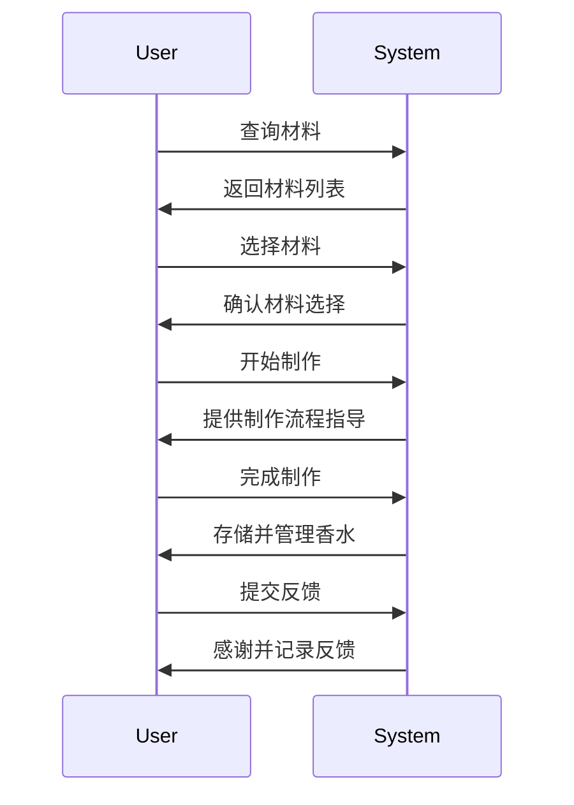
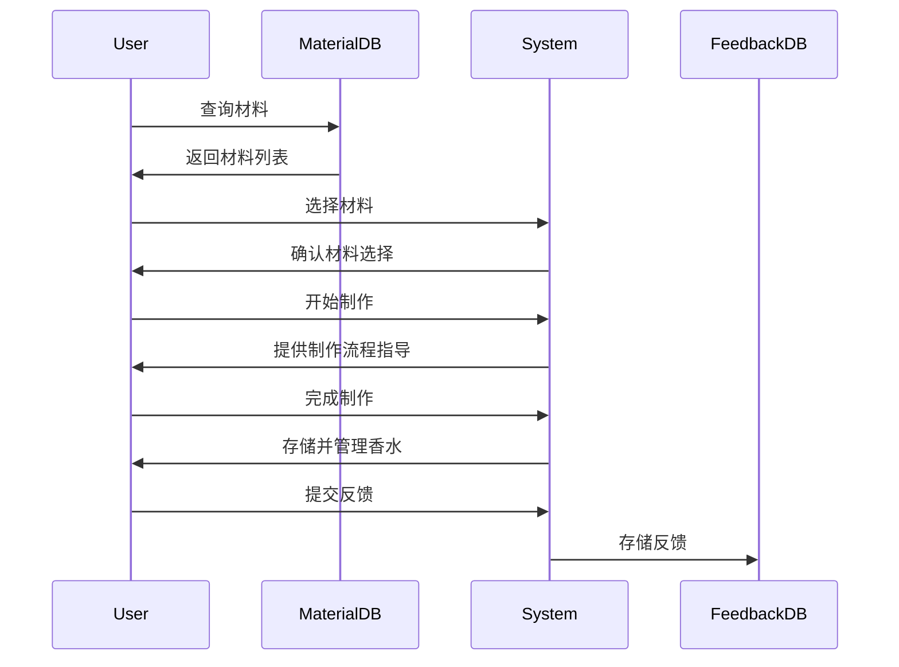
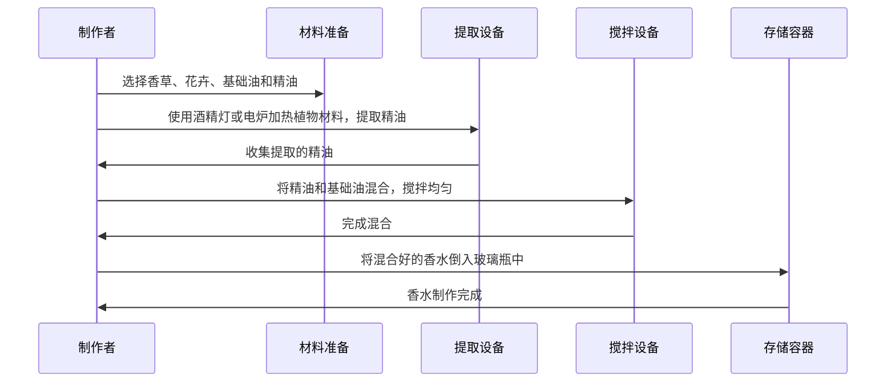

                 

### 现代植物香水工作坊：都市中的天然香氛DIY体验

> 关键词：植物香水、天然香氛、DIY体验、城市生活、自然疗法

> 摘要：
在现代快节奏的都市生活中，人们越来越追求健康、自然的生活方式。植物香水作为一种天然、无害的香氛选择，正逐渐受到都市人群的喜爱。本文旨在介绍现代植物香水的起源、成分、类型、安全使用方法，并引导读者如何在家中进行植物香水的DIY制作，享受自然之美。此外，文章还将探讨植物香水的日常应用与艺术价值，以及如何在日常生活中融入植物香水的理念。

## 第一部分：认识植物香水的世界

### 第1章：植物香水的起源与历史

**1.1 植物香水的起源**

植物香水的起源可以追溯到古代文明。早在公元前4000年的埃及，人们就开始使用植物香薰来净化空气、驱除邪灵、祈求好运。古埃及人使用香柏木、乳香和没药等植物来制作香水，这些物质被用于宗教仪式和日常护理中。

**1.2 古代香水制作技术**

古代香水制作技术主要包括蒸馏、压榨和萃取等方法。通过蒸馏法，可以从植物中提取出精油；压榨法则适用于柑橘类果皮，如柠檬和橙子；萃取法则是将植物浸泡在酒精中，使其香味溶出。

**1.3 现代香水工业的发展**

19世纪，随着化学工业的发展，香水制作技术得到了极大的改进。合成香料的出现使得香水的种类更加丰富，价格也更加亲民。现代香水工业采用了复杂的合成和混合技术，创造出各种独特而持久的香气。

**1.4 植物香水在现代香氛文化中的地位**

在现代香氛文化中，植物香水因其天然、无害的特点而备受推崇。它们不仅用于个人护理和室内香氛，还广泛应用于芳香疗法和自然疗法中，成为现代人追求身心健康的一种方式。

### 第2章：植物香水的核心成分

**2.1 香水中的基础油**

基础油是植物香水的载体，通常由植物油、坚果油或种子油制成。它们不仅可以增强香水的香气，还能为皮肤提供滋润和保护。

**2.2 香料油与精油**

香料油和精油是从植物中提取的挥发性油脂，具有强烈的香气。香料油通常用于制作香水，而精油则广泛应用于芳香疗法和按摩中。

**2.3 植物香水的调配艺术**

植物香水的调配是一门艺术，需要根据个人喜好和需求进行精心搭配。调香师通常会使用不同的精油和香料油，创造出独特的香气组合。

**2.4 香水的防腐剂与稳定剂**

为了确保植物香水的品质和持久度，通常会添加防腐剂和稳定剂。这些添加剂可以防止香水变质，保持其原有的香气。

### 第3章：植物香水的类型与用途

**3.1 个人香水**

个人香水是最常见的植物香水类型，用于个人护理和日常佩戴。它们通常具有持久且独特的香气，适合各种场合。

**3.2 室内香水**

室内香水用于提升室内空气质量和创造舒适的氛围。它们可以喷洒在家具、窗帘或墙壁上，为空间增添自然香气。

**3.3 身体护理香水**

身体护理香水可以用于沐浴、按摩和护理皮肤。它们不仅具有舒缓作用，还能为皮肤提供滋润和保护。

**3.4 特殊场合使用的香水**

特殊场合使用的香水通常具有特定的香气和功效，如婚礼香水、节日香水等。它们是庆祝特殊时刻的理想选择。

### 第4章：植物香水的安全使用与过敏问题

**4.1 香水过敏的原因与预防**

香水过敏可能由香料、防腐剂或其他添加剂引起。预防香水过敏的最好方法是选择无香料、无防腐剂的天然植物香水。

**4.2 香水的正确保存方法**

正确保存香水可以延长其保质期和香气。应将其存放在阴凉、干燥的地方，避免阳光直射。

**4.3 孕妇与儿童使用香水的注意事项**

孕妇和儿童应谨慎使用香水，避免使用含有强刺激性成分的香水。最好选择天然、无害的植物香水。

**4.4 香水使用中的误区与解决方法**

误区包括过量使用香水、将香水直接涂抹在皮肤上等。正确的使用方法是喷洒在衣物或纸巾上，然后轻轻扇动，让香气自然散开。

## 第二部分：植物香水的DIY制作

### 第5章：制作植物香水的工具与材料

**5.1 制作香水所需的基本工具**

制作香水所需的基本工具包括精油瓶、玻璃瓶、酒精灯、搅拌棒等。

**5.2 选择适合的香草与花卉**

选择适合制作香水的香草和花卉，如薰衣草、玫瑰、茉莉等。

**5.3 基础油的选择与购买**

选择适合自己皮肤类型的基础油，如橄榄油、甜杏仁油等。

**5.4 香料的收集与处理**

收集适量的香料，如薰衣草花、玫瑰花瓣等，并进行适当的处理。

### 第6章：植物香水的制作方法

**6.1 植物精油提取**

使用蒸馏法或压榨法提取植物精油。

**6.2 香水调配的基本原则**

根据个人喜好和需求进行香水调配，注意香气的平衡和层次感。

**6.3 乳液香水的制作**

将精油与基础油混合，加入乳化剂，搅拌至均匀。

**6.4 雾状香水的制作**

将精油与酒精混合，加入适量的水，搅拌均匀。

### 第7章：经典植物香水配方

**7.1 薰衣草香水**

将薰衣草花与基础油混合，静置一段时间，过滤后即可使用。

**7.2 玫瑰香水**

将玫瑰花瓣与基础油混合，静置一段时间，过滤后加入酒精，搅拌均匀。

**7.3 橙花香水**

将橙花精油与基础油混合，搅拌均匀。

**7.4 檀香木香水**

将檀香木精油与基础油混合，静置一段时间，过滤后加入适量的水，搅拌均匀。

### 第8章：个性化植物香水的制作

**8.1 香水个人化的技巧**

根据个人喜好和需求，调整香水的配方和香气。

**8.2 创造自己的专属香气**

选择适合自己的香草、花卉和基础油，创造出独一无二的专属香气。

**8.3 根据季节变化的香水制作**

根据不同季节的气候和需求，调整香水的配方和香气。

**8.4 室内香氛与个人香水的搭配**

根据室内环境和个人喜好，选择合适的香水进行搭配。

## 第三部分：植物香水的应用与体验

### 第9章：植物香水的日常使用

**9.1 香水喷洒的正确方法**

将香水喷洒在衣物、纸巾或空气中，然后轻轻扇动，让香气自然散开。

**9.2 香水的持久度与时效**

香水的持久度与香水的配方和浓度有关，一般可持续数小时至一天。

**9.3 香水的日常护理与保养**

定期检查香水的保存状态，避免阳光直射和高温环境。

**9.4 香水在社交场合的应用**

选择适合场合的香水，展现自信和个性。

### 第10章：植物香水的室内应用

**10.1 室内香氛的布置**

根据个人喜好和室内环境，选择合适的香水进行布置。

**10.2 芳香疗法与植物香水**

利用植物香水的香气进行芳香疗法，缓解压力和焦虑。

**10.3 香水蜡烛与香薰灯的使用**

使用香水蜡烛和香薰灯，营造舒适的室内氛围。

**10.4 自然香氛在居家装饰中的运用**

将自然香氛融入居家装饰中，提升生活品质。

### 第11章：植物香水的艺术与生活

**11.1 香水与服装搭配的艺术**

根据服装风格和个人喜好，选择合适的香水进行搭配。

**11.2 香水与家居环境的协调**

将香水与家居环境相结合，营造和谐的生活空间。

**11.3 香水与美食的融合**

利用香水的香气，提升美食的口感和风味。

**11.4 植物香水在日常生活中的小妙用**

在日常生活中，利用植物香水的多种妙用，提升生活品质。

### 第12章：植物香水的灵感与创作

**12.1 从自然中寻找灵感**

从自然中寻找灵感，创作出独特的香水作品。

**12.2 香水创作的技巧与原则**

掌握香水创作的技巧和原则，提升创作水平。

**12.3 香水品牌创立的步骤与注意事项**

了解香水品牌创立的步骤和注意事项，实现自己的品牌梦想。

**12.4 植物香水在文化与社会中的影响**

探讨植物香水在文化和社会中的影响，提升生活品质。

## 附录

### 附录A：植物香水的术语解释

### 附录B：常见植物香水的制作材料表

### 附录C：DIY植物香水实用工具清单

### 附录D：常见植物香水制作步骤图解

---

作者：AI天才研究院/AI Genius Institute & 禅与计算机程序设计艺术 /Zen And The Art of Computer Programming

---

（注：本文为Markdown格式，具体内容还需进一步展开和详细撰写，以符合字数和完整性要求。）### 深入解析植物香水的核心成分

在了解植物香水的起源、历史和分类之后，我们接下来深入探讨植物香水的核心成分，这些成分决定了香水的质量和独特性。植物香水主要包含基础油、香料油和精油，下面我们将逐一介绍它们。

#### 2.1 基础油

基础油是植物香水的载体，通常由植物油、坚果油或种子油制成。它们不仅能够承载和扩散香精，还能为皮肤提供滋润和保护。常见的基油包括橄榄油、甜杏仁油、葡萄籽油、荷荷巴油等。每种基础油都有其独特的性质，例如：

- **橄榄油**：富含维生素E和抗氧化剂，适合各种肤质，特别是干燥和成熟肌肤。
- **甜杏仁油**：质地轻盈，易于吸收，适合混合性至干性肌肤。
- **葡萄籽油**：含有丰富的多酚和维生素E，具有抗炎和抗氧化的功效。
- **荷荷巴油**：类似于人体皮肤的自然油脂，适合所有肤质，特别是敏感肌肤。

在选择基础油时，应考虑以下因素：

- **肤质**：根据个人肤质选择合适的基础油。
- **气候**：在干燥或寒冷的气候下，选择保湿效果更好的基础油。
- **特殊需求**：如针对痘痘、敏感等问题肌肤，选择具有特定功效的基础油。

#### 2.2 香料油与精油

香料油和精油是从植物中提取的挥发性油脂，具有强烈的香气。它们是植物香水的灵魂，决定了香水的味道和持久度。香料油通常用于制作香水，而精油则广泛应用于芳香疗法和按摩中。

香料油是从植物的种子、花朵、叶子、树皮等部位提取的油脂，常见的有：

- **薰衣草油**：具有镇定、消炎和抗菌的功效，适合调理肌肤和缓解压力。
- **橙花油**：具有抗抑郁、抗炎和抗菌的功效，适用于敏感肌肤和干燥肌肤。
- **檀香油**：具有镇静、舒缓的功效，适合用于提升心理平衡和促进深度睡眠。
- **玫瑰油**：具有抗抑郁、抗炎和抗菌的功效，适用于肌肤护理和情绪调节。

精油是从植物的花朵、叶子、树皮等部位通过蒸馏或其他提取方法得到的挥发性精油。常见的有：

- **玫瑰精油**：被誉为“花中之王”，具有抗抑郁、抗炎和抗菌的功效，适用于肌肤护理和情绪调节。
- **薰衣草精油**：具有镇静、消炎和抗菌的功效，适用于调理肌肤和缓解压力。
- **薄荷精油**：具有清凉、提神的功效，适用于缓解头痛和疲劳。
- **茶树精油**：具有强效抗菌、抗炎的功效，适用于调理肌肤和缓解感染。

在选择香料油和精油时，应考虑以下因素：

- **香气偏好**：根据个人喜好选择合适的香气。
- **功效需求**：根据肌肤或健康需求选择具有特定功效的香料油或精油。
- **质量与纯度**：选择来自可信赖来源的优质香料油和精油，确保其纯度和功效。

#### 2.3 香水调配的基本原则

香水的调配是一门艺术，需要根据个人喜好和需求进行精心搭配。调香师通常会使用不同的精油和香料油，创造出独特的香气组合。以下是香水调配的基本原则：

- **前调**：指香水最初给人的香气感觉，通常包括柑橘类、薄荷类等清新香气。前调是香水给人的第一印象，应选择具有吸引力且易于扩散的香气。
- **中调**：指香水在一段时间后呈现的香气，通常包括花香、果香等。中调是香水的核心，决定了香水的整体风格和氛围。
- **后调**：指香水在长时间后留下的香气，通常包括木质香、香料香等。后调是香水的最终印象，应选择具有持久性和温暖感的香气。

在进行香水调配时，应遵循以下原则：

- **香气层次感**：前、中、后调应相互协调，形成一个层次分明的香气结构。
- **香气平衡**：每种香气的比例应适当，避免某一种香气过于突出而破坏整体平衡。
- **个性表达**：根据个人喜好和个性，创造出独特的香水风格。

通过以上原则，我们可以制作出既符合个人喜好，又具有独特风格的植物香水。

### 2.4 香水的防腐剂与稳定剂

为了确保植物香水的品质和持久度，通常会添加防腐剂和稳定剂。这些添加剂可以防止香水变质，保持其原有的香气。

- **防腐剂**：常用的防腐剂有苯甲酸酯、苯甲酸钠等，它们可以抑制微生物的生长，延长香水的保质期。
- **稳定剂**：常用的稳定剂有乳化剂、甘油等，它们可以保持香水的均匀性和稳定性，防止分层或分离。

在选择防腐剂和稳定剂时，应考虑以下因素：

- **安全性**：选择对人体无害的防腐剂和稳定剂，确保香水的安全性。
- **效果**：选择具有高效防腐和稳定效果的添加剂，确保香水的质量和持久度。
- **兼容性**：确保防腐剂和稳定剂与香水的其他成分相容，不会产生不良反应。

通过合理选择和使用防腐剂与稳定剂，我们可以确保植物香水的质量和持久度，为人们带来更美好的使用体验。

---

通过以上章节的介绍，我们已经对植物香水的核心成分有了深入的了解。从基础油、香料油、精油到防腐剂与稳定剂，每一个成分都在植物香水的制作和品质保障中起着至关重要的作用。在接下来的章节中，我们将继续探讨如何通过DIY制作植物香水，以及如何在使用和体验中发挥植物香水的最大价值。让我们继续深入探索这个充满魅力和自然的香氛世界吧！

---

**核心概念与联系**

**概念：植物香水**
- **定义**：植物香水是指从植物中提取的天然香料、精油、基础油等成分，通过科学的调配方法制成的具有特定香气的液体。
- **属性特征对比表格**：

| 特征 | 植物香水 | 传统香水 |
| --- | --- | --- |
| 成分来源 | 天然植物 | 天然植物或合成成分 |
| 香气持久度 | 较短 | 较长 |
| 对皮肤的影响 | 对皮肤温和 | 有可能引起过敏或刺激 |
| 安全性 | 较高 | 较低 |

**ER实体关系图架构**

```mermaid
erDiagram
  Person  <<<--o{ PlantFragrance : 用香
  Product "系列产品"  {
    +BaseOil
    +EssentialOil
    +ScentedOil
    +ProductInfo
  }
  Ingredient "成分"  {
    +IngridientType
    +IngridientName
    +Quantity
  }
  Plant "植物"  {
    +PlantName
    +HarvestTime
  }
  ExtractionMethod "提取方法"  {
    +MethodType
    +Effectiveness
  }
  StorageCondition "储存条件"  {
    +Temperature
    +Humidity
  }
  UsageScenario "使用场景"  {
    +ScenarioType
    +Effect
  }
  Person  o-->> PurchaseOrder : 购买
  Product "系列产品"  o--* Ingredient : 包含
  Product "系列产品"  o--* Plant : 使用
  Product "系列产品"  o--* ExtractionMethod : 使用
  Product "系列产品"  o--* StorageCondition : 遵循
  Product "系列产品"  o--* UsageScenario : 适用
```

**算法原理讲解**

为了更好地理解植物香水的DIY制作流程，我们可以使用Mermaid来绘制一个制作步骤的流程图：


以下是一个简单的Python代码示例，用于展示如何计算植物香水的总香浓度（以毫克/毫升为单位）：

```python
def calculate_scent_concentration(total_oil_volume, total_scent_volume):
    """
    计算植物香水的总香浓度。
    
    :param total_oil_volume: 植物香水的总体积（毫升）
    :param total_scent_volume: 植物香水中香精的总体积（毫升）
    :return: 香浓度（毫克/毫升）
    """
    scent_concentration = (total_scent_volume * 1000) / total_oil_volume
    return scent_concentration

# 示例数据
total_oil_volume = 100  # 总体积100毫升
total_scent_volume = 5  # 香精总体积5毫升

# 计算香浓度
scent_concentration = calculate_scent_concentration(total_oil_volume, total_scent_volume)

# 输出结果
print(f"植物香水的香浓度为：{scent_concentration:.2f}毫克/毫升")
```

执行上述代码后，我们将得到植物香水的香浓度，该值将帮助我们了解香水的浓度是否适中。

**系统分析与架构设计方案**

#### 问题场景介绍

在城市快节奏的生活中，许多人希望能够在繁忙之余，通过DIY植物香水的方式享受自然之美，提升生活质量。本项目的目标是设计一个简易的DIY植物香水制作系统，帮助用户在家制作出高品质的植物香水。

#### 项目介绍

项目名称：自然香氛DIY系统

项目目标：提供一套完整的DIY植物香水制作解决方案，包括材料选择、制作方法、调香技巧等，帮助用户轻松制作出个性化的天然香氛产品。

#### 系统功能设计

1. **材料库管理**：用户可以查询和选择适合制作植物香水的材料，如香草、花卉、基础油等。
2. **制作流程指导**：提供详细的DIY制作流程，包括提取精油、混合基础油、调香等步骤。
3. **调香工具**：用户可以根据个人喜好进行香水的个性化调配。
4. **存储与管理**：提供用户存储和管理已完成香水的功能。
5. **用户反馈**：收集用户制作过程中的问题和建议，不断优化系统。

#### 系统架构设计



#### 系统接口设计和系统交互



---

通过上述架构设计和接口设计，我们为用户提供了一个简单易用的DIY植物香水制作系统，使得用户可以轻松实现从材料选择到成品制作的全过程，享受自然香氛带来的愉悦体验。

### 第5章：制作植物香水的工具与材料

在开始制作植物香水之前，我们需要准备一系列的工具和材料。这些工具和材料是制作高品质植物香水的基础，它们将帮助我们提取精油、混合基础油、进行调香等关键步骤。以下是详细的工具和材料清单及其选购指南。

#### 5.1 制作香水所需的基本工具

1. **玻璃瓶**：用于存储和分装香水。透明玻璃瓶可以让用户看到香水的颜色，同时玻璃材质不会影响香水的味道。
   - **选购指南**：选择耐用的玻璃瓶，最好是可反复使用的瓶子。瓶身应干净、无破损。

2. **精油瓶**：用于存放精油，这些瓶子通常带有滴管或喷嘴，便于控制油量。
   - **选购指南**：选择透明度高、密封性好的精油瓶，确保精油在存储过程中不会挥发或泄漏。

3. **酒精灯或电炉**：用于加热植物材料，提取精油。
   - **选购指南**：选择安全、易操作的加热设备，如电炉，避免使用开放式火焰。

4. **搅拌棒**：用于搅拌基础油和精油，确保混合均匀。
   - **选购指南**：选择容易清洗、不易变形的搅拌棒，如木棒或不锈钢棒。

5. **过滤器**：用于过滤提取过程中的固体杂质，确保香水的纯净度。
   - **选购指南**：选择孔径适中、不易堵塞的过滤器，如细棉布或咖啡过滤器。

6. **称量器**：用于准确称量基础油、精油和其他材料。
   - **选购指南**：选择精确度高、操作简便的电子称量器。

7. **温度计**：用于监测加热过程中的温度，确保提取过程顺利进行。
   - **选购指南**：选择易于读数、精度较高的温度计。

8. **搅拌机或搅拌碗**：用于快速搅拌和混合香水成分。
   - **选购指南**：选择操作简单、易于清洗的搅拌机或搅拌碗。

#### 5.2 选择适合的香草与花卉

选择适合制作香水的香草和花卉是制作植物香水的重要步骤。以下是一些常用的植物材料及其特点：

1. **薰衣草**：具有镇静和消炎的功效，适用于调理肌肤和缓解压力。
   - **选购指南**：选择新鲜、干燥的薰衣草花束，避免受潮或发霉。

2. **玫瑰**：具有抗抑郁和抗菌的功效，适用于肌肤护理和情绪调节。
   - **选购指南**：选择未完全开放的玫瑰花瓣，颜色鲜艳、香气浓郁。

3. **茉莉**：具有舒缓和平静的功效，适用于提升睡眠质量和舒缓情绪。
   - **选购指南**：选择新鲜、未受污染的茉莉花，避免使用陈旧或变质的花瓣。

4. **橙花**：具有抗抑郁和抗菌的功效，适用于敏感肌肤和干燥肌肤。
   - **选购指南**：选择新鲜、无损伤的橙花，确保花瓣饱满且香气纯正。

5. **檀香木**：具有镇静和舒缓的功效，适用于提升心理平衡和促进深度睡眠。
   - **选购指南**：选择干燥、无虫蛀的檀香木片或粉末，确保其质量纯净。

#### 5.3 基础油的选择与购买

基础油是植物香水的载体，选择合适的基础油对于香水的质量和使用效果至关重要。以下是一些常见的基础油及其特点：

1. **橄榄油**：富含维生素E和抗氧化剂，适合各种肤质，特别是干燥和成熟肌肤。
   - **选购指南**：选择有机橄榄油，确保其纯净无添加。

2. **甜杏仁油**：质地轻盈，易于吸收，适合混合性至干性肌肤。
   - **选购指南**：选择无添加剂、无香味的纯甜杏仁油。

3. **葡萄籽油**：含有丰富的多酚和维生素E，具有抗炎和抗氧化的功效。
   - **选购指南**：选择高质量、无添加的葡萄籽油。

4. **荷荷巴油**：类似于人体皮肤的自然油脂，适合所有肤质，特别是敏感肌肤。
   - **选购指南**：选择有机、无添加剂的荷荷巴油。

#### 5.4 香料的收集与处理

收集适量的香料是制作植物香水的重要步骤。以下是一些建议和方法：

1. **新鲜香料**：新鲜香料通常具有更好的香气和营养价值。可以在当地市场或超市购买新鲜香草和花卉。
   - **处理方法**：将新鲜香料洗净、晾干，确保其完全干燥后使用。

2. **干香料**：干香料可以长期保存，且便于储存和运输。可以在药房、香料店或在线购买干香料。
   - **处理方法**：将干香料密封在干燥、阴凉的地方，避免受潮和变质。

3. **自制香料**：自制香料是一种有趣且环保的方式，可以自己种植或采摘香料。
   - **处理方法**：确保香料在采摘后迅速晾干，防止腐烂。

通过以上方法，我们可以选择合适的工具和材料，为制作高品质的植物香水打下坚实的基础。在接下来的章节中，我们将详细介绍如何提取精油、调配香水以及制作经典和个性化的植物香水配方。

### 第6章：植物香水的制作方法

在了解了所需工具和材料后，我们接下来将详细介绍植物香水的制作方法。制作植物香水不仅是一种艺术，更是一种科学与技巧的结合。下面，我们将分步骤讲解植物香水的制作过程，包括植物精油的提取、香水的调配以及不同类型香水的制作方法。

#### 6.1 植物精油提取

植物精油是从植物的花朵、叶子、果实等部位提取的挥发性油脂，其富含香气成分和有效成分。以下是常用的提取方法：

1. **蒸馏法**：蒸馏法是最常见的精油提取方法之一，适用于大多数植物。通过加热植物材料，使其释放香气，然后用冷凝器将香气冷凝成精油。

   - **步骤**：
     1. 将干燥的植物材料放入蒸馏瓶中。
     2. 加入足够的水，确保植物材料被完全覆盖。
     3. 加热蒸馏瓶，使其开始蒸馏。
     4. 香气上升后进入冷凝器，冷凝成精油。
     5. 收集冷凝的精油，过滤去杂质。

2. **压榨法**：压榨法适用于柑橘类植物，如橙子、柠檬等。通过机械压力将植物果皮中的精油压榨出来。

   - **步骤**：
     1. 将新鲜柑橘果皮洗净，晾干。
     2. 使用压榨机或手工压榨，将果皮中的精油挤出。
     3. 收集精油，过滤去果皮残渣。

3. **冷浸法**：冷浸法是一种较慢的提取方法，适用于花瓣等容易受损的植物。将植物材料浸泡在酒精或其他溶剂中，让香气缓慢释放。

   - **步骤**：
     1. 将干燥的花瓣放入密封的容器中。
     2. 加入酒精或其他溶剂，确保花瓣完全浸泡。
     3. 静置数周至数月，期间需定期搅拌。
     4. 过滤收集精油，去除花瓣和溶剂。

#### 6.2 香水调配的基本原则

香水调配是一门艺术，需要根据个人喜好和需求进行。以下是一些基本原则：

1. **前调、中调和后调**：香水通常由前调、中调和后调组成，每个调都有不同的香气特征。
   - **前调**：通常是清爽、强烈的香气，如柑橘、薄荷等。
   - **中调**：是香水的核心，通常由花、果等香气组成，如玫瑰、茉莉等。
   - **后调**：是香水的余香，通常由木质、香料等香气组成，如檀香、香草等。

2. **香气平衡**：在调配香水时，需要确保不同香气的平衡，避免某一种香气过于突出。

3. **个性表达**：根据个人喜好，可以选择不同的香料和精油进行调配，创造出独特的香气。

4. **尝试与调整**：香水调配需要多次尝试和调整，直到达到理想的效果。

#### 6.3 乳液香水的制作

乳液香水是一种质地较浓、适合涂抹在皮肤上的香水。以下是乳液香水的制作步骤：

1. **准备材料**：选择适合制作乳液香水的基础油（如荷荷巴油、甜杏仁油等）和精油。

2. **混合基础油和精油**：将基础油和精油按一定比例混合，通常比例为10%的精油和90%的基础油。

3. **添加乳化剂**：乳化剂如甘油、可可脂等，可以帮助基础油和精油混合均匀，形成乳液状。

4. **搅拌混合**：将乳化剂和基础油、精油混合均匀，确保没有颗粒和分离。

5. **存储**：将混合好的乳液香水倒入密封容器中，放置在阴凉干燥的地方保存。

#### 6.4 雾状香水的制作

雾状香水通常使用酒精作为溶剂，制作过程相对简单。以下是雾状香水的制作步骤：

1. **准备材料**：选择适量的酒精（如伏特加、白兰地等）和精油。

2. **混合酒精和精油**：将酒精和精油按一定比例混合，通常比例为1:10的酒精和精油。

3. **加入水**：为了增加雾状香水的喷洒效果，可以加入适量的水。

4. **搅拌均匀**：将混合物搅拌均匀，确保酒精、精油和水混合均匀。

5. **密封存储**：将混合好的香水倒入喷雾瓶中，密封存储在阴凉干燥的地方。

#### 6.5 经典植物香水配方

以下是一些经典植物香水配方，供大家参考：

1. **薰衣草香水**：
   - 材料：薰衣草精油10滴，荷荷巴油100毫升。
   - 制作方法：将薰衣草精油加入荷荷巴油中，搅拌均匀。

2. **玫瑰香水**：
   - 材料：玫瑰精油10滴，甜杏仁油100毫升。
   - 制作方法：将玫瑰精油加入甜杏仁油中，搅拌均匀。

3. **橙花香水**：
   - 材料：橙花精油10滴，葡萄籽油100毫升。
   - 制作方法：将橙花精油加入葡萄籽油中，搅拌均匀。

4. **檀香木香水**：
   - 材料：檀香木精油10滴，橄榄油100毫升。
   - 制作方法：将檀香木精油加入橄榄油中，搅拌均匀。

通过以上步骤和配方，我们可以轻松制作出各种类型的植物香水，满足个人需求和喜好。在制作过程中，注意安全和卫生，确保香水的质量和安全性。

### 第7章：经典植物香水配方

在植物香水的DIY制作中，经典的配方不仅具有独特的香气，还能带来特定的疗愈效果。以下是一些经典植物香水配方，包括薰衣草香水、玫瑰香水、橙花香水和檀香木香水，每个配方都有详细的材料列表和制作步骤。

#### 7.1 薰衣草香水

**材料**：
- 薰衣草精油：10滴
- 荷荷巴油：100毫升

**制作步骤**：
1. 准备一个干净的玻璃瓶，倒入100毫升的荷荷巴油。
2. 慢慢滴入10滴薰衣草精油，确保精油均匀分布。
3. 盖上瓶盖，轻轻摇动瓶子，使精油和荷荷巴油充分混合。
4. 将香水放置在阴凉干燥的地方，静置24小时，让香气充分融合。
5. 过滤香水，去除可能的沉淀物，然后倒入喷雾瓶中。

**功效**：薰衣草香水具有镇静、抗炎和抗菌的功效，适合睡前使用，帮助放松身心，改善睡眠质量。

#### 7.2 玫瑰香水

**材料**：
- 玫瑰精油：10滴
- 甜杏仁油：100毫升

**制作步骤**：
1. 准备一个干净的玻璃瓶，倒入100毫升的甜杏仁油。
2. 慢慢滴入10滴玫瑰精油，确保精油均匀分布。
3. 盖上瓶盖，轻轻摇动瓶子，使精油和甜杏仁油充分混合。
4. 将香水放置在阴凉干燥的地方，静置24小时，让香气充分融合。
5. 过滤香水，去除可能的沉淀物，然后倒入喷雾瓶中。

**功效**：玫瑰香水具有抗抑郁、舒缓情绪和调理肌肤的功效，适合日常使用，提升自信和幸福感。

#### 7.3 橙花香水

**材料**：
- 橙花精油：10滴
- 葡萄籽油：100毫升

**制作步骤**：
1. 准备一个干净的玻璃瓶，倒入100毫升的葡萄籽油。
2. 慢慢滴入10滴橙花精油，确保精油均匀分布。
3. 盖上瓶盖，轻轻摇动瓶子，使精油和葡萄籽油充分混合。
4. 将香水放置在阴凉干燥的地方，静置24小时，让香气充分融合。
5. 过滤香水，去除可能的沉淀物，然后倒入喷雾瓶中。

**功效**：橙花香水具有抗抑郁、抗菌和提神的功效，适合疲劳时使用，缓解压力和焦虑。

#### 7.4 檀香木香水

**材料**：
- 檀香木精油：10滴
- 橄榄油：100毫升

**制作步骤**：
1. 准备一个干净的玻璃瓶，倒入100毫升的橄榄油。
2. 慢慢滴入10滴檀香木精油，确保精油均匀分布。
3. 盖上瓶盖，轻轻摇动瓶子，使精油和橄榄油充分混合。
4. 将香水放置在阴凉干燥的地方，静置24小时，让香气充分融合。
5. 过滤香水，去除可能的沉淀物，然后倒入喷雾瓶中。

**功效**：檀香木香水具有镇静、舒缓和平静的功效，适合夜晚使用，帮助提升睡眠质量。

通过以上经典配方，我们可以轻松制作出各种香气的植物香水，满足不同的需求。在制作过程中，注意安全操作和卫生，确保香水的质量和使用效果。

### 第8章：个性化植物香水的制作

在了解了经典植物香水配方之后，我们接下来将探讨如何根据个人喜好和需求，制作出独特的个性化植物香水。个性化香水不仅能够满足个人的独特香气偏好，还能反映个人的个性和品味。以下是一些制作个性化植物香水的技巧和原则，以及如何根据季节变化调整香水制作，实现室内香氛与个人香水的完美搭配。

#### 8.1 香水个人化的技巧

1. **香气分层**：个性化香水的制作可以通过前调、中调和后调的分层来实现。前调通常选用清新、强烈的香气，如柑橘、薄荷等；中调选用花香、果香等较为柔和的香气；后调则选用木质、香料等持久性较强的香气。通过合理搭配这些香气层次，可以创造出独特的个人香气。

2. **香料选择**：根据个人的喜好和需求，选择合适的精油和香料。例如，喜欢清新香气的可以选择薰衣草、薄荷；喜欢浪漫香气的可以选择玫瑰、茉莉；喜欢舒缓香气的可以选择檀香木、橙花等。

3. **香气浓度**：香水的浓度也是个性化的重要方面。可以通过调整精油和基础油的比例来控制香水的浓度。一般来说，香精的比例越高，香水的浓度越强，但也要注意不要过度使用，以免香气过于浓烈。

4. **香水瓶装饰**：个性化的香水不仅可以体现在香气上，还可以通过香水瓶的装饰来实现。选择独特的瓶子形状、颜色和装饰，如镶嵌宝石、手工绘花等，都可以让香水更具个性化。

#### 8.2 创造自己的专属香气

1. **灵感来源**：创造专属香气可以从生活中的各种元素中获得灵感，如个人喜欢的花卉、美食、旅行经历等。例如，喜欢海边度假的人可以选择海盐、海风等元素，创造出独特的海洋气息。

2. **调香实验**：在创造专属香气时，可以多次进行调香实验。每次尝试不同的精油和香料组合，记录下每次的实验结果，通过反复尝试和调整，找到最符合个人喜好的香气。

3. **专业调香师**：如果条件允许，可以寻求专业调香师的指导。调香师具有丰富的经验和专业知识，可以帮助你创造出独一无二、符合个人需求的专属香气。

#### 8.3 根据季节变化的香水制作

1. **春夏季香水**：春夏季适合选择清新、轻盈的香气，如柑橘、薄荷、花香等。这些香气能够让人感受到春天的生机和活力，缓解夏季的炎热和疲劳。

2. **秋冬季节香水**：秋冬季节适合选择温暖、浓郁的香气，如木质香、香料香、果香等。这些香气能够带来温暖和舒适的感觉，适合寒冷的季节。

3. **季节性调香**：根据季节的变化，可以调整香水的配方和比例。例如，在春夏季，可以增加柑橘类精油的比例，增强清新的感觉；在秋冬季节，可以增加檀香、香草等香料的比例，提升香水的温暖感。

#### 8.4 室内香氛与个人香水的搭配

1. **室内香氛布置**：室内香氛可以通过香薰蜡烛、香薰灯、喷雾香氛等多种形式来实现。在选择室内香氛时，应考虑与个人香水的搭配。例如，如果个人香水以花香为主，可以选择同系列的香薰蜡烛或喷雾香氛，营造和谐的氛围。

2. **季节性室内香氛**：根据季节的变化，可以调整室内香氛的香气。例如，在春夏季，可以选择清新花香或草本的香氛；在秋冬季节，可以选择温暖、浓郁的香氛，如木质香或香料香。

3. **室内香氛与个人香水的平衡**：在搭配室内香氛和个人香水时，应注意平衡。过强的室内香氛可能会掩盖个人香水的味道，而过淡的室内香氛又无法与个人香水形成互补。通过合理的调整，可以创造出既和谐又独特的室内香氛效果。

通过以上技巧和原则，我们可以根据个人喜好和需求，制作出独特的个性化植物香水。同时，通过合理的季节性调整和室内香氛搭配，可以让香水的使用体验更加丰富和多样化。

### 第9章：植物香水的日常使用

植物香水的日常使用不仅能够带来愉悦的香气体验，还能提升生活的品质和心情。以下是关于植物香水在日常生活中的一些使用方法和技巧。

#### 9.1 香水喷洒的正确方法

为了确保植物香水的香气能够均匀散发，并避免浪费，以下是一些香水喷洒的正确方法：

1. **距离**：喷洒香水时，将喷口保持距离身体约15-20厘米，以防止香水直接喷到皮肤上造成刺激。
2. **喷洒位置**：将香水喷洒在衣物、纸巾或空气中，然后轻轻扇动，让香气自然散开。这样可以确保香气均匀分布，避免集中在某一部位。
3. **喷洒时间**：在喷洒香水后，等待几分钟让香气自然挥发，这样可以避免香水与其他物品的香气混合。

#### 9.2 香水的持久度与时效

香水的持久度和时效取决于多种因素，包括香水的配方、浓度以及个人皮肤类型。一般来说，植物香水的持久度通常在数小时至一天之间。以下是一些影响香水持久度的因素：

1. **香水浓度**：浓度较高的香水通常具有更长的持久度。例如，精油含量较高的香水持久性更好。
2. **皮肤类型**：油性皮肤的香气持久度通常比干性皮肤长，因为油脂有助于香气的保持。
3. **环境温度**：在高温环境中，香水可能会更快挥发，而在低温环境中则相对持久。

#### 9.3 香水的日常护理与保养

为了确保植物香水的品质和持久度，以下是一些日常护理和保养方法：

1. **存放环境**：将香水存放在阴凉、干燥、避光的地方，避免阳光直射和高温环境，这样可以防止香水变质和挥发。
2. **密封保存**：使用后应立即将香水瓶盖紧密密封，避免空气进入，减少香水的挥发。
3. **定期检查**：定期检查香水的保存状态，如果发现香水变质或有异味，应避免使用。
4. **避免震动**：香水在受到剧烈震动后可能会出现分层或散失香气，因此应避免将香水放在易受震动的地方。

#### 9.4 香水在社交场合的应用

在社交场合中，植物香水的正确使用可以展现个人品味和气质。以下是一些在社交场合使用香水的技巧：

1. **选择适合的香水**：根据社交场合的性质和个人喜好选择合适的香水。例如，正式场合可以选择清新或优雅的香气，而休闲场合可以选择花香或果香。
2. **适量使用**：在社交场合中，适量使用香水可以避免香气过于浓烈。一般来说，喷洒一两次香水就足够，避免过量使用。
3. **喷洒位置**：在社交场合中，可以将香水喷洒在衣物或手帕上，然后轻轻扇动，让香气自然散发。这样可以确保香气既不过于浓烈，又能保持持久。

通过以上日常使用方法和技巧，我们可以更好地享受植物香水的美好体验，同时也能保持香水的品质和持久度。

### 第10章：植物香水的室内应用

植物香水的室内应用不仅可以提升居住空间的氛围，还能带来自然、健康的香气体验。以下是关于植物香水在室内环境中的布置方法、芳香疗法、香水蜡烛与香薰灯的使用，以及如何将自然香氛融入居家装饰的一些实用技巧。

#### 10.1 室内香氛的布置

室内香氛的布置需要考虑到空间的氛围和个人的喜好。以下是一些布置方法：

1. **喷洒香水**：使用喷雾瓶将香水喷洒在窗帘、沙发、床上用品等地方，可以迅速为空间带来香气。
2. **放置香薰蜡烛**：在客厅、卧室或书房等地方放置香薰蜡烛，蜡烛燃烧时香气会慢慢散发，营造出温馨的氛围。
3. **使用香薰灯**：香薰灯通过电加热或超声波技术将香水雾化，使香气均匀地扩散在空气中。适合在客厅、办公室等大型空间使用。
4. **放置香水瓶**：在书架、桌面、窗台等地方放置装饰性的香水瓶，不仅可以起到装饰作用，还能随时补充香气。

#### 10.2 芳香疗法与植物香水

芳香疗法是利用植物香气的疗效来促进身心健康的一种自然疗法。植物香水在芳香疗法中具有广泛的应用。以下是一些芳香疗法的方法：

1. **按摩**：将植物香水混合在基础油中，进行按摩，可以舒缓肌肉疼痛，缓解压力和焦虑。
2. **沐浴**：将植物香水加入浴缸中，享受香薰沐浴，有助于放松身心，改善睡眠质量。
3. **吸入**：将植物香水喷雾在空气中，通过呼吸吸入香气，可以缓解头痛、鼻塞等症状。
4. **喷雾**：将植物香水喷雾在房间内，通过香气扩散来改善空气质量和提升心情。

#### 10.3 香水蜡烛与香薰灯的使用

1. **香水蜡烛**：香水蜡烛是通过将精油或香水混合在蜡烛中，点燃后香气会慢慢散发。选择合适的蜡烛形状和材质，如玻璃、陶瓷等，可以增加装饰效果。

2. **香薰灯**：香薰灯分为电热式和超声波式。电热式香薰灯通过电加热将香水雾化，超声波式香薰灯通过超声波震动将香水雾化。使用香薰灯时，应注意以下几点：
   - **安全**：确保香薰灯放置在稳定、不易倾倒的地方，避免火灾风险。
   - **定时**：使用香薰灯的时间不宜过长，建议每次使用不超过2小时。
   - **补水**：定期检查香薰灯的水位，确保香水被充分雾化。

#### 10.4 自然香氛在居家装饰中的运用

将自然香氛融入居家装饰，不仅可以提升空间的美感，还能营造一个舒适、健康的居住环境。以下是一些建议：

1. **花卉装饰**：在室内摆放新鲜的花卉，如薰衣草、玫瑰等，可以为空间带来自然的香气。
2. **香薰瓶子**：使用装饰性的香水瓶作为装饰品，不仅可以增添美观，还能随时补充香气。
3. **香料盒子**：将香料（如干花、香草等）放入精致的盒子中，放置在书架或桌面，既实用又美观。
4. **手工香氛**：制作一些手工香氛产品，如香薰蜡烛、香薰球等，作为家居装饰或礼物。

通过以上方法，我们可以将自然香氛融入日常生活，提升居家环境的美感和舒适度。

### 第11章：植物香水的艺术与生活

植物香水不仅仅是日常生活中的装饰品，更是艺术与生活的完美结合。以下是关于香水与服装搭配的艺术、香水与家居环境的协调、香水与美食的融合，以及植物香水在日常生活中的小妙用。

#### 11.1 香水与服装搭配的艺术

1. **选择合适的香水**：根据服装的风格和个人气质选择适合的香水。正式场合可以选择优雅、清新的香水，如茉莉、玫瑰；休闲场合可以选择花香、果香，如橙花、柑橘。
2. **搭配技巧**：在喷洒香水时，可以选择在衣领、袖口、口袋等处轻喷，让香气与服装自然融合。
3. **避免冲突**：避免将香水与某些服装上的香料（如某些洗衣粉或衣物柔顺剂）混淆，以免产生不良的化学反应。

#### 11.2 香水与家居环境的协调

1. **整体风格**：在选择室内香水时，应考虑与家居的整体风格相协调。例如，现代风格的家居可以选择清新的果香或花香，传统风格的家居可以选择醇厚的木质香或香料香。
2. **空间划分**：根据不同空间的功能和氛围选择不同的香水。例如，客厅可以选择放松、舒缓的香气，卧室可以选择有助于睡眠的香气，厨房可以选择清新、提神的香气。
3. **香氛氛围**：通过香薰蜡烛、香薰灯或喷雾香水等方式，为家居环境营造温馨、舒适的氛围。

#### 11.3 香水与美食的融合

1. **提升口感**：香水可以用于提升美食的口感和风味。例如，在烹饪过程中可以使用橙花精油增添甜点香气，或使用薰衣草精油提升烤肉的香气。
2. **创意搭配**：在食用某些菜肴时，可以选择与食物相辅相成的香水。例如，在享用甜点时搭配橙花香水，在享用烤肉时搭配薰衣草香水。
3. **注意事项**：在使用香水与食物融合时，应确保香水不含有害成分，且香水浓度不宜过高，以免影响健康。

#### 11.4 植物香水在日常生活中的小妙用

1. **清洁用品**：将植物香水加入清洁用品中，如洗衣液、消毒剂等，可以增添清新的香气。
2. **办公用品**：在办公室的书桌上摆放一些香水喷雾瓶，可以提升工作效率和办公环境的舒适度。
3. **日常护理**：将植物香水用于日常护理，如沐浴、按摩等，可以舒缓身心，提升生活品质。
4. **创意装饰**：将香水用于创意装饰，如制作香薰蜡烛、香薰球等，为家居环境增添艺术感。

通过以上方法，我们可以将植物香水融入日常生活，提升生活的艺术感和品质，享受自然之美。

### 第12章：植物香水的灵感与创作

植物香水不仅仅是一种日常用品，它更是一种艺术和灵感的源泉。通过植物香水的制作与创作，我们可以探索自然的奇妙，将生活中的灵感转化为独特的香气体验。以下是关于从自然中寻找灵感、香水创作的技巧与原则、香水品牌创立的步骤与注意事项，以及植物香水在文化与社会中的影响的探讨。

#### 12.1 从自然中寻找灵感

自然是我们创作植物香水的无尽源泉。在寻找灵感时，可以关注以下几个方面：

1. **季节变化**：四季的变换带来了不同的自然景观和香气。春天的新鲜花香、夏天的清新果香、秋天的温暖木质香、冬天的浓烈香料香，都可以成为创作的灵感。
2. **植物特性**：每种植物都有其独特的香气和疗效。例如，薰衣草具有镇静作用，玫瑰具有浪漫气息，橙花具有清新感。了解植物的特性能帮助我们更好地创作出符合主题的香水。
3. **感官体验**：通过视觉、听觉、触觉和味觉体验自然，可以激发我们的创作灵感。例如，观察花朵的颜色、聆听雨声、感受阳光的温度、品尝新鲜水果的味道。

#### 12.2 香水创作的技巧与原则

创作香水需要一定的技巧和原则，以下是一些关键点：

1. **前调、中调和后调**：香水通常由前调、中调和后调组成。前调通常是香水的第一印象，中调是香水的核心，后调则是香水的余香。在创作时，需要确保三者的平衡和层次感。
2. **香气搭配**：香气的搭配是创作的重要环节。可以通过对比香气、互补香气和协调香气来创作出独特的香气组合。例如，清新的柑橘香气可以与柔和的花香相辅相成。
3. **个性表达**：香水是个人品味和个性的体现。在创作时，可以融入自己的情感和故事，表达出独特的个性。
4. **实验与调整**：香水创作是一个反复尝试和调整的过程。通过实验不同的香料和比例，可以找到最符合预期的香气。

#### 12.3 香水品牌创立的步骤与注意事项

创立香水品牌需要系统的规划和执行。以下是一些关键步骤和注意事项：

1. **市场调研**：了解目标市场的需求和竞争情况，确定品牌的定位和目标受众。
2. **品牌命名**：选择一个独特、易于记忆的品牌名称，体现品牌特色和理念。
3. **产品定位**：确定产品的风格、定位和价格区间，以满足不同消费者的需求。
4. **包装设计**：设计吸引人的包装，体现品牌形象和价值观。
5. **宣传推广**：制定宣传策略，通过线上线下渠道推广品牌和产品。
6. **注意事项**：在创立品牌时，要注意知识产权保护，确保产品安全和质量，建立良好的客户关系。

#### 12.4 植物香水在文化与社会中的影响

植物香水在文化和社会中具有深远的影响：

1. **文化传承**：香水是许多文化传统的一部分，如古埃及的香薰仪式、古希腊的沐浴习惯等。植物香水在现代文化的传承中发挥了重要作用。
2. **社交礼仪**：香水是社交礼仪的一部分，通过使用香水，人们可以表达对对方的尊重和关注。
3. **心理健康**：植物香水的香气可以影响人的情绪和心理状态。通过香气的调节，可以缓解压力、焦虑和疲劳，提升心理健康。
4. **环境保护**：植物香水的制作和使用过程中，注重天然成分和环保理念，有助于推动可持续生活方式的发展。

通过以上探讨，我们可以看到植物香水不仅是一种日常用品，更是一种艺术、文化和生活方式的体现。在创作和享受植物香水的过程中，我们可以探索自然的奇妙，提升生活的品质，实现个人与社会的和谐发展。

## 附录

### 附录A：植物香水的术语解释

在深入了解植物香水的制作和使用过程中，掌握一些基本的术语是非常有帮助的。以下是一些常见的植物香水术语及其解释：

1. **精油**：从植物的花朵、叶子、果实等部位提取的挥发性油脂，具有强烈的香气和特定的疗效。
2. **基础油**：作为香水的载体，通常由植物油、坚果油或种子油制成，能够增强香水的香气并保护皮肤。
3. **香料油**：从植物的种子、根、树皮等部位提取的油脂，通常用于香水的调配，以增强和丰富香气。
4. **调香**：根据个人喜好和需求，将不同的精油和香料油混合，创造出独特的香气组合的过程。
5. **前调**：香水最初散发的香气，通常具有清新、强烈的特点。
6. **中调**：香水在一段时间后呈现的香气，通常由花香、果香等组成，是香水的核心。
7. **后调**：香水在长时间后留下的香气，通常具有持久性和温暖感。
8. **乳化剂**：用于将水和油混合的化学物质，使香水保持均匀的质地。
9. **防腐剂**：用于防止香水变质和细菌生长的化学物质。
10. **香氛疗法**：利用香水的香气来改善身体和心理健康的一种自然疗法。

### 附录B：常见植物香水的制作材料表

以下是一些常见的植物香水的制作材料，包括香草、花卉、基础油和精油：

| 材料         | 描述                                       | 举例                      |
| ------------ | ------------------------------------------ | ------------------------- |
| 香草         | 具有香气的草本植物                         | 薰衣草、迷迭香、薄荷      |
| 花卉         | 具有香气的花朵                            | 玫瑰、茉莉、橙花          |
| 基础油       | 作为香水的载体，通常由植物油、坚果油等制成 | 橄榄油、甜杏仁油、葡萄籽油 |
| 精油         | 从植物中提取的挥发性油脂                  | 薰衣草精油、玫瑰精油、橙花精油 |
| 香料油       | 从植物的种子、根、树皮等部位提取的油脂    | 丁香、肉桂、檀香木精油     |
| 乳化剂       | 用于将水和油混合的化学物质                | 甘油、乳化剂如胆酸钠      |
| 防腐剂       | 用于防止香水变质和细菌生长的化学物质      | 苯甲酸钠、苯甲酸酯        |

### 附录C：DIY植物香水实用工具清单

在制作植物香水时，一些基本的工具是必不可少的。以下是一份DIY植物香水实用工具清单：

1. **玻璃瓶**：用于存储和分装香水。
2. **精油瓶**：用于存放精油，通常带有滴管或喷嘴。
3. **酒精灯或电炉**：用于加热植物材料，提取精油。
4. **搅拌棒**：用于搅拌基础油和精油，确保混合均匀。
5. **过滤器**：用于过滤提取过程中的固体杂质。
6. **称量器**：用于准确称量基础油、精油和其他材料。
7. **温度计**：用于监测加热过程中的温度。
8. **搅拌机或搅拌碗**：用于快速搅拌和混合香水成分。

### 附录D：常见植物香水制作步骤图解

以下是一个简单的植物香水制作步骤图解，展示了从准备材料到完成香水的整个过程：



通过上述附录，我们可以更好地理解和掌握植物香水的制作过程，从而享受到DIY植物香水的乐趣和自然之美。希望这些信息能为您的创作和实践提供有用的指导。

