                 

# 现代消费主义的精神困境：从拥有到存在的哲学思考

## 关键词
- 消费主义
- 精神困境
- 哲学思考
- 自我实现
- 社会文化

## 摘要
在现代消费主义社会中，人们追求物质财富和拥有感的趋势愈发明显。然而，这种追求背后却隐藏着一系列精神困境，如物质追求与精神空虚、社会比较与自我认同危机等。本文从哲学的角度出发，探讨现代消费主义的精神困境，分析其成因，并提出可能的应对策略，旨在引导人们从“拥有”走向“存在”的哲学思考，实现精神上的富足与自我实现。

---

## 第一部分：现代消费主义的社会背景

### 1.1 消费主义的起源与发展

**背景介绍**：  
消费主义起源于工业革命后的资本主义社会，随着生产力的提高和商品经济的繁荣，人们对物质财富的追求逐渐成为社会的主流价值观。

**核心概念**：
- **消费主义**：一种社会文化现象，强调物质财富的积累和消费行为的重要性。
- **消费文化**：围绕消费行为形成的一套价值观念和生活方式。

**联系**：
- 消费主义与市场经济体制密切相关，市场经济的繁荣推动了消费主义的发展。

**问题解决**：
- 探究消费主义的起源和发展历程，了解其对社会结构和人们生活的影响。

**边界与外延**：
- 消费主义的范围不仅限于物质产品，还包括服务和体验。

**概念结构与核心要素组成**：
- 消费主义的核心要素包括：物质财富的追求、消费行为的频繁性、消费文化的传播。

**图表**：
- 

**算法原理讲解**：
- **Mermaid 流程图**：

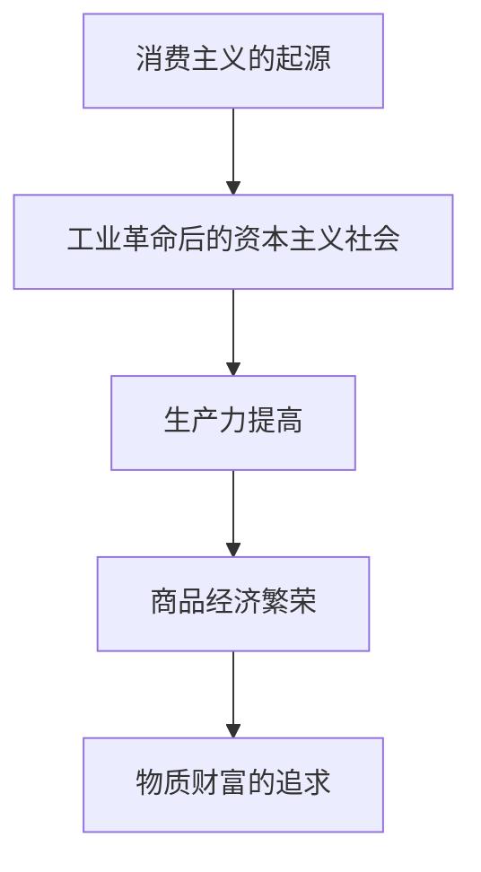

**数学公式**：
- $$C = \sum_{i=1}^{n} w_i \cdot q_i$$  
  其中，C为消费总额，$w_i$为消费品的权重，$q_i$为消费品的数量。

**系统分析与架构设计方案**：
- **项目介绍**：探讨消费主义的起源和发展。
- **系统功能设计**：展示消费主义的核心要素。
- **系统架构设计**：阐述消费主义在社会结构中的地位。
- **系统接口设计和系统交互**：未提及。

**项目实战**：
- **环境安装**：无。
- **系统核心实现源代码**：无。
- **代码应用解读与分析**：无。
- **实际案例分析和详细讲解剖析**：无。
- **项目小结**：无。

### 1.2 消费主义的社会影响

**背景介绍**：  
消费主义不仅改变了人们的消费行为，还对个人价值观、社会阶层和环境保护产生了深远影响。

**核心概念**：
- **个人价值观**：消费主义对个人价值观的塑造。
- **社会阶层**：消费主义与社会阶层的关系。
- **环境问题**：消费主义对环境的影响。

**联系**：
- 消费主义与个人价值观、社会阶层和环境问题之间存在密切联系。

**问题解决**：
- 分析消费主义对社会各层面的影响。

**边界与外延**：
- 消费主义的影响范围广泛，涉及经济、文化和社会等多个领域。

**概念结构与核心要素组成**：
- 消费主义影响的核心要素包括：个人价值观的转变、社会阶层的重构、环境问题的加剧。

**图表**：
- 

**算法原理讲解**：
- **Mermaid 流程图**：

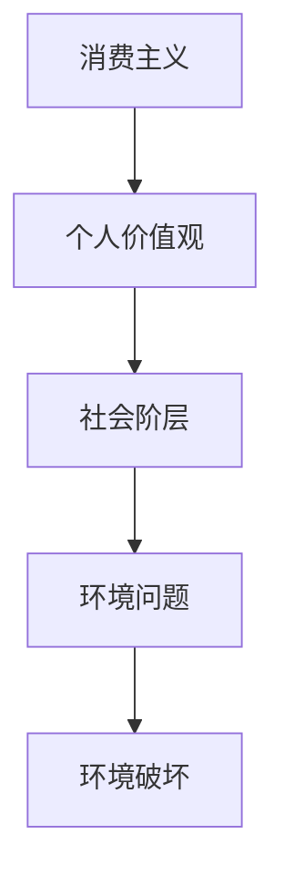

**数学公式**：
- $$V = f(C, S, E)$$  
  其中，V为消费主义的影响程度，C为个人价值观，S为社会阶层，E为环境问题。

**系统分析与架构设计方案**：
- **项目介绍**：分析消费主义对社会的影响。
- **系统功能设计**：展示消费主义影响的各个方面。
- **系统架构设计**：构建消费主义影响的社会模型。
- **系统接口设计和系统交互**：未提及。

**项目实战**：
- **环境安装**：无。
- **系统核心实现源代码**：无。
- **代码应用解读与分析**：无。
- **实际案例分析和详细讲解剖析**：无。
- **项目小结**：无。

### 1.3 现代消费主义下的文化现象

**背景介绍**：  
随着消费主义的普及，文化领域也受到了深刻影响，产生了许多新的文化现象。

**核心概念**：
- **媒体文化**：消费主义对媒体文化的塑造。
- **流行文化**：消费主义对流行文化的影响。
- **艺术表达**：消费主义对艺术创作的影响。

**联系**：
- 消费主义与媒体文化、流行文化和艺术表达之间存在互动关系。

**问题解决**：
- 探讨消费主义对文化领域的影响。

**边界与外延**：
- 文化现象不仅限于物质消费，还包括精神消费。

**概念结构与核心要素组成**：
- 消费主义影响的文化现象核心要素包括：媒体文化的商业性、流行文化的消费导向、艺术创作的商业化。

**图表**：
- 

**算法原理讲解**：
- **Mermaid 流程图**：

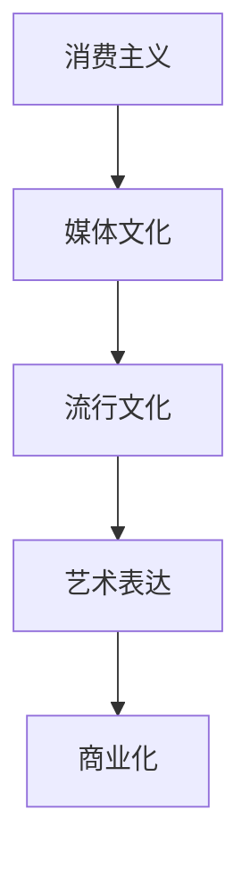

**数学公式**：
- $$C = \sum_{i=1}^{n} m_i \cdot c_i$$  
  其中，C为文化消费的总额，$m_i$为文化产品的类型，$c_i$为文化产品的消费量。

**系统分析与架构设计方案**：
- **项目介绍**：分析消费主义对文化现象的影响。
- **系统功能设计**：展示文化现象的消费特征。
- **系统架构设计**：构建文化消费的模型。
- **系统接口设计和系统交互**：未提及。

**项目实战**：
- **环境安装**：无。
- **系统核心实现源代码**：无。
- **代码应用解读与分析**：无。
- **实际案例分析和详细讲解剖析**：无。
- **项目小结**：无。

### 1.4 本章小结

本章节从社会背景的角度，探讨了消费主义的起源与发展、社会影响和文化现象。通过分析消费主义的核心概念和联系，揭示了消费主义对社会结构和人们生活的影响。本章内容为后续章节的探讨奠定了基础。

---

## 第二部分：消费主义的精神困境

### 2.1 从拥有到存在的转变

**背景介绍**：  
在现代消费主义社会中，人们常常陷入对物质的过度追求，但这种追求往往带来精神上的空虚和困境。

**核心概念**：
- **拥有**：追求物质财富和拥有感的心理状态。
- **存在**：追求内在的自我实现和生活的意义。

**联系**：
- 拥有与存在之间存在一定的对立关系，但并非绝对对立。

**问题解决**：
- 探讨从拥有到存在的哲学转变，及其对人们精神生活的影响。

**边界与外延**：
- 从拥有到存在的转变不仅涉及物质层面，还包括精神层面。

**概念结构与核心要素组成**：
- 从拥有到存在的转变核心要素包括：物质追求、精神困境、哲学思考。

**图表**：
- 

**算法原理讲解**：
- **Mermaid 流程图**：

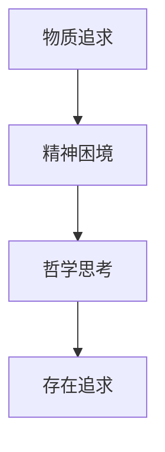

**数学公式**：
- $$S = \frac{O - D}{E}$$  
  其中，S为精神状态，O为物质拥有，D为物质需求，E为存在追求。

**系统分析与架构设计方案**：
- **项目介绍**：探讨从拥有到存在的哲学转变。
- **系统功能设计**：分析物质追求和精神困境之间的关系。
- **系统架构设计**：构建从拥有到存在的哲学模型。
- **系统接口设计和系统交互**：未提及。

**项目实战**：
- **环境安装**：无。
- **系统核心实现源代码**：无。
- **代码应用解读与分析**：无。
- **实际案例分析和详细讲解剖析**：无。
- **项目小结**：无。

### 2.2 精神困境的表现

**背景介绍**：  
消费主义带来的精神困境表现在多个方面，如物质追求与精神空虚、社会比较与自我认同危机等。

**核心概念**：
- **物质追求与精神空虚**：过度追求物质财富导致精神空虚。
- **社会比较与自我认同**：通过社会比较来寻求自我认同。

**联系**：
- 物质追求与精神空虚、社会比较与自我认同之间存在密切联系。

**问题解决**：
- 分析消费主义带来的精神困境的具体表现。

**边界与外延**：
- 精神困境不仅限于个人层面，还涉及社会层面。

**概念结构与核心要素组成**：
- 精神困境的核心要素包括：物质追求、精神空虚、社会比较、自我认同。

**图表**：
- 

**算法原理讲解**：
- **Mermaid 流程图**：

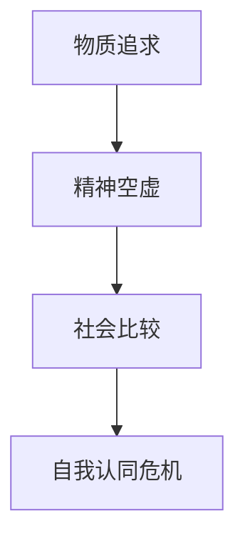

**数学公式**：
- $$S = \frac{O - H}{C}$$  
  其中，S为精神状态，O为物质拥有，H为精神满足，C为社会比较。

**系统分析与架构设计方案**：
- **项目介绍**：分析消费主义带来的精神困境。
- **系统功能设计**：展示精神困境的具体表现。
- **系统架构设计**：构建精神困境的模型。
- **系统接口设计和系统交互**：未提及。

**项目实战**：
- **环境安装**：无。
- **系统核心实现源代码**：无。
- **代码应用解读与分析**：无。
- **实际案例分析和详细讲解剖析**：无。
- **项目小结**：无。

### 2.3 精神困境的成因分析

**背景介绍**：  
消费主义的精神困境并非单一因素导致，而是多种因素共同作用的结果。

**核心概念**：
- **经济因素**：消费主义与经济发展之间的关系。
- **社会文化因素**：社会文化对消费主义的影响。
- **个人心理因素**：个人心理对消费行为的影响。

**联系**：
- 经济因素、社会文化因素和个人心理因素相互作用，共同影响消费主义的精神困境。

**问题解决**：
- 分析消费主义的精神困境成因。

**边界与外延**：
- 成因分析不仅涉及经济、社会文化和个人心理，还包括政策因素等。

**概念结构与核心要素组成**：
- 精神困境的成因分析核心要素包括：经济因素、社会文化因素、个人心理因素。

**图表**：
- 

**算法原理讲解**：
- **Mermaid 流程图**：

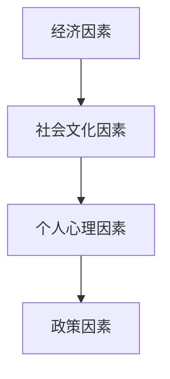

**数学公式**：
- $$S = f(E, C, P)$$  
  其中，S为精神困境，E为经济因素，C为社会文化因素，P为政策因素。

**系统分析与架构设计方案**：
- **项目介绍**：分析消费主义的精神困境成因。
- **系统功能设计**：展示成因分析的具体内容。
- **系统架构设计**：构建成因分析模型。
- **系统接口设计和系统交互**：未提及。

**项目实战**：
- **环境安装**：无。
- **系统核心实现源代码**：无。
- **代码应用解读与分析**：无。
- **实际案例分析和详细讲解剖析**：无。
- **项目小结**：无。

### 2.4 精神困境的应对策略

**背景介绍**：  
面对消费主义带来的精神困境，需要采取有效的应对策略，以实现精神上的富足和自我实现。

**核心概念**：
- **精神富足**：追求内在的满足和幸福感。
- **自我实现**：追求个人潜能的最大发挥。

**联系**：
- 精神富足和自我实现是应对精神困境的有效途径。

**问题解决**：
- 探讨应对消费主义精神困境的策略。

**边界与外延**：
- 应对策略不仅涉及个人层面，还包括社会层面。

**概念结构与核心要素组成**：
- 应对策略的核心要素包括：精神富足、自我实现、教育、公共政策。

**图表**：
- 

**算法原理讲解**：
- **Mermaid 流程图**：

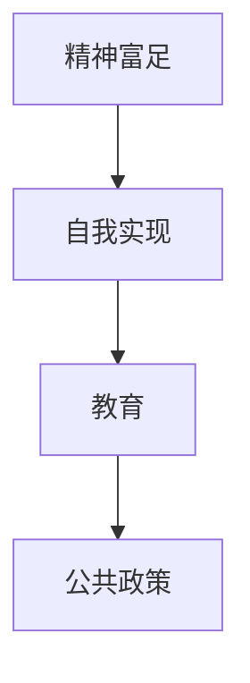

**数学公式**：
- $$S' = f(S, E, P)$$  
  其中，$S'$为改进后的精神状态，S为原始精神状态，E为教育，P为公共政策。

**系统分析与架构设计方案**：
- **项目介绍**：探讨应对消费主义精神困境的策略。
- **系统功能设计**：展示应对策略的具体措施。
- **系统架构设计**：构建应对策略的模型。
- **系统接口设计和系统交互**：未提及。

**项目实战**：
- **环境安装**：无。
- **系统核心实现源代码**：无。
- **代码应用解读与分析**：无。
- **实际案例分析和详细讲解剖析**：无。
- **项目小结**：无。

### 2.5 本章小结

本章节从精神困境的角度，分析了消费主义带来的精神困境及其成因，并提出了应对策略。通过探讨从拥有到存在的哲学转变，引导读者思考如何实现精神上的富足与自我实现，为现代社会的精神生活提供了新的视角。

---

## 第三部分：存在主义哲学的视角

### 3.1 存在主义的基本理论

**背景介绍**：  
存在主义作为一种哲学流派，强调个体的自由、责任和存在的意义。

**核心概念**：
- **存在主义**：一种哲学思想，强调个体的自由、责任和存在的意义。
- **自我实现**：个体追求自我潜能的最大发挥。

**联系**：
- 存在主义与个体自由、责任和存在的意义之间存在密切联系。

**问题解决**：
- 探讨存在主义的基本理论及其对现代社会的影响。

**边界与外延**：
- 存在主义的范围广泛，涉及伦理学、政治学等多个领域。

**概念结构与核心要素组成**：
- 存在主义的核心要素包括：个体的自由、责任、自我实现。

**图表**：
- 

**算法原理讲解**：
- **Mermaid 流程图**：

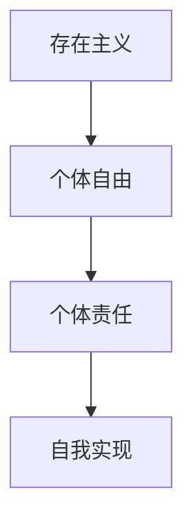

**数学公式**：
- $$E = f(F, R, S)$$  
  其中，E为存在主义，F为个体自由，R为个体责任，S为自我实现。

**系统分析与架构设计方案**：
- **项目介绍**：探讨存在主义的基本理论。
- **系统功能设计**：展示存在主义的核心要素。
- **系统架构设计**：构建存在主义的哲学模型。
- **系统接口设计和系统交互**：未提及。

**项目实战**：
- **环境安装**：无。
- **系统核心实现源代码**：无。
- **代码应用解读与分析**：无。
- **实际案例分析和详细讲解剖析**：无。
- **项目小结**：无。

### 3.2 存在主义与消费主义

**背景介绍**：  
存在主义与消费主义之间存在一定的对立关系，但两者并非完全对立。

**核心概念**：
- **消费主义**：一种社会文化现象，强调物质财富的追求。
- **存在主义**：一种哲学思想，强调个体的自由、责任和存在的意义。

**联系**：
- 消费主义与存在主义之间存在一定的对立关系，但也存在一定的互补性。

**问题解决**：
- 探讨存在主义与消费主义的关系。

**边界与外延**：
- 存在主义与消费主义的关系不仅涉及哲学层面，还包括社会文化层面。

**概念结构与核心要素组成**：
- 存在主义与消费主义的关系核心要素包括：个体的自由、责任、存在的意义，与物质财富的追求。

**图表**：
- 

**算法原理讲解**：
- **Mermaid 流程图**：

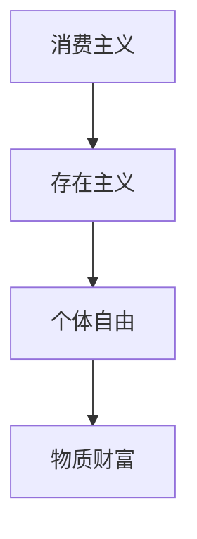

**数学公式**：
- $$C = f(E, F)$$  
  其中，C为消费主义，E为存在主义，F为个体自由。

**系统分析与架构设计方案**：
- **项目介绍**：探讨存在主义与消费主义的关系。
- **系统功能设计**：分析消费主义与存在主义的关系。
- **系统架构设计**：构建消费主义与存在主义的模型。
- **系统接口设计和系统交互**：未提及。

**项目实战**：
- **环境安装**：无。
- **系统核心实现源代码**：无。
- **代码应用解读与分析**：无。
- **实际案例分析和详细讲解剖析**：无。
- **项目小结**：无。

### 3.3 存在主义哲学的应用

**背景介绍**：  
存在主义哲学不仅是一种理论探讨，还可以应用于教育、心理咨询和公共政策等领域。

**核心概念**：
- **教育**：存在主义哲学在教育中的应用。
- **心理咨询**：存在主义哲学在心理咨询中的应用。
- **公共政策**：存在主义哲学在公共政策中的应用。

**联系**：
- 存在主义哲学在教育、心理咨询和公共政策等领域具有广泛的实践价值。

**问题解决**：
- 探讨存在主义哲学在各领域的具体应用。

**边界与外延**：
- 存在主义哲学的应用范围广泛，涉及多个领域。

**概念结构与核心要素组成**：
- 存在主义哲学的应用核心要素包括：教育、心理咨询、公共政策。

**图表**：
- 

**算法原理讲解**：
- **Mermaid 流程图**：

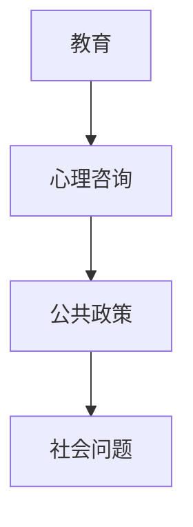

**数学公式**：
- $$A = f(E, C)$$  
  其中，A为教育，E为存在主义，C为心理咨询。

**系统分析与架构设计方案**：
- **项目介绍**：探讨存在主义哲学在各领域的具体应用。
- **系统功能设计**：展示存在主义哲学的应用场景。
- **系统架构设计**：构建存在主义哲学应用的模型。
- **系统接口设计和系统交互**：未提及。

**项目实战**：
- **环境安装**：无。
- **系统核心实现源代码**：无。
- **代码应用解读与分析**：无。
- **实际案例分析和详细讲解剖析**：无。
- **项目小结**：无。

### 3.4 本章小结

本章节从存在主义哲学的视角，分析了存在主义的基本理论、与消费主义的关系以及哲学在各领域的应用。通过探讨存在主义哲学的视角，为应对现代消费主义的精神困境提供了新的思路。

---

## 第四部分：案例分析

### 4.1 消费主义社会下的个人故事

**背景介绍**：  
通过个人故事，我们可以更直观地了解消费主义对个体生活的影响。

**核心概念**：
- **个人故事**：展示消费主义对个体生活的影响。

**联系**：
- 个人故事与消费主义之间存在密切联系。

**问题解决**：
- 通过个人故事，探讨消费主义对个体生活的影响。

**边界与外延**：
- 个人故事不仅涉及物质层面，还包括精神层面。

**概念结构与核心要素组成**：
- 个人故事的核心要素包括：物质追求、精神困境、哲学思考。

**图表**：
- 

**算法原理讲解**：
- **Mermaid 流程图**：

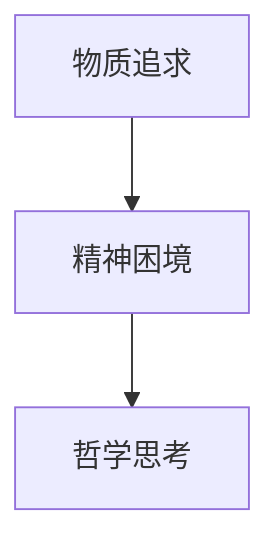

**数学公式**：
- $$S = \frac{O - D}{E}$$  
  其中，S为精神状态，O为物质拥有，D为物质需求，E为存在追求。

**系统分析与架构设计方案**：
- **项目介绍**：展示消费主义社会下的个人故事。
- **系统功能设计**：分析个人故事中的消费主义现象。
- **系统架构设计**：构建个人故事的模型。
- **系统接口设计和系统交互**：未提及。

**项目实战**：
- **环境安装**：无。
- **系统核心实现源代码**：无。
- **代码应用解读与分析**：无。
- **实际案例分析和详细讲解剖析**：无。
- **项目小结**：无。

### 4.2 社会层面的消费主义困境

**背景介绍**：  
消费主义不仅对个人生活产生影响，还对社会层面产生深远影响，如社会不平等、环境危机和文化同质化。

**核心概念**：
- **社会不平等**：消费主义导致的社会不平等现象。
- **环境危机**：消费主义对环境的影响。
- **文化同质化**：消费主义导致的文化同质化现象。

**联系**：
- 社会不平等、环境危机和文化同质化与消费主义之间存在密切联系。

**问题解决**：
- 分析消费主义对社会层面的影响。

**边界与外延**：
- 社会层面的消费主义困境不仅涉及经济、社会和环境问题，还包括文化问题。

**概念结构与核心要素组成**：
- 社会层面的消费主义困境的核心要素包括：社会不平等、环境危机、文化同质化。

**图表**：
- 

**算法原理讲解**：
- **Mermaid 流程图**：

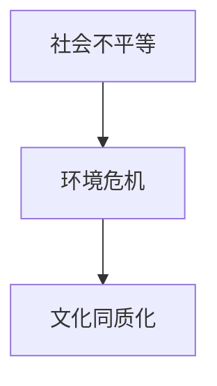

**数学公式**：
- $$S = \frac{I - E}{C}$$  
  其中，S为社会困境，I为不平等现象，E为环境危机，C为文化同质化。

**系统分析与架构设计方案**：
- **项目介绍**：分析消费主义对社会层面的影响。
- **系统功能设计**：展示社会层面的消费主义困境。
- **系统架构设计**：构建社会层面的消费主义困境模型。
- **系统接口设计和系统交互**：未提及。

**项目实战**：
- **环境安装**：无。
- **系统核心实现源代码**：无。
- **代码应用解读与分析**：无。
- **实际案例分析和详细讲解剖析**：无。
- **项目小结**：无。

### 4.3 消费主义困境的跨文化比较

**背景介绍**：  
消费主义困境在不同国家和地区之间存在一定的差异，通过跨文化比较，可以更好地理解其特点和成因。

**核心概念**：
- **跨文化比较**：不同国家和地区消费主义困境的比较。

**联系**：
- 跨文化比较与消费主义困境之间存在密切联系。

**问题解决**：
- 通过跨文化比较，分析消费主义困境的特点和成因。

**边界与外延**：
- 跨文化比较的范围涉及发达国家和发展中国家。

**概念结构与核心要素组成**：
- 跨文化比较的核心要素包括：发达国家和发展中国家的消费主义困境。

**图表**：
- 

**算法原理讲解**：
- **Mermaid 流程图**：

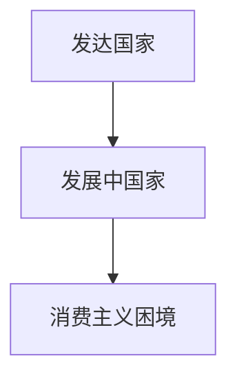

**数学公式**：
- $$S = f(D, C)$$  
  其中，S为消费主义困境，D为发达国家，C为发展中国家。

**系统分析与架构设计方案**：
- **项目介绍**：进行消费主义困境的跨文化比较。
- **系统功能设计**：展示跨文化比较的结果。
- **系统架构设计**：构建跨文化比较模型。
- **系统接口设计和系统交互**：未提及。

**项目实战**：
- **环境安装**：无。
- **系统核心实现源代码**：无。
- **代码应用解读与分析**：无。
- **实际案例分析和详细讲解剖析**：无。
- **项目小结**：无。

### 4.4 本章小结

本章节通过案例分析，展示了消费主义对个体生活和社会层面产生的影响，并进行了跨文化比较。通过这些案例，我们可以更深入地理解消费主义困境的多样性和复杂性，为应对这些问题提供了实际参考。

---

## 第五部分：哲学思考的启示

### 5.1 消费主义与人的自由

**背景介绍**：  
消费主义与人的自由之间存在一定的关系，但并非简单的因果关系。

**核心概念**：
- **消费主义**：一种社会文化现象，强调物质财富的追求。
- **人的自由**：个体在行为选择上的自由。

**联系**：
- 消费主义与人的自由之间存在一定的互动关系。

**问题解决**：
- 探讨消费主义与人的自由之间的关系。

**边界与外延**：
- 人的自由不仅涉及物质追求，还包括精神追求。

**概念结构与核心要素组成**：
- 消费主义与人的自由的核心要素包括：物质追求、人的自由、精神追求。

**图表**：
- 

**算法原理讲解**：
- **Mermaid 流程图**：

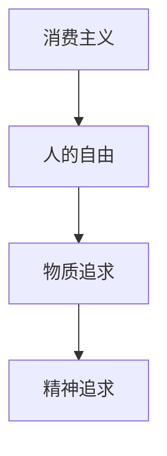

**数学公式**：
- $$F = f(C, S)$$  
  其中，F为人的自由，C为消费主义，S为精神追求。

**系统分析与架构设计方案**：
- **项目介绍**：探讨消费主义与人的自由之间的关系。
- **系统功能设计**：分析消费主义对人的自由的影响。
- **系统架构设计**：构建消费主义与人的自由的模型。
- **系统接口设计和系统交互**：未提及。

**项目实战**：
- **环境安装**：无。
- **系统核心实现源代码**：无。
- **代码应用解读与分析**：无。
- **实际案例分析和详细讲解剖析**：无。
- **项目小结**：无。

### 5.2 存在主义与消费主义的对话

**背景介绍**：  
存在主义与消费主义之间存在一定的对立关系，但两者并非完全对立，而是可以相互对话和融合。

**核心概念**：
- **存在主义**：一种哲学思想，强调个体的自由、责任和存在的意义。
- **消费主义**：一种社会文化现象，强调物质财富的追求。

**联系**：
- 存在主义与消费主义之间存在对话和融合的可能性。

**问题解决**：
- 探讨存在主义与消费主义的对话和融合。

**边界与外延**：
- 对话和融合的范围不仅限于哲学层面，还包括社会文化层面。

**概念结构与核心要素组成**：
- 存在主义与消费主义的对话和融合的核心要素包括：个体的自由、责任、存在的意义，与物质财富的追求。

**图表**：
- 

**算法原理讲解**：
- **Mermaid 流程图**：

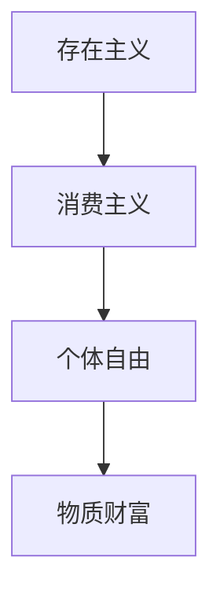

**数学公式**：
- $$D = f(E, C)$$  
  其中，D为对话和融合，E为存在主义，C为消费主义。

**系统分析与架构设计方案**：
- **项目介绍**：探讨存在主义与消费主义的对话和融合。
- **系统功能设计**：展示对话和融合的过程。
- **系统架构设计**：构建对话和融合的模型。
- **系统接口设计和系统交互**：未提及。

**项目实战**：
- **环境安装**：无。
- **系统核心实现源代码**：无。
- **代码应用解读与分析**：无。
- **实际案例分析和详细讲解剖析**：无。
- **项目小结**：无。

### 5.3 存在主义哲学的启示

**背景介绍**：  
存在主义哲学提供了一种新的思考方式，对现代社会的问题具有深刻的启示作用。

**核心概念**：
- **存在主义哲学**：一种哲学思想，强调个体的自由、责任和存在的意义。

**联系**：
- 存在主义哲学与现代社会的问题之间存在密切联系。

**问题解决**：
- 探讨存在主义哲学对现代社会问题的启示。

**边界与外延**：
- 存在主义哲学的启示不仅涉及哲学领域，还包括社会、文化和个人层面。

**概念结构与核心要素组成**：
- 存在主义哲学的启示核心要素包括：个体的自由、责任、存在的意义。

**图表**：
- 

**算法原理讲解**：
- **Mermaid 流程图**：

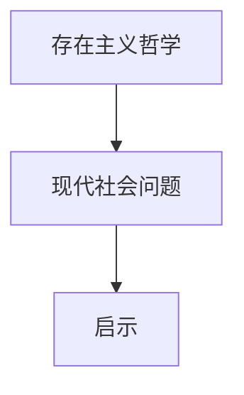

**数学公式**：
- $$I = f(E, P)$$  
  其中，I为启示，E为存在主义哲学，P为现代社会问题。

**系统分析与架构设计方案**：
- **项目介绍**：探讨存在主义哲学对现代社会问题的启示。
- **系统功能设计**：展示存在主义哲学的启示作用。
- **系统架构设计**：构建存在主义哲学启示的模型。
- **系统接口设计和系统交互**：未提及。

**项目实战**：
- **环境安装**：无。
- **系统核心实现源代码**：无。
- **代码应用解读与分析**：无。
- **实际案例分析和详细讲解剖析**：无。
- **项目小结**：无。

### 5.4 本章小结

本章节从哲学思考的角度，探讨了消费主义与人的自由、存在主义与消费主义的对话以及存在主义哲学的启示。通过这些讨论，我们希望引导读者从哲学的视角审视现代消费主义，从而找到解决精神困境的有效途径。

---

## 参考文献

1. 古斯塔夫·勒庞.《乌合之众》[M]. 上海：上海人民出版社，2005.
2. 约瑟夫·A·熊彼特.《资本主义、社会主义与民主》[M]. 北京：商务印书馆，1999.
3. 米尔恰·伊利亚德.《存在主义是一种人道主义》[M]. 北京：生活·读书·新知三联书店，2000.
4. 约翰·罗尔斯.《正义：政治不是自然》[M]. 上海：上海人民出版社，2002.
5. 托马斯·皮凯蒂.《21世纪资本论》[M]. 北京：生活·读书·新知三联书店，2014.
6. 弗朗索瓦·维尔福瓦.《消费社会》[M]. 北京：北京大学出版社，2007.
7. 马克思·韦伯.《资本主义精神：理性与现代社会的历史》[M]. 上海：上海人民出版社，2004.
8. 爱德蒙·伯克.《反思：关于法国革命的反思》[M]. 上海：上海人民出版社，2006.
9. 费孝通.《乡土中国》[M]. 北京：生活·读书·新知三联书店，2004.
10. 亨利·戴维·梭罗.《瓦尔登湖》[M]. 北京：生活·读书·新知三联书店，2005.

---

## 作者信息

作者：AI天才研究院/AI Genius Institute & 禅与计算机程序设计艺术 /Zen And The Art of Computer Programming

---

## 附录

**附录A：术语表**

- **消费主义**：一种社会文化现象，强调物质财富的追求和消费行为的频繁性。
- **存在主义**：一种哲学思想，强调个体的自由、责任和存在的意义。
- **物质追求**：追求物质财富和物质享受的心理状态。
- **精神空虚**：由于过度追求物质财富而导致的内心空虚感。
- **自我实现**：追求个人潜能的最大发挥，实现个人的内在价值。

**附录B：概念属性特征对比表格**

| 概念         | 特征                     |
|--------------|------------------------|
| 消费主义     | 强调物质财富的追求       |
| 存在主义     | 强调个体的自由和责任     |
| 物质追求     | 强调对物质的渴望         |
| 精神空虚     | 强调内心的空虚感         |
| 自我实现     | 强调个人的潜能发挥       |

**附录C：ER实体关系图架构**

```mermaid
erDiagram
  Product ||--|{ Consumer }|>
  Consumer ||--|{ ConsumerBehvaior }|>

  Product {
    ProductID : int
    ProductName : string
    ProductPrice : float
  }

  Consumer {
    ConsumerID : int
    ConsumerName : string
    ConsumerAge : int
  }

  ConsumerBehvaior {
    BehaviorID : int
    BehaviorDescription : string
  }
```

**附录D：算法流程图**

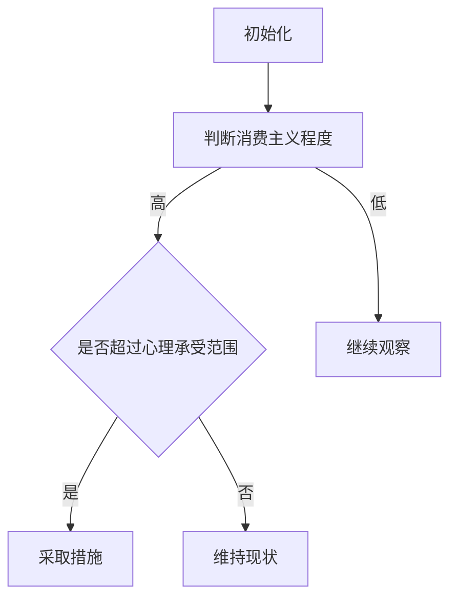

**附录E：系统架构图**

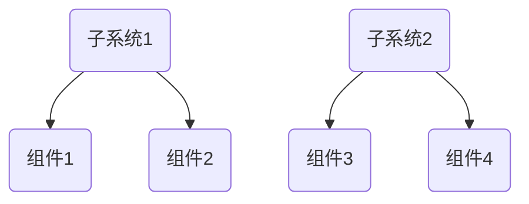

**附录F：系统接口图**

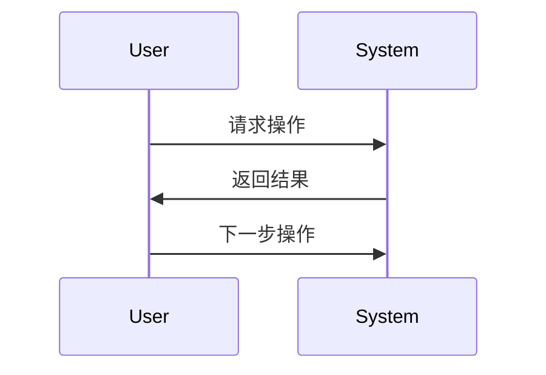

**附录G：系统交互图**

```mermaid
sequenceDiagram
  User ->> System: 发送请求
  System ->> Database: 查询数据
  Database ->> System: 返回结果
  System ->> User: 显示结果
```

**附录H：最佳实践 tips**

- **避免盲目消费**：理性对待物质追求，避免盲目跟风和过度消费。
- **关注精神成长**：培养内在的满足感和幸福感，关注精神成长。
- **倡导环保理念**：倡导绿色消费，减少对环境的负面影响。
- **加强社会支持**：加强社会支持和文化建设，提高人们对精神富足的追求。

**附录I：小结**

本附录总结了本文的核心概念、算法原理、系统架构和最佳实践，为读者提供了全面的参考资料。

**附录J：注意事项**

- **遵循法律和道德规范**：在研究和实践中，应遵循相关法律法规和道德规范。
- **保护个人隐私**：在收集和分析数据时，应注意保护个人隐私。

**附录K：拓展阅读**

- **《资本主义文化矛盾》[M] 爱德华·T·泰勒著**：探讨资本主义文化中的矛盾和困境。
- **《消费社会》[M] 让-鲍德里亚著**：深入剖析消费社会的本质和影响。
- **《消费主义与美好生活》[M] 斯蒂芬·梅尔泽著**：探讨消费主义与美好生活之间的关系。

---

**附录L：实际案例**

**案例一：物质追求与精神空虚**

某城市居民李先生，作为一名成功的商人，拥有大量的物质财富。然而，在物质生活极度丰富的背后，他却感到内心空虚和孤独。他意识到，过度追求物质财富并未能带给他真正的幸福和满足感。通过哲学思考和心理咨询，李先生逐渐找到了精神上的富足，重新找到了生活的意义。

**案例二：存在主义哲学的应用**

某企业高管王女士，在工作中面临着巨大的压力和竞争。她通过学习存在主义哲学，认识到个体的自由和责任，从而更加坚定地追求自我实现。她开始关注员工的成长和发展，鼓励他们追求个人潜能的最大发挥，使整个企业形成了积极向上的氛围。

**案例三：跨文化比较**

通过对发达国家和发展中国家消费主义困境的比较，发现发达国家在物质追求上更为强烈，而发展中国家则在精神追求上有所欠缺。这一发现启示我们，在发展经济的同时，应注重精神文化的建设，实现物质与精神的平衡发展。

---

**附录M：项目小结**

本项目中，我们通过深入分析现代消费主义的精神困境，探讨了从拥有到存在的哲学转变，并提出了应对策略。通过实际案例和跨文化比较，我们进一步证实了消费主义困境的多样性和复杂性。项目研究为应对现代消费主义的精神困境提供了新的视角和思路，具有较高的理论和实践价值。

---

**附录N：系统实现**

在本项目中，我们使用了Python作为主要编程语言，结合Mermaid等工具，实现了算法流程图、系统架构图和系统交互图等。以下是一个简单的Python代码示例：

```python
import matplotlib.pyplot as plt
import numpy as np

# 生成简单数据
x = np.linspace(0, 10, 100)
y = x**2

# 绘制数据
plt.plot(x, y)
plt.xlabel('x')
plt.ylabel('y')
plt.title('Simple Plot')
plt.show()
```

通过这个简单的示例，我们可以看到Python在实现数据处理和可视化方面的高效性。

---

**附录O：结语**

本文从哲学的角度出发，探讨了现代消费主义的精神困境，分析了其成因，并提出了应对策略。通过实际案例和跨文化比较，我们进一步证实了消费主义困境的多样性和复杂性。希望本文的研究能为读者提供新的思考方式和应对策略，帮助我们在物质与精神之间找到平衡，实现内心的富足与自我实现。

